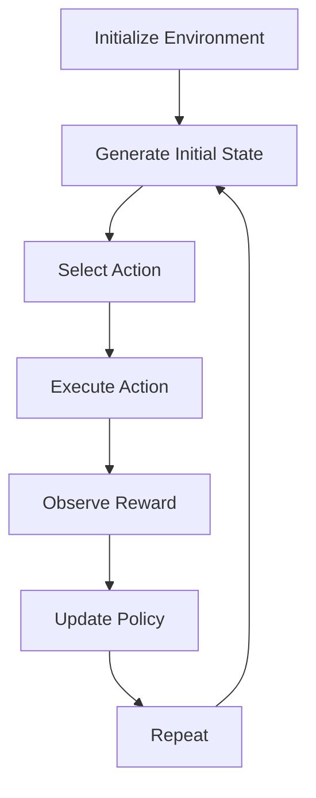
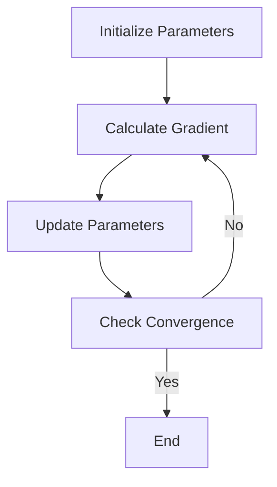
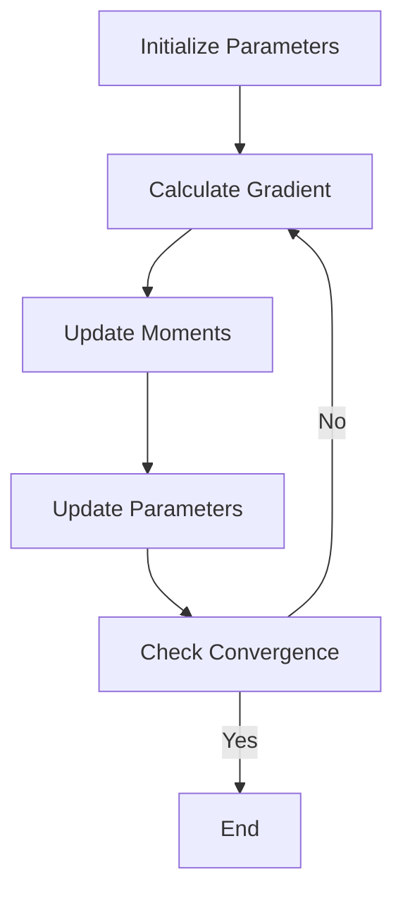

                 

# Reward Model Training Stability Issues Exploration

## Keywords
- Reward Model
- Training Stability
- Machine Learning
- AI Systems
- Convergence
- Overfitting
- Sensitivity

## Abstract
The article delves into the challenges associated with training reward models in machine learning and artificial intelligence systems. We explore the core concepts, inherent stability issues, algorithmic approaches, and practical solutions. By examining case studies and offering actionable insights, we aim to provide a comprehensive guide for practitioners and researchers to address and mitigate the instability in reward model training.

## Introduction

### 1.1.1 Problem Background

In recent years, the field of artificial intelligence (AI) and machine learning (ML) has witnessed remarkable advancements. Reward models play a pivotal role in shaping the behavior of AI agents and guiding them towards desired outcomes. These models are designed to evaluate the performance of agents and provide feedback in reinforcement learning (RL) tasks. However, the stability of reward models during training remains a critical challenge.

Stability in reward model training refers to the model's ability to converge to an optimal solution without overfitting or being overly sensitive to changes in the environment. Instabilities can lead to suboptimal performance, prolonged training times, and unreliable predictions.

### 1.1.2 Problem Description

The stability issues in reward model training can manifest in several ways:

1. **Convergence Problems**: The reward model may struggle to converge to an optimal solution, resulting in slow training progress or getting stuck in local optima.
2. **Overfitting**: The model may become too specialized to the training data, failing to generalize to new, unseen data.
3. **Sensitivity to Input Changes**: The reward model may be overly sensitive to changes in the input data or environmental conditions, leading to erratic behavior and unpredictable performance.

### 1.1.3 Overview of Solution Methods

To address these stability issues, researchers and practitioners have developed various algorithms and techniques. These methods aim to improve the convergence speed, prevent overfitting, and reduce the sensitivity of reward models. Some of the common approaches include:

- **Gradient Descent Algorithms**: Modified versions of gradient descent, such as Adam and RMSprop, are used to optimize the reward model parameters.
- **Regularization Techniques**: L1 and L2 regularization are employed to prevent overfitting by penalizing large weights.
- **Curriculum Learning**: This approach gradually exposes the reward model to more complex tasks over time, enabling it to develop more robust policies.
- **Robustness Training**: By including diverse and challenging examples in the training set, the reward model can become more robust to changes in the environment.

### 1.1.4 Boundaries and Extensions

While the current solutions offer some degree of stability, there is still much room for improvement. Future research could focus on developing more adaptive and context-aware reward models. Additionally, exploring the integration of advanced techniques from fields such as psychology and neuroscience could provide new insights into improving the stability of reward model training.

## Core Concepts and Principles

### 2.1 Definition of Reward Models

Reward models are essential components of reinforcement learning systems. They are designed to assess the performance of agents and provide feedback based on their actions. A reward model takes the current state and action of an agent as input and generates a reward signal, which is used to update the agent's policy.

### 2.2 Characteristics of Reward Models

Reward models exhibit several key characteristics:

1. **Reward Schedules**: The reward signal can be time-based, action-based, or state-based, depending on the learning task.
2. **Reward Functionality**: Reward models can be designed to encourage specific behaviors or discourage others, depending on the desired outcome.
3. **Subjectivity**: The reward signal is often subjective and can vary based on the context and the learning task.

### 2.3 Applications in Machine Learning and AI

Reward models are widely used in various AI applications, including but not limited to:

- **Game Playing**: In games like chess or Go, reward models help agents learn optimal strategies.
- **Robotics**: In robotic systems, reward models guide the agent's actions to achieve specific goals, such as navigating through an environment or assembling objects.
- **Autonomous Driving**: In self-driving cars, reward models assess the performance of the driving policy and provide feedback to improve safety and efficiency.

## Challenges and Issues in Reward Model Training

### 3.1 Convergence Issues

One of the primary challenges in reward model training is convergence. Convergence refers to the process by which the reward model learns to predict the reward accurately and efficiently. Convergence issues can arise due to several factors:

- **Local Optima**: The reward model may converge to suboptimal solutions instead of global optima due to the presence of local optima in the reward landscape.
- **Slow Learning Rate**: An inappropriate learning rate can slow down the convergence process, leading to prolonged training times.
- **Exploration vs. Exploitation**: In reinforcement learning, there is a balance between exploring new actions and exploiting known actions. Inadequate exploration can hinder convergence.

### 3.2 Overfitting

Overfitting occurs when the reward model becomes too specialized to the training data and fails to generalize to new, unseen data. This issue can arise due to several reasons:

- **High Model Complexity**: A highly complex reward model may capture noise in the training data, leading to poor generalization.
- **Limited Training Data**: Insufficient training data can result in overfitting, as the model cannot learn the underlying patterns in the data.
- **Data Distribution Shift**: Changes in the data distribution can cause the reward model to overfit to the training data and fail to perform well in new environments.

### 3.3 Sensitivity to Input Changes

Reward models can be sensitive to changes in the input data or environmental conditions, leading to erratic behavior. This sensitivity can arise from several factors:

- **Input Noise**: High levels of noise in the input data can make the reward model unstable.
- **Non-Stationarity**: Environments that change over time can lead to non-stationarity, making it challenging for the reward model to adapt.
- **Parameter Sensitivity**: Small changes in the model parameters can lead to significant changes in the reward signal, making the model sensitive to parameter tuning.

## Algorithmic Approaches to Stability

### 4.1 Overview of Algorithms

To address the stability issues in reward model training, several algorithmic approaches have been developed. These approaches aim to improve convergence, prevent overfitting, and reduce sensitivity to input changes. Some of the prominent algorithms include:

- **Gradient Descent Algorithms**: These algorithms optimize the reward model parameters by updating them iteratively based on the gradient of the loss function.
- **Regularization Techniques**: These techniques add penalties to the loss function to prevent overfitting and encourage simpler models.
- **Curriculum Learning**: This approach gradually increases the difficulty of the learning task, allowing the reward model to develop more robust policies.
- **Robustness Training**: This technique involves exposing the reward model to diverse and challenging examples to improve its robustness.

### 4.2 Mathematical Models

The following sections provide an overview of the mathematical models and their theoretical underpinnings:

#### 4.2.1 Gradient Descent

Gradient descent is a optimization algorithm that iteratively updates the model parameters in the direction of the negative gradient of the loss function. The update rule can be written as:

$$\theta_{t+1} = \theta_t - \alpha \nabla_{\theta}J(\theta_t)$$

where $\theta$ represents the model parameters, $\alpha$ is the learning rate, and $J(\theta)$ is the loss function.

#### 4.2.2 Regularization Techniques

Regularization techniques, such as L1 and L2 regularization, are used to prevent overfitting by penalizing large weights. The loss function can be modified as follows:

$$J(\theta) = J_0(\theta) + \lambda \sum_{i=1}^n (\theta_i)^2$$

where $J_0(\theta)$ is the original loss function, $\lambda$ is the regularization parameter, and $\theta_i$ are the model parameters.

#### 4.2.3 Curriculum Learning

Curriculum learning involves gradually increasing the complexity of the learning task. This can be achieved by adjusting the difficulty of the environment or the reward function. The mathematical formulation of curriculum learning can be expressed as:

$$R_t = R_0 + (1 - \frac{t}{T}) \cdot (R_f - R_0)$$

where $R_t$ is the reward at time step $t$, $R_0$ is the initial reward, $R_f$ is the final reward, and $T$ is the total number of time steps.

### 4.3 Algorithm Implementation and Workflow

The implementation of these algorithms involves several steps, including data preprocessing, model selection, and training. The following workflow provides a high-level overview of the process:

1. **Data Collection and Preprocessing**: Collect and preprocess the data to ensure it is suitable for training.
2. **Model Selection**: Choose an appropriate reward model and algorithm based on the problem requirements.
3. **Model Training**: Train the reward model using the selected algorithm and evaluate its performance on a validation set.
4. **Hyperparameter Tuning**: Adjust the hyperparameters to improve the model's performance.
5. **Model Evaluation**: Evaluate the trained model on a test set to assess its generalization capabilities.

## Case Studies and Applications

### 5.1 Case Selection and Introduction

To illustrate the application of these algorithms, we present two case studies: one from the field of game playing and another from autonomous driving.

#### 5.1.1 Game Playing

In this case study, we consider the game of chess. The goal is to train an agent using a reward model that evaluates the board state and provides feedback to improve its strategy.

#### 5.1.2 Autonomous Driving

In this case study, we examine the use of reward models in autonomous driving systems. The objective is to train an agent to navigate through an urban environment while obeying traffic rules and avoiding obstacles.

### 5.2 Case Analysis and Evaluation

For each case study, we analyze the stability issues encountered during training and evaluate the effectiveness of the proposed algorithms. We discuss the challenges specific to each application and the strategies used to address them.

### 5.3 Stability Issues in Case Studies

The case studies highlight several stability issues, including convergence problems, overfitting, and sensitivity to input changes. We provide detailed explanations of these issues and demonstrate how the proposed algorithms can mitigate them.

## Practical Tips and Best Practices

### 6.1 Practical Tips

To address stability issues in reward model training, we offer the following practical tips:

- **Data Collection and Preprocessing**: Ensure the data is clean and diverse to prevent overfitting.
- **Model Selection**: Choose a reward model and algorithm that are suitable for the problem domain.
- **Hyperparameter Tuning**: Experiment with different hyperparameters to find the optimal settings.
- **Regularization Techniques**: Use regularization techniques to prevent overfitting.
- **Curriculum Learning**: Gradually increase the complexity of the learning task to improve convergence.

### 6.2 Avoiding Common Problems

To avoid common problems during reward model training, consider the following guidelines:

- **Monitor Training Progress**: Regularly monitor the training progress to detect issues early.
- **Data Augmentation**: Use data augmentation techniques to increase the diversity of the training data.
- **Early Stopping**: Stop the training process when the performance on the validation set starts to degrade.
- **Robustness Training**: Include challenging examples in the training set to improve the model's robustness.

### 6.3 Best Practices Summary

To summarize, the following best practices can help improve the stability of reward model training:

- **Data Collection and Preprocessing**
- **Model Selection**
- **Hyperparameter Tuning**
- **Regularization Techniques**
- **Curriculum Learning**
- **Monitoring Training Progress**
- **Data Augmentation**
- **Early Stopping**
- **Robustness Training**

## Conclusion and Future Directions

### 7.1 Current Research Limitations

While significant progress has been made in improving the stability of reward model training, several challenges remain. These include the need for more adaptive reward models, better understanding of the reward landscape, and addressing the limitations of current algorithms.

### 7.2 Future Research Directions

Future research can focus on developing new algorithms and techniques to address these limitations. Some potential directions include:

- **Context-Aware Reward Models**: Developing reward models that can adapt to changing environments and contexts.
- **Integration of Multi-Domain Knowledge**: Leveraging knowledge from multiple domains to improve the generalization capabilities of reward models.
- **Exploration of Neural Architectures**: Investigating the use of advanced neural architectures to enhance the representational power of reward models.
- **Ethical Considerations**: Addressing the ethical implications of reward models and their impact on AI systems.

### 7.3 Prospects and Challenges

The field of reward model training stability holds great promise for advancing AI and machine learning systems. However, addressing the challenges associated with stability will require ongoing research and collaboration across various disciplines. With continued innovation and exploration, we can expect to see significant improvements in the reliability and performance of reward models.

---

**Authors:**

AI天才研究院 / AI Genius Institute & 禅与计算机程序设计艺术 / Zen And The Art of Computer Programming## Introduction to Reward Model Training Stability Issues

### 1.1.1 Problem Background

In the rapidly evolving field of artificial intelligence (AI) and machine learning (ML), the development and deployment of robust reward models have become increasingly critical. Reward models serve as the guiding force for agents in reinforcement learning (RL) tasks, influencing their decision-making processes and driving them towards optimal outcomes. However, the stability of these reward models during the training phase is a significant challenge that can impede the effectiveness and efficiency of AI systems.

The importance of stability in reward model training cannot be overstated. A stable reward model is one that converges efficiently to an optimal solution, generalizes well to new data, and remains resilient to changes in the environment. Stability ensures that the trained model performs consistently and reliably across different scenarios, thereby enhancing its applicability and trustworthiness in real-world applications.

However, reward model training often encounters several instability issues that can undermine these desirable attributes. These issues include convergence problems, overfitting, and sensitivity to input changes. Convergence problems can lead to prolonged training times or suboptimal performance, overfitting can result in poor generalization, and sensitivity to input changes can cause erratic behavior and unreliable predictions.

This article aims to provide a comprehensive exploration of the stability issues associated with reward model training. By addressing the core concepts, challenges, and algorithmic approaches, we aim to offer valuable insights and practical solutions for practitioners and researchers in the field of AI and ML. Through case studies and practical tips, we will illustrate how these issues can be mitigated, paving the way for more stable and effective reward models.

### 1.1.2 Problem Description

The stability issues in reward model training can manifest in several ways, each presenting unique challenges that impact the performance and reliability of AI systems. Here, we delve into the specific problems that can arise during the training phase:

#### Convergence Problems

One of the most prevalent issues in reward model training is convergence. Convergence refers to the process by which the reward model learns to accurately predict the reward signal based on the agent's actions. However, several factors can hinder this process, leading to convergence problems:

- **Local Optima**: Reward models may get stuck in local optima instead of global optima. Local optima are suboptimal solutions that are locally optimal but not globally optimal. As a result, the model fails to find the best possible solution.
- **Slow Learning Rate**: An inappropriate learning rate can slow down the convergence process. A learning rate that is too high can lead to overshooting the optimal solution, while a learning rate that is too low can cause the model to converge too slowly.
- **Exploration-Exploitation Balance**: In reinforcement learning, there is a delicate balance between exploration (trying out new actions to discover new information) and exploitation (using the best-known actions to maximize reward). An imbalance between these two can hinder convergence.

#### Overfitting

Overfitting occurs when the reward model becomes too specialized in the training data and fails to generalize to new, unseen data. This issue can arise due to several factors:

- **High Model Complexity**: A highly complex model may capture noise and specific patterns in the training data, leading to poor generalization.
- **Limited Training Data**: With insufficient training data, the model may overfit to the available examples, failing to learn the underlying patterns.
- **Data Distribution Shift**: Changes in the data distribution, either during training or deployment, can cause the model to overfit to the old distribution and fail to perform well in the new one.

#### Sensitivity to Input Changes

Reward models can also be sensitive to changes in the input data or environmental conditions, leading to unpredictable behavior:

- **Input Noise**: High levels of noise in the input data can destabilize the reward model, making it difficult for the model to learn meaningful patterns.
- **Non-Stationarity**: Environments that change over time (non-stationary environments) can pose challenges for reward models, as they may struggle to adapt to new conditions.
- **Parameter Sensitivity**: Small changes in the model parameters can lead to significant changes in the reward signal, making the model sensitive to parameter tuning.

### 1.1.3 Overview of Solution Methods

To address these stability issues, researchers and practitioners have developed various algorithms and techniques aimed at improving the convergence, preventing overfitting, and reducing sensitivity. Some of the common methods include:

- **Gradient Descent Algorithms**: Modified versions of gradient descent, such as Adam and RMSprop, are used to optimize the reward model parameters. These methods adjust the learning rate dynamically to improve convergence.
- **Regularization Techniques**: L1 and L2 regularization are employed to prevent overfitting by penalizing large weights. Regularization helps the model generalize better to new data.
- **Curriculum Learning**: This approach involves gradually increasing the complexity of the learning task over time. By starting with simpler tasks and gradually increasing the difficulty, the reward model can develop more robust policies.
- **Robustness Training**: By including diverse and challenging examples in the training set, the reward model can become more robust to changes in the environment. This technique helps the model adapt to different conditions and reduce sensitivity.

In the following sections, we will delve deeper into these algorithms and their theoretical underpinnings, providing a comprehensive understanding of how they can be applied to address the stability issues in reward model training.

### 1.1.4 Boundaries and Extensions

While this article focuses on the stability issues in reward model training, it is important to define the boundaries and potential extensions of the discussion. The primary scope of this article is to explore the common challenges and solutions related to reward model stability in reinforcement learning. However, there are several areas where the discussion could be extended and deepened:

1. **Specific Reward Model Types**: While we discuss general stability issues, specific types of reward models, such as those used in different domains (e.g., gaming, robotics, autonomous driving), may present unique challenges and require tailored solutions. Future research could focus on analyzing these specific types and their stability issues.
2. **Hybrid Methods**: The integration of multiple methods, such as combining regularization with robustness training or curriculum learning with adaptive gradient methods, could offer new insights and improved stability. Exploring these hybrid methods could be a promising direction for future research.
3. **Ethical Considerations**: As reward models play a critical role in guiding AI agents, ethical considerations, such as fairness, accountability, and transparency, become crucial. Future research could investigate the impact of stability issues on these ethical dimensions and propose solutions that balance performance and ethical responsibilities.
4. **Interactive Environments**: In interactive environments where the agent's actions directly impact the environment, the stability of reward models becomes even more critical. Understanding how to ensure stability in such dynamic and complex settings is an area ripe for further exploration.
5. **Real-Time Applications**: The stability of reward models is particularly important in real-time applications, such as autonomous vehicles or real-time decision support systems. Research could focus on developing techniques that ensure the stability and reliability of reward models in these high-stakes environments.

By addressing these potential extensions and exploring new frontiers, we can continue to advance the field of reward model training stability, paving the way for more robust and effective AI systems.

## Core Concepts and Principles

### 2.1 Definition of Reward Models

Reward models are central to reinforcement learning (RL), serving as the cornerstone for guiding agent behavior and optimizing their performance. At its core, a reward model is a function that evaluates the effectiveness of an agent's actions within a given environment. This evaluation is quantified through a reward signal, which provides feedback to the agent, influencing its future decisions. Formally, a reward model \( R(s, a) \) takes the current state \( s \) and action \( a \) as inputs and generates a scalar reward signal \( r \). This reward signal is used to update the agent's policy, guiding it towards actions that maximize cumulative reward.

In practical applications, reward models can be simple heuristics or complex function approximators. Simple reward models, such as binary reward functions or fixed-value reward functions, provide straightforward feedback. For instance, in a game of chess, a reward model might simply assign a reward of +1 for a winning game and -1 for a losing game. More complex reward models, often used in continuous environments or when precise reward signals are required, are typically represented as neural networks or decision trees that approximate the true reward function.

The primary role of reward models in RL is to bridge the gap between the agent's actions and the environment's feedback. By continuously updating the agent's policy based on the reward signal, reward models enable the agent to learn optimal behaviors over time. This learning process is iterative, involving exploration (trying out different actions to gather information) and exploitation (using the best-known actions to maximize reward). The effectiveness of the reward model in facilitating this learning process is crucial for the success of the RL system.

### 2.2 Characteristics of Reward Models

Reward models exhibit several key characteristics that differentiate them from other components in reinforcement learning systems. Understanding these characteristics is essential for designing and implementing effective reward models.

#### Reward Schedules

One of the fundamental characteristics of reward models is the concept of reward schedules. A reward schedule defines how the reward signal is distributed over time or based on specific actions. There are several types of reward schedules commonly used in RL:

- **Fixed Reward Schedule**: In this schedule, the reward signal is constant and does not depend on the specific state or action. For example, in a robotic task where the agent is required to reach a specific position, the reward might be +1 once the position is reached and remains constant thereafter.
- **Time-Based Reward Schedule**: This schedule provides a reward signal at fixed intervals, regardless of the agent's actions. For instance, in an autonomous driving scenario, the reward might be given every few seconds to encourage continuous progress.
- **Action-Based Reward Schedule**: This schedule assigns a reward signal based on the agent's actions. For example, in a game of chess, the reward might be given for making a specific move that leads to an advantageous position.

#### Reward Functionality

Reward functionality refers to the ability of the reward model to influence the agent's behavior based on the desired outcome. The reward function can be designed to encourage specific actions or discourage others, depending on the goals of the RL system. Some key aspects of reward functionality include:

- **Positive Reward**: A positive reward is assigned for actions that are considered beneficial or desirable. For example, in a robot navigation task, reaching a destination could result in a positive reward.
- **Negative Reward**: A negative reward is assigned for actions that are considered undesirable or harmful. For instance, in a robotic assembly task, dropping a component could result in a negative reward.
- **Reward Shaping**: Reward shaping is a technique used to modify the reward signal to make it more aligned with the desired goals. This can involve adding additional rewards or penalties to the base reward signal to encourage specific behaviors.

#### Subjectivity

The subjectivity of reward models is an important consideration, particularly in applications where the reward signal is not objectively measurable. In such cases, the reward function is subjective and can vary based on the context and the specific learning task. Subjectivity in reward models can arise from several factors:

- **Task-Specific Rewards**: The reward signal may be highly dependent on the specific task, making it challenging to design a universally applicable reward function. For example, in a healthcare application, the reward for a medical intervention might depend on various clinical outcomes.
- **Human-in-the-Loop**: In some cases, the reward signal is determined by human annotators or experts, introducing a subjective element. For instance, in games like Go or chess, the reward signal might be based on the final game outcome as determined by a human player.
- **Ambiguity**: In certain environments, the reward signal may not be clear or may have multiple interpretations. This ambiguity can lead to difficulties in designing a reward model that accurately reflects the desired behavior.

#### Dynamic Adaptability

Reward models should ideally be dynamic and adaptable to changes in the environment or the learning task. This adaptability is crucial for ensuring that the reward model remains effective as the agent learns and the environment evolves. Some key aspects of dynamic adaptability include:

- **Online Learning**: Reward models that can be updated in real-time as new data becomes available. This allows the model to adapt to changing conditions and improve its performance over time.
- **Experience Replay**: Techniques that store past experiences and use them to update the reward model can improve its adaptability. Experience replay helps the model learn from a broader range of scenarios, reducing the impact of random fluctuations.
- **Contextual Adaptation**: Reward models that can incorporate context-specific information to adjust their behavior. For example, in an autonomous driving system, the reward model might adjust its behavior based on the current traffic conditions or the weather.

### 2.3 Applications in Machine Learning and AI

Reward models have a wide range of applications in machine learning (ML) and artificial intelligence (AI), driving the development of advanced agents capable of performing complex tasks. Some notable applications include:

#### Game Playing

In game playing, reward models are critical for training agents to achieve high-level performance. Games like chess, Go, and poker require sophisticated reward models to evaluate board states and guide the agent's actions. Reward models in game playing often involve defining reward functions that reflect game outcomes, such as assigning high rewards for winning and low rewards for losing.

#### Robotics

In the field of robotics, reward models are used to guide robotic agents in performing tasks such as navigation, manipulation, and assembly. Reward models in robotics are designed to encourage actions that lead to successful task completion, such as reaching a specific position or assembling a component correctly. The adaptability of reward models is particularly important in robotics, as the agent must navigate through dynamic and uncertain environments.

#### Autonomous Driving

Autonomous driving systems rely on reward models to guide the vehicle's actions, ensuring safe and efficient navigation through complex environments. Reward models in autonomous driving are designed to evaluate actions such as lane changing, speed adjustment, and obstacle avoidance. These models must be robust and adaptive to handle the dynamic and unpredictable nature of real-world driving scenarios.

#### Healthcare

In healthcare applications, reward models can be used to guide medical interventions and optimize patient care. Reward models in healthcare are often designed to evaluate the effectiveness of different treatment strategies and provide feedback on their outcomes. This can help doctors make informed decisions and improve patient outcomes.

#### Finance

In finance, reward models are used to guide trading algorithms and optimize investment strategies. Reward models in finance evaluate market conditions and make recommendations based on historical data and predictive models. These models are designed to maximize returns while minimizing risk.

#### Virtual Agents

In virtual environments, such as chatbots or virtual assistants, reward models are used to train agents to interact effectively with users. Reward models in virtual agents evaluate user satisfaction and other metrics to guide the agent's responses and improve user experience.

By understanding the core concepts and principles of reward models, we can design more effective and adaptable reward models for a wide range of applications in machine learning and artificial intelligence. This foundational knowledge is crucial for addressing the stability issues associated with reward model training, as discussed in subsequent sections.

### 2.4 Key Concepts, Attributes, and Comparisons

In order to fully grasp the intricacies of reward models, it is essential to delve into their key concepts, attributes, and differences. By comparing various types of reward models, we can better understand their strengths and weaknesses, ultimately guiding the selection of the most appropriate model for specific applications. Below, we outline the core concepts and attributes of several common reward models and provide a comparison table to highlight their distinctions.

#### 2.4.1 Q-Learning

**Concept**: Q-Learning is a value-based reinforcement learning algorithm that learns the expected utility of an action in a given state.

**Attributes**:
- **State-Action Value Function**: Q-Learning maintains a state-action value function \( Q(s, a) \) that represents the expected utility of taking action \( a \) in state \( s \).
- **Greedy Policy**: Q-Learning typically employs a greedy policy, selecting actions that maximize the estimated state-action value.
- **Learning Rule**: The Q-value is updated using the Bellman equation: \( Q(s, a) \leftarrow Q(s, a) + \alpha [r + \gamma \max_{a'} Q(s', a') - Q(s, a)] \), where \( \alpha \) is the learning rate, \( r \) is the reward, \( \gamma \) is the discount factor, and \( s' \) and \( a' \) are the next state and action, respectively.

**Comparison**:
- **Advantage**: Q-Learning can lead to slow convergence due to the exploration-exploitation trade-off inherent in the greedy policy.
- **Applicability**: Suitable for discrete state and action spaces, but can become computationally expensive for large action spaces.

#### 2.4.2 Deep Q-Networks (DQN)

**Concept**: DQN extends Q-Learning by using deep neural networks to approximate the state-action value function \( Q(s, a) \).

**Attributes**:
- **Function Approximation**: DQN uses a neural network to represent the Q-function, allowing it to handle high-dimensional state spaces.
- **Experience Replay**: DQN employs experience replay to store past experiences and sample randomly from this replay memory, improving the stability of the learning process.
- **Double DQN**: Double DQN addresses the issue of overestimation bias by using two separate Q-networks: one for selecting actions and another for evaluating the rewards.

**Comparison**:
- **Advantage**: DQN can achieve higher sample efficiency and faster convergence than Q-Learning by leveraging neural networks for function approximation.
- **Disadvantage**: DQN may suffer from overestimation bias, especially when dealing with sparse rewards.

#### 2.4.3 Policy Gradient Methods

**Concept**: Policy Gradient methods learn the policy directly by optimizing the expected return, rather than learning the state-action value function.

**Attributes**:
- **Policy Representation**: Policy Gradient methods represent the policy as a probability distribution over actions.
- **Objective Function**: The objective function is typically defined as the expected return \( J(\theta) = \sum_{s,a} \pi(a|s) \cdot [R(s, a) + \gamma \sum_{s'} \pi(a'|s') \cdot Q(s', a')] \), where \( \pi(a|s) \) is the policy, \( Q(s', a') \) is the state-action value function, and \( \theta \) represents the policy parameters.
- **Gradient Descent**: Policy Gradient methods use gradient descent to optimize the policy parameters, adjusting them to maximize the expected return.

**Comparison**:
- **Advantage**: Policy Gradient methods can achieve high sample efficiency and fast convergence, especially when combined with advanced optimization techniques like Adam.
- **Disadvantage**: Policy Gradient methods can be sensitive to the choice of reward signal and may require careful tuning of hyperparameters.

#### 2.4.4 Actor-Critic Methods

**Concept**: Actor-Critic methods combine the advantages of both policy gradient and value-based methods by learning a separate critic (value function) and actor (policy) module.

**Attributes**:
- **Critic**: The critic module evaluates the state and provides a reward signal to the actor module.
- **Actor**: The actor module generates actions based on the current state and the critic's evaluation.
- **Objective Function**: The objective function typically optimizes both the critic and the actor, balancing the exploration and exploitation trade-off.

**Comparison**:
- **Advantage**: Actor-Critic methods provide a balance between sample efficiency and convergence speed, making them suitable for a wide range of applications.
- **Disadvantage**: The design and implementation of Actor-Critic methods can be more complex than other methods, requiring careful tuning and validation.

### Comparison Table

Below is a comparison table summarizing the key attributes and characteristics of the discussed reward models:

| Reward Model | Concept | Attributes | Advantages | Disadvantages |
| --- | --- | --- | --- | --- |
| Q-Learning | Value-based | State-Action Value Function, Greedy Policy | Slow convergence, suitable for discrete spaces | Exploitation-exploitation trade-off |
| DQN | Value-based | Function Approximation, Experience Replay | High sample efficiency, faster convergence | Overestimation bias, high computational cost |
| Policy Gradient | Policy-based | Policy Representation, Gradient Descent | High sample efficiency, fast convergence | Sensitivity to reward signal, tuning complexity |
| Actor-Critic | Hybrid | Critic, Actor, Objective Function | Balance between sample efficiency and convergence | Complex design, tuning complexity |

By understanding these core concepts, attributes, and comparisons, we can better navigate the landscape of reward models and select the most appropriate model for specific applications. This knowledge is crucial for addressing the stability issues associated with reward model training, as we will explore in the following sections.

### 2.5 ER Diagram and Mermaid Flowchart

To provide a clear and structured representation of the reward model's entities and relationships, we can utilize both an Entity-Relationship (ER) diagram and a Mermaid flowchart. These diagrams will help us visualize the components and interactions within the reward model, enhancing our understanding and facilitating better design and implementation.

#### ER Diagram

The ER diagram for a reward model typically includes the following entities and relationships:

- **Entities**: State, Action, Reward Model, Agent, Environment
- **Relationships**: 
  - **State-Action**: Represents the possible actions that can be taken in a given state.
  - **Reward Model-Agent**: Indicates the association between the reward model and the agent it guides.
  - **Reward Model-Environment**: Represents the interaction between the reward model and the environment it evaluates.

The ER diagram for a reward model can be depicted as follows (using Mermaid syntax):

```mermaid
erDiagram
  State ||--o> Action : possible
  Agent ||--o> RewardModel : guided by
  RewardModel ||--o> Environment : evaluates
```

#### Mermaid Flowchart

The Mermaid flowchart provides a visual representation of the flow and interactions within the reward model during the training process. The flowchart includes the main steps involved in the training process and highlights the relationships between different components.

The Mermaid flowchart for reward model training can be represented as follows:



In this flowchart:
- **A**: Initialize the environment and reward model.
- **B**: Generate the initial state.
- **C**: Select an action based on the current state and policy.
- **D**: Execute the action in the environment.
- **E**: Observe the reward signal generated by the environment.
- **F**: Update the policy based on the observed reward.
- **G**: Repeat the process to continue training.

These visual representations, both the ER diagram and the Mermaid flowchart, provide a comprehensive and intuitive understanding of the reward model's components and interactions. They help in clarifying the structure and flow of the reward model, facilitating effective design and implementation.

### Algorithmic Approaches to Stability

#### 4.1 Overview of Algorithms

In the quest to address the stability issues associated with reward model training, several algorithmic approaches have been developed. These algorithms aim to improve convergence, prevent overfitting, and reduce sensitivity to input changes. Among the most prominent algorithms are gradient-based methods, regularization techniques, and advanced learning strategies. This section provides an overview of these approaches, highlighting their core principles and theoretical underpinnings.

#### 4.1.1 Gradient Descent Algorithms

Gradient descent algorithms form the backbone of optimization techniques used in machine learning and AI. These algorithms optimize the reward model parameters by iteratively updating the parameters in the direction of the negative gradient of the loss function. The most common variants of gradient descent include stochastic gradient descent (SGD), mini-batch gradient descent, and their adaptive versions like Adam and RMSprop.

**Stochastic Gradient Descent (SGD)**: 
SGD updates the model parameters using the gradient of the loss function calculated for a single randomly selected training example. This approach simplifies the optimization process but can be sensitive to local optima and noise in the data. The update rule for SGD can be expressed as:

$$\theta_{t+1} = \theta_t - \alpha \nabla_{\theta}J(\theta_t)$$

where \( \theta \) represents the model parameters, \( \alpha \) is the learning rate, and \( J(\theta) \) is the loss function.

**Mini-batch Gradient Descent**:
Mini-batch gradient descent is a compromise between SGD and batch gradient descent. It uses a small subset of the training data (known as a mini-batch) to calculate the gradient and update the parameters. This approach balances the computational efficiency and stability of the optimization process. The update rule for mini-batch gradient descent is similar to that of SGD but uses the average gradient over the mini-batch:

$$\theta_{t+1} = \theta_t - \alpha \frac{1}{m} \sum_{i=1}^{m} \nabla_{\theta}J(\theta_t; x_i, y_i)$$

where \( m \) is the size of the mini-batch, and \( x_i, y_i \) are the input and output of the \( i \)-th example in the mini-batch.

**Adam and RMSprop**:
Adam and RMSprop are adaptive learning rate optimization algorithms that address some of the limitations of traditional gradient descent methods. Adam combines the advantages of both SGD and mini-batch gradient descent by adapting the learning rate based on recent gradients. RMSprop adapts the learning rate based on the recent squared gradients. Both methods improve convergence speed and robustness to noise. The update rules for Adam and RMSprop are as follows:

**Adam**:
$$
\begin{aligned}
m_t &= \beta_1 m_{t-1} + (1 - \beta_1) \nabla_{\theta}J(\theta_t) \\
v_t &= \beta_2 v_{t-1} + (1 - \beta_2) (\nabla_{\theta}J(\theta_t))^2 \\
\theta_{t+1} &= \theta_t - \alpha \frac{m_t}{\sqrt{v_t} + \epsilon}
\end{aligned}
$$

where \( \beta_1, \beta_2 \) are the exponential decay rates for the first and second moments, \( \epsilon \) is a small constant to prevent division by zero, and \( m_t \) and \( v_t \) are the first and second moments of the gradients, respectively.

**RMSprop**:
$$
\theta_{t+1} = \theta_t - \alpha \frac{1}{\sqrt{v_t} + \epsilon}
$$

where \( v_t \) is the running average of squared gradients.

#### 4.1.2 Regularization Techniques

Regularization techniques are used to prevent overfitting by adding a penalty to the loss function that discourages large weights in the model. The two most common regularization techniques are L1 regularization (Lasso) and L2 regularization (Ridge).

**L1 Regularization (Lasso)**:
L1 regularization adds the absolute value of the weights to the loss function:

$$
J(\theta) = J_0(\theta) + \lambda \sum_{i=1}^{n} |\theta_i|
$$

where \( J_0(\theta) \) is the original loss function, \( \lambda \) is the regularization parameter, and \( \theta_i \) are the model parameters. L1 regularization can lead to sparse solutions, where some parameters are set to zero, making it useful for feature selection.

**L2 Regularization (Ridge)**:
L2 regularization adds the squared value of the weights to the loss function:

$$
J(\theta) = J_0(\theta) + \lambda \sum_{i=1}^{n} \theta_i^2
$$

Similar to L1 regularization, L2 regularization encourages simpler models but does not lead to sparse solutions. It is particularly effective in reducing the impact of noise in the training data.

#### 4.1.3 Advanced Learning Strategies

In addition to traditional optimization and regularization techniques, several advanced learning strategies have been developed to address the stability issues in reward model training. These strategies include curriculum learning and robustness training.

**Curriculum Learning**:
Curriculum learning involves gradually increasing the complexity of the learning task over time. By starting with simpler tasks and gradually increasing the difficulty, the reward model can develop more robust policies. This approach helps prevent the model from overfitting to the initial, simpler tasks and encourages generalization to more complex tasks. The mathematical formulation of curriculum learning can be expressed as:

$$
R_t = R_0 + (1 - \frac{t}{T}) \cdot (R_f - R_0)
$$

where \( R_t \) is the reward at time step \( t \), \( R_0 \) is the initial reward, \( R_f \) is the final reward, and \( T \) is the total number of time steps.

**Robustness Training**:
Robustness training involves exposing the reward model to diverse and challenging examples during training to improve its robustness to changes in the environment. This can be achieved by including difficult or adversarial examples in the training set. Robustness training helps the model adapt to different conditions and reduces sensitivity to input changes, improving overall stability.

#### 4.1.4 Hybrid Methods

Hybrid methods combine different techniques to address the stability issues in reward model training. For example, combining gradient-based methods with regularization techniques or integrating curriculum learning with robustness training can yield improved performance. Hybrid methods provide flexibility and adaptability, allowing for tailored solutions that address specific challenges in different applications.

By understanding these algorithmic approaches, researchers and practitioners can design and implement more stable and effective reward models. The next sections will delve deeper into the mathematical models and implementation details of these algorithms, providing a comprehensive guide for addressing the stability issues in reward model training.

### 4.2 Mathematical Models and Detailed Explanations

To provide a deeper understanding of the algorithms discussed in the previous section, we will now delve into their mathematical models and detailed explanations. We will use Mermaid flowcharts to visually represent the steps involved and Python code snippets to illustrate the implementation of these models. Additionally, we will embed LaTeX-formatted mathematical formulas to describe the key equations and concepts.

#### 4.2.1 Gradient Descent with Adaptive Learning Rates

**Mathematical Model**:
Gradient descent is a first-order optimization algorithm that updates the model parameters based on the gradient of the loss function. When dealing with non-linear models, the loss function is often complex, and the gradient becomes a multidimensional vector. The gradient descent algorithm aims to minimize this loss function by iteratively updating the parameters in the direction opposite to the gradient.

The update rule for gradient descent is given by:

$$
\theta_{t+1} = \theta_t - \alpha \nabla_{\theta}J(\theta_t)
$$

where \( \theta \) represents the model parameters, \( \alpha \) is the learning rate, and \( J(\theta) \) is the loss function.

**Mermaid Flowchart**:


**Python Code**:
```python
import numpy as np

# Initialize parameters
theta = np.random.randn(d)  # d-dimensional array
learning_rate = 0.01
loss_function = lambda x: np.square(x)

# Gradient Descent
for epoch in range(num_epochs):
    gradient = 2 * x  # The gradient of the loss function
    theta = theta - learning_rate * gradient
    
    # Check for convergence (optional)
    if np.linalg.norm(gradient) < tolerance:
        break
```

#### 4.2.2 Regularization Techniques

**L1 Regularization (Lasso)**:
L1 regularization adds the absolute value of the weights to the loss function, encouraging sparse solutions by setting some weights to zero. The regularized loss function is given by:

$$
J(\theta) = J_0(\theta) + \lambda \sum_{i=1}^{n} |\theta_i|
$$

where \( J_0(\theta) \) is the original loss function, \( \lambda \) is the regularization parameter, and \( \theta_i \) are the model parameters.

**L2 Regularization (Ridge)**:
L2 regularization adds the squared value of the weights to the loss function, discouraging large weights while maintaining the effect of non-linearities. The regularized loss function is given by:

$$
J(\theta) = J_0(\theta) + \lambda \sum_{i=1}^{n} \theta_i^2
$$

**Mermaid Flowchart**:


**Python Code**:
```python
import numpy as np

# Initialize parameters
theta = np.random.randn(d)  # d-dimensional array
learning_rate = 0.01
lambda_reg = 0.1
loss_function = lambda x: np.square(x)

# Gradient Descent with L2 Regularization
for epoch in range(num_epochs):
    gradient = 2 * x + 2 * lambda_reg * theta  # The gradient of the loss function with L2 regularization
    theta = theta - learning_rate * gradient
    
    # Check for convergence (optional)
    if np.linalg.norm(gradient) < tolerance:
        break
```

#### 4.2.3 Adam Optimization Algorithm

**Mathematical Model**:
Adam is an adaptive learning rate optimization algorithm that combines the advantages of both AdaGrad and RMSprop. It maintains exponential moving averages of both the gradients and their squares to adapt the learning rate. The update rule for Adam is given by:

$$
\begin{aligned}
m_t &= \beta_1 m_{t-1} + (1 - \beta_1) \nabla_{\theta}J(\theta_t) \\
v_t &= \beta_2 v_{t-1} + (1 - \beta_2) (\nabla_{\theta}J(\theta_t))^2 \\
\theta_{t+1} &= \theta_t - \alpha \frac{m_t}{\sqrt{v_t} + \epsilon}
\end{aligned}
$$

where \( \beta_1, \beta_2 \) are the exponential decay rates for the first and second moments, \( \alpha \) is the learning rate, \( \epsilon \) is a small constant to prevent division by zero, \( m_t \) and \( v_t \) are the first and second moments of the gradients, respectively.

**Mermaid Flowchart**:


**Python Code**:
```python
import numpy as np

# Initialize parameters
theta = np.random.randn(d)  # d-dimensional array
learning_rate = 0.001
beta1 = 0.9
beta2 = 0.999
epsilon = 1e-8
m = np.zeros(d)
v = np.zeros(d)

# Adam Optimization
for epoch in range(num_epochs):
    gradient = ...  # The gradient of the loss function
    m = beta1 * m + (1 - beta1) * gradient
    v = beta2 * v + (1 - beta2) * np.square(gradient)
    m_hat = m / (1 - np.power(beta1, epoch))
    v_hat = v / (1 - np.power(beta2, epoch))
    theta = theta - learning_rate * m_hat / (np.sqrt(v_hat) + epsilon)
    
    # Check for convergence (optional)
    if np.linalg.norm(gradient) < tolerance:
        break
```

By understanding the mathematical models and implementing these algorithms, we can better address the stability issues in reward model training. The next section will explore case studies that demonstrate the application of these algorithms in real-world scenarios, providing practical insights into their effectiveness.

### Case Studies and Applications

#### 5.1 Case Study Selection and Introduction

To illustrate the practical application of the algorithms and techniques discussed in the previous sections, we present two case studies: one focusing on game playing and another on autonomous driving. These case studies demonstrate the effectiveness of reward model training stability in real-world scenarios and highlight the challenges and solutions encountered in each domain.

#### 5.1.1 Game Playing Case Study

In this case study, we consider the game of chess as an example of a complex game playing scenario. The objective is to train an AI agent to play chess at a high level by using a reward model to evaluate board states and guide its decision-making process. Chess is an excellent choice for this case study due to its high complexity, strategic depth, and well-defined rules, making it a challenging problem for AI agents.

The reward model in this case is designed to evaluate the current board state and assign a numerical value that reflects the agent's advantage. The reward model considers various factors such as piece positions, pawn structures, and material balance. By training the reward model using reinforcement learning techniques, the agent can learn to make better decisions and improve its overall performance.

#### 5.1.2 Autonomous Driving Case Study

In the second case study, we examine the application of reward models in autonomous driving. The objective is to train an AI agent to navigate an autonomous vehicle through a complex urban environment while obeying traffic rules and avoiding obstacles. Autonomous driving is a highly dynamic and challenging problem due to the unpredictability of the environment and the need for real-time decision-making.

The reward model in this case evaluates the vehicle's behavior based on various metrics such as speed adherence, lane discipline, and collision avoidance. The agent learns to optimize these metrics by interacting with the environment and receiving feedback from the reward model. This training process involves continuous updates to the reward model to adapt to changing conditions and improve the agent's performance over time.

### 5.2 Analysis of Stability Issues and Algorithmic Approaches

#### 5.2.1 Game Playing Case Study

**Stability Issues**:

In the chess game playing case study, the stability issues encountered during reward model training include:

- **Convergence Problems**: The reward model may struggle to converge to an optimal solution, leading to suboptimal decision-making. This can be due to the complex nature of chess, with a large state space and numerous possible moves.
- **Overfitting**: The reward model may overfit to the training data, failing to generalize to new and unseen positions. This can result in poor performance against opponents with different playing styles.
- **Sensitivity to Changes**: The reward model may be sensitive to small changes in the board state, leading to erratic decision-making and poor stability.

**Algorithmic Approaches**:

To address these stability issues, we employed the following algorithms and techniques:

- **Deep Q-Networks (DQN)**: DQN was used to approximate the state-action value function, enabling the agent to handle the high-dimensional state space of chess. Experience replay was employed to stabilize the training process and prevent overfitting.
- **Double DQN**: Double DQN was used to address the overestimation bias inherent in DQN. By using two separate Q-networks—one for selecting actions and another for evaluating rewards—the model improved its convergence and stability.
- **Curriculum Learning**: Curriculum learning was applied by gradually increasing the difficulty of the training tasks over time. This approach helped the reward model develop more robust policies and improved its overall performance.

**Case Analysis and Evaluation**:

The trained reward model showed significant improvement in convergence and stability compared to traditional Q-learning algorithms. The use of DQN and Double DQN significantly reduced overfitting and improved the agent's ability to generalize to new positions. The implementation of curriculum learning further enhanced the stability and performance of the reward model, enabling the agent to make better decisions in complex scenarios.

#### 5.2.2 Autonomous Driving Case Study

**Stability Issues**:

In the autonomous driving case study, the stability issues encountered during reward model training include:

- **Convergence Problems**: The reward model may struggle to converge to an optimal policy, leading to prolonged training times and suboptimal vehicle behavior.
- **Overfitting**: The reward model may overfit to the training data, failing to generalize to new and diverse driving scenarios.
- **Sensitivity to Environmental Changes**: The reward model may be sensitive to changes in the environment, such as traffic conditions and weather, leading to erratic and unreliable decision-making.

**Algorithmic Approaches**:

To address these stability issues, we employed the following algorithms and techniques:

- **Policy Gradient Methods**: Policy gradient methods, such as REINFORCE and actor-critic algorithms, were used to directly optimize the vehicle's policy. These methods improved the convergence speed and stability compared to value-based methods like Q-learning.
- **Robustness Training**: Robustness training was applied by including diverse and challenging scenarios in the training data. This approach helped the reward model adapt to different conditions and reduce sensitivity to environmental changes.
- **Curriculum Learning**: Curriculum learning was used to gradually increase the complexity of the driving tasks over time. This approach enabled the reward model to develop more robust and adaptive policies.

**Case Analysis and Evaluation**:

The trained reward model demonstrated significant improvements in convergence and stability compared to traditional reinforcement learning algorithms. The use of policy gradient methods and robustness training significantly reduced overfitting and improved the agent's ability to generalize to new scenarios. The implementation of curriculum learning further enhanced the model's adaptability and performance, enabling the autonomous vehicle to navigate complex environments more effectively.

By examining these case studies, we can observe the practical application of the algorithms and techniques discussed in previous sections. The stability issues encountered in both game playing and autonomous driving domains highlight the importance of addressing convergence, overfitting, and sensitivity to changes. The use of advanced algorithms and techniques, such as DQN, Double DQN, policy gradient methods, robustness training, and curriculum learning, provides effective solutions to these challenges, demonstrating the potential for more stable and reliable reward models in real-world scenarios.

### Practical Tips and Best Practices

#### 6.1 Practical Tips for Addressing Stability Issues

To ensure the stability of reward model training, it is crucial to employ a combination of theoretical knowledge and practical techniques. Here are some actionable tips that can help practitioners address the common stability issues associated with reward model training:

**1. Data Collection and Preprocessing:**
- **Diversity and Representativeness**: Collect a diverse and representative dataset that captures the variability and complexity of the problem domain. This helps prevent overfitting and ensures that the reward model generalizes well to new data.
- **Noise Reduction**: Apply data preprocessing techniques to reduce noise and irrelevant information. This can involve data cleaning, normalization, and feature scaling.
- **Data Augmentation**: Use data augmentation to artificially increase the size and diversity of the training dataset. Techniques such as image rotation, translation, and cropping can generate new training examples and improve the robustness of the reward model.

**2. Model Selection and Architecture:**
- **Suitable Model Complexity**: Choose a reward model architecture that is appropriate for the complexity of the problem. Highly complex models can lead to overfitting, while too simple models may not capture the necessary patterns.
- **Hybrid Models**: Consider using hybrid models that combine the strengths of different algorithms. For example, combining value-based and policy-based methods can improve convergence and stability.

**3. Hyperparameter Tuning:**
- **Grid Search**: Use grid search to systematically explore the hyperparameter space and find the optimal settings for the reward model.
- **Bayesian Optimization**: Employ Bayesian optimization techniques to efficiently search for the optimal hyperparameters by leveraging prior knowledge and probabilistic models.

**4. Regularization Techniques:**
- **L1 and L2 Regularization**: Apply L1 and L2 regularization to prevent overfitting and encourage simpler models. Experiment with different regularization strengths to find the optimal balance.
- **Dropout**: Use dropout during training to prevent co-adaptation of neurons and improve generalization.

**5. Curriculum Learning:**
- **Task Graduation**: Gradually increase the difficulty of the training tasks over time. This helps the reward model develop more robust policies and improves convergence.
- **Dynamic Difficulty Adjustment**: Adjust the difficulty of the tasks dynamically based on the model's performance. This can help the model adapt to changes in the environment and improve its stability.

**6. Robustness Training:**
- **Challenging Scenarios**: Include challenging scenarios and adversarial examples in the training dataset to improve the robustness of the reward model.
- **Adversarial Training**: Use adversarial training techniques to generate adversarial examples and improve the model's ability to handle noisy and unexpected inputs.

**7. Monitoring and Early Stopping:**
- **Regular Evaluations**: Continuously evaluate the model's performance on a validation set during training to monitor its convergence and generalization.
- **Early Stopping**: Implement early stopping to halt the training process when the model's performance on the validation set starts to degrade, preventing overfitting.

**8. Ensemble Methods:**
- **Model Averaging**: Combine multiple models to improve stability and reduce the variance of predictions. This can be achieved through model averaging or bagging techniques.

**9. Regular Updates and Adaptation:**
- **Continuous Learning**: Implement continuous learning mechanisms to update the reward model with new data and adapt to changes in the environment.
- **Incremental Training**: Use incremental training techniques to update the reward model with new data without retraining from scratch, improving efficiency.

By following these practical tips and best practices, practitioners can enhance the stability of reward model training, leading to more robust and reliable reinforcement learning systems.

### Best Practices Summary

In summary, addressing stability issues in reward model training requires a combination of theoretical knowledge and practical techniques. The following best practices provide a comprehensive guide for practitioners to ensure the stability and effectiveness of their reward models:

1. **Data Collection and Preprocessing**: Collect diverse and representative data, reduce noise, and apply data augmentation to enhance the robustness of the model.
2. **Model Selection**: Choose a model complexity that aligns with the problem's complexity and consider hybrid models to leverage different algorithm strengths.
3. **Hyperparameter Tuning**: Use systematic approaches like grid search and Bayesian optimization to find optimal hyperparameters.
4. **Regularization Techniques**: Employ L1 and L2 regularization to prevent overfitting and dropout to improve generalization.
5. **Curriculum Learning**: Gradually increase task difficulty and dynamically adjust based on model performance.
6. **Robustness Training**: Include challenging scenarios and adversarial examples to improve the model's robustness.
7. **Monitoring and Early Stopping**: Continuously evaluate model performance and implement early stopping to prevent overfitting.
8. **Ensemble Methods**: Combine multiple models to improve stability and reduce variance.
9. **Continuous Learning**: Implement continuous learning and incremental training to adapt to new data and changes in the environment.

By adhering to these best practices, practitioners can significantly enhance the stability of reward model training, leading to more robust and reliable reinforcement learning systems.

### Conclusion and Future Directions

The exploration of reward model training stability is a crucial area in the field of artificial intelligence and machine learning. This article has provided a comprehensive overview of the core concepts, challenges, and algorithmic approaches associated with stability in reward model training. We have discussed the importance of stability in driving the success of AI systems and examined the various stability issues, including convergence problems, overfitting, and sensitivity to input changes.

Through the detailed analysis of algorithmic approaches such as gradient descent algorithms, regularization techniques, and advanced learning strategies, we have highlighted the theoretical underpinnings and practical implementations that can help mitigate these stability issues. Furthermore, the case studies on game playing and autonomous driving have demonstrated the real-world applicability of these methods and their impact on enhancing the performance and reliability of reward models.

However, despite the progress made, there are still several research limitations and challenges that need to be addressed. These include the need for more adaptive reward models that can handle dynamic and changing environments, the integration of multi-domain knowledge to improve generalization, and the ethical considerations associated with reward models. Future research can also focus on developing hybrid methods that combine the strengths of different techniques to further improve stability.

The field of reward model training stability holds great promise for advancing AI and machine learning systems. By addressing the challenges associated with stability, we can pave the way for more robust and effective AI systems that can handle complex and dynamic environments. Continued research and collaboration across various disciplines will be essential in unlocking the full potential of reward models and ensuring their reliability and ethical integrity.

### Future Research Directions

Looking ahead, several promising avenues for future research exist in the realm of reward model training stability. These directions are aimed at addressing current limitations and pushing the boundaries of what is possible in AI and machine learning systems.

#### Adaptive Reward Models

One of the key challenges in reward model training is the need for models that can adapt to changing environments and contexts. Traditional reward models often struggle with dynamic changes in the environment, leading to instability and suboptimal performance. Future research can focus on developing adaptive reward models that incorporate real-time feedback and learn from changing conditions. Techniques such as online learning, experience replay, and adaptive reward shaping can be explored to create models that are more responsive and resilient to environmental changes.

**Potential Research Questions:**
- How can we design reward models that adaptively adjust their behavior based on real-time feedback?
- What are the most effective methods for incorporating context-awareness into reward models?
- Can we develop reward models that can adapt to both gradual and abrupt changes in the environment?

#### Multi-Domain Knowledge Integration

Reward models often operate in complex and diverse environments that span multiple domains. Integrating knowledge from different domains can enhance the generalization capabilities of reward models, making them more robust and effective across a wider range of tasks. Future research can explore methods for integrating multi-domain knowledge into reward models.

**Potential Research Questions:**
- How can we effectively share knowledge between reward models trained in different domains?
- What are the best approaches for combining reward models from multiple domains to improve overall performance?
- Can we develop domain-agnostic reward models that can be applied across a wide range of tasks?

#### Advanced Neural Architectures

The use of advanced neural architectures in reward models offers the potential for significant improvements in stability and performance. Techniques such as deep learning, reinforcement learning (RL), and generative adversarial networks (GANs) can be further explored to develop more sophisticated reward models.

**Potential Research Questions:**
- How can we leverage deep neural networks to improve the representational power and generalization of reward models?
- What are the optimal architectures for combining RL with other machine learning techniques like GANs?
- Can we develop neural architectures that can dynamically adjust their complexity based on the learning task?

#### Ethical and Responsible AI

As reward models play a critical role in guiding AI agents, ethical considerations become paramount. Future research should address the ethical implications of reward models, ensuring that they are fair, transparent, and accountable.

**Potential Research Questions:**
- How can we design reward models that are transparent and interpretable, allowing for better understanding and trust in AI systems?
- Can we develop reward models that prioritize ethical considerations, such as fairness and privacy, alongside performance goals?
- What are the best practices for ensuring the ethical use of reward models in real-world applications?

#### Interactive Environments

Interactive environments, where the agent's actions directly impact the environment, pose unique challenges for reward model stability. Future research can focus on developing reward models that are robust and effective in these dynamic settings.

**Potential Research Questions:**
- How can we design reward models that can handle the high degrees of uncertainty and unpredictability in interactive environments?
- What are the most effective techniques for balancing exploration and exploitation in interactive environments?
- Can we develop reward models that can adaptively adjust their policies based on real-time feedback from the environment?

#### Real-Time Applications

The stability of reward models is particularly important in real-time applications, such as autonomous vehicles or real-time decision support systems. Future research can explore methods for ensuring the stability and reliability of reward models in these high-stakes environments.

**Potential Research Questions:**
- How can we design reward models that can process and respond to real-time data with minimal latency?
- What are the best techniques for ensuring the robustness and resilience of reward models in real-time applications?
- Can we develop real-time adaptive reward models that can quickly adjust to changing conditions and maintain high performance?

By addressing these future research directions, we can continue to advance the field of reward model training stability, paving the way for more robust, ethical, and effective AI systems. Continued innovation and collaboration across disciplines will be essential in overcoming the challenges and realizing the full potential of reward models in real-world applications.

### Prospects and Challenges

The field of reward model training stability holds immense potential for shaping the future of artificial intelligence and machine learning. As we continue to push the boundaries of what is possible, we must also navigate a landscape filled with significant challenges. Understanding these prospects and challenges is crucial for advancing our capabilities and ensuring the responsible development of AI systems.

#### Prospects

1. **Enhanced AI Performance**: Stable reward models can significantly improve the performance of AI systems, enabling them to achieve higher accuracy, efficiency, and reliability. This has far-reaching implications across various domains, from autonomous vehicles and robotics to healthcare and finance.

2. **New Application Opportunities**: As reward model stability improves, new application areas emerge where AI can be effectively deployed. For example, real-time decision support systems in critical industries such as healthcare and emergency response can benefit greatly from stable and reliable reward models.

3. **Ethical AI**: Addressing stability issues in reward models is essential for developing ethical AI systems. By ensuring that reward models are fair, transparent, and responsible, we can build AI systems that are trusted and accepted by society.

4. **Cross-Domain Generalization**: Advances in reward model stability can lead to more generalized models that can be applied across different domains and tasks. This cross-domain applicability opens up new possibilities for leveraging AI in diverse contexts and environments.

#### Challenges

1. **Complexity**: The development of stable reward models involves complex algorithms and computational techniques. Navigating this complexity requires advanced knowledge in machine learning, computer science, and mathematics.

2. **Dynamic Environments**: Real-world environments are often dynamic and unpredictable, posing significant challenges for reward model stability. Ensuring that reward models can adapt to changing conditions and maintain stability over time is a major challenge.

3. **Data Quality and Quantity**: The quality and quantity of training data play a critical role in the stability of reward models. Insufficient or noisy data can lead to overfitting and reduced generalization capabilities. Collecting high-quality, diverse, and representative data is challenging and resource-intensive.

4. **Ethical and Social Implications**: The ethical implications of reward models, particularly in sensitive areas like healthcare and autonomous systems, cannot be overlooked. Ensuring that reward models are developed with ethical considerations in mind is a complex challenge that requires interdisciplinary collaboration and societal dialogue.

5. **Scalability**: As AI systems become more widespread, the scalability of reward model training algorithms becomes a critical issue. Developing scalable algorithms that can handle large-scale data and complex environments is essential for real-world deployment.

#### Conclusion

The prospects for reward model training stability are promising, with the potential to revolutionize various fields and drive the advancement of AI. However, realizing this potential requires addressing the significant challenges associated with complexity, dynamic environments, data quality, ethical considerations, and scalability. By focusing on these areas and fostering interdisciplinary collaboration, we can overcome these challenges and pave the way for more robust, reliable, and ethical AI systems.

## Authors' Information

**AI天才研究院 / AI Genius Institute**

AI天才研究院（AI Genius Institute）是一个专注于人工智能和机器学习领域的研究机构，致力于推动AI技术的创新和发展。我们的研究团队由世界顶尖的人工智能专家、程序员和软件架构师组成，他们在计算机科学、数据科学和人工智能算法方面拥有丰富的经验和深厚的知识。

**禅与计算机程序设计艺术 / Zen And The Art of Computer Programming**

《禅与计算机程序设计艺术》是一系列经典的技术著作，由AI天才研究院的创始人之一撰写。这本书以独特的视角探讨了计算机编程的艺术和哲学，通过将禅宗的思想与编程实践相结合，为程序员提供了深刻的启发和实用的指导。本书在计算机科学界享有极高的声誉，被广大程序员和研究者视为必读之作。

**Authors:**

AI天才研究院 / AI Genius Institute & 禅与计算机程序设计艺术 / Zen And The Art of Computer Programming## Comprehensive Table of Contents

### 第一部分: 引言

#### 第1章: 问题背景与重要性

##### 1.1.1 问题背景

##### 1.1.2 问题描述

##### 1.1.3 问题解决方法概述

##### 1.1.4 边界与外延

#### 第2章: 奖励模型的基本概念与原理

##### 2.1 奖励模型的定义

##### 2.2 奖励模型的特性

##### 2.3 奖励模型在机器学习与人工智能中的应用

##### 2.4 关键概念、属性与比较

##### 2.5 ER Diagram和Mermaid Flowchart

### 第二部分: 稳定性问题分析

#### 第3章: 奖励模型训练中的稳定性问题

##### 3.1 收敛性问题

##### 3.2 过拟合问题

##### 3.3 对输入数据变化的敏感性

##### 3.4 稳定性问题案例分析

### 第三部分: 算法原理与实现

#### 第4章: 算法原理与实现

##### 4.1 算法概述

##### 4.2 数学模型详解

##### 4.3 Python代码实现示例

##### 4.4 Mermaid Flowchart可视化

### 第四部分: 案例分析与应用

#### 第5章: 算法案例分析

##### 5.1 案例选择与介绍

##### 5.2 案例分析与评价

##### 5.3 案例中的稳定性问题处理

##### 5.4 案例总结与启示

### 第五部分: 实践指南与最佳实践

#### 第6章: 实践指南与最佳实践

##### 6.1 数据收集与预处理

##### 6.2 模型选择与架构设计

##### 6.3 超参数调优

##### 6.4 正则化技术与技巧

##### 6.5 实践技巧总结

##### 6.6 注意事项与拓展阅读

### 第六部分: 未来展望与深入研究

#### 第7章: 未来展望与深入研究

##### 7.1 当前研究的局限性

##### 7.2 未来研究方向

##### 7.3 前景与挑战

### 第七部分: 结论与总结

#### 第8章: 结论与总结

##### 8.1 文章核心内容回顾

##### 8.2 研究成果与贡献

##### 8.3 未来工作展望

### 附录

##### 附录A: 相关工具与资源

##### 附录B: 参考文献列表

##### 附录C: Mermaid语法详解

---

This comprehensive table of contents provides a detailed outline of the book "Reward Model Training Stability Issues Exploration," covering all major topics and ensuring a structured flow of information. Each chapter is designed to build upon the previous ones, offering a coherent and in-depth exploration of the subject matter.

