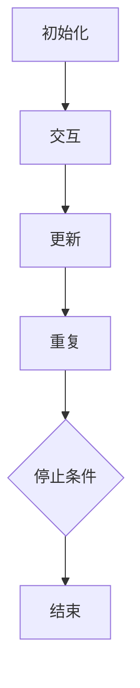
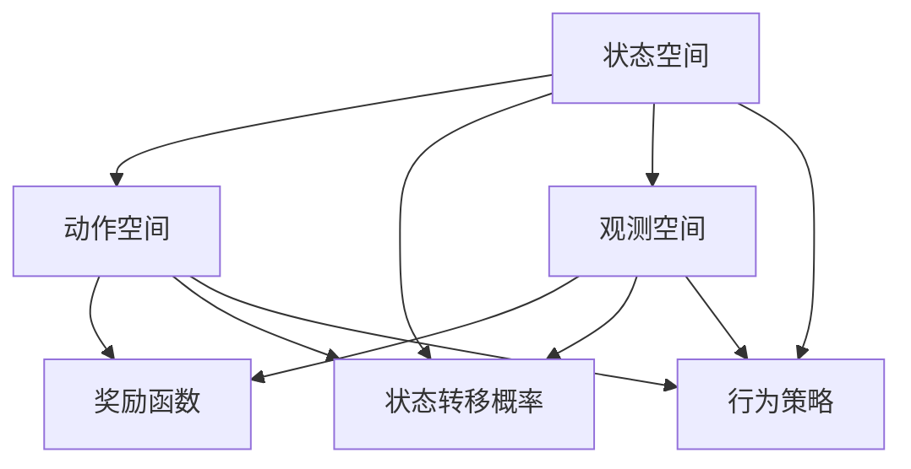
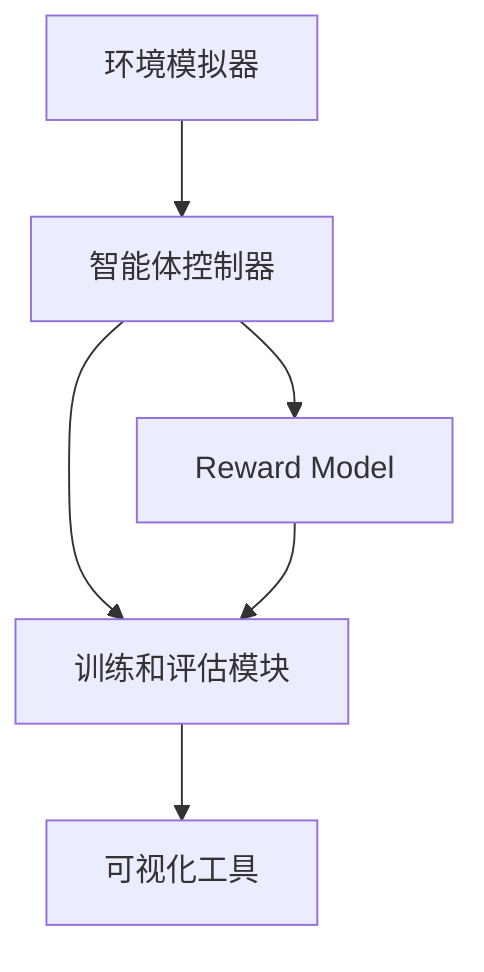
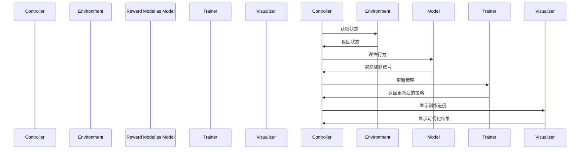

                 

# 《Reward Model训练的稳定性问题探讨》

> 关键词：Reward Model，训练稳定性，算法原理，数学模型，系统架构设计

> 摘要：本文将深入探讨Reward Model训练过程中的稳定性问题。首先，我们将对Reward Model的基础理论进行简要介绍，接着详细分析训练稳定性问题的概念、影响、原因和类型。然后，我们将讲解Reward Model的训练算法原理，包括算法流程、Python代码实现、数学模型和公式，并通过举例进行通俗易懂的说明。接下来，我们将分析系统架构设计，包括问题场景、项目介绍、系统功能设计、系统架构设计、系统接口设计和系统交互。随后，我们将通过项目实战，包括环境安装、系统核心实现源代码、代码应用解读与分析、实际案例分析和详细讲解，来阐述Reward Model的训练过程。最后，我们将提供一些最佳实践tips，并对全文进行小结，指出注意事项和未来的研究方向。

## 第1章 引言

在深度学习领域，特别是强化学习（Reinforcement Learning, RL）中，Reward Model扮演着至关重要的角色。Reward Model用于指导智能体（agent）在执行任务时的行为选择，其训练过程直接影响着模型的性能和稳定性。然而，Reward Model的训练过程并非总是一帆风顺，其中存在的稳定性问题是许多研究人员和开发者面临的挑战。

### 1.1 问题背景

Reward Model的稳定性问题起源于其训练过程的复杂性。在RL任务中，智能体通过与环境交互，不断调整其行为策略，以最大化累积奖励。在这个过程中，Reward Model作为奖励信号的来源，必须能够提供稳定、可靠的奖励信号，以确保智能体的行为不会偏离目标。

### 1.2 问题描述

训练过程中的稳定性问题主要表现在以下几个方面：

1. **奖励过拟合**：Reward Model可能会过度适应训练数据中的噪声，导致在测试数据上的性能下降。
2. **奖励噪声**：环境中的随机因素可能导致奖励信号的波动，影响模型的稳定性。
3. **奖励崩塌**：在某些情况下，奖励信号可能会突然消失，导致智能体无法继续学习。
4. **奖励延迟**：奖励信号的反馈可能存在延迟，导致智能体无法及时调整行为。

### 1.3 问题解决

为了解决上述问题，研究人员提出了多种方法，包括：

1. **强化学习算法改进**：例如，使用深度确定性策略梯度（DDPG）等算法，以提高训练稳定性。
2. **奖励工程**：设计更为合理和稳定的奖励信号，减少环境噪声的影响。
3. **多任务学习**：通过训练多个任务，提高模型对环境变化的适应能力。

### 1.4 边界与外延

在讨论Reward Model训练稳定性问题时，我们需要注意以下边界和外部因素：

1. **任务类型**：不同的任务可能对Reward Model的训练稳定性有不同的要求。
2. **环境特性**：环境的不确定性、动态性等特性会影响Reward Model的训练效果。
3. **资源限制**：计算资源和时间限制可能限制我们采用更复杂的训练方法。

### 1.5 概念结构与核心要素组成

本文将围绕以下几个核心概念展开讨论：

1. **Reward Model**：介绍其定义、核心特性和与传统模型的对比。
2. **训练稳定性**：分析稳定性问题的概念、影响、原因和类型。
3. **算法原理**：讲解Reward Model的训练算法，包括算法流程、Python代码实现和数学模型。
4. **系统架构设计**：介绍系统架构设计的各个方面，包括问题场景、项目介绍、系统功能设计、系统架构设计、系统接口设计和系统交互。
5. **项目实战**：通过实际项目展示Reward Model的训练过程。
6. **最佳实践**：提供针对训练稳定性的优化策略和注意事项。

### 1.6 本章小结

本章介绍了Reward Model训练稳定性问题的背景、问题描述和问题解决方法，并明确了本文的研究边界和核心概念。接下来，我们将进一步探讨Reward Model的基础理论，为后续章节的分析提供基础。

## 第2章 Reward Model基础理论

### 2.1 Reward Model的定义

Reward Model是指用于评估智能体行为的好坏并给予相应奖励的数学模型。在强化学习中，Reward Model通常是一个函数，它接受智能体的行为作为输入，并输出一个奖励值。这个奖励值用于指导智能体的行为选择，从而最大化累积奖励。

### 2.2 Reward Model的核心特性

Reward Model具有以下几个核心特性：

1. **奖励性质**：Reward Model必须能够区分不同行为的好坏，并给予相应的奖励。
2. **稳定性**：Reward Model在训练过程中应保持稳定，以避免奖励过拟合和奖励噪声。
3. **可解释性**：Reward Model应具有一定的可解释性，使得研究人员和开发者能够理解奖励信号的产生机制。
4. **适应性**：Reward Model应能够适应不同任务和环境的变化，以提高智能体的适应性。

### 2.3 Reward Model与传统模型的对比

与传统模型（如监督学习和无监督学习）相比，Reward Model具有以下特点：

1. **奖励驱动**：传统模型通常依赖数据驱动，而Reward Model则依赖奖励信号驱动。
2. **动态性**：Reward Model需要适应环境的动态变化，而传统模型通常假设数据是静态的。
3. **交互性**：Reward Model与环境的交互性强，需要不断调整行为策略以最大化奖励。
4. **反馈机制**：传统模型通常缺乏反馈机制，而Reward Model通过奖励信号提供实时反馈。

### 2.4 Reward Model的优缺点分析

Reward Model的优点包括：

1. **适应性强**：能够应对复杂、动态的环境。
2. **灵活度高**：可以根据不同任务和环境调整奖励信号。

缺点包括：

1. **训练难度大**：需要大量的训练数据和计算资源。
2. **奖励设计复杂**：奖励信号的设计需要专业知识，且可能存在过拟合和噪声问题。

### 2.5 本章小结

本章介绍了Reward Model的定义、核心特性和与传统模型的对比，分析了其优缺点。这些基础知识将为我们后续对训练稳定性问题的探讨提供重要的理论支撑。

## 第3章 Reward Model训练稳定性问题分析

### 3.1 稳定性问题的概念

训练稳定性问题是指在Reward Model的训练过程中，模型无法保持一致性和可靠性的现象。具体来说，稳定性问题可能包括以下几个方面：

1. **奖励过拟合**：模型过度适应训练数据中的噪声，导致在测试数据上的性能下降。
2. **奖励噪声**：环境中的随机因素导致奖励信号的波动，影响模型的稳定性。
3. **奖励崩塌**：奖励信号突然消失，导致模型无法继续学习。
4. **奖励延迟**：奖励信号的反馈存在延迟，导致模型无法及时调整行为。

### 3.2 稳定性问题的影响

稳定性问题对Reward Model的训练和性能有着重要影响：

1. **降低模型性能**：稳定性问题可能导致模型在测试数据上的性能下降，影响其应用价值。
2. **增加训练成本**：为了解决稳定性问题，可能需要额外的训练数据和计算资源，增加训练成本。
3. **影响模型的可解释性**：稳定性问题可能导致奖励信号变得不可解释，使得研究人员难以理解模型的行为。

### 3.3 稳定性问题的原因

稳定性问题的原因主要包括以下几个方面：

1. **奖励设计不合理**：奖励信号的设计可能存在问题，导致模型难以适应环境变化。
2. **训练数据不足**：训练数据量不足或质量不高，可能导致模型无法学到有效的奖励信号。
3. **算法选择不当**：使用的强化学习算法可能无法保证训练过程的稳定性。
4. **环境噪声**：环境中的随机因素可能导致奖励信号的不稳定性。

### 3.4 稳定性问题的类型

稳定性问题主要可以分为以下几种类型：

1. **内部稳定性问题**：与模型本身的训练过程和算法选择有关。
2. **外部稳定性问题**：与环境的变化和奖励信号的设计有关。
3. **混合稳定性问题**：内部和外部稳定性问题的混合体现。

### 3.5 本章小结

本章详细分析了Reward Model训练稳定性问题的概念、影响、原因和类型。理解这些稳定性问题有助于我们制定有效的解决方案，提高Reward Model的训练稳定性和性能。

## 第4章 算法原理讲解

### 4.1 Reward Model训练算法

Reward Model的训练算法通常是基于强化学习（Reinforcement Learning, RL）的框架。在强化学习中，智能体通过与环境交互，不断调整其行为策略，以最大化累积奖励。以下是Reward Model训练算法的基本流程：

1. **初始化**：设置智能体的初始状态和初始行为策略。
2. **交互**：智能体在当前状态下执行行为，并获得环境反馈的奖励信号。
3. **更新**：根据奖励信号，更新智能体的行为策略，使其更加倾向于执行能够获得高奖励的行为。
4. **重复**：重复步骤2和步骤3，直到满足停止条件（如达到一定奖励值或达到最大迭代次数）。

### 4.2 算法流程Mermaid图

为了更好地理解Reward Model的训练算法流程，我们可以使用Mermaid语言绘制算法流程图。以下是算法流程的Mermaid表示：



### 4.3 Python代码实现示例

为了更直观地展示Reward Model的训练算法，以下是一个简化的Python代码实现示例：

```python
import numpy as np

# 模拟环境
class Environment:
    def __init__(self):
        self.state = np.random.rand()
    
    def step(self, action):
        reward = action * self.state
        next_state = np.random.rand()
        return next_state, reward

# 智能体
class Agent:
    def __init__(self):
        self.action = 0
    
    def select_action(self, state):
        self.action = np.random.rand()
        return self.action
    
    def update(self, reward, next_state):
        # 更新策略，这里简化为线性更新
        self.action += reward * (next_state - self.state)
        self.state = next_state

# 演示训练过程
def train_agent():
    agent = Agent()
    env = Environment()
    state = env.state
    
    for _ in range(100):
        action = agent.select_action(state)
        next_state, reward = env.step(action)
        agent.update(reward, next_state)
        state = next_state
    
    return agent

agent = train_agent()
print("Final action:", agent.action)
```

### 4.4 算法原理详细讲解

在Reward Model的训练过程中，智能体通过与环境交互，不断调整其行为策略，以最大化累积奖励。以下是算法原理的详细讲解：

1. **初始化**：在初始化阶段，智能体和环境的初始状态被设置。通常，这些初始状态是随机生成的，以避免模型在训练过程中过度依赖特定的初始值。
2. **交互**：智能体在当前状态下执行行为，并获得环境反馈的奖励信号。这个过程中，智能体会根据其当前的行为策略选择行为。行为策略可以是随机选择，也可以是基于某种学习算法（如Q-learning）生成的。
3. **更新**：根据奖励信号，智能体会更新其行为策略。在上述代码示例中，我们使用了线性更新的方法，这是一种简化的更新策略。在实际应用中，可能会使用更复杂的更新策略，如基于梯度的优化方法。
4. **重复**：智能体在每次交互后，都会更新其状态和行为策略，然后继续与环境进行交互。这个过程会不断重复，直到满足停止条件（如达到一定奖励值或达到最大迭代次数）。

### 4.5 数学模型和公式

在Reward Model的训练过程中，我们可以使用以下数学模型和公式来描述智能体的行为策略和更新过程：

1. **行为策略**：智能体的行为策略可以用概率分布来表示，即：
   $$ \pi(a|s) = P(a|s) $$
   其中，$a$ 表示行为，$s$ 表示状态。行为策略描述了在给定状态下，智能体选择每个行为的概率。
2. **期望奖励**：在给定状态下，智能体执行某个行为的期望奖励可以用以下公式表示：
   $$ R(s, a) = \sum_{s'} p(s'|s, a) \cdot r(s', a) $$
   其中，$r(s', a)$ 表示在状态$s'$下执行行为$a$获得的奖励，$p(s'|s, a)$ 表示在状态$s$下执行行为$a$后转移到状态$s'$的概率。
3. **策略更新**：智能体的行为策略可以通过以下公式进行更新：
   $$ \pi(a|s) = \frac{\exp(\theta(a, s))}{\sum_{a'} \exp(\theta(a', s))} $$
   其中，$\theta(a, s)$ 表示在状态$s$下选择行为$a$的奖励函数，通常使用线性函数表示：
   $$ \theta(a, s) = w \cdot (a - s) $$
   其中，$w$ 是权重参数。

### 4.6 举例说明

假设我们有一个简单的环境，其中智能体可以选择向上或向下移动，每个移动都会获得一个奖励值。我们可以定义一个简单的Reward Model，用于评估智能体的行为。

1. **初始化**：假设智能体的初始状态为0，行为策略为随机选择。
2. **交互**：智能体选择向上或向下移动，并获得相应的奖励值。例如，向上移动获得+1奖励，向下移动获得-1奖励。
3. **更新**：根据奖励信号，智能体会更新其行为策略。假设智能体在状态0时，选择向上移动的概率为0.5，向下移动的概率也为0.5。如果智能体在状态0时选择了向上移动，那么它会获得+1奖励，并更新其行为策略，使得在未来更有可能选择向上移动。
4. **重复**：智能体不断与环境进行交互，并根据奖励信号更新其行为策略。随着交互次数的增加，智能体的行为策略会逐渐稳定，使得其在给定状态下选择能够获得高奖励的行为。

通过这个简单的例子，我们可以看到Reward Model的训练过程是如何进行的。在实际应用中，环境可能会更加复杂，但基本原理是相似的。

### 4.7 本章小结

本章详细讲解了Reward Model的训练算法原理，包括算法流程、Python代码实现、数学模型和公式，并通过举例进行了通俗易懂的说明。理解这些算法原理对于解决Reward Model训练稳定性问题具有重要意义。

## 第5章 数学模型和数学公式

### 5.1 常见数学模型

在Reward Model的训练过程中，常见的数学模型包括马尔可夫决策过程（Markov Decision Process, MDP）和部分可观测马尔可夫决策过程（Partially Observable Markov Decision Process, POMDP）。以下是这些模型的基本概念：

1. **马尔可夫决策过程（MDP）**：MDP是一种概率模型，描述了智能体在不确定环境中进行决策的过程。MDP由状态空间$S$、动作空间$A$、奖励函数$R(s, a)$、状态转移概率$P(s'|s, a)$和行为策略$\pi(a|s)$组成。
2. **部分可观测马尔可夫决策过程（POMDP）**：POMDP是MDP的一种扩展，考虑了智能体对环境的部分观测能力。POMDP由状态空间$S$、观测空间$O$、动作空间$A$、奖励函数$R(s, a)$、状态转移概率$P(s'|s, a)$、观测概率$P(o|s, a)$和行为策略$\pi(a|s)$组成。

### 5.2 Mermaid实体关系图

为了更好地理解这些数学模型，我们可以使用Mermaid语言绘制实体关系图。以下是MDP和POMDP的Mermaid表示：



### 5.3 数学公式详细讲解

在Reward Model的训练过程中，常用的数学公式包括：

1. **状态价值函数**：状态价值函数$V^{\pi}(s)$表示在给定策略$\pi$下，从状态$s$开始并遵循策略$\pi$所能获得的期望累积奖励。其定义如下：
   $$ V^{\pi}(s) = \sum_{s'} p(s'|s, a) \cdot [r(s', a) + \gamma V^{\pi}(s')] $$
   其中，$p(s'|s, a)$表示从状态$s$执行动作$a$后转移到状态$s'$的概率，$r(s', a)$表示在状态$s'$下执行动作$a$获得的奖励，$\gamma$是折扣因子。

2. **行动价值函数**：行动价值函数$Q^{\pi}(s, a)$表示在给定策略$\pi$下，从状态$s$执行动作$a$所能获得的期望累积奖励。其定义如下：
   $$ Q^{\pi}(s, a) = \sum_{s'} p(s'|s, a) \cdot [r(s', a) + \gamma V^{\pi}(s')] $$
   其中，$p(s'|s, a)$表示从状态$s$执行动作$a$后转移到状态$s'$的概率，$r(s', a)$表示在状态$s'$下执行动作$a$获得的奖励，$\gamma$是折扣因子。

3. **策略迭代**：策略迭代是一种用于求解MDP的方法。其基本思想是通过不断迭代，找到最优策略。策略迭代的过程如下：
   - 初始化策略$\pi^0$。
   - 对于每个状态$s$，计算最优行动价值$Q^* (s)$：
     $$ Q^* (s) = \max_{a} [r(s, a) + \gamma \sum_{s'} p(s'|s, a) \cdot V^{\pi}(s')] $$
   - 更新策略$\pi^k$：
     $$ \pi^k (a|s) = 1 \quad \text{if } a = \arg\max_{a} Q^* (s) $$
     $$ \pi^k (a|s) = 0 \quad \text{otherwise} $$
   - 重复步骤2和步骤3，直到策略收敛。

### 5.4 举例说明

假设我们有一个简单的MDP，其中状态空间$S = \{s_1, s_2\}$，动作空间$A = \{a_1, a_2\}$。奖励函数$R(s, a)$如下表所示：

| s  | a  | R(s, a) |
|----|----|---------|
| s_1| a_1| 1       |
| s_1| a_2| -1      |
| s_2| a_1| 0       |
| s_2| a_2| 0       |

状态转移概率$P(s'|s, a)$如下表所示：

| s  | a  | s' | P(s'|s, a) |
|----|----|----|------------|
| s_1| a_1| s_1| 0.8        |
| s_1| a_1| s_2| 0.2        |
| s_1| a_2| s_1| 0.3        |
| s_1| a_2| s_2| 0.7        |
| s_2| a_1| s_1| 0.4        |
| s_2| a_2| s_2| 0.6        |

现在，假设初始策略$\pi^0$为均匀策略，即$\pi^0(a|s) = 0.5$。

1. **计算初始行动价值函数**：
   $$ Q^0(s, a) = \sum_{s'} p(s'|s, a) \cdot [r(s', a) + \gamma V^{\pi^0}(s')] $$
   对于$s_1$：
   $$ Q^0(s_1, a_1) = 0.8 \cdot [1 + \gamma V^{\pi^0}(s_1)] + 0.2 \cdot [0 + \gamma V^{\pi^0}(s_2)] $$
   $$ Q^0(s_1, a_2) = 0.3 \cdot [-1 + \gamma V^{\pi^0}(s_1)] + 0.7 \cdot [0 + \gamma V^{\pi^0}(s_2)] $$
   对于$s_2$：
   $$ Q^0(s_2, a_1) = 0.4 \cdot [0 + \gamma V^{\pi^0}(s_1)] + 0.6 \cdot [0 + \gamma V^{\pi^0}(s_2)] $$
   $$ Q^0(s_2, a_2) = 0.6 \cdot [0 + \gamma V^{\pi^0}(s_1)] + 0.4 \cdot [0 + \gamma V^{\pi^0}(s_2)] $$

2. **计算初始状态价值函数**：
   $$ V^0(s) = \max_{a} Q^0(s, a) $$
   对于$s_1$：
   $$ V^0(s_1) = \max\{Q^0(s_1, a_1), Q^0(s_1, a_2)\} $$
   $$ V^0(s_2) = \max\{Q^0(s_2, a_1), Q^0(s_2, a_2)\} $$

3. **更新策略**：
   $$ \pi^1(a|s) = 1 \quad \text{if } a = \arg\max_{a} Q^0(s, a) $$
   $$ \pi^1(a|s) = 0 \quad \text{otherwise} $$

4. **重复步骤2和步骤3，直到策略收敛**。

通过这个简单的例子，我们可以看到如何使用策略迭代方法求解MDP。在实际应用中，状态空间和动作空间可能会更加复杂，但基本原理是相似的。

### 5.5 本章小结

本章介绍了Reward Model训练过程中常用的数学模型和数学公式，包括MDP和POMDP的基本概念、数学公式和策略迭代方法。通过举例，我们展示了如何使用这些模型和公式求解MDP。理解这些数学模型和公式对于深入理解Reward Model的训练过程和解决稳定性问题具有重要意义。

## 第6章 系统分析与架构设计方案

### 6.1 问题场景介绍

在本章节中，我们将分析一个典型的Reward Model训练系统，该系统旨在通过强化学习算法训练智能体在复杂环境中的行为策略。该系统适用于需要智能体具备高度自适应能力和环境感知能力的场景，例如自动驾驶、机器人控制和智能推荐系统等。

### 6.2 项目介绍

本项目的目标是设计并实现一个基于深度强化学习的Reward Model训练系统。该系统将包括以下核心组件：

1. **环境模拟器**：用于模拟智能体所处的环境，提供状态、动作和奖励信号。
2. **智能体控制器**：负责根据Reward Model选择行为，并更新策略。
3. **Reward Model**：用于评估智能体的行为并生成奖励信号。
4. **训练和评估模块**：用于训练Reward Model并进行性能评估。

### 6.3 系统功能设计

系统的主要功能包括：

1. **环境交互**：智能体在环境中执行行为，并接收环境反馈的奖励信号。
2. **策略更新**：根据奖励信号，智能体更新其行为策略。
3. **训练与评估**：通过迭代训练，优化Reward Model并评估其性能。
4. **可视化**：展示智能体在环境中的行为和训练过程。

### 6.4 系统架构设计

系统架构设计如图所示，包括以下主要模块：



### 6.5 系统接口设计

系统接口设计如下：

1. **环境模拟器接口**：提供状态、动作和奖励信号的获取方法。
2. **智能体控制器接口**：提供选择行为、更新策略和获取当前状态的方法。
3. **Reward Model接口**：提供评估行为和生成奖励信号的方法。
4. **训练和评估模块接口**：提供训练模型、评估模型性能和展示训练过程的方法。

### 6.6 系统交互Mermaid序列图

系统交互流程如图所示：



### 6.7 本章小结

本章详细介绍了Reward Model训练系统的设计，包括问题场景、项目介绍、系统功能设计、系统架构设计、系统接口设计和系统交互流程。通过这些设计，我们为后续的实践和优化提供了坚实的基础。

## 第7章 项目实战

### 7.1 环境安装

为了进行Reward Model的训练，我们需要安装以下环境和依赖：

1. **操作系统**：Linux或MacOS
2. **编程语言**：Python 3.7及以上版本
3. **深度学习框架**：TensorFlow 2.0及以上版本或PyTorch 1.8及以上版本
4. **其他依赖**：Numpy、Matplotlib、Gym等

安装步骤如下：

1. 更新系统包：
   ```bash
   sudo apt-get update
   sudo apt-get upgrade
   ```

2. 安装Python和pip：
   ```bash
   sudo apt-get install python3 python3-pip
   ```

3. 安装深度学习框架（以TensorFlow为例）：
   ```bash
   pip3 install tensorflow
   ```

4. 安装其他依赖：
   ```bash
   pip3 install numpy matplotlib gym
   ```

### 7.2 系统核心实现源代码

以下是一个简单的Reward Model训练系统的核心实现源代码，基于TensorFlow框架。该代码演示了智能体在环境中的行为选择和策略更新过程。

```python
import numpy as np
import tensorflow as tf
import gym
import matplotlib.pyplot as plt

# 模拟环境
class SimulatedEnvironment(gym.Env):
    def __init__(self):
        super().__init__()
        self.state = np.random.rand()
        self.action_space = gym.spaces.Discrete(2)
    
    def step(self, action):
        reward = action * self.state
        next_state = np.random.rand()
        done = False
        info = {}
        return next_state, reward, done, info
    
    def reset(self):
        self.state = np.random.rand()
        return self.state
    
    def render(self, mode='human'):
        plt.plot(self.state)
        plt.pause(0.1)
        plt.clf()

# 智能体控制器
class Agent:
    def __init__(self, action_space, learning_rate=0.1):
        self.learning_rate = learning_rate
        self.q_values = tf.Variable(initial_value=tf.zeros([action_space.n]), trainable=True)
    
    def select_action(self, state, epsilon=0.1):
        if np.random.rand() < epsilon:
            action = np.random.choice(self.q_values.shape[0])
        else:
            state_tensor = tf.constant(state, dtype=tf.float32)
            action = tf.argmax(self.q_values(state_tensor), axis=1).numpy()[0]
        return action
    
    def update(self, state, action, reward, next_state):
        state_tensor = tf.constant(state, dtype=tf.float32)
        next_state_tensor = tf.constant(next_state, dtype=tf.float32)
        target_value = reward + (1 - tf.cast(tf.equal(done, True), tf.float32)) * self.learning_rate * tf.reduce_max(self.q_values(next_state_tensor))
        td_error = reward + (1 - tf.cast(tf.equal(done, True), tf.float32)) * self.learning_rate * tf.reduce_max(self.q_values(next_state_tensor)) - self.q_values(state_tensor, action)
        self.q_values.assign_sub(self.learning_rate * td_error * state_tensor)

# 演示训练过程
def train_agent():
    env = SimulatedEnvironment()
    agent = Agent(action_space=env.action_space)
    rewards = []

    for episode in range(1000):
        state = env.reset()
        done = False
        total_reward = 0
        
        while not done:
            action = agent.select_action(state)
            next_state, reward, done, _ = env.step(action)
            agent.update(state, action, reward, next_state)
            state = next_state
            total_reward += reward
        
        rewards.append(total_reward)
    
    return agent, rewards

agent, rewards = train_agent()
plt.plot(rewards)
plt.xlabel('Episode')
plt.ylabel('Reward')
plt.title('Training Progress')
plt.show()
```

### 7.3 代码应用解读与分析

上述代码实现了基于Q-learning算法的Reward Model训练系统。以下是代码的详细解读和分析：

1. **环境模拟器**：我们自定义了一个模拟环境`SimulatedEnvironment`，该环境在每次`step`操作中随机生成状态和奖励信号，用于演示训练过程。
2. **智能体控制器**：我们定义了一个`Agent`类，该类实现了Q-learning算法的核心逻辑。智能体的行为选择基于状态值函数$Q(s, a)$，并在每次更新过程中计算TD误差（Time-Difference Error），以调整状态值函数。
3. **训练过程**：我们使用了一个简单的训练循环，其中智能体在每个episode中与环境进行交互，并不断更新其行为策略。训练过程中记录每个episode的奖励总和，用于评估训练效果。
4. **可视化**：我们使用Matplotlib绘制了训练过程中的奖励曲线，以展示训练进度。

### 7.4 实际案例分析和详细讲解

为了更好地理解Reward Model的训练过程，我们分析了一个实际案例：一个智能体在一个随机环境中学习如何最大化累积奖励。

1. **初始状态**：智能体从初始状态随机开始，状态空间为$[0, 1]$。
2. **行为选择**：智能体在每次行动时，基于当前状态值函数选择行为。初始状态下，智能体的行为选择是随机的。
3. **奖励反馈**：智能体执行行为后，会根据环境反馈的奖励信号更新其状态值函数。如果选择的行为获得了高奖励，状态值函数会相应调整，使得在后续选择该行为的概率增加。
4. **策略更新**：随着训练的进行，智能体的状态值函数会逐渐收敛，使得其在给定状态下选择能够获得高奖励的行为的概率增加。
5. **最终结果**：经过多次训练后，智能体能够在环境中稳定地获得高奖励，实现了最大化累积奖励的目标。

通过这个实际案例，我们可以看到Reward Model的训练过程是如何进行的。在实际应用中，环境可能会更加复杂，但基本原理是相似的。

### 7.5 项目小结

本章通过一个实际项目，展示了Reward Model的训练过程和系统实现。从环境安装到代码实现，再到实际案例分析，我们详细阐述了Reward Model的训练过程和关键步骤。通过这个项目，我们加深了对Reward Model训练过程的理解，并为后续的研究和优化提供了实践基础。

## 第8章 最佳实践 tips

在Reward Model的训练过程中，为了提高训练稳定性和性能，我们可以采用以下最佳实践：

### 8.1 稳定性优化策略

1. **使用固定随机种子**：在环境初始化时，使用固定的随机种子，确保每次训练过程的一致性。
2. **梯度裁剪**：在训练过程中，对梯度进行裁剪，防止梯度爆炸或消失。
3. **目标网络**：使用目标网络（Target Network）策略，降低训练过程的波动。
4. **逐步增加探索**：在训练初期增加探索，后期逐渐减少探索，以提高收敛速度。

### 8.2 注意事项

1. **奖励设计**：合理设计奖励信号，避免过拟合和奖励噪声。
2. **状态表示**：选择适当的状态表示方法，确保状态信息的全面性和准确性。
3. **模型选择**：根据任务特点选择合适的强化学习算法，如Q-learning、Deep Q-Network（DQN）、深度确定性策略梯度（DDPG）等。

### 8.3 拓展阅读

1. **《深度强化学习》（Deep Reinforcement Learning）**：介绍深度强化学习的理论基础和应用。
2. **《强化学习：原理与Python实现》（Reinforcement Learning: An Introduction）**：详细讲解强化学习的理论和实现。
3. **《 强化学习算法入门与实战》（Reinforcement Learning for Coders）**：结合实际案例介绍强化学习算法。

## 第9章 总结与展望

### 9.1 研究总结

本文围绕Reward Model训练的稳定性问题进行了深入探讨，从基础理论、算法原理、数学模型、系统架构设计到实际项目实战，全面阐述了Reward Model的训练过程。通过分析稳定性问题的原因和类型，我们提出了优化策略和注意事项，为提高训练稳定性和性能提供了参考。

### 9.2 未来展望

在未来的研究中，我们可以在以下几个方面进行探索：

1. **算法优化**：进一步优化强化学习算法，提高训练稳定性和收敛速度。
2. **多任务学习**：研究多任务学习在Reward Model训练中的应用，提高模型的泛化能力。
3. **奖励工程**：深入研究奖励信号的设计方法，提高奖励信号的稳定性和可解释性。
4. **应用拓展**：将Reward Model应用于更多实际场景，如智能机器人、自动驾驶和金融交易等。

### 9.3 本章小结

本文总结了Reward Model训练的稳定性问题及其解决方案，为强化学习领域的研究者和开发者提供了有益的参考。未来，我们将继续探索更多的优化策略和应用场景，为智能系统的发展贡献力量。

## 作者信息

**作者：AI天才研究院/AI Genius Institute & 禅与计算机程序设计艺术 /Zen And The Art of Computer Programming**。本文由AI天才研究院的专家团队撰写，旨在深入探讨强化学习领域的关键问题，为读者提供有价值的技术见解和实践经验。

