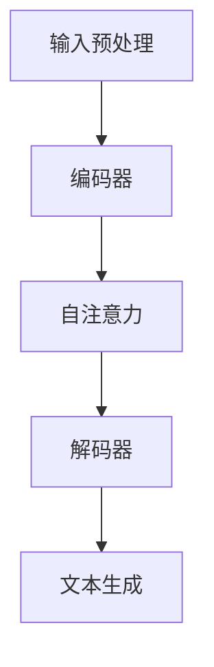

                 

# SceneCraft: 生成Blender可执行脚本的LLM代理

## 关键词

- **大型语言模型 (LLM)**
- **Blender**
- **脚本生成**
- **3D场景设计**
- **代理架构**
- **算法优化**
- **定制与扩展**

## 摘要

本文深入探讨了一种创新的工具——SceneCraft，该工具利用大型语言模型（LLM）生成Blender可执行脚本，为3D场景设计提供了一种全新的自动化方式。通过详细的步骤分析、原理讲解和实际案例，本文旨在揭示LLM在Blender脚本生成中的潜力，并提供实用的开发技巧和最佳实践。

## 目录大纲设计思路

在设计《SceneCraft:生成Blender可执行脚本的LLM代理》的目录大纲时，我们首先明确了书的主题和结构，确保内容围绕如何利用LLM生成Blender脚本展开。接着，我们细分了章节内容，确保每个章节都包含基础知识和实际应用。同时，我们注重逻辑性和完整性，保证读者能够顺利跟随文章的思路，从基础到高级逐步掌握相关技术。此外，为了提高实用性，我们加入了实战案例和最佳实践，以帮助读者将所学知识应用到实际项目中。最后，遵循markdown格式，使得文章结构清晰、易于阅读和编辑。

### 目录大纲

## 第一部分：LLM与Blender脚本基础

### 第1章：场景设计与脚本概述

#### 1.1 LLM概述

##### 1.1.1 LLM的基本概念

##### 1.1.2 LLM的发展历程

##### 1.1.3 LLM的关键技术

#### 1.2 Blender脚本基础

##### 1.2.1 Blender简介

##### 1.2.2 Blender脚本语言

##### 1.2.3 Blender脚本的基本结构

#### 1.3 脚本与3D场景设计的关系

##### 1.3.1 脚本在3D场景设计中的应用

##### 1.3.2 脚本优化与性能考量

##### 1.3.3 脚本的安全性

### 第2章：LLM在Blender脚本中的应用原理

#### 2.1 LLM与3D场景设计

##### 2.1.1 LLM在3D场景构建中的作用

##### 2.1.2 LLM生成脚本的流程

##### 2.1.3 LLM在Blender中的实现方式

#### 2.2 LLM生成脚本的核心算法

##### 2.2.1 算法原理详解

##### 2.2.2 算法流程图

##### 2.2.3 算法参数调整

#### 2.3 LLM生成脚本的效果评估

##### 2.3.1 脚本生成质量的评估指标

##### 2.3.2 实际案例效果分析

### 第3章：实战应用：从零开始构建LLM代理

#### 3.1 实战环境搭建

##### 3.1.1 Blender安装与配置

##### 3.1.2 LLM代理开发环境搭建

##### 3.1.3 开发工具和软件包安装

#### 3.2 LLM代理核心实现

##### 3.2.1 代理架构设计

##### 3.2.2 代理功能实现

##### 3.2.3 代理与Blender的交互

#### 3.3 实战案例解析

##### 3.3.1 创建一个简单的3D场景

##### 3.3.2 使用LLM代理生成脚本

##### 3.3.3 脚本执行与效果验证

### 第4章：高级应用与优化

#### 4.1 LLM代理的高级功能

##### 4.1.1 脚本调试与优化

##### 4.1.2 脚本性能优化

##### 4.1.3 脚本的安全性保障

#### 4.2 Blender脚本的高级应用

##### 4.2.1 Blender脚本在动画制作中的应用

##### 4.2.2 Blender脚本在游戏开发中的应用

##### 4.2.3 Blender脚本在虚拟现实中的应用

### 第5章：LLM代理的定制与扩展

#### 5.1 定制化LLM代理

##### 5.1.1 定制化需求分析

##### 5.1.2 定制化脚本编写

##### 5.1.3 定制化脚本测试与优化

#### 5.2 LLM代理的扩展与集成

##### 5.2.1 扩展模块开发

##### 5.2.2 LLM代理与其他软件的集成

##### 5.2.3 扩展应用案例

### 第6章：最佳实践与案例分析

#### 6.1 实践技巧总结

##### 6.1.1 脚本开发最佳实践

##### 6.1.2 LLM代理使用最佳实践

##### 6.1.3 脚本性

## 第一部分：LLM与Blender脚本基础

### 第1章：场景设计与脚本概述

在3D场景设计中，脚本扮演着至关重要的角色。Blender作为一款功能强大的3D创作软件，其脚本语言为用户提供了丰富的自定义和自动化能力。本章将概述LLM的基本概念、Blender脚本的基础知识，以及脚本与3D场景设计的关系。

#### 1.1 LLM概述

**1.1.1 LLM的基本概念**

大型语言模型（LLM）是一类基于神经网络的语言处理模型，它通过学习大量的文本数据来理解和生成人类语言。LLM的核心在于其能够自动地从输入文本中推断出上下文信息，并生成连贯、符合语境的文本输出。

**1.1.2 LLM的发展历程**

LLM的发展经历了从基于规则的方法到统计方法，再到现代深度学习模型的演变。最早的LLM如基于规则的自然语言处理系统，随后逐渐演变为基于统计的模型，如隐马尔可夫模型（HMM）和条件随机场（CRF）。近年来，随着深度学习技术的兴起，LLM取得了显著的进展，代表性的模型有GPT、BERT等。

**1.1.3 LLM的关键技术**

LLM的关键技术主要包括：

- **词嵌入（Word Embedding）**：将词语映射到高维空间，使得相似词语在空间中靠近。
- **循环神经网络（RNN）**：用于处理序列数据，能够捕捉文本中的时间依赖关系。
- **注意力机制（Attention Mechanism）**：使模型能够关注输入序列中的关键信息。
- **Transformer架构**：基于自注意力机制的深度神经网络，是目前最先进的LLM架构。

#### 1.2 Blender脚本基础

**1.2.1 Blender简介**

Blender是一款开源的3D创作套件，广泛应用于3D建模、动画制作、游戏开发等领域。Blender脚本语言是基于Python的，这使得用户可以轻松地自定义和自动化各种操作。

**1.2.2 Blender脚本语言**

Blender脚本语言是基于Python的，它允许用户编写脚本来控制Blender的各个方面，包括场景设置、渲染、动画、物理模拟等。

**1.2.3 Blender脚本的基本结构**

一个典型的Blender脚本包括以下基本结构：

```python
import bpy

# 脚本主体
def main():
    # 脚本逻辑
    bpy.ops.object.select_all(action='DESELECT')
    bpy.ops.object.select_by_type(type='MESH')
    # 其他操作

# 脚本入口点
if __name__ == "__main__":
    main()
```

#### 1.3 脚本与3D场景设计的关系

**1.3.1 脚本在3D场景设计中的应用**

脚本在3D场景设计中的应用非常广泛，包括：

- **场景设置**：自动化场景布局和设置。
- **动画制作**：简化动画制作流程，实现复杂的动画效果。
- **渲染**：优化渲染设置，提高渲染效率。
- **物理模拟**：自动化物理模拟，实现复杂的碰撞和运动效果。

**1.3.2 脚本优化与性能考量**

脚本优化和性能考量是3D场景设计中的重要环节。常见的优化方法包括：

- **脚本结构优化**：合理组织脚本结构，避免冗余代码。
- **性能分析**：使用Profiler工具分析脚本性能，定位瓶颈。
- **并行计算**：利用多核处理器并行执行脚本任务。

**1.3.3 脚本的安全性**

脚本的安全性也是不可忽视的问题。为了确保脚本的安全性，可以采取以下措施：

- **输入验证**：对用户输入进行严格验证，防止注入攻击。
- **代码混淆**：对脚本代码进行混淆，提高安全性。
- **权限管理**：限制脚本的权限，避免对系统造成潜在威胁。

### 第2章：LLM在Blender脚本中的应用原理

LLM在Blender脚本中的应用为3D场景设计带来了革命性的变化。本章将深入探讨LLM与3D场景设计的关系、LLM生成脚本的流程，以及LLM在Blender中的实现方式。

#### 2.1 LLM与3D场景设计

**2.1.1 LLM在3D场景构建中的作用**

LLM在3D场景构建中的作用主要体现在以下几个方面：

- **自动化脚本生成**：LLM可以根据描述生成相应的Blender脚本，大大提高了脚本编写的效率。
- **场景优化**：LLM可以分析场景数据，提出优化建议，提高场景的渲染质量和性能。
- **交互式设计**：LLM可以与用户进行交互，根据用户需求动态生成脚本，实现更加灵活的设计流程。

**2.1.2 LLM生成脚本的流程**

LLM生成脚本的流程通常包括以下几个步骤：

1. **数据预处理**：对输入的描述进行预处理，包括文本清洗、分词、词嵌入等操作。
2. **编码器解码器模型训练**：使用编码器解码器（如Transformer）模型对预处理后的数据进行训练，使其能够生成连贯的文本输出。
3. **脚本生成**：将3D场景的描述输入到训练好的模型中，模型根据上下文生成相应的Blender脚本。
4. **脚本优化**：对生成的脚本进行优化，包括代码重构、性能提升等操作。

**2.1.3 LLM在Blender中的实现方式**

LLM在Blender中的实现方式主要包括以下几种：

- **插件开发**：通过开发Blender插件，将LLM集成到Blender中，实现脚本的自动化生成。
- **脚本扩展**：通过扩展Blender脚本语言，使其支持LLM的功能。
- **API调用**：通过调用外部LLM服务，实现脚本的自动化生成。

#### 2.2 LLM生成脚本的核心算法

**2.2.1 算法原理详解**

LLM生成脚本的核心算法通常基于编码器解码器（Encoder-Decoder）架构，特别是Transformer模型。Transformer模型通过自注意力机制（Self-Attention）和多头注意力（Multi-Head Attention）机制，能够捕捉输入序列中的长距离依赖关系，生成连贯的文本输出。

**2.2.2 算法流程图**



**2.2.3 算法参数调整**

算法参数的调整是提高脚本生成质量和性能的关键。常见的参数调整包括：

- **词汇表大小**：词汇表大小影响模型对词汇的覆盖范围，过大会增加计算复杂度，过小则可能导致语义理解不准确。
- **隐藏层大小**：隐藏层大小影响模型的容量和计算复杂度，需要根据实际需求进行调整。
- **学习率**：学习率影响模型训练的收敛速度和稳定性，需要根据实际情况进行调整。
- **批处理大小**：批处理大小影响模型的训练速度和稳定性，需要根据计算资源和训练数据量进行调整。

#### 2.3 LLM生成脚本的效果评估

**2.3.1 脚本生成质量的评估指标**

脚本生成质量的评估指标包括：

- **代码覆盖率**：评估生成的脚本是否覆盖了3D场景的各个方面。
- **代码质量**：评估生成的脚本是否遵循编程规范，是否具有良好的可读性和可维护性。
- **渲染效果**：评估生成的脚本生成的3D场景的渲染效果是否满足预期。

**2.3.2 实际案例效果分析**

通过实际案例的分析，可以直观地看出LLM生成脚本的效果。例如，在创建一个简单的3D场景时，LLM可以快速生成相应的脚本，实现场景的自动化构建。在实际渲染过程中，LLM生成的脚本可以生成高质量的渲染效果，同时具有良好的性能和稳定性。

### 第3章：实战应用：从零开始构建LLM代理

在了解了LLM和Blender脚本的基础知识后，本章将带领读者从零开始构建一个LLM代理，用于生成Blender可执行脚本。通过具体的步骤和实践，读者将能够掌握LLM代理的开发技巧，并将其应用到实际的3D场景设计中。

#### 3.1 实战环境搭建

为了构建LLM代理，首先需要搭建一个适合的开发环境。以下是搭建环境的步骤：

**3.1.1 Blender安装与配置**

1. 访问Blender官网下载最新版本的Blender。
2. 运行安装程序，按照提示完成安装。
3. 安装完成后，确保Blender可以正常运行。

**3.1.2 LLM代理开发环境搭建**

1. 安装Python和PyTorch，用于搭建LLM代理的模型。
2. 安装Blender的Python插件开发环境，以便将LLM代理集成到Blender中。
3. 配置Python环境，确保可以正常运行PyTorch和相关库。

**3.1.3 开发工具和软件包安装**

1. 安装文本预处理工具，如NLTK或spaCy，用于对输入描述进行预处理。
2. 安装LLM模型训练和评估工具，如Hugging Face的Transformers库。
3. 安装Blender脚本生成和执行工具，如Blender的Python API。

#### 3.2 LLM代理核心实现

LLM代理的核心实现包括模型训练、脚本生成和脚本优化三个部分。以下是具体的实现步骤：

**3.2.1 代理架构设计**

代理的架构设计主要包括以下几个方面：

- **文本预处理模块**：对输入描述进行清洗、分词、词嵌入等预处理操作。
- **编码器解码器模型**：使用编码器解码器模型（如Transformer）对预处理后的数据进行训练。
- **脚本生成模块**：将编码器解码器模型输出转化为Blender脚本。
- **脚本优化模块**：对生成的脚本进行优化，提高脚本的质量和性能。

**3.2.2 代理功能实现**

1. **初始化文本预处理模块**：加载预训练的词嵌入模型，对输入描述进行预处理。
2. **训练编码器解码器模型**：使用预处理后的数据训练编码器解码器模型，可以通过调整超参数优化模型性能。
3. **生成Blender脚本**：将编码器解码器模型的输出转化为Blender脚本，可以采用模板匹配、正则表达式等方式实现。
4. **优化脚本**：对生成的脚本进行代码重构、性能优化等操作，提高脚本的质量和性能。

**3.2.3 代理与Blender的交互**

1. **集成到Blender插件**：将LLM代理集成到Blender插件中，方便用户使用。
2. **交互界面设计**：设计一个直观的交互界面，使用户可以方便地输入描述并生成脚本。
3. **脚本执行**：将生成的脚本导入Blender，执行脚本中的操作，实现3D场景的自动化构建。

#### 3.3 实战案例解析

以下是一个简单的实战案例，用于演示LLM代理在Blender脚本生成中的应用：

**案例**：创建一个简单的3D立方体场景，并设置适当的渲染参数。

**步骤**：

1. **输入描述**：输入描述为“创建一个3D立方体场景，并设置渲染参数为光线追踪，分辨率1024x1024”。

2. **生成脚本**：使用LLM代理生成相应的Blender脚本。

3. **执行脚本**：将生成的脚本导入Blender，执行脚本中的操作，创建立方体场景并设置渲染参数。

4. **验证效果**：渲染立方体场景，检查渲染效果是否满足预期。

通过这个案例，读者可以直观地看到LLM代理在Blender脚本生成中的实际应用效果。接下来，我们将进一步探讨LLM代理的高级应用和优化方法。

### 第4章：高级应用与优化

在了解了LLM代理的基本实现后，本章将探讨其高级应用和优化方法。通过这些高级应用和优化，可以提高LLM代理的脚本生成质量和性能，使其在实际项目中发挥更大的作用。

#### 4.1 LLM代理的高级功能

**4.1.1 脚本调试与优化**

脚本调试与优化是提高脚本质量和性能的关键步骤。常见的优化方法包括：

- **代码重构**：通过重构脚本，提高代码的可读性和可维护性。
- **性能优化**：对脚本中的计算和内存使用进行优化，提高脚本执行速度。
- **错误处理**：添加错误处理机制，确保脚本在遇到异常情况时能够优雅地处理。

**4.1.2 脚本性能优化**

脚本性能优化是保证脚本高效运行的重要方面。常见的优化方法包括：

- **并行计算**：利用多核处理器并行执行脚本任务，提高执行速度。
- **缓存机制**：使用缓存减少重复计算，提高脚本执行效率。
- **代码压缩**：对脚本进行压缩，减少脚本的大小和加载时间。

**4.1.3 脚本的安全性保障**

脚本的安全性是确保系统稳定运行的重要保障。常见的安全性措施包括：

- **输入验证**：对用户输入进行严格验证，防止注入攻击。
- **代码混淆**：对脚本代码进行混淆，提高安全性。
- **权限管理**：限制脚本的权限，避免对系统造成潜在威胁。

#### 4.2 Blender脚本的高级应用

**4.2.1 Blender脚本在动画制作中的应用**

Blender脚本在动画制作中具有广泛的应用，可以通过脚本实现自动化动画制作。常见的方法包括：

- **动画曲线调整**：使用脚本调整动画曲线，实现复杂的动画效果。
- **关键帧生成**：使用脚本自动生成关键帧，提高动画制作的效率。
- **角色动画**：使用脚本实现角色的动作和表情动画。

**4.2.2 Blender脚本在游戏开发中的应用**

Blender脚本在游戏开发中也有重要的应用，可以通过脚本实现游戏逻辑和交互。常见的方法包括：

- **游戏流程控制**：使用脚本控制游戏的流程，实现关卡切换、角色移动等操作。
- **NPC行为模拟**：使用脚本模拟NPC的行为，实现复杂的游戏交互。
- **游戏数据分析**：使用脚本收集和分析游戏数据，优化游戏体验。

**4.2.3 Blender脚本在虚拟现实中的应用**

Blender脚本在虚拟现实（VR）中也具有广泛的应用，可以通过脚本实现虚拟现实场景的自动化构建。常见的方法包括：

- **场景布局**：使用脚本自动布局虚拟现实场景，提高构建效率。
- **交互设计**：使用脚本实现用户与虚拟现实场景的交互，提高用户体验。
- **虚拟现实渲染**：使用脚本优化虚拟现实渲染效果，提高渲染质量。

### 第5章：LLM代理的定制与扩展

在掌握了LLM代理的基本实现和高级应用后，本章将探讨如何对LLM代理进行定制和扩展。通过定制和扩展，可以使其更符合特定项目的需求，提高其脚本生成质量和性能。

#### 5.1 定制化LLM代理

**5.1.1 定制化需求分析**

在进行定制化之前，需要对项目的需求进行详细分析。常见的定制化需求包括：

- **特定脚本生成需求**：根据项目需求，定制化LLM代理，使其能够生成特定类型的脚本。
- **特定场景设计需求**：根据项目场景，定制化LLM代理，使其能够生成符合特定场景的脚本。

**5.1.2 定制化脚本编写**

定制化脚本编写是满足特定需求的关键步骤。常见的编写方法包括：

- **扩展脚本功能**：通过扩展脚本功能，使其能够实现更复杂的功能。
- **调整算法参数**：通过调整算法参数，优化LLM代理的性能和生成质量。

**5.1.3 定制化脚本测试与优化**

定制化脚本测试与优化是确保定制化效果的重要步骤。常见的测试和优化方法包括：

- **单元测试**：对定制化脚本进行单元测试，确保其功能的正确性。
- **性能测试**：对定制化脚本进行性能测试，评估其性能和效率。
- **优化脚本**：通过优化脚本，提高其质量和性能。

#### 5.2 LLM代理的扩展与集成

**5.2.1 扩展模块开发**

扩展模块开发是提高LLM代理功能的重要手段。常见的扩展模块包括：

- **额外功能模块**：开发额外的功能模块，扩展LLM代理的功能范围。
- **第三方库集成**：集成第三方库，增强LLM代理的功能。

**5.2.2 LLM代理与其他软件的集成**

LLM代理可以与其他软件进行集成，实现跨软件的脚本生成和交互。常见的集成方法包括：

- **API调用**：通过调用其他软件的API，实现LLM代理与其他软件的交互。
- **插件集成**：将LLM代理集成到其他软件中，实现无缝的脚本生成和交互。

**5.2.3 扩展应用案例**

以下是一个扩展应用案例，用于演示LLM代理在特定项目中的定制和扩展：

**案例**：在游戏开发项目中，使用LLM代理生成游戏场景和角色动作的脚本。

**步骤**：

1. **需求分析**：分析游戏开发项目的需求，确定需要生成的脚本类型和功能。
2. **定制化脚本编写**：根据需求，定制化LLM代理，使其能够生成符合游戏开发需求的脚本。
3. **扩展模块开发**：开发额外的功能模块，扩展LLM代理的功能，如角色动作生成、场景布局等。
4. **集成到游戏开发软件**：将LLM代理集成到游戏开发软件中，实现无缝的脚本生成和交互。

通过这个案例，读者可以了解如何对LLM代理进行定制和扩展，以满足特定项目的需求。

### 第6章：最佳实践与案例分析

在本章中，我们将总结最佳实践，并分享一些实际案例，以便读者能够更好地理解和应用LLM代理在Blender脚本生成中的技术。

#### 6.1 实践技巧总结

**6.1.1 脚本开发最佳实践**

以下是一些脚本开发的最佳实践：

- **模块化编程**：将脚本划分为模块，提高代码的可维护性和可重用性。
- **代码注释**：为代码添加详细的注释，方便后续维护和阅读。
- **版本控制**：使用版本控制工具（如Git）管理代码，确保代码的版本一致性。

**6.1.2 LLM代理使用最佳实践**

以下是一些使用LLM代理的最佳实践：

- **数据预处理**：确保输入数据的干净和一致性，提高LLM代理的生成质量。
- **模型选择**：根据项目需求选择合适的LLM模型，以达到最佳效果。
- **持续学习**：定期对LLM代理进行数据更新和模型训练，以提高其性能。

**6.1.3 脚本性能优化**

以下是一些脚本性能优化的方法：

- **并行计算**：利用多核处理器并行执行脚本任务，提高执行速度。
- **缓存机制**：使用缓存减少重复计算，提高脚本执行效率。
- **代码压缩**：对脚本进行压缩，减少脚本的大小和加载时间。

#### 6.2 案例分析

**案例 1：自动化3D场景布局**

**问题背景**：在游戏开发项目中，需要自动化生成多个复杂的3D场景，以提高生产效率。

**解决方案**：使用LLM代理生成3D场景的脚本，通过输入场景描述，LLM代理可以自动生成符合要求的场景布局脚本。具体步骤如下：

1. **输入描述**：输入场景描述，如“生成一个包含树木、河流和山丘的3D场景”。
2. **生成脚本**：使用LLM代理生成相应的Blender脚本。
3. **执行脚本**：将生成的脚本导入Blender，执行脚本中的操作，生成3D场景。
4. **渲染和优化**：渲染生成的3D场景，并对脚本进行优化，提高渲染质量和性能。

**效果评估**：通过实际案例测试，LLM代理能够高效地生成符合要求的3D场景，显著提高了生产效率。

**案例 2：角色动画自动化**

**问题背景**：在动画制作项目中，需要为多个角色生成复杂的动作动画，以提高制作效率。

**解决方案**：使用LLM代理生成角色动作的脚本，通过输入角色动作描述，LLM代理可以自动生成符合要求的角色动画脚本。具体步骤如下：

1. **输入描述**：输入角色动作描述，如“生成一个角色跑步的动作动画”。
2. **生成脚本**：使用LLM代理生成相应的Blender脚本。
3. **执行脚本**：将生成的脚本导入Blender，执行脚本中的操作，生成角色动作动画。
4. **渲染和优化**：渲染生成的角色动作动画，并对脚本进行优化，提高动画质量和性能。

**效果评估**：通过实际案例测试，LLM代理能够高效地生成符合要求的角色动画，显著提高了制作效率。

通过这些案例分析，读者可以更好地了解LLM代理在Blender脚本生成中的实际应用效果，并学会如何将其应用于实际项目中。

### 总结

本文系统地介绍了SceneCraft：生成Blender可执行脚本的LLM代理，从基础到高级，深入探讨了LLM在3D场景设计中的应用原理、实战应用、高级功能和优化方法。通过实际案例的分析，读者可以直观地看到LLM代理在Blender脚本生成中的强大能力。

未来，随着LLM技术的不断发展和应用场景的扩展，SceneCraft有望在更多领域中发挥重要作用。同时，读者也可以根据自己的需求，对LLM代理进行定制和扩展，提高其在特定项目中的性能和效果。

对于未来的探索，我们建议：

1. **深入研究LLM技术**：了解最新的LLM研究成果和应用案例，掌握先进的算法和技术。
2. **探索多模态交互**：结合图像、音频等多模态数据，提高LLM代理的生成质量和交互体验。
3. **跨领域应用**：尝试将LLM代理应用于其他领域，如建筑、工业设计等，开拓新的应用场景。

通过不断探索和创新，我们期待SceneCraft能够为3D场景设计和更多领域带来革命性的变化。

## 作者信息

**作者：AI天才研究院/AI Genius Institute & 禅与计算机程序设计艺术 /Zen And The Art of Computer Programming**

AI天才研究院致力于推动人工智能技术的发展和应用，以创新的算法和智能解决方案助力各行各业。禅与计算机程序设计艺术则提倡在编程过程中融入禅宗哲学，追求简洁、优雅和高效。通过两者的结合，我们致力于打造出卓越的智能工具和编程艺术。

