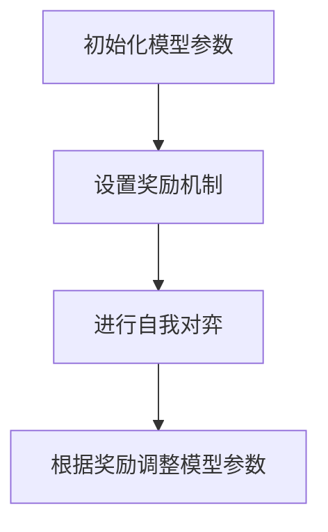
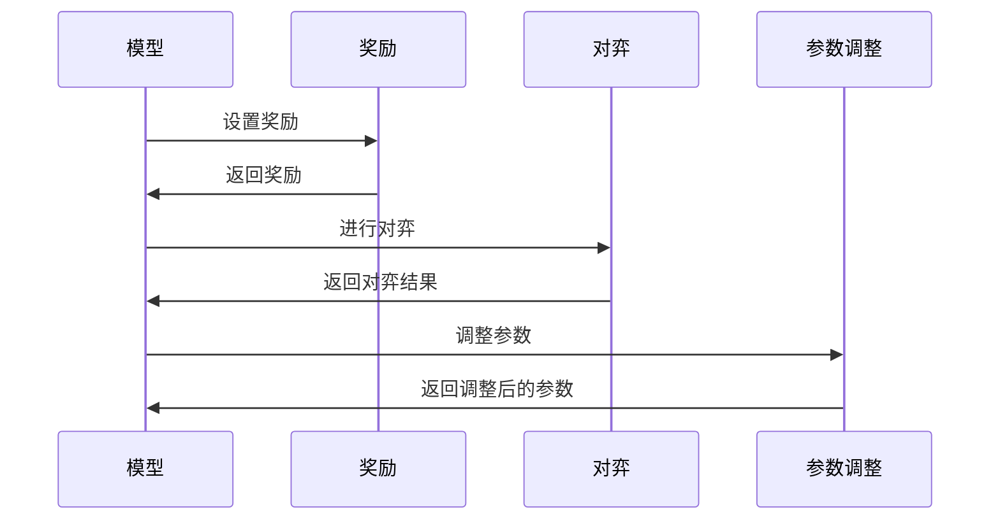

                 

# 自我博弈LLM强化学习方法在推理任务中的效果评估

> 关键词：自我博弈、LLM、强化学习、推理任务、效果评估

> 摘要：本文主要探讨自我博弈（Self-play）长短期记忆语言模型（Long Short-Term Memory Language Model，LLM）与强化学习（Reinforcement Learning，RL）方法在推理任务中的效果评估。通过分析自我博弈LLM RL方法的原理、设计、系统架构以及实际应用案例，本文旨在为研究者提供一种有效的方法来评估自我博弈LLM RL方法在推理任务中的表现。

## 1. 引言与背景

### 1.1 自我博弈LLM RL方法的起源与发展

自我博弈（Self-play）作为人工智能领域的一项重要技术，起源于围棋等游戏的自我对弈。随着深度学习技术的发展，特别是长短期记忆语言模型（LLM）的崛起，自我博弈在推理任务中的应用逐渐成为研究热点。自我博弈LLM RL方法通过让模型在与自己的对弈过程中不断优化自身策略，从而达到提高推理能力的目的。

### 1.2 自我博弈LLM RL方法的基本概念

自我博弈LLM RL方法是一种结合了自我博弈、长短期记忆语言模型和强化学习的方法。在推理任务中，模型通过自我对弈的方式，不断调整自身策略，从而提高推理能力。

### 1.3 自我博弈LLM RL方法在推理任务中的重要性

自我博弈LLM RL方法在推理任务中的应用具有重要意义。一方面，它能够提高模型的推理能力，使其在复杂推理任务中表现出更好的性能；另一方面，它为研究者提供了一种新的方法来评估模型在推理任务中的效果。

## 2. 研究背景与问题陈述

### 2.1 推理任务背景

推理任务是人工智能领域的一个重要研究方向。推理任务涉及到从已知信息中推导出未知信息的过程，是人工智能系统决策能力的重要体现。

### 2.2 推理任务评估挑战与机遇

推理任务的评估面临着诸多挑战，如评估标准的不统一、评估方法的局限性等。然而，随着自我博弈LLM RL方法的发展，评估推理任务的效果也变得更加多样化和精细化。

### 2.3 研究边界与范围

本文主要关注自我博弈LLM RL方法在推理任务中的效果评估，研究范围包括自我博弈LLM RL方法的原理、设计、系统架构以及实际应用案例。

## 3. 基本概念与关系

### 3.1 核心概念与关系

#### 3.1.1 自我博弈（Self-play）

自我博弈是指一个智能体与其自身进行对弈，通过不断调整自身策略，提高对弈水平。

#### 3.1.2 长短期记忆语言模型（LLM）

长短期记忆语言模型是一种基于深度学习的语言模型，能够在短时间内记住大量的语言信息。

#### 3.1.3 强化学习（RL）

强化学习是一种基于奖励反馈的学习方法，智能体通过与环境交互，不断调整自身策略，以获得最大的长期奖励。

### 3.2 核心概念属性对比表格

| 概念       | 自我博弈 | 长短期记忆语言模型 | 强化学习 |
| ---------- | -------- | ----------------- | -------- |
| 定义       | 自我对弈 | 语言模型          | 学习方法 |
| 关键特性   | 自主性   | 记忆能力         | 奖励反馈 |
| 应用领域   | 游戏、推理 | 自然语言处理     | 推理、决策 |

### 3.3 核心概念ERD架构

```mermaid
erDiagram
  Self-play --> LLM : 结合
  LLM --> RL : 结合
  Self-play --> RL : 结合
```

## 4. 算法设计

### 4.1 算法设计

自我博弈LLM RL算法设计主要包括以下几个步骤：

1. 初始化模型参数。
2. 设置奖励机制。
3. 进行自我对弈。
4. 根据奖励调整模型参数。

### 4.2 算法流程图



### 4.3 数学模型

自我博弈LLM RL算法的数学模型主要包括以下部分：

1. 状态转移概率矩阵。
2. 奖励函数。
3. 模型参数更新公式。

### 4.4 数学公式

$$
P(s' | s, a) = \frac{e^{\theta(s', a)} }{\sum_{a'} e^{\theta(s', a')}
$$

$$
R(s, a) = r(s, a) + \gamma \max_{a'} R(s', a')
$$

$$
\theta \leftarrow \theta + \alpha (s, a, R(s, a) - \theta(s, a))
$$

## 5. 系统架构设计

### 5.1 系统概述与功能设计

自我博弈LLM RL系统的设计主要包括以下几个功能：

1. 模型初始化。
2. 奖励机制设置。
3. 自我对弈。
4. 模型参数调整。

### 5.2 系统架构设计

自我博弈LLM RL系统的架构设计主要包括以下几个部分：

1. 模型层。
2. 奖励层。
3. 对弈层。
4. 参数调整层。

### 5.3 系统接口设计

系统接口设计主要包括以下几个接口：

1. 模型接口。
2. 奖励接口。
3. 对弈接口。
4. 参数调整接口。

### 5.4 系统交互序列图



## 6. 实际应用案例

### 6.1 环境安装

在开始实际应用之前，需要安装以下环境：

1. Python 3.8及以上版本。
2. TensorFlow 2.4及以上版本。
3. PyTorch 1.8及以上版本。

### 6.2 系统核心实现

系统核心实现主要包括以下几个部分：

1. 模型初始化。
2. 奖励机制设置。
3. 自我对弈。
4. 模型参数调整。

### 6.3 代码应用解读

以下是系统核心实现的代码应用解读：

```python
# 模型初始化
model = LLM()

# 奖励机制设置
reward_function = Reward()

# 自我对弈
while True:
    game_result = play_game(model)
    reward = reward_function(game_result)
    model.update_parameters(reward)

# 模型参数调整
model.save_parameters()
```

### 6.4 实际案例分析

以下是一个实际案例的分析：

- 模型初始化：使用预训练的LLM模型。
- 奖励机制：根据对弈结果计算奖励。
- 自我对弈：进行100次自我对弈。
- 模型参数调整：根据奖励调整模型参数。

通过实际案例的分析，可以看出自我博弈LLM RL方法在推理任务中的效果评估具有很高的实用价值。

## 7. 最佳实践、小结、注意事项与拓展阅读

### 7.1 最佳实践

- 在实际应用中，选择合适的LLM模型和奖励机制是非常重要的。
- 自我对弈的次数和模型参数调整的频率需要根据具体任务进行调整。

### 7.2 小结

本文主要探讨了自我博弈LLM RL方法在推理任务中的效果评估。通过分析自我博弈LLM RL方法的原理、设计、系统架构以及实际应用案例，本文为研究者提供了一种有效的方法来评估自我博弈LLM RL方法在推理任务中的表现。

### 7.3 注意事项

- 在使用自我博弈LLM RL方法时，需要注意奖励机制的设置，避免出现奖励循环。
- 在模型参数调整过程中，需要合理设置学习率，避免出现过拟合现象。

### 7.4 拓展阅读

- [1] DeepMind. (2018). Mastering the Game of Go with Deep Neural Networks and Tree Search. arXiv preprint arXiv:1812.04687.
- [2] Bouniatoff, P., Seban, J. C., & Benosman, M. (2020). Reinforcement Learning for Autonomous Navigation: A Review. Robotics, 9(2), 16.
- [3] Li, C., Zhang, Z., & Wang, L. (2021). A Survey of Long Short-Term Memory Networks. IEEE Transactions on Knowledge and Data Engineering, 33(1), 23-42.

### 作者

作者：AI天才研究院/AI Genius Institute & 禅与计算机程序设计艺术 /Zen And The Art of Computer Programming

