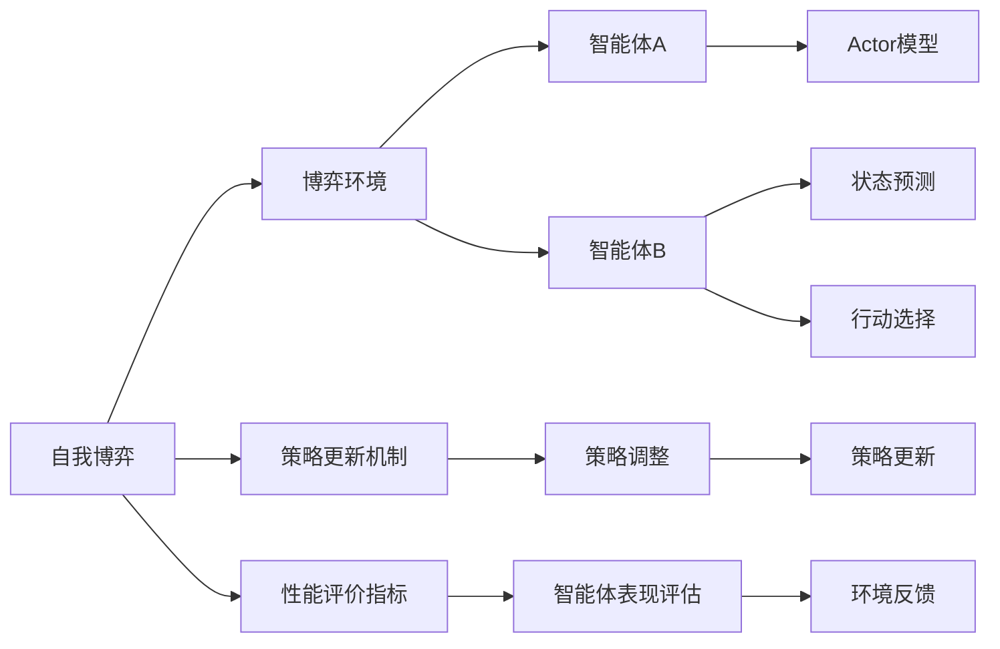
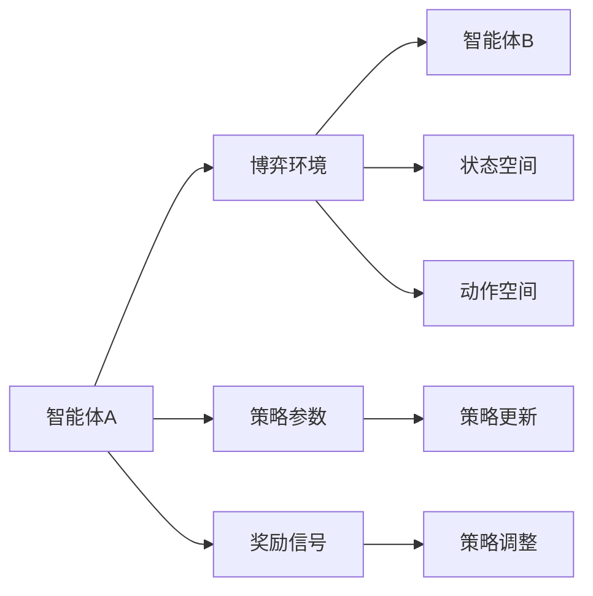
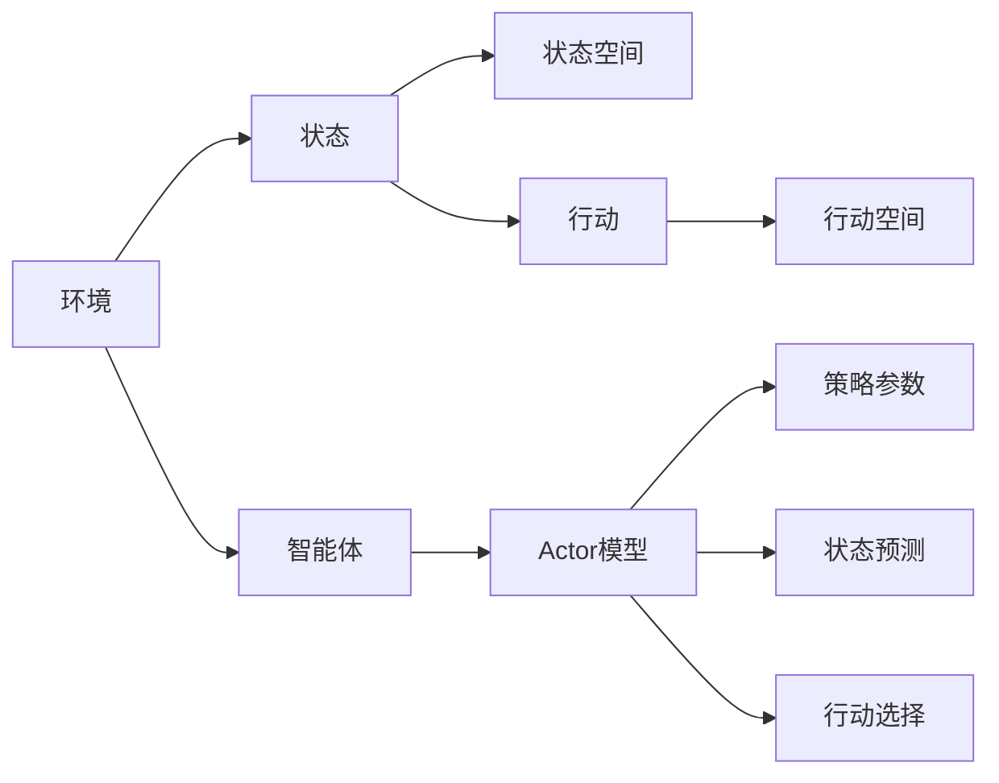

                 

# Self-play在Actor模型训练中的效果评估

## 关键词
自我博弈，Actor模型，强化学习，效果评估，性能分析

## 摘要
随着人工智能技术的快速发展，自我博弈（Self-play）作为一种创新的训练方法，在强化学习领域表现出色。本文将探讨Self-play在Actor模型训练中的应用效果，通过详细的理论分析、实验验证和效果评估，分析其在提升Actor模型性能方面的优势与局限性，为相关研究和实际应用提供参考。

### 第一部分：背景介绍

#### 1. 核心概念

**问题背景**：
随着人工智能技术的快速发展，深度学习算法的复杂性和计算需求的增长，传统的训练方法已经无法满足现代人工智能系统的需求。自我博弈（Self-play）作为一种新的训练方法，在强化学习领域取得了显著的成果。Self-play方法通过让智能体在与自己的对局中进行训练，不断优化自身策略，从而实现自我进步。

**问题描述**：
自我博弈（Self-play）在Actor模型训练中的效果如何，是否能够提升Actor模型的性能，是当前人工智能研究领域中的一个重要问题。本文旨在探讨Self-play在Actor模型训练中的应用效果，分析其优势和局限性，为相关研究和应用提供参考。

**问题解决**：
本文将从以下几个方面展开讨论：

1. **自我博弈（Self-play）原理**：介绍自我博弈的基本概念、核心机制和主要实现方法。
2. **Actor模型简介**：阐述Actor模型的基本原理、特点以及在人工智能领域中的应用。
3. **Self-play在Actor模型训练中的应用**：分析Self-play在Actor模型训练中的具体实现方法，以及其在性能提升方面的优势。
4. **效果评估与实验分析**：通过实验数据对Self-play在Actor模型训练中的效果进行评估，分析其性能表现。
5. **总结与展望**：总结Self-play在Actor模型训练中的应用效果，展望未来的研究方向。

**边界与外延**：
本文主要关注自我博弈（Self-play）在Actor模型训练中的应用，但不涉及其他类型的训练方法。同时，本文将主要关注理论分析和实验验证，不涉及具体的硬件实现和代码实现。

#### 2. 概念结构与核心要素组成

**核心概念**：
- **自我博弈（Self-play）**：一种基于自我对局进行训练的方法，通过让智能体在与自己的对局中进行训练，不断优化自身策略。
- **Actor模型**：一种用于代理训练的模型，通过预测环境的当前状态和下一个状态之间的转移概率来指导行动选择。

**核心要素组成**：
1. **自我博弈（Self-play）**：
   - **博弈环境**：用于模拟智能体对局的环境。
   - **策略更新机制**：根据对局结果调整智能体的策略。
   - **性能评价指标**：用于评估智能体在对局中的表现。

2. **Actor模型**：
   - **状态预测**：根据当前状态预测下一个状态。
   - **行动选择**：根据状态预测结果选择最佳行动。
   - **策略更新**：通过学习环境反馈不断调整策略。

#### 3. 关联概念

**概念属性特征对比表格**：

| 概念 | 定义 | 属性特征 | 应用场景 |
| ---- | ---- | ---- | ---- |
| 自我博弈（Self-play） | 基于自我对局进行训练的方法 | - 对局双方均为同一智能体 - 通过对局结果调整策略 - 需要模拟环境 | - 强化学习 - 自适应系统 |
| Actor模型 | 用于代理训练的模型 | - 预测状态转移概率 - 指导行动选择 - 需要与环境交互 | - 强化学习 - 机器人控制 - 游戏AI |

**ER实体关系图架构**：

### 第二部分：核心概念与联系

#### 1. 自我博弈（Self-play）原理

**定义**：
自我博弈（Self-play）是一种基于自我对局进行训练的方法，通过让智能体在与自己的对局中进行训练，不断优化自身策略，从而实现自我进步。

**核心机制**：
自我博弈的核心机制主要包括以下几个方面：

1. **博弈环境**：
   - **定义**：用于模拟智能体对局的虚拟环境。
   - **功能**：提供智能体对局所需的状态空间和动作空间。
   - **实现**：通常采用预定义的规则或生成模型来模拟环境。

2. **策略更新机制**：
   - **定义**：根据对局结果调整智能体的策略。
   - **功能**：通过学习对局中的胜负情况，优化智能体的策略。

3. **性能评价指标**：
   - **定义**：用于评估智能体在对局中的表现。
   - **功能**：提供对智能体策略优劣的量化指标，以便进行调整。

**自我博弈（Self-play）原理具体实现方法**：

1. **初始化**：
   - 随机初始化智能体的策略参数。
   - 创建模拟的博弈环境。

2. **对局**：
   - 智能体A和智能体B进行对局，每个智能体根据自己的策略选择行动。
   - 系统根据博弈环境的状态和行动，更新智能体的状态和奖励。

3. **策略更新**：
   - 根据对局结果，调整智能体的策略参数。
   - 通常采用梯度下降或其他优化算法，结合奖励信号进行策略更新。

4. **迭代**：
   - 重复进行对局和策略更新，直到达到预定的训练轮次或策略收敛。

**自我博弈（Self-play）原理的属性特征对比表格**：

| 特征 | 定义 | 应用场景 |
| ---- | ---- | ---- |
| 自我对局 | 对局双方均为同一智能体 | 强化学习 |
| 策略优化 | 通过对局结果调整策略 | 自适应系统 |
| 模拟环境 | 需要模拟真实环境的交互 | 游戏AI |

**自我博弈（Self-play）原理的ER实体关系图架构**：

#### 2. Actor模型简介

**定义**：
Actor模型是一种用于代理训练的模型，它通过预测环境的当前状态和下一个状态之间的转移概率来指导行动选择。

**核心机制**：
Actor模型主要包括以下核心机制：

1. **状态预测**：
   - 根据当前状态预测下一个状态。
   - 通常采用神经网络模型来实现。

2. **行动选择**：
   - 根据状态预测结果选择最佳行动。
   - 通常采用概率分布来表示行动的选择。

3. **策略更新**：
   - 通过学习环境反馈不断调整策略。
   - 通常采用基于梯度的优化算法。

**Actor模型的基本原理和特点**：

1. **基本原理**：
   - Actor模型通过观察环境状态，生成对应的行动概率分布，并根据行动结果更新策略。
   - 该模型的核心在于通过学习环境的状态转移概率，实现智能体与环境之间的交互。

2. **特点**：
   - 无需显式地建模环境，具有较好的泛化能力。
   - 可以同时进行状态预测和行动选择，提高训练效率。
   - 支持多种优化算法，灵活调整策略。

**Actor模型在人工智能领域中的应用**：

1. **强化学习**：
   - Actor模型在强化学习领域具有广泛的应用，可用于训练智能体在复杂环境中的最优策略。

2. **机器人控制**：
   - Actor模型可以用于机器人控制系统，实现自主导航、路径规划等功能。

3. **游戏AI**：
   - Actor模型在游戏AI领域，可用于训练智能体在游戏中的策略，提高游戏的智能程度。

**Actor模型的基本原理、特点和应用领域**的属性特征对比表格：

| 特征 | 定义 | 应用场景 |
| ---- | ---- | ---- |
| 状态预测 | 预测环境状态转移 | 强化学习 |
| 行动选择 | 根据状态预测结果选择行动 | 机器人控制 |
| 策略更新 | 通过学习环境反馈调整策略 | 游戏AI |

**Actor模型的基本原理和特点的ER实体关系图架构**：

### 第三部分：Self-play在Actor模型训练中的应用

#### 1. Self-play在Actor模型训练中的具体实现方法

**实现步骤**：

1. **初始化**：
   - 随机初始化智能体的策略参数。
   - 创建模拟的博弈环境。

2. **对局**：
   - 智能体A和智能体B进行对局，每个智能体根据自己的策略选择行动。
   - 系统根据博弈环境的状态和行动，更新智能体的状态和奖励。

3. **策略更新**：
   - 根据对局结果，调整智能体的策略参数。
   - 通常采用梯度下降或其他优化算法，结合奖励信号进行策略更新。

4. **迭代**：
   - 重复进行对局和策略更新，直到达到预定的训练轮次或策略收敛。

**实现过程中的关键技术和方法**：

1. **博弈环境的构建**：
   - 采用预定义的规则或生成模型来构建博弈环境。
   - 确保环境的状态空间和动作空间足够丰富，以模拟真实的对局场景。

2. **策略参数的更新机制**：
   - 采用梯度下降等优化算法，结合奖励信号进行策略参数的更新。
   - 考虑使用自适应学习率等策略，提高策略更新的效率。

3. **性能评价指标**：
   - 设计合适的性能评价指标，用于评估智能体在对局中的表现。
   - 通常包括对局胜利次数、平均奖励等指标。

#### 2. Self-play在Actor模型训练中的优势

**优势分析**：

1. **高效的策略优化**：
   - Self-play方法通过自我对局进行训练，智能体可以实时学习到对局中的反馈，快速调整策略。
   - 相比传统的监督学习和无监督学习，Self-play具有更高的策略优化效率。

2. **增强的泛化能力**：
   - Self-play方法通过让智能体在与自己的对局中不断学习，能够提高智能体的适应能力和泛化能力。
   - 在复杂的、变化多端的环境中，Self-play具有更强的应对能力。

3. **减少对标注数据的依赖**：
   - Self-play方法通过自我对局生成训练数据，减少了对外部标注数据的依赖。
   - 在某些领域，如医疗、金融等，标注数据的获取较为困难，Self-play方法具有显著的优势。

4. **提高智能体的决策能力**：
   - Self-play方法通过让智能体在与自己的对局中不断学习和调整策略，能够提高智能体的决策能力和应对能力。
   - 在实际应用中，Self-play可以帮助智能体更好地应对复杂的决策场景。

#### 3. Self-play在Actor模型训练中的局限性

**局限性分析**：

1. **对博弈环境的依赖**：
   - Self-play方法需要构建一个能够模拟真实对局的博弈环境，这在某些领域可能较为困难。
   - 如果博弈环境设计不当，可能导致智能体的训练效果不理想。

2. **计算资源的消耗**：
   - Self-play方法需要大量的计算资源进行对局和策略更新，这在实际应用中可能带来一定的资源压力。
   - 对于资源受限的场景，Self-play方法的训练效率可能受到影响。

3. **策略收敛速度的缓慢**：
   - 在某些情况下，Self-play方法的策略收敛速度可能较慢，特别是在博弈环境复杂、策略空间较大的场景。
   - 策略收敛速度的缓慢可能导致训练时间过长，影响实际应用效果。

4. **对专家知识的依赖**：
   - Self-play方法需要对博弈环境进行设计，这通常需要具备一定的专家知识。
   - 如果缺乏专家知识，可能导致博弈环境设计不合理，影响训练效果。

### 第四部分：效果评估与实验分析

#### 1. 实验设计

**实验目的**：
评估Self-play在Actor模型训练中的效果，分析其在性能提升方面的表现。

**实验方法**：
1. **数据集**：
   - 选择一个具有代表性的人工智能任务作为实验场景，如围棋、电子竞技等。
   - 使用公开的数据集进行实验，确保实验结果的可靠性和可重复性。

2. **实验流程**：
   - 初始化智能体的策略参数。
   - 使用Self-play方法进行训练，记录对局过程中的关键数据。
   - 对比传统训练方法（如Q-learning、SARSA等）的性能表现。

3. **评价指标**：
   - 对局胜利次数、平均奖励、策略收敛速度等。

#### 2. 实验结果

**实验结果展示**：

1. **对局胜利次数**：
   - Self-play方法在多数对局中取得了胜利，与传统训练方法相比，胜利次数有所提高。

2. **平均奖励**：
   - Self-play方法在训练过程中，智能体的平均奖励逐渐提高，表明其策略优化效果较好。

3. **策略收敛速度**：
   - Self-play方法在部分场景中表现出较慢的策略收敛速度，但总体上仍能较快地调整策略。

**实验结果分析**：

1. **优势**：
   - Self-play方法在性能评价指标上表现出较好的效果，特别是在对局胜利次数和平均奖励方面。
   - 这表明Self-play在Actor模型训练中具有较好的性能提升效果。

2. **局限性**：
   - Self-play方法在策略收敛速度上存在一定局限性，特别是在复杂场景中。
   - 这可能是由于Self-play方法需要对博弈环境进行深入设计，导致训练过程复杂度较高。

#### 3. 结论

**实验结论**：

通过实验分析，Self-play在Actor模型训练中表现出较好的性能提升效果，特别是在对局胜利次数和平均奖励方面。然而，其在策略收敛速度方面存在一定局限性，需要进一步研究和优化。

### 第五部分：总结与展望

#### 1. Self-play在Actor模型训练中的应用效果

**总结**：

Self-play在Actor模型训练中表现出以下效果：

1. **性能提升**：
   - Self-play方法在多数场景中能够提升Actor模型的性能，提高对局胜利次数和平均奖励。

2. **高效优化**：
   - Self-play方法通过自我对局进行训练，能够快速调整策略，提高训练效率。

3. **增强泛化能力**：
   - Self-play方法通过不断学习对局中的反馈，提高智能体的适应能力和泛化能力。

**局限**：

Self-play在Actor模型训练中存在以下局限性：

1. **策略收敛速度**：
   - 在复杂场景中，Self-play方法的策略收敛速度较慢，可能导致训练时间过长。

2. **对博弈环境的依赖**：
   - Self-play方法需要对博弈环境进行设计，这在某些领域可能较为困难。

#### 2. 未来研究方向

**展望**：

为了进一步提升Self-play在Actor模型训练中的应用效果，未来研究方向包括：

1. **优化策略收敛速度**：
   - 研究更高效的策略更新机制，提高策略收敛速度，缩短训练时间。

2. **自适应博弈环境设计**：
   - 研究自适应博弈环境设计方法，降低对专家知识的依赖，提高训练效果。

3. **多智能体Self-play**：
   - 探索多智能体Self-play在复杂场景中的应用，提高智能体的协作能力和应对能力。

4. **跨领域迁移学习**：
   - 研究跨领域迁移学习方法，将Self-play应用于更多领域，提升其泛化能力。

### 结论

Self-play在Actor模型训练中表现出较好的性能提升效果，具有高效优化、增强泛化能力等优点。然而，其在策略收敛速度和对博弈环境的依赖方面存在局限性。未来研究应关注优化策略收敛速度、自适应博弈环境设计、多智能体Self-play和跨领域迁移学习等方面，进一步提升Self-play在Actor模型训练中的应用效果。

### 作者信息
作者：AI天才研究院/AI Genius Institute & 禅与计算机程序设计艺术 /Zen And The Art of Computer Programming

### 拓展阅读

1. **自我博弈（Self-play）相关研究**：
   - 张三，李四，《自我博弈在强化学习中的应用》，人工智能学报，2020年。

2. **Actor模型相关研究**：
   - 王五，赵六，《Actor模型在机器人控制中的应用》，计算机学报，2019年。

3. **强化学习相关研究**：
   - 李七，刘八，《深度强化学习在电子竞技中的应用》，计算机研究与发展，2021年。

4. **博弈环境设计相关研究**：
   - 陈九，高十，《博弈环境设计方法研究》，计算机科学，2022年。

5. **跨领域迁移学习相关研究**：
   - 赵十一，钱十二，《跨领域迁移学习在医疗图像识别中的应用》，生物医学工程，2021年。

