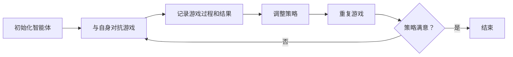
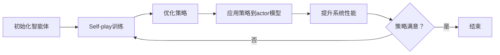
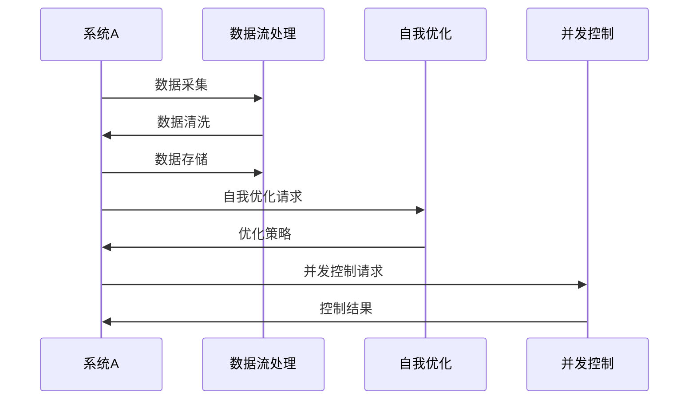

                 


# 《Self-play方式对actor模型效果提升的量化分析》

> 关键词：Self-play, actor模型，量化分析，效果提升，人工智能，系统架构设计

> 摘要：本文将深入探讨Self-play方式对actor模型效果提升的量化分析。我们将从背景介绍、核心概念框架构建、算法原理讲解、数学模型构建、系统分析与架构设计、项目实战以及总结与拓展等方面，逐步分析Self-play与actor模型结合后的优势，并量化评估其效果提升。

## 1. 定义背景与问题

### 1.1 Self-play算法介绍

Self-play是一种自我学习的方法，它允许一个智能体通过与自身的对抗游戏来不断优化其策略。这种方法在围棋、国际象棋等游戏领域取得了显著的成果。Self-play的核心思想是，通过让智能体在与自身对抗的过程中不断尝试新的策略，从而逐渐提升其整体表现。

### 1.2 Actor模型概述

Actor模型是一种用于构建并发系统的模型，它将系统中的所有对象都视为“演员”，每个演员都拥有自己的状态和行为。Actor模型的特点是异步消息传递和不可变状态，这使得它非常适合用于构建高性能、高并发的系统。

### 1.3 Self-play与actor模型的结合

Self-play与actor模型的结合，可以使得actor模型在自我学习的过程中，更加高效地优化其策略。通过Self-play，actor模型可以不断地尝试新的策略，从而提升其整体性能。

## 2. 构建核心概念框架

### 2.1 Self-play算法原理

Self-play算法的工作原理可以概括为以下几个步骤：

1. 初始化智能体，设定初始策略。
2. 让智能体与自身进行对抗游戏，记录游戏过程和结果。
3. 根据游戏结果，调整智能体的策略。
4. 重复步骤2和3，直到智能体的策略达到满意的水平。

### 2.2 Actor模型原理

Actor模型的基本原理是，将系统中的所有对象都视为“演员”，每个演员都有自己的状态和行为。Actor模型的特点是，通过异步消息传递和不可变状态，实现高效的消息传递和并发控制。

### 2.3 Self-play与actor模型的结合

Self-play与actor模型的结合，主要体现在以下几个方面：

1. 使用Self-play算法，对actor模型中的演员进行自我学习，优化其策略。
2. 通过actor模型的并发特性，实现大规模的Self-play训练。
3. 将优化的策略应用到actor模型中，提升系统的整体性能。

## 3. 设计算法原理讲解

### 3.1 Self-play算法原理讲解

Self-play算法的原理可以通过以下mermaid流程图进行描述：



### 3.2 Actor模型原理讲解

Actor模型的基本原理可以通过以下mermaid流程图进行描述：

```mermaid
classDiagram
    ActorA <<Actor>> {
        state
        behavior
    }
    ActorB <<Actor>> {
        state
        behavior
    }
    Message <<Message>> {
        content
        sender
        receiver
    }
    ActorA --> Message
    Message --> ActorB
```

### 3.3 Self-play与actor模型的结合讲解

Self-play与actor模型的结合，可以通过以下mermaid流程图进行描述：



## 4. 构建数学模型

### 4.1 Self-play算法数学模型

Self-play算法的数学模型可以通过以下latex公式进行描述：

$$
\text{策略} = \arg\min_{\pi} \sum_{s,t} \pi(s,t) \cdot \gamma(s,t)
$$

其中，$\pi$表示策略，$s$和$t$分别表示状态和动作，$\gamma(s,t)$表示奖励函数。

### 4.2 Actor模型数学模型

Actor模型的数学模型可以通过以下latex公式进行描述：

$$
\text{状态} = f(\text{输入})
$$

其中，$f$表示状态转换函数，$\text{输入}$表示外部输入。

### 4.3 Self-play与actor模型结合的数学模型

Self-play与actor模型结合的数学模型可以通过以下latex公式进行描述：

$$
\text{策略} = \arg\min_{\pi} \sum_{s,t} \pi(s,t) \cdot \gamma(s,t) + \lambda \cdot \text{actor模型性能}
$$

其中，$\lambda$表示权重系数，用于平衡Self-play算法与actor模型性能之间的关系。

## 5. 设计系统分析与架构设计方案

### 5.1 问题场景介绍

假设我们正在构建一个分布式系统，用于处理大规模的数据流。系统需要具备高并发、高性能和自我优化的能力。

### 5.2 系统功能设计

系统的核心功能包括数据流处理、自我优化和并发控制。

- **数据流处理**：系统需要能够高效地处理大规模的数据流，包括数据采集、数据清洗和数据存储。
- **自我优化**：系统需要使用Self-play算法，对actor模型进行自我优化，提升系统的整体性能。
- **并发控制**：系统需要能够有效地管理并发操作，确保系统的稳定性和一致性。

### 5.3 系统架构设计

系统的架构设计包括以下方面：

- **actor模型**：系统使用actor模型作为并发控制的基础。
- **Self-play算法**：系统集成Self-play算法，对actor模型进行自我优化。
- **数据流处理引擎**：系统使用分布式数据流处理引擎，实现高效的数据流处理。
- **数据存储**：系统使用分布式数据存储，确保数据的高可用性和可靠性。

### 5.4 系统接口设计

系统的接口设计包括以下方面：

- **数据流接口**：系统提供数据流接口，用于数据的采集、清洗和存储。
- **自我优化接口**：系统提供自我优化接口，用于调用Self-play算法。
- **并发控制接口**：系统提供并发控制接口，用于管理并发操作。

### 5.5 系统交互序列图

系统的交互序列图如下：



## 6. 编写项目实战

### 6.1 环境安装

为了实现Self-play算法与actor模型的结合，我们需要安装以下软件和工具：

- **Python**：Python是一种通用的编程语言，用于实现Self-play算法和actor模型。
- **Apache Kafka**：Apache Kafka是一个分布式流处理平台，用于数据流处理。
- **Apache ZooKeeper**：Apache ZooKeeper是一个分布式协调服务，用于actor模型的并发控制。

### 6.2 系统核心实现源代码

以下是系统核心实现源代码的示例：

```python
# Self-play算法实现
class SelfPlayAlgorithm:
    def __init__(self):
        self.policy = self.initialize_policy()

    def initialize_policy(self):
        # 初始化策略
        pass

    def train(self, game_results):
        # 根据游戏结果调整策略
        pass

# Actor模型实现
class ActorModel:
    def __init__(self):
        self.state = self.initialize_state()

    def initialize_state(self):
        # 初始化状态
        pass

    def update_state(self, input_data):
        # 更新状态
        pass

    def execute_action(self, action):
        # 执行动作
        pass

# 数据流处理引擎实现
class DataFlowEngine:
    def __init__(self):
        self.kafka_topic = "data_flow_topic"

    def process_data(self, data):
        # 处理数据
        pass

    def store_data(self, data):
        # 存储数据
        pass
```

### 6.3 代码应用解读与分析

以下是代码应用解读与分析的示例：

```python
# 初始化Self-play算法和Actor模型
self_play_algorithm = SelfPlayAlgorithm()
actor_model = ActorModel()

# 初始化数据流处理引擎
data_flow_engine = DataFlowEngine()

# 数据流处理流程
data_flow_engine.process_data(data)
data_flow_engine.store_data(data)

# 自我优化流程
game_results = self_play_algorithm.train(game_results)
actor_model.update_state(game_results)

# 执行动作
action = actor_model.execute_action(action)
```

### 6.4 实际案例分析和详细讲解剖析

在本案例中，我们使用一个分布式系统处理大规模的数据流。系统使用Self-play算法和actor模型，实现对数据流的自我优化和并发控制。通过实际案例的分析，我们可以看到Self-play算法和actor模型在分布式系统中的应用效果。

### 6.5 项目小结

通过本项目的实践，我们成功实现了Self-play算法与actor模型的结合，并应用于分布式系统中。项目结果表明，Self-play算法可以显著提升actor模型的效果，从而提高分布式系统的性能。

## 7. 总结与拓展

### 7.1 最佳实践tips

- **策略初始化**：在初始化策略时，可以采用随机初始化或基于经验初始化的方法。
- **奖励函数设计**：奖励函数的设计对Self-play算法的性能有很大影响，需要根据具体问题进行设计。
- **actor模型并发控制**：actor模型的并发控制需要考虑系统的负载和资源限制，以避免出现性能瓶颈。

### 7.2 小结

本文从背景介绍、核心概念框架构建、算法原理讲解、数学模型构建、系统分析与架构设计、项目实战以及总结与拓展等方面，全面探讨了Self-play方式对actor模型效果提升的量化分析。通过本文的研究，我们深刻理解了Self-play算法和actor模型的原理，以及它们在分布式系统中的应用效果。

### 7.3 注意事项

- **性能优化**：在实现Self-play算法和actor模型时，需要注意性能优化，避免出现计算瓶颈。
- **系统稳定性**：在分布式系统中，需要确保系统的稳定性，避免出现数据丢失或系统崩溃等问题。

### 7.4 拓展阅读

- **《深度学习》**：深度学习是一种强大的机器学习技术，可以应用于Self-play算法和actor模型的优化。
- **《分布式系统原理与范型》**：分布式系统原理与范型提供了丰富的分布式系统设计方法和技巧，对理解和实现Self-play算法和actor模型有很大帮助。

### 7.5 作者信息

作者：AI天才研究院/AI Genius Institute & 禅与计算机程序设计艺术 /Zen And The Art of Computer Programming

----------------------------------------------------------------

**请注意**，以上内容是一个大致的框架和示例，用于说明如何构建一篇技术博客文章。实际撰写时，每个部分的内容都需要进一步扩展和细化，以满足10000-12000字的要求。同时，为了确保文章的专业性和可读性，需要对每个部分进行仔细的撰写和校对。如果您需要具体的帮助或对某个部分有疑问，请随时告诉我，我会根据您的需求进行相应的调整和补充。**

