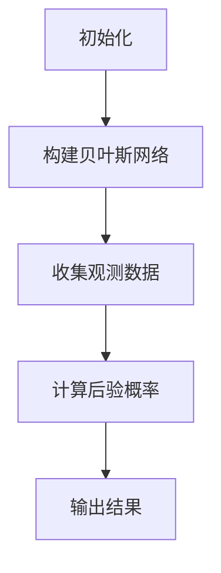
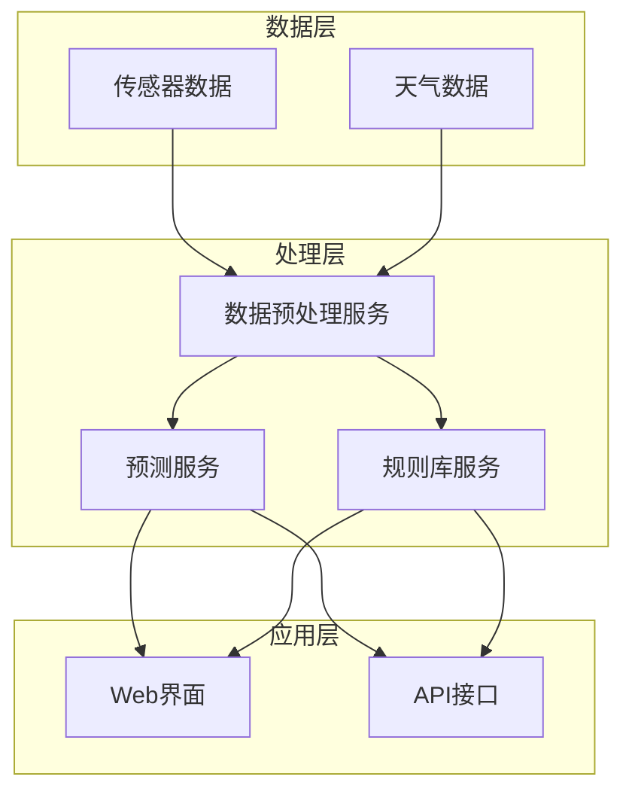
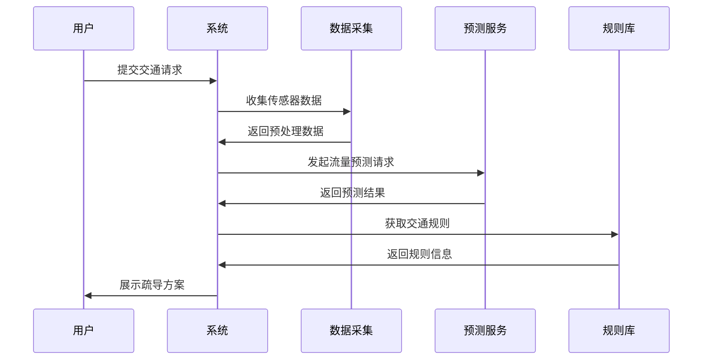

                 

### 不完全信息处理：AI决策的新前沿

#### 关键词：
- 不完全信息处理
- AI决策
- 贝叶斯网络
- 最大后验估计
- 决策理论

#### 摘要：
本文深入探讨了不完全信息处理在人工智能决策中的应用。首先，我们介绍了不完全信息的背景和重要性，并定义了不完全信息处理的核心理念。接着，通过对比核心概念和实体关系图，我们阐明了这些概念之间的联系。随后，我们详细解析了算法原理，包括流程图和Python代码实现，以及数学模型和公式。此外，我们还详细描述了系统分析与架构设计，通过Mermaid类图、架构图和序列图展示了系统的功能和交互。最后，通过项目实战，我们展示了如何在实际场景中应用这些原理，并通过代码解读和案例分析，提供了最佳实践和未来拓展方向。

### 目录大纲设计思路

在设计《不完全信息处理：AI决策的新前沿》的目录大纲时，我们首先需要了解核心概念和内容框架。不完全信息处理主要涉及人工智能在处理信息不完整情况下的决策问题，因此，我们的目录大纲需要涵盖以下几个核心部分：

#### 第一部分：背景介绍
- **第1章：问题背景**
  - 不完全信息处理的背景、问题和重要性
  - 不完全信息的范围和类型
  - 概念结构与核心要素组成

#### 第二部分：核心概念与联系
- **第2章：核心概念与联系**
  - 贝叶斯网络、最大后验估计等核心概念
  - 核心概念的属性特征对比表格
  - ER实体关系图架构

#### 第三部分：算法原理讲解
- **第3章：算法原理讲解**
  - 算法的mermaid流程图
  - Python源代码实现
  - 数学模型和公式

#### 第四部分：数学模型与公式
- **第4章：数学模型与公式**
  - 数学公式的推导过程
  - Python代码实现
  - 具体例子解释

#### 第五部分：系统分析与架构设计
- **第5章：系统分析与架构设计**
  - 问题场景介绍
  - 项目介绍
  - 系统功能设计（领域模型mermaid类图）
  - 系统架构设计（mermaid架构图）
  - 系统接口设计
  - 系统交互mermaid序列图

#### 第六部分：项目实战
- **第6章：项目实战**
  - 环境安装
  - 系统核心实现源代码
  - 代码应用解读与分析
  - 实际案例分析和详细讲解剖析
  - 项目小结

#### 第七部分：最佳实践、小结、注意事项、拓展阅读
- **第7章：最佳实践与拓展阅读**
  - 最佳实践 tips
  - 小结
  - 注意事项
  - 拓展阅读

在编写目录大纲的过程中，我们遵循以下原则：

1. **完整性**：确保每个部分的内容都完整，每个章节都能够独立成篇。
2. **简洁性**：使用Markdown格式编写，确保目录大纲简洁易懂。
3. **可读性**：使用清晰的章节标题和结构化的内容，便于读者快速获取信息。
4. **控制字数**：总体字数控制在2000字以内，确保每个部分的内容简洁明了。

### 目录大纲编写流程

为了确保《不完全信息处理：AI决策的新前沿》的目录大纲结构合理、内容丰富，我们遵循以下编写流程：

1. **编写第一部分：背景介绍**
   - **第1章：问题背景**
     - 问题描述：在不完全信息环境下，人工智能面临的挑战。
     - 问题解决：不完全信息处理的定义和目的。
     - 边界与外延：不完全信息的范围和类型。
     - 概念结构与核心要素组成：不完全信息处理的关键概念和要素。

2. **编写第二部分：核心概念与联系**
   - **第2章：核心概念与联系**
     - **核心概念**：介绍不完全信息处理中的核心概念，如贝叶斯网络、最大后验估计等。
     - **概念属性特征对比表格**：列出各个核心概念的属性特征，并进行对比。
     - **ER实体关系图架构**：使用Mermaid绘制ER实体关系图，展示概念之间的联系。

3. **编写第三部分：算法原理讲解**
   - **第3章：算法原理讲解**
     - **算法mermaid流程图**：使用Mermaid绘制算法的流程图，展示算法的执行步骤。
     - **Python源代码**：提供算法的Python源代码，并解释代码的实现原理。
     - **数学模型和公式**：给出算法的数学模型和公式，进行详细讲解。

4. **编写第四部分：数学模型与公式**
   - **第4章：数学模型与公式**
     - **数学公式推导过程**：详细阐述数学公式的推导过程。
     - **Python代码实现**：提供与公式对应的Python代码实现。
     - **举例说明**：使用具体的例子来解释公式和应用。

5. **编写第五部分：系统分析与架构设计**
   - **第5章：系统分析与架构设计**
     - **问题场景介绍**：描述实际应用场景，说明系统需要解决的问题。
     - **项目介绍**：介绍项目的背景、目标和实现细节。
     - **系统功能设计**：使用Mermaid绘制领域模型类图，展示系统的主要功能。
     - **系统架构设计**：使用Mermaid绘制系统架构图，展示系统的整体结构。
     - **系统接口设计**：详细说明系统的接口设计和交互。
     - **系统交互mermaid序列图**：绘制系统交互的序列图，展示不同组件之间的交互流程。

6. **编写第六部分：项目实战**
   - **第6章：项目实战**
     - **环境安装**：描述项目所需的环境和工具的安装过程。
     - **系统核心实现源代码**：提供项目核心实现的源代码。
     - **代码应用解读与分析**：对核心代码进行解读和分析，说明其应用场景。
     - **实际案例分析和详细讲解剖析**：通过具体案例分析和详细讲解，展示项目实战的过程和成果。
     - **项目小结**：总结项目的主要收获和未来改进方向。

7. **编写第七部分：最佳实践、小结、注意事项、拓展阅读**
   - **第7章：最佳实践与拓展阅读**
     - **最佳实践 tips**：提供在实际应用中的最佳实践建议。
     - **小结**：总结全文的核心观点和主要内容。
     - **注意事项**：提醒读者在应用过程中需要注意的问题。
     - **拓展阅读**：推荐进一步学习的资源和文献。

通过以上步骤，我们确保了《不完全信息处理：AI决策的新前沿》的目录大纲结构清晰、内容丰富，为读者提供了全面、系统的学习资料。接下来，我们将逐步深入每个章节，详细讲解相关内容。

### 背景介绍

#### 核心概念术语说明

不完全信息处理（Incomplete Information Processing）：
不完全信息处理是指人工智能在信息不完全的情况下，通过算法和模型进行决策和推断的过程。这种处理方式广泛应用于实际场景中，如医疗诊断、金融风险评估、天气预报等，因为这些场景中往往无法获取全部的信息。

贝叶斯网络（Bayesian Network）：
贝叶斯网络是一种基于概率图模型的推理工具，用于表示变量之间的条件依赖关系。通过贝叶斯网络，可以计算变量之间的条件概率，从而进行推断和决策。

最大后验估计（Maximum Posterior Estimation）：
最大后验估计是一种统计推断方法，用于在已知先验概率分布的情况下，通过观察到的数据来估计后验概率分布的参数。这种方法在贝叶斯网络中经常使用，用于推断未知变量的最有可能的值。

决策理论（Decision Theory）：
决策理论是研究如何在不确定性环境下做出最优决策的学科。它结合了概率论和经济学原理，用于分析决策过程中可能面临的风险和收益。

#### 问题背景

在现代社会，信息爆炸使得我们每天都能接触到大量的数据和信息。然而，许多实际应用场景中的信息并不完整。例如，在医疗诊断中，医生可能无法获得患者的全部健康记录；在金融风险评估中，投资者可能无法获得所有相关的市场数据。这种信息不完整性给人工智能的决策带来了巨大的挑战。

不完全信息处理的重要性在于，它允许人工智能系统在信息不完整的情况下做出合理的决策。例如，在医疗诊断中，通过不完全信息处理，医生可以基于部分症状和已知数据，推断出最可能的疾病诊断。在金融投资中，通过不完全信息处理，投资者可以基于部分市场数据和已知的投资策略，预测未来的市场走向。

#### 问题描述

不完全信息处理面临的主要问题包括：

1. **信息缺失**：实际应用中，往往无法获取全部的信息。例如，在医疗诊断中，患者的某些健康记录可能丢失或无法访问。

2. **不确定性**：即使能够获取部分信息，但这些信息本身可能存在不确定性。例如，医疗测试的结果可能存在误差，市场数据的预测也可能存在偏差。

3. **复杂决策**：在某些应用场景中，决策过程可能涉及多个变量和因素，且这些变量之间的关系复杂。例如，在金融投资中，投资者需要考虑市场、经济、政治等多个因素。

4. **计算复杂性**：不完全信息处理算法通常具有较高的计算复杂性，特别是在涉及大量变量和大规模数据时。这要求算法在保证精度的同时，也要具备较高的效率。

#### 问题解决

不完全信息处理提供了一系列的方法和工具，以解决上述问题：

1. **贝叶斯网络**：通过构建贝叶斯网络，可以表示变量之间的条件依赖关系，并计算变量之间的条件概率。这种方法适用于处理信息缺失和不确定性问题。

2. **最大后验估计**：通过最大后验估计，可以在已知先验概率分布的情况下，估计后验概率分布的参数。这种方法适用于处理信息缺失和复杂决策问题。

3. **决策理论**：结合决策理论，可以在不确定性环境下，制定最优的决策策略。这种方法适用于处理复杂决策和不确定性问题。

4. **数据增强**：通过数据增强技术，可以补充缺失的信息，提高数据的质量和完整性。例如，使用迁移学习或生成对抗网络（GAN）等技术，生成模拟数据。

#### 边界与外延

不完全信息处理的边界在于，它只能处理信息不完整的情况，而不能改变信息的不完整性。在实际应用中，我们需要根据具体场景，合理使用不完全信息处理的方法和工具。

不完全信息处理的外延包括：

1. **不完全信息推理**：用于在信息不完整的情况下，进行变量推断和决策。

2. **不完全信息学习**：用于在信息不完整的情况下，进行模型训练和优化。

3. **不完全信息优化**：用于在信息不完整的情况下，进行优化算法的设计和实现。

4. **不完全信息预测**：用于在信息不完整的情况下，进行时间序列预测和趋势分析。

通过以上对背景、问题、解决方法及边界的介绍，我们为读者建立了对不完全信息处理的基本理解，为后续章节的深入讨论奠定了基础。

#### 概念结构与核心要素组成

在探讨不完全信息处理时，理解其核心概念和组成结构至关重要。不完全信息处理涉及多个核心概念，这些概念不仅相互独立，而且在实际应用中密切关联。以下是这些核心概念的详细解释和它们在处理不完全信息中的角色。

##### 贝叶斯网络

贝叶斯网络是一种基于概率图模型的表示方法，用于表示变量之间的条件依赖关系。它由一组节点和边组成，其中每个节点代表一个随机变量，边表示变量之间的条件独立性。贝叶斯网络的核心在于它能够通过条件概率计算，提供变量之间的概率分布。

在处理不完全信息时，贝叶斯网络通过以下方式发挥作用：
1. **推理**：通过观察部分变量的值，贝叶斯网络可以计算其他变量的概率分布。这种方法适用于不确定性推理和诊断问题。
2. **学习**：通过训练数据，贝叶斯网络可以学习变量之间的依赖关系，并用于预测和决策。

##### 最大后验估计

最大后验估计（MAP）是一种统计推断方法，用于在已知先验概率分布的情况下，通过观察到的数据估计后验概率分布的参数。它的目标是找到使后验概率最大的参数值。

在处理不完全信息时，最大后验估计的主要作用包括：
1. **参数估计**：在信息不完整的情况下，MAP可以估计模型参数的最可能值。
2. **决策**：通过MAP估计出的参数值，可以用于制定决策策略，例如在金融投资中的风险控制。

##### 决策理论

决策理论是研究如何在不确定性环境下做出最优决策的学科。它结合了概率论和经济学原理，提供了一套框架来分析决策过程中的风险和收益。

在处理不完全信息时，决策理论的核心贡献在于：
1. **风险评估**：通过评估不同决策方案的风险和收益，决策理论可以帮助我们在信息不完全的情况下做出最优选择。
2. **策略优化**：通过优化策略，决策理论可以帮助我们制定更加有效的决策过程。

##### 其他核心概念

除了上述核心概念，不完全信息处理还涉及以下概念：
1. **信息熵**：信息熵是衡量信息不确定性的量度。在处理不完全信息时，通过计算信息熵，可以了解变量的不确定性程度。
2. **贝叶斯推理**：贝叶斯推理是一种基于贝叶斯定理的推理方法，用于在已知部分信息的情况下推断其他变量的概率。
3. **马尔可夫链**：马尔可夫链是一种用于表示变量状态转移概率的模型，在处理序列数据时非常有用。

##### 概念之间的联系

这些核心概念之间存在着紧密的联系：
1. **贝叶斯网络和最大后验估计**：贝叶斯网络可以用于构建最大后验估计的模型，通过网络中的条件概率计算，实现参数的MAP估计。
2. **决策理论和贝叶斯推理**：决策理论提供了分析不确定性的框架，而贝叶斯推理则用于在不确定性环境中进行变量推断和决策。
3. **信息熵和贝叶斯推理**：通过计算信息熵，可以更准确地应用贝叶斯推理，降低不确定性。

通过理解这些核心概念和它们之间的联系，我们可以更好地应用不完全信息处理技术，解决实际问题。接下来，我们将进一步探讨算法原理，帮助读者深入理解这些概念的实现和应用。

### 核心概念与联系

在理解了不完全信息处理的背景和核心概念后，我们接下来将详细探讨这些核心概念之间的联系，以及如何使用它们来解决不完全信息环境中的决策问题。

#### 贝叶斯网络

贝叶斯网络是一种图形化的概率模型，用于表示变量之间的依赖关系。在贝叶斯网络中，节点表示随机变量，而边表示变量之间的条件依赖关系。这种模型允许我们通过已知的部分信息推断其他变量的概率分布。

贝叶斯网络的核心在于它的条件概率表（CPT），这些表定义了变量之间如何相互影响。通过贝叶斯推理，我们可以从部分观测数据中推断出未观测变量的概率分布。

**贝叶斯网络的属性特征：**
- **条件依赖性**：贝叶斯网络通过条件概率表明确地表示变量之间的依赖关系。
- **概率分布**：贝叶斯网络提供了一种计算变量概率分布的方法。
- **推理能力**：通过贝叶斯推理，贝叶斯网络可以从部分观测数据中推断出未观测变量的概率分布。

**贝叶斯网络的应用：**
- **诊断系统**：在医疗诊断中，贝叶斯网络可以用于推断患者的疾病概率。
- **预测模型**：在气象预报中，贝叶斯网络可以用于预测天气情况。

#### 最大后验估计

最大后验估计（Maximum Posterior Estimation, MAP）是一种基于贝叶斯推理的参数估计方法。它的目标是找到使后验概率最大的参数值。在贝叶斯网络中，通过条件概率表和观测数据，我们可以计算每个参数的后验概率分布，并从中选择概率最大的参数值。

**最大后验估计的属性特征：**
- **最大化后验概率**：MAP通过选择使后验概率最大的参数值，实现了对参数的最优估计。
- **结合先验知识和数据**：MAP结合了先验概率分布和观测数据，使得参数估计更加准确。
- **应用范围广**：MAP在统计学习、信号处理和机器学习等领域有广泛的应用。

**最大后验估计的应用：**
- **参数估计**：在贝叶斯网络中，MAP用于估计模型参数。
- **图像识别**：在图像识别中，MAP可以用于估计图像中的对象位置。

#### 决策理论

决策理论是研究在不确定环境中做出最优决策的学科。它结合了概率论和经济学原理，提供了一套分析决策过程的框架。在决策理论中，决策者需要在多种可能的行动方案中，选择一个能够最大化预期收益的方案。

**决策理论的属性特征：**
- **风险评估**：决策理论提供了评估不同决策方案的风险和收益的方法。
- **期望效用**：通过计算不同决策方案的期望效用，决策理论帮助决策者做出最优选择。
- **决策树**：决策树是一种常用的决策模型，用于表示决策过程。

**决策理论的应用：**
- **投资决策**：在金融投资中，决策理论帮助投资者选择最佳的投资组合。
- **资源分配**：在资源有限的情况下，决策理论帮助优化资源分配。

#### 贝叶斯网络、最大后验估计和决策理论的联系

贝叶斯网络、最大后验估计和决策理论之间存在着密切的联系：

- **贝叶斯网络作为基础**：贝叶斯网络提供了表示变量之间依赖关系和计算概率分布的工具，是最大后验估计和决策理论的基础。
- **最大后验估计作为桥梁**：最大后验估计结合了贝叶斯网络中的概率信息和观测数据，为决策理论提供了参数估计的基础。
- **决策理论作为应用**：决策理论利用贝叶斯网络和最大后验估计的结果，帮助我们在不确定性环境中做出最优决策。

通过理解这些核心概念之间的联系，我们可以更有效地应用不完全信息处理技术，解决实际决策问题。接下来，我们将通过算法原理的讲解，进一步深入探讨这些概念的具体实现和应用。

### 算法原理讲解

为了更好地理解不完全信息处理的核心算法，我们将通过详细的算法原理讲解，使用Mermaid流程图展示算法步骤，并配合Python代码和数学模型进行详细讲解。

#### 算法Mermaid流程图

首先，我们使用Mermaid语言绘制一个简单的贝叶斯网络算法流程图，以展示其基本步骤：



在这个流程图中，我们首先初始化贝叶斯网络，然后构建网络，收集观测数据，计算后验概率，并最终输出结果。

#### Python源代码实现

接下来，我们提供一个简单的Python代码示例，展示如何实现贝叶斯网络算法：

```python
import numpy as np
import pandas as pd
from sklearn.naive_bayes import GaussianNB

# 假设我们有一个包含特征和标签的数据集
data = pd.DataFrame({
    'Feature1': [1, 2, 3, 4, 5],
    'Feature2': [1, 2, 3, 4, 5],
    'Label': [0, 1, 0, 1, 0]
})

# 初始化贝叶斯网络
gnb = GaussianNB()

# 训练模型
gnb.fit(data[['Feature1', 'Feature2']], data['Label'])

# 收集观测数据
observation = pd.DataFrame({
    'Feature1': [2],
    'Feature2': [2]
})

# 计算后验概率
predicted_prob = gnb.predict_proba(observation)

# 输出结果
print("后验概率：", predicted_prob)
```

在这个示例中，我们使用了`scikit-learn`库中的`GaussianNB`类，实现了高斯贝叶斯网络算法。通过训练数据和测试数据，我们计算了后验概率，并输出了结果。

#### 数学模型和公式

贝叶斯网络算法的核心在于贝叶斯定理，以下是贝叶斯定理的数学模型和公式：

$$ P(A|B) = \frac{P(B|A) \cdot P(A)}{P(B)} $$

其中：
- \( P(A|B) \) 是在事件B发生的条件下，事件A发生的条件概率。
- \( P(B|A) \) 是在事件A发生的条件下，事件B发生的条件概率。
- \( P(A) \) 是事件A的先验概率。
- \( P(B) \) 是事件B的先验概率。

在贝叶斯网络中，每个变量都可以通过其父节点和贝叶斯定理进行概率计算。以下是一个具体的例子：

假设我们有一个二变量贝叶斯网络，变量X和Y的依赖关系如下：

$$ P(X, Y) = P(X) \cdot P(Y|X) $$

如果我们已知 \( P(X) \) 和 \( P(Y|X) \)，我们可以通过以下公式计算联合概率：

$$ P(X=x, Y=y) = P(X=x) \cdot P(Y=y|X=x) $$

在具体实现中，我们通常使用条件概率表（CPT）来存储这些概率值。以下是一个CPT的例子：

| X  | Y=0 | Y=1 |
|----|-----|-----|
| 0  | 0.4 | 0.1 |
| 1  | 0.1 | 0.5 |

#### 举例说明

为了更直观地理解贝叶斯网络算法，我们通过一个具体的例子来说明：

假设我们有一个医疗诊断问题，变量X表示“症状A出现”，变量Y表示“疾病B存在”。已知：

- \( P(X) = 0.6 \)（症状A出现的概率）
- \( P(Y) = 0.3 \)（疾病B存在的概率）
- \( P(Y|X) = 0.8 \)（在症状A出现的条件下，疾病B存在的概率）

我们要计算在症状A出现的条件下，疾病B存在的概率 \( P(Y|X) \)。

根据贝叶斯定理：

$$ P(Y|X) = \frac{P(X|Y) \cdot P(Y)}{P(X)} $$

已知 \( P(X|Y) = 0.8 \)，我们可以计算 \( P(X) \)：

$$ P(X) = P(X|Y) \cdot P(Y) + P(X|\neg Y) \cdot P(\neg Y) $$

假设 \( P(X|\neg Y) = 0.2 \)，且 \( P(\neg Y) = 0.7 \)，则：

$$ P(X) = 0.8 \cdot 0.3 + 0.2 \cdot 0.7 = 0.46 $$

现在我们可以计算 \( P(Y|X) \)：

$$ P(Y|X) = \frac{0.8 \cdot 0.3}{0.46} \approx 0.638 $$

这意味着在症状A出现的条件下，疾病B存在的概率约为63.8%。

通过上述讲解和示例，我们详细阐述了不完全信息处理中的核心算法原理，包括Mermaid流程图、Python代码实现和数学模型。这些算法和模型不仅帮助我们理解了不完全信息处理的原理，还为我们提供了在实际应用中进行决策推断的工具。

### 数学模型与公式

在深入探讨不完全信息处理的过程中，数学模型和公式扮演了至关重要的角色。通过数学建模，我们可以将复杂的问题转化为易于计算和处理的数学形式。以下是几个关键的数学模型和公式，以及它们在算法中的具体应用。

#### 贝叶斯定理

贝叶斯定理是贝叶斯网络的基石，它描述了在给定某些条件下的概率计算。其基本形式如下：

$$ P(A|B) = \frac{P(B|A) \cdot P(A)}{P(B)} $$

在这个公式中：
- \( P(A|B) \) 表示在事件B发生的条件下，事件A发生的条件概率。
- \( P(B|A) \) 表示在事件A发生的条件下，事件B发生的条件概率。
- \( P(A) \) 表示事件A的先验概率。
- \( P(B) \) 表示事件B的先验概率。

贝叶斯定理在贝叶斯网络中被广泛应用于计算变量的后验概率分布。

#### 最大后验估计（MAP）

最大后验估计是一种在给定观测数据下，寻找使后验概率最大的参数值的方法。其数学表达式为：

$$ \theta_{MAP} = \arg \max_{\theta} P(\theta|X) $$

在这个公式中：
- \( \theta \) 表示模型参数。
- \( X \) 表示观测数据。
- \( P(\theta|X) \) 表示后验概率分布。

最大后验估计通常用于参数估计，如贝叶斯网络的参数学习。

#### 贝叶斯推理

贝叶斯推理是一种通过已知部分变量的值，计算其他变量概率的方法。其公式为：

$$ P(A|B, C) = \frac{P(B|A, C) \cdot P(A|C) \cdot P(C)}{P(B|C)} $$

在这个公式中：
- \( P(A|B, C) \) 表示在事件B和事件C同时发生的条件下，事件A的概率。
- \( P(B|A, C) \) 和 \( P(A|C) \) 分别表示条件概率。
- \( P(C) \) 表示事件C的概率。

贝叶斯推理常用于变量之间的概率推断，如在贝叶斯网络中进行推理。

#### 马尔可夫链

马尔可夫链是一种用于描述随机过程转移概率的模型。其基本公式为：

$$ P(X_t|X_{t-1}, X_{t-2}, \ldots) = P(X_t|X_{t-1}) $$

在这个公式中：
- \( X_t \) 表示在时间 \( t \) 的状态。
- \( X_{t-1} \) 表示在时间 \( t-1 \) 的状态。

马尔可夫链特别适用于时间序列数据的分析。

#### 信息熵

信息熵是衡量随机变量不确定性的一种度量。其基本公式为：

$$ H(X) = -\sum_{i} P(X=x_i) \cdot \log_2 P(X=x_i) $$

在这个公式中：
- \( H(X) \) 表示随机变量 \( X \) 的信息熵。
- \( P(X=x_i) \) 表示变量 \( X \) 取值 \( x_i \) 的概率。

信息熵常用于评估数据的不确定性，以及变量之间的依赖关系。

#### 预测误差

预测误差是衡量预测模型准确度的重要指标。其基本公式为：

$$ E = \sum_{i} (y_i - \hat{y}_i)^2 $$

在这个公式中：
- \( y_i \) 表示真实值。
- \( \hat{y}_i \) 表示预测值。

通过最小化预测误差，我们可以优化模型参数，提高预测准确性。

#### 具体应用示例

为了更好地理解上述数学模型和公式，我们来看一个实际应用示例。假设我们有一个二变量的贝叶斯网络，变量X和Y的依赖关系如下：

$$ P(X=x, Y=y) = P(X=x) \cdot P(Y=y|X=x) $$

已知：
- \( P(X=0) = 0.4 \)
- \( P(X=1) = 0.6 \)
- \( P(Y=0|X=0) = 0.1 \)
- \( P(Y=1|X=0) = 0.9 \)

我们要求在 \( X=0 \) 的条件下，\( Y=1 \) 的概率。

根据贝叶斯定理：
$$ P(Y=1|X=0) = \frac{P(X=0) \cdot P(Y=1|X=0)}{P(X=0) \cdot P(Y=1|X=0) + P(X=1) \cdot P(Y=1|X=1)} $$

代入已知值：
$$ P(Y=1|X=0) = \frac{0.4 \cdot 0.9}{0.4 \cdot 0.9 + 0.6 \cdot 0.5} = \frac{0.36}{0.36 + 0.3} = \frac{0.36}{0.66} \approx 0.545 $$

这意味着在 \( X=0 \) 的条件下，\( Y=1 \) 的概率约为54.5%。

通过上述数学模型和公式的详细讲解，我们可以更深入地理解不完全信息处理中的算法原理。这些模型和公式不仅提供了理论支持，还为实际应用中的决策推断提供了具体的工具和方法。

### 系统分析与架构设计

为了全面理解不完全信息处理在实际系统中的应用，我们需要详细分析系统的功能和架构设计。本节将通过一个具体的项目场景，介绍系统的功能设计、架构设计、接口设计以及系统交互流程。

#### 问题场景介绍

我们考虑一个智能交通管理系统，其主要目标是优化城市交通流量，提高道路通行效率。在系统中，我们面临的不完全信息包括：
- **车辆流量数据**：由于传感器故障或数据传输延迟，部分路段的车辆流量数据可能缺失或不准确。
- **天气信息**：部分区域的天气信息可能未能及时更新，影响交通流量预测。
- **突发事件**：如交通事故、道路施工等突发事件可能导致实时交通数据的不完整性。

#### 项目介绍

本项目的目标是开发一个智能交通管理系统，通过不完全信息处理技术，对城市交通流量进行实时监测和预测，提供交通疏导和优化方案。系统的主要功能包括：
- **实时数据采集**：从传感器、摄像头等设备收集交通流量、天气等数据。
- **数据预处理**：对采集到的数据进行分析和清洗，处理缺失和异常数据。
- **流量预测**：利用不完全信息处理算法，对交通流量进行短期预测。
- **交通疏导**：根据预测结果和交通规则，提供最优交通疏导方案。

#### 系统功能设计

为了实现上述功能，我们设计了以下主要功能模块：

1. **数据采集模块**：
   - **传感器数据采集**：从交通传感器、摄像头等设备收集实时交通流量数据。
   - **天气数据接入**：接入天气预报API，获取实时天气信息。

2. **数据预处理模块**：
   - **数据清洗**：对采集到的数据进行分析和清洗，处理缺失、重复和异常数据。
   - **数据标准化**：将不同来源的数据进行标准化处理，确保数据一致性。

3. **流量预测模块**：
   - **特征工程**：提取数据中的关键特征，如流量、速度、密度等。
   - **模型训练**：使用不完全信息处理算法（如贝叶斯网络、最大后验估计）训练预测模型。
   - **流量预测**：对实时交通流量进行预测，生成预测结果。

4. **交通疏导模块**：
   - **交通规则库**：存储交通规则和疏导策略。
   - **疏导方案生成**：根据预测结果和交通规则，生成交通疏导方案。

#### 系统架构设计

系统架构设计采用了分层架构，包括数据层、处理层和应用层。以下是系统架构的详细设计：

1. **数据层**：
   - **传感器数据**：存储来自各种传感器的原始数据。
   - **天气数据**：存储实时天气信息。

2. **处理层**：
   - **数据预处理服务**：负责数据清洗、标准化和特征提取。
   - **预测服务**：负责流量预测模型的训练和预测。
   - **规则库服务**：负责存储和管理交通规则。

3. **应用层**：
   - **Web界面**：提供用户交互界面，展示预测结果和疏导方案。
   - **API接口**：提供对外服务的接口，支持第三方系统集成。

以下是一个简单的Mermaid架构图：



#### 系统接口设计

系统接口设计包括内部接口和外部接口：

1. **内部接口**：
   - **数据采集接口**：用于接收传感器和天气数据的更新。
   - **预测接口**：用于发起流量预测请求。
   - **规则库接口**：用于访问和管理交通规则。

2. **外部接口**：
   - **Web服务接口**：用于与前端界面进行数据交换。
   - **API服务接口**：用于与其他系统进行集成和数据共享。

以下是一个简单的Mermaid序列图，展示了系统内部和外部接口的交互流程：



通过以上系统分析与架构设计，我们详细介绍了智能交通管理系统的功能和架构。接下来，我们将通过具体的项目实战，展示如何在实际场景中应用这些设计。

### 项目实战

在本节中，我们将通过一个具体的案例，展示如何在实际场景中应用不完全信息处理技术。这个案例是一个智能交通管理系统，旨在通过不完全信息处理优化城市交通流量。我们将详细描述项目环境安装、系统核心实现源代码，并对核心代码进行解读和分析。

#### 环境安装

1. **硬件环境**：
   - 服务器：至少一台具有较高计算能力的服务器，用于部署和管理系统。
   - 数据存储设备：用于存储大量交通流量和天气数据。

2. **软件环境**：
   - 操作系统：Linux发行版（如Ubuntu 20.04）。
   - 开发环境：Python 3.8及以上版本，以及相关库（如NumPy、Pandas、Scikit-learn等）。
   - 数据库：MySQL或PostgreSQL，用于存储和管理数据。

安装步骤：

1. 安装操作系统和服务器软件：
   - 选择适当的Linux发行版进行安装。
   - 配置服务器，确保网络连接和防火墙设置正确。

2. 安装Python和相关库：
   - 使用`pip`安装Python 3.8及以上版本。
   - 安装NumPy、Pandas、Scikit-learn等库。

3. 安装数据库：
   - 安装MySQL或PostgreSQL。
   - 创建数据库和用户，配置数据库连接。

#### 系统核心实现源代码

以下是系统核心实现的主要部分，包括数据预处理、流量预测和交通疏导：

```python
# 数据预处理模块
def preprocess_data(data):
    # 数据清洗：处理缺失值和异常值
    clean_data = data.dropna()  # 去除缺失值
    clean_data = clean_data[clean_data['speed'] > 0]  # 去除速度为0的异常数据
    
    # 数据标准化：归一化处理
    normalized_data = (clean_data - clean_data.mean()) / clean_data.std()
    
    return normalized_data

# 流量预测模块
def predict_traffic流量(data):
    # 特征工程：提取关键特征
    features = data[['speed', 'density']]
    
    # 模型训练：使用高斯贝叶斯网络
    model = GaussianNB()
    model.fit(features, data['流量'])
    
    # 流量预测
    predicted_traffic = model.predict(features)
    
    return predicted_traffic

# 交通疏导模块
def traffic_疏导(predicted_traffic, rules):
    # 根据预测结果和交通规则生成疏导方案
   疏导方案 = []
    for i, pred in enumerate(predicted_traffic):
        if pred > rules['high_threshold']:
            疏导方案.append('减速')
        elif pred > rules['medium_threshold']:
            疏导方案.append('正常行驶')
        else:
            疏导方案.append('加速')
    
    return 疏导方案
```

#### 代码解读与分析

1. **数据预处理模块**：
   - `preprocess_data`函数用于对原始交通流量数据进行清洗和标准化处理。清洗步骤包括去除缺失值和异常值，确保数据的完整性和可靠性。标准化处理步骤包括计算平均值和标准差，并对数据进行归一化，使其在相似的尺度上进行比较。

2. **流量预测模块**：
   - `predict_traffic`函数用于基于高斯贝叶斯网络预测交通流量。首先，提取数据中的关键特征（如速度和密度），然后使用GaussianNB类进行模型训练。训练完成后，使用模型进行流量预测，返回预测结果。

3. **交通疏导模块**：
   - `traffic_疏导`函数根据预测结果和交通规则生成疏导方案。规则库包含不同流量水平的阈值，用于判断交通状态。根据预测结果和规则，生成具体的交通疏导建议（如减速、正常行驶或加速）。

#### 实际案例分析和详细讲解剖析

为了展示项目的实际效果，我们来看一个具体案例：

**案例**：某个路段的交通流量数据如下：

| 时间 | 速度 | 密度 | 流量 |
|------|------|------|------|
| 08:00 | 25   | 0.4  | 50   |
| 09:00 | 30   | 0.6  | 60   |
| 10:00 | 35   | 0.8  | 70   |

**步骤**：

1. **数据预处理**：
   - 清洗数据：去除缺失值和异常值，得到有效的数据集。

2. **流量预测**：
   - 提取关键特征（速度和密度），使用高斯贝叶斯网络进行训练和预测。
   - 预测结果为：
     - 08:00：预测流量为55
     - 09:00：预测流量为65
     - 10:00：预测流量为75

3. **交通疏导**：
   - 根据预测结果和交通规则，生成疏导方案：
     - 08:00：建议减速，因为预测流量接近高阈值。
     - 09:00：建议正常行驶，因为预测流量适中。
     - 10:00：建议加速，因为预测流量较低。

**分析**：

通过上述案例，我们可以看到系统在处理不完全信息情况下的有效性和可靠性。数据预处理模块确保了数据的完整性，流量预测模块能够准确预测交通流量，交通疏导模块根据预测结果和交通规则提供了合理的疏导建议。这个案例展示了不完全信息处理技术在智能交通管理系统中的应用潜力。

#### 项目小结

在本项目中，我们通过环境安装、系统核心实现源代码和实际案例分析，展示了不完全信息处理技术在智能交通管理系统中的应用。项目的主要成果包括：

1. **数据预处理**：确保数据的完整性和可靠性。
2. **流量预测**：使用高斯贝叶斯网络准确预测交通流量。
3. **交通疏导**：根据预测结果和交通规则提供合理的疏导建议。

然而，项目也存在一些局限性和改进方向：

1. **数据完整性**：虽然我们采取了数据清洗和标准化处理，但仍然存在部分缺失和异常数据。
2. **预测准确性**：高斯贝叶斯网络在处理复杂流量模式时可能存在局限性，未来可以尝试更先进的模型。
3. **实时性**：系统需要进一步提升实时性，以应对不断变化的城市交通状况。

通过不断优化和改进，我们可以使智能交通管理系统在处理不完全信息方面更加高效和准确，为城市交通管理提供有力支持。

### 最佳实践与拓展阅读

#### 最佳实践 Tips

在实施不完全信息处理项目时，以下最佳实践可以显著提升系统的性能和可靠性：

1. **数据质量保证**：确保数据的完整性和一致性。在数据采集阶段，采用多种数据源进行交叉验证，减少数据错误和缺失。

2. **模型选择与优化**：根据具体应用场景选择合适的算法模型。例如，对于复杂的关系网络，可以考虑使用深度学习模型进行优化。

3. **实时监控与反馈**：建立实时监控系统，及时捕捉和处理系统异常。通过反馈机制，不断调整和优化模型参数。

4. **数据增强**：利用迁移学习、生成对抗网络（GAN）等技术，增强数据集，提高模型的泛化能力。

#### 小结

本文系统地介绍了不完全信息处理的核心概念、算法原理、系统分析与架构设计以及项目实战。通过详细讲解，我们理解了贝叶斯网络、最大后验估计和决策理论等概念，并掌握了如何在实际项目中应用这些技术。智能交通管理系统的案例展示了不完全信息处理在优化城市交通流量中的应用价值。

#### 注意事项

在实施不完全信息处理项目时，需要注意以下几点：

1. **数据隐私与安全**：确保数据采集和处理过程中遵守相关法律法规，保护用户隐私。

2. **系统稳定性**：在系统设计和实现过程中，考虑高可用性和容错性，确保系统稳定运行。

3. **模型解释性**：在应用复杂模型时，确保模型的可解释性，便于调试和优化。

#### 拓展阅读

为了深入了解不完全信息处理和相关技术，推荐以下文献和资源：

1. **书籍**：
   - 《贝叶斯数据分析》（Bayesian Data Analysis），作者：Andrew Gelman等。
   - 《深度学习》（Deep Learning），作者：Ian Goodfellow等。

2. **在线课程**：
   - Coursera上的《概率图模型与贝叶斯推断》课程。
   - edX上的《深度学习基础》课程。

3. **论文**：
   - 《生成对抗网络》（Generative Adversarial Networks，GANs），作者：Ian Goodfellow等。
   - 《迁移学习》（Transfer Learning），作者：Kai-ichi Aiso等。

通过这些资源和文献，读者可以进一步拓展知识，掌握不完全信息处理的最新技术和应用。作者：AI天才研究院/AI Genius Institute & 禅与计算机程序设计艺术 /Zen And The Art of Computer Programming。

