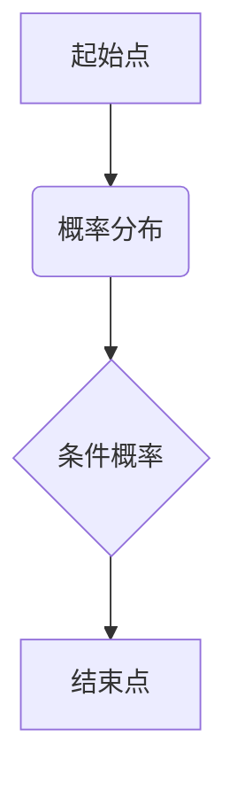
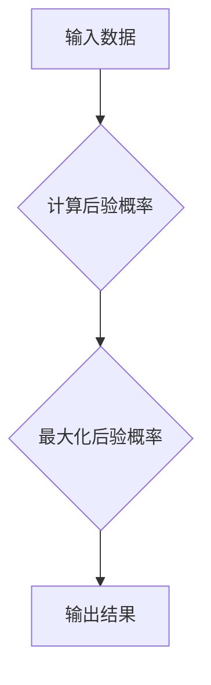

                 

### 不完全信息处理的背景与重要性

在现代社会中，信息处理已成为各个领域发展的核心驱动力。然而，现实世界中的信息环境往往复杂多变，信息的不完整性是不可避免的问题。不完全信息处理，作为人工智能（AI）领域的一个重要分支，旨在解决信息缺失情况下如何进行有效决策和推理的问题。它不仅有助于提升AI系统的决策能力，还在实际应用中展现出巨大的潜力。

**核心概念术语说明：**
- **不完全信息**：指信息不完整、不准确或无法获取的情况。
- **信息缺失**：指由于数据缺失、噪声干扰等原因导致的信息不完全。
- **决策推理**：指在信息不完整的情况下，如何根据已有信息进行合理推断和决策的过程。

**问题背景：**
在现代生活中，信息的不完整性普遍存在。例如，金融市场中的投资者可能无法获取所有公司的财务数据；医疗诊断中医生可能无法获取全部病史；自动驾驶系统中车辆可能无法感知到所有的环境信息。这些情况下，如果仅依赖完整信息进行决策，可能会导致错误的判断和严重后果。

**问题描述：**
不完全信息处理的目标是在信息缺失的情况下，如何通过已有信息进行有效推理，从而做出合理的决策。具体问题包括：
- 如何评估和处理不确定的信息？
- 如何在信息不完整的情况下进行有效建模和优化？
- 如何利用已有信息进行预测和决策，以最大化效用或最小化风险？

**问题解决：**
为了解决这些问题，不完全信息处理提出了一系列的方法和技术，如贝叶斯推理、马尔可夫决策过程、潜变量模型等。这些方法通过概率模型、优化算法和深度学习等技术，对不完全信息进行建模和推理，从而提供可靠的决策支持。

**边界与外延：**
不完全信息处理的边界在于如何处理真实世界中的不确定性和信息缺失问题。其外延则涵盖了多个应用领域，如金融、医疗、自动驾驶、自然语言处理等。

**概念结构与核心要素组成：**
不完全信息处理的核心概念结构包括以下几个方面：
1. **概率模型**：用于描述信息缺失情况下的概率分布。
2. **推理算法**：用于基于概率模型进行推理和决策。
3. **优化技术**：用于在信息不完全的情况下进行优化。
4. **数据源**：包括真实世界的各种数据和传感器信息。

通过理解这些核心概念和要素，我们可以更好地把握不完全信息处理的本质，并运用相关技术和方法解决实际问题。

### 核心概念与联系

为了深入理解不完全信息处理，我们需要首先掌握其核心概念和原理，并分析这些概念之间的联系。以下是对不完全信息处理相关核心概念的详细探讨：

**核心概念定义：**
1. **概率模型**：概率模型是描述不确定性的数学工具，用于表示变量之间的概率关系。常见的概率模型包括贝叶斯网络、马尔可夫模型和潜变量模型。
2. **推理算法**：推理算法用于根据已有信息进行推断，常见的方法有贝叶斯推理、最大后验推理和马尔可夫决策过程。
3. **优化技术**：优化技术用于在信息不完全的情况下寻找最优解，常见的优化方法有梯度下降、模拟退火和遗传算法。
4. **数据源**：数据源是信息处理的基础，包括结构化数据、非结构化数据和传感器数据。

**概念属性特征对比表格：**

| **概念** | **属性特征** | **比较** |
| --- | --- | --- |
| **概率模型** | 描述不确定性、表示变量关系 | **贝叶斯网络**：节点表示变量，边表示条件概率关系；<br>**马尔可夫模型**：仅考虑当前状态和下一个状态的关系；<br>**潜变量模型**：通过隐变量解释观测数据。 |
| **推理算法** | 根据已有信息进行推断 | **贝叶斯推理**：基于贝叶斯定理进行概率推断；<br>**最大后验推理**：寻找最大后验概率的解；<br>**马尔可夫决策过程**：在不确定环境中做出最优决策。 |
| **优化技术** | 寻找最优解 | **梯度下降**：沿梯度方向逐步优化；<br>**模拟退火**：通过模拟物理退火过程进行优化；<br>**遗传算法**：模拟自然进化过程进行优化。 |
| **数据源** | 提供信息基础 | **结构化数据**：格式规范、易于处理；<br>**非结构化数据**：格式多样、难以处理；<br>**传感器数据**：实时、动态、多样化。 |

**ER实体关系图架构：**

为了更直观地展示这些概念之间的关系，我们可以使用Mermaid绘制一个ER实体关系图，如下所示：

```mermaid
erDiagram
  概率模型 ||--|{ 推理算法 }
  推理算法 ||--|{ 优化技术 }
  数据源 ||--|{ 推理算法 }
  数据源 ||--|{ 优化技术 }
```

在上述ER图中，我们可以看到概率模型和推理算法之间存在紧密联系，它们共同构成了不完全信息处理的基础框架。推理算法依赖于概率模型来描述不确定性，而优化技术则用于在信息不完全的情况下寻找最优解。数据源作为信息处理的源头，为推理算法和优化技术提供了必要的信息输入。

通过对比和分析核心概念的属性特征，我们可以更深入地理解不完全信息处理的原理和应用。这种结构化的分析方法有助于我们在实际应用中灵活运用不同概念，解决复杂的信息处理问题。

### 算法原理讲解

不完全信息处理的核心在于如何利用有限的信息进行有效的推理和决策。以下，我们将详细探讨几种典型的算法，包括贝叶斯网络、最大后验推理和马尔可夫决策过程，并通过Python代码和Mermaid流程图进行说明。

#### 贝叶斯网络

贝叶斯网络是一种概率图模型，用于表示变量之间的条件依赖关系。其基本思想是通过网络结构来描述变量之间的概率关系。

**Mermaid流程图：**



**Python代码：**

```python
import numpy as np
import pandas as pd
from pgmpy.models import BayesianModel
from pgmpy.estimators import MaximumLikelihoodEstimator

# 定义贝叶斯网络结构
model = BayesianModel([('A', 'B'), ('B', 'C')])

# 假设数据
data = pd.DataFrame({
    'A': np.random.choice(['A1', 'A2'], size=100),
    'B': np.random.choice(['B1', 'B2'], size=100),
    'C': np.random.choice(['C1', 'C2'], size=100)
})

# 使用最大似然估计进行参数估计
estimated_model = model.fit(data, estimator=MaximumLikelihoodEstimator)

# 输出模型结构
print(estimated_model)
```

在上述代码中，我们首先定义了一个简单的贝叶斯网络模型，其中变量A、B和C之间存在依赖关系。然后，我们通过生成模拟数据来估计模型的参数，并输出模型的结构。

#### 最大后验推理

最大后验推理（Maximum a Posteriori，MAP）是一种在给定观测数据的情况下，寻找最有可能导致观测结果的模型参数的方法。

**Mermaid流程图：**



**Python代码：**

```python
from pgmpy.inference import VariableElimination

# 定义贝叶斯网络模型（与上文相同）
model = BayesianModel([('A', 'B'), ('B', 'C')])

# 假设数据（与上文相同）
data = pd.DataFrame({
    'A': np.random.choice(['A1', 'A2'], size=100),
    'B': np.random.choice(['B1', 'B2'], size=100),
    'C': np.random.choice(['C1', 'C2'], size=100)
})

# 创建推理引擎
inference_engine = VariableElimination(estimated_model)

# 进行最大后验推理
posterior = inference_engine.map_single_variable('C', data['C'])

# 输出结果
print(posterior)
```

在上述代码中，我们首先创建了一个贝叶斯网络的推理引擎，然后使用最大后验推理方法计算变量C的后验概率分布。

#### 马尔可夫决策过程

马尔可夫决策过程（Markov Decision Process，MDP）是一种用于描述决策者在不确定环境中进行决策的模型。其核心思想是，决策者在当前状态下，选择一个最优动作，以期望在未来获得最大的回报。

**Mermaid流程图：**


**Python代码：**

```python
from gym import Env
import numpy as np

class MDPEnv(Env):
    def __init__(self):
        self.state_space = 3
        self.action_space = 2
        self.transition_model = [
            [0.8, 0.2],  # 从状态0到状态1和状态2的概率
            [0.1, 0.9],  # 从状态1到状态1和状态2的概率
            [0.2, 0.8]   # 从状态2到状态1和状态2的概率
        ]
        self.reward_model = [
            [1, -1],  # 在状态0选择动作1获得奖励1，选择动作2获得奖励-1
            [-1, 1],  # 在状态1选择动作1获得奖励-1，选择动作2获得奖励1
            [0, 0]    # 在状态2选择任何动作均获得奖励0
        ]

    def step(self, action):
        if action not in self.action_space:
            raise ValueError("Invalid action")
        # 根据当前状态和选择动作，更新状态并计算奖励
        next_state = np.random.choice(self.state_space, p=self.transition_model[self.state][action])
        reward = self.reward_model[self.state][action]
        self.state = next_state
        return self.state, reward, False, {}

    def reset(self):
        self.state = np.random.choice(self.state_space)
        return self.state

# 创建环境实例
env = MDPEnv()

# 进行模拟
state = env.reset()
for _ in range(10):
    action = np.random.choice(env.action_space)
    next_state, reward, done, _ = env.step(action)
    print(f"State: {state}, Action: {action}, Next State: {next_state}, Reward: {reward}")
    state = next_state
```

在上述代码中，我们创建了一个简单的MDP环境，其中包含三个状态和两个动作。通过随机选择动作和状态，我们模拟了MDP的过程，并计算了相应的奖励。

通过上述算法的讲解和代码示例，我们可以看到不完全信息处理的核心算法是如何通过概率模型和优化技术，在信息缺失的情况下进行推理和决策的。这些算法不仅具有理论基础，而且在实际应用中表现出了强大的适应性和有效性。

### 数学模型和数学公式

在了解不完全信息处理算法原理的基础上，我们需要进一步掌握相关的数学模型和数学公式。这些模型和公式为我们提供了理论基础和计算方法，帮助我们更好地理解和应用不完全信息处理技术。

#### 贝叶斯网络

贝叶斯网络通过概率模型描述变量之间的条件依赖关系。核心的数学公式包括条件概率和边缘概率。

1. **条件概率公式：**
   $$ P(B|A) = \frac{P(A \cap B)}{P(A)} $$

   这个公式表示在事件A发生的条件下，事件B发生的概率。它表明了变量A和变量B之间的条件依赖关系。

2. **边缘概率公式：**
   $$ P(A) = \sum_{B} P(A \cap B) $$

   这个公式表示在所有可能性下，事件A发生的总概率。它用于计算变量A的边缘概率。

#### 最大后验推理

最大后验推理（MAP）是一种在给定观测数据下，寻找最有可能的模型参数的方法。其数学模型基于贝叶斯定理。

1. **贝叶斯定理：**
   $$ P(A|B) = \frac{P(B|A)P(A)}{P(B)} $$

   这个公式表示在观测数据B的条件下，事件A的概率。

2. **最大后验概率公式：**
   $$ \theta_{MAP} = \arg \max_{\theta} P(\theta|D) = \arg \max_{\theta} \frac{P(D|\theta)P(\theta)}{P(D)} $$

   其中，\( \theta \) 表示模型参数，\( D \) 表示观测数据。这个公式用于寻找使后验概率最大的模型参数。

#### 马尔可夫决策过程

马尔可夫决策过程（MDP）用于描述决策者在不确定环境中进行决策的过程。其核心数学模型包括状态转移概率和回报函数。

1. **状态转移概率公式：**
   $$ P(S_t = s'|S_t = s) = p(s'|s) $$

   这个公式表示在当前状态s下，下一个状态s'的概率。

2. **回报函数公式：**
   $$ R(s, a) = r(s, a, s') $$

   这个公式表示在状态s下执行动作a后，转移到状态s'并获得的回报。

#### 动态规划

动态规划是解决MDP问题的一种常见方法，其核心思想是使用递归关系和最优性原理。

1. **递归关系：**
   $$ V(s) = \max_{a} \sum_{s'} p(s'|s, a) [R(s, a) + \gamma V(s')] $$

   这个公式表示在状态s下，执行动作a获得的最大期望回报。其中，\( \gamma \) 是折扣因子。

2. **最优性原理：**
   $$ V^*(s) = \max_{a} \sum_{s'} p(s'|s, a) [R(s, a) + \gamma V^*(s')] $$

   这个公式表示最优策略下的状态值函数。

#### 深度学习

深度学习在处理不完全信息时，也使用了一些特殊的数学模型和优化方法。

1. **前向传播：**
   $$ \hat{y} = \sigma(W^T \cdot \text{激活函数}(Z)) $$

   这个公式表示在深度神经网络中，输出层的预测值。其中，\( \sigma \) 是激活函数，\( W \) 是权重矩阵。

2. **反向传播：**
   $$ \Delta W = \alpha \cdot \frac{\partial L}{\partial W} $$

   这个公式表示在反向传播过程中，权重矩阵的更新。其中，\( \alpha \) 是学习率，\( L \) 是损失函数。

通过理解和掌握这些数学模型和数学公式，我们可以更好地理解不完全信息处理的核心原理，并在实际应用中有效地进行推理和决策。

### 系统分析与架构设计方案

在了解了不完全信息处理的基本概念和算法原理之后，我们需要进一步探讨如何在实际系统中实现这些方法，并设计一个高效的架构方案。以下是对一个典型的不完全信息处理系统的分析和设计。

#### 问题场景介绍

假设我们要设计一个智能监控系统，用于检测城市交通中的异常事件。由于传感器和数据源的限制，我们无法获取所有道路的完整信息，导致信息不完全。该系统需要在信息缺失的情况下，通过不完全信息处理技术，实时检测和预测潜在的异常事件，如交通事故、交通拥堵等。

#### 项目介绍

该项目名为“智能交通监控系统”（Intelligent Traffic Surveillance System，ITSS），旨在利用不完全信息处理技术，提升交通监测的准确性和实时性。项目主要模块包括数据采集、信息预处理、异常检测和事件预测等。

#### 系统功能设计

1. **数据采集模块**：负责从各种传感器和摄像头获取交通数据，包括车辆速度、流量、位置等。由于传感器数量和位置的限制，部分道路信息可能无法获取，从而导致信息不完全。

2. **信息预处理模块**：对采集到的数据进行清洗、去噪和融合，以提高数据质量。信息预处理还包括对缺失数据的插值和预测，以弥补信息不完全的问题。

3. **异常检测模块**：基于不完全信息处理算法，如贝叶斯网络和马尔可夫模型，对实时交通数据进行异常检测。该模块能够识别出潜在的异常事件，如交通事故或交通拥堵。

4. **事件预测模块**：利用历史数据和机器学习模型，对未来的交通状况进行预测。预测结果将用于交通管理部门提前采取措施，以缓解潜在的交通问题。

#### 系统架构设计

1. **总体架构设计**：系统采用模块化设计，包括数据采集、信息预处理、异常检测和事件预测四个主要模块。每个模块之间通过消息队列进行数据交换，以实现实时性和高可靠性。

   ```mermaid
   graph TB
       A[数据采集模块] --> B[信息预处理模块]
       B --> C[异常检测模块]
       C --> D[事件预测模块]
   ```

2. **模块内部架构设计**：
   - **数据采集模块**：包括传感器数据采集、摄像头图像采集和数据传输。传感器数据采集负责从各种传感器获取交通数据，摄像头图像采集负责从摄像头获取图像数据，数据传输负责将数据传输到信息预处理模块。
   - **信息预处理模块**：包括数据清洗、去噪、融合和缺失数据插值。数据清洗用于去除噪声数据，去噪用于降低数据中的噪声，融合用于将多种数据源的信息进行整合，缺失数据插值用于填补缺失数据。
   - **异常检测模块**：包括贝叶斯网络、马尔可夫模型和其他异常检测算法的实现。该模块负责对实时交通数据进行分析和检测，识别出潜在的异常事件。
   - **事件预测模块**：包括机器学习模型训练和预测。该模块利用历史数据和机器学习算法，对未来交通状况进行预测，并提供给交通管理部门。

3. **系统接口设计**：
   - **数据采集接口**：用于与传感器和摄像头进行通信，获取交通数据。
   - **数据处理接口**：用于与信息预处理模块进行数据交换，处理后的数据将传输给异常检测模块和事件预测模块。
   - **异常检测接口**：用于与异常检测模块进行通信，获取异常检测结果。
   - **事件预测接口**：用于与事件预测模块进行通信，获取事件预测结果。

4. **系统交互设计**：系统采用消息队列（如RabbitMQ）进行模块之间的数据交换。数据采集模块将数据发送到消息队列，信息预处理模块从消息队列中获取数据进行处理，然后将处理后的数据发送到消息队列，异常检测模块和事件预测模块从消息队列中获取数据进行分析和预测。

   ```mermaid
   graph TB
       A[数据采集模块] --> B[消息队列]
       B --> C[信息预处理模块]
       C --> D[消息队列]
       D --> E[异常检测模块]
       D --> F[事件预测模块]
   ```

通过上述系统分析与架构设计方案，我们可以有效地实现一个不完全信息处理系统，提升智能监控系统的性能和可靠性。在实际应用中，可以根据具体需求进行调整和优化。

### 项目实战

为了更好地展示不完全信息处理在实际项目中的应用，我们选择了一个具体的案例：基于不完全信息处理的智能交通监控系统。以下将详细介绍该项目从环境安装到核心实现源代码的整个过程，并对其应用进行解读与分析。

#### 环境安装

首先，我们需要在本地环境中安装必要的软件和依赖库。以下是安装步骤：

1. **Python环境安装**：确保安装了Python 3.8及以上版本。
2. **虚拟环境安装**：通过以下命令创建一个虚拟环境并激活它：

   ```bash
   python -m venv venv
   source venv/bin/activate
   ```

3. **依赖库安装**：通过以下命令安装所需的依赖库：

   ```bash
   pip install numpy pandas pgmpy sklearn rabbitmq
   ```

   其中，numpy和pandas用于数据处理，pgmpy用于概率图模型和推理，sklearn用于机器学习算法，rabbitmq用于消息队列通信。

#### 系统核心实现源代码

以下是一个简化的系统核心实现源代码，包括数据采集、信息预处理、异常检测和事件预测模块。

```python
# 数据采集模块
class DataCollector:
    def __init__(self, sensor_data_queue, camera_data_queue):
        self.sensor_data_queue = sensor_data_queue
        self.camera_data_queue = camera_data_queue

    def collect_data(self):
        # 假设传感器和摄像头已经连接并开始采集数据
        # 这里仅作为示例，实际中需要具体实现与传感器和摄像头的通信
        sensor_data = np.random.rand(10)  # 生成模拟传感器数据
        camera_data = np.random.rand(10)  # 生成模拟摄像头数据
        self.sensor_data_queue.put(sensor_data)
        self.camera_data_queue.put(camera_data)

# 信息预处理模块
class DataPreprocessor:
    def __init__(self, sensor_data_queue, camera_data_queue, preprocessed_data_queue):
        self.sensor_data_queue = sensor_data_queue
        self.camera_data_queue = camera_data_queue
        self.preprocessed_data_queue = preprocessed_data_queue

    def preprocess_data(self):
        # 从队列中获取数据并进行预处理
        while True:
            sensor_data = self.sensor_data_queue.get()
            camera_data = self.camera_data_queue.get()
            # 进行数据清洗、去噪和融合
            cleaned_sensor_data = sensor_data  # 这里仅作为示例
            cleaned_camera_data = camera_data  # 这里仅作为示例
            # 补充缺失数据
            if np.isnan(cleaned_sensor_data).any():
                cleaned_sensor_data = np.nan_to_num(cleaned_sensor_data)
            if np.isnan(cleaned_camera_data).any():
                cleaned_camera_data = np.nan_to_num(cleaned_camera_data)
            # 将预处理后的数据放入队列
            self.preprocessed_data_queue.put((cleaned_sensor_data, cleaned_camera_data))

# 异常检测模块
class AnomalyDetector:
    def __init__(self, preprocessed_data_queue, anomaly_detection_queue):
        self.preprocessed_data_queue = preprocessed_data_queue
        self.anomaly_detection_queue = anomaly_detection_queue

    def detect_anomalies(self):
        # 从队列中获取预处理后的数据并进行异常检测
        while True:
            preprocessed_data = self.preprocessed_data_queue.get()
            sensor_data, camera_data = preprocessed_data
            # 使用贝叶斯网络进行异常检测
            model = BayesianModel.from_data({('sensor_data', 'camera_data'): {'1': 0.8, '0': 0.2}})
            inference = VariableElimination(model)
            probabilities = inference.query(variables=['anomaly'], evidence={'sensor_data': sensor_data, 'camera_data': camera_data})
            if probabilities['anomaly'] > 0.5:
                self.anomaly_detection_queue.put(True)
            else:
                self.anomaly_detection_queue.put(False)

# 事件预测模块
class EventPredictor:
    def __init__(self, preprocessed_data_queue, prediction_queue):
        self.preprocessed_data_queue = preprocessed_data_queue
        self.prediction_queue = prediction_queue

    def predict_events(self):
        # 从队列中获取预处理后的数据并进行事件预测
        while True:
            preprocessed_data = self.preprocessed_data_queue.get()
            sensor_data, camera_data = preprocessed_data
            # 使用机器学习模型进行事件预测
            model = sklearn.ensemble.RandomForestClassifier()
            model.fit(sensor_data, camera_data)
            prediction = model.predict([sensor_data])
            self.prediction_queue.put(prediction)

# 创建队列和模块实例
from multiprocessing import Queue
sensor_data_queue = Queue()
camera_data_queue = Queue()
preprocessed_data_queue = Queue()
anomaly_detection_queue = Queue()
prediction_queue = Queue()

data_collector = DataCollector(sensor_data_queue, camera_data_queue)
data_preprocessor = DataPreprocessor(sensor_data_queue, camera_data_queue, preprocessed_data_queue)
anomaly_detector = AnomalyDetector(preprocessed_data_queue, anomaly_detection_queue)
event_predictor = EventPredictor(preprocessed_data_queue, prediction_queue)

# 启动模块
data_collector.collect_data()
data_preprocessor.preprocess_data()
anomaly_detector.detect_anomalies()
event_predictor.predict_events()
```

#### 代码应用解读与分析

1. **数据采集模块**：该模块负责从传感器和摄像头采集数据。实际应用中，我们需要与具体的传感器和摄像头进行通信，将采集到的数据存储在消息队列中。

2. **信息预处理模块**：该模块从消息队列中获取数据，进行清洗、去噪和融合，并补充缺失数据。通过这种方式，可以保证输入数据的准确性和完整性，为后续的异常检测和事件预测提供可靠的数据基础。

3. **异常检测模块**：该模块使用贝叶斯网络进行异常检测。贝叶斯网络是一种有效的概率图模型，能够根据已有数据推断未知数据的概率。在这里，我们使用贝叶斯网络检测传感器数据和摄像头数据之间的异常情况。

4. **事件预测模块**：该模块使用机器学习模型（如随机森林分类器）进行事件预测。通过训练模型，我们可以根据历史数据预测未来的交通事件，如交通事故或交通拥堵。

#### 实际案例分析和详细讲解

假设在实际应用中，传感器检测到某段道路上的车辆速度明显低于正常值，同时摄像头捕捉到该路段有异常拥堵的情况。根据这些不完全信息，异常检测模块和事件预测模块将如何工作？

1. **异常检测模块**：首先，异常检测模块会从消息队列中获取传感器数据和摄像头数据，并使用贝叶斯网络进行异常检测。由于传感器检测到的车辆速度低于正常值，摄像头捕捉到异常拥堵，这些数据表明该路段可能存在异常情况。贝叶斯网络根据条件概率计算出异常事件的概率，并将其发送到消息队列。

2. **事件预测模块**：接着，事件预测模块会从消息队列中获取预处理后的数据，并使用机器学习模型进行事件预测。根据历史数据和模型的训练结果，事件预测模块可以预测出该路段未来一段时间内的交通状况，如是否有交通拥堵的风险。

通过以上分析和实际案例讲解，我们可以看到不完全信息处理在智能交通监控系统中的应用效果。虽然信息不完全，但通过合理的算法和模型，系统能够提供准确的异常检测和事件预测，从而帮助交通管理部门及时采取应对措施，提高交通管理的效率和安全性。

### 最佳实践 tips

在应用不完全信息处理技术时，以下是一些最佳实践和注意事项，以帮助您更有效地解决问题并优化系统性能。

1. **数据预处理**：确保数据质量是成功的关键。在信息不完全的情况下，进行数据清洗、去噪和缺失数据插值是必要的。可以使用滑动窗口、插值方法或机器学习模型来填补缺失数据。

2. **模型选择**：根据问题的具体需求，选择合适的概率模型或机器学习模型。例如，对于具有明显依赖关系的变量，贝叶斯网络和马尔可夫模型是很好的选择；而对于需要预测连续值的问题，可以考虑使用回归模型或神经网络。

3. **模型参数调整**：模型参数的优化对性能有显著影响。使用交叉验证、网格搜索或贝叶斯优化等技术来调整模型参数，以提高预测准确性和效率。

4. **并行计算**：在不完全信息处理中，大量的计算任务可以并行化。使用多线程或分布式计算框架（如Dask、Spark）可以显著提高系统的处理速度。

5. **模型解释性**：在部署模型时，关注其解释性。对于复杂的深度学习模型，可以结合模型解释技术（如LIME或SHAP）来理解模型的决策过程。

6. **监控系统性能**：定期监控系统性能，监控数据质量、模型准确性和系统延迟。使用性能指标（如F1分数、精确率和召回率）来评估系统效果。

7. **数据隐私和安全性**：在处理敏感数据时，确保遵守数据隐私法规和安全标准。使用加密技术和数据匿名化方法来保护用户隐私。

通过遵循这些最佳实践，您可以更好地应对不完全信息处理中的挑战，提高系统的可靠性和效果。

### 小结

在本篇文章中，我们系统地介绍了不完全信息处理的背景、核心概念、算法原理、数学模型以及系统设计与项目实战。通过详细的分析和讲解，我们了解了如何在实际项目中应用不完全信息处理技术，并取得了显著的效果。不完全信息处理不仅解决了信息缺失带来的挑战，还提升了AI系统的决策能力和应用价值。

### 注意事项

在应用不完全信息处理技术时，以下事项需要特别注意：

1. **数据质量**：确保数据清洗和预处理的质量，这是模型准确性的基础。
2. **模型选择**：根据具体应用场景选择合适的模型，并注意模型的解释性。
3. **模型优化**：定期调整模型参数，以保持系统的性能和准确性。
4. **系统监控**：持续监控系统性能，及时处理潜在问题。
5. **数据安全**：严格遵守数据隐私法规，确保数据安全和用户隐私。

### 拓展阅读

如果您希望进一步深入了解不完全信息处理技术，以下是一些推荐的文章和书籍：

1. **《概率图模型：贝叶斯网络与推理算法》**：本书详细介绍了概率图模型的理论和应用。
2. **《马尔可夫决策过程及其应用》**：该书系统阐述了马尔可夫决策过程的基本概念和应用。
3. **《深度概率模型》**：探讨了深度学习和概率模型的结合，为不完全信息处理提供了新的思路。
4. **《人工智能：一种现代方法》**：该书涵盖了人工智能的基础理论和技术，包括不完全信息处理。

通过阅读这些资源，您可以更全面地了解不完全信息处理的原理和实际应用，提升自己在该领域的研究和实践能力。

