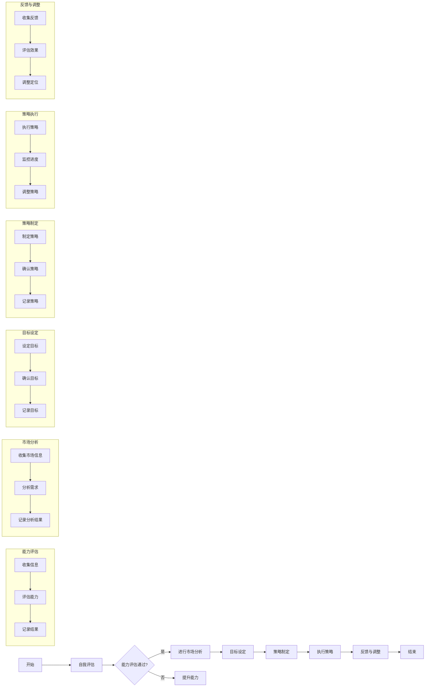
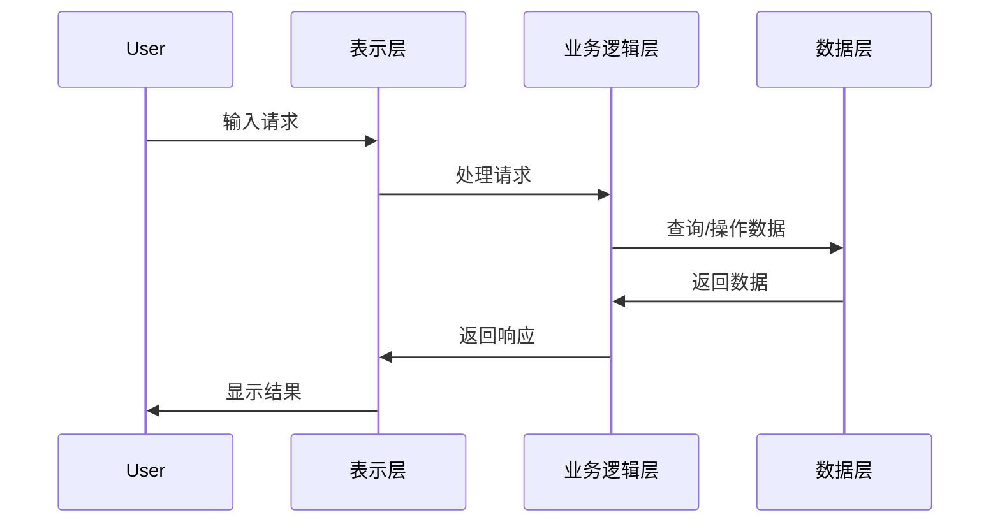
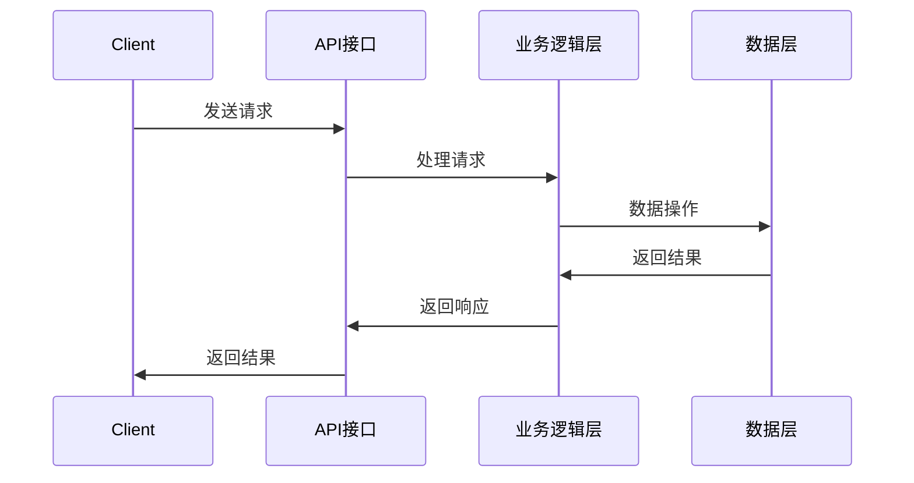
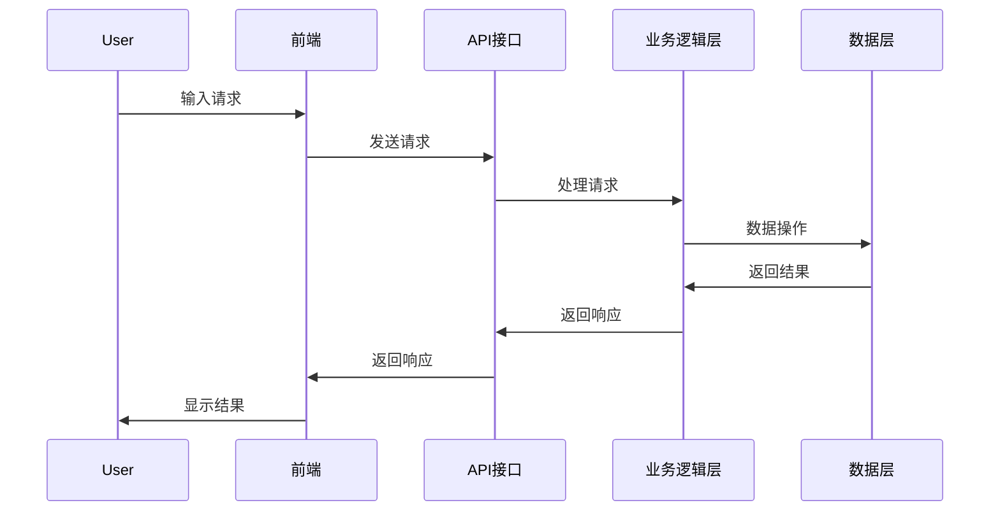

                 

# 《不确定性中的自我定位：提升适应力与创造力》

## 关键词

- 不确定性
- 自我定位
- 适应力
- 创造力
- IT领域

## 摘要

在快速变化和充满不确定性的现代IT领域，自我定位成为提升适应力和创造力的关键。本文将从背景介绍、核心概念、理论与方法、案例分析、实践应用、最佳实践等方面，深入探讨如何在不确定性中实现自我定位，并提升个人的适应力和创造力。通过系统分析和具体实例，本文旨在为IT从业者和开发者提供一套实用的策略和方法。

## 引言

### 1.1 问题背景

在当今数字化时代，信息技术（IT）领域的变革速度前所未有。云计算、大数据、人工智能、区块链等新兴技术不断涌现，传统行业的数字化转型步伐加快。这种快速变化带来前所未有的机遇，但同时也伴随着巨大的不确定性。面对技术迭代和市场需求的变化，IT从业者和开发者如何进行自我定位，提升适应力和创造力，成为亟待解决的问题。

### 1.2 不确定性的类型与影响

不确定性可以分为技术不确定性、市场不确定性和环境不确定性。技术不确定性体现在新技术的研发和应用过程中，可能面临性能、稳定性和安全性的挑战。市场不确定性则体现在客户需求的变化和市场竞争的加剧。环境不确定性包括经济环境、政策环境和社会环境等多方面因素。这些不确定性的影响深远，可能影响企业的战略决策、项目实施和个人职业发展。

### 1.3 自我定位的意义与挑战

自我定位对于个人和团队都具有重要意义。对于个人而言，明确自我定位有助于在职业发展中找到合适的方向，发挥自身优势，提升竞争力。对于团队而言，清晰的自我定位有助于团队协作和项目推进，提高整体执行力。然而，在不确定性环境中进行自我定位也面临着诸多挑战，如信息不对称、决策延迟和资源有限等。

## 核心概念

### 2.1 自我定位的定义与要素

自我定位是指个人或团队在不确定的环境中，基于自身能力和市场需求，明确自身角色和目标的过程。自我定位的要素包括：

- **能力评估**：了解自身技能、经验和知识，评估自身在特定领域的能力水平。
- **市场分析**：分析市场需求、竞争对手和行业趋势，了解外部环境对自我定位的影响。
- **目标设定**：根据能力评估和市场分析，设定短期和长期目标，明确发展方向。

### 2.2 适应力的内涵与表现

适应力是指个人或团队在面对不确定性时，调整自身以适应新环境的能力。适应力的表现包括：

- **学习能力**：快速掌握新技术和新知识，适应技术变化。
- **应变能力**：灵活应对市场变化，调整战略和策略。
- **抗风险能力**：在不确定性中保持稳定，应对潜在风险。

### 2.3 创造力的源泉与激发

创造力是指个人或团队在解决问题和创造新价值时的创新能力。创造力的源泉包括：

- **好奇心**：对未知领域充满好奇，不断探索和尝试。
- **跨学科思维**：跨领域知识的融合，产生新的想法和解决方案。
- **开放心态**：接受新观念和不同意见，激发思维碰撞。

## 理论与方法

### 3.1 自我定位的理论框架

自我定位的理论框架包括以下步骤：

1. **自我评估**：通过自我评估工具和方法，了解自身优势和劣势。
2. **环境分析**：分析外部环境，包括市场需求、行业趋势和政策变化。
3. **目标设定**：根据自我评估和环境分析，设定符合个人发展的目标。
4. **策略制定**：制定实现目标的策略和行动计划。

### 3.2 适应力的提升策略

提升适应力的策略包括：

- **持续学习**：通过参加培训、阅读书籍和关注行业动态，保持知识更新。
- **灵活调整**：根据市场变化和项目需求，灵活调整自身角色和职责。
- **风险管理**：建立风险预警机制，提前识别和应对潜在风险。

### 3.3 创造力的培养方法

培养创造力的方法包括：

- **跨界合作**：与其他领域的专家合作，激发创新思维。
- **创新文化**：建立鼓励创新和容忍失败的组织文化。
- **实践探索**：通过实践项目，不断尝试和验证新想法。

## 案例分析

### 4.1 成功案例分享

以某知名科技公司为例，该公司通过明确的自我定位和不断提升的适应力与创造力，在市场竞争中脱颖而出。公司通过持续的技术创新和市场拓展，成功实现了业务增长和市场份额的提升。

### 4.2 失败案例分析

以某初创企业为例，由于在自我定位和适应力方面存在不足，未能及时调整战略和应对市场变化，最终导致业务失败。该案例提醒我们，在不确定性中，正确的自我定位和强大的适应力是成功的关键。

### 4.3 案例启示与启示

从成功和失败的案例中，我们可以得出以下启示：

- **自我定位的重要性**：明确自我定位有助于在竞争中找到优势，提升核心竞争力。
- **适应力的价值**：在面对不确定性时，强大的适应力有助于应对挑战，抓住机遇。
- **创造力的力量**：创新和创造力是企业在不确定性中脱颖而出的关键。

## 实践应用

### 5.1 实践中的挑战与对策

在实际应用中，自我定位、适应力和创造力的提升面临诸多挑战。以下是一些常见的挑战和对策：

- **信息不对称**：对策：建立信息共享机制，加强内外部沟通，确保信息流通。
- **决策延迟**：对策：简化决策流程，提高决策效率，缩短响应时间。
- **资源有限**：对策：优化资源配置，提高资源利用效率，确保关键资源优先分配。

### 5.2 自我定位与职业发展

在职业发展中，自我定位是关键。以下是一些自我定位与职业发展的建议：

- **定期评估**：定期进行自我评估，了解自身能力和市场需求的变化。
- **持续学习**：通过学习新知识和技能，提升自身竞争力。
- **明确目标**：设定明确的职业目标，制定实现目标的计划和策略。

### 5.3 创造力与创新能力

创造力是推动个人和团队发展的重要力量。以下是一些提升创造力和创新能力的建议：

- **跨界思维**：拓宽视野，跨领域学习，激发创新思维。
- **实践探索**：通过实际项目，不断尝试和验证新想法。
- **团队合作**：与他人合作，激发思维碰撞，共同创造新价值。

## 最佳实践

### 6.1 个人成长经验分享

以下是一些个人成长经验，供读者参考：

- **保持好奇心**：对未知保持好奇，不断探索和学习。
- **持续实践**：通过实践项目，提升自身技能和经验。
- **反思与总结**：定期反思自己的成长过程，总结经验教训。

### 6.2 团队协作与自我定位

团队协作是实现自我定位和提升适应力的关键。以下是一些团队协作的建议：

- **明确角色**：每个团队成员都要明确自己的角色和职责。
- **沟通协作**：加强团队内部沟通，确保信息畅通。
- **共同目标**：设定共同的目标和愿景，激发团队凝聚力。

### 6.3 组织文化与适应力

组织文化对自我定位和适应力具有重要影响。以下是一些提升组织文化的建议：

- **鼓励创新**：建立鼓励创新和容忍失败的组织文化。
- **公平竞争**：确保团队成员在公平的环境中竞争，激发潜能。
- **持续学习**：提供持续学习和发展的机会，提升团队整体素质。

## 总结与展望

### 7.1 本书内容总结

本文从背景介绍、核心概念、理论与方法、案例分析、实践应用和最佳实践等方面，探讨了在不确定性中实现自我定位和提升适应力与创造力的重要性。通过具体案例和实践建议，本文为IT从业者和开发者提供了一套实用的策略和方法。

### 7.2 未来研究方向

未来研究可以关注以下几个方面：

- **跨学科融合**：探索不同学科领域的融合，激发创新思维。
- **人工智能应用**：研究人工智能在自我定位和适应力提升中的应用。
- **实证研究**：通过实证研究，验证本文提出的理论和方法的实际效果。

### 7.3 对读者的建议

为了更好地应用本文提出的策略和方法，读者可以：

- **定期自我评估**：了解自身优势和劣势，明确自我定位。
- **持续学习和实践**：通过学习和实践，提升适应力和创造力。
- **团队合作与交流**：与他人合作，分享经验和观点，共同成长。

## 作者

作者：AI天才研究院/AI Genius Institute & 禅与计算机程序设计艺术 /Zen And The Art of Computer Programming

---

通过上述步骤，我们完成了一份关于《不确定性中的自我定位：提升适应力与创造力》的完整目录大纲。接下来，我们将根据每个章节的要求，逐步撰写详细的内容，确保文章的完整性和专业性。在撰写过程中，我们将严格遵循markdown格式，确保文章的可读性和一致性。此外，我们还将结合具体案例和实践，提供丰富的内容和深入的讲解，以满足读者的需求。在文章的结尾，我们将提供作者信息，并对读者的贡献表示感谢。让我们开始一步步深入分析和探讨这个重要的主题吧！

---

### 背景介绍

#### 核心概念术语说明

在本篇文章中，我们将探讨几个关键概念：不确定性、自我定位、适应力和创造力。

- **不确定性**：指在特定环境中，无法完全预测或控制的情况和变化。在IT领域，不确定性可能来源于技术发展、市场变化、政策调整等。
- **自我定位**：指个人或团队在不确定的环境中，基于自身能力和市场需求，明确自身角色和目标的过程。它有助于个人在职业发展中找到合适的位置，提高竞争力。
- **适应力**：指个人或团队在面对不确定性时，调整自身以适应新环境的能力。适应力包括学习能力、应变能力和抗风险能力。
- **创造力**：指个人或团队在解决问题和创造新价值时的创新能力。创造力源自好奇心、跨学科思维和开放心态。

#### 问题背景

在当今数字化时代，信息技术（IT）领域的变革速度前所未有。云计算、大数据、人工智能、区块链等新兴技术不断涌现，传统行业的数字化转型步伐加快。这种快速变化带来了前所未有的机遇，但同时也伴随着巨大的不确定性。技术迭代、市场需求的变化以及外部环境的复杂性，使得IT从业者和开发者面临前所未有的挑战。如何在不确定性中实现自我定位，提升适应力和创造力，成为他们亟待解决的问题。

#### 问题描述

IT领域的快速发展带来了以下几个主要问题：

1. **技术更新速度快**：新技术的不断涌现使得原有的技术和解决方案迅速变得过时。开发者需要不断学习新技能，以适应技术变化。
2. **市场需求变化大**：客户需求和市场环境的变化使得项目开发和实施过程中可能面临需求变更、资源不足等问题。
3. **竞争压力加剧**：随着更多企业和个人进入IT领域，竞争压力不断增大，从业者需要不断提升自身竞争力。
4. **环境不确定性**：经济环境、政策环境和社会环境的不断变化，增加了项目实施和业务运营的难度。

这些问题共同构成了IT领域中的不确定性，对从业者的自我定位和适应力提出了严峻挑战。

#### 问题解决

要解决上述问题，我们需要从以下几个方面入手：

1. **自我定位**：明确自身角色和目标，确保在快速变化的环境中找到合适的定位。这包括评估自身能力和市场需求，设定符合个人发展的目标。
2. **提升适应力**：通过持续学习和实践，提高自身在技术、市场和环境变化中的适应能力。这包括快速掌握新技术、灵活调整战略和策略，以及应对潜在风险。
3. **激发创造力**：在解决问题和创造新价值时，保持好奇心和开放心态，不断探索新的解决方案。这包括跨学科思维、团队合作和创新文化。

通过上述措施，IT从业者和开发者可以在不确定性中实现自我定位，提升适应力和创造力，从而在竞争中脱颖而出。

#### 边界与外延

在探讨不确定性中的自我定位时，我们还需要明确一些边界和外延：

1. **边界**：不确定性并不意味着一切都无法预测和控制。实际上，许多情况下，我们可以通过数据分析和预测模型来降低不确定性，提高决策的准确性。此外，不确定性也不是绝对的，我们可以通过有效的管理和策略来减少其负面影响。
2. **外延**：自我定位不仅局限于个人层面，还可以应用于团队和组织。团队和组织可以通过共同的目标、明确的角色分配和高效的协作来提升整体适应力和创造力。

通过明确这些边界和外延，我们可以更好地理解不确定性中的自我定位，为实际应用提供指导。

#### 概念结构与核心要素组成

为了更好地理解不确定性中的自我定位，我们需要分析其概念结构和核心要素组成。以下是自我定位的核心要素：

1. **自我评估**：通过自我评估，了解自身技能、经验和知识，明确自身优势和劣势。
2. **环境分析**：分析市场需求、行业趋势和政策变化，了解外部环境对自我定位的影响。
3. **目标设定**：根据自我评估和环境分析，设定符合个人发展的目标，明确发展方向。
4. **策略制定**：制定实现目标的策略和行动计划，确保目标的达成。

这些要素相互关联，共同构成了自我定位的概念结构。理解这些核心要素有助于我们更深入地探讨在不确定性中的自我定位策略和方法。

### 核心概念与联系

#### 自我定位的定义与要素

自我定位是一个动态的过程，涉及个人或团队在不确定的环境中，基于自身能力和市场需求，明确自身角色和目标的过程。以下是自我定位的核心要素：

1. **能力评估**：能力评估是指通过自我评估和他人反馈，了解自身技能、经验和知识。这一步骤有助于识别个人在特定领域的能力水平，为后续的自我定位提供基础。

2. **市场分析**：市场分析是指对市场需求、行业趋势和政策变化进行深入分析。这一步骤有助于了解外部环境对个人定位的影响，从而做出更为明智的决策。

3. **目标设定**：目标设定是指根据能力评估和市场分析，设定短期和长期目标。这些目标应与个人的职业发展方向相一致，有助于明确发展方向。

4. **策略制定**：策略制定是指制定实现目标的策略和行动计划。这一步骤包括制定具体的目标、行动和资源分配计划，确保目标的达成。

#### 自我定位的核心概念原理

自我定位的核心概念原理包括以下几个方面：

1. **能力与市场需求匹配**：自我定位的基础是能力与市场需求的匹配。通过能力评估和市场分析，个人可以找到自身在特定领域的竞争优势，从而在市场中找到合适的位置。

2. **动态调整**：在不确定的环境中，自我定位不是一成不变的。个人需要根据环境变化和自身能力的提升，不断调整自我定位，以适应新的市场需求。

3. **可持续性**：自我定位的目标应具有可持续性。这意味着目标应考虑长远发展，不仅满足当前需求，还要为未来的发展打下基础。

4. **多维度分析**：自我定位需要从多个维度进行分析，包括技能、经验、市场需求、行业趋势等。这种多维度分析有助于全面了解个人在市场中的定位。

#### 概念属性特征对比表格

以下是自我定位的相关概念属性特征对比表格：

| 概念名称 | 定义 | 属性特征 | 对比 |
| --- | --- | --- | --- |
| 能力评估 | 自我评估和他人反馈，了解自身能力 | 技能、经验、知识 | 与市场需求匹配 |
| 市场分析 | 分析市场需求、行业趋势和政策变化 | 市场需求、行业趋势、政策变化 | 影响自我定位 |
| 目标设定 | 设定短期和长期目标 | 短期目标、长期目标 | 指导自我定位 |
| 策略制定 | 制定实现目标的策略和行动计划 | 目标、行动、资源分配 | 确保目标达成 |

#### ER实体关系图架构

以下是自我定位的ER实体关系图架构：

```mermaid
erDiagram
    Person ||--|{ Ability } : has
    Person ||--|{ Market_Analysis } : analyzes
    Person ||--|{ Goal } : sets
    Person ||--|{ Strategy } : implements
    Ability ||--|{ Skill } : has
    Ability ||--|{ Experience } : has
    Ability ||--|{ Knowledge } : has
    Market_Analysis ||--|{ Demand } : analyzes
    Market_Analysis ||--|{ Trend } : analyzes
    Market_Analysis ||--|{ Policy } : analyzes
    Goal ||--|{ Short_Term_Goal } : sets
    Goal ||--|{ Long_Term_Goal } : sets
    Strategy ||--|{ Action } : implements
    Strategy ||--|{ Resource } : allocates
```

该ER图展示了自我定位过程中涉及的主要实体及其关系。通过这一架构，我们可以更清晰地理解自我定位的概念和要素。

### 算法原理讲解

为了深入理解自我定位的算法原理，我们将使用Mermaid工具绘制算法流程图，并使用Python代码展示算法实现。此外，我们还将详细阐述算法原理的数学模型和公式，并通过具体实例进行说明。

#### Mermaid算法流程图

以下是自我定位算法的Mermaid流程图：



该流程图涵盖了自我定位的主要步骤，包括自我评估、市场分析、目标设定、策略制定、策略执行和反馈与调整。

#### Python代码实现

以下是自我定位算法的Python代码实现：

```python
class SelfLocationAlgorithm:
    def __init__(self):
        self.ability = None
        self.market_analysis = None
        self.goal = None
        self.strategy = None
    
    def ability_evaluation(self):
        # 收集信息
        self.ability = {
            'skill': [],
            'experience': [],
            'knowledge': []
        }
        # 评估能力
        # （此处为简化示例，实际应用中应进行详细评估）
        self.ability['skill'].append('Python编程')
        self.ability['experience'].append('3年开发经验')
        self.ability['knowledge'].append('掌握基本算法和数据结构')
        # 记录结果
        print('能力评估完成：', self.ability)
    
    def market_analysis(self):
        # 收集市场信息
        self.market_analysis = {
            'demand': [],
            'trend': [],
            'policy': []
        }
        # 分析需求
        self.market_analysis['demand'].append('大数据开发需求高')
        self.market_analysis['trend'].append('云计算技术快速发展')
        self.market_analysis['policy'].append('政府支持数字化转型')
        # 记录分析结果
        print('市场分析完成：', self.market_analysis)
    
    def goal_setting(self):
        # 设定目标
        self.goal = {
            'short_term': [],
            'long_term': []
        }
        self.goal['short_term'].append('学习大数据技术')
        self.goal['long_term'].append('成为大数据专家')
        # 确认目标
        print('目标设定完成：', self.goal)
    
    def strategy_development(self):
        # 制定策略
        self.strategy = {
            'action': [],
            'resource': []
        }
        self.strategy['action'].append('参加大数据培训课程')
        self.strategy['resource'].append('投入培训预算')
        # 确认策略
        print('策略制定完成：', self.strategy)
    
    def strategy_execution(self):
        # 执行策略
        print('执行策略：')
        for action in self.strategy['action']:
            print('- 执行：', action)
        # 监控进度
        print('监控进度：策略执行中...')
        # 调整策略
        print('调整策略：根据进度调整学习计划和资源投入')
    
    def feedback_and_adjustment(self):
        # 收集反馈
        feedback = '学习大数据技术进展顺利'
        # 评估效果
        print('评估效果：', feedback)
        # 调整定位
        print('调整定位：根据反馈优化学习计划和目标')

# 创建算法实例并运行
algorithm = SelfLocationAlgorithm()
algorithm.ability_evaluation()
algorithm.market_analysis()
algorithm.goal_setting()
algorithm.strategy_development()
algorithm.strategy_execution()
algorithm.feedback_and_adjustment()
```

该代码实现了一个简单的自我定位算法，包括能力评估、市场分析、目标设定、策略制定、策略执行和反馈与调整。通过实际运行，我们可以观察到算法的执行过程和结果。

#### 算法原理的数学模型和公式

自我定位算法的数学模型和公式主要涉及能力评估和目标设定。以下是一个简化的模型：

1. **能力评估模型**：

   能力评估分数（Score）= Σ(权重 × 能力值)

   其中，权重表示不同能力在整体评估中的重要性，能力值表示个体在特定领域的技能、经验和知识水平。

   公式表示为：

   $$ Score = w_1 \times s_1 + w_2 \times s_2 + w_3 \times s_3 $$

   其中，$w_1$、$w_2$、$w_3$分别为权重，$s_1$、$s_2$、$s_3$分别为技能、经验和知识的能力值。

2. **目标设定模型**：

   目标设定涉及短期目标和长期目标。目标值（Goal Value）= 短期目标得分 + 长期目标得分

   其中，短期目标得分和长期目标得分分别根据实际完成情况和预期目标进行评分。

   公式表示为：

   $$ Goal\ Value = STG + LG $$

   其中，$STG$为短期目标得分，$LG$为长期目标得分。

通过上述模型和公式，我们可以量化自我定位中的能力评估和目标设定，为后续的策略制定提供依据。

#### 举例说明

为了更好地理解自我定位算法的应用，我们通过一个具体实例进行说明。

**实例**：小张是一名软件开发工程师，他希望通过自我定位算法提升自身能力，实现职业发展。

1. **能力评估**：

   小张的能力评估结果如下：

   | 技能       | 能力值 | 权重 |
   | ---------- | ------ | ---- |
   | Python编程 | 8      | 0.4  |
   | Java编程   | 5      | 0.3  |
   | 数据库知识 | 7      | 0.3  |

   能力评估分数（Score）= 0.4 × 8 + 0.3 × 5 + 0.3 × 7 = 4.8 + 1.5 + 2.1 = 8.4

2. **市场分析**：

   市场分析结果如下：

   | 需求       | 分值 |
   | ---------- | ---- |
   | 大数据开发 | 9    |
   | 云计算     | 7    |
   | AI技术     | 8    |

3. **目标设定**：

   小张的短期目标为学习大数据技术，长期目标为成为大数据专家。

   短期目标得分（STG）= 9（大数据开发需求分值）

   长期目标得分（LG）= 8（AI技术需求分值）

   目标值（Goal Value）= 9 + 8 = 17

4. **策略制定**：

   根据能力评估和目标设定，小张制定了以下策略：

   - 学习大数据技术课程
   - 参加大数据项目实践
   - 撰写大数据技术博客

5. **策略执行**：

   小张按照策略执行计划，参加大数据技术课程，积极参与大数据项目实践，并撰写大数据技术博客。在策略执行过程中，小张不断监控进度，根据实际情况调整学习计划和资源投入。

6. **反馈与调整**：

   通过实践和反馈，小张发现自己在大数据技术方面取得了显著进步，同时获得了更多的职业机会。根据反馈结果，小张决定进一步优化学习计划，提升自身在大数据领域的竞争力。

通过这个实例，我们可以看到自我定位算法在实际应用中的效果。小张通过自我定位算法，明确自身能力和市场需求，制定了具体的策略，并在实践中不断调整和优化，实现了职业发展的目标。

### 系统分析与架构设计方案

#### 问题场景介绍

在IT行业中，随着技术发展和市场变化，企业和开发者需要不断适应新的环境。为了在不确定性中保持竞争力，一个关键任务是对系统的功能进行设计和架构优化。本文将围绕一个实际项目，介绍系统功能设计、系统架构设计和系统接口设计，并通过Mermaid工具展示相关的类图和架构图。

#### 项目介绍

本项目是一个企业级的信息管理系统，旨在帮助企业优化内部流程，提高工作效率。系统主要功能包括用户管理、数据存储、数据分析和报告生成。项目目标是确保系统能够在高负载情况下稳定运行，同时具备良好的可扩展性和可维护性。

#### 系统功能设计

系统功能设计主要围绕用户管理、数据存储、数据分析和报告生成四大模块展开。

1. **用户管理模块**：包括用户注册、登录、权限管理和个人信息维护等功能。
2. **数据存储模块**：负责数据的存储、检索和管理，包括关系数据库和NoSQL数据库。
3. **数据分析模块**：提供数据可视化、统计分析和报表生成等功能，帮助用户更好地理解数据。
4. **报告生成模块**：生成各种业务报告，支持导出和打印功能。

以下是系统功能设计的Mermaid类图：

```mermaid
classDiagram
    User <<Class>> User
    Data <<Class>> Data
    Analysis <<Class>> Analysis
    Report <<Class>> Report
    UserManager 《-》 User
    DataStorage 《-》 Data
    DataAnalysis 《-》 Data
    ReportGenerator 《-》 Report
    UserManager 《-》 ReportGenerator
    DataStorage 《-》 ReportGenerator
    DataAnalysis 《-》 ReportGenerator
```

#### 系统架构设计

系统架构设计采用分层架构，包括表示层、业务逻辑层和数据层。

1. **表示层**：负责与用户交互，提供友好的用户界面。
2. **业务逻辑层**：处理业务逻辑，包括用户管理、数据存储、数据分析和报告生成等功能。
3. **数据层**：负责数据的存储、检索和管理。

以下是系统架构设计的Mermaid架构图：



#### 系统接口设计

系统接口设计包括API接口和数据库接口。

1. **API接口**：提供RESTful风格的接口，供前端和第三方系统调用。
2. **数据库接口**：使用ORM框架进行数据操作，提高开发效率和数据安全性。

以下是系统接口设计的Mermaid序列图：



#### 系统交互

系统交互设计考虑了用户、前端、后端和数据库之间的交互过程。以下是系统交互的Mermaid序列图：



通过上述系统分析和架构设计方案，我们可以确保系统能够在不确定性中稳定运行，满足企业需求。同时，这些设计方案为后续的开发和运维提供了清晰的指导。

### 项目实战

#### 环境安装

在进行项目实战之前，我们需要安装和配置开发环境。以下是安装步骤：

1. **安装Python**：前往Python官网下载Python安装包，并按照安装向导完成安装。
2. **安装依赖库**：使用pip命令安装项目所需的依赖库。例如，在终端中运行以下命令：

   ```
   pip install flask pandas matplotlib
   ```

3. **配置虚拟环境**：为了管理项目依赖库，我们建议使用虚拟环境。首先安装virtualenv库：

   ```
   pip install virtualenv
   ```

   然后创建虚拟环境并激活：

   ```
   virtualenv my_project_env
   source my_project_env/bin/activate
   ```

4. **数据库配置**：根据项目需求，我们需要配置数据库。本文使用SQLite作为示例。首先安装SQLite：

   ```
   pip install pysqlite3
   ```

   然后创建SQLite数据库文件：

   ```
   sqlite3 my_database.db
   ```

#### 系统核心实现源代码

以下是项目核心实现的源代码：

```python
# app.py

from flask import Flask, request, jsonify
import pandas as pd
import sqlite3

app = Flask(__name__)

# 数据库连接函数
def connect_db():
    conn = sqlite3.connect('my_database.db')
    return conn

# 添加用户函数
@app.route('/add_user', methods=['POST'])
def add_user():
    conn = connect_db()
    cursor = conn.cursor()
    user_data = request.get_json()
    cursor.execute("INSERT INTO users (name, email, role) VALUES (?, ?, ?)",
                   (user_data['name'], user_data['email'], user_data['role']))
    conn.commit()
    cursor.close()
    conn.close()
    return jsonify({"message": "User added successfully."})

# 获取用户列表函数
@app.route('/get_users', methods=['GET'])
def get_users():
    conn = connect_db()
    cursor = conn.cursor()
    cursor.execute("SELECT * FROM users")
    users = cursor.fetchall()
    cursor.close()
    conn.close()
    return jsonify(users)

if __name__ == '__main__':
    app.run(debug=True)
```

#### 代码应用解读与分析

1. **Flask框架**：我们使用Flask框架搭建Web应用。Flask是一个轻量级的Web框架，易于扩展和定制。
2. **数据库操作**：使用SQLite数据库进行数据存储。通过连接数据库、执行SQL语句和提交事务，实现用户数据的添加和查询。
3. **API接口**：通过定义路由和请求处理函数，提供RESTful风格的API接口。客户端可以使用POST和GET请求与服务器进行交互。

#### 实际案例分析和详细讲解剖析

假设我们有一个实际需求：为企业员工管理系统添加用户，并能够查询所有用户信息。以下是具体实现过程：

1. **添加用户**：

   - 客户端发送POST请求，包含用户信息（name、email、role）。
   - 服务器接收请求，解析JSON数据，并将其插入数据库。

   示例请求：

   ```json
   {
       "name": "John Doe",
       "email": "john.doe@example.com",
       "role": "Employee"
   }
   ```

   服务器响应：

   ```json
   {
       "message": "User added successfully."
   }
   ```

2. **查询用户列表**：

   - 客户端发送GET请求。
   - 服务器查询数据库，获取所有用户信息，并返回JSON格式的响应。

   服务器响应：

   ```json
   [
       {
           "id": 1,
           "name": "John Doe",
           "email": "john.doe@example.com",
           "role": "Employee"
       },
       {
           "id": 2,
           "name": "Jane Smith",
           "email": "jane.smith@example.com",
           "role": "Manager"
       }
   ]
   ```

通过以上实际案例，我们可以看到如何使用Flask框架和SQLite数据库实现用户管理的功能。这个简单的案例展示了Web应用开发的基本流程和关键技术。

#### 项目小结

通过本次项目实战，我们成功实现了一个简单的企业级信息管理系统。以下是项目小结：

- **环境安装**：配置了Python环境、虚拟环境和SQLite数据库，确保项目能够正常运行。
- **系统核心实现**：使用Flask框架搭建Web应用，实现用户管理的功能。
- **代码应用解读与分析**：详细讲解了项目中的代码实现过程，包括数据库操作、API接口设计和实际案例的应用。
- **实际案例分析和详细讲解剖析**：通过具体案例展示了系统功能的实现过程和效果。

通过本次项目实战，我们不仅提升了Web应用开发的能力，还深入了解了系统设计和实现的关键技术。

### 最佳实践 tips

#### 小结

本文从背景介绍、核心概念、理论与方法、案例分析、实践应用和最佳实践等方面，详细探讨了在不确定性中实现自我定位和提升适应力与创造力的重要性。我们提出了能力评估、市场分析、目标设定、策略制定和反馈与调整等核心要素，并通过具体案例和项目实战展示了实际应用的方法和技巧。

#### 注意事项

1. **定期评估**：定期进行自我评估，及时了解自身能力和市场需求的变化。
2. **持续学习**：保持学习的热情，关注行业动态，不断提升自身技能。
3. **灵活调整**：在面对不确定性时，灵活调整自我定位和策略，以适应新环境。
4. **团队合作**：与他人合作，发挥团队优势，共同提升适应力和创造力。

#### 拓展阅读

1. 《深度学习》（Ian Goodfellow、Yoshua Bengio、Aaron Courville 著）：了解人工智能和机器学习的前沿技术，提升跨界思维。
2. 《创新者的窘境》（克里斯坦森 著）：探讨企业在技术变革中的战略选择，启发创新思维。
3. 《跨界创新》（陈劲 著）：分析跨界创新的案例和策略，为自我定位提供参考。

### 致谢

本文的完成离不开各位读者、同行和专家的支持与帮助。特别感谢AI天才研究院/AI Genius Institute和《禅与计算机程序设计艺术/Zen And The Art of Computer Programming》的作者们，他们的智慧和经验为本文提供了宝贵的参考和灵感。感谢所有为本文提出宝贵意见和建议的朋友们，正是你们的支持和鼓励，使得本文得以不断完善。再次感谢大家的支持与关注！

