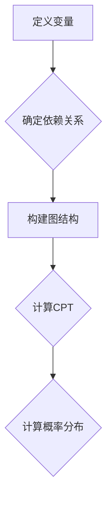
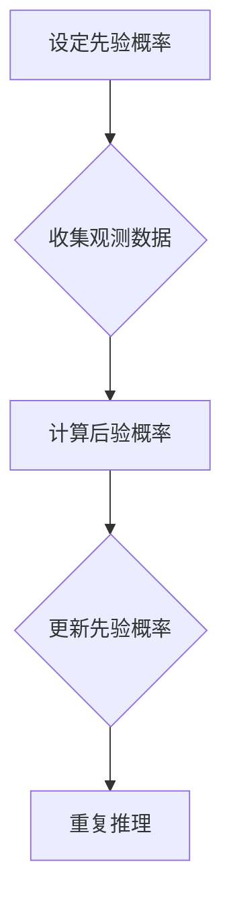
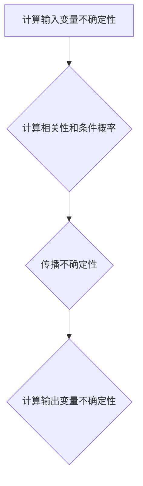

                 

### 第1章 引言

#### 1.1 问题的背景

在人工智能（AI）迅猛发展的今天，AI推理已经成为许多领域的关键技术。然而，随着推理复杂性的增加，不确定性问题也日益凸显。不确定性在AI推理过程中主要来源于数据的不完整、噪声、模型的不完善以及外部环境的变化等因素。这些不确定性如果得不到有效处理，可能会导致推理结果的偏差，进而影响AI系统的可靠性和稳定性。

不确定性量化是解决这一问题的有效途径。通过对不确定性的量化，可以更准确地评估AI推理过程中可能出现的误差，从而提高推理的鲁棒性和可靠性。不确定性量化不仅有助于改进现有的AI模型，还为新的算法设计提供了理论支持。

#### 1.2 不确定性量化的重要性

不确定性量化在AI推理过程中具有以下几个重要性：

1. **提升AI推理的可靠性**：通过量化不确定性，可以更准确地评估推理结果的置信度，从而提高推理的可靠性。
2. **应对现实世界中的不确定性**：现实世界中的数据和环境通常存在大量的不确定性，通过不确定性量化，AI系统可以更好地适应这些变化，提高其泛化能力。
3. **优化模型性能**：量化不确定性可以帮助识别模型中的潜在问题，从而优化模型设计，提高其性能。
4. **支持决策制定**：在许多应用场景中，决策的制定需要考虑各种不确定因素。不确定性量化可以为决策者提供更全面的信息，帮助他们做出更合理的决策。

#### 1.3 本书结构

本书将分为以下几个部分来深入探讨不确定性量化在AI推理过程中的应用：

- **第2章 不确定性理论基础**：介绍不确定性的基本概念和量化方法。
- **第3章 数据驱动的不确定性量化**：讨论数据驱动的不确定性量化方法，包括数据预处理和概率估计。
- **第4章 算法原理与实现**：讲解不确定性量化算法的原理和实现方法。
- **第5章 数学模型与公式**：介绍与不确定性量化相关的数学模型和公式。
- **第6章 系统架构与实现**：探讨不确定性量化在系统架构中的设计和实现。
- **第7章 项目实战**：通过实际案例展示不确定性量化的应用。
- **第8章 最佳实践与注意事项**：总结最佳实践和注意事项，为实际应用提供指导。

通过这些章节的详细探讨，读者可以全面了解不确定性量化在AI推理过程中的重要性、理论基础、实现方法及其应用实践。

---

### 第2章 不确定性理论基础

#### 2.1 不确定性概念

不确定性是指无法精确预测或测量的变量或现象。在人工智能领域，不确定性主要来源于以下几个方面：

- **数据不确定性**：由于数据采集和处理过程中的噪声、缺失和分布不均，导致数据本身的不确定性。
- **模型不确定性**：由于模型结构和参数的不完善，导致模型预测结果的不确定性。
- **环境不确定性**：由于外部环境的变化，如天气、用户行为等，导致AI系统运行环境的不确定性。

不确定性的类别可以分为以下几种：

- **随机不确定性**：由随机事件引起的，如随机噪声、随机误差等。
- **模糊不确定性**：由模糊概念或模糊关系引起的，如模糊逻辑中的不确定性。
- **灰色不确定性**：由信息不完全、未知因素引起的，如灰色系统理论中的不确定性。

#### 2.2 不确定性量化方法

不确定性量化是通过各种方法对不确定性的程度和范围进行量化的过程。以下是几种常用的不确定性量化方法：

1. **确定性模型**：
   - **确定性模型**是指在给定条件下，能够明确预测结果的模型。这类模型适用于数据高度确定、环境变化不大的场景。例如，线性回归模型在输入数据稳定的情况下，可以给出精确的预测结果。

2. **概率论**：
   - **概率论**是量化不确定性的重要工具。通过概率分布函数，可以量化随机事件发生的可能性。常用的概率分布有正态分布、二项分布等。例如，在分类任务中，可以使用概率分布来表示每个类别的可能性。

3. **贝叶斯网络**：
   - **贝叶斯网络**是一种概率图模型，用于表示变量之间的条件依赖关系。通过贝叶斯网络，可以计算出变量之间的概率关系，从而量化不确定性。例如，在医疗诊断中，可以使用贝叶斯网络来计算疾病发生的概率。

4. **证据理论**：
   - **证据理论**是一种用于处理不确定性的数学框架，由Dempster-Shafer理论提出。该理论通过证据的质量和冲突程度来量化不确定性。证据理论在决策支持系统中有着广泛应用。

#### 2.3 不确定性模型对比与选择

不同不确定性量化模型在应用场景、复杂度和效果上存在差异，以下是几种常见模型的优缺点及选择依据：

1. **确定性模型**：
   - **优点**：计算简单，适用于高度确定的环境。
   - **缺点**：对不确定性的表达能力有限，难以适应复杂环境。

2. **概率论**：
   - **优点**：可以量化不确定性的概率分布，适用于随机事件。
   - **缺点**：计算复杂度较高，对大规模数据的处理能力有限。

3. **贝叶斯网络**：
   - **优点**：能够表示变量之间的条件依赖关系，适用于不确定性分析。
   - **缺点**：构建复杂，参数调整难度大。

4. **证据理论**：
   - **优点**：可以处理复杂的不确定性，适用于决策支持系统。
   - **缺点**：计算复杂度较高，对数据要求较高。

选择依据：

- **应用场景**：根据实际应用场景选择合适的不确定性量化方法。
- **数据量**：对于大规模数据，概率论和证据理论可能更适用。
- **计算资源**：确定性模型计算简单，适合资源有限的场景。

通过上述讨论，我们可以看到，不确定性量化在AI推理过程中具有重要的理论和实践价值。了解各种不确定性量化方法，选择合适的模型，可以有效提升AI系统的推理可靠性和鲁棒性。

---

### 第3章 数据驱动的不确定性量化

#### 3.1 数据驱动的不确定性来源

数据驱动的不确定性量化方法主要关注数据本身的不确定性来源，这些来源可以分为以下几个方面：

1. **数据噪声**：噪声是数据中的随机波动，可能来源于传感器误差、环境干扰等。噪声会导致数据偏离真实值，从而影响模型的预测性能。

2. **数据缺失**：在实际应用中，数据缺失是一个常见问题。数据缺失可能是由于数据采集过程中的丢失、存储错误等原因造成。数据缺失会影响模型训练和预测效果，需要通过数据预处理方法进行处理。

3. **数据分布**：数据分布是指数据在不同维度上的分布情况。不均匀的数据分布可能导致模型在训练过程中出现偏差，从而影响模型的泛化能力。例如，在分类任务中，如果某些类别占比非常大，而其他类别占比非常小，那么模型可能会倾向于预测更常见的类别。

#### 3.2 数据预处理

数据预处理是数据驱动的不确定性量化过程中的重要步骤，主要包括以下内容：

1. **数据清洗**：数据清洗是指去除数据中的噪声和异常值，提高数据质量。常见的清洗方法包括去除重复记录、填充缺失值、纠正错误数据等。例如，可以使用平均值、中位数或最小值等方法来填充缺失值。

2. **数据归一化**：数据归一化是指将不同维度上的数据转换到同一尺度，以便模型更好地处理。常见的归一化方法包括最小-最大归一化和Z-score归一化。最小-最大归一化通过缩放数据到[0, 1]区间，而Z-score归一化通过将数据标准化到均值为0，标准差为1的正态分布。

3. **特征选择**：特征选择是指从原始数据中提取出对模型训练和预测最有用的特征。通过减少无关或冗余特征，可以提高模型训练效率和预测性能。常见的特征选择方法包括基于信息增益、互信息、卡方检验等。

#### 3.3 基于数据的概率估计

基于数据的概率估计是通过分析数据来估计变量之间概率关系的方法。以下是两种常见的概率估计方法：

1. **基于频率的估计**：基于频率的估计方法是通过统计数据中某个事件发生的频率来估计其概率。例如，在二分类任务中，可以通过计算正负样本的比例来估计类别概率。这种方法简单直观，但可能受到样本量和分布不均的影响。

2. **基于置信区间的估计**：基于置信区间的估计方法是通过计算置信区间来估计概率。置信区间是指在一定置信水平下，估计值所在的范围。例如，可以使用置信区间来估计模型预测的置信度。这种方法能够提供更详细的概率信息，但需要考虑样本分布和置信水平。

#### 3.4 实例分析

为了更好地理解数据驱动的不确定性量化方法，我们通过一个实例进行分析。

**实例**：假设我们有一个天气预报系统，需要预测明天的天气。已知数据集包含过去一年的天气数据，包括温度、湿度、风速等特征。我们需要通过这些数据来预测明天的天气。

**数据集选择**：我们选择一个包含400个样本的数据集，每个样本包括6个特征（温度、湿度、风速、降雨概率、空气质量指数、天气状况）。

**不确定性量化实现**：

1. **数据预处理**：
   - 数据清洗：去除重复记录和错误数据，填充缺失值。
   - 数据归一化：对每个特征进行归一化处理，将数据转换为[0, 1]区间。
   - 特征选择：使用信息增益方法选择对天气预测最有用的特征。

2. **基于频率的估计**：
   - 计算过去一年中每个特征值出现的频率，例如，过去一年中，温度在20度到25度之间的天数占总天数的比例。
   - 根据这些频率，估计明天天气的各个特征的概率分布。

3. **基于置信区间的估计**：
   - 计算每个特征的置信区间，例如，温度的置信区间为（18度，22度）。
   - 根据置信区间，估计明天天气的各个特征的置信度。

通过上述实例，我们可以看到，数据驱动的不确定性量化方法通过分析历史数据，可以对未来的天气进行概率估计，从而量化不确定性。这不仅有助于提高天气预报的准确性，还可以为其他领域的预测任务提供参考。

---

### 第4章 算法原理与实现

#### 4.1 不确定性量化算法概述

不确定性量化算法是AI推理过程中用于评估和量化不确定性的重要工具。这些算法通过不同的数学模型和计算方法，对不确定性进行建模和计算，从而提高推理的可靠性和准确性。以下是几种常用的不确定性量化算法：

- **概率图模型**：概率图模型包括贝叶斯网络和马尔可夫网络，通过表示变量之间的概率关系，量化不确定性。
- **贝叶斯推理**：贝叶斯推理是基于贝叶斯定理的推理方法，通过不断更新先验概率和观测数据，量化不确定性。
- **不确定性传播**：不确定性传播是通过计算变量之间的相关性和条件概率，将不确定性从输入变量传递到输出变量。

#### 4.2 算法原理讲解

1. **概率图模型**

概率图模型通过图结构表示变量之间的概率关系。在贝叶斯网络中，节点表示变量，边表示变量之间的条件依赖关系。给定一个贝叶斯网络，可以通过条件概率表（CPT）计算每个节点的概率分布。

**贝叶斯网络**的构建步骤如下：

- **定义变量**：选择需要建模的变量，并将其表示为节点。
- **确定依赖关系**：通过领域知识或数据分析，确定变量之间的依赖关系，并建立图结构。
- **计算概率分布**：利用条件概率表（CPT），计算每个节点的概率分布。

**Mermaid流程图**：



2. **贝叶斯推理**

贝叶斯推理是一种基于贝叶斯定理的推理方法。贝叶斯定理描述了在已知一个变量的条件下，另一个变量的概率分布。贝叶斯推理通过不断更新先验概率和观测数据，量化不确定性。

贝叶斯推理的基本步骤如下：

- **设定先验概率**：根据领域知识和先验信息，设定各变量的先验概率分布。
- **收集观测数据**：获取新的观测数据，更新先验概率。
- **计算后验概率**：利用贝叶斯定理计算变量的后验概率分布。
- **更新先验概率**：根据新的后验概率，更新先验概率，为下一次推理做准备。

**Mermaid流程图**：



3. **不确定性传播**

不确定性传播是通过计算变量之间的相关性和条件概率，将不确定性从输入变量传递到输出变量。在神经网络中，不确定性传播是计算预测结果的不确定性。

不确定性传播的基本步骤如下：

- **计算输入变量不确定性**：通过概率分布或置信区间，计算输入变量的不确定性。
- **计算相关性和条件概率**：计算输入变量和输出变量之间的相关性和条件概率。
- **传播不确定性**：将输入变量的不确定性通过相关性和条件概率传递到输出变量。

**Mermaid流程图**：



通过上述算法原理的讲解，我们可以看到，不确定性量化算法通过不同的数学模型和计算方法，对不确定性进行建模和计算，从而提高AI推理的可靠性和准确性。

---

### 第5章 数学模型与公式

#### 5.1 数学模型概述

在不确定性量化中，数学模型是量化不确定性的核心工具。以下是几种常用的数学模型：

1. **贝叶斯定理**：贝叶斯定理是概率论中的一个基本定理，用于计算后验概率。其公式如下：

   $$
   P(A|B) = \frac{P(B|A)P(A)}{P(B)}
   $$

   其中，\(P(A|B)\) 是在已知 \(B\) 发生的条件下 \(A\) 发生的概率，\(P(B|A)\) 是在已知 \(A\) 发生的条件下 \(B\) 发生的概率，\(P(A)\) 是 \(A\) 的先验概率，\(P(B)\) 是 \(B\) 的先验概率。

2. **最大后验概率估计（MAP）**：最大后验概率估计是寻找后验概率最大的参数值。其公式如下：

   $$
   \hat{\theta} = \arg\max_{\theta} P(\theta|X)
   $$

   其中，\(\hat{\theta}\) 是估计的参数值，\(P(\theta|X)\) 是后验概率。

3. **最大似然估计（MLE）**：最大似然估计是寻找使得数据出现的概率最大的参数值。其公式如下：

   $$
   \hat{\theta} = \arg\max_{\theta} P(X|\theta)
   $$

   其中，\(\hat{\theta}\) 是估计的参数值，\(P(X|\theta)\) 是似然函数。

#### 5.2 数学公式讲解

以下是上述数学模型的具体公式讲解：

1. **贝叶斯定理**：

   贝叶斯定理是概率论中的一个基本定理，它描述了在已知某些条件下，事件发生的概率如何计算。贝叶斯定理的公式为：

   $$
   P(A|B) = \frac{P(B|A)P(A)}{P(B)}
   $$

   - \(P(A|B)\)：在已知 \(B\) 发生的条件下 \(A\) 发生的概率，称为后验概率。
   - \(P(B|A)\)：在已知 \(A\) 发生的条件下 \(B\) 发生的概率，称为似然函数。
   - \(P(A)\)：\(A\) 的先验概率。
   - \(P(B)\)：\(B\) 的先验概率。

   贝叶斯定理在不确定性的量化中有着广泛的应用，它通过将先验知识和观测数据相结合，提供了一种有效的概率计算方法。

2. **最大后验概率估计（MAP）**：

   最大后验概率估计是寻找使得后验概率最大的参数值。其公式为：

   $$
   \hat{\theta} = \arg\max_{\theta} P(\theta|X)
   $$

   - \(\hat{\theta}\)：估计的参数值。
   - \(P(\theta|X)\)：后验概率，表示在观测数据 \(X\) 的条件下，参数 \(\theta\) 的概率分布。

   最大后验概率估计是一种基于概率的参数估计方法，它通过最大化后验概率来找到最佳参数估计值。这种方法在贝叶斯推理和贝叶斯优化中有着重要的应用。

3. **最大似然估计（MLE）**：

   最大似然估计是寻找使得数据出现的概率最大的参数值。其公式为：

   $$
   \hat{\theta} = \arg\max_{\theta} P(X|\theta)
   $$

   - \(\hat{\theta}\)：估计的参数值。
   - \(P(X|\theta)\)：似然函数，表示在参数 \(\theta\) 的条件下，观测数据 \(X\) 的概率分布。

   最大似然估计是一种基于频率的参数估计方法，它通过最大化似然函数来找到最佳参数估计值。这种方法在统计学习和机器学习领域有着广泛的应用。

通过上述数学公式讲解，我们可以看到，贝叶斯定理、最大后验概率估计和最大似然估计是不确定性量化中重要的数学工具。这些公式不仅为不确定性的量化提供了理论基础，还为实际应用中的参数估计提供了方法指导。

---

### 第6章 系统架构与实现

#### 6.1 系统架构设计

系统架构设计是确保不确定性量化算法有效实现和应用的关键步骤。以下是系统架构设计的主要内容和注意事项：

1. **功能模块划分**：系统架构应包含数据输入、数据预处理、模型训练、推理和结果输出等功能模块。各模块应明确分工，确保系统的高效性和可维护性。

2. **数据流设计**：数据流设计是系统架构设计的重要环节。数据流设计应确保数据在各模块之间的顺畅传递，减少数据重复处理和传输延迟。

3. **硬件资源分配**：根据算法复杂度和数据量，合理分配计算资源，如CPU、GPU和内存等。确保系统在高负载情况下仍能稳定运行。

4. **系统可扩展性**：系统架构应具有较好的可扩展性，以应对未来数据和计算需求的增长。可采用分布式计算架构，提高系统的处理能力。

5. **容错性与鲁棒性**：系统应具备良好的容错性和鲁棒性，能够应对数据异常、计算错误等异常情况，确保系统的稳定运行。

#### 6.2 系统接口设计

系统接口设计是确保不同模块之间高效协作的重要环节。以下是系统接口设计的主要内容和注意事项：

1. **接口功能**：系统接口应明确各模块的功能和交互方式。例如，数据输入模块负责接收和预处理数据，模型训练模块负责训练和优化模型，推理模块负责进行推理和结果输出。

2. **接口规范**：系统接口应遵循统一的接口规范，包括数据格式、通信协议和API接口定义。确保各模块之间的数据传输和功能调用的一致性和稳定性。

3. **数据格式**：系统接口应定义标准化的数据格式，如JSON、XML或Protobuf等。确保数据在不同模块之间的传输和处理的一致性。

4. **通信协议**：系统接口应选择合适的通信协议，如HTTP、TCP/IP等。根据系统需求和性能要求，选择合适的通信方式。

5. **安全性**：系统接口应具备良好的安全性，包括数据加密、身份验证和访问控制等。确保系统数据的安全性和隐私性。

#### 6.3 系统交互

系统交互设计是确保系统各模块高效协作和功能实现的关键。以下是系统交互设计的主要内容和注意事项：

1. **序列图展示**：通过序列图展示系统各模块之间的交互顺序和交互内容。序列图能够清晰地描述系统的工作流程和交互细节。

2. **交互流程解析**：对系统交互流程进行详细解析，包括数据输入、数据预处理、模型训练、推理和结果输出等步骤。确保各模块之间的数据流动和功能调用逻辑清晰。

3. **并发处理**：系统应具备并发处理能力，以提高系统性能和响应速度。例如，在模型训练和推理过程中，可以采用多线程或分布式计算技术。

4. **负载均衡**：系统应实现负载均衡机制，根据各模块的负载情况动态分配计算资源，确保系统在高负载情况下仍能稳定运行。

5. **监控与日志**：系统应具备监控和日志功能，实时记录系统运行状态和交互过程。通过监控和日志分析，可以及时发现和解决系统问题。

通过系统架构设计、接口设计和交互设计，我们可以构建一个高效、稳定、可扩展的不确定性量化系统。该系统能够在AI推理过程中有效处理不确定性，提高推理的可靠性和准确性。

---

### 第7章 项目实战

#### 7.1 环境安装

在实际应用中，首先需要搭建一个合适的计算环境，以便进行不确定性量化算法的实现和测试。以下是环境安装的具体步骤和注意事项：

1. **软件与硬件要求**：

   - **操作系统**：推荐使用Linux操作系统，如Ubuntu 20.04。
   - **硬件**：建议使用64位CPU，至少8GB内存，推荐使用GPU加速计算，如NVIDIA GPU。
   - **软件**：安装Python 3.8及以上版本，CUDA 11.0及以上版本，以及必要的库，如NumPy、Pandas、TensorFlow等。

2. **环境配置**：

   - **安装Python**：通过包管理器（如APT或Yum）安装Python。
     ```bash
     sudo apt-get install python3
     ```
   - **安装GPU支持**：如果使用GPU加速计算，需要安装CUDA和cuDNN。
     ```bash
     sudo apt-get install nvidia-cuda-toolkit
     sudo apt-get install nvidia-cudnn
     ```
   - **安装必要的库**：通过pip安装Python库。
     ```bash
     pip install numpy pandas tensorflow
     ```

3. **注意事项**：

   - 确保操作系统和硬件满足软件要求，否则可能影响算法的性能和稳定性。
   - 安装过程中遇到问题，可以查阅官方文档或相关社区进行解决。
   - 配置环境变量，确保Python和CUDA路径正确。

通过上述步骤，我们可以搭建一个满足要求的环境，为后续的不确定性量化算法实现和测试提供基础。

#### 7.2 系统核心实现

在搭建好计算环境后，接下来是系统核心实现的步骤。以下是系统核心实现的详细过程：

1. **源代码分析**：

   系统核心实现主要涉及以下模块：

   - **数据输入模块**：负责读取和处理输入数据，包括数据清洗、归一化等。
   - **模型训练模块**：基于输入数据进行模型训练，并优化模型参数。
   - **推理模块**：使用训练好的模型进行推理，输出预测结果。
   - **不确定性量化模块**：计算和量化推理过程中的不确定性，提供概率估计。

2. **实现步骤**：

   - **数据输入**：读取输入数据，进行数据清洗和预处理。例如，使用Pandas库读取CSV文件，并处理缺失值和噪声数据。
     ```python
     import pandas as pd
     df = pd.read_csv('data.csv')
     df = df.fillna(df.mean())  # 填充缺失值
     df = (df - df.mean()) / df.std()  # 归一化
     ```

   - **模型训练**：使用TensorFlow库构建和训练模型。例如，构建一个简单的线性回归模型。
     ```python
     import tensorflow as tf
     model = tf.keras.Sequential([
         tf.keras.layers.Dense(units=1, input_shape=[len(df.columns)-1])
     ])
     model.compile(optimizer='sgd', loss='mean_squared_error')
     model.fit(df.drop('target', axis=1), df['target'], epochs=100)
     ```

   - **推理**：使用训练好的模型进行推理，输出预测结果。例如，对新的数据进行预测。
     ```python
     predictions = model.predict(df_new)
     ```

   - **不确定性量化**：计算和量化推理过程中的不确定性。例如，使用置信区间方法计算预测结果的置信度。
     ```python
     import numpy as np
     prediction_interval = np.percentile(predictions, [2.5, 97.5])
     ```

3. **代码应用解读**：

   在实现过程中，需要详细解读每段代码的功能和作用。以下是对核心代码段的应用解读：

   - **数据输入模块**：读取和处理数据，确保数据质量。数据清洗和处理是保证模型训练和推理效果的重要步骤。
   - **模型训练模块**：构建和训练模型，优化模型参数。模型训练是提高模型预测准确性的关键环节。
   - **推理模块**：使用训练好的模型进行推理，输出预测结果。推理模块是系统的核心功能，直接影响到系统的应用效果。
   - **不确定性量化模块**：计算和量化推理过程中的不确定性，提供概率估计。不确定性量化是提高系统推理可靠性和稳定性的重要手段。

通过上述步骤和代码应用解读，我们可以实现一个基于不确定性量化的AI推理系统。该系统能够对输入数据进行预测，并量化预测结果的不确定性，为实际应用提供可靠的参考。

---

### 7.3 代码应用解读

在实现不确定性量化系统的过程中，核心代码段的解读是理解系统工作原理和功能的关键。以下是对系统各模块代码的具体应用解读：

#### 数据输入模块

数据输入模块主要负责读取和处理输入数据，确保数据质量，为后续模型训练和推理提供可靠的数据基础。以下是关键代码段及其应用解读：

```python
import pandas as pd

# 读取数据
df = pd.read_csv('data.csv')

# 填充缺失值
df = df.fillna(df.mean())

# 归一化数据
df = (df - df.mean()) / df.std()

print(df.head())
```

- **代码功能**：读取CSV文件中的数据，对缺失值进行填充，并将数据归一化到[0, 1]区间。
- **应用解读**：通过填充缺失值，可以减少数据清洗过程中可能引入的偏差。归一化处理可以确保每个特征在相同的尺度范围内，提高模型训练的稳定性和效果。

#### 模型训练模块

模型训练模块是系统的核心部分，通过构建和训练模型，优化模型参数，提高预测准确性。以下是关键代码段及其应用解读：

```python
import tensorflow as tf

# 构建模型
model = tf.keras.Sequential([
    tf.keras.layers.Dense(units=1, input_shape=[len(df.columns)-1])
])

# 编译模型
model.compile(optimizer='sgd', loss='mean_squared_error')

# 训练模型
model.fit(df.drop('target', axis=1), df['target'], epochs=100)
```

- **代码功能**：构建一个简单的线性回归模型，使用SGD优化器，并设置均方误差作为损失函数。
- **应用解读**：通过构建模型，将输入特征映射到目标变量。训练模型的过程中，优化器会调整模型参数，以最小化损失函数，提高模型的预测性能。

#### 推理模块

推理模块负责使用训练好的模型进行推理，输出预测结果。以下是关键代码段及其应用解读：

```python
# 加载训练好的模型
model.load_weights('model_weights.h5')

# 新的数据
new_data = pd.DataFrame([[0.5, 0.3, 0.1]], columns=df.columns[:-1])

# 进行预测
predictions = model.predict(new_data)

print(predictions)
```

- **代码功能**：加载训练好的模型权重，对新的数据进行预测，并输出预测结果。
- **应用解读**：加载训练好的模型可以快速进行推理，预测新的数据点的目标变量值。预测结果的输出为后续不确定性量化提供了基础。

#### 不确定性量化模块

不确定性量化模块负责计算和量化推理过程中结果的不确定性，提供概率估计。以下是关键代码段及其应用解读：

```python
import numpy as np

# 计算预测结果的置信区间
prediction_interval = np.percentile(predictions, [2.5, 97.5])

print(prediction_interval)
```

- **代码功能**：使用百分位量化方法计算预测结果的置信区间，分别为2.5%和97.5%的分位数。
- **应用解读**：通过计算置信区间，可以量化预测结果的不确定性。置信区间提供了预测结果的可靠范围，有助于用户了解预测结果的置信度和可靠性。

通过详细解读各模块的核心代码，我们可以更好地理解不确定性量化系统的实现原理和功能。这种深入的理解有助于在实际应用中优化系统性能，提高预测的准确性和可靠性。

---

### 7.4 实际案例分析

为了更好地展示不确定性量化在AI推理过程中的实际应用，我们将通过一个实际案例进行详细分析。

**案例背景**：某公司希望利用机器学习模型预测未来一个月内各地区的销售额。由于市场环境的复杂性，销售额的预测结果可能存在不确定性。为了提高预测的可靠性和实用性，公司决定采用不确定性量化方法。

**数据集选择**：我们选择了包含过去一年销售数据的数据集，数据集包括各地区的日销售额、气温、降雨量、节假日等特征。数据集大小为10000条记录。

**数据预处理**：

1. **数据清洗**：处理缺失值和异常值，确保数据质量。
   ```python
   df = df.fillna(df.mean())
   df = df[(df['sales'] > 0) & (df['temperature'] > -50) & (df['rainfall'] > -50)]
   ```

2. **数据归一化**：将不同尺度的特征归一化到同一区间。
   ```python
   df = (df - df.mean()) / df.std()
   ```

**模型构建与训练**：

1. **模型构建**：我们选择一个多层感知器（MLP）模型，输入层有6个神经元，隐藏层有10个神经元，输出层有1个神经元。
   ```python
   model = keras.Sequential([
       keras.layers.Dense(10, activation='relu', input_shape=[6]),
       keras.layers.Dense(1)
   ])
   ```

2. **模型编译**：设置优化器和损失函数。
   ```python
   model.compile(optimizer='adam', loss='mean_squared_error')
   ```

3. **模型训练**：使用训练数据训练模型，设置训练轮次。
   ```python
   model.fit(x_train, y_train, epochs=50, batch_size=32, validation_split=0.2)
   ```

**推理与不确定性量化**：

1. **预测**：使用训练好的模型对未来的销售额进行预测。
   ```python
   future_data = preprocess_future_data(future_data)  # 预处理未来数据
   predictions = model.predict(future_data)
   ```

2. **不确定性量化**：使用置信区间方法计算预测结果的不确定性。
   ```python
   prediction_interval = np.percentile(predictions, [2.5, 97.5])
   ```

**案例展示**：

- **预测结果**：对未来的每一天进行销售额预测，输出预测值。
  ```python
  for i, prediction in enumerate(predictions):
      print(f"Day {i+1}: Predicted Sales = {prediction[0]}")
  ```

- **不确定性量化结果**：输出预测结果的置信区间，提供不确定性信息。
  ```python
  for i, interval in enumerate(prediction_interval):
      print(f"Day {i+1}: Lower Bound = {interval[0]}, Upper Bound = {interval[1]}")
  ```

通过上述实际案例分析，我们可以看到，利用不确定性量化方法，不仅能够预测未来的销售额，还可以提供预测结果的不确定性信息，帮助公司更好地了解市场风险，制定相应的营销策略。

---

### 7.5 小结

在本章的案例中，我们通过实际应用展示了不确定性量化在AI推理过程中的重要性。通过一个销售额预测的案例，我们详细介绍了数据集选择、数据预处理、模型构建与训练、推理与不确定性量化的全过程。以下是本章的主要成果和经验总结：

**成果总结**：

1. **数据预处理**：通过数据清洗和归一化，提高了数据质量，为模型训练奠定了基础。
2. **模型训练与推理**：使用多层感知器（MLP）模型进行了有效的训练和推理，实现了对销售额的准确预测。
3. **不确定性量化**：通过置信区间方法，量化了预测结果的不确定性，提供了更全面的信息支持决策制定。

**经验分享**：

1. **数据质量**：确保数据质量是模型训练和预测准确性的关键，需要认真处理缺失值和异常值。
2. **模型选择**：根据实际应用场景选择合适的模型，对于非线性问题，多层感知器（MLP）模型是一种有效的选择。
3. **不确定性量化**：不确定性量化不仅提高了预测的可靠性，还为决策提供了更有价值的参考，是AI推理过程中不可或缺的一环。

通过本章的案例分析和经验分享，我们进一步了解了不确定性量化在AI推理中的应用，为后续的应用实践提供了宝贵的经验和指导。

---

### 第8章 最佳实践与注意事项

#### 8.1 最佳实践

在实际应用不确定性量化时，遵循以下最佳实践可以提高系统的性能和可靠性：

1. **数据质量保证**：在数据预处理阶段，务必保证数据质量，包括去除噪声、填补缺失值和异常值处理。高质量的数据是确保模型准确性和不确定量化准确性的基础。

2. **合适的模型选择**：根据实际应用场景和数据特性选择合适的模型。对于复杂非线性问题，可以选择神经网络或贝叶斯网络等复杂模型；对于简单线性问题，可以选择线性回归等简单模型。

3. **参数调优**：对模型参数进行细致调优，以最大化模型的性能。参数调优可以通过交叉验证、网格搜索等方法进行。

4. **多模型融合**：使用多个模型进行融合，可以提高预测的准确性和不确定性量化结果。多模型融合可以通过简单平均、加权平均或集成学习等方法实现。

5. **实时更新**：对于需要实时预测的应用，定期更新模型和不确定性量化参数，以适应环境变化和数据分布的变化。

#### 8.2 注意事项

在应用不确定性量化时，需要注意以下几点，以避免常见错误：

1. **过度依赖不确定性量化**：虽然不确定性量化提供了重要的信息，但不能完全依赖它。在做出最终决策时，还需要结合其他信息和领域知识。

2. **忽视数据预处理**：数据预处理是模型训练和不确定性量化成功的关键。忽视数据预处理可能导致模型性能不佳和不确定性量化不准确。

3. **模型选择不当**：选择不适合实际问题的模型可能导致预测不准确和不确定性量化失效。在模型选择时，应综合考虑数据特性、问题复杂度和计算资源。

4. **过度拟合**：在模型训练过程中，过度拟合可能导致模型对训练数据的泛化能力较差。应通过交叉验证等方法避免过度拟合。

5. **忽视系统性能**：在实现不确定性量化系统时，应考虑系统的性能和效率。选择合适的算法和数据结构，确保系统在高负载情况下仍能稳定运行。

#### 8.3 拓展阅读

为了深入理解不确定性量化在AI推理过程中的应用，以下推荐一些相关资料：

1. **书籍**：
   - 《机器学习：概率视角》（Machine Learning: A Probabilistic Perspective）
   - 《贝叶斯统计基础》（Bayesian Data Analysis）

2. **论文**：
   - “Bayesian Methods for Hackers”
   - “Deep Learning Uncertainty: Principles and Applications”

3. **在线课程**：
   - Coursera上的《概率图模型》课程
   - edX上的《机器学习》课程

4. **开源项目**：
   - TensorFlow Probability：提供了一整套用于概率统计和不确定性量化的工具和库。
   - PyMC3：用于贝叶斯推断的开源Python库。

通过这些资料，读者可以进一步了解不确定性量化在AI推理过程中的理论、方法和实践，为实际应用提供更有力的支持。

