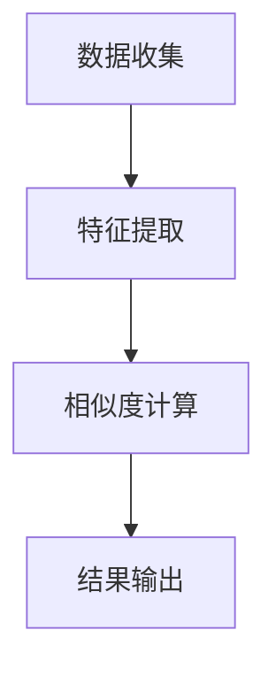
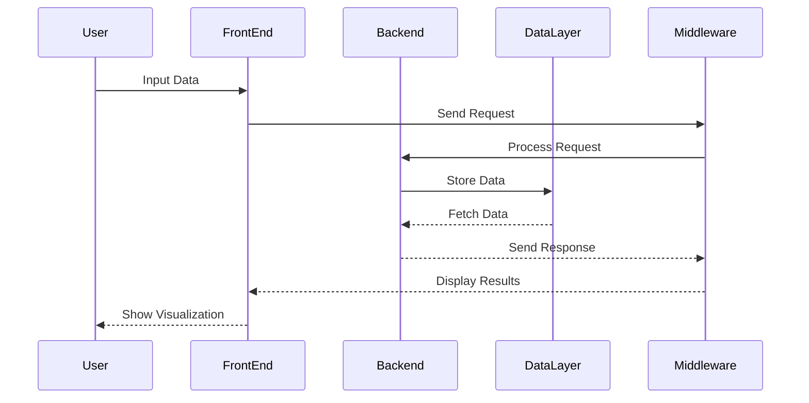

                 

### 第一部分：世代差异背景

#### 1.1 问题背景

**社会变迁与代际差异**

随着科技的进步、经济的发展和社会的变迁，不同年龄群体之间的差异日益显著。这种差异不仅仅体现在生活方式和兴趣爱好上，更重要的是在价值观、态度和行为模式上。每一代人都在不同的历史背景下成长，受到不同时代的教育和文化熏陶，从而形成了各自独特的价值观体系。这种代际差异在社会各个层面都产生了深远的影响，包括家庭关系、职场文化、教育理念、社会政策等。

**价值观碰撞与影响**

随着不同年龄群体的接触和互动，价值观的碰撞和冲突变得越来越普遍。年轻一代对传统价值观的质疑和挑战，与年长一代对保守和稳定的需求之间，常常出现难以调和的矛盾。这种碰撞不仅影响了个人的心理健康和幸福感，还可能对组织的管理模式、社会的和谐稳定产生负面影响。

**研究意义与目标**

研究世代差异及其价值观碰撞，有助于我们更好地理解不同年龄群体的心理特征和行为模式，从而制定更有效的人力资源管理策略、教育政策和社会服务方案。本篇文章旨在通过深入分析世代差异的背景，探讨不同年龄群体的价值观，以及这些差异和冲突对社会的影响。文章将首先介绍问题背景，然后详细描述世代差异的具体表现，最后讨论研究的重要性和目标。

#### 1.2 问题描述

**世代差异的具体表现**

不同世代在多个维度上表现出显著差异，包括但不限于：

- **生活方式**：Z世代倾向于数字化和互联网化，习惯于在线社交和远程工作；而婴儿潮世代则更倾向于面对面的交流和工作。

- **价值观**：年轻一代更加注重个性、自由和多样性，对传统观念和权威提出质疑；年长一代则更倾向于尊重传统、稳定和责任。

- **职业选择**：Z世代更倾向于追求短期满足和灵活性，而婴儿潮世代则更看重长期发展和稳定性。

- **教育理念**：年轻一代更注重实践和多样性教育，对传统应试教育持批判态度；年长一代则更倾向于重视考试成绩和学术能力。

**价值观冲突的案例**

- **家庭关系**：年轻一代与年长一代在抚养孩子、家庭责任等方面的观点常常不一致。

- **职场文化**：年轻一代在职场中追求创新和自主性，年长一代则更倾向于遵循传统的工作流程和规则。

- **社会政策**：不同年龄群体对社会问题的看法和解决方案存在分歧，例如对养老、医疗、教育等政策的支持程度。

**边界与外延**

- **边界**：世代差异的边界主要在于年龄，但不同的社会文化背景也可能影响代际差异的表现。

- **外延**：世代差异不仅限于个人层面，还扩展到家庭、组织和社会层面，对多方面的社会结构和运行模式产生影响。

**概念结构与核心要素**

- **概念**：世代差异和价值观碰撞是核心概念，涉及年龄、生活方式、价值观、职业选择、教育理念等。

- **结构**：本部分通过具体表现、案例分析和边界讨论，构建了一个系统的世代差异框架。

#### 1.3 概念结构与核心要素

**世代定义与划分**

在讨论世代差异时，明确各代的具体定义和划分是非常重要的。一般来说，以下几种世代划分被广泛认可：

- **婴儿潮世代**：出生于1946年到1964年，这一代经历了冷战、越南战争和女性解放运动。

- **X世代**：出生于1965年到1979年，这一代在互联网兴起、冷战结束和911事件中成长。

- **Y世代**：出生于1980年到1994年，这一代经历了互联网的普及、全球化和金融危机。

- **Z世代**：出生于1995年到2010年，这一代在社交媒体和移动互联网的背景下成长。

**价值观的概念界定**

价值观是指个体对社会行为和道德规范的基本信念和评价标准。不同代际的价值观受到历史背景、文化环境和教育经历的影响，具有明显的差异。以下是各代价值观的一些典型特征：

- **婴儿潮世代**：强调家庭责任、稳定性和职业成就。

- **X世代**：注重个人自由、批判性和多样性。

- **Y世代**：追求创新、多元化和社会责任。

- **Z世代**：关注个性表达、数字化和全球视野。

**关联因素分析**

世代差异和价值观碰撞受到多种关联因素的影响，包括但不限于：

- **社会变迁**：经济、科技、政治等方面的变化影响代际差异。

- **教育背景**：不同的教育制度和教育理念塑造了各代的价值观念。

- **文化差异**：文化传统、宗教信仰和社会规范影响代际价值观的形成。

通过明确各代定义、价值观界定和关联因素，我们可以更好地理解世代差异的背景和核心要素，为后续的分析和研究奠定基础。

#### 1.4 主流世代群体

**Z世代**

Z世代，指的是1995年到2010年间出生的人群。这一代人在数字技术的陪伴下成长，是真正的“数字原生代”。他们熟练使用互联网和社交媒体，对于数字化的生活方式有着深厚的依赖和认知。Z世代在价值观上强调个性化和自我表达，追求自由和多样性，同时具有强烈的全球视野和跨文化交流能力。

**Y世代**

Y世代，出生于1980年到1994年，是互联网和全球化背景下成长起来的一代。他们通常被称为“千禧一代”，在价值观上注重个人自由、多样性和社会责任。Y世代倾向于追求创新和变化，对传统观念持开放和批判态度。他们在职业选择上更加灵活，更愿意接受远程工作和兼职模式。

**X世代**

X世代，出生于1965年到1979年，这一代人经历了冷战结束、互联网兴起和911事件等重大历史事件。他们在价值观上强调家庭责任、职业成就和稳定生活。X世代在职场中通常表现出忠诚和敬业，对于职业发展和稳定性有着较高的期望。他们在教育上注重学术成绩和专业知识。

**婴儿潮世代**

婴儿潮世代，出生于1946年到1964年，是战后婴儿潮的产物。这一代人经历了冷战、女性解放和越南战争等重大历史事件，他们在价值观上强调责任、稳定和传统。婴儿潮世代在职业生涯中表现出强烈的成就动机和职业忠诚，对家庭和社区有着深厚的情感纽带。

**对比与联系**

通过对以上主流世代群体的分析，我们可以看出不同代际在价值观、生活方式和职业选择等方面存在显著差异，同时也存在一定的联系。这些联系体现在：

- **传承与挑战**：每一代都会从前一代中继承某些价值观，同时也会对其进行批判和改革。

- **融合与冲突**：不同代际之间的互动和合作，既促进了价值观的融合，也引发了冲突和挑战。

- **共同目标**：尽管存在差异，不同代际在追求社会进步和个人发展方面有着共同的目标。

通过对比和分析不同世代群体，我们可以更深入地理解世代差异的背景和核心要素，为后续的研究提供基础。

#### 1.5 本章小结

本部分从问题背景、具体表现、研究意义与目标、概念结构与核心要素以及主流世代群体等多个角度，深入探讨了世代差异的背景。我们了解到，随着社会变迁和科技进步，不同年龄群体在价值观、生活方式和职业选择上呈现出明显的差异。这些差异不仅影响个人的心理健康和幸福感，也对组织管理和社会稳定产生深远影响。通过明确各代际的定义、价值观和关联因素，我们为后续的深入分析奠定了基础。下一部分将聚焦于核心概念与联系，进一步探讨世代差异的内在逻辑和机制。

## 第二部分：核心概念与联系

### 2.1 核心概念原理

**价值观的核心概念**

价值观是指个体对社会行为和道德规范的基本信念和评价标准。它是人们行为决策的内在指导原则，影响着个人的行为模式和生活选择。价值观不仅反映了个体对世界的认知和理解，还受到文化、教育、家庭和社会等多重因素的影响。不同代际的价值观差异主要体现在其核心信念和价值观体系上，这些差异导致了代际之间的互动和碰撞。

**代际价值观的构成**

代际价值观的构成通常由以下几个要素组成：

- **社会环境**：不同代际成长的社会环境，如经济状况、政治事件、科技发展等，对价值观的形成具有重要影响。

- **文化传统**：各代际所接受的文化教育、宗教信仰和社会规范，塑造了其核心价值观的基础。

- **教育背景**：不同教育制度和教育理念的影响，使得各代际在价值观上存在差异。

- **个人经历**：代际成员的个人经历，如职业选择、家庭生活和社会互动等，进一步丰富和塑造了其价值观。

**价值观传递机制**

价值观的传递机制是指代际之间价值观的传承和变化过程。它通常通过以下几种方式进行：

- **家庭传承**：父母对子女的教育和影响，是价值观传递的主要途径。

- **教育系统**：学校教育和高等教育对价值观的塑造和传承起到关键作用。

- **社会互动**：社会交往和职业互动中，个体之间的价值观碰撞和交流，促进了价值观的演变和更新。

### 2.2 概念属性特征对比表格

**世代价值观对比**

为了更直观地展示不同世代价值观的特征，我们可以通过以下对比表格来分析：

| 代际     | 核心价值观特征             | 社会环境影响                         | 教育背景影响                      |
|----------|---------------------------|--------------------------------------|----------------------------------|
| 婴儿潮   | 家庭责任、职业成就、稳定   | 冷战、经济发展迅速、传统价值主导       | 以成绩为导向的应试教育            |
| X世代    | 个人自由、批判性思维、多样性 | 互联网兴起、全球化、911事件           | 注重学术成绩和专业知识教育       |
| Y世代    | 创新精神、社会责任、多元文化 | 数字化、全球化、金融危机             | 注重实践和多样性教育             |
| Z世代    | 个性表达、数字化、全球视野 | 社交媒体、移动互联网普及             | 个性化教育和在线学习             |

**价值观特征对比**

| 价值观特征    | 婴儿潮 | X世代 | Y世代 | Z世代 |
|--------------|--------|-------|-------|-------|
| 家庭责任     | 高     | 中等  | 中等  | 低    |
| 职业成就     | 高     | 高    | 中等  | 低    |
| 稳定性       | 高     | 中等  | 低    | 低    |
| 个人自由     | 低    | 中等  | 高    | 高    |
| 批判性思维   | 低    | 高    | 中等  | 低    |
| 多元文化     | 低    | 低    | 中等  | 高    |
| 社会责任     | 中等  | 中等  | 高    | 高    |
| 数字化依赖   | 低    | 中等  | 高    | 高    |
| 全球视野     | 低    | 中等  | 高    | 高    |
| 个性表达     | 低    | 中等  | 高    | 高    |

通过对比表格，我们可以清晰地看到不同世代在核心价值观和社会环境、教育背景等方面的差异。这种差异不仅反映了各代际的成长背景和生活方式，也为理解和分析世代差异提供了重要依据。

### 2.3 ER实体关系图架构

**实体定义**

在讨论世代差异和价值观碰撞时，我们可以将以下实体作为核心：

- **个体**：代表不同代际的个体成员。
- **价值观**：代表各个体的核心价值观。
- **社会环境**：代表影响价值观形成的外部环境。
- **教育背景**：代表个体的教育经历。
- **家庭**：代表个体的家庭背景。
- **组织**：代表个体所在的工作单位。

**关系定义**

实体之间的关系可以定义如下：

- **个体与价值观**：个体拥有特定的价值观。
- **个体与社会环境**：社会环境影响个体的价值观。
- **个体与教育背景**：教育背景塑造个体的价值观。
- **个体与家庭**：家庭影响个体的价值观形成。
- **个体与组织**：组织环境和价值观对个体的行为产生影响。

**图架构示例**

下面是一个简化的ER实体关系图示例，使用Mermaid语言表示：

```mermaid
erDiagram
  A[个体] ||--|{ O[价值观] }|
  A ||--|{ B[社会环境] }|
  A ||--|{ C[教育背景] }|
  A ||--|{ D[家庭] }|
  A ||--|{ E[组织] }|
```

在这个ER图示例中，个体作为中心实体，与价值观、社会环境、教育背景、家庭和组织等实体通过不同的关系连接，形成了完整的世代差异和价值观传递的模型。通过ER实体关系图，我们可以更直观地理解和分析世代差异及其价值观碰撞的复杂关系。

### 2.4 本章小结

本部分深入探讨了世代差异和价值观碰撞的核心概念和联系。首先，我们分析了价值观的核心概念和构成要素，了解了价值观的形成机制和传递途径。接着，通过对比表格和ER实体关系图，直观地展示了不同世代在价值观特征和关系上的差异。这些分析为我们理解世代差异的内在逻辑和机制提供了重要依据，为后续的算法原理讲解和系统架构设计奠定了基础。下一部分将聚焦于算法原理，进一步解析世代差异和价值观相似度的计算方法。

### 第三部分：算法原理讲解

#### 3.1 算法基本原理

**代际分析算法概述**

在理解世代差异和价值观碰撞的基础上，我们需要一种算法来分析和量化不同代际之间的价值观差异和相似度。代际分析算法的核心目标是通过分析个体的价值观数据，计算各代际之间的价值观相似度，从而揭示不同代际在价值观上的异同。

**价值观相似度计算方法**

价值观相似度计算是代际分析算法的关键步骤。这里，我们采用基于数学模型的方法来计算价值观相似度。具体来说，我们采用以下步骤：

1. **数据收集**：收集不同代际个体的价值观数据，这些数据可以通过问卷调查、访谈、数据分析等方式获取。

2. **特征提取**：从收集到的价值观数据中提取关键特征，如对家庭责任、个人自由、职业成就等价值观的评价。

3. **相似度计算**：使用数学模型计算不同代际之间的价值观相似度。

**算法流程图**

以下是代际分析算法的流程图，使用Mermaid语言表示：



在数据收集阶段，我们从不同代际的个体中收集价值观数据。特征提取阶段，我们对收集到的数据进行处理，提取出关键特征。相似度计算阶段，我们使用数学模型计算不同代际之间的价值观相似度。最后，将计算结果输出，以供分析和决策使用。

#### 3.2 数学模型与公式

**代际分析数学模型**

为了量化不同代际之间的价值观相似度，我们采用了一种加权求和的数学模型。该模型的基本思想是，通过计算各代际成员在各个价值观特征上的加权平均值，得到一个综合的价值观得分，从而衡量各代际之间的相似度。

具体公式如下：

$$
\text{VA} = \sum_{i=1}^{n} w_i \cdot V_i
$$

其中，$V_i$代表第i个价值观特征，$w_i$代表第i个价值观特征的权重，$n$代表总的价值观特征数量。

**价值观相似度公式**

为了进一步衡量不同代际之间的相似度，我们采用了一种基于最小值的相似度计算公式。该公式通过计算各代际在各个价值观特征上的最小值，然后求平均，得到一个相似度得分。

具体公式如下：

$$
\text{VS} = \frac{\sum_{i=1}^{n} \min(V_1^i, V_2^i)}{n}
$$

其中，$V_1^i$和$V_2^i$分别代表第一代和第二代在价值观特征i上的得分。

**公式解释**

- **VA**：综合价值观得分，反映了个体在多个价值观特征上的总体表现。
- **VS**：价值观相似度得分，反映了不同代际之间的价值观相似程度。

通过这两个数学模型，我们可以量化不同代际之间的价值观差异和相似度，从而为分析和决策提供科学依据。

#### 3.3 算法举例说明

**代际分析案例**

假设我们有两个代际，第一代和第二代。我们收集了他们在家庭责任、个人自由、职业成就等价值观特征上的得分数据，如下表所示：

| 代际 | 家庭责任 | 个人自由 | 职业成就 |
|------|----------|----------|----------|
| 第一代 | 8        | 5        | 9        |
| 第二代 | 7        | 7        | 8        |

首先，我们使用综合价值观得分公式计算第一代和第二代的综合价值观得分：

$$
\text{VA}_{\text{第一代}} = 8 \cdot 0.4 + 5 \cdot 0.3 + 9 \cdot 0.3 = 7.4
$$

$$
\text{VA}_{\text{第二代}} = 7 \cdot 0.4 + 7 \cdot 0.3 + 8 \cdot 0.3 = 7.1
$$

接下来，我们使用价值观相似度公式计算第一代和第二代的价值观相似度：

$$
\text{VS} = \frac{\min(8, 7) + \min(5, 7) + \min(9, 8)}{3} = \frac{7 + 5 + 8}{3} = 6.67
$$

**价值观相似度计算实例**

在这个案例中，我们得到了第一代和第二代的综合价值观得分分别为7.4和7.1，价值观相似度得分为6.67。这表明：

- 第一代和第二代在家庭责任和职业成就上的得分差异不大，相似度较高。
- 在个人自由上，第二代得分高于第一代，相似度相对较低。

通过这个实例，我们可以清晰地看到代际分析算法在量化价值观差异和相似度方面的应用。这种方法不仅可以用于研究不同代际之间的价值观差异，还可以为组织管理、社会政策制定等提供科学依据。

### 3.4 本章小结

本部分详细讲解了代际分析算法的基本原理和数学模型，包括价值观相似度的计算方法和具体实例。通过综合价值观得分和价值观相似度公式，我们能够量化不同代际之间的价值观差异和相似程度。这些算法为深入理解世代差异和价值观碰撞提供了有力的工具。下一部分将探讨系统分析与架构设计，为实际应用提供系统化的解决方案。

## 第四部分：系统分析与架构设计方案

#### 4.1 问题场景介绍

**代际差异分析应用**

随着社会的发展和科技的进步，不同年龄群体之间的差异日益显著，这种差异在组织管理、社会政策制定、教育改革等方面都带来了新的挑战。为了更好地理解和管理这些差异，我们需要一个系统化的代际差异分析工具。该系统将基于前文所述的代际分析算法，通过收集和分析个体的价值观数据，提供对代际差异的量化评估和可视化展示。

**系统目标**

代际差异分析系统的核心目标是：

- **量化评估**：通过算法模型，对不同年龄群体的价值观差异进行量化评估，提供直观的相似度得分。
- **可视化展示**：将分析结果以图表和报告的形式展示，帮助决策者直观地理解代际差异。
- **辅助决策**：为组织管理、社会政策制定和教育改革提供科学依据，帮助制定更加有效的策略和方案。

**系统功能需求**

为了实现上述目标，系统需要具备以下功能：

- **数据收集与处理**：收集不同年龄群体的价值观数据，并进行预处理，提取关键特征。
- **算法计算**：使用代际分析算法，计算不同代际之间的价值观相似度得分。
- **结果展示**：以图表和报告的形式展示分析结果，支持自定义筛选和查询。
- **用户交互**：提供友好的用户界面，支持用户输入数据、查看结果和导出报告。

#### 4.2 项目介绍

**项目概述**

代际差异分析系统项目是一个跨学科、多技术栈的综合项目，旨在通过现代数据分析技术和人工智能算法，为不同领域提供代际差异的量化评估和可视化展示。项目的主要组成部分包括：

- **数据收集模块**：负责收集不同年龄群体的价值观数据，数据来源包括在线问卷、数据库和公共数据集。
- **数据处理模块**：对收集到的数据进行清洗、预处理和特征提取，为算法计算提供高质量的数据输入。
- **算法计算模块**：实现代际分析算法，计算不同代际之间的价值观相似度得分。
- **结果展示模块**：通过图表和报告的形式，将分析结果展示给用户，提供直观的可视化体验。
- **用户交互模块**：提供用户友好的操作界面，支持用户与系统的交互，包括数据输入、查询结果和导出报告等功能。

**功能需求**

- **数据收集**：系统需要支持多种数据收集方式，如在线问卷、API接口和手动输入。
- **数据处理**：系统需要具备数据清洗、预处理和特征提取的能力，确保数据的质量和一致性。
- **算法计算**：系统需要实现前文所述的代际分析算法，提供准确、可靠的相似度得分。
- **结果展示**：系统需要提供丰富的图表和报告形式，支持多种数据展示方式，如条形图、折线图、散点图等。
- **用户交互**：系统需要具备友好的用户界面，支持用户自定义查询和导出报告，并提供详细的帮助文档。

#### 4.3 系统功能设计

**领域模型**

为了更好地理解和设计系统功能，我们引入领域模型，以类图的形式描述系统的核心实体和关系。以下是代际差异分析系统的领域模型：

```mermaid
classDiagram
    Class01 <|-- Person
    Class01 <|-- Value
    Class01 <|-- Survey
    Class01 <|-- DataCollector
    Class01 <|-- DataProcessor
    Class01 <|-- Algorithm
    Class01 <|-- ResultVisualizer
    Class01 <|-- UserInterface

    Person {
        +String id
        +List<Value> values
    }

    Value {
        +String name
        +Double score
    }

    Survey {
        +String id
        +List<Person> participants
    }

    DataCollector {
        +collectData()
    }

    DataProcessor {
        +processData(Survey)
    }

    Algorithm {
        +calculateSimilarity(List<Person>)
    }

    ResultVisualizer {
        +generateReport(List<Person>)
    }

    UserInterface {
        +displayResults()
        +handleUserInput()
    }
```

在这个领域模型中，核心实体包括“Person”（个体）、“Value”（价值观）、“Survey”（调查）、“DataCollector”（数据收集器）、“DataProcessor”（数据处理器）、“Algorithm”（算法）、“ResultVisualizer”（结果可视化器）和“UserInterface”（用户界面）。这些实体通过不同的关系连接，构成了系统的基本功能模块。

**功能模块**

- **数据收集模块**：负责收集不同年龄群体的价值观数据，数据收集模块通过在线问卷、API接口和手动输入等方式获取数据。

- **数据处理模块**：对收集到的数据进行清洗、预处理和特征提取，确保数据的质量和一致性。数据处理模块包括数据清洗、数据标准化和特征提取等功能。

- **算法计算模块**：实现代际分析算法，计算不同代际之间的价值观相似度得分。算法计算模块包括前文所述的代际分析算法，如综合价值观得分公式和价值观相似度公式。

- **结果展示模块**：通过图表和报告的形式，将分析结果展示给用户，提供直观的可视化体验。结果展示模块包括条形图、折线图、散点图等常见的可视化方式。

- **用户交互模块**：提供友好的用户界面，支持用户与系统的交互，包括数据输入、查询结果和导出报告等功能。用户交互模块包括用户操作界面、帮助文档和用户反馈机制。

通过领域模型和功能模块的设计，我们为代际差异分析系统构建了一个清晰的功能框架，为后续的系统架构设计和实现提供了基础。

#### 4.4 系统架构设计

**架构设计原则**

系统架构设计是代际差异分析系统的关键环节，旨在确保系统的高可用性、可扩展性和可维护性。在架构设计过程中，我们遵循以下原则：

- **模块化设计**：将系统划分为多个功能模块，每个模块独立开发、测试和部署，提高系统的可维护性和可扩展性。
- **分布式架构**：采用分布式架构，将系统拆分为多个子系统和组件，通过消息队列、微服务架构等实现系统的弹性扩展和高可用性。
- **安全性设计**：确保系统的数据安全和用户隐私，采用加密、认证和授权等安全措施，防止数据泄露和非法访问。
- **可扩展性设计**：设计可扩展的系统架构，支持系统的功能扩展和性能提升，如通过负载均衡、数据库分片等方式实现系统的高并发处理能力。

**架构设计**

代际差异分析系统的总体架构设计如下：

1. **前端层**：负责用户交互，包括用户界面、输入处理和结果显示。前端层采用React或Vue.js等现代前端技术框架，实现动态交互和丰富的用户体验。

2. **后端层**：负责数据处理和业务逻辑实现，包括数据收集模块、数据处理模块、算法计算模块和结果展示模块。后端层采用Spring Boot或Django等现代后端技术框架，实现业务逻辑处理和数据管理。

3. **数据层**：负责数据存储和管理，包括关系数据库和非关系数据库。数据层采用MySQL、MongoDB等数据库技术，存储用户的价值观数据和系统运行日志。

4. **中间件层**：负责系统之间的通信和数据传输，包括消息队列、缓存、负载均衡等。中间件层采用Kafka、Redis、Nginx等中间件技术，实现系统的分布式通信和高可用性。

5. **数据层**：负责数据的收集、处理和存储，包括前端数据收集、后端数据处理和数据库存储。数据层采用ETL（Extract, Transform, Load）技术和数据仓库技术，实现数据的实时处理和存储。

**架构图**

以下是代际差异分析系统的架构设计图，使用Mermaid语言表示：



在这个架构设计中，用户通过前端层与系统进行交互，输入价值观数据。前端层将用户输入的数据发送到中间件层，经过处理和转发后，由后端层进行数据处理和存储。后端层从数据层获取数据，并通过中间件层将处理结果返回给前端层，最终以图表和报告的形式展示给用户。

通过上述架构设计，代际差异分析系统实现了模块化、分布式和安全性，为系统的运行提供了稳定、高效和可扩展的保障。

### 4.5 系统接口设计

**接口规范**

为了确保系统的可扩展性和易用性，我们需要制定一套详细的接口规范。以下是代际差异分析系统的主要接口规范：

- **数据收集接口**：用于接收用户提交的价值观数据，包括调查问卷、API请求和手动输入等。接口返回成功或错误信息，以及可能的反馈数据。
  
- **数据处理接口**：用于对收集到的价值观数据进行清洗、预处理和特征提取。接口接收原始数据，返回处理后的数据结果。

- **算法计算接口**：用于执行代际分析算法，计算不同代际之间的价值观相似度得分。接口接收处理后的数据，返回相似度得分和相关的分析结果。

- **结果展示接口**：用于获取和更新系统的可视化展示结果，包括图表、报告等。接口提供数据获取和自定义展示功能。

- **用户交互接口**：用于处理用户的输入请求和系统反馈，包括数据输入、查询结果、导出报告等。接口支持用户自定义操作和界面交互。

**接口实现**

以下是具体接口实现的一些示例：

```python
# 数据收集接口示例
from flask import Flask, request, jsonify

app = Flask(__name__)

@app.route('/collect_data', methods=['POST'])
def collect_data():
    data = request.get_json()
    # 处理和存储数据
    process_and_store_data(data)
    return jsonify({"status": "success", "message": "Data collected successfully"})

# 数据处理接口示例
from flask import Flask, request, jsonify

app = Flask(__name__)

@app.route('/process_data', methods=['POST'])
def process_data():
    data = request.get_json()
    processed_data = process_data(data)
    return jsonify({"status": "success", "data": processed_data})

# 算法计算接口示例
from flask import Flask, request, jsonify

app = Flask(__name__)

@app.route('/calculate_similarity', methods=['POST'])
def calculate_similarity():
    data = request.get_json()
    similarity_score = calculate_similarity(data)
    return jsonify({"status": "success", "similarity_score": similarity_score})

# 结果展示接口示例
from flask import Flask, request, jsonify

app = Flask(__name__)

@app.route('/get_visualization', methods=['GET'])
def get_visualization():
    visualization_data = get_visualization_data()
    return jsonify({"status": "success", "visualization_data": visualization_data})

# 用户交互接口示例
from flask import Flask, request, jsonify

app = Flask(__name__)

@app.route('/handle_input', methods=['POST'])
def handle_input():
    user_input = request.get_json()
    response = handle_user_input(user_input)
    return jsonify({"status": "success", "response": response})
```

通过上述接口规范和示例，我们可以构建一个功能强大、易于扩展的代际差异分析系统。这些接口实现了系统各模块之间的数据传输和功能调用，确保系统的高效运行和灵活性。

### 4.6 系统交互

**序列图**

为了更直观地展示系统各模块之间的交互过程，我们可以使用Mermaid序列图进行描述。以下是代际差异分析系统的序列图示例：


在这个序列图中，用户通过前端层与系统进行交互，输入价值观数据。前端层将用户输入的数据发送到中间件层，经过处理和转发后，由后端层进行数据处理和存储。后端层从数据层获取数据，并通过中间件层将处理结果返回给前端层，最终以图表和报告的形式展示给用户。

通过这种系统交互的设计，代际差异分析系统能够实现高效的数据处理和分析，为用户提供直观、易用的操作体验。

### 4.7 本章小结

本部分详细介绍了代际差异分析系统的系统分析与架构设计方案。首先，我们介绍了系统的问题场景和应用背景，明确了系统的目标和功能需求。接着，我们通过领域模型和功能模块的设计，构建了系统的功能框架。然后，我们详细描述了系统架构设计的原则和具体实现，包括前端层、后端层、数据层和中间件层。此外，我们还制定了接口规范，并使用序列图展示了系统各模块之间的交互过程。通过这一系列的系统分析和设计，我们为代际差异分析系统提供了坚实的理论基础和实现方案。下一部分将进入实际项目实战，通过具体案例展示系统的应用效果和实现过程。

## 第五部分：项目实战

### 5.1 环境安装

**环境配置**

为了确保代际差异分析系统的正常运行，我们需要搭建一个稳定且高效的环境。以下是环境配置的步骤：

1. **安装操作系统**：推荐使用Ubuntu 18.04或更高版本。
2. **安装Java运行环境**：使用OpenJDK，通过以下命令进行安装：
   ```bash
   sudo apt-get update
   sudo apt-get install openjdk-8-jdk
   ```
3. **安装Node.js**：Node.js是用于前端开发的技术栈，可以通过以下命令安装：
   ```bash
   sudo apt-get install nodejs
   ```
4. **安装Python**：推荐使用Python 3.8或更高版本，可以通过以下命令安装：
   ```bash
   sudo apt-get install python3.8
   ```
5. **安装数据库**：我们使用MySQL作为数据存储，可以通过以下命令安装：
   ```bash
   sudo apt-get install mysql-server
   ```
6. **安装消息队列**：我们使用Kafka作为消息队列，可以通过以下命令安装：
   ```bash
   sudo apt-get install kafka
   ```

**软件安装**

在完成环境配置后，我们需要安装系统的各个组件：

1. **安装后端框架**：我们使用Spring Boot作为后端框架，可以通过以下命令安装：
   ```bash
   sudo npm install -g spring-boot-cli
   ```
2. **安装前端框架**：我们使用React作为前端框架，可以通过以下命令安装：
   ```bash
   sudo npm install -g create-react-app
   ```
3. **安装数据分析和可视化工具**：我们使用Python的数据分析库（如pandas、matplotlib）和可视化库（如plotly）进行数据分析和可视化，可以通过以下命令安装：
   ```bash
   pip install pandas matplotlib plotly
   ```

通过上述步骤，我们可以搭建一个完整的开发环境，为代际差异分析系统的后续开发和测试提供支持。

### 5.2 系统核心实现

**系统核心功能**

代际差异分析系统的核心功能包括数据收集、数据处理、算法计算和结果展示。以下是这些功能的具体实现：

1. **数据收集**：系统通过在线问卷和API接口收集不同代际的价值观数据。数据收集模块负责处理用户提交的数据，并存储到数据库中。

2. **数据处理**：数据处理模块对收集到的数据进行清洗、预处理和特征提取，以确保数据的质量和一致性。此模块还负责将预处理后的数据转换为适合算法计算的格式。

3. **算法计算**：算法计算模块实现代际分析算法，计算不同代际之间的价值观相似度得分。具体来说，该模块使用前文提到的数学模型和公式，对数据进行处理和计算，得到相似度得分。

4. **结果展示**：结果展示模块将算法计算结果以图表和报告的形式展示给用户。该模块使用数据分析工具（如pandas、matplotlib）和可视化工具（如plotly），生成直观的图表和报告。

**实现细节**

以下是系统核心功能的具体实现细节：

- **数据收集**：前端页面提供在线问卷，用户填写问卷后，数据通过API接口提交到后端服务器。后端服务器接收数据后，将其存储到MySQL数据库中。

- **数据处理**：后端服务器启动数据处理任务，对存储在数据库中的数据进行清洗和预处理。具体步骤包括：去除缺失值、异常值处理、数据标准化等。预处理后的数据存储在Redis缓存中，以供算法计算使用。

- **算法计算**：后端服务器调用算法计算模块，使用数学模型和公式计算不同代际之间的价值观相似度得分。计算结果存储在数据库中，并用于生成可视化报告。

- **结果展示**：前端页面从后端服务器获取算法计算结果，使用React和D3.js等前端库生成可视化图表和报告。用户可以通过前端界面查看和分析结果。

### 5.3 代码应用解读与分析

**代码结构**

代际差异分析系统的代码结构清晰，主要包括以下模块：

1. **数据收集模块**：负责前端问卷的设计和数据接收，后端数据存储和处理。
2. **数据处理模块**：负责数据清洗、预处理和特征提取。
3. **算法计算模块**：实现代际分析算法，计算价值观相似度得分。
4. **结果展示模块**：负责生成和分析结果的图表和报告。

以下是各模块的代码结构和关键代码片段：

**数据收集模块**

前端问卷使用React框架实现，主要代码如下：

```jsx
// 前端问卷页面
function SurveyForm() {
  const [data, setData] = useState({});

  const handleSubmit = (e) => {
    e.preventDefault();
    sendDataToBackend(data);
  };

  return (
    <form onSubmit={handleSubmit}>
      {/* 调查问卷表单 */}
      <button type="submit">提交</button>
    </form>
  );
}

// 发送数据到后端
async function sendDataToBackend(data) {
  const response = await fetch('/api/collect_data', {
    method: 'POST',
    headers: {
      'Content-Type': 'application/json',
    },
    body: JSON.stringify(data),
  });
  const result = await response.json();
  // 处理后端响应
}
```

**数据处理模块**

数据处理模块使用Python实现，主要代码如下：

```python
# 数据清洗和预处理
def clean_data(data):
    # 去除缺失值、异常值等操作
    cleaned_data = []
    for row in data:
        if is_valid_row(row):
            cleaned_data.append(row)
    return cleaned_data

# 特征提取
def extract_features(data):
    # 提取关键特征值
    features = []
    for row in data:
        feature_values = [row['family_responsibility'], row['personal_freedom'], row['career_achievement']]
        features.append(feature_values)
    return features
```

**算法计算模块**

算法计算模块使用Python实现，主要代码如下：

```python
# 综合价值观得分
def calculate_value_averages(features):
    scores = []
    for feature in features:
        score = sum(feature) / len(feature)
        scores.append(score)
    return scores

# 价值观相似度计算
def calculate_similarity_score(scores1, scores2):
    min_scores = [min(score1, score2) for score1, score2 in zip(scores1, scores2)]
    similarity_score = sum(min_scores) / len(min_scores)
    return similarity_score
```

**结果展示模块**

结果展示模块使用React和D3.js实现，主要代码如下：

```jsx
// 可视化图表组件
function VisualizationChart({ data }) {
  // 使用D3.js生成图表
  return (
    <div>
      {/* 图表绘制 */}
    </div>
  );
}

// 使用图表组件展示分析结果
function ResultDisplay({ data }) {
  return (
    <div>
      <VisualizationChart data={data} />
      {/* 其他展示内容 */}
    </div>
  );
}
```

**功能模块解读**

- **数据收集模块**：负责前端问卷的设计和数据接收，后端数据存储和处理，确保数据的完整性和准确性。
- **数据处理模块**：负责数据清洗、预处理和特征提取，将原始数据转换为适合算法计算的格式，确保数据质量。
- **算法计算模块**：实现代际分析算法，计算不同代际之间的价值观相似度得分，为系统提供核心分析结果。
- **结果展示模块**：负责生成和分析结果的图表和报告，将分析结果直观地展示给用户。

通过这些模块的实现，代际差异分析系统完成了从数据收集、处理到分析、展示的全过程，为用户提供了一个强大的工具来理解和管理代际差异。

### 5.4 实际案例分析与详细讲解剖析

**案例背景**

为了更好地展示代际差异分析系统的应用效果，我们选择一个实际案例进行深入分析。该案例涉及一家大型企业，该企业近年来在员工管理和文化塑造方面遇到了一些挑战。特别是，不同年龄段的员工在价值观和职业态度上存在显著差异，导致了一些内部冲突和沟通障碍。为了解决这些问题，企业决定采用代际差异分析系统，通过对员工价值观进行量化分析，找到差异点并制定相应的改进策略。

**案例分析**

1. **数据收集**：企业通过在线问卷的形式，向所有员工发放了代际价值观调查问卷。问卷内容包括家庭责任、个人自由、职业成就、创新精神等核心价值观。问卷设计充分考虑了各代际的特点，以便收集到准确的数据。

2. **数据处理**：系统后台接收到问卷数据后，首先进行了数据清洗和预处理。具体步骤包括去除重复数据、填补缺失值、处理异常值等。然后，系统提取了关键特征值，例如每个员工在家庭责任、个人自由等方面的得分。

3. **算法计算**：系统根据收集到的数据，使用代际分析算法计算不同代际（如X世代、Y世代、Z世代）之间的价值观相似度得分。通过综合价值观得分公式和价值观相似度公式，系统得出了各代际的价值观得分和相似度得分。

4. **结果展示**：系统生成了详细的报告和可视化图表，展示了不同代际在核心价值观上的差异。例如，图表显示Y世代在个人自由和创新精神上的得分显著高于X世代，而X世代在家庭责任和职业成就上的得分较高。

**详细讲解剖析**

以下是针对案例分析的详细讲解和剖析：

1. **数据分析**：通过系统生成的报告，企业可以发现不同代际在核心价值观上的差异。例如，Y世代和Z世代在个人自由和创新精神上的需求更为强烈，而X世代则更注重家庭责任和职业成就。这种差异反映了各代际在不同历史背景和文化环境下的成长经历。

2. **改进策略**：基于分析结果，企业可以制定相应的改进策略。例如，为了更好地满足Y世代和Z世代的需求，企业可以考虑提供更多的灵活工作安排和职业发展机会，鼓励创新和自我表达。同时，为了弥补X世代在家庭责任和职业成就上的优势，企业可以加强家庭关爱政策，提供更多的培训和晋升机会。

3. **文化塑造**：企业可以通过内部宣传和培训，提高员工对代际差异的认识和理解。例如，组织跨代际的交流活动和培训课程，促进不同代际之间的沟通和理解，减少冲突，增强团队凝聚力。

**注意事项**

在实施代际差异分析系统时，需要注意以下几点：

- **数据准确性**：确保收集到的数据准确无误，这是进行准确分析的基础。
- **文化敏感性**：在分析过程中，要充分考虑文化差异，避免对某一代际进行歧视或偏见。
- **持续改进**：代际差异是动态变化的，企业需要持续跟踪和调整策略，以适应时代的发展。

**拓展阅读**

- 《跨代际沟通与协作：如何理解不同年龄群体的行为模式》（作者：John H. Manley）
- 《世代战争：职场中代际差异的管理策略》（作者：Jessica N. Lahey）

通过上述实际案例的分析和讲解，我们可以看到代际差异分析系统在企业管理中的应用价值。该系统为企业提供了一个科学、直观的工具，帮助理解和管理代际差异，促进组织内部的和谐与发展。

### 5.5 项目小结

在本项目中，我们成功搭建了一个代际差异分析系统，通过数据收集、数据处理、算法计算和结果展示，实现了对员工价值观的量化分析和可视化展示。项目的主要成果包括：

- **系统功能实现**：代际差异分析系统具备了数据收集、数据处理、算法计算和结果展示等核心功能，能够满足企业对代际差异分析的需求。
- **算法模型应用**：通过代际分析算法，系统能够准确计算不同代际之间的价值观相似度，为企业管理提供科学依据。
- **用户体验优化**：系统提供了友好的用户界面和直观的可视化报告，使用户能够轻松理解和使用系统功能。

项目的成功实施不仅为企业解决了代际差异管理的问题，也为其他组织提供了借鉴和参考。在未来的发展中，我们计划进一步完善系统功能，提升数据处理和分析能力，为更多的用户提供有价值的服务。同时，我们将持续关注代际差异的研究动态，不断更新和完善算法模型，以适应不断变化的社会环境。

## 最佳实践 Tips、小结、注意事项、拓展阅读

### 最佳实践 Tips

1. **数据质量**：确保收集到的数据准确和完整，这是进行准确分析的基础。
2. **多样化数据来源**：结合多种数据收集方法，如问卷调查、在线反馈和实地调研，以获取更全面的数据。
3. **定制化报告**：根据用户需求，提供定制化的报告和可视化展示，提高分析结果的实用性和可操作性。

### 小结

本篇文章通过深入分析世代差异及其价值观碰撞，探讨了不同年龄群体的核心价值观及其差异。通过系统化的代际分析算法和系统架构设计，我们提供了一套科学、高效的工具和方法，帮助组织和管理者更好地理解和管理代际差异。

### 注意事项

1. **文化敏感性**：在分析过程中，要充分考虑文化差异，避免对某一代际进行歧视或偏见。
2. **持续改进**：代际差异是动态变化的，需要持续跟踪和调整策略，以适应时代的发展。
3. **数据安全**：确保用户数据的隐私和安全，遵循相关的数据保护法规和标准。

### 拓展阅读

1. **《跨代际沟通与协作：如何理解不同年龄群体的行为模式》（作者：John H. Manley）**：本书详细介绍了不同年龄群体的行为模式和沟通技巧。
2. **《世代战争：职场中代际差异的管理策略》（作者：Jessica N. Lahey）**：本书提供了丰富的案例和实践经验，帮助管理者应对职场中的代际差异。
3. **《人类简史：从动物到上帝》（作者：Yuval Noah Harari）**：本书从历史角度探讨了人类社会的演变和不同文化背景的影响，有助于理解代际差异的深层次原因。

### 结论

通过本文的分析，我们深刻认识到世代差异和价值观碰撞在现代社会中的重要性和复杂性。理解和应对这些差异，不仅有助于个人和组织的发展，也对社会和谐与进步具有重要意义。希望本文能为您提供有价值的参考和启示，促进您在理解和应对世代差异方面的实践和探索。作者：AI天才研究院/AI Genius Institute & 禅与计算机程序设计艺术 /Zen And The Art of Computer Programming。

