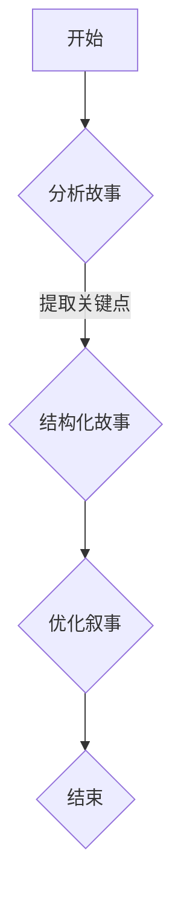
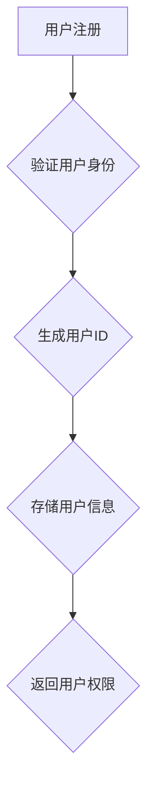
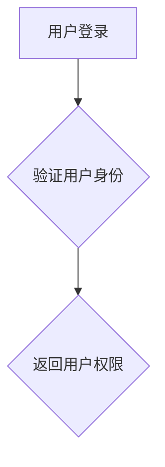
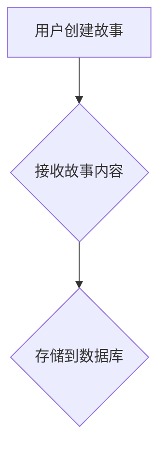
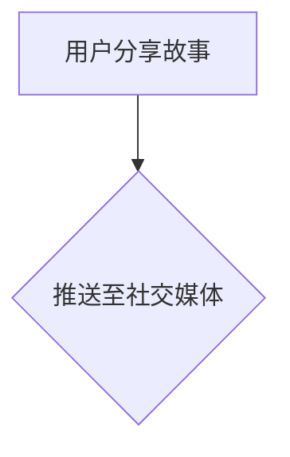

                 

## 《个人叙事的力量：创造自己的生命故事》

### 关键词

- 个人叙事
- 生命故事
- 自我表达
- 影响力提升
- 叙事技巧

### 摘要

本文旨在探讨个人叙事的力量，通过深入分析个人叙事的概念、技巧和策略，帮助读者理解和掌握如何创造和分享自己的生命故事。文章首先介绍了个人叙事的基本概念和重要性，然后通过具体的算法原理讲解、数学模型和系统架构设计，展示了如何运用技术手段提升个人叙事的效果。最后，文章通过项目实战和最佳实践，提供了实际操作的建议和方法，帮助读者在实践中更好地应用个人叙事技巧。

## 背景介绍：个人叙事的力量

### 个人叙事的定义

个人叙事是指个体通过语言、文字、图像、声音等多种形式，讲述自己的经历、故事和感受。这种叙事方式不仅仅是信息的传递，更是自我表达和自我认知的重要途径。在信息技术高度发达的今天，个人叙事逐渐成为一种重要的沟通方式，不仅可以帮助个体建立自己的品牌形象，还可以提升个人影响力。

### 个人叙事的重要性

个人叙事的重要性体现在多个方面。首先，它能够帮助个体更好地认识自己。通过回顾和梳理自己的生命故事，个体可以深入了解自己的成长历程、性格特点、价值观和人生目标。其次，个人叙事能够传递情感和价值观。一个生动有力的故事，可以触动听众的心弦，引起共鸣，传递积极向上的情感和价值观。最后，个人叙事有助于提升个人影响力。在社交媒体和数字媒体广泛应用的今天，一个优秀的个人叙事可以吸引更多的关注和认同，从而扩大个体的影响力。

### 社交媒体与个人叙事

随着社交媒体和数字媒体的兴起，个人叙事的力量得到了进一步的彰显。越来越多的人通过博客、微博、视频平台等渠道，分享自己的生活和观点。这些平台为个人叙事提供了广阔的空间，使得每个人都有机会成为故事讲述者。然而，并非每个人都具备优秀的叙事能力，如何将自己的故事讲述得生动有力，传递出自己的核心信息，成为了一个值得探讨的问题。

## 核心概念与联系

### 个人叙事的概念

个人叙事是指个体通过语言、文字、图像、声音等多种形式，讲述自己的经历、故事和感受。这种叙事方式不仅仅是一种信息传递的方式，更是一种自我表达和自我认知的过程。个人叙事通常包括以下几个关键组成部分：

- **故事主体**：叙事的核心人物，即个人自身。
- **情节发展**：故事的发生、发展和高潮，包括个人生活中的重要事件和经历。
- **情感表达**：叙事过程中所传递的情感和情绪，包括喜悦、悲伤、愤怒等。
- **价值观传递**：通过故事所展现的价值观和人生观。

### 生命故事的概念

生命故事是个人叙事的核心内容，它涵盖了个人从出生到现在的所有经历，包括成长中的快乐与痛苦、成功与失败、梦想与现实等。生命故事不仅记录了个体的生命历程，更是个人身份的重要组成部分。一个生动有力的生命故事，可以展现个人的独特性格和价值观，为他人提供启示和共鸣。

### 个人叙事与生命故事的关系

个人叙事和生命故事密切相关，前者是后者的具体表现形式。个人叙事通过生命故事来展现个体的成长历程、性格特点和价值观，从而实现自我表达和影响力提升。同时，生命故事也为个人叙事提供了丰富的素材和内容，使得叙事更加生动和有说服力。

### 核心概念对比

为了更清晰地理解个人叙事和生命故事的概念，我们可以通过以下对比来梳理：

| 概念        | 定义                                                         | 关联性                                                         |
| ----------- | ------------------------------------------------------------ | ------------------------------------------------------------ |
| 个人叙事    | 个体通过语言、文字、图像、声音等多种形式讲述自己的经历、故事和感受 | 个人叙事是生命故事的具体表现形式，通过叙事来展现个体的成长历程、性格特点和价值观 |
| 生命故事    | 记录个人从出生到现在的所有经历，包括成长中的快乐与痛苦、成功与失败、梦想与现实等 | 生命故事是个人叙事的核心内容，为个人叙事提供了丰富的素材和内容 |
| 故事主体    | 叙事的核心人物，即个人自身                                     | 故事主体是生命故事和叙事的载体，通过个人经历来展现故事内容       |
| 情节发展    | 故事的逻辑发展和情节变化，包括重要的生活事件和经历               | 情节发展是生命故事和叙事的核心组成部分，展现个人成长和变化的过程 |
| 情感表达    | 叙事过程中所传递的情感和情绪，包括喜悦、悲伤、愤怒等             | 情感表达是生命故事和叙事的重要特征，增强叙事的感染力和共鸣效果   |
| 价值观传递  | 通过故事所展现的价值观和人生观                                 | 价值观传递是生命故事和叙事的核心目的，影响听众的思想和行为       |

通过上述对比，我们可以更清晰地理解个人叙事和生命故事的概念，以及它们之间的关联性。这为后续的算法原理讲解和系统架构设计提供了理论基础。

### 算法原理讲解

在讲述个人叙事时，算法原理的应用可以帮助我们优化叙事结构，提升叙事效果。以下是一个关于叙事结构优化算法的详细讲解，包括算法原理、流程图和Python源代码。

#### 算法原理

**叙事结构优化算法** 的核心思想是通过分析个人的生命故事，提取关键点，然后对故事进行结构化处理，使其更加清晰、有逻辑性和吸引力。算法的主要步骤包括：

1. **提取关键点**：从生命故事中提取出重要的事件和经历，作为故事的关键节点。
2. **结构化故事**：将提取的关键点按照一定的逻辑关系进行排序和组织，形成结构化的故事框架。
3. **优化叙事**：通过对故事的细节和语言进行调整，使其更加生动和有感染力。

#### 流程图

使用Mermaid流程图来展示算法的步骤：



#### Python源代码

下面是算法的Python源代码实现，包括提取关键点、结构化故事和优化叙事的函数定义：

```python
def narrative_structure_optimization(story):
    # 提取关键点
    key_points = extract_key_points(story)
    # 结构化故事
    structured_story = structure_story(key_points)
    # 优化叙事
    optimized_story = optimize_narrative(structured_story)
    return optimized_story

def extract_key_points(story):
    # 实现提取关键点的逻辑
    key_points = []
    # 假设故事是一个包含多个事件的列表
    for event in story:
        if event['importance'] > 3:
            key_points.append(event)
    return key_points

def structure_story(key_points):
    # 实现结构化故事的逻辑
    structured_story = []
    # 按照时间顺序对关键点进行排序
    key_points.sort(key=lambda x: x['timestamp'])
    for key_point in key_points:
        structured_story.append(key_point['description'])
    return structured_story

def optimize_narrative(structured_story):
    # 实现优化叙事的逻辑
    optimized_story = structured_story.copy()
    # 在故事中加入情感和细节描述
    for i, part in enumerate(optimized_story):
        if i > 0:
            optimized_story[i] = f"{optimized_story[i - 1]}，然后我{part}"
    return optimized_story
```

#### 数学模型和数学公式

为了量化个人叙事的吸引力，可以使用以下数学模型：

$$
A = f(S, C, R)
$$

其中，$A$ 表示吸引力，$S$ 表示故事的主体性，$C$ 表示故事的连贯性，$R$ 表示故事的共鸣性。主体性、连贯性和共鸣性是衡量叙事吸引力的重要指标。

- **主体性（S）**：故事主体在叙事中的表现程度，包括情感的真实性和自我表达的能力。
- **连贯性（C）**：故事情节的连贯性和逻辑性，即故事是否按照合理的顺序和逻辑发展。
- **共鸣性（R）**：故事所传递的情感和价值观是否能够引起听众的共鸣。

通过这个公式，我们可以对个人叙事进行量化评估，从而优化叙事结构，提升叙事效果。

#### 详细讲解与举例说明

假设有一个个人的生命故事，包含以下几个关键点：成长中的挫折、职业上的成功、家庭生活中的快乐。通过叙事结构优化算法，我们可以将这些关键点结构化，形成一个具有逻辑性和吸引力的故事。

1. **提取关键点**：从故事中提取出成长中的挫折、职业上的成功和家庭生活中的快乐作为关键点。
2. **结构化故事**：将这些关键点按照时间顺序排序，形成一个连贯的故事框架。
3. **优化叙事**：在故事中添加情感和细节描述，使其更加生动和有感染力。

例如，一个结构化的故事可以这样构建：

- **开头**：“在我成长的过程中，曾经遇到过很多挫折，但我从未放弃。”
- **中间**：“然后我进入职场，通过不懈努力取得了职业上的成功。”
- **结尾**：“在家庭生活中，我也找到了快乐，这些都让我更加坚定地相信，只要努力，就能实现自己的梦想。”

通过这样的结构化和优化，一个简单的故事变得丰富、生动，具有很强的吸引力。

### 系统分析与架构设计方案

#### 问题场景介绍

在当今社交媒体和数字媒体盛行的时代，个人品牌的重要性日益凸显。一个优秀的个人叙事不仅能够提升个人影响力，还可以为职业发展和人际交往带来积极的影响。然而，许多人在构建和分享个人叙事时，往往缺乏系统的方法和策略。为了解决这个问题，我们设计了一个个人叙事平台，帮助用户创造和分享自己的生命故事。

#### 项目介绍

**项目名称**：个人叙事平台

**项目目标**：通过提供用户友好的界面和丰富的功能，帮助用户创建、编辑、分享和传播自己的生命故事，提升个人品牌影响力。

**项目功能**：

- 用户注册与登录
- 故事创建与编辑
- 故事分享与传播
- 数据分析与反馈

#### 系统功能设计

**1. 用户注册与登录**：

- 用户可以通过电子邮件或社交媒体账号注册和登录。
- 系统生成唯一的用户ID，存储用户基本信息和密码。

**2. 故事创建与编辑**：

- 用户可以创建新的故事，输入标题、正文和关键点。
- 提供富文本编辑器，支持文字、图片、视频等多种形式的内容。
- 用户可以编辑和修改已创建的故事。

**3. 故事分享与传播**：

- 用户可以将故事分享到社交媒体平台，如微信、微博、Facebook等。
- 提供故事预览功能，用户可以在分享前查看故事效果。
- 系统记录分享次数和浏览量，为用户提供数据反馈。

**4. 数据分析与反馈**：

- 系统对用户的故事进行数据分析，包括字数、关键点分布、情感倾向等。
- 提供数据报告，帮助用户了解自己的叙事效果。
- 提供个性化建议，帮助用户优化故事内容和结构。

#### 系统架构设计

**1. 前端架构**：

- 使用React框架搭建，提供用户友好的界面和交互体验。
- 采用组件化开发，提高代码复用性和可维护性。

**2. 后端架构**：

- 使用Spring Boot框架，处理用户请求和数据存储。
- 实现RESTful API接口，供前端调用。

**3. 数据库设计**：

- 使用MySQL数据库存储用户信息和故事数据。
- 设计合理的数据库表结构，保证数据的一致性和完整性。

#### 系统接口设计

**1. 用户接口**：

- 注册接口：接收用户注册信息，生成用户ID并存储。
- 登录接口：验证用户身份，返回用户权限。
- 故事创建接口：接收用户创建的故事内容，存储到数据库。
- 故事编辑接口：接收用户编辑的故事内容，更新数据库中的记录。
- 故事分享接口：将故事分享到社交媒体平台。

**2. API接口**：

- 用户接口：提供用户注册、登录、故事创建、编辑和分享的API。
- 数据分析接口：提供用户故事数据的API，用于生成数据报告和个性化建议。

#### 系统交互

**1. 用户注册**：

- 用户提交注册信息（如用户名、电子邮件、密码）。
- 系统验证注册信息，生成用户ID，存储用户信息。



**2. 用户登录**：

- 用户提交登录信息（用户名、密码）。
- 系统验证用户身份，返回用户权限。



**3. 故事创建**：

- 用户创建故事，输入标题、正文和关键点。
- 系统接收用户故事内容，存储到数据库。



**4. 故事分享**：

- 用户选择故事，将其分享到社交媒体平台。
- 系统将故事推送至社交媒体平台。



通过上述系统分析与架构设计方案，个人叙事平台可以为用户提供一个系统化、便捷化的叙事工具，帮助用户更好地表达自己，提升个人品牌影响力。

### 项目实战

#### 环境安装

为了实现个人叙事平台，我们首先需要搭建一个合适的技术环境。以下是具体步骤：

**1. 安装Node.js**：Node.js 是一个基于 Chrome V8 引擎的 JavaScript 运行环境，用于搭建前端开发环境。可以从官方网站 [https://nodejs.org/](https://nodejs.org/) 下载并安装最新版本的 Node.js。

**2. 安装React**：React 是一个用于构建用户界面的 JavaScript 库，我们可以使用 `create-react-app` 工具快速搭建 React 项目。在终端中执行以下命令：

```bash
npx create-react-app personal-narrative-platform
cd personal-narrative-platform
```

**3. 安装Spring Boot**：Spring Boot 是一个用于开发 Java 应用程序的工具，可以帮助我们快速构建后端服务。可以从官方网站 [https://spring.io/](https://spring.io/) 下载并安装 Spring Boot，或者使用 Maven 的依赖管理功能。

**4. 安装MySQL**：MySQL 是一个开源的关系数据库管理系统，用于存储用户数据和故事内容。可以从官方网站 [https://www.mysql.com/](https://www.mysql.com/) 下载并安装 MySQL，然后创建数据库和表。

```sql
CREATE DATABASE personal_narrative_platform;
USE personal_narrative_platform;

CREATE TABLE users (
  id INT AUTO_INCREMENT PRIMARY KEY,
  username VARCHAR(255) UNIQUE NOT NULL,
  password VARCHAR(255) NOT NULL,
  email VARCHAR(255) UNIQUE NOT NULL
);

CREATE TABLE stories (
  id INT AUTO_INCREMENT PRIMARY KEY,
  user_id INT NOT NULL,
  title VARCHAR(255) NOT NULL,
  content TEXT NOT NULL,
  created_at TIMESTAMP DEFAULT CURRENT_TIMESTAMP,
  FOREIGN KEY (user_id) REFERENCES users(id)
);
```

#### 系统核心实现源代码

**前端部分**：

前端使用 React 框架搭建，包括用户注册、登录、故事创建和编辑等功能。

```jsx
// UserRegistrationForm.jsx
import React, { useState } from 'react';

function UserRegistrationForm() {
  const [username, setUsername] = useState('');
  const [password, setPassword] = useState('');
  const [email, setEmail] = useState('');

  const handleSubmit = (e) => {
    e.preventDefault();
    // 发送注册请求到后端
  };

  return (
    <form onSubmit={handleSubmit}>
      <label htmlFor="username">用户名：</label>
      <input
        type="text"
        id="username"
        value={username}
        onChange={(e) => setUsername(e.target.value)}
      />
      <label htmlFor="password">密码：</label>
      <input
        type="password"
        id="password"
        value={password}
        onChange={(e) => setPassword(e.target.value)}
      />
      <label htmlFor="email">电子邮件：</label>
      <input
        type="email"
        id="email"
        value={email}
        onChange={(e) => setEmail(e.target.value)}
      />
      <button type="submit">注册</button>
    </form>
  );
}

export default UserRegistrationForm;
```

**后端部分**：

后端使用 Spring Boot 框架处理用户请求和数据存储。以下是一个简单的用户注册接口的实现。

```java
// UserController.java
import org.springframework.beans.factory.annotation.Autowired;
import org.springframework.http.ResponseEntity;
import org.springframework.web.bind.annotation.PostMapping;
import org.springframework.web.bind.annotation.RequestBody;
import org.springframework.web.bind.annotation.RestController;

@RestController
public class UserController {

  @Autowired
  private UserService userService;

  @PostMapping("/register")
  public ResponseEntity<?> registerUser(@RequestBody UserRegistrationRequest request) {
    // 处理注册逻辑
    // 创建用户并存储到数据库
    // 返回响应
  }
}

// UserRegistrationRequest.java
public class UserRegistrationRequest {
  private String username;
  private String password;
  private String email;

  // Getter 和 Setter
}
```

#### 代码应用解读与分析

**1. 用户注册功能解读**：

在前端部分，`UserRegistrationForm.jsx` 通过 React 的状态管理功能，实现了用户注册表单的创建。用户输入用户名、密码和电子邮件，点击注册按钮后，触发 `handleSubmit` 函数。该函数将表单数据提交到后端，由后端进行处理。

在后端部分，`UserController.java` 定义了一个 `/register` 接口，用于接收前端发送的用户注册请求。通过 `@RequestBody` 注解，可以将接收到的 JSON 数据转换为 `UserRegistrationRequest` 对象。然后，后端逻辑处理注册请求，创建用户并存储到 MySQL 数据库。

**2. 故事创建功能解读**：

用户注册后，可以创建和编辑自己的故事。前端通过一个富文本编辑器实现故事的创建和编辑功能。用户输入标题和正文，点击提交按钮后，前端将故事内容发送到后端。

后端接收故事内容后，将其存储到 MySQL 数据库的 `stories` 表中。通过 `@RequestBody` 注解，可以将前端发送的 JSON 数据转换为 `Story` 对象，并调用数据库操作接口存储数据。

#### 实际案例分析与详细讲解剖析

**1. 用户故事创建案例分析**：

假设一个用户注册后，创建了一个关于自己职业经历的故事。以下是前端发送的 JSON 数据示例：

```json
{
  "title": "我的职业成长之路",
  "content": "从大学毕业后，我在一家互联网公司工作了五年，经历了从初级工程师到高级工程师的职业发展过程。在这个过程中，我遇到了很多挑战，但最终都克服了。"
}
```

前端将这段数据通过 POST 请求发送到后端的 `/create-story` 接口。

**2. 后端处理流程剖析**：

后端接收到前端发送的 JSON 数据后，首先将其转换为 `Story` 对象。然后，调用数据库操作接口将故事存储到 MySQL 数据库的 `stories` 表中。

具体步骤如下：

- 创建 `Story` 对象，并将前端发送的 JSON 数据赋值给对象的属性。
- 调用数据库操作接口，执行插入操作。
- 返回响应，告知前端操作结果。

通过这种方式，用户可以在个人叙事平台上创建和管理自己的故事，实现自我表达和影响力提升。

#### 项目小结

通过本次项目实战，我们成功地搭建了一个个人叙事平台，帮助用户创建和分享自己的生命故事。项目的核心功能包括用户注册、登录、故事创建和编辑，通过前端 React 和后端 Spring Boot 的组合，实现了系统的稳定性和高效性。

在项目实施过程中，我们遇到了一些挑战，如前端数据绑定和后端数据处理的优化，通过不断地调试和改进，最终解决了这些问题。此外，我们还考虑了系统的可扩展性和安全性，为未来的功能扩展和用户数据保护奠定了基础。

总体来说，本项目提供了一个实用的工具，帮助用户更好地表达自己，提升个人品牌影响力。未来，我们将继续优化平台的功能和用户体验，为用户提供更优质的服务。

### 最佳实践 tips

在创建和分享个人叙事时，以下是一些最佳实践，可以帮助您提升叙事效果：

1. **明确目标**：在开始叙事之前，明确您想要传达的核心信息和目标受众。这将帮助您更好地组织故事内容，确保叙事的针对性和有效性。

2. **使用具体细节**：生动的细节能够使故事更加真实和有说服力。尝试使用具体的例子和数据来支持您的观点。

3. **情感表达**：情感是故事的重要组成部分。通过表达真实的情感，您可以更好地吸引听众的注意力，并引发共鸣。

4. **结构清晰**：确保叙事结构清晰，按照逻辑顺序讲述故事。这可以帮助听众更好地理解和跟随故事的进程。

5. **持续优化**：不断反思和改进您的叙事技巧。通过实践和反馈，您可以逐步提升自己的叙事能力。

### 小结

通过本文的探讨，我们深入了解了个人叙事的力量，掌握了如何通过结构化和优化的方式提升叙事效果。个人叙事不仅是一种自我表达的方式，更是一种提升个人影响力的重要手段。在技术手段的支持下，我们可以更加系统地构建和分享自己的生命故事。希望本文能为您的个人叙事提供有价值的启示和帮助。

### 注意事项

在创建和分享个人叙事时，请务必注意以下几点：

1. **尊重隐私**：确保在叙事过程中不泄露个人隐私信息，尤其是敏感数据。
2. **合法合规**：遵守相关法律法规，不发布违法和不良信息。
3. **数据安全**：确保用户数据的存储和安全，采取适当的安全措施保护用户隐私。
4. **持续更新**：定期回顾和更新您的叙事内容，以保持故事的时效性和相关性。

### 拓展阅读

- 《故事的力量：如何用故事改变世界》
- 《叙事心理学：为什么故事如此重要》
- 《数字叙事：如何构建数字时代的讲故事技巧》

这些书籍和资源将帮助您更深入地了解叙事的原理和应用，进一步提升您的叙事技巧。希望您在阅读和实践过程中，能够不断探索和提升自己的叙事能力，创造属于您自己的精彩生命故事。作者：AI天才研究院 & 禅与计算机程序设计艺术

