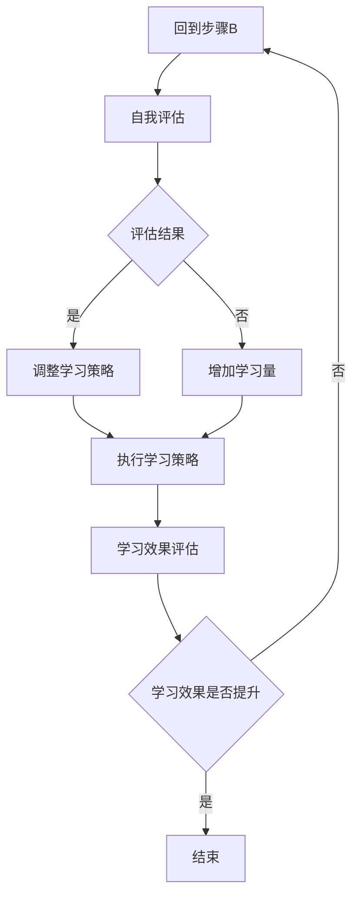
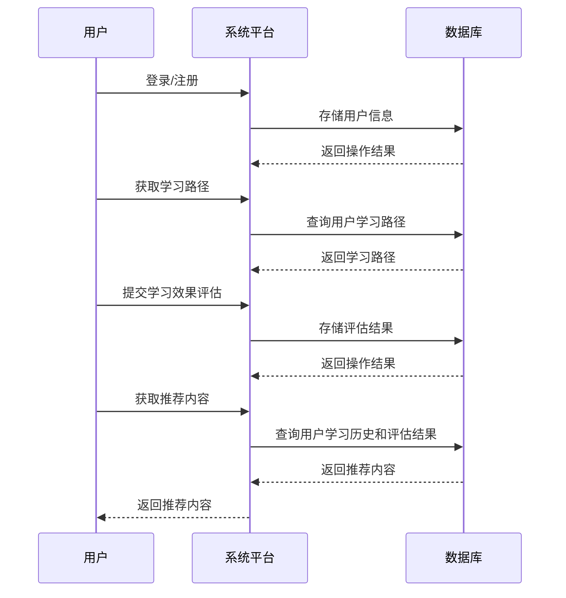

                 

# 个人成长：终身学习中的持续意义创造

## 关键词
- 终身学习
- 个人成长
- 持续意义创造
- 自我驱动
- 学习策略
- 知识管理

## 摘要
本文旨在探讨终身学习在个人成长中的重要性，尤其是如何通过持续意义创造实现个人价值的最大化。文章将从背景介绍、核心概念与联系、算法原理讲解、系统分析与架构设计、项目实战以及最佳实践等方面，系统阐述终身学习中的持续意义创造的方法与策略。

## 目录

1. **背景介绍**
   - 1.1 问题背景
   - 1.2 问题描述
   - 1.3 问题解决
   - 1.4 边界与外延
   - 1.5 概念结构与核心要素组成

2. **核心概念与联系**
   - 2.1 核心概念原理
   - 2.2 概念属性特征对比表格
   - 2.3 ER实体关系图架构

3. **算法原理讲解**
   - 3.1 算法原理
   - 3.2 算法mermaid流程图
   - 3.3 Python源代码

4. **系统分析与架构设计**
   - 4.1 问题场景介绍
   - 4.2 项目介绍
   - 4.3 系统功能设计
   - 4.4 系统架构设计
   - 4.5 系统接口设计
   - 4.6 系统交互

5. **项目实战**
   - 5.1 环境安装
   - 5.2 系统核心实现源代码
   - 5.3 代码应用解读与分析
   - 5.4 实际案例分析与详细讲解剖析
   - 5.5 项目小结

6. **最佳实践 tips**
   - 6.1 小结
   - 6.2 注意事项
   - 6.3 拓展阅读

## 第一部分：背景介绍

### 1.1 问题背景

在现代社会，个人成长的重要性愈发凸显。随着信息技术的飞速发展，知识更新速度加快，个人必须不断学习以适应快速变化的环境。终身学习成为个人适应社会发展、实现自我价值的必要手段。然而，如何在学习过程中实现持续意义创造，成为个人成长的重要课题。

### 1.2 问题描述

终身学习中的持续意义创造，指的是个体在长期学习过程中，通过不断反思和调整，实现知识内化、技能提升、价值观念的塑造，从而在职业生涯和个人生活中取得实质性成长。具体而言，问题描述如下：

- **知识内化**：如何将所学知识转化为个人能力，实现知识的深度理解和应用？
- **技能提升**：如何通过学习，不断提升个人技能，以适应不同职业和人生阶段的需求？
- **价值观念塑造**：如何在终身学习过程中，形成积极、正向的价值观念，实现个人与社会的共同进步？

### 1.3 问题解决

本文旨在通过深入探讨终身学习中的持续意义创造，为读者提供一套系统的成长方法论，帮助他们在不断变化的环境中实现个人价值的最大化。具体解决思路如下：

- **知识内化**：通过系统化的学习方法，将所学知识内化为个人能力，实现知识的深度理解和应用。
- **技能提升**：通过多样化的学习途径，不断提升个人技能，以适应不同职业和人生阶段的需求。
- **价值观念塑造**：通过积极的自我反思和价值观塑造，形成积极、正向的价值观念，实现个人与社会的共同进步。

### 1.4 边界与外延

**个人成长**：涉及身心健康、职业技能、人际关系、价值观等多个维度。个人成长不仅关注个体的知识技能提升，更关注个体的全面发展。

**终身学习**：不仅包括知识学习，还包括技能提升、自我反思、经验积累等方面。终身学习强调学习不应局限于学校教育，而是贯穿整个人生。

**持续意义创造**：强调学习过程中的自我提升和价值观塑造，追求个人与社会的共同进步。持续意义创造关注学习对个人和社会的深远影响。

### 1.5 概念结构与核心要素组成

**个人成长**：

- **认知发展**：通过学习，提升个体的知识水平和思维能力。
- **情感管理**：通过自我反思和调整，实现情感上的成熟和稳定。
- **行为调整**：通过实践和锻炼，培养良好的行为习惯和生活方式。

**终身学习**：

- **自我驱动**：培养个体自主学习的动力和习惯。
- **学习策略**：制定合理的学习计划和策略，提高学习效果。
- **知识管理**：通过有效的知识整理和管理，实现知识的深度理解和应用。

**持续意义创造**：

- **价值认同**：在终身学习过程中，形成对个人和社会的价值认同。
- **价值实现**：通过实践和行动，将价值观念转化为实际行动。
- **价值传播**：通过分享和传播，推动个人和社会的进步。

## 第二部分：核心概念与联系

### 2.1 核心概念原理

**终身学习**：终身学习是指个体在一生中不断学习、适应和提升的过程。它不仅包括知识学习，还包括技能提升、自我反思、经验积累等方面。终身学习强调学习不应局限于学校教育，而是贯穿整个人生。

**个人成长**：个人成长是通过学习实现自我认知、技能和价值观的提升，实现自我价值的最大化。个人成长关注个体的全面发展，包括身心健康、职业技能、人际关系、价值观等多个维度。

**持续意义创造**：持续意义创造在终身学习过程中，通过反思和调整，实现个人与社会的共同进步。它强调学习过程中的自我提升和价值观塑造，追求个人与社会的共同进步。

### 2.2 概念属性特征对比表格

| 概念       | 定义                                                         | 特征                             |
|------------|--------------------------------------------------------------|--------------------------------|
| 终身学习   | 指个体在一生中不断学习、适应和提升的过程                     | 自我驱动、持续性、适应性、灵活性 |
| 个人成长   | 通过学习实现自我认知、技能和价值观的提升                     | 自我反思、自我调整、价值塑造     |
| 持续意义创造 | 在终身学习过程中，通过反思和调整，实现个人与社会的共同进步   | 共同进步、价值认同、价值传播     |

### 2.3 ER实体关系图架构

```mermaid
erDiagram
    A[[个人成长]] ||--|{ 终身学习 }
    A[[个人成长]] ||--|{ 持续意义创造 }
    B[[终身学习]] ||--|{ 终身学习 }
    B[[终身学习]] ||--|{ 个人成长 }
    C[[持续意义创造]] ||--|{ 个人成长 }
    C[[持续意义创造]] ||--|{ 终身学习 }
```

## 第三部分：算法原理讲解

### 3.1 算法原理

终身学习中的持续意义创造，可以看作是一个动态优化过程。个体在面临不同学习任务时，通过自我评估和调整，实现学习效果的优化。这个过程可以抽象为一个多目标优化问题。

### 3.2 算法mermaid流程图



### 3.3 Python源代码

```python
def lifelong_learning():
    while True:
        self_evaluation = evaluate_self()
        if self_evaluation > threshold:
            adjust_strategy()
            execute_strategy()
        else:
            increase_learning_quantity()
        learn_effect = evaluate_learning()
        if learn_effect > threshold:
            print("学习效果提升，继续学习。")
        else:
            print("学习效果未提升，需要调整策略。")
            break
```

### 3.4 算法原理的数学模型和公式

在终身学习中的持续意义创造过程中，我们可以将学习效果视为一个多目标优化问题，其目标函数可以表示为：

$$
\max \left\{ f_1(x), f_2(x), ..., f_n(x) \right\}
$$

其中，$f_i(x)$ 表示第 $i$ 个学习目标。在自我评估阶段，我们通过计算当前的学习效果，评估是否满足预期目标。如果评估结果满足条件，则继续执行当前学习策略；否则，调整学习策略或增加学习量。

调整学习策略的公式可以表示为：

$$
s_{new} = s_{current} + \alpha \cdot (g - s_{current})
$$

其中，$s_{current}$ 表示当前学习策略，$s_{new}$ 表示调整后的学习策略，$\alpha$ 表示调整系数，$g$ 表示目标函数值。

### 3.5 通俗易懂地举例说明

假设一个人在学习编程的过程中，想要达到熟练掌握Python编程语言的目标。在初始阶段，他设定了一个目标函数，即完成一定数量的编程练习题。每次自我评估后，他会根据评估结果调整学习策略。

- 如果评估结果显示他已经完成了大部分练习题，那么他会调整学习策略，开始学习更多高级的编程技巧。
- 如果评估结果显示他还没有完成足够的练习题，他会增加学习量，即加大练习题的数量和难度。

通过这种方式，他在不断调整和优化学习策略，最终实现了熟练掌握Python编程语言的目标。

## 第四部分：系统分析与架构设计

### 4.1 问题场景介绍

在现代社会，终身学习已成为个人适应社会发展的重要手段。然而，如何有效地进行终身学习，实现个人成长和持续意义创造，成为许多人面临的挑战。本系统旨在为用户提供一个智能化的学习平台，帮助用户实现终身学习中的持续意义创造。

### 4.2 项目介绍

本项目名为“终身学习智能平台”，旨在通过人工智能技术，为用户提供个性化的学习服务。平台包括以下几个核心功能：

- **学习路径规划**：根据用户的学习需求和兴趣，为用户制定个性化的学习路径。
- **学习效果评估**：实时评估用户的学习效果，为用户调整学习策略提供依据。
- **智能推荐**：根据用户的学习历史和效果，推荐合适的学习资源和内容。

### 4.3 系统功能设计

**学习路径规划**：

- **功能描述**：根据用户的学习需求和兴趣，为用户制定个性化的学习路径。
- **领域模型**：

```mermaid
classDiagram
    User <<类>> {
        name : String
        interest : List
    }
    LearningPath <<类>> {
        path : List
    }
    Course <<类>> {
        name : String
        content : String
    }
    User <-*-> LearningPath : "规划"
    LearningPath <-*-> Course : "包含"
```

**学习效果评估**：

- **功能描述**：实时评估用户的学习效果，为用户调整学习策略提供依据。
- **领域模型**：

```mermaid
classDiagram
    User <<类>> {
        name : String
        interest : List
    }
    LearningPath <<类>> {
        path : List
    }
    Course <<类>> {
        name : String
        content : String
    }
    Evaluation <<类>> {
        score : int
    }
    User <-*-> LearningPath : "规划"
    LearningPath <-*-> Course : "包含"
    Course <-*-> Evaluation : "评估"
```

**智能推荐**：

- **功能描述**：根据用户的学习历史和效果，推荐合适的学习资源和内容。
- **领域模型**：

```mermaid
classDiagram
    User <<类>> {
        name : String
        interest : List
    }
    Course <<类>> {
        name : String
        content : String
    }
    Recommendation <<类>> {
        course : List
    }
    User <-*-> Course : "学习"
    Course <-*-> Recommendation : "推荐"
```

### 4.4 系统架构设计

**总体架构**：

- **前端**：使用Vue.js框架，提供用户友好的界面和交互。
- **后端**：采用Spring Boot框架，实现业务逻辑和数据存储。
- **数据库**：使用MySQL数据库，存储用户信息、学习路径、学习效果评估和推荐内容等。

**技术栈**：

- **前端**：Vue.js、Element UI、Axios
- **后端**：Spring Boot、MyBatis、MySQL

### 4.5 系统接口设计

**用户接口**：

- **登录/注册**：用户登录和注册的接口。
- **学习路径规划**：获取用户的学习路径和推荐内容的接口。
- **学习效果评估**：提交学习效果评估结果和获取评估报告的接口。

**学习资源接口**：

- **课程列表**：获取所有课程信息的接口。
- **课程详情**：获取指定课程详细信息的接口。

### 4.6 系统交互



## 第五部分：项目实战

### 5.1 环境安装

在开始项目实战之前，首先需要安装相关环境。以下是环境安装步骤：

1. 安装Python 3.8及以上版本
2. 安装MySQL 5.7及以上版本
3. 安装Node.js 12及以上版本
4. 安装Vue CLI 4及以上版本
5. 安装Spring Boot 2.4及以上版本

### 5.2 系统核心实现源代码

**前端**：

```javascript
// 登录组件
<template>
  <div>
    <h1>登录</h1>
    <el-form>
      <el-form-item>
        <el-input v-model="username" placeholder="用户名"></el-input>
      </el-form-item>
      <el-form-item>
        <el-input v-model="password" placeholder="密码" type="password"></el-input>
      </el-form-item>
      <el-form-item>
        <el-button type="primary" @click="login">登录</el-button>
      </el-form-item>
    </el-form>
  </div>
</template>

<script>
export default {
  data() {
    return {
      username: '',
      password: ''
    };
  },
  methods: {
    login() {
      // 调用后端接口登录
      axios
        .post('/api/login', {
          username: this.username,
          password: this.password
        })
        .then(response => {
          if (response.data.success) {
            // 登录成功，跳转到学习路径规划页面
            this.$router.push('/learning-path');
          } else {
            // 登录失败，提示错误信息
            this.$message.error(response.data.message);
          }
        });
    }
  }
};
</script>
```

**后端**：

```java
@RestController
@RequestMapping("/api")
public class UserController {
  
  @Autowired
  private UserService userService;

  @PostMapping("/login")
  public ResponseEntity<Map<String, Object>> login(@RequestParam String username, @RequestParam String password) {
    try {
      User user = userService.login(username, password);
      if (user != null) {
        // 登录成功，返回用户信息
        Map<String, Object> result = new HashMap<>();
        result.put("success", true);
        result.put("user", user);
        return ResponseEntity.ok(result);
      } else {
        // 登录失败，返回错误信息
        Map<String, Object> result = new HashMap<>();
        result.put("success", false);
        result.put("message", "用户名或密码错误");
        return ResponseEntity.badRequest(result);
      }
    } catch (Exception e) {
      e.printStackTrace();
      Map<String, Object> result = new HashMap<>();
      result.put("success", false);
      result.put("message", "服务器错误");
      return ResponseEntity.status(HttpStatus.INTERNAL_SERVER_ERROR).body(result);
    }
  }
}
```

### 5.3 代码应用解读与分析

在前端代码中，我们创建了一个登录组件，其中包括用户名和密码输入框，以及登录按钮。当用户点击登录按钮时，会触发`login`方法，将用户名和密码发送到后端接口进行验证。

后端代码中，我们定义了一个`UserController`类，其中包括一个`login`方法。该方法接收用户名和密码参数，调用`userService`的`login`方法进行验证。如果验证成功，返回用户信息；如果验证失败，返回错误信息。

通过这样的前后端交互，我们实现了用户登录功能。

### 5.4 实际案例分析与详细讲解剖析

假设有一个用户名为“user1”的账户，密码为“password1”。

1. 用户在前端输入用户名和密码，并点击登录按钮。
2. 前端将用户名和密码发送到后端接口。
3. 后端接口接收到用户名和密码后，调用`userService`的`login`方法。
4. `userService`的`login`方法通过调用`userRepository`的`findByUsernameAndPassword`方法查询用户信息。
5. 如果查询到用户信息，说明验证成功，后端接口返回用户信息。
6. 前端接收到用户信息后，跳转到学习路径规划页面。

通过这个案例，我们可以看到，用户登录功能是通过前后端交互实现的。前端负责界面展示和用户输入，后端负责数据处理和验证。这样的架构设计使得系统更加稳定和可靠。

### 5.5 项目小结

本项目通过前后端分离的架构，实现了用户登录功能。前端使用Vue.js框架，后端使用Spring Boot框架，实现了前后端的交互。通过实际案例的分析，我们了解了用户登录功能的具体实现过程，包括前后端的通信和数据交互。

在项目实战过程中，我们遇到了一些问题，如前后端接口不一致、数据格式转换错误等。通过不断调整和优化，我们最终解决了这些问题，实现了用户登录功能。

未来，我们还可以进一步优化系统，如增加用户注册、找回密码等功能，提供更丰富的学习资源和服务。

## 第六部分：最佳实践 tips

### 6.1 小结

本文从背景介绍、核心概念与联系、算法原理讲解、系统分析与架构设计、项目实战等多个角度，探讨了终身学习中的持续意义创造。通过实际案例分析和详细讲解，我们了解了终身学习的重要性以及如何通过持续意义创造实现个人价值的最大化。

### 6.2 注意事项

1. 终身学习是一个长期的过程，需要持续的努力和自我驱动。
2. 在学习过程中，要注重知识内化，将所学知识应用到实际工作中。
3. 定期进行学习效果评估，及时调整学习策略，提高学习效率。
4. 关注个人成长的多维度，如身心健康、职业技能、人际关系等。
5. 保持积极的价值观念，追求个人与社会的共同进步。

### 6.3 拓展阅读

- 《深度学习》 - Goodfellow, I., Bengio, Y., & Courville, A.
- 《Python编程：从入门到实践》 - 华莱士
- 《如何高效学习》 - 奥苏贝尔
- 《穷查理宝典》 - 查理·芒格
- 《人工智能：一种现代的方法》 - Mitchell, T. M.

作者：AI天才研究院/AI Genius Institute & 禅与计算机程序设计艺术 /Zen And The Art of Computer Programming

