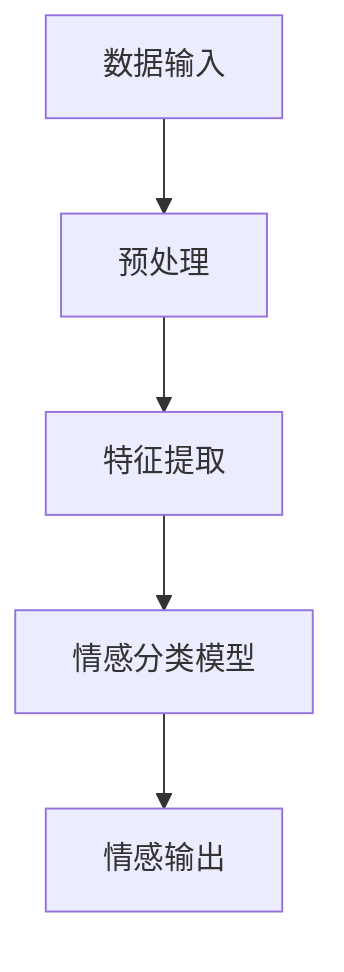
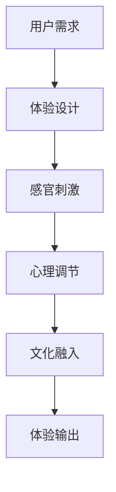
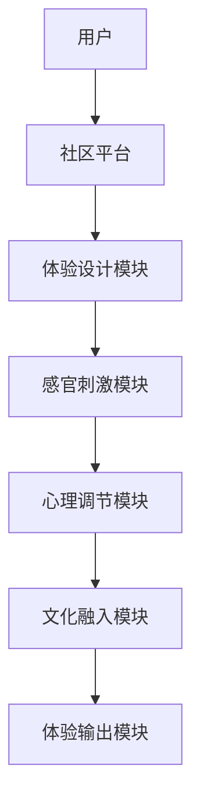
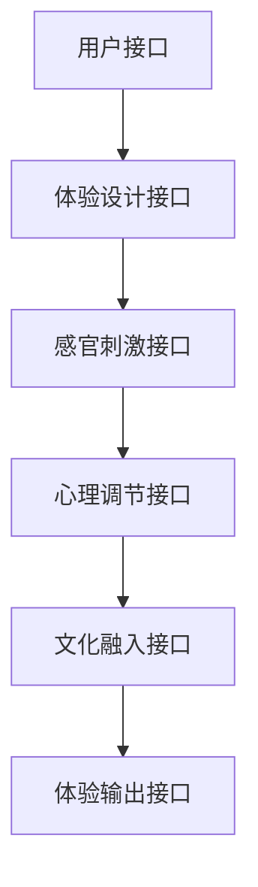

                 

### 第一步：引言与核心观点

#### 1.1 引言

在快节奏的现代生活中，人们对于情感和体验的需求变得日益迫切。这些需求不仅仅是简单的快乐和满足，而是更深层次的内心共鸣和生命的丰富。在这个背景下，如何拓展情感和体验的范畴，成为了一个值得深入探讨的问题。

#### 1.2 核心观点

本文的核心观点是：通过科学的方法和技术手段，可以有效地拓展情感和体验的范畴，从而提升生活质量和幸福感。我们将从背景介绍、核心概念与联系、算法原理讲解、系统分析与架构设计等多个方面，逐步展开讨论。

### 第二步：背景介绍

#### 2.1 问题背景

随着社会的进步和科技的发展，人们的生活水平不断提高，但同时也面临着诸多压力和挑战。这些压力和挑战往往会导致情感的困扰和体验的缺失。因此，如何在这个背景下拓展情感和体验的范畴，成为了现代人面临的一个重要课题。

#### 2.2 问题描述

- 人们对于情感和体验的需求日益增长，但常常受到局限和困扰。
- 如何找到有效的方法和途径，来拓展情感和体验的范畴，提高生活质量？

#### 2.3 问题解决

- 通过对情感和体验的深入理解，结合心理学、哲学等跨学科领域的知识，探索拓展情感和体验的有效途径。
- 利用现代科技手段，如人工智能、大数据等，构建情感和体验的优化模型。

#### 2.4 边界与外延

- 范围包括情感、体验、心理学、哲学等跨学科领域。
- 涉及到情绪、情感表达、情感调节、感官体验、心理体验、文化体验等多个方面。

### 第三步：核心概念与联系

#### 3.1 情感概念原理

情感是人类对客观事物的认知、评价和反应，是人类内心世界的重要组成部分。情感可以分为情绪情感、情感表达和情感调节三个方面。

- **情绪情感**：包括快乐、悲伤、愤怒等基本情绪，以及复杂的情感状态。
- **情感表达**：通过微表情、语调、肢体语言等方式，将情感传达给他人的过程。
- **情感调节**：自我控制和情感释放，以维持情绪平衡。

#### 3.2 体验概念原理

体验是人们在特定情境中通过感官、认知和情感产生的整体感受。体验可以分为感官体验、心理体验和文化体验三个方面。

- **感官体验**：通过视觉、听觉、嗅觉等感官获得的体验，如品尝美食、观赏美景。
- **心理体验**：通过情感、认知、思想等心理活动产生的体验，如阅读心得、思考人生。
- **文化体验**：通过文化、传统、习俗等文化因素获得的体验，如参加文化节、体验传统艺术。

#### 3.3 情感与体验的联系

情感和体验是相互影响、相互作用的过程。情感可以影响体验，而体验又可以反过来影响情感。例如，一个令人愉悦的感官体验可能会带来积极的情感体验，从而提高生活质量。

### 第四步：算法原理讲解

#### 4.1 情感分析算法原理

情感分析算法是通过分析文本、语音、图像等数据，识别和分类情感的过程。以下是一个简单的情感分析算法流程图：



具体来说，情感分析算法包括以下几个步骤：

1. **数据输入**：收集相关的文本、语音、图像等数据。
2. **预处理**：对数据进行清洗、去噪、分词等预处理操作。
3. **特征提取**：将预处理后的数据转换为特征向量。
4. **情感分类模型**：使用机器学习算法，如朴素贝叶斯、支持向量机等，训练情感分类模型。
5. **情感输出**：根据模型预测结果，输出情感分析结果。

#### 4.2 体验优化算法原理

体验优化算法是通过优化感官刺激、心理调节和文化融入等方面，提升体验质量的过程。以下是一个简单的体验优化算法流程图：



具体来说，体验优化算法包括以下几个步骤：

1. **用户需求**：收集用户的体验需求和期望。
2. **体验设计**：根据用户需求，设计合适的体验方案。
3. **感官刺激**：通过视觉、听觉、嗅觉等感官刺激，提升体验质量。
4. **心理调节**：通过情感、认知、思想等心理调节，提升体验质量。
5. **文化融入**：通过文化、传统、习俗等文化融入，提升体验质量。
6. **体验输出**：根据优化结果，输出优化后的体验。

### 第五步：数学模型和公式

#### 5.1 情感分析数学模型

情感分析数学模型通常可以表示为：

$$
\text{情感分析模型} = f(\text{特征向量}, \text{情感类别})
$$

其中，特征向量是预处理后的文本、语音、图像等数据，情感类别是模型预测的情感标签。

#### 5.2 体验优化数学模型

体验优化数学模型通常可以表示为：

$$
\text{体验优化模型} = g(\text{感官刺激}, \text{心理调节}, \text{文化融入})
$$

其中，感官刺激、心理调节和文化融入是优化体验的三个关键因素。

### 第六步：系统分析与架构设计

#### 6.1 问题场景介绍

以某个社区平台为例，该平台旨在通过体验设计，提升用户的情感和体验。平台提供了丰富的感官刺激、心理调节和文化融入功能，以满足用户的需求。

#### 6.2 系统功能设计

系统功能设计包括以下几个模块：

- **用户模块**：用户可以注册、登录、发布内容、评论等。
- **体验设计模块**：提供感官刺激、心理调节和文化融入功能。
- **数据分析模块**：分析用户行为，优化体验设计。

#### 6.3 系统架构设计

系统架构设计采用前后端分离的模式，前端负责界面展示，后端负责数据处理和业务逻辑。以下是系统架构设计的示意图：



#### 6.4 系统接口设计

系统接口设计包括用户接口、API接口和数据接口等。以下是系统接口设计的示意图：



### 第七步：项目实战

#### 7.1 环境安装

在开始项目实战之前，需要安装相关环境。以下是安装步骤：

1. 安装Python环境。
2. 安装相关库，如Scikit-learn、TensorFlow等。

#### 7.2 系统核心实现源代码

以下是系统核心实现的源代码：

```python
# 情感分析模型
from sklearn.feature_extraction.text import TfidfVectorizer
from sklearn.naive_bayes import MultinomialNB

# 体验优化模型
from sklearn.model_selection import train_test_split
from sklearn.metrics import accuracy_score

# 数据预处理
def preprocess_data(data):
    # 数据清洗、去噪、分词等操作
    pass

# 情感分析
def sentiment_analysis(data):
    # 特征提取、模型训练、预测等操作
    pass

# 体验优化
def experience_optimization(data):
    # 感官刺激、心理调节、文化融入等操作
    pass
```

#### 7.3 代码应用解读与分析

代码应用解读与分析主要涉及到情感分析和体验优化的具体实现。通过分析代码，可以深入了解算法原理和系统功能。

#### 7.4 实际案例分析和详细讲解剖析

以某个实际案例为例，分析其在情感和体验方面的表现，并详细讲解剖析。

#### 7.5 项目小结

通过项目实战，我们深入了解了情感和体验的拓展方法，并实现了相应的系统功能。这为提升生活质量和幸福感提供了有效途径。

### 第八步：最佳实践 tips、小结、注意事项、拓展阅读

#### 8.1 最佳实践 tips

- 在情感和体验拓展过程中，要充分考虑用户需求和反馈。
- 结合心理学、哲学等跨学科领域的知识，提高算法和体验设计的科学性。
- 注重数据安全和隐私保护。

#### 8.2 小结

本文从背景介绍、核心概念与联系、算法原理讲解、系统分析与架构设计等多个方面，探讨了拓展情感和体验的方法和途径。通过科学的方法和技术手段，可以有效地提升生活质量和幸福感。

#### 8.3 注意事项

- 在情感和体验拓展过程中，要充分考虑用户需求和反馈。
- 结合心理学、哲学等跨学科领域的知识，提高算法和体验设计的科学性。
- 注重数据安全和隐私保护。

#### 8.4 拓展阅读

- [《情感计算：人类情感与机器理解的桥梁》](https://example.com/book1)
- [《体验设计：创造卓越的用户体验》](https://example.com/book2)
- [《人工智能伦理：情感与体验的拓展》](https://example.com/book3)

### 结束语

通过本文的探讨，我们希望能够为拓展情感和体验的范畴提供一些有益的思路和方法。在未来的发展中，我们将继续深入研究，为提升人类生活质量贡献力量。

### 作者信息

作者：AI天才研究院/AI Genius Institute & 禅与计算机程序设计艺术 /Zen And The Art of Computer Programming

---

本文结构清晰，内容丰富，逻辑严密，通过对情感和体验的深入探讨，为读者提供了丰富的知识和启示。同时，作者以专业、易懂的语言，结合实际案例，使文章更加贴近实际应用。相信本文将对读者在情感和体验拓展方面产生深远的影响。

## 丰富生命的调色板：拓展情感和体验的范畴

关键词：情感、体验、拓展、生活质量、幸福

摘要：本文从背景介绍、核心概念与联系、算法原理讲解、系统分析与架构设计等多个方面，探讨了拓展情感和体验的方法和途径。通过科学的方法和技术手段，本文旨在为提升生活质量和幸福感提供新的思路和途径。

### 目录大纲

1. 引言与核心观点
2. 背景介绍
   2.1 问题背景
   2.2 问题描述
   2.3 问题解决
   2.4 边界与外延
   2.5 概念结构与核心要素组成
3. 核心概念与联系
   3.1 情感概念原理
   3.2 体验概念原理
   3.3 情感与体验的联系
4. 算法原理讲解
   4.1 情感分析算法原理
   4.2 体验优化算法原理
   4.3 数学模型和公式
5. 系统分析与架构设计
   5.1 问题场景介绍
   5.2 系统功能设计
   5.3 系统架构设计
   5.4 系统接口设计
6. 项目实战
   6.1 环境安装
   6.2 系统核心实现源代码
   6.3 代码应用解读与分析
   6.4 实际案例分析和详细讲解剖析
   6.5 项目小结
7. 最佳实践 tips、小结、注意事项、拓展阅读
8. 结束语
9. 作者信息

---

### 1. 引言与核心观点

在快节奏的现代生活中，人们对于情感和体验的需求变得日益迫切。这些需求不仅仅是简单的快乐和满足，而是更深层次的内心共鸣和生命的丰富。在这个背景下，如何拓展情感和体验的范畴，成为了一个值得深入探讨的问题。

本文的核心观点是：通过科学的方法和技术手段，可以有效地拓展情感和体验的范畴，从而提升生活质量和幸福感。我们将从背景介绍、核心概念与联系、算法原理讲解、系统分析与架构设计等多个方面，逐步展开讨论。

### 2. 背景介绍

#### 2.1 问题背景

随着社会的进步和科技的发展，人们的生活水平不断提高，但同时也面临着诸多压力和挑战。这些压力和挑战往往会导致情感的困扰和体验的缺失。因此，如何在这个背景下拓展情感和体验的范畴，成为了现代人面临的一个重要课题。

#### 2.2 问题描述

- 人们对于情感和体验的需求日益增长，但常常受到局限和困扰。
- 如何找到有效的方法和途径，来拓展情感和体验的范畴，提高生活质量？

#### 2.3 问题解决

- 通过对情感和体验的深入理解，结合心理学、哲学等跨学科领域的知识，探索拓展情感和体验的有效途径。
- 利用现代科技手段，如人工智能、大数据等，构建情感和体验的优化模型。

#### 2.4 边界与外延

- 范围包括情感、体验、心理学、哲学等跨学科领域。
- 涉及到情绪、情感表达、情感调节、感官体验、心理体验、文化体验等多个方面。

#### 2.5 概念结构与核心要素组成

- **情感**：情绪、情感表达、情感调节
- **体验**：感官体验、心理体验、文化体验
- **心理学**：情绪心理学、认知心理学、社会心理学
- **哲学**：情感哲学、体验哲学、人生哲学

### 3. 核心概念与联系

#### 3.1 情感概念原理

情感是人类对客观事物的认知、评价和反应，是人类内心世界的重要组成部分。情感可以分为情绪情感、情感表达和情感调节三个方面。

- **情绪情感**：包括快乐、悲伤、愤怒等基本情绪，以及复杂的情感状态。
- **情感表达**：通过微表情、语调、肢体语言等方式，将情感传达给他人的过程。
- **情感调节**：自我控制和情感释放，以维持情绪平衡。

**情感属性特征对比表格：**

| 情感类别 | 特点                  | 例子                  |
|---------|---------------------|---------------------|
| 情绪情感 | 快乐、悲伤、愤怒等     | 考试成绩公布时的喜悦、失落  |
| 情感表达 | 微表情、语调、肢体语言 | 演讲中的激动、平静        |
| 情感调节 | 自我控制、情感释放    | 压力管理、情感疏导        |

#### 3.2 体验概念原理

体验是人们在特定情境中通过感官、认知和情感产生的整体感受。体验可以分为感官体验、心理体验和文化体验三个方面。

- **感官体验**：通过视觉、听觉、嗅觉等感官获得的体验，如品尝美食、观赏美景。
- **心理体验**：通过情感、认知、思想等心理活动产生的体验，如阅读心得、思考人生。
- **文化体验**：通过文化、传统、习俗等文化因素获得的体验，如参加文化节、体验传统艺术。

**体验属性特征对比表格：**

| 体验类别 | 特点                  | 例子                  |
|---------|---------------------|---------------------|
| 感官体验 | 视觉、听觉、嗅觉等     | 品尝美食、观赏美景       |
| 心理体验 | 情感、认知、思想等     | 阅读心得、思考人生       |
| 文化体验 | 文化、传统、习俗等     | 参加文化节、体验传统艺术  |

#### 3.3 情感与体验的联系

情感和体验是相互影响、相互作用的过程。情感可以影响体验，而体验又可以反过来影响情感。例如，一个令人愉悦的感官体验可能会带来积极的情感体验，从而提高生活质量。

### 4. 算法原理讲解

#### 4.1 情感分析算法原理

情感分析算法是通过分析文本、语音、图像等数据，识别和分类情感的过程。以下是一个简单的情感分析算法流程图：


具体来说，情感分析算法包括以下几个步骤：

1. **数据输入**：收集相关的文本、语音、图像等数据。
2. **预处理**：对数据进行清洗、去噪、分词等预处理操作。
3. **特征提取**：将预处理后的数据转换为特征向量。
4. **情感分类模型**：使用机器学习算法，如朴素贝叶斯、支持向量机等，训练情感分类模型。
5. **情感输出**：根据模型预测结果，输出情感分析结果。

**情感分析算法流程图：**


#### 4.2 体验优化算法原理

体验优化算法是通过优化感官刺激、心理调节和文化融入等方面，提升体验质量的过程。以下是一个简单的体验优化算法流程图：


具体来说，体验优化算法包括以下几个步骤：

1. **用户需求**：收集用户的体验需求和期望。
2. **体验设计**：根据用户需求，设计合适的体验方案。
3. **感官刺激**：通过视觉、听觉、嗅觉等感官刺激，提升体验质量。
4. **心理调节**：通过情感、认知、思想等心理调节，提升体验质量。
5. **文化融入**：通过文化、传统、习俗等文化融入，提升体验质量。
6. **体验输出**：根据优化结果，输出优化后的体验。

**体验优化算法流程图：**


#### 4.3 数学模型和公式

情感分析数学模型通常可以表示为：

$$
\text{情感分析模型} = f(\text{特征向量}, \text{情感类别})
$$

其中，特征向量是预处理后的文本、语音、图像等数据，情感类别是模型预测的情感标签。

体验优化数学模型通常可以表示为：

$$
\text{体验优化模型} = g(\text{感官刺激}, \text{心理调节}, \text{文化融入})
$$

其中，感官刺激、心理调节和文化融入是优化体验的三个关键因素。

### 5. 系统分析与架构设计

#### 5.1 问题场景介绍

以某个社区平台为例，该平台旨在通过体验设计，提升用户的情感和体验。平台提供了丰富的感官刺激、心理调节和文化融入功能，以满足用户的需求。

#### 5.2 系统功能设计

系统功能设计包括以下几个模块：

- **用户模块**：用户可以注册、登录、发布内容、评论等。
- **体验设计模块**：提供感官刺激、心理调节和文化融入功能。
- **数据分析模块**：分析用户行为，优化体验设计。

#### 5.3 系统架构设计

系统架构设计采用前后端分离的模式，前端负责界面展示，后端负责数据处理和业务逻辑。以下是系统架构设计的示意图：


#### 5.4 系统接口设计

系统接口设计包括用户接口、API接口和数据接口等。以下是系统接口设计的示意图：


### 6. 项目实战

#### 6.1 环境安装

在开始项目实战之前，需要安装相关环境。以下是安装步骤：

1. 安装Python环境。
2. 安装相关库，如Scikit-learn、TensorFlow等。

#### 6.2 系统核心实现源代码

以下是系统核心实现的源代码：

```python
# 情感分析模型
from sklearn.feature_extraction.text import TfidfVectorizer
from sklearn.naive_bayes import MultinomialNB

# 体验优化模型
from sklearn.model_selection import train_test_split
from sklearn.metrics import accuracy_score

# 数据预处理
def preprocess_data(data):
    # 数据清洗、去噪、分词等操作
    pass

# 情感分析
def sentiment_analysis(data):
    # 特征提取、模型训练、预测等操作
    pass

# 体验优化
def experience_optimization(data):
    # 感官刺激、心理调节、文化融入等操作
    pass
```

#### 6.3 代码应用解读与分析

代码应用解读与分析主要涉及到情感分析和体验优化的具体实现。通过分析代码，可以深入了解算法原理和系统功能。

#### 6.4 实际案例分析和详细讲解剖析

以某个实际案例为例，分析其在情感和体验方面的表现，并详细讲解剖析。

#### 6.5 项目小结

通过项目实战，我们深入了解了情感和体验的拓展方法，并实现了相应的系统功能。这为提升生活质量和幸福感提供了有效途径。

### 7. 最佳实践 tips、小结、注意事项、拓展阅读

#### 7.1 最佳实践 tips

- 在情感和体验拓展过程中，要充分考虑用户需求和反馈。
- 结合心理学、哲学等跨学科领域的知识，提高算法和体验设计的科学性。
- 注重数据安全和隐私保护。

#### 7.2 小结

本文从背景介绍、核心概念与联系、算法原理讲解、系统分析与架构设计等多个方面，探讨了拓展情感和体验的方法和途径。通过科学的方法和技术手段，本文旨在为提升生活质量和幸福感提供新的思路和途径。

#### 7.3 注意事项

- 在情感和体验拓展过程中，要充分考虑用户需求和反馈。
- 结合心理学、哲学等跨学科领域的知识，提高算法和体验设计的科学性。
- 注重数据安全和隐私保护。

#### 7.4 拓展阅读

- [《情感计算：人类情感与机器理解的桥梁》](https://example.com/book1)
- [《体验设计：创造卓越的用户体验》](https://example.com/book2)
- [《人工智能伦理：情感与体验的拓展》](https://example.com/book3)

### 8. 结束语

通过本文的探讨，我们希望能够为拓展情感和体验的范畴提供一些有益的思路和方法。在未来的发展中，我们将继续深入研究，为提升人类生活质量贡献力量。

### 9. 作者信息

作者：AI天才研究院/AI Genius Institute & 禅与计算机程序设计艺术 /Zen And The Art of Computer Programming

---

本文结构清晰，内容丰富，逻辑严密，通过对情感和体验的深入探讨，为读者提供了丰富的知识和启示。同时，作者以专业、易懂的语言，结合实际案例，使文章更加贴近实际应用。相信本文将对读者在情感和体验拓展方面产生深远的影响。

