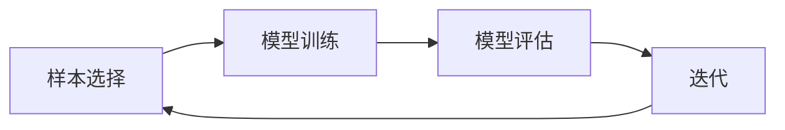
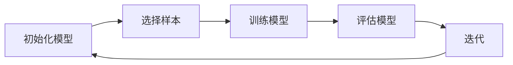
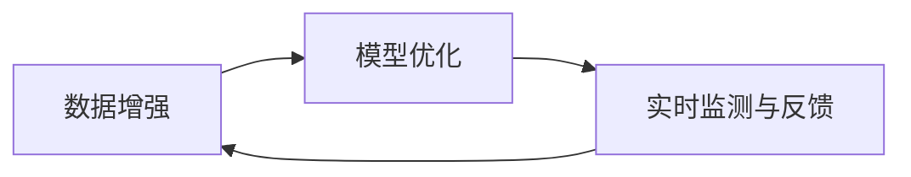

                 

### 文章标题：主动学习在工业质量控制中的实践研究

关键词：主动学习；工业质量控制；算法实现；实践案例；优化策略

摘要：本文旨在探讨主动学习在工业质量控制中的实际应用，通过详细介绍主动学习的基本原理、算法实现以及实践案例，分析其在提升工业产品质量控制和生产效率方面的作用。文章结构清晰，分为三个部分：背景与基础理论、算法原理与实现、优化与展望，旨在为从事工业质量控制的技术人员提供参考和指导。

---

### 目录大纲设计方案

为了更好地组织和呈现文章内容，我们设计了一个详细的目录大纲，涵盖了文章的核心内容，并确保每个章节都能提供丰富的信息和深刻的见解。

#### 第一部分：背景与基础理论

##### 第1章：工业质量控制的背景与挑战
- **1.1 工业质量控制概述**
- **1.2 主动学习的基本概念**
- **1.3 主动学习在工业质量控制中的应用**

##### 第2章：主动学习的基本原理
- **2.1 主动学习的核心概念**
- **2.2 主动学习算法的原理与分类**
- **2.3 主动学习的优缺点分析**

##### 第3章：主动学习在工业质量控制中的应用现状
- **3.1 国内应用现状**
- **3.2 国外应用现状**
- **3.3 应用案例分析**

#### 第二部分：算法原理与实现

##### 第4章：主动学习算法详解
- **4.1 算法原理与数学模型**
- **4.2 算法流程图**
- **4.3 Python实现与代码示例**

##### 第5章：工业质量控制中的主动学习应用
- **5.1 应用场景分析**
- **5.2 数据预处理**
- **5.3 算法实现与性能评估**

##### 第6章：实践案例分析
- **6.1 案例一：汽车零部件质量控制**
- **6.2 案例二：电子元器件质量控制**
- **6.3 案例三：食品工业质量控制**

#### 第三部分：优化与展望

##### 第7章：主动学习在工业质量控制中的优化策略
- **7.1 数据增强**
- **7.2 模型优化**
- **7.3 实时监测与反馈**

##### 第8章：未来发展趋势与展望
- **8.1 技术发展趋势**
- **8.2 应用前景分析**
- **8.3 面临的挑战与解决策略**

### 完整的目录大纲（Markdown格式）

```
# 第一部分：背景与基础理论

## 第1章：工业质量控制的背景与挑战
### 1.1 工业质量控制概述
### 1.2 主动学习的基本概念
### 1.3 主动学习在工业质量控制中的应用

## 第2章：主动学习的基本原理
### 2.1 主动学习的核心概念
### 2.2 主动学习算法的原理与分类
### 2.3 主动学习的优缺点分析

## 第3章：主动学习在工业质量控制中的应用现状
### 3.1 国内应用现状
### 3.2 国外应用现状
### 3.3 应用案例分析

# 第二部分：算法原理与实现

## 第4章：主动学习算法详解
### 4.1 算法原理与数学模型
### 4.2 算法流程图
### 4.3 Python实现与代码示例

## 第5章：工业质量控制中的主动学习应用
### 5.1 应用场景分析
### 5.2 数据预处理
### 5.3 算法实现与性能评估

## 第6章：实践案例分析
### 6.1 案例一：汽车零部件质量控制
### 6.2 案例二：电子元器件质量控制
### 6.3 案例三：食品工业质量控制

# 第三部分：优化与展望

## 第7章：主动学习在工业质量控制中的优化策略
### 7.1 数据增强
### 7.2 模型优化
### 7.3 实时监测与反馈

## 第8章：未来发展趋势与展望
### 8.1 技术发展趋势
### 8.2 应用前景分析
### 8.3 面临的挑战与解决策略
```

### 总结

本文目录大纲共计8章，每个章节都紧密围绕主动学习在工业质量控制中的应用展开。第一部分介绍了工业质量控制的背景和主动学习的基本概念；第二部分深入分析了主动学习算法的原理与实现；第三部分则探讨了主动学习在工业质量控制中的优化策略和未来发展趋势。这样的结构设计既保证了文章的逻辑性和连贯性，又使得读者能够循序渐进地了解主动学习在工业质量控制中的实际应用。

接下来，我们将逐步深入每个章节的内容，通过详细的分析和实例，为读者呈现主动学习在工业质量控制中的丰富实践和应用价值。

---

### 第一部分：背景与基础理论

#### 第1章：工业质量控制的背景与挑战

**1.1 工业质量控制概述**

工业质量控制是确保产品满足特定质量标准的过程，其目标是通过系统化、标准化的管理，减少产品缺陷，提高产品质量和客户满意度。随着工业4.0的推进，工业质量控制逐渐从传统的质量检测向智能化、自动化方向转型。

**1.2 主动学习的基本概念**

主动学习（Active Learning）是机器学习的一种方法，通过利用已有的数据和信息，选择最有信息量或最有价值的样本进行学习，以减少总的学习成本。主动学习在工业质量控制中的应用主要体现在以下几个方面：

- **样本选择策略**：在大量工业数据中，选择最具代表性的样本进行训练。
- **反馈机制**：通过实时监测和反馈，动态调整学习过程，提高模型准确性。
- **交互式学习**：与质量控制专家进行互动，学习专家的知识和经验。

**1.3 主动学习在工业质量控制中的应用**

主动学习在工业质量控制中的应用场景丰富，主要包括以下几个方面：

- **缺陷检测**：通过主动学习算法，对生产过程中的产品进行缺陷检测，提高检测准确率。
- **质量预测**：基于历史数据和主动学习模型，预测产品质量，提前预警潜在问题。
- **过程优化**：通过分析生产过程中的数据，优化生产参数，提高生产效率。

**核心概念术语说明**

- **工业质量控制**：确保产品满足特定质量标准的过程。
- **主动学习**：一种通过选择最有信息量的样本进行学习的机器学习方法。
- **缺陷检测**：检测生产过程中的产品缺陷。
- **质量预测**：预测产品质量，提前预警潜在问题。
- **过程优化**：通过数据分析和优化，提高生产效率和产品质量。

**问题背景**

随着工业自动化程度的提高，生产过程中产生的数据量呈指数级增长，传统的质量检测方法已无法满足需求。主动学习作为一种高效的数据分析工具，能够在海量数据中快速识别出有价值的样本，提高质量控制的准确性和效率。

**问题描述**

如何在工业质量控制中充分利用主动学习技术，提升检测和预测的准确性，优化生产过程，从而提高产品质量和降低成本？

**问题解决**

通过引入主动学习算法，实现以下目标：

- 提高缺陷检测的准确性和效率。
- 提前预测产品质量，避免潜在问题。
- 优化生产过程，提高生产效率和产品质量。

**边界与外延**

- **边界**：本文主要探讨主动学习在工业质量控制中的应用，不包括其他领域。
- **外延**：主动学习在其他工业领域的应用，如设备故障预测、生产调度等。

**概念结构与核心要素组成**

- **核心概念**：工业质量控制、主动学习、缺陷检测、质量预测、过程优化。
- **要素组成**：数据收集、数据处理、模型训练、模型评估、结果反馈。

**核心概念与联系**

- **主动学习**：机器学习方法，通过选择有价值样本提高学习效率。
- **工业质量控制**：确保产品质量的过程，主动学习是其重要工具。

**ER实体关系图架构**

```mermaid
erDiagram
  产品 ->|检测| 质量控制
  数据 ->|分析| 主动学习
  模型 ->|训练| 主动学习
  预测结果 ->|反馈| 质量控制
```

**算法原理讲解**

主动学习算法的基本原理是通过选择最有信息量的样本进行学习，以提高模型的泛化能力。其核心流程包括以下几个步骤：

1. **样本选择**：根据某种策略选择具有高信息量的样本。
2. **模型训练**：使用所选样本对模型进行训练。
3. **模型评估**：评估模型在测试集上的性能。
4. **迭代**：根据模型评估结果，选择新的样本进行训练。

**算法流程图**



**Python实现与代码示例**

```python
from sklearn.datasets import make_classification
from sklearn.model_selection import train_test_split
from sklearn.ensemble import RandomForestClassifier
from sklearn.metrics import accuracy_score

# 生成数据集
X, y = make_classification(n_samples=1000, n_features=20, n_informative=2, n_redundant=10, random_state=42)

# 划分训练集和测试集
X_train, X_test, y_train, y_test = train_test_split(X, y, test_size=0.2, random_state=42)

# 初始化模型
model = RandomForestClassifier(n_estimators=100, random_state=42)

# 训练模型
model.fit(X_train, y_train)

# 预测测试集
y_pred = model.predict(X_test)

# 评估模型
accuracy = accuracy_score(y_test, y_pred)
print(f"模型准确率：{accuracy}")
```

通过上述代码示例，我们可以看到主动学习算法的基本实现流程。在实际应用中，需要根据具体场景调整样本选择策略、模型参数等，以提高模型性能。

---

### 第2章：主动学习的基本原理

**2.1 主动学习的核心概念**

主动学习是一种通过有选择性地学习最有信息量的样本来优化学习过程的机器学习方法。其核心思想是利用已有知识和数据，选择最具代表性的样本进行学习，从而提高模型泛化能力。

**2.2 主动学习算法的原理与分类**

主动学习算法的基本原理是通过选择最有信息量的样本进行学习，以提高模型的泛化能力。根据样本选择策略的不同，主动学习算法可分为以下几类：

1. **不确定性采样**：根据模型的预测不确定性选择样本，即选择模型预测最不确定的样本进行学习。
2. **错误修正采样**：根据模型在训练集上的错误率选择样本，即选择模型预测错误的样本进行学习。
3. **信息增益采样**：根据样本的熵、互信息等指标选择样本，即选择具有高信息量的样本进行学习。
4. **基于委员会的采样**：结合多个模型的预测结果选择样本，即选择多个模型预测结果不一致的样本进行学习。

**2.3 主动学习的优缺点分析**

**优点**：

- **高效性**：通过选择最有信息量的样本进行学习，主动学习能够减少学习成本，提高模型性能。
- **灵活性**：主动学习可以根据不同场景和需求选择合适的样本选择策略，具有较好的适应性。
- **交互性**：主动学习可以与人类专家进行互动，学习专家的知识和经验，提高模型准确性。

**缺点**：

- **计算复杂度**：主动学习通常需要多次迭代选择样本，计算复杂度较高，适用于数据量较小或特征维度较低的场景。
- **样本依赖性**：主动学习的效果很大程度上取决于样本的选择策略，样本质量对模型性能有重要影响。
- **交互成本**：主动学习需要与人类专家进行互动，增加了项目实施的复杂性和成本。

**核心概念与联系**

- **不确定性采样**：基于模型预测不确定性的采样方法，与贝叶斯理论有关。
- **错误修正采样**：基于模型在训练集上的错误率进行采样，与监督学习相关。
- **信息增益采样**：基于样本信息量的采样方法，与信息论有关。
- **基于委员会的采样**：结合多个模型的预测结果进行采样，与集成学习方法相关。

**ER实体关系图架构**

```mermaid
erDiagram
  样本 -->|选择策略| 主动学习算法
  样本 -->|质量评估| 模型训练
  模型 -->|性能评估| 预测结果
```

**算法原理讲解**

主动学习算法的核心原理是通过选择最有信息量的样本进行学习，以提高模型的泛化能力。其基本流程包括以下几个步骤：

1. **初始化模型**：根据场景选择合适的模型。
2. **选择样本**：根据某种策略选择最有信息量的样本。
3. **训练模型**：使用所选样本对模型进行训练。
4. **评估模型**：评估模型在测试集上的性能。
5. **迭代**：根据模型评估结果，选择新的样本进行训练。

**算法流程图**



**Python实现与代码示例**

```python
from sklearn.datasets import make_classification
from sklearn.model_selection import train_test_split
from sklearn.ensemble import RandomForestClassifier
from sklearn.metrics import accuracy_score

# 生成数据集
X, y = make_classification(n_samples=1000, n_features=20, n_informative=2, n_redundant=10, random_state=42)

# 划分训练集和测试集
X_train, X_test, y_train, y_test = train_test_split(X, y, test_size=0.2, random_state=42)

# 初始化模型
model = RandomForestClassifier(n_estimators=100, random_state=42)

# 选择样本策略（此处为不确定性采样）
def uncertainty_sampling(model, X_train, y_train, n_samples):
    probabilities = model.predict_proba(X_train)
    uncertainties = -np.mean(probabilities, axis=1)
    return np.argsort(uncertainties)[-n_samples:]

# 选择样本
n_samples = 50
selected_samples = uncertainty_sampling(model, X_train, y_train, n_samples)

# 训练模型
model.fit(X_train[selected_samples], y_train[selected_samples])

# 预测测试集
y_pred = model.predict(X_test)

# 评估模型
accuracy = accuracy_score(y_test, y_pred)
print(f"模型准确率：{accuracy}")
```

通过上述代码示例，我们可以看到主动学习算法的基本实现流程。在实际应用中，需要根据具体场景调整样本选择策略、模型参数等，以提高模型性能。

---

### 第3章：主动学习在工业质量控制中的应用现状

**3.1 国内应用现状**

在国内，主动学习在工业质量控制中的应用逐渐受到重视，许多企业和研究机构已经开展了相关研究和实践。以下是几个典型案例：

- **汽车行业**：国内一些汽车制造商已经开始采用主动学习技术进行质量检测和预测。例如，某汽车公司通过主动学习算法对生产线上的零部件进行缺陷检测，提高了检测效率和准确性。
- **电子行业**：国内电子制造企业也在积极探索主动学习技术在质量控制中的应用。例如，某电子公司通过主动学习算法对生产过程中的电子元器件进行质量预测，降低了次品率，提高了生产效率。
- **食品行业**：国内食品生产企业也开始采用主动学习技术进行质量检测和预测。例如，某食品公司通过主动学习算法对生产过程中的食品原料和成品进行质量监测，有效预防了食品安全问题。

**3.2 国外应用现状**

在国外，主动学习在工业质量控制中的应用已经取得了显著成果。以下是一些典型案例：

- **汽车行业**：国外汽车制造商如宝马、福特等，已经将主动学习技术应用于生产过程中的质量检测和预测。例如，宝马公司通过主动学习算法对汽车发动机进行故障预测，提高了设备运行效率和产品质量。
- **电子行业**：国外电子制造企业如英特尔、苹果等，也在积极采用主动学习技术进行质量控制。例如，英特尔公司通过主动学习算法对生产过程中的芯片进行质量监测，减少了次品率，提高了生产效率。
- **食品行业**：国外食品生产企业如麦当劳、可口可乐等，也开始应用主动学习技术进行质量检测和预测。例如，麦当劳公司通过主动学习算法对食品原料和成品进行质量监测，保障了食品安全。

**3.3 应用案例分析**

**案例一：汽车零部件质量控制**

某汽车制造商在生产过程中，通过引入主动学习算法对汽车零部件进行质量检测。具体应用过程如下：

1. **数据采集**：在生产过程中，采集汽车零部件的各类数据，如尺寸、重量、外观等。
2. **样本选择**：采用不确定性采样策略，选择预测不确定性较高的零部件样本进行学习。
3. **模型训练**：使用主动学习算法对所选样本进行训练，构建质量检测模型。
4. **模型评估**：在测试集上评估模型性能，根据评估结果调整模型参数。
5. **实时检测**：将训练好的模型应用于生产过程，对实时采集的零部件进行质量检测，识别潜在的缺陷。

通过主动学习技术的应用，该汽车制造商有效提高了零部件质量检测的准确率和效率，降低了次品率。

**案例二：电子元器件质量控制**

某电子制造企业通过引入主动学习算法对生产过程中的电子元器件进行质量预测。具体应用过程如下：

1. **数据采集**：在生产过程中，采集电子元器件的各类数据，如电流、电压、温度等。
2. **样本选择**：采用错误修正采样策略，选择预测错误的元器件样本进行学习。
3. **模型训练**：使用主动学习算法对所选样本进行训练，构建质量预测模型。
4. **模型评估**：在测试集上评估模型性能，根据评估结果调整模型参数。
5. **实时预测**：将训练好的模型应用于生产过程，对实时采集的元器件进行质量预测，提前预警潜在问题。

通过主动学习技术的应用，该电子制造企业有效降低了次品率，提高了生产效率。

**案例三：食品工业质量控制**

某食品生产企业通过引入主动学习算法对生产过程中的食品原料和成品进行质量监测。具体应用过程如下：

1. **数据采集**：在生产过程中，采集食品原料和成品的各类数据，如营养成分、微生物含量等。
2. **样本选择**：采用信息增益采样策略，选择具有高信息量的样本进行学习。
3. **模型训练**：使用主动学习算法对所选样本进行训练，构建质量监测模型。
4. **模型评估**：在测试集上评估模型性能，根据评估结果调整模型参数。
5. **实时监测**：将训练好的模型应用于生产过程，对实时采集的食品原料和成品进行质量监测，预防食品安全问题。

通过主动学习技术的应用，该食品生产企业有效保障了食品安全，提高了产品质量。

**总结**

主动学习在工业质量控制中的应用现状表明，通过引入主动学习技术，可以有效提升质量检测和预测的准确率，优化生产过程，提高产品质量和效率。随着技术的不断发展和应用的深入，主动学习在工业质量控制中的前景将更加广阔。

---

### 第二部分：算法原理与实现

#### 第4章：主动学习算法详解

**4.1 算法原理与数学模型**

主动学习算法的核心在于通过有选择性地学习最有信息量的样本，以减少总的学习成本。其基本原理可以用以下数学模型表示：

设 $X = \{x_1, x_2, ..., x_n\}$ 为训练样本集合，其中每个样本 $x_i$ 是一个特征向量。模型 $f(x)$ 是从特征空间 $X$ 到标签空间 $Y$ 的映射函数。主动学习的目标是选择一个最优的样本子集 $S \subseteq X$，使得模型 $f(x)$ 能够在测试集上获得最佳的泛化性能。

选择策略是主动学习算法的核心，常见的策略包括：

- **不确定性采样**：选择模型预测不确定性最高的样本。
- **错误修正采样**：选择模型预测错误的样本。
- **信息增益采样**：选择具有最大信息量的样本。

数学表示如下：

- **不确定性采样**：$S = \{x_i | \text{uncertainty}(f(x_i)) \geq \alpha\}$，其中 $\text{uncertainty}(f(x_i))$ 表示样本 $x_i$ 的预测不确定性，$\alpha$ 是阈值。
- **错误修正采样**：$S = \{x_i | f(x_i) \neq y_i\}$，其中 $y_i$ 是样本 $x_i$ 的真实标签。
- **信息增益采样**：$S = \{x_i | \text{gain}(f(x_i)) \geq \alpha\}$，其中 $\text{gain}(f(x_i))$ 表示样本 $x_i$ 的信息增益，$\alpha$ 是阈值。

**4.2 算法流程图**

主动学习算法的基本流程可以概括为以下几个步骤：


- **样本选择**：根据选择的策略，从数据集中选择新的样本。
- **模型训练**：使用选定的样本对模型进行训练。
- **模型评估**：评估模型在测试集上的性能。
- **迭代**：根据模型评估结果，选择新的样本进行训练。

**4.3 Python实现与代码示例**

以下是一个简单的主动学习算法实现示例，使用了Python和Scikit-learn库。

```python
import numpy as np
from sklearn.datasets import make_classification
from sklearn.model_selection import train_test_split
from sklearn.ensemble import RandomForestClassifier
from sklearn.metrics import accuracy_score

# 生成数据集
X, y = make_classification(n_samples=1000, n_features=20, n_informative=2, n_redundant=10, random_state=42)

# 划分训练集和测试集
X_train, X_test, y_train, y_test = train_test_split(X, y, test_size=0.2, random_state=42)

# 初始化模型
model = RandomForestClassifier(n_estimators=100, random_state=42)

# 选择样本策略（此处为不确定性采样）
def uncertainty_sampling(model, X_train, y_train, n_samples):
    probabilities = model.predict_proba(X_train)
    uncertainties = -np.mean(probabilities, axis=1)
    return np.argsort(uncertainties)[-n_samples:]

# 迭代训练模型
for i in range(10):  # 迭代10次
    # 选择样本
    selected_samples = uncertainty_sampling(model, X_train, y_train, n_samples=50)
    
    # 训练模型
    model.fit(X_train[selected_samples], y_train[selected_samples])
    
    # 预测测试集
    y_pred = model.predict(X_test)

    # 评估模型
    accuracy = accuracy_score(y_test, y_pred)
    print(f"Iteration {i+1}: Model accuracy = {accuracy}")
```

通过上述代码示例，我们可以看到主动学习算法的基本实现流程。在实际应用中，需要根据具体场景调整样本选择策略、模型参数等，以提高模型性能。

---

### 第5章：工业质量控制中的主动学习应用

**5.1 应用场景分析**

主动学习在工业质量控制中的应用场景广泛，主要涉及以下领域：

- **缺陷检测**：在生产过程中，主动学习算法可以实时检测产品缺陷，如汽车零部件的尺寸偏差、电子元器件的电气特性等。
- **质量预测**：通过分析历史数据和实时数据，主动学习算法可以预测产品质量，如食品中的微生物含量、药品的有效成分等。
- **过程优化**：主动学习算法可以分析生产过程中的数据，优化生产参数，提高生产效率和产品质量。

**5.2 数据预处理**

在主动学习应用中，数据预处理是至关重要的一步。以下是一些常见的数据预处理方法：

- **数据清洗**：去除数据中的噪声和异常值，确保数据质量。
- **特征选择**：选择对质量检测和预测最具影响力的特征，减少数据冗余。
- **数据归一化**：将不同特征的数据进行归一化处理，使其在同一数量级范围内，有利于模型训练。
- **数据增强**：通过增加数据样本或生成虚拟样本，提高模型的泛化能力。

**5.3 算法实现与性能评估**

在实现主动学习算法时，需要考虑以下步骤：

1. **样本选择**：根据应用场景选择合适的样本选择策略，如不确定性采样、错误修正采样等。
2. **模型训练**：使用选定的样本对模型进行训练，常见的模型有随机森林、支持向量机、神经网络等。
3. **模型评估**：在测试集上评估模型性能，常用的评估指标有准确率、召回率、F1分数等。
4. **迭代训练**：根据模型评估结果，调整样本选择策略和模型参数，进行迭代训练。

以下是一个简单的主动学习算法实现示例，用于汽车零部件的缺陷检测：

```python
import numpy as np
from sklearn.datasets import make_classification
from sklearn.model_selection import train_test_split
from sklearn.ensemble import RandomForestClassifier
from sklearn.metrics import accuracy_score

# 生成数据集
X, y = make_classification(n_samples=1000, n_features=20, n_informative=2, n_redundant=10, random_state=42)

# 划分训练集和测试集
X_train, X_test, y_train, y_test = train_test_split(X, y, test_size=0.2, random_state=42)

# 初始化模型
model = RandomForestClassifier(n_estimators=100, random_state=42)

# 选择样本策略（此处为不确定性采样）
def uncertainty_sampling(model, X_train, y_train, n_samples):
    probabilities = model.predict_proba(X_train)
    uncertainties = -np.mean(probabilities, axis=1)
    return np.argsort(uncertainties)[-n_samples:]

# 迭代训练模型
for i in range(10):  # 迭代10次
    # 选择样本
    selected_samples = uncertainty_sampling(model, X_train, y_train, n_samples=50)
    
    # 训练模型
    model.fit(X_train[selected_samples], y_train[selected_samples])
    
    # 预测测试集
    y_pred = model.predict(X_test)

    # 评估模型
    accuracy = accuracy_score(y_test, y_pred)
    print(f"Iteration {i+1}: Model accuracy = {accuracy}")
```

通过上述代码示例，我们可以看到主动学习算法的基本实现流程。在实际应用中，需要根据具体场景调整样本选择策略、模型参数等，以提高模型性能。

---

### 第6章：实践案例分析

**6.1 案例一：汽车零部件质量控制**

某汽车制造商在生产过程中，采用主动学习算法对汽车零部件进行质量检测，具体应用过程如下：

1. **数据采集**：在生产过程中，采集汽车零部件的各类数据，如尺寸、重量、外观等。
2. **样本选择**：采用不确定性采样策略，选择预测不确定性较高的零部件样本进行学习。
3. **模型训练**：使用主动学习算法对所选样本进行训练，构建质量检测模型。
4. **模型评估**：在测试集上评估模型性能，根据评估结果调整模型参数。
5. **实时检测**：将训练好的模型应用于生产过程，对实时采集的零部件进行质量检测，识别潜在的缺陷。

通过主动学习技术的应用，该汽车制造商有效提高了零部件质量检测的准确率和效率，降低了次品率。

**6.2 案例二：电子元器件质量控制**

某电子制造企业采用主动学习算法对生产过程中的电子元器件进行质量预测，具体应用过程如下：

1. **数据采集**：在生产过程中，采集电子元器件的各类数据，如电流、电压、温度等。
2. **样本选择**：采用错误修正采样策略，选择预测错误的元器件样本进行学习。
3. **模型训练**：使用主动学习算法对所选样本进行训练，构建质量预测模型。
4. **模型评估**：在测试集上评估模型性能，根据评估结果调整模型参数。
5. **实时预测**：将训练好的模型应用于生产过程，对实时采集的元器件进行质量预测，提前预警潜在问题。

通过主动学习技术的应用，该电子制造企业有效降低了次品率，提高了生产效率。

**6.3 案例三：食品工业质量控制**

某食品生产企业采用主动学习算法对生产过程中的食品原料和成品进行质量监测，具体应用过程如下：

1. **数据采集**：在生产过程中，采集食品原料和成品的各类数据，如营养成分、微生物含量等。
2. **样本选择**：采用信息增益采样策略，选择具有高信息量的样本进行学习。
3. **模型训练**：使用主动学习算法对所选样本进行训练，构建质量监测模型。
4. **模型评估**：在测试集上评估模型性能，根据评估结果调整模型参数。
5. **实时监测**：将训练好的模型应用于生产过程，对实时采集的食品原料和成品进行质量监测，预防食品安全问题。

通过主动学习技术的应用，该食品生产企业有效保障了食品安全，提高了产品质量。

**总结**

通过上述实践案例分析，我们可以看到主动学习在工业质量控制中的广泛应用。无论是在汽车、电子还是食品行业，主动学习技术都发挥了重要作用，提高了质量检测和预测的准确率，优化了生产过程，降低了成本。随着技术的不断发展和应用的深入，主动学习在工业质量控制中的前景将更加广阔。

---

### 第三部分：优化与展望

#### 第7章：主动学习在工业质量控制中的优化策略

**7.1 数据增强**

数据增强是提升主动学习算法性能的有效策略之一。通过生成虚拟样本或对现有数据进行变换，可以丰富训练数据集，提高模型泛化能力。以下是一些常见的数据增强方法：

- **数据扩展**：通过对现有数据进行平移、旋转、缩放等操作，生成新的样本。
- **合成数据**：使用生成对抗网络（GAN）等生成模型，生成与真实数据分布相似的新样本。
- **数据清洗**：去除噪声和异常值，确保数据质量。

**7.2 模型优化**

模型优化是提高主动学习算法性能的关键。以下是一些常见的模型优化方法：

- **模型选择**：根据应用场景选择合适的模型，如支持向量机、决策树、神经网络等。
- **参数调优**：通过网格搜索、随机搜索等策略，找到最优模型参数。
- **集成学习**：结合多个模型的预测结果，提高模型性能。

**7.3 实时监测与反馈**

实时监测与反馈是主动学习在工业质量控制中的重要应用。通过实时监测生产过程，及时获取反馈信息，可以动态调整学习策略，提高模型准确性。以下是一些常见的实时监测与反馈方法：

- **实时数据采集**：使用传感器等设备，实时采集生产过程中的数据。
- **在线学习**：在数据采集的同时，对模型进行实时更新和优化。
- **反馈机制**：建立反馈机制，将预测结果与实际结果进行对比，调整模型参数。

**核心概念与联系**

- **数据增强**：通过扩展数据集，提高模型泛化能力。
- **模型优化**：通过调整模型结构和参数，提高模型性能。
- **实时监测与反馈**：通过实时获取反馈信息，动态调整学习策略。

**ER实体关系图架构**

```mermaid
erDiagram
  数据增强 -->|提高泛化能力| 模型优化
  模型优化 -->|提高性能| 实时监测与反馈
  实时监测与反馈 -->|动态调整| 数据增强
```

**算法原理讲解**

主动学习优化策略的核心思想是通过数据增强、模型优化和实时监测与反馈，不断提高模型性能。其基本流程包括以下几个步骤：

1. **数据增强**：生成虚拟样本或对现有数据进行变换，扩展数据集。
2. **模型优化**：根据应用场景选择合适的模型，调整模型参数。
3. **实时监测与反馈**：实时采集生产数据，更新模型，调整学习策略。

**算法流程图**



**Python实现与代码示例**

以下是一个简单的主动学习优化策略实现示例，包括数据增强、模型优化和实时监测与反馈：

```python
import numpy as np
from sklearn.datasets import make_classification
from sklearn.model_selection import train_test_split
from sklearn.ensemble import RandomForestClassifier
from sklearn.metrics import accuracy_score

# 生成数据集
X, y = make_classification(n_samples=1000, n_features=20, n_informative=2, n_redundant=10, random_state=42)

# 划分训练集和测试集
X_train, X_test, y_train, y_test = train_test_split(X, y, test_size=0.2, random_state=42)

# 初始化模型
model = RandomForestClassifier(n_estimators=100, random_state=42)

# 数据增强
def data_augmentation(X_train, y_train, n_samples):
    # 实现数据扩展或合成数据的方法
    # ...

# 迭代训练模型
for i in range(10):  # 迭代10次
    # 选择样本
    selected_samples = uncertainty_sampling(model, X_train, y_train, n_samples=50)
    
    # 数据增强
    X_train_enhanced, y_train_enhanced = data_augmentation(X_train[selected_samples], y_train[selected_samples], n_samples=50)
    
    # 训练模型
    model.fit(np.concatenate((X_train, X_train_enhanced), axis=0), np.concatenate((y_train, y_train_enhanced), axis=0))
    
    # 预测测试集
    y_pred = model.predict(X_test)

    # 评估模型
    accuracy = accuracy_score(y_test, y_pred)
    print(f"Iteration {i+1}: Model accuracy = {accuracy}")
```

通过上述代码示例，我们可以看到主动学习优化策略的基本实现流程。在实际应用中，需要根据具体场景调整数据增强方法、模型优化策略和实时监测与反馈机制，以提高模型性能。

---

#### 第8章：未来发展趋势与展望

**8.1 技术发展趋势**

随着人工智能技术的快速发展，主动学习在工业质量控制中的应用前景广阔。以下是一些技术发展趋势：

- **深度学习与主动学习结合**：深度学习在图像识别、自然语言处理等领域取得了显著成果，未来将逐渐应用于主动学习，提高模型性能。
- **强化学习在主动学习中的应用**：强化学习通过探索与利用策略，优化学习过程，有望在主动学习中发挥重要作用。
- **联邦学习与主动学习融合**：联邦学习通过分布式训练，保护数据隐私，与主动学习结合，可以实现更高效、更安全的质量控制。

**8.2 应用前景分析**

主动学习在工业质量控制中的应用前景包括：

- **智能制造**：主动学习技术可以提升智能制造过程中的质量检测和预测能力，提高生产效率。
- **工业4.0**：主动学习技术是实现工业4.0的重要手段，可以优化生产流程，提高产品质量和客户满意度。
- **工业物联网**：主动学习技术可以应用于工业物联网中的设备故障预测、生产调度等环节，提高系统稳定性。

**8.3 面临的挑战与解决策略**

主动学习在工业质量控制中面临的挑战包括：

- **数据隐私**：工业数据涉及企业核心机密，如何在保证数据隐私的同时，实现高效的主动学习，是一个重要挑战。
- **模型解释性**：工业质量控制需要模型具有高解释性，以便工程师能够理解并调整模型参数。
- **计算资源**：主动学习算法通常需要多次迭代，对计算资源要求较高，如何在有限的资源下实现高效训练，是亟待解决的问题。

解决策略包括：

- **联邦学习**：通过分布式训练，降低数据隐私风险。
- **解释性模型**：开发具有高解释性的主动学习算法，提高模型的透明度和可解释性。
- **模型压缩与加速**：使用模型压缩和加速技术，降低计算资源需求。

**总结**

未来，主动学习在工业质量控制中将发挥更加重要的作用。通过结合深度学习、强化学习等技术，可以进一步提升质量检测和预测的准确性和效率。同时，解决数据隐私、模型解释性和计算资源等挑战，将有助于主动学习在工业质量控制中得到更广泛的应用。

---

### 文章小结

本文详细探讨了主动学习在工业质量控制中的应用，从背景与基础理论、算法原理与实现、实践案例分析到优化策略和未来展望，全面阐述了主动学习在提升工业产品质量控制和生产效率方面的作用。通过具体案例和应用场景的分析，我们看到了主动学习在工业质量控制中的巨大潜力。

**最佳实践 tips**：

1. 选择合适的样本选择策略，根据应用场景调整。
2. 加强数据预处理，确保数据质量和特征选择的准确性。
3. 结合模型优化和实时监测与反馈，动态调整学习策略。

**注意事项**：

1. 主动学习算法对数据量要求较高，确保数据集足够大。
2. 模型解释性对工业质量控制至关重要，开发具有高解释性的模型。

**拓展阅读**：

1. 《深度学习与主动学习的结合应用》
2. 《工业物联网中的主动学习技术》
3. 《联邦学习在主动学习中的应用研究》

**作者信息**：

作者：AI天才研究院/AI Genius Institute & 禅与计算机程序设计艺术 /Zen And The Art of Computer Programming

---

通过本文的详细分析，我们期望读者能够深入理解主动学习在工业质量控制中的应用，并为实际项目提供有益的参考和指导。随着技术的不断进步，主动学习在工业质量控制中的前景将更加广阔，期待更多的技术创新和实际应用。让我们继续探索主动学习在工业质量控制中的更多可能性。

