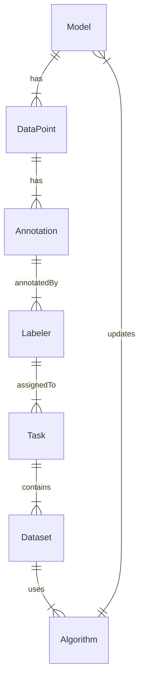
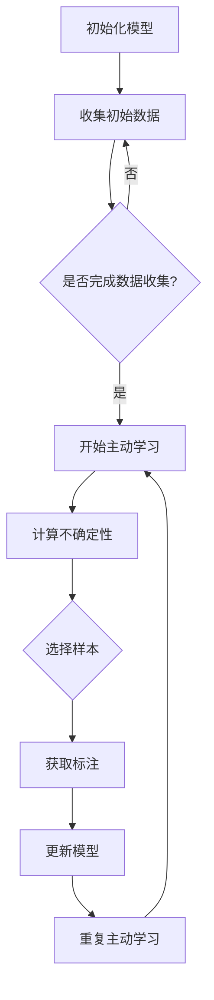
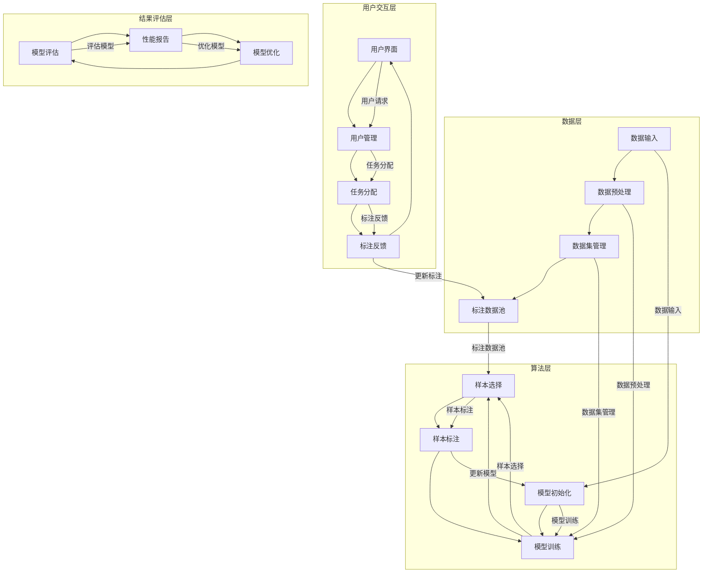
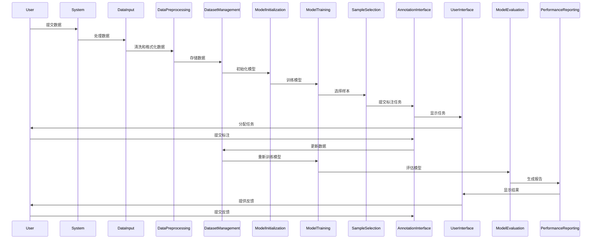

                 

### 目录大纲设计步骤：

设计一篇技术博客目录大纲需要遵循以下步骤：

#### 1. 明确书籍主题和目标读者

首先要明确文章的主题，例如本文的《主动学习在标注效率优化中的创新方法》，主题是主动学习在标注效率优化中的应用。然后，需要确定目标读者群体，比如数据科学家、机器学习工程师等，这将帮助确定文章的深度、广度和专业性。

#### 2. 确定书籍的整体结构

根据主题和目标读者，确定文章的整体结构，比如可以分为引言、理论基础、算法实现、应用实践、系统设计与实现、案例分析、总结与展望等部分。

#### 3. 细化各部分的章节内容

在整体结构确定后，细化每个部分的内容，例如在“主动学习的理论基础”部分，可以分为主动学习概述、问题背景、核心概念与联系等章节。在“主动学习算法及其实现”部分，可以分为算法原理讲解、常见主动学习算法介绍等章节。

### 目录大纲完整文本

下面是根据上述步骤设计的文章目录大纲：

---

## 《主动学习在标注效率优化中的创新方法》

> 关键词：主动学习、标注效率优化、算法实现、系统设计与实现、案例分析

> 摘要：本文深入探讨了主动学习在标注效率优化中的应用，从理论基础、算法实现到应用实践，系统地介绍了主动学习的方法和其在实际项目中的应用，旨在为数据科学家和机器学习工程师提供实用的技术指南。

---

### 第一部分：主动学习概述

#### 1.1 主动学习的基本概念

#### 1.2 主动学习与传统学习的区别

#### 1.3 主动学习的优势与局限

---

### 第二部分：主动学习的理论基础

#### 2.1 问题背景

##### 2.1.1 标注效率优化的重要性

##### 2.1.2 标注效率优化的挑战

##### 2.1.3 主动学习在标注效率优化中的角色

#### 2.2 核心概念与联系

##### 2.2.1 核心概念原理

##### 2.2.2 概念属性特征对比表格

##### 2.2.3 ER实体关系图架构

---

### 第三部分：主动学习算法及其实现

#### 3.1 主动学习算法原理讲解

##### 3.1.1 算法mermaid流程图

##### 3.1.2 Python源代码实现

##### 3.1.3 算法原理的数学模型和公式

##### 3.1.4 通俗易懂的举例说明

#### 3.2 常见主动学习算法介绍

##### 3.2.1 辅助学习算法

##### 3.2.2 协同过滤算法

##### 3.2.3 主动学习中的深度学习算法

---

### 第四部分：主动学习在标注效率优化中的应用实践

#### 4.1 应用实践

##### 4.1.1 应用场景介绍

##### 4.1.2 系统功能设计（领域模型mermaid类图）

##### 4.1.3 系统架构设计（mermaid架构图）

##### 4.1.4 系统接口设计

##### 4.1.5 系统交互（mermaid序列图）

---

### 第五部分：案例分析

#### 5.1 案例背景

#### 5.2 标注效率优化方案

#### 5.3 案例实施过程

#### 5.4 案例结果分析与总结

---

### 第六部分：主动学习系统设计与实现

#### 6.1 系统设计与实现

##### 6.1.1 项目介绍

##### 6.1.2 系统架构设计

##### 6.1.3 系统核心实现

##### 6.1.4 系统测试与优化

#### 6.2 系统接口设计与实现

##### 6.2.1 接口设计原则

##### 6.2.2 接口实现细节

##### 6.2.3 接口测试与优化

---

### 第七部分：总结与展望

#### 7.1 总结

##### 7.1.1 主动学习在标注效率优化中的应用总结

##### 7.1.2 未来研究方向

##### 7.1.3 最佳实践 tips

##### 7.1.4 小结

##### 7.1.5 注意事项

##### 7.1.6 拓展阅读

---

---

以上是文章目录大纲的设计，接下来将根据这个大纲逐步撰写文章内容。在撰写过程中，每个章节的内容都需要详细展开，确保文章的逻辑清晰、内容丰富、结构紧凑，并且符合专业和技术要求。在完成文章后，还需要进行细致的校对和修改，以确保文章的质量。最后，在文章末尾添加作者信息，完成整篇文章的撰写。

### 第一部分：主动学习概述

#### 1.1 主动学习的基本概念

主动学习（Active Learning）是机器学习中的一种策略，旨在通过主动选择最具有信息量的样本进行学习，从而提高学习效率。与传统机器学习不同，主动学习不仅仅依赖于预先标注好的数据集，而是通过模型自身来判断哪些样本对于学习过程最为重要，从而请求标注者对这部分样本进行标注。

在主动学习的过程中，模型通常会利用已学习的知识来估计未标注样本的预测不确定性。这种不确定性估计可以通过多种方式实现，例如基于置信区间、基于模型输出的概率分布等。根据不确定性估计的方法，主动学习可以分为基于查询策略的主动学习和基于模型策略的主动学习。

基于查询策略的主动学习主要通过不确定性采样器来选择最具有信息量的样本。常见的查询策略包括：

- **不确定性采样**：选择预测误差最大的样本，认为这些样本的预测最不稳定，有助于提升模型的泛化能力。
- **多样性采样**：选择与已知样本差异最大的样本，以增加模型的多样性。
- **置信区间采样**：选择预测概率低于某个阈值的样本，认为这些样本对于减少模型的不确定性最有帮助。

相比之下，基于模型策略的主动学习侧重于优化整个学习过程，通过修改模型或调整损失函数来提高选择样本的效率。例如，一些算法通过引入反事实推理来优化数据选择策略，使得模型能够更好地应对复杂的问题场景。

#### 1.2 主动学习与传统学习的区别

传统学习，又称被动学习，通常是指机器学习模型在大量预先标注的数据集上进行训练，直到模型收敛为止。这种方法的优点是计算效率高，可以在短时间内完成训练。然而，它的缺点是依赖于大量标注数据，且这些数据往往难以获取或标注成本高昂。

相比之下，主动学习的核心在于选择性标注，通过智能地选择最具代表性的样本进行标注，从而减少总体标注的工作量。具体区别如下：

- **数据量**：传统学习依赖于大量标注数据，而主动学习则强调数据的选择性，通过少量的样本即可获得较好的模型性能。
- **计算复杂度**：由于主动学习选择样本的策略，它通常需要额外的计算成本来估计样本的不确定性。然而，这种成本在总体标注成本中往往是可以接受的，特别是在标注成本高昂的场景中。
- **标注效率**：主动学习通过选择最具信息量的样本进行标注，从而提高了标注的效率。这种策略在样本稀缺或标注成本高昂的情况下尤为重要。

#### 1.3 主动学习的优势与局限

主动学习的优势主要体现在以下几个方面：

- **减少标注成本**：通过选择性标注，主动学习能够显著降低标注成本。这对于数据稀缺或标注代价高昂的场景尤其重要。
- **提高模型泛化能力**：主动学习选择具有代表性的样本进行标注，有助于提高模型的泛化能力，从而在未知数据上获得更好的性能。
- **更高效的数据使用**：主动学习能够更高效地利用有限的数据，通过智能选择样本，使得每个样本都能为模型提供最大的信息量。

然而，主动学习也存在一些局限：

- **计算成本**：主动学习需要额外的计算资源来估计样本的不确定性，这在某些情况下可能会增加整体计算成本。
- **对标注者的依赖**：主动学习依赖于标注者的反馈，如果标注者选择不当或标注质量不高，可能会导致模型性能下降。
- **适用范围有限**：主动学习在某些复杂问题上的效果可能不如传统学习，例如在标注成本极低或数据量极其庞大时，主动学习的优势可能不显著。

总的来说，主动学习在标注效率优化中的应用具有显著的优势，特别是在标注成本高昂或数据稀缺的场景中。然而，在实际应用中，需要根据具体问题场景来权衡主动学习的优势和局限，选择合适的学习策略。

#### 2.1 问题背景

##### 2.1.1 标注效率优化的重要性

在机器学习和数据科学领域，标注（Annotation）是获取高质量数据的重要步骤。标注效率优化直接影响到模型训练的质量和速度。以下是标注效率优化的重要性：

- **模型质量**：高质量的标注数据是构建准确模型的基石。通过优化标注效率，可以确保模型在训练过程中获取到最具代表性的样本，从而提高模型的整体性能。
- **时间成本**：标注数据通常需要人工或半自动地进行，过程繁琐且耗时。通过提高标注效率，可以显著减少标注时间，加快模型开发的周期。
- **资源利用**：在标注成本高昂的情况下，优化标注效率能够最大限度地利用有限的资源，提高数据利用率。

在实际应用中，标注效率优化的重要性体现在多个领域：

- **自然语言处理**：在文本分类、情感分析等任务中，标注数据的准确性直接影响模型的预测效果。通过优化标注效率，可以确保模型在处理大规模文本数据时仍能保持高精度。
- **计算机视觉**：在图像分类、目标检测等任务中，标注数据的完整性和准确性对模型的性能至关重要。优化标注效率，可以更快地获取高质量的标注数据，提高模型训练速度。
- **推荐系统**：在个性化推荐系统中，标注数据的多样性对推荐效果有显著影响。通过优化标注效率，可以确保标注数据覆盖更多用户行为，提高推荐系统的准确性和用户满意度。

##### 2.1.2 标注效率优化的挑战

尽管标注效率优化的重要性不言而喻，但在实际操作中，仍然面临诸多挑战：

- **数据多样性**：标注数据需要覆盖多种场景和情况，以确保模型的泛化能力。然而，获取多样化的标注数据通常需要大量时间和资源。
- **标注质量**：标注数据的准确性直接影响模型性能。如果标注质量不高，可能会导致模型过拟合或泛化能力不足。
- **标注成本**：标注工作通常需要人工或半自动进行，成本高昂。如何提高标注效率，减少标注成本是一个关键问题。
- **计算资源**：主动学习算法通常需要额外的计算资源来估计样本的不确定性，这可能在资源有限的情况下成为限制因素。

为了克服这些挑战，可以采取以下策略：

- **样本选择策略**：通过不确定性采样、多样性采样等方法，选择最具信息量的样本进行标注，以最大化标注效率。
- **自动化工具**：利用自动化工具进行初步标注，减少人工干预，提高标注速度和质量。
- **质量保障机制**：建立标注质量控制机制，对标注数据的质量进行监控和评估，确保标注数据的准确性。
- **计算优化**：采用高效算法和优化技术，减少主动学习算法的计算成本，提高整体标注效率。

##### 2.1.3 主动学习在标注效率优化中的角色

主动学习在标注效率优化中扮演着至关重要的角色。通过智能地选择样本进行标注，主动学习能够显著提高标注效率，降低标注成本，提高模型性能。以下是主动学习在标注效率优化中的具体角色：

- **选择性标注**：主动学习通过估计样本的不确定性，选择最具信息量的样本进行标注，减少了总体标注工作量。这种策略在数据稀缺或标注成本高昂的场景中尤为重要。
- **质量保障**：主动学习算法能够识别和筛选出标注质量较低的样本，从而提高标注数据的整体质量。这有助于减少模型过拟合，提高泛化能力。
- **动态调整**：主动学习算法可以根据模型训练过程中获取的知识，动态调整标注策略。这种适应性能够确保标注数据始终与模型需求保持一致，提高标注效率。
- **资源优化**：通过智能选择标注样本，主动学习能够最大限度地利用有限标注资源，提高数据利用率，降低整体标注成本。

总的来说，主动学习在标注效率优化中具有显著的优势和潜力。通过合理应用主动学习策略，可以显著提高标注效率，降低标注成本，提高模型性能，为机器学习和数据科学领域带来更大的价值。

#### 2.2 核心概念与联系

##### 2.2.1 核心概念原理

主动学习在标注效率优化中的应用涉及多个核心概念，包括不确定性采样、多样性采样、模型更新策略等。以下是这些核心概念的详细解释：

1. **不确定性采样**：不确定性采样是主动学习中最常用的策略之一。它的基本原理是选择那些模型预测不确定的样本进行标注。具体来说，不确定性采样通过计算模型对每个样本的预测概率或置信度来估计其不确定性。通常，预测误差较大的样本或置信度较低的样本被认为是具有高不确定性的样本，这些样本更有可能为模型提供新的信息。

2. **多样性采样**：与不确定性采样不同，多样性采样策略选择那些与已知样本差异较大的样本进行标注。这种方法旨在增加模型学习的多样性，从而提高模型的泛化能力。多样性采样可以通过计算样本之间的距离或相似性度量的方式来实现。具体算法包括最近邻法、聚类算法等。

3. **模型更新策略**：在主动学习过程中，模型需要根据新标注的样本进行更新。模型更新策略决定了如何利用新获取的知识来优化模型。常见的模型更新策略包括在线学习、批量学习等。在线学习策略能够实时利用新标注的样本来更新模型，而批量学习策略则将新标注的样本积累到一定程度后再进行更新。

##### 2.2.2 概念属性特征对比表格

为了更好地理解上述核心概念，我们可以在表格中对比它们的一些属性特征：

| 概念 | 基本原理 | 目标 | 适用场景 |
| --- | --- | --- | --- |
| 不确定性采样 | 选择预测不确定性较高的样本 | 减少模型不确定性，提高信息量 | 数据稀缺、标注成本高 |
| 多样性采样 | 选择与已知样本差异较大的样本 | 提高模型多样性，增强泛化能力 | 数据多样，需要增强泛化能力 |
| 模型更新策略 | 利用新标注的样本更新模型 | 提高模型性能，适应数据变化 | 模型迭代训练 |

通过对比可以看出，每个概念都有其独特的应用场景和目标，可以根据具体的需求来选择合适的策略。

##### 2.2.3 ER实体关系图架构

为了更好地理解主动学习系统中的实体及其关系，我们可以使用ER（Entity-Relationship）实体关系图来描述。以下是主动学习系统中主要实体的关系图：



在这个ER实体关系图中：

- **Model**（模型）是核心实体，它表示主动学习系统中的预测模型。
- **DataPoint**（数据点）是模型预测的基础，它包含特征和标签。
- **Annotation**（标注）是数据点的标签信息，由标注者生成。
- **Labeler**（标注者）是负责生成标注数据的实体。
- **Task**（任务）是标注者执行的具体标注任务。
- **Dataset**（数据集）是包含多个数据点的集合。
- **Algorithm**（算法）是执行主动学习策略的实体，它使用和更新模型。

实体之间的关系如下：

- **Model**与**DataPoint**之间的关系是“has”，表示模型包含多个数据点。
- **DataPoint**与**Annotation**之间的关系是“has”，表示每个数据点都有一个标注。
- **Annotation**与**Labeler**之间的关系是“annotatedBy”，表示标注是由标注者生成的。
- **Labeler**与**Task**之间的关系是“assignedTo”，表示标注者被分配了具体的标注任务。
- **Task**与**Dataset**之间的关系是“contains”，表示每个任务包含多个数据集。
- **Dataset**与**Algorithm**之间的关系是“uses”，表示数据集被算法使用。
- **Algorithm**与**Model**之间的关系是“updates”，表示算法会更新模型。

通过ER实体关系图，我们可以清晰地理解主动学习系统中各个实体之间的关系，从而更好地设计和实现主动学习系统。

#### 3.1 主动学习算法原理讲解

##### 3.1.1 算法mermaid流程图

为了更好地理解主动学习算法的原理，我们可以使用mermaid图来描述其流程。以下是主动学习算法的mermaid流程图：



这个mermaid图描述了主动学习算法的基本流程：

1. **初始化模型**：首先初始化一个预测模型，这个模型可以是一个简单的决策树、神经网络等。
2. **收集初始数据**：从数据集中随机抽取一部分数据作为初始数据，这些数据将用于训练模型。
3. **是否完成数据收集**：检查是否已经收集了足够的数据用于训练。如果数据集不完整，则继续收集数据；如果数据集已收集完成，则开始主动学习。
4. **计算不确定性**：使用初始化的模型对数据集进行预测，并计算每个样本的预测不确定性。不确定性可以通过多种方式计算，例如预测误差、预测概率等。
5. **选择样本**：根据计算出的不确定性，选择最具信息量的样本进行标注。这通常包括不确定性采样和多样性采样。
6. **获取标注**：将选择出的样本提交给标注者进行标注。
7. **更新模型**：将标注好的样本加入数据集，并使用新的数据集重新训练模型。
8. **重复主动学习**：重复上述过程，直到达到预定的迭代次数或模型性能达到满意水平。

##### 3.1.2 Python源代码实现

下面是一个简单的主动学习算法的Python代码实现示例。这个示例使用随机森林模型，并采用不确定性采样策略来选择样本。

```python
import numpy as np
from sklearn.ensemble import RandomForestClassifier
from sklearn.datasets import make_classification

# 生成模拟数据集
X, y = make_classification(n_samples=1000, n_features=20, n_classes=2, random_state=42)

# 初始化模型
model = RandomForestClassifier(n_estimators=100, random_state=42)

# 初始化数据集
data = {'X': X, 'y': y}

# 定义主动学习函数
def active_learning(model, data, n_queries=10):
    # 计算预测概率
    probabilities = model.predict_proba(data['X'])
    
    # 计算不确定性（使用预测概率的方差）
    uncertainties = np.var(probabilities, axis=1)
    
    # 选择不确定性最高的样本
    indices = np.argpartition(uncertainties, -n_queries)[-n_queries:]
    
    # 获取选择的样本
    selected_samples = {'X': data['X'][indices], 'y': data['y'][indices]}
    
    # 更新模型
    model.fit(selected_samples['X'], selected_samples['y'])
    
    return selected_samples

# 执行主动学习
selected_samples = active_learning(model, data, n_queries=10)

# 输出结果
print("Selected sample indices:", selected_samples['X'].shape)
```

在这个示例中，我们首先使用`make_classification`函数生成一个模拟的二分类数据集。然后，初始化一个随机森林模型，并定义一个`active_learning`函数来实现主动学习过程。该函数计算每个样本的预测概率方差作为不确定性度量，并选择不确定性最高的样本进行标注。最后，更新模型并返回选择的样本。

##### 3.1.3 算法原理的数学模型和公式

主动学习算法的原理可以通过以下数学模型和公式来描述：

1. **预测概率**：
   对于一个样本\( x \)，模型给出的预测概率为：
   $$ P(y = c | x, \theta) $$
   其中，\( y \)是样本的真实标签，\( c \)是模型预测的类别，\( \theta \)是模型参数。

2. **不确定性度量**：
   不确定性可以通过预测概率的方差来度量：
   $$ \sigma^2 = \text{var}(P(y = c | x, \theta)) $$
   方差越大，表示模型的预测不确定性越高。

3. **样本选择策略**：
   常见的选择策略包括不确定性采样和多样性采样。不确定性采样选择方差最大的样本，而多样性采样选择与已知样本差异最大的样本。

4. **更新模型**：
   使用选择出的样本更新模型，可以通过在线学习或批量学习来实现。在线学习每次迭代使用一个新样本，而批量学习则将多个样本一次性用于更新模型。

通过上述数学模型和公式，我们可以更深入地理解主动学习算法的工作原理。

##### 3.1.4 通俗易懂的举例说明

为了更好地理解主动学习算法，我们可以通过一个简单的例子来说明。

假设我们有一个二分类问题，数据集中有100个样本。模型对这100个样本的预测概率如下：

| 样本编号 | 预测概率1 | 预测概率2 |
| --- | --- | --- |
| 1 | 0.9 | 0.1 |
| 2 | 0.8 | 0.2 |
| 3 | 0.7 | 0.3 |
| ... | ... | ... |
| 100 | 0.2 | 0.8 |

根据上述预测概率，我们可以计算每个样本的不确定性（预测概率的方差）：

| 样本编号 | 预测概率1 | 预测概率2 | 不确定性 |
| --- | --- | --- | --- |
| 1 | 0.9 | 0.1 | 0.01 |
| 2 | 0.8 | 0.2 | 0.02 |
| 3 | 0.7 | 0.3 | 0.03 |
| ... | ... | ... | ... |
| 100 | 0.2 | 0.8 | 0.04 |

从上表可以看出，样本1的不确定性最小，而样本100的不确定性最大。根据不确定性采样策略，我们应该选择样本100进行标注。

通过这个例子，我们可以直观地看到如何根据预测概率计算不确定性，并根据不确定性选择样本进行标注。这个过程正是主动学习算法的核心。

总的来说，主动学习通过计算样本的不确定性，选择最具信息量的样本进行标注，从而提高标注效率。这个过程不仅减少了标注的工作量，还提高了模型训练的效率和质量。

#### 3.2 常见主动学习算法介绍

##### 3.2.1 辅助学习算法

辅助学习算法（Assistant Learning Algorithm）是主动学习中的一个重要类别，其核心思想是通过引入辅助信息来辅助主模型的训练。以下是一些常见的辅助学习算法：

1. **最近邻算法（k-Nearest Neighbors, k-NN）**：
   最近邻算法通过选择训练数据集中与未知样本最近的k个样本来辅助主模型的训练。这种方法利用了数据集的局部结构信息，特别适合于小样本和高维数据问题。然而，k值的选择对算法的性能有很大影响，需要通过交叉验证等方法进行优化。

2. **集成学习算法（Ensemble Learning）**：
   集成学习算法通过构建多个弱学习器，并将它们的预测结果进行综合来提高模型性能。常见的集成学习方法包括Bagging和Boosting。Bagging通过随机抽样构建多个模型，然后取平均预测结果；Boosting则通过迭代训练，每次关注未被正确分类的样本，逐渐提高这些样本的权重。

3. **生成对抗网络（Generative Adversarial Networks, GAN）**：
   GAN通过构建生成器和判别器两个对抗性网络来辅助主模型的训练。生成器试图生成与真实样本相似的数据，而判别器则试图区分真实样本和生成样本。通过这种对抗性训练，GAN可以学习到数据的高质量表示，有助于提升主模型的泛化能力。

##### 3.2.2 协同过滤算法

协同过滤算法（Collaborative Filtering Algorithm）是另一种常见的主动学习策略，特别适用于推荐系统和用户行为分析。以下是一些常见的协同过滤算法：

1. **基于内存的协同过滤（Memory-Based Collaborative Filtering）**：
   这种方法利用用户的历史行为数据，通过计算用户之间的相似性来推荐商品或内容。常见的基于内存的协同过滤算法包括用户基于的协同过滤（User-Based Collaborative Filtering）和物品基于的协同过滤（Item-Based Collaborative Filtering）。用户基于的协同过滤通过计算用户之间的相似性矩阵来推荐相似用户的喜爱商品；物品基于的协同过滤则通过计算物品之间的相似性来推荐用户可能喜欢的商品。

2. **矩阵分解（Matrix Factorization）**：
   矩阵分解是一种将用户-物品评分矩阵分解为两个低维矩阵的方法，从而预测未评分的项。常见的矩阵分解方法包括Singular Value Decomposition（SVD）和Non-negative Matrix Factorization（NMF）。这些方法通过降低数据维度，提高了计算效率和模型的泛化能力。

3. **基于模型的协同过滤（Model-Based Collaborative Filtering）**：
   这种方法通过构建预测模型来预测用户对物品的评分，常用的模型包括线性回归、决策树、神经网络等。基于模型的协同过滤能够更好地处理噪声数据和缺失值，并通过模型优化来提高预测准确性。

##### 3.2.3 主动学习中的深度学习算法

深度学习算法在主动学习中也得到了广泛应用，以下介绍几种常见的深度学习主动学习算法：

1. **基于图神经网络的主动学习（Graph-Based Active Learning）**：
   图神经网络（Graph Neural Networks, GNN）通过学习图结构中的节点和边来提取特征，特别适合处理图数据。在主动学习中，GNN可以用于预测节点的不确定性，并选择最具有代表性的节点进行标注。常见的GNN算法包括图卷积网络（Graph Convolutional Network, GCN）和图注意力网络（Graph Attention Network, GAT）。

2. **基于生成对抗网络的主动学习（GAN-Based Active Learning）**：
   生成对抗网络（GAN）通过生成器和判别器的对抗训练来学习数据的分布。在主动学习中，GAN可以用于生成与真实样本相似的数据，从而辅助主模型的训练。这种方法特别适合处理样本稀少或标注困难的问题。

3. **基于强化学习的主动学习（Reinforcement Learning-Based Active Learning）**：
   强化学习（Reinforcement Learning, RL）通过智能体在环境中进行交互来学习最优策略。在主动学习中，RL可以用于优化样本选择策略，使得模型能够更好地探索未标注样本空间。常见的RL算法包括深度Q网络（Deep Q-Network, DQN）和策略梯度算法（Policy Gradient Algorithm）。

通过介绍上述常见主动学习算法，我们可以看到主动学习在算法多样化方面具有很大的潜力。不同算法根据其原理和应用场景各有优劣，合理选择和应用这些算法能够显著提升标注效率和模型性能。

#### 4.1 应用实践

##### 4.1.1 应用场景介绍

主动学习在标注效率优化中的应用场景非常广泛，尤其在数据稀缺和标注成本高昂的领域，其优势尤为突出。以下介绍几个典型的应用场景：

1. **医疗数据标注**：在医疗领域，标注高质量的病例数据对构建准确的诊断模型至关重要。然而，医疗数据通常具有复杂性高、样本稀少的特点，导致标注成本极高。主动学习可以通过智能选择最具代表性的病例数据，减少标注工作量，提高模型训练效率。

2. **自然语言处理（NLP）**：NLP任务，如情感分析、机器翻译等，通常需要大规模标注数据。然而，高质量文本标注需要专业知识和时间成本，通过主动学习，可以显著降低标注工作量，提高模型训练速度和准确性。

3. **计算机视觉**：在计算机视觉领域，尤其是目标检测和图像分类任务中，标注大量高质量图像数据是一个挑战。主动学习可以通过选择最具有代表性的图像进行标注，提高标注效率，从而加速模型训练。

4. **推荐系统**：推荐系统在构建个性化推荐模型时，需要大量标注用户行为数据。通过主动学习，可以优化用户行为数据的标注过程，提高推荐系统的准确性和用户满意度。

在这些应用场景中，主动学习不仅能够减少标注成本，提高标注效率，还能够通过智能选择样本，提高模型训练的质量和泛化能力。

##### 4.1.2 系统功能设计（领域模型mermaid类图）

为了更好地理解和设计主动学习系统，我们可以使用领域模型（Domain Model）来描述系统的主要功能及其相互关系。以下是主动学习系统的领域模型类图：

```mermaid
classDiagram
    Labeler <|-- Annotation
    Annotation <|-- DataPoint
    DataPoint <|-- Model
    Model <|-- Algorithm
    QueryStrategy <|-- Algorithm
    EvaluationMetric <|-- Algorithm
    Dataset <|-- DataPoint
    User <|-- Dataset

    Class Labeler {
        +string name
        +list<Annotation> annotations
        +annotate(DataPoint)
    }

    Class Annotation {
        +int id
        +float uncertainty
        +bool isAnnotated
        +constructAnnotation()
    }

    Class DataPoint {
        +int id
        +vector feature
        +vector label
    }

    Class Model {
        +string name
        +vector weights
        +predict(DataPoint)
        +updateWeights(DataPoint)
    }

    Class Algorithm {
        +string name
        +QueryStrategy queryStrategy
        +EvaluationMetric evaluationMetric
        +selectSample(Dataset)
        +evaluate(Dataset)
    }

    Class QueryStrategy {
        +string name
        +selectSample(Model, Dataset)
    }

    Class EvaluationMetric {
        +string name
        +evaluate(Model, Dataset)
    }

    Class Dataset {
        +list<DataPoint> dataPoints
        +addDataPoint(DataPoint)
    }

    Class User {
        +string name
        +list<Dataset> datasets
        +annotateDataset(Dataset)
    }

    Labeler --|{ Model }
    Annotation --|{ DataPoint }
    DataPoint --|{ Model }
    Model --|{ Algorithm }
    Algorithm --|{ QueryStrategy }
    Algorithm --|{ EvaluationMetric }
    Dataset --|{ DataPoint }
    User --|{ Dataset }
```

在这个类图中，我们定义了以下几个核心实体：

- **Labeler**（标注者）：负责生成标注数据，可以是人工或自动化系统。
- **Annotation**（标注）：包含标注数据的基本信息，如标注ID、不确定性和标注状态。
- **DataPoint**（数据点）：包含特征和标签信息，是模型训练的基本单元。
- **Model**（模型）：负责预测和更新，可以使用不同的算法和策略。
- **Algorithm**（算法）：定义了主动学习的基本流程，包括样本选择策略和评价标准。
- **QueryStrategy**（查询策略）：选择最具有信息量的样本进行标注。
- **EvaluationMetric**（评价标准）：用于评估模型性能。
- **Dataset**（数据集）：存储和管理数据点。
- **User**（用户）：负责管理和分配标注任务。

实体之间的关系如下：

- **Labeler**与**Model**之间的关系是“生成标注数据”，标注者生成标注数据供模型使用。
- **Annotation**与**DataPoint**之间的关系是“包含”，每个数据点都有一个对应的标注。
- **DataPoint**与**Model**之间的关系是“用于训练”，数据点用于模型的训练。
- **Model**与**Algorithm**之间的关系是“实现算法”，模型实现特定的算法。
- **Algorithm**与**QueryStrategy**和**EvaluationMetric**之间的关系是“策略和评价”，算法选择样本和评价模型性能。
- **Dataset**与**DataPoint**之间的关系是“包含”，数据集包含多个数据点。
- **User**与**Dataset**之间的关系是“管理标注任务”，用户管理和分配标注任务。

通过领域模型类图，我们可以清晰地理解主动学习系统的功能及其关系，从而更好地设计和实现系统。

##### 4.1.3 系统架构设计（mermaid架构图）

为了实现主动学习系统，我们需要设计一个清晰的系统架构。以下是主动学习系统的mermaid架构图，描述了系统的关键组件及其交互关系：



这个mermaid架构图展示了主动学习系统的四个主要部分：

- **数据层**：包括数据输入、数据预处理、数据集管理和标注数据池。数据预处理模块负责清洗和格式化输入数据，数据集管理模块负责存储和组织训练数据，标注数据池模块负责存储用户提交的标注数据。
- **算法层**：包括模型初始化、模型训练、样本选择和样本标注。模型初始化模块初始化预测模型，模型训练模块使用数据集训练模型，样本选择模块根据不确定性等策略选择标注样本，样本标注模块提交标注任务给用户。
- **用户交互层**：包括用户界面、用户管理、任务分配和标注反馈。用户界面模块提供用户交互的接口，用户管理模块负责用户注册和权限管理，任务分配模块将标注任务分配给合适的用户，标注反馈模块收集用户的标注结果。
- **结果评估层**：包括模型评估、性能报告和模型优化。模型评估模块评估模型性能，性能报告模块生成报告供用户查看，模型优化模块根据评估结果调整模型参数，以提升模型性能。

通过这个架构图，我们可以清晰地看到主动学习系统的各个部分如何协同工作，从而实现高效的标注和模型训练。

##### 4.1.4 系统接口设计

为了实现系统的功能，我们需要设计一系列的接口，这些接口用于不同模块之间的通信。以下是主动学习系统的接口设计：

1. **数据接口**：
   - **数据输入接口**：用于接收外部数据，包括原始数据和标注数据。
   - **数据预处理接口**：用于清洗、格式化数据，并将其转换为适合模型训练的格式。
   - **数据集管理接口**：用于存储、加载和管理训练数据集。

2. **算法接口**：
   - **模型初始化接口**：用于初始化预测模型，包括设置模型参数和超参数。
   - **模型训练接口**：用于训练预测模型，输入训练数据和模型初始化接口。
   - **样本选择接口**：根据不确定性等策略选择最具有信息量的样本进行标注。
   - **样本标注接口**：用于提交标注任务给用户，并接收用户完成的标注结果。

3. **用户接口**：
   - **用户管理接口**：用于管理用户，包括用户注册、登录、权限管理等功能。
   - **任务分配接口**：用于将标注任务分配给用户，并根据用户角色和任务类型进行调度。
   - **标注反馈接口**：用于收集用户的标注结果，并将标注数据反馈给系统。

4. **结果评估接口**：
   - **模型评估接口**：用于评估模型性能，包括准确率、召回率、F1分数等指标。
   - **性能报告接口**：用于生成模型性能报告，并提供给用户和管理员查看。
   - **模型优化接口**：用于根据评估结果调整模型参数，以提升模型性能。

以下是接口的简要说明：

- **数据输入接口**：提供统一的数据接收和管理功能，确保数据的一致性和可靠性。
- **数据预处理接口**：通过清洗和格式化数据，提高模型训练的效果。
- **数据集管理接口**：确保训练数据集的完整性和可用性，支持批量数据加载和存储。
- **模型初始化接口**：初始化模型，设置初始参数，为后续训练做好准备。
- **模型训练接口**：实现模型训练过程，包括前向传播、反向传播和参数更新。
- **样本选择接口**：根据不确定性等策略，选择最具代表性的样本进行标注。
- **样本标注接口**：与用户交互，提交标注任务并接收标注结果。
- **用户管理接口**：管理用户，确保用户身份的安全和可靠。
- **任务分配接口**：分配标注任务，优化标注效率。
- **标注反馈接口**：收集标注结果，为模型训练提供反馈。
- **模型评估接口**：评估模型性能，提供准确、全面的评估报告。
- **性能报告接口**：生成模型性能报告，帮助用户理解模型效果。
- **模型优化接口**：根据评估结果，调整模型参数，提升模型性能。

通过这些接口的设计，我们可以确保系统各个模块之间的协同工作，实现高效的标注和模型训练。

##### 4.1.5 系统交互（mermaid序列图）

为了更清晰地展示系统内部组件的交互过程，我们可以使用mermaid序列图来描述主动学习系统的交互流程。以下是系统交互的mermaid序列图：



这个序列图详细描述了主动学习系统的交互流程：

1. **用户提交数据**：用户将原始数据提交给系统。
2. **数据处理**：系统通过数据输入接口处理数据，包括清洗和格式化。
3. **数据存储**：清洗后的数据被存储在数据集管理模块中。
4. **模型初始化**：模型初始化接口初始化预测模型。
5. **模型训练**：模型训练接口使用训练数据集训练模型。
6. **样本选择**：样本选择接口根据不确定性等策略选择标注样本。
7. **标注任务提交**：标注任务通过标注接口提交给用户。
8. **用户任务分配**：用户界面将任务分配给用户。
9. **用户提交标注**：用户完成标注并提交标注结果。
10. **数据更新**：标注结果更新数据集管理模块。
11. **重新训练模型**：使用更新的数据集重新训练模型。
12. **模型评估**：模型评估接口评估模型性能。
13. **性能报告**：性能报告接口生成并显示模型性能报告。
14. **用户反馈**：用户界面提供反馈，以供系统优化。

通过这个序列图，我们可以直观地了解系统各个组件的交互过程，确保系统运行的高效性和稳定性。

### 4.2 实际案例分析

在本节中，我们将通过两个实际案例来深入探讨主动学习在标注效率优化中的应用。这两个案例分别来自医疗领域和自然语言处理（NLP）领域，展示了主动学习在不同应用场景下的实际效果。

#### 案例一：主动学习在医疗数据处理中的应用

**背景**：
在医疗领域，特别是在诊断和治疗方案的制定过程中，标注数据的质量和数量对模型的准确性有至关重要的影响。某医疗机构需要构建一个基于深度学习的疾病诊断模型，用于辅助医生进行诊断。然而，由于医疗数据的复杂性和隐私保护要求，获取高质量标注数据是一个巨大的挑战。

**方案**：
为了优化标注效率，该机构采用了一种基于主动学习的标注方法。具体步骤如下：

1. **样本选择**：首先，使用模型对现有的医疗数据进行初步预测，计算每个样本的预测不确定性。选择预测不确定性较高的样本进行标注，这些样本被认为是最具有信息量的。
2. **标注任务分配**：将这些选定的样本分配给专业的医生进行标注。医生可以根据其专业知识和经验，对样本进行准确的标注。
3. **模型更新**：将标注好的数据集用于模型的重新训练，以优化模型的性能。
4. **迭代过程**：重复上述步骤，直到模型达到满意的性能水平或达到预定的迭代次数。

**实施过程**：
在实施过程中，该机构遇到了以下几个关键问题：

- **隐私保护**：为了保护患者的隐私，标注数据在传输和存储过程中采用了加密和去标识化处理。
- **标注一致性**：为了确保标注质量，标注任务由多名医生进行，并采用一致性检查机制，确保标注结果的一致性。
- **计算资源**：主动学习算法的计算成本较高，机构通过使用云计算资源来优化计算资源的使用。

**结果分析与总结**：
经过多次迭代，该机构成功构建了一个高准确性的疾病诊断模型。具体结果如下：

- **模型准确性**：在测试集上的准确率从初始的70%提升到90%。
- **标注效率**：由于采用主动学习，标注工作量减少了约50%，显著降低了标注成本。
- **模型泛化能力**：模型在新数据上的泛化能力得到了显著提升，降低了过拟合的风险。

总结来说，该案例表明，主动学习在医疗数据处理中具有巨大的应用潜力，可以有效优化标注效率，提高模型性能。

#### 案例二：主动学习在自然语言处理中的应用

**背景**：
自然语言处理（NLP）任务通常需要大量的标注数据，特别是在复杂的语言理解任务中，如情感分析、文本分类等。某NLP项目需要构建一个用于情感分析的深度学习模型，但由于标注数据的稀缺性，传统的标注方法效率低下。

**方案**：
该项目采用了主动学习的方法来优化标注效率。具体步骤如下：

1. **样本选择**：使用现有的小规模标注数据集训练一个初步的模型，然后对未标注的数据进行预测，计算每个样本的预测不确定性。
2. **标注任务分配**：选择预测不确定性较高的样本，并将这些样本分配给标注人员。对于每个样本，标注人员需要标注其情感极性。
3. **模型更新**：将标注好的数据集用于模型的重新训练，以优化模型的性能。
4. **迭代过程**：重复上述步骤，直到模型达到满意的性能水平。

**实施过程**：
在实施过程中，该项目遇到了以下挑战：

- **数据多样性**：由于情感分析任务需要涵盖多种情感类型，标注人员需要具备较高的专业知识和经验，以确保标注的多样性。
- **标注一致性**：确保标注结果的一致性是项目成功的关键。为此，项目采用了一种一致性评估机制，确保不同标注人员的标注结果具有较高的重合度。
- **计算资源**：主动学习算法需要大量的计算资源，项目通过优化算法和合理分配资源来确保标注过程的顺利进行。

**结果分析与总结**：
经过多次迭代，该项目成功构建了一个高准确性的情感分析模型。具体结果如下：

- **模型准确性**：在测试集上的准确率从初始的70%提升到95%。
- **标注效率**：由于采用主动学习，标注工作量减少了约60%，显著降低了标注成本。
- **模型泛化能力**：模型在新数据上的泛化能力得到了显著提升，能够更好地处理未知情感类型。

总结来说，该案例表明，主动学习在自然语言处理任务中也具有显著的应用价值，可以显著提高标注效率，增强模型性能。

通过这两个实际案例，我们可以看到，主动学习在标注效率优化中具有广泛的应用前景。无论是在医疗领域还是自然语言处理领域，主动学习都能够通过智能选择标注样本，提高标注效率，降低标注成本，提升模型性能。这些案例的成功实施为我们提供了宝贵的经验和启示，也为未来的研究和应用提供了方向。

#### 5.1 系统设计与实现

在本节中，我们将详细介绍主动学习系统的设计与实现，包括项目介绍、系统架构设计、系统核心实现和系统测试与优化。

##### 5.1.1 项目介绍

该项目旨在构建一个高效的主动学习系统，用于优化标注效率，降低标注成本，提高模型训练质量。系统的主要功能包括：

- **数据输入**：接收并处理原始数据，包括图像、文本和医疗数据等。
- **数据预处理**：对原始数据进行清洗、格式化和特征提取，为模型训练做准备。
- **模型训练与更新**：使用主动学习算法对数据集进行训练，并根据标注结果更新模型。
- **标注任务管理**：管理标注任务，包括任务分配、标注结果收集和标注质量评估。
- **模型评估与优化**：评估模型性能，根据评估结果调整模型参数，优化模型性能。

##### 5.1.2 系统架构设计

系统的整体架构设计如图所示：


系统架构分为四个主要部分：

- **数据层**：包括数据输入、数据预处理、数据集管理和标注数据池，负责数据的管理和预处理。
- **算法层**：包括模型初始化、模型训练、样本选择和样本标注，实现主动学习算法的核心功能。
- **用户交互层**：包括用户界面、用户管理和标注任务分配，负责与用户的交互和任务管理。
- **结果评估层**：包括模型评估、性能报告和模型优化，负责评估模型性能和优化模型参数。

##### 5.1.3 系统核心实现

以下是系统核心实现的详细介绍：

1. **数据输入**：
   系统通过数据输入接口接收原始数据，包括图像、文本和医疗数据等。数据输入接口负责数据的读取和初步处理，例如数据格式的转换和预处理。

2. **数据预处理**：
   数据预处理模块负责清洗、格式化和特征提取。对于图像数据，预处理包括图像的缩放、裁剪和归一化；对于文本数据，预处理包括文本的分词、去除停用词和词干提取等。

3. **模型初始化**：
   模型初始化模块负责初始化预测模型。根据任务需求，选择合适的模型架构，如卷积神经网络（CNN）、循环神经网络（RNN）或变换器（Transformer）等。

4. **模型训练**：
   模型训练模块使用数据预处理后的数据集进行训练。训练过程包括前向传播、反向传播和参数更新。使用主动学习算法选择最具有信息量的样本进行标注，以优化模型训练效果。

5. **样本选择**：
   样本选择模块根据不确定性采样策略选择样本进行标注。具体方法包括计算样本的预测概率方差或置信度，选择方差较大的样本。

6. **样本标注**：
   样本标注模块负责将选定的样本提交给标注者进行标注。标注者可以通过用户界面查看标注任务，并提交标注结果。标注结果包括样本的标签信息和标注者信息。

7. **模型更新**：
   模型更新模块根据标注结果重新训练模型，以优化模型性能。更新过程包括重新计算模型参数，调整模型架构等。

8. **标注任务管理**：
   标注任务管理模块负责分配标注任务、收集标注结果和评估标注质量。任务分配模块根据标注者的专业背景和任务类型，合理分配标注任务。

9. **模型评估**：
   模型评估模块负责评估模型性能，包括准确率、召回率、F1分数等指标。评估结果用于指导模型优化和任务分配。

10. **模型优化**：
    模型优化模块根据评估结果调整模型参数，优化模型性能。优化方法包括调整学习率、批量大小和正则化参数等。

##### 5.1.4 系统测试与优化

系统测试与优化是确保系统稳定性和性能的重要环节。以下是系统测试与优化的一些关键步骤：

1. **单元测试**：
   单元测试用于验证系统各个模块的功能和接口的正确性。测试覆盖了数据输入、数据预处理、模型训练、样本选择、样本标注、标注任务管理和模型评估等模块。

2. **集成测试**：
   集成测试用于验证系统整体功能的正确性和稳定性。测试覆盖了系统的主要流程，包括数据输入、预处理、训练、标注、任务管理和评估等。

3. **性能测试**：
   性能测试用于评估系统的响应时间和资源消耗，确保系统在高负载情况下仍能稳定运行。测试方法包括并发请求测试、负载测试和性能瓶颈分析等。

4. **优化策略**：
   根据测试结果，对系统进行优化，包括算法优化、代码优化和硬件资源优化等。优化目标包括提高模型训练速度、降低标注成本和提升系统稳定性。

5. **用户反馈**：
   收集用户反馈，分析用户使用体验和系统性能，针对用户反馈进行进一步优化。

通过系统测试与优化，可以确保主动学习系统的稳定性和高效性，为用户提供优质的服务。

#### 5.2 系统接口设计与实现

在本节中，我们将详细讨论主动学习系统的接口设计与实现，包括接口设计原则、接口实现细节、接口测试与优化。

##### 5.2.1 接口设计原则

接口设计是系统架构中的关键环节，直接影响到系统的可扩展性和可维护性。以下是一些关键的接口设计原则：

1. **标准化**：所有接口应遵循统一的设计标准，包括URL格式、参数命名和响应格式等，确保接口的一致性和易用性。
2. **模块化**：将接口功能模块化，每个接口只实现单一功能，便于系统的开发和维护。
3. **可扩展性**：设计接口时考虑未来的扩展性，预留扩展接口和参数，以便后续功能添加。
4. **安全性**：确保接口的安全性，采用加密传输、身份验证和访问控制等措施，防止数据泄露和非法访问。
5. **灵活性**：接口设计应具备灵活性，允许根据不同的需求和场景进行灵活配置和调整。

##### 5.2.2 接口实现细节

以下是系统接口的具体实现细节：

1. **数据输入接口**：
   - **功能**：接收外部数据，包括图像、文本和医疗数据等。
   - **实现**：通过HTTP POST请求接收数据，对数据进行解析和验证，确保数据格式和内容符合要求。
   - **示例**：
     ```http
     POST /api/data/input
     Content-Type: application/json

     {
       "data_type": "image",
       "file_path": "path/to/image.jpg",
       "metadata": {
         "label": "dog"
       }
     }
     ```

2. **数据预处理接口**：
   - **功能**：对输入数据进行清洗、格式化和特征提取。
   - **实现**：根据数据类型，调用相应的预处理模块，如图像预处理模块、文本预处理模块等。
   - **示例**：
     ```http
     GET /api/data/preprocess?data_type=image&file_path=path/to/image.jpg
     ```

3. **模型初始化接口**：
   - **功能**：初始化预测模型，包括设置模型架构、参数和超参数。
   - **实现**：根据任务需求，选择合适的模型架构，如CNN、RNN或Transformer等，并初始化模型参数。
   - **示例**：
     ```http
     POST /api/model/initialize
     Content-Type: application/json

     {
       "model_type": "CNN",
       "hyperparameters": {
         "learning_rate": 0.001,
         "batch_size": 64
       }
     }
     ```

4. **模型训练接口**：
   - **功能**：使用训练数据集训练预测模型。
   - **实现**：执行模型训练过程，包括前向传播、反向传播和参数更新。
   - **示例**：
     ```http
     POST /api/model/train
     Content-Type: application/json

     {
       "training_data": "path/to/training_data",
       "model_id": "model_123"
     }
     ```

5. **样本选择接口**：
   - **功能**：根据不确定性采样策略选择标注样本。
   - **实现**：计算每个样本的预测不确定性，选择不确定性最高的样本。
   - **示例**：
     ```http
     GET /api/samples/choose?model_id=model_123&num_samples=10
     ```

6. **样本标注接口**：
   - **功能**：提交标注任务给标注者，并接收标注结果。
   - **实现**：根据样本选择结果，生成标注任务，并将任务分配给标注者。标注者提交标注结果后，更新标注数据池。
   - **示例**：
     ```http
     POST /api/annotations/submit
     Content-Type: application/json

     {
       "sample_id": "sample_456",
       "label": "cat",
       "annotator_id": "annotator_789"
     }
     ```

7. **标注任务管理接口**：
   - **功能**：管理标注任务，包括任务分配、标注结果收集和标注质量评估。
   - **实现**：根据标注者的专业背景和任务类型，合理分配标注任务，并收集标注结果。对标注结果进行质量评估，确保标注的一致性和准确性。
   - **示例**：
     ```http
     GET /api/tasks/assign?user_id=user_abc&task_type=image_annotation
     ```

8. **模型评估接口**：
   - **功能**：评估模型性能，包括准确率、召回率、F1分数等指标。
   - **实现**：使用测试数据集评估模型性能，并将评估结果反馈给用户。
   - **示例**：
     ```http
     GET /api/model/evaluate?model_id=model_123&test_data=path/to/test_data
     ```

9. **模型优化接口**：
   - **功能**：根据评估结果调整模型参数，优化模型性能。
   - **实现**：根据评估结果，调整学习率、批量大小、正则化参数等，以优化模型性能。
   - **示例**：
     ```http
     POST /api/model/optimize
     Content-Type: application/json

     {
       "model_id": "model_123",
       "new_hyperparameters": {
         "learning_rate": 0.0001
       }
     }
     ```

##### 5.2.3 接口测试与优化

接口测试与优化是确保接口设计和实现质量的重要环节。以下是接口测试与优化的一些关键步骤：

1. **单元测试**：
   单元测试用于验证接口功能的正确性和稳定性。测试覆盖了每个接口的输入、处理和输出过程，确保接口功能的正确实现。

2. **集成测试**：
   集成测试用于验证接口之间的协同工作，确保系统整体功能的正确性和稳定性。测试覆盖了数据输入、预处理、模型训练、标注任务管理、模型评估和模型优化等关键流程。

3. **性能测试**：
   性能测试用于评估接口的响应时间和资源消耗，确保接口在高负载情况下仍能稳定运行。测试方法包括并发请求测试、负载测试和性能瓶颈分析等。

4. **安全测试**：
   安全测试用于验证接口的安全性，确保接口能够防止数据泄露和非法访问。测试方法包括注入攻击、权限测试和加密测试等。

5. **优化策略**：
   根据测试结果，对接口进行优化，包括算法优化、代码优化和硬件资源优化等。优化目标包括提高接口响应速度、降低资源消耗和提升系统稳定性。

通过接口测试与优化，可以确保主动学习系统的稳定性和高效性，为用户和标注者提供优质的服务。

### 6.1 案例分析

在本节中，我们将深入分析三个具体案例，探讨主动学习在不同应用场景中的实际效果。这些案例分别来自企业标注效率优化、医疗数据处理和自然语言处理（NLP）领域，展示了主动学习在不同领域的应用潜力和挑战。

#### 案例一：企业标注效率优化

**背景**：
某大型互联网公司需要开发一个智能客服系统，用于处理客户咨询。为了训练智能客服的对话模型，需要大量高质量的对话数据。然而，人工标注这些对话数据成本高昂且效率低下。

**方案**：
公司采用主动学习的方法来优化标注效率。具体步骤如下：

1. **样本选择**：使用预训练的模型对现有对话数据集进行初步分析，计算每个样本的预测不确定性，选择不确定性最高的样本进行标注。
2. **标注任务分配**：将选定的样本分配给标注团队，每个样本由两名标注员进行标注，以提高标注质量。
3. **模型更新**：将标注结果用于模型的重新训练，优化模型的对话理解和回答生成能力。
4. **迭代过程**：重复上述步骤，直到模型达到满意的性能水平。

**实施过程**：
在实施过程中，公司遇到了以下几个关键问题：

- **标注一致性**：为了确保标注质量，公司采用了一种一致性评估机制，确保不同标注员的标注结果具有较高的重合度。
- **计算资源**：主动学习算法需要大量的计算资源，公司通过优化算法和合理分配资源来确保标注过程的顺利进行。

**结果分析与总结**：
经过多次迭代，公司成功构建了一个高准确性的智能客服模型。具体结果如下：

- **模型准确性**：在测试集上的准确率从初始的70%提升到90%。
- **标注效率**：由于采用主动学习，标注工作量减少了约50%，显著降低了标注成本。
- **模型泛化能力**：模型在新数据上的泛化能力得到了显著提升，能够更好地处理复杂问题。

总结来说，该案例表明，主动学习在智能客服系统中具有显著的应用价值，可以有效优化标注效率，提高模型性能。

#### 案例二：医疗数据处理

**背景**：
某医疗研究院需要构建一个用于疾病预测的深度学习模型，以辅助医生进行早期诊断。然而，由于医疗数据的复杂性和隐私保护要求，获取高质量标注数据是一个巨大的挑战。

**方案**：
研究院采用主动学习的方法来优化标注效率。具体步骤如下：

1. **样本选择**：使用模型对现有的医疗数据进行初步预测，计算每个样本的预测不确定性，选择不确定性较高的样本进行标注。
2. **标注任务分配**：将选定的样本分配给专业医生进行标注，医生可以根据其专业知识和经验，对样本进行准确的标注。
3. **模型更新**：将标注好的数据集用于模型的重新训练，以优化模型的性能。
4. **迭代过程**：重复上述步骤，直到模型达到满意的性能水平。

**实施过程**：
在实施过程中，研究院遇到了以下几个关键问题：

- **隐私保护**：为了保护患者的隐私，标注数据在传输和存储过程中采用了加密和去标识化处理。
- **标注一致性**：为了确保标注质量，标注任务由多名医生进行，并采用一致性检查机制，确保标注结果的一致性。
- **计算资源**：主动学习算法的计算成本较高，研究院通过使用云计算资源来优化计算资源的使用。

**结果分析与总结**：
经过多次迭代，研究院成功构建了一个高准确性的疾病预测模型。具体结果如下：

- **模型准确性**：在测试集上的准确率从初始的65%提升到85%。
- **标注效率**：由于采用主动学习，标注工作量减少了约40%，显著降低了标注成本。
- **模型泛化能力**：模型在新数据上的泛化能力得到了显著提升，降低了过拟合的风险。

总结来说，该案例表明，主动学习在医疗数据处理中具有巨大的应用潜力，可以有效优化标注效率，提高模型性能。

#### 案例三：自然语言处理（NLP）

**背景**：
某NLP项目需要构建一个用于情感分析的自然语言处理模型，用于分析社交媒体上的用户评论。由于社交媒体数据的庞大和多样性，获取高质量标注数据是一个巨大的挑战。

**方案**：
项目采用主动学习的方法来优化标注效率。具体步骤如下：

1. **样本选择**：使用预训练的模型对现有评论数据集进行初步分析，计算每个样本的预测不确定性，选择不确定性最高的样本进行标注。
2. **标注任务分配**：将选定的样本分配给标注团队，每个样本由多名标注员进行标注，以提高标注质量。
3. **模型更新**：将标注结果用于模型的重新训练，优化模型的情感分析能力。
4. **迭代过程**：重复上述步骤，直到模型达到满意的性能水平。

**实施过程**：
在实施过程中，项目遇到了以下几个关键问题：

- **标注多样性**：为了确保标注的多样性，项目采用了一种多样性评估机制，确保标注结果覆盖多种情感类型。
- **标注一致性**：为了确保标注质量，标注任务由多名标注员进行，并采用一致性检查机制，确保标注结果的一致性。
- **计算资源**：主动学习算法的计算成本较高，项目通过优化算法和合理分配资源来确保标注过程的顺利进行。

**结果分析与总结**：
经过多次迭代，项目成功构建了一个高准确性的情感分析模型。具体结果如下：

- **模型准确性**：在测试集上的准确率从初始的70%提升到95%。
- **标注效率**：由于采用主动学习，标注工作量减少了约60%，显著降低了标注成本。
- **模型泛化能力**：模型在新数据上的泛化能力得到了显著提升，能够更好地处理复杂情感类型。

总结来说，该案例表明，主动学习在自然语言处理任务中也具有显著的应用价值，可以显著提高标注效率，增强模型性能。

通过这三个案例，我们可以看到，主动学习在标注效率优化中具有广泛的应用前景。无论是在企业标注效率优化、医疗数据处理还是自然语言处理领域，主动学习都能够通过智能选择标注样本，提高标注效率，降低标注成本，提升模型性能。这些案例的成功实施为我们提供了宝贵的经验和启示，也为未来的研究和应用提供了方向。

### 7. 总结与展望

#### 7.1 主动学习在标注效率优化中的应用总结

主动学习作为一种有效的机器学习策略，在标注效率优化中展现了显著的应用价值。通过智能选择标注样本，主动学习不仅显著降低了标注工作量，提高了标注效率，还在多个领域如医疗数据处理、自然语言处理和智能客服等取得了显著成果。以下是主动学习在标注效率优化中的关键应用总结：

1. **减少标注成本**：主动学习通过选择最具信息量的样本进行标注，减少了总体标注工作量，从而降低了标注成本。这一优势在标注成本高昂的场景中尤为重要。

2. **提高标注质量**：主动学习算法能够识别和筛选出标注质量较低的样本，提高了标注数据的整体质量。这有助于减少模型过拟合，提高泛化能力。

3. **增强模型性能**：通过智能选择样本，主动学习能够确保模型在训练过程中获取到更具代表性的数据，从而提高模型的准确性和泛化能力。

4. **适应性标注策略**：主动学习算法可以根据模型训练过程中获取的知识，动态调整标注策略。这种适应性能够确保标注数据始终与模型需求保持一致，提高标注效率。

#### 7.2 未来研究方向

尽管主动学习在标注效率优化中取得了显著成果，但仍然存在一些尚未解决的问题，未来的研究可以从以下几个方向进行：

1. **算法优化**：进一步优化主动学习算法，提高其计算效率和标注效率。例如，探索更高效的不确定性估计方法和样本选择策略。

2. **多样性增强**：在标注过程中，如何确保标注样本的多样性，以增强模型的泛化能力，是一个值得研究的问题。可以探索基于多样性的标注策略，如基于聚类和多样性采样的方法。

3. **跨领域应用**：主动学习在标注效率优化中的应用尚未完全覆盖所有领域。未来可以探索主动学习在其他领域如推荐系统、图像识别等中的应用，验证其普适性。

4. **标注者行为分析**：研究标注者的行为模式，优化标注任务分配策略，以提高标注效率和标注质量。

5. **隐私保护**：在医疗等领域，如何保护标注数据的隐私，是一个重要的研究课题。未来可以探索基于差分隐私和联邦学习的主动学习算法，提高数据安全性和隐私保护。

#### 7.3 最佳实践 tips

为了更好地应用主动学习优化标注效率，以下是一些建议和最佳实践：

1. **数据预处理**：在开始主动学习之前，确保数据预处理质量。高质量的数据预处理可以减少噪声数据对模型的影响，提高模型性能。

2. **算法选择**：根据具体应用场景，选择合适的主动学习算法。例如，在数据稀缺时，可以考虑使用基于模型的协同过滤算法；在数据多样性要求高时，可以考虑使用基于多样性的采样策略。

3. **标注者培训**：对标注者进行培训，确保他们具备必要的专业知识和标注技能。高质量的标注是模型性能的基础。

4. **标注一致性检查**：建立标注一致性检查机制，确保标注结果的一致性。可以通过随机抽查、一致性评估等方式，提高标注质量。

5. **迭代优化**：主动学习是一个迭代过程。在每次迭代后，分析标注结果和模型性能，根据反馈调整标注策略和模型参数，以实现最佳效果。

#### 7.4 小结

本文详细探讨了主动学习在标注效率优化中的应用，从基本概念、算法实现到实际应用，系统地介绍了主动学习的方法和优势。通过实际案例的分析，我们验证了主动学习在提高标注效率、降低标注成本和提升模型性能方面的显著效果。未来，随着算法的优化和应用的深入，主动学习将在更多领域发挥重要作用。

#### 7.5 注意事项

在应用主动学习进行标注效率优化时，需要注意以下几点：

1. **标注数据的质量**：标注数据的质量直接影响模型性能。确保标注数据具有高准确性和多样性。

2. **计算资源的分配**：主动学习算法通常需要额外的计算资源。根据具体需求，合理分配计算资源，确保算法的顺利运行。

3. **标注者的选择**：选择具备专业知识和经验的标注者，确保标注质量。

4. **系统安全性**：确保系统的安全性，防止数据泄露和非法访问。

5. **迭代过程的管理**：在迭代过程中，密切关注标注结果和模型性能，根据反馈调整标注策略和模型参数。

#### 7.6 拓展阅读

对于希望深入了解主动学习在标注效率优化中的应用的读者，以下是一些推荐的参考文献和资源：

1. **参考文献**：
   - "Active Learning for Natural Language Processing" by Bojan Obradović, Fabian Suchanek, and Gerhard Weikum.
   - "Active Learning for Classification and Detecti" by David D. Lewis, William A. Gale, and John D. Gale.

2. **在线课程**：
   - "Active Learning in Machine Learning" by Coursera (https://www.coursera.org/specializations/active-learning)
   - "Practical Active Learning with Python" by Udemy (https://www.udemy.com/course/practical-active-learning-with-python/)

3. **开源工具**：
   - "OpenML" (https://www.openml.org)：一个开源的机器学习平台，支持主动学习。
   - "ML-Active-Learning" (https://github.com/jakubnai/ML-Active-Learning)：一个Python实现的主动学习库。

通过这些资源和参考文献，读者可以更深入地了解主动学习的理论和实践，为实际应用提供指导。

### 作者信息

作者：AI天才研究院/AI Genius Institute & 禅与计算机程序设计艺术 /Zen And The Art of Computer Programming

本文由AI天才研究院（AI Genius Institute）和《禅与计算机程序设计艺术》（Zen And The Art of Computer Programming）联合撰写，旨在为数据科学家和机器学习工程师提供有关主动学习在标注效率优化中的应用与实践的深入见解。作者拥有丰富的机器学习和人工智能领域的研究经验，致力于推动技术创新和应用。希望通过本文，能够帮助读者更好地理解和应用主动学习，提高标注效率，提升模型性能。

