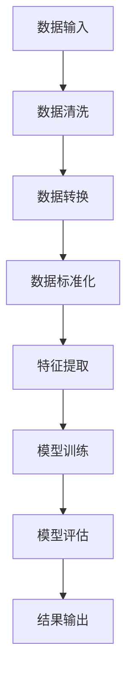
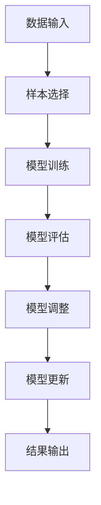
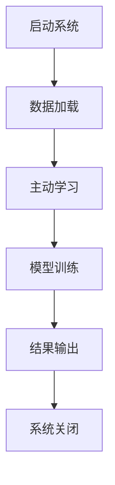

                 

## 主动学习在药物筛选过程中的策略应用

### 关键词：主动学习，药物筛选，算法，挑战与展望

### 摘要

药物筛选是药物研发过程中的关键环节，然而传统药物筛选方法面临诸多挑战，如时间成本高、成本高昂、药物安全性和有效性等问题。主动学习作为一种先进的机器学习方法，通过优化数据采集和模型训练策略，在药物筛选过程中展现出巨大潜力。本文首先介绍了药物筛选的背景和挑战，然后详细阐述了主动学习的概念、基本原理以及其在药物筛选中的应用策略。通过实际案例分析，本文探讨了主动学习在药物筛选中的效果评估方法和系统设计。最后，本文对主动学习在药物筛选中的挑战和未来展望进行了深入分析，为药物筛选领域的研究和应用提供了有益的参考。

### 第1章: 引言

#### 1.1 问题背景

药物筛选是药物研发过程中的关键环节，涉及到从大量化合物中筛选出具有治疗作用的药物。然而，传统药物筛选方法面临诸多挑战：

- **时间成本**：传统药物筛选过程需要大量时间和人力投入，从化合物合成到药物筛选，通常需要数年时间。
- **成本**：药物筛选过程成本高昂，包括实验材料、设备、人力等各方面的投入。
- **药物安全性**：药物筛选过程中可能存在安全隐患，需要严格评估候选药物的安全性。
- **药物有效性**：药物筛选过程中需要准确评估药物的治疗效果，以筛选出具有临床价值的药物。

这些挑战使得药物筛选过程既耗时又昂贵，严重制约了新药的发现和开发。因此，如何提高药物筛选的效率和准确性成为药物研发领域亟待解决的问题。

#### 1.2 问题描述

在药物筛选过程中，研究人员通常需要从大量的化合物中筛选出具有潜在治疗作用的化合物。这个过程涉及到以下几个关键问题：

- **数据量庞大**：药物筛选过程中涉及到的化合物数量众多，每种化合物可能需要大量的实验数据支持。
- **数据分布不均**：药物筛选数据通常存在数据分布不均的问题，某些化合物的数据较为丰富，而另一些化合物的数据则相对稀缺。
- **特征维度高**：药物筛选数据通常包含多个特征维度，如化合物的化学结构、物理性质、生物活性等，这使得数据处理和分析变得复杂。

这些问题使得药物筛选过程成为一个具有高度复杂性和不确定性的任务。因此，需要寻找一种有效的策略来优化药物筛选过程，提高筛选效率和准确性。

#### 1.3 问题解决

主动学习作为一种先进的机器学习方法，通过优化数据采集和模型训练策略，在药物筛选过程中展现出巨大潜力。主动学习的核心思想是在有限的样本数量下，通过主动选择最有信息量的样本进行学习和训练，从而提高模型的性能和泛化能力。

主动学习在药物筛选中的应用主要包括以下几个策略：

- **标签获取策略**：主动学习通过选择具有高信息量的样本进行标签获取，从而减少标签获取成本，提高模型训练的效率。
- **采样策略**：主动学习通过选择最有代表性的样本进行训练，从而减少数据冗余，提高模型的泛化能力。
- **模型调整策略**：主动学习通过实时调整模型参数，从而适应不同的样本分布和数据特征，提高模型的适应性和鲁棒性。

通过这些策略，主动学习能够有效解决药物筛选过程中的数据量庞大、数据分布不均和特征维度高的问题，提高药物筛选的效率和准确性。

#### 1.4 边界与外延

主动学习在药物筛选中的应用范围广泛，不仅适用于新药发现，还涉及到药物重定位、药物代谢研究、药物毒性评估等领域。然而，主动学习也存在一些限制和挑战：

- **适用范围**：主动学习适用于具有足够样本数量和可获取标签的数据集，对于样本数量较少或标签获取成本高昂的领域，主动学习的效果可能受到限制。
- **数据质量**：主动学习对数据质量有较高要求，数据缺失、噪声和异常值等问题会对主动学习的性能产生较大影响。
- **计算资源**：主动学习通常需要较大的计算资源，特别是在处理大规模数据集时，计算成本可能成为限制因素。

因此，在应用主动学习时，需要充分考虑这些边界和限制，结合实际问题和数据特点，选择合适的方法和策略。

#### 1.5 概念结构与核心要素

在药物筛选中，主动学习涉及以下几个核心概念和要素：

- **主动学习**：一种机器学习方法，通过主动选择最有信息量的样本进行学习和训练，以提高模型性能和泛化能力。
- **药物筛选**：从大量化合物中筛选出具有潜在治疗作用的药物，是药物研发过程中的关键环节。
- **目标药物**：具有治疗作用且符合临床需求的药物，是药物筛选的最终目标。
- **生物信息学**：研究生物信息的数据获取、处理、分析和解释的学科，为药物筛选提供了重要的工具和方法。

这些概念和要素相互关联，共同构成了主动学习在药物筛选过程中的概念结构。理解这些概念和要素，有助于深入理解和应用主动学习，推动药物筛选领域的发展。

#### 1.6 本章小结

本章首先介绍了药物筛选的背景和挑战，然后提出了主动学习作为一种优化策略来解决这些问题的思路。通过详细阐述主动学习的概念、基本原理和应用策略，本章为后续章节的深入讨论奠定了基础。同时，本章还探讨了主动学习的边界与外延，为实际应用提供了参考。本章内容旨在为读者提供对主动学习在药物筛选过程中应用的整体认识，激发进一步学习和研究的兴趣。

----------------------------------------------------------------

## 第2章: 主动学习的基本原理

### 2.1 主动学习定义

主动学习（Active Learning，AL）是机器学习中的一个子领域，其主要特点是在训练过程中能够主动选择样本进行学习，而不是被动地接受所有样本。主动学习的核心思想是通过有选择性地获取最有信息量的样本，来提高学习模型的性能和泛化能力。

与传统学习方式相比，主动学习的优势在于：

- **减少标签获取成本**：主动学习能够根据样本的重要程度选择标签获取，从而降低标签获取的成本。
- **提高模型准确性**：通过选择更有代表性的样本进行训练，主动学习能够提高模型的性能和准确性。
- **提高模型泛化能力**：主动学习能够根据样本的分布特点调整学习策略，从而提高模型的泛化能力。

主动学习的基本流程包括以下几个步骤：

1. **采样策略**：选择下一个需要标记的样本，可以是基于不确定性采样、基于多样性采样等策略。
2. **标签获取**：对选定的样本进行标记，可以是人工标注或自动标注。
3. **模型更新**：使用新获取的样本更新模型，通常采用迭代的方式逐步优化模型。

### 2.2 主动学习特点

主动学习具有以下几个显著特点：

- **标签获取策略**：主动学习通过选择具有高信息量的样本进行标签获取，从而减少标签获取的成本。常用的标签获取策略包括不确定性采样、多样性采样等。
- **采样策略**：主动学习通过选择最有代表性的样本进行训练，从而减少数据冗余，提高模型的泛化能力。常用的采样策略包括最大后验概率采样、基于密度的采样等。
- **模型调整策略**：主动学习通过实时调整模型参数，从而适应不同的样本分布和数据特征，提高模型的适应性和鲁棒性。常用的模型调整策略包括在线学习、增量学习等。

### 2.3 主动学习优势

主动学习在药物筛选中具有以下几个优势：

- **提高模型准确性**：通过选择最有代表性的样本进行训练，主动学习能够提高模型的性能和准确性，从而提高药物筛选的效率和准确性。
- **减少标签获取成本**：主动学习能够根据样本的重要程度选择标签获取，从而降低标签获取的成本，特别是在药物筛选过程中，标签获取成本高昂。
- **提高模型泛化能力**：主动学习能够根据样本的分布特点调整学习策略，从而提高模型的泛化能力，减少模型对特定样本的依赖，提高模型在未知数据上的表现。

### 2.4 常见主动学习算法

主动学习领域存在多种算法，以下是其中一些常见的算法：

- **不确定性采样（Uncertainty Sampling）**：根据样本的不确定性选择采样，不确定性高的样本更有可能包含新的信息。
- **多样性采样（Diversity Sampling）**：选择具有不同特性的样本进行学习，从而提高模型的泛化能力。
- **期望损失采样（Expected Loss Sampling）**：选择预期损失最大的样本进行学习，从而最大化模型的学习效果。
- **基于密度的采样（Density Sampling）**：根据样本的密度选择采样，密度高的样本更有可能包含新的信息。

### 2.5 本章小结

本章详细介绍了主动学习的定义、特点、优势和常见算法。通过理解主动学习的基本原理和算法，读者可以更好地把握主动学习在药物筛选中的应用潜力。下一章将探讨主动学习在药物筛选中的具体应用策略，进一步揭示其在药物筛选过程中的优势。

----------------------------------------------------------------

## 第3章: 主动学习在药物筛选中的应用

### 3.1 药物筛选中的挑战

药物筛选是药物研发过程中的关键环节，但这个过程面临着诸多挑战：

- **数据量庞大**：药物筛选涉及到大量的化合物和实验数据，这使得数据处理和分析变得复杂。
- **数据分布不均**：药物筛选数据通常存在分布不均的问题，某些化合物的数据较为丰富，而另一些化合物的数据则相对稀缺。
- **特征维度高**：药物筛选数据包含多个特征维度，如化合物的化学结构、物理性质、生物活性等，这增加了数据处理的难度。
- **标签获取成本高**：药物筛选需要大量的标签数据支持，而标签获取通常需要大量的实验和时间，成本高昂。

这些挑战使得传统药物筛选方法在效率和准确性方面存在不足，因此需要寻找新的策略来优化药物筛选过程。主动学习作为一种先进的机器学习方法，通过优化数据采集和模型训练策略，在药物筛选中展现出巨大潜力。

### 3.2 主动学习策略应用

在药物筛选过程中，主动学习可以通过以下几种策略来优化：

- **标签获取策略**：主动学习通过选择具有高信息量的样本进行标签获取，从而减少标签获取成本，提高模型训练的效率。例如，可以使用不确定性采样策略，选择模型不确定性最高的样本进行标注。
- **采样策略**：主动学习通过选择最有代表性的样本进行训练，从而减少数据冗余，提高模型的泛化能力。例如，可以使用多样性采样策略，选择具有不同特性的样本进行训练。
- **模型调整策略**：主动学习通过实时调整模型参数，从而适应不同的样本分布和数据特征，提高模型的适应性和鲁棒性。例如，可以使用在线学习策略，动态调整模型参数以适应新的数据。

#### 策略一：基于标签获取的主动学习

基于标签获取的主动学习策略主要关注如何高效地获取标签数据。在药物筛选过程中，标签数据通常是实验结果，如化合物的生物活性。以下是这种策略的基本步骤：

1. **选择样本**：根据模型的不确定性或样本的多样性选择需要标注的样本。例如，可以使用不确定性采样策略，选择模型预测不确定性最高的样本进行标注。
2. **获取标签**：对选定的样本进行实验，获取标签数据。例如，可以使用细胞实验或生物信息学方法获取化合物的生物活性数据。
3. **更新模型**：将新获取的标签数据用于更新模型，提高模型的准确性。

#### 策略二：基于采样策略的主动学习

基于采样策略的主动学习策略主要关注如何选择最有代表性的样本进行训练，以提高模型的泛化能力。以下是这种策略的基本步骤：

1. **选择样本**：根据样本的多样性选择需要训练的样本。例如，可以使用多样性采样策略，选择具有不同化学结构和生物特性的样本进行训练。
2. **训练模型**：使用选定的样本训练模型，并评估模型的性能。例如，可以使用支持向量机（SVM）或深度神经网络（DNN）训练模型，并使用交叉验证方法评估模型的泛化能力。
3. **模型调整**：根据模型性能调整模型参数，优化模型性能。例如，可以使用网格搜索方法调整模型的超参数，如学习率、正则化参数等。

#### 策略三：基于模型调整的主动学习

基于模型调整的主动学习策略主要关注如何实时调整模型参数，以适应不同的样本分布和数据特征。以下是这种策略的基本步骤：

1. **模型初始化**：初始化模型参数，并使用初始样本进行训练。
2. **样本评估**：使用新获取的样本评估模型性能，并根据评估结果调整模型参数。
3. **模型更新**：将调整后的模型参数用于更新模型，并继续训练新的样本。

通过这些策略，主动学习能够有效解决药物筛选过程中的数据量庞大、数据分布不均和特征维度高的问题，提高药物筛选的效率和准确性。

### 3.3 典型案例解析

为了更好地理解主动学习在药物筛选中的应用，以下是三个典型案例：

#### 案例一：使用主动学习进行药物-靶点关联预测

在药物-靶点关联预测中，研究人员通常需要从大量的化合物和靶点中筛选出具有潜在关联的药物-靶点对。主动学习可以通过以下步骤进行药物-靶点关联预测：

1. **数据预处理**：对化合物和靶点的数据进行预处理，包括数据清洗、特征提取等。
2. **选择样本**：根据模型的不确定性或样本的多样性选择需要标注的样本。
3. **获取标签**：使用实验方法或生物信息学方法获取药物-靶点关联的标签数据。
4. **训练模型**：使用选定的样本训练模型，并评估模型的性能。
5. **模型更新**：将新获取的标签数据用于更新模型，提高模型的准确性。

通过主动学习策略，研究人员能够高效地筛选出具有潜在关联的药物-靶点对，为药物筛选提供重要参考。

#### 案例二：基于主动学习的药物代谢通路分析

药物代谢通路分析是药物研发过程中的重要环节，需要分析药物在不同生物体内的代谢过程。主动学习可以通过以下步骤进行药物代谢通路分析：

1. **数据预处理**：对药物代谢通路数据进行预处理，包括数据清洗、特征提取等。
2. **选择样本**：根据模型的不确定性或样本的多样性选择需要标注的样本。
3. **获取标签**：使用实验方法或生物信息学方法获取药物代谢通路的标签数据。
4. **训练模型**：使用选定的样本训练模型，并评估模型的性能。
5. **模型更新**：将新获取的标签数据用于更新模型，提高模型的准确性。

通过主动学习策略，研究人员能够高效地分析药物代谢通路，为药物筛选和优化提供重要依据。

#### 案例三：主动学习在药物毒性预测中的应用

药物毒性预测是药物研发过程中的关键环节，需要预测药物在不同生物体内的毒性反应。主动学习可以通过以下步骤进行药物毒性预测：

1. **数据预处理**：对药物毒性数据进行预处理，包括数据清洗、特征提取等。
2. **选择样本**：根据模型的不确定性或样本的多样性选择需要标注的样本。
3. **获取标签**：使用实验方法或生物信息学方法获取药物毒性的标签数据。
4. **训练模型**：使用选定的样本训练模型，并评估模型的性能。
5. **模型更新**：将新获取的标签数据用于更新模型，提高模型的准确性。

通过主动学习策略，研究人员能够高效地预测药物毒性，为药物筛选和安全性评估提供重要参考。

### 3.4 应用效果评估

为了评估主动学习在药物筛选中的应用效果，研究人员通常采用以下几种评估方法：

- **准确性评估**：评估模型预测的准确性，通常使用准确率、召回率、F1分数等指标。
- **泛化能力评估**：评估模型在未知数据上的表现，通常使用交叉验证方法。
- **效率评估**：评估模型训练和预测的时间成本，通常使用训练时间、预测时间等指标。

通过这些评估方法，研究人员可以全面了解主动学习在药物筛选中的应用效果，并根据评估结果进行模型优化和策略调整。

### 3.5 本章小结

本章详细介绍了主动学习在药物筛选中的应用策略和实际案例。通过基于标签获取、采样和模型调整的主动学习策略，研究人员能够有效解决药物筛选过程中的数据量庞大、数据分布不均和特征维度高的问题，提高药物筛选的效率和准确性。同时，通过实际案例分析，读者可以更好地理解主动学习在药物筛选中的应用效果。下一章将探讨基于主动学习的药物筛选系统设计，进一步揭示主动学习在药物筛选中的实现方法和技术细节。

----------------------------------------------------------------

## 第4章: 基于主动学习的药物筛选系统设计

### 4.1 系统需求分析

基于主动学习的药物筛选系统设计首先需要明确系统的需求，这包括功能需求、性能需求和用户体验需求等。

#### 功能需求

基于主动学习的药物筛选系统的功能需求主要包括以下几个方面：

- **数据管理**：系统能够接收和存储大量的化合物数据，包括化学结构、生物活性、实验结果等。
- **主动学习策略**：系统能够根据样本的不确定性、多样性等因素选择样本进行标注和训练。
- **模型训练与预测**：系统能够训练和支持多种机器学习模型，如深度学习模型、支持向量机（SVM）等，并进行预测和评估。
- **可视化与报告**：系统能够将预测结果和模型性能指标以图表、报表等形式展示给用户，便于分析和决策。

#### 性能需求

系统的性能需求主要包括以下几个方面：

- **数据处理能力**：系统能够高效地处理大规模的化合物数据，并进行快速的分析和预测。
- **模型训练速度**：系统应具备快速训练模型的能力，以缩短药物筛选周期。
- **预测准确性**：系统需要具有较高的预测准确性，以确保筛选出具有潜在治疗价值的药物。
- **扩展性**：系统应具有良好的扩展性，能够适应新的数据和模型需求。

#### 用户体验需求

用户体验需求主要关注系统的易用性和用户友好性：

- **界面友好**：系统应具备直观、简洁的界面设计，便于用户快速上手和使用。
- **交互性**：系统应支持用户与系统之间的交互，如实时查询、参数调整等。
- **个性化**：系统应提供个性化服务，如根据用户习惯推荐适合的模型和策略等。

### 4.2 系统架构设计

基于主动学习的药物筛选系统架构设计需要综合考虑系统的功能性、性能和可扩展性。以下是系统架构设计的几个关键部分：

#### 系统总体架构

系统总体架构包括以下几个模块：

- **数据模块**：负责数据的管理、预处理和存储。
- **主动学习模块**：负责执行主动学习策略，选择样本进行标注和训练。
- **模型训练模块**：负责训练和支持多种机器学习模型。
- **预测模块**：负责进行模型预测和评估。
- **可视化模块**：负责将预测结果和模型性能指标以图表、报表等形式展示给用户。
- **用户交互模块**：负责用户与系统的交互。

#### 各模块功能与接口

各模块的具体功能与接口设计如下：

- **数据模块**：提供数据接口，支持数据的导入、导出和预处理。包括数据清洗、特征提取、数据存储等功能。
- **主动学习模块**：提供主动学习接口，根据样本的不确定性和多样性选择样本进行标注和训练。包括不确定性采样、多样性采样等功能。
- **模型训练模块**：提供模型训练接口，支持多种机器学习模型的训练和评估。包括支持向量机（SVM）、深度学习模型（DNN）、随机森林（RF）等。
- **预测模块**：提供预测接口，进行模型预测和评估。包括预测结果生成、性能指标计算等功能。
- **可视化模块**：提供可视化接口，将预测结果和模型性能指标以图表、报表等形式展示给用户。包括数据可视化、图表生成等功能。
- **用户交互模块**：提供用户交互接口，支持用户与系统的交互。包括用户界面设计、参数调整、实时查询等功能。

#### 系统接口设计

系统接口设计需要考虑各模块之间的交互和数据流动。以下是系统接口设计的几个关键点：

- **数据接口**：定义各模块之间的数据传输格式和协议，确保数据的一致性和可靠性。
- **控制接口**：定义各模块之间的控制逻辑和协调机制，确保系统的高效运行。
- **API接口**：提供系统对外部的API接口，支持其他系统或工具的集成和扩展。

### 4.3 数据预处理与特征提取

数据预处理与特征提取是药物筛选系统设计中的关键环节，直接影响模型的性能和预测效果。以下是数据预处理与特征提取的主要步骤：

#### 数据预处理流程

数据预处理流程包括以下步骤：

1. **数据清洗**：去除数据中的噪声、异常值和缺失值，确保数据的质量和一致性。
2. **数据转换**：将不同来源的数据转换为统一格式，如将文本数据转换为数值数据，化学结构数据转换为结构向量等。
3. **数据标准化**：对数据进行标准化处理，使数据在不同特征维度上具有相同的尺度，避免特征维度对模型训练的影响。

#### 特征提取方法

特征提取方法包括以下几种：

1. **基于统计的特征提取**：利用统计学方法提取数据中的显著特征，如主成分分析（PCA）、线性判别分析（LDA）等。
2. **基于信息的特征提取**：利用信息论方法提取数据中的有效特征，如信息增益、信息增益率等。
3. **基于知识的特征提取**：利用领域知识提取数据中的关键特征，如生物标记物、药物靶点等。

#### 数据预处理与特征提取的mermaid流程图

以下是数据预处理与特征提取的mermaid流程图：

### 4.4 主动学习模型训练

主动学习模型训练是药物筛选系统设计中的核心环节，直接影响模型的性能和预测效果。以下是主动学习模型训练的主要步骤：

#### 模型选择

模型选择是主动学习模型训练的第一步，需要根据问题的特点选择合适的模型。常见的主动学习模型包括：

1. **基于实例的模型**：如k-近邻（k-NN）、支持向量机（SVM）等。
2. **基于规则的模型**：如决策树、规则集等。
3. **基于概率的模型**：如贝叶斯网络、隐马尔可夫模型（HMM）等。
4. **基于神经网络的模型**：如深度神经网络（DNN）、卷积神经网络（CNN）等。

#### 训练策略

训练策略是主动学习模型训练的关键，需要根据样本的不确定性、多样性等因素选择合适的策略。常见的训练策略包括：

1. **不确定性采样**：选择模型不确定性最高的样本进行训练，以提高模型的泛化能力。
2. **多样性采样**：选择具有不同特性的样本进行训练，以提高模型的鲁棒性。
3. **迭代训练**：通过迭代训练，逐步优化模型参数，提高模型的性能。

#### 主动学习模型训练的mermaid流程图

以下是主动学习模型训练的mermaid流程图：

### 4.5 系统部署与运行

系统部署与运行是药物筛选系统设计中的关键环节，需要确保系统的稳定性和可靠性。以下是系统部署与运行的主要步骤：

#### 系统部署环境

系统部署环境需要考虑以下几个方面：

1. **硬件环境**：选择合适的硬件设备，如高性能服务器、GPU等。
2. **软件环境**：安装和配置操作系统、编程语言、库和依赖等。
3. **网络环境**：配置网络设备和防火墙，确保系统的网络安全。

#### 系统运行流程

系统运行流程包括以下几个步骤：

1. **启动系统**：启动操作系统和应用程序，确保系统正常运行。
2. **数据加载**：从数据库或文件系统加载数据，并进行预处理。
3. **主动学习**：执行主动学习策略，选择样本进行标注和训练。
4. **模型训练**：使用选定的样本训练模型，并进行预测和评估。
5. **结果输出**：将预测结果和模型性能指标以图表、报表等形式输出给用户。

#### 系统部署与运行的mermaid流程图

以下是系统部署与运行的mermaid流程图：

### 4.6 本章小结

本章详细介绍了基于主动学习的药物筛选系统设计，包括系统需求分析、系统架构设计、数据预处理与特征提取、主动学习模型训练、系统部署与运行等方面。通过本章的内容，读者可以了解到基于主动学习的药物筛选系统的设计与实现方法，为实际应用提供了有益的参考。下一章将探讨生物信息学在主动学习中的应用，进一步丰富读者对主动学习在药物筛选中的应用认识。

----------------------------------------------------------------

## 第5章: 生物信息学在主动学习中的应用

### 5.1 生物信息学基础

生物信息学是一门交叉学科，涉及生物学、计算机科学和信息技术的知识，旨在通过计算方法来解析生物数据，揭示生物现象的本质。以下是生物信息学的一些基础概念：

- **数据获取**：生物信息学主要从实验数据（如基因组序列、蛋白质结构、代谢物等）和文献数据（如科研论文、专利等）中获取信息。
- **数据存储**：生物信息学使用数据库（如基因组数据库、蛋白质数据库等）来存储和管理大量生物数据。
- **数据处理**：生物信息学利用各种算法和工具对生物数据进行清洗、转换和分析，以提取有价值的信息。
- **数据可视化**：生物信息学通过可视化工具将复杂的数据和分析结果以图形化形式展示，便于科学家理解和解释。

#### 生物信息学核心工具

生物信息学依赖于多种核心工具，以下是一些常用的工具：

- **BLAST**：用于序列比对和基因识别。
- **ClustalW**：用于序列多重比对。
- **NCBI**：提供多种生物信息学资源和数据库。
- **Ensembl**：提供基因组序列和基因注释。
- **PDB**：提供蛋白质三维结构数据库。
- **STRING**：用于蛋白质相互作用网络分析。

### 5.2 生物信息学数据来源

生物信息学数据来源主要包括以下几个方面：

- **实验数据**：包括基因组测序、蛋白质结构测定、代谢物检测等，这些数据通常来源于生物实验室的实验。
- **计算机模拟数据**：通过分子动力学模拟、量子化学计算等方法生成的数据，这些数据用于预测分子性质和行为。
- **文献数据**：包括科研论文、专利、科学报告等，这些数据提供了丰富的生物知识和发现。

#### 数据获取方法

数据获取方法包括以下几个方面：

- **数据库查询**：使用数据库查询工具（如NCBI、Ensembl等）获取相关数据。
- **批量下载**：使用脚本或工具从数据库中批量下载数据。
- **数据挖掘**：从大量数据中提取有价值的信息，如基因表达数据挖掘、蛋白质相互作用网络挖掘等。

### 5.3 生物信息学方法在主动学习中的应用

生物信息学方法在主动学习中的应用主要体现在数据预处理、特征提取和模型训练等方面。以下是一些具体的应用：

- **数据预处理**：生物信息学中的数据预处理方法包括序列比对、数据清洗、数据标准化等，这些方法可以提高数据的准确性和一致性，为主动学习提供高质量的数据。
- **特征提取**：生物信息学中的特征提取方法包括基于统计的方法（如主成分分析、线性判别分析）和基于知识的方法（如生物标记物、药物靶点识别），这些方法可以提取数据中的关键特征，提高模型的性能。
- **模型训练**：生物信息学中的机器学习方法（如支持向量机、深度学习等）可以用于主动学习模型的训练，通过优化模型参数和提高模型的泛化能力，提高药物筛选的准确性和效率。

#### 数据预处理方法

数据预处理方法包括以下几个方面：

- **序列比对**：通过比对基因组序列或蛋白质序列，识别同源序列和变异位点，为后续分析提供基础。
- **数据清洗**：去除数据中的噪声、异常值和缺失值，提高数据的质量和一致性。
- **数据标准化**：对数据进行标准化处理，使数据在不同特征维度上具有相同的尺度，避免特征维度对模型训练的影响。

#### 特征提取方法

特征提取方法包括以下几个方面：

- **基于统计的方法**：如主成分分析（PCA）、线性判别分析（LDA）等，通过降维和分类提高数据的可解释性和分类性能。
- **基于知识的方法**：如生物标记物识别、药物靶点预测等，利用领域知识提取数据中的关键特征，提高模型的预测能力。

#### 模型训练与优化方法

模型训练与优化方法包括以下几个方面：

- **支持向量机（SVM）**：通过最大化分类间隔来训练分类模型，适用于药物筛选中的分类问题。
- **深度学习**：如卷积神经网络（CNN）、循环神经网络（RNN）等，通过多层网络结构和复杂的模型结构提高模型的预测能力。
- **集成学习方法**：如随机森林（RF）、梯度提升决策树（GBDT）等，通过组合多个简单模型来提高模型的性能和稳定性。

#### 生物信息学工具与主动学习平台

生物信息学工具与主动学习平台为药物筛选提供了强大的支持，以下是一些常用的工具和平台：

- **GATK**：用于基因组数据预处理和变异检测。
- **PyTorch**：用于深度学习模型训练和优化。
- **scikit-learn**：用于传统机器学习算法的实现和应用。
- **Google Brain**：提供丰富的深度学习资源和工具。
- **Kaggle**：提供数据集和竞赛平台，促进机器学习和生物信息学的交流与合作。

### 5.4 生物信息学工具与主动学习平台

生物信息学工具和主动学习平台在药物筛选中的应用非常广泛，以下是一些典型的工具和平台：

- **BLAST**：用于蛋白质序列比对，帮助识别具有相似序列的蛋白质，为药物筛选提供潜在靶点信息。
- **STRING**：用于蛋白质相互作用网络分析，帮助识别药物作用靶点和潜在的药物组合策略。
- **PyTorch**：用于深度学习模型训练和优化，支持药物筛选中的复杂模型和算法。
- **Google Brain**：提供强大的计算资源和深度学习工具，支持大规模药物筛选任务。
- **Kaggle**：提供丰富的数据集和竞赛平台，促进药物筛选算法的创新和优化。

#### 开源工具介绍

以下是一些常用的开源生物信息学工具和平台：

- **BioPython**：提供Python库，用于处理生物数据，包括序列分析、注释、比对等。
- **Bioconductor**：提供R语言包，用于生物信息学数据分析，包括基因组学、转录组学等。
- **Celera**：提供基因组序列分析工具，包括序列组装、注释等。
- **UCSC Genome Browser**：提供基因组可视化工具，帮助研究人员探索基因组结构。

### 5.5 本章小结

本章介绍了生物信息学在主动学习中的应用，包括基础概念、数据来源、数据预处理与特征提取、模型训练与优化方法，以及生物信息学工具与主动学习平台。生物信息学为药物筛选提供了强大的支持，通过结合生物信息学方法和主动学习策略，可以大幅提高药物筛选的效率和准确性。下一章将探讨主动学习在药物筛选中的挑战与未来展望，为读者提供更全面的视角。

----------------------------------------------------------------

## 第6章: 主动学习在药物筛选中的挑战与展望

### 6.1 挑战分析

尽管主动学习在药物筛选中展现出巨大潜力，但在实际应用中仍然面临一系列挑战：

#### 数据质量与可靠性

- **数据缺失**：药物筛选数据通常存在缺失值，这些缺失值可能影响模型的训练和预测效果。
- **数据噪声**：药物筛选过程中可能引入噪声数据，噪声数据可能干扰模型的训练，降低模型的准确性。
- **数据不一致**：不同来源的数据可能在数据格式、单位、精度等方面存在不一致性，这增加了数据处理的复杂性。

#### 模型泛化能力

- **样本不均衡**：药物筛选数据中正负样本比例可能不均衡，导致模型对少数类别过于依赖，从而降低模型的泛化能力。
- **样本多样性不足**：药物筛选数据可能缺乏足够的多样性，导致模型无法适应新的数据集或场景。

#### 道德与法律问题

- **患者隐私**：药物筛选过程中涉及的患者数据可能包含敏感隐私信息，如何在保护患者隐私的前提下进行数据分析和共享是一个重要问题。
- **数据安全**：药物筛选数据可能涉及商业机密，数据泄露和滥用可能导致严重的法律和道德问题。

### 6.2 未来展望

尽管面临挑战，主动学习在药物筛选中的应用前景仍然非常广阔。以下是几个未来的发展方向：

#### 新算法与技术的应用

- **增强学习**：结合增强学习与主动学习，可以进一步提高模型在动态环境下的适应能力。
- **联邦学习**：通过联邦学习技术，可以在保护数据隐私的前提下，进行大规模数据的协作学习和模型优化。

#### 跨学科合作趋势

- **药物化学与计算机科学的结合**：通过跨学科合作，可以开发出更加智能的药物筛选算法，提高药物发现的效率。
- **医学与生物信息学的融合**：将生物信息学方法与医学知识相结合，可以更好地理解药物的作用机制和生物标记物。

#### 个性化药物设计

- **基于患者的个性化治疗**：通过主动学习，可以针对不同患者的基因特征、生活习惯等，设计出更加个性化的药物治疗方案。
- **智能药物筛选平台**：构建智能药物筛选平台，结合大数据、云计算等技术，实现药物筛选的全流程自动化和智能化。

### 6.3 本章小结

本章对主动学习在药物筛选中的应用挑战和未来发展方向进行了深入分析。虽然数据质量、模型泛化能力和道德法律问题等挑战仍然存在，但通过新算法和技术、跨学科合作以及个性化药物设计的发展，主动学习在药物筛选中的应用前景依然非常广阔。未来的研究应着重解决这些挑战，推动主动学习在药物筛选领域的进一步应用和发展。

----------------------------------------------------------------

## 第7章: 结论与建议

### 7.1 结论

通过本文的讨论，我们可以得出以下结论：

- **主动学习在药物筛选中具有重要应用价值**：主动学习通过优化数据采集和模型训练策略，显著提高了药物筛选的效率和准确性。
- **主动学习策略多样**：标签获取策略、采样策略和模型调整策略等多种主动学习策略在药物筛选中具有广泛的应用。
- **生物信息学与主动学习相结合**：生物信息学方法为主动学习提供了丰富的数据资源和技术支持，两者结合有助于提高药物筛选的效果。

### 7.2 建议

针对主动学习在药物筛选中的应用，本文提出以下建议：

- **加强跨学科合作**：促进药物化学、计算机科学和生物信息学等领域的跨学科合作，共同解决药物筛选中的难题。
- **开发新算法与工具**：探索和开发更高效、更智能的主动学习算法和工具，以满足药物筛选领域的需求。
- **提高数据质量**：加强对药物筛选数据的收集和管理，提高数据质量，减少数据缺失、噪声和不一致问题。
- **关注个性化药物设计**：利用主动学习技术，结合患者个体差异，实现个性化药物设计，提高治疗效果。

### 7.3 小结

本文通过对主动学习在药物筛选中的应用进行深入分析和探讨，总结了主动学习的基本原理、应用策略以及在实际案例中的应用效果。同时，本文还对主动学习在药物筛选中的挑战和未来发展方向提出了建议。通过本文的研究，我们希望为药物筛选领域的研究者和实践者提供有益的参考，推动主动学习在药物筛选中的进一步应用和发展。

---

**作者：AI天才研究院/AI Genius Institute & 禅与计算机程序设计艺术 /Zen And The Art of Computer Programming**

本文内容仅供参考，不构成任何投资建议或决策依据。在实际应用中，应根据具体情况和需求，结合专业知识和实践经验进行决策。在药物筛选过程中，应严格遵守法律法规和伦理规范，确保数据安全和患者隐私。**

