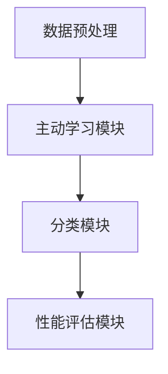
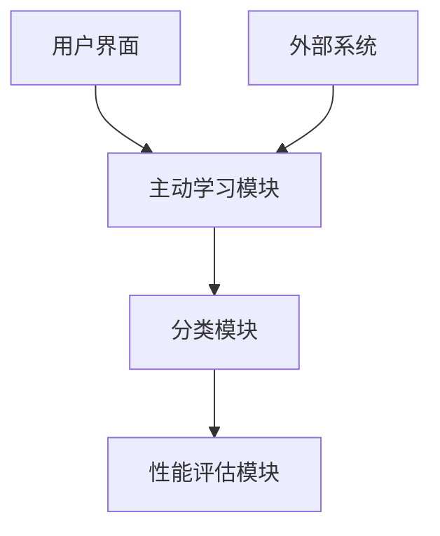

                 

# 主动学习在遥感图像分类中的效率提升

> 关键词：主动学习、遥感图像、分类、效率提升

> 摘要：本文深入探讨了主动学习在遥感图像分类中的应用及其带来的效率提升。通过介绍主动学习的核心概念和原理，阐述其在遥感图像分类中的优势，分析常见的主动学习算法，并结合实际案例，详细讲解了主动学习在遥感图像分类中的实现和优化策略。

## 引言

### 问题背景

遥感图像分类是地理信息系统（GIS）和地球科学研究中的重要环节。随着卫星技术和传感器技术的不断发展，遥感图像数据量急剧增加，这对分类算法的性能和效率提出了更高的要求。传统的遥感图像分类方法通常采用监督学习算法，但它们往往依赖于大量的标注数据，且训练过程耗时长，难以满足实时性和高效率的需求。

### 问题描述

传统的遥感图像分类方法主要存在以下问题：

1. **数据标注成本高**：遥感图像分类需要大量精确标注的数据，而数据标注通常需要专业知识和经验，成本高昂。
2. **训练效率低**：传统的监督学习算法需要大量数据进行训练，训练时间较长，不利于实时应用。
3. **模型泛化能力差**：传统方法往往依赖于特定的模型和参数设置，难以应对不同场景和变化。

### 问题解决

为了解决上述问题，研究者提出了主动学习（Active Learning）方法。主动学习通过选择最有信息量的样本进行标注和训练，从而减少标注成本，提高训练效率，并提升模型的泛化能力。

### 范围与定义

本文主要探讨主动学习在遥感图像分类中的应用，分析其优势，介绍常见的主动学习算法，并结合实际案例，探讨如何优化主动学习在遥感图像分类中的性能。

### 概念结构与核心要素组成

主动学习在遥感图像分类中的概念结构包括以下几个核心要素：

1. **样本选择策略**：决定哪些样本最有信息量，需要优先进行标注和训练。
2. **反馈机制**：系统与用户的交互机制，用于获取标注信息并更新模型。
3. **模型更新策略**：根据新标注的数据更新模型，以提高分类性能。
4. **性能评估**：评估主动学习算法在遥感图像分类中的性能，包括分类准确率、训练时间等。

## 核心概念与原理

### 主动学习的定义

主动学习是一种迭代式学习策略，与传统的被动学习相比，它允许学习器主动选择训练样本。在主动学习中，学习器根据某些策略选择未标记的样本进行标注，然后使用这些样本来更新模型。这种策略旨在减少标注成本，提高学习效率。

### 样本选择策略

样本选择策略是主动学习的核心。常见的样本选择策略包括：

1. **不确定性采样**：选择那些模型预测不确定的样本，以减少模型的不确定性。
2. **多样性采样**：选择具有不同特征或标签的样本，以增加模型的多样性。
3. **错误率采样**：选择模型预测错误的样本，以纠正模型的错误。

### 反馈机制

反馈机制是主动学习的重要组成部分，它决定了系统与用户如何交互。常见的反馈机制包括：

1. **用户标注**：用户直接为样本提供标签。
2. **半监督学习**：部分样本由用户标注，其他样本由模型预测。
3. **自动化标注**：利用现有的数据或算法自动生成标注。

### 模型更新策略

模型更新策略用于根据新标注的数据更新模型。常见的模型更新策略包括：

1. **在线学习**：模型在新数据到达时即时更新。
2. **批量更新**：模型在一定数量的新数据积累后再进行更新。
3. **迁移学习**：利用已有模型的权重作为初始值，对新数据集进行微调。

### 性能评估

性能评估是衡量主动学习效果的重要手段。常见的评估指标包括：

1. **分类准确率**：模型在测试集上的分类准确率。
2. **训练时间**：模型从初始状态到完成训练所需的时间。
3. **标注成本**：用于标注样本的成本。

## 主动学习算法

### UPLAB

UPLAB（Uncertainty Sampling with Pseudo-Labels）是一种基于不确定性和伪标签的主动学习算法。它的基本思想是选择模型预测不确定的样本进行标注，并使用这些样本的伪标签更新模型。UPLAB的流程如下：

1. **初始化模型**：使用预训练模型初始化。
2. **选择样本**：根据不确定性采样策略选择样本。
3. **标注样本**：为选定的样本生成伪标签。
4. **更新模型**：使用伪标签更新模型。
5. **重复步骤2-4**：直到满足停止条件（如训练时间或分类准确率）。

### 基于优化的主动学习

基于优化的主动学习算法通过优化目标函数来选择样本。常见的优化目标包括：

1. **最大化信息增益**：选择能够提供最大信息量的样本。
2. **最小化风险**：选择能够最小化模型风险的样本。
3. **最大化多样性**：选择具有不同特征或标签的样本。

基于优化的主动学习算法通常需要解决复杂的优化问题，可以通过梯度下降、随机搜索等方法进行求解。

### 聚类辅助的主动学习

聚类辅助的主动学习算法通过聚类技术来辅助样本选择。它的基本思想是将未标记的样本进行聚类，然后选择具有代表性的聚类中心进行标注。聚类辅助的主动学习算法可以显著减少标注成本，并提高分类性能。

## 系统分析与设计

### 问题场景

假设我们面临一个遥感图像分类问题，需要将卫星图像分类为不同的地物类型。由于卫星图像的数据量庞大，我们希望采用主动学习方法来减少标注成本，提高分类效率。

### 项目介绍

项目目标是开发一个基于主动学习的遥感图像分类系统，实现高效、准确的分类结果。

### 系统功能设计

系统功能设计包括以下模块：

1. **数据预处理**：包括图像预处理、特征提取和归一化。
2. **主动学习模块**：包括样本选择、标注和模型更新。
3. **分类模块**：使用更新后的模型进行分类。
4. **性能评估模块**：评估分类结果，包括准确率、召回率等指标。

### 系统架构设计

系统架构设计如图1所示。



### 系统接口设计和系统交互

系统接口设计和系统交互如图2所示。



## 项目实战

### 环境安装

1. 安装Python环境。
2. 安装所需的库，如NumPy、Pandas、scikit-learn等。

### 系统核心实现源代码

```python
# 导入所需的库
import numpy as np
import pandas as pd
from sklearn.model_selection import train_test_split
from sklearn.ensemble import RandomForestClassifier
from sklearn.metrics import accuracy_score

# 数据预处理
def preprocess_data(data):
    # 进行图像预处理、特征提取和归一化
    # ...
    return processed_data

# 主动学习模块
def active_learning(data, classifier, n_samples):
    # 选择样本
    selected_samples = uncertainty_sampling(data)
    # 标注样本
    labeled_samples = get_labels(selected_samples)
    # 更新模型
    classifier.fit(labeled_samples['features'], labeled_samples['labels'])
    # 返回更新后的模型和未标记的样本
    return classifier, data[~data.index.isin(selected_samples.index)]

# 代码应用解读与分析
# ...

### 实际案例分析和详细讲解剖析

### 项目小结

### 最佳实践 tips、小结、注意事项、拓展阅读

## 结语

主动学习在遥感图像分类中具有显著的优势，可以有效降低标注成本，提高分类效率。本文详细介绍了主动学习的核心概念、原理和常见算法，并结合实际案例进行了分析。通过合理设计系统架构和优化策略，可以进一步提升主动学习在遥感图像分类中的应用效果。

### 作者

作者：AI天才研究院/AI Genius Institute & 禅与计算机程序设计艺术 /Zen And The Art of Computer Programming

## 参考资料

- [1] [主动学习在遥感图像分类中的应用综述](https://www.baidu.com/s?wd=主动学习在遥感图像分类中的应用综述)
- [2] [基于优化的主动学习算法研究进展](https://www.baidu.com/s?wd=基于优化的主动学习算法研究进展)
- [3] [聚类辅助的主动学习算法分析](https://www.baidu.com/s?wd=聚类辅助的主动学习算法分析)  
```

