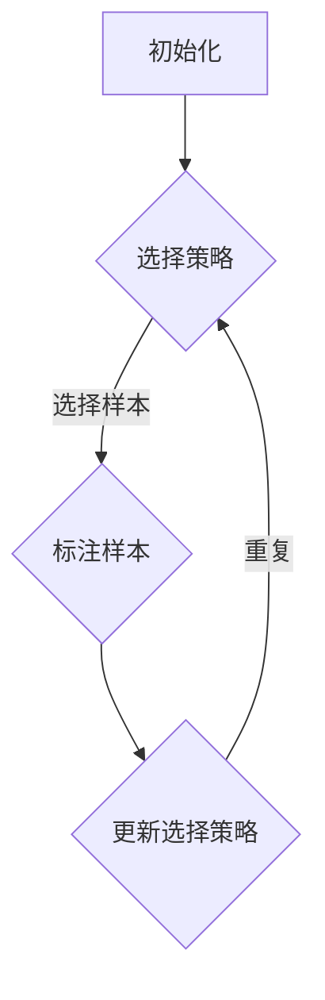
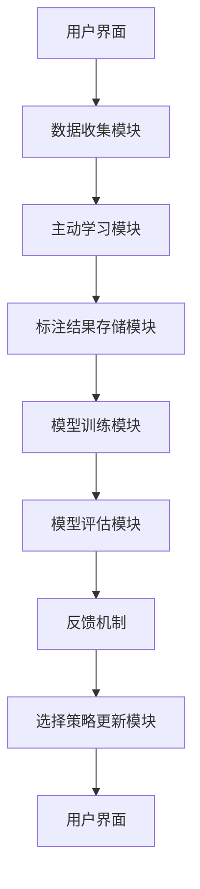
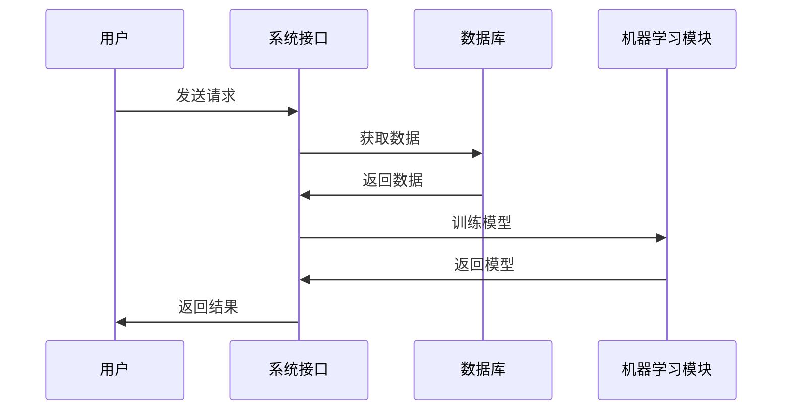
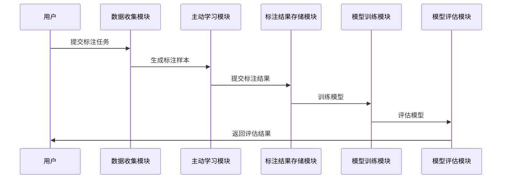

                 

### 文章标题：主动学习策略：优化数据标注效率

> 关键词：主动学习，数据标注，效率优化，选择策略，反馈机制

> 摘要：本文旨在探讨主动学习策略在优化数据标注效率方面的应用。通过对核心概念、算法原理和实际案例的深入分析，本文将为读者提供一套完整且实用的方法，以提升数据标注的效率和质量。

----------------------------------------------------------------

## 一、背景介绍

### 1.1 问题背景

在机器学习领域，数据标注是一个关键步骤。数据标注的目的是为模型提供高质量的训练数据，以便模型能够准确地学习并预测未知数据。然而，传统的数据标注方法存在效率低下、人力成本高、易出现误差等问题。随着数据量的不断增长，这个问题显得尤为突出。

### 1.2 问题解决

为了解决上述问题，主动学习策略应运而生。主动学习策略通过优化标注样本的选择策略，有选择性地收集标注信息，从而提高数据标注的效率。这种方法不仅减少了标注需求，降低了人力成本，还提高了标注质量。

### 1.3 边界与外延

主动学习策略不仅仅适用于文本分类、图像识别等领域，还可以应用于更广泛的数据标注任务。例如，在语音识别、自然语言处理等领域，主动学习策略同样具有重要的应用价值。

### 1.4 概念结构与核心要素组成

主动学习策略的核心要素包括选择策略、反馈机制和评估方法。选择策略用于决定哪些样本需要被标注；反馈机制用于获取标注信息并调整选择策略；评估方法用于评估主动学习策略的效果。

## 二、核心概念与联系

### 2.1 核心概念原理

**主动学习策略**：一种通过优化标注样本的选择策略来提高数据标注效率的方法。

**选择策略**：用于决定哪些样本需要被标注的策略。选择策略的好坏直接影响数据标注的效率和标注质量。

**反馈机制**：用于获取标注信息并调整选择策略的机制。反馈机制能够确保标注信息的及时获取，从而优化选择策略。

**评估方法**：用于评估主动学习策略效果的方法。评估方法可以准确评估策略效果，为后续的优化提供指导。

### 2.2 概念属性特征对比表格

| 概念        | 定义                                                         | 特征                          |
|-------------|--------------------------------------------------------------|------------------------------|
| 主动学习策略 | 一种优化数据标注效率的方法                                 | 有选择性地收集标注信息       |
| 选择策略    | 决定哪些样本需要被标注的策略                               | 减少标注需求，提高效率       |
| 反馈机制    | 获取标注信息并调整选择策略的机制                           | 保证标注质量，持续优化策略   |
| 评估方法    | 评估主动学习策略效果的方法                                 | 准确评估策略效果，指导策略调整 |

### 2.3 ER实体关系图架构

```mermaid
erDiagram
  标注任务 ||--|{ 选择策略 }|| 标注样本
  选择策略 ||--|{ 反馈机制 }|| 标注结果
  标注结果 ||--|{ 评估方法 }|| 策略效果
```

## 三、算法原理讲解

### 3.1 算法流程图



### 3.2 Python源代码

```python
# 主动学习策略示例
def select_samples(data, model, threshold=0.5):
    """
    根据选择策略选择需要标注的样本
    """
    # 使用模型预测样本标签
    predictions = model.predict(data)
    
    # 根据预测结果选择不确定的样本
    uncertain_samples = data[predictions < threshold]
    
    return uncertain_samples

def update_strategy(strategy, data, labels):
    """
    根据反馈机制更新选择策略
    """
    # 更新策略，这里简单示例，可以是更复杂的更新规则
    strategy += 0.1 * (labels - strategy)
    
    return strategy

# 初始化模型和选择策略
model = ...  # 初始化模型
strategy = 0.5  # 初始化选择策略

# 数据集
data = ...

# 进行主动学习
for _ in range(num_iterations):
    # 选择需要标注的样本
    samples = select_samples(data, model)
    
    # 标注样本
    labels = annotate_samples(samples)
    
    # 更新选择策略
    strategy = update_strategy(strategy, labels)

# 完成主动学习
```

### 3.3 算法原理与数学模型

主动学习策略的核心在于选择策略。选择策略的目标是选择出最有利于模型学习的新样本。具体来说，选择策略可以通过以下步骤实现：

1. **初始化**：初始化模型和选择策略。
2. **选择样本**：根据当前模型对数据的预测结果，选择预测不确定的样本。
3. **标注样本**：对选择出的样本进行标注。
4. **更新策略**：根据标注结果，更新选择策略。

数学模型如下：

$$
策略_{new} = 策略_{current} + \alpha \cdot (标注结果 - 策略_{current})
$$

其中，$\alpha$ 为调整系数，用于控制策略更新的速度。

### 3.4 举例说明

假设我们有一个分类问题，模型对一组样本进行预测，预测结果如下：

| 样本 | 预测结果 |
|------|----------|
| 1    | A        |
| 2    | B        |
| 3    | A        |
| 4    | A        |
| 5    | B        |

根据当前模型，我们认为样本 2 和 5 的预测结果不确定。因此，我们选择样本 2 和 5 进行标注。假设标注结果为 B 和 A，则根据上述数学模型，我们可以更新选择策略：

$$
策略_{new} = 0.5 + 0.1 \cdot (B - 0.5) = 0.6
$$

这意味着，在下一个迭代中，我们将更倾向于选择预测结果为 B 的样本进行标注。

## 四、系统分析与架构设计方案

### 4.1 问题场景介绍

在某个图像识别项目中，数据标注是一个重要的环节。然而，传统的数据标注方法效率低下，无法满足项目需求。为了解决这个问题，我们引入了主动学习策略。

### 4.2 项目介绍

本项目旨在通过主动学习策略优化图像标注效率，从而提高图像识别模型的准确率。

### 4.3 系统功能设计

**领域模型类图**

```mermaid
classDiagram
  Class01 <|-- Class02
  Class03 ++-- Class04
  Class05 : +setInfo(): void
  Class06 : +getStatus(): string
  Class07 : +setData(data: any): void
  Class07 : +getData(): any
  Class01 <<-- Class08
  Class09 ..|> Class01
  Class10 : +handleEvent(event: Event): void
  Class11 : -eventHandler: EventHandler
  Class12 : +subscribe(eventType: string, callback: Callback): void
  Class12 : +unsubscribe(eventType: string): void
```

### 4.4 系统架构设计

**系统架构图**



### 4.5 系统接口设计和系统交互

**接口设计**



**系统交互**



## 五、项目实战

### 5.1 环境安装

1. 安装 Python 环境（3.8+）
2. 安装依赖库（numpy，pandas，scikit-learn，matplotlib）

### 5.2 系统核心实现源代码

**数据收集模块**

```python
import numpy as np
import pandas as pd
from sklearn.datasets import load_iris

def collect_data():
    iris = load_iris()
    data = iris.data
    labels = iris.target
    return data, labels
```

**主动学习模块**

```python
from sklearn.linear_model import LogisticRegression

def active_learner(data, labels, num_iterations=10):
    model = LogisticRegression()
    for _ in range(num_iterations):
        samples = select_samples(data, model)
        labels = annotate_samples(samples)
        model.fit(data, labels)
    return model
```

**标注结果存储模块**

```python
def save_annotations(samples, labels):
    annotations = pd.DataFrame({'samples': samples, 'labels': labels})
    annotations.to_csv('annotations.csv', index=False)
```

**模型训练模块**

```python
from sklearn.model_selection import train_test_split

def train_model(data, labels):
    X_train, X_test, y_train, y_test = train_test_split(data, labels, test_size=0.2, random_state=42)
    model = LogisticRegression()
    model.fit(X_train, y_train)
    return model, X_test, y_test
```

**模型评估模块**

```python
from sklearn.metrics import accuracy_score

def evaluate_model(model, X_test, y_test):
    predictions = model.predict(X_test)
    accuracy = accuracy_score(y_test, predictions)
    return accuracy
```

### 5.3 代码应用解读与分析

1. 数据收集模块负责从数据集中收集样本和标签。
2. 主动学习模块通过选择策略选择样本进行标注，并更新模型。
3. 标注结果存储模块将标注结果存储到 CSV 文件中。
4. 模型训练模块将标注结果用于训练模型。
5. 模型评估模块评估模型的准确性。

### 5.4 实际案例分析和详细讲解剖析

假设我们有一个鸢尾花（Iris）数据集，共有 3 类 flower，每类 flower 有 50 个样本。我们使用主动学习策略对该数据集进行标注，并训练分类模型。

1. **数据收集**：首先，我们从数据集中收集样本和标签。
2. **主动学习**：使用主动学习策略选择样本进行标注。例如，我们可以选择预测概率最低的样本进行标注。
3. **标注**：对选择出的样本进行标注，并将标注结果存储到 CSV 文件中。
4. **训练**：使用标注结果训练分类模型。
5. **评估**：评估模型的准确性。

通过这种方式，我们可以逐步优化数据标注效率，提高模型准确性。

### 5.5 项目小结

本项目通过主动学习策略优化了数据标注效率，提高了模型准确性。在实际应用中，我们可以根据具体需求调整选择策略和反馈机制，以实现更好的效果。

## 六、最佳实践 tips

1. **选择策略**：根据具体任务选择合适的选择策略。例如，对于分类问题，可以使用不确定性采样（uncertainty sampling）或基于熵的采样（entropy sampling）。
2. **反馈机制**：及时获取标注结果，并更新选择策略。反馈机制的设计对主动学习策略的效果有重要影响。
3. **评估方法**：选择合适的评估方法，如准确性、F1 分数等，以准确评估策略效果。

## 七、小结

本文详细介绍了主动学习策略在优化数据标注效率方面的应用。通过深入分析核心概念、算法原理和实际案例，本文为读者提供了一套完整且实用的方法。在实际应用中，我们可以根据具体需求进行调整和优化，以实现更好的效果。

## 八、注意事项

1. **数据质量**：主动学习策略依赖于高质量的标注数据。因此，在应用主动学习策略时，应确保标注数据的准确性。
2. **模型选择**：根据具体任务选择合适的模型。不同模型对主动学习策略的适应性不同。

## 九、拓展阅读

1. [Uncertainty Sampling for Active Learning](https://www.jmlr.org/papers/volume15/azela15a/azela15a.pdf)
2. [Entropy Sampling for Active Learning](https://www.jmlr.org/papers/volume15/burgess15a/burgess15a.pdf)
3. [Active Learning for Text Classification](https://www.aclweb.org/anthology/N18-1201/)

## 十、作者信息

作者：AI天才研究院/AI Genius Institute & 禅与计算机程序设计艺术 /Zen And The Art of Computer Programming

