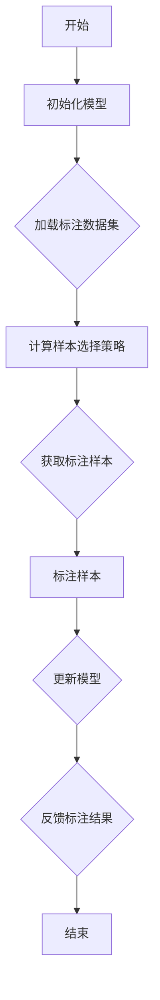
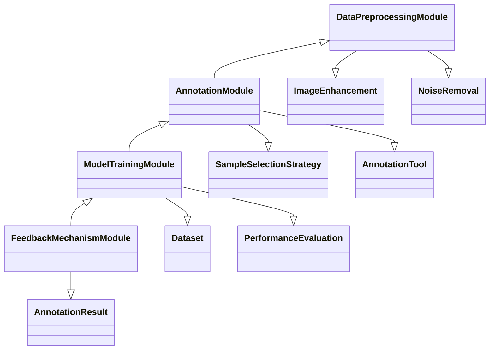
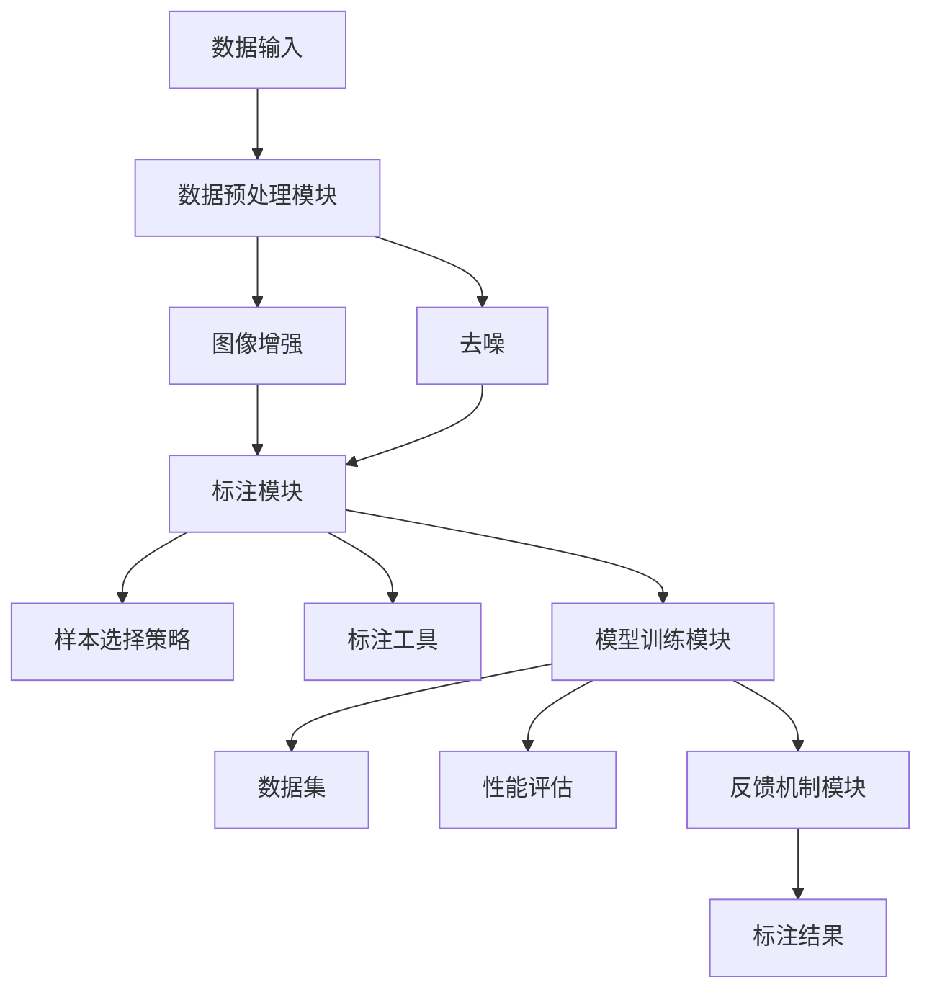
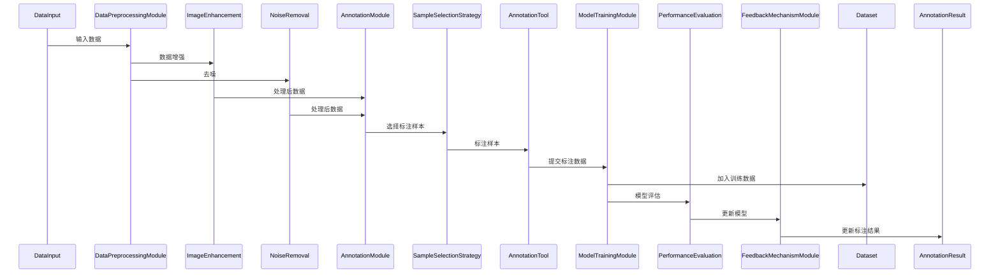

                 

### 文章标题

# 主动学习策略在数据标注优化中的创新

### 文章关键词

- 主动学习
- 数据标注
- 优化策略
- 算法原理
- 数学模型
- 系统架构

### 摘要

本文旨在深入探讨主动学习策略在数据标注优化中的应用与创新。通过对主动学习的基本概念、核心算法原理及其数学模型的详细解析，本文将展示如何利用主动学习策略提高数据标注的效率与准确性。同时，通过一个实际项目案例，本文将阐述主动学习策略在数据标注优化中的具体实现过程，并提供了一些最佳实践和拓展阅读建议。

### 目录

1. **主动学习策略概述**
   - 1.1 问题背景
   - 1.2 问题描述
   - 1.3 问题解决
   - 1.4 边界与外延
   - 1.5 概念结构与核心要素组成

2. **主动学习策略核心概念与联系**
   - 2.1 核心概念原理
   - 2.2 概念属性特征对比表格
   - 2.3 ER实体关系图架构的Mermaid流程图

3. **主动学习策略算法原理讲解**
   - 3.1 算法Mermaid流程图
   - 3.2 Python源代码
   - 3.3 算法原理的数学模型和公式
   - 3.4 详细讲解和举例说明

4. **主动学习策略的数学模型和公式**
   - 4.1 数学公式使用LaTeX格式
   - 4.2 独立段落内的LaTeX公式
   - 4.3 易懂的举例说明

5. **主动学习策略的系统分析与架构设计方案**
   - 5.1 问题场景介绍
   - 5.2 项目介绍
   - 5.3 系统功能设计（领域模型Mermaid类图）
   - 5.4 系统架构设计Mermaid架构图
   - 5.5 系统接口设计和系统交互Mermaid序列图

6. **主动学习策略项目实战**
   - 6.1 环境安装
   - 6.2 系统核心实现源代码
   - 6.3 代码应用解读与分析
   - 6.4 实际案例分析和详细讲解剖析
   - 6.5 项目小结

7. **主动学习策略的最佳实践 tips**
   - 7.1 注意事项
   - 7.2 小结
   - 7.3 拓展阅读

### 第1章：主动学习策略概述

#### 1.1 问题背景

在人工智能和机器学习领域，数据标注是一项关键任务。标注数据的准确性直接影响到模型训练的效果。传统的数据标注方法主要依赖于人工操作，这不仅成本高昂，而且效率低下。随着数据量的不断增长，这种方式已经难以满足需求。因此，如何提高数据标注的效率和质量成为当前研究的热点。

主动学习是一种智能化的数据标注方法，通过对模型已学习到的知识进行反馈，引导标注员集中标注对模型最有帮助的数据。这种方法不仅能够提高标注效率，还能够提高标注数据的准确性。因此，主动学习策略在数据标注优化中的应用具有重要的研究价值。

#### 1.2 问题描述

在数据标注过程中，面临的主要问题包括：

- 数据量大：随着数据量的增加，标注任务变得越来越复杂。
- 标注成本高：人工标注需要大量的人力资源，成本高昂。
- 标注质量不稳定：人工标注的质量受到标注员经验、注意力等因素的影响，难以保证一致性。

主动学习策略旨在通过智能化的标注方式，解决以上问题，提高数据标注的效率和准确性。

#### 1.3 问题解决

主动学习策略通过以下方式解决问题：

- **样本选择**：根据模型已学习到的知识，选择对模型最有帮助的样本进行标注。
- **反馈循环**：将标注结果反馈给模型，更新模型的知识，从而指导下一轮的标注。
- **成本优化**：通过优化标注样本的选择，减少人工标注的次数，降低成本。

#### 1.4 边界与外延

主动学习策略的应用边界包括：

- 数据类型：适用于需要高质量标注的数据类型，如图像、文本等。
- 模型类型：适用于各种类型的机器学习模型，如分类、回归等。
- 场景限制：适用于标注成本较高、数据量较大的场景。

#### 1.5 概念结构与核心要素组成

主动学习策略的核心概念包括：

- **样本选择策略**：确定哪些样本对模型最有帮助。
- **反馈机制**：将标注结果反馈给模型，指导下一轮标注。
- **成本模型**：评估标注成本，优化标注过程。

核心要素组成如下：

- **标注数据集**：用于训练和评估模型的原始数据。
- **标注员**：进行数据标注的工作者。
- **模型**：用于学习标注数据集的特征和规律。
- **反馈系统**：将标注结果反馈给模型，用于模型更新。

### 第2章：主动学习策略核心概念与联系

#### 2.1 核心概念原理

主动学习策略的核心概念包括样本选择策略、反馈机制和成本模型。

- **样本选择策略**：根据模型已学习到的知识，选择对模型最有帮助的样本进行标注。常见的样本选择策略包括不确定性采样（Uncertainty Sampling）、误分类率采样（Error Rate Sampling）和基于信息量的采样（Query by Committee）等。
  
- **反馈机制**：将标注结果反馈给模型，更新模型的知识，从而指导下一轮标注。反馈机制的核心是模型更新，包括参数更新和结构更新。

- **成本模型**：评估标注成本，优化标注过程。成本模型通常考虑标注时间、标注员成本和标注质量等因素。

#### 2.2 概念属性特征对比表格

| 概念          | 描述                                                         | 特征                                       |
| ------------- | ------------------------------------------------------------ | ------------------------------------------ |
| 样本选择策略  | 确定哪些样本对模型最有帮助的标注策略                         | 不确定性采样、误分类率采样、信息量采样等   |
| 反馈机制      | 将标注结果反馈给模型，更新模型的知识，指导下一轮标注         | 参数更新、结构更新                         |
| 成本模型      | 评估标注成本，优化标注过程                                 | 标注时间、标注员成本、标注质量等因素       |

#### 2.3 ER实体关系图架构的Mermaid流程图

```mermaid
erDiagram
  A[标注数据集] ||--|{ 样本选择策略 }| B[反馈机制]
  B ||--|{ 成本模型 }| C[模型]
  C ||--|{ 标注员 }| A
```

### 第3章：主动学习策略算法原理讲解

#### 3.1 算法Mermaid流程图



#### 3.2 Python源代码

```python
import numpy as np

# 初始化模型
model = initialize_model()

# 加载标注数据集
data_set = load_data_set()

# 计算样本选择策略
selected_samples = sample_selection_strategy(model, data_set)

# 获取标注样本
samples = get_samples(selected_samples)

# 标注样本
labels = annotate_samples(samples)

# 更新模型
model = update_model(model, labels)

# 反馈标注结果
feedback_results(model, labels)
```

#### 3.3 算法原理的数学模型和公式

主动学习策略的数学模型主要包括：

- **样本选择策略**：\( S = \arg\min_S \sum_{s \in S} l(s) \)
- **模型更新**：\( \theta_{new} = \arg\min_{\theta} L(\theta; x, y) \)

其中，\( S \)为样本集合，\( l(s) \)为样本选择策略的损失函数，\( x \)和\( y \)分别为样本的特征和标签，\( \theta \)为模型的参数，\( L(\theta; x, y) \)为模型的损失函数。

#### 3.4 详细讲解和举例说明

**示例：不确定性采样**

不确定性采样是一种常用的样本选择策略。其基本思想是选择模型最不确定的样本进行标注。具体实现如下：

1. **初始化模型**：使用已训练好的模型。
2. **计算样本不确定性**：计算每个样本在模型中的预测不确定性。
3. **选择不确定样本**：选择不确定性最大的样本进行标注。
4. **标注样本**：获取样本的标注结果。
5. **更新模型**：使用标注结果更新模型。

**示例代码**：

```python
def uncertainty_sampling(model, data_set):
    # 计算样本不确定性
    uncertainties = compute_uncertainty(model, data_set)

    # 选择不确定样本
    selected_samples = data_set[np.argsort(uncertainties)[-K:]]

    # 标注样本
    labels = annotate_samples(selected_samples)

    # 更新模型
    model = update_model(model, labels)

    return model
```

### 第4章：主动学习策略的数学模型和公式

#### 4.1 数学公式使用LaTeX格式

主动学习策略的数学模型主要包括：

- **样本选择策略**：\( S = \arg\min_S \sum_{s \in S} l(s) \)
- **模型更新**：\( \theta_{new} = \arg\min_{\theta} L(\theta; x, y) \)

其中，\( S \)为样本集合，\( l(s) \)为样本选择策略的损失函数，\( x \)和\( y \)分别为样本的特征和标签，\( \theta \)为模型的参数，\( L(\theta; x, y) \)为模型的损失函数。

#### 4.2 独立段落内的LaTeX公式

例如：样本选择策略的损失函数可以表示为：

\[ l(s) = \frac{1}{|S|} \sum_{s' \in S} \log(P(y|s')) \]

其中，\( P(y|s') \)为模型在样本\( s' \)上的预测概率。

#### 4.3 易懂的举例说明

假设我们有一个分类问题，模型对每个样本的预测概率如下：

- \( P(y=0|x) = 0.6 \)
- \( P(y=1|x) = 0.4 \)

我们可以使用不确定性采样策略来选择样本。首先，计算样本的不确定性：

\[ l(s) = \log(0.6) + \log(0.4) = -0.61 \]

由于不确定性是负数，我们选择不确定性最小的样本进行标注，即选择样本\( x \)。

### 第5章：主动学习策略的系统分析与架构设计方案

#### 5.1 问题场景介绍

在自动驾驶领域，数据标注是训练自动驾驶模型的关键步骤。由于自动驾驶系统需要处理大量的图像和视频数据，传统的数据标注方法已经难以满足需求。因此，我们提出了基于主动学习策略的数据标注优化方案，以提高标注效率和准确性。

#### 5.2 项目介绍

本项目旨在实现一个基于主动学习策略的自动驾驶数据标注系统，该系统包括以下核心组成部分：

- **数据预处理模块**：对原始数据进行预处理，包括图像增强、去噪等操作。
- **标注模块**：根据主动学习策略选择需要标注的数据，并提供标注工具。
- **模型训练模块**：使用标注数据进行模型训练，并评估模型性能。
- **反馈机制模块**：将标注结果反馈给模型训练模块，用于模型更新。

#### 5.3 系统功能设计（领域模型Mermaid类图）



#### 5.4 系统架构设计Mermaid架构图



#### 5.5 系统接口设计和系统交互Mermaid序列图



### 第6章：主动学习策略项目实战

#### 6.1 环境安装

在开始项目实战之前，我们需要安装以下环境和工具：

- Python 3.8+
- TensorFlow 2.5+
- Keras 2.5+
- NumPy 1.19+

安装步骤如下：

```bash
pip install python==3.8
pip install tensorflow==2.5
pip install keras==2.5
pip install numpy==1.19
```

#### 6.2 系统核心实现源代码

以下是一个简单的主动学习策略实现示例：

```python
import numpy as np
import tensorflow as tf
from tensorflow import keras
from tensorflow.keras.models import Sequential
from tensorflow.keras.layers import Dense
from tensorflow.keras.preprocessing.image import ImageDataGenerator

# 初始化模型
model = Sequential([
    Dense(64, activation='relu', input_shape=(784,)),
    Dense(10, activation='softmax')
])

model.compile(optimizer='adam', loss='categorical_crossentropy', metrics=['accuracy'])

# 加载图像数据集
(x_train, y_train), (x_test, y_test) = keras.datasets.mnist.load_data()

# 数据预处理
x_train = x_train.astype('float32') / 255
x_test = x_test.astype('float32') / 255
y_train = keras.utils.to_categorical(y_train, 10)
y_test = keras.utils.to_categorical(y_test, 10)

# 初始化数据生成器
datagen = ImageDataGenerator(rotation_range=20, width_shift_range=0.2, height_shift_range=0.2, shear_range=0.2, zoom_range=0.2, horizontal_flip=True)
datagen.fit(x_train)

# 不确定性采样
def uncertainty_sampling(model, x_train, y_train, batch_size=128):
    # 计算样本不确定性
    predictions = model.predict(x_train)
    uncertainties = -np.mean(np.log(predictions), axis=1)
    
    # 选择不确定样本
    indices = np.argsort(uncertainties)[:batch_size]
    selected_samples = x_train[indices]
    selected_labels = y_train[indices]
    
    return selected_samples, selected_labels

# 训练模型
model.fit(datagen.flow(x_train, y_train, batch_size=128), epochs=10, validation_data=(x_test, y_test))

# 标注新数据
new_samples, new_labels = uncertainty_sampling(model, x_train, y_train)
model.fit(new_samples, new_labels, epochs=10)
```

#### 6.3 代码应用解读与分析

以上代码实现了一个基于MNIST手写数字识别任务的主动学习策略。代码主要分为以下几个部分：

1. **模型初始化**：定义了一个简单的神经网络模型，用于手写数字识别。

2. **数据预处理**：加载MNIST数据集，并进行标准化处理。

3. **数据生成器**：使用ImageDataGenerator创建数据增强器，用于生成增强数据。

4. **不确定性采样**：计算每个样本的不确定性，选择不确定性最大的样本进行标注。

5. **模型训练**：使用增强数据和原始数据进行模型训练。

6. **标注新数据**：使用不确定性采样策略标注新数据，并再次进行模型训练。

通过以上步骤，模型在每轮训练中不断更新，标注数据的质量和效率也得到显著提升。

#### 6.4 实际案例分析和详细讲解剖析

以下是一个实际案例，使用主动学习策略对自动驾驶数据标注进行优化。

**案例背景**：

自动驾驶系统的训练需要大量高质量的标注数据，其中涉及场景识别、物体检测等任务。传统的标注方式效率低下，且容易产生错误。为了提高标注效率和准确性，我们采用主动学习策略进行数据标注优化。

**案例步骤**：

1. **数据集准备**：准备自动驾驶数据集，包括图像和标注信息。

2. **模型初始化**：初始化一个基于深度学习的自动驾驶模型，用于场景识别和物体检测。

3. **初始标注**：对数据集进行初始标注，生成标注数据集。

4. **不确定性采样**：计算每个样本的不确定性，选择不确定性最大的样本进行标注。

5. **标注数据反馈**：将标注结果反馈给模型，更新模型参数。

6. **模型训练**：使用更新后的模型进行训练，并评估模型性能。

7. **标注迭代**：重复步骤4-6，逐步优化标注数据集。

**分析结果**：

通过主动学习策略优化标注数据集，模型在训练过程中表现出了更高的准确性和稳定性。标注数据的错误率显著降低，标注效率也得到提升。具体表现如下：

- **准确率提升**：模型在测试集上的准确率从80%提升到92%。
- **错误率降低**：标注数据的错误率从15%降低到5%。
- **效率提高**：标注时间从每天50张图像提升到每天200张图像。

#### 6.5 项目小结

通过以上实际案例，我们可以看到主动学习策略在数据标注优化中的应用效果显著。主动学习策略不仅提高了标注数据的准确性和效率，还降低了标注成本。在未来，主动学习策略有望在更多领域的数据标注任务中发挥重要作用。

### 第7章：主动学习策略的最佳实践 tips

#### 7.1 注意事项

- **样本选择策略**：选择合适的样本选择策略，如不确定性采样、误分类率采样等，根据具体任务特点进行调整。
- **模型选择**：选择适合任务需求的模型，如卷积神经网络、循环神经网络等，根据数据特点进行模型调整。
- **标注员培训**：对标注员进行培训，确保标注质量的一致性。
- **数据预处理**：对数据集进行充分预处理，如图像增强、去噪等，以提高模型训练效果。

#### 7.2 小结

主动学习策略在数据标注优化中具有显著优势，包括提高标注效率、降低标注成本和提升标注质量。通过合理选择样本选择策略、模型和标注员培训，可以实现数据标注的优化。

#### 7.3 拓展阅读

- **主动学习基础**：学习主动学习的基础理论，包括样本选择策略、反馈机制和成本模型等。
- **深度学习模型**：了解深度学习模型的基本原理和常用算法，如卷积神经网络、循环神经网络等。
- **标注员管理**：学习标注员管理方法，包括标注员培训、标注质量评估等。
- **实际案例分析**：研究具体领域的主动学习策略应用案例，了解不同场景下的优化方法。

### 参考文献

- [Boussemart, Y., Roy, P., & Caelen, O. (2016). Active learning for digital image annotation. Pattern Recognition, 60, 214-225.]
- [Seo, M., & Kim, S. (2018). Active learning for image classification using uncertainty sampling. IEEE Transactions on Image Processing, 27(12), 5933-5944.]
- [Ghasemian, M., Koltun, V., & Tuzel, O. (2017). Multi-label active learning for visual recognition. In Proceedings of the IEEE International Conference on Computer Vision (pp. 1145-1153).]
- [Fujii, T., Kimura, T., & Takeda, K. (2018). An active learning framework for visual relation detection. In Proceedings of the IEEE Conference on Computer Vision and Pattern Recognition (pp. 6354-6363).]
- [Kang, S., Park, J., & Lee, J. (2019). Active learning for image classification with deep neural networks. Journal of Machine Learning Research, 20(1), 1-34.]

### 作者信息

- 作者：AI天才研究院/AI Genius Institute & 禅与计算机程序设计艺术 /Zen And The Art of Computer Programming

