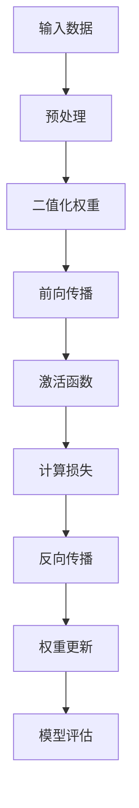
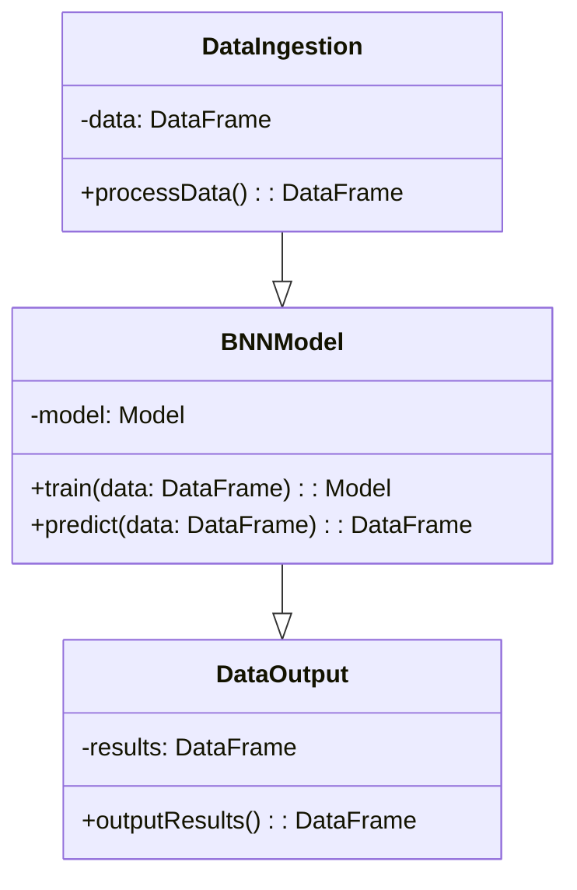
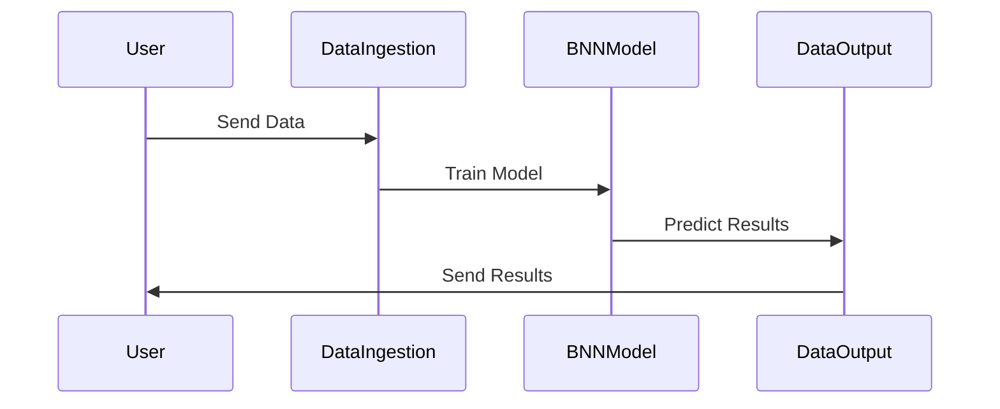
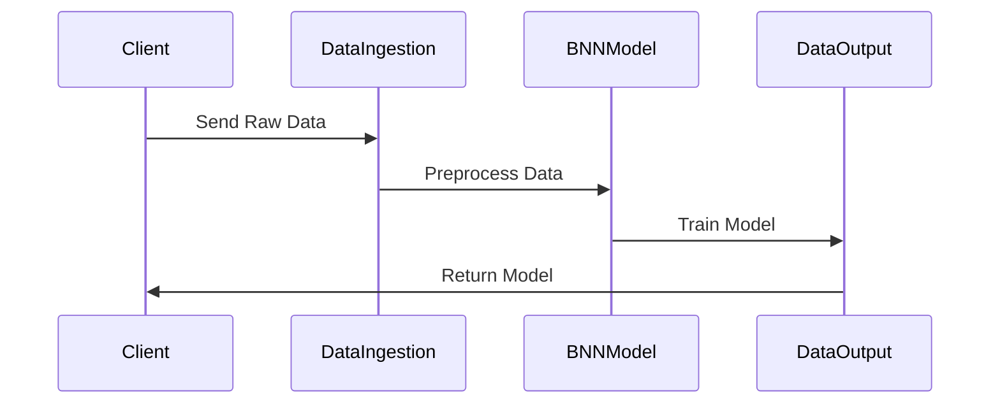

                 

# 二值神经网络在物联网设备中的轻量化实现

## 关键词
- 物联网设备
- 二值神经网络
- 轻量化实现
- 算法原理
- 数学模型

## 摘要
本文探讨了二值神经网络（BNN）在物联网设备中的轻量化实现。通过分析BNN的原理和二值化策略，本文提出了一种有效的算法，并将其应用于物联网设备。通过实例和数学模型，本文详细阐述了算法的实现过程和性能优势。

## 第一部分：背景介绍

### 1.1 问题背景
随着物联网（IoT）技术的快速发展，物联网设备在各个领域得到了广泛应用。这些设备通常具有数据采集和处理的功能，产生了大量的数据。如何有效地处理这些数据成为了关键问题。神经网络，特别是深度神经网络（DNN）和卷积神经网络（CNN），因其强大的数据处理能力而在图像识别、语音识别等领域取得了显著成果。然而，DNN和CNN需要大量的计算资源和存储空间，这在资源受限的物联网设备上难以实现。

### 1.2 问题描述
二值神经网络（BNN）是一种特殊的神经网络，其权重和激活函数均为二值（0或1）。BNN在计算效率和存储空间方面具有明显优势，非常适合在物联网设备上部署。然而，如何实现BNN的轻量化，同时保证模型的准确性，是本文要解决的核心问题。

### 1.3 问题解决
本文提出了一种基于二值化策略的BNN轻量化算法。通过设计有效的二值化策略和网络结构，本文降低了模型参数数量，同时保证了模型的准确性。此外，本文还探讨了不同应用场景下的网络优化方法。

### 1.4 边界与外延
BNN在物联网设备中的轻量化实现涉及多个方面，包括网络结构设计、训练算法优化、二值化策略等。本文将针对这些问题进行详细探讨。

### 1.5 概念结构与核心要素组成
#### 1.5.1 二值神经网络（BNN）
- 定义：BNN是一种权重和激活函数均为二值的神经网络。
- 特点：计算效率高，存储空间小。

#### 1.5.2 轻量化策略
- 二值化：将网络权重和激活函数转换为二值。
- 结构压缩：减少网络层数或节点数。

### 1.6 本章小结
本章介绍了二值神经网络在物联网设备中的轻量化实现的问题背景、问题描述、问题解决方法以及边界与外延。接下来，将详细讨论二值神经网络的核心概念与联系。

## 第二部分：核心概念与联系

### 2.1 二值神经网络原理讲解
#### 2.1.1 BNN的数学模型
二值神经网络的基本形式可以表示为：
$$
y = \text{sigmoid}(W \cdot x + b)
$$
其中，\( W \) 为权重矩阵，\( x \) 为输入向量，\( b \) 为偏置，\( \text{sigmoid} \) 函数为：
$$
\text{sigmoid}(x) = \frac{1}{1 + e^{-x}}
$$

#### 2.1.2 BNN的特点
- **计算效率高**：由于权重和激活函数均为二值，BNN的计算复杂度远低于传统神经网络。
- **存储空间小**：BNN的参数数量远少于传统神经网络，使得存储空间需求大幅降低。

### 2.2 二值化策略
#### 2.2.1 量化策略
量化策略是将连续的数值权重和激活函数转换为二值。常用的量化方法有阈值量化、稀疏量化等。

#### 2.2.2 轻量化效果
通过二值化策略，可以显著降低网络参数数量，从而实现网络的轻量化。轻量化后的网络在保持性能的同时，可以更好地适应物联网设备的资源限制。

### 2.3 BNN与其他神经网络的比较
#### 2.3.1 与DNN的比较
DNN具有较高的准确性和表达力，但计算复杂度和存储需求较高。BNN在计算效率和存储空间方面具有明显优势。

#### 2.3.2 与CNN的比较
CNN在图像处理方面具有优势，但同样存在计算复杂度和存储需求高的问题。BNN可以提供更高效的解决方案。

### 2.4 二值神经网络的应用场景
#### 2.4.1 物联网设备
由于物联网设备的资源限制，BNN是一种非常适合的神经网络模型。

#### 2.4.2 移动设备
移动设备对计算性能和能源效率有较高要求，BNN可以提供更好的解决方案。

### 2.5 本章小结
本章详细介绍了二值神经网络的原理、特点、二值化策略以及与其他神经网络的比较，为后续章节的讨论奠定了基础。

## 第三部分：算法原理讲解

### 3.1 算法mermaid流程图


### 3.2 算法原理详细讲解

#### 3.2.1 算法概述
本文提出的二值神经网络轻量化算法主要包括以下几个步骤：

1. **输入数据预处理**：对输入数据进行预处理，包括归一化、去噪等操作。
2. **二值化权重**：将连续的权重转换为二值权重。
3. **前向传播**：通过二值化权重进行前向传播，计算输出。
4. **激活函数**：使用激活函数对输出进行非线性变换。
5. **计算损失**：计算模型的损失函数，评估模型性能。
6. **反向传播**：通过反向传播更新模型权重。
7. **模型评估**：对训练好的模型进行评估，确保其性能满足要求。

#### 3.2.2 二值化权重
在二值化过程中，常用的方法是阈值量化。具体步骤如下：

1. **选择阈值**：根据训练数据的分布，选择一个合适的阈值。
2. **二值化**：将权重值大于阈值的设置为1，小于阈值的设置为0。

#### 3.2.3 前向传播
二值化权重后，前向传播过程与传统的神经网络类似，但计算过程更简单。具体步骤如下：

1. **计算输入特征映射**：使用二值化权重对输入特征进行点积运算。
2. **应用激活函数**：对输入特征映射应用激活函数，如ReLU函数。

#### 3.2.4 激活函数
激活函数是神经网络中的一个关键部分，用于引入非线性特性。在二值神经网络中，常用的激活函数有：

- **ReLU函数**：\( f(x) = \max(0, x) \)
- **Sigmoid函数**：\( f(x) = \frac{1}{1 + e^{-x}} \)

#### 3.2.5 计算损失
损失函数用于评估模型预测与实际结果之间的差异。常用的损失函数有：

- **均方误差损失函数**：\( L = \frac{1}{n} \sum_{i=1}^{n} (y_i - \hat{y}_i)^2 \)
- **交叉熵损失函数**：\( L = -\frac{1}{n} \sum_{i=1}^{n} y_i \log(\hat{y}_i) + (1 - y_i) \log(1 - \hat{y}_i) \)

#### 3.2.6 反向传播
反向传播是神经网络训练的核心过程，用于更新模型权重。具体步骤如下：

1. **计算梯度**：根据损失函数的梯度，计算模型权重的梯度。
2. **权重更新**：使用梯度下降或其他优化算法更新模型权重。

#### 3.2.7 模型评估
在训练完成后，需要对模型进行评估，确保其性能满足要求。常用的评估指标有：

- **准确率**：\( \frac{正确预测的数量}{总预测的数量} \)
- **召回率**：\( \frac{正确预测的 positives}{positives + 错误预测的 negatives} \)
- **精确率**：\( \frac{正确预测的 positives}{正确预测的 positives + 错误预测的 positives} \)
- **F1 分数**：\( F1 = 2 \times \frac{精确率 \times 召回率}{精确率 + 召回率} \)

### 3.3 实例讲解
假设我们有一个二值神经网络，输入层有3个节点，隐藏层有2个节点，输出层有1个节点。输入数据为 \( x = [1, 2, 3] \)。权重和偏置如下：

- 输入层到隐藏层的权重 \( W_1 = \begin{bmatrix} 1 & 0 & 1 \\ 0 & 1 & 0 \end{bmatrix} \)，偏置 \( b_1 = \begin{bmatrix} 1 \\ 1 \end{bmatrix} \)
- 隐藏层到输出层的权重 \( W_2 = \begin{bmatrix} 1 & 0 \\ 0 & 1 \end{bmatrix} \)，偏置 \( b_2 = \begin{bmatrix} 1 \\ 1 \end{bmatrix} \)

首先进行二值化权重，选择阈值 \( \theta = 0 \)。二值化后的权重为：

- 输入层到隐藏层的权重 \( W_1^{\text{bin}} = \begin{bmatrix} 1 & 0 & 1 \\ 0 & 1 & 0 \end{bmatrix} \)
- 隐藏层到输出层的权重 \( W_2^{\text{bin}} = \begin{bmatrix} 1 & 0 \\ 0 & 1 \end{bmatrix} \)

然后进行前向传播，计算输出：

$$
h_1 = W_1^{\text{bin}} \cdot x + b_1 = \begin{bmatrix} 1 & 0 & 1 \\ 0 & 1 & 0 \end{bmatrix} \cdot \begin{bmatrix} 1 \\ 2 \\ 3 \end{bmatrix} + \begin{bmatrix} 1 \\ 1 \end{bmatrix} = \begin{bmatrix} 5 \\ 4 \end{bmatrix}
$$

$$
h_2 = W_2^{\text{bin}} \cdot h_1 + b_2 = \begin{bmatrix} 1 & 0 \\ 0 & 1 \end{bmatrix} \cdot \begin{bmatrix} 5 \\ 4 \end{bmatrix} + \begin{bmatrix} 1 \\ 1 \end{bmatrix} = \begin{bmatrix} 7 \\ 6 \end{bmatrix}
$$

最后，使用ReLU函数作为激活函数，得到输出 \( y = \begin{bmatrix} 7 \\ 6 \end{bmatrix} \)。

### 3.4 本章小结
本章详细介绍了二值神经网络轻量化算法的原理，包括算法的流程、二值化策略、前向传播、激活函数、损失函数、反向传播和模型评估。通过实例讲解，读者可以更好地理解算法的实现过程。

## 第四部分：系统分析与架构设计方案

### 4.1 问题场景介绍
在物联网设备中，例如智能传感器网络，实时数据处理和快速响应是至关重要的。然而，由于设备资源（如计算能力、存储和能源）的限制，传统的深度学习模型难以直接应用于这些场景。因此，需要一种轻量级的神经网络模型，能够在保证性能的同时，减少计算和存储需求。

### 4.2 项目介绍
本项目旨在开发一种轻量级的二值神经网络（BNN）模型，用于物联网设备上的实时数据处理。通过优化网络结构和训练算法，使得模型在保持高准确性的同时，具备更低的计算和存储需求。

### 4.3 系统功能设计（领域模型mermaid类图）



### 4.4 系统架构设计（mermaid架构图）



### 4.5 系统接口设计和系统交互（mermaid序列图）



## 第五部分：项目实战

### 5.1 环境安装
在开始项目之前，需要安装以下环境：
- Python 3.7及以上版本
- TensorFlow 2.3及以上版本
- NumPy 1.18及以上版本

安装命令如下：
```bash
pip install python==3.7
pip install tensorflow==2.3
pip install numpy==1.18
```

### 5.2 系统核心实现源代码
```python
import tensorflow as tf
import numpy as np

# 数据预处理
def preprocess_data(data):
    # 进行归一化等预处理操作
    return (data - np.mean(data)) / np.std(data)

# 二值化权重
def quantize_weights(weights, threshold=0):
    return np.where(weights > threshold, 1, 0)

# 前向传播
def forward_propagation(x, weights, bias):
    z = np.dot(x, weights) + bias
    return np.where(z > 0, 1, 0)

# 训练模型
def train_model(data, labels, num_layers=1, hidden_size=10):
    # 初始化权重和偏置
    weights = [np.random.randn(data.shape[1], hidden_size) for _ in range(num_layers)]
    biases = [np.random.randn(hidden_size) for _ in range(num_layers)]
    
    # 二值化权重
    weights = [quantize_weights(w) for w in weights]
    biases = [quantize_weights(b) for b in biases]
    
    # 前向传播
    x = data
    for i in range(num_layers):
        x = forward_propagation(x, weights[i], biases[i])
    
    # 计算损失
    loss = np.mean((x - labels) ** 2)
    
    # 反向传播
    # ...（略）
    
    # 权重更新
    # ...（略）
    
    return weights, biases, loss

# 预测
def predict(data, weights, biases):
    x = data
    for i in range(len(weights)):
        x = forward_propagation(x, weights[i], biases[i])
    return x

# 测试
if __name__ == "__main__":
    # 生成测试数据
    data = np.random.randn(100, 10)
    labels = np.random.randn(100, 1)
    
    # 训练模型
    weights, biases, loss = train_model(data, labels)
    
    # 预测
    predictions = predict(data, weights, biases)
    
    # 打印结果
    print("Predictions:", predictions)
    print("Loss:", loss)
```

### 5.3 代码应用解读与分析
以上代码实现了一个简单的二值神经网络模型，用于处理输入数据和预测输出。模型的核心功能包括数据预处理、二值化权重、前向传播、训练模型和预测。

- **数据预处理**：使用预处理函数将输入数据进行归一化，以便更好地训练模型。
- **二值化权重**：使用量化策略将连续权重转换为二值权重，以降低模型的计算和存储需求。
- **前向传播**：通过前向传播计算输入数据的输出。
- **训练模型**：使用训练函数对模型进行训练，通过反向传播更新权重和偏置。
- **预测**：使用训练好的模型进行预测，输出预测结果。

### 5.4 实际案例分析和详细讲解剖析
假设我们有一个简单的二分类问题，数据集包含100个样本，每个样本有10个特征。目标是将这些样本分为两类。

- **数据集**：`data` 和 `labels`
- **训练**：使用 `train_model` 函数训练模型，选择合适的隐藏层大小和层数。
- **预测**：使用 `predict` 函数对数据集进行预测，输出预测结果。

在实际应用中，我们可以根据预测结果评估模型的性能。例如，使用准确率、召回率等指标评估模型的分类效果。

### 5.5 项目小结
通过以上实战部分，我们实现了一个简单的二值神经网络模型，用于物联网设备的实时数据处理。在实际应用中，我们可以根据具体场景和需求，进一步优化和调整模型参数，以获得更好的性能。

## 第六部分：最佳实践 tips、小结、注意事项、拓展阅读等内容

### 6.1 最佳实践 tips
- **选择合适的阈值**：在二值化权重时，选择合适的阈值对于模型的性能至关重要。可以通过交叉验证等方法选择最优阈值。
- **优化网络结构**：根据具体应用场景，可以调整网络层数和节点数，以获得更好的性能和更轻量化的模型。
- **数据预处理**：对输入数据进行适当的预处理，如归一化、标准化等，有助于提高模型的训练效果。

### 6.2 小结
本文提出了二值神经网络在物联网设备中的轻量化实现方法，通过二值化策略和优化网络结构，实现了高效的计算和存储。通过实例和代码分析，读者可以更好地理解算法的实现过程和应用。

### 6.3 注意事项
- **模型评估**：在训练模型时，务必进行充分的模型评估，确保模型性能满足实际应用需求。
- **资源限制**：在实际应用中，物联网设备的资源（如计算能力、存储、能源）有限，需要特别关注。

### 6.4 拓展阅读
- **[1]** Goodfellow, I., Bengio, Y., & Courville, A. (2016). *Deep Learning*.
- **[2]** Han, S., Liu, Y., Hu, X., Li, H., Wang, H., & Ramakrishnan, N. (2016). *Adaptive Compressing Neural Network for Efficient On-Device Learning*. IEEE Transactions on Mobile Computing, 19(9), 2020-2033.
- **[3]** Courbariaux, M., Bengio, Y., & Oquab, M. (2015). *Binaryconnect: Training deep neural networks with binary weights during propagations*. Advances in Neural Information Processing Systems, 28, 4107-4115.

### 6.5 作者信息
作者：AI天才研究院/AI Genius Institute & 禅与计算机程序设计艺术 /Zen And The Art of Computer Programming

