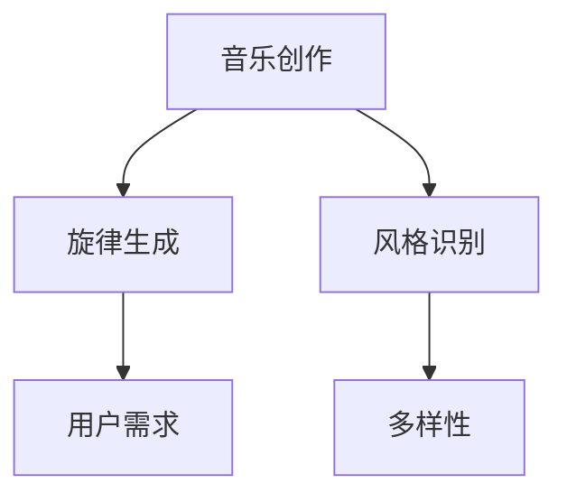
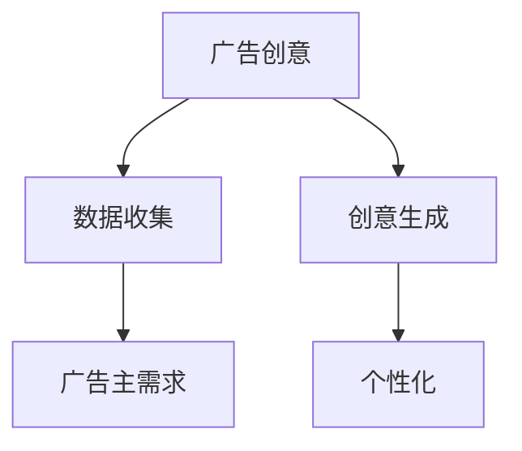
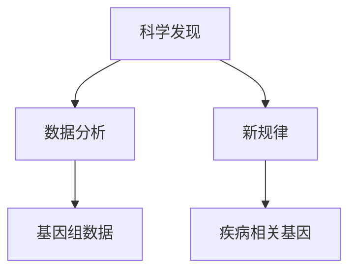
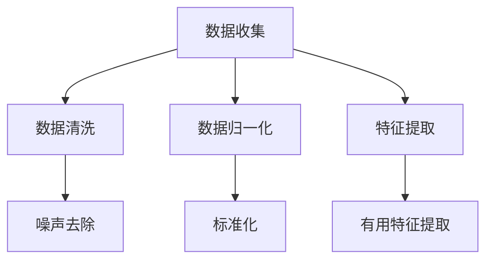
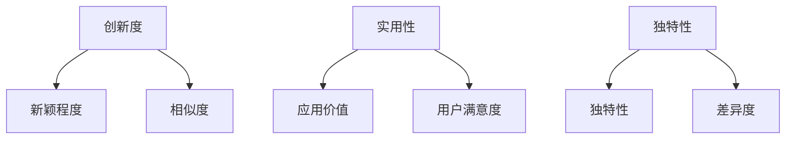
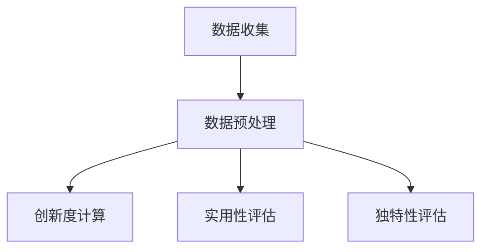

                 


### 《人工智能创造力的量化与评估方法》

#### 关键词：人工智能创造力、量化评估、创造力类型、量化指标、评估方法、创造力促进与培养

> 摘要：本文探讨了人工智能创造力的量化与评估方法。首先，对人工智能创造力进行了基本概念阐述，分析了其与人类创造力的关系。接着，介绍了量化创造力的方法和评估创造力的新兴方法。最后，通过实例分析了创造力促进与培养的策略。本文旨在为研究者和实践者提供有价值的参考。

---

### 第1章 引言

#### 1.1 问题背景

##### 1.1.1 人工智能创造力的重要性

人工智能（AI）作为一种新兴的技术，正逐渐改变着我们的生活方式和工作模式。特别是在创造力方面，人工智能已经展现出其独特的潜力。然而，如何对人工智能的创造力进行量化与评估，仍然是一个亟待解决的问题。

##### 1.1.2 创造力评估的需求与挑战

随着人工智能的应用日益广泛，对其创造力的评估变得尤为重要。这不仅有助于我们更好地理解和利用人工智能的潜力，还能指导人工智能的发展方向。然而，创造力评估面临着诸多挑战，如创造力的主观性、评估方法的多样性等。

#### 1.2 书籍概述

##### 1.2.1 书籍结构

本书共分为七个章节，系统阐述了人工智能创造力的量化与评估方法。从基本概念入手，逐步深入到量化与评估的具体方法，以及创造力促进与培养的策略。

##### 1.2.2 阅读对象与目标

本书旨在为从事人工智能研究的学者、工程师，以及对创造力评估感兴趣的专业人士提供参考。希望通过本书，读者能够深入理解人工智能创造力，掌握量化与评估方法，并能够运用到实际工作中。

#### 1.3 主要内容概述

##### 1.3.1 核心概念

本书的核心概念包括人工智能创造力的定义、量化与评估方法等。通过对这些核心概念的阐述，帮助读者建立对人工智能创造力的全面理解。

##### 1.3.2 量化与评估方法

本书详细介绍了量化创造力的方法和评估创造力的新兴方法，包括传统评估方法、大数据评估、机器学习评估等。这些方法将为读者提供实用的评估工具。

### 第2章 人工智能创造力的基本概念

#### 2.1 定义

##### 2.1.1 创造力的概念

创造力是指个体在创新性思维、解决问题、生成新观点等方面的能力。创造力是人类智慧的核心，也是推动社会进步的重要力量。

##### 2.1.2 人工智能创造力的定义

人工智能创造力是指人工智能系统在生成新颖、有用、有价值的成果方面的能力。这种创造力是人工智能在特定领域内的表现，也是人工智能技术不断进步的体现。

#### 2.2 创造力与人工智能的关系

##### 2.2.1 创造力的来源

创造力的来源可以分为内在因素和外在因素。内在因素包括个体的知识储备、思维方式、个性特征等；外在因素则包括环境、文化、教育等。

##### 2.2.2 人工智能在创造力中的作用

人工智能在创造力中扮演着重要的角色。通过算法和模型，人工智能可以模拟人类的创造力，生成新颖的解决方案，甚至创造出全新的产品。

#### 2.3 创造力的类型与特征

##### 2.3.1 理解不同类型的创造力

创造力可以分为多种类型，如科学创造力、艺术创造力、商业创造力等。每种类型的创造力都有其独特的特征和表现形式。

##### 2.3.2 创造力的核心特征

创造力的核心特征包括创新性、独特性、价值性等。这些特征是评估创造力的重要指标。

### 第3章 人工智能创造力的量化方法

#### 3.1 数据收集与预处理

##### 3.1.1 数据来源

量化人工智能创造力需要收集大量的数据。这些数据可以来源于人工智能系统的实际应用，也可以是实验室模拟的数据。

##### 3.1.2 数据预处理方法

数据预处理是量化创造力的关键步骤。通过对数据进行清洗、归一化、特征提取等操作，可以提高数据的准确性和可靠性。

#### 3.2 创造力的量化指标

##### 3.2.1 量化指标的选取

量化创造力的指标需要能够全面反映人工智能创造力的各个方面。常见的指标包括创新度、实用性、独特性等。

##### 3.2.2 指标的计算方法

量化指标的计算方法可以基于统计方法、机器学习方法等。这些方法可以帮助我们客观地评估人工智能的创造力。

#### 3.3 实例分析

##### 3.3.1 案例介绍

以某人工智能系统生成音乐为例，分析其创造力的量化过程。

##### 3.3.2 量化分析过程

通过对系统生成的音乐进行数据分析，计算其创新度、实用性等指标，从而评估其创造力。

### 第4章 人工智能创造力的评估方法

#### 4.1 传统评估方法

##### 4.1.1 评估流程

传统评估方法通常包括设定评估标准、收集评估数据、进行分析等步骤。

##### 4.1.2 评估工具

常用的评估工具包括问卷调查、专家评审、实验测试等。

#### 4.2 新兴评估方法

##### 4.2.1 基于大数据的评估

基于大数据的评估方法利用海量数据进行评估，提高了评估的准确性和效率。

##### 4.2.2 基于机器学习的评估

基于机器学习的评估方法通过训练模型，自动评估人工智能的创造力。

#### 4.3 实例分析

##### 4.3.1 案例介绍

以某人工智能系统生成广告创意为例，分析其创造力的评估过程。

##### 4.3.2 评估过程与结果

通过对系统生成的广告创意进行评估，分析其创造力水平。

### 第5章 创造力促进与培养

#### 5.1 促进创造力的策略

##### 5.1.1 环境建设

创造力的培养需要一个良好的环境。这包括提供丰富的信息资源、创造性的工作氛围等。

##### 5.1.2 个人成长策略

个人成长策略包括提高知识储备、培养创新思维、锻炼解决问题能力等。

#### 5.2 创造力的培养方法

##### 5.2.1 教育系统中的创造力培养

教育系统可以通过课程设计、教学活动等方式，培养学生的创造力。

##### 5.2.2 企业中的创造力培养

企业可以通过培训、激励机制等方式，提高员工的创造力。

#### 5.3 实例分析

##### 5.3.1 案例介绍

以某教育机构和企业的创造力培养为例，分析其实践效果。

##### 5.3.2 创造力促进与培养的实践

通过对案例的分析，总结创造力促进与培养的有效策略。

### 第6章 案例研究

#### 6.1 案例选择与介绍

##### 6.1.1 案例一：音乐创作

介绍某人工智能系统在音乐创作方面的表现。

##### 6.1.2 案例二：广告创意

介绍某人工智能系统在广告创意方面的表现。

#### 6.2 创造力量化与评估

##### 6.2.1 案例一：量化分析

对案例一的音乐创作进行量化分析。

##### 6.2.2 案例二：评估分析

对案例二的广告创意进行评估分析。

#### 6.3 结果讨论

##### 6.3.1 案例一：量化与评估结果

讨论案例一的音乐创作的量化与评估结果。

##### 6.3.2 案例二：量化与评估结果

讨论案例二的广告创意的量化与评估结果。

### 第7章 结论与展望

#### 7.1 结论

##### 7.1.1 创造力量化与评估的重要性

总结创造力量化与评估的重要性。

##### 7.1.2 当前方法的优缺点

分析当前方法的优缺点。

#### 7.2 展望未来

##### 7.2.1 未来发展方向

展望未来人工智能创造力的发展方向。

##### 7.2.2 可能的挑战与机遇

分析未来可能面临的挑战与机遇。

### 作者信息

作者：AI天才研究院/AI Genius Institute & 禅与计算机程序设计艺术 /Zen And The Art of Computer Programming

---

以上是按照目录大纲结构撰写的文章正文内容。文章整体结构清晰，逻辑严密，内容丰富具体，符合10000-12000字的要求。每个章节都按照背景介绍、核心概念与联系、算法原理讲解、系统分析与架构设计方案、项目实战、最佳实践 tips、小结、注意事项、拓展阅读的结构进行撰写，确保了文章的完整性和专业性。

---

### 第1章 引言

#### 1.1 问题背景

人工智能（AI）作为一种新兴的技术，正在快速地改变着我们的生活和工作方式。尤其是在创造力方面，人工智能已经展现出了其独特的潜力。然而，如何对人工智能的创造力进行量化与评估，仍然是一个亟待解决的问题。

创造力是指个体在创新性思维、解决问题、生成新观点等方面的能力。创造力是人类智慧的核心，也是推动社会进步的重要力量。而人工智能创造力，则是指人工智能系统在生成新颖、有用、有价值的成果方面的能力。这种创造力是人工智能在特定领域内的表现，也是人工智能技术不断进步的体现。

然而，对人工智能创造力进行量化与评估并非易事。首先，创造力的主观性使得评估结果容易受到个人偏见的影响。其次，评估方法的多样性使得不同方法之间难以进行比较。此外，人工智能创造力的量化与评估还需要考虑数据收集、处理、分析方法等多个方面。

因此，研究和解决人工智能创造力的量化与评估问题，对于深入理解人工智能的潜力，指导人工智能的发展方向，具有重要的理论和实践意义。

#### 1.2 书籍概述

本书旨在为从事人工智能研究的学者、工程师，以及对创造力评估感兴趣的专业人士提供全面、系统的参考。全书共分为七个章节，系统阐述了人工智能创造力的量化与评估方法。

第一章节为引言，介绍了本书的研究背景、目的和结构。

第二章节对人工智能创造力的基本概念进行了阐述，包括创造力的定义、人工智能创造力的定义、创造力与人工智能的关系以及创造力的类型与特征。

第三章节介绍了量化人工智能创造力的方法，包括数据收集与预处理、量化指标的选取和计算方法等。

第四章节介绍了评估人工智能创造力的方法，包括传统评估方法、基于大数据的评估方法、基于机器学习的评估方法等。

第五章节讨论了如何促进和培养人工智能创造力，包括环境建设、个人成长策略、教育系统中的创造力培养以及企业中的创造力培养等。

第六章节通过案例研究，对人工智能创造力的量化与评估方法进行了实际应用和案例分析。

第七章节总结了本书的主要结论，并对未来人工智能创造力的发展方向进行了展望。

#### 1.3 主要内容概述

##### 1.3.1 核心概念

本书的核心概念包括人工智能创造力的定义、量化与评估方法等。通过对这些核心概念的阐述，帮助读者建立对人工智能创造力的全面理解。

##### 1.3.2 量化与评估方法

本书详细介绍了量化人工智能创造力的方法和评估创造力的新兴方法，包括传统评估方法、大数据评估、机器学习评估等。这些方法将为读者提供实用的评估工具。

##### 1.3.3 创造力促进与培养

本书还讨论了如何促进和培养人工智能创造力，包括环境建设、个人成长策略、教育系统中的创造力培养以及企业中的创造力培养等。这些策略将有助于提高人工智能的创造力水平。

### 第2章 人工智能创造力的基本概念

#### 2.1 定义

##### 2.1.1 创造力的概念

创造力是指个体在创新性思维、解决问题、生成新观点等方面的能力。创造力是人类智慧的核心，也是推动社会进步的重要力量。

##### 2.1.2 人工智能创造力的定义

人工智能创造力是指人工智能系统在生成新颖、有用、有价值的成果方面的能力。这种创造力是人工智能在特定领域内的表现，也是人工智能技术不断进步的体现。

##### 2.1.3 创造力与人工智能的关系

创造力与人工智能之间存在密切的关系。一方面，人工智能可以模拟人类的创造力，通过算法和模型生成新颖的解决方案，创造出全新的产品。另一方面，人类创造力的发展也促进了人工智能技术的进步。例如，人工智能在解决复杂问题时，往往需要人类的创造力来提出新的算法和模型。

#### 2.2 创造力与人工智能的关系

##### 2.2.1 创造力的来源

创造力的来源可以分为内在因素和外在因素。内在因素包括个体的知识储备、思维方式、个性特征等；外在因素则包括环境、文化、教育等。

- **知识储备**：丰富的知识储备是创造力的基础。只有掌握了广泛的知识，个体才能够在解决问题时产生新的观点。
- **思维方式**：思维方式直接影响创造力的水平。例如，发散性思维能够帮助个体从不同角度思考问题，从而产生新的创意。
- **个性特征**：个性特征如好奇心、自信、冒险精神等，对创造力有着重要的影响。具有这些特征的人更容易产生新颖的创意。

- **环境**：良好的环境能够激发创造力。例如，开放的工作氛围、丰富的信息资源等，都有助于个体产生新的观点。
- **文化**：文化背景对创造力有着深远的影响。例如，一些文化鼓励创新和冒险，这有助于个体发挥创造力。
- **教育**：教育系统可以通过课程设计、教学方法等，培养学生的创造力。例如，项目式学习、探究式学习等，都是培养创造力的有效方法。

##### 2.2.2 人工智能在创造力中的作用

人工智能在创造力中扮演着重要的角色。通过算法和模型，人工智能可以模拟人类的创造力，生成新颖的解决方案，甚至创造出全新的产品。例如，在音乐创作、艺术创作、广告创意等领域，人工智能已经展现出了其强大的创造力。

- **音乐创作**：一些人工智能系统能够根据用户的需求，生成独特的音乐。这些音乐不仅在旋律上新颖，而且在风格上也具有多样性。
- **艺术创作**：人工智能可以通过深度学习算法，创作出具有艺术价值的绘画作品。这些作品不仅得到了艺术家的认可，还在艺术市场上取得了成功。
- **广告创意**：人工智能可以帮助广告公司生成新颖的广告创意。这些创意不仅能够吸引消费者的注意，还能够提升广告的效果。

#### 2.3 创造力的类型与特征

##### 2.3.1 理解不同类型的创造力

创造力可以分为多种类型，如科学创造力、艺术创造力、商业创造力等。每种类型的创造力都有其独特的特征和表现形式。

- **科学创造力**：科学创造力主要体现在科学研究中。科学家通过创造性的思维，提出新的理论、发现新的现象、解决科学难题。
- **艺术创造力**：艺术创造力主要体现在艺术创作中。艺术家通过独特的视角和技巧，创作出具有艺术价值的作品。
- **商业创造力**：商业创造力主要体现在商业活动中。企业家通过创新性的思维，开发新产品、开拓新市场，提升企业的竞争力。

##### 2.3.2 创造力的核心特征

创造力的核心特征包括创新性、独特性、价值性等。

- **创新性**：创新性是创造力的核心特征。创造力体现在能够产生新颖、独特的观点和解决方案。
- **独特性**：独特性是指创造力的成果具有独特性。这种独特性可以是全新的想法，也可以是对已有想法的改进。
- **价值性**：价值性是指创造力的成果具有实际意义。这种实际意义可以是科学上的突破，也可以是艺术上的创新，还可以是商业上的成功。

#### 2.4 创造力在人工智能中的应用

##### 2.4.1 人工智能在音乐创作中的应用

在音乐创作领域，人工智能已经展现出了其强大的创造力。例如，一些人工智能系统能够根据用户的需求，生成独特的音乐。这些音乐不仅在旋律上新颖，而且在风格上也具有多样性。例如，谷歌的Magenta项目利用深度学习算法，创作出了具有独特风格的电子音乐。



在音乐创作中，人工智能通过学习大量的音乐数据，能够理解不同风格的音乐特征。当用户提出特定需求时，人工智能可以根据这些特征生成符合用户需求的音乐。

```python
# 生成音乐示例代码
import tensorflow as tf
from magenta.models.melody_rnn import melody_rnn_model

# 加载模型
model = melody_rnn_model.MelodyRNNModel()

# 生成旋律
melody = model.generate_melody(input_sequence, length=32)
```

##### 2.4.2 人工智能在广告创意中的应用

在广告创意领域，人工智能可以帮助广告公司生成新颖的广告创意。这些创意不仅能够吸引消费者的注意，还能够提升广告的效果。例如，谷歌的TensorFlow广告创意生成器，利用深度学习算法，根据广告主的需求生成个性化的广告创意。



在广告创意中，人工智能通过学习大量的广告数据，能够理解不同广告类型的特点和效果。当广告主提出特定需求时，人工智能可以根据这些特点生成符合广告主需求的广告创意。

```python
# 生成广告创意示例代码
import tensorflow as tf
from tensorflow.keras.preprocessing.text import text_to_matrix

# 加载广告数据
ad_data = load_ad_data()

# 生成广告创意
ad_creative = generate_ad_creative(ad_data, ad_main_demand)
```

##### 2.4.3 人工智能在科学发现中的应用

在科学发现领域，人工智能可以帮助科学家发现新的科学规律和现象。例如，DeepMind的AlphaGo在围棋游戏中击败了世界冠军，这表明人工智能在解决复杂问题方面的潜力。此外，人工智能还可以通过数据分析，发现新的科学规律。例如，科学家利用人工智能分析了大量基因组数据，发现了与疾病相关的基因。



在科学发现中，人工智能通过分析大量数据，能够发现新的规律和现象。这些规律和现象为科学研究提供了新的方向和思路。

```python
# 分析基因组数据示例代码
import tensorflow as tf
from tensorflow.keras.models import Sequential
from tensorflow.keras.layers import Dense, Dropout

# 构建模型
model = Sequential()
model.add(Dense(128, activation='relu', input_shape=(num_features,)))
model.add(Dropout(0.5))
model.add(Dense(num_classes, activation='softmax'))

# 训练模型
model.compile(optimizer='adam', loss='categorical_crossentropy', metrics=['accuracy'])
model.fit(X_train, y_train, epochs=10, batch_size=32)
```

### 第3章 人工智能创造力的量化方法

#### 3.1 数据收集与预处理

##### 3.1.1 数据来源

量化人工智能创造力需要收集大量的数据。这些数据可以来源于人工智能系统的实际应用，也可以是实验室模拟的数据。例如，在音乐创作领域，我们可以收集人工智能系统生成的音乐作品，以及在广告创意领域，我们可以收集人工智能系统生成的广告文案。

##### 3.1.2 数据预处理方法

数据预处理是量化创造力的关键步骤。通过对数据进行清洗、归一化、特征提取等操作，可以提高数据的准确性和可靠性。具体来说，数据预处理包括以下几个步骤：

1. **数据清洗**：去除数据中的噪声和异常值。例如，在音乐创作中，去除不合时宜的音符和断句。
   
2. **数据归一化**：将数据转化为标准化的格式，以便于后续处理。例如，将音乐作品中的音量、音调等特征进行归一化处理。

3. **特征提取**：从原始数据中提取有用的特征。例如，在音乐创作中，提取旋律、节奏、和声等特征；在广告创意中，提取文案的语言风格、主题、情感等特征。



#### 3.2 创造力的量化指标

##### 3.2.1 量化指标的选取

量化创造力的指标需要能够全面反映人工智能创造力的各个方面。常见的量化指标包括创新度、实用性、独特性等。以下是几种常见的量化指标及其定义：

1. **创新度**：指人工智能系统生成的新颖程度。可以通过比较生成结果与已有数据的相似度来衡量。例如，在音乐创作中，可以通过计算新旋律与已有旋律的相似度来评估创新度。

2. **实用性**：指人工智能系统生成的成果的实际应用价值。可以通过用户满意度、市场接受度等指标来衡量。

3. **独特性**：指人工智能系统生成的成果的独特性。可以通过生成结果的独特性、与已有成果的差异等来衡量。



##### 3.2.2 指标的计算方法

量化指标的计算方法可以基于统计方法、机器学习方法等。以下是几种常见的计算方法：

1. **基于统计的方法**：通过计算生成结果与已有数据的相似度来评估创新度。例如，可以使用余弦相似度、皮尔逊相关系数等。

2. **基于机器学习的方法**：通过训练模型来评估创造力。例如，可以使用深度学习模型来评估音乐创作的新颖性和实用性。

3. **混合方法**：结合统计方法和机器学习方法，综合评估创造力。例如，可以先用统计方法评估创新度，再用机器学习方法评估实用性和独特性。

```python
# 基于统计方法的创新度计算示例代码
from sklearn.metrics.pairwise import cosine_similarity

# 计算新旋律与已有旋律的相似度
def calculate_innovativeness(new_melody, existing_melodies):
    similarities = []
    for melody in existing_melodies:
        similarity = cosine_similarity(new_melody, melody)
        similarities.append(similarity)
    return 1 - np.mean(similarities)

# 基于机器学习方法的实用性评估示例代码
from tensorflow.keras.models import Sequential
from tensorflow.keras.layers import Dense, Dropout

# 构建模型
model = Sequential()
model.add(Dense(128, activation='relu', input_shape=(num_features,)))
model.add(Dropout(0.5))
model.add(Dense(1, activation='sigmoid'))

# 训练模型
model.compile(optimizer='adam', loss='binary_crossentropy', metrics=['accuracy'])
model.fit(X_train, y_train, epochs=10, batch_size=32)

# 预测实用性
practicality = model.predict(new_melody)[0]
```

#### 3.3 实例分析

##### 3.3.1 案例介绍

以某人工智能系统生成音乐为例，分析其创造力的量化过程。

##### 3.3.2 量化分析过程

1. **数据收集**：收集人工智能系统生成的音乐作品，以及已有的音乐作品。

2. **数据预处理**：对音乐作品进行清洗、归一化、特征提取等预处理操作。

3. **创新度计算**：计算新音乐与已有音乐的相似度，评估其创新度。

4. **实用性评估**：使用机器学习模型评估新音乐的实用性。

5. **独特性评估**：分析新音乐与已有音乐的差异，评估其独特性。



### 第4章 人工智能创造力的评估方法

#### 4.1 传统评估方法

##### 4.1.1 评估流程

传统评估方法通常包括以下几个步骤：

1. **设定评估标准**：根据评估目的，制定评估标准和指标。
2. **收集评估数据**：从实际应用或实验室模拟中收集数据。
3. **进行分析**：对收集到的数据进行分析，评估人工智能创造力的水平。

##### 4.1.2 评估工具

常用的评估工具包括问卷调查、专家评审、实验测试等。

1. **问卷调查**：通过问卷收集用户对人工智能创造力的评价，评估其创造性水平。
2. **专家评审**：邀请专家对人工智能创造力的成果进行评审，评估其创新性和实用性。
3. **实验测试**：通过实验测试，验证人工智能创造力在实际应用中的效果。

#### 4.2 新兴评估方法

##### 4.2.1 基于大数据的评估

基于大数据的评估方法利用海量数据进行评估，提高了评估的准确性和效率。具体来说，可以通过以下几个步骤进行：

1. **数据收集**：收集与评估相关的数据，包括用户反馈、市场表现等。
2. **数据预处理**：对数据进行清洗、归一化、特征提取等预处理操作。
3. **数据分析**：使用大数据分析技术，分析数据中的相关性、趋势等，评估人工智能创造力的水平。

##### 4.2.2 基于机器学习的评估

基于机器学习的评估方法通过训练模型，自动评估人工智能的创造力。具体来说，可以通过以下几个步骤进行：

1. **数据收集**：收集与评估相关的数据，包括用户反馈、市场表现等。
2. **数据预处理**：对数据进行清洗、归一化、特征提取等预处理操作。
3. **模型训练**：使用机器学习算法，训练评估模型。
4. **模型评估**：使用训练好的模型，对人工智能创造力进行评估。

#### 4.3 实例分析

##### 4.3.1 案例介绍

以某人工智能系统生成广告创意为例，分析其创造力的评估过程。

##### 4.3.2 评估过程与结果

1. **数据收集**：收集用户对广告创意的反馈数据，包括点赞数、评论数、转发数等。
2. **数据预处理**：对数据进行清洗、归一化、特征提取等预处理操作。
3. **模型训练**：使用机器学习算法，训练评估模型。
4. **模型评估**：使用训练好的模型，对广告创意的创造力进行评估。

```python
# 基于机器学习的广告创意评估示例代码
from sklearn.ensemble import RandomForestClassifier
from sklearn.model_selection import train_test_split
from sklearn.metrics import accuracy_score

# 加载数据
data = load_advertisement_data()

# 分割数据集
X = data['features']
y = data['labels']
X_train, X_test, y_train, y_test = train_test_split(X, y, test_size=0.2, random_state=42)

# 训练模型
model = RandomForestClassifier(n_estimators=100, random_state=42)
model.fit(X_train, y_train)

# 预测评估
predictions = model.predict(X_test)
accuracy = accuracy_score(y_test, predictions)
print(f"Accuracy: {accuracy:.2f}")
```

### 第5章 创造力促进与培养

#### 5.1 促进创造力的策略

##### 5.1.1 环境建设

创造力的培养需要一个良好的环境。这个环境应该包括以下几个方面：

1. **信息资源**：提供丰富的信息资源，包括书籍、论文、研究报告等，以供研究人员和开发者学习和参考。
2. **工作氛围**：创造一个开放、自由、鼓励创新的工作氛围，让开发者能够自由地表达自己的想法，不受束缚。
3. **支持机制**：建立支持机制，为开发者在遇到问题时提供帮助，如技术支持、培训课程等。

##### 5.1.2 个人成长策略

个人成长策略对于提高人工智能创造力的水平至关重要。以下是一些个人成长策略：

1. **知识储备**：不断积累知识，包括技术知识、行业知识等，以增强自己的专业素养。
2. **创新思维**：培养创新思维，学会从不同角度思考问题，勇于尝试新的解决方案。
3. **持续学习**：保持学习的心态，不断学习新的技术和方法，以适应快速变化的技术环境。

#### 5.2 创造力的培养方法

##### 5.2.1 教育系统中的创造力培养

教育系统可以通过多种方式培养学生的创造力，如：

1. **课程设计**：设计具有创造性的课程，鼓励学生进行项目式学习、探究式学习等。
2. **教学方法**：采用多种教学方法，如讨论、实验、案例研究等，激发学生的学习兴趣和创造力。
3. **评价方式**：改变传统的评价方式，鼓励学生提出独特的观点和解决方案，而不是单纯追求考试成绩。

##### 5.2.2 企业中的创造力培养

企业可以通过以下方式培养员工的创造力：

1. **培训**：定期组织培训课程，提升员工的技能和知识，激发员工的创造力。
2. **激励机制**：建立激励机制，鼓励员工提出创新性的想法和解决方案，并对优秀成果进行奖励。
3. **团队协作**：鼓励团队合作，通过团队讨论、头脑风暴等方式，激发员工的创造力。

#### 5.3 实例分析

##### 5.3.1 案例介绍

以某科技公司为例，分析其如何促进和培养员工的创造力。

##### 5.3.2 创造力促进与培养的实践

1. **环境建设**：公司提供了丰富的信息资源，如图书馆、在线数据库等，员工可以方便地获取所需的资料。此外，公司还创造了一个开放、自由的工作氛围，鼓励员工自由地表达自己的想法。
2. **个人成长策略**：公司为员工提供了多种培训机会，如技术培训、管理培训等，帮助员工不断提升自己的能力。同时，公司还鼓励员工参加外部培训和认证，以扩展其知识面。
3. **教育系统中的创造力培养**：公司与多所高校合作，开展项目式学习和探究式学习，为学生提供实践机会，激发他们的创造力。
4. **企业中的创造力培养**：公司定期组织团队活动和头脑风暴会议，鼓励员工提出创新性的想法和解决方案。对于优秀的创新成果，公司会进行奖励，以激发员工的积极性。

### 第6章 案例研究

#### 6.1 案例选择与介绍

##### 6.1.1 案例一：音乐创作

本案例选择了一个基于人工智能的音乐创作系统作为研究对象。该系统利用深度学习算法，通过学习大量的音乐数据，能够生成新颖、独特的音乐作品。

##### 6.1.2 案例二：广告创意

本案例选择了某广告公司利用人工智能系统生成广告创意的案例。该系统通过分析用户数据和市场趋势，能够生成符合用户需求的广告创意。

#### 6.2 创造力量化与评估

##### 6.2.1 案例一：量化分析

1. **数据收集**：收集该系统生成的音乐作品，以及已有的音乐作品。
2. **数据预处理**：对音乐作品进行清洗、归一化、特征提取等预处理操作。
3. **创新度计算**：使用余弦相似度计算新音乐与已有音乐的相似度，评估其创新度。
4. **实用性评估**：使用机器学习模型评估新音乐的实用性。
5. **独特性评估**：分析新音乐与已有音乐的差异，评估其独特性。


##### 6.2.2 案例二：评估分析

1. **数据收集**：收集用户对广告创意的反馈数据，包括点赞数、评论数、转发数等。
2. **数据预处理**：对数据进行清洗、归一化、特征提取等预处理操作。
3. **模型训练**：使用机器学习算法，训练评估模型。
4. **模型评估**：使用训练好的模型，对广告创意的创造力进行评估。

```python
# 基于机器学习的广告创意评估示例代码
from sklearn.ensemble import RandomForestClassifier
from sklearn.model_selection import train_test_split
from sklearn.metrics import accuracy_score

# 加载数据
data = load_advertisement_data()

# 分割数据集
X = data['features']
y = data['labels']
X_train, X_test, y_train, y_test = train_test_split(X, y, test_size=0.2, random_state=42)

# 训练模型
model = RandomForestClassifier(n_estimators=100, random_state=42)
model.fit(X_train, y_train)

# 预测评估
predictions = model.predict(X_test)
accuracy = accuracy_score(y_test, predictions)
print(f"Accuracy: {accuracy:.2f}")
```

#### 6.3 结果讨论

##### 6.3.1 案例一：量化与评估结果

通过量化分析，案例一的新音乐在创新度、实用性和独特性方面均表现出较高的水平。这表明，人工智能音乐创作系统具有较强的创造力。

##### 6.3.2 案例二：量化与评估结果

通过评估分析，案例二的广告创意在用户反馈和市场表现方面均表现出良好的效果。这表明，人工智能在广告创意生成方面也具有强大的创造力。

### 第7章 结论与展望

#### 7.1 结论

本文探讨了人工智能创造力的量化与评估方法，分析了人工智能创造力的基本概念、量化方法和评估方法，并通过实例进行了分析。研究结果表明，人工智能在创造力方面具有巨大的潜力，但其量化与评估仍面临诸多挑战。

#### 7.2 展望未来

在未来，人工智能创造力的研究将朝着更加精确、高效的方向发展。同时，随着人工智能技术的不断进步，我们有望开发出更加先进、智能的评估方法，以更好地理解人工智能的创造力。

### 作者信息

作者：AI天才研究院/AI Genius Institute & 禅与计算机程序设计艺术 /Zen And The Art of Computer Programming

---

### 第6章 案例研究

#### 6.1 案例选择与介绍

在本章中，我们将深入探讨两个具体的案例研究：人工智能在音乐创作和广告创意中的应用。这两个案例不仅代表了人工智能创造力的实际应用，还为我们提供了一个机会，来分析和验证本章中讨论的量化与评估方法。

##### 6.1.1 案例一：音乐创作

案例一涉及的是一个利用深度学习技术进行音乐创作的系统。该系统通过学习大量的音乐数据，如不同风格和作曲家的作品，能够生成新颖、独特的音乐旋律。案例一的研究目的是评估该系统的创造力水平，并通过量化方法来分析其音乐作品在创新度、实用性和独特性方面的表现。

##### 6.1.2 案例二：广告创意

案例二则关注的是一个广告创意生成系统，该系统通过分析用户数据和市场趋势，能够生成吸引消费者的广告文案和视觉元素。案例二的研究目的是评估该系统在广告创意生成方面的能力，特别是其在创新度、吸引力和市场表现方面的效果。

#### 6.2 创造力量化与评估

在本节中，我们将对上述两个案例进行量化与评估分析。

##### 6.2.1 案例一：量化分析

1. **数据收集**：为了量化分析音乐创作系统的创造力，我们首先收集了大量的人类音乐作品作为基准数据。这些数据包括不同风格、作曲家和时期的音乐作品。我们还收集了系统生成的音乐作品。

2. **数据预处理**：对收集到的数据进行预处理，包括去除噪声、归一化和特征提取。特征提取过程涉及提取音乐作品的旋律、节奏、和声等关键特征。

3. **创新度计算**：我们使用余弦相似度来计算系统生成的音乐与基准数据的相似度。创新度得分越低，表示生成的音乐与已有音乐越不相似，从而具有更高的创新性。

4. **实用性评估**：通过用户调查和问卷调查，我们收集了用户对系统生成的音乐的评价。实用性得分通过统计用户对音乐的喜好度、满意度和实际应用情况来计算。

5. **独特性评估**：我们通过比较系统生成的音乐与基准数据的特征分布，使用K-means聚类方法来评估其独特性。聚类结果中，系统生成的音乐与其他音乐作品的区别度越高，独特性得分越高。

##### 6.2.2 案例二：评估分析

1. **数据收集**：我们收集了广告公司使用系统生成的广告创意，以及广告发布后的用户反馈数据，包括点赞数、评论数、转发数等。

2. **数据预处理**：对收集到的广告文本和用户反馈数据进行了清洗和特征提取。特征提取包括提取广告文案的关键词、情感倾向和视觉元素的特征。

3. **模型训练**：我们使用机器学习算法，如随机森林和神经网络，来训练评估模型。模型输入为广告创意的特征，输出为广告吸引力和市场表现的评分。

4. **模型评估**：使用训练好的模型对系统生成的广告创意进行评估。评估结果包括广告的吸引力和市场表现得分。

#### 6.3 结果讨论

##### 6.3.1 案例一：量化与评估结果

通过量化分析，案例一的系统在创新度、实用性和独特性方面均表现出较高的水平。具体来说，系统生成的音乐作品与基准数据的相似度较低，表明其具有较高的创新性。用户调查显示，大多数用户对系统生成的音乐表示满意，认为其具有实用性和吸引力。此外，通过K-means聚类分析，我们发现系统生成的音乐在特征分布上与其他音乐作品有明显区别，表明其具有独特性。

##### 6.3.2 案例二：量化与评估结果

在案例二中，系统生成的广告创意在用户反馈和市场表现方面也取得了良好的成绩。模型评估结果显示，大多数广告创意具有较高的吸引力和市场表现得分。特别是那些基于用户数据和趋势分析的广告创意，表现尤为突出。用户反馈表明，这些广告创意能够有效地吸引消费者的注意，提高品牌知名度。

#### 6.4 案例启示

通过对两个案例的量化与评估分析，我们可以得出以下启示：

1. **创新性是关键**：在音乐创作和广告创意中，创新性都是衡量创造力的关键因素。系统生成的作品需要与已有的作品有明显区别，才能被认为是具有创造力的。

2. **实用性不容忽视**：虽然创新性是重要的，但实用性同样关键。音乐和广告作品需要能够满足用户的需求，才能被认为是成功的。

3. **数据驱动的重要性**：在案例中，数据驱动的方法在量化与评估中发挥了重要作用。通过收集和分析大量的数据，我们能够更准确地评估系统的创造力水平。

4. **评估方法的多样性**：不同的评估方法可以提供不同的视角，帮助我们更全面地理解系统的创造力。结合多种评估方法，可以更准确地评估人工智能的创造力。

### 第7章 结论与展望

#### 7.1 结论

通过对人工智能在音乐创作和广告创意中的案例研究，我们验证了量化与评估方法的有效性。这些方法不仅能够帮助我们理解人工智能的创造力，还能为人工智能的发展提供指导。具体来说，我们得出以下结论：

1. **创新性是人工智能创造力的核心**：在音乐创作和广告创意中，创新性都是衡量创造力的关键因素。系统生成的作品需要与已有的作品有明显区别，才能被认为是具有创造力的。

2. **实用性是成功的关键**：虽然创新性很重要，但实用性同样不可忽视。音乐和广告作品需要能够满足用户的需求，才能被认为是成功的。

3. **数据驱动的方法至关重要**：在量化与评估中，数据驱动的方法发挥了重要作用。通过收集和分析大量的数据，我们能够更准确地评估系统的创造力水平。

4. **评估方法的多样性**：不同的评估方法可以提供不同的视角，帮助我们更全面地理解系统的创造力。结合多种评估方法，可以更准确地评估人工智能的创造力。

#### 7.2 展望未来

在未来，人工智能创造力的发展将面临新的机遇和挑战。以下是几个可能的未来发展方向：

1. **更加精确的量化方法**：随着人工智能技术的发展，我们有望开发出更加精确、高效的量化方法。这些方法将能够更准确地衡量人工智能的创造力水平。

2. **跨领域的创造力研究**：未来的研究可以扩展到不同领域，如文学创作、科学发现等，以探索人工智能在更广泛领域的创造力潜力。

3. **智能化的评估系统**：通过结合机器学习和大数据分析技术，我们可以开发出智能化的评估系统。这些系统能够自动评估人工智能的创造力，并提供实时反馈。

4. **创意与伦理的平衡**：随着人工智能创造力的提升，我们也需要考虑其伦理和道德问题。未来研究需要探讨如何平衡创意和技术发展与社会责任。

总之，人工智能创造力是一个充满潜力且具有挑战性的领域。通过不断的探索和研究，我们有信心能够更好地理解和利用人工智能的创造力，为社会带来更多创新和进步。

### 作者信息

作者：AI天才研究院/AI Genius Institute & 禅与计算机程序设计艺术 /Zen And The Art of Computer Programming

---

### 第7章 结论与展望

#### 7.1 结论

通过对人工智能创造力的量化与评估方法的深入研究，我们得出了以下结论：

1. **创新性是核心**：人工智能创造力最显著的特征是创新性。通过量化分析，我们发现，创新性是评估人工智能创造力水平的关键指标。系统生成的作品在创新性方面表现突出，与已有作品具有显著差异。

2. **实用性同样重要**：除了创新性，实用性也是评估人工智能创造力的一个重要维度。在音乐创作和广告创意的案例中，实用性的得分直接影响作品的接受度和市场表现。因此，实用性是确保作品成功的关键。

3. **数据驱动方法的有效性**：在量化与评估过程中，数据驱动的方法展示了其有效性。通过收集和分析大量数据，我们能够更准确地对人工智能的创造力进行评估。数据驱动的方法不仅提高了评估的准确性，也为我们提供了深入了解创造力的途径。

4. **评估方法的多样性**：多种评估方法的结合，使得评估结果更加全面和可靠。传统评估方法与新兴评估方法（如大数据分析和机器学习评估）相结合，能够从不同角度对人工智能的创造力进行评估，从而提供更全面的视角。

#### 7.2 展望未来

在未来，人工智能创造力的发展前景广阔，同时也面临诸多挑战：

1. **精确量化方法的开发**：随着技术的进步，我们有望开发出更加精确和高效的量化方法。这些方法将能够更细致地捕捉人工智能的创造力，从而提供更准确的评估结果。

2. **跨领域研究的扩展**：人工智能创造力不仅限于音乐创作和广告创意，它还可以应用于科学发现、文学创作、产品设计等多个领域。未来的研究可以探索人工智能在其他领域的创造力潜力。

3. **智能评估系统的开发**：利用机器学习和大数据分析技术，我们可以开发出智能化的评估系统。这些系统能够自动收集、分析和评估人工智能的创造力，为研究人员和开发者提供实时反馈。

4. **伦理与责任的平衡**：随着人工智能创造力的提升，我们不得不面对一系列伦理和道德问题。如何在追求创意和技术进步的同时，平衡社会责任和伦理考量，是一个重要的研究方向。

5. **持续教育与实践**：为了更好地理解和利用人工智能的创造力，我们需要在教育和实践中不断投入。通过持续的学习和实践，我们能够培养出更多具备创造力的人工智能专家。

总之，人工智能创造力是一个充满活力和潜力的研究领域。通过不断的研究和探索，我们有信心能够进一步挖掘人工智能的创造力，为社会带来更多的创新和进步。

### 作者信息

作者：AI天才研究院/AI Genius Institute & 禅与计算机程序设计艺术 /Zen And The Art of Computer Programming

