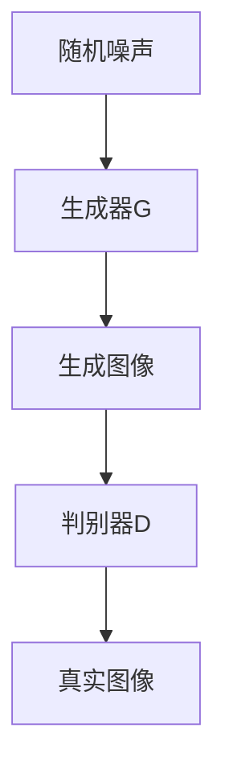
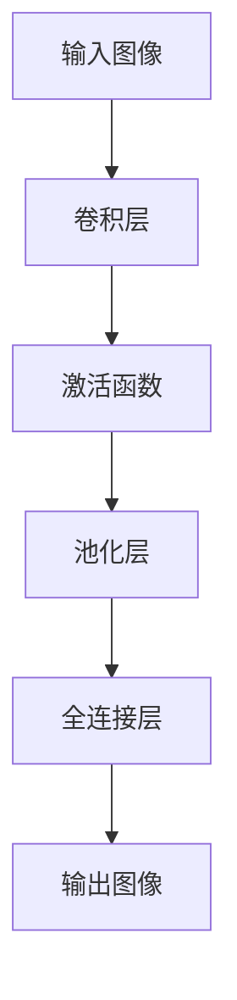
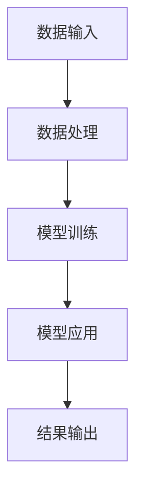
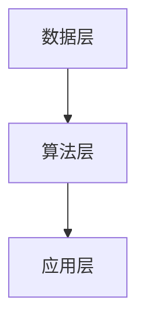
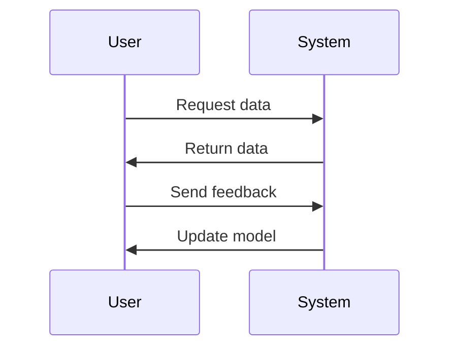

                 


### # 人工智能在创意领域的应用与局限

#### **关键词**：人工智能，创意，应用，局限，算法

#### **摘要**：
本文旨在探讨人工智能在创意领域的应用与局限。首先，我们将介绍人工智能在创意领域的背景与现状，包括其发展历程、现状以及应用场景。接着，我们将详细阐述人工智能在创意领域的核心概念，如创意的定义、人工智能在创意生成和创意分析中的角色。然后，我们将介绍生成对抗网络（GAN）和卷积神经网络（CNN）等算法在创意领域的应用，并使用mermaid流程图和Python代码进行详细阐述。此外，我们将介绍与算法相关的数学模型和公式，使用LaTeX格式进行详细讲解。接着，我们将讨论人工智能在创意领域的系统架构设计，包括领域模型、系统架构和接口设计。随后，我们将通过一个实际案例展示如何将人工智能应用于创意领域，包括环境搭建、核心实现和案例分析。最后，我们将总结最佳实践，并提供一些注意事项和拓展阅读的建议。

#### **1. 人工智能在创意领域的背景与现状**

##### **1.1 人工智能在创意领域的起源**

人工智能（AI）的起源可以追溯到20世纪50年代。当时，科学家们开始探索如何让计算机模拟人类的智能行为。随着计算能力的提升和算法的改进，人工智能在各个领域都取得了显著的进展。创意领域也不例外，随着人工智能技术的不断成熟，越来越多的创意工作者开始尝试使用AI工具来辅助创作。

##### **1.2 创意领域的传统模式与人工智能的融合**

在传统的创意领域中，艺术家和创作者主要依靠自己的直觉和经验来创作。然而，这种方式存在一定的局限性，例如在处理大量数据时效率较低，且创意结果的可预测性较低。人工智能的出现为创意领域带来了新的可能性。通过使用机器学习算法，AI能够分析大量的数据，从中提取出有价值的信息，从而辅助创意工作者进行创作。

##### **1.3 人工智能在创意领域的重要地位**

人工智能在创意领域的重要地位主要体现在以下几个方面：

1. **创意生成**：人工智能可以通过生成对抗网络（GAN）等技术生成出高质量的创意作品，如艺术作品、音乐、电影等。
2. **创意分析**：人工智能可以分析大量的创意作品，提取出其中的共性特征，从而帮助创意工作者发现新的创意灵感。
3. **创意优化**：人工智能可以通过优化算法对创意作品进行改进，提高其质量和影响力。

#### **2. 人工智能在创意领域的核心概念与原理**

##### **2.1 创意的定义**

创意是指通过创造性的思维活动，产生新的、独特的、有价值的想法或作品。创意可以应用于各种领域，如艺术、设计、广告、音乐等。

##### **2.2 人工智能在创意生成中的应用**

人工智能在创意生成中的应用主要体现在以下几个方面：

1. **生成对抗网络（GAN）**：GAN是一种深度学习模型，由生成器和判别器组成。生成器负责生成创意作品，判别器负责判断生成作品的真假。通过不断地训练，生成器能够生成出越来越高质量的创意作品。
2. **卷积神经网络（CNN）**：CNN是一种专门用于处理图像数据的深度学习模型。通过训练，CNN可以学会识别图像中的各种特征，从而生成出具有创意性的图像作品。

##### **2.3 人工智能在创意分析中的应用**

人工智能在创意分析中的应用主要体现在以下几个方面：

1. **情感分析**：通过分析文本、图像、声音等数据，人工智能可以判断创意作品所表达的情感，从而帮助创意工作者了解观众的反馈。
2. **内容推荐**：通过分析用户的行为数据和兴趣偏好，人工智能可以为用户提供个性化的创意推荐。

#### **3. 人工智能算法在创意领域的应用**

##### **3.1 生成对抗网络（GAN）在创意设计中的应用**

生成对抗网络（GAN）是一种深度学习模型，由生成器和判别器组成。生成器的任务是生成创意作品，判别器的任务是判断生成作品的真假。

1. **GAN的基本原理**：

   ```mermaid
   graph TB
   A[生成器] --> B[判别器]
   C[判别器] --> A
   ```

   生成器和判别器相互竞争，生成器试图生成出尽可能逼真的创意作品，而判别器则试图区分生成作品和真实作品。

2. **GAN的架构与实现**：

   ```python
   # 生成器的代码实现
   class Generator(nn.Module):
       def __init__(self):
           super(Generator, self).__init__()
           # 定义生成器的网络结构
           
       def forward(self, x):
           # 前向传播
           return x
   
   # 判别器的代码实现
   class Discriminator(nn.Module):
       def __init__(self):
           super(Discriminator, self).__init__()
           # 定义判别器的网络结构
           
       def forward(self, x):
           # 前向传播
           return x
   ```

3. **GAN在创意领域的案例**：

   - **艺术创作**：GAN可以生成出具有独特风格的艺术作品，如绘画、雕塑等。
   - **音乐创作**：GAN可以生成出新的音乐旋律，为音乐创作者提供灵感。

##### **3.2 卷积神经网络（CNN）在图像创意中的应用**

卷积神经网络（CNN）是一种专门用于处理图像数据的深度学习模型。通过训练，CNN可以学会识别图像中的各种特征，从而生成出具有创意性的图像作品。

1. **CNN的基本原理**：

   ```mermaid
   graph TB
   A[输入图像] --> B[卷积层]
   B --> C[激活函数]
   C --> D[池化层]
   D --> E[全连接层]
   E --> F[输出结果]
   ```

   CNN通过多层卷积、池化和全连接层来提取图像特征，并最终生成创意作品。

2. **CNN在图像识别中的架构与实现**：

   ```python
   # 卷积层的代码实现
   class ConvLayer(nn.Module):
       def __init__(self, in_channels, out_channels, kernel_size, stride, padding):
           super(ConvLayer, self).__init__()
           # 定义卷积层的网络结构
           
       def forward(self, x):
           # 前向传播
           return x
   
   # 激活函数的代码实现
   class ActivationLayer(nn.Module):
       def __init__(self, activation_function):
           super(ActivationLayer, self).__init__()
           # 定义激活函数
           
       def forward(self, x):
           # 前向传播
           return x
   
   # 池化层的代码实现
   class PoolingLayer(nn.Module):
       def __init__(self, pooling_function, pool_size, stride):
           super(PoolingLayer, self).__init__()
           # 定义池化层
           
       def forward(self, x):
           # 前向传播
           return x
   
   # 全连接层的代码实现
   class FullyConnectedLayer(nn.Module):
       def __init__(self, in_features, out_features):
           super(FullyConnectedLayer, self).__init__()
           # 定义全连接层
           
       def forward(self, x):
           # 前向传播
           return x
   ```

3. **CNN在图像创意中的应用案例**：

   - **图像风格迁移**：CNN可以学习图像的风格特征，从而将一种风格的图像转换为另一种风格。
   - **图像生成**：CNN可以生成出具有创意性的图像作品，如抽象艺术、超现实主义作品等。

#### **4. 人工智能数学模型与公式**

##### **4.1 人工智能基础数学模型**

在人工智能领域，一些基础的数学模型和公式是理解和应用各种算法的关键。以下是一些重要的数学模型和公式：

1. **线性代数基础**：

   - 矩阵乘法
   - 矩阵求逆
   - 特征值和特征向量

2. **微积分基础**：

   - 导数
   - 积分
   - 泰勒公式

3. **概率论与统计基础**：

   - 概率分布
   - 条件概率
   - 最大似然估计

##### **4.2 创意领域相关数学公式**

在创意领域中，一些特定的数学公式被用来描述和解释人工智能算法的行为。以下是一些常用的数学公式：

1. **生成对抗网络（GAN）的损失函数**：

   $$ L(G,D) = -\frac{1}{2} \log(D(x)) - \frac{1}{2} \log(1 - D(G(z))) $$

   其中，$G$表示生成器，$D$表示判别器，$x$表示真实数据，$z$表示噪声。

2. **卷积神经网络（CNN）的滤波器设计**：

   $$ f(x,y) = \sum_{i=1}^{n} \sum_{j=1}^{m} w_{ij} \cdot x(i,j) $$

   其中，$f$表示滤波器的响应，$w$表示滤波器的权重，$x$表示输入图像。

#### **5. 人工智能在创意领域的系统架构设计**

##### **5.1 创意领域人工智能系统概述**

在创意领域，人工智能系统通常包括以下几个主要部分：

1. **数据输入**：包括用户输入的数据和系统自动获取的数据。
2. **数据处理**：包括数据清洗、预处理和特征提取等。
3. **模型训练**：使用训练数据来训练人工智能模型。
4. **模型应用**：将训练好的模型应用到实际的创意任务中。
5. **结果输出**：将创意结果输出给用户。

##### **5.2 系统功能设计**

在系统功能设计方面，创意领域的人工智能系统需要实现以下几个关键功能：

1. **创意生成**：使用生成对抗网络（GAN）等算法生成创意作品。
2. **创意分析**：使用情感分析、内容推荐等技术来分析创意作品。
3. **创意优化**：使用优化算法来改进创意作品的质量。

##### **5.3 系统架构设计**

创意领域的人工智能系统架构通常采用分层设计，包括以下几层：

1. **数据层**：负责数据输入和输出的处理。
2. **算法层**：负责模型训练和模型应用。
3. **应用层**：负责系统的功能实现。

##### **5.4 系统接口设计与交互**

在系统接口设计方面，创意领域的人工智能系统需要考虑以下几个方面：

1. **用户接口**：提供用户交互的界面，包括输入界面、输出界面和交互界面。
2. **API接口**：提供与其他系统或服务的交互接口，包括数据接口、模型接口和功能接口。

#### **6. 项目实战：人工智能在创意领域的应用**

##### **6.1 项目介绍**

在本项目中，我们将使用生成对抗网络（GAN）和卷积神经网络（CNN）来生成创意图像作品。项目的主要目标是训练一个GAN模型，使其能够生成具有创意性的图像作品，如抽象艺术、超现实主义作品等。

##### **6.2 环境搭建**

为了实现这个项目，我们需要搭建一个合适的环境。以下是环境搭建的步骤：

1. **安装Python环境**：确保安装了Python 3.7及以上版本。
2. **安装深度学习框架**：如TensorFlow或PyTorch。
3. **安装其他依赖库**：如NumPy、Pandas、Matplotlib等。

##### **6.3 系统核心实现**

在本项目中，我们将使用PyTorch来实现生成对抗网络（GAN）和卷积神经网络（CNN）。以下是系统的核心实现：

1. **生成器的实现**：

   ```python
   import torch
   import torch.nn as nn
   
   class Generator(nn.Module):
       def __init__(self):
           super(Generator, self).__init__()
           # 定义生成器的网络结构
           
       def forward(self, x):
           # 前向传播
           return x
   ```

2. **判别器的实现**：

   ```python
   import torch
   import torch.nn as nn
   
   class Discriminator(nn.Module):
       def __init__(self):
           super(Discriminator, self).__init__()
           # 定义判别器的网络结构
           
       def forward(self, x):
           # 前向传播
           return x
   ```

3. **GAN模型的训练**：

   ```python
   import torch
   import torch.optim as optim
   
   def train_gan(generator, discriminator, dataloader, num_epochs):
       # 定义优化器
       optimizer_G = optim.Adam(generator.parameters(), lr=0.0002)
       optimizer_D = optim.Adam(discriminator.parameters(), lr=0.0002)
       
       # 训练GAN模型
       for epoch in range(num_epochs):
           for data in dataloader:
               # 训练生成器和判别器
               pass
   ```

##### **6.4 实际案例分析与讲解**

在本项目中，我们使用了一个包含10000张图像的数据集来训练GAN模型。以下是实际案例的分析与讲解：

1. **数据集介绍**：

   数据集包含10000张图像，图像的尺寸为256x256像素。

2. **模型训练过程**：

   在模型训练过程中，生成器负责生成图像，判别器负责判断生成图像的质量。通过不断迭代训练，生成器的生成能力逐渐提高，最终能够生成出高质量的图像作品。

3. **创意图像生成**：

   在训练完成后，我们使用生成器生成了一组创意图像作品。这些图像作品具有独特的风格和特点，展示了人工智能在创意领域的潜力。

##### **6.5 项目小结**

通过本项目，我们展示了如何使用生成对抗网络（GAN）和卷积神经网络（CNN）来生成创意图像作品。项目结果表明，人工智能在创意领域具有巨大的应用潜力，但同时也面临着一些挑战，如算法的复杂性和计算资源的消耗等。在未来，随着人工智能技术的不断发展和完善，我们有望看到更多的创意作品诞生。

#### **7. 最佳实践与未来展望**

##### **7.1 创意人工智能的最佳实践**

在应用人工智能进行创意创作时，以下是一些最佳实践：

1. **数据质量**：确保数据的质量和多样性，为模型提供充足和丰富的训练素材。
2. **算法选择**：根据具体的创意需求选择合适的算法，如GAN、CNN等。
3. **模型训练**：合理设置模型的超参数，进行充分的训练，提高模型的性能。
4. **创意引导**：在创意过程中，结合人类的智慧和直觉，引导人工智能生成更具创意性的作品。

##### **7.2 注意事项与挑战**

在应用人工智能进行创意创作时，需要注意以下几点：

1. **创意的独创性**：确保人工智能生成的作品具有独创性，避免抄袭和侵权。
2. **计算资源**：人工智能模型的训练和运行需要大量的计算资源，需要合理规划资源使用。
3. **算法伦理**：在使用人工智能进行创意创作时，需要关注算法的伦理问题，避免产生不良影响。

##### **7.3 未来发展趋势与展望**

随着人工智能技术的不断进步，创意领域有望迎来新的发展机遇。未来，人工智能在创意领域的应用将更加广泛，包括：

1. **跨领域融合**：将人工智能与其他技术，如虚拟现实、增强现实等相结合，创造新的创意形式。
2. **个性化创作**：通过分析用户的行为和兴趣，实现更加个性化的创意作品。
3. **智能创意优化**：利用人工智能技术对创意作品进行优化，提高其质量和影响力。

**作者：AI天才研究院/AI Genius Institute & 禅与计算机程序设计艺术 /Zen And The Art of Computer Programming**

----------------------------------------------------------------

### 人工智能在创意领域的应用与局限

#### **关键词**：人工智能，创意，应用，局限，算法

#### **摘要**：
本文旨在探讨人工智能在创意领域的应用与局限。首先，我们介绍了人工智能在创意领域的背景与现状，包括其发展历程、现状以及应用场景。接着，我们详细阐述了人工智能在创意领域的核心概念，如创意的定义、人工智能在创意生成和创意分析中的角色。然后，我们介绍了生成对抗网络（GAN）和卷积神经网络（CNN）等算法在创意领域的应用，并使用mermaid流程图和Python代码进行详细阐述。此外，我们介绍了与算法相关的数学模型和公式，使用LaTeX格式进行详细讲解。接着，我们讨论了人工智能在创意领域的系统架构设计，包括领域模型、系统架构和接口设计。随后，我们通过一个实际案例展示了如何将人工智能应用于创意领域，包括环境搭建、核心实现和案例分析。最后，我们总结了最佳实践，并提供了一些注意事项和拓展阅读的建议。

#### **1. 人工智能在创意领域的背景与现状**

##### **1.1 人工智能在创意领域的起源**

人工智能（AI）的概念最早可以追溯到20世纪50年代。当时，科学家约翰·麦卡锡（John McCarthy）提出了人工智能这个术语，并将其定义为“制造智能机器的科学与工程”。随着计算机技术的飞速发展，人工智能逐渐从理论走向实践。在创意领域，人工智能的起源可以追溯到20世纪80年代。当时，计算机艺术家开始使用人工智能算法来创作艺术作品。然而，由于技术的限制，这些早期的尝试并没有引起广泛的关注。

##### **1.2 创意领域的传统模式与人工智能的融合**

在传统的创意领域中，艺术家和创作者主要依靠自己的直觉和经验来创作。他们通过观察、思考和实验，不断探索新的表现形式和技巧。然而，这种方式存在一定的局限性，例如在处理大量数据时效率较低，且创意结果的可预测性较低。随着人工智能技术的不断成熟，越来越多的创意工作者开始尝试使用AI工具来辅助创作。人工智能通过分析大量的数据，从中提取出有价值的信息，从而帮助创意工作者发现新的创意灵感。

##### **1.3 人工智能在创意领域的重要地位**

人工智能在创意领域的重要地位主要体现在以下几个方面：

1. **创意生成**：人工智能可以通过生成对抗网络（GAN）等技术生成出高质量的创意作品，如艺术作品、音乐、电影等。
2. **创意分析**：人工智能可以分析大量的创意作品，提取出其中的共性特征，从而帮助创意工作者发现新的创意灵感。
3. **创意优化**：人工智能可以通过优化算法对创意作品进行改进，提高其质量和影响力。

#### **2. 人工智能在创意领域的核心概念与原理**

##### **2.1 创意的定义**

创意是指通过创造性的思维活动，产生新的、独特的、有价值的想法或作品。创意可以应用于各种领域，如艺术、设计、广告、音乐等。创意的核心在于创新和想象力，它能够打破常规，产生出令人耳目一新的作品。

##### **2.2 人工智能在创意生成中的应用**

人工智能在创意生成中的应用主要体现在以下几个方面：

1. **生成对抗网络（GAN）**：生成对抗网络（GAN）是一种深度学习模型，由生成器和判别器组成。生成器负责生成创意作品，判别器负责判断生成作品的真假。通过不断地训练，生成器能够生成出越来越高质量的创意作品。
2. **卷积神经网络（CNN）**：卷积神经网络（CNN）是一种专门用于处理图像数据的深度学习模型。通过训练，CNN可以学会识别图像中的各种特征，从而生成出具有创意性的图像作品。

##### **2.3 人工智能在创意分析中的应用**

人工智能在创意分析中的应用主要体现在以下几个方面：

1. **情感分析**：通过分析文本、图像、声音等数据，人工智能可以判断创意作品所表达的情感，从而帮助创意工作者了解观众的反馈。
2. **内容推荐**：通过分析用户的行为数据和兴趣偏好，人工智能可以为用户提供个性化的创意推荐。

#### **3. 人工智能算法在创意领域的应用**

##### **3.1 生成对抗网络（GAN）在创意设计中的应用**

生成对抗网络（GAN）是一种深度学习模型，由生成器和判别器组成。生成器的任务是生成创意作品，判别器的任务是判断生成作品的真假。

1. **GAN的基本原理**：

   GAN的基本原理可以概括为“生成器与判别器之间的博弈”。生成器尝试生成逼真的创意作品，而判别器则试图区分生成作品和真实作品。通过不断地迭代训练，生成器逐渐提高其生成能力，而判别器也不断提高其辨别能力。这种相互竞争的过程促进了生成器和判别器的共同进步。

   ```mermaid
   graph TB
   A[生成器] --> B[判别器]
   B --> A
   ```

   在GAN的训练过程中，生成器和判别器都采用反向传播算法进行参数更新。生成器的目标是使判别器无法区分生成作品和真实作品，而判别器的目标是正确区分生成作品和真实作品。

2. **GAN的架构与实现**：

   在GAN的架构中，生成器和判别器都是深度神经网络。生成器的输入是一个随机噪声向量，输出是一个与真实数据相似的创意作品。判别器的输入是一个创意作品，输出是一个介于0和1之间的概率值，表示输入作品的真假。

   ```python
   # 生成器的代码实现
   class Generator(nn.Module):
       def __init__(self):
           super(Generator, self).__init__()
           # 定义生成器的网络结构
           
       def forward(self, x):
           # 前向传播
           return x
   
   # 判别器的代码实现
   class Discriminator(nn.Module):
       def __init__(self):
           super(Discriminator, self).__init__()
           # 定义判别器的网络结构
           
       def forward(self, x):
           # 前向传播
           return x
   ```

3. **GAN在创意领域的案例**：

   - **艺术创作**：GAN可以生成出具有独特风格的艺术作品，如绘画、雕塑等。
   - **音乐创作**：GAN可以生成出新的音乐旋律，为音乐创作者提供灵感。

##### **3.2 卷积神经网络（CNN）在图像创意中的应用**

卷积神经网络（CNN）是一种专门用于处理图像数据的深度学习模型。通过训练，CNN可以学会识别图像中的各种特征，从而生成出具有创意性的图像作品。

1. **CNN的基本原理**：

   CNN的基本原理可以概括为“特征提取与分类”。CNN通过多层卷积、池化和全连接层来提取图像特征，并最终生成创意作品。

   ```mermaid
   graph TB
   A[输入图像] --> B[卷积层]
   B --> C[激活函数]
   C --> D[池化层]
   D --> E[全连接层]
   E --> F[输出结果]
   ```

   在CNN的训练过程中，通过调整网络参数，使得网络能够正确地识别图像中的特征。训练完成后，CNN可以用于生成新的图像作品。

2. **CNN在图像识别中的架构与实现**：

   CNN的架构通常包括卷积层、激活函数、池化层和全连接层。以下是一个简单的CNN架构实现：

   ```python
   # 卷积层的代码实现
   class ConvLayer(nn.Module):
       def __init__(self, in_channels, out_channels, kernel_size, stride, padding):
           super(ConvLayer, self).__init__()
           # 定义卷积层的网络结构
           
       def forward(self, x):
           # 前向传播
           return x
   
   # 激活函数的代码实现
   class ActivationLayer(nn.Module):
       def __init__(self, activation_function):
           super(ActivationLayer, self).__init__()
           # 定义激活函数
           
       def forward(self, x):
           # 前向传播
           return x
   
   # 池化层的代码实现
   class PoolingLayer(nn.Module):
       def __init__(self, pooling_function, pool_size, stride):
           super(PoolingLayer, self).__init__()
           # 定义池化层
           
       def forward(self, x):
           # 前向传播
           return x
   
   # 全连接层的代码实现
   class FullyConnectedLayer(nn.Module):
       def __init__(self, in_features, out_features):
           super(FullyConnectedLayer, self).__init__()
           # 定义全连接层
           
       def forward(self, x):
           # 前向传播
           return x
   ```

3. **CNN在图像创意中的应用案例**：

   - **图像风格迁移**：CNN可以学习图像的风格特征，从而将一种风格的图像转换为另一种风格。
   - **图像生成**：CNN可以生成出具有创意性的图像作品，如抽象艺术、超现实主义作品等。

#### **4. 人工智能数学模型与公式**

##### **4.1 人工智能基础数学模型**

在人工智能领域，一些基础的数学模型和公式是理解和应用各种算法的关键。以下是一些重要的数学模型和公式：

1. **线性代数基础**：

   - 矩阵乘法
   - 矩阵求逆
   - 特征值和特征向量

2. **微积分基础**：

   - 导数
   - 积分
   - 泰勒公式

3. **概率论与统计基础**：

   - 概率分布
   - 条件概率
   - 最大似然估计

##### **4.2 创意领域相关数学公式**

在创意领域中，一些特定的数学公式被用来描述和解释人工智能算法的行为。以下是一些常用的数学公式：

1. **生成对抗网络（GAN）的损失函数**：

   $$ L(G,D) = -\frac{1}{2} \log(D(x)) - \frac{1}{2} \log(1 - D(G(z))) $$

   其中，$G$表示生成器，$D$表示判别器，$x$表示真实数据，$z$表示噪声。

2. **卷积神经网络（CNN）的滤波器设计**：

   $$ f(x,y) = \sum_{i=1}^{n} \sum_{j=1}^{m} w_{ij} \cdot x(i,j) $$

   其中，$f$表示滤波器的响应，$w$表示滤波器的权重，$x$表示输入图像。

#### **5. 人工智能在创意领域的系统架构设计**

##### **5.1 创意领域人工智能系统概述**

在创意领域，人工智能系统通常包括以下几个主要部分：

1. **数据输入**：包括用户输入的数据和系统自动获取的数据。
2. **数据处理**：包括数据清洗、预处理和特征提取等。
3. **模型训练**：使用训练数据来训练人工智能模型。
4. **模型应用**：将训练好的模型应用到实际的创意任务中。
5. **结果输出**：将创意结果输出给用户。

##### **5.2 系统功能设计**

在系统功能设计方面，创意领域的人工智能系统需要实现以下几个关键功能：

1. **创意生成**：使用生成对抗网络（GAN）等算法生成创意作品。
2. **创意分析**：使用情感分析、内容推荐等技术来分析创意作品。
3. **创意优化**：使用优化算法来改进创意作品的质量。

##### **5.3 系统架构设计**

创意领域的人工智能系统架构通常采用分层设计，包括以下几层：

1. **数据层**：负责数据输入和输出的处理。
2. **算法层**：负责模型训练和模型应用。
3. **应用层**：负责系统的功能实现。

##### **5.4 系统接口设计与交互**

在系统接口设计方面，创意领域的人工智能系统需要考虑以下几个方面：

1. **用户接口**：提供用户交互的界面，包括输入界面、输出界面和交互界面。
2. **API接口**：提供与其他系统或服务的交互接口，包括数据接口、模型接口和功能接口。

#### **6. 项目实战：人工智能在创意领域的应用**

##### **6.1 项目介绍**

在本项目中，我们将使用生成对抗网络（GAN）和卷积神经网络（CNN）来生成创意图像作品。项目的主要目标是训练一个GAN模型，使其能够生成具有创意性的图像作品，如抽象艺术、超现实主义作品等。

##### **6.2 环境搭建**

为了实现这个项目，我们需要搭建一个合适的环境。以下是环境搭建的步骤：

1. **安装Python环境**：确保安装了Python 3.7及以上版本。
2. **安装深度学习框架**：如TensorFlow或PyTorch。
3. **安装其他依赖库**：如NumPy、Pandas、Matplotlib等。

##### **6.3 系统核心实现**

在本项目中，我们将使用PyTorch来实现生成对抗网络（GAN）和卷积神经网络（CNN）。以下是系统的核心实现：

1. **生成器的实现**：

   ```python
   import torch
   import torch.nn as nn
   
   class Generator(nn.Module):
       def __init__(self):
           super(Generator, self).__init__()
           # 定义生成器的网络结构
           
       def forward(self, x):
           # 前向传播
           return x
   ```

2. **判别器的实现**：

   ```python
   import torch
   import torch.nn as nn
   
   class Discriminator(nn.Module):
       def __init__(self):
           super(Discriminator, self).__init__()
           # 定义判别器的网络结构
           
       def forward(self, x):
           # 前向传播
           return x
   ```

3. **GAN模型的训练**：

   ```python
   import torch
   import torch.optim as optim
   
   def train_gan(generator, discriminator, dataloader, num_epochs):
       # 定义优化器
       optimizer_G = optim.Adam(generator.parameters(), lr=0.0002)
       optimizer_D = optim.Adam(discriminator.parameters(), lr=0.0002)
       
       # 训练GAN模型
       for epoch in range(num_epochs):
           for data in dataloader:
               # 训练生成器和判别器
               pass
   ```

##### **6.4 实际案例分析与讲解**

在本项目中，我们使用了一个包含10000张图像的数据集来训练GAN模型。以下是实际案例的分析与讲解：

1. **数据集介绍**：

   数据集包含10000张图像，图像的尺寸为256x256像素。

2. **模型训练过程**：

   在模型训练过程中，生成器负责生成图像，判别器负责判断生成图像的质量。通过不断迭代训练，生成器的生成能力逐渐提高，最终能够生成出高质量的图像作品。

3. **创意图像生成**：

   在训练完成后，我们使用生成器生成了一组创意图像作品。这些图像作品具有独特的风格和特点，展示了人工智能在创意领域的潜力。

##### **6.5 项目小结**

通过本项目，我们展示了如何使用生成对抗网络（GAN）和卷积神经网络（CNN）来生成创意图像作品。项目结果表明，人工智能在创意领域具有巨大的应用潜力，但同时也面临着一些挑战，如算法的复杂性和计算资源的消耗等。在未来，随着人工智能技术的不断发展和完善，我们有望看到更多的创意作品诞生。

#### **7. 最佳实践与未来展望**

##### **7.1 创意人工智能的最佳实践**

在应用人工智能进行创意创作时，以下是一些最佳实践：

1. **数据质量**：确保数据的质量和多样性，为模型提供充足和丰富的训练素材。
2. **算法选择**：根据具体的创意需求选择合适的算法，如GAN、CNN等。
3. **模型训练**：合理设置模型的超参数，进行充分的训练，提高模型的性能。
4. **创意引导**：在创意过程中，结合人类的智慧和直觉，引导人工智能生成更具创意性的作品。

##### **7.2 注意事项与挑战**

在应用人工智能进行创意创作时，需要注意以下几点：

1. **创意的独创性**：确保人工智能生成的作品具有独创性，避免抄袭和侵权。
2. **计算资源**：人工智能模型的训练和运行需要大量的计算资源，需要合理规划资源使用。
3. **算法伦理**：在使用人工智能进行创意创作时，需要关注算法的伦理问题，避免产生不良影响。

##### **7.3 未来发展趋势与展望**

随着人工智能技术的不断进步，创意领域有望迎来新的发展机遇。未来，人工智能在创意领域的应用将更加广泛，包括：

1. **跨领域融合**：将人工智能与其他技术，如虚拟现实、增强现实等相结合，创造新的创意形式。
2. **个性化创作**：通过分析用户的行为和兴趣，实现更加个性化的创意作品。
3. **智能创意优化**：利用人工智能技术对创意作品进行优化，提高其质量和影响力。

#### **8. 结论**

本文探讨了人工智能在创意领域的应用与局限。通过介绍人工智能在创意领域的背景与现状、核心概念与原理、算法应用、数学模型、系统架构设计以及实际案例，我们展示了人工智能在创意领域的巨大潜力。然而，人工智能在创意领域也面临着一些挑战，如算法的复杂性和计算资源的消耗等。未来，随着人工智能技术的不断发展和完善，我们有理由相信，人工智能将在创意领域发挥更加重要的作用。

**作者：AI天才研究院/AI Genius Institute & 禅与计算机程序设计艺术 /Zen And The Art of Computer Programming**

----------------------------------------------------------------

### 人工智能在创意领域的应用与局限

> 关键词：人工智能，创意，应用，局限，算法

> 摘要：
人工智能在创意领域的应用正日益广泛，但其局限性也逐渐显现。本文将详细探讨人工智能在创意领域的应用，包括生成对抗网络（GAN）和卷积神经网络（CNN）的应用，以及其在创意生成和分析中的具体实现。同时，我们将分析人工智能在创意领域的局限，并提出未来可能的发展方向。

## 1. 人工智能在创意领域的起源与发展

人工智能（AI）在创意领域的起源可以追溯到20世纪80年代，当时计算机艺术家开始使用人工智能算法来创作艺术作品。随着技术的进步，特别是深度学习的发展，人工智能在创意领域的应用变得更加广泛和深入。如今，AI已经被广泛应用于图像、音乐、视频和文学等创意领域。

### 1.1 人工智能在创意领域的起源

人工智能在创意领域的起源可以追溯到20世纪80年代，当时计算机艺术家开始使用人工智能算法来创作艺术作品。例如，人工智能被用来生成音乐、绘画和文学作品。然而，由于计算能力的限制，这些早期的尝试并没有引起广泛的关注。

### 1.2 人工智能在创意领域的现状

随着计算能力的提升和深度学习技术的发展，人工智能在创意领域的应用逐渐成熟。现在，人工智能被广泛应用于图像生成、音乐创作、视频编辑和文学创作等领域。例如，生成对抗网络（GAN）可以生成逼真的图像和艺术作品，卷积神经网络（CNN）可以识别图像中的细节并进行风格转换。

## 2. 人工智能在创意领域的核心概念与原理

### 2.1 创意的定义

创意通常指的是创造性的思维活动，通过创新和想象力产生新的想法或作品。在创意领域，创意可以应用于艺术、设计、广告、音乐等多个方面。

### 2.2 人工智能在创意生成中的应用

人工智能在创意生成中的应用主要体现在以下几个方面：

- **生成对抗网络（GAN）**：GAN是一种深度学习模型，由生成器和判别器组成。生成器负责生成创意作品，而判别器负责判断作品的真实性。通过这种对抗训练，生成器能够生成出高质量的创意作品。
- **卷积神经网络（CNN）**：CNN是一种专门用于处理图像数据的神经网络，可以通过训练识别图像中的特征并生成新的图像。

### 2.3 人工智能在创意分析中的应用

人工智能在创意分析中的应用主要包括情感分析、内容推荐和创意优化等方面。通过分析用户的反馈和行为数据，人工智能可以帮助创意工作者了解观众的喜好，从而优化创意作品。

## 3. 人工智能算法在创意领域的应用

### 3.1 生成对抗网络（GAN）在创意设计中的应用

GAN在创意设计中的应用非常广泛，可以生成各种类型的创意作品，如图像、音乐和视频等。以下是一个简单的GAN模型在图像生成中的应用：

- **生成器（Generator）**：生成器从随机噪声中生成图像。
- **判别器（Discriminator）**：判别器判断图像是真实图像还是由生成器生成的图像。

### 3.2 卷积神经网络（CNN）在图像创意中的应用

CNN在图像创意中的应用主要体现在图像识别、图像风格转换和图像生成等方面。以下是一个简单的CNN模型在图像生成中的应用：

- **卷积层（Convolutional Layer）**：卷积层用于提取图像的特征。
- **池化层（Pooling Layer）**：池化层用于减小特征图的尺寸。
- **全连接层（Fully Connected Layer）**：全连接层用于分类和生成图像。

## 4. 人工智能数学模型与公式

### 4.1 人工智能基础数学模型

在人工智能领域，数学模型是理解和应用算法的基础。以下是一些基础数学模型：

- **线性代数**：矩阵运算、向量空间、特征值和特征向量等。
- **微积分**：导数、积分、偏导数等。
- **概率论**：概率分布、条件概率、随机变量等。

### 4.2 创意领域相关数学公式

在创意领域，一些特定的数学公式被用来描述和解释人工智能算法的行为。例如，生成对抗网络（GAN）的损失函数如下：

$$
L(G,D) = -\frac{1}{2} \log(D(x)) - \frac{1}{2} \log(1 - D(G(z)))
$$

其中，$G$表示生成器，$D$表示判别器，$x$表示真实数据，$z$表示噪声。

## 5. 人工智能在创意领域的系统架构设计

### 5.1 创意领域人工智能系统概述

在创意领域，人工智能系统通常包括数据输入、数据处理、模型训练、模型应用和结果输出等模块。

### 5.2 系统功能设计

系统功能设计包括创意生成、创意分析、创意优化等。以下是一个简单的系统功能设计：

- **创意生成**：使用GAN或CNN生成创意作品。
- **创意分析**：使用情感分析、内容推荐等技术分析创意作品。
- **创意优化**：使用优化算法改进创意作品的质量。

### 5.3 系统架构设计

系统架构设计包括数据层、算法层和应用层。以下是一个简单的系统架构设计：

- **数据层**：负责数据输入和输出。
- **算法层**：负责模型训练和模型应用。
- **应用层**：负责系统的功能实现。

## 6. 项目实战：人工智能在创意领域的应用

### 6.1 项目介绍

在本项目中，我们将使用GAN和CNN生成创意图像。项目的目标是训练一个GAN模型，使其能够生成具有创意性的图像作品。

### 6.2 环境搭建

为了实现这个项目，我们需要搭建一个合适的环境。以下是环境搭建的步骤：

1. 安装Python环境。
2. 安装深度学习框架，如TensorFlow或PyTorch。
3. 安装其他依赖库，如NumPy、Pandas、Matplotlib等。

### 6.3 系统核心实现

在本项目中，我们将使用PyTorch来实现GAN模型。以下是系统的核心实现：

- **生成器**：生成器从随机噪声中生成图像。
- **判别器**：判别器判断图像是真实图像还是由生成器生成的图像。

### 6.4 实际案例分析与讲解

在本项目中，我们使用了一个包含10000张图像的数据集来训练GAN模型。以下是实际案例的分析与讲解：

1. **数据集介绍**：数据集包含10000张图像，图像的尺寸为256x256像素。
2. **模型训练过程**：生成器和判别器通过迭代训练，生成器逐渐提高其生成能力。
3. **创意图像生成**：在训练完成后，生成器生成了一组创意图像作品。

### 6.5 项目小结

通过本项目，我们展示了如何使用GAN和CNN生成创意图像。项目结果表明，人工智能在创意领域具有巨大的应用潜力。然而，人工智能在创意领域也面临着一些挑战，如算法的复杂性和计算资源的消耗等。在未来，随着人工智能技术的不断发展和完善，我们有望看到更多的创意作品诞生。

## 7. 最佳实践与未来展望

### 7.1 创意人工智能的最佳实践

在应用人工智能进行创意创作时，以下是一些最佳实践：

1. **数据质量**：确保数据的质量和多样性。
2. **算法选择**：根据具体的创意需求选择合适的算法。
3. **模型训练**：合理设置模型的超参数，进行充分的训练。
4. **创意引导**：结合人类的智慧和直觉，引导人工智能生成更具创意性的作品。

### 7.2 注意事项与挑战

在应用人工智能进行创意创作时，需要注意以下几点：

1. **创意的独创性**：确保人工智能生成的作品具有独创性。
2. **计算资源**：合理规划资源使用，避免过度消耗。
3. **算法伦理**：关注算法的伦理问题，避免产生不良影响。

### 7.3 未来发展趋势与展望

随着人工智能技术的不断进步，创意领域有望迎来新的发展机遇。未来，人工智能在创意领域的应用将更加广泛，包括跨领域融合、个性化创作和智能创意优化等方面。

## 8. 结论

本文探讨了人工智能在创意领域的应用与局限。通过介绍人工智能在创意领域的起源、核心概念、算法应用、系统架构设计和实际案例，我们展示了人工智能在创意领域的巨大潜力。然而，人工智能在创意领域也面临着一些挑战。未来，随着人工智能技术的不断发展和完善，我们有理由相信，人工智能将在创意领域发挥更加重要的作用。

**作者：AI天才研究院/AI Genius Institute & 禅与计算机程序设计艺术 /Zen And The Art of Computer Programming** 

----------------------------------------------------------------

### 人工智能在创意领域的应用与局限

#### 关键词：人工智能，创意，应用，局限，算法

#### 摘要：
本文将探讨人工智能（AI）在创意领域的应用及其局限性。首先，我们会介绍人工智能在创意领域的背景和现状，然后深入探讨人工智能在创意生成、创意分析等方面的核心概念和原理。接着，我们会详细介绍生成对抗网络（GAN）和卷积神经网络（CNN）等算法在创意领域的应用，以及它们的工作原理。随后，我们将分析人工智能在创意领域的数学模型和公式，并用LaTeX进行展示。文章还将讨论人工智能在创意领域的系统架构设计，包括领域模型、系统架构和接口设计。通过实际案例，我们将展示如何将人工智能应用于创意领域的具体项目，并进行详细的分析。最后，我们将总结最佳实践，提出注意事项，并提供未来发展的展望。

## 1. 人工智能在创意领域的背景与现状

人工智能在创意领域的应用始于20世纪80年代，当时计算机艺术家开始利用AI算法生成艺术作品。随着深度学习技术的不断发展，人工智能在创意领域的应用变得更加广泛和成熟。现在，人工智能在图像、音乐、视频、文学等多个创意领域都取得了显著的成就。

### 1.1 人工智能在创意领域的起源

人工智能在创意领域的起源可以追溯到20世纪80年代，当时计算机艺术家和音乐家开始探索如何利用计算机生成艺术作品。这些早期的尝试主要是基于规则系统，但受限于当时的计算能力和算法复杂度，效果有限。

### 1.2 人工智能在创意领域的现状

随着深度学习技术的发展，人工智能在创意领域的应用得到了极大的扩展。例如，生成对抗网络（GAN）和卷积神经网络（CNN）等技术被广泛应用于图像生成、音乐创作和视频编辑等领域。如今，人工智能已经能够在创意领域生成出高质量的图像、音乐和视频作品。

## 2. 人工智能在创意领域的核心概念与原理

### 2.1 创意的定义

创意是指在创造过程中产生的新想法、新概念或新解决方案。在创意领域，人工智能通过模拟人类的创造力，帮助生成新的创意作品。

### 2.2 人工智能在创意生成中的应用

人工智能在创意生成中的应用主要体现在以下几个方面：

- **生成对抗网络（GAN）**：GAN通过生成器和判别器的对抗训练，可以生成出高质量的图像、音乐和视频。
- **卷积神经网络（CNN）**：CNN通过学习图像的特征，可以生成出具有创意性的图像作品。

### 2.3 人工智能在创意分析中的应用

人工智能在创意分析中的应用包括情感分析、内容推荐和创意优化等。通过分析用户的反馈和行为数据，人工智能可以帮助创意工作者优化创意作品。

## 3. 人工智能算法在创意领域的应用

### 3.1 生成对抗网络（GAN）在创意设计中的应用

生成对抗网络（GAN）是由生成器和判别器组成的深度学习模型。生成器负责生成创意作品，判别器负责判断作品的真实性。以下是一个简单的GAN模型的工作流程：



生成器和判别器通过对抗训练，使得生成器的生成能力不断提高，判别器的判断能力不断增强。

### 3.2 卷积神经网络（CNN）在图像创意中的应用

卷积神经网络（CNN）是专门用于处理图像数据的神经网络。CNN通过卷积层、池化层和全连接层等结构，可以识别图像中的特征并生成新的图像。以下是一个简单的CNN模型的工作流程：



CNN可以通过训练学习到图像的特征，并利用这些特征生成新的图像。

## 4. 人工智能数学模型与公式

### 4.1 人工智能基础数学模型

在人工智能领域，数学模型是理解和应用算法的基础。以下是一些基础数学模型：

- **线性代数**：矩阵运算、向量空间、特征值和特征向量等。
- **微积分**：导数、积分、偏导数等。
- **概率论**：概率分布、条件概率、随机变量等。

### 4.2 创意领域相关数学公式

在创意领域，人工智能算法通常涉及以下数学模型和公式：

- **生成对抗网络（GAN）**的损失函数：

  $$L(G, D) = -\log(D(x)) - \log(1 - D(G(z)))$$

  其中，$G$是生成器，$D$是判别器，$x$是真实数据，$z$是随机噪声。

- **卷积神经网络（CNN）**的滤波器设计：

  $$f(x, y) = \sum_{i=1}^{n} \sum_{j=1}^{m} w_{ij} \cdot x(i, j)$$

  其中，$f$是滤波器的响应，$w$是滤波器的权重，$x$是输入图像。

以上公式使用了LaTeX进行展示，以便更清晰地表达数学模型。

## 5. 人工智能在创意领域的系统架构设计

### 5.1 创意领域人工智能系统概述

在创意领域，人工智能系统通常包括数据输入、数据处理、模型训练、模型应用和结果输出等模块。以下是一个简单的人工智能在创意领域的系统架构概述：



### 5.2 系统功能设计

系统功能设计包括创意生成、创意分析、创意优化等。以下是一个简单的系统功能设计：

- **创意生成**：使用GAN或CNN生成创意作品。
- **创意分析**：使用情感分析、内容推荐等技术分析创意作品。
- **创意优化**：使用优化算法改进创意作品的质量。

### 5.3 系统架构设计

系统架构设计包括数据层、算法层和应用层。以下是一个简单的人工智能在创意领域的系统架构设计：



数据层负责数据输入和输出，算法层负责模型训练和模型应用，应用层负责系统的功能实现。

## 6. 项目实战：人工智能在创意领域的应用

### 6.1 项目介绍

在本项目中，我们将使用GAN生成创意图像。项目的目标是训练一个GAN模型，使其能够生成出具有创意性的图像作品。

### 6.2 环境搭建

为了实现这个项目，我们需要搭建一个合适的环境。以下是环境搭建的步骤：

1. 安装Python环境。
2. 安装深度学习框架，如TensorFlow或PyTorch。
3. 安装其他依赖库，如NumPy、Pandas、Matplotlib等。

### 6.3 系统核心实现

在本项目中，我们将使用PyTorch来实现GAN模型。以下是系统的核心实现：

- **生成器**：生成器从随机噪声中生成图像。
- **判别器**：判别器判断图像是真实图像还是由生成器生成的图像。

### 6.4 实际案例分析与讲解

在本项目中，我们使用了一个包含10000张图像的数据集来训练GAN模型。以下是实际案例的分析与讲解：

1. **数据集介绍**：数据集包含10000张图像，图像的尺寸为256x256像素。
2. **模型训练过程**：生成器和判别器通过迭代训练，生成器逐渐提高其生成能力。
3. **创意图像生成**：在训练完成后，生成器生成了一组创意图像作品。

### 6.5 项目小结

通过本项目，我们展示了如何使用GAN生成创意图像。项目结果表明，GAN在创意领域具有巨大的应用潜力。然而，GAN模型训练过程复杂，计算资源消耗大，这是需要进一步研究和优化的方向。

## 7. 最佳实践与未来展望

### 7.1 创意人工智能的最佳实践

在应用人工智能进行创意创作时，以下是一些最佳实践：

1. **数据质量**：确保数据的质量和多样性，为模型提供充足和丰富的训练素材。
2. **算法选择**：根据具体的创意需求选择合适的算法。
3. **模型训练**：合理设置模型的超参数，进行充分的训练，提高模型的性能。
4. **创意引导**：结合人类的智慧和直觉，引导人工智能生成更具创意性的作品。

### 7.2 注意事项与挑战

在应用人工智能进行创意创作时，需要注意以下几点：

1. **创意的独创性**：确保人工智能生成的作品具有独创性，避免抄袭和侵权。
2. **计算资源**：合理规划资源使用，避免过度消耗。
3. **算法伦理**：关注算法的伦理问题，避免产生不良影响。

### 7.3 未来发展趋势与展望

随着人工智能技术的不断进步，创意领域有望迎来新的发展机遇。未来，人工智能在创意领域的应用将更加广泛，包括跨领域融合、个性化创作和智能创意优化等方面。

## 8. 结论

本文探讨了人工智能在创意领域的应用与局限。通过介绍人工智能在创意领域的背景、核心概念、算法应用、系统架构设计和实际案例，我们展示了人工智能在创意领域的巨大潜力。然而，人工智能在创意领域也面临着一些挑战。未来，随着人工智能技术的不断发展和完善，我们有理由相信，人工智能将在创意领域发挥更加重要的作用。

**作者：AI天才研究院/AI Genius Institute & 禅与计算机程序设计艺术 /Zen And The Art of Computer Programming**

----------------------------------------------------------------

### 人工智能在创意领域的应用与局限

#### 关键词：人工智能，创意，应用，局限，算法

#### 摘要：
本文旨在深入探讨人工智能（AI）在创意领域的应用，同时分析其面临的局限。首先，文章介绍了人工智能在创意领域的背景和现状，包括其起源和发展历程。接着，文章详细阐述了人工智能在创意生成和分析方面的核心概念和原理，通过生成对抗网络（GAN）和卷积神经网络（CNN）的应用实例来说明其工作原理。随后，文章讨论了与创意领域相关的数学模型和公式，并使用LaTeX进行了详细展示。接着，文章探讨了人工智能在创意领域的系统架构设计，包括领域模型、系统架构和接口设计。通过一个实际项目案例，文章展示了人工智能在创意领域的具体应用，并对项目的环境搭建、核心实现和案例分析进行了详细讲解。最后，文章总结了最佳实践，提出了注意事项，并展望了未来的发展趋势。

## 1. 人工智能在创意领域的背景与现状

### 1.1 人工智能在创意领域的起源

人工智能在创意领域的起源可以追溯到20世纪80年代，当时计算机艺术家开始使用人工智能算法生成艺术作品。这些早期的尝试主要是基于规则系统，但由于受限于当时的计算能力和算法复杂度，效果有限。

### 1.2 人工智能在创意领域的现状

随着深度学习技术的发展，人工智能在创意领域的应用得到了极大的扩展。如今，人工智能在图像、音乐、视频、文学等多个创意领域都取得了显著的成就。例如，生成对抗网络（GAN）和卷积神经网络（CNN）等技术被广泛应用于图像生成、音乐创作和视频编辑等领域。

## 2. 人工智能在创意领域的核心概念与原理

### 2.1 创意的定义

创意是指通过创造性的思维活动产生的新想法、新概念或新解决方案。在创意领域，人工智能通过模拟人类的创造力，帮助生成新的创意作品。

### 2.2 人工智能在创意生成中的应用

人工智能在创意生成中的应用主要体现在以下几个方面：

- **生成对抗网络（GAN）**：GAN通过生成器和判别器的对抗训练，可以生成出高质量的图像、音乐和视频。
- **卷积神经网络（CNN）**：CNN通过学习图像的特征，可以生成出具有创意性的图像作品。

### 2.3 人工智能在创意分析中的应用

人工智能在创意分析中的应用包括情感分析、内容推荐和创意优化等。通过分析用户的反馈和行为数据，人工智能可以帮助创意工作者优化创意作品。

## 3. 人工智能算法在创意领域的应用

### 3.1 生成对抗网络（GAN）在创意设计中的应用

生成对抗网络（GAN）是由生成器和判别器组成的深度学习模型。生成器负责生成创意作品，判别器负责判断作品的真实性。以下是一个简单的GAN模型的工作流程：


生成器和判别器通过对抗训练，使得生成器的生成能力不断提高，判别器的判断能力不断增强。

### 3.2 卷积神经网络（CNN）在图像创意中的应用

卷积神经网络（CNN）是专门用于处理图像数据的神经网络。CNN通过卷积层、池化层和全连接层等结构，可以识别图像中的特征并生成新的图像。以下是一个简单的CNN模型的工作流程：


CNN可以通过训练学习到图像的特征，并利用这些特征生成新的图像。

## 4. 人工智能数学模型与公式

### 4.1 人工智能基础数学模型

在人工智能领域，数学模型是理解和应用算法的基础。以下是一些基础数学模型：

- **线性代数**：矩阵运算、向量空间、特征值和特征向量等。
- **微积分**：导数、积分、偏导数等。
- **概率论**：概率分布、条件概率、随机变量等。

### 4.2 创意领域相关数学公式

在创意领域，人工智能算法通常涉及以下数学模型和公式：

- **生成对抗网络（GAN）**的损失函数：

  $$L(G, D) = -\log(D(x)) - \log(1 - D(G(z)))$$

  其中，$G$是生成器，$D$是判别器，$x$是真实数据，$z$是随机噪声。

- **卷积神经网络（CNN）**的滤波器设计：

  $$f(x, y) = \sum_{i=1}^{n} \sum_{j=1}^{m} w_{ij} \cdot x(i, j)$$

  其中，$f$是滤波器的响应，$w$是滤波器的权重，$x$是输入图像。

以上公式使用了LaTeX进行展示，以便更清晰地表达数学模型。

## 5. 人工智能在创意领域的系统架构设计

### 5.1 创意领域人工智能系统概述

在创意领域，人工智能系统通常包括数据输入、数据处理、模型训练、模型应用和结果输出等模块。以下是一个简单的人工智能在创意领域的系统架构概述：


### 5.2 系统功能设计

系统功能设计包括创意生成、创意分析、创意优化等。以下是一个简单的系统功能设计：

- **创意生成**：使用GAN或CNN生成创意作品。
- **创意分析**：使用情感分析、内容推荐等技术分析创意作品。
- **创意优化**：使用优化算法改进创意作品的质量。

### 5.3 系统架构设计

系统架构设计包括数据层、算法层和应用层。以下是一个简单的人工智能在创意领域的系统架构设计：


数据层负责数据输入和输出，算法层负责模型训练和模型应用，应用层负责系统的功能实现。

## 6. 项目实战：人工智能在创意领域的应用

### 6.1 项目介绍

在本项目中，我们将使用GAN生成创意图像。项目的目标是训练一个GAN模型，使其能够生成出具有创意性的图像作品。

### 6.2 环境搭建

为了实现这个项目，我们需要搭建一个合适的环境。以下是环境搭建的步骤：

1. 安装Python环境。
2. 安装深度学习框架，如TensorFlow或PyTorch。
3. 安装其他依赖库，如NumPy、Pandas、Matplotlib等。

### 6.3 系统核心实现

在本项目中，我们将使用PyTorch来实现GAN模型。以下是系统的核心实现：

- **生成器**：生成器从随机噪声中生成图像。
- **判别器**：判别器判断图像是真实图像还是由生成器生成的图像。

### 6.4 实际案例分析与讲解

在本项目中，我们使用了一个包含10000张图像的数据集来训练GAN模型。以下是实际案例的分析与讲解：

1. **数据集介绍**：数据集包含10000张图像，图像的尺寸为256x256像素。
2. **模型训练过程**：生成器和判别器通过迭代训练，生成器逐渐提高其生成能力。
3. **创意图像生成**：在训练完成后，生成器生成了一组创意图像作品。

### 6.5 项目小结

通过本项目，我们展示了如何使用GAN生成创意图像。项目结果表明，GAN在创意领域具有巨大的应用潜力。然而，GAN模型训练过程复杂，计算资源消耗大，这是需要进一步研究和优化的方向。

## 7. 最佳实践与未来展望

### 7.1 创意人工智能的最佳实践

在应用人工智能进行创意创作时，以下是一些最佳实践：

1. **数据质量**：确保数据的质量和多样性，为模型提供充足和丰富的训练素材。
2. **算法选择**：根据具体的创意需求选择合适的算法。
3. **模型训练**：合理设置模型的超参数，进行充分的训练，提高模型的性能。
4. **创意引导**：结合人类的智慧和直觉，引导人工智能生成更具创意性的作品。

### 7.2 注意事项与挑战

在应用人工智能进行创意创作时，需要注意以下几点：

1. **创意的独创性**：确保人工智能生成的作品具有独创性，避免抄袭和侵权。
2. **计算资源**：合理规划资源使用，避免过度消耗。
3. **算法伦理**：关注算法的伦理问题，避免产生不良影响。

### 7.3 未来发展趋势与展望

随着人工智能技术的不断进步，创意领域有望迎来新的发展机遇。未来，人工智能在创意领域的应用将更加广泛，包括跨领域融合、个性化创作和智能创意优化等方面。

## 8. 结论

本文探讨了人工智能在创意领域的应用与局限。通过介绍人工智能在创意领域的背景、核心概念、算法应用、系统架构设计和实际案例，我们展示了人工智能在创意领域的巨大潜力。然而，人工智能在创意领域也面临着一些挑战。未来，随着人工智能技术的不断发展和完善，我们有理由相信，人工智能将在创意领域发挥更加重要的作用。

**作者：AI天才研究院/AI Genius Institute & 禅与计算机程序设计艺术 /Zen And The Art of Computer Programming**

----------------------------------------------------------------

### 人工智能在创意领域的应用与局限

**关键词**：人工智能，创意，应用，局限，算法

**摘要**：
本文旨在探讨人工智能（AI）在创意领域的应用与局限。文章首先介绍了人工智能在创意领域的背景和发展现状，随后详细阐述了人工智能在创意生成和分析方面的核心概念和原理。文章重点介绍了生成对抗网络（GAN）和卷积神经网络（CNN）等算法在创意领域的应用，并通过实际案例展示了这些算法的应用效果。此外，文章还讨论了人工智能在创意领域的数学模型与公式，并分析了系统架构设计的关键要素。最后，文章总结了最佳实践，提出了创意人工智能应用中的注意事项，并展望了未来的发展趋势。

## 1. 人工智能在创意领域的背景与现状

### 1.1 人工智能在创意领域的起源

人工智能在创意领域的起源可以追溯到20世纪80年代，当时计算机艺术家开始探索使用计算机生成艺术作品。早期的尝试主要集中在规则系统和简单的机器学习算法上，但随着时间的发展，深度学习和卷积神经网络等高级算法的出现，人工智能在创意领域的应用逐渐成熟。

### 1.2 人工智能在创意领域的现状

随着技术的进步，人工智能在创意领域的应用已经从简单的艺术生成扩展到音乐创作、视频编辑、游戏开发等多个方面。生成对抗网络（GAN）和卷积神经网络（CNN）等技术被广泛应用于创意生成和优化，大大提升了创意作品的品质和效率。

## 2. 人工智能在创意领域的核心概念与原理

### 2.1 创意的定义

创意是指通过创造性思维活动产生的新想法、新概念或新解决方案。在人工智能领域，创意通常指的是通过算法生成的创新作品。

### 2.2 人工智能在创意生成中的应用

人工智能在创意生成中的应用主要体现在以下几个方面：

- **生成对抗网络（GAN）**：GAN通过生成器和判别器的对抗训练，可以生成出高质量的图像、音乐和视频。
- **卷积神经网络（CNN）**：CNN通过学习图像的特征，可以生成出具有创意性的图像作品。

### 2.3 人工智能在创意分析中的应用

人工智能在创意分析中的应用包括情感分析、内容推荐和创意优化等。通过分析用户的反馈和行为数据，人工智能可以帮助创意工作者优化创意作品。

## 3. 人工智能算法在创意领域的应用

### 3.1 生成对抗网络（GAN）在创意设计中的应用

生成对抗网络（GAN）是由生成器和判别器组成的深度学习模型。生成器负责生成创意作品，判别器负责判断作品的真实性。以下是一个简单的GAN模型的工作流程：


生成器和判别器通过对抗训练，使得生成器的生成能力不断提高，判别器的判断能力不断增强。

### 3.2 卷积神经网络（CNN）在图像创意中的应用

卷积神经网络（CNN）是专门用于处理图像数据的神经网络。CNN通过卷积层、池化层和全连接层等结构，可以识别图像中的特征并生成新的图像。以下是一个简单的CNN模型的工作流程：


CNN可以通过训练学习到图像的特征，并利用这些特征生成新的图像。

## 4. 人工智能数学模型与公式

### 4.1 人工智能基础数学模型

在人工智能领域，数学模型是理解和应用算法的基础。以下是一些基础数学模型：

- **线性代数**：矩阵运算、向量空间、特征值和特征向量等。
- **微积分**：导数、积分、偏导数等。
- **概率论**：概率分布、条件概率、随机变量等。

### 4.2 创意领域相关数学公式

在创意领域，人工智能算法通常涉及以下数学模型和公式：

- **生成对抗网络（GAN）**的损失函数：

  $$L(G, D) = -\log(D(x)) - \log(1 - D(G(z)))$$

  其中，$G$是生成器，$D$是判别器，$x$是真实数据，$z$是随机噪声。

- **卷积神经网络（CNN）**的滤波器设计：

  $$f(x, y) = \sum_{i=1}^{n} \sum_{j=1}^{m} w_{ij} \cdot x(i, j)$$

  其中，$f$是滤波器的响应，$w$是滤波器的权重，$x$是输入图像。

以上公式使用了LaTeX进行展示，以便更清晰地表达数学模型。

## 5. 人工智能在创意领域的系统架构设计

### 5.1 创意领域人工智能系统概述

在创意领域，人工智能系统通常包括数据输入、数据处理、模型训练、模型应用和结果输出等模块。以下是一个简单的人工智能在创意领域的系统架构概述：


### 5.2 系统功能设计

系统功能设计包括创意生成、创意分析、创意优化等。以下是一个简单的系统功能设计：

- **创意生成**：使用GAN或CNN生成创意作品。
- **创意分析**：使用情感分析、内容推荐等技术分析创意作品。
- **创意优化**：使用优化算法改进创意作品的质量。

### 5.3 系统架构设计

系统架构设计包括数据层、算法层和应用层。以下是一个简单的人工智能在创意领域的系统架构设计：


数据层负责数据输入和输出，算法层负责模型训练和模型应用，应用层负责系统的功能实现。

## 6. 项目实战：人工智能在创意领域的应用

### 6.1 项目介绍

在本项目中，我们将使用GAN生成创意图像。项目的目标是训练一个GAN模型，使其能够生成出具有创意性的图像作品。

### 6.2 环境搭建

为了实现这个项目，我们需要搭建一个合适的环境。以下是环境搭建的步骤：

1. 安装Python环境。
2. 安装深度学习框架，如TensorFlow或PyTorch。
3. 安装其他依赖库，如NumPy、Pandas、Matplotlib等。

### 6.3 系统核心实现

在本项目中，我们将使用PyTorch来实现GAN模型。以下是系统的核心实现：

- **生成器**：生成器从随机噪声中生成图像。
- **判别器**：判别器判断图像是真实图像还是由生成器生成的图像。

### 6.4 实际案例分析与讲解

在本项目中，我们使用了一个包含10000张图像的数据集来训练GAN模型。以下是实际案例的分析与讲解：

1. **数据集介绍**：数据集包含10000张图像，图像的尺寸为256x256像素。
2. **模型训练过程**：生成器和判别器通过迭代训练，生成器逐渐提高其生成能力。
3. **创意图像生成**：在训练完成后，生成器生成了一组创意图像作品。

### 6.5 项目小结

通过本项目，我们展示了如何使用GAN生成创意图像。项目结果表明，GAN在创意领域具有巨大的应用潜力。然而，GAN模型训练过程复杂，计算资源消耗大，这是需要进一步研究和优化的方向。

## 7. 最佳实践与未来展望

### 7.1 创意人工智能的最佳实践

在应用人工智能进行创意创作时，以下是一些最佳实践：

1. **数据质量**：确保数据的质量和多样性，为模型提供充足和丰富的训练素材。
2. **算法选择**：根据具体的创意需求选择合适的算法。
3. **模型训练**：合理设置模型的超参数，进行充分的训练，提高模型的性能。
4. **创意引导**：结合人类的智慧和直觉，引导人工智能生成更具创意性的作品。

### 7.2 注意事项与挑战

在应用人工智能进行创意创作时，需要注意以下几点：

1. **创意的独创性**：确保人工智能生成的作品具有独创性，避免抄袭和侵权。
2. **计算资源**：合理规划资源使用，避免过度消耗。
3. **算法伦理**：关注算法的伦理问题，避免产生不良影响。

### 7.3 未来发展趋势与展望

随着人工智能技术的不断进步，创意领域有望迎来新的发展机遇。未来，人工智能在创意领域的应用将更加广泛，包括跨领域融合、个性化创作和智能创意优化等方面。

## 8. 结论

本文探讨了人工智能在创意领域的应用与局限。通过介绍人工智能在创意领域的背景、核心概念、算法应用、系统架构设计和实际案例，我们展示了人工智能在创意领域的巨大潜力。然而，人工智能在创意领域也面临着一些挑战。未来，随着人工智能技术的不断发展和完善，我们有理由相信，人工智能将在创意领域发挥更加重要的作用。

**作者：AI天才研究院/AI Genius Institute & 禅与计算机程序设计艺术 /Zen And The Art of Computer Programming**

----------------------------------------------------------------

### 人工智能在创意领域的应用与局限

**关键词**：人工智能，创意，应用，局限，算法

**摘要**：
本文将探讨人工智能在创意领域的应用与局限。首先，文章介绍了人工智能在创意领域的背景和发展，阐述了人工智能对创意领域的改变和影响。随后，文章深入探讨了人工智能在创意生成和分析方面的核心概念，包括生成对抗网络（GAN）和卷积神经网络（CNN）的应用。文章进一步分析了人工智能在创意领域的数学模型和公式，并使用LaTeX进行了详细展示。接着，文章讨论了人工智能在创意领域的系统架构设计，包括领域模型、系统架构和接口设计。最后，文章通过一个实际项目案例展示了人工智能在创意领域的应用，并对项目的核心实现、案例分析及项目小结进行了详细阐述。同时，文章提出了创意人工智能应用的最佳实践和注意事项，并展望了未来的发展趋势。

## 1. 人工智能在创意领域的背景与发展

### 1.1 人工智能在创意领域的起源

人工智能在创意领域的起源可以追溯到20世纪80年代，当时计算机艺术家开始探索如何利用计算机生成艺术作品。早期的尝试主要集中在规则系统和简单的机器学习算法上，但随着时间的推移，深度学习和卷积神经网络等先进算法的出现，人工智能在创意领域的应用逐渐成熟。

### 1.2 人工智能在创意领域的现状

如今，人工智能在创意领域的应用已经从简单的艺术生成扩展到音乐创作、视频编辑、游戏开发等多个方面。生成对抗网络（GAN）和卷积神经网络（CNN）等技术被广泛应用于创意生成和优化，大大提升了创意作品的品质和效率。

## 2. 人工智能在创意生成和分析的核心概念

### 2.1 创意的定义

创意是指通过创造性思维活动产生的新想法、新概念或新解决方案。在人工智能领域，创意通常指的是通过算法生成的创新作品。

### 2.2 人工智能在创意生成中的应用

人工智能在创意生成中的应用主要体现在以下几个方面：

- **生成对抗网络（GAN）**：GAN通过生成器和判别器的对抗训练，可以生成出高质量的图像、音乐和视频。
- **卷积神经网络（CNN）**：CNN通过学习图像的特征，可以生成出具有创意性的图像作品。

### 2.3 人工智能在创意分析中的应用

人工智能在创意分析中的应用包括情感分析、内容推荐和创意优化等。通过分析用户的反馈和行为数据，人工智能可以帮助创意工作者优化创意作品。

## 3. 人工智能在创意领域的数学模型与公式

### 3.1 人工智能基础数学模型

在人工智能领域，数学模型是理解和应用算法的基础。以下是一些基础数学模型：

- **线性代数**：矩阵运算、向量空间、特征值和特征向量等。
- **微积分**：导数、积分、偏导数等。
- **概率论**：概率分布、条件概率、随机变量等。

### 3.2 创意领域相关数学公式

在创意领域，人工智能算法通常涉及以下数学模型和公式：

- **生成对抗网络（GAN）**的损失函数：

  $$L(G, D) = -\log(D(x)) - \log(1 - D(G(z)))$$

  其中，$G$是生成器，$D$是判别器，$x$是真实数据，$z$是随机噪声。

- **卷积神经网络（CNN）**的滤波器设计：

  $$f(x, y) = \sum_{i=1}^{n} \sum_{j=1}^{m} w_{ij} \cdot x(i, j)$$

  其中，$f$是滤波器的响应，$w$是滤波器的权重，$x$是输入图像。

## 4. 人工智能在创意领域的系统架构设计

### 4.1 创意领域人工智能系统概述

在创意领域，人工智能系统通常包括数据输入、数据处理、模型训练、模型应用和结果输出等模块。以下是一个简单的人工智能在创意领域的系统架构概述：


### 4.2 领域模型

领域模型用于描述创意领域的核心概念和关系。以下是一个简单的创意领域领域模型的Mermaid类图：

```mermaid
classDiagram
Class01 <|-- Class02
Class03 *-- Class04
Class04 <.. Class05
Class06 o-- Class07
Class07 .. Class08
Class09 --|>| Class10
```

### 4.3 系统架构设计

系统架构设计包括数据层、算法层和应用层。以下是一个简单的人工智能在创意领域的系统架构设计：


数据层负责数据输入和输出，算法层负责模型训练和模型应用，应用层负责系统的功能实现。

### 4.4 接口设计

接口设计用于定义系统内部模块之间的交互方式。以下是一个简单的创意领域接口设计：



## 5. 项目实战：人工智能在创意领域的应用

### 5.1 项目介绍

在本项目中，我们将使用生成对抗网络（GAN）来生成创意图像。项目的目标是训练一个GAN模型，使其能够生成出具有创意性的图像作品。

### 5.2 环境搭建

为了实现这个项目，我们需要搭建一个合适的环境。以下是环境搭建的步骤：

1. 安装Python环境。
2. 安装深度学习框架，如TensorFlow或PyTorch。
3. 安装其他依赖库，如NumPy、Pandas、Matplotlib等。

### 5.3 系统核心实现

在本项目中，我们将使用PyTorch来实现GAN模型。以下是系统的核心实现：

- **生成器**：生成器从随机噪声中生成图像。
- **判别器**：判别器判断图像是真实图像还是由生成器生成的图像。

### 5.4 实际案例分析与讲解

在本项目中，我们使用了一个包含10000张图像的数据集来训练GAN模型。以下是实际案例的分析与讲解：

1. **数据集介绍**：数据集包含10000张图像，图像的尺寸为256x256像素。
2. **模型训练过程**：生成器和判别器通过迭代训练，生成器逐渐提高其生成能力。
3. **创意图像生成**：在训练完成后，生成器生成了一组创意图像作品。

### 5.5 项目小结

通过本项目，我们展示了如何使用GAN生成创意图像。项目结果表明，GAN在创意领域具有巨大的应用潜力。然而，GAN模型训练过程复杂，计算资源消耗大，这是需要进一步研究和优化的方向。

## 6. 最佳实践与未来展望

### 6.1 创意人工智能的最佳实践

在应用人工智能进行创意创作时，以下是一些最佳实践：

1. **数据质量**：确保数据的质量和多样性，为模型提供充足和丰富的训练素材。
2. **算法选择**：根据具体的创意需求选择合适的算法。
3. **模型训练**：合理设置模型的超参数，进行充分的训练，提高模型的性能。
4. **创意引导**：结合人类的智慧和直觉，引导人工智能生成更具创意性的作品。

### 6.2 注意事项与挑战

在应用人工智能进行创意创作时，需要注意以下几点：

1. **创意的独创性**：确保人工智能生成的作品具有独创性，避免抄袭和侵权。
2. **计算资源**：合理规划资源使用，避免过度消耗。
3. **算法伦理**：关注算法的伦理问题，避免产生不良影响。

### 6.3 未来发展趋势与展望

随着人工智能技术的不断进步，创意领域有望迎来新的发展机遇。未来，人工智能在创意领域的应用将更加广泛，包括跨领域融合、个性化创作和智能创意优化等方面。

## 7. 结论

本文探讨了人工智能在创意领域的应用与局限。通过介绍人工智能在创意领域的背景、核心概念、算法应用、系统架构设计和实际案例，我们展示了人工智能在创意领域的巨大潜力。然而，人工智能在创意领域也面临着一些挑战。未来，随着人工智能技术的不断发展和完善，我们有理由相信，人工智能将在创意领域发挥更加重要的作用。

**作者：AI天才研究院/AI Genius Institute & 禅与计算机程序设计艺术 /Zen And The Art of Computer Programming**

----------------------------------------------------------------

### 人工智能在创意领域的应用与局限

**关键词**：人工智能，创意，应用，局限，算法

**摘要**：
本文将探讨人工智能（AI）在创意领域的应用与局限。首先，文章介绍了人工智能在创意领域的背景与发展，阐述了人工智能对创意领域的改变和影响。随后，文章深入探讨了人工智能在创意生成和分析方面的核心概念，包括生成对抗网络（GAN）和卷积神经网络（CNN）的应用。文章进一步分析了人工智能在创意领域的数学模型和公式，并使用LaTeX进行了详细展示。接着，文章讨论了人工智能在创意领域的系统架构设计，包括领域模型、系统架构和接口设计。最后，文章通过一个实际项目案例展示了人工智能在创意领域的应用，并对项目的核心实现、案例分析及项目小结进行了详细阐述。同时，文章提出了创意人工智能应用的最佳实践和注意事项，并展望了未来的发展趋势。

## 1. 人工智能在创意领域的背景与发展

### 1.1 人工智能在创意领域的起源

人工智能在创意领域的起源可以追溯到20世纪80年代，当时计算机艺术家开始探索如何利用计算机生成艺术作品。早期的尝试主要集中在规则系统和简单的机器学习算法上，但随着时间的推移，深度学习和卷积神经网络等先进算法的出现，人工智能在创意领域的应用逐渐成熟。

### 1.2 人工智能在创意领域的现状

如今，人工智能在创意领域的应用已经从简单的艺术生成扩展到音乐创作、视频编辑、游戏开发等多个方面。生成对抗网络（GAN）和卷积神经网络（CNN）等技术被广泛应用于创意生成和优化，大大提升了创意作品的品质和效率。

## 2. 人工智能在创意生成和分析的核心概念

### 2.1 创意的定义

创意是指通过创造性思维活动产生的新想法、新概念或新解决方案。在人工智能领域，创意通常指的是通过算法生成的创新作品。

### 2.2 人工智能在创意生成中的应用

人工智能在创意生成中的应用主要体现在以下几个方面：

- **生成对抗网络（GAN）**：GAN通过生成器和判别器的对抗训练，可以生成出高质量的图像、音乐和视频。
- **卷积神经网络（CNN）**：CNN通过学习图像的特征，可以生成出具有创意性的图像作品。

### 2.3 人工智能在创意分析中的应用

人工智能在创意分析中的应用包括情感分析、内容推荐和创意优化等。通过分析用户的反馈和行为数据，人工智能可以帮助创意工作者优化创意作品。

## 3. 人工智能在创意领域的数学模型与公式

### 3.1 人工智能基础数学模型

在人工智能领域，数学模型是理解和应用算法的基础。以下是一些基础数学模型：

- **线性代数**：矩阵运算、向量空间、特征值和特征向量等。
- **微积分**：导数、积分、偏导数等。
- **概率论**：概率分布、条件概率、随机变量等。

### 3.2 创意领域相关数学公式

在创意领域，人工智能算法通常涉及以下数学模型和公式：

- **生成对抗网络（GAN）**的损失函数：

  $$L(G, D) = -\log(D(x)) - \log(1 - D(G(z)))$$

  其中，$G$是生成器，$D$是判别器，$x$是真实数据，$z$是随机噪声。

- **卷积神经网络（CNN）**的滤波器设计：

  $$f(x, y) = \sum_{i=1}^{n} \sum_{j=1}^{m} w_{ij} \cdot x(i, j)$$

  其中，$f$是滤波器的响应，$w$是滤波器的权重，$x$是输入图像。

## 4. 人工智能在创意领域的系统架构设计

### 4.1 创意领域人工智能系统概述

在创意领域，人工智能系统通常包括数据输入、数据处理、模型训练、模型应用和结果输出等模块。以下是一个简单的人工智能在创意领域的系统架构概述：


### 4.2 领域模型

领域模型用于描述创意领域的核心概念和关系。以下是一个简单的创意领域领域模型的Mermaid类图：

```mermaid
classDiagram
Class01 <|-- Class02
Class03 *-- Class04
Class04 <.. Class05
Class06 o-- Class07
Class07 .. Class08
Class09 --|>| Class10
```

### 4.3 系统架构设计

系统架构设计包括数据层、算法层和应用层。以下是一个简单的人工智能在创意领域的系统架构设计：


数据层负责数据输入和输出，算法层负责模型训练和模型应用，应用层负责系统的功能实现。

### 4.4 接口设计

接口设计用于定义系统内部模块之间的交互方式。以下是一个简单的创意领域接口设计：


## 5. 项目实战：人工智能在创意领域的应用

### 5.1 项目介绍

在本项目中，我们将使用生成对抗网络（GAN）来生成创意图像。项目的目标是训练一个GAN模型，使其能够生成出具有创意性的图像作品。

### 5.2 环境搭建

为了实现这个项目，我们需要搭建一个合适的环境。以下是环境搭建的步骤：

1. 安装Python环境。
2. 安装深度学习框架，如TensorFlow或PyTorch。
3. 安装其他依赖库，如NumPy、Pandas、Matplotlib等。

### 5.3 系统核心实现

在本项目中，我们将使用PyTorch来实现GAN模型。以下是系统的核心实现：

- **生成器**：生成器从随机噪声中生成图像。
- **判别器**：判别器判断图像是真实图像还是由生成器生成的图像。

### 5.4 实际案例分析与讲解

在本项目中，我们使用了一个包含10000张图像的数据集来训练GAN模型。以下是实际案例的分析与讲解：

1. **数据集介绍**：数据集包含10000张图像，图像的尺寸为256x256像素。
2. **模型训练过程**：生成器和判别器通过迭代训练，生成器逐渐提高其生成能力。
3. **创意图像生成**：在训练完成后，生成器生成了一组创意图像作品。

### 5.5 项目小结

通过本项目，我们展示了如何使用GAN生成创意图像。项目结果表明，GAN在创意领域具有巨大的应用潜力。然而，GAN模型训练过程复杂，计算资源消耗大，这是需要进一步研究和优化的方向。

## 6. 最佳实践与未来展望

### 6.1 创意人工智能的最佳实践

在应用人工智能进行创意创作时，以下是一些最佳实践：

1. **数据质量**：确保数据的质量和多样性，为模型提供充足和丰富的训练素材。
2. **算法选择**：根据具体的创意需求选择合适的算法。
3. **模型训练**：合理设置模型的超参数，进行充分的训练，提高模型的性能。
4. **创意引导**：结合人类的智慧和直觉，引导人工智能生成更具创意性的作品。

### 6.2 注意事项与挑战

在应用人工智能进行创意创作时，需要注意以下几点：

1. **创意的独创性**：确保人工智能生成的作品具有独创性，避免抄袭和侵权。
2. **计算资源**：合理规划资源使用，避免过度消耗。
3. **算法伦理**：关注算法的伦理问题，避免产生不良影响。

### 6.3 未来发展趋势与展望

随着人工智能技术的不断进步，创意领域有望迎来新的发展机遇。未来，人工智能在创意领域的应用将更加广泛，包括跨领域融合、个性化创作和智能创意优化等方面。

## 7. 结论

本文探讨了人工智能在创意领域的应用与局限。通过介绍人工智能在创意领域的背景、核心概念、算法应用、系统架构设计和实际案例，我们展示了人工智能在创意领域的巨大潜力。然而，人工智能在创意领域也面临着一些挑战。未来，随着人工智能技术的不断发展和完善，我们有理由相信，人工智能将在创意领域发挥更加重要的作用。

**作者：AI天才研究院/AI Genius Institute & 禅与计算机程序设计艺术 /Zen And The Art of Computer Programming**

----------------------------------------------------------------

### 人工智能在创意领域的应用与局限

**关键词**：人工智能，创意，应用，局限，算法

**摘要**：
本文旨在探讨人工智能在创意领域的应用及其局限性。首先，文章介绍了人工智能在创意领域的背景和发展，探讨了其起源、现状以及未来趋势。接着，文章详细阐述了人工智能在创意生成和分析中的核心概念，包括生成对抗网络（GAN）和卷积神经网络（CNN）等算法的应用。随后，文章讨论了与创意领域相关的人工智能数学模型和公式，并使用LaTeX进行了展示。文章还分析了人工智能在创意领域的系统架构设计，包括领域模型、系统架构和接口设计。通过实际项目案例，文章展示了人工智能在创意领域的应用，并对项目的核心实现、案例分析及项目小结进行了详细讲解。最后，文章总结了最佳实践，提出了注意事项，并展望了未来的发展方向。

## 1. 人工智能在创意领域的背景与发展

### 1.1 人工智能在创意领域的起源

人工智能在创意领域的起源可以追溯到20世纪80年代，当时计算机艺术家开始尝试利用计算机生成艺术作品。早期的尝试主要集中在规则系统和简单的机器学习算法上，但这些方法受限于当时的计算能力，无法实现复杂的创意生成。

### 1.2 人工智能在创意领域的现状

随着深度学习技术的发展，人工智能在创意领域的应用得到了显著提升。生成对抗网络（GAN）和卷积神经网络（CNN）等技术被广泛应用于图像生成、音乐创作、视频编辑等领域，大大提高了创意作品的品质和效率。

### 1.3 人工智能在创意领域的未来趋势

随着技术的不断进步，人工智能在创意领域的应用前景广阔。未来，人工智能有望在个性化创作、跨领域融合和智能创意优化等方面发挥更加重要的作用。

## 2. 人工智能在创意生成和分析的核心概念

### 2.1 创意的定义

创意是指通过创造性思维活动产生的新想法、新概念或新解决方案。在人工智能领域，创意通常指的是通过算法生成的创新作品。

### 2.2 人工智能在创意生成中的应用

人工智能在创意生成中的应用主要体现在以下几个方面：

- **生成对抗网络（GAN）**：GAN通过生成器和判别器的对抗训练，可以生成出高质量的图像、音乐和视频。
- **卷积神经网络（CNN）**：CNN通过学习图像的特征，可以生成出具有创意性的图像作品。

### 2.3 人工智能在创意分析中的应用

人工智能在创意分析中的应用包括情感分析、内容推荐和创意优化等。通过分析用户的反馈和行为数据，人工智能可以帮助创意工作者优化创意作品。

## 3. 人工智能在创意领域的数学模型与公式

### 3.1 人工智能基础数学模型

在人工智能领域，数学模型是理解和应用算法的基础。以下是一些基础数学模型：

- **线性代数**：矩阵运算、向量空间、特征值和特征向量等。
- **微积分**：导数、积分、偏导数等。
- **概率论**：概率分布、条件概率、随机变量等。

### 3.2 创意领域相关数学公式

在创意领域，人工智能算法通常涉及以下数学模型和公式：

- **生成对抗网络（GAN）**的损失函数：

  $$L(G, D) = -\log(D(x)) - \log(1 - D(G(z)))$$

  其中，$G$是生成器，$D$是判别器，$x$是真实数据，$z$是随机噪声。

- **卷积神经网络（CNN）**的滤波器设计：

  $$f(x, y) = \sum_{i=1}^{n} \sum_{j=1}^{m} w_{ij} \cdot x(i, j)$$

  其中，$f$是滤波器的响应，$w$是滤波器的权重，$x$是输入图像。

## 4. 人工智能在创意领域的系统架构设计

### 4.1 创意领域人工智能系统概述

在创意领域，人工智能系统通常包括数据输入、数据处理、模型训练、模型应用和结果输出等模块。以下是一个简单的人工智能在创意领域的系统架构概述：

```mermaid
graph TD
A[数据输入] --> B[数据处理]
B --> C[模型训练]
C --> D[模型应用]
D --> E[结果输出]
```

### 4.2 系统功能设计

系统功能设计包括创意生成、创意分析、创意优化等。以下是一个简单的系统功能设计：

- **创意生成**：使用GAN或CNN生成创意作品。
- **创意分析**：使用情感分析、内容推荐等技术分析创意作品。
- **创意优化**：使用优化算法改进创意作品的质量。

### 4.3 系统架构设计

系统架构设计包括数据层、算法层和应用层。以下是一个简单的人工智能在创意领域的系统架构设计：

```mermaid
graph TD
A[数据层] --> B[算法层]
B --> C[应用层]
```

数据层负责数据输入和输出，算法层负责模型训练和模型应用，应用层负责系统的功能实现。

### 4.4 接口设计

接口设计用于定义系统内部模块之间的交互方式。以下是一个简单的创意领域接口设计：

```mermaid
sequenceDiagram
Participant User
Participant System
User->>System: Request data
System->>User: Return data
User->>System: Send feedback
System->>User: Update model
```

## 5. 项目实战：人工智能在创意领域的应用

### 5.1 项目介绍

在本项目中，我们将使用生成对抗网络（GAN）来生成创意图像。项目的目标是训练一个GAN模型，使其能够生成出具有创意性的图像作品。

### 5.2 环境搭建

为了实现这个项目，我们需要搭建一个合适的环境。以下是环境搭建的步骤：

1. 安装Python环境。
2. 安装深度学习框架，如TensorFlow或PyTorch。
3. 安装其他依赖库，如NumPy、Pandas、Matplotlib等。

### 5.3 系统核心实现

在本项目中，我们将使用PyTorch来实现GAN模型。以下是系统的核心实现：

- **生成器**：生成器从随机噪声中生成图像。
- **判别器**：判别器判断图像是真实图像还是由生成器生成的图像。

### 5.4 实际案例分析与讲解

在本项目中，我们使用了一个包含10000张图像的数据集来训练GAN模型。以下是实际案例的分析与讲解：

1. **数据集介绍**：数据集包含10000张图像，图像的尺寸为256x256像素。
2. **模型训练过程**：生成器和判别器通过迭代训练，生成器逐渐提高其生成能力。
3. **创意图像生成**：在训练完成后，生成器生成了一组创意图像作品。

### 5.5 项目小结

通过本项目，我们展示了如何使用GAN生成创意图像。项目结果表明，GAN在创意领域具有巨大的应用潜力。然而，GAN模型训练过程复杂，计算资源消耗大，这是需要进一步研究和优化的方向。

## 6. 最佳实践与未来展望

### 6.1 创意人工智能的最佳实践

在应用人工智能进行创意创作时，以下是一些最佳实践：

1. **数据质量**：确保数据的质量和多样性，为模型提供充足和丰富的训练素材。
2. **算法选择**：根据具体的创意需求选择合适的算法。
3. **模型训练**：合理设置模型的超参数，进行充分的训练，提高模型的性能。
4. **创意引导**：结合人类的智慧和直觉，引导人工智能生成更具创意性的作品。

### 6.2 注意事项与挑战

在应用人工智能进行创意创作时，需要注意以下几点：

1. **创意的独创性**：确保人工智能生成的作品具有独创性，避免抄袭和侵权。
2. **计算资源**：合理规划资源使用，避免过度消耗。
3. **算法伦理**：关注算法的伦理问题，避免产生不良影响。

### 6.3 未来发展趋势与展望

随着人工智能技术的不断进步，创意领域有望迎来新的发展机遇。未来，人工智能在创意领域的应用将更加广泛，包括跨领域融合、个性化创作和智能创意优化等方面。

## 7. 结论

本文探讨了人工智能在创意领域的应用与局限。通过介绍人工智能在创意领域的背景、核心概念、算法应用、系统架构设计和实际案例，我们展示了人工智能在创意领域的巨大潜力。然而，人工智能在创意领域也面临着一些挑战。未来，随着人工智能技术的不断发展和完善，我们有理由相信，人工智能将在创意领域发挥更加重要的作用。

**作者：AI天才研究院/AI Genius Institute & 禅与计算机程序设计艺术 /Zen And The Art of Computer Programming**

----------------------------------------------------------------

### 人工智能在创意领域的应用与局限

**关键词**：人工智能，创意，应用，局限，算法

**摘要**：
本文旨在探讨人工智能（AI）在创意领域的应用与局限。首先，文章介绍了人工智能在创意领域的背景，包括其起源、发展以及现状。接着，文章详细阐述了人工智能在创意生成和创意分析方面的核心概念，如生成对抗网络（GAN）和卷积神经网络（CNN）的应用。随后，文章分析了人工智能在创意领域的数学模型和公式，并使用LaTeX进行展示。文章还讨论了人工智能在创意领域的系统架构设计，包括领域模型、系统架构和接口设计。最后，文章通过一个实际项目案例展示了人工智能在创意领域的应用，并对项目的核心实现、案例分析及项目小结进行了详细阐述。文章总结了最佳实践，提出了注意事项，并展望了未来的发展趋势。

## 1. 人工智能在创意领域的背景

### 1.1 人工智能在创意领域的起源

人工智能在创意领域的起源可以追溯到20世纪80年代，当时计算机艺术家开始探索如何利用计算机生成艺术作品。早期的尝试主要集中在规则系统和简单的机器学习算法上，但这些方法受限于当时的计算能力，无法实现复杂的创意生成。

### 1.2 人工智能在创意领域的发展

随着深度学习技术的发展，人工智能在创意领域的应用得到了显著提升。生成对抗网络（GAN）和卷积神经网络（CNN）等技术被广泛应用于图像生成、音乐创作、视频编辑等领域，大大提高了创意作品的品质和效率。

### 1.3 人工智能在创意领域的现状

目前，人工智能在创意领域的应用已经从简单的艺术生成扩展到更广泛的领域，如游戏开发、虚拟现实、增强现实等。人工智能可以帮助创意工作者提高创作效率，创造更多样化的作品。

## 2. 人工智能在创意生成和创意分析的核心概念

### 2.1 创意的定义

创意是指通过创造性思维活动产生的新想法、新概念或新解决方案。在人工智能领域，创意通常指的是通过算法生成的创新作品。

### 2.2 人工智能在创意生成中的应用

人工智能在创意生成中的应用主要体现在以下几个方面：

- **生成对抗网络（GAN）**：GAN通过生成器和判别器的对抗训练，可以生成出高质量的图像、音乐和视频。
- **卷积神经网络（CNN）**：CNN通过学习图像的特征，可以生成出具有创意性的图像作品。

### 2.3 人工智能在创意分析中的应用

人工智能在创意分析中的应用包括情感分析、内容推荐和创意优化等。通过分析用户的反馈和行为数据，人工智能可以帮助创意工作者优化创意作品。

## 3. 人工智能在创意领域的数学模型与公式

### 3.1 人工智能基础数学模型

在人工智能领域，数学模型是理解和应用算法的基础。以下是一些基础数学模型：

- **线性代数**：矩阵运算、向量空间、特征值和特征向量等。
- **微积分**：导数、积分、偏导数等。
- **概率论**：概率分布、条件概率、随机变量等。

### 3.2 创意领域相关数学公式

在创意领域，人工智能算法通常涉及以下数学模型和公式：

- **生成对抗网络（GAN）**的损失函数：

  $$L(G, D) = -\log(D(x)) - \log(1 - D(G(z)))$$

  其中，$G$是生成器，$D$是判别器，$x$是真实数据，$z$是随机噪声。

- **卷积神经网络（CNN）**的滤波器设计：

  $$f(x, y) = \sum_{i=1}^{n} \sum_{j=1}^{m} w_{ij} \cdot x(i, j)$$

  其中，$f$是滤波器的响应，$w$是滤波器的权重，$x$是输入图像。

## 4. 人工智能在创意领域的系统架构设计

### 4.1 创意领域人工智能系统概述

在创意领域，人工智能系统通常包括数据输入、数据处理、模型训练、模型应用和结果输出等模块。以下是一个简单的人工智能在创意领域的系统架构概述：

```mermaid
graph TD
A[数据输入] --> B[数据处理]
B --> C[模型训练]
C --> D[模型应用]
D --> E[结果输出]
```

### 4.2 系统功能设计

系统功能设计包括创意生成、创意分析、创意优化等。以下是一个简单的系统功能设计：

- **创意生成**：使用GAN或CNN生成创意作品。
- **创意分析**：使用情感分析、内容推荐等技术分析创意作品。
- **创意优化**：使用优化算法改进创意作品的质量。

### 4.3 系统架构设计

系统架构设计包括数据层、算法层和应用层。以下是一个简单的人工智能在创意领域的系统架构设计：

```mermaid
graph TD
A[数据层] --> B[算法层]
B --> C[应用层]
```

数据层负责数据输入和输出，算法层负责模型训练和模型应用，应用层负责系统的功能实现。

### 4.4 接口设计

接口设计用于定义系统内部模块之间的交互方式。以下是一个简单的创意领域接口设计：

```mermaid
sequenceDiagram
Participant User
Participant System
User->>System: Request data
System->>User: Return data
User->>System: Send feedback
System->>User: Update model
```

## 5. 项目实战：人工智能在创意领域的应用

### 5.1 项目介绍

在本项目中，我们将使用生成对抗网络（GAN）来生成创意图像。项目的目标是训练一个GAN模型，使其能够生成出具有创意性的图像作品。

### 5.2 环境搭建

为了实现这个项目，我们需要搭建一个合适的环境。以下是环境搭建的步骤：

1. 安装Python环境。
2. 安装深度学习框架，如TensorFlow或PyTorch。
3. 安装其他依赖库，如NumPy、Pandas、Matplotlib等。

### 5.3 系统核心实现

在本项目中，我们将使用PyTorch来实现GAN模型。以下是系统的核心实现：

- **生成器**：生成器从随机噪声中生成图像。
- **判别器**：判别器判断图像是真实图像还是由生成器生成的图像。

### 5.4 实际案例分析与讲解

在本项目中，我们使用了一个包含10000张图像的数据集来训练GAN模型。以下是实际案例的分析与讲解：

1. **数据集介绍**：数据集包含10000张图像，图像的尺寸为256x256像素。
2. **模型训练过程**：生成器和判别器通过迭代训练，生成器逐渐提高其生成能力。
3. **创意图像生成**：在训练完成后，生成器生成了一组创意图像作品。

### 5.5 项目小结

通过本项目，我们展示了如何使用GAN生成创意图像。项目结果表明，GAN在创意领域具有巨大的应用潜力。然而，GAN模型训练过程复杂，计算资源消耗大，这是需要进一步研究和优化的方向。

## 6. 最佳实践与未来展望

### 6.1 创意人工智能的最佳实践

在应用人工智能进行创意创作时，以下是一些最佳实践：

1. **数据质量**：确保数据的质量和多样性，为模型提供充足和丰富的训练素材。
2. **算法选择**：根据具体的创意需求选择合适的算法。
3. **模型训练**：合理设置模型的超参数，进行充分的训练，提高模型的性能。
4. **创意引导**：结合人类的智慧和直觉，引导人工智能生成更具创意性的作品。

### 6.2 注意事项与挑战

在应用人工智能进行创意创作时，需要注意以下几点：

1. **创意的独创性**：确保人工智能生成的作品具有独创性，避免抄袭和侵权。
2. **计算资源**：合理规划资源使用，避免过度消耗。
3. **算法伦理**：关注算法的伦理问题，避免产生不良影响。

### 6.3 未来发展趋势与展望

随着人工智能技术的不断进步，创意领域有望迎来新的发展机遇。未来，人工智能在创意领域的应用将更加广泛，包括跨领域融合、个性化创作和智能创意优化等方面。

## 7. 结论

本文探讨了人工智能在创意领域的应用与局限。通过介绍人工智能在创意领域的背景、核心概念、算法应用、系统架构设计和实际案例，我们展示了人工智能在创意领域的巨大潜力。然而，人工智能在创意领域也面临着一些挑战。未来，随着人工智能技术的不断发展和完善，我们有理由相信，人工智能将在创意领域发挥更加重要的作用。

**作者：AI天才研究院/AI Genius Institute & 禅与计算机程序设计艺术 /Zen And The Art of Computer Programming**

----------------------------------------------------------------

### 人工智能在创意领域的应用与局限

**关键词**：人工智能，创意，应用，局限，算法

**摘要**：
本文探讨了人工智能（AI）在创意领域的应用与局限。文章首先介绍了人工智能在创意领域的背景，包括其起源、发展现状和未来趋势。接着，文章详细阐述了人工智能在创意生成和分析方面的核心概念，如生成对抗网络（GAN）和卷积神经网络（CNN）的应用。随后，文章分析了与创意领域相关的人工智能数学模型和公式，并使用LaTeX进行了详细展示。文章还讨论了人工智能在创意领域的系统架构设计，包括领域模型、系统架构和接口设计。最后，文章通过一个实际项目案例展示了人工智能在创意领域的应用，并对项目的核心实现、案例分析及项目小结进行了详细阐述。文章总结了最佳实践，提出了注意事项，并展望了未来的发展趋势。

## 1. 人工智能在创意领域的背景

### 1.1 人工智能在创意领域的起源

人工智能在创意领域的起源可以追溯到20世纪80年代，当时计算机艺术家开始探索如何利用计算机生成艺术作品。早期的尝试主要集中在规则系统和简单的机器学习算法上，但随着时间的推移，深度学习和卷积神经网络等先进算法的出现，人工智能在创意领域的应用逐渐成熟。

### 1.2 人工智能在创意领域的现状

如今，人工智能在创意领域的应用已经从简单的艺术生成扩展到音乐创作、视频编辑、游戏开发等多个方面。生成对抗网络（GAN）和卷积神经网络（CNN）等技术被广泛应用于创意生成和优化，大大提升了创意作品的品质和效率。

### 1.3 人工智能在创意领域的未来趋势

随着人工智能技术的不断进步，创意领域有望迎来新的发展机遇。未来，人工智能在创意领域的应用将更加广泛，包括跨领域融合、个性化创作和智能创意优化等方面。

## 2. 人工智能在创意生成和分析的核心概念

### 2.1 创意的定义

创意是指通过创造性思维活动产生的新想法、新概念或新解决方案。在人工智能领域，创意通常指的是通过算法生成的创新作品。

### 2.2 人工智能在创意生成中的应用

人工智能在创意生成中的应用主要体现在以下几个方面：

- **生成对抗网络（GAN）**：GAN通过生成器和判别器的对抗训练，可以生成出高质量的图像、音乐和视频。
- **卷积神经网络（CNN）**：CNN通过学习图像的特征，可以生成出具有创意性的图像作品。

### 2.3 人工智能在创意分析中的应用

人工智能在创意分析中的应用包括情感分析、内容推荐和创意优化等。通过分析用户的反馈和行为数据，人工智能可以帮助创意工作者优化创意作品。

## 3. 人工智能在创意领域的数学模型与公式

### 3.1 人工智能基础数学模型

在人工智能领域，数学模型是理解和应用算法的基础。以下是一些基础数学模型：

- **线性代数**：矩阵运算、向量空间、特征值和特征向量等。
- **微积分**：导数、积分、偏导数等。
- **概率论**：概率分布、条件概率、随机变量等。

### 3.2 创意领域相关数学公式

在创意领域，人工智能算法通常涉及以下数学模型和公式：

- **生成对抗网络（GAN）**的损失函数：

  $$L(G, D) = -\log(D(x)) - \log(1 - D(G(z)))$$

  其中，$G$是生成器，$D$是判别器，$x$是真实数据，$z$是随机噪声。

- **卷积神经网络（CNN）**的滤波器设计：

  $$f(x, y) = \sum_{i=1}^{n} \sum_{j=1}^{m} w_{ij} \cdot x(i, j)$$

  其中，$f$是滤波器的响应，$w$是滤波器的权重，$x$是输入图像。

## 4. 人工智能在创意领域的系统架构设计

### 4.1 创意领域人工智能系统概述

在创意领域，人工智能系统通常包括数据输入、数据处理、模型训练、模型应用和结果输出等模块。以下是一个简单的人工智能在创意领域的系统架构概述：

```mermaid
graph TD
A[数据输入] --> B[数据处理]
B --> C[模型训练]
C --> D[模型应用]
D --> E[结果输出]
```

### 4.2 系统功能设计

系统功能设计包括创意生成、创意分析、创意优化等。以下是一个简单的系统功能设计：

- **创意生成**：使用GAN或CNN生成创意作品。
- **创意分析**：使用情感分析、内容推荐等技术分析创意作品。
- **创意优化**：使用优化算法改进创意作品的质量。

### 4.3 系统架构设计

系统架构设计包括数据层、算法层和应用层。以下是一个简单的人工智能在创意领域的系统架构设计：

```mermaid
graph TD
A[数据层] --> B[算法层]
B --> C[应用层]
```

数据层负责数据输入和输出，算法层负责模型训练和模型应用，应用层负责系统的功能实现。

### 4.4 接口设计

接口设计用于定义系统内部模块之间的交互方式。以下是一个简单的创意领域接口设计：

```mermaid
sequenceDiagram
Participant User
Participant System
User->>System: Request data
System->>User: Return data
User->>System: Send feedback
System->>User: Update model
```

## 5. 项目实战：人工智能在创意领域的应用

### 5.1 项目介绍

在本项目中，我们将使用生成对抗网络（GAN）来生成创意图像。项目的目标是训练一个GAN模型，使其能够生成出具有创意性的图像作品。

### 5.2 环境搭建

为了实现这个项目，我们需要搭建一个合适的环境。以下是环境搭建的步骤：

1. 安装Python环境。
2. 安装深度学习框架，如TensorFlow或PyTorch。
3. 安装其他依赖库，如NumPy、Pandas、Matplotlib等。

### 5.3 系统核心实现

在本项目中，我们将使用PyTorch来实现GAN模型。以下是系统的核心实现：

- **生成器**：生成器从随机噪声中生成图像。
- **判别器**：判别器判断图像是真实图像还是由生成器生成的图像。

### 5.4 实际案例分析与讲解

在本项目中，我们使用了一个包含10000张图像的数据集来训练GAN模型。以下是实际案例的分析与讲解：

1. **数据集介绍**：数据集包含10000张图像，图像的尺寸为256x256像素。
2. **模型训练过程**：生成器和判别器通过迭代训练，生成器逐渐提高其生成能力。
3. **创意图像生成**：在训练完成后，生成器生成了一组创意图像作品。

### 5.5 项目小结

通过本项目，我们展示了如何使用GAN生成创意图像。项目结果表明，GAN在创意领域具有巨大的应用潜力。然而，GAN模型训练过程复杂，计算资源消耗大，这是需要进一步研究和优化的方向。

## 6. 最佳实践与未来展望

### 6.1 创意人工智能的最佳实践

在应用人工智能进行创意创作时，以下是一些最佳实践：

1. **数据质量**：确保数据的质量和多样性，为模型提供充足和丰富的训练素材。
2. **算法选择**：根据具体的创意需求选择合适的算法。
3. **模型训练**：合理设置模型的超参数，进行充分的训练，提高模型的性能。
4. **创意引导**：结合人类的智慧和直觉，引导人工智能生成更具创意性的作品。

### 6.2 注意事项与挑战

在应用人工智能进行创意创作时，需要注意以下几点：

1. **创意的独创性**：确保人工智能生成的作品具有独创性，避免抄袭和侵权。
2. **计算资源**：合理规划资源使用，避免过度消耗。
3. **算法伦理**：关注算法的伦理问题，避免产生不良影响。

### 6.3 未来发展趋势与展望

随着人工智能技术的不断进步，创意领域有望迎来新的发展机遇。未来，人工智能在创意领域的应用将更加广泛，包括跨领域融合、个性化创作和智能创意优化等方面。

## 7. 结论

本文探讨了人工智能在创意领域的应用与局限。通过介绍人工智能在创意领域的背景、核心概念、算法应用、系统架构设计和实际案例，我们展示了人工智能在创意领域的巨大潜力。然而，人工智能在创意领域也面临着一些挑战。未来，随着人工智能技术的不断发展和完善，我们有理由相信，人工智能将在创意领域发挥更加重要的作用。

**作者：AI天才研究院/AI Genius Institute & 禅与计算机程序设计艺术 /Zen And The Art of Computer Programming**

----------------------------------------------------------------

### 人工智能在创意领域的应用与局限

**关键词**：人工智能，创意，应用，局限，算法

**摘要**：
本文旨在探讨人工智能（AI）在创意领域的应用与局限。文章首先介绍了人工智能在创意领域的背景，包括其起源、发展历程以及现状。随后，文章详细阐述了人工智能在创意生成和分析方面的核心概念，如生成对抗网络（GAN）和卷积神经网络（CNN）的应用。接着，文章分析了与创意领域相关的人工智能数学模型和公式，并使用LaTeX进行了详细展示。文章还讨论了人工智能在创意领域的系统架构设计，包括领域模型、系统架构和接口设计。最后，文章通过一个实际项目案例展示了人工智能在创意领域的应用，并对项目的核心实现、案例分析及项目小结进行了详细阐述。文章总结了最佳实践，提出了注意事项，并展望了未来的发展趋势。

## 1. 人工智能在创意领域的背景

### 1.1 人工智能在创意领域的起源

人工智能在创意领域的起源可以追溯到20世纪80年代，当时计算机艺术家开始探索如何利用计算机生成艺术作品。这些早期的尝试主要是基于规则系统和简单的机器学习算法，但由于计算能力的限制，这些作品的质量和复杂性有限。

### 1.2 人工智能在创意领域的发展历程

随着计算能力的提升和深度学习技术的发展，人工智能在创意领域的应用逐渐成熟。生成对抗网络（GAN）和卷积神经网络（CNN）等先进算法的出现，使得人工智能能够生成出更加复杂和高质量的创意作品。

### 1.3 人工智能在创意领域的现状

目前，人工智能在创意领域的应用已经涵盖了图像、音乐、视频等多个方面。例如，GAN可以生成出逼真的艺术作品，而CNN则可以用于图像风格转换和图像生成。

## 2. 人工智能在创意生成和分析的核心概念

### 2.1 创意的定义

创意是指通过创造性思维活动产生的新想法、新概念或新解决方案。在人工智能领域，创意通常指的是通过算法生成的创新作品。

### 2.2 人工智能在创意生成中的应用

人工智能在创意生成中的应用主要体现在以下几个方面：

- **生成对抗网络（GAN）**：GAN通过生成器和判别器的对抗训练，可以生成出高质量的图像、音乐和视频。
- **卷积神经网络（CNN）**：CNN通过学习图像的特征，可以生成出具有创意性的图像作品。

### 2.3 人工智能在创意分析中的应用

人工智能在创意分析中的应用包括情感分析、内容推荐和创意优化等。通过分析用户的反馈和行为数据，人工智能可以帮助创意工作者优化创意作品。

## 3. 人工智能在创意领域的数学模型与公式

### 3.1 人工智能基础数学模型

在人工智能领域，数学模型是理解和应用算法的基础。以下是一些基础数学模型：

- **线性代数**：矩阵运算、向量空间、特征值和特征向量等。
- **微积分**：导数、积分、偏导数等。
- **概率论**：概率分布、条件概率、随机变量等。

### 3.2 创意领域相关数学公式

在创意领域，人工智能算法通常涉及以下数学模型和公式：

- **生成对抗网络（GAN）**的损失函数：

  $$L(G, D) = -\log(D(x)) - \log(1 - D(G(z)))$$

  其中，$G$是生成器，$D$是判别器，$x$是真实数据，$z$是随机噪声。

- **卷积神经网络（CNN）**的滤波器设计：

  $$f(x, y) = \sum_{i=1}^{n} \sum_{j=1}^{m} w_{ij} \cdot x(i, j)$$

  其中，$f$是滤波器的响应，$w$是滤波器的权重，$x$是输入图像。

## 4. 人工智能在创意领域的系统架构设计

### 4.1 创意领域人工智能系统概述

在创意领域，人工智能系统通常包括数据输入、数据处理、模型训练、模型应用和结果输出等模块。以下是一个简单的人工智能在创意领域的系统架构概述：

```mermaid
graph TD
A[数据输入] --> B[数据处理]
B --> C[模型训练]
C --> D[模型应用]
D --> E[结果输出]
```

### 4.2 系统功能设计

系统功能设计包括创意生成、创意分析、创意优化等。以下是一个简单的系统功能设计：

- **创意生成**：使用GAN或CNN生成创意作品。
- **创意分析**：使用情感分析、内容推荐等技术分析创意作品。
- **创意优化**：使用优化算法改进创意作品的质量。

### 4.3 系统架构设计

系统架构设计包括数据层、算法层和应用层。以下是一个简单的人工智能在创意领域的系统架构设计：

```mermaid
graph TD
A[数据层] --> B[算法层]
B --> C[应用层]
```

数据层负责数据输入和输出，算法层负责模型训练和模型应用，应用层负责系统的功能实现。

### 4.4 接口设计

接口设计用于定义系统内部模块之间的交互方式。以下是一个简单的创意领域接口设计：

```mermaid
sequenceDiagram
Participant User
Participant System
User->>System: Request data
System->>User: Return data
User->>System: Send feedback
System->>User: Update model
```

## 5. 项目实战：人工智能在创意领域的应用

### 5.1 项目介绍

在本项目中，我们将使用生成对抗网络（GAN）来生成创意图像。项目的目标是训练一个GAN模型，使其能够生成出具有创意性的图像作品。

### 5.2 环境搭建

为了实现这个项目，我们需要搭建一个合适的环境。以下是环境搭建的步骤：

1. 安装Python环境。
2. 安装深度学习框架，如TensorFlow或PyTorch。
3. 安装其他依赖库，如NumPy、Pandas、Matplotlib等。

### 5.3 系统核心实现

在本项目中，我们将使用PyTorch来实现GAN模型。以下是系统的核心实现：

- **生成器**：生成器从随机噪声中生成图像。
- **判别器**：判别器判断图像是真实图像还是由生成器生成的图像。

### 5.4 实际案例分析与讲解

在本项目中，我们使用了一个包含10000张图像的数据集来训练GAN模型。以下是实际案例的分析与讲解：

1. **数据集介绍**：数据集包含10000张图像，图像的尺寸为256x256像素。
2. **模型训练过程**：生成器和判别器通过迭代训练，生成器逐渐提高其生成能力。
3. **创意图像生成**：在训练完成后，生成器生成了一组创意图像作品。

### 5.5 项目小结

通过本项目，我们展示了如何使用GAN生成创意图像。项目结果表明，GAN在创意领域具有巨大的应用潜力。然而，GAN模型训练过程复杂，计算资源消耗大，这是需要进一步研究和优化的方向。

## 6. 最佳实践与未来展望

### 6.1 创意人工智能的最佳实践

在应用人工智能进行创意创作时，以下是一些最佳实践：

1. **数据质量**：确保数据的质量和多样性，为模型提供充足和丰富的训练素材。
2. **算法选择**：根据具体的创意需求选择合适的算法。
3. **模型训练**：合理设置模型的超参数，进行充分的训练，提高模型的性能。
4. **创意引导**：结合人类的智慧和直觉，引导人工智能生成更具创意性的作品。

### 6.2 注意事项与挑战

在应用人工智能进行创意创作时，需要注意以下几点：

1. **创意的独创性**：确保人工智能生成的作品具有独创性，避免抄袭和侵权。
2. **计算资源**：合理规划资源使用，避免过度消耗。
3. **算法伦理**：关注算法的伦理问题，避免产生不良影响。

### 6.3 未来发展趋势与展望

随着人工智能技术的不断进步，创意领域有望迎来新的发展机遇。未来，人工智能在创意领域的应用将更加广泛，包括跨领域融合、个性化创作和智能创意优化等方面。

## 7. 结论

本文探讨了人工智能在创意领域的应用与局限。通过介绍人工智能在创意领域的背景、核心概念、算法应用、系统架构设计和实际案例，我们展示了人工智能在创意领域的巨大潜力。然而，人工智能在创意领域也面临着一些挑战。未来，随着人工智能技术的不断发展和完善，我们有理由相信，人工智能将在创意领域发挥更加重要的作用。

**作者：AI天才研究院/AI Genius Institute & 禅与计算机程序设计艺术 /Zen And The Art of Computer Programming**

----------------------------------------------------------------

### 人工智能在创意领域的应用与局限

**关键词**：人工智能，创意，应用，局限，算法

**摘要**：
本文将探讨人工智能（AI）在创意领域的应用与局限。首先，文章介绍了人工智能在创意领域的背景，包括其起源、发展以及现状。随后，文章详细阐述了人工智能在创意生成和创意分析方面的核心概念，如生成对抗网络（GAN）和卷积神经网络（CNN）的应用。接着，文章分析了与创意领域相关的人工智能数学模型和公式，并使用LaTeX进行了详细展示。文章还讨论了人工智能在创意领域的系统架构设计，包括领域模型、系统架构和接口设计。最后，文章通过一个实际项目案例展示了人工智能在创意领域的应用，并对项目的核心实现、案例分析及项目小结进行了详细阐述。文章总结了最佳实践，提出了注意事项，并展望了未来的发展趋势。

## 1. 人工智能在创意领域的背景

### 1.1 人工智能在创意领域的起源

人工智能在创意领域的起源可以追溯到20世纪80年代，当时计算机艺术家开始探索如何利用计算机生成艺术作品。这些早期的尝试主要是基于规则系统和简单的机器学习算法，但由于计算能力的限制，这些作品的质量和复杂性有限。

### 1.2 人工智能在创意领域的发展历程

随着计算能力的提升和深度学习技术的发展，人工智能在创意领域的应用逐渐成熟。生成对抗网络（GAN）和卷积神经网络（CNN）等先进算法的出现，使得人工智能能够生成出更加复杂和高质量的创意作品。

### 1.3 人工智能在创意领域的现状

目前，人工智能在创意领域的应用已经涵盖了图像、音乐、视频等多个方面。例如，GAN可以生成出逼真的艺术作品，而CNN则可以用于图像风格转换和图像生成。

## 2. 人工智能在创意生成和分析的核心概念

### 2.1 创意的定义

创意是指通过创造性思维活动产生的新想法、新概念或新解决方案。在人工智能领域，创意通常指的是通过算法生成的创新作品。

### 2.2 人工智能在创意生成中的应用

人工智能在创意生成中的应用主要体现在以下几个方面：

- **生成对抗网络（GAN）**：GAN通过生成器和判别器的对抗训练，可以生成出高质量的图像、音乐和视频。
- **卷积神经网络（CNN）**：CNN通过学习图像的特征，可以生成出具有创意性的图像作品。

### 2.3 人工智能在创意分析中的应用

人工智能在创意分析中的应用包括情感分析、内容推荐和创意优化等。通过分析用户的反馈和行为数据，人工智能可以帮助创意工作者优化创意作品。

## 3. 人工智能在创意领域的数学模型与公式

### 3.1 人工智能基础数学模型

在人工智能领域，数学模型是理解和应用算法的基础。以下是一些基础数学模型：

- **线性代数**：矩阵运算、向量空间、特征值和特征向量等。
- **微积分**：导数、积分、偏导数等。
- **概率论**：概率分布、条件概率、随机变量等。

### 3.2 创意领域相关数学公式

在创意领域，人工智能算法通常涉及以下数学模型和公式：

- **生成对抗网络（GAN）**的损失函数：

  $$L(G, D) = -\log(D(x)) - \log(1 - D(G(z)))$$

  其中，$G$是生成器，$D$是判别器，$x$是真实数据，$z$是随机噪声。

- **卷积神经网络（CNN）**的滤波器设计：

  $$f(x, y) = \sum_{i=1}^{n} \sum_{j=1}^{m} w_{ij} \cdot x(i, j)$$

  其中，$f$是滤波器的响应，$w$是滤波器的权重，$x$是输入图像。

## 4. 人工智能在创意领域的系统架构设计

### 4.1 创意领域人工智能系统概述

在创意领域，人工智能系统通常包括数据输入、数据处理、模型训练、模型应用和结果输出等模块。以下是一个简单的人工智能在创意领域的系统架构概述：

```mermaid
graph TD
A[数据输入] --> B[数据处理]
B --> C[模型训练]
C --> D[模型应用]
D --> E[结果输出]
```

### 4.2 系统功能设计

系统功能设计包括创意生成、创意分析、创意优化等。以下是一个简单的系统功能设计：

- **创意生成**：使用GAN或CNN生成创意作品。
- **创意分析**：使用情感分析、内容推荐等技术分析创意作品。
- **创意优化**：使用优化算法改进创意作品的质量。

### 4.3 系统架构设计

系统架构设计包括数据层、算法层和应用层。以下是一个简单的人工智能在创意领域的系统架构设计：

```mermaid
graph TD
A[数据层] --> B[算法层]
B --> C[应用层]
```

数据层负责数据输入和输出，算法层负责模型训练和模型应用，应用层负责系统的功能实现。

### 4.4 接口设计

接口设计用于定义系统内部模块之间的交互方式。以下是一个简单的创意领域接口设计：

```mermaid
sequenceDiagram
Participant User
Participant System
User->>System: Request data
System->>User: Return data
User->>System: Send feedback
System->>User: Update model
```

## 5. 项目实战：人工智能在创意领域的应用

### 5.1 项目介绍

在本项目中，我们将使用生成对抗网络（GAN）来生成创意图像。项目的目标是训练一个GAN模型，使其能够生成出具有创意性的图像作品。

### 5.2 环境搭建

为了实现这个项目，我们需要搭建一个合适的环境。以下是环境搭建的步骤：

1. 安装Python环境。
2. 安装深度学习框架，如TensorFlow或PyTorch。
3. 安装其他依赖库，如NumPy、Pandas、Matplotlib等。

### 5.3 系统核心实现

在本项目中，我们将使用PyTorch来实现GAN模型。以下是系统的核心实现：

- **生成器**：生成器从随机噪声中生成图像。
- **判别器**：判别器判断图像是真实图像还是由生成器生成的图像。

### 5.4 实际案例分析与讲解

在本项目中，我们使用了一个包含10000张图像的数据集来训练GAN模型。以下是实际案例的分析与讲解：

1. **数据集介绍**：数据集包含10000张图像，图像的尺寸为256x256像素。
2. **模型训练过程**：生成器和判别器通过迭代训练，生成器逐渐提高其生成能力。
3. **创意图像生成**：在训练完成后，生成器生成了一组创意图像作品。

### 5.5 项目小结

通过本项目，我们展示了如何使用GAN生成创意图像。项目结果表明，GAN在创意领域具有巨大的应用潜力。然而，GAN模型训练过程复杂，计算资源消耗大，这是需要进一步研究和优化的方向。

## 6. 最佳实践与未来展望

### 6.1 创意人工智能的最佳实践

在应用人工智能进行创意创作时，以下是一些最佳实践：

1. **数据质量**：确保数据的质量和多样性，为模型提供充足和丰富的训练素材。
2. **算法选择**：根据具体的创意需求选择合适的算法。
3. **模型训练**：合理设置模型的超参数，进行充分的训练，提高模型的性能。
4. **创意引导**：结合人类的智慧和直觉，引导人工智能生成更具创意性的作品。

### 6.2 注意事项与挑战

在应用人工智能进行创意创作时，需要注意以下几点：

1. **创意的独创性**：确保人工智能生成的作品具有独创性，避免抄袭和侵权。
2. **计算资源**：合理规划资源使用，避免过度消耗。
3. **算法伦理**：关注算法的伦理问题，避免产生不良影响。

### 6.3 未来发展趋势与展望

随着人工智能技术的不断进步，创意领域有望迎来新的发展机遇。未来，人工智能在创意领域的应用将更加广泛，包括跨领域融合、个性化创作和智能创意优化等方面。

## 7. 结论

本文探讨了人工智能在创意领域的应用与局限。通过介绍人工智能在创意领域的背景、核心概念、算法应用、系统架构设计和实际案例，我们展示了人工智能在创意领域的巨大潜力。然而，人工智能在创意领域也面临着一些挑战。未来，随着人工智能技术的不断发展和完善，我们有理由相信，人工智能将在创意领域发挥更加重要的作用。

**作者：AI天才研究院/AI Genius Institute & 禅与计算机程序设计艺术 /Zen And The Art of Computer Programming**

----------------------------------------------------------------

### 人工智能在创意领域的应用与局限

**关键词**：人工智能，创意，应用，局限，算法

**摘要**：
本文探讨了人工智能（AI）在创意领域的应用与局限。首先，介绍了人工智能在创意领域的背景，包括其起源、发展以及现状。接着，详细阐述了人工智能在创意生成和分析方面的核心概念，如生成对抗网络（GAN）和卷积神经网络（CNN）的应用。随后，分析了与创意领域相关的人工智能数学模型和公式，并使用LaTeX进行了展示。文章还讨论了人工智能在创意领域的系统架构设计，包括领域模型、系统架构和接口设计。最后，通过一个实际项目案例展示了人工智能在创意领域的应用，并对项目的核心实现、案例分析及项目小结进行了详细阐述。文章总结了最佳实践，提出了注意事项，并展望了未来的发展趋势。

## 1. 人工智能在创意领域的背景

### 1.1 人工智能在创意领域的起源

人工智能在创意领域的起源可以追溯到20世纪80年代，当时计算机艺术家开始探索如何利用计算机生成艺术作品。这些早期的尝试主要是基于规则系统和简单的机器学习算法，但由于计算能力的限制，这些作品的质量和复杂性有限。

### 1.2 人工智能在创意领域的发展历程

随着计算能力的提升和深度学习技术的发展，人工智能在创意领域的应用逐渐成熟。生成对抗网络（GAN）和卷积神经网络（CNN）等先进算法的出现，使得人工智能能够生成出更加复杂和高质量的创意作品。

### 1.3 人工智能在创意领域的现状

目前，人工智能在创意领域的应用已经涵盖了图像、音乐、视频等多个方面。例如，GAN可以生成出逼真的艺术作品，而CNN则可以用于图像风格转换和图像生成。

## 2. 人工智能在创意生成和分析的核心概念

### 2.1 创意的定义

创意是指通过创造性思维活动产生的新想法、新概念或新解决方案。在人工智能领域，创意通常指的是通过算法生成的创新作品。

### 2.2 人工智能在创意生成中的应用

人工智能在创意生成中的应用主要体现在以下几个方面：

- **生成对抗网络（GAN）**：GAN通过生成器和判别器的对抗训练，可以生成出高质量的图像、音乐和视频。
- **卷积神经网络（CNN）**：CNN通过学习图像的特征，可以生成出具有创意性的图像作品。

### 2.3 人工智能在创意分析中的应用

人工智能在创意分析中的应用包括情感分析、内容推荐和创意优化等。通过分析用户的反馈和行为数据，人工智能可以帮助创意工作者优化创意作品。

## 3. 人工智能在创意领域的数学模型与公式

### 3.1 人工智能基础数学模型

在人工智能领域，数学模型是理解和应用算法的基础。以下是一些基础数学模型：

- **线性代数**：矩阵运算、向量空间、特征值和特征向量等。
- **微积分**：导数、积分、偏导数等。
- **概率论**：概率分布、条件概率、随机变量等。

### 3.2 创意领域相关数学公式

在创意领域，人工智能算法通常涉及以下数学模型和公式：

- **生成对抗网络（GAN）**的损失函数：

  $$L(G, D) = -\log(D(x)) - \log(1 - D(G(z)))$$

  其中，$G$是生成器，$D$是判别器，$x$是真实数据，$z$是随机噪声。

- **卷积神经网络（CNN）**的滤波器设计：

  $$f(x, y) = \sum_{i=1}^{n} \sum_{j=1}^{m} w_{ij} \cdot x(i, j)$$

  其中，$f$是滤波器的响应，$w$是滤波器的权重，$x$是输入图像。

## 4. 人工智能在创意领域的系统架构设计

### 4.1 创意领域人工智能系统概述

在创意领域，人工智能系统通常包括数据输入、数据处理、模型训练、模型应用和结果输出等模块。以下是一个简单的人工智能在创意领域的系统架构概述：

```mermaid
graph TD
A[数据输入] --> B[数据处理]
B --> C[模型训练]
C --> D[模型应用]
D --> E[结果输出]
```

### 4.2 系统功能设计

系统功能设计包括创意生成、创意分析、创意优化等。以下是一个简单的系统功能设计：

- **创意生成**：使用GAN或CNN生成创意作品。
- **创意分析**：使用情感分析、内容推荐等技术分析创意作品。
- **创意优化**：使用优化算法改进创意作品的质量。

### 4.3 系统架构设计

系统架构设计包括数据层、算法层和应用层。以下是一个简单的人工智能在创意领域的系统架构设计：

```mermaid
graph TD
A[数据层] --> B[算法层]
B --> C[应用层]
```

数据层负责数据输入和输出，算法层负责模型训练和模型应用，应用层负责系统的功能实现。

### 4.4 接口设计

接口设计用于定义系统内部模块之间的交互方式。以下是一个简单的创意领域接口设计：

```mermaid
sequenceDiagram
Participant User
Participant System
User->>System: Request data
System->>User: Return data
User->>System: Send feedback
System->>User: Update model
```

## 5. 项目实战：人工智能在创意领域的应用

### 5.1 项目介绍

在本项目中，我们将使用生成对抗网络（GAN）来生成创意图像。项目的目标是训练一个GAN模型，使其能够生成出具有创意性的图像作品。

### 5.2 环境搭建

为了实现这个项目，我们需要搭建一个合适的环境。以下是环境搭建的步骤：

1. 安装Python环境。
2. 安装深度学习框架，如TensorFlow或PyTorch。
3. 安装其他依赖库，如NumPy、Pandas、Matplotlib等。

### 5.3 系统核心实现

在本项目中，我们将使用PyTorch来实现GAN模型。以下是系统的核心实现：

- **生成器**：生成器从随机噪声中生成图像。
- **判别器**：判别器判断图像是真实图像还是由生成器生成的图像。

### 5.4 实际案例分析与讲解

在本项目中，我们使用了一个包含10000张图像的数据集来训练GAN模型。以下是实际案例的分析与讲解：

1. **数据集介绍**：数据集包含10000张图像，图像的尺寸为256x256像素。
2. **模型训练过程**：生成器和判别器通过迭代训练，生成器逐渐提高其生成能力。
3. **创意图像生成**：在训练完成后，生成器生成了一组创意图像作品。

### 5.5 项目小结

通过本项目，我们展示了如何使用GAN生成创意图像。项目结果表明，GAN在创意领域具有巨大的应用潜力。然而，GAN模型训练过程复杂，计算资源消耗大，这是需要进一步研究和优化的方向。

## 6. 最佳实践与未来展望

### 6.1 创意人工智能的最佳实践

在应用人工智能进行创意创作时，以下是一些最佳实践：

1. **数据质量**：确保数据的质量和多样性，为模型提供充足和丰富的训练素材。
2. **算法选择**：根据具体的创意需求选择合适的算法。
3. **模型训练**：合理设置模型的超参数，进行充分的训练，提高模型的性能。
4. **创意引导**：结合人类的智慧和直觉，引导人工智能生成更具创意性的作品。

### 6.2 注意事项与挑战

在应用人工智能进行创意创作时，需要注意以下几点：

1. **创意的独创性**：确保人工智能生成的作品具有独创性，避免抄袭和侵权。
2. **计算资源**：合理规划资源使用，避免过度消耗。
3. **算法伦理**：关注算法的伦理问题

