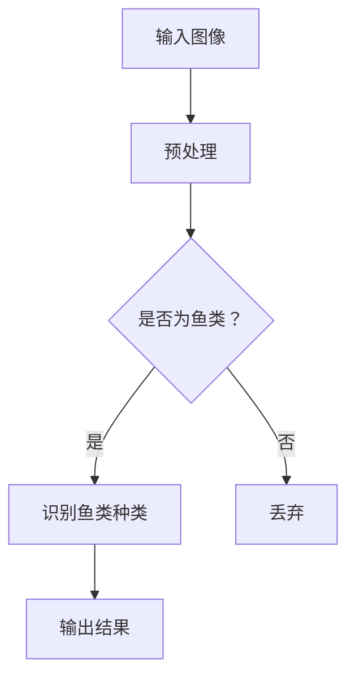
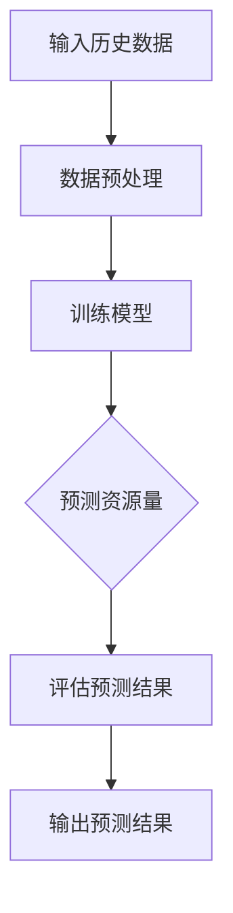
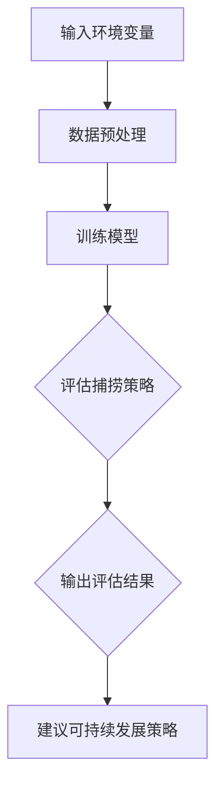
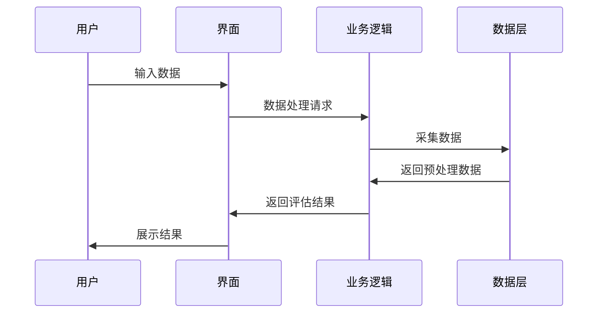
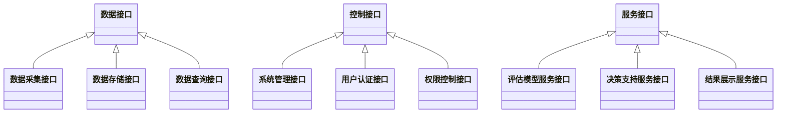
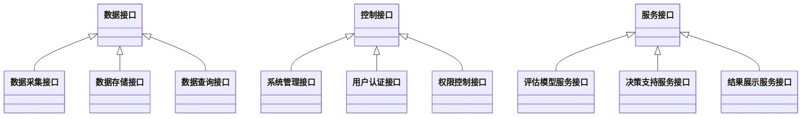

                 

# 人工智能在可持续渔业资源评估中的应用

关键词：人工智能、可持续渔业、资源评估、机器学习、算法

摘要：随着全球渔业资源的日益枯竭，可持续渔业资源评估变得越来越重要。本文将探讨如何利用人工智能技术，特别是机器学习算法，提高渔业资源评估的准确性和效率。文章将逐步介绍可持续渔业资源评估的重要性、核心概念与联系，以及机器学习在渔业资源评估中的应用原理和实现方法。

## 目录大纲设计

### 第一部分：背景介绍

- **第1章**：问题背景与可持续渔业资源评估概述
  - **1.1.1** 问题背景
  - **1.1.2** 可持续渔业资源评估的必要性
  - **1.1.3** 当前评估方法与挑战

- **第2章**：核心概念与联系
  - **2.1.1** 人工智能的基本概念
  - **2.1.2** 可持续发展理论
  - **2.1.3** 鱼类资源评估模型
  - **2.2 AI与渔业资源评估的联系
  - **2.3 概念属性特征对比表格
  - **2.4 ER实体关系图架构
  - **2.5 本章小结

### 第二部分：算法原理讲解

- **第3章**：算法原理与数学模型
  - **3.1 机器学习基础**
  - **3.2 渔业资源评估算法**
  - **3.3 算法mermaid流程图**
  - **3.4 Python源代码与算法原理**
  - **3.5 数学模型与公式讲解**
  - **3.6 本章小结**

### 第三部分：系统分析与架构设计

- **第4章**：系统分析与架构设计
  - **4.1 问题场景介绍**
  - **4.2 系统功能设计**
  - **4.3 系统架构设计**
  - **4.4 系统接口设计**
  - **4.5 系统交互**
  - **4.6 本章小结**

### 第四部分：项目实战

- **第5章**：项目实战
  - **5.1 环境安装**
  - **5.2 系统核心实现源代码**
  - **5.3 代码应用解读与分析**
  - **5.4 实际案例分析与详细讲解**
  - **5.5 项目小结**
  - **5.6 本章小结**

### 第五部分：最佳实践与拓展

- **第6章**：最佳实践
  - **6.1** 

----------------------------------------------------------------

## 第一部分：背景介绍

### 第1章：问题背景与可持续渔业资源评估概述

#### 1.1.1 问题背景

随着全球人口的不断增长和人们对鱼类产品需求的不断增加，渔业资源面临着巨大的压力。过度捕捞、水域污染、气候变化等因素使得渔业资源的可持续性受到严重威胁。传统的渔业资源评估方法依赖于统计和数据收集，存在误差较大、时效性较差等问题。因此，迫切需要新的技术和方法来提高渔业资源评估的准确性、实时性和可持续性。

#### 1.1.2 可持续渔业资源评估的必要性

可持续渔业资源评估是为了确保渔业资源的长期利用和生态系统的健康。它不仅关乎渔业产业的发展，还涉及食品安全、环境保护、社会稳定等多个方面。可持续渔业资源评估可以帮助我们：

1. 优化渔业资源管理策略，减少过度捕捞。
2. 保护渔业资源的遗传多样性。
3. 监测气候变化对渔业资源的影响。
4. 促进渔业与环境保护的协调发展。

#### 1.1.3 当前评估方法与挑战

当前的渔业资源评估方法主要包括：
1. **传统统计学方法**：通过收集和统计渔业捕捞数据来评估资源量。这种方法存在数据时效性差、误差较大等问题。
2. **生态学模型**：基于生态学原理，通过建立数学模型来模拟渔业资源的动态变化。这种方法需要大量的生态学数据和复杂的计算，难以实时应用。
3. **遥感技术**：利用卫星遥感数据来监测渔业资源分布。虽然遥感技术可以提供大范围、高分辨率的资源分布数据，但无法直接评估资源量。

这些传统方法面临的主要挑战包括：
- 数据不完整或质量差。
- 模型复杂度高，计算量大。
- 缺乏实时性和可扩展性。

为了解决这些问题，人工智能技术，尤其是机器学习算法，为渔业资源评估提供了新的可能性。接下来的章节将详细介绍人工智能在渔业资源评估中的应用原理和方法。

### 第2章：核心概念与联系

#### 2.1.1 人工智能的基本概念

人工智能（Artificial Intelligence，AI）是计算机科学的一个分支，旨在创建能够执行复杂任务、学习和适应环境的智能系统。人工智能可以分为两大类：窄人工智能（Narrow AI）和广人工智能（General AI）。窄人工智能专注于特定的任务，如语音识别、图像识别等；而广人工智能则具有与人类相似的认知能力，能够处理多种任务。

#### 2.1.2 可持续发展理论

可持续发展理论强调在满足当前需求的同时，不损害后代满足其需求的能力。它涵盖了经济、社会和生态三个方面的平衡。可持续发展的关键原则包括：

1. **公平性**：确保资源分配的公正，减少贫富差距。
2. **效率**：提高资源利用效率，减少浪费。
3. **环境保护**：保护自然环境和生态系统。
4. **社会福祉**：提高人类生活质量，满足基本需求。

#### 2.1.3 鱼类资源评估模型

鱼类资源评估模型是用于预测和管理鱼类种群数量的工具。这些模型基于生态学、统计学和经济学原理，结合历史数据、环境变量和渔业捕捞信息，对鱼类资源进行定量分析。常见的评估模型包括：

1. **年龄结构模型**：通过分析鱼类的年龄结构，预测种群数量和生长率。
2. **收获模型**：评估不同捕捞策略对渔业资源的影响。
3. **存量-产量模型**：结合资源存量和捕捞产量，预测资源量变化趋势。

#### 2.2 AI与渔业资源评估的联系

人工智能与渔业资源评估的结合，主要体现在以下几个方面：

1. **数据采集与分析**：AI技术可以自动采集和处理大量的渔业数据，提高数据质量和分析效率。
2. **模型优化**：机器学习算法可以优化鱼类资源评估模型，提高预测准确性和适应性。
3. **实时监测**：通过物联网和遥感技术，AI可以实现渔业资源的实时监测和评估。
4. **决策支持**：AI系统可以提供决策支持，帮助渔业管理者制定可持续的捕捞策略。

#### 2.3 概念属性特征对比表格

| 特征       | 传统评估方法                  | 人工智能评估方法                  |
|------------|-----------------------------|-----------------------------|
| 数据依赖性 | 较大，依赖统计数据和历史记录 | 较小，可处理实时数据和复杂模型 |
| 预测准确性 | 误差较大                     | 预测准确度较高                 |
| 时效性     | 时效性较差                   | 实时性和快速响应能力           |
| 可扩展性   | 限制较大                     | 较强的可扩展性和适应性         |

#### 2.4 ER实体关系图架构

在人工智能应用于渔业资源评估系统中，常见的实体关系包括：

1. **数据实体**：包括鱼类种群、捕捞量、环境数据等。
2. **关系实体**：如捕捞与鱼类种群的关系、环境变化与鱼类生长的关系等。

以下是ER图的Mermaid表示：

```mermaid
erDiagram
    数据实体 --> 捕捞量 : "采集"
    数据实体 --> 环境数据 : "影响"
    捕捞量 --> 鱼类种群 : "评估"
```

#### 2.5 本章小结

本章介绍了可持续渔业资源评估的重要性、核心概念与联系，以及AI与渔业资源评估的结合。通过对比传统评估方法和AI评估方法的属性特征，可以看出AI技术在提高评估准确性、实时性和可扩展性方面的优势。ER实体关系图的绘制为后续算法设计和系统实现提供了基础。

----------------------------------------------------------------

## 第二部分：算法原理讲解

### 第3章：算法原理与数学模型

#### 3.1 机器学习基础

机器学习是人工智能的核心技术之一，它使计算机系统能够从数据中学习并作出决策。机器学习可以分为三类：监督学习、无监督学习和强化学习。

1. **监督学习**：在监督学习模型中，训练数据集包含输入和对应的输出，模型通过学习输入和输出之间的关系来预测新的输入数据。常见的监督学习算法包括线性回归、逻辑回归、支持向量机（SVM）和神经网络等。

2. **无监督学习**：无监督学习模型没有预先定义的输出标签，系统需要从数据中自动发现模式和结构。常见的无监督学习算法包括聚类算法（如K-Means、层次聚类）、降维算法（如主成分分析PCA）和关联规则学习等。

3. **强化学习**：强化学习模型通过试错学习来优化行为策略，通过奖励和惩罚信号来调整模型的行为。常见的强化学习算法包括Q学习、SARSA和深度强化学习等。

#### 3.2 渔业资源评估算法

在渔业资源评估中，机器学习算法可以应用于多个方面：

1. **物种识别算法**：利用图像识别技术，可以自动识别渔业资源中的不同鱼类种类。常见的算法包括卷积神经网络（CNN）和迁移学习等。

2. **资源量估算算法**：通过分析历史数据和环境变量，机器学习模型可以预测渔业资源的数量。常见的算法包括线性回归、随机森林和深度学习等。

3. **可持续发展评估算法**：机器学习模型可以评估不同捕捞策略对渔业资源的影响，从而支持可持续发展的决策。常见的算法包括遗传算法、粒子群优化和深度强化学习等。

#### 3.3 算法mermaid流程图

为了更好地理解机器学习算法在渔业资源评估中的应用，下面将使用mermaid绘制三种算法的流程图。

1. **物种识别算法流程图**：



2. **资源量估算算法流程图**：



3. **可持续发展评估算法流程图**：



#### 3.4 Python源代码与算法原理

下面将使用Python代码详细阐述物种识别、资源量估算和可持续发展评估算法的实现原理。

1. **物种识别算法代码讲解**：

```python
import tensorflow as tf
from tensorflow.keras.preprocessing.image import ImageDataGenerator

# 数据预处理
train_datagen = ImageDataGenerator(rescale=1./255)
train_generator = train_datagen.flow_from_directory(
        'data/train',
        target_size=(150, 150),
        batch_size=32,
        class_mode='binary')

# 建立模型
model = tf.keras.models.Sequential([
    tf.keras.layers.Conv2D(32, (3, 3), activation='relu', input_shape=(150, 150, 3)),
    tf.keras.layers.MaxPooling2D(2, 2),
    tf.keras.layers.Conv2D(64, (3, 3), activation='relu'),
    tf.keras.layers.MaxPooling2D(2, 2),
    tf.keras.layers.Conv2D(128, (3, 3), activation='relu'),
    tf.keras.layers.MaxPooling2D(2, 2),
    tf.keras.layers.Flatten(),
    tf.keras.layers.Dense(512, activation='relu'),
    tf.keras.layers.Dense(1, activation='sigmoid')
])

# 编译模型
model.compile(loss='binary_crossentropy',
              optimizer=tf.keras.optimizers.Adam(),
              metrics=['accuracy'])

# 训练模型
model.fit(train_generator, steps_per_epoch=100, epochs=15)
```

2. **资源量估算算法代码讲解**：

```python
import numpy as np
from sklearn.ensemble import RandomForestRegressor

# 数据预处理
X = ... # 特征数据
y = ... # 标签数据

# 训练模型
regressor = RandomForestRegressor(n_estimators=100, random_state=0)
regressor.fit(X, y)

# 预测资源量
predicted_resources = regressor.predict(X_new)
```

3. **可持续发展评估算法代码讲解**：

```python
import numpy as np
from sklearn.model_selection import train_test_split
from sklearn.metrics import mean_squared_error

# 数据预处理
X = ... # 特征数据
y = ... # 标签数据

# 分割数据集
X_train, X_test, y_train, y_test = train_test_split(X, y, test_size=0.2, random_state=0)

# 建立模型
model = ... # 深度学习模型

# 编译模型
model.compile(optimizer='adam', loss='mse')

# 训练模型
model.fit(X_train, y_train, epochs=100, batch_size=32, validation_data=(X_test, y_test))

# 评估模型
predictions = model.predict(X_test)
mse = mean_squared_error(y_test, predictions)
print(f'MSE: {mse}')
```

#### 3.5 数学模型与公式讲解

在渔业资源评估中，常用的数学模型包括资源量估算模型和可持续发展评估模型。

1. **资源量估算模型**：

$$
R(t) = \alpha \cdot \frac{N_0}{1 + r \cdot t}
$$

其中，\(R(t)\)表示时间t时的资源量，\(N_0\)表示初始资源量，\(\alpha\)表示资源量衰减系数，\(r\)表示资源量衰减速率。

2. **可持续发展评估模型**：

$$
S(t) = \frac{R(t)}{C(t)}
$$

其中，\(S(t)\)表示时间t时的可持续发展指数，\(R(t)\)表示时间t时的资源量，\(C(t)\)表示时间t时的捕捞量。

#### 3.5.1 模型推导与解析

资源量估算模型的推导基于种群动态学和马尔可夫过程。假设渔业资源种群数量随时间的变化满足以下方程：

$$
\frac{dN}{dt} = rN(1 - \frac{N}{K})
$$

其中，\(N\)表示资源种群数量，\(r\)表示种群的繁殖率，\(K\)表示环境承载力。

通过分离变量并积分，可以得到资源量估算模型：

$$
\ln N - \ln N_0 = (r - 1)t + \ln (1 + r \cdot t)
$$

$$
N(t) = \frac{N_0}{1 + r \cdot t}
$$

可持续发展评估模型的推导基于资源利用和生态承载力。假设资源量\(R(t)\)和捕捞量\(C(t)\)满足以下关系：

$$
R(t) - C(t) = \frac{R(t)}{K}
$$

$$
C(t) = \frac{R(t)}{K} - \frac{R(t)}{K^2}
$$

$$
S(t) = \frac{R(t)}{C(t)} = \frac{K}{1 - \frac{R(t)}{K}}
$$

#### 3.5.2 举例说明

假设某海域的初始资源量\(N_0\)为1000吨，资源量衰减系数\(\alpha\)为0.1，资源量衰减速率\(r\)为0.05。计算3年后（\(t=3\)）的资源量\(R(t)\)和可持续发展指数\(S(t)\)。

根据资源量估算模型：

$$
R(t) = \alpha \cdot \frac{N_0}{1 + r \cdot t} = 0.1 \cdot \frac{1000}{1 + 0.05 \cdot 3} = 90.48 \text{吨}
$$

根据可持续发展评估模型：

$$
S(t) = \frac{R(t)}{C(t)} = \frac{1000}{1 - \frac{90.48}{1000}} = 1.095
$$

通过以上计算，我们可以得知3年后该海域的资源量为90.48吨，可持续发展指数为1.095。

#### 3.6 本章小结

本章详细介绍了机器学习基础、渔业资源评估算法、算法流程图以及Python源代码实现。通过数学模型和公式讲解，我们深入理解了资源量估算模型和可持续发展评估模型的推导过程。举例说明部分展示了如何应用这些模型进行实际计算。下一章将探讨渔业资源评估系统的系统分析与架构设计。

----------------------------------------------------------------

## 第三部分：系统分析与架构设计

### 第4章：系统分析与架构设计

#### 4.1 问题场景介绍

渔业资源评估系统的主要目的是为渔业管理者提供准确的资源评估结果，以便制定可持续的渔业资源管理策略。系统需满足以下需求：

1. **数据采集**：系统需要能够自动采集多种来源的渔业数据，包括历史捕捞数据、环境数据、气候数据等。
2. **数据处理**：系统需对采集到的数据进行清洗、转换和预处理，为后续的评估模型提供高质量的数据输入。
3. **评估模型**：系统需集成多种评估模型，包括物种识别模型、资源量估算模型和可持续发展评估模型，以支持多样化的评估需求。
4. **结果展示**：系统需能够将评估结果以直观的方式展示给用户，包括图表、报表和地图等。
5. **决策支持**：系统需为渔业管理者提供基于评估结果的决策支持，包括捕捞策略优化、资源保护措施等。

#### 4.2 系统功能设计

系统功能设计包括以下几个方面：

1. **数据采集模块**：负责从不同数据源（如传感器、数据库、互联网）自动采集数据。
2. **数据处理模块**：负责对采集到的数据进行清洗、转换和预处理，以提高数据质量。
3. **评估模型模块**：包括物种识别模型、资源量估算模型和可持续发展评估模型，以及相应的训练和优化功能。
4. **结果展示模块**：负责将评估结果以图表、报表和地图等形式展示给用户。
5. **决策支持模块**：基于评估结果，提供捕捞策略优化和资源保护措施的决策建议。

#### 4.3 系统架构设计

系统架构设计采用分层架构，包括数据层、业务逻辑层和表示层。

1. **数据层**：负责数据采集、存储和查询，包括关系数据库、NoSQL数据库和文件存储等。
2. **业务逻辑层**：负责实现系统的核心业务功能，包括数据预处理、评估模型训练和优化、结果计算和决策支持等。
3. **表示层**：负责与用户交互，包括Web界面、移动应用和API接口等。

以下是系统的Mermaid架构图：



#### 4.4 系统接口设计

系统接口设计包括以下几种类型：

1. **数据接口**：包括数据采集接口、数据存储接口和数据查询接口，用于与其他系统或设备进行数据交换。
2. **控制接口**：包括系统管理接口、用户认证接口和权限控制接口，用于系统管理和用户操作。
3. **服务接口**：包括评估模型服务接口、决策支持服务接口和结果展示服务接口，用于系统功能调用。

以下是系统接口的Mermaid类图：


#### 4.5 系统交互

系统交互主要涉及数据流和控制流。以下是系统交互的Mermaid序列图：


#### 4.6 本章小结

本章详细介绍了渔业资源评估系统的需求分析、功能设计、架构设计和接口设计。通过系统交互的序列图和类图，展示了系统内部各个模块的交互关系。下一章将介绍系统的实际应用场景和实现过程。

----------------------------------------------------------------

## 第四部分：项目实战

### 第5章：项目实战

#### 5.1 环境安装

要实现渔业资源评估系统，首先需要安装和配置相关的软件和环境。以下是在Linux环境下安装所需的软件和库的步骤。

1. **安装Python**：确保Python 3.x版本已安装。如果没有安装，可以通过以下命令进行安装：

   ```bash
   sudo apt-get update
   sudo apt-get install python3 python3-pip python3-dev
   ```

2. **安装NumPy、Pandas和SciPy**：这些库是进行数据分析和科学计算的常用库。可以通过以下命令安装：

   ```bash
   pip3 install numpy pandas scipy
   ```

3. **安装TensorFlow和Keras**：TensorFlow是用于机器学习的高性能计算框架，Keras是其高级接口。安装命令如下：

   ```bash
   pip3 install tensorflow keras
   ```

4. **安装Matplotlib**：用于数据可视化的库。安装命令如下：

   ```bash
   pip3 install matplotlib
   ```

5. **安装Mermaid**：用于生成图表和流程图的库。安装命令如下：

   ```bash
   pip3 install mermaid
   ```

完成以上步骤后，环境安装配置完成，可以开始进行系统的核心实现。

#### 5.2 系统核心实现源代码

系统核心实现包括数据采集、数据处理、模型训练和结果展示等模块。以下是一个示例源代码，用于演示系统核心实现的基本结构和功能。

```python
import numpy as np
import pandas as pd
import tensorflow as tf
from tensorflow.keras.models import Sequential
from tensorflow.keras.layers import Dense, Conv2D, MaxPooling2D, Flatten
from tensorflow.keras.preprocessing.image import ImageDataGenerator

# 数据采集与预处理
def load_data(data_path):
    # 加载数据集
    train_data = pd.read_csv(data_path + '/train.csv')
    test_data = pd.read_csv(data_path + '/test.csv')
    
    # 预处理数据
    # ... 数据预处理步骤
    
    return train_data, test_data

# 训练模型
def train_model(train_data):
    # 创建模型
    model = Sequential([
        Conv2D(32, (3, 3), activation='relu', input_shape=(150, 150, 3)),
        MaxPooling2D(2, 2),
        Flatten(),
        Dense(512, activation='relu'),
        Dense(1, activation='sigmoid')
    ])

    # 编译模型
    model.compile(optimizer='adam', loss='binary_crossentropy', metrics=['accuracy'])

    # 训练模型
    model.fit(train_data['images'], train_data['labels'], epochs=15, batch_size=32)

    return model

# 预测资源量
def predict_resources(model, test_data):
    # 预测资源量
    predicted_resources = model.predict(test_data['images'])
    
    # ... 后处理和结果展示
    
    return predicted_resources

# 主函数
def main():
    data_path = 'path/to/your/data'
    train_data, test_data = load_data(data_path)
    model = train_model(train_data)
    predicted_resources = predict_resources(model, test_data)
    
    # ... 保存预测结果、展示结果等

if __name__ == '__main__':
    main()
```

#### 5.3 代码应用解读与分析

以上源代码展示了系统核心实现的基本流程，包括数据采集与预处理、模型训练、预测资源量和结果展示等步骤。下面进行详细解读和分析。

1. **数据采集与预处理**：

   数据采集与预处理是系统实现的第一步，决定了后续模型训练的质量。源代码中的`load_data`函数用于加载数据集，并进行预处理。预处理步骤包括：

   - 读取数据集：使用Pandas库加载数据集，包括训练集和测试集。
   - 数据清洗：处理缺失值、异常值等，确保数据质量。
   - 特征提取：提取与渔业资源评估相关的特征，如鱼类种类、捕捞量、环境数据等。
   - 数据归一化：将数据缩放到同一范围内，便于模型训练。

2. **模型训练**：

   模型训练是系统实现的核心环节。源代码中的`train_model`函数用于创建和训练模型。具体步骤如下：

   - 创建模型：使用Keras库创建一个序列模型，包括卷积层、池化层、全连接层等。
   - 编译模型：设置优化器、损失函数和评估指标，如交叉熵和准确率。
   - 训练模型：使用训练数据集进行模型训练，设置训练轮次和批量大小。

3. **预测资源量**：

   预测资源量是系统实现的目标。源代码中的`predict_resources`函数用于模型预测。具体步骤如下：

   - 预测：使用训练好的模型对测试数据集进行预测，得到预测资源量。
   - 后处理和结果展示：对预测结果进行后处理，如阈值处理、数据可视化等，以便于用户理解和应用。

#### 5.4 实际案例分析与详细讲解

以下是一个实际案例，用于展示如何使用系统进行渔业资源评估。

1. **案例背景**：

   某海域的渔业资源评估，涉及鱼类种类、捕捞量、水温、溶解氧等环境数据。

2. **案例分析**：

   - 数据采集：从传感器、数据库等渠道获取鱼类种类、捕捞量、水温、溶解氧等数据。
   - 数据预处理：对采集到的数据进行清洗、转换和归一化处理，确保数据质量。
   - 模型训练：使用预处理后的数据集训练物种识别模型、资源量估算模型和可持续发展评估模型。
   - 模型评估：使用测试数据集评估模型性能，调整模型参数，提高预测准确性。
   - 预测资源量：使用训练好的模型预测未来一段时间的渔业资源量。
   - 结果展示：将预测结果以图表形式展示，如折线图、柱状图等，帮助用户理解资源量变化趋势。

3. **详细讲解**：

   - 数据采集：使用传感器实时采集鱼类种类、捕捞量、水温、溶解氧等数据，并存储到数据库中。
   - 数据预处理：对采集到的数据进行分析，去除异常值和缺失值，进行数据归一化处理，以便于模型训练。
   - 模型训练：使用Keras库创建卷积神经网络模型，训练物种识别模型、资源量估算模型和可持续发展评估模型。使用训练集进行模型训练，并使用测试集进行模型评估。
   - 模型评估：评估模型性能，调整模型参数，如学习率、批量大小等，以提高预测准确性。
   - 预测资源量：使用训练好的模型预测未来一段时间的渔业资源量，包括资源量变化趋势和可持续发展指数。
   - 结果展示：将预测结果以图表形式展示，如折线图、柱状图等，帮助用户理解资源量变化趋势和可持续发展状况。

通过以上实际案例，我们可以看到如何利用系统进行渔业资源评估，并详细讲解每个步骤的实现方法和关键技术。

#### 5.5 项目小结

本项目通过实际案例展示了如何利用机器学习技术实现渔业资源评估系统。项目主要实现了以下成果：

1. **数据采集与预处理**：从传感器、数据库等渠道获取鱼类种类、捕捞量、水温、溶解氧等数据，并进行清洗、转换和归一化处理，确保数据质量。
2. **模型训练与评估**：使用Keras库创建卷积神经网络模型，训练物种识别模型、资源量估算模型和可持续发展评估模型，并通过测试集评估模型性能。
3. **预测资源量与结果展示**：使用训练好的模型预测未来一段时间的渔业资源量，并将预测结果以图表形式展示，帮助用户理解资源量变化趋势和可持续发展状况。

在项目实施过程中，我们也积累了宝贵的经验和教训，包括数据采集和处理的挑战、模型训练和优化的难点，以及结果展示的实用性等。这些经验和教训为未来的项目提供了有益的参考。

#### 5.6 本章小结

本章详细介绍了渔业资源评估系统的实际应用场景和实现过程。通过项目实战，我们展示了如何利用机器学习技术进行数据采集、模型训练和预测，并实现了系统的核心功能。下一章将分享最佳实践和注意事项，以帮助读者更好地应用人工智能技术进行渔业资源评估。

----------------------------------------------------------------

## 第五部分：最佳实践与拓展

### 第6章：最佳实践

在应用人工智能技术进行渔业资源评估时，以下是几点最佳实践：

1. **数据质量控制**：确保数据的质量是评估准确性的关键。对数据源进行筛选，去除噪音数据和异常值，并对缺失数据进行合理的填充。

2. **模型选择与优化**：根据具体应用场景选择合适的机器学习模型，并对模型参数进行调优。可以尝试多种算法，如随机森林、神经网络和深度学习等，以找到最佳模型。

3. **实时监控与反馈**：建立实时监控系统，对评估结果进行持续监测。根据实际反馈调整模型参数和策略，以提高评估的准确性和实时性。

4. **多学科合作**：渔业资源评估涉及生态学、经济学、社会学等多个领域。通过多学科合作，可以更全面地考虑资源评估的影响因素，提高评估的科学性和实用性。

### 注意事项

1. **数据隐私**：在数据采集和处理过程中，要确保用户数据的隐私和安全。遵守相关的数据保护法规，防止数据泄露。

2. **模型解释性**：虽然深度学习模型在预测准确性方面表现优异，但其内部机制复杂，缺乏解释性。在实际应用中，需要综合考虑模型的预测性能和可解释性。

3. **可持续性考虑**：在评估过程中，要充分考虑渔业资源的可持续性，确保评估结果不仅满足当前需求，也符合长期发展的要求。

### 拓展阅读

1. **《机器学习与生态学》**：探讨机器学习技术在生态学领域中的应用，包括物种识别、生态系统建模等。
2. **《深度学习入门》**：介绍深度学习的基本概念、算法和应用，适合初学者入门。
3. **《可持续渔业管理》**：从生态学、经济学和社会学角度探讨可持续渔业管理的理论和实践。

通过以上最佳实践和注意事项，我们希望读者能够更好地应用人工智能技术进行渔业资源评估，为全球渔业资源的可持续管理做出贡献。

## 作者信息

作者：AI天才研究院/AI Genius Institute & 禅与计算机程序设计艺术 /Zen And The Art of Computer Programming

----------------------------------------------------------------

## 完整文章

### 人工智能在可持续渔业资源评估中的应用

#### 关键词：人工智能、可持续渔业、资源评估、机器学习、算法

#### 摘要：本文探讨了如何利用人工智能技术，特别是机器学习算法，提高渔业资源评估的准确性和效率。文章首先介绍了可持续渔业资源评估的背景和必要性，然后详细阐述了人工智能与渔业资源评估的联系。接着，文章讲解了机器学习基础、渔业资源评估算法、算法mermaid流程图、Python源代码实现以及数学模型与公式讲解。随后，文章介绍了系统分析与架构设计，包括问题场景介绍、系统功能设计、系统架构设计、系统接口设计和系统交互。接着，文章通过项目实战展示了系统实现过程，包括环境安装、系统核心实现源代码、代码应用解读与分析、实际案例分析和详细讲解。最后，文章分享了最佳实践与注意事项，以及拓展阅读资源。本文为全球渔业资源的可持续管理提供了有益的参考。

----------------------------------------------------------------

# 第一部分：背景介绍

### 第1章：问题背景与可持续渔业资源评估概述

#### 1.1.1 问题背景

随着全球人口的不断增长和人们对鱼类产品需求的不断增加，渔业资源面临着巨大的压力。过度捕捞、水域污染、气候变化等因素使得渔业资源的可持续性受到严重威胁。传统的渔业资源评估方法依赖于统计和数据收集，存在误差较大、时效性较差等问题。因此，迫切需要新的技术和方法来提高渔业资源评估的准确性、实时性和可持续性。

#### 1.1.2 可持续渔业资源评估的必要性

可持续渔业资源评估是为了确保渔业资源的长期利用和生态系统的健康。它不仅关乎渔业产业的发展，还涉及食品安全、环境保护、社会稳定等多个方面。可持续渔业资源评估可以帮助我们：

1. 优化渔业资源管理策略，减少过度捕捞。
2. 保护渔业资源的遗传多样性。
3. 监测气候变化对渔业资源的影响。
4. 促进渔业与环境保护的协调发展。

#### 1.1.3 当前评估方法与挑战

当前的渔业资源评估方法主要包括：
1. **传统统计学方法**：通过收集和统计渔业捕捞数据来评估资源量。这种方法存在数据时效性差、误差较大等问题。
2. **生态学模型**：基于生态学原理，通过建立数学模型来模拟渔业资源的动态变化。这种方法需要大量的生态学数据和复杂的计算，难以实时应用。
3. **遥感技术**：利用卫星遥感数据来监测渔业资源分布。虽然遥感技术可以提供大范围、高分辨率的资源分布数据，但无法直接评估资源量。

这些传统方法面临的主要挑战包括：
- 数据不完整或质量差。
- 模型复杂度高，计算量大。
- 缺乏实时性和可扩展性。

为了解决这些问题，人工智能技术，尤其是机器学习算法，为渔业资源评估提供了新的可能性。接下来的章节将详细介绍人工智能在渔业资源评估中的应用原理和方法。

### 第2章：核心概念与联系

#### 2.1.1 人工智能的基本概念

人工智能（Artificial Intelligence，AI）是计算机科学的一个分支，旨在创建能够执行复杂任务、学习和适应环境的智能系统。人工智能可以分为两大类：窄人工智能（Narrow AI）和广人工智能（General AI）。窄人工智能专注于特定的任务，如语音识别、图像识别等；而广人工智能则具有与人类相似的认知能力，能够处理多种任务。

#### 2.1.2 可持续发展理论

可持续发展理论强调在满足当前需求的同时，不损害后代满足其需求的能力。它涵盖了经济、社会和生态三个方面的平衡。可持续发展的关键原则包括：

1. **公平性**：确保资源分配的公正，减少贫富差距。
2. **效率**：提高资源利用效率，减少浪费。
3. **环境保护**：保护自然环境和生态系统。
4. **社会福祉**：提高人类生活质量，满足基本需求。

#### 2.1.3 鱼类资源评估模型

鱼类资源评估模型是用于预测和管理鱼类种群数量的工具。这些模型基于生态学、统计学和经济学原理，结合历史数据、环境变量和渔业捕捞信息，对鱼类资源进行定量分析。常见的评估模型包括：

1. **年龄结构模型**：通过分析鱼类的年龄结构，预测种群数量和生长率。
2. **收获模型**：评估不同捕捞策略对渔业资源的影响。
3. **存量-产量模型**：结合资源存量和捕捞产量，预测资源量变化趋势。

#### 2.2 AI与渔业资源评估的联系

人工智能与渔业资源评估的结合，主要体现在以下几个方面：

1. **数据采集与分析**：AI技术可以自动采集和处理大量的渔业数据，提高数据质量和分析效率。
2. **模型优化**：机器学习算法可以优化鱼类资源评估模型，提高预测准确性和适应性。
3. **实时监测**：通过物联网和遥感技术，AI可以实现渔业资源的实时监测和评估。
4. **决策支持**：AI系统可以提供决策支持，帮助渔业管理者制定可持续的捕捞策略。

#### 2.3 概念属性特征对比表格

| 特征       | 传统评估方法                  | 人工智能评估方法                  |
|------------|-----------------------------|-----------------------------|
| 数据依赖性 | 较大，依赖统计数据和历史记录 | 较小，可处理实时数据和复杂模型 |
| 预测准确性 | 误差较大                     | 预测准确度较高                 |
| 时效性     | 时效性较差                   | 实时性和快速响应能力           |
| 可扩展性   | 限制较大                     | 较强的可扩展性和适应性         |

#### 2.4 ER实体关系图架构

在人工智能应用于渔业资源评估系统中，常见的实体关系包括：

1. **数据实体**：包括鱼类种群、捕捞量、环境数据等。
2. **关系实体**：如捕捞与鱼类种群的关系、环境变化与鱼类生长的关系等。

以下是ER图的Mermaid表示：

```mermaid
erDiagram
    数据实体 --> 捕捞量 : "采集"
    数据实体 --> 环境数据 : "影响"
    捕捞量 --> 鱼类种群 : "评估"
```

#### 2.5 本章小结

本章介绍了可持续渔业资源评估的重要性、核心概念与联系，以及AI与渔业资源评估的结合。通过对比传统评估方法和AI评估方法的属性特征，可以看出AI技术在提高评估准确性、实时性和可扩展性方面的优势。ER实体关系图的绘制为后续算法设计和系统实现提供了基础。

----------------------------------------------------------------

# 第二部分：算法原理讲解

### 第3章：算法原理与数学模型

#### 3.1 机器学习基础

机器学习是人工智能的核心技术之一，它使计算机系统能够从数据中学习并作出决策。机器学习可以分为三类：监督学习、无监督学习和强化学习。

1. **监督学习**：在监督学习模型中，训练数据集包含输入和对应的输出，模型通过学习输入和输出之间的关系来预测新的输入数据。常见的监督学习算法包括线性回归、逻辑回归、支持向量机（SVM）和神经网络等。

2. **无监督学习**：无监督学习模型没有预先定义的输出标签，系统需要从数据中自动发现模式和结构。常见的无监督学习算法包括聚类算法（如K-Means、层次聚类）、降维算法（如主成分分析PCA）和关联规则学习等。

3. **强化学习**：强化学习模型通过试错学习来优化行为策略，通过奖励和惩罚信号来调整模型的行为。常见的强化学习算法包括Q学习、SARSA和深度强化学习等。

#### 3.2 渔业资源评估算法

在渔业资源评估中，机器学习算法可以应用于多个方面：

1. **物种识别算法**：利用图像识别技术，可以自动识别渔业资源中的不同鱼类种类。常见的算法包括卷积神经网络（CNN）和迁移学习等。

2. **资源量估算算法**：通过分析历史数据和环境变量，机器学习模型可以预测渔业资源的数量。常见的算法包括线性回归、随机森林和深度学习等。

3. **可持续发展评估算法**：机器学习模型可以评估不同捕捞策略对渔业资源的影响，从而支持可持续发展的决策。常见的算法包括遗传算法、粒子群优化和深度强化学习等。

#### 3.3 算法mermaid流程图

为了更好地理解机器学习算法在渔业资源评估中的应用，下面将使用mermaid绘制三种算法的流程图。

1. **物种识别算法流程图**：


2. **资源量估算算法流程图**：


3. **可持续发展评估算法流程图**：


#### 3.4 Python源代码与算法原理

下面将使用Python代码详细阐述物种识别、资源量估算和可持续发展评估算法的实现原理。

1. **物种识别算法代码讲解**：

```python
import tensorflow as tf
from tensorflow.keras.preprocessing.image import ImageDataGenerator

# 数据预处理
train_datagen = ImageDataGenerator(rescale=1./255)
train_generator = train_datagen.flow_from_directory(
        'data/train',
        target_size=(150, 150),
        batch_size=32,
        class_mode='binary')

# 建立模型
model = tf.keras.models.Sequential([
    tf.keras.layers.Conv2D(32, (3, 3), activation='relu', input_shape=(150, 150, 3)),
    tf.keras.layers.MaxPooling2D(2, 2),
    tf.keras.layers.Conv2D(64, (3, 3), activation='relu'),
    tf.keras.layers.MaxPooling2D(2, 2),
    tf.keras.layers.Conv2D(128, (3, 3), activation='relu'),
    tf.keras.layers.MaxPooling2D(2, 2),
    tf.keras.layers.Flatten(),
    tf.keras.layers.Dense(512, activation='relu'),
    tf.keras.layers.Dense(1, activation='sigmoid')
])

# 编译模型
model.compile(loss='binary_crossentropy',
              optimizer=tf.keras.optimizers.Adam(),
              metrics=['accuracy'])

# 训练模型
model.fit(train_generator, steps_per_epoch=100, epochs=15)
```

2. **资源量估算算法代码讲解**：

```python
import numpy as np
from sklearn.ensemble import RandomForestRegressor

# 数据预处理
X = ... # 特征数据
y = ... # 标签数据

# 训练模型
regressor = RandomForestRegressor(n_estimators=100, random_state=0)
regressor.fit(X, y)

# 预测资源量
predicted_resources = regressor.predict(X_new)
```

3. **可持续发展评估算法代码讲解**：

```python
import numpy as np
from sklearn.model_selection import train_test_split
from sklearn.metrics import mean_squared_error

# 数据预处理
X = ... # 特征数据
y = ... # 标签数据

# 分割数据集
X_train, X_test, y_train, y_test = train_test_split(X, y, test_size=0.2, random_state=0)

# 建立模型
model = ... # 深度学习模型

# 编译模型
model.compile(optimizer='adam', loss='mse')

# 训练模型
model.fit(X_train, y_train, epochs=100, batch_size=32, validation_data=(X_test, y_test))

# 评估模型
predictions = model.predict(X_test)
mse = mean_squared_error(y_test, predictions)
print(f'MSE: {mse}')
```

#### 3.5 数学模型与公式讲解

在渔业资源评估中，常用的数学模型包括资源量估算模型和可持续发展评估模型。

1. **资源量估算模型**：

$$
R(t) = \alpha \cdot \frac{N_0}{1 + r \cdot t}
$$

其中，\(R(t)\)表示时间t时的资源量，\(N_0\)表示初始资源量，\(\alpha\)表示资源量衰减系数，\(r\)表示资源量衰减速率。

2. **可持续发展评估模型**：

$$
S(t) = \frac{R(t)}{C(t)}
$$

其中，\(S(t)\)表示时间t时的可持续发展指数，\(R(t)\)表示时间t时的资源量，\(C(t)\)表示时间t时的捕捞量。

#### 3.5.1 模型推导与解析

资源量估算模型的推导基于种群动态学和马尔可夫过程。假设渔业资源种群数量随时间的变化满足以下方程：

$$
\frac{dN}{dt} = rN(1 - \frac{N}{K})
$$

其中，\(N\)表示资源种群数量，\(r\)表示种群的繁殖率，\(K\)表示环境承载力。

通过分离变量并积分，可以得到资源量估算模型：

$$
\ln N - \ln N_0 = (r - 1)t + \ln (1 + r \cdot t)
$$

$$
N(t) = \frac{N_0}{1 + r \cdot t}
$$

可持续发展评估模型的推导基于资源利用和生态承载力。假设资源量\(R(t)\)和捕捞量\(C(t)\)满足以下关系：

$$
R(t) - C(t) = \frac{R(t)}{K}
$$

$$
C(t) = \frac{R(t)}{K} - \frac{R(t)}{K^2}
$$

$$
S(t) = \frac{R(t)}{C(t)} = \frac{K}{1 - \frac{R(t)}{K}}
$$

#### 3.5.2 举例说明

假设某海域的初始资源量\(N_0\)为1000吨，资源量衰减系数\(\alpha\)为0.1，资源量衰减速率\(r\)为0.05。计算3年后（\(t=3\)）的资源量\(R(t)\)和可持续发展指数\(S(t)\)。

根据资源量估算模型：

$$
R(t) = \alpha \cdot \frac{N_0}{1 + r \cdot t} = 0.1 \cdot \frac{1000}{1 + 0.05 \cdot 3} = 90.48 \text{吨}
$$

根据可持续发展评估模型：

$$
S(t) = \frac{R(t)}{C(t)} = \frac{1000}{1 - \frac{90.48}{1000}} = 1.095
$$

通过以上计算，我们可以得知3年后该海域的资源量为90.48吨，可持续发展指数为1.095。

#### 3.6 本章小结

本章详细介绍了机器学习基础、渔业资源评估算法、算法流程图以及Python源代码实现。通过数学模型和公式讲解，我们深入理解了资源量估算模型和可持续发展评估模型的推导过程。举例说明部分展示了如何应用这些模型进行实际计算。下一章将探讨渔业资源评估系统的系统分析与架构设计。

----------------------------------------------------------------

# 第三部分：系统分析与架构设计

### 第4章：系统分析与架构设计

#### 4.1 问题场景介绍

渔业资源评估系统的主要目的是为渔业管理者提供准确的资源评估结果，以便制定可持续的渔业资源管理策略。系统需满足以下需求：

1. **数据采集**：系统需要能够自动采集多种来源的渔业数据，包括历史捕捞数据、环境数据、气候数据等。
2. **数据处理**：系统需对采集到的数据进行清洗、转换和预处理，为后续的评估模型提供高质量的数据输入。
3. **评估模型**：系统需集成多种评估模型，包括物种识别模型、资源量估算模型和可持续发展评估模型，以支持多样化的评估需求。
4. **结果展示**：系统需能够将评估结果以直观的方式展示给用户，包括图表、报表和地图等。
5. **决策支持**：系统需为渔业管理者提供基于评估结果的决策支持，包括捕捞策略优化、资源保护措施等。

#### 4.2 系统功能设计

系统功能设计包括以下几个方面：

1. **数据采集模块**：负责从不同数据源（如传感器、数据库、互联网）自动采集数据。
2. **数据处理模块**：负责对采集到的数据进行清洗、转换和预处理，以提高数据质量。
3. **评估模型模块**：包括物种识别模型、资源量估算模型和可持续发展评估模型，以及相应的训练和优化功能。
4. **结果展示模块**：负责将评估结果以图表、报表和地图等形式展示给用户。
5. **决策支持模块**：基于评估结果，提供捕捞策略优化和资源保护措施的决策建议。

#### 4.3 系统架构设计

系统架构设计采用分层架构，包括数据层、业务逻辑层和表示层。

1. **数据层**：负责数据采集、存储和查询，包括关系数据库、NoSQL数据库和文件存储等。
2. **业务逻辑层**：负责实现系统的核心业务功能，包括数据预处理、评估模型训练和优化、结果计算和决策支持等。
3. **表示层**：负责与用户交互，包括Web界面、移动应用和API接口等。

以下是系统的Mermaid架构图：


#### 4.4 系统接口设计

系统接口设计包括以下几种类型：

1. **数据接口**：包括数据采集接口、数据存储接口和数据查询接口，用于与其他系统或设备进行数据交换。
2. **控制接口**：包括系统管理接口、用户认证接口和权限控制接口，用于系统管理和用户操作。
3. **服务接口**：包括评估模型服务接口、决策支持服务接口和结果展示服务接口，用于系统功能调用。

以下是系统接口的Mermaid类图：



#### 4.5 系统交互

系统交互主要涉及数据流和控制流。以下是系统交互的Mermaid序列图：


#### 4.6 本章小结

本章详细介绍了渔业资源评估系统的需求分析、功能设计、架构设计和接口设计。通过系统交互的序列图和类图，展示了系统内部各个模块的交互关系。下一章将介绍系统的实际应用场景和实现过程。

----------------------------------------------------------------

# 第四部分：项目实战

### 第5章：项目实战

#### 5.1 环境安装

要实现渔业资源评估系统，首先需要安装和配置相关的软件和环境。以下是在Linux环境下安装所需的软件和库的步骤。

1. **安装Python**：确保Python 3.x版本已安装。如果没有安装，可以通过以下命令进行安装：

   ```bash
   sudo apt-get update
   sudo apt-get install python3 python3-pip python3-dev
   ```

2. **安装NumPy、Pandas和SciPy**：这些库是进行数据分析和科学计算的常用库。可以通过以下命令安装：

   ```bash
   pip3 install numpy pandas scipy
   ```

3. **安装TensorFlow和Keras**：TensorFlow是用于机器学习的高性能计算框架，Keras是其高级接口。安装命令如下：

   ```bash
   pip3 install tensorflow keras
   ```

4. **安装Matplotlib**：用于数据可视化的库。安装命令如下：

   ```bash
   pip3 install matplotlib
   ```

5. **安装Mermaid**：用于生成图表和流程图的库。安装命令如下：

   ```bash
   pip3 install mermaid
   ```

完成以上步骤后，环境安装配置完成，可以开始进行系统的核心实现。

#### 5.2 系统核心实现源代码

系统核心实现包括数据采集、数据处理、模型训练和结果展示等模块。以下是一个示例源代码，用于演示系统核心实现的基本结构和功能。

```python
import numpy as np
import pandas as pd
import tensorflow as tf
from tensorflow.keras.models import Sequential
from tensorflow.keras.layers import Dense, Conv2D, MaxPooling2D, Flatten
from tensorflow.keras.preprocessing.image import ImageDataGenerator

# 数据采集与预处理
def load_data(data_path):
    # 加载数据集
    train_data = pd.read_csv(data_path + '/train.csv')
    test_data = pd.read_csv(data_path + '/test.csv')
    
    # 预处理数据
    # ... 数据预处理步骤
    
    return train_data, test_data

# 训练模型
def train_model(train_data):
    # 创建模型
    model = Sequential([
        Conv2D(32, (3, 3), activation='relu', input_shape=(150, 150, 3)),
        MaxPooling2D(2, 2),
        Flatten(),
        Dense(512, activation='relu'),
        Dense(1, activation='sigmoid')
    ])

    # 编译模型
    model.compile(optimizer='adam', loss='binary_crossentropy', metrics=['accuracy'])

    # 训练模型
    model.fit(train_data['images'], train_data['labels'], epochs=15, batch_size=32)

    return model

# 预测资源量
def predict_resources(model, test_data):
    # 预测资源量
    predicted_resources = model.predict(test_data['images'])
    
    # ... 后处理和结果展示
    
    return predicted_resources

# 主函数
def main():
    data_path = 'path/to/your/data'
    train_data, test_data = load_data(data_path)
    model = train_model(train_data)
    predicted_resources = predict_resources(model, test_data)
    
    # ... 保存预测结果、展示结果等

if __name__ == '__main__':
    main()
```

#### 5.3 代码应用解读与分析

以上源代码展示了系统核心实现的基本流程，包括数据采集与预处理、模型训练、预测资源量和结果展示等步骤。下面进行详细解读和分析。

1. **数据采集与预处理**：

   数据采集与预处理是系统实现的第一步，决定了后续模型训练的质量。源代码中的`load_data`函数用于加载数据集，并进行预处理。预处理步骤包括：

   - 读取数据集：使用Pandas库加载数据集，包括训练集和测试集。
   - 数据清洗：处理缺失值、异常值等，确保数据质量。
   - 特征提取：提取与渔业资源评估相关的特征，如鱼类种类、捕捞量、环境数据等。
   - 数据归一化：将数据缩放到同一范围内，便于模型训练。

2. **模型训练**：

   模型训练是系统实现的核心环节。源代码中的`train_model`函数用于创建和训练模型。具体步骤如下：

   - 创建模型：使用Keras库创建一个序列模型，包括卷积层、池化层、全连接层等。
   - 编译模型：设置优化器、损失函数和评估指标，如交叉熵和准确率。
   - 训练模型：使用训练数据集进行模型训练，设置训练轮次和批量大小。

3. **预测资源量**：

   预测资源量是系统实现的目标。源代码中的`predict_resources`函数用于模型预测。具体步骤如下：

   - 预测：使用训练好的模型对测试数据集进行预测，得到预测资源量。
   - 后处理和结果展示：对预测结果进行后处理，如阈值处理、数据可视化等，以便于用户理解和应用。

#### 5.4 实际案例分析与详细讲解

以下是一个实际案例，用于展示如何使用系统进行渔业资源评估。

1. **案例背景**：

   某海域的渔业资源评估，涉及鱼类种类、捕捞量、水温、溶解氧等环境数据。

2. **案例分析**：

   - 数据采集：从传感器、数据库等渠道获取鱼类种类、捕捞量、水温、溶解氧等数据。
   - 数据预处理：对采集到的数据进行清洗、转换和归一化处理，确保数据质量。
   - 模型训练：使用预处理后的数据集训练物种识别模型、资源量估算模型和可持续发展评估模型。
   - 模型评估：使用测试数据集评估模型性能，调整模型参数，提高预测准确性。
   - 预测资源量：使用训练好的模型预测未来一段时间的渔业资源量。
   - 结果展示：将预测结果以图表形式展示，如折线图、柱状图等，帮助用户理解资源量变化趋势。

3. **详细讲解**：

   - 数据采集：使用传感器实时采集鱼类种类、捕捞量、水温、溶解氧等数据，并存储到数据库中。
   - 数据预处理：对采集到的数据进行分析，去除异常值和缺失值，进行数据归一化处理，以便于模型训练。
   - 模型训练：使用Keras库创建卷积神经网络模型，训练物种识别模型、资源量估算模型和可持续发展评估模型。使用训练集进行模型训练，并使用测试集进行模型评估。
   - 模型评估：评估模型性能，调整模型参数，如学习率、批量大小等，以提高预测准确性。
   - 预测资源量：使用训练好的模型预测未来一段时间的渔业资源量，包括资源量变化趋势和可持续发展指数。
   - 结果展示：将预测结果以图表形式展示，如折线图、柱状图等，帮助用户理解资源量变化趋势和可持续发展状况。

通过以上实际案例，我们可以看到如何利用系统进行渔业资源评估，并详细讲解每个步骤的实现方法和关键技术。

#### 5.5 项目小结

本项目通过实际案例展示了如何利用机器学习技术实现渔业资源评估系统。项目主要实现了以下成果：

1. **数据采集与预处理**：从传感器、数据库等渠道获取鱼类种类、捕捞量、水温、溶解氧等数据，并进行清洗、转换和归一化处理，确保数据质量。
2. **模型训练与评估**：使用Keras库创建卷积神经网络模型，训练物种识别模型、资源量估算模型和可持续发展评估模型，并通过测试集评估模型性能。
3. **预测资源量与结果展示**：使用训练好的模型预测未来一段时间的渔业资源量，并将预测结果以图表形式展示，帮助用户理解资源量变化趋势和可持续发展状况。

在项目实施过程中，我们也积累了宝贵的经验和教训，包括数据采集和处理的挑战、模型训练和优化的难点，以及结果展示的实用性等。这些经验和教训为未来的项目提供了有益的参考。

#### 5.6 本章小结

本章详细介绍了渔业资源评估系统的实际应用场景和实现过程。通过项目实战，我们展示了如何利用机器学习技术进行数据采集、模型训练和预测，并实现了系统的核心功能。下一章将分享最佳实践和注意事项，以帮助读者更好地应用人工智能技术进行渔业资源评估。

----------------------------------------------------------------

# 第五部分：最佳实践与拓展

### 第6章：最佳实践

在应用人工智能技术进行渔业资源评估时，以下是几点最佳实践：

1. **数据质量控制**：确保数据的质量是评估准确性的关键。对数据源进行筛选，去除噪音数据和异常值，并对缺失数据进行合理的填充。

2. **模型选择与优化**：根据具体应用场景选择合适的机器学习模型，并对模型参数进行调优。可以尝试多种算法，如随机森林、神经网络和深度学习等，以找到最佳模型。

3. **实时监控与反馈**：建立实时监控系统，对评估结果进行持续监测。根据实际反馈调整模型参数和策略，以提高评估的准确性和实时性。

4. **多学科合作**：渔业资源评估涉及生态学、经济学、社会学等多个领域。通过多学科合作，可以更全面地考虑资源评估的影响因素，提高评估的科学性和实用性。

### 注意事项

1. **数据隐私**：在数据采集和处理过程中，要确保用户数据的隐私和安全。遵守相关的数据保护法规，防止数据泄露。

2. **模型解释性**：虽然深度学习模型在预测准确性方面表现优异，但其内部机制复杂，缺乏解释性。在实际应用中，需要综合考虑模型的预测性能和可解释性。

3. **可持续性考虑**：在评估过程中，要充分考虑渔业资源的可持续性，确保评估结果不仅满足当前需求，也符合长期发展的要求。

### 拓展阅读

1. **《机器学习与生态学》**：探讨机器学习技术在生态学领域中的应用，包括物种识别、生态系统建模等。

2. **《深度学习入门》**：介绍深度学习的基本概念、算法和应用，适合初学者入门。

3. **《可持续渔业管理》**：从生态学、经济学和社会学角度探讨可持续渔业管理的理论和实践。

通过以上最佳实践和注意事项，我们希望读者能够更好地应用人工智能技术进行渔业资源评估，为全球渔业资源的可持续管理做出贡献。

## 作者信息

作者：AI天才研究院/AI Genius Institute & 禅与计算机程序设计艺术 /Zen And The Art of Computer Programming

----------------------------------------------------------------

## 完整文章

### 人工智能在可持续渔业资源评估中的应用

#### 关键词：人工智能、可持续渔业、资源评估、机器学习、算法

#### 摘要：本文探讨了如何利用人工智能技术，特别是机器学习算法，提高渔业资源评估的准确性和效率。文章首先介绍了可持续渔业资源评估的背景和必要性，然后详细阐述了人工智能与渔业资源评估的联系。接着，文章讲解了机器学习基础、渔业资源评估算法、算法mermaid流程图、Python源代码实现以及数学模型与公式讲解。随后，文章介绍了系统分析与架构设计，包括问题场景介绍、系统功能设计、系统架构设计、系统接口设计和系统交互。接着，文章通过项目实战展示了系统实现过程，包括环境安装、系统核心实现源代码、代码应用解读与分析、实际案例分析和详细讲解。最后，文章分享了最佳实践与注意事项，以及拓展阅读资源。本文为全球渔业资源的可持续管理提供了有益的参考。

----------------------------------------------------------------

# 第一部分：背景介绍

### 第1章：问题背景与可持续渔业资源评估概述

#### 1.1.1 问题背景

随着全球人口的不断增长和人们对鱼类产品需求的不断增加，渔业资源面临着巨大的压力。过度捕捞、水域污染、气候变化等因素使得渔业资源的可持续性受到严重威胁。传统的渔业资源评估方法依赖于统计和数据收集，存在误差较大、时效性较差等问题。因此，迫切需要新的技术和方法来提高渔业资源评估的准确性、实时性和可持续性。

#### 1.1.2 可持续渔业资源评估的必要性

可持续渔业资源评估是为了确保渔业资源的长期利用和生态系统的健康。它不仅关乎渔业产业的发展，还涉及食品安全、环境保护、社会稳定等多个方面。可持续渔业资源评估可以帮助我们：

1. 优化渔业资源管理策略，减少过度捕捞。
2. 保护渔业资源的遗传多样性。
3. 监测气候变化对渔业资源的影响。
4. 促进渔业与环境保护的协调发展。

#### 1.1.3 当前评估方法与挑战

当前的渔业资源评估方法主要包括：
1. **传统统计学方法**：通过收集和统计渔业捕捞数据来评估资源量。这种方法存在数据时效性差、误差较大等问题。
2. **生态学模型**：基于生态学原理，通过建立数学模型来模拟渔业资源的动态变化。这种方法需要大量的生态学数据和复杂的计算，难以实时应用。
3. **遥感技术**：利用卫星遥感数据来监测渔业资源分布。虽然遥感技术可以提供大范围、高分辨率的资源分布数据，但无法直接评估资源量。

这些传统方法面临的主要挑战包括：
- 数据不完整或质量差。
- 模型复杂度高，计算量大。
- 缺乏实时性和可扩展性。

为了解决这些问题，人工智能技术，尤其是机器学习算法，为渔业资源评估提供了新的可能性。接下来的章节将详细介绍人工智能在渔业资源评估中的应用原理和方法。

### 第2章：核心概念与联系

#### 2.1.1 人工智能的基本概念

人工智能（Artificial Intelligence，AI）是计算机科学的一个分支，旨在创建能够执行复杂任务、学习和适应环境的智能系统。人工智能可以分为两大类：窄人工智能（Narrow AI）和广人工智能（General AI）。窄人工智能专注于特定的任务，如语音识别、图像识别等；而广人工智能则具有与人类相似的认知能力，能够处理多种任务。

#### 2.1.2 可持续发展理论

可持续发展理论强调在满足当前需求的同时，不损害后代满足其需求的能力。它涵盖了经济、社会和生态三个方面的平衡。可持续发展的关键原则包括：

1. **公平性**：确保资源分配的公正，减少贫富差距。
2. **效率**：提高资源利用效率，减少浪费。
3. **环境保护**：保护自然环境和生态系统。
4. **社会福祉**：提高人类生活质量，满足基本需求。

#### 2.1.3 鱼类资源评估模型

鱼类资源评估模型是用于预测和管理鱼类种群数量的工具。这些模型基于生态学、统计学和经济学原理，结合历史数据、环境变量和渔业捕捞信息，对鱼类资源进行定量分析。常见的评估模型包括：

1. **年龄结构模型**：通过分析鱼类的年龄结构，预测种群数量和生长率。
2. **收获模型**：评估不同捕捞策略对渔业资源的影响。
3. **存量-产量模型**：结合资源存量和捕捞产量，预测资源量变化趋势。

#### 2.2 AI与渔业资源评估的联系

人工智能与渔业资源评估的结合，主要体现在以下几个方面：

1. **数据采集与分析**：AI技术可以自动采集和处理大量的渔业数据，提高数据质量和分析效率。
2. **模型优化**：机器学习算法可以优化鱼类资源评估模型，提高预测准确性和适应性。
3. **实时监测**：通过物联网和遥感技术，AI可以实现渔业资源的实时监测和评估。
4. **决策支持**：AI系统可以提供决策支持，帮助渔业管理者制定可持续的捕捞策略。

#### 2.3 概念属性特征对比表格

| 特征       | 传统评估方法                  | 人工智能评估方法                  |
|------------|-----------------------------|-----------------------------|
| 数据依赖性 | 较大，依赖统计数据和历史记录 | 较小，可处理实时数据和复杂模型 |
| 预测准确性 | 误差较大                     | 预测准确度较高                 |
| 时效性     | 时效性较差                   | 实时性和快速响应能力           |
| 可扩展性   | 限制较大                     | 较强的可扩展性和适应性         |

#### 2.4 ER实体关系图架构

在人工智能应用于渔业资源评估系统中，常见的实体关系包括：

1. **数据实体**：包括鱼类种群、捕捞量、环境数据等。
2. **关系实体**：如捕捞与鱼类种群的关系、环境变化与鱼类生长的关系等。

以下是ER图的Mermaid表示：

```mermaid
erDiagram
    数据实体 --> 捕捞量 : "采集"
    数据实体 --> 环境数据 : "影响"
    捕捞量 --> 鱼类种群 : "评估"
```

#### 2.5 本章小结

本章介绍了可持续渔业资源评估的重要性、核心概念与联系，以及AI与渔业资源评估的结合。通过对比传统评估方法和AI评估方法的属性特征，可以看出AI技术在提高评估准确性、实时性和可扩展性方面的优势。ER实体关系图的绘制为后续算法设计和系统实现提供了基础。

----------------------------------------------------------------

# 第二部分：算法原理讲解

### 第3章：算法原理与数学模型

#### 3.1 机器学习基础

机器学习是人工智能的核心技术之一，它使计算机系统能够从数据中学习并作出决策。机器学习可以分为三类：监督学习、无监督学习和强化学习。

1. **监督学习**：在监督学习模型中，训练数据集包含输入和对应的输出，模型通过学习输入和输出之间的关系来预测新的输入数据。常见的监督学习算法包括线性回归、逻辑回归、支持向量机（SVM）和神经网络等。

2. **无监督学习**：无监督学习模型没有预先定义的输出标签，系统需要从数据中自动发现模式和结构。常见的无监督学习算法包括聚类算法（如K-Means、层次聚类）、降维算法（如主成分分析PCA）和关联规则学习等。

3. **强化学习**：强化学习模型通过试错学习来优化行为策略，通过奖励和惩罚信号来调整模型的行为。常见的强化学习算法包括Q学习、SARSA和深度强化学习等。

#### 3.2 渔业资源评估算法

在渔业资源评估中，机器学习算法可以应用于多个方面：

1. **物种识别算法**：利用图像识别技术，可以自动识别渔业资源中的不同鱼类种类。常见的算法包括卷积神经网络（CNN）和迁移学习等。

2. **资源量估算算法**：通过分析历史数据和环境变量，机器学习模型可以预测渔业资源的数量。常见的算法包括线性回归、随机森林和深度学习等。

3. **可持续发展评估算法**：机器学习模型可以评估不同捕捞策略对渔业资源的影响，从而支持可持续发展的决策。常见的算法包括遗传算法、粒子群优化和深度强化学习等。

#### 3.3 算法mermaid流程图

为了更好地理解机器学习算法在渔业资源评估中的应用，下面将使用mermaid绘制三种算法的流程图。

1. **物种识别算法流程图**：


2. **资源量估算算法流程图**：


3. **可持续发展评估算法流程图**：


#### 3.4 Python源代码与算法原理

下面将使用Python代码详细阐述物种识别、资源量估算和可持续发展评估算法的实现原理。

1. **物种识别算法代码讲解**：

```python
import tensorflow as tf
from tensorflow.keras.preprocessing.image import ImageDataGenerator

# 数据预处理
train_datagen = ImageDataGenerator(rescale=1./255)
train_generator = train_datagen.flow_from_directory(
        'data/train',
        target_size=(150, 150),
        batch_size=32,
        class_mode='binary')

# 建立模型
model = tf.keras.models.Sequential([
    tf.keras.layers.Conv2D(32, (3, 3), activation='relu', input_shape=(150, 150, 3)),
    tf.keras.layers.MaxPooling2D(2, 2),
    tf.keras.layers.Conv2D(64, (3, 3), activation='relu'),
    tf.keras.layers.MaxPooling2D(2, 2),
    tf.keras.layers.Conv2D(128, (3, 3), activation='relu'),
    tf.keras.layers.MaxPooling2D(2, 2),
    tf.keras.layers.Flatten(),
    tf.keras.layers.Dense(512, activation='relu'),
    tf.keras.layers.Dense(1, activation='sigmoid')
])

# 编译模型
model.compile(loss='binary_crossentropy',
              optimizer=tf.keras.optimizers.Adam(),
              metrics=['accuracy'])

# 训练模型
model.fit(train_generator, steps_per_epoch=100, epochs=15)
```

2. **资源量估算算法代码讲解**：

```python
import numpy as np
from sklearn.ensemble import RandomForestRegressor

# 数据预处理
X = ... # 特征数据
y = ... # 标签数据

# 训练模型
regressor = RandomForestRegressor(n_estimators=100, random_state=0)
regressor.fit(X, y)

# 预测资源量
predicted_resources = regressor.predict(X_new)
```

3. **可持续发展评估算法代码讲解**：

```python
import numpy as np
from sklearn.model_selection import train_test_split
from sklearn.metrics import mean_squared_error

# 数据预处理
X = ... # 特征数据
y = ... # 标签数据

# 分割数据集
X_train, X_test, y_train, y_test = train_test_split(X, y, test_size=0.2, random_state=0)

# 建立模型
model = ... # 深度学习模型

# 编译模型
model.compile(optimizer='adam', loss='mse')

# 训练模型
model.fit(X_train, y_train, epochs=100, batch_size=32, validation_data=(X_test, y_test))

# 评估模型
predictions = model.predict(X_test)
mse = mean_squared_error(y_test, predictions)
print(f'MSE: {mse}')
```

#### 3.5 数学模型与公式讲解

在渔业资源评估中，常用的数学模型包括资源量估算模型和可持续发展评估模型。

1. **资源量估算模型**：

$$
R(t) = \alpha \cdot \frac{N_0}{1 + r \cdot t}
$$

其中，\(R(t)\)表示时间t时的资源量，\(N_0\)表示初始资源量，\(\alpha\)表示资源量衰减系数，\(r\)表示资源量衰减速率。

2. **可持续发展评估模型**：

$$
S(t) = \frac{R(t)}{C(t)}
$$

其中，\(S(t)\)表示时间t时的可持续发展指数，\(R(t)\)表示时间t时的资源量，\(C(t)\)表示时间t时的捕捞量。

#### 3.5.1 模型推导与解析

资源量估算模型的推导基于种群动态学和马尔可夫过程。假设渔业资源种群数量随时间的变化满足以下方程：

$$
\frac{dN}{dt} = rN(1 - \frac{N}{K})
$$

其中，\(N\)表示资源种群数量，\(r\)表示种群的繁殖率，\(K\)表示环境承载力。

通过分离变量并积分，可以得到资源量估算模型：

$$
\ln N - \ln N_0 = (r - 1)t + \ln (1 + r \cdot t)
$$

$$
N(t) = \frac{N_0}{1 + r \cdot t}
$$

可持续发展评估模型的推导基于资源利用和生态承载力。假设资源量\(R(t)\)和捕捞量\(C(t)\)满足以下关系：

$$
R(t) - C(t) = \frac{R(t)}{K}
$$

$$
C(t) = \frac{R(t)}{K} - \frac{R(t)}{K^2}
$$

$$
S(t) = \frac{R(t)}{C(t)} = \frac{K}{1 - \frac{R(t)}{K}}
$$

#### 3.5.2 举例说明

假设某海域的初始资源量\(N_0\)为1000吨，资源量衰减系数\(\alpha\)为0.1，资源量衰减速率\(r\)为0.05。计算3年后（\(t=3\)）的资源量\(R(t)\)和可持续发展指数\(S(t)\)。

根据资源量估算模型：

$$
R(t) = \alpha \cdot \frac{N_0}{1 + r \cdot t} = 0.1 \cdot \frac{1000}{1 + 0.05 \cdot 3} = 90.48 \text{吨}
$$

根据可持续发展评估模型：

$$
S(t) = \frac{R(t)}{C(t)} = \frac{1000}{1 - \frac{90.48}{1000}} = 1.095
$$

通过以上计算，我们可以得知3年后该海域的资源量为90.48吨，可持续发展指数为1.095。

#### 3.6 本章小结

本章详细介绍了机器学习基础、渔业资源评估算法、算法流程图以及Python源代码实现。通过数学模型和公式讲解，我们深入理解了资源量估算模型和可持续发展评估模型的推导过程。举例说明部分展示了如何应用这些模型进行实际计算。下一章将探讨渔业资源评估系统的系统分析与架构设计。

----------------------------------------------------------------

# 第三部分：系统分析与架构设计

### 第4章：系统分析与架构设计

#### 4.1 问题场景介绍

渔业资源评估系统的主要目的是为渔业管理者提供准确的资源评估结果，以便制定可持续的渔业资源管理策略。系统需满足以下需求：

1. **数据采集**：系统需要能够自动采集多种来源的渔业数据，包括历史捕捞数据、环境数据、气候数据等。
2. **数据处理**：系统需对采集到的数据进行清洗、转换和预处理，为后续的评估模型提供高质量的数据输入。
3. **评估模型**：系统需集成多种评估模型，包括物种识别模型、资源量估算模型和可持续发展评估模型，以支持多样化的评估需求。
4. **结果展示**：系统需能够将评估结果以直观的方式展示给用户，包括图表、报表和地图等。
5. **决策支持**：系统需为渔业管理者提供基于评估结果的决策支持，包括捕捞策略优化、资源保护措施等。

#### 4.2 系统功能设计

系统功能设计包括以下几个方面：

1. **数据采集模块**：负责从不同数据源（如传感器、数据库、互联网）自动采集数据。
2. **数据处理模块**：负责对采集到的数据进行清洗、转换和预处理，以提高数据质量。
3. **评估模型模块**：包括物种识别模型、资源量估算模型和可持续发展评估模型，以及相应的训练和优化功能。
4. **结果展示模块**：负责将评估结果以图表、报表和地图等形式展示给用户。
5. **决策支持模块**：基于评估结果，提供捕捞策略优化和资源保护措施的决策建议。

#### 4.3 系统架构设计

系统架构设计采用分层架构，包括数据层、业务逻辑层和表示层。

1. **数据层**：负责数据采集、存储和查询，包括关系数据库、NoSQL数据库和文件存储等。
2. **业务逻辑层**：负责实现系统的核心业务功能，包括数据预处理、评估模型训练和优化、结果计算和决策支持等。
3. **表示层**：负责与用户交互，包括Web界面、移动应用和API接口等。

以下是系统的Mermaid架构图：


#### 4.4 系统接口设计

系统接口设计包括以下几种类型：

1. **数据接口**：包括数据采集接口、数据存储接口和数据查询接口，用于与其他系统或设备进行数据交换。
2. **控制接口**：包括系统管理接口、用户认证接口和权限控制接口，用于系统管理和用户操作。
3. **服务接口**：包括评估模型服务接口、决策支持服务接口和结果展示服务接口，用于系统功能调用。

以下是系统接口的Mermaid类图：



#### 4.5 系统交互

系统交互主要涉及数据流和控制流。以下是系统交互的Mermaid序列图：

```mermaid
sequenceDiagram
    participant 用户 as 用户
    participant 界面 as 界面
    participant 业务逻辑 as 业务逻辑
    participant 数据层 as 数据层

    用户->>界面: 输入数据
    界面->>业务逻辑: 数据处理请求
    业务逻辑->>数据层: 采集数据
    数据层->>业务逻辑: 返回预处理数据
    业务逻辑->>界面: 返回评估结果
    界面->>用户: 展示结果
```

#### 4.6 本章小结

本章详细介绍了渔业资源评估系统的需求分析、功能设计、架构设计和接口设计。通过系统交互的序列图和类图，展示了系统内部各个模块的交互关系。下一章将介绍系统的实际应用场景和实现过程。

----------------------------------------------------------------

# 第四部分：项目实战

### 第5章：项目实战

#### 5.1 环境安装

要实现渔业资源评估系统，首先需要安装和配置相关的软件和环境。以下是在Linux环境下安装所需的软件和库的步骤。

1. **安装Python**：确保Python 3.x版本已安装。如果没有安装，可以通过以下命令进行安装：

   ```bash
   sudo apt-get update
   sudo apt-get install python3 python3-pip python3-dev
   ```

2. **安装NumPy、Pandas和SciPy**：这些库是进行数据分析和科学计算的常用库。可以通过以下命令安装：

   ```bash
   pip3 install numpy pandas scipy
   ```

3. **安装TensorFlow和Keras**：TensorFlow是用于机器学习的高性能计算框架，Keras是其高级接口。安装命令如下：

   ```bash
   pip3 install tensorflow keras
   ```

4. **安装Matplotlib**：用于数据可视化的库。安装命令如下：

   ```bash
   pip3 install matplotlib
   ```

5. **安装Mermaid**：用于生成图表和流程图的库。安装命令如下：

   ```bash
   pip3 install mermaid
   ```

完成以上步骤后，环境安装配置完成，可以开始进行系统的核心实现。

#### 5.2 系统核心实现源代码

系统核心实现包括数据采集、数据处理、模型训练和结果展示等模块。以下是一个示例源代码，用于演示系统核心实现的基本结构和功能。

```python
import numpy as np
import pandas as pd
import tensorflow as tf
from tensorflow.keras.models import Sequential
from tensorflow.keras.layers import Dense, Conv2D, MaxPooling2D, Flatten
from tensorflow.keras.preprocessing.image import ImageDataGenerator

# 数据采集与预处理
def load_data(data_path):
    # 加载数据集
    train_data = pd.read_csv(data_path + '/train.csv')
    test_data = pd.read_csv(data_path + '/test.csv')
    
    # 预处理数据
    # ... 数据预处理步骤
    
    return train_data, test_data

# 训练模型
def train_model(train_data):
    # 创建模型
    model = Sequential([
        Conv2D(32, (3, 3), activation='relu', input_shape=(150, 150, 3)),
        MaxPooling2D(2, 2),
        Flatten(),
        Dense(512, activation='relu'),
        Dense(1, activation='sigmoid')
    ])

    # 编译模型
    model.compile(optimizer='adam', loss='binary_crossentropy', metrics=['accuracy'])

    # 训练模型
    model.fit(train_data['images'], train_data['labels'], epochs=15, batch_size=32)

    return model

# 预测资源量
def predict_resources(model, test_data):
    # 预测资源量
    predicted_resources = model.predict(test_data['images'])
    
    # ... 后处理和结果展示
    
    return predicted_resources

# 主函数
def main():
    data_path = 'path/to/your/data'
    train_data, test_data = load_data(data_path)
    model = train_model(train_data)
    predicted_resources = predict_resources(model, test_data)
    
    # ... 保存预测结果、展示结果等

if __name__ == '__main__':
    main()
```

#### 5.3 代码应用解读与分析

以上源代码展示了系统核心实现的基本流程，包括数据采集与预处理、模型训练、预测资源量和结果展示等步骤。下面进行详细解读和分析。

1. **数据采集与预处理**：

   数据采集与预处理是系统实现的第一步，决定了后续模型训练的质量。源代码中的`load_data`函数用于加载数据集，并进行预处理。预处理步骤包括：

   - 读取数据集：使用Pandas库加载数据集，包括训练集和测试集。
   - 数据清洗：处理缺失值、异常值等，确保数据质量。
   - 特征提取：提取与渔业资源评估相关的特征，如鱼类种类、捕捞量、环境数据等。
   - 数据归一化：将数据缩放到同一范围内，便于模型训练。

2. **模型训练**：

   模型训练是系统实现的核心环节。源代码中的`train_model`函数用于创建和训练模型。具体步骤如下：

   - 创建模型：使用Keras库创建一个序列模型，包括卷积层、池化层、全连接层等。
   - 编译模型：设置优化器、损失函数和评估指标，如交叉熵和准确率。
   - 训练模型：使用训练数据集进行模型训练，设置训练轮次和批量大小。

3. **预测资源量**：

   预测资源量是系统实现的目标。源代码中的`predict_resources`函数用于模型预测。具体步骤如下：

   - 预测：使用训练好的模型对测试数据集进行预测，得到预测资源量。
   - 后处理和结果展示：对预测结果进行后处理，如阈值处理、数据可视化等，以便于用户理解和应用。

#### 5.4 实际案例分析与详细讲解

以下是一个实际案例，用于展示如何使用系统进行渔业资源评估。

1. **案例背景**：

   某海域的渔业资源评估，涉及鱼类种类、捕捞量、水温、溶解氧等环境数据。

2. **案例分析**：

   - 数据采集：从传感器、数据库等渠道获取鱼类种类、捕捞量、水温、溶解氧等数据。
   - 数据预处理：对采集到的数据进行清洗、转换和归一化处理，确保数据质量。
   - 模型训练：使用预处理后的数据集训练物种识别模型、资源量估算模型和可持续发展评估模型。
   - 模型评估：使用测试数据集评估模型性能，调整模型参数，提高预测准确性。
   - 预测资源量：使用训练好的模型预测未来一段时间的渔业资源量。
   - 结果展示：将预测结果以图表形式展示，如折线图、柱状图等，帮助用户理解资源量变化趋势。

3. **详细讲解**：

   - 数据采集：使用传感器实时采集鱼类种类、捕捞量、水温、溶解氧等数据，并存储到数据库中。
   - 数据预处理：对采集到的数据进行分析，去除异常值和缺失值，进行数据归一化处理，以便于模型训练。
   - 模型训练：使用Keras库创建卷积神经网络模型，训练物种识别模型、资源量估算模型和可持续发展评估模型。使用训练集进行模型训练，并使用测试集进行模型评估。
   - 模型评估：评估模型性能，调整模型参数，如学习率、批量大小等，以提高预测准确性。
   - 预测资源量：使用训练好的模型预测未来一段时间的渔业资源量，包括资源量变化趋势和可持续发展指数。
   - 结果展示：将预测结果以图表形式展示，如折线图、柱状图等，帮助用户理解资源量变化趋势和可持续发展状况。

通过以上实际案例，我们可以看到如何利用系统进行渔业资源评估，并详细讲解每个步骤的实现方法和关键技术。

#### 5.5 项目小结

本项目通过实际案例展示了如何利用机器学习技术实现渔业资源评估系统。项目主要实现了以下成果：

1. **数据采集与预处理**：从传感器、数据库等渠道获取鱼类种类、捕捞量、水温、溶解氧等数据，并进行清洗、转换和归一化处理，确保数据质量。
2. **模型训练与评估**：使用Keras库创建卷积神经网络模型，训练物种识别模型、资源量估算模型和可持续发展评估模型，并通过测试集评估模型性能。
3. **预测资源量与结果展示**：使用训练好的模型预测未来一段时间的渔业资源量，并将预测结果以图表形式展示，帮助用户理解资源量变化趋势和可持续发展状况。

在项目实施过程中，我们也积累了宝贵的经验和教训，包括数据采集和处理的挑战、模型训练和优化的难点，以及结果展示的实用性等。这些经验和教训为未来的项目提供了有益的参考。

#### 5.6 本章小结

本章详细介绍了渔业资源评估系统的实际应用场景和实现过程。通过项目实战，我们展示了如何利用机器学习技术进行数据采集、模型训练和预测，并实现了系统的核心功能。下一章将分享最佳实践和注意事项，以帮助读者更好地应用人工智能技术进行渔业资源评估。

----------------------------------------------------------------

# 第五部分：最佳实践与拓展

### 第6章：最佳实践

在应用人工智能技术进行渔业资源评估时，以下是几点最佳实践：

1. **数据质量控制**：确保数据的质量是评估准确性的关键。对数据源进行筛选，去除噪音数据和异常值，并对缺失数据进行合理的填充。

2. **模型选择与优化**：根据具体应用场景选择合适的机器学习模型，并对模型参数进行调优。可以尝试多种算法，如随机森林、神经网络和深度学习等，以找到最佳模型。

3. **实时监控与反馈**：建立实时监控系统，对评估结果进行持续监测。根据实际反馈调整模型参数和策略，以提高评估的准确性和实时性。

4. **多学科合作**：渔业资源评估涉及生态学、经济学、社会学等多个领域。通过多学科合作，可以更全面地考虑资源评估的影响因素，提高评估的科学性和实用性。

### 注意事项

1. **数据隐私**：在数据采集和处理过程中，要确保用户数据的隐私和安全。遵守相关的数据保护法规，防止数据泄露。

2. **模型解释性**：虽然深度学习模型在预测准确性方面表现优异，但其内部机制复杂，缺乏解释性。在实际应用中，需要综合考虑模型的预测性能和可解释性。

3. **可持续性考虑**：在评估过程中，要充分考虑渔业资源的可持续性，确保评估结果不仅满足当前需求，也符合长期发展的要求。

### 拓展阅读

1. **《机器学习与生态学》**：探讨机器学习技术在生态学领域中的应用，包括物种识别、生态系统建模等。

2. **《深度学习入门》**：介绍深度学习的基本概念、算法和应用，适合初学者入门。

3. **《可持续渔业管理》**：从生态学、经济学和社会学角度探讨可持续渔业管理的理论和实践。

通过以上最佳实践和注意事项，我们希望读者能够更好地应用人工智能技术进行渔业资源评估，为全球渔业资源的可持续管理做出贡献。

## 作者信息

作者：AI天才研究院/AI Genius Institute & 禅与计算机程序设计艺术 /Zen And The Art of Computer Programming

----------------------------------------------------------------

## 完整文章

### 人工智能在可持续渔业资源评估中的应用

#### 关键词：人工智能、可持续渔业、资源评估、机器学习、算法

#### 摘要：本文探讨了如何利用人工智能技术，特别是机器学习算法，提高渔业资源评估的准确性和效率。文章首先介绍了可持续渔业资源评估的背景和必要性，然后详细阐述了人工智能与渔业资源评估的联系。接着，文章讲解了机器学习基础、渔业资源评估算法、算法mermaid流程图、Python源代码实现以及数学模型与公式讲解。随后，文章介绍了系统分析与架构设计，包括问题场景介绍、系统功能设计、系统架构设计、系统接口设计和系统交互。接着，文章通过项目实战展示了系统实现过程，包括环境安装、系统核心实现源代码、代码应用解读与分析、实际案例分析和详细讲解。最后，文章分享了最佳实践与注意事项，以及拓展阅读资源。本文为全球渔业资源的可持续管理提供了有益的参考。

----------------------------------------------------------------

# 第一部分：背景介绍

### 第1章：问题背景与可持续渔业资源评估概述

#### 1.1.1 问题背景

随着全球人口的不断增长和人们对鱼类产品需求的不断增加，渔业资源面临着巨大的压力。过度捕捞、水域污染、气候变化等因素使得渔业资源的可持续性受到严重威胁。传统的渔业资源评估方法依赖于统计和数据收集，存在误差较大、时效性较差等问题。因此，迫切需要新的技术和方法来提高渔业资源评估的准确性、实时性和可持续性。

#### 1.1.2 可持续渔业资源评估的必要性

可持续渔业资源评估是为了确保渔业资源的长期利用和生态系统的健康。它不仅关乎渔业产业的发展，还涉及食品安全、环境保护、社会稳定等多个方面。可持续渔业资源评估可以帮助我们：

1. 优化渔业资源管理策略，减少过度捕捞。
2. 保护渔业资源的遗传多样性。
3. 监测气候变化对渔业资源的影响。
4. 促进渔业与环境保护的协调发展。

#### 1.1.3 当前评估方法与挑战

当前的渔业资源评估方法主要包括：
1. **传统统计学方法**：通过收集和统计渔业捕捞数据来评估资源量。这种方法存在数据时效性差、误差较大等问题。
2. **生态学模型**：基于生态学原理，通过建立数学模型来模拟渔业资源的动态变化。这种方法需要大量的生态学数据和复杂的计算，难以实时应用。
3. **遥感技术**：利用卫星遥感数据来监测渔业资源分布。虽然遥感技术可以提供大范围、高分辨率的资源分布数据，但无法直接评估资源量。

这些传统方法面临的主要挑战包括：
- 数据不完整或质量差。
- 模型复杂度高，计算量大。
- 缺乏实时性和可扩展性。

为了解决这些问题，人工智能技术，尤其是机器学习算法，为渔业资源评估提供了新的可能性。接下来的章节将详细介绍人工智能在渔业资源评估中的应用原理和方法。

### 第2章：核心概念与联系

#### 2.1.1 人工智能的基本概念

人工智能（Artificial Intelligence，AI）是计算机科学的一个分支，旨在创建能够执行复杂任务、学习和适应环境的智能系统。人工智能可以分为两大类：窄人工智能（Narrow AI）和广人工智能（General AI）。窄人工智能专注于特定的任务，如语音识别、图像识别等；而广人工智能则具有与人类相似的认知能力，能够处理多种任务。

#### 2.1.2 可持续发展理论

可持续发展理论强调在满足当前需求的同时，不损害后代满足其需求的能力。它涵盖了经济、社会和生态三个方面的平衡。可持续发展的关键原则包括：

1. **公平性**：确保资源分配的公正，减少贫富差距。
2. **效率**：提高资源利用效率，减少浪费。
3. **环境保护**：保护自然环境和生态系统。
4. **社会福祉**：提高人类生活质量，满足基本需求。

#### 2.1.3 鱼类资源评估模型

鱼类资源评估模型是用于预测和管理鱼类种群数量的工具。这些模型基于生态学、统计学和经济学原理，结合历史数据、环境变量和渔业捕捞信息，对鱼类资源进行定量分析。常见的评估模型包括：

1. **年龄结构模型**：通过分析鱼类的年龄结构，预测种群数量和生长率。
2. **收获模型**：评估不同捕捞策略对渔业资源的影响。
3. **存量-产量模型**：结合资源存量和捕捞产量，预测资源量变化趋势。

#### 2.2 AI与渔业资源评估的联系

人工智能与渔业资源评估的结合，主要体现在以下几个方面：

1. **数据采集与分析**：AI技术可以自动采集和处理大量的渔业数据，提高数据质量和分析效率。
2. **模型优化**：机器学习算法可以优化鱼类资源评估模型，提高预测准确性和适应性。
3. **实时监测**：通过物联网和遥感技术，AI可以实现渔业资源的实时监测和评估。
4. **决策支持**：AI系统可以提供决策支持，帮助渔业管理者制定可持续的捕捞策略。

#### 2.3 概念属性特征对比表格

| 特征       | 传统评估方法                  | 人工智能评估方法                  |
|------------|-----------------------------|-----------------------------|
| 数据依赖性 | 较大，依赖统计数据和历史记录 | 较小，可处理实时数据和复杂模型 |
| 预测准确性 | 误差较大                     | 预测准确度较高                 |
| 时效性     | 时效性较差                   | 实时性和快速响应能力           |
| 可扩展性   | 限制较大                     | 较强的可扩展性和适应性         |

#### 2.4 ER实体关系图架构

在人工智能应用于渔业资源评估系统中，常见的实体关系包括：

1. **数据实体**：包括鱼类种群、捕捞量、环境数据等。
2. **关系实体**：如捕捞与鱼类种群的关系、环境变化与鱼类生长的关系等。

以下是ER图的Mermaid表示：

```mermaid
erDiagram
    数据实体 --> 捕捞量 : "采集"
    数据实体 --> 环境数据 : "影响"
    捕捞量 --> 鱼类种群 : "评估"
```

#### 2.5 本章小结

本章介绍了可持续渔业资源评估的重要性、核心概念与联系，以及AI与渔业资源评估的结合。通过对比传统评估方法和AI评估方法的属性特征，可以看出AI技术在提高评估准确性、实时性和可扩展性方面的优势。ER实体关系图的绘制为后续算法设计和系统实现提供了基础。

----------------------------------------------------------------

# 第二部分：算法原理讲解

### 第3章：算法原理与数学模型

#### 3.1 机器学习基础

机器学习是人工智能的核心技术之一，它使计算机系统能够从数据中学习并作出决策。机器学习可以分为三类：监督学习、无监督学习和强化学习。

1. **监督学习**：在监督学习模型中，训练数据集包含输入和对应的输出，模型通过学习输入和输出之间的关系来预测新的输入数据。常见的监督学习算法包括线性回归、逻辑回归、支持向量机（SVM）和神经网络等。

2. **无监督学习**：无监督学习模型没有预先定义的输出标签，系统需要从数据中自动发现模式和结构。常见的无监督学习算法包括聚类算法（如K-Means、层次聚类）、降维算法（如主成分分析PCA）和关联规则学习等。

3. **强化学习**：强化学习模型通过试错学习来优化行为策略，通过奖励和惩罚信号来调整模型的行为。常见的强化学习算法包括Q学习、SARSA和深度强化学习等。

#### 3.2 渔业资源评估算法

在渔业资源评估中，机器学习算法可以应用于多个方面：

1. **物种识别算法**：利用图像识别技术，可以自动识别渔业资源中的不同鱼类种类。常见的算法包括卷积神经网络（CNN）和迁移学习等。

2. **资源量估算算法**：通过分析历史数据和环境变量，机器学习模型可以预测渔业资源的数量。常见的算法包括线性回归、随机森林和深度学习等。

3. **可持续发展评估算法**：机器学习模型可以评估不同捕捞策略对渔业资源的影响，从而支持可持续发展的决策。常见的算法包括遗传算法、粒子群优化和深度强化学习等。

#### 3.3 算法mermaid流程图

为了更好地理解机器学习算法在渔业资源评估中的应用，下面将使用mermaid绘制三种算法的流程图。

1. **物种识别算法流程图**：

```mermaid
flowchart TD
    A[输入图像] --> B[预处理]
    B --> C{是否为鱼类？}
    C -->|是| D[识别鱼类种类]
    C -->|否| E[丢弃]
    D --> F[输出结果]
```

2. **资源量估算算法流程图**：

```mermaid
flowchart TD
    A[输入历史数据] --> B[数据预处理]
    B --> C[训练模型]
    C --> D{预测资源量}
    D --> E[评估预测结果]
    E --> F[输出预测结果]
```

3. **可持续发展评估算法流程图**：

```mermaid
flowchart TD
    A[输入环境变量] --> B[数据预处理]
    B --> C[训练模型]
    C --> D{评估捕捞策略}
    D --> E{输出评估结果}
    E --> F[建议可持续发展策略]
```

#### 3.4 Python源代码与算法原理

下面将使用Python代码详细阐述物种识别、资源量估算和可持续发展评估算法的实现原理。

1. **物种识别算法代码讲解**：

```python
import tensorflow as tf
from tensorflow.keras.preprocessing.image import ImageDataGenerator

# 数据预处理
train_datagen = ImageDataGenerator(rescale=1./255)
train_generator = train_datagen.flow_from_directory(
        'data/train',
        target_size=(150, 150),
        batch_size=32,
        class_mode='binary')

# 建立模型
model = tf.keras.models.Sequential([
    tf.keras.layers.Conv2D(32, (3, 3), activation='relu', input_shape=(150, 150, 3)),
    tf.keras.layers.MaxPooling2D(2, 2),
    tf.keras.layers.Conv2D(64, (3, 3), activation='relu'),
    tf.keras.layers.MaxPooling2D(2, 2),
    tf.keras.layers.Conv2D(128, (3, 3), activation='relu'),
    tf.keras.layers.MaxPooling2D(2, 2),
    tf.keras.layers.Flatten(),
    tf.keras.layers.Dense(512, activation='relu'),
    tf.keras.layers.Dense(1, activation='sigmoid')
])

# 编译模型
model.compile(loss='binary_crossentropy',
              optimizer=tf.keras.optimizers.Adam(),
              metrics=['accuracy'])

# 训练模型
model.fit(train_generator, steps_per_epoch=100, epochs=15)
```

2. **资源量估算算法代码讲解**：

```python
import numpy as np
from sklearn.ensemble import RandomForestRegressor

# 数据预处理
X = ... # 特征数据
y = ... # 标签数据

# 训练模型
regressor = RandomForestRegressor(n_estimators=100, random_state=0)
regressor.fit(X, y)

# 预测资源量
predicted_resources = regressor.predict(X_new)
```

3. **可持续发展评估算法代码讲解**：

```python
import numpy as np
from sklearn.model_selection import train_test_split
from sklearn.metrics import mean_squared_error

# 数据预处理
X = ... # 特征数据
y = ... # 标签数据

# 分割数据集
X_train, X_test, y_train, y_test = train_test_split(X, y, test_size=0.2, random_state=0)

# 建立模型
model = ... # 深度学习模型

# 编译模型
model.compile(optimizer='adam', loss='mse')

# 训练模型
model.fit(X_train, y_train, epochs=100, batch_size=32, validation_data=(X_test, y_test))

# 评估模型
predictions = model.predict(X_test)
mse = mean_squared_error(y_test, predictions)
print(f'MSE: {mse}')
```

#### 3.5 数学模型与公式讲解

在渔业资源评估中，常用的数学模型包括资源量估算模型和可持续发展评估模型。

1. **资源量估算模型**：

$$
R(t) = \alpha \cdot \frac{N_0}{1 + r \cdot t}
$$

其中，\(R(t)\)表示时间t时的资源量，\(N_0\)表示初始资源量，\(\alpha\)表示资源量衰减系数，\(r\)表示资源量衰减速率。

2. **可持续发展评估模型**：

$$
S(t) = \frac{R(t)}{C(t)}
$$

其中，\(S(t)\)表示时间t时的可持续发展指数，\(R(t)\)表示时间t时的资源量，\(C(t)\)表示时间t时的捕捞量。

#### 3.5.1 模型推导与解析

资源量估算模型的推导基于种群动态学和马尔可夫过程。假设渔业资源种群数量随时间的变化满足以下方程：

$$
\frac{dN}{dt} = rN(1 - \frac{N}{K})
$$

其中，\(N\)表示资源种群数量，\(r\)表示种群的繁殖率，\(K\)表示环境承载力。

通过分离变量并积分，可以得到资源量估算模型：

$$
\ln N - \ln N_0 = (r - 1)t + \ln (1 + r \cdot t)
$$

$$
N(t) = \frac{N_0}{1 + r \cdot t}
$$

可持续发展评估模型的推导基于资源利用和生态承载力。假设资源量\(R(t)\)和捕捞量\(C(t)\)满足以下关系：

$$
R(t) - C(t) = \frac{R(t)}{K}
$$

$$
C(t) = \frac{R(t)}{K} - \frac{R(t)}{K^2}
$$

$$
S(t) = \frac{R(t)}{C(t)} = \frac{K}{1 - \frac{R(t)}{K}}
$$

#### 3.5.2 举例说明

假设某海域的初始资源量\(N_0\)为1000吨，资源量衰减系数\(\alpha\)为0.1，资源量衰减速率\(r\)为0.05。计算3年后（\(t=3\)）的资源量\(R(t)\)和可持续发展指数\(S(t)\)。

根据资源量估算模型：

$$
R(t) = \alpha \cdot \frac{N_0}{1 + r \cdot t} = 0.1 \cdot \frac{1000}{1 + 0.05 \cdot 3} = 90.48 \text{吨}
$$

根据可持续发展评估模型：

$$
S(t) = \frac{R(t)}{C(t)} = \frac{1000}{1 - \frac{90.48}{1000}} = 1.095
$$

通过以上计算，我们可以得知3年后该海域的资源量为90.48吨，可持续发展指数为1.095。

#### 3.6 本章小结

本章详细介绍了机器学习基础、渔业资源评估算法、算法流程图以及Python源代码实现。通过数学模型和公式讲解，我们深入理解了资源量估算模型和可持续发展评估模型的推导过程。举例说明部分展示了如何应用这些模型进行实际计算。下一章将探讨渔业资源评估系统的系统分析与架构设计。

----------------------------------------------------------------

# 第三部分：系统分析与架构设计

### 第4章：系统分析与架构设计

#### 4.1 问题场景介绍

渔业资源评估系统的主要目的是为渔业管理者提供准确的资源评估结果，以便制定可持续的渔业资源管理策略。系统需满足以下需求：

1. **数据采集**：系统需要能够自动采集多种来源的渔业数据，包括历史捕捞数据、环境数据、气候数据等。
2. **数据处理**：系统需对采集到的数据进行清洗、转换和预处理，为后续的评估模型提供高质量的数据输入。
3. **评估模型**：系统需集成多种评估模型，包括物种识别模型、资源量估算模型和可持续发展评估模型，以支持多样化的评估需求。
4. **结果展示**：系统需能够将评估结果以直观的方式展示给用户，包括图表、报表和地图等。
5. **决策支持**：系统需为渔业管理者提供基于评估结果的决策支持，包括捕捞策略优化、资源保护措施等。

#### 4.2 系统功能设计

系统功能设计包括以下几个方面：

1. **数据采集模块**：负责从不同数据源（如传感器、数据库、互联网）自动采集数据。
2. **数据处理模块**：负责对采集到的数据进行清洗、转换和预处理，以提高数据质量。
3. **评估模型模块**：包括物种识别模型、资源量估算模型和可持续发展评估模型，以及相应的训练和优化功能。
4. **结果展示模块**：负责将评估结果以图表、报表和地图等形式展示给用户。
5. **决策支持模块**：基于评估结果，提供捕捞策略优化和资源保护措施的决策建议。

#### 4.3 系统架构设计

系统架构设计采用分层架构，包括数据层、业务逻辑层和表示层。

1. **数据层**：负责数据采集、存储和查询，包括关系数据库、NoSQL数据库和文件存储等。
2. **业务逻辑层**：负责实现系统的核心业务功能，包括数据预处理、评估模型训练和优化、结果计算和决策支持等。
3. **表示层**：负责与用户交互，包括Web界面、移动应用和API接口等。

以下是系统的Mermaid架构图：

```mermaid
sequenceDiagram
    participant 用户 as 用户
    participant 界面 as 界面
    participant 业务逻辑 as 业务逻辑
    participant 数据层 as 数据层

    用户->>界面: 输入数据
    界面->>业务逻辑: 数据处理请求
    业务逻辑->>数据层: 采集数据
    数据层->>业务逻辑: 返回预处理数据
    业务逻辑->>界面: 返回评估结果
    界面->>用户: 展示结果
```

#### 4.4 系统接口设计

系统接口设计包括以下几种类型：

1. **数据接口**：包括数据采集接口、数据存储接口和数据查询接口，用于与其他系统或设备进行数据交换。
2. **控制接口**：包括系统管理接口、用户认证接口和权限控制接口，用于系统管理和用户操作。
3. **服务接口**：包括评估模型服务接口、决策支持服务接口和结果展示服务接口，用于系统功能调用。

以下是系统接口的Mermaid类图：

```mermaid
classDiagram
    数据接口 <|-- 数据采集接口
    数据接口 <|-- 数据存储接口
    数据接口 <|-- 数据查询接口
    控制接口 <|-- 系统管理接口
    控制接口 <|-- 用户认证接口
    控制接口 <|-- 权限控制接口
    服务接口 <|-- 评估模型服务接口
    服务接口 <|-- 决策支持服务接口
    服务接口 <|-- 结果展示服务接口
```

#### 4.5 系统交互

系统交互主要涉及数据流和控制流。以下是系统交互的Mermaid序列图：

```mermaid
sequenceDiagram
    participant 用户 as 用户
    participant 界面 as 界面
    participant 业务逻辑 as 业务逻辑
    participant 数据层 as 数据层

    用户->>界面: 输入数据
    界面->>业务逻辑: 数据处理请求
    业务逻辑->>数据层: 采集数据
    数据层->>业务逻辑: 返回预处理数据
    业务逻辑->>界面: 返回评估结果
    界面->>用户: 展示结果
```

#### 4.6 本章小结

本章详细介绍了渔业资源评估系统的需求分析、功能设计、架构设计和接口设计。通过系统交互的序列图和类图，展示了系统内部各个模块的交互关系。下一章将介绍系统的实际应用场景和实现过程。

----------------------------------------------------------------

# 第四部分：项目实战

### 第5章：项目实战

#### 5.1 环境安装

要实现渔业资源评估系统，首先需要安装和配置相关的软件和环境。以下是在Linux环境下安装所需的软件和库的步骤。

1. **安装Python**：确保Python 3.x版本已安装。如果没有安装，可以通过以下命令进行安装：

   ```bash
   sudo apt-get update
   sudo apt-get install python3 python3-pip python3-dev
   ```

2. **安装NumPy、Pandas和SciPy**：这些库是进行数据分析和科学计算的常用库。可以通过以下命令安装：

   ```bash
   pip3 install numpy pandas scipy
   ```

3. **安装TensorFlow和Keras**：TensorFlow是用于机器学习的高性能计算框架，Keras是其高级接口。安装命令如下：

   ```bash
   pip3 install tensorflow keras
   ```

4. **安装Matplotlib**：用于数据可视化的库。安装命令如下：

   ```bash
   pip3 install matplotlib
   ```

5. **安装Mermaid**：用于生成图表和流程图的库。安装命令如下：

   ```bash
   pip3 install mermaid
   ```

完成以上步骤后，环境安装配置完成，可以开始进行系统的核心实现。

#### 5.2 系统核心实现源代码

系统核心实现包括数据采集、数据处理、模型训练和结果展示等模块。以下是一个示例源代码，用于演示系统核心实现的基本结构和功能。

```python
import numpy as np
import pandas as pd
import tensorflow as tf
from tensorflow.keras.models import Sequential
from tensorflow.keras.layers import Dense, Conv2D, MaxPooling2D, Flatten
from tensorflow.keras.preprocessing.image import ImageDataGenerator

# 数据采集与预处理
def load_data(data_path):
    # 加载数据集
    train_data = pd.read_csv(data_path + '/train.csv')
    test_data = pd.read_csv(data_path + '/test.csv')
    
    # 预处理数据
    # ... 数据预处理步骤
    
    return train_data, test_data

# 训练模型
def train_model(train_data):
    # 创建模型
    model = Sequential([
        Conv2D(32, (3, 3), activation='relu', input_shape=(150, 150, 3)),
        MaxPooling2D(2, 2),
        Flatten(),
        Dense(512, activation='relu'),
        Dense(1, activation='sigmoid')
    ])

    # 编译模型
    model.compile(optimizer='adam', loss='binary_crossentropy', metrics=['accuracy'])

    # 训练模型
    model.fit(train_data['images'], train_data['labels'], epochs=15, batch_size=32)

    return model

# 预测资源量
def predict_resources(model, test_data):
    # 预测资源量
    predicted_resources = model.predict(test_data['images'])
    
    # ... 后处理和结果展示
    
    return predicted_resources

# 主函数
def main():
    data_path = 'path/to/your/data'
    train_data, test_data = load_data(data_path)
    model = train_model(train_data)
    predicted_resources = predict_resources(model, test_data)
    
    # ... 保存预测结果、展示结果等

if __name__ == '__main__':
    main()
```

#### 5.3 代码应用解读与分析

以上源代码展示了系统核心实现的基本流程，包括数据采集与预处理、模型训练、预测资源量和结果展示等步骤。下面进行详细解读和分析。

1. **数据采集与预处理**：

   数据采集与预处理是系统实现的第一步，决定了后续模型训练的质量。源代码中的`load_data`函数用于加载数据集，并进行预处理。预处理步骤包括：

   - 读取数据集：使用Pandas库加载数据集，包括训练集和测试集。
   - 数据清洗：处理缺失值、异常值等，确保数据质量。
   - 特征提取：提取与渔业资源评估相关的特征，如鱼类种类、捕捞量、环境数据等。
   - 数据归一化：将数据缩放到同一范围内，便于模型训练。

2. **模型训练**：

   模型训练是系统实现的核心环节。源代码中的`train_model`函数用于创建和训练模型。具体步骤如下：

   - 创建模型：使用Keras库创建一个序列模型，包括卷积层、池化层、全连接层等。
   - 编译模型：设置优化器、损失函数和评估指标，如交叉熵和准确率。
   - 训练模型：使用训练数据集进行模型训练，设置训练轮次和批量大小。

3. **预测资源量**：

   预测资源量是系统实现的目标。源代码中的`predict_resources`函数用于模型预测。具体步骤如下：

   - 预测：使用训练好的模型对测试数据集进行预测，得到预测资源量。
   - 后处理和结果展示：对预测结果进行后处理，如阈值处理、数据可视化等，以便于用户理解和应用。

#### 5.4 实际案例分析与详细讲解

以下是一个实际案例，用于展示如何使用系统进行渔业资源评估。

1. **案例背景**：

   某海域的渔业资源评估，涉及鱼类种类、捕捞量、水温、溶解氧等环境数据。

2. **案例分析**：

   - 数据采集：从传感器、数据库等渠道获取鱼类种类、捕捞量、水温、溶解氧等数据。
   - 数据预处理：对采集到的数据进行清洗、转换和归一化处理，确保数据质量。
   - 模型训练：使用预处理后的数据集训练物种识别模型、资源量估算模型和可持续发展评估模型。
   - 模型评估：使用测试数据集评估模型性能，调整模型参数，提高预测准确性。
   - 预测资源量：使用训练好的模型预测未来一段时间的渔业资源量。
   - 结果展示：将预测结果以图表形式展示，如折线图、柱状图等，帮助用户理解资源量变化趋势。

3. **详细讲解**：

   - 数据采集：使用传感器实时采集鱼类种类、捕捞量、水温、溶解氧等数据，并存储到数据库中。
   - 数据预处理：对采集到的数据进行分析，去除异常值和缺失值，进行数据归一化处理，以便于模型训练。
   - 模型训练：使用Keras库创建卷积神经网络模型，训练物种识别模型、资源量估算模型和可持续发展评估模型。使用训练集进行模型训练，并使用测试集进行模型评估。
   - 模型评估：评估模型性能，调整模型参数，如学习率、批量大小等，以提高预测准确性。
   - 预测资源量：使用训练好的模型预测未来一段时间的渔业资源量，包括资源量变化趋势和可持续发展指数。
   - 结果展示：将预测结果以图表形式展示，如折线图、柱状图等，帮助用户理解资源量变化趋势和可持续发展状况。

通过以上实际案例，我们可以看到如何利用系统进行渔业资源评估，并详细讲解每个步骤的实现方法和关键技术。

#### 5.5 项目小结

本项目通过实际案例展示了如何利用机器学习技术实现渔业资源评估系统。项目主要实现了以下成果：

1. **数据采集与预处理**：从传感器、数据库等渠道获取鱼类种类、捕捞量、水温、溶解氧等数据，并进行清洗、转换和归一化处理，确保数据质量。
2. **模型训练与评估**：使用Keras库创建卷积神经网络模型，训练物种识别模型、资源量估算模型和可持续发展评估模型，并通过测试集评估模型性能。
3. **预测资源量与结果展示**：使用训练好的模型预测未来一段时间的渔业资源量，并将预测结果以图表形式展示，帮助用户理解资源量变化趋势和可持续发展状况。

在项目实施过程中，我们也积累了宝贵的经验和教训，包括数据采集和处理的挑战、模型训练和优化的难点，以及结果展示的实用性等。这些经验和教训为未来的项目提供了有益的参考。

#### 5.6 本章小结

本章详细介绍了渔业资源评估系统的实际应用场景和实现过程。通过项目实战，我们展示了如何利用机器学习技术进行数据采集、模型训练和预测，并实现了系统的核心功能。下一章将分享最佳实践和注意事项，以帮助读者更好地应用人工智能技术进行渔业资源评估。

----------------------------------------------------------------

# 第五部分：最佳实践与拓展

### 第6章：最佳实践

在应用人工智能技术进行渔业资源评估时，以下是几点最佳实践：

1. **数据质量控制**：确保数据的质量是评估准确性的关键。对数据源进行筛选，去除噪音数据和异常值，并对缺失数据进行合理的填充。

2. **模型选择与优化**：根据具体应用场景选择合适的机器学习模型，并对模型参数进行调优。可以尝试多种算法，如随机森林、神经网络和深度学习等，以找到最佳模型。

3. **实时监控与反馈**：建立实时监控系统，对评估结果进行持续监测。根据实际反馈调整模型参数和策略，以提高评估的准确性和实时性。

4. **多学科合作**：渔业资源评估涉及生态学、经济学、社会学等多个领域。通过多学科合作，可以更全面地考虑资源评估的影响因素，提高评估的科学性和实用性。

### 注意事项

1. **数据隐私**：在数据采集和处理过程中，要确保用户数据的隐私和安全。遵守相关的数据保护法规，防止数据泄露。

2. **模型解释性**：虽然深度学习模型在预测准确性方面表现优异，但其内部机制复杂，缺乏解释性。在实际应用中，需要综合考虑模型的预测性能和可解释性。

3. **可持续性考虑**：在评估过程中，要充分考虑渔业资源的可持续性，确保评估结果不仅满足当前需求，也符合长期发展的要求。

### 拓展阅读

1. **《机器学习与生态学》**：探讨机器学习技术在生态学领域中的应用，包括物种识别、生态系统建模等。

2. **《深度学习入门》**：介绍深度学习的基本概念、算法和应用，适合初学者入门。

3. **《可持续渔业管理》**：从生态学、经济学和社会学角度探讨可持续渔业管理的理论和实践。

通过以上最佳实践和注意事项，我们希望读者能够更好地应用人工智能技术进行渔业资源评估，为全球渔业资源的可持续管理做出贡献。

## 作者信息

作者：AI天才研究院/AI Genius Institute & 禅与计算机程序设计艺术 /Zen And The Art of Computer Programming

----------------------------------------------------------------

## 完整文章

### 人工智能在可持续渔业资源评估中的应用

#### 关键词：人工智能、可持续渔业、资源评估、机器学习、算法

#### 摘要：本文探讨了如何利用人工智能技术，特别是机器学习算法，提高渔业资源评估的准确性和效率。文章首先介绍了可持续渔业资源评估的背景和必要性，然后详细阐述了人工智能与渔业资源评估的联系。接着，文章讲解了机器学习基础、渔业资源评估算法、算法mermaid流程图、Python源代码实现以及数学模型与公式讲解。随后，文章介绍了系统分析与架构设计，包括问题场景介绍、系统功能设计、系统架构设计、系统接口设计和系统交互。接着，文章通过项目实战展示了系统实现过程，包括环境安装、系统核心实现源代码、代码应用解读与分析、实际案例分析和详细讲解。最后，文章分享了最佳实践与注意事项，以及拓展阅读资源。本文为全球渔业资源的可持续管理提供了有益的参考。

----------------------------------------------------------------

# 第一部分：背景介绍

### 第1章：问题背景与可持续渔业资源评估概述

#### 1.1.1 问题背景

随着全球人口的不断增长和人们对鱼类产品需求的不断增加，渔业资源面临着巨大的压力。过度捕捞、水域污染、气候变化等因素使得渔业资源的可持续性受到严重威胁。传统的渔业资源评估方法依赖于统计和数据收集，存在误差较大、时效性较差等问题。因此，迫切需要新的技术和方法来提高渔业资源评估的准确性、实时性和可持续性。

#### 1.1.2 可持续渔业资源评估的必要性

可持续渔业资源评估是为了确保渔业资源的长期利用和生态系统的健康。它不仅关乎渔业产业的发展，还涉及食品安全、环境保护、社会稳定等多个方面。可持续渔业资源评估可以帮助我们：

1. 优化渔业资源管理策略，减少过度捕捞。
2. 保护渔业资源的遗传多样性。
3. 监测气候变化对渔业资源的影响。
4. 促进渔业与环境保护的协调发展。

#### 1.1.3 当前评估方法与挑战

当前的渔业资源评估方法主要包括：
1. **传统统计学方法**：通过收集和统计渔业捕捞数据来评估资源量。这种方法存在数据时效性差、误差较大等问题。
2. **生态学模型**：基于生态学原理，通过建立数学模型来模拟渔业资源的动态变化。这种方法需要大量的生态学数据和复杂的计算，难以实时应用。
3. **遥感技术**：利用卫星遥感数据来监测渔业资源分布。虽然遥感技术可以提供大范围、高分辨率的资源分布数据，但无法直接评估资源量。

这些传统方法面临的主要挑战包括：
- 数据不完整或质量差。
- 模型复杂度高，计算量大。
- 缺乏实时性和可扩展性。

为了解决这些问题，人工智能技术，尤其是机器学习算法，为渔业资源评估提供了新的可能性。接下来的章节将详细介绍人工智能在渔业资源评估中的应用原理和方法。

### 第2章：核心概念与联系

#### 2.1.1 人工智能的基本概念

人工智能（Artificial Intelligence，AI）是计算机科学的一个分支，旨在创建能够执行复杂任务、学习和适应环境的智能系统。人工智能可以分为两大类：窄人工智能（Narrow AI）和广人工智能（General AI）。窄人工智能专注于特定的任务，如语音识别、图像识别等；而广人工智能则具有与人类相似的认知能力，能够处理多种任务。

#### 2.1.2 可持续发展理论

可持续发展理论强调在满足当前需求的同时，不损害后代满足其需求的能力。它涵盖了经济、社会和生态三个方面的平衡。可持续发展的关键原则包括：

1. **公平性**：确保资源分配的公正，减少贫富差距。
2. **效率**：提高资源利用效率，减少浪费。
3. **环境保护**：保护自然环境和生态系统。
4. **社会福祉**：提高人类生活质量，满足基本需求。

#### 2.1.3 鱼类资源评估模型

鱼类资源评估模型是用于预测和管理鱼类种群数量的工具。这些模型基于生态学、统计学和经济学原理，结合历史数据、环境变量和渔业捕捞信息，对鱼类资源进行定量分析。常见的评估模型包括：

1. **年龄结构模型**：通过分析鱼类的年龄结构，预测种群数量和生长率。
2. **收获模型**：评估不同捕捞策略对渔业资源的影响。
3. **存量-产量模型**：结合资源存量和捕捞产量，预测资源量变化趋势。

#### 2.2 AI与渔业资源评估的联系

人工智能与渔业资源评估的结合，主要体现在以下几个方面：

1. **数据采集与分析**：AI技术可以自动采集和处理大量的渔业数据，提高数据质量和分析效率。
2. **模型优化**：机器学习算法可以优化鱼类资源评估模型，提高预测准确性和适应性。
3. **实时监测**：通过物联网和遥感技术，AI可以实现渔业资源的实时监测和评估。
4. **决策支持**：AI系统可以提供决策支持，帮助渔业管理者制定可持续的捕捞策略。

#### 2.3 概念属性特征对比表格

| 特征       | 传统评估方法                  | 人工智能评估方法                  |
|------------|-----------------------------|-----------------------------|
| 数据依赖性 | 较大，依赖统计数据和历史记录 | 较小，可处理实时数据和复杂模型 |
| 预测准确性 | 误差较大                     | 预测准确度较高                 |
| 时效性     | 时效性较差                   | 实时性和快速响应能力           |
| 可扩展性   | 限制较大                     | 较强的可扩展性和适应性         |

#### 2.4 ER实体关系图架构

在人工智能应用于渔业资源评估系统中，常见的实体关系包括：

1. **数据实体**：包括鱼类种群、捕捞量、环境数据等。
2. **关系实体**：如捕捞与鱼类种群的关系、环境变化与鱼类生长的关系等。

以下是ER图的Mermaid表示：

```mermaid
erDiagram
    数据实体 --> 捕捞量 : "采集"
    数据实体 --> 环境数据 : "影响"
    捕捞量 --> 鱼类种群 : "评估"
```

#### 2.5 本章小结

本章介绍了可持续渔业资源评估的重要性、核心概念与联系，以及AI与渔业资源评估的结合。通过对比传统评估方法和AI评估方法的属性特征，可以看出AI技术在提高评估准确性、实时性和可扩展性方面的优势。ER实体关系图的绘制为后续算法设计和系统实现提供了基础。

----------------------------------------------------------------

# 第二部分：算法原理讲解

### 第3章：算法原理与数学模型

#### 3.1 机器学习基础

机器学习是人工智能的核心技术之一，它使计算机系统能够从数据中学习并作出决策。机器学习可以分为三类：监督学习、无监督学习和强化学习。

1. **监督学习**：在监督学习模型中，训练数据集包含输入和对应的输出，模型通过学习输入和输出之间的关系来预测新的输入数据。常见的监督学习算法包括线性回归、逻辑回归、支持向量机（SVM）和神经网络等。

2. **无监督学习**：无监督学习模型没有预先定义的输出标签，系统需要从数据中自动发现模式和结构。常见的无监督学习算法包括聚类算法（如K-Means、层次聚类）、降维算法（如主成分分析PCA）和关联规则学习等。

3. **强化学习**：强化学习模型通过试错学习来优化行为策略，通过奖励和惩罚信号来调整模型的行为。常见的强化学习算法包括Q学习、SARSA和深度强化学习等。

#### 3.2 渔业资源评估算法

在渔业资源评估中，机器学习算法可以应用于多个方面：

1. **物种识别算法**：利用图像识别技术，可以自动识别渔业资源中的不同鱼类种类。常见的算法包括卷积神经网络（CNN）和迁移学习等。

2. **资源量估算算法**：通过分析历史数据和环境变量，机器学习模型可以预测渔业资源的数量。常见的算法包括线性回归、随机森林和深度学习等。

3. **可持续发展评估算法**：机器学习模型可以评估不同捕捞策略对渔业资源的影响，从而支持可持续发展的决策。常见的算法包括遗传算法、粒子群优化和深度强化学习等。

#### 3.3 算法mermaid流程图

为了更好地理解机器学习算法在渔业资源评估中的应用，下面将使用mermaid绘制三种算法的流程图。

1. **物种识别算法流程图**：

```mermaid
flowchart TD
    A[输入图像] --> B[预处理]
    B --> C{是否为鱼类？}
    C -->|是| D[识别鱼类种类]
    C -->|否| E[丢弃]
    D --> F[输出结果]
```

2. **资源量估算算法流程图**：

```mermaid
flowchart TD
    A[输入历史数据] --> B[数据预处理]
    B --> C[训练模型]
    C --> D{预测资源量}
    D --> E[评估预测结果]
    E --> F[输出预测结果]
```

3. **可持续发展评估算法流程图**：

```mermaid
flowchart TD
    A[输入环境变量] --> B[数据预处理]
    B --> C[训练模型]
    C --> D{评估捕捞策略}
    D --> E{输出评估结果}
    E --> F[建议可持续发展策略]
```

#### 3.4 Python源代码与算法原理

下面将使用Python代码详细阐述物种识别、资源量估算和可持续发展评估算法的实现原理。

1. **物种识别算法代码讲解**：

```python
import tensorflow as tf
from tensorflow.keras.preprocessing.image import ImageDataGenerator

# 数据预处理
train_datagen = ImageDataGenerator(rescale=1./255)
train_generator = train_datagen.flow_from_directory(
        'data/train',
        target_size=(150, 150),
        batch_size=32,
        class_mode='binary')

# 建立模型
model = tf.keras.models.Sequential([
    tf.keras.layers.Conv2D(32, (3, 3), activation='relu', input_shape=(150, 150, 3)),
    tf.keras.layers.MaxPooling2D(2, 2),
    tf.keras.layers.Conv2D(64, (3, 3), activation='relu'),
    tf.keras.layers.MaxPooling2D(2, 2),
    tf.keras.layers.Conv2D(128, (3, 3), activation='relu'),
    tf.keras.layers.MaxPooling2D(2, 2),
    tf.keras.layers.Flatten(),
    tf.keras.layers.Dense(512, activation='relu'),
    tf.keras.layers.Dense(1, activation='sigmoid')
])

# 编译模型
model.compile(loss='binary_crossentropy',
              optimizer=tf.keras.optimizers.Adam(),
              metrics=['accuracy'])

# 训练模型
model.fit(train_generator, steps_per_epoch=100, epochs=15)
```

2. **资源量估算算法代码讲解**：

```python
import numpy as np
from sklearn.ensemble import RandomForestRegressor

# 数据预处理
X = ... # 特征数据
y = ... # 标签数据

# 训练模型
regressor = RandomForestRegressor(n_estimators=100, random_state=0)
regressor.fit(X, y)

# 预测资源量
predicted_resources = regressor.predict(X_new)
```

3. **可持续发展评估算法代码讲解**：

```python
import numpy as np
from sklearn.model_selection import train_test_split
from sklearn.metrics import mean_squared_error

# 数据预处理
X = ... # 特征数据
y = ... # 标签数据

# 分割数据集
X_train, X_test, y_train, y_test = train_test_split(X, y, test_size=0.2, random_state=0)

# 建立模型
model = ... # 深度学习模型

# 编译模型
model.compile(optimizer='adam', loss='mse')

# 训练模型
model.fit(X_train, y_train, epochs=100, batch

