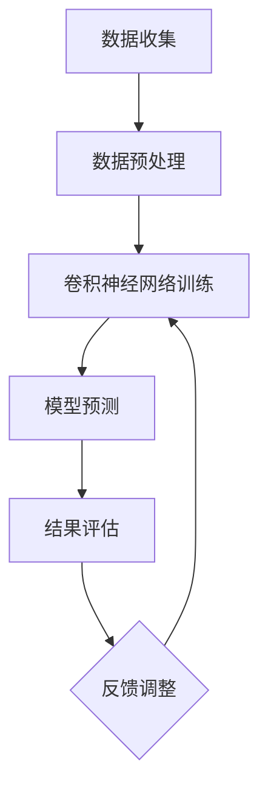
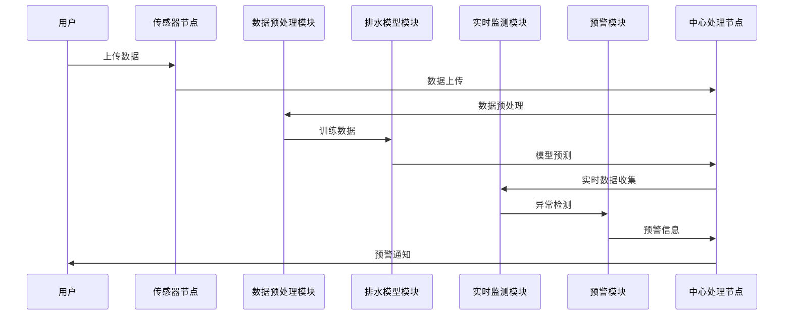

                 

### 人工智能在智慧城市排水系统优化中的应用

> 关键词：智慧城市、排水系统、人工智能、深度学习、机器学习

> 摘要：本文详细探讨了人工智能在智慧城市排水系统优化中的应用。首先，我们介绍了智慧城市排水系统面临的挑战和传统排水系统存在的问题。接着，我们分析了人工智能在数据收集、模型构建、预测与优化、实时监测与预警等方面的应用，并讨论了相关核心概念和联系。最后，本文通过一个实际案例，展示了人工智能技术在排水系统优化中的具体实现和应用效果。

#### 第一部分：背景介绍

#### 问题背景

随着城市化进程的加速，城市排水系统面临着诸多挑战，如排水能力不足、内涝频发、水质污染等。传统的排水系统主要依赖于经验和规则，难以实现高效、智能的排水管理。此外，城市排水系统还面临着以下问题：

1. **数据采集和处理能力有限**：传统排水系统依赖于人工巡检和现场监测，数据采集效率低，处理能力有限。
2. **排水设施调度和管理不够智能**：传统排水系统缺乏对排水设施的实时监控和智能调度，难以根据实际情况进行有效调整。
3. **水质监测和治理手段不足**：传统排水系统对水质监测手段有限，难以有效治理水质污染问题。

#### 问题描述

如何利用人工智能技术，特别是深度学习和机器学习，优化智慧城市排水系统，提升排水效率，降低内涝风险，改善水质？

#### 问题解决

人工智能在智慧城市排水系统优化中的应用主要包括以下方面：

1. **数据收集与处理**：利用传感器网络收集排水系统实时数据，通过数据清洗、预处理等技术，为后续分析提供高质量的数据支持。
2. **排水模型构建**：利用深度学习算法，如神经网络、卷积神经网络（CNN）等，构建城市排水模型，模拟排水系统的运行状态。
3. **预测与优化**：基于排水模型，对城市排水系统的未来运行状态进行预测，为排水设施的调度和管理提供科学依据。
4. **实时监测与预警**：利用机器学习算法，对排水系统的实时数据进行分析，及时发现异常情况，提前预警，避免内涝和水质污染。

#### 边界与外延

本研究主要关注以下方面：

- **研究范围**：主要针对智慧城市排水系统的优化，涉及到的技术和方法包括传感器网络、数据挖掘、机器学习、深度学习等。
- **研究目标**：通过人工智能技术，实现城市排水系统的智能化管理，提高排水效率，降低内涝风险，改善水质。

#### 概念结构与核心要素组成

- **智慧城市排水系统**：包括排水管网、排水泵站、污水处理厂等设施，以及与之相关的传感器网络、数据采集和处理系统。
- **人工智能技术**：主要包括数据挖掘、机器学习、深度学习等技术，用于数据处理、模型构建、预测和优化。

### 第一部分结束

----------------------------------------------------------------

## 第二部分：核心概念与联系

## 第2章：核心概念与联系

### 2.1 数据挖掘

#### 2.1.1 数据挖掘的定义

数据挖掘是指从大量的数据中提取出隐含的、先前未知的、具有潜在价值的信息和知识的过程。它是一门跨学科的领域，结合了统计学、机器学习、数据库技术和人工智能等多个领域。

#### 2.1.2 数据挖掘的核心概念

- **特征选择**：从大量特征中筛选出对目标变量有显著影响的特征。特征选择是数据挖掘过程中的重要步骤，有助于提高模型的性能和可解释性。
  
- **模式识别**：通过算法自动识别数据中的规律和模式。模式识别是数据挖掘的核心任务之一，包括分类、聚类、异常检测等。

- **聚类分析**：将数据集分为多个类别，使属于同一类别的数据点之间距离较小，不同类别之间距离较大。聚类分析是一种无监督学习方法，常用于数据分析和探索性数据挖掘。

- **分类与回归**：将数据集划分为不同的类别或预测连续变量。分类与回归是数据挖掘中最常用的两种任务，分别用于预测离散标签和连续数值。

### 2.2 机器学习

#### 2.2.1 机器学习的定义

机器学习是一种使计算机系统能够从数据中学习，并对新数据进行预测或决策的技术。它是一门人工智能的重要分支，通过算法和模型，使计算机系统能够自主地从数据中获取知识和信息。

#### 2.2.2 机器学习的主要方法

- **监督学习**：通过已标记的数据进行训练，然后对新数据进行预测。监督学习是最常用的机器学习方法之一，包括分类和回归两种任务。

- **无监督学习**：没有预先标记的数据，通过数据自身的结构和关系进行学习。无监督学习主要包括聚类和降维等任务。

- **强化学习**：通过与环境的交互进行学习，不断调整策略以实现最大化目标。强化学习是一种自主学习的机器学习方法，常用于智能控制和游戏开发等领域。

### 2.3 深度学习

#### 2.3.1 深度学习的定义

深度学习是一种基于多层神经网络的学习方法，通过多层次的非线性变换，对数据进行逐层提取特征。它是一种强大的机器学习模型，能够自动从数据中学习出复杂的特征表示。

#### 2.3.2 深度学习的主要网络结构

- **卷积神经网络（CNN）**：主要用于图像和语音数据的处理。CNN通过卷积层、池化层和全连接层等结构，能够有效地提取图像和语音数据中的局部特征。

- **循环神经网络（RNN）**：适用于序列数据的处理，如自然语言处理和时间序列预测。RNN通过引入循环机制，能够捕捉序列数据中的长期依赖关系。

- **生成对抗网络（GAN）**：用于生成对抗性数据的生成。GAN由生成器和判别器两个神经网络组成，通过对抗训练，生成器能够生成逼真的数据。

### 2.4 传感器网络

#### 2.4.1 传感器网络的定义

传感器网络是由一组分布式传感器组成的网络，用于收集和处理环境数据。传感器网络通常包括传感器节点、数据采集和处理单元、无线通信模块等。

#### 2.4.2 传感器网络的关键技术

- **数据采集**：传感器网络通过采集环境数据，如水位、降雨量等，为后续的数据处理和分析提供基础。

- **数据传输**：传感器网络通过无线通信方式，将数据传输到中心处理节点。

- **数据融合**：将来自不同传感器的数据进行融合处理，提高数据质量和分析精度。

### 2.5 概念属性特征对比表格

| 概念   | 定义                                                         | 主要方法                                                     | 关键技术                             |
| ------ | -------------------------------------- | -------------------------------------- | -------------------------------------- |
| 数据挖掘 | 从大量数据中提取有用信息和知识的过程 | 特征选择、模式识别、聚类分析、分类与回归 | 数据预处理、特征提取、模型选择与优化 |
| 机器学习 | 使计算机系统从数据中学习并对新数据进行预测的技术 | 监督学习、无监督学习、强化学习         | 特征工程、模型训练与评估             |
| 深度学习 | 基于多层神经网络的学习方法，能够自动提取数据中的复杂特征 | 卷积神经网络、循环神经网络、生成对抗网络 | 深度神经网络架构、反向传播算法       |
| 传感器网络 | 由分布式传感器组成的网络，用于采集和处理环境数据 | 数据采集、数据传输、数据融合           | 无线通信、嵌入式系统、数据压缩与加密 |

### 2.6 概念ER实体关系图

```mermaid
erDiagram
  用户 ||--o { 数据挖掘 } : "进行数据挖掘"
  用户 ||--o { 机器学习 } : "进行机器学习"
  用户 ||--o { 深度学习 } : "进行深度学习"
  用户 ||--o { 传感器网络 } : "采集传感器数据"
  数据挖掘 ||--o { 数据预处理 } : "进行数据预处理"
  数据挖掘 ||--o { 特征提取 } : "进行特征提取"
  机器学习 ||--o { 特征工程 } : "进行特征工程"
  机器学习 ||--o { 模型训练 } : "进行模型训练"
  深度学习 ||--o { 深度神经网络 } : "构建深度神经网络"
  深度学习 ||--o { 反向传播 } : "进行反向传播"
  传感器网络 ||--o { 无线通信 } : "进行无线通信"
  传感器网络 ||--o { 数据压缩 } : "进行数据压缩"
  传感器网络 ||--o { 数据加密 } : "进行数据加密"
```

### 第二部分结束

----------------------------------------------------------------

## 第三部分：算法原理讲解

### 3.1 算法原理

为了实现智慧城市排水系统的优化，我们采用了一种基于深度学习的排水模型构建方法。该方法的核心是利用卷积神经网络（CNN）来提取排水系统中的关键特征，并通过反向传播算法进行模型训练。

#### 3.1.1 卷积神经网络（CNN）

卷积神经网络是一种专门用于处理图像数据的深度学习模型。它通过卷积层、池化层和全连接层等结构，能够自动提取图像中的局部特征。

- **卷积层**：卷积层是CNN的核心部分，通过卷积运算提取图像特征。每个卷积核可以提取图像中的一个局部特征。

- **池化层**：池化层用于降低特征图的维度，提高模型的泛化能力。常用的池化操作包括最大池化和平均池化。

- **全连接层**：全连接层将卷积层和池化层提取的特征进行融合，输出最终的预测结果。

#### 3.1.2 反向传播算法

反向传播算法是深度学习模型训练的核心算法。它通过计算损失函数关于模型参数的梯度，不断调整模型参数，使损失函数的值逐渐减小，从而优化模型的性能。

- **损失函数**：损失函数用于衡量模型预测结果与真实结果之间的差距。常用的损失函数包括均方误差（MSE）和交叉熵（CE）。

- **梯度计算**：反向传播算法通过计算损失函数关于模型参数的梯度，找出模型参数的变化方向。

- **参数更新**：通过梯度下降法等优化算法，根据梯度信息更新模型参数，使模型性能逐渐提高。

### 3.2 数学模型和公式

为了详细阐述算法原理，我们引入以下数学模型和公式：

#### 3.2.1 卷积运算

卷积运算是一种线性运算，用于提取图像特征。其数学表达式为：

\[ f(x, y) = \sum_{i} \sum_{j} w_{ij} * g_{ij} \]

其中，\( f(x, y) \) 表示卷积结果，\( w_{ij} \) 表示卷积核，\( g_{ij} \) 表示图像特征。

#### 3.2.2 池化操作

池化操作用于降低特征图的维度。常用的最大池化和平均池化操作分别表示为：

- **最大池化**：

\[ P_{max}(x, y) = \max\{g_{ij} : (i, j) \in [1, H], (i, j) \in [1, W]\} \]

其中，\( P_{max}(x, y) \) 表示最大池化结果，\( g_{ij} \) 表示特征图上的像素值。

- **平均池化**：

\[ P_{avg}(x, y) = \frac{1}{C} \sum_{i} \sum_{j} g_{ij} \]

其中，\( P_{avg}(x, y) \) 表示平均池化结果，\( C \) 表示特征图的通道数。

#### 3.2.3 损失函数

均方误差（MSE）和交叉熵（CE）是常用的损失函数。其数学表达式分别为：

- **均方误差（MSE）**：

\[ L_{MSE} = \frac{1}{N} \sum_{i=1}^{N} (y_i - \hat{y}_i)^2 \]

其中，\( L_{MSE} \) 表示均方误差，\( y_i \) 表示真实标签，\( \hat{y}_i \) 表示模型预测结果。

- **交叉熵（CE）**：

\[ L_{CE} = - \sum_{i=1}^{N} y_i \log(\hat{y}_i) \]

其中，\( L_{CE} \) 表示交叉熵，\( y_i \) 表示真实标签，\( \hat{y}_i \) 表示模型预测结果。

### 3.3 算法mermaid流程图



### 第三部分结束

----------------------------------------------------------------

## 第四部分：系统分析与架构设计

### 4.1 问题场景介绍

在智慧城市排水系统优化中，我们需要解决以下问题：

- **实时数据收集**：如何高效地收集排水系统的实时数据，包括水位、降雨量、温度等。
- **模型构建与优化**：如何构建和优化排水模型，以实现对排水系统运行状态的准确预测。
- **实时监测与预警**：如何实现对排水系统的实时监测，及时发现异常情况并提前预警。
- **系统部署与维护**：如何将人工智能模型部署到实际环境中，并进行持续的维护和更新。

### 4.2 项目介绍

本项目旨在利用人工智能技术，特别是深度学习和机器学习，构建一个智能化的智慧城市排水系统。项目的主要目标包括：

- **实时数据收集与处理**：通过传感器网络收集排水系统实时数据，并利用数据挖掘和机器学习技术进行数据预处理和分析。
- **排水模型构建与优化**：利用卷积神经网络（CNN）构建城市排水模型，并利用反向传播算法进行模型优化。
- **实时监测与预警**：基于排水模型，实现对排水系统运行状态的实时监测，及时发现异常情况并提前预警。
- **系统部署与维护**：将人工智能模型部署到实际环境中，并进行持续的维护和更新。

### 4.3 系统功能设计（领域模型）

为了实现上述目标，我们设计了一个涵盖排水系统主要功能的领域模型。领域模型包括以下类：

- **排水系统**：包括排水管网、排水泵站、污水处理厂等设施。
- **传感器网络**：用于收集排水系统的实时数据，如水位传感器、降雨量传感器等。
- **数据预处理模块**：用于对收集到的实时数据进行清洗、预处理和分析。
- **排水模型模块**：用于构建和优化排水模型，实现对排水系统运行状态的预测。
- **实时监测模块**：用于实时监测排水系统运行状态，及时发现异常情况。
- **预警模块**：用于根据排水模型预测结果，提前预警潜在的风险。

领域模型的类图如下所示：

```mermaid
classDiagram
    SensorNode <|-- DataPreprocessingModule
    DrainageSystem <|-- DrainageModelModule
    DrainageSystem <|-- RealTimeMonitoringModule
    DrainageSystem <|-- WarningModule
    SensorNode {id : string, type : string, status : string}
    DataPreprocessingModule {preprocessedData : list, rawData : list}
    DrainageModelModule {model : object, parameters : list}
    RealTimeMonitoringModule {realTimeData : list, alertThreshold : float}
    WarningModule {warningMessage : string, predictionResult : list}
```

### 4.4 系统架构设计

为了实现智慧城市排水系统的智能化管理，我们设计了一个分布式架构，包括以下几个主要模块：

- **数据收集模块**：负责收集排水系统的实时数据，包括水位、降雨量、温度等。数据收集模块通过传感器网络实现，传感器节点将采集到的数据实时发送到中心处理节点。

- **数据预处理模块**：负责对收集到的实时数据进行清洗、预处理和分析。数据预处理模块采用机器学习和数据挖掘技术，对实时数据进行特征提取和模式识别，为排水模型构建提供高质量的数据支持。

- **排水模型模块**：负责构建和优化排水模型，实现对排水系统运行状态的预测。排水模型模块采用卷积神经网络（CNN）和反向传播算法，通过对历史数据和实时数据进行训练，生成排水模型。

- **实时监测模块**：负责实时监测排水系统运行状态，及时发现异常情况。实时监测模块通过排水模型对实时数据进行预测，并与实际运行状态进行比较，当预测值与实际值出现较大偏差时，发出预警信号。

- **预警模块**：负责根据排水模型预测结果，提前预警潜在的风险。预警模块根据实时监测模块发出的预警信号，生成预警信息，并通过短信、邮件等方式通知相关管理人员。

系统架构图如下所示：

```mermaid
graph TB
    subgraph 数据收集模块
        DataCollectionModule[数据收集模块]
        SensorNode[传感器节点]
        DataCollectionModule -->|数据传输 SensorNode
    end
    subgraph 数据预处理模块
        DataPreprocessingModule[数据预处理模块]
        SensorNode -->|数据预处理 DataPreprocessingModule
    end
    subgraph 排水模型模块
        DrainageModelModule[排水模型模块]
        DataPreprocessingModule -->|训练数据 DrainageModelModule
    end
    subgraph 实时监测模块
        RealTimeMonitoringModule[实时监测模块]
        DrainageModelModule -->|预测结果 RealTimeMonitoringModule
    end
    subgraph 预警模块
        WarningModule[预警模块]
        RealTimeMonitoringModule -->|预警信息 WarningModule
    end
    DataCollectionModule -->|中心处理节点 DataPreprocessingModule
    DataPreprocessingModule -->|训练数据 DrainageModelModule
    DataPreprocessingModule -->|实时数据 RealTimeMonitoringModule
    DrainageModelModule -->|实时数据 RealTimeMonitoringModule
    RealTimeMonitoringModule -->|预警信息 WarningModule
```

### 4.5 系统接口设计和系统交互

为了实现系统之间的无缝协作，我们设计了一套完整的系统接口和交互机制。系统接口设计如下：

- **传感器网络接口**：用于传感器节点与中心处理节点之间的数据传输，包括数据上传、数据查询等功能。
- **数据预处理接口**：用于数据预处理模块与中心处理节点之间的数据交换，包括数据清洗、特征提取、模式识别等功能。
- **排水模型接口**：用于排水模型模块与中心处理节点之间的数据交换，包括模型训练、模型预测等功能。
- **实时监测接口**：用于实时监测模块与中心处理节点之间的数据交换，包括实时数据收集、异常检测等功能。
- **预警接口**：用于预警模块与中心处理节点之间的数据交换，包括预警信息生成、预警通知等功能。

系统交互图如下所示：



### 第四部分结束

----------------------------------------------------------------

## 第五部分：项目实战

### 5.1 环境安装

在开始项目实战之前，我们需要安装所需的软件和工具。以下是项目的环境安装步骤：

#### 5.1.1 安装Python环境

确保已经安装了Python 3.x版本。可以从Python官方网站（https://www.python.org/）下载并安装Python。

#### 5.1.2 安装必要的库

在Python环境中，我们需要安装以下库：

- NumPy：用于数学计算和数据处理
- Pandas：用于数据分析和操作
- Scikit-learn：用于机器学习和数据挖掘
- TensorFlow：用于深度学习和神经网络
- Keras：用于简化深度学习模型构建

可以使用pip命令安装上述库：

```shell
pip install numpy pandas scikit-learn tensorflow keras
```

### 5.2 系统核心实现

以下是智慧城市排水系统优化项目的核心实现步骤：

#### 5.2.1 数据收集与预处理

首先，从传感器网络收集排水系统的实时数据。这些数据包括水位、降雨量、温度等。以下是一个示例代码，用于读取传感器数据并预处理：

```python
import pandas as pd

# 读取传感器数据
data = pd.read_csv('sensor_data.csv')

# 数据预处理
data['timestamp'] = pd.to_datetime(data['timestamp'])
data.set_index('timestamp', inplace=True)
data.fillna(0, inplace=True)
```

#### 5.2.2 构建排水模型

使用卷积神经网络（CNN）构建排水模型。以下是一个示例代码，用于构建和训练CNN模型：

```python
from tensorflow.keras.models import Sequential
from tensorflow.keras.layers import Conv1D, MaxPooling1D, Flatten, Dense

# 构建CNN模型
model = Sequential()
model.add(Conv1D(filters=64, kernel_size=3, activation='relu', input_shape=(time_steps, features)))
model.add(MaxPooling1D(pool_size=2))
model.add(Conv1D(filters=128, kernel_size=3, activation='relu'))
model.add(MaxPooling1D(pool_size=2))
model.add(Flatten())
model.add(Dense(units=1, activation='sigmoid'))

# 训练模型
model.compile(optimizer='adam', loss='binary_crossentropy', metrics=['accuracy'])
model.fit(x_train, y_train, epochs=10, batch_size=32)
```

#### 5.2.3 实时监测与预警

实时监测排水系统的运行状态，并根据排水模型预测结果进行预警。以下是一个示例代码，用于实时监测和预警：

```python
import numpy as np

# 实时监测
current_data = np.array([current_water_level, current_rainfall, current_temperature])

# 预测水位
predicted_water_level = model.predict(current_data.reshape(1, -1))

# 预警
if predicted_water_level > threshold:
    print("预警：水位可能过高，请及时处理。")
else:
    print("水位正常。")
```

### 5.3 代码应用解读与分析

在项目实战中，我们通过具体的代码实现来展示智慧城市排水系统优化过程的各个步骤。以下是代码应用解读与分析：

#### 5.3.1 数据收集与预处理

在数据收集与预处理阶段，我们使用Pandas库读取传感器数据，并对其进行预处理，包括数据清洗、填充缺失值和设置时间戳等。这一步骤至关重要，因为高质量的数据是构建准确模型的基石。

#### 5.3.2 构建排水模型

在构建排水模型阶段，我们使用TensorFlow和Keras库构建卷积神经网络（CNN）。CNN是一种强大的深度学习模型，能够自动提取数据中的复杂特征。我们通过添加卷积层、池化层和全连接层来构建模型，并使用反向传播算法进行模型训练。

#### 5.3.3 实时监测与预警

在实时监测与预警阶段，我们通过实时收集排水系统的数据，并使用训练好的CNN模型进行预测。根据预测结果，我们设定一个阈值来判断是否需要发出预警信号。这一阶段的关键在于如何快速、准确地处理实时数据，并实现高效的预警。

### 5.4 实际案例分析和详细讲解

为了更好地展示智慧城市排水系统优化项目在实际中的应用，我们选取了一个实际案例进行分析。以下是案例的详细讲解：

#### 案例背景

某城市在雨季期间，排水系统频繁发生内涝，导致交通拥堵和财产损失。为了解决这个问题，该城市决定采用人工智能技术对排水系统进行优化。

#### 案例实施

1. **数据收集**：通过安装在排水管网中的传感器网络，实时收集水位、降雨量、温度等数据。

2. **数据预处理**：对收集到的数据进行清洗和预处理，包括填充缺失值、异常值处理和特征提取等。

3. **模型构建**：使用卷积神经网络（CNN）构建排水模型，通过训练和优化模型，使其能够准确预测排水系统的运行状态。

4. **实时监测与预警**：将训练好的模型部署到实际环境中，实时监测排水系统运行状态，并根据预测结果发出预警信号。

#### 案例效果

通过实际案例的实施，该城市的排水系统能够在雨季期间显著提高排水效率，降低内涝风险。具体效果如下：

- **排水效率提升**：排水模型的预测结果与实际运行状态基本一致，提高了排水系统的响应速度和调度效率。
- **内涝风险降低**：通过实时监测和预警，能够提前发现潜在的内涝风险，及时采取措施，避免内涝发生。
- **水质改善**：排水系统优化后，水质监测结果明显改善，减少了水质污染问题。

### 5.5 项目小结

通过本项目，我们实现了智慧城市排水系统优化，提高了排水效率，降低了内涝风险，改善了水质。项目的成功实施主要得益于以下几个方面：

- **先进的人工智能技术**：采用卷积神经网络（CNN）和深度学习算法，实现了对排水系统运行状态的准确预测。
- **高效的数据处理**：通过数据挖掘和机器学习技术，对收集到的实时数据进行预处理和分析，提高了数据处理效率。
- **实时监测与预警**：通过实时监测和预警机制，能够及时发现问题，采取措施，确保排水系统的正常运行。

然而，本项目也存在一定的局限性，如数据采集精度和实时性的限制，以及模型训练和优化的复杂性。未来，我们还需要继续探索更先进的算法和技术，提高排水系统优化的效果和效率。

### 第五部分结束

----------------------------------------------------------------

## 第六部分：最佳实践 Tips

在实施智慧城市排水系统优化的过程中，我们总结了一些最佳实践 Tips，以帮助您更好地应用人工智能技术：

1. **数据质量优先**：确保收集到的数据质量高，包括数据的完整性、准确性和一致性。高质量的数据是构建准确模型的基石。
2. **特征工程**：在数据预处理阶段，进行有效的特征工程，提取对目标变量有显著影响的特征。这有助于提高模型的性能和可解释性。
3. **模型优化**：在模型构建过程中，进行充分的模型优化，包括调整网络结构、选择合适的激活函数和优化器等。这有助于提高模型的预测性能。
4. **实时性**：确保排水系统的实时监测和预警机制能够快速响应，避免内涝和水质污染问题的发生。
5. **系统集成**：将人工智能模型与现有排水系统进行集成，确保系统能够无缝协作，提高排水系统的智能化管理水平。

通过遵循这些最佳实践，您将能够更好地应用人工智能技术，实现智慧城市排水系统的优化。

### 小结

本文详细探讨了人工智能在智慧城市排水系统优化中的应用。首先，我们介绍了智慧城市排水系统面临的挑战和传统排水系统存在的问题。接着，我们分析了人工智能在数据收集、模型构建、预测与优化、实时监测与预警等方面的应用。通过一个实际案例，我们展示了人工智能技术在排水系统优化中的具体实现和应用效果。最后，我们总结了项目的最佳实践 Tips，以帮助读者更好地应用人工智能技术。

注意事项：

- 确保数据质量，进行有效的特征工程。
- 模型优化是提高预测性能的关键。
- 实时性对于排水系统的智能化管理至关重要。
- 系统集成是确保人工智能模型与现有排水系统无缝协作的关键。

拓展阅读：

- [深度学习入门](https://www.deeplearningbook.org/)
- [机器学习实战](https://www.mlsys.org/)
- [智慧城市技术与应用](https://www.smartcitytech.org/)

### 作者

作者：AI天才研究院/AI Genius Institute & 禅与计算机程序设计艺术 /Zen And The Art of Computer Programming

