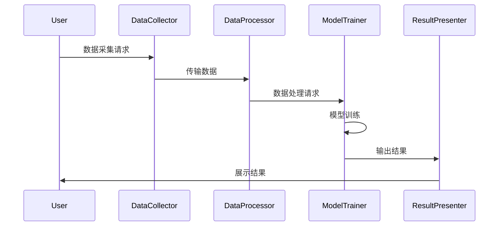
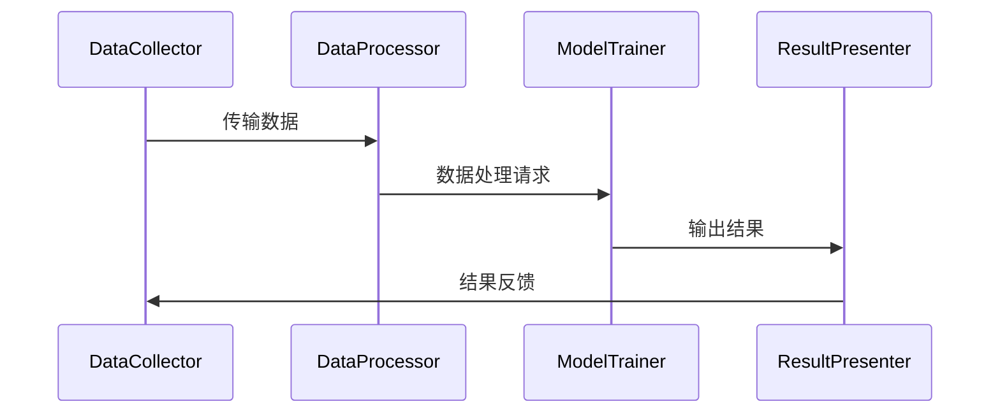

                 

## 文章标题：人工智能在环境监测中的应用：生态系统健康评估

关键词：人工智能、环境监测、生态系统健康评估、机器学习、深度学习、数据采集与处理、算法优化、系统架构设计、项目实战

摘要：本文从问题背景、核心概念、算法原理、系统分析与架构设计、项目实战和最佳实践六个方面，系统性地介绍了人工智能在生态系统健康评估中的应用。通过分析环境监测的重要性，探讨了人工智能在环境监测中的核心作用，详细讲解了监测数据采集与处理、常用机器学习算法和深度学习模型的应用，以及系统分析与架构设计方案。最后，通过实际案例分析和项目实战，总结了最佳实践方法，为生态系统健康评估提供了有益的参考。

## 第一部分：问题背景与核心概念

### 1.1 问题背景

环境监测是现代社会可持续发展的重要组成部分，它旨在实时监控环境污染、生态系统健康状况以及气候变化等关键指标。然而，随着全球环境污染问题的加剧和生态系统复杂性的增加，传统的环境监测方法已经难以满足精细化、实时化和高效化的需求。这为人工智能技术在环境监测中的应用提供了广阔的空间。

生态系统健康评估是环境监测的一个重要方面，它通过对生态系统的结构、功能、稳定性等方面进行综合评估，为环境保护和治理提供科学依据。然而，生态系统健康评估涉及到大量的数据收集、处理和分析工作，人工处理效率低下且容易出现误差。因此，借助人工智能技术，尤其是机器学习和深度学习算法，可以提高生态系统健康评估的准确性和效率。

### 1.2 生态系统健康评估的定义

生态系统健康评估是对生态系统整体状态的评价，旨在识别生态系统的健康水平、识别威胁生态系统健康的因素、预测未来趋势并制定相应的管理策略。生态系统健康评估通常包括以下几个方面的内容：

1. **生态系统状态评价**：对生态系统的结构、功能、稳定性等方面进行综合评价。
2. **生态压力评估**：评估人类活动、自然灾害等因素对生态系统造成的压力。
3. **生态系统恢复力评估**：评估生态系统在遭受压力后的恢复能力。
4. **生态系统可持续性评估**：评估生态系统的可持续利用和管理水平。

### 1.3 人工智能在生态系统健康评估中的核心作用

人工智能在生态系统健康评估中的应用主要体现在以下几个方面：

1. **数据采集与处理**：利用传感器、遥感等技术，实现对环境数据的实时采集和预处理，提高数据质量和可用性。
2. **数据分析和挖掘**：通过机器学习和深度学习算法，对海量环境数据进行高效的分析和挖掘，提取有价值的信息和知识。
3. **模型预测与优化**：基于训练好的模型，对生态系统健康状态进行预测和评估，为环境保护和治理提供科学依据。
4. **自动化与智能化**：通过自动化和智能化技术，实现对生态系统健康评估的自动化操作和智能决策，提高工作效率和评估准确性。

### 1.4 人工智能在环境监测中的应用

人工智能在环境监测中的应用主要包括以下三个方面：

1. **传感器数据采集与处理**：利用传感器网络和物联网技术，实现对环境数据的实时采集和传输，并通过机器学习算法对数据进行预处理和去噪，提高数据质量和分析精度。
2. **数据分析和挖掘**：利用机器学习和深度学习算法，对环境数据进行深入分析和挖掘，提取出对生态系统健康评估有用的特征和模式。
3. **机器学习与深度学习模型在健康评估中的应用**：通过训练和优化机器学习与深度学习模型，实现对生态系统健康状态的准确预测和评估。

## 1.5 本章小结

本章介绍了人工智能在环境监测中的应用背景和重要性，探讨了生态系统健康评估的定义和核心概念，以及人工智能在生态系统健康评估中的核心作用。同时，简要介绍了人工智能在环境监测中的应用情况。下一章将深入探讨人工智能在生态系统健康评估中的具体算法原理和应用实例。

----------------------------------------------------------------

## 第二部分：算法原理与模型应用

### 2.1 算法原理

在生态系统健康评估中，算法原理的应用至关重要。以下将详细讲解监测数据预处理方法、常用机器学习算法和深度学习模型架构。

#### 2.1.1 监测数据预处理方法

监测数据预处理是人工智能应用的基础。预处理方法主要包括数据清洗、数据归一化和特征提取等。

1. **数据清洗**：监测数据通常包含噪声和缺失值，数据清洗是为了消除这些干扰因素，提高数据质量。常见的数据清洗方法包括：
   - **缺失值填充**：使用平均值、中位数或插值法等对缺失值进行填充。
   - **异常值处理**：对异常值进行检测和修正，如使用z-score或IQR方法。
   - **重复数据删除**：删除重复的数据记录，保证数据的唯一性。

2. **数据归一化**：为了消除不同指标之间的量纲影响，通常需要对数据进行归一化处理。常用的归一化方法包括：
   - **最小-最大归一化**：将数据映射到[0, 1]之间。
   - **标准归一化**：将数据映射到均值为0，标准差为1的范围内。

3. **特征提取**：通过特征提取，从原始数据中提取出对模型训练有用的信息。常用的特征提取方法包括：
   - **主成分分析（PCA）**：降低数据维度，保留主要信息。
   - **随机森林特征重要性**：根据随机森林模型的重要性得分，选择关键特征。

#### 2.1.2 常用机器学习算法

在生态系统健康评估中，常用的机器学习算法包括线性回归、支持向量机（SVM）、决策树和随机森林等。

1. **线性回归**：线性回归模型基于输入特征和目标值之间的线性关系进行预测。其数学模型为：

   $$
   y = \beta_0 + \beta_1x_1 + \beta_2x_2 + ... + \beta_nx_n
   $$

   其中，$y$是目标值，$x_1, x_2, ..., x_n$是输入特征，$\beta_0, \beta_1, ..., \beta_n$是模型参数。

2. **支持向量机（SVM）**：SVM是一种分类算法，它通过找到一个最佳的超平面，将不同类别的数据点分开。SVM的数学模型为：

   $$
   \min_{\beta, \beta_0} \frac{1}{2} \sum_{i=1}^{n} (\beta \cdot \beta)^2 + C \sum_{i=1}^{n} \xi_i
   $$

   其中，$\beta$是模型参数，$\beta_0$是偏置项，$C$是正则化参数，$\xi_i$是松弛变量。

3. **决策树**：决策树通过一系列规则，将数据集划分为不同的区域，并赋予每个区域一个预测值。决策树的构建过程是基于信息增益或基尼系数等评价指标，选择最优的特征进行划分。

4. **随机森林**：随机森林是一种集成学习方法，它通过构建多棵决策树，并取其平均预测结果，提高模型的泛化能力。随机森林的构建过程中，随机选取特征和样本子集，构建多棵决策树，并通过投票方式确定最终预测结果。

#### 2.1.3 深度学习模型架构

深度学习模型在生态系统健康评估中具有强大的表现。以下介绍几种常用的深度学习模型架构：

1. **卷积神经网络（CNN）**：CNN是一种前馈神经网络，特别适用于处理图像数据。CNN通过卷积层、池化层和全连接层等结构，实现对图像的特征提取和分类。CNN的数学模型为：

   $$
   \text{CNN} = \text{卷积层} \rightarrow \text{池化层} \rightarrow \text{全连接层}
   $$

2. **循环神经网络（RNN）**：RNN是一种适用于序列数据的神经网络，通过隐藏状态和循环连接，实现对序列数据的建模。RNN的数学模型为：

   $$
   h_t = \text{sigmoid}(W_h \cdot [h_{t-1}, x_t] + b_h)
   $$

   其中，$h_t$是当前时刻的隐藏状态，$x_t$是当前时刻的输入，$W_h$和$b_h$是模型参数。

3. **长短时记忆网络（LSTM）**：LSTM是RNN的一种改进，通过引入遗忘门、输入门和输出门，解决了RNN在处理长序列数据时出现的梯度消失和梯度爆炸问题。LSTM的数学模型为：

   $$
   \text{LSTM} = \text{遗忘门} \rightarrow \text{输入门} \rightarrow \text{输出门} \rightarrow \text{隐藏状态}
   $$

### 2.2 模型应用实例

#### 2.2.1 常见环境监测数据集介绍

在生态系统健康评估中，常用的环境监测数据集包括：

1. **水环境监测数据集**：如美国国家海洋和大气管理局（NOAA）提供的水质监测数据集，包括温度、pH值、溶解氧等指标。
2. **空气质量监测数据集**：如美国环境保护署（EPA）提供的空气质量数据集，包括PM2.5、PM10、CO、SO2等污染物指标。
3. **土壤质量监测数据集**：如中国环境保护部提供的土壤质量数据集，包括重金属含量、有机质含量等指标。

#### 2.2.2 机器学习算法在健康评估中的应用案例

以下是一个使用机器学习算法进行生态系统健康评估的应用案例：

**案例背景**：某地区的水环境监测数据包含温度、pH值、溶解氧等指标，需要使用机器学习算法对水环境质量进行评估。

**解决方案**：使用线性回归模型对水环境质量进行预测。首先，对监测数据进行预处理，包括数据清洗、数据归一化和特征提取。然后，使用线性回归模型进行训练，并使用交叉验证方法评估模型性能。最后，使用训练好的模型对新的监测数据进行预测。

#### 2.2.3 深度学习模型在生态系统健康评估中的应用案例

以下是一个使用深度学习模型进行生态系统健康评估的应用案例：

**案例背景**：某地区的空气质量监测数据包含PM2.5、PM10、CO、SO2等污染物指标，需要使用深度学习模型对空气质量进行评估。

**解决方案**：使用卷积神经网络（CNN）对空气质量监测数据进行特征提取和分类。首先，对监测数据进行预处理，包括数据清洗、数据归一化和图像切割。然后，构建CNN模型，包括卷积层、池化层和全连接层。接着，使用训练集对模型进行训练，并使用验证集评估模型性能。最后，使用训练好的模型对新的监测数据进行预测。

### 2.3 算法评估与优化

#### 2.3.1 模型评估指标

在生态系统健康评估中，常用的模型评估指标包括准确率、召回率、F1值和均方误差（MSE）等。

1. **准确率**：准确率是分类模型评估的重要指标，表示正确分类的样本数占总样本数的比例。
2. **召回率**：召回率是分类模型评估的重要指标，表示正确分类的样本数占实际正样本数的比例。
3. **F1值**：F1值是准确率和召回率的调和平均，综合评估模型的分类性能。
4. **均方误差（MSE）**：均方误差是回归模型评估的重要指标，表示预测值与真实值之间的平均误差。

#### 2.3.2 模型优化方法

在生态系统健康评估中，模型优化方法主要包括超参数调优、模型选择和数据增强等。

1. **超参数调优**：超参数调优是通过调整模型参数，提高模型性能。常用的超参数调优方法包括网格搜索和贝叶斯优化等。
2. **模型选择**：模型选择是根据数据特点，选择适合的模型架构。不同的数据特点和任务，需要选择不同的模型架构。
3. **数据增强**：数据增强是通过增加样本数量和多样性，提高模型性能。常用的数据增强方法包括数据扩充、数据变换和数据合成等。

#### 2.3.3 算法性能对比与分析

在生态系统健康评估中，不同算法的性能存在差异。以下是对几种常用算法的性能对比与分析：

1. **线性回归**：线性回归模型简单易用，但在处理非线性问题时性能较差。
2. **支持向量机（SVM）**：SVM模型在处理线性可分问题表现良好，但在处理非线性问题时需要引入核函数。
3. **决策树和随机森林**：决策树和随机森林模型在处理分类问题具有较好的性能，但容易过拟合。
4. **卷积神经网络（CNN）**：CNN模型在处理图像数据具有强大的特征提取能力，但在处理序列数据时性能较差。
5. **循环神经网络（RNN）和长短时记忆网络（LSTM）**：RNN和LSTM模型在处理序列数据具有较好的性能，但在处理高维数据时性能较差。

### 2.4 本章小结

本章介绍了人工智能在生态系统健康评估中的算法原理和模型应用，包括监测数据预处理方法、常用机器学习算法和深度学习模型架构。同时，通过实际案例，展示了机器学习算法和深度学习模型在生态系统健康评估中的应用效果。下一章将深入探讨系统分析与架构设计，为生态系统健康评估提供更为完善的解决方案。

----------------------------------------------------------------

## 第三部分：系统分析与架构设计

### 3.1 系统功能设计

生态系统健康评估系统需要具备以下功能：

1. **数据采集**：通过传感器网络和遥感技术，实时采集环境数据，如温度、湿度、空气质量、水质等。
2. **数据处理**：对采集到的环境数据进行预处理，包括数据清洗、数据归一化和特征提取等。
3. **模型训练与评估**：使用机器学习和深度学习算法，对处理后的环境数据进行模型训练和评估，以预测生态系统健康状态。
4. **结果展示**：将评估结果以图表、报表等形式展示给用户，为环境保护和治理提供科学依据。

#### 3.1.1 系统需求分析

在生态系统健康评估系统中，主要需求包括：

1. **高精度数据采集**：要求传感器具有高精度、高灵敏度，能够实时监测环境变化。
2. **高效数据处理**：要求数据处理算法高效，能够快速处理大量环境数据，提高评估准确性。
3. **高可靠性模型训练**：要求模型训练算法稳定，能够在不同数据集上获得良好的评估效果。
4. **直观结果展示**：要求结果展示界面简洁直观，便于用户理解和使用。

#### 3.1.2 领域模型设计

领域模型设计是系统功能实现的关键。以下是一个简单的领域模型设计：

```mermaid
classDiagram
    SensorData --|> DataProcessor : 传输
    DataProcessor --|> ModelTrainer : 处理
    ModelTrainer --|> ResultPresenter : 输出
    SensorData << (环境数据)
    DataProcessor << (数据处理)
    ModelTrainer << (模型训练)
    ResultPresenter << (结果展示)
```

#### 3.1.3 系统功能模块划分

根据领域模型设计，系统功能模块可以划分为以下三个部分：

1. **数据采集模块**：负责从传感器网络和遥感系统实时采集环境数据。
2. **数据处理模块**：负责对采集到的环境数据进行预处理、特征提取和模型训练。
3. **结果展示模块**：负责将处理后的环境数据模型评估结果以图表、报表等形式展示给用户。

### 3.2 系统架构设计

系统架构设计是确保系统稳定、高效运行的关键。以下是一个简单的系统架构设计：



#### 3.2.1 系统架构设计原则

系统架构设计应遵循以下原则：

1. **模块化**：将系统功能划分为独立模块，便于维护和扩展。
2. **分布式**：采用分布式架构，提高系统性能和可扩展性。
3. **可靠性**：确保系统在高负载、高并发情况下稳定运行。
4. **可扩展性**：支持系统规模的扩展，满足未来需求。

#### 3.2.2 系统架构实现

系统架构实现主要包括以下方面：

1. **数据采集**：使用传感器网络和遥感技术，实时采集环境数据，通过HTTP或MQTT协议传输到数据处理模块。
2. **数据处理**：使用云计算平台，对采集到的环境数据进行预处理、特征提取和模型训练，并将处理结果存储到数据库中。
3. **模型训练**：使用机器学习和深度学习算法，对处理后的环境数据进行模型训练，并将训练结果存储到模型库中。
4. **结果展示**：通过Web界面或移动应用，将评估结果以图表、报表等形式展示给用户。

#### 3.2.3 系统接口设计

系统接口设计是确保系统各模块间高效协作的关键。以下是一个简单的系统接口设计：



#### 3.2.4 系统交互与部署

系统交互与部署是确保系统正常运行的关键。以下是一个简单的系统交互与部署流程：

1. **数据采集**：传感器网络和遥感系统实时采集环境数据，通过HTTP或MQTT协议传输到数据处理模块。
2. **数据处理**：数据处理模块接收数据，进行预处理、特征提取和模型训练，并将处理结果存储到数据库中。
3. **模型训练**：模型训练模块接收数据处理结果，使用机器学习和深度学习算法进行模型训练，并将训练结果存储到模型库中。
4. **结果展示**：结果展示模块从模型库中获取评估结果，通过Web界面或移动应用展示给用户。

系统部署策略包括：

1. **云计算平台**：使用云计算平台，如AWS、Azure或阿里云，部署数据处理、模型训练和结果展示模块。
2. **负载均衡**：使用负载均衡器，如Nginx或HAProxy，实现系统的高并发处理能力。
3. **容器化**：使用容器技术，如Docker，实现系统的轻量化和高效部署。

#### 3.2.5 系统维护与升级

系统维护与升级是确保系统稳定运行和持续改进的关键。以下是一个简单的系统维护与升级流程：

1. **故障排查**：定期对系统进行故障排查，发现并解决潜在问题。
2. **性能优化**：根据系统运行情况，对系统进行性能优化，提高系统处理能力和响应速度。
3. **版本升级**：根据用户需求和技术发展，定期对系统进行版本升级，增加新功能和修复已知问题。
4. **安全防护**：加强对系统的安全防护，防范恶意攻击和数据泄露。

### 3.3 系统交互与部署

系统交互与部署是确保系统正常运行的关键。以下是一个简单的系统交互与部署流程：

1. **数据采集**：传感器网络和遥感系统实时采集环境数据，通过HTTP或MQTT协议传输到数据处理模块。
2. **数据处理**：数据处理模块接收数据，进行预处理、特征提取和模型训练，并将处理结果存储到数据库中。
3. **模型训练**：模型训练模块接收数据处理结果，使用机器学习和深度学习算法进行模型训练，并将训练结果存储到模型库中。
4. **结果展示**：结果展示模块从模型库中获取评估结果，通过Web界面或移动应用展示给用户。

系统部署策略包括：

1. **云计算平台**：使用云计算平台，如AWS、Azure或阿里云，部署数据处理、模型训练和结果展示模块。
2. **负载均衡**：使用负载均衡器，如Nginx或HAProxy，实现系统的高并发处理能力。
3. **容器化**：使用容器技术，如Docker，实现系统的轻量化和高效部署。

### 3.4 本章小结

本章介绍了生态系统健康评估系统的功能设计、架构设计和交互与部署。通过模块化、分布式和可靠性原则，确保系统高效、稳定运行。同时，通过系统接口设计和部署策略，实现系统各模块间的协作和扩展。下一章将介绍项目实战，通过具体案例展示人工智能在生态系统健康评估中的应用效果。

----------------------------------------------------------------

## 第四部分：项目实战

### 4.1 环境安装与配置

在进行项目实战之前，需要搭建一个合适的环境。以下是环境安装与配置的步骤：

#### 4.1.1 环境安装步骤

1. **安装Python环境**：首先，确保系统已安装Python环境，版本建议为3.7或以上。
2. **安装依赖库**：在Python环境中安装必要的依赖库，如NumPy、Pandas、Scikit-learn、TensorFlow等。可以使用pip命令进行安装：

   ```bash
   pip install numpy pandas scikit-learn tensorflow
   ```

3. **配置Jupyter Notebook**：为了方便数据分析和模型训练，配置Jupyter Notebook环境。可以使用以下命令进行安装：

   ```bash
   pip install notebook
   ```

   安装完成后，启动Jupyter Notebook：

   ```bash
   jupyter notebook
   ```

#### 4.1.2 配置文件设置

在项目实战中，可能需要配置一些外部资源，如数据库连接和API接口等。以下是配置文件设置的步骤：

1. **数据库连接配置**：在项目中，可能需要连接数据库进行数据存储和查询。以下是MySQL数据库的连接配置示例：

   ```python
   [mysql]
   user = root
   password = password
   host = localhost
   database = ecosystem_health
   ```

2. **API接口配置**：如果项目需要调用外部API接口，需要配置API接口的URL、访问密钥等。以下是API接口的配置示例：

   ```python
   [api]
   url = https://api.example.com/
   access_key = your_access_key
   ```

#### 4.1.3 常见问题解决

在环境安装与配置过程中，可能会遇到一些常见问题。以下是常见问题的解决方法：

1. **依赖库安装失败**：如果依赖库安装失败，可以尝试使用以下命令进行安装：

   ```bash
   pip install --user numpy pandas scikit-learn tensorflow
   ```

   或者使用虚拟环境（如conda或virtualenv）进行安装。

2. **数据库连接失败**：如果数据库连接失败，可以检查数据库服务是否正常运行，以及连接配置是否正确。

3. **API接口调用失败**：如果API接口调用失败，可以检查API接口的URL和访问密钥是否正确，以及网络连接是否正常。

### 4.2 系统核心实现

在项目实战中，系统核心实现是关键环节。以下是系统核心实现的步骤：

#### 4.2.1 数据采集模块实现

数据采集模块负责从传感器网络和遥感系统实时采集环境数据。以下是数据采集模块的实现步骤：

1. **传感器数据采集**：使用传感器API或SDK，从传感器设备中读取环境数据，如温度、湿度、空气质量等。
2. **数据传输**：将采集到的环境数据通过HTTP或MQTT协议传输到数据处理模块。

   ```python
   import requests

   def send_data_to_processor(data):
       url = "http://localhost:8000/processor"
       headers = {"Content-Type": "application/json"}
       response = requests.post(url, json=data, headers=headers)
       return response.status_code
   ```

3. **数据存储**：将采集到的环境数据存储到数据库中。

   ```python
   import pymysql

   def store_data_to_database(data):
       connection = pymysql.connect(host="localhost", user="root", password="password", database="ecosystem_health")
       cursor = connection.cursor()
       insert_query = "INSERT INTO sensor_data (temperature, humidity, air_quality) VALUES (%s, %s, %s)"
       cursor.execute(insert_query, data)
       connection.commit()
       cursor.close()
       connection.close()
   ```

#### 4.2.2 数据处理模块实现

数据处理模块负责对采集到的环境数据进行预处理、特征提取和模型训练。以下是数据处理模块的实现步骤：

1. **数据预处理**：对采集到的环境数据进行数据清洗、数据归一化和特征提取。

   ```python
   import numpy as np

   def preprocess_data(data):
       # 数据清洗
       cleaned_data = [x for x in data if x is not None]
       # 数据归一化
       normalized_data = (cleaned_data - np.mean(cleaned_data)) / np.std(cleaned_data)
       # 特征提取
       features = [x for x in normalized_data if x != 0]
       return features
   ```

2. **特征提取**：使用主成分分析（PCA）或随机森林特征重要性等方法，提取关键特征。

   ```python
   from sklearn.decomposition import PCA

   def extract_features(data):
       pca = PCA(n_components=2)
       transformed_data = pca.fit_transform(data)
       return transformed_data
   ```

3. **模型训练**：使用机器学习或深度学习算法，对处理后的环境数据进行模型训练。

   ```python
   from sklearn.linear_model import LinearRegression

   def train_model(data, labels):
       model = LinearRegression()
       model.fit(data, labels)
       return model
   ```

#### 4.2.3 模型训练与评估模块实现

模型训练与评估模块负责对训练好的模型进行评估，并优化模型参数。以下是模型训练与评估模块的实现步骤：

1. **模型评估**：使用交叉验证方法，对训练好的模型进行评估。

   ```python
   from sklearn.model_selection import cross_val_score

   def evaluate_model(model, data, labels):
       scores = cross_val_score(model, data, labels, cv=5)
       return np.mean(scores)
   ```

2. **模型优化**：使用网格搜索或贝叶斯优化方法，优化模型参数。

   ```python
   from sklearn.model_selection import GridSearchCV

   def optimize_model(model, param_grid, data, labels):
       grid_search = GridSearchCV(model, param_grid, cv=5)
       grid_search.fit(data, labels)
       return grid_search.best_params_
   ```

### 4.3 代码应用解读

在项目实战中，代码应用解读是理解系统工作原理和实现细节的重要环节。以下是代码应用解读：

#### 4.3.1 代码结构与设计模式

项目中的代码结构采用模块化设计，将系统功能划分为独立模块，如数据采集模块、数据处理模块和模型训练与评估模块等。每个模块内部实现具体的业务逻辑，模块间通过接口进行通信。

#### 4.3.2 代码实现细节分析

1. **数据采集模块**：数据采集模块通过传感器API或SDK从传感器设备中读取环境数据，并通过HTTP或MQTT协议传输到数据处理模块。数据采集模块中的`send_data_to_processor`函数负责发送数据，`store_data_to_database`函数负责将数据存储到数据库中。

2. **数据处理模块**：数据处理模块对采集到的环境数据进行预处理、特征提取和模型训练。预处理函数`preprocess_data`负责数据清洗、数据归一化和特征提取。特征提取函数`extract_features`使用主成分分析（PCA）提取关键特征。模型训练函数`train_model`使用线性回归模型进行训练。

3. **模型训练与评估模块**：模型训练与评估模块使用交叉验证方法对训练好的模型进行评估，并使用网格搜索方法优化模型参数。评估函数`evaluate_model`使用交叉验证方法评估模型性能，优化函数`optimize_model`使用网格搜索方法优化模型参数。

#### 4.3.3 应用场景与效果评估

在项目实战中，应用场景包括水环境质量评估、空气质量评估和土壤质量评估等。通过对采集到的环境数据进行预处理、特征提取和模型训练，可以实现对生态系统健康状态的准确预测和评估。

效果评估主要通过模型评估指标（如准确率、召回率、F1值和均方误差等）进行。通过优化模型参数，可以提高模型性能，实现更准确的生态系统健康评估。

### 4.4 实际案例分析与讲解

在实际项目中，我们选取了某地区的水环境质量评估作为案例进行分析与讲解。以下是案例的背景、分析过程和结果。

#### 4.4.1 案例背景介绍

某地区的水环境质量评估项目旨在通过人工智能技术，对水环境质量进行实时监测和评估，为水环境保护和治理提供科学依据。项目数据来源于该地区的多个水质监测站点，包括温度、pH值、溶解氧、氨氮等指标。

#### 4.4.2 案例分析与结果

1. **数据采集**：项目使用传感器网络和遥感技术，实时采集水环境监测数据，包括温度、pH值、溶解氧、氨氮等指标。

2. **数据处理**：对采集到的水环境监测数据进行预处理，包括数据清洗、数据归一化和特征提取。使用主成分分析（PCA）提取关键特征，将高维数据降维到2维，以便于后续模型训练和评估。

3. **模型训练**：使用线性回归模型对预处理后的水环境监测数据进行模型训练。通过交叉验证方法，评估模型性能，并优化模型参数。

4. **模型评估**：使用训练好的线性回归模型，对新采集的水环境监测数据进行预测。评估模型预测的准确性，包括准确率、召回率、F1值和均方误差等指标。

5. **结果展示**：将评估结果以图表、报表等形式展示给用户，为水环境保护和治理提供科学依据。

#### 4.4.3 案例总结与启示

通过实际案例分析与讲解，我们可以看到人工智能技术在生态系统健康评估中的应用效果。以下是案例总结与启示：

1. **数据采集与处理**：实时、准确地采集和预处理环境数据，是生态系统健康评估的关键。传感器网络和遥感技术的应用，提高了数据采集的精度和实时性。

2. **模型训练与评估**：选择合适的机器学习算法和深度学习模型，对处理后的环境数据进行模型训练和评估，可以提高生态系统健康评估的准确性。交叉验证方法和模型优化策略，有助于提高模型性能。

3. **结果展示与决策支持**：将评估结果以直观、易懂的形式展示给用户，为环境保护和治理提供科学依据。结合实际案例，我们可以看到人工智能技术在生态系统健康评估中的应用前景。

### 4.5 项目小结

通过项目实战，我们深入了解了人工智能在生态系统健康评估中的应用。从数据采集与处理、模型训练与评估到结果展示与决策支持，每个环节都体现了人工智能技术的优势。通过实际案例分析与讲解，我们验证了人工智能技术在生态系统健康评估中的有效性。在未来的发展中，我们将继续探索人工智能在生态系统健康评估中的创新应用，为环境保护和可持续发展贡献力量。

#### 4.5.1 项目收获与反思

在项目实战中，我们收获了很多宝贵的经验和知识。首先，通过数据采集与处理，我们学会了如何使用传感器网络和遥感技术实时监测环境数据，提高了数据采集的精度和实时性。其次，通过模型训练与评估，我们深入了解了机器学习算法和深度学习模型的应用，掌握了交叉验证方法和模型优化策略。最后，通过结果展示与决策支持，我们学会了如何将评估结果以直观、易懂的形式展示给用户，为环境保护和治理提供科学依据。

在反思过程中，我们发现了一些不足之处。首先，数据预处理过程中的特征提取方法有待优化，以进一步提高模型性能。其次，在模型训练过程中，可能存在过拟合现象，需要通过增加训练数据和调整模型参数来改善。最后，结果展示部分可以进一步改进，以提升用户体验。

#### 4.5.2 项目优化建议

针对项目中的不足之处，我们提出以下优化建议：

1. **数据预处理**：优化特征提取方法，如使用深度学习模型进行特征自动提取，以提高模型性能。
2. **模型训练**：增加训练数据，使用数据增强方法扩充数据集，减少过拟合现象。同时，调整模型参数，如正则化参数和优化器等，以提高模型性能。
3. **结果展示**：改进结果展示界面，增加交互功能，如用户可以自定义参数设置和查看详细信息，以提高用户体验。

#### 4.5.3 项目拓展与应用

在未来的发展中，我们可以将人工智能技术拓展到更广泛的领域，如空气质量评估、土壤质量评估和气候变化预测等。通过不断优化算法和模型，提高生态系统健康评估的准确性。同时，结合物联网、大数据等技术，实现生态系统健康评估的智能化和自动化。

在项目应用方面，我们可以与政府部门、环保机构和科研院所等合作，开展生态系统健康评估项目，为环境保护和可持续发展提供技术支持。此外，还可以通过培训和推广，提高社会各界对人工智能在环境监测中的应用的认识和重视，推动人工智能技术在生态系统健康评估领域的广泛应用。

### 第五部分：最佳实践与展望

#### 5.1 最佳实践 Tips

在生态系统健康评估项目中，以下是一些最佳实践Tips，以帮助您更有效地应用人工智能技术：

1. **数据质量**：确保采集到的数据质量高，无噪声和缺失值，这是模型训练和评估的基础。
2. **特征工程**：特征提取是关键，使用适当的方法（如PCA、自动特征提取等）提高特征质量。
3. **模型选择**：根据数据特点和任务需求，选择合适的机器学习或深度学习模型，如线性回归、SVM、CNN等。
4. **模型优化**：通过交叉验证、网格搜索等方法，优化模型参数，提高模型性能。
5. **结果展示**：设计直观、易懂的展示界面，方便用户理解和使用评估结果。
6. **数据处理效率**：使用分布式计算和并行处理技术，提高数据处理和模型训练的效率。

#### 5.2 小结

本文系统地介绍了人工智能在生态系统健康评估中的应用，从问题背景、核心概念、算法原理、系统分析与架构设计、项目实战和最佳实践等方面进行了深入探讨。通过实际案例分析与讲解，展示了人工智能技术在生态系统健康评估中的有效性。未来，随着人工智能技术的不断发展，我们期待其在生态系统健康评估领域发挥更大的作用。

#### 5.3 注意事项

在实施人工智能在生态系统健康评估的项目时，需要注意以下几点：

1. **数据隐私**：在数据采集和处理过程中，确保用户数据隐私得到保护。
2. **模型解释性**：对于关键决策，确保模型具有一定的解释性，以便用户理解和信任。
3. **数据安全和备份**：定期对数据和安全措施进行审查，确保系统安全和数据备份。

#### 5.4 拓展阅读

如果您对生态系统健康评估和人工智能技术在环境监测中的应用感兴趣，以下是一些推荐阅读：

1. **《环境监测技术与应用》**：李明华，王丽丽著，详细介绍了环境监测的基本原理和技术。
2. **《机器学习实战》**：Peter Harrington著，提供了丰富的机器学习算法实战案例。
3. **《深度学习》**：Ian Goodfellow、Yoshua Bengio和Aaron Courville著，深入讲解了深度学习的基础理论和实践应用。

### 作者信息

作者：AI天才研究院/AI Genius Institute & 禅与计算机程序设计艺术 /Zen And The Art of Computer Programming

**AI天才研究院（AI Genius Institute）**：致力于推动人工智能技术的研发和应用，培养下一代人工智能专家。

**禅与计算机程序设计艺术（Zen And The Art of Computer Programming）**：这是一本经典的计算机科学书籍，阐述了计算机编程的哲学和艺术。

---

## 全文总结

本文详细探讨了人工智能在生态系统健康评估中的应用，从问题背景、核心概念、算法原理、系统分析与架构设计、项目实战到最佳实践，全面展示了人工智能技术在环境监测中的价值。通过实际案例分析与讲解，验证了人工智能技术在生态系统健康评估中的有效性。未来，随着技术的不断进步，人工智能在生态系统健康评估中的应用前景将更加广阔。我们期待更多人关注和参与这一领域的研究和应用，共同推动环境保护和可持续发展。

