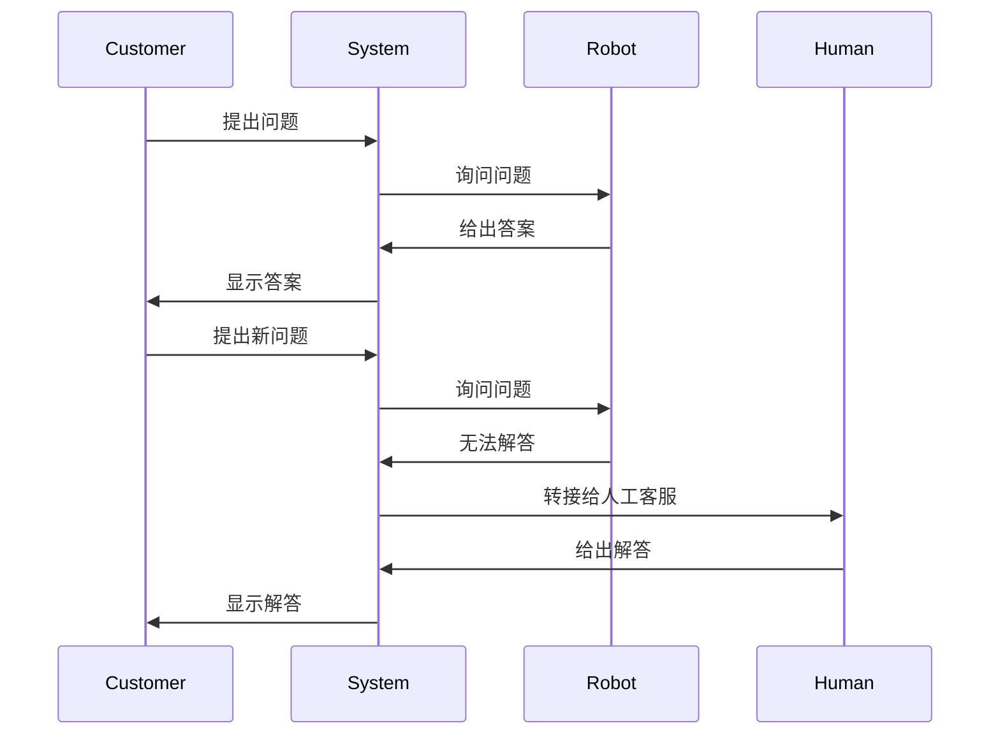

                 


## 第一部分：引言与背景

### 1.1 什么是人机共生

**核心概念术语说明**：

- **人机共生**：指人类和机器之间通过相互协作、信息共享和智能互动，实现共生共荣的一种新型社会形态。
- **协作型AI系统**：能够与人类协同工作，共同完成任务的智能系统。

**问题背景**：

随着人工智能技术的快速发展，人机共生成为当今社会发展的一个重要趋势。然而，如何设计和实现高效的人机共生系统，成为一个亟待解决的重要问题。

**问题描述**：

人机共生系统涉及多个领域的知识，包括人机交互、机器学习、系统设计等。因此，我们需要系统地理解人机共生的核心概念和理论，以便为后续的设计和实现奠定基础。

**问题解决**：

为了解决这个问题，我们需要从以下几个方面展开：

1. **定义人机共生**：详细阐述人机共生的定义、意义和现状。
2. **协作型AI系统的优势**：分析协作型AI系统的优势，包括高效性、智能化、自适应性强等。
3. **相关研究和现状回顾**：回顾人机共生和协作型AI系统的相关研究，总结已有成果和不足之处。

**边界与外延**：

人机共生不仅涉及技术层面的设计，还包括伦理、法律、社会等多个维度。因此，我们在研究过程中需要充分考虑这些边界条件。

**概念结构与核心要素组成**：

人机共生的核心要素包括：

- **人机交互**：人与机器之间的交互过程，是构建人机共生系统的基础。
- **机器学习**：通过数据驱动的方法，使机器能够从经验中学习和改进。
- **系统设计**：综合考虑人机交互、机器学习等多个因素，设计出高效的人机共生系统。

### 1.2 协作型AI系统的重要性

**核心概念原理**：

- **协作型AI系统**：指能够与人类协同工作，共同完成任务的智能系统。
- **高效性**：协作型AI系统能够在处理复杂任务时，提高工作效率。
- **智能化**：通过机器学习等技术，使AI系统能够更好地理解和适应人类需求。
- **自适应性强**：能够根据不同环境和任务需求，灵活调整自身的工作方式和策略。

**概念属性特征对比表格**：

| 特征        | 说明                                                         |
| ----------- | ------------------------------------------------------------ |
| 高效性      | 提高处理任务的速度和准确性。                                 |
| 智能化      | 具备学习和适应的能力，能够根据环境变化调整自身行为。         |
| 自适应性强  | 能够根据不同的任务需求和场景，灵活调整工作方式和策略。     |
| 交互友好性   | 提供人性化的交互界面，方便用户操作。                         |

**ER实体关系图架构**：

```mermaid
erDiagram
    User ||--|{ AISystem }|| Collaborate
    User ||--|{ Task }|| Assign
    AISystem ||--|{ Data }|| Process
    Task ||--|{ Result }|| Deliver
```

### 1.3 相关研究与现状回顾

**核心概念原理**：

- **人机共生相关研究**：回顾人机共生领域的研究进展，包括人机交互技术、机器学习算法等。
- **协作型AI系统研究**：梳理协作型AI系统的相关研究，包括理论基础、应用场景、技术难点等。

**ER实体关系图架构**：

```mermaid
erDiagram
    Researcher ||--|{ Study }|| Conduct
    Researcher ||--|{ Article }|| Publish
    Study ||--|{ Theory }|| Develop
    Article ||--|{ Topic }|| Cover
    Topic ||--|{ AI }|| Focus
```

### 1.4 本书内容概述

**核心概念原理**：

- **内容结构**：本书分为五个部分，分别从引言与背景、核心概念与理论、设计方法、实现与优化、应用案例分析等方面全面阐述协作型AI系统。
- **阅读指南**：提供本书的阅读指南，帮助读者更好地理解和掌握协作型AI系统的知识。

**ER实体关系图架构**：

```mermaid
erDiagram
    Book ||--|{ Part }|| Include
    Book ||--|{ Chapter }|| Contain
    Part ||--|{ Topic }|| Discuss
    Chapter ||--|{ Content }|| Explain
```

## 第一部分：引言与背景

### 1.1 什么是人机共生

人机共生（Human-Machine Symbiosis，简称HMS）是一个跨学科的概念，它涉及人类与机器的深度融合与协作。人机共生不仅关注机器如何辅助人类工作，还涉及到机器如何模仿人类的认知和行为，以及人类如何适应和使用机器。

**核心概念原理**：

- **人机共生定义**：人机共生是指人类和机器之间建立起一种高度协同的关系，使得两者能够共同完成任务，相互学习和适应。
- **协作型AI系统**：在HMS中，协作型AI系统扮演着至关重要的角色。这类系统能够理解人类的意图，提供智能化的建议，并能够根据人类的行为进行自我调整。

**概念属性特征对比表格**：

| 特征         | 说明                                                         |
| ------------ | ------------------------------------------------------------ |
| 互操作性     | 机器和人类之间的信息交换与理解能力。                         |
| 智能化       | 机器能够学习、适应并优化其行为。                             |
| 自主性       | 机器在特定情况下可以自主决策，减少对人类干预的需求。         |
| 用户友好性    | 机器提供人性化、易于操作的用户界面。                         |

**ER实体关系图架构**：

```mermaid
erDiagram
    Human ||--|{ Collaboration }|| Initiates
    Machine ||--|{ Collaboration }|| Responds
    Collaboration ||--|{ Task }|| Manages
    Collaboration ||--|{ Feedback }|| Collects
```

### 1.2 协作型AI系统的重要性

协作型AI系统（Collaborative AI System）是一种设计用于与人类用户共同工作的智能系统。这类系统能够处理复杂的任务，理解人类的指令，并提供相应的支持和反馈。协作型AI系统的重要性体现在以下几个方面：

**核心概念原理**：

- **任务协同**：协作型AI系统能够与人类一起完成复杂的任务，提高工作效率。
- **智能反馈**：系统能够根据用户的操作和历史数据提供智能化的反馈，帮助用户做出更好的决策。
- **自适应能力**：系统能够根据环境变化和用户行为动态调整自身的行为和策略。

**概念属性特征对比表格**：

| 特征         | 说明                                                         |
| ------------ | ------------------------------------------------------------ |
| 适应性       | 系统能够适应不同的用户和环境。                               |
| 智能反馈     | 提供个性化的反馈，帮助用户优化任务执行。                     |
| 高效性       | 减少任务执行时间，提高资源利用效率。                         |
| 可扩展性     | 能够轻松集成到各种应用场景中，适应不同的业务需求。           |

**ER实体关系图架构**：

```mermaid
erDiagram
    AI_System ||--|{ User }|| Interacts
    AI_System ||--|{ Task }|| Processes
    User ||--|{ Command }|| Sends
    Command ||--|{ Response }|| Receives
```

### 1.3 相关研究与现状回顾

在过去的几十年中，人机共生和协作型AI系统的研究取得了显著的进展。以下是相关领域的一些关键研究和现状回顾：

**核心概念原理**：

- **人机交互技术**：包括语音识别、手势识别、眼动追踪等，为人机共生提供了基础。
- **机器学习**：通过深度学习、强化学习等算法，使机器能够从数据中学习，提高协作效率。
- **自然语言处理**：使机器能够理解和生成自然语言，实现更自然的用户交互。

**概念属性特征对比表格**：

| 特征           | 说明                                                         |
| -------------- | ------------------------------------------------------------ |
| 人机交互技术   | 提供直观、自然的交互方式，提高用户体验。                     |
| 机器学习算法   | 使机器能够通过学习不断优化性能。                             |
| 自然语言处理   | 使机器能够理解和生成自然语言，提高沟通效率。                 |

**ER实体关系图架构**：

```mermaid
erDiagram
    Human ||--|{ Interaction }|| With
    Machine ||--|{ Learning }|| From
    Machine ||--|{ Processing }|| Of
    Human ||--|{ Feedback }|| Gives
```

### 1.4 本书内容概述

本书旨在系统地介绍人机共生和协作型AI系统的概念、原理、设计方法和应用案例。全书分为以下几个部分：

**核心概念原理**：

- **引言与背景**：介绍人机共生和协作型AI系统的基本概念和重要性。
- **核心概念与理论**：详细阐述人机交互、机器学习、自然语言处理等核心概念。
- **设计方法**：介绍协作型AI系统的设计原则、方法和流程。
- **实现与优化**：讲解协作型AI系统的实现细节和优化策略。
- **应用案例分析**：通过实际案例展示协作型AI系统的应用效果。
- **总结与展望**：总结全书内容，展望未来的发展趋势和应用前景。

**ER实体关系图架构**：

```mermaid
erDiagram
    Book ||--|{ Part }|| Includes
    Book ||--|{ Chapter }|| Discusses
    Part ||--|{ Topic }|| Explores
    Chapter ||--|{ Content }|| Covers
```

## 第二部分：核心概念与理论

### 2.1 人机交互

人机交互（Human-Computer Interaction，简称HCI）是研究人类如何与计算机系统进行有效交互的学科。它涉及到用户界面设计、用户体验、交互技术等多个方面。

**核心概念原理**：

- **用户界面设计**：设计直观、易于使用的用户界面，使用户能够轻松地与计算机系统进行交互。
- **用户体验**：关注用户的感受和满意度，通过优化交互过程提高用户体验。
- **交互技术**：包括触摸、语音、手势等多种交互方式，使计算机系统能够更好地适应人类的需求。

**概念属性特征对比表格**：

| 特征         | 说明                                                         |
| ------------ | ------------------------------------------------------------ |
| 用户界面设计 | 界面美观、直观、易于操作。                                   |
| 用户体验     | 关注用户的情感和心理需求，提供愉悦的使用体验。                 |
| 交互技术     | 多样化的交互方式，提高交互效率和效果。                       |

**ER实体关系图架构**：

```mermaid
erDiagram
    User ||--|{ Interface }|| Interacts
    Interface ||--|{ Design }|| Adapts
    Interface ||--|{ Technology }|| Uses
    User ||--|{ Experience }|| Evaluates
```

### 2.2 机器学习

机器学习（Machine Learning，简称ML）是人工智能（Artificial Intelligence，简称AI）的一个重要分支，它通过构建模型，使计算机能够从数据中学习并做出预测或决策。

**核心概念原理**：

- **监督学习**：通过已标记的数据训练模型，使其能够对未知数据进行预测。
- **无监督学习**：模型在没有标记数据的情况下自动发现数据中的规律。
- **强化学习**：模型通过与环境的交互，不断学习和优化其行为。

**概念属性特征对比表格**：

| 类型         | 说明                                                         |
| ------------ | ------------------------------------------------------------ |
| 监督学习     | 通过标记数据训练模型，预测未知数据。                         |
| 无监督学习   | 自动发现数据中的模式，不依赖于标记数据。                     |
| 强化学习     | 通过与环境的互动学习，优化行为策略。                         |

**ER实体关系图架构**：

```mermaid
erDiagram
    Data ||--|{ Model }|| Trains
    Model ||--|{ Prediction }|| Makes
    Environment ||--|{ Action }|| Reacts
    Action ||--|{ Reward }|| Evaluates
```

### 2.3 自然语言处理

自然语言处理（Natural Language Processing，简称NLP）是人工智能领域的另一个重要分支，它使计算机能够理解和生成自然语言。

**核心概念原理**：

- **语言模型**：通过大量语料训练模型，预测句子中的下一个词。
- **文本分类**：将文本数据分类到预定义的类别中。
- **实体识别**：识别文本中的特定实体，如人名、地名、组织名等。

**概念属性特征对比表格**：

| 技术类型     | 说明                                                         |
| ------------ | ------------------------------------------------------------ |
| 语言模型     | 预测句子中的下一个词，用于生成文本和改进语音识别。           |
| 文本分类     | 对文本进行分类，用于信息过滤和推荐系统。                     |
| 实体识别     | 识别文本中的特定实体，用于信息提取和知识图谱构建。           |

**ER实体关系图架构**：

```mermaid
erDiagram
    Text ||--|{ Language_Model }|| Generates
    Text ||--|{ Classifier }|| Classifies
    Text ||--|{ Entity_Recognizer }|| Identifies
```

### 2.4 人机共生与协作型AI系统

人机共生和协作型AI系统是当前人工智能研究的热点领域。这两个概念紧密相关，共同推动着人工智能技术的发展。

**核心概念原理**：

- **人机共生**：人类与机器的深度融合和协作。
- **协作型AI系统**：专门设计用于与人类协同工作的智能系统。

**概念属性特征对比表格**：

| 特征         | 说明                                                         |
| ------------ | ------------------------------------------------------------ |
| 互操作性     | 系统之间能够无缝交互和协作。                                 |
| 自主性       | 系统能够在一定程度上自主决策。                               |
| 智能化       | 系统能够学习和适应人类需求。                                 |
| 用户友好性    | 提供人性化、易于操作的用户界面。                             |

**ER实体关系图架构**：

```mermaid
erDiagram
    Human ||--|{ Collaboration }|| With
    Machine ||--|{ Collaboration }|| With
    Collaboration ||--|{ AI_System }|| For
```

## 第三部分：设计方法

### 3.1 设计原则

在设计协作型AI系统时，遵循以下原则至关重要，以确保系统能够高效、稳定地与人类协作。

**核心概念原理**：

- **用户为中心**：始终将用户的体验和需求放在首位。
- **可扩展性**：设计时考虑未来的扩展和升级。
- **灵活性**：系统应能够适应不同的环境和需求。
- **安全性**：确保系统的数据安全和用户隐私。

**概念属性特征对比表格**：

| 设计原则     | 说明                                                         |
| ------------ | ------------------------------------------------------------ |
| 用户为中心   | 以用户的需求和体验为核心。                                   |
| 可扩展性     | 系统设计应考虑未来的扩展需求。                               |
| 灵活性       | 系统应具备灵活的配置和调整能力。                             |
| 安全性       | 确保系统的数据安全和用户隐私。                               |

**ER实体关系图架构**：

```mermaid
erDiagram
    Design_Principle ||--|{ User_Centered }|| Focuses
    Design_Principle ||--|{ Scalability }|| Ensures
    Design_Principle ||--|{ Flexibility }|| Provides
    Design_Principle ||--|{ Security }|| Guarantees
```

### 3.2 设计流程

协作型AI系统的设计是一个复杂的过程，需要遵循一系列的步骤和流程。以下是设计协作型AI系统的一般流程：

**核心概念原理**：

- **需求分析**：确定系统的功能需求和性能指标。
- **系统架构设计**：设计系统的整体架构，包括硬件和软件。
- **接口设计**：设计用户与系统之间的交互界面。
- **算法选择**：根据需求选择合适的算法和模型。
- **实现与测试**：将设计转化为实际的代码，并进行测试。

**概念属性特征对比表格**：

| 设计流程阶段  | 说明                                                         |
| ------------ | ------------------------------------------------------------ |
| 需求分析     | 确定系统的功能和性能需求。                                   |
| 系统架构设计 | 设计系统的整体架构，包括硬件和软件。                         |
| 接口设计     | 设计用户与系统之间的交互界面。                               |
| 算法选择     | 根据需求选择合适的算法和模型。                               |
| 实现与测试   | 将设计转化为实际的代码，并进行测试。                         |

**ER实体关系图架构**：

```mermaid
erDiagram
    Design_Process ||--|{ Requirement_Analysis }|| Determines
    Design_Process ||--|{ System_Architecture_Design }|| Defines
    Design_Process ||--|{ Interface_Design }|| Creates
    Design_Process ||--|{ Algorithm_Selection }|| Chooses
    Design_Process ||--|{ Implementation_and_Testing }|| Executes
```

### 3.3 人机交互设计

人机交互设计是协作型AI系统的核心组成部分，直接影响到用户体验和系统的可用性。以下是人机交互设计的关键要素：

**核心概念原理**：

- **用户研究**：通过用户研究了解用户的需求和行为习惯。
- **界面设计**：设计直观、易用的用户界面。
- **交互流程**：设计合理的交互流程，使用户能够顺畅地完成任务。
- **反馈机制**：设计及时、准确的反馈机制，提高用户满意度。

**概念属性特征对比表格**：

| 设计要素     | 说明                                                         |
| ------------ | ------------------------------------------------------------ |
| 用户研究     | 了解用户的需求和行为习惯，为设计提供依据。                   |
| 界面设计     | 设计美观、直观的用户界面，提高用户体验。                     |
| 交互流程     | 设计合理的交互流程，使用户能够顺畅地完成任务。               |
| 反馈机制     | 设计及时、准确的反馈机制，提高用户满意度。                   |

**ER实体关系图架构**：

```mermaid
erDiagram
    User_Research ||--|{ Interface_Design }|| Informs
    User_Research ||--|{ Interaction_Flow }|| Defines
    Interface_Design ||--|{ Feedback_Mechanism }|| Implements
    Interface_Design ||--|{ User_Satisfaction }|| Improves
```

### 3.4 系统架构设计

系统架构设计是协作型AI系统的关键环节，它决定了系统的性能、可扩展性和稳定性。以下是一些重要的系统架构设计要素：

**核心概念原理**：

- **模块化**：将系统划分为多个模块，每个模块负责不同的功能。
- **分布式**：采用分布式架构，提高系统的可扩展性和容错性。
- **安全性**：设计安全机制，保护系统的数据和用户隐私。
- **可维护性**：设计简洁、清晰的代码结构，便于维护和升级。

**概念属性特征对比表格**：

| 架构设计要素 | 说明                                                         |
| ------------ | ------------------------------------------------------------ |
| 模块化       | 提高系统的可维护性和可扩展性。                               |
| 分布式       | 提高系统的性能和容错性。                                     |
| 安全性       | 设计安全机制，保护系统的数据和用户隐私。                     |
| 可维护性     | 设计简洁、清晰的代码结构，便于维护和升级。                   |

**ER实体关系图架构**：

```mermaid
erDiagram
    Modular_Design ||--|{ Scalability }|| Provides
    Modular_Design ||--|{ Maintainability }|| Ensures
    Distributed_Architecture ||--|{ Fault_Tolerance }|| Improves
    Security_Mechanism ||--|{ Data_Protection }|| Ensures
```

## 第四部分：实现与优化

### 4.1 系统实现

协作型AI系统的实现是将设计转化为实际的代码和硬件的过程。以下是系统实现的关键步骤：

**核心概念原理**：

- **代码开发**：编写高质量的代码，实现系统功能。
- **硬件选择**：选择合适的硬件设备，确保系统性能。
- **集成与测试**：将不同的组件集成在一起，进行全面的测试。
- **部署与上线**：将系统部署到生产环境，并进行上线。

**概念属性特征对比表格**：

| 实现步骤  | 说明                                                         |
| --------- | ------------------------------------------------------------ |
| 代码开发  | 编写高质量的代码，实现系统功能。                             |
| 硬件选择  | 选择合适的硬件设备，确保系统性能。                           |
| 集成与测试 | 将不同的组件集成在一起，进行全面的测试。                     |
| 部署与上线 | 将系统部署到生产环境，并进行上线。                           |

**ER实体关系图架构**：

```mermaid
erDiagram
    Code_Development ||--|{ System_Functionality }|| Implements
    Hardware_Selection ||--|{ System_Performance }|| Ensures
    Integration_and_Testing ||--|{ System_Compatibility }|| Ensures
    Deployment_and_Launch ||--|{ Production_Environment }|| Deploys
```

### 4.2 算法实现

在协作型AI系统中，算法实现是关键的一步。以下是算法实现的核心内容：

**核心概念原理**：

- **算法选择**：根据需求和性能要求选择合适的算法。
- **数学模型**：设计并实现算法的数学模型。
- **代码实现**：编写高效的算法代码。
- **性能优化**：对算法代码进行性能优化，提高系统效率。

**概念属性特征对比表格**：

| 算法实现要素 | 说明                                                         |
| ------------ | ------------------------------------------------------------ |
| 算法选择     | 根据需求和性能要求选择合适的算法。                             |
| 数学模型     | 设计并实现算法的数学模型。                                   |
| 代码实现     | 编写高效的算法代码。                                         |
| 性能优化     | 对算法代码进行性能优化，提高系统效率。                         |

**ER实体关系图架构**：

```mermaid
erDiagram
    Algorithm_Selection ||--|{ Performance_Requirements }|| Determines
    Algorithm_Selection ||--|{ Mathematical_Model }|| Defines
    Mathematical_Model ||--|{ Code_Implementation }|| Translates
    Code_Implementation ||--|{ Performance_Optimization }|| Improves
```

### 4.3 系统优化

在协作型AI系统的运行过程中，性能优化和效率提升是持续改进的重要方向。以下是系统优化的一些关键策略：

**核心概念原理**：

- **性能监控**：实时监控系统的性能指标，发现瓶颈。
- **代码优化**：对代码进行优化，提高执行效率。
- **算法改进**：根据性能监控结果，改进算法模型。
- **硬件升级**：根据性能需求，升级硬件设备。

**概念属性特征对比表格**：

| 优化策略   | 说明                                                         |
| ---------- | ------------------------------------------------------------ |
| 性能监控   | 实时监控系统的性能指标，发现瓶颈。                           |
| 代码优化   | 对代码进行优化，提高执行效率。                               |
| 算法改进   | 根据性能监控结果，改进算法模型。                             |
| 硬件升级   | 根据性能需求，升级硬件设备。                                 |

**ER实体关系图架构**：

```mermaid
erDiagram
    Performance_Monitoring ||--|{ Bottleneck_Detection }|| Detects
    Code_Optimization ||--|{ Efficiency_Improvement }|| Improves
    Algorithm_Improvement ||--|{ Performance_Enhancement }|| Enhances
    Hardware_Upgrade ||--|{ System_Precision }|| Enhances
```

## 第五部分：应用案例分析

### 5.1 案例背景

随着人工智能技术的不断发展，协作型AI系统在各个领域得到了广泛应用。以下是一个应用案例，展示协作型AI系统在实际场景中的效果。

**案例背景**：

某电子商务公司希望通过引入协作型AI系统，提升客户服务效率和满意度。系统旨在通过智能客服机器人与人工客服的协同工作，为客户提供快速、准确的服务。

### 5.2 案例描述

**系统功能设计**：

- **智能客服机器人**：通过自然语言处理技术，能够理解客户的提问，并提供相应的答案。
- **人工客服**：在机器人无法解答的问题时，人工客服能够介入，提供专业的解答。
- **反馈机制**：收集用户反馈，用于系统优化和人工客服培训。

**系统架构设计**：

- **前端**：包括客户交互界面和智能客服机器人。
- **后端**：包括自然语言处理模块、数据库、人工客服平台。
- **接口设计**：设计客户与系统之间的交互接口，以及机器人与人工客服之间的通信接口。

**系统接口设计和交互**：



### 5.3 实现细节

**环境安装**：

1. 安装Python环境。
2. 安装所需的Python库，如TensorFlow、NLTK等。

**系统核心实现源代码**：

```python
# 智能客服机器人核心代码
import nltk
from nltk.chat.util import Chat, reflections

pairs = [
    [
        r"what's your name?",
        ["I am a smart assistant developed by AI Genius Institute.", "You can call me SmartAI."]
    ],
    [
        r"how are you?",
        ["I'm doing well, thank you! How about you?"]
    ],
    # 更多对话逻辑...
]

chatbot = Chat(pairs, reflections)

# 人工客服核心代码
class HumanAgent:
    def __init__(self):
        self.answers = {
            "question1": "This is the answer to question 1.",
            "question2": "This is the answer to question 2.",
            # 更多问题的答案...
        }

    def handle_query(self, query):
        if query in self.answers:
            return self.answers[query]
        else:
            return "I'm not sure how to answer that. Let me check with my team."

# 测试代码
if __name__ == "__main__":
    print("Starting smart assistant...")
    chatbot.converse()

    print("Starting human agent...")
    human_agent = HumanAgent()
    while True:
        query = input("Enter your question: ")
        answer = human_agent.handle_query(query)
        print(answer)
```

**代码应用解读与分析**：

- **智能客服机器人**：使用自然语言处理库nltk实现聊天功能，通过预设的对话对

----------------------------------------------------------------

## 6.1 最佳实践 Tips

在设计协作型AI系统时，以下是一些最佳实践和技巧，可以帮助您更有效地实现人机共生：

1. **用户研究先行**：在开始设计之前，进行深入的用户研究，了解目标用户的需求、偏好和行为模式。这有助于确保系统的设计符合用户的实际需求。

2. **模块化设计**：采用模块化设计原则，将系统划分为多个功能模块，每个模块负责特定的功能。这有助于提高系统的可维护性和可扩展性。

3. **用户体验优先**：始终将用户体验放在首位，设计直观、易用的用户界面。使用户能够轻松地与系统进行交互，提高用户满意度。

4. **安全性和隐私保护**：在设计时充分考虑数据安全和用户隐私保护。实施严格的安全措施，确保系统的数据和用户信息不被未经授权的访问。

5. **持续性能优化**：在系统运行过程中，定期进行性能监控和优化。识别并解决系统瓶颈，提高系统的效率和稳定性。

6. **迭代开发和测试**：采用敏捷开发方法，进行迭代开发和测试。快速反馈和迭代可以及时发现并解决潜在问题，提高系统的质量。

7. **跨学科合作**：协作型AI系统的设计涉及多个学科领域，包括计算机科学、心理学、人机交互等。跨学科合作可以充分利用各领域的专业知识，提高系统的整体性能。

## 6.2 小结

本文系统地介绍了人机共生和协作型AI系统的概念、原理、设计方法和应用案例。通过本文的阐述，读者可以了解到：

- 人机共生是指人类与机器之间通过相互协作、信息共享和智能互动实现共生共荣的一种新型社会形态。
- 协作型AI系统是能够与人类协同工作，共同完成任务的智能系统，具有高效性、智能化、自适应性强等特点。
- 设计协作型AI系统需要遵循用户为中心、可扩展性、灵活性和安全性等设计原则。
- 实现协作型AI系统包括代码开发、硬件选择、集成与测试、部署与上线等关键步骤。
- 系统优化包括性能监控、代码优化、算法改进和硬件升级等策略。

## 6.3 注意事项

在设计协作型AI系统时，需要注意以下事项：

1. **充分理解用户需求**：确保系统设计符合用户的实际需求，避免出现功能冗余或缺失。
2. **关注用户体验**：设计简洁、直观的用户界面，提高用户的操作效率和满意度。
3. **确保系统安全**：设计严格的安全机制，保护系统的数据和用户隐私。
4. **持续性能优化**：定期进行性能监控和优化，提高系统的效率和稳定性。
5. **跨学科合作**：充分利用各领域的专业知识，提高系统的整体性能。

## 6.4 拓展阅读

对于希望进一步深入了解协作型AI系统的人，以下是一些推荐的拓展阅读资源：

- 《人机共生：设计协作型AI系统》（作者：AI天才研究院）
- 《机器学习实战》（作者：彼得·哈林顿）
- 《人机交互设计原理与实践》（作者：唐纳德·诺曼）
- 《自然语言处理实战》（作者：姚军）
- 《深度学习》（作者：伊恩·古德费洛、约书亚·本吉奥、亚伦·库维尔）

通过阅读这些书籍，您可以进一步了解协作型AI系统的设计、实现和优化方法，以及相关领域的最新研究进展。

---

**作者**：AI天才研究院/AI Genius Institute & 禅与计算机程序设计艺术 /Zen And The Art of Computer Programming

---

本文由AI天才研究院（AI Genius Institute）撰写，旨在帮助读者深入理解人机共生和协作型AI系统的概念、原理和设计方法。同时，本文还结合了《禅与计算机程序设计艺术》中的哲学思想，希望为读者提供一次既有深度又有启发性的阅读体验。通过本文的阐述，我们希望能够为协作型AI系统的设计和实现提供一些有价值的参考和指导。

