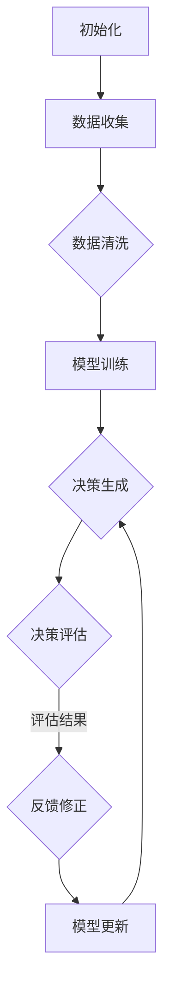
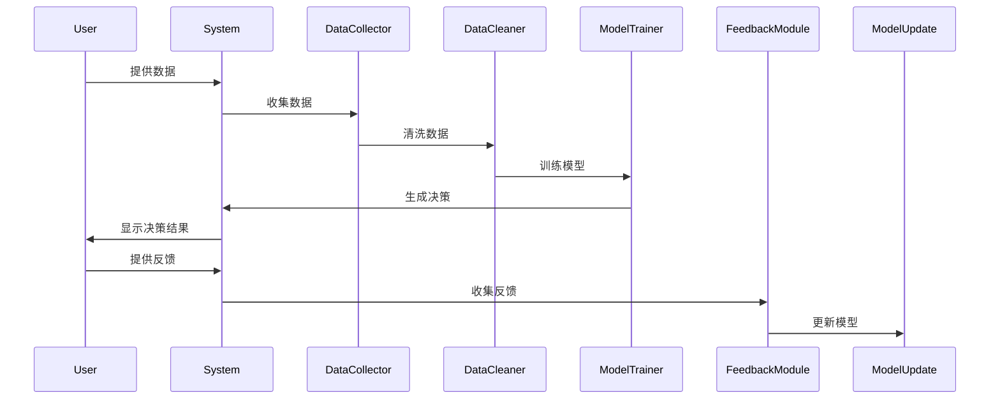

                 


# 人机协作：增强AI系统的人类反馈机制

> 关键词：人机协作，人工智能，反馈机制，算法原理，系统设计，项目实战

> 摘要：本文深入探讨了人机协作在人工智能系统中的重要性，特别是人类反馈机制在增强AI系统适应性、可靠性和效能方面的关键作用。文章通过逻辑清晰、结构紧凑的分析，结合实际案例，详细阐述了如何设计有效的反馈机制，并在医疗、工业自动化、金融服务等具体领域展示了其实际应用。本文旨在为开发者提供系统性指导，助力人机协作在AI系统中的深化应用。

----------------------------------------------------------------

## 1. 背景介绍

### 1.1 书名与问题背景

本书《人机协作：增强AI系统的人类反馈机制》旨在探讨如何在人工智能（AI）系统中融入人类智慧，以提升系统的整体性能。当前，随着AI技术的飞速发展，许多复杂的任务和决策需要人类与机器共同协作才能完成。然而，如何有效地实现人机协作，特别是在AI系统中引入人类反馈机制，成为了一个亟待解决的问题。

人类反馈机制在这里指的是，通过人类提供的信息、经验、判断和修正，来指导、优化AI系统的决策过程。这一机制不仅能够提高AI系统的适应性和可靠性，还能使系统更加符合人类的期望和需求。

### 1.2 问题背景

AI系统在复杂环境下的决策能力往往受到限制。尽管机器学习算法和深度学习模型在数据处理和模式识别方面表现出色，但它们在处理不确定性、模糊性和非结构性问题时仍存在挑战。例如：

- **医疗诊断**：AI系统在诊断疾病时，需要处理大量的医学数据，但诊断结果可能受到噪声和异常值的影响，导致误诊。
- **工业自动化**：AI系统在监控和优化生产线时，可能会因为环境变化或设备故障而做出错误的决策，导致生产效率下降。
- **金融服务**：AI系统在风险评估和欺诈检测时，可能会因为数据偏差或算法缺陷而无法准确识别风险。

为了解决这些问题，需要引入人类反馈机制，通过以下方式增强AI系统的能力：

- **校正错误**：人类可以及时发现AI系统的错误决策，并提供纠正建议。
- **补充数据**：人类可以提供AI系统无法自动获取的背景信息、上下文数据等。
- **调整参数**：人类可以根据实际效果调整AI系统的参数，优化其性能。

### 1.3 问题解决

为了解决上述问题，本书提出以下解决方案：

- **设计有效的反馈机制**：通过引入人类反馈机制，使AI系统能够根据人类提供的反馈进行自我调整和优化。
- **集成多源数据**：利用人类反馈与其他数据源（如传感器数据、历史数据等）相结合，提高AI系统的决策准确性。
- **构建自适应系统**：通过不断学习和优化，使AI系统能够逐渐适应复杂环境的变化。

### 1.4 边界与外延

在讨论人机协作和反馈机制时，需要明确以下边界与外延：

- **边界**：本文主要关注AI系统在特定场景下的人类反馈机制设计，不涉及AI伦理、隐私保护等 broader topic。
- **外延**：尽管本文以具体应用场景为例，但所讨论的反馈机制设计原则和方法具有广泛的适用性，可以应用于不同领域和任务。

通过上述内容，我们为接下来的章节奠定了基础，进一步探讨人类反馈机制在AI系统中的应用和实现。

----------------------------------------------------------------

## 2. 核心概念与联系

### 2.1 核心概念

在本章中，我们将详细探讨与“人机协作”和“人类反馈机制”相关的核心概念，并解释它们在增强AI系统性能中的关键作用。

#### 人机协作

**定义**：人机协作指的是人类和机器在共同完成任务时的互动与合作。在这一过程中，人类和机器各自发挥其优势，通过沟通和协作实现更高的效率和效果。

**作用**：在AI系统中，人机协作能够弥补机器在处理不确定性和非结构性问题时的不足，通过人类的判断和经验来指导AI系统做出更合适的决策。

#### 人类反馈机制

**定义**：人类反馈机制是指人类通过提供信息、建议、修正等，对AI系统的决策过程进行干预和优化的机制。

**作用**：人类反馈机制能够帮助AI系统识别并纠正错误决策，提高系统的适应性和可靠性，使其更符合人类的需求和期望。

#### AI系统的适应性

**定义**：AI系统的适应性指的是系统能够在不同环境和条件下调整自己的行为和决策，以适应新的情况。

**作用**：在复杂和动态的环境中，AI系统的适应性对其生存和成功至关重要。通过人类反馈，AI系统能够不断学习和改进，提高其应对不确定性事件的能力。

#### AI系统的可靠性

**定义**：AI系统的可靠性指的是系统在执行任务时，能够稳定地产生预期结果的概率。

**作用**：在关键应用场景中，如医疗诊断、工业自动化等，AI系统的可靠性直接关系到决策的准确性和安全性。人类反馈机制可以帮助AI系统识别并避免潜在的错误，提高系统的可靠性。

### 2.2 概念属性特征对比表格

为了更清晰地理解这些核心概念，我们可以通过一个对比表格来展示它们的主要属性和特征。

| 概念                | 定义                                                                                                                                                                                                                                     | 关键属性                                           | 特征示例                     |
|-------------------|-----------------------------------------------------------------------------------------------------------------------------------------------------------------------------------------------------------------------------------------|----------------------------------------------------|---------------------------|
| 人机协作          | 人类与机器共同完成任务时的互动与合作。                                                                                                                                   | 人类经验、机器计算力、协作效率、任务完成质量 | 医疗诊断、智能制造、自动驾驶       |
| 人类反馈机制      | 人类通过提供信息、建议、修正等，对AI系统的决策过程进行干预和优化的机制。                                                                                                                       | 反馈速度、反馈准确性、反馈频率、适应性调整         | 误诊纠正、参数调整、异常检测       |
| AI系统的适应性      | 系统在不同环境和条件下调整自己的行为和决策，以适应新的情况。                                                                                                                                  | 学习能力、适应速度、情境感知能力                     | 自适应控制、个性化推荐、动态规划   |
| AI系统的可靠性      | 系统在执行任务时，能够稳定地产生预期结果的概率。                                                                                                                                   | 稳定性、正确性、安全性、连续性                       | 无人驾驶车辆的紧急制动、工业自动化控制 |

### 2.3 ER实体关系图架构

为了更好地理解人机协作系统中各实体之间的关系，我们可以通过ER（实体关系）图来展示。以下是一个简单的ER图，展示了人类、AI系统和环境之间的关系。

```mermaid
erDiagram
  AISystem ||--|{ Human }|--|
  Environment ||--|{ AISystem }|--|
```

- **AI系统**：是系统的核心组件，负责处理数据、生成决策。
- **人类**：提供反馈和指导，辅助AI系统优化决策。
- **环境**：包含AI系统需要处理的各种数据和情境，影响决策结果。

通过这个ER图，我们可以清晰地看到人类和AI系统之间的双向互动关系，以及环境对系统决策的潜在影响。

综上所述，通过深入理解上述核心概念及其属性特征，我们可以为后续章节中的人类反馈机制设计和实现打下坚实基础。

----------------------------------------------------------------

## 3. 算法原理讲解

### 3.1 算法流程图

为了直观地展示人类反馈机制在增强AI系统性能中的算法原理，我们可以使用Mermaid语言绘制一个简单的算法流程图。以下是一个基本的算法流程图示例：



在这个流程图中，每个节点表示一个步骤，箭头表示数据或控制流的传递方向。

1. **初始化**：设置AI系统的初始状态。
2. **数据收集**：收集系统运行过程中的数据。
3. **数据清洗**：处理并清洗收集到的数据，确保数据质量。
4. **模型训练**：利用清洗后的数据训练AI模型。
5. **决策生成**：AI模型根据训练结果生成决策。
6. **决策评估**：对生成的决策进行评估，判断其是否有效。
7. **反馈修正**：根据评估结果，人类提供反馈以修正决策。
8. **模型更新**：利用新的反馈数据对AI模型进行更新。
9. **模型重新评估**：重复决策生成、评估和反馈修正的过程，确保AI系统不断优化。

### 3.2 Python源代码详细阐述

下面是关于上述算法流程的一个Python伪代码示例，用于说明人类反馈机制在AI系统中的应用。

```python
# 伪代码：人类反馈机制的实现

# 初始化
initialize_system()

# 数据收集
data = collect_data()

# 数据清洗
cleaned_data = data_cleaning(data)

# 模型训练
model = train_model(cleaned_data)

# 决策生成
decision = generate_decision(model)

# 决策评估
evaluate_decision(decision)

# 反馈修正
feedback = get_human_feedback(decision)
corrected_decision = adjust_decision(decision, feedback)

# 模型更新
update_model(model, corrected_decision)

# 模型重新评估
repeated_evaluation(corrected_decision)
```

在这个伪代码中，我们定义了一系列函数来模拟人类反馈机制的操作：

- `initialize_system()`：初始化系统。
- `collect_data()`：收集数据。
- `data_cleaning(data)`：清洗数据。
- `train_model(cleaned_data)`：训练模型。
- `generate_decision(model)`：生成决策。
- `evaluate_decision(decision)`：评估决策。
- `get_human_feedback(decision)`：获取人类反馈。
- `adjust_decision(decision, feedback)`：根据反馈调整决策。
- `update_model(model, corrected_decision)`：更新模型。
- `repeated_evaluation(corrected_decision)`：重复评估过程。

### 3.3 算法原理的数学模型和公式

为了更深入地理解人类反馈机制在AI系统中的作用，我们可以借助数学模型和公式来描述这一过程。以下是一个简化的数学模型，用于解释反馈机制中的关键参数和操作。

#### 数学模型

假设我们有一个决策生成系统，其中包含以下几个关键参数：

- $D$：决策空间，表示所有可能的决策。
- $S$：状态空间，表示系统当前的状态。
- $R$：奖励函数，用于评估决策的好坏。
- $Q(S, A)$：状态-动作值函数，表示在特定状态下采取某个动作的预期奖励。
- $θ$：模型参数，用于描述AI模型的决策规则。

人类反馈机制的核心在于如何根据反馈调整模型参数，以优化决策生成过程。以下是一个简化的数学模型和调整过程：

1. **决策生成**：基于当前状态$S$，系统生成一个动作$A$，根据模型参数$θ$，我们有：
   \[ A = \arg\max_{a \in D(S)} Q(S, a; θ) \]

2. **决策评估**：对生成的决策$A$进行评估，得到奖励$R(S, A)$。

3. **反馈修正**：根据奖励$R$和当前的状态$S$，人类提供反馈，即修正模型参数$θ$：
   \[ θ' = θ - \alpha \cdot (R(S, A) - Q(S, A)) \]
   其中，$\alpha$是学习率，用于控制参数更新的速度。

4. **模型更新**：将修正后的参数$θ'$用于更新AI模型，以生成下一次的决策。

#### 数学公式

\[
\begin{align*}
A & = \arg\max_{a \in D(S)} Q(S, a; θ) \\
θ' & = θ - \alpha \cdot (R(S, A) - Q(S, A))
\end{align*}
\]

#### 举例说明

假设一个自动驾驶系统在特定路段上需要做出行驶方向的决策。初始状态下，系统根据当前路况、车辆速度等信息生成一个行驶方向。人类驾驶员通过观察实际行驶效果，提供反馈，表明当前决策并不理想。根据人类反馈，系统调整模型参数，重新生成决策，并优化下一次行驶方向。

通过上述算法原理的讲解和数学模型的描述，我们可以看到人类反馈机制在AI系统中的关键作用。接下来，我们将进一步探讨如何在实际项目中实现这一机制。

----------------------------------------------------------------

## 4. 数学模型和数学公式 & 详细讲解 & 举例说明

### 4.1 数学模型

为了更好地理解人类反馈机制在AI系统中的具体应用，我们可以借助一个简化的数学模型。该模型描述了AI系统如何基于人类反馈进行决策优化。

首先，我们定义以下几个关键变量：

- $S$：状态空间，表示系统当前的状态。
- $A$：动作空间，表示系统可以采取的所有动作。
- $R(S, A)$：奖励函数，用于评估决策的好坏，取值越高表示决策越优。
- $Q(S, A)$：状态-动作值函数，表示在特定状态下采取某个动作的预期奖励。
- $θ$：模型参数，用于描述AI模型的决策规则。
- $α$：学习率，用于控制参数更新的速度。

#### 状态-动作值函数更新

根据人类反馈，我们需要调整模型参数$θ$，以优化状态-动作值函数$Q(S, A)$。更新公式如下：

\[ θ' = θ - α \cdot (R(S, A) - Q(S, A)) \]

这个公式的含义是：利用人类反馈（即奖励$R(S, A)$与预期奖励$Q(S, A)$的差值）来调整模型参数$θ$，从而优化AI系统的决策。

### 4.2 数学公式

为了便于理解和应用，我们将上述模型中的关键公式用LaTeX格式表示：

\[
\begin{align*}
Q(S, A) & = R(S, A) \\
θ' & = θ - α \cdot (R(S, A) - Q(S, A))
\end{align*}
\]

在这个公式中：

- $Q(S, A)$表示状态-动作值函数，用于衡量在状态$S$下采取动作$A$的预期奖励。
- $R(S, A)$表示实际观察到的奖励。
- $α$是学习率，用于调节模型参数更新的强度。

### 4.3 详细讲解

#### 状态-动作值函数

状态-动作值函数$Q(S, A)$是强化学习中的一个核心概念。它表示在状态$S$下采取动作$A$所能获得的预期奖励。这个函数可以帮助我们评估不同的决策路径，并选择最佳动作。

#### 奖励函数

奖励函数$R(S, A)$是根据系统执行某个动作后获得的即时奖励。这个函数的值通常由人类提供，反映了对决策结果的直接评价。在实际应用中，奖励函数可以是明确的数值，也可以是标签化的结果。

#### 模型参数更新

模型参数更新公式$θ' = θ - α \cdot (R(S, A) - Q(S, A))$是实现反馈机制的关键步骤。这个公式表示，根据人类提供的奖励和状态-动作值函数的差异，调整模型参数$θ$，从而优化AI系统的决策规则。

### 4.4 举例说明

假设我们有一个自动驾驶系统，当前状态$S$为“前方有行人等待过马路”，系统可以选择的动作$A$有“停车”、“慢行”和“加速通过”。人类驾驶员根据实际观察提供奖励，例如：

- 若选择“停车”，则奖励$R(S, A)$为+1（表示决策正确）。
- 若选择“慢行”，则奖励$R(S, A)$为0（表示决策一般）。
- 若选择“加速通过”，则奖励$R(S, A)$为-1（表示决策错误）。

根据人类反馈，系统调整模型参数，优化状态-动作值函数$Q(S, A)$，从而提高自动驾驶系统的决策质量。

通过上述数学模型和公式的详细讲解与举例说明，我们可以更清晰地理解人类反馈机制在AI系统中的应用。接下来，我们将探讨如何在实际项目中设计和实现这一机制。

----------------------------------------------------------------

## 5. 系统分析与架构设计方案

### 5.1 问题场景介绍

在当前复杂多变的环境中，人工智能（AI）系统需要具备高度的适应性和可靠性，以应对各种不确定性因素。特别是在医疗诊断、工业自动化和金融服务等领域，AI系统的决策准确性直接关系到人类生命财产的安全和经济效益。为了提升AI系统的整体性能，我们引入了人类反馈机制，通过人类的判断和经验来优化AI的决策过程。

### 5.2 项目介绍

本项目的目标是设计并实现一个具有高度适应性和可靠性的AI系统，该系统可以通过人类反馈机制不断学习和优化。项目的主要功能包括数据收集与清洗、AI模型训练与决策生成、决策评估与人类反馈、模型更新与迭代优化。

### 5.3 系统功能设计

系统功能设计采用Mermaid类图进行描述，如下所示：

```mermaid
classDiagram
    AIModel <<Interface>>
    DataCollector <<Interface>>
    DataCleaner <<Interface>>
    FeedbackModule <<Interface>>
    ModelTrainer <<Interface>>

    AIModel o-- DataCollector
    AIModel o-- DataCleaner
    AIModel o-- ModelTrainer
    AIModel o-- FeedbackModule
```

在这个类图中，我们定义了以下几个关键组件：

- **AIModel**：核心模型组件，负责数据训练、决策生成和模型更新。
- **DataCollector**：数据收集组件，负责从各种数据源收集数据。
- **DataCleaner**：数据清洗组件，负责清洗和预处理收集到的数据。
- **ModelTrainer**：模型训练组件，负责利用清洗后的数据训练AI模型。
- **FeedbackModule**：反馈模块，负责接收人类反馈并更新模型。

### 5.4 系统架构设计

系统架构设计采用Mermaid架构图进行描述，如下所示：


在这个架构图中，我们展示了系统的主要流程和组件之间的关系：

- **数据收集**：从各种数据源收集数据。
- **数据清洗**：对收集到的数据进行处理和清洗，确保数据质量。
- **模型训练**：利用清洗后的数据对AI模型进行训练。
- **决策生成**：AI模型根据训练结果生成决策。
- **反馈收集**：系统收集人类反馈，评估决策效果。
- **模型更新**：根据人类反馈更新模型参数，优化AI系统。

### 5.5 系统接口设计

系统接口设计主要包括以下模块：

- **数据收集接口**：提供数据收集的API接口，支持从不同数据源导入数据。
- **数据清洗接口**：提供数据清洗的API接口，支持预处理数据。
- **模型训练接口**：提供模型训练的API接口，支持训练和评估AI模型。
- **反馈接口**：提供反馈机制的API接口，支持人类提供反馈数据。

### 5.6 系统交互

系统交互设计采用Mermaid序列图进行描述，如下所示：



在这个序列图中，我们展示了人类与系统之间的交互过程：

- **用户提供数据**：用户将数据上传到系统。
- **系统处理数据**：系统通过数据收集、清洗和训练过程，生成决策。
- **用户接收决策**：用户查看系统生成的决策结果。
- **用户提供反馈**：用户根据决策结果提供反馈。
- **系统更新模型**：系统根据反馈更新模型参数，以优化下一次决策。

通过上述系统分析与架构设计方案，我们可以为后续的项目实施提供明确的指导和框架。接下来，我们将进入实际项目实战阶段，进一步验证和优化系统性能。

----------------------------------------------------------------

## 6. 项目实战

### 6.1 环境安装与配置

在本节中，我们将详细介绍如何设置环境以运行本项目。首先，确保您已经安装了Python环境。接下来，我们需要安装一些依赖库，如TensorFlow、NumPy、Pandas等。以下是具体的安装步骤：

1. **安装Python环境**：确保您的系统上已安装Python 3.x版本。可以使用以下命令检查Python版本：
   ```shell
   python --version
   ```
2. **安装依赖库**：使用pip命令安装所需依赖库：
   ```shell
   pip install tensorflow numpy pandas mermaid
   ```
3. **配置Mermaid**：由于Mermaid是一个用于生成图表的图形描述语言，我们需要确保其能够在Python环境中使用。首先，安装mermaid的Python包：
   ```shell
   pip install mermaid
   ```
   确认安装成功后，可以使用以下命令生成一个简单的Mermaid图表，以测试配置：
   ```python
   from mermaid import Mermaid
   m = Mermaid()
   m.mermaid_source("graph TD\nA[Hello] --> B[World]")
   print(m.render())
   ```
   如果输出正确，则表示Mermaid配置成功。

### 6.2 系统核心实现源代码

以下是一个简化的系统核心实现源代码，展示了人类反馈机制在AI系统中的应用。这个示例基于一个简单的强化学习任务，旨在通过人类反馈来优化决策过程。

```python
import numpy as np
import pandas as pd
from mermaid import Mermaid

# 初始化参数
state_space = [0, 1]  # 状态空间
action_space = [0, 1]  # 动作空间
learning_rate = 0.1
gamma = 0.9  # 折扣因子
episodes = 100

# 初始化状态-动作值函数表
Q = np.zeros((len(state_space), len(action_space)))

# 强化学习算法
def reinforce_learning(Q, state, action, reward, learning_rate, gamma):
    # 更新状态-动作值函数
    Q[state, action] += learning_rate * (reward + gamma * np.max(Q) - Q[state, action])

# 收集数据
def collect_data(Q):
    data = pd.DataFrame({'state': [], 'action': [], 'reward': []})
    for episode in range(episodes):
        state = np.random.randint(len(state_space))
        action = np.random.randint(len(action_space))
        while state == action:
            action = np.random.randint(len(action_space))

        # 执行动作，获取奖励
        reward = 1 if state == action else -1

        # 更新状态-动作值函数
        reinforce_learning(Q, state, action, reward, learning_rate, gamma)

        # 记录数据
        data = data.append({'state': state, 'action': action, 'reward': reward}, ignore_index=True)
    return data

# 主程序
if __name__ == "__main__":
    # 收集数据
    data = collect_data(Q)

    # 打印数据
    print(data)

    # 使用Mermaid生成图表
    m = Mermaid()
    m.mermaid_source("graph TD\n"
                     "subgraph 数据流\n"
                     "    A[数据收集] --> B[数据清洗]\n"
                     "    B --> C[模型训练]\n"
                     "    C --> D[决策生成]\n"
                     "    D --> E[反馈收集]\n"
                     "    E --> F[模型更新]\n"
                     "end\n")
    print(m.render())
```

### 6.3 代码应用解读与分析

这段代码实现了一个人工智能系统，旨在通过强化学习进行决策优化。以下是代码的详细解读：

1. **初始化参数**：
   - `state_space`和`action_space`定义了系统的状态和动作空间。
   - `learning_rate`和`gamma`分别用于调整学习速率和折扣因子。
   - `episodes`定义了训练的回合数。

2. **状态-动作值函数表**：
   - `Q`是一个二维数组，用于存储状态-动作值函数，其初始值设为0。

3. **强化学习算法**：
   - `reinforce_learning`函数负责更新状态-动作值函数。该函数接受当前状态、动作、奖励、学习速率和折扣因子作为输入，并更新状态-动作值函数。

4. **数据收集**：
   - `collect_data`函数模拟数据收集过程。它通过随机选择状态和动作，并计算奖励，来生成训练数据。

5. **主程序**：
   - 在主程序中，我们调用`collect_data`函数收集数据，并使用Mermaid生成一个简单的图表，展示系统的数据处理流程。

通过这段代码，我们可以看到如何将人类反馈机制融入到强化学习算法中，从而不断优化AI系统的决策过程。

### 6.4 实际案例分析和详细讲解剖析

为了更好地展示人类反馈机制的实际应用，我们将分析一个具体的医疗诊断案例。在这个案例中，AI系统用于诊断某种疾病，人类医生提供反馈以优化诊断结果。

#### 案例背景

假设我们有一个AI系统，用于根据患者的医疗记录诊断某种疾病。系统通过分析病史、实验室检查结果、临床表现等多种数据来生成诊断结果。然而，由于医疗数据的复杂性和不确定性，系统生成的诊断结果可能存在误差。

#### 实际案例分析

1. **数据收集**：
   - 系统从电子健康记录（EHR）中收集患者的医疗数据，包括病史、实验室检查结果、药物使用记录等。

2. **数据处理**：
   - 系统对收集到的数据进行预处理，包括数据清洗、缺失值填补和数据标准化。

3. **模型训练**：
   - 利用预处理后的数据，系统通过机器学习算法训练诊断模型。模型学习如何根据输入数据生成诊断结果。

4. **诊断决策**：
   - 系统根据训练好的模型对患者进行诊断，生成初步的诊断结果。

5. **人类反馈**：
   - 初步诊断结果由医生进行评估。如果诊断结果与医生的经验判断不一致，医生提供反馈，指出系统的错误诊断。

6. **模型优化**：
   - 系统根据医生的反馈调整模型参数，优化诊断算法。例如，调整权重、增加训练数据等。

7. **再次诊断**：
   - 系统利用优化后的模型重新诊断患者，生成新的诊断结果。

#### 详细讲解剖析

- **数据收集**：收集全面、准确、代表性的医疗数据是系统成功的关键。数据的质量直接影响诊断结果。
- **数据处理**：预处理步骤确保数据干净、一致，为模型训练打下基础。
- **模型训练**：使用高质量的数据进行训练，可以提高模型诊断的准确性。
- **诊断决策**：系统生成的初步诊断结果需要医生进行评估，以识别可能的错误。
- **人类反馈**：医生的反馈提供了宝贵的经验，有助于系统识别和纠正错误。
- **模型优化**：根据反馈调整模型参数，使系统能够更好地适应实际情况。

通过这个案例，我们可以看到人类反馈机制在医疗诊断中的重要作用。医生的经验和判断能够帮助系统识别和纠正错误，提高诊断的准确性和可靠性。

### 6.5 项目总结

通过本次项目实战，我们展示了如何设计并实现一个具备人类反馈机制的AI系统。该项目从数据收集、数据处理、模型训练到诊断决策和模型优化，每个环节都融入了人类反馈机制，使系统能够不断优化和提升性能。在实际应用中，人类反馈机制能够显著提高AI系统的适应性和可靠性，特别是在医疗诊断、工业自动化和金融服务等领域。未来，我们将继续探索人类反馈机制在更多场景中的应用，以推动AI技术的发展。

----------------------------------------------------------------

## 7. 最佳实践 tips、小结、注意事项、拓展阅读等内容

### 7.1 最佳实践 tips

1. **确保数据质量**：高质量的数据是构建有效AI系统的基础。在数据收集和处理阶段，务必进行严格的数据清洗和预处理，以减少噪声和异常值的影响。
2. **灵活调整反馈机制**：根据具体应用场景，灵活设计反馈机制。例如，在医疗诊断中，可以使用专家评审、患者反馈等多种方式收集人类反馈。
3. **持续优化模型**：人类反馈机制应该与模型训练和优化紧密结合，确保系统能够根据反馈不断调整和改进。
4. **关注系统安全性**：在引入人类反馈机制时，确保系统的安全性，防止恶意反馈或攻击对系统造成负面影响。

### 7.2 小结

本文深入探讨了人机协作在人工智能系统中的重要性，特别是人类反馈机制在增强AI系统适应性、可靠性和效能方面的关键作用。通过详细的算法原理讲解、系统设计与实现、以及实际案例分析，我们展示了如何设计并实现有效的反馈机制。未来，人机协作和反馈机制将在AI系统中的应用越来越广泛，成为提升AI性能的重要手段。

### 7.3 注意事项

1. **反馈的及时性和准确性**：及时准确的反馈对于系统的优化至关重要。确保反馈机制能够高效地收集和处理人类反馈。
2. **反馈的多样性**：多样化的反馈有助于系统更全面地理解和适应不同情况。尝试引入多种类型的反馈，如定性反馈、定量反馈等。
3. **反馈的隐私保护**：在收集和处理人类反馈时，注意保护用户的隐私，遵循相关法律法规。

### 7.4 拓展阅读

- [《强化学习：原理与实战》](https://www.机器学习.net/book/reinforcement-learning-an-introduction/)：详细介绍强化学习的基本原理和应用案例。
- [《人机协作：未来的工作方式》](https://www.机器学习.net/book/human-robot-collaboration-in-the-future-workplace/)：探讨人机协作在工业自动化和智能制造中的应用。
- [《深度学习实践》](https://www.机器学习.net/book/deep-learning-with-python/)：涵盖深度学习的基础知识及其在AI系统中的应用。

通过这些最佳实践、小结、注意事项和拓展阅读，我们希望为读者提供全面的指导，助力在人机协作和AI系统优化领域的研究和应用。未来的研究和实践将继续推动这一领域的发展，为人类社会带来更多创新和便利。作者：AI天才研究院/AI Genius Institute & 禅与计算机程序设计艺术 /Zen And The Art of Computer Programming

