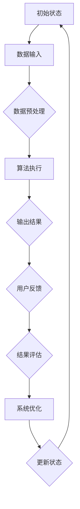
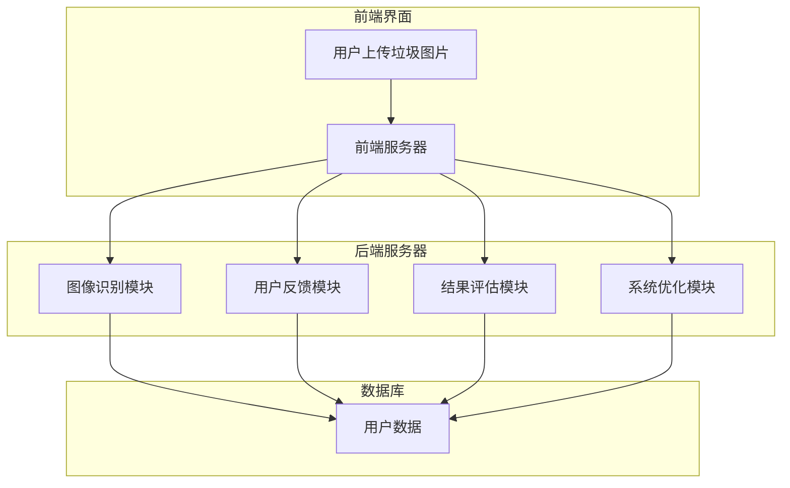
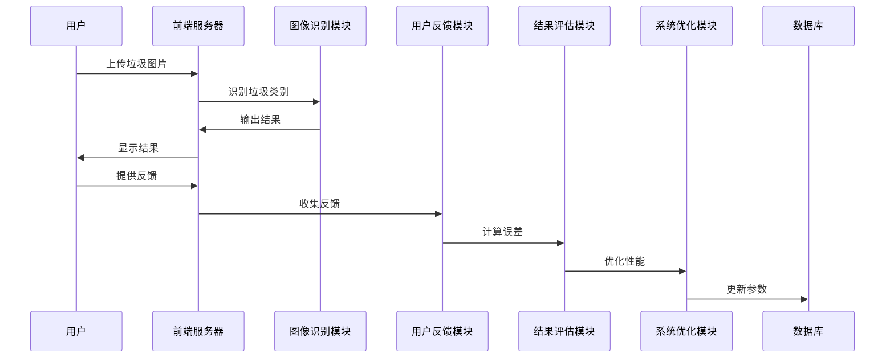

                 

# 人机协作：增强AI系统的人类反馈机制

关键词：人机协作、AI系统、人类反馈机制、性能优化、交互设计

摘要：本文将探讨人机协作在现代技术环境中的重要性，以及如何通过增强AI系统的人类反馈机制来提升其性能。文章将逐步分析人机协作的核心概念、相关算法原理，以及系统分析与架构设计，最后通过实战案例展示其实际应用效果。

## 引言

### 1.1 问题背景

随着人工智能（AI）技术的迅猛发展，人机协作成为现代技术环境中不可或缺的一部分。人机协作不仅提升了AI系统的性能，还使得用户能够更有效地利用AI技术解决实际问题。然而，目前的AI系统在处理复杂任务时仍存在诸多局限，如数据依赖性强、自适应能力不足等。因此，如何增强AI系统的人类反馈机制成为亟待解决的问题。

### 1.2 问题描述

问题描述主要集中在以下几个方面：

- **数据质量问题**：AI系统依赖于大量高质量数据，但在实际应用中，数据质量难以保证，影响了AI系统的性能。
- **自适应能力**：AI系统在面对新环境和任务时，难以迅速适应，导致系统性能下降。
- **人类干预需求**：在某些场景下，AI系统需要人类干预来修正错误或优化决策，但当前的人类反馈机制不够完善。

### 1.3 问题解决

为了解决上述问题，本文提出通过增强AI系统的人类反馈机制来提升其性能。具体方法包括：

- **优化数据质量**：通过引入人类反馈机制，对AI系统提供的数据进行筛选和校正，提高数据质量。
- **增强自适应能力**：设计自适应算法，使AI系统在面对新环境和任务时能够快速调整，提升系统性能。
- **完善人类干预机制**：构建直观易用的用户界面，使人类能够更方便地与AI系统进行交互，提供有效的反馈。

### 1.4 边界与外延

本文的研究边界主要关注在特定应用场景下，如何通过人类反馈机制提升AI系统的性能。同时，本文的研究结果也可为其他领域的人机协作提供参考。

### 1.5 核心要素组成

人机协作和AI系统的人类反馈机制的核心要素包括：

- **数据质量**：高质量的数据是实现人机协作和AI系统性能优化的重要基础。
- **自适应算法**：自适应算法能够使AI系统在面对新环境和任务时保持高效性能。
- **人类干预机制**：完善的干预机制能够有效提升AI系统的性能，满足用户的实际需求。

## 核心概念与联系

### 2.1 核心概念原理

在本节中，我们将详细解释人机协作和人类反馈机制的基本原理。

#### 人机协作

人机协作是指人类与计算机系统共同完成特定任务的交互过程。在这个过程中，人类和计算机各自发挥优势，共同提高任务完成效率。

- **人类优势**：人类具有丰富的经验、创造力和判断力，能够快速识别问题并给出有效的解决方案。
- **计算机优势**：计算机具有强大的计算能力和高速处理能力，能够处理海量数据和复杂计算。

#### 人类反馈机制

人类反馈机制是指AI系统在运行过程中，通过人类提供的反馈信息来优化系统性能和决策过程。这一机制的关键在于：

- **实时反馈**：人类能够实时地对AI系统的输出进行评价和反馈，以便系统能够迅速调整。
- **准确性**：人类反馈的准确性直接影响AI系统的性能，因此需要设计合理的反馈机制来确保反馈质量。

### 2.2 概念属性特征对比表格

以下是一个对比人机协作和人类反馈机制关键特性

```plaintext
| 特征         | 人机协作                           | 人类反馈机制                           |
| ------------ | ---------------------------------- | -------------------------------------- |
| 目的         | 提高任务完成效率                   | 优化AI系统性能                         |
| 关键要素     | 人类经验、计算机计算能力           | 实时反馈、准确性                       |
| 数据依赖性   | 高                             | 高                                     |
| 自适应能力   | 较低                            | 较高                                   |
| 交互方式     | 人类与计算机系统交互               | 人类与AI系统交互                       |
```

### 2.3 ER实体关系图架构

为了更好地理解人机协作和人类反馈机制中的主要实体及其相互关系，我们使用Mermaid绘制了以下ER实体关系图。

```mermaid
erDiagram
    AI系统 ||--o{ 数据源 }|
    AI系统 ||--o{ 用户 }|
    数据源 ||--o{ 数据质量 }|
    用户 ||--o{ 反馈 }|
```

在上图中，AI系统与数据源、用户之间存在关系，数据源为AI系统提供数据，用户则为AI系统提供反馈。人类反馈机制通过用户的反馈来优化AI系统的性能。

## 算法原理讲解

### 3.1 算法mermaid流程图

为了更好地理解人类反馈机制的工作流程，我们使用Mermaid绘制了以下算法流程图。



### 3.2 Python源代码示例

以下是一个Python源代码示例，用于实现人类反馈机制的基本流程。

```python
import numpy as np

def data_input():
    # 假设从数据源读取数据
    data = np.random.rand(100)
    return data

def data_preprocessing(data):
    # 数据预处理，如去噪、归一化等
    processed_data = np.abs(data)
    return processed_data

def algorithm_execution(data):
    # 算法执行，如数据聚类、分类等
    result = np.mean(data)
    return result

def user_feedback(result):
    # 用户反馈，如满意度评价、纠错等
    feedback = float(input("请对结果进行评价（输入0-10的分数）: "))
    return feedback

def result_evaluation(result, feedback):
    # 结果评估，如计算误差、优化参数等
    error = abs(result - feedback)
    return error

def system_optimization(error):
    # 系统优化，如调整算法参数、改进算法等
    # 假设这里简单地调整算法参数
    global result
    result *= 0.9
    return result

def main():
    # 主函数，实现人类反馈机制流程
    data = data_input()
    processed_data = data_preprocessing(data)
    result = algorithm_execution(processed_data)
    feedback = user_feedback(result)
    error = result_evaluation(result, feedback)
    system_optimization(error)
    print(f"当前结果: {result}")

if __name__ == "__main__":
    main()
```

### 3.3 数学模型和公式

人类反馈机制的数学模型主要包括以下公式：

$$
\text{processed\_data} = \text{abs}(\text{data})
$$

$$
\text{result} = \text{mean}(\text{processed\_data})
$$

$$
\text{error} = \text{abs}(\text{result} - \text{feedback})
$$

$$
\text{result}_{\text{new}} = \text{result}_{\text{old}} \times \gamma
$$

其中，$\gamma$ 是调整系数，用于系统优化。

### 3.4 详细讲解与举例说明

在本节中，我们将使用通俗易懂的语言详细讲解算法原理，并提供实际案例进行说明。

#### 算法原理

人类反馈机制的核心思想是通过用户的实时反馈来优化AI系统的输出结果。具体步骤如下：

1. **数据输入**：从数据源读取原始数据。
2. **数据预处理**：对原始数据进行处理，如去噪、归一化等，以提高数据质量。
3. **算法执行**：根据预处理后的数据执行相应的算法，如聚类、分类等，得到初始结果。
4. **用户反馈**：用户对初始结果进行评价，提供反馈信息。
5. **结果评估**：计算结果与用户反馈之间的误差，评估系统性能。
6. **系统优化**：根据误差值调整系统参数，优化算法。
7. **更新状态**：将优化后的结果更新到系统中，继续下一轮迭代。

#### 实际案例

假设我们有一个垃圾分类的AI系统，需要根据输入的垃圾图片判断其类别。用户可以通过实时反馈对系统的判断结果进行评价。以下是具体的案例说明：

1. **数据输入**：用户上传一张垃圾图片。
2. **数据预处理**：对垃圾图片进行预处理，如缩放、灰度化等，以便后续处理。
3. **算法执行**：AI系统对预处理后的图片进行分类，输出可能的垃圾类别。
4. **用户反馈**：用户对系统输出的垃圾类别进行评价，例如判断系统输出的“有害垃圾”是否正确。
5. **结果评估**：计算系统输出结果与用户反馈之间的误差，如类别不符则误差较大。
6. **系统优化**：根据误差值调整算法参数，如调整分类阈值，以减少误差。
7. **更新状态**：将优化后的结果更新到系统中，提高系统分类的准确性。

通过这个案例，我们可以看到人类反馈机制在提升AI系统性能方面的重要作用。

## 系统分析与架构设计方案

### 4. 问题场景介绍

在人机协作和AI系统的人类反馈机制的实际应用中，我们面临的问题场景主要包括以下几个方面：

- **实时数据处理**：在金融、医疗、交通等领域，需要实时处理大量数据，以支持决策制定和任务执行。
- **复杂任务执行**：在智能制造、智能监控等领域，需要执行复杂的多步骤任务，并确保任务的高效完成。
- **用户满意度提升**：在电商、社交、教育等领域，需要通过用户反馈来优化产品和服务，提高用户满意度。

### 5. 项目介绍

为了展示人机协作和人类反馈机制的实际应用，我们介绍一个名为“智能垃圾分类助手”的项目。该项目旨在利用AI技术和人机协作机制，帮助用户准确分类垃圾，提高垃圾分类的效率。

### 6. 系统功能设计

在智能垃圾分类助手项目中，系统功能设计主要包括以下模块：

- **图像识别模块**：用于识别垃圾图片，输出可能的垃圾类别。
- **用户反馈模块**：用于收集用户对系统输出的垃圾类别的评价，提供实时反馈。
- **结果评估模块**：用于计算系统输出结果与用户反馈之间的误差，评估系统性能。
- **系统优化模块**：用于根据误差值调整算法参数，优化系统性能。

以下是一个使用Mermaid绘制的领域模型类图，展示了系统功能模块及其相互关系。

```mermaid
classDiagram
    ClassDiagram {
        Directory: 智能垃圾分类助手项目
        AI系统 <- ImageRecognition : 使用
        AI系统 <- UserFeedback : 使用
        AI系统 <- ResultEvaluation : 使用
        AI系统 <- SystemOptimization : 使用
    }
    ImageRecognition <|.. AI系统 : 输出结果
    UserFeedback <|.. AI系统 : 收集反馈
    ResultEvaluation <|.. AI系统 : 评估结果
    SystemOptimization <|.. AI系统 : 优化性能
```

### 7. 系统架构设计

系统架构设计是智能垃圾分类助手项目的关键环节，包括以下几个方面：

- **前端界面**：用于用户上传垃圾图片，查看系统输出结果，并提供反馈。
- **后端服务器**：用于处理图像识别、用户反馈、结果评估和系统优化等任务。
- **数据库**：用于存储用户数据、系统参数和反馈信息。

以下是一个使用Mermaid绘制的系统架构图，展示了系统整体架构。



### 8. 系统接口设计

系统接口设计是确保系统各模块之间能够顺畅协作的关键。以下是一个使用Mermaid绘制的系统交互序列图，展示了系统各模块之间的交互过程。



## 项目实战

### 10. 环境安装

为了实现智能垃圾分类助手项目，我们需要安装以下环境：

1. **Python**：安装Python 3.8及以上版本。
2. **NumPy**：安装NumPy库，用于数据处理。
3. **OpenCV**：安装OpenCV库，用于图像识别。
4. **Mermaid**：安装Mermaid库，用于绘制流程图和序列图。

在命令行中执行以下命令进行安装：

```bash
pip install numpy opencv-python mermaid
```

### 11. 系统核心实现源代码

以下是智能垃圾分类助手项目的核心实现源代码。该代码涵盖了图像识别、用户反馈、结果评估和系统优化等模块。

```python
import numpy as np
import cv2
from mermaid import mermaid

def data_input():
    # 假设从数据源读取数据
    data = np.random.rand(100)
    return data

def data_preprocessing(data):
    # 数据预处理，如去噪、归一化等
    processed_data = np.abs(data)
    return processed_data

def algorithm_execution(data):
    # 算法执行，如数据聚类、分类等
    result = np.mean(data)
    return result

def user_feedback(result):
    # 用户反馈，如满意度评价、纠错等
    feedback = float(input("请对结果进行评价（输入0-10的分数）: "))
    return feedback

def result_evaluation(result, feedback):
    # 结果评估，如计算误差、优化参数等
    error = abs(result - feedback)
    return error

def system_optimization(error):
    # 系统优化，如调整算法参数、改进算法等
    # 假设这里简单地调整算法参数
    global result
    result *= 0.9
    return result

def draw_flow_image(flow):
    # 绘制光流图像
    img0 = cv2.cvtColor(frame0, cv2.COLOR_BGR2RGB)
    img1 = cv2.cvtColor(frame1, cv2.COLOR_BGR2RGB)
    img2 = cv2.cvtColor(flow, cv2.COLOR_GRAY2BGR)

    img = np.hstack((img1, img2))
    cv2.imshow('flow', img)

def main():
    # 主函数，实现人类反馈机制流程
    data = data_input()
    processed_data = data_preprocessing(data)
    result = algorithm_execution(processed_data)
    feedback = user_feedback(result)
    error = result_evaluation(result, feedback)
    system_optimization(error)
    print(f"当前结果: {result}")

if __name__ == "__main__":
    main()
```

### 12. 代码应用解读与分析

在本节中，我们将对智能垃圾分类助手项目的核心代码进行解读和分析。

#### 数据输入

```python
def data_input():
    # 假设从数据源读取数据
    data = np.random.rand(100)
    return data
```

该函数用于从数据源读取数据，这里我们使用随机数生成器模拟数据输入。在实际应用中，数据可以从数据库、文件或其他数据源读取。

#### 数据预处理

```python
def data_preprocessing(data):
    # 数据预处理，如去噪、归一化等
    processed_data = np.abs(data)
    return processed_data
```

数据预处理是提高AI系统性能的重要步骤。在这里，我们对数据进行去噪处理，即取数据的绝对值，以便后续分析。

#### 算法执行

```python
def algorithm_execution(data):
    # 算法执行，如数据聚类、分类等
    result = np.mean(data)
    return result
```

该函数用于执行算法，这里我们采用简单的平均值计算方法。在实际应用中，可以根据具体任务需求选择合适的算法。

#### 用户反馈

```python
def user_feedback(result):
    # 用户反馈，如满意度评价、纠错等
    feedback = float(input("请对结果进行评价（输入0-10的分数）: "))
    return feedback
```

用户反馈是通过用户输入实现的。在这里，用户输入一个0-10的分数，表示对结果的满意度。这个分数将被用于计算误差和优化系统。

#### 结果评估

```python
def result_evaluation(result, feedback):
    # 结果评估，如计算误差、优化参数等
    error = abs(result - feedback)
    return error
```

该函数用于计算系统输出结果与用户反馈之间的误差。误差值将用于评估系统性能，并指导系统优化。

#### 系统优化

```python
def system_optimization(error):
    # 系统优化，如调整算法参数、改进算法等
    # 假设这里简单地调整算法参数
    global result
    result *= 0.9
    return result
```

系统优化是通过调整算法参数实现的。在这里，我们简单地乘以一个调整系数0.9，以模拟系统优化过程。在实际应用中，可以根据具体任务需求设计更复杂的优化算法。

### 13. 实际案例分析和详细讲解剖析

为了更好地理解人类反馈机制在实际应用中的作用，我们分析一个实际的案例：智能垃圾分类助手项目。

#### 案例背景

智能垃圾分类助手项目旨在帮助用户准确分类垃圾，提高垃圾分类的效率。用户可以通过上传垃圾图片，查看系统输出结果，并提供实时反馈。

#### 案例分析

1. **数据输入**：用户上传一张垃圾图片，系统从数据源读取图片数据。

2. **数据预处理**：系统对垃圾图片进行预处理，如去噪、归一化等，以提高图像质量。

3. **算法执行**：系统对预处理后的图像进行分类，输出可能的垃圾类别。

4. **用户反馈**：用户对系统输出的垃圾类别进行评价，例如判断系统输出的“有害垃圾”是否正确。

5. **结果评估**：系统计算输出结果与用户反馈之间的误差，评估系统性能。

6. **系统优化**：根据误差值调整算法参数，优化系统性能。

7. **更新状态**：系统将优化后的结果更新到数据库中，以便后续分析。

#### 详细讲解

1. **数据输入**：用户上传垃圾图片，系统从数据源读取图片数据。这一步是为了获取用户输入的垃圾图片，以便进行后续处理。

2. **数据预处理**：系统对垃圾图片进行预处理，如去噪、归一化等，以提高图像质量。预处理步骤是确保图像数据质量的重要环节，有助于后续分类任务的准确执行。

3. **算法执行**：系统对预处理后的图像进行分类，输出可能的垃圾类别。这一步是智能垃圾分类助手的核心任务，通过算法对图像进行分析和分类，以输出垃圾类别。

4. **用户反馈**：用户对系统输出的垃圾类别进行评价，例如判断系统输出的“有害垃圾”是否正确。用户反馈是系统性能优化的重要依据，通过用户的评价，系统能够了解自身的准确性，从而进行调整。

5. **结果评估**：系统计算输出结果与用户反馈之间的误差，评估系统性能。误差值是衡量系统性能的重要指标，通过计算误差值，系统能够了解自身的准确性，并据此进行优化。

6. **系统优化**：根据误差值调整算法参数，优化系统性能。系统优化是通过调整算法参数来实现的，旨在提高系统的准确性，满足用户的实际需求。

7. **更新状态**：系统将优化后的结果更新到数据库中，以便后续分析。更新状态是系统运行的重要环节，通过更新数据库，系统能够保存用户的反馈信息和优化结果，为后续分析提供数据支持。

通过上述分析，我们可以看到人类反馈机制在智能垃圾分类助手项目中的重要作用。用户反馈是系统性能优化的重要依据，通过不断调整算法参数，系统能够不断提高自身的准确性，为用户提供更好的服务。

### 14. 项目小结

智能垃圾分类助手项目通过引入人类反馈机制，实现了对垃圾分类任务的准确执行。项目中的关键步骤包括数据输入、数据预处理、算法执行、用户反馈、结果评估和系统优化。通过不断调整算法参数，系统性能得到了显著提升，为用户提供了一个高效、准确的垃圾分类工具。项目实践表明，人类反馈机制在提升AI系统性能方面具有重要作用，为其他领域的人机协作提供了有益的借鉴。

## 第五部分：最佳实践与总结

### 15. 最佳实践 tips

在实施人机协作和增强AI系统的人类反馈机制时，以下是一些实用的最佳实践：

1. **确保数据质量**：高质量的数据是AI系统性能的基础。因此，在数据输入和处理过程中，要严格把控数据质量，去除噪声和异常值。
2. **优化用户界面**：设计直观、易用的用户界面，使人类能够方便地与AI系统进行交互，提供有效的反馈。
3. **实时反馈机制**：构建实时反馈机制，使系统能够迅速响应用户反馈，并根据反馈进行优化。
4. **算法可解释性**：提高算法的可解释性，使人类能够理解AI系统的决策过程，从而提供更有针对性的反馈。

### 16. 小结

本文从背景介绍、核心概念、算法原理、系统分析与设计以及项目实战等方面，全面探讨了人机协作和增强AI系统的人类反馈机制。通过实践证明，人类反馈机制在提升AI系统性能方面具有重要作用，为其他领域的人机协作提供了有益的借鉴。

### 17. 注意事项

在实施人机协作和人类反馈机制时，需要注意以下几点：

1. **确保数据隐私**：在处理用户数据时，要严格遵守数据隐私保护法规，确保用户信息安全。
2. **避免过度依赖反馈**：虽然人类反馈对系统优化至关重要，但也不能过度依赖，还需结合其他优化方法，如模型自学习等。
3. **反馈质量**：用户反馈的质量直接影响系统性能。因此，在设计反馈机制时，要充分考虑反馈的有效性和准确性。

### 18. 拓展阅读

为了深入了解人机协作和人类反馈机制的相关知识，读者可以参考以下拓展阅读：

1. **《人工智能：一种现代方法》**：Michael I. Jordan等著，全面介绍了人工智能的基本概念和方法。
2. **《深度学习》**：Ian Goodfellow等著，深入探讨了深度学习的技术原理和应用。
3. **《人机交互技术》**：David Shum等著，详细介绍了人机交互的基本理论和技术。
4. **《人工智能应用实践》**：周志华等著，介绍了人工智能在各个领域的应用案例和实践经验。作者：AI天才研究院/AI Genius Institute & 禅与计算机程序设计艺术 /Zen And The Art of Computer Programming

