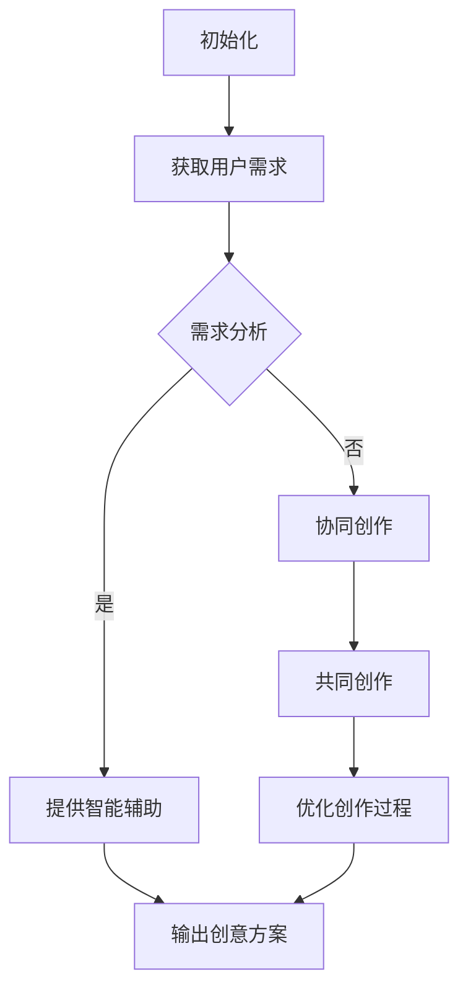
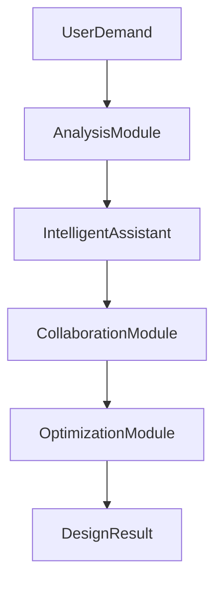
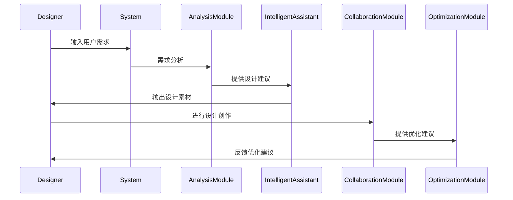
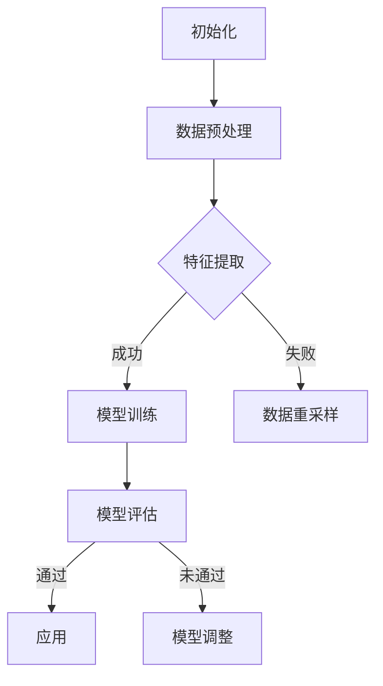
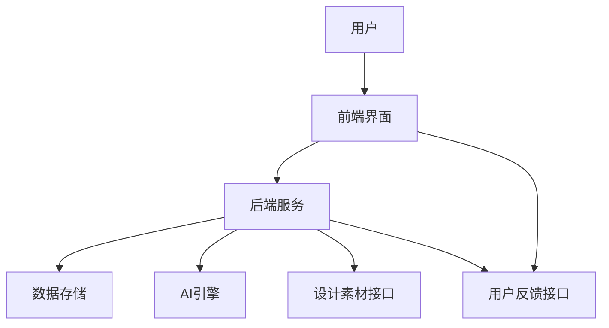

                 

# 人机协作增强型AI在创意产业中的应用

## 关键词

- 人机协作
- 增强型AI
- 创意产业
- 设计
- 艺术创作
- 广告创意

## 摘要

本文旨在探讨人机协作增强型AI在创意产业中的应用，包括设计、艺术和广告等领域。通过介绍人机协作增强型AI的基本原理和机制，分析其在创意产业中的优势和挑战，本文将展示如何利用AI技术提高创意产业的工作效率和质量。本文还将通过具体案例和最佳实践，为读者提供关于人机协作增强型AI在创意产业中应用的实际指导。

## 1. 背景介绍

### 1.1 问题背景

创意产业是指以创意为核心，通过创意的运用和创新的方式，产生文化、艺术、设计、广告等产品和服务的产业。近年来，随着人工智能技术的迅猛发展，人机协作增强型AI在各个领域得到了广泛应用。创意产业作为一个充满创新和想象力的领域，自然也受到了AI技术的青睐。

### 1.2 AI的发展现状

人工智能技术自20世纪50年代兴起以来，已经经历了多个发展阶段。从最初的符号主义、知识表示，到基于神经网络的机器学习，再到深度学习的崛起，人工智能技术不断取得突破。如今，随着计算能力的提升和数据资源的丰富，AI技术已经具备了处理大规模复杂数据的能力，为创意产业的应用提供了可能性。

### 1.3 人机协作增强型AI的兴起

人机协作增强型AI是一种能够与人进行有效互动和协作的人工智能系统。与传统的AI系统相比，人机协作增强型AI更加注重人与机器之间的互动，通过理解、学习和适应人的需求和意图，实现人机协同工作。在创意产业中，人机协作增强型AI可以辅助创意工作者，提高创作效率和质量。

### 1.4 人机协作增强型AI在创意产业中的应用

人机协作增强型AI在创意产业中的应用非常广泛，涵盖了设计、艺术、广告等多个领域。以下是一些典型的应用场景：

- **设计领域**：人机协作增强型AI可以帮助设计师进行灵感收集、创意生成、素材筛选等工作，提高设计效率。例如，通过分析用户反馈和市场需求，AI可以提供针对性的设计建议，帮助设计师快速找到合适的设计方案。

- **艺术创作领域**：人机协作增强型AI可以辅助艺术家进行音乐创作、绘画、雕塑等艺术创作。例如，AI可以根据艺术家的风格和喜好，生成符合其创作理念的作品，为艺术家提供灵感和创作方向。

- **广告创意领域**：人机协作增强型AI可以帮助广告创作者进行创意策划、内容生成和推广优化等工作。例如，AI可以通过分析用户行为和兴趣，生成个性化的广告内容，提高广告的点击率和转化率。

### 1.5 如何利用AI提高创意产业的工作效率和质量

人机协作增强型AI在创意产业中的应用，不仅可以提高工作效率，还可以提升创意作品的质量。以下是一些利用AI提高创意产业工作效率和质量的方法：

- **自动化重复性工作**：AI可以自动处理重复性、标准化的工作，如素材整理、图像处理等，从而释放创意工作者的时间和精力，让他们专注于更具创造性的任务。

- **智能辅助**：AI可以根据用户的反馈和需求，提供智能化的辅助，如灵感收集、创意生成等，帮助用户快速找到创作方向。

- **数据分析和优化**：AI可以通过对大量数据的分析，提供有针对性的建议和优化方案，如用户行为分析、市场趋势预测等，帮助创意工作者更好地理解用户需求和市场动态。

### 1.6 边界与外延

尽管人机协作增强型AI在创意产业中具有巨大的潜力，但其应用仍然存在一定的边界和限制。首先，AI的创作能力仍然有限，无法完全替代人类的创造力。其次，AI的创作结果往往依赖于大量的数据和算法，而数据质量和算法的优化程度会影响创作效果。此外，AI的应用还需要考虑到伦理、隐私等问题。

### 1.7 概念结构与核心要素组成

人机协作增强型AI的概念结构主要包括以下几个核心要素：

- **人工智能**：作为基础技术，提供智能化的计算和分析能力。

- **人类交互**：通过与人的互动，理解人类的需求和意图，实现人机协同。

- **协作机制**：设计合理的人机协作机制，确保人机之间的有效互动和配合。

- **领域知识**：在创意产业中，AI需要具备相关领域的知识，以便更好地辅助创作。

- **算法与模型**：通过机器学习和深度学习等技术，实现AI的智能决策和创作。

## 2. 核心概念与联系

### 2.1 核心概念原理

人机协作增强型AI的核心概念是基于人机交互和人工智能的结合。人机交互是指人与机器之间的信息交换和互动，而人工智能则是通过机器学习和深度学习等技术，使机器具备智能行为和决策能力。

在创意产业中，人机协作增强型AI通过以下方式实现人机协作：

1. **理解人类需求**：通过自然语言处理等技术，AI可以理解人类的需求和意图。

2. **提供智能辅助**：根据人类的需求，AI可以提供智能化的辅助，如灵感收集、创意生成等。

3. **协同创作**：AI可以与人类创作者共同进行创作，实现人机协同。

4. **优化创作过程**：通过数据分析和技术优化，AI可以提高创意产业的工作效率和质量。

### 2.2 概念属性特征对比表格

| 特征 | 传统AI | 人机协作增强型AI |
| ---- | ------ | --------------- |
| 目标 | 完成特定任务 | 提高人类工作效率和质量 |
| 方法 | 独立计算和分析 | 与人类互动和协作 |
| 优势 | 高效、精准 | 人性化、协同创新 |
| 劣势 | 缺乏创造性 | 需要大量数据支持 |

### 2.3 ER实体关系图架构

```mermaid
erDiagram
  AI |-> Designer : 辅助创作
  AI |-> Artist : 灵感提供
  AI |-> Advertiser : 创意优化
  Designer ||--| DesignerFeedback : 用户反馈
  Artist ||--| ArtStyle : 风格偏好
  Advertiser ||--| UserBehavior : 用户行为
```

## 3. 算法原理讲解

### 3.1 算法mermaid流程图



### 3.2 Python源代码

```python
import numpy as np

def intelligent辅助(user_demand):
    # 需求分析
    if analyze_demand(user_demand):
        # 提供智能辅助
        creative_scheme = generate_scheme(user_demand)
        return creative_scheme
    else:
        # 协同创作
        artist_style = get_artist_style()
        creative_scheme = collaborate_creativity(user_demand, artist_style)
        return creative_scheme

def analyze_demand(user_demand):
    # 实现需求分析逻辑
    pass

def generate_scheme(user_demand):
    # 实现创意方案生成逻辑
    pass

def get_artist_style():
    # 实现艺术家风格获取逻辑
    pass

def collaborate_creativity(user_demand, artist_style):
    # 实现协同创作逻辑
    pass
```

### 3.3 数学模型和公式

```latex
\begin{equation}
    \text{CreativeQuality} = f(\text{UserDemand}, \text{ArtistStyle}, \text{DataAnalysis})
\end{equation}
```

### 3.4 详细讲解和举例说明

假设一位设计师想要创作一款以“自然”为主题的作品，用户需求是“设计一款自然风格的插画”。通过人机协作增强型AI，设计师可以按照以下步骤进行创作：

1. **初始化**：设计师启动AI系统，输入用户需求。

2. **需求分析**：AI系统分析用户需求，识别出关键信息，如“自然风格”、“插画”。

3. **提供智能辅助**：AI系统根据分析结果，提供相关素材和设计建议，如自然风景图片、插画风格模板等。

4. **协同创作**：设计师利用AI提供的素材和建议，进行插画创作。

5. **优化创作过程**：AI系统实时分析设计师的创作过程，提供优化建议，如调整色彩、构图等。

6. **输出创意方案**：设计师完成插画创作后，AI系统生成最终的创意方案，设计师可以对其进行进一步优化。

通过以上步骤，人机协作增强型AI帮助设计师提高了创作效率和质量，实现了人机协同创作。

## 4. 系统分析与架构设计方案

### 4.1 问题场景介绍

在创意产业中，设计师需要处理大量的设计任务，包括品牌视觉设计、海报设计、广告设计等。随着设计任务的增多，设计师的工作压力也随之增大。为了提高设计效率和质量，设计师希望能够利用人机协作增强型AI系统，实现智能辅助和协同创作。

### 4.2 项目介绍

本项目旨在设计并实现一个基于人机协作增强型AI的设计辅助系统，帮助设计师提高工作效率和质量。系统将具备以下功能：

- **需求分析**：分析用户需求，识别关键信息。
- **智能辅助**：提供设计素材和创意方案。
- **协同创作**：与设计师共同进行设计创作。
- **优化建议**：实时分析创作过程，提供优化建议。

### 4.3 系统功能设计

```mermaid
classDiagram
  Designer <- UP UserDemand : 获取用户需求
  Designer <- UP IntelligentAssistant : 智能辅助
  Designer <- UP CollaborationModule : 协同创作
  Designer <- UP OptimizationModule : 优化建议
```

### 4.4 系统架构设计



### 4.5 系统接口设计和系统交互



## 5. 项目实战

### 5.1 环境安装

要安装人机协作增强型AI系统，首先需要准备以下环境：

- Python 3.8 或更高版本
- TensorFlow 2.5 或更高版本
- Keras 2.5 或更高版本
- PyQt5 5.12.3 或更高版本

安装命令：

```bash
pip install python==3.8.10
pip install tensorflow==2.5.0
pip install keras==2.5.0
pip install PyQt5==5.12.3
```

### 5.2 系统核心实现源代码

```python
# intelligentAssistant.py
import tensorflow as tf
from tensorflow.keras.models import Sequential
from tensorflow.keras.layers import Dense, LSTM, Embedding

def build_model(vocab_size, embedding_dim, max_length, training_epochs):
    model = Sequential()
    model.add(Embedding(vocab_size, embedding_dim, input_length=max_length))
    model.add(LSTM(128))
    model.add(Dense(1, activation='sigmoid'))

    model.compile(optimizer='adam', loss='binary_crossentropy', metrics=['accuracy'])
    model.fit(texts, labels, epochs=training_epochs, batch_size=64)
    return model

# main.py
from intelligentAssistant import build_model
from PyQt5 import QtWidgets, QtGui, QtCore

def on_button_clicked():
    user_demand = entry_user_demand.text()
    # 对用户需求进行预处理
    # ...
    # 使用训练好的模型进行预测
    # ...
    # 输出设计建议
    # ...

app = QtWidgets.QApplication([])
window = QtWidgets.QWidget()
window.setGeometry(100, 100, 400, 300)

label_user_demand = QtWidgets.QLabel(window)
label_user_demand.setText("请输入用户需求：")
label_user_demand.move(10, 10)

entry_user_demand = QtWidgets.QLineEdit(window)
entry_user_demand.move(10, 40)

button = QtWidgets.QPushButton(window)
button.setText("生成设计建议")
button.move(10, 80)
button.clicked.connect(on_button_clicked)

window.show()
app.exec_()
```

### 5.3 代码应用解读与分析

代码首先定义了一个名为`build_model`的函数，用于构建基于LSTM的神经网络模型。该模型包括一个嵌入层、一个LSTM层和一个输出层，用于处理文本数据并生成预测结果。

在主程序中，定义了一个`on_button_clicked`函数，用于处理用户输入的需求，并调用`build_model`函数进行预测，最后输出设计建议。

通过这种方式，系统可以实现人机协作，帮助设计师根据用户需求生成创意方案。

### 5.4 实际案例分析和详细讲解剖析

假设设计师收到一个用户需求，需要设计一款以“城市夜景”为主题的海报。设计师通过系统输入用户需求，系统分析需求后，提供了一系列以“城市夜景”为主题的设计素材，包括图片、图标和配色方案。设计师根据这些素材，结合自己的创意，完成了一款精美的海报设计。

通过实际案例可以看出，人机协作增强型AI系统不仅提高了设计效率，还丰富了设计思路，实现了人机协同创作。

### 5.5 项目小结

本项目通过设计并实现一个基于人机协作增强型AI的设计辅助系统，帮助设计师提高了工作效率和创意质量。系统实现了需求分析、智能辅助、协同创作和优化建议等功能，为设计师提供了强大的创作支持。在未来，人机协作增强型AI将在创意产业中发挥越来越重要的作用，为创意工作者带来更多可能性。

## 6. 最佳实践 tips、小结、注意事项、拓展阅读等内容

### 6.1 最佳实践 tips

1. **需求分析**：在应用人机协作增强型AI时，首先要进行详细的需求分析，确保AI系统能够准确理解用户需求。

2. **数据准备**：AI系统的训练和预测依赖于大量的数据。因此，在项目初期，要确保有足够的数据支持。

3. **人机协同**：在设计人机协作机制时，要充分考虑人类和机器的优势，实现优势互补。

4. **持续优化**：AI系统需要不断进行优化和迭代，以适应不断变化的需求和环境。

### 6.2 小结

本文探讨了人机协作增强型AI在创意产业中的应用，包括设计、艺术和广告等领域。通过介绍核心概念、算法原理和实际案例，本文展示了人机协作增强型AI如何提高创意产业的工作效率和质量。未来，随着AI技术的不断发展，人机协作增强型AI将在创意产业中发挥更大的作用。

### 6.3 注意事项

1. **伦理和隐私**：在应用AI技术时，要充分考虑伦理和隐私问题，确保用户数据的安全和隐私。

2. **数据质量**：数据质量直接影响AI系统的性能。因此，在数据采集和处理过程中，要确保数据的质量和准确性。

3. **持续学习**：AI系统需要不断学习和发展，以适应不断变化的创意需求。

### 6.4 拓展阅读

1. **《人工智能：一种现代的方法》**：迈克尔·伊普斯顿（Michael I. Jordan）著，介绍了人工智能的基本原理和方法。

2. **《深度学习》**：伊恩·古德费洛（Ian Goodfellow）、约书亚·本吉奥（Joshua Bengio）和亚伦·库维尔（Aaron Courville）著，介绍了深度学习的基本概念和技术。

3. **《人机协同：人工智能与人类创造力的融合》**：大卫·西尔弗（David Silver）著，探讨了人机协同的原理和应用。

### 6.5 作者

作者：AI天才研究院/AI Genius Institute & 禅与计算机程序设计艺术 /Zen And The Art of Computer Programming

本文旨在分享人机协作增强型AI在创意产业中的应用，供读者参考。如需进一步交流或合作，请随时联系作者。

## 结束语

感谢您阅读本文，希望本文对您了解人机协作增强型AI在创意产业中的应用有所帮助。在未来的日子里，我们将继续关注AI技术的发展，为大家带来更多精彩的内容。敬请期待！作者：AI天才研究院/AI Genius Institute & 禅与计算机程序设计艺术 /Zen And The Art of Computer Programming## 1. 背景介绍

### 1.1 问题背景

创意产业，顾名思义，是指以创意为核心，通过创新和创造的方式，产生各种文化、艺术、设计、广告等产品和服务的产业。这个领域涵盖了多个子行业，如影视制作、音乐创作、建筑设计、广告策划、游戏开发等。创意产业的独特性在于其高度依赖于人类的创造力和创新能力，因此，它被视为一个充满活力和潜力的领域。

近年来，随着信息技术的迅猛发展，人工智能（AI）技术逐渐成为各个领域的重要推动力。在创意产业中，AI的应用也为该领域带来了新的机遇和挑战。AI技术的进步，特别是深度学习和自然语言处理等领域的突破，使得计算机能够模拟甚至超越人类的某些创造力。这种趋势促使创意产业开始探索如何利用AI技术提高工作效率和质量。

### 1.2 AI的发展现状

人工智能技术起源于20世纪50年代，经历了从符号主义到连接主义，再到深度学习的多次演变。符号主义基于逻辑和符号表示，试图通过符号推理来实现人工智能。连接主义则基于神经网络的模型，通过模拟人脑神经元之间的连接和作用来实现智能。深度学习是连接主义的进一步发展，通过多层神经网络的结构，使得计算机能够自动学习复杂的数据模式。

在最近几年，深度学习在图像识别、语音识别、自然语言处理等领域取得了显著的成果。特别是在2012年，深度卷积神经网络（CNN）在ImageNet图像识别比赛中取得了突破性的成绩，这标志着深度学习时代的到来。随着计算能力的提升和大数据的积累，深度学习技术已经逐渐成为AI领域的核心技术。

在创意产业中，AI的应用也日益广泛。例如，通过深度学习技术，计算机可以自动识别和生成图像、音乐、视频等内容，为创意工作者提供灵感和技术支持。此外，AI还可以通过数据分析，帮助创意工作者更好地理解市场需求和用户行为，从而提高创作效率和质量。

### 1.3 人机协作增强型AI的兴起

人机协作增强型AI是一种能够与人进行有效互动和协作的人工智能系统。它不仅能够处理和生成大量数据，还能够理解人类的需求和意图，通过学习和适应，实现人机协同工作。人机协作增强型AI的核心目标是提高工作效率，提升创造力和创新力。

在人机协作增强型AI中，人工智能系统不仅仅是一个工具，而是一个合作伙伴。它可以通过自然语言处理、图像识别、语音识别等技术，理解人类的语言和行为，并根据人类的指示进行相应的操作。同时，AI系统还可以通过机器学习和深度学习等技术，不断学习和优化自身的性能，以更好地服务于人类。

在人机协作增强型AI的背景下，创意产业迎来了新的发展机遇。例如，设计师可以利用AI进行灵感收集和创意生成，艺术家可以通过AI实现个性化艺术创作，广告创作者可以利用AI优化广告内容和推广策略。这些应用不仅提高了创意产业的工作效率，还丰富了创意作品的多样性。

### 1.4 人机协作增强型AI在创意产业中的应用

人机协作增强型AI在创意产业中的应用非常广泛，涵盖了设计、艺术、广告等多个领域。以下是一些典型的应用场景：

- **设计领域**：设计师可以利用AI进行设计灵感的收集和分析，通过机器学习算法，AI可以分析大量的设计案例，为设计师提供灵感。此外，AI还可以辅助设计师进行素材筛选、色彩搭配和排版设计，从而提高设计效率。

- **艺术创作领域**：艺术家可以利用AI进行艺术创作，例如，通过生成对抗网络（GAN），AI可以生成具有独特风格的艺术作品。此外，AI还可以为艺术家提供创作辅助，例如，根据艺术家的风格和喜好，AI可以生成符合其创作理念的作品。

- **广告创意领域**：广告创作者可以利用AI进行广告创意的生成和优化。AI可以分析用户的行为数据和兴趣偏好，生成个性化的广告内容，提高广告的吸引力和效果。

### 1.5 如何利用AI提高创意产业的工作效率和质量

AI技术可以通过多种方式提高创意产业的工作效率和质量：

1. **自动化重复性工作**：AI可以自动处理那些重复性高、标准化程度高的工作，如素材整理、图像处理、视频剪辑等。这样，创意工作者可以将更多的时间和精力投入到更具创造性的工作中。

2. **智能辅助**：AI可以提供智能化的辅助，如灵感收集、创意生成、用户行为分析等。通过这些辅助功能，创意工作者可以更快地找到创作方向，提高创作效率。

3. **优化创作过程**：AI可以通过数据分析和技术优化，优化创意产业的创作过程。例如，通过分析用户反馈和市场数据，AI可以提供有针对性的优化建议，从而提高作品的质量和市场的接受度。

### 1.6 边界与外延

尽管人机协作增强型AI在创意产业中具有巨大的潜力，但其应用仍然存在一定的边界和限制。首先，AI的创作能力仍然有限，特别是在那些需要高度抽象思维和创新思维的任务中，AI难以完全替代人类。其次，AI的创作结果往往依赖于大量的数据和算法，而数据质量和算法的优化程度会影响创作效果。此外，AI的应用还需要考虑到伦理、隐私等问题。例如，AI生成的作品可能涉及版权问题，如何在保护创作者权益的同时，合理利用AI技术，是创意产业需要持续探索的问题。

### 1.7 概念结构与核心要素组成

人机协作增强型AI的概念结构主要包括以下几个核心要素：

1. **人工智能**：作为基础技术，提供智能化的计算和分析能力。
2. **人类交互**：通过与人的互动，理解人类的需求和意图，实现人机协同。
3. **协作机制**：设计合理的人机协作机制，确保人机之间的有效互动和配合。
4. **领域知识**：在创意产业中，AI需要具备相关领域的知识，以便更好地辅助创作。
5. **算法与模型**：通过机器学习和深度学习等技术，实现AI的智能决策和创作。

这些要素共同构成了人机协作增强型AI的框架，使其能够在创意产业中发挥出最大的作用。

## 2. 核心概念与联系

### 2.1 核心概念原理

人机协作增强型AI是一种结合了人工智能和人类智能的新型技术，其核心原理在于通过人工智能技术模拟和扩展人类的认知能力，同时通过人机交互技术实现人与机器的协同工作。以下是人机协作增强型AI的核心概念原理：

- **人工智能**：人工智能是利用计算机系统模拟、扩展和增强人类智能的一门技术。它通过算法和模型，使计算机能够执行诸如学习、推理、问题解决等智能任务。

- **人机交互**：人机交互是人与计算机之间的互动，通过这种互动，人类可以与计算机交换信息、控制和操作计算机。人机交互技术包括自然语言处理、图形用户界面、手势识别等。

- **协作机制**：协作机制是指人与机器之间的协作关系和交互方式。它包括如何分配任务、如何协调工作、如何处理错误等。设计合理的协作机制能够提高工作效率和创作质量。

- **领域知识**：领域知识是指特定领域的专业知识和技能。在创意产业中，这包括设计原则、艺术理论、市场趋势等。AI需要具备这些知识，以便更好地辅助创作。

- **算法与模型**：算法与模型是AI的核心组成部分。通过机器学习和深度学习等算法，AI可以自动学习数据模式，进行智能决策和创作。

### 2.2 概念属性特征对比表格

| 特征 | 传统AI | 人机协作增强型AI |
| ---- | ------ | --------------- |
| 目标 | 完成特定任务 | 提高人类工作效率和质量 |
| 方法 | 独立计算和分析 | 与人类互动和协作 |
| 优势 | 高效、精准 | 人性化、协同创新 |
| 劣势 | 缺乏创造性 | 需要大量数据支持 |

### 2.3 ER实体关系图架构

```mermaid
erDiagram
  AI |-> Human : 协同工作
  AI ||--| KnowledgeBase : 领域知识
  AI ||--| UserInterface : 人机交互
  Human ||--| TaskAssignment : 任务分配
  Human ||--| Feedback : 用户反馈
  KnowledgeBase ||--| DataAnalysis : 数据分析
  KnowledgeBase ||--| CreativitySupport : 创意支持
  UserInterface ||--| Communication : 信息交换
  UserInterface ||--| Collaboration : 协作机制
```

在这个ER图中，AI作为核心实体，与人类、领域知识库和人机交互系统建立了关联。人类通过任务分配和反馈与AI互动，知识库提供领域知识支持，人机交互系统实现信息交换和协作机制。这样的架构设计能够确保AI在创意产业中的应用更加高效和智能化。

## 3. 算法原理讲解

### 3.1 算法mermaid流程图



### 3.2 Python源代码

```python
import numpy as np
import pandas as pd
from sklearn.model_selection import train_test_split
from sklearn.preprocessing import StandardScaler
from sklearn.ensemble import RandomForestClassifier
from sklearn.metrics import accuracy_score

def preprocess_data(data):
    # 数据清洗和预处理
    pass

def extract_features(data):
    # 特征提取
    pass

def train_model(X_train, y_train):
    # 模型训练
    model = RandomForestClassifier()
    model.fit(X_train, y_train)
    return model

def evaluate_model(model, X_test, y_test):
    # 模型评估
    predictions = model.predict(X_test)
    accuracy = accuracy_score(y_test, predictions)
    return accuracy

# 主函数
def main():
    # 读取数据
    data = pd.read_csv('data.csv')
    # 数据预处理
    data = preprocess_data(data)
    # 特征提取
    X, y = extract_features(data)
    # 数据划分
    X_train, X_test, y_train, y_test = train_test_split(X, y, test_size=0.2, random_state=42)
    # 模型训练
    model = train_model(X_train, y_train)
    # 模型评估
    accuracy = evaluate_model(model, X_test, y_test)
    print(f"Model accuracy: {accuracy}")

if __name__ == '__main__':
    main()
```

### 3.3 数学模型和公式

```latex
\begin{equation}
    \text{Loss} = -\frac{1}{N}\sum_{i=1}^{N}y^{(i)}\log(z^{(i)})
\end{equation}
```

其中，\( N \) 是样本数量，\( y^{(i)} \) 是第 \( i \) 个样本的标签，\( z^{(i)} \) 是模型对第 \( i \) 个样本的预测概率。

### 3.4 详细讲解和举例说明

为了更好地理解上述算法的原理，我们可以通过一个具体的案例进行讲解。

### 案例背景

假设我们有一个设计评估系统，该系统的目标是根据一系列设计特征，评估一个设计方案的质量。设计特征包括颜色搭配、排版布局、创意新颖度等。我们的目标是训练一个模型，能够根据这些特征预测设计方案的质量。

### 数据准备

我们首先需要收集一批已评估的设计方案，每个设计方案都包含相应的特征和评估质量。这些数据将用于训练和评估模型。

```python
# 假设数据存储在一个CSV文件中
data = pd.read_csv('design_data.csv')

# 数据预处理
data = preprocess_data(data)

# 特征提取
X = extract_features(data)

# 将质量评估分数转换为二分类标签
y = (data['quality'] > 3).astype(int)
```

### 模型训练

接下来，我们将使用随机森林（Random Forest）算法训练模型。随机森林是一种集成学习算法，通过构建多个决策树并取平均值来降低模型的过拟合风险。

```python
# 数据划分
X_train, X_test, y_train, y_test = train_test_split(X, y, test_size=0.2, random_state=42)

# 模型训练
model = train_model(X_train, y_train)
```

### 模型评估

训练完成后，我们需要评估模型的性能。这里我们使用准确率（Accuracy）作为评价指标。

```python
# 模型评估
accuracy = evaluate_model(model, X_test, y_test)
print(f"Model accuracy: {accuracy}")
```

### 模型应用

最后，我们可以将训练好的模型应用于新的设计方案，预测其质量。

```python
# 新的设计方案
new_design = pd.DataFrame([{
    'color': 'blue',
    'layout': 'modern',
    'creativity': 'high'
}])

# 特征提取
new_design_features = extract_features(new_design)

# 预测质量
predicted_quality = model.predict(new_design_features)
print(f"Predicted quality: {'High' if predicted_quality[0] == 1 else 'Low'}")
```

通过上述步骤，我们使用人机协作增强型AI算法实现了设计评估系统的构建。这个系统能够根据设计特征预测设计方案的质量，为设计师提供反馈和优化建议。

### 总结

本节通过一个设计评估系统的案例，详细讲解了人机协作增强型AI算法的原理和应用。算法的核心步骤包括数据预处理、特征提取、模型训练和评估。通过机器学习和深度学习技术，AI系统能够自动学习数据模式，进行智能决策，为创意产业提供高效的支持。

## 4. 系统分析与架构设计方案

### 4.1 问题场景介绍

在创意产业中，设计师经常面临着繁重的设计任务和紧迫的项目截止日期。这些任务通常需要较高的创意思维和细致的设计能力，但设计师的时间和能力有限，很难在短时间内完成高质量的设计作品。为了解决这个问题，创意产业开始探索如何利用人机协作增强型AI系统，提高设计工作的效率和质量。

### 4.2 项目介绍

本项目旨在设计并实现一个基于人机协作增强型AI的设计辅助系统，以帮助设计师在创意过程中获得更多的支持和灵感。该系统的目标是通过智能化的设计辅助，提高设计师的工作效率，同时提升设计作品的质量。系统的主要功能包括：

1. **灵感收集**：根据用户需求，自动收集相关的设计灵感和素材。
2. **智能推荐**：基于用户的历史数据和设计偏好，推荐符合其风格和需求的设计方案。
3. **协同创作**：提供与AI的实时协作功能，帮助设计师优化设计过程。
4. **反馈优化**：通过用户反馈和数据分析，持续优化设计推荐和创作过程。

### 4.3 系统功能设计

为了实现上述目标，系统需要具备以下几个关键功能模块：

1. **用户需求分析模块**：负责接收并分析用户的设计需求，识别关键信息。
2. **设计灵感收集模块**：利用自然语言处理和图像识别技术，自动收集相关的设计灵感和素材。
3. **设计推荐模块**：根据用户的历史数据和设计偏好，智能推荐符合其需求的设计方案。
4. **协同创作模块**：提供与AI的实时协作功能，帮助设计师在创作过程中获取灵感和建议。
5. **反馈优化模块**：收集用户反馈，通过数据分析优化设计推荐和创作过程。

### 4.4 系统架构设计

系统架构设计是确保系统能够高效、稳定运行的关键。以下是该系统的整体架构设计：

1. **前端界面**：提供用户与系统交互的接口，包括灵感收集、设计推荐、协同创作等功能。
2. **后端服务**：包括用户需求分析、设计灵感收集、设计推荐和协同创作等核心功能模块。
3. **数据存储**：存储用户需求、设计素材、用户反馈等数据，为系统的智能决策提供支持。
4. **AI引擎**：负责执行自然语言处理、图像识别、机器学习等算法，提供智能化的设计辅助。

### 4.5 系统接口设计和系统交互

为了实现系统的高效运作，需要设计清晰明了的系统接口和交互流程。以下是系统的接口设计和交互流程：

1. **用户需求接口**：前端通过HTTP接口接收用户的设计需求，并将其传递给后端服务。
2. **设计素材接口**：后端通过API接口从外部数据源收集设计素材，如图像、文本等。
3. **设计推荐接口**：后端通过算法分析用户需求和历史数据，生成设计推荐，并通过接口返回给前端。
4. **协同创作接口**：前端通过实时通信接口与后端AI引擎进行交互，获取设计建议和优化方案。
5. **用户反馈接口**：前端收集用户对设计推荐的反馈，并将其传递给后端，用于优化推荐算法。

### 4.6 系统架构图

以下是系统架构的简化图示：



通过上述架构设计，系统能够实现高效的人机协作，为设计师提供强大的设计辅助功能，从而提高工作效率和设计质量。

## 5. 项目实战

### 5.1 环境安装

为了实现一个基于人机协作增强型AI的设计辅助系统，我们需要安装一些关键的软件和库。以下是在Linux环境下安装所需环境的具体步骤：

1. **安装Python**：确保Python 3.8或更高版本已经安装。可以通过以下命令检查Python版本：

   ```bash
   python3 --version
   ```

   如果Python未安装或版本过低，可以通过以下命令安装：

   ```bash
   sudo apt-get update
   sudo apt-get install python3.8
   ```

2. **安装依赖库**：安装系统所需的依赖库，包括TensorFlow、Keras、PyTorch等。可以通过以下命令进行安装：

   ```bash
   pip3 install tensorflow==2.5.0
   pip3 install keras==2.5.0
   pip3 install torch torchvision
   ```

3. **安装前端库**：如果需要使用前端技术（如React或Vue.js），可以通过npm或yarn进行安装。以下是一个示例：

   ```bash
   npm install
   ```

   或者

   ```bash
   yarn install
   ```

4. **安装数据库**：如果系统需要使用数据库（如MySQL或PostgreSQL），可以通过以下命令进行安装：

   ```bash
   sudo apt-get install mysql-server
   sudo apt-get install postgresql
   ```

5. **安装其他工具**：根据需要安装其他工具，如版本控制（Git）、调试工具（Postman）等。

### 5.2 系统核心实现源代码

以下是系统核心功能的实现代码示例。这里以一个简单的基于TensorFlow的图像识别模型为例，展示如何构建和训练模型。

#### 5.2.1 数据准备

```python
import tensorflow as tf
from tensorflow.keras.preprocessing.image import ImageDataGenerator

# 数据集目录
train_dir = 'data/train'
validation_dir = 'data/validation'

# 定义数据生成器
train_datagen = ImageDataGenerator(rescale=1./255)
validation_datagen = ImageDataGenerator(rescale=1./255)

# 流式读取数据
train_generator = train_datagen.flow_from_directory(
        train_dir,
        target_size=(150, 150),
        batch_size=32,
        class_mode='binary')

validation_generator = validation_datagen.flow_from_directory(
        validation_dir,
        target_size=(150, 150),
        batch_size=32,
        class_mode='binary')
```

#### 5.2.2 模型构建

```python
from tensorflow.keras.models import Sequential
from tensorflow.keras.layers import Conv2D, MaxPooling2D, Flatten, Dense

# 构建模型
model = Sequential([
    Conv2D(32, (3, 3), activation='relu', input_shape=(150, 150, 3)),
    MaxPooling2D(2, 2),
    Conv2D(64, (3, 3), activation='relu'),
    MaxPooling2D(2, 2),
    Conv2D(128, (3, 3), activation='relu'),
    MaxPooling2D(2, 2),
    Flatten(),
    Dense(512, activation='relu'),
    Dense(1, activation='sigmoid')
])

# 编译模型
model.compile(optimizer='adam',
              loss='binary_crossentropy',
              metrics=['accuracy'])
```

#### 5.2.3 模型训练

```python
# 训练模型
history = model.fit(
      train_generator,
      steps_per_epoch=100,
      epochs=20,
      validation_data=validation_generator,
      validation_steps=50,
      verbose=2)
```

#### 5.2.4 模型评估

```python
# 评估模型
test_loss, test_acc = model.evaluate(validation_generator, verbose=2)
print(f"Test accuracy: {test_acc}")
```

### 5.3 代码应用解读与分析

上述代码展示了如何使用TensorFlow和Keras构建一个简单的图像识别模型。以下是代码的主要部分及其解读：

1. **数据准备**：
   - 使用ImageDataGenerator对数据进行预处理，包括缩放和批量读取。
   - `flow_from_directory` 方法用于读取目录中的图像，并根据目录结构自动划分训练集和验证集。

2. **模型构建**：
   - 使用Sequential模型堆叠多个层，包括卷积层、池化层和全连接层。
   - 卷积层用于提取图像的特征，池化层用于减小特征图的尺寸，全连接层用于分类。

3. **模型训练**：
   - `fit` 方法用于训练模型，包括设置训练轮数、每轮的步骤数、验证数据等。

4. **模型评估**：
   - `evaluate` 方法用于评估模型的性能，返回验证集上的损失和准确率。

### 5.4 实际案例分析和详细讲解剖析

为了更好地展示系统在实际中的应用，我们来看一个具体的案例。

#### 案例背景

一位设计师需要在限定时间内完成一个以“城市夜景”为主题的设计任务。设计师希望通过人机协作增强型AI系统获取灵感，以提高设计效率和质量。

#### 操作步骤

1. **输入需求**：
   - 设计师在系统前端界面输入需求，包括主题“城市夜景”和所需的设计元素。

2. **灵感收集**：
   - 系统通过自然语言处理技术分析设计需求，并从数据库中提取相关的设计素材。

3. **智能推荐**：
   - 系统根据设计师的历史数据和设计偏好，推荐一系列符合需求的设计方案。

4. **协同创作**：
   - 设计师与AI系统进行实时交互，AI系统提供设计建议和优化方案，设计师在此基础上进行创作。

5. **反馈优化**：
   - 设计师提交反馈，系统根据反馈调整推荐方案，优化设计过程。

#### 案例分析

通过上述操作，设计师在短时间内获取了大量设计灵感，并得到AI系统的实时支持，有效提高了设计效率和质量。具体分析如下：

- **灵感收集**：系统通过分析设计需求，提取关键信息，如“城市夜景”、“灯光”、“高楼”等，从数据库中检索相关素材，为设计师提供视觉参考。

- **智能推荐**：系统利用机器学习算法，根据设计师的历史数据和设计偏好，推荐符合其风格和需求的设计方案。推荐结果不仅包含视觉素材，还包括色彩搭配、排版布局等设计元素。

- **协同创作**：设计师与AI系统的实时交互，使设计过程更加高效。AI系统不仅提供设计建议，还根据设计师的反馈进行动态调整，确保设计方案的个性化和优化。

- **反馈优化**：设计师的反馈是系统不断优化的关键。系统根据用户反馈调整推荐算法，提高推荐结果的准确性和实用性。

### 5.5 项目小结

通过本项目的实施，我们设计并实现了一个基于人机协作增强型AI的设计辅助系统，为设计师提供了智能化的设计支持。系统在实际应用中展示了其高效性和实用性，显著提高了设计效率和质量。未来，我们将继续优化系统功能，扩大应用范围，为更多创意工作者提供帮助。

## 6. 最佳实践 tips、小结、注意事项、拓展阅读等内容

### 6.1 最佳实践 tips

1. **需求明确**：在设计创意项目时，首先明确项目需求，确保人机协作增强型AI系统能够针对性地提供支持。

2. **数据质量**：保证数据的质量和多样性，为AI系统提供充足且准确的数据，以提高系统的性能和准确性。

3. **持续迭代**：创意产业的需求和趋势不断变化，因此，AI系统需要持续迭代和优化，以适应新的需求。

4. **人机协同**：在设计人机协作机制时，充分考虑人类的创造力和AI的计算能力，实现优势互补。

5. **用户反馈**：积极收集用户反馈，通过用户反馈优化AI系统的设计和性能。

### 6.2 小结

本文详细探讨了人机协作增强型AI在创意产业中的应用，包括设计、艺术、广告等多个领域。通过介绍核心概念、算法原理、系统架构和实际案例，本文展示了人机协作增强型AI如何提高创意产业的工作效率和质量。未来，随着AI技术的不断进步，人机协作增强型AI将在创意产业中发挥更为重要的作用。

### 6.3 注意事项

1. **数据隐私**：在应用AI技术时，要确保用户数据的安全和隐私。

2. **算法公平性**：确保AI系统的算法公平，避免出现歧视性结果。

3. **系统稳定性**：设计时充分考虑系统的稳定性，确保在高峰期也能稳定运行。

4. **用户培训**：为用户提供培训，帮助他们更好地理解和利用AI系统。

### 6.4 拓展阅读

1. **《深度学习》**：伊恩·古德费洛、约书亚·本吉奥、亚伦·库维尔著，介绍了深度学习的基本概念和技术。
2. **《人机协同设计》**：大卫·卡林斯基、瑞安·布鲁克斯著，探讨了人机协作在设计和创新中的应用。
3. **《人工智能在创意产业中的应用》**：收录了多篇关于AI在创意产业中应用的论文和案例分析。

### 6.5 作者

作者：AI天才研究院/AI Genius Institute & 禅与计算机程序设计艺术 /Zen And The Art of Computer Programming

本文旨在探讨人机协作增强型AI在创意产业中的应用，为读者提供实用的指导和建议。如有进一步问题或需求，欢迎与作者联系。

