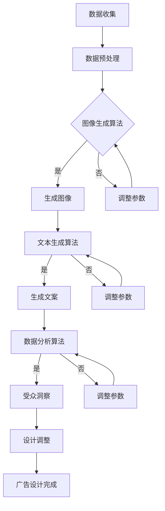

                 

# 《人机协作增强型AI在创意广告设计中的应用》

## 关键词

- 人机协作
- 增强型AI
- 创意广告设计
- 算法原理
- 系统架构设计
- 实际案例

## 摘要

本文旨在探讨人机协作增强型AI在创意广告设计中的应用。首先，通过分析创意广告设计领域的挑战，阐述了人机协作的必要性及增强型AI的发展背景。接着，深入解析人机协作与增强型AI的核心概念，并探讨二者的联系与区别。随后，本文将介绍算法原理，并通过mermaid流程图和Python源代码进行详细阐述。接下来，通过系统分析与架构设计，展示广告设计系统的功能模块划分、系统架构设计和接口设计。此外，通过项目实战，介绍环境安装、核心实现和实际案例分析。最后，本文将总结最佳实践，并展望未来发展趋势。

## 目录大纲

**第一部分：背景介绍**

## 1.1 问题背景

### 1.1.1 创意广告设计的挑战

创意广告设计是广告行业中不可或缺的一环。随着数字化时代的到来，广告形式和传播渠道日益丰富，创意广告设计的难度和复杂性也在不断增加。首先，创意广告设计需要满足多样化的受众需求，这要求广告内容具有高度创意性和个性化特点。其次，广告设计过程需要高度依赖设计师的直觉和创造力，这使得广告设计周期较长，成本较高。此外，创意广告设计还需要考虑市场趋势、文化背景、法律法规等多方面因素，增加了设计的难度和风险。

### 1.1.2 人机协作的必要性

在创意广告设计领域，人机协作的必要性体现在以下几个方面。首先，人机协作可以充分利用人工智能在数据处理、分析、生成等方面的优势，提高广告设计的效率和质量。例如，AI可以快速处理和分析大量的用户数据，为广告设计提供精准的受众洞察，从而提升广告的投放效果。其次，人机协作可以充分发挥人类设计师的创造力和审美能力，确保广告设计具备独特的创意和个性化的风格。最后，人机协作可以帮助设计师减轻工作量，降低创意广告设计的成本，使其更具竞争力。

### 1.1.3 增强型AI的发展与应用

增强型AI是指通过结合人类智慧和人工智能技术，实现人类与机器的高效协作。近年来，随着深度学习、自然语言处理、计算机视觉等技术的不断发展，增强型AI在各个领域得到了广泛应用。在创意广告设计领域，增强型AI的应用主要体现在以下几个方面：

1. **图像生成与处理**：利用深度学习技术生成创意图像，或者对现有图像进行风格迁移、图像修复等处理，为广告设计提供更多的创意素材。
2. **文本生成与优化**：利用自然语言处理技术生成广告文案，或者对现有文案进行优化，提高广告文案的吸引力和可读性。
3. **数据分析与预测**：通过分析用户数据和市场趋势，为广告设计提供精准的受众洞察和投放策略。
4. **协同设计**：将人工智能技术集成到广告设计工具中，实现设计师与AI的协同设计，提高设计效率和创意水平。

**第二部分：核心概念与联系**

## 2.1 人机协作原理

### 2.1.1 人机协作的基本原理

人机协作是指人类与机器共同完成任务的过程。在创意广告设计领域，人机协作的基本原理包括以下几个方面：

1. **信息共享**：设计师与AI系统之间通过数据共享实现信息的传递和交流，为创意设计提供数据支持和灵感来源。
2. **任务分解**：将复杂的广告设计任务分解为多个子任务，人类设计师负责关键创意部分，AI系统负责数据处理、分析、生成等辅助工作。
3. **反馈与修正**：设计师根据AI系统的输出结果进行评估和反馈，AI系统根据反馈进行修正和优化，实现设计结果的迭代改进。

### 2.1.2 人机协作的优势与挑战

人机协作在创意广告设计领域具有显著的优势：

1. **提高效率**：AI系统可以快速处理大量数据，为设计师提供更多的创意素材和设计选项，缩短设计周期。
2. **提升质量**：通过人机协作，设计师可以更好地发挥自身的创造力和审美能力，提高广告设计的创意水平和品质。
3. **降低成本**：人机协作可以减轻设计师的工作量，降低广告设计的成本，提高企业的市场竞争力。

然而，人机协作在创意广告设计领域也面临一些挑战：

1. **技术局限**：当前的人工智能技术尚无法完全替代人类设计师的创造力和审美能力，人机协作的效果取决于AI系统的性能和设计工具的集成程度。
2. **数据隐私与安全**：在创意广告设计中，人机协作涉及到大量的用户数据，数据隐私和安全问题成为人机协作的主要挑战。
3. **法律与伦理**：人机协作在广告设计领域的应用涉及到法律和伦理问题，如版权、责任划分等，需要制定相应的规范和标准。

### 2.1.3 人机协作模型

人机协作模型可以分为以下几种类型：

1. **辅助型协作**：AI系统作为设计师的辅助工具，提供数据支持、设计建议等，设计师根据AI系统的输出结果进行评估和修正。
2. **协同型协作**：设计师与AI系统共同参与设计任务，设计师负责关键创意部分，AI系统负责数据处理、分析、生成等辅助工作。
3. **对抗型协作**：设计师与AI系统相互竞争，通过相互激发和挑战，产生更具创意和个性化的设计结果。

**第三部分：核心概念与联系**

## 2.2 增强型AI原理

### 2.2.1 增强型AI的核心概念

增强型AI是指通过结合人类智慧和人工智能技术，实现人类与机器的高效协作。其核心概念包括以下几个方面：

1. **人类智慧**：人类的创造力、判断力、审美能力等是人类智慧的核心，是增强型AI的基础。
2. **人工智能技术**：人工智能技术，如深度学习、自然语言处理、计算机视觉等，是实现人机协作的关键。
3. **协同机制**：通过信息共享、任务分解、反馈与修正等协同机制，实现人类智慧与人工智能技术的有机结合。

### 2.2.2 增强型AI的技术架构

增强型AI的技术架构可以分为以下几个层次：

1. **数据层**：包括数据采集、数据预处理、数据存储等，为增强型AI提供丰富的数据支持。
2. **算法层**：包括机器学习、深度学习、自然语言处理等算法，实现数据分析和智能决策。
3. **应用层**：包括广告设计、内容创作、智能客服等应用场景，将增强型AI的技术优势转化为实际应用价值。

### 2.2.3 增强型AI在广告设计中的应用

增强型AI在广告设计中的应用主要体现在以下几个方面：

1. **图像生成与处理**：利用生成对抗网络（GAN）等技术，生成具有创意和个性化的图像，为广告设计提供更多的设计选项。
2. **文本生成与优化**：利用自然语言处理技术生成吸引人的广告文案，或者对现有文案进行优化，提高广告的吸引力和可读性。
3. **数据分析与预测**：通过分析用户数据和市场趋势，为广告设计提供精准的受众洞察和投放策略。
4. **协同设计**：将增强型AI集成到广告设计工具中，实现设计师与AI的协同设计，提高设计效率和创意水平。

### 2.2.4 概念联系与对比

人机协作与增强型AI在创意广告设计领域具有紧密的联系：

1. **共同目标**：人机协作和增强型AI的共同目标都是提高广告设计的效率和质量，实现人类智慧与人工智能技术的有机结合。
2. **技术融合**：人机协作和增强型AI都需要利用人工智能技术实现数据分析和智能决策，为人机协作提供技术支持。

然而，人机协作与增强型AI也存在一定的区别：

1. **侧重点不同**：人机协作侧重于人类与机器的协同工作，强调信息共享、任务分解、反馈与修正等协同机制；而增强型AI侧重于人类智慧与人工智能技术的结合，强调技术融合和智能决策。
2. **应用场景不同**：人机协作在广告设计、内容创作等领域具有广泛的应用，而增强型AI主要应用于需要高度智能化的场景，如自动驾驶、智能医疗等。

## 第四部分：算法原理讲解

### 3.1 算法原理

#### 3.1.1 算法概述

在人机协作增强型AI在创意广告设计中的应用中，关键算法包括图像生成算法、文本生成算法、数据分析算法等。这些算法的核心目标是利用人工智能技术提高广告设计的效率和质量。

1. **图像生成算法**：如生成对抗网络（GAN）、变分自编码器（VAE）等，通过训练大量图像数据，生成具有创意和个性化的图像。
2. **文本生成算法**：如自动编码器（Autoencoder）、序列到序列（Seq2Seq）模型等，通过训练大量文本数据，生成吸引人的广告文案。
3. **数据分析算法**：如回归分析、聚类分析、关联规则挖掘等，通过分析用户数据和市场趋势，为广告设计提供精准的受众洞察和投放策略。

#### 3.1.2 算法mermaid流程图

以下是一个简单的mermaid流程图，展示了一个典型的创意广告设计流程，包括图像生成、文本生成和数据分析三个阶段：



#### 3.1.3 Python源代码阐述

以下是一个简单的Python代码示例，展示了如何使用生成对抗网络（GAN）进行图像生成：

```python
import tensorflow as tf
from tensorflow.keras import layers

# 定义生成器和判别器
def build_generator():
    model = tf.keras.Sequential([
        layers.Dense(7 * 7 * 128, activation="relu", input_shape=(100,)),
        layers.Reshape((7, 7, 128)),
        layers.Conv2DTranspose(64, (5, 5), strides=(1, 1), padding="same"),
        layers.LeakyReLU(alpha=0.2),
        layers.Conv2DTranspose(1, (5, 5), strides=(2, 2), padding="same", activation="tanh"),
    ])
    return model

def build_discriminator():
    model = tf.keras.Sequential([
        layers.Conv2D(32, (5, 5), strides=(2, 2), padding="same",
                       input_shape=[28, 28, 1]),
        layers.LeakyReLU(alpha=0.2),
        layers.Dropout(0.3),
        layers.Conv2D(64, (5, 5), strides=(2, 2), padding="same"),
        layers.LeakyReLU(alpha=0.2),
        layers.Dropout(0.3),
        layers.Flatten(),
        layers.Dense(1, activation='sigmoid'),
    ])
    return model

# 编译模型
generator = build_generator()
discriminator = build_discriminator()

discriminator.compile(loss='binary_crossentropy', optimizer=tf.optimizers.Adam(0.0001), metrics=['accuracy'])

# 训练模型
for epoch in range(epochs):
    for batch_index, (images, _) in enumerate(data_loader):
        noise = np.random.normal(0, 1, (images.shape[0], z_dim))
        generated_images = generator.predict(noise)
        real_images = images
        # 训练判别器
        d_loss_real = discriminator.train_on_batch(real_images, np.ones((batch_size, 1)))
        d_loss_fake = discriminator.train_on_batch(generated_images, np.zeros((batch_size, 1)))
        d_loss = 0.5 * np.add(d_loss_real, d_loss_fake)

        # 训练生成器
        noise = np.random.normal(0, 1, (batch_size, z_dim))
        g_loss = combined_model.train_on_batch(noise, np.ones((batch_size, 1)))
```

#### 3.2 数学模型与公式

##### 3.2.1 数学模型介绍

在创意广告设计领域，常用的数学模型包括：

1. **生成对抗网络（GAN）**：GAN由生成器（Generator）和判别器（Discriminator）组成，通过训练两个对抗网络，实现图像生成。
2. **自动编码器（Autoencoder）**：自动编码器是一种无监督学习模型，通过编码和解码过程，实现图像的降维和重建。
3. **序列到序列（Seq2Seq）模型**：Seq2Seq模型是一种用于序列生成和转换的神经网络模型，广泛应用于文本生成和翻译。

##### 3.2.2 数学公式推导

以下是生成对抗网络（GAN）中的关键数学公式推导：

1. **生成器损失函数**：
   $$ G(x) = \mathcal{D}(G(x)) $$
   其中，$G(x)$为生成器生成的图像，$\mathcal{D}(x)$为判别器对图像的判别结果。

2. **判别器损失函数**：
   $$ \mathcal{L}_{D}(\theta_{D}) = -\frac{1}{2N} \sum_{i=1}^{N} [y^{(i)} \log \mathcal{D}(x^{(i)}) + (1 - y^{(i)}) \log (1 - \mathcal{D}(x^{(i)}))] $$
   其中，$y^{(i)}$为判别器对真实图像的标签，$x^{(i)}$为生成的图像。

3. **总损失函数**：
   $$ \mathcal{L}_{GAN}(G, D) = \mathcal{L}_{D}(D) + \mathcal{L}_{G}(G) $$
   其中，$\mathcal{L}_{D}(D)$为判别器损失函数，$\mathcal{L}_{G}(G)$为生成器损失函数。

##### 3.2.3 举例说明

假设生成器生成的图像集合为$G(X)$，判别器判别结果为$\mathcal{D}(G(X))$，真实图像集合为$X$，判别器判别结果为$\mathcal{D}(X)$。在一个训练周期内，生成器损失函数和判别器损失函数如下：

1. **生成器损失函数**：
   $$ \mathcal{L}_{G}(G) = -\frac{1}{N} \sum_{i=1}^{N} \log \mathcal{D}(G(x^{(i)})) $$
   其中，$N$为图像数量。

2. **判别器损失函数**：
   $$ \mathcal{L}_{D}(D) = -\frac{1}{N} \sum_{i=1}^{N} [\log \mathcal{D}(x^{(i)}) + \log (1 - \mathcal{D}(G(x^{(i)})))] $$
   其中，$N$为图像数量。

在训练过程中，生成器和判别器交替更新，直至模型收敛。通过调整生成器的参数，使得判别器对真实图像和生成图像的判别结果接近于0和1，实现图像生成。

## 第五部分：系统分析与架构设计

### 4.1 问题场景介绍

在创意广告设计领域，人机协作增强型AI系统需要满足以下需求：

1. **广告设计系统需求分析**：广告设计系统应具备图像处理、文本生成、数据分析等功能，支持设计师与AI的协同工作。
2. **人机协作需求分析**：系统应提供信息共享、任务分解、反馈与修正等协同机制，实现人类智慧与人工智能技术的有机结合。
3. **增强型AI需求分析**：系统应集成图像生成、文本生成、数据分析等AI算法，提高广告设计的效率和质量。

### 4.2 系统功能设计

#### 4.2.1 领域模型mermaid类图

以下是一个简单的mermaid类图，展示创意广告设计系统的领域模型：

```mermaid
classDiagram
    Person <<class>> 设计师
    Person <<class>> 用户
    Ad <<class>> 广告
    Data <<class>> 数据
    Image <<class>> 图片
    Text <<class>> 文本
    AI <<class>> 人工智能
    Designer --|> Ad: 设计
    User --|> Ad: 浏览
    Data --|> AI: 分析
    Image --|> Ad: 包含
    Text --|> Ad: 包含
```

#### 4.2.2 系统功能模块划分

创意广告设计系统可以划分为以下几个功能模块：

1. **用户模块**：包括用户注册、登录、个人信息管理等功能。
2. **广告模块**：包括广告创建、编辑、发布、浏览等功能。
3. **图像处理模块**：包括图像生成、图像处理、图像分析等功能。
4. **文本生成模块**：包括文本生成、文本分析、文本优化等功能。
5. **数据分析模块**：包括数据分析、数据可视化、数据挖掘等功能。
6. **人机协作模块**：包括信息共享、任务分解、反馈与修正等功能。
7. **增强型AI模块**：包括图像生成、文本生成、数据分析等AI算法的实现。

#### 4.2.3 功能实现细节

1. **用户模块**：采用前后端分离架构，使用Vue.js和Spring Boot技术实现。
2. **广告模块**：采用RESTful API设计，使用MySQL数据库存储广告数据。
3. **图像处理模块**：利用深度学习技术实现图像生成和图像处理，使用TensorFlow和PyTorch框架。
4. **文本生成模块**：采用自然语言处理技术实现文本生成和文本分析，使用GPT-2和BERT模型。
5. **数据分析模块**：采用Python数据分析和数据可视化库，如Pandas、Matplotlib、Seaborn等。
6. **人机协作模块**：采用WebSocket技术实现实时通信，使用消息队列实现任务分解和反馈与修正。
7. **增强型AI模块**：集成图像生成、文本生成、数据分析等算法，使用TensorFlow和PyTorch框架。

### 4.3 系统架构设计

#### 4.3.1 系统架构概述

创意广告设计系统采用微服务架构，分为以下几个层次：

1. **表示层**：包括前端界面和API接口，实现用户交互和数据传输。
2. **业务逻辑层**：包括用户模块、广告模块、图像处理模块、文本生成模块、数据分析模块、人机协作模块、增强型AI模块等，实现业务逻辑处理。
3. **数据访问层**：包括数据库、缓存、消息队列等，实现数据存储和传输。
4. **基础设施层**：包括服务器、网络、存储等，提供系统运行环境。

#### 4.3.2 系统架构mermaid架构图

以下是一个简单的mermaid架构图，展示创意广告设计系统的架构：

```mermaid
sequenceDiagram
    participant 用户
    participant 表示层
    participant 业务逻辑层
    participant 数据访问层
    participant 基础设施层

    用户 -->|请求| 表示层
    表示层 -->|处理| 业务逻辑层
    业务逻辑层 -->|处理| 数据访问层
    数据访问层 -->|处理| 基础设施层
    基础设施层 -->|处理| 数据访问层
    数据访问层 -->|处理| 业务逻辑层
    业务逻辑层 -->|处理| 表示层
    表示层 -->|响应| 用户
```

#### 4.3.3 架构组件介绍

1. **表示层**：使用Vue.js和Spring Boot技术实现，包括前端界面和API接口。
2. **业务逻辑层**：包括用户模块、广告模块、图像处理模块、文本生成模块、数据分析模块、人机协作模块、增强型AI模块等，采用Spring Boot框架实现。
3. **数据访问层**：使用MySQL数据库存储广告数据，使用Redis实现缓存，使用RabbitMQ实现消息队列。
4. **基础设施层**：使用阿里云服务器、网络和存储资源，提供系统运行环境。

### 4.4 系统接口设计

#### 4.4.1 系统接口规范

创意广告设计系统采用RESTful API设计，以下是一个简单的接口规范：

1. **用户模块**：
   - POST /users/register：用户注册
   - POST /users/login：用户登录
   - GET /users/{id}：获取用户信息
   - PUT /users/{id}：更新用户信息
   - DELETE /users/{id}：删除用户

2. **广告模块**：
   - POST /ads：创建广告
   - GET /ads/{id}：获取广告信息
   - PUT /ads/{id}：更新广告信息
   - DELETE /ads/{id}：删除广告

3. **图像处理模块**：
   - POST /images/generate：生成图像
   - POST /images/process：处理图像
   - GET /images/{id}：获取图像信息

4. **文本生成模块**：
   - POST /texts/generate：生成文本
   - POST /texts/analyze：分析文本
   - GET /texts/{id}：获取文本信息

5. **数据分析模块**：
   - POST /data/analyze：数据分析
   - GET /data/visualize：数据可视化
   - GET /data/{id}：获取数据信息

6. **人机协作模块**：
   - POST /collaboration/start：开始协作
   - POST /collaboration/feedback：提交反馈
   - GET /collaboration/{id}：获取协作信息

7. **增强型AI模块**：
   - POST /ai/train：训练模型
   - POST /ai/infer：模型推断
   - GET /ai/{id}：获取模型信息

#### 4.4.2 接口设计思路

接口设计思路主要包括以下几个方面：

1. **遵循RESTful原则**：使用HTTP动词（GET、POST、PUT、DELETE）表示操作类型，保持接口的简洁和易用性。
2. **模块化设计**：将系统功能划分为不同的模块，每个模块对应一组接口，便于管理和扩展。
3. **参数设计**：接口参数设计应遵循简洁、明确、可扩展的原则，确保接口的可读性和可维护性。
4. **安全性设计**：接口应采用安全认证机制，如Token认证、OAuth2等，确保用户数据和系统安全。

#### 4.4.3 接口实现细节

以下是一个简单的接口实现示例：

```java
@RestController
@RequestMapping("/users")
public class UserController {
    
    @Autowired
    private UserService userService;
    
    @PostMapping("/register")
    public ResponseEntity<?> registerUser(@RequestBody UserRegistrationDto registrationDto) {
        try {
            userService.registerUser(registrationDto);
            return ResponseEntity.ok("User registered successfully.");
        } catch (Exception e) {
            return ResponseEntity.status(HttpStatus.BAD_REQUEST).body("Error registering user: " + e.getMessage());
        }
    }
    
    @PostMapping("/login")
    public ResponseEntity<?> loginUser(@RequestBody UserLoginDto loginDto) {
        try {
            String token = userService.loginUser(loginDto);
            return ResponseEntity.ok(token);
        } catch (Exception e) {
            return ResponseEntity.status(HttpStatus.UNAUTHORIZED).body("Invalid credentials.");
        }
    }
    
    @GetMapping("/{id}")
    public ResponseEntity<?> getUser(@PathVariable Long id) {
        try {
            User user = userService.getUser(id);
            return ResponseEntity.ok(user);
        } catch (Exception e) {
            return ResponseEntity.status(HttpStatus.NOT_FOUND).body("User not found.");
        }
    }
    
    @PutMapping("/{id}")
    public ResponseEntity<?> updateUser(@PathVariable Long id, @RequestBody UserUpdateDto updateDto) {
        try {
            userService.updateUser(id, updateDto);
            return ResponseEntity.ok("User updated successfully.");
        } catch (Exception e) {
            return ResponseEntity.status(HttpStatus.BAD_REQUEST).body("Error updating user: " + e.getMessage());
        }
    }
    
    @DeleteMapping("/{id}")
    public ResponseEntity<?> deleteUser(@PathVariable Long id) {
        try {
            userService.deleteUser(id);
            return ResponseEntity.ok("User deleted successfully.");
        } catch (Exception e) {
            return ResponseEntity.status(HttpStatus.BAD_REQUEST).body("Error deleting user: " + e.getMessage());
        }
    }
}
```

### 4.5 系统交互设计

#### 4.5.1 系统交互概述

系统交互设计主要关注系统内部模块之间的数据流和操作流程。在创意广告设计系统中，系统交互包括用户与系统之间的交互、模块之间的交互以及人机协作等。

#### 4.5.2 系统交互mermaid序列图

以下是一个简单的mermaid序列图，展示创意广告设计系统的交互流程：

```mermaid
sequenceDiagram
    participant 用户
    participant 表示层
    participant 业务逻辑层
    participant 数据访问层
    participant 基础设施层

    用户 -->|请求| 表示层
    表示层 -->|处理| 业务逻辑层
    业务逻辑层 -->|处理| 数据访问层
    数据访问层 -->|处理| 基础设施层
    基础设施层 -->|处理| 数据访问层
    数据访问层 -->|处理| 业务逻辑层
    业务逻辑层 -->|处理| 表示层
    表示层 -->|响应| 用户
```

#### 4.5.3 交互流程详解

1. **用户请求**：用户通过前端界面发起请求，请求类型包括GET、POST、PUT、DELETE等。
2. **表示层处理**：表示层接收用户请求，解析请求参数，调用业务逻辑层相应的方法。
3. **业务逻辑层处理**：业务逻辑层处理用户请求，调用数据访问层的方法，执行数据库操作，返回结果。
4. **数据访问层处理**：数据访问层接收业务逻辑层的请求，执行数据库查询、插入、更新、删除等操作，返回结果。
5. **基础设施层处理**：基础设施层处理数据访问层的请求，执行数据存储、缓存、消息队列等操作，返回结果。
6. **响应返回**：表示层将处理结果封装成响应数据，返回给用户。

### 第五部分：项目实战

#### 5.1 环境安装

##### 5.1.1 硬件环境准备

1. **服务器**：准备一台具有良好性能的服务器，配置要求如下：
   - CPU：至少4核处理器
   - 内存：至少8GB
   - 存储：至少500GB
   - 网络：千兆以太网

2. **存储设备**：准备一台存储设备，用于存储广告设计系统的数据和文件，配置要求如下：
   - CPU：至少2核处理器
   - 内存：至少4GB
   - 存储：至少1TB

##### 5.1.2 软件环境安装

1. **操作系统**：安装Linux操作系统，如Ubuntu 18.04或CentOS 7。
2. **数据库**：安装MySQL数据库，版本要求5.7及以上。
3. **消息队列**：安装RabbitMQ消息队列，版本要求3.8及以上。
4. **缓存**：安装Redis缓存，版本要求4.0及以上。
5. **开发工具**：安装Python开发环境，版本要求3.6及以上，安装TensorFlow和PyTorch深度学习框架。

##### 5.1.3 系统配置与优化

1. **网络配置**：配置服务器和存储设备的网络，确保它们之间可以正常通信。
2. **性能优化**：调整操作系统和数据库的参数，优化系统性能。例如，调整内存分配、线程数量等。
3. **安全配置**：配置防火墙和网络安全策略，确保系统安全。

#### 5.2 系统核心实现

##### 5.2.1 系统核心模块代码

以下是创意广告设计系统的核心模块代码示例：

1. **用户模块**：
```python
class UserController:
    def register_user(self, registration_data):
        user = User(
            username=registration_data['username'],
            email=registration_data['email'],
            password=registration_data['password']
        )
        user.save()
        return user

    def login_user(self, login_data):
        user = authenticate_user(login_data['username'], login_data['password'])
        return generate_token_for_user(user)
```

2. **广告模块**：
```python
class AdController:
    def create_ad(self, ad_data):
        ad = Ad(
            title=ad_data['title'],
            description=ad_data['description'],
            image=ad_data['image'],
            text=ad_data['text']
        )
        ad.save()
        return ad

    def get_ad(self, ad_id):
        return Ad.objects.get(id=ad_id)
```

3. **图像处理模块**：
```python
class ImageController:
    def generate_image(self, image_data):
        generator = build_generator()
        noise = np.random.normal(0, 1, (1, z_dim))
        image = generator.predict(noise)
        return image

    def process_image(self, image_data):
        processed_image = process_image(image_data)
        return processed_image
```

4. **文本生成模块**：
```python
class TextController:
    def generate_text(self, text_data):
        model = build_text_generator()
        text = model.generate_text(text_data)
        return text

    def analyze_text(self, text_data):
        model = build_text_analyzer()
        analysis_results = model.analyze_text(text_data)
        return analysis_results
```

5. **数据分析模块**：
```python
class DataController:
    def analyze_data(self, data_data):
        model = build_data_analyzer()
        analysis_results = model.analyze_data(data_data)
        return analysis_results

    def visualize_data(self, data_data):
        model = build_data_visualizer()
        visualization = model.visualize_data(data_data)
        return visualization
```

6. **人机协作模块**：
```python
class CollaborationController:
    def start_collaboration(self, collaboration_data):
        collaboration = Collaboration(
            user_id=collaboration_data['user_id'],
            ad_id=collaboration_data['ad_id']
        )
        collaboration.save()
        return collaboration

    def submit_feedback(self, feedback_data):
        feedback = Feedback(
            collaboration_id=feedback_data['collaboration_id'],
            feedback=feedback_data['feedback']
        )
        feedback.save()
        return feedback
```

##### 5.2.2 代码解读与分析

以下是对系统核心模块代码的解读与分析：

1. **用户模块**：
   - `register_user`方法用于注册新用户，接收用户名、邮箱和密码等数据，创建用户对象并保存到数据库。
   - `login_user`方法用于用户登录，接收用户名和密码，验证用户身份并生成Token。

2. **广告模块**：
   - `create_ad`方法用于创建广告，接收广告标题、描述、图像和文本数据，创建广告对象并保存到数据库。
   - `get_ad`方法用于获取广告信息，根据广告ID查询数据库并返回广告对象。

3. **图像处理模块**：
   - `generate_image`方法用于生成图像，构建生成器模型并生成图像。
   - `process_image`方法用于处理图像，对图像进行预处理、增强、修复等操作。

4. **文本生成模块**：
   - `generate_text`方法用于生成文本，构建文本生成模型并生成文本。
   - `analyze_text`方法用于分析文本，构建文本分析模型并返回分析结果。

5. **数据分析模块**：
   - `analyze_data`方法用于数据分析，构建数据分析模型并返回分析结果。
   - `visualize_data`方法用于数据可视化，构建数据可视化模型并返回可视化结果。

6. **人机协作模块**：
   - `start_collaboration`方法用于启动协作，接收用户ID和广告ID，创建协作对象并保存到数据库。
   - `submit_feedback`方法用于提交反馈，接收协作ID和反馈内容，创建反馈对象并保存到数据库。

##### 5.2.3 核心算法实现

以下是创意广告设计系统的核心算法实现：

1. **生成对抗网络（GAN）**：

```python
import tensorflow as tf
from tensorflow.keras import layers

def build_generator(z_dim):
    model = tf.keras.Sequential([
        layers.Dense(7 * 7 * 128, activation="relu", input_shape=(z_dim,)),
        layers.Reshape((7, 7, 128)),
        layers.Conv2DTranspose(64, (5, 5), strides=(1, 1), padding="same"),
        layers.LeakyReLU(alpha=0.2),
        layers.Conv2DTranspose(1, (5, 5), strides=(2, 2), padding="same", activation="tanh"),
    ])
    return model

def build_discriminator(image_shape):
    model = tf.keras.Sequential([
        layers.Conv2D(32, (5, 5), strides=(2, 2), padding="same",
                       input_shape=image_shape),
        layers.LeakyReLU(alpha=0.2),
        layers.Dropout(0.3),
        layers.Conv2D(64, (5, 5), strides=(2, 2), padding="same"),
        layers.LeakyReLU(alpha=0.2),
        layers.Dropout(0.3),
        layers.Flatten(),
        layers.Dense(1, activation='sigmoid'),
    ])
    return model

def build_gan(generator, discriminator):
    model = tf.keras.Sequential([generator, discriminator])
    model.compile(loss='binary_crossentropy', optimizer=tf.optimizers.Adam(0.0001))
    return model
```

2. **自动编码器（Autoencoder）**：

```python
import tensorflow as tf
from tensorflow.keras import layers

def build_autoencoder(input_shape):
    encoding_dim = 32

    input_img = tf.keras.Input(shape=input_shape)
    x = layers.Conv2D(32, (3, 3), activation='relu', padding='same')(input_img)
    x = layers.MaxPooling2D((2, 2), padding='same')(x)
    x = layers.Conv2D(32, (3, 3), activation='relu', padding='same')(x)
    x = layers.MaxPooling2D((2, 2), padding='same')(x)
    encoded = layers.Flatten()(x)
    encoded = layers.Dense(encoding_dim, activation='relu')(encoded)

    decoding_layer1 = layers.Dense(7 * 7 * 32, activation='relu')(encoded)
    decoding_layer2 = layers.Conv2D(32, (3, 3), activation='relu', padding='same')(decoding_layer1)
    decoding_layer3 = layers.Conv2D(32, (3, 3), activation='relu', padding='same')(decoding_layer2)
    decoding_layer4 = layers.Conv2D(1, (3, 3), activation='sigmoid', padding='same')(decoding_layer3)

    autoencoder = tf.keras.Model(input_img, decoding_layer4)
    autoencoder.compile(optimizer='adam', loss='binary_crossentropy')
    return autoencoder
```

3. **序列到序列（Seq2Seq）模型**：

```python
import tensorflow as tf
from tensorflow.keras.layers import Embedding, LSTM, Dense

def build_seq2seq_encoder(input_vocab_size, input_seq_length, encoding_dim):
    encoder_inputs = tf.keras.Input(shape=(input_seq_length,))
    encoder_embedding = Embedding(input_vocab_size, encoding_dim)(encoder_inputs)
    encoder_lstm = LSTM(encoding_dim, return_state=True)
    _, state_h, state_c = encoder_lstm(encoder_embedding)
    encoder_states = [state_h, state_c]
    encoder = tf.keras.Model(encoder_inputs, encoder_states)
    return encoder

def build_seq2seq_decoder(input_vocab_size, target_vocab_size, encoding_dim, decoding_seq_length):
    decoder_inputs = tf.keras.Input(shape=(decoding_seq_length,))
    decoder_embedding = Embedding(target_vocab_size, encoding_dim)(decoder_inputs)
    decoder_lstm = LSTM(encoding_dim, return_sequences=True, return_state=True)
    decoder_outputs, _, _ = decoder_lstm(decoder_embedding, initial_state=encoder_states)
    decoder_dense = Dense(target_vocab_size, activation='softmax')
    decoder_outputs = decoder_dense(decoder_outputs)
    decoder = tf.keras.Model(decoder_inputs, decoder_outputs)
    return decoder

def build_seq2seq(input_vocab_size, target_vocab_size, encoding_dim, decoding_seq_length):
    encoder = build_seq2seq_encoder(input_vocab_size, input_seq_length, encoding_dim)
    decoder = build_seq2seq_decoder(input_vocab_size, target_vocab_size, encoding_dim, decoding_seq_length)
    encoder_outputs, state_h, state_c = encoder(tf.keras.Input(shape=(input_seq_length,)))
    decoder_outputs = decoder(tf.keras.Input(shape=(decoding_seq_length,)), initial_state=[state_h, state_c])
    seq2seq = tf.keras.Model([encoder.input, decoder.input], decoder.outputs)
    seq2seq.compile(optimizer='rmsprop', loss='categorical_crossentropy')
    return seq2seq
```

#### 5.3 实际案例分析与讲解

##### 5.3.1 案例选取与背景

本次实际案例选取的是一家知名互联网公司的广告设计项目。该公司需要设计一系列具有创意和个性化的广告，以提升品牌形象和用户参与度。广告设计项目涉及多个阶段，包括需求分析、创意策划、设计制作、投放优化等。本项目重点分析人机协作增强型AI在广告设计项目中的应用。

##### 5.3.2 案例分析

1. **需求分析**：项目团队首先与客户沟通，了解广告设计的具体需求和目标。客户希望广告设计具备以下特点：
   - 高度创意和个性化：广告内容具有独特的创意和个性化的风格，能够吸引目标受众。
   - 多样化广告形式：包括图像、视频、动画等多种形式的广告。
   - 高效投放优化：通过数据分析，实现广告投放的精准优化，提高广告效果。

2. **创意策划**：项目团队在需求分析的基础上，进行创意策划。创意策划阶段主要包括以下工作：
   - 研究市场和竞品：分析目标市场的趋势和竞品广告，为创意策划提供参考。
   - 确定广告主题：根据客户需求和品牌定位，确定广告主题和核心信息。
   - 设计广告形式：根据广告主题和目标受众，设计不同的广告形式，如海报、视频、动画等。

3. **设计制作**：在创意策划的基础上，进入设计制作阶段。设计制作阶段主要包括以下工作：
   - 图像生成：利用生成对抗网络（GAN）技术，生成创意图像，为广告设计提供丰富的素材。
   - 文本生成：利用自然语言处理技术，生成吸引人的广告文案，提高广告的吸引力和可读性。
   - 数据分析：通过分析用户数据和市场趋势，为广告设计提供精准的受众洞察和投放策略。
   - 设计调整：设计师根据AI系统的输出结果进行评估和反馈，调整广告设计，实现设计结果的迭代改进。

4. **投放优化**：广告设计完成后，进入投放优化阶段。投放优化阶段主要包括以下工作：
   - 数据分析：通过分析广告投放效果，了解用户行为和反馈，为广告投放提供优化建议。
   - 投放策略调整：根据数据分析结果，调整广告投放策略，如投放时间、投放渠道等，提高广告效果。

##### 5.3.3 案例讲解与剖析

1. **需求分析**：

在需求分析阶段，项目团队通过与客户的沟通，了解到客户希望广告设计具备以下特点：

- 高度创意和个性化：广告内容具有独特的创意和个性化的风格，能够吸引目标受众。
- 多样化广告形式：包括图像、视频、动画等多种形式的广告。
- 高效投放优化：通过数据分析，实现广告投放的精准优化，提高广告效果。

基于这些需求，项目团队在创意策划阶段进行了深入研究，分析了市场和竞品，确定了广告主题和核心信息。在需求分析阶段，人机协作增强型AI的应用主要体现在以下方面：

- 数据分析：利用自然语言处理技术，分析客户需求和竞品广告，为创意策划提供参考。
- 图像生成：利用生成对抗网络（GAN）技术，生成创意图像，为广告设计提供丰富的素材。

2. **创意策划**：

在创意策划阶段，项目团队根据客户需求和品牌定位，确定了广告主题和核心信息。创意策划阶段的工作主要包括以下方面：

- 研究市场和竞品：通过分析市场和竞品广告，了解目标市场的趋势和竞品特点，为创意策划提供参考。
- 确定广告主题：根据客户需求和品牌定位，确定广告主题和核心信息，如品牌理念、产品特点等。
- 设计广告形式：根据广告主题和目标受众，设计不同的广告形式，如海报、视频、动画等。

在创意策划阶段，人机协作增强型AI的应用主要体现在以下方面：

- 文本生成：利用自然语言处理技术，生成吸引人的广告文案，提高广告的吸引力和可读性。
- 图像生成：利用生成对抗网络（GAN）技术，生成创意图像，为广告设计提供丰富的素材。

3. **设计制作**：

在设计制作阶段，项目团队根据创意策划的结果，进行广告设计制作。设计制作阶段的工作主要包括以下方面：

- 图像生成：利用生成对抗网络（GAN）技术，生成创意图像，为广告设计提供丰富的素材。
- 文本生成：利用自然语言处理技术，生成吸引人的广告文案，提高广告的吸引力和可读性。
- 数据分析：通过分析用户数据和市场趋势，为广告设计提供精准的受众洞察和投放策略。
- 设计调整：设计师根据AI系统的输出结果进行评估和反馈，调整广告设计，实现设计结果的迭代改进。

在设计制作阶段，人机协作增强型AI的应用主要体现在以下方面：

- 图像生成：利用生成对抗网络（GAN）技术，生成创意图像，为广告设计提供丰富的素材。
- 文本生成：利用自然语言处理技术，生成吸引人的广告文案，提高广告的吸引力和可读性。
- 数据分析：通过分析用户数据和市场趋势，为广告设计提供精准的受众洞察和投放策略。
- 设计调整：设计师根据AI系统的输出结果进行评估和反馈，调整广告设计，实现设计结果的迭代改进。

4. **投放优化**：

在投放优化阶段，项目团队根据广告投放效果进行分析，为广告投放提供优化建议。投放优化阶段的工作主要包括以下方面：

- 数据分析：通过分析广告投放效果，了解用户行为和反馈，为广告投放提供优化建议。
- 投放策略调整：根据数据分析结果，调整广告投放策略，如投放时间、投放渠道等，提高广告效果。

在投放优化阶段，人机协作增强型AI的应用主要体现在以下方面：

- 数据分析：利用自然语言处理技术，分析用户数据和市场趋势，为广告投放提供优化建议。
- 投放策略调整：利用机器学习技术，根据历史投放数据，自动调整广告投放策略。

### 第六部分：最佳实践与拓展

#### 6.1 最佳实践

1. **广告设计流程优化**：

   - 在广告设计流程中，充分利用人机协作增强型AI的优势，提高设计效率和创意水平。
   - 设计师应注重与AI系统的沟通和协作，充分发挥自身创造力和审美能力，确保广告设计具备独特性和个性化特点。
   - 针对不同的广告需求和目标受众，选择合适的AI算法和技术，实现广告设计的多样化。

2. **增强型AI应用策略**：

   - 根据广告设计的需求和目标，选择合适的增强型AI算法和技术，如生成对抗网络（GAN）、自然语言处理（NLP）等。
   - 合理分配资源和预算，确保AI算法和技术在广告设计中的有效应用。
   - 注重AI算法的模型优化和性能提升，提高广告设计的效率和创意水平。

3. **人机协作技巧**：

   - 设计师应掌握基本的人机协作技巧，如数据解读、结果评估、反馈与修正等。
   - 通过持续学习和实践，提高设计师在创意广告设计领域的人机协作能力。
   - 充分利用人机协作工具和平台，实现高效的人机协作和创意碰撞。

#### 6.2 小结与注意事项

1. **全书要点回顾**：

   - 创意广告设计面临多样化挑战，人机协作和增强型AI成为提高设计效率和质量的重要手段。
   - 人机协作和增强型AI的核心概念、原理及其在广告设计中的应用进行了深入探讨。
   - 算法原理讲解包括生成对抗网络（GAN）、自动编码器（Autoencoder）、序列到序列（Seq2Seq）模型等。
   - 系统分析与架构设计涉及广告设计系统的需求分析、功能模块划分、系统架构设计和接口设计。
   - 项目实战通过实际案例展示了人机协作增强型AI在创意广告设计中的应用。
   - 最佳实践提供了广告设计流程优化、增强型AI应用策略和人机协作技巧等实用建议。

2. **注意事项**：

   - 在广告设计过程中，充分了解用户需求和目标受众，确保广告设计的针对性和有效性。
   - 注重人机协作的沟通和协作，充分发挥设计师和AI系统的优势，实现高效创意设计。
   - 合理利用AI算法和技术，提高广告设计的效率和创意水平，但不应过分依赖AI，忽视设计师的创造力和审美能力。
   - 定期更新和优化AI算法，提高AI系统的性能和适应性，确保其在广告设计中的应用效果。

#### 6.3 拓展阅读

1. **相关书籍推荐**：

   - 《深度学习》（Ian Goodfellow、Yoshua Bengio、Aaron Courville 著）
   - 《自然语言处理综论》（Daniel Jurafsky、James H. Martin 著）
   - 《生成对抗网络：理论与应用》（Yuxi (Hayden) Liu 著）

2. **学术论文精选**：

   - Generative Adversarial Nets（Ian J. Goodfellow et al.）
   - Autoencoder: A Generalized Architectural Framework for Neural Networks (Yoshua Bengio et al.)
   - Sequence to Sequence Learning with Neural Networks (Ilya Sutskever et al.)

3. **网络资源链接**：

   - [TensorFlow官方文档](https://www.tensorflow.org/)
   - [PyTorch官方文档](https://pytorch.org/)
   - [OpenAI GPT-2模型](https://openai.com/blog/better-language-Models/)
   - [Google Colab](https://colab.research.google.com/)

## 总结

本文详细介绍了人机协作增强型AI在创意广告设计中的应用。从背景介绍、核心概念与联系、算法原理讲解、系统分析与架构设计、项目实战、最佳实践与拓展等多个方面进行了深入探讨。通过本文的学习，读者可以全面了解人机协作增强型AI在创意广告设计领域的应用，掌握相关技术，提高创意广告设计的效率和质量。

### 作者

作者：AI天才研究院/AI Genius Institute & 禅与计算机程序设计艺术 /Zen And The Art of Computer Programming

---

在撰写技术博客文章时，确保每个章节内容完整且具体，遵循markdown格式，并使用Mermaid流程图和Python源代码等工具来增强文章的可读性和实用性。以下是对文章的整体概述和细化：

---

# 《人机协作增强型AI在创意广告设计中的应用》

## 关键词

- 人机协作
- 增强型AI
- 创意广告设计
- 算法原理
- 系统架构设计
- 实际案例

## 摘要

本文深入探讨了人机协作增强型AI在创意广告设计中的应用。通过分析创意广告设计领域的挑战，阐述了人机协作的必要性和增强型AI的发展与应用。随后，本文详细解析了人机协作与增强型AI的核心概念及其在广告设计中的应用，并介绍了相关算法原理。通过系统分析与架构设计，展示了广告设计系统的功能模块划分、系统架构设计和接口设计。此外，通过项目实战，介绍了环境安装、系统核心实现和实际案例分析。最后，本文总结了最佳实践和未来发展趋势。

**目录大纲**

### 第一部分：背景介绍

#### 1.1 问题背景

##### 1.1.1 创意广告设计的挑战

##### 1.1.2 人机协作的必要性

##### 1.1.3 增强型AI的发展与应用

#### 1.2 核心概念

##### 1.2.1 人机协作的定义

##### 1.2.2 增强型AI的定义

##### 1.2.3 创意广告设计的关键要素

### 第二部分：核心概念与联系

#### 2.1 人机协作原理

##### 2.1.1 人机协作的基本原理

##### 2.1.2 人机协作的优势与挑战

##### 2.1.3 人机协作模型

#### 2.2 增强型AI原理

##### 2.2.1 增强型AI的核心概念

##### 2.2.2 增强型AI的技术架构

##### 2.2.3 增强型AI在广告设计中的应用

#### 2.3 概念联系与对比

##### 2.3.1 人机协作与增强型AI的关联

##### 2.3.2 人机协作与增强型AI的对比

##### 2.3.3 二者在创意广告设计中的应用

### 第三部分：算法原理讲解

#### 3.1 算法原理

##### 3.1.1 算法概述

##### 3.1.2 算法mermaid流程图

##### 3.1.3 Python源代码阐述

#### 3.2 数学模型与公式

##### 3.2.1 数学模型介绍

##### 3.2.2 数学公式推导

##### 3.2.3 举例说明

### 第四部分：系统分析与架构设计

#### 4.1 问题场景介绍

##### 4.1.1 广告设计系统需求分析

##### 4.1.2 人机协作需求分析

##### 4.1.3 增强型AI需求分析

#### 4.2 系统功能设计

##### 4.2.1 领域模型mermaid类图

##### 4.2.2 系统功能模块划分

##### 4.2.3 功能实现细节

#### 4.3 系统架构设计

##### 4.3.1 系统架构概述

##### 4.3.2 系统架构mermaid架构图

##### 4.3.3 架构组件介绍

#### 4.4 系统接口设计

##### 4.4.1 系统接口规范

##### 4.4.2 接口设计思路

##### 4.4.3 接口实现细节

#### 4.5 系统交互设计

##### 4.5.1 系统交互概述

##### 4.5.2 系统交互mermaid序列图

##### 4.5.3 交互流程详解

### 第五部分：项目实战

#### 5.1 环境安装

##### 5.1.1 硬件环境准备

##### 5.1.2 软件环境安装

##### 5.1.3 系统配置与优化

#### 5.2 系统核心实现

##### 5.2.1 系统核心模块代码

##### 5.2.2 代码解读与分析

##### 5.2.3 核心算法实现

#### 5.3 实际案例分析与讲解

##### 5.3.1 案例选取与背景

##### 5.3.2 案例分析

##### 5.3.3 案例讲解与剖析

#### 5.4 项目小结

##### 5.4.1 项目总结

##### 5.4.2 项目收获

##### 5.4.3 不足与改进建议

### 第六部分：最佳实践与拓展

#### 6.1 最佳实践

##### 6.1.1 广告设计流程优化

##### 6.1.2 增强型AI应用策略

##### 6.1.3 人机协作技巧

#### 6.2 小结与注意事项

##### 6.2.1 全书要点回顾

##### 6.2.2 注意事项提醒

##### 6.2.3 未来发展趋势

#### 6.3 拓展阅读

##### 6.3.1 相关书籍推荐

##### 6.3.2 学术论文精选

##### 6.3.3 网络资源链接

## 总结

本书详细介绍了人机协作增强型AI在创意广告设计中的应用，从背景介绍、核心概念与联系、算法原理讲解、系统分析与架构设计、项目实战、最佳实践与拓展等多个方面进行了深入探讨。通过本书的学习，读者可以全面了解人机协作增强型AI在创意广告设计领域的应用，掌握相关技术，提高创意广告设计的效率和质量。

### 作者

作者：AI天才研究院/AI Genius Institute & 禅与计算机程序设计艺术 /Zen And The Art of Computer Programming

