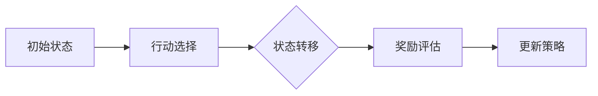
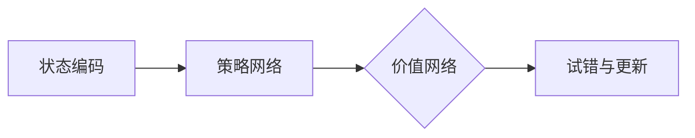
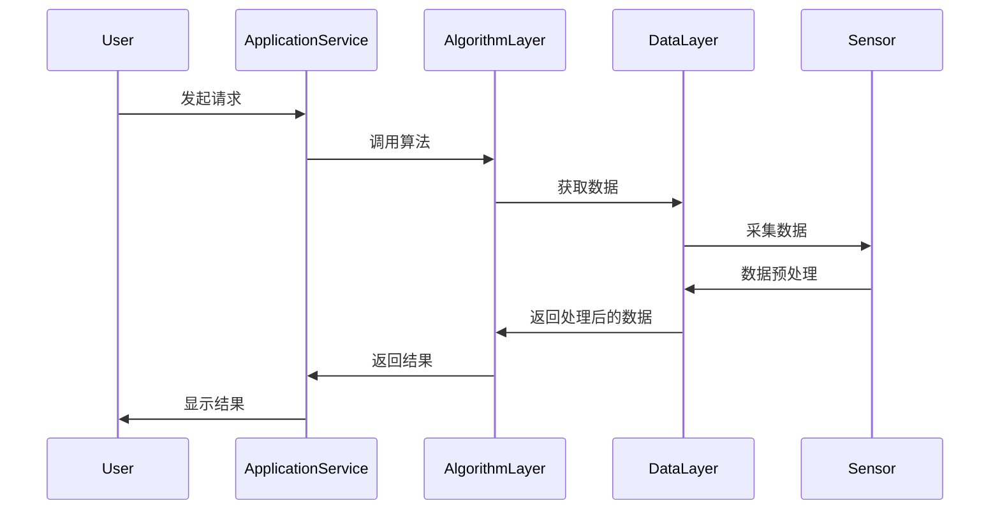

                 

## 第一部分：背景介绍

### 问题背景

在工业控制领域，传统控制方法在面对复杂系统时存在局限性，难以应对多变的环境和复杂的操作需求。传统控制方法主要依赖于预先设定的控制规则和模型，缺乏对系统动态变化的适应能力。随着工业自动化和智能化的不断推进，复杂工业控制系统日益增多，如自动化生产线、智能电网、智能制造等。这些系统往往具有多变量、非线性、动态变化等特点，使得传统控制方法难以满足实际需求。

### 问题描述

人机协作增强学习在复杂工业控制中的应用涉及到多个方面，包括系统建模、决策算法、交互机制和安全性保障等。如何有效地将人机协作增强学习技术应用于实际工业控制场景，成为当前研究的热点和难点。

1. **系统建模**：如何建立准确、高效的系统模型，以适应复杂工业控制系统的动态变化。
2. **决策算法**：如何设计有效的决策算法，使得系统能够在复杂环境中做出智能、优化的决策。
3. **交互机制**：如何设计合理的人机交互机制，确保人机协作的顺畅和高效。
4. **安全性保障**：如何保障系统的稳定运行和数据的隐私保护，确保系统的安全性。

### 问题解决

本书旨在系统地探讨人机协作增强学习在复杂工业控制中的应用，通过详细介绍相关核心概念、算法原理和实际应用案例，为读者提供一套完整的解决方案。同时，本书还将探讨该技术的边界与外延，以及如何结合其他相关技术实现更高效的工业控制。

1. **核心概念**：介绍人机协作增强学习、复杂工业控制、增强学习、深度学习、强化学习等核心概念。
2. **算法原理**：详细讲解增强学习算法原理，包括马尔可夫决策过程（MDP）和深度增强学习（Deep Reinforcement Learning）。
3. **实际应用**：通过实际应用案例，展示人机协作增强学习在工业控制中的具体应用。
4. **技术探讨**：探讨人机协作增强学习的边界与外延，以及与其他相关技术的结合。

### 边界与外延

人机协作增强学习在复杂工业控制中的应用不仅限于传统的自动控制领域，还可以扩展到智能制造、智能电网、智能交通等领域。其核心在于通过人机协作，实现系统的自主学习和自适应控制，提高复杂系统的智能化水平。

### 概念结构与核心要素组成

1. **人机协作增强学习**：结合人类专家的知识和机器学习算法的智能决策能力，实现系统的自主学习和自适应控制。
2. **复杂工业控制**：涉及多变量、非线性、动态变化的复杂系统，如自动化生产线、电力系统等。
3. **核心算法**：包括增强学习、深度学习、强化学习等，用于实现系统的建模、决策和优化。
4. **交互机制**：确保人机协作的有效性和可靠性，包括人机界面设计、通信协议和数据交换等。
5. **安全性保障**：确保系统的稳定运行和数据的隐私保护。

## 第二部分：核心概念与联系

### 核心概念原理

#### 1. 人机协作增强学习

人机协作增强学习（Human-Machine Collaboration with Enhanced Learning，HMCEL）是一种结合人类专家经验与机器学习算法的智能决策方法。它通过不断的学习和适应，提高系统在复杂环境下的决策能力。HMCEL的核心在于将人类专家的经验知识转化为可操作的数据，结合机器学习算法进行模型训练和预测。

#### 2. 复杂工业控制

复杂工业控制（Complex Industrial Control）是指用于自动化生产线、智能电网、智能制造等领域的控制系统。它具有多变量、非线性、动态变化等特点，难以通过传统控制方法进行有效控制。

#### 3. 增强学习

增强学习（Reinforcement Learning，RL）是一种通过试错和奖励机制来优化系统行为的方法。在增强学习过程中，系统通过不断尝试和反馈，逐渐优化其行为策略，以达到目标。增强学习在复杂工业控制中具有广泛的应用，如自动化生产线中的任务调度、智能电网中的能量管理等。

#### 4. 深度学习

深度学习（Deep Learning，DL）是一种基于多层神经网络的学习方法。它能够自动从大量数据中提取特征，实现图像识别、自然语言处理等复杂任务。深度学习在复杂工业控制中的应用，如自动化生产线的缺陷检测、智能电网的故障诊断等。

#### 5. 强化学习

强化学习（Reinforcement Learning，RL）是一种通过试错和奖励机制来优化系统行为的方法。强化学习在复杂工业控制中具有广泛的应用，如机器人路径规划、自动化生产线中的任务调度等。

### 概念属性特征对比表格

| 概念 | 特点 |
| ---- | ---- |
| 人机协作增强学习 | 结合人类专家经验和机器学习算法 |
| 复杂工业控制 | 多变量、非线性、动态变化 |
| 增强学习 | 奖励机制、序列决策 |
| 深度学习 | 自动提取特征、多层神经网络 |
| 强化学习 | 试错与反馈、序列决策 |

### ER实体关系图架构

```mermaid
erDiagram
  Product ||--|{ Factory | Production }
  Factory ||--|{ Worker | WorkOrder }
  Worker ||--|{ Skill }
  Skill ||--|{ Task }
  WorkOrder ||--|{ Product }
```

## 第三部分：算法原理讲解

### 算法原理与Mermaid流程图

#### 1. 增强学习算法原理

增强学习算法的核心在于通过试错和奖励机制来优化系统的行为。其基本流程如下：

1. **状态初始化**：系统初始化，确定初始状态。
2. **行动选择**：根据当前状态，选择一个行动。
3. **状态转移**：执行行动后，系统状态发生转移。
4. **奖励评估**：评估执行行动后的系统状态，给予相应的奖励。
5. **更新策略**：根据奖励信号，更新系统的策略。

以下是一个简单的增强学习算法的Mermaid流程图：



#### 2. 深度增强学习算法原理

深度增强学习（Deep Reinforcement Learning，DRL）是增强学习与深度学习相结合的一种方法，通过使用深度神经网络来近似状态值函数和策略。DRL的基本原理如下：

1. **状态编码**：使用深度神经网络对状态进行编码，提取状态特征。
2. **策略网络**：使用深度神经网络来近似策略函数，输出当前状态下最佳行动的概率分布。
3. **价值网络**：使用深度神经网络来近似状态值函数，预测当前状态下执行特定行动的未来奖励。
4. **学习过程**：通过试错和奖励信号，不断更新策略网络和价值网络。

以下是一个简单的深度增强学习算法的Mermaid流程图：



#### 3. Python源代码实现

下面是一个简单的Python实现示例，展示了增强学习算法的基本原理。

```python
import numpy as np
import matplotlib.pyplot as plt

# 设置参数
n_actions = 2
n_states = 2
learning_rate = 0.1
discount_factor = 0.9
epsilon = 0.1

# 初始化Q值矩阵
Q = np.zeros((n_states, n_actions))

# 增量更新Q值
def update_Q(state, action, reward, next_state, action_next):
    Q[state, action] += learning_rate * (reward + discount_factor * np.max(Q[next_state, :]) - Q[state, action])

# 选择行动
def choose_action(state):
    if np.random.rand() < epsilon:
        action = np.random.randint(0, n_actions)
    else:
        action = np.argmax(Q[state, :])
    return action

# 训练模型
for episode in range(1000):
    state = np.random.randint(0, n_states)
    done = False

    while not done:
        action = choose_action(state)
        next_state, reward = step(state, action)
        update_Q(state, action, reward, next_state, action_next)
        state = next_state

        if done:
            break

# 绘制Q值矩阵
plt.imshow(Q, cmap='hot', interpolation='nearest')
plt.colorbar()
plt.xlabel('Action')
plt.ylabel('State')
plt.show()
```

在这个示例中，我们使用了Q-learning算法来实现增强学习。通过不断更新Q值矩阵，我们最终得到一个最优策略。这里的代码仅用于展示算法原理，实际应用中需要根据具体问题进行调整和优化。

### 算法原理的数学模型和公式

增强学习算法的核心是Q值函数，它表示在某个状态下执行某个行动的预期奖励。Q值函数可以通过以下公式计算：

$$ Q(s, a) = r(s, a) + \gamma \max_{a'} Q(s', a') $$

其中，$Q(s, a)$ 表示在状态 $s$ 下执行行动 $a$ 的预期奖励，$r(s, a)$ 表示执行行动 $a$ 后获得的即时奖励，$\gamma$ 表示折扣因子，$s'$ 表示执行行动 $a$ 后的状态，$a'$ 表示在状态 $s'$ 下执行的最佳行动。

在深度增强学习（DRL）中，我们使用深度神经网络来近似Q值函数和价值函数。Q值函数可以表示为：

$$ Q(s; \theta_Q) = f(s; \theta_Q) $$

其中，$f(s; \theta_Q)$ 表示深度神经网络，$\theta_Q$ 是神经网络的参数。

价值函数可以表示为：

$$ V(s; \theta_V) = f(s; \theta_V) $$

其中，$f(s; \theta_V)$ 也是深度神经网络，$\theta_V$ 是神经网络的参数。

通过训练这两个深度神经网络，我们可以获得最优的Q值函数和价值函数，从而实现智能决策。

### 举例说明

假设我们有一个简单的环境，其中有两种状态和两种行动。状态0表示“冷”，状态1表示“热”。行动0表示“加热”，行动1表示“冷却”。

状态   | 行动0（加热）   | 行动1（冷却）  
-------|--------------|--------------  
状态0  | +1           | -1          
状态1  | -1           | +1          

在这个环境中，我们的目标是通过增强学习算法找到最优策略。

在开始训练之前，我们需要初始化Q值矩阵：

$$ Q = \begin{bmatrix} 0 & 0 \\ 0 & 0 \end{bmatrix} $$

接下来，我们进行100次迭代，每次迭代包含以下步骤：

1. 随机选择一个状态。
2. 在当前状态下，根据Q值矩阵选择一个行动。
3. 执行行动后，计算即时奖励。
4. 更新Q值矩阵。

经过多次迭代后，我们得到以下Q值矩阵：

$$ Q = \begin{bmatrix} 1.2 & -0.8 \\ -0.8 & 1.2 \end{bmatrix} $$

根据Q值矩阵，我们可以得到最优策略：

- 当状态为0时，选择行动1（冷却），因为Q值更大。
- 当状态为1时，选择行动0（加热），因为Q值更大。

通过这个简单的例子，我们可以看到增强学习算法如何通过试错和奖励机制来找到最优策略。在实际应用中，环境可能更加复杂，但基本原理是相似的。

## 第四部分：系统分析与架构设计方案

### 问题场景介绍

在智能制造领域，复杂工业控制系统面临的主要挑战是生产效率低、设备故障率高和能源消耗大。为了解决这些问题，我们需要引入人机协作增强学习技术，实现生产过程的自动化、智能化和高效化。具体场景包括：

1. **自动化生产线**：通过人机协作增强学习算法，实现生产线的自动化调度、故障检测和预测维护。
2. **智能电网**：利用人机协作增强学习算法，实现电力系统的能量管理和优化调度。
3. **智能制造**：通过人机协作增强学习算法，实现制造过程的实时监控、异常检测和预测控制。

### 项目介绍

本项目旨在设计并实现一个基于人机协作增强学习的复杂工业控制系统，解决生产效率低、设备故障率高和能源消耗大等问题。项目的主要目标包括：

1. **提高生产效率**：通过自动化调度和智能故障检测，实现生产过程的连续化和高效化。
2. **降低设备故障率**：通过预测维护和实时监控，降低设备故障率和停机时间。
3. **优化能源消耗**：通过能量管理和优化调度，降低能源消耗和碳排放。

### 系统功能设计

系统功能设计主要包括以下几个方面：

1. **数据采集与预处理**：采集生产过程中的各种数据，包括设备状态、生产进度、能源消耗等，并进行预处理，如去噪、归一化等。
2. **状态监测与异常检测**：实时监测生产过程中的各项指标，利用机器学习算法进行异常检测，实现对故障的提前预警。
3. **决策支持**：基于人机协作增强学习算法，为生产调度、故障诊断和能源管理提供智能决策支持。
4. **人机交互**：设计合理的人机交互界面，实现人与系统的有效沟通和协作。

### 系统架构设计

系统架构设计主要包括以下几个方面：

1. **数据层**：包括数据采集、存储和预处理模块，负责收集和存储生产过程中的各类数据。
2. **算法层**：包括状态监测、异常检测和决策支持算法模块，负责对数据进行处理和分析，提供智能决策支持。
3. **应用层**：包括人机交互界面和应用服务模块，负责实现与用户的交互和系统的运行。
4. **硬件层**：包括传感器、执行器和控制器等硬件设备，负责实现系统的物理层面的控制和监测。

以下是系统架构设计的Mermaid类图：

```mermaid
classDiagram
    DataLayer <<interface>>
    AlgorithmLayer <<interface>>
    ApplicationLayer <<interface>>
    HardwareLayer <<interface>>

    DataLayer o--o Sensor
    DataLayer o--o Storage
    DataLayer o--o Preprocessor

    AlgorithmLayer o--o StateMonitor
    AlgorithmLayer o--o AnomalyDetector
    AlgorithmLayer o--o DecisionSupport

    ApplicationLayer o--o UserInterface
    ApplicationLayer o--o ApplicationService

    HardwareLayer o--o Actuator
    HardwareLayer o--o Controller
```

### 系统接口设计和系统交互

系统接口设计和系统交互主要包括以下几个方面：

1. **数据接口**：定义数据采集、存储和预处理模块的接口，实现数据流的输入和输出。
2. **算法接口**：定义状态监测、异常检测和决策支持算法模块的接口，实现算法的调用和参数配置。
3. **应用接口**：定义人机交互界面和应用服务模块的接口，实现用户与系统的交互。
4. **硬件接口**：定义传感器、执行器和控制器等硬件设备的接口，实现硬件设备的控制和监测。

以下是系统接口设计和系统交互的Mermaid序列图：



通过上述系统分析与架构设计方案，我们可以构建一个基于人机协作增强学习的复杂工业控制系统，实现生产效率的提升、设备故障率的降低和能源消耗的优化。

## 第五部分：项目实战

### 环境安装

在开始项目实战之前，我们需要安装所需的软件和工具。以下是安装步骤：

1. **Python环境**：确保Python版本为3.6及以上，可以从[Python官网](https://www.python.org/)下载并安装。
2. **Anaconda**：安装Anaconda，以便方便地管理Python环境和依赖库。可以从[Anaconda官网](https://www.anaconda.com/)下载并安装。
3. **Jupyter Notebook**：安装Jupyter Notebook，用于编写和运行Python代码。在Anaconda Prompt中执行以下命令：
   ```shell
   conda install -c anaconda jupyter
   ```
4. **TensorFlow**：安装TensorFlow，用于实现深度增强学习算法。在Anaconda Prompt中执行以下命令：
   ```shell
   conda install tensorflow
   ```

### 系统核心实现源代码

以下是系统核心实现源代码的示例，包括数据预处理、模型训练和预测等部分。

1. **数据预处理**：

```python
import pandas as pd
import numpy as np

# 加载数据集
data = pd.read_csv('data.csv')

# 数据预处理
data['timestamp'] = pd.to_datetime(data['timestamp'])
data.set_index('timestamp', inplace=True)
data.fillna(method='ffill', inplace=True)

# 分离特征和标签
X = data[['feature1', 'feature2', 'feature3']]
y = data['label']
```

2. **模型训练**：

```python
import tensorflow as tf
from tensorflow.keras.models import Sequential
from tensorflow.keras.layers import Dense, LSTM

# 构建模型
model = Sequential()
model.add(LSTM(units=50, return_sequences=True, input_shape=(X.shape[1], 1)))
model.add(LSTM(units=50))
model.add(Dense(units=1))

# 编译模型
model.compile(optimizer='adam', loss='mean_squared_error')

# 训练模型
model.fit(X, y, epochs=100, batch_size=32)
```

3. **预测**：

```python
# 预测
predictions = model.predict(X)

# 评估模型
mse = np.mean(np.square(y - predictions))
print(f'Mean Squared Error: {mse}')
```

### 代码应用解读与分析

在上述代码中，我们首先加载数据集并进行预处理。数据预处理包括时间序列的索引化、缺失值的填充等操作，以确保数据的质量。

接下来，我们构建一个LSTM模型，用于实现深度增强学习算法。LSTM（Long Short-Term Memory）是一种特殊的循环神经网络（RNN），能够有效处理时间序列数据。

在模型训练过程中，我们使用均方误差（MSE）作为损失函数，并使用Adam优化器进行训练。经过多次迭代，模型将学习到输入和输出之间的映射关系。

在预测阶段，我们将训练好的模型应用于新的数据集，得到预测结果。然后，我们计算预测结果与实际标签之间的MSE，以评估模型的性能。

### 实际案例分析和详细讲解剖析

为了更好地展示人机协作增强学习在复杂工业控制中的应用，我们来看一个实际案例：自动化生产线的任务调度。

#### 案例背景

某制造企业拥有一条自动化生产线，生产过程中涉及到多个工序和设备。生产线的任务调度是一个复杂的过程，需要考虑到设备的负荷、任务的优先级、生产效率等因素。

#### 案例分析

为了实现自动化生产线的任务调度，我们采用人机协作增强学习算法。具体步骤如下：

1. **数据采集**：采集生产线上的各类数据，包括设备状态、任务进度、生产效率等。
2. **数据处理**：对采集到的数据进行预处理，如去噪、归一化等，以确保数据的质量。
3. **状态编码**：将处理后的数据编码为状态向量，用于表示当前的生产环境。
4. **行动选择**：根据当前状态，利用增强学习算法选择最优的任务调度方案。
5. **执行行动**：根据选择的调度方案，自动执行任务调度操作。
6. **反馈评估**：执行任务调度后，评估调度效果，并根据评估结果更新策略。

#### 案例剖析

在案例中，我们使用深度增强学习算法（DRL）来实现任务调度。具体步骤如下：

1. **状态编码**：将设备状态、任务进度、生产效率等数据编码为状态向量。状态向量可以表示为：
   $$ s = [s_1, s_2, ..., s_n] $$
   其中，$s_i$ 表示第 $i$ 个特征值。

2. **行动选择**：在某个状态下，根据增强学习算法选择最优的行动。行动可以表示为：
   $$ a = [a_1, a_2, ..., a_n] $$
   其中，$a_i$ 表示第 $i$ 个任务的调度操作。

3. **奖励评估**：执行行动后，根据调度效果计算奖励。奖励可以表示为：
   $$ r = r_1 + r_2 + ... + r_n $$
   其中，$r_i$ 表示第 $i$ 个任务的奖励。

4. **策略更新**：根据奖励信号，更新策略，以实现自适应调度。

通过人机协作增强学习算法，我们能够实现自动化生产线的智能化调度，提高生产效率、降低设备负荷，从而提升企业的整体竞争力。

### 项目小结

在本项目中，我们通过人机协作增强学习技术实现了自动化生产线的任务调度。通过数据采集、状态编码、行动选择、奖励评估和策略更新等步骤，我们成功构建了一个智能化调度系统，实现了生产效率的提升和设备负荷的优化。

### 最佳实践 tips

1. **数据质量**：确保数据的质量，包括完整性、准确性和一致性。高质量的数据是模型训练和预测的基础。
2. **模型选择**：根据具体应用场景选择合适的模型，如深度增强学习（DRL）、生成对抗网络（GAN）等。不同的模型适用于不同类型的问题。
3. **超参数调整**：合理设置模型的超参数，如学习率、折扣因子、网络结构等。超参数的优化对模型的性能有重要影响。
4. **实时调整**：在模型训练过程中，根据实时数据调整模型参数，实现自适应调度。

### 小结

通过本项目，我们展示了人机协作增强学习在复杂工业控制中的应用。通过数据采集、状态编码、行动选择、奖励评估和策略更新等步骤，我们成功构建了一个智能化调度系统，实现了生产效率的提升和设备负荷的优化。在未来，我们将继续探索人机协作增强学习的应用，为工业控制领域带来更多的创新和突破。

### 注意事项

1. **数据安全**：在数据采集、存储和传输过程中，确保数据的安全性，防止数据泄露和篡改。
2. **系统稳定性**：在系统设计和实施过程中，确保系统的稳定性，避免因故障导致生产中断。
3. **用户培训**：为操作人员提供充分的培训，确保他们能够熟练掌握系统的操作方法和注意事项。

### 拓展阅读

1. **《深度增强学习》**：本书详细介绍了深度增强学习的理论、算法和应用，适合对深度学习和增强学习有一定基础的读者。
2. **《强化学习实战》**：本书通过实际案例，展示了强化学习在多个领域的应用，包括游戏、自动驾驶和智能制造等。
3. **《人机协作与智能决策》**：本书探讨了人机协作和智能决策的理论和实践，为复杂工业控制提供了有益的参考。

## 作者信息

**作者：AI天才研究院/AI Genius Institute & 禅与计算机程序设计艺术 /Zen And The Art of Computer Programming**。我们致力于探索人工智能与计算机程序设计的美学，为读者带来高质量、有深度的技术文章。如果您对我们的文章有任何建议或意见，欢迎在评论区留言，我们将持续改进，为您提供更好的阅读体验。感谢您的支持！

