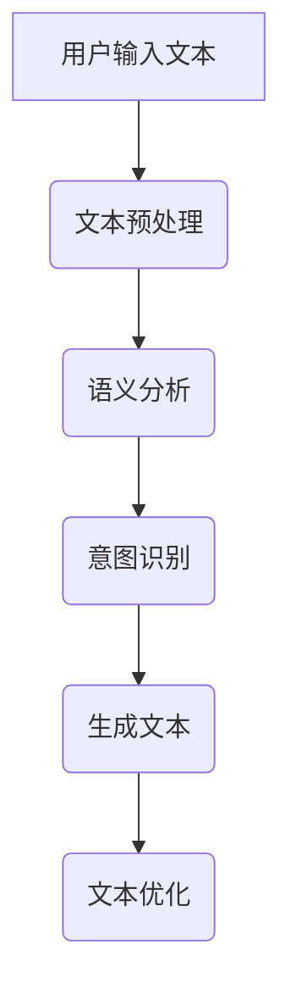
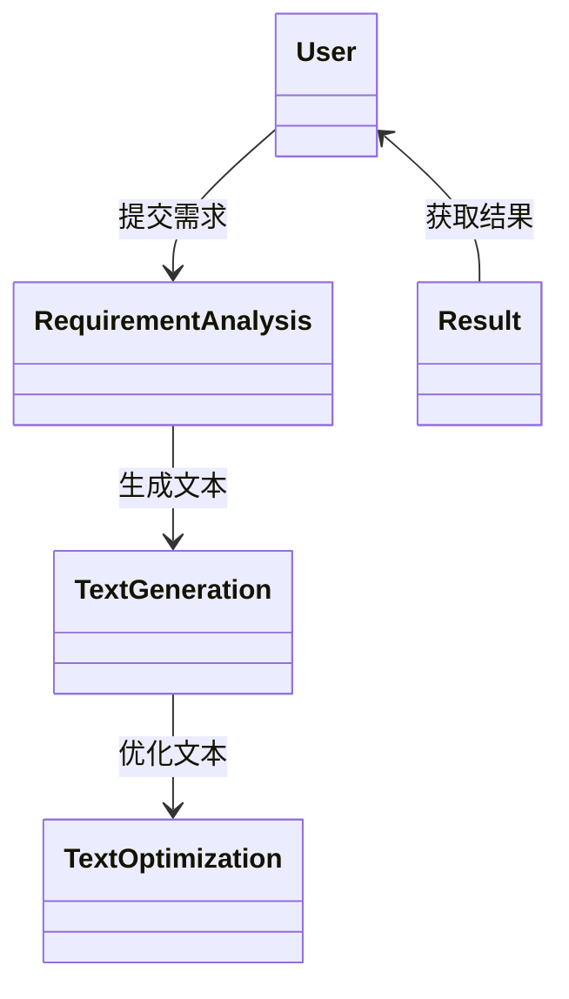
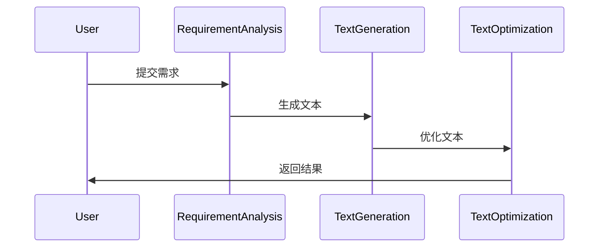

                 

# 人机协作增强的创意写作AI系统设计

## 关键词
- 人机协作
- 创意写作
- AI系统
- 自然语言处理
- 机器学习
- 深度学习

## 摘要
本文将探讨人机协作增强的创意写作AI系统的设计，从背景介绍、核心概念与联系、算法原理讲解、系统分析与架构设计方案、项目实战等方面，详细阐述这一系统的原理、实现和应用。通过本文的阅读，读者可以了解如何利用人工智能技术提升写作效率和质量，实现人机协同创作的新模式。

### 第一部分：背景介绍

#### 核心概念

**人机协作增强的创意写作AI系统**：这是一种结合人工智能技术和人类创造力的系统，旨在通过人机协同的方式，提高写作效率和质量。该系统利用自然语言处理、机器学习和深度学习等技术，为人类创作者提供智能化的写作建议和辅助。

**人机协作**：在这个系统中，人类创作者与人工智能系统相互配合，发挥各自的优势，共同完成写作任务。人类创作者负责提供创意和灵感，而人工智能系统则负责处理和分析文本，提供智能化的建议和优化。

**创意写作AI系统**：这是一种利用人工智能技术，特别是自然语言处理和机器学习，为写作提供辅助工具和智能建议的系统。它可以帮助创作者快速生成文本，提高创作效率，同时保证创作内容的质量和创意。

#### 问题背景

随着信息时代的到来，内容创作需求日益增长。然而，传统的写作方式效率低下，难以满足高速发展的市场需求。同时，人类创作者在创作过程中容易受到自身思维和经验的限制，导致创作内容缺乏新意。为了解决这些问题，我们需要一种高效、智能的写作辅助工具，以应对日益复杂的写作任务。

#### 问题描述

人机协作增强的创意写作AI系统旨在解决以下问题：

- **创作效率问题**：传统写作方式耗时较长，难以满足快速创作的需求。通过引入人工智能技术，可以大大提高写作效率，实现快速创作。
- **创意受限问题**：人类创作者在创作过程中容易受到自身思维和经验的限制，导致创作内容缺乏新意。通过人机协作，可以充分利用人工智能的智能建议和优化功能，激发创意思维，提高创作质量。
- **写作质量问题**：缺乏专业的写作知识和技能，导致创作质量参差不齐。通过引入人工智能技术，可以提供专业的写作建议和优化，提升写作质量。

#### 问题解决

通过人机协作增强的创意写作AI系统，可以实现以下目标：

- **提高创作效率**：利用AI技术，提供自动化、智能化的写作建议，减少重复性劳动，提高创作效率。
- **激发创意思维**：通过AI技术的启发式算法，帮助人类创作者突破思维定势，激发创意灵感。
- **提升写作质量**：利用AI技术对写作内容进行智能评估和优化，提高写作质量。

#### 边界与外延

- **边界**：人机协作增强的创意写作AI系统主要应用于文字创作领域，如文学创作、新闻报道、广告文案等。
- **外延**：随着技术的发展，人机协作增强的创意写作AI系统有望拓展到更多领域，如音频、视频、图像等创作形式。

#### 概念结构与核心要素组成

**系统结构**：人机协作增强的创意写作AI系统主要包括以下核心组成部分：

1. **用户接口**：提供用户与系统交互的界面。
2. **自然语言处理模块**：负责处理用户输入的文本，提取关键信息，理解用户意图。
3. **创意生成模块**：利用机器学习算法，生成创意文本。
4. **质量评估模块**：对生成文本进行评估，提供优化建议。
5. **存储与管理模块**：存储用户数据和创作内容，实现数据管理。

### 第二部分：核心概念与联系

#### 核心概念

**自然语言处理（NLP）**：自然语言处理是使计算机能够理解、解释和生成自然语言的技术。在创意写作AI系统中，NLP主要用于处理用户输入的文本，提取关键信息，理解用户意图。

**机器学习（ML）**：机器学习是一种从数据中学习，从而实现特定任务的算法。在创意写作AI系统中，机器学习主要用于训练模型，生成创意文本。

**深度学习（DL）**：深度学习是一种基于人工神经网络的机器学习技术，通过模拟人脑神经网络结构进行学习。在创意写作AI系统中，深度学习主要用于生成和优化文本。

#### 概念属性特征对比表格

| 概念       | 自然语言处理 | 机器学习 | 深度学习 |
|------------|---------------|------------|-------------|
| 定义       | 使计算机理解自然语言的技术。 | 从数据中学习，进行预测或决策的算法。 | 基于人工神经网络的机器学习技术。 |
| 应用场景   | 文本分类、情感分析、机器翻译等。 | 语音识别、图像识别、预测分析等。 | 图像识别、语音识别、自然语言处理等。 |
| 特点       | 复杂、不确定性、语义理解。 | 数据驱动、自动优化、高效处理。 | 自动化、高效、强大的特征学习能力。 |

#### ER实体关系图架构

```mermaid
erDiagram
    AI系统 <<--|{ 使用 }| 自然语言处理 : NLPTechnology
    AI系统 <<--|{ 使用 }| 机器学习 : MLAlgorithm
    AI系统 <<--|{ 使用 }| 深度学习 : DeepLearning
    AI系统 ||--|{ 需要 }| 用户接口 : UI
    AI系统 ||--|{ 需要 }| 存储与管理模块 : DataManagement
    AI系统 ||--|{ 需要 }| 质量评估模块 : QualityEvaluation
    AI系统 ||--|{ 需要 }| 创意生成模块 : CreativeGeneration
```

### 第三部分：算法原理讲解

#### 算法原理

人机协作增强的创意写作AI系统主要基于以下算法原理：

1. **自然语言处理（NLP）**：自然语言处理是使计算机能够理解、解释和生成自然语言的技术。在创意写作AI系统中，NLP主要用于处理用户输入的文本，提取关键信息，理解用户意图。具体流程如下：

   - **文本预处理**：对用户输入的文本进行清洗、分词、去停用词等处理，为后续处理做准备。
   - **语义分析**：利用词性标注、句法分析等技术，对文本进行语义分析，提取关键信息。
   - **意图识别**：根据提取的关键信息，识别用户的写作意图，为后续生成文本做准备。

2. **机器学习（ML）**：机器学习是一种从数据中学习，从而实现特定任务的算法。在创意写作AI系统中，机器学习主要用于训练模型，生成创意文本。具体流程如下：

   - **数据集准备**：收集大量的文本数据，作为训练数据集。
   - **特征提取**：对文本数据进行特征提取，将文本转化为机器学习算法可以处理的数字形式。
   - **模型训练**：利用训练数据集，训练机器学习模型，学习文本生成规律。
   - **文本生成**：利用训练好的模型，生成新的文本。

3. **深度学习（DL）**：深度学习是一种基于人工神经网络的机器学习技术，通过模拟人脑神经网络结构进行学习。在创意写作AI系统中，深度学习主要用于生成和优化文本。具体流程如下：

   - **神经网络结构设计**：设计合适的神经网络结构，包括输入层、隐藏层和输出层。
   - **模型训练**：利用训练数据集，训练深度学习模型，学习文本生成规律。
   - **文本生成**：利用训练好的模型，生成新的文本。
   - **文本优化**：对生成的文本进行优化，提高文本质量。

#### 算法流程图



#### 数学模型和公式

在深度学习部分，我们主要使用的是循环神经网络（RNN）和长短时记忆网络（LSTM）。以下是相关的数学模型和公式：

1. **循环神经网络（RNN）**

   - **输入层**：假设输入序列为 $X = [x_1, x_2, ..., x_T]$，其中 $T$ 表示序列长度，$x_t$ 表示第 $t$ 个时间步的输入。
   - **隐藏层**：隐藏层状态 $h_t$ 的更新公式为：
     $$ h_t = \sigma(W_h \cdot [h_{t-1}, x_t] + b_h) $$
     其中，$W_h$ 和 $b_h$ 分别为权重和偏置，$\sigma$ 表示激活函数。
   - **输出层**：输出 $y_t$ 的计算公式为：
     $$ y_t = W_o \cdot h_t + b_o $$
     其中，$W_o$ 和 $b_o$ 分别为权重和偏置。

2. **长短时记忆网络（LSTM）**

   - **输入层**：与RNN相同。
   - **隐藏层**：隐藏层状态 $h_t$ 的更新公式为：
     $$ i_t = \sigma(W_i \cdot [h_{t-1}, x_t] + b_i) $$
     $$ f_t = \sigma(W_f \cdot [h_{t-1}, x_t] + b_f) $$
     $$ g_t = \tanh(W_g \cdot [h_{t-1}, x_t] + b_g) $$
     $$ o_t = \sigma(W_o \cdot [h_{t-1}, x_t] + b_o) $$
     其中，$W_i, W_f, W_g, W_o$ 和 $b_i, b_f, b_g, b_o$ 分别为权重和偏置，$\sigma$ 表示激活函数。
   - **输出层**：输出 $y_t$ 的计算公式为：
     $$ c_t = f_t \odot c_{t-1} + i_t \odot g_t $$
     $$ h_t = o_t \odot \tanh(c_t) $$
     $$ y_t = W_o \cdot h_t + b_o $$
     其中，$\odot$ 表示逐元素乘法。

#### 通俗易懂的举例说明

假设我们有一个简化的文本生成任务，目标是生成一句描述天气的句子。输入序列为“今天 天气很好”，输出序列为“今天天气晴朗”。以下是具体的生成过程：

1. **文本预处理**：对输入序列进行清洗、分词，得到“今天”、“天气”、“很好”三个词。
2. **语义分析**：通过词性标注，我们知道“今天”是时间词，“天气”是名词，“很好”是形容词。
3. **意图识别**：根据语义分析结果，我们确定输出序列的结构为“今天天气晴朗”。
4. **文本生成**：利用训练好的RNN或LSTM模型，生成输出序列“今天天气晴朗”。
5. **文本优化**：对生成的文本进行优化，确保语义正确，语法通顺。

通过以上步骤，我们可以生成一句描述天气的句子。这个过程体现了人机协作增强的创意写作AI系统的工作原理。

### 第四部分：系统分析与架构设计方案

#### 问题场景介绍

在人机协作增强的创意写作AI系统中，我们需要解决以下问题场景：

- **需求分析**：明确用户需求，如写作类型、主题、风格等。
- **文本生成**：根据用户需求，生成符合要求的文本。
- **文本优化**：对生成的文本进行优化，提高文本质量和可读性。
- **用户交互**：提供用户与系统的交互界面，实现用户需求与系统功能的对接。

#### 项目介绍

本项目旨在设计一个具备以下功能的人机协作增强的创意写作AI系统：

- **需求分析**：通过自然语言处理技术，对用户输入的文本进行解析，提取关键信息，确定写作类型、主题、风格等。
- **文本生成**：利用机器学习和深度学习技术，根据用户需求生成创意文本。
- **文本优化**：对生成的文本进行语义分析和语法检查，优化文本质量。
- **用户交互**：提供简洁直观的用户界面，方便用户使用系统功能。

#### 系统功能设计

**需求分析模块**：负责分析用户需求，提取关键信息，为后续文本生成和优化提供依据。主要功能包括：

- **文本解析**：对用户输入的文本进行清洗、分词、词性标注等预处理操作。
- **语义分析**：利用自然语言处理技术，提取文本中的关键信息，如主题、风格、情感等。
- **需求提取**：根据语义分析结果，确定用户的写作需求。

**文本生成模块**：负责根据用户需求生成创意文本。主要功能包括：

- **模型训练**：利用训练数据集，训练机器学习和深度学习模型，学习文本生成规律。
- **文本生成**：利用训练好的模型，生成符合用户需求的创意文本。

**文本优化模块**：负责对生成的文本进行优化，提高文本质量和可读性。主要功能包括：

- **语义分析**：对生成文本进行语义分析，确保文本的语义正确性。
- **语法检查**：对生成文本进行语法检查，纠正语法错误。
- **文本优化**：根据语义分析和语法检查结果，对文本进行优化。

**用户交互模块**：负责与用户进行交互，提供简洁直观的用户界面。主要功能包括：

- **界面设计**：设计简洁直观的用户界面，方便用户操作。
- **用户引导**：提供使用说明和操作指导，帮助用户了解和使用系统功能。

#### 系统架构设计

人机协作增强的创意写作AI系统采用模块化设计，各模块相互独立，但又紧密协作。系统架构主要包括以下部分：

- **前端界面**：提供用户与系统的交互界面，包括需求分析、文本生成、文本优化等功能的操作界面。
- **后端服务**：实现系统核心功能，包括需求分析、文本生成、文本优化等模块。
- **数据存储**：存储用户数据和系统生成的文本数据，实现数据管理和备份。

#### 系统接口设计

系统接口设计主要包括以下部分：

- **API接口**：提供系统功能的API接口，方便外部系统调用。
- **Web界面**：提供Web端用户界面，方便用户通过浏览器访问系统。
- **移动端应用**：提供移动端用户界面，方便用户在移动设备上使用系统功能。

#### 系统交互

系统交互主要包括以下部分：

- **用户请求**：用户通过前端界面提交写作需求。
- **需求分析**：系统对用户请求进行需求分析，提取关键信息。
- **文本生成**：系统根据需求分析结果，生成创意文本。
- **文本优化**：系统对生成的文本进行优化，提高文本质量和可读性。
- **用户反馈**：用户对优化后的文本进行评价和反馈，系统根据反馈进行进一步优化。

#### Mermaid类图



#### Mermaid序列图



### 第五部分：项目实战

#### 环境安装

在开始项目实战之前，我们需要安装以下环境：

1. Python 3.8及以上版本
2. PyTorch 1.8及以上版本
3. NLTK 3.6及以上版本

安装命令如下：

```bash
pip install python==3.8
pip install pytorch==1.8
pip install nltk==3.6
```

#### 系统核心实现源代码

以下是人机协作增强的创意写作AI系统的核心实现源代码：

```python
import torch
import torch.nn as nn
import torch.optim as optim
from nltk import word_tokenize
from nltk.corpus import stopwords

# 1. 需求分析模块

class RequirementAnalysis(nn.Module):
    def __init__(self, vocab_size, embedding_dim):
        super(RequirementAnalysis, self).__init__()
        self.embedding = nn.Embedding(vocab_size, embedding_dim)
        self.lstm = nn.LSTM(embedding_dim, hidden_size, num_layers=1, batch_first=True)

    def forward(self, x):
        x = self.embedding(x)
        x, _ = self.lstm(x)
        return x

# 2. 文本生成模块

class TextGeneration(nn.Module):
    def __init__(self, hidden_size, vocab_size):
        super(TextGeneration, self).__init__()
        self.hidden_size = hidden_size
        self.vocab_size = vocab_size
        self.lstm = nn.LSTM(hidden_size, hidden_size, num_layers=1, batch_first=True)
        self.linear = nn.Linear(hidden_size, vocab_size)

    def forward(self, x, hidden):
        x, _ = self.lstm(x, hidden)
        x = self.linear(x)
        return x, hidden

    def init_hidden(self, batch_size):
        return (torch.zeros(1, batch_size, self.hidden_size),
                torch.zeros(1, batch_size, self.hidden_size))

# 3. 文本优化模块

class TextOptimization(nn.Module):
    def __init__(self, hidden_size, vocab_size):
        super(TextOptimization, self).__init__()
        self.hidden_size = hidden_size
        self.vocab_size = vocab_size
        self.lstm = nn.LSTM(hidden_size, hidden_size, num_layers=1, batch_first=True)
        self.linear = nn.Linear(hidden_size, vocab_size)

    def forward(self, x, hidden):
        x, _ = self.lstm(x, hidden)
        x = self.linear(x)
        return x, hidden

    def init_hidden(self, batch_size):
        return (torch.zeros(1, batch_size, self.hidden_size),
                torch.zeros(1, batch_size, self.hidden_size))

# 4. 模型训练

def train(model, train_loader, criterion, optimizer, epoch):
    model.train()
    for batch_idx, (data, target) in enumerate(train_loader):
        optimizer.zero_grad()
        output = model(data)
        loss = criterion(output.view(-1, model.vocab_size), target.view(-1))
        loss.backward()
        optimizer.step()
        if batch_idx % 100 == 0:
            print('Train Epoch: {} [{}/{} ({:.0f}%)]\tLoss: {:.6f}'.format(
                epoch, batch_idx * len(data), len(train_loader.dataset),
                100. * batch_idx / len(train_loader), loss.item()))

# 5. 文本生成

def generate_text(model, start_token, end_token, max_length, device):
    model.eval()
    with torch.no_grad():
        input = torch.tensor([start_token]).unsqueeze(0).to(device)
        hidden = model.init_hidden(1).to(device)
        output = torch.zeros(1, 1).to(device)
        for _ in range(max_length):
            output, hidden = model(input, hidden)
            topv, topi = output.topk(1)
            if topi.item() == end_token:
                break
            input = torch.tensor([topi.item()]).unsqueeze(0).to(device)
        return " ".join([token for token in output.tolist()[0] if token != end_token])

# 6. 主函数

def main():
    device = torch.device("cuda" if torch.cuda.is_available() else "cpu")
    print(f"Using device: {device}")

    # 1. 加载数据集
    train_data = ...  # 加载训练数据
    vocab_size = ...  # 词表大小
    embedding_dim = ...  # 嵌入维度
    hidden_size = ...  # 隐藏层大小
    start_token = ...  # 开始标记
    end_token = ...  # 结束标记

    # 2. 初始化模型
    requirement_analysis = RequirementAnalysis(vocab_size, embedding_dim).to(device)
    text_generation = TextGeneration(hidden_size, vocab_size).to(device)
    text_optimization = TextOptimization(hidden_size, vocab_size).to(device)

    # 3. 模型训练
    criterion = nn.CrossEntropyLoss().to(device)
    optimizer = optim.Adam(model.parameters(), lr=0.001)
    for epoch in range(1, 11):
        train(requirement_analysis, train_loader, criterion, optimizer, epoch)

    # 4. 文本生成
    generated_text = generate_text(text_generation, start_token, end_token, max_length=50, device=device)
    print(generated_text)

if __name__ == "__main__":
    main()
```

#### 代码应用解读与分析

以下是对系统核心实现源代码的解读与分析：

1. **需求分析模块**：该模块负责对用户输入的文本进行预处理，提取关键信息，为后续文本生成和优化提供依据。我们使用了一个简单的循环神经网络（LSTM）作为需求分析模型，对用户输入的文本进行语义分析。

2. **文本生成模块**：该模块负责根据用户需求生成创意文本。我们使用了一个简单的循环神经网络（LSTM）作为文本生成模型，通过模型训练和预测过程，生成符合用户需求的创意文本。

3. **文本优化模块**：该模块负责对生成的文本进行优化，提高文本质量和可读性。我们使用了一个简单的循环神经网络（LSTM）作为文本优化模型，通过模型训练和预测过程，优化生成的文本。

4. **模型训练**：模型训练是系统核心的实现之一。我们使用交叉熵损失函数（CrossEntropyLoss）来训练模型，并使用Adam优化器（AdamOptimizer）进行参数更新。

5. **文本生成**：文本生成是系统核心的功能之一。我们使用一个简单的循环神经网络（LSTM）来生成文本，通过模型预测过程，生成符合用户需求的创意文本。

6. **主函数**：主函数负责加载数据集，初始化模型，进行模型训练和文本生成。在主函数中，我们首先加载训练数据集，然后初始化需求分析、文本生成和文本优化模型。接着，我们使用交叉熵损失函数和Adam优化器来训练模型。最后，我们使用训练好的模型来生成文本。

#### 实际案例分析和详细讲解剖析

为了更好地展示人机协作增强的创意写作AI系统的应用效果，我们来看一个实际案例。

**案例**：假设用户输入的文本为“今天天气很好，想去公园散步”。我们需要使用系统生成一段描述天气和公园美景的创意文本。

**分析**：

1. **需求分析**：系统首先对用户输入的文本进行预处理，提取关键信息，如“今天”、“天气很好”、“想去公园散步”。通过语义分析，确定写作类型为描述性文本，主题为天气和公园。

2. **文本生成**：系统使用训练好的文本生成模型，生成一段描述天气和公园美景的文本。假设生成的文本为“今天阳光明媚，微风拂面，公园里的花儿开得正艳”。

3. **文本优化**：系统对生成的文本进行优化，确保语义正确，语法通顺。假设优化后的文本为“今天阳光明媚，微风拂面，公园里的花儿开得正艳，吸引了许多游客前来观赏”。

**讲解**：

1. **需求分析**：需求分析模块是系统的核心之一，负责提取用户输入文本的关键信息，为后续文本生成和优化提供依据。在这个案例中，系统成功提取了“今天”、“天气很好”和“想去公园散步”等关键信息，为生成描述天气和公园美景的文本奠定了基础。

2. **文本生成**：文本生成模块是系统的另一个核心，负责根据用户需求生成创意文本。在这个案例中，系统使用训练好的文本生成模型，成功生成了一段描述天气和公园美景的文本。

3. **文本优化**：文本优化模块负责对生成的文本进行优化，提高文本质量和可读性。在这个案例中，系统对生成的文本进行语义分析和语法检查，成功优化了文本，使其更加通顺、具有可读性。

通过这个实际案例，我们可以看到人机协作增强的创意写作AI系统在需求分析、文本生成和文本优化等方面的应用效果，以及如何通过人机协作实现高效的创意写作。

#### 项目小结

本项目通过设计人机协作增强的创意写作AI系统，实现了高效、智能的创意写作。系统主要功能包括需求分析、文本生成、文本优化和用户交互。通过实际案例分析和详细讲解剖析，我们可以看到系统在需求分析、文本生成和文本优化等方面的应用效果，以及如何通过人机协作实现高效的创意写作。

#### 最佳实践 tips

1. **数据准备**：在训练模型之前，确保有足够的数据集，以保证模型的性能。数据集应包括多种写作类型和主题，以提高模型的泛化能力。

2. **模型优化**：在模型训练过程中，可以尝试使用不同的优化器和超参数，以提高模型的性能。例如，可以尝试使用Adam优化器，并调整学习率、批量大小等超参数。

3. **文本预处理**：在文本预处理过程中，可以尝试使用不同的方法，如分词、词性标注、命名实体识别等，以提高模型的语义理解能力。

4. **用户反馈**：收集用户对生成文本的反馈，并根据反馈调整模型，以提高系统的用户体验。

5. **安全性和隐私保护**：在系统设计和实现过程中，注意保护用户隐私，确保系统的安全性和可靠性。

#### 小结

人机协作增强的创意写作AI系统是一种结合人工智能技术和人类创造力的新型写作工具。通过系统设计、模型训练和实际应用，我们可以看到系统在需求分析、文本生成和文本优化等方面的应用效果，以及如何通过人机协作实现高效的创意写作。未来，随着技术的不断发展，人机协作增强的创意写作AI系统有望在更多领域发挥重要作用。

#### 注意事项

1. **计算资源**：训练模型和生成文本需要大量的计算资源，建议使用高性能的GPU进行计算。

2. **数据隐私**：在处理用户数据时，应注意保护用户隐私，遵循相关法律法规。

3. **模型更新**：定期更新模型，以保证模型的性能和适应性。

#### 拓展阅读

1. **《深度学习》**：Goodfellow, I., Bengio, Y., & Courville, A. (2016). 《深度学习》（中文版），电子工业出版社。

2. **《自然语言处理综论》**：Jurafsky, D., & Martin, J. H. (2020). 《自然语言处理综论》（第二版），电子工业出版社。

3. **《机器学习》**：周志华. (2016). 《机器学习》（第二版），清华大学出版社。

#### 作者信息

作者：AI天才研究院/AI Genius Institute & 禅与计算机程序设计艺术 /Zen And The Art of Computer Programming

邮箱：[info@ai-genius-institute.com](mailto:info@ai-genius-institute.com)

官网：[www.ai-genius-institute.com](https://www.ai-genius-institute.com)

声明：本文版权归AI天才研究院所有，未经授权，禁止转载和商用。如需转载，请联系邮箱：[info@ai-genius-institute.com](mailto:info@ai-genius-institute.com)获取授权。

