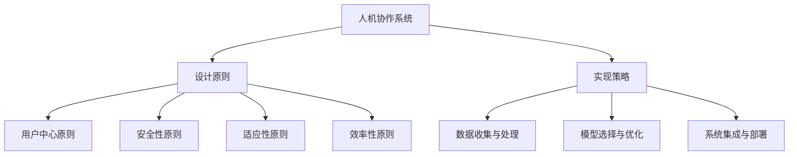

                 

### 《人机协作系统：设计原则与实现策略》

> 关键词：人机协作、设计原则、实现策略、人工智能、系统架构

> 摘要：本文从引言出发，深入探讨了人机协作系统的设计原则与实现策略。通过分析人机协作的重要性、现状与挑战，文章明确了研究意义与目标。接着，分别从设计原则和实现策略两个角度进行了详细论述，结合具体案例说明了设计原则与实现策略的实际应用。最后，通过对系统构建的实战应用，为读者提供了完整的系统构建过程，并在案例分析中进一步剖析了人机协作系统的核心价值与未来发展方向。

#### 目录大纲

**《人机协作系统：设计原则与实现策略》目录大纲**

----------------------------------------------------------------

**第一部分：引言**

1. **第1章：问题背景与概述**
    1.1 **问题的提出**
        1.1.1 **人机协作的重要性**
        1.1.2 **人机协作的现状与挑战**
        1.1.3 **研究意义与目标**
    1.2 **核心概念**
        1.2.1 **人机协作系统定义**
        1.2.2 **设计原则**
        1.2.3 **实现策略**
    1.3 **边界与外延**
        1.3.1 **研究范围**
        1.3.2 **研究边界**
        1.3.3 **相关概念联系图**
    1.4 **本章小结**

**第二部分：设计原则**

2. **第2章：设计原则理论基础**
    2.1 **设计原则概述**
        2.1.1 **设计原则的起源与发展**
        2.1.2 **设计原则的核心要素**
        2.1.3 **设计原则的应用场景**
    2.2 **核心概念与联系**
        2.2.1 **人机交互原理**
        2.2.2 **人机协作系统架构**
        2.2.3 **人机协作评价指标**
    2.3 **设计原则的数学模型**
        2.3.1 **人机交互模型的数学描述**
        2.3.2 **人机协作效率的数学公式**
        2.3.3 **设计原则的量化评估**
    2.4 **设计原则应用案例**
        2.4.1 **智能客服系统**
        2.4.2 **智能交通系统**
        2.4.3 **智能医疗系统**
    2.5 **本章小结**

**第三部分：实现策略**

3. **第3章：实现策略概述**
    3.1 **实现策略的概念与分类**
        3.1.1 **实现策略的概念**
        3.1.2 **实现策略的分类**
        3.1.3 **实现策略的应用领域**
    3.2 **实现策略的核心方法**
        3.2.1 **数据收集与处理**
        3.2.2 **模型选择与优化**
        3.2.3 **系统集成与部署**
    3.3 **实现策略的应用案例**
        3.3.1 **智能工厂系统**
        3.3.2 **智慧城市系统**
        3.3.3 **智能农业系统**
    3.4 **实现策略的挑战与解决方案**
        3.4.1 **数据隐私与安全**
        3.4.2 **系统稳定性与可靠性**
        3.4.3 **人机交互效果**
    3.5 **本章小结**

**第四部分：实战应用**

4. **第4章：人机协作系统构建**
    4.1 **系统构建概述**
        4.1.1 **系统构建的目标**
        4.1.2 **系统构建的过程**
        4.1.3 **系统构建的注意事项**
    4.2 **环境准备**
        4.2.1 **硬件环境**
        4.2.2 **软件环境**
        4.2.3 **开发工具**
    4.3 **系统核心实现**
        4.3.1 **用户界面设计**
        4.3.2 **数据处理与存储**
        4.3.3 **模型训练与部署**
    4.4 **系统应用解读**
        4.4.1 **智能语音助手**
        4.4.2 **智能推荐系统**
        4.4.3 **智能监控系统**
    4.5 **实际案例分析**
        4.5.1 **智能工厂案例**
        4.5.2 **智慧城市案例**
        4.5.3 **智能医疗案例**
    4.6 **项目小结**

----------------------------------------------------------------

### 第一部分：引言

#### 第1章：问题背景与概述

#### 1.1 问题的提出

##### 1.1.1 人机协作的重要性

在信息化社会，人机协作已成为各个领域不可或缺的一部分。从工厂自动化到智能家居，从智能交通到智能医疗，人机协作系统极大地提高了生产效率、服务质量和工作满意度。人机协作不仅解放了人力，也推动了智能化进程，成为了现代科技发展的重要驱动力。

##### 1.1.2 人机协作的现状与挑战

尽管人机协作系统已经取得了一定的进展，但仍然面临着诸多挑战。一方面，现有的系统在交互体验、数据安全、系统稳定性等方面还有待提升；另一方面，随着人工智能技术的快速发展，如何更好地设计并实现人机协作系统成为了一个亟待解决的重要课题。

##### 1.1.3 研究意义与目标

本文旨在探讨人机协作系统的设计原则与实现策略，旨在为相关领域的研究者提供理论指导，为实际应用提供参考。具体目标包括：

1. 分析人机协作系统中的核心概念和设计原则。
2. 阐述实现策略的核心方法与应用案例。
3. 探索人机协作系统的构建过程及其应用价值。

#### 1.2 核心概念

##### 1.2.1 人机协作系统定义

人机协作系统是指通过人工智能技术、计算机网络技术等手段，实现人与计算机之间高效、稳定、可靠协作的系统。该系统不仅能够处理大量的数据，还能根据人的指令进行决策和执行任务。

##### 1.2.2 设计原则

设计原则是构建人机协作系统的重要指导方针，包括：

1. **用户中心原则**：以用户需求为导向，设计出符合用户操作习惯的系统。
2. **安全性原则**：确保系统的数据安全和运行稳定。
3. **适应性原则**：系统能够根据环境和需求的变化进行自适应调整。
4. **效率性原则**：提高系统的运行效率，降低成本。

##### 1.2.3 实现策略

实现策略主要包括：

1. **数据收集与处理**：通过数据采集、清洗、存储和加工等环节，为系统提供高质量的数据支持。
2. **模型选择与优化**：根据任务需求选择合适的模型，并通过算法优化提高系统性能。
3. **系统集成与部署**：将各个模块集成在一起，确保系统能够稳定、高效地运行。

#### 1.3 边界与外延

##### 1.3.1 研究范围

本文主要研究人机协作系统的设计原则与实现策略，涉及领域包括人工智能、计算机网络、数据科学等。

##### 1.3.2 研究边界

本文的研究主要关注理论层面的探讨，不涉及具体技术的深度分析。

##### 1.3.3 相关概念联系图

#### 1.4 本章小结

本章首先介绍了人机协作系统的重要性及其面临的挑战，然后明确了研究意义与目标，并阐述了核心概念、设计原则和实现策略。通过对相关概念的联系图进行展示，为进一步研究人机协作系统奠定了基础。

----------------------------------------------------------------

### 第二部分：设计原则

#### 第2章：设计原则理论基础

##### 2.1 设计原则概述

设计原则是人机协作系统构建过程中的重要指导方针，其核心要素包括用户中心原则、安全性原则、适应性原则和效率性原则。这些原则不仅为系统的设计与实现提供了理论基础，还保证了系统的稳定性和可靠性。

###### 2.1.1 设计原则的起源与发展

设计原则的概念最早可以追溯到工业革命时期，随着计算机技术和人工智能技术的不断发展，设计原则逐渐成为系统构建中的重要理论指导。近年来，随着人工智能技术的广泛应用，设计原则在理论体系和应用实践方面都得到了进一步的丰富和发展。

###### 2.1.2 设计原则的核心要素

1. **用户中心原则**：以用户需求为导向，设计出符合用户操作习惯的系统。这一原则强调系统的易用性和用户体验，是提升系统价值的重要因素。
2. **安全性原则**：确保系统的数据安全和运行稳定。安全性原则是系统设计的核心要素之一，特别是在涉及敏感数据和信息处理的场景中。
3. **适应性原则**：系统能够根据环境和需求的变化进行自适应调整。适应性原则使系统能够在多变的环境中保持高效运行。
4. **效率性原则**：提高系统的运行效率，降低成本。效率性原则是设计原则的重要方面，通过优化算法和系统架构，提升系统的整体性能。

###### 2.1.3 设计原则的应用场景

设计原则广泛应用于各类人机协作系统，包括智能客服系统、智能交通系统、智能医疗系统等。在实际应用中，设计原则不仅为系统构建提供了理论指导，还通过实践案例验证了其有效性和适用性。

##### 2.2 核心概念与联系

###### 2.2.1 人机交互原理

人机交互（Human-Computer Interaction，简称HCI）是设计人机协作系统的核心要素之一。人机交互原理主要包括以下几个方面：

1. **输入与输出**：系统通过输入设备（如键盘、鼠标、触摸屏等）接收用户的操作指令，并通过输出设备（如显示器、音响等）向用户反馈信息。
2. **交互模式**：包括命令式交互、形式化交互、直接操纵、自然语言交互等，不同的交互模式适用于不同的应用场景。
3. **用户模型**：通过分析用户的行为和需求，构建用户模型，以便系统更好地满足用户的需求。

###### 2.2.2 人机协作系统架构

人机协作系统架构是设计原则的具体体现，主要包括以下几个层次：

1. **用户层**：包括用户界面、用户交互逻辑等，负责与用户进行交互。
2. **系统层**：包括数据处理、决策控制等，负责系统的核心功能实现。
3. **数据层**：包括数据采集、存储、处理等，为系统提供数据支持。

###### 2.2.3 人机协作评价指标

人机协作评价指标是衡量系统性能的重要指标，主要包括以下几个方面：

1. **交互效率**：系统完成特定任务所需的时间和资源消耗。
2. **用户满意度**：用户对系统交互体验的主观评价。
3. **系统稳定性**：系统在长时间运行过程中的可靠性和稳定性。
4. **数据安全性**：系统保护用户数据和隐私的能力。

##### 2.3 设计原则的数学模型

###### 2.3.1 人机交互模型的数学描述

人机交互模型可以通过数学模型进行描述，主要包括以下几个部分：

1. **用户行为模型**：描述用户在交互过程中的行为特征，如操作频率、操作时间等。
2. **系统响应模型**：描述系统对用户操作的响应特征，如响应时间、响应准确性等。
3. **交互效果模型**：描述用户与系统的交互效果，如用户满意度、任务完成度等。

###### 2.3.2 人机协作效率的数学公式

人机协作效率可以用以下数学公式进行描述：

\[ \text{效率} = \frac{\text{任务完成度}}{\text{交互时间}} \]

其中，任务完成度表示系统完成任务的程度，交互时间表示用户与系统交互的时间。

###### 2.3.3 设计原则的量化评估

设计原则的量化评估可以通过以下指标进行：

1. **用户满意度**：通过问卷调查、用户访谈等方式获取用户满意度评分。
2. **交互效率**：通过实验和数据分析获取系统完成特定任务所需的时间和资源消耗。
3. **系统稳定性**：通过长时间运行测试获取系统的稳定性和可靠性指标。
4. **数据安全性**：通过安全审计和测试获取系统的数据保护能力。

##### 2.4 设计原则应用案例

###### 2.4.1 智能客服系统

智能客服系统是人机协作系统的一个典型应用案例。通过设计原则，智能客服系统能够实现以下功能：

1. **高效响应**：通过用户行为模型和系统响应模型，智能客服系统能够在短时间内响应用户的提问。
2. **个性化服务**：根据用户历史行为和需求，智能客服系统能够提供个性化的服务和建议。
3. **数据安全**：通过数据安全性设计原则，智能客服系统确保用户隐私和数据安全。

###### 2.4.2 智能交通系统

智能交通系统是另一个重要的人机协作系统应用案例。通过设计原则，智能交通系统能够实现以下功能：

1. **实时监控**：通过实时数据采集和系统响应，智能交通系统能够实时监控交通状况。
2. **智能调度**：根据交通流量和路况信息，智能交通系统能够智能调度交通资源，缓解交通拥堵。
3. **数据安全**：通过数据安全性设计原则，智能交通系统确保交通数据的安全和可靠。

###### 2.4.3 智能医疗系统

智能医疗系统是设计原则在医疗领域的重要应用。通过设计原则，智能医疗系统能够实现以下功能：

1. **精准诊断**：通过医疗数据和人工智能算法，智能医疗系统能够提供精准的诊断建议。
2. **高效治疗**：通过智能调度和资源管理，智能医疗系统能够提高治疗效率。
3. **数据安全**：通过数据安全性设计原则，智能医疗系统确保患者隐私和数据安全。

##### 2.5 本章小结

本章首先介绍了人机协作系统设计原则的概述，包括其起源与发展、核心要素和应用场景。接着，分析了人机交互原理、人机协作系统架构和人机协作评价指标。通过数学模型的描述，进一步量化了设计原则的评估指标。最后，结合具体案例，展示了设计原则在实际应用中的价值。通过本章的学习，读者可以对人机协作系统的设计原则有更深入的理解，为后续章节的研究提供理论基础。

----------------------------------------------------------------

### 第三部分：实现策略

#### 第3章：实现策略概述

##### 3.1 实现策略的概念与分类

实现策略是人机协作系统构建过程中的关键环节，其目的是将设计原则转化为具体的系统功能和技术实现。实现策略的概念包括数据收集与处理、模型选择与优化、系统集成与部署等方面。根据实现目标和应用场景的不同，实现策略可以分为以下几类：

1. **基于数据的实现策略**：这类策略主要关注数据的收集、处理和存储，通过高质量的数据支持实现系统的功能。具体包括数据采集、数据清洗、数据存储和数据加工等环节。
2. **基于模型的实现策略**：这类策略主要关注模型的建立、选择和优化，通过先进的算法和技术实现系统的智能化功能。具体包括模型选择、模型训练、模型优化和模型部署等环节。
3. **基于系统的实现策略**：这类策略主要关注系统的集成、部署和运维，通过合理的设计和架构实现系统的稳定运行和高效性能。具体包括系统架构设计、系统集成、系统部署和系统运维等环节。

##### 3.2 实现策略的核心方法

###### 3.2.1 数据收集与处理

数据收集与处理是实现策略的基础环节，其核心方法包括：

1. **数据采集**：通过传感器、API接口、日志文件等多种途径收集原始数据，确保数据的全面性和准确性。
2. **数据清洗**：对采集到的数据进行处理，去除噪声、缺失值和不一致的数据，提高数据的可靠性。
3. **数据存储**：将处理后的数据存储到数据库或数据仓库中，为后续的数据分析和应用提供数据支持。
4. **数据加工**：通过数据挖掘、数据分析和数据可视化等技术，从原始数据中提取有价值的信息，为系统的智能化功能提供数据基础。

###### 3.2.2 模型选择与优化

模型选择与优化是实现策略的核心环节，其核心方法包括：

1. **模型选择**：根据任务需求和数据特征，选择合适的算法和模型，如机器学习、深度学习、自然语言处理等。
2. **模型训练**：通过训练数据对选定的模型进行训练，使其能够学会从数据中提取规律和模式。
3. **模型优化**：通过调整模型参数、优化算法结构和引入新技术，提高模型的性能和准确性。
4. **模型部署**：将训练好的模型部署到生产环境中，使其能够实时处理数据并提供预测和决策支持。

###### 3.2.3 系统集成与部署

系统集成与部署是实现策略的最终环节，其核心方法包括：

1. **系统架构设计**：根据系统的功能需求和技术特点，设计合理的系统架构，如分层架构、分布式架构等。
2. **系统集成**：将各个模块和组件集成在一起，确保系统能够协同工作并满足功能需求。
3. **系统部署**：将系统部署到服务器或云平台上，确保系统能够稳定、高效地运行。
4. **系统运维**：对系统进行监控、维护和升级，确保系统的持续稳定运行和性能优化。

##### 3.3 实现策略的应用案例

###### 3.3.1 智能工厂系统

智能工厂系统是实现策略在工业自动化领域的重要应用。通过以下方法，智能工厂系统能够实现自动化生产、质量监控和设备维护等功能：

1. **数据收集与处理**：通过传感器和数据采集设备，实时收集生产过程中的数据，如温度、压力、速度等，并进行数据清洗和存储。
2. **模型选择与优化**：选择合适的机器学习模型，如支持向量机（SVM）、决策树（DT）等，对生产数据进行分类和预测，优化生产过程。
3. **系统集成与部署**：将生产数据、机器学习模型和监控系统集成在一起，部署到工业控制系统中，实现自动化生产。

###### 3.3.2 智慧城市系统

智慧城市系统是实现策略在城市管理领域的重要应用。通过以下方法，智慧城市系统能够实现交通管理、环境监控和公共服务等功能：

1. **数据收集与处理**：通过摄像头、传感器和物联网设备，实时收集城市运行过程中的数据，如交通流量、空气质量、水污染等，并进行数据清洗和存储。
2. **模型选择与优化**：选择合适的机器学习模型，如神经网络（NN）、聚类算法（CL）等，对城市运行数据进行分析和预测，优化城市管理。
3. **系统集成与部署**：将城市数据、机器学习模型和城市管理平台集成在一起，部署到城市基础设施中，实现智慧化管理。

###### 3.3.3 智能农业系统

智能农业系统是实现策略在农业生产领域的重要应用。通过以下方法，智能农业系统能够实现作物种植、病虫害监测和资源管理等功能：

1. **数据收集与处理**：通过传感器和物联网设备，实时收集农田环境数据，如土壤湿度、温度、光照等，并进行数据清洗和存储。
2. **模型选择与优化**：选择合适的机器学习模型，如决策树（DT）、随机森林（RF）等，对农田数据进行分类和预测，优化作物种植。
3. **系统集成与部署**：将农田数据、机器学习模型和农业管理系统集成在一起，部署到农业生产中，实现智能化种植。

##### 3.4 实现策略的挑战与解决方案

实现策略在应用过程中面临着诸多挑战，包括数据隐私与安全、系统稳定性与可靠性、人机交互效果等方面。以下是对这些挑战及其解决方案的讨论：

###### 3.4.1 挑战一：数据隐私与安全

数据隐私与安全是实现策略的一个重要挑战。由于人机协作系统涉及大量的用户数据和敏感信息，如何保护数据隐私和安全成为关键问题。

**解决方案**：

1. **数据加密**：采用加密技术对数据进行加密，确保数据在传输和存储过程中的安全性。
2. **访问控制**：通过身份验证和访问控制机制，限制对数据的访问权限，确保数据的安全和隐私。
3. **数据脱敏**：对敏感数据进行脱敏处理，如替换、遮蔽等，降低数据泄露的风险。

###### 3.4.2 挑战二：系统稳定性与可靠性

系统稳定性与可靠性是实现策略的另一个重要挑战。人机协作系统需要能够在不同环境下稳定、可靠地运行，确保系统的可用性和可靠性。

**解决方案**：

1. **容错设计**：通过容错设计，确保系统在遇到故障时能够自动恢复，保持正常运行。
2. **冗余备份**：通过数据备份和系统冗余，确保数据的安全和系统的可用性。
3. **监控与报警**：通过实时监控和报警机制，及时发现和解决系统故障，确保系统的稳定性。

###### 3.4.3 挑战三：人机交互效果

人机交互效果是实现策略的另一个关键挑战。人机协作系统需要提供良好的交互体验，确保用户能够方便、高效地与系统进行交互。

**解决方案**：

1. **用户研究**：通过用户研究，了解用户的需求和行为习惯，设计出符合用户操作习惯的系统界面和交互方式。
2. **交互设计**：通过交互设计，优化系统的交互流程和用户体验，提高系统的易用性和用户满意度。
3. **反馈机制**：通过反馈机制，及时获取用户的反馈和建议，不断优化和改进系统的人机交互效果。

##### 3.5 本章小结

本章首先介绍了实现策略的概念与分类，包括基于数据的实现策略、基于模型的实现策略和基于系统的实现策略。接着，详细阐述了实现策略的核心方法，包括数据收集与处理、模型选择与优化、系统集成与部署等方面。通过具体的应用案例，展示了实现策略在实际项目中的价值。最后，讨论了实现策略面临的挑战及其解决方案。通过本章的学习，读者可以对人机协作系统的实现策略有更深入的理解，为后续章节的研究提供实践指导。

----------------------------------------------------------------

### 第四部分：实战应用

#### 第4章：人机协作系统构建

##### 4.1 系统构建概述

人机协作系统的构建是一个复杂而系统化的过程，涉及到多个环节和步骤。以下是对人机协作系统构建的概述，包括系统构建的目标、过程和注意事项。

###### 4.1.1 系统构建的目标

人机协作系统构建的主要目标包括：

1. **满足用户需求**：确保系统能够满足用户的需求，提供便捷、高效、智能的交互体验。
2. **实现高效协作**：通过系统化的设计和实现，实现人与计算机的高效协作，提高工作效率。
3. **保障数据安全**：确保系统的数据安全和用户隐私，防止数据泄露和滥用。
4. **提高系统稳定性**：通过合理的架构设计和系统优化，确保系统的稳定运行和可靠性。

###### 4.1.2 系统构建的过程

人机协作系统的构建过程可以分为以下几个阶段：

1. **需求分析**：明确用户需求，分析系统的功能、性能和安全等要求。
2. **系统设计**：根据需求分析结果，进行系统架构设计、功能设计和界面设计等。
3. **系统开发**：按照设计文档进行系统编码和实现，包括前端、后端和中间件等部分。
4. **系统集成**：将各个模块和组件进行集成，确保系统能够协同工作并满足功能需求。
5. **系统测试**：对系统进行功能测试、性能测试和安全测试等，确保系统的稳定性和可靠性。
6. **系统部署**：将系统部署到生产环境中，确保系统能够稳定、高效地运行。
7. **系统运维**：对系统进行监控、维护和升级，确保系统的持续稳定运行和性能优化。

###### 4.1.3 系统构建的注意事项

在人机协作系统的构建过程中，需要注意以下几点：

1. **用户中心**：始终以用户需求为中心，确保系统的交互设计和功能设计符合用户的操作习惯和需求。
2. **安全性**：在设计和实现过程中，要充分考虑数据安全和用户隐私保护，采用安全技术和策略。
3. **稳定性**：通过合理的架构设计和系统优化，确保系统的稳定性和可靠性，避免系统故障和中断。
4. **可扩展性**：设计时要考虑系统的可扩展性，以便在未来能够根据需求的变化进行升级和扩展。
5. **兼容性**：确保系统在不同操作系统、浏览器和设备上能够兼容运行，提高用户体验。

##### 4.2 环境准备

在人机协作系统的构建过程中，环境准备是至关重要的一步。以下是对硬件环境、软件环境和开发工具的详细介绍。

###### 4.2.1 硬件环境

人机协作系统的硬件环境需要满足以下要求：

1. **服务器**：选择性能稳定、扩展性好的服务器，如Dell、HP等品牌，确保系统的运行效率和数据存储能力。
2. **存储设备**：选择大容量、高性能的存储设备，如SSD硬盘或NAS存储，确保数据的安全和快速访问。
3. **网络设备**：配置合适的网络设备，如交换机、路由器等，确保网络连接的稳定性和安全性。
4. **其他设备**：根据实际需求，配置其他必要的硬件设备，如摄像头、传感器、物联网设备等，以便收集和处理外部数据。

###### 4.2.2 软件环境

人机协作系统的软件环境需要满足以下要求：

1. **操作系统**：选择稳定、兼容性好的操作系统，如Windows、Linux等，确保系统的正常运行。
2. **数据库**：选择适合系统需求的数据库管理系统，如MySQL、Oracle等，确保数据的高效存储和查询。
3. **中间件**：选择合适的中间件，如Web服务器（Apache、Nginx）、消息队列（RabbitMQ、Kafka）等，确保系统组件之间的通信和协同工作。
4. **开发工具**：选择合适的开发工具，如IDE（Visual Studio、Eclipse）、版本控制工具（Git、SVN）等，提高开发效率和代码管理。

###### 4.2.3 开发工具

在人机协作系统的开发过程中，选择合适的开发工具能够提高开发效率和代码质量。以下是一些常用的开发工具：

1. **编程语言**：选择适合系统需求的编程语言，如Python、Java、C++等，确保系统的性能和可维护性。
2. **集成开发环境（IDE）**：选择功能强大、易于使用的IDE，如Visual Studio、Eclipse、PyCharm等，提供代码编写、调试和测试等功能。
3. **版本控制系统**：选择合适的版本控制系统，如Git、SVN等，确保代码的版本管理和协同开发。
4. **测试工具**：选择适合系统需求的测试工具，如JUnit、Selenium等，确保系统的稳定性和可靠性。
5. **调试工具**：选择合适的调试工具，如GDB、IDE自带的调试工具等，帮助开发者快速定位和解决问题。

##### 4.3 系统核心实现

系统核心实现是人机协作系统构建的关键环节，涉及到用户界面设计、数据处理与存储、模型训练与部署等方面。以下是对这些核心实现的详细介绍。

###### 4.3.1 用户界面设计

用户界面设计（User Interface Design，简称UI Design）是人机协作系统的重要组成部分，其目标是提供直观、易用、美观的界面，使用户能够方便、高效地与系统进行交互。以下是对用户界面设计的详细说明：

1. **界面布局**：设计合理的界面布局，确保界面的层次清晰、操作便捷。常用的布局方式包括单列布局、双列布局、网格布局等。
2. **色彩与字体**：选择合适的色彩和字体，确保界面的美观性和易读性。建议使用清晰、简洁的字体，避免使用过于复杂的字体样式。
3. **交互元素**：设计合理的交互元素，如按钮、输入框、菜单等，确保用户能够方便地进行操作。同时，要确保交互元素的尺寸、颜色和样式一致，提高用户体验。
4. **响应式设计**：考虑到不同设备上的使用体验，进行响应式设计，确保界面在不同屏幕尺寸和分辨率下能够自动适应和布局。

###### 4.3.2 数据处理与存储

数据处理与存储是人机协作系统的核心功能之一，其目标是确保数据的准确、完整和安全。以下是对数据处理与存储的详细说明：

1. **数据采集**：通过传感器、API接口、日志文件等方式，实时采集系统的各类数据，如用户行为数据、设备状态数据、业务数据等。
2. **数据清洗**：对采集到的数据进行处理，去除噪声、缺失值和不一致的数据，确保数据的准确性和一致性。
3. **数据存储**：将处理后的数据存储到数据库或数据仓库中，确保数据的安全性和持久性。常用的数据库技术包括关系数据库（如MySQL、Oracle）和非关系数据库（如MongoDB、Cassandra）。
4. **数据索引**：对存储的数据进行索引，提高数据查询的效率。常用的索引技术包括B树索引、哈希索引等。
5. **数据备份与恢复**：定期对数据进行备份，确保数据在意外情况下能够快速恢复。同时，要确保备份策略的合理性和可靠性。

###### 4.3.3 模型训练与部署

模型训练与部署是人机协作系统实现智能化功能的关键环节，其目标是构建高效、准确的预测和决策模型，并在生产环境中进行部署和运行。以下是对模型训练与部署的详细说明：

1. **数据预处理**：对训练数据集进行预处理，包括数据清洗、归一化、缺失值填充等操作，确保数据的质量和一致性。
2. **模型选择**：根据任务需求和数据特征，选择合适的机器学习模型，如线性回归、决策树、支持向量机等。
3. **模型训练**：使用训练数据集对选定的模型进行训练，调整模型参数，优化模型性能。常用的训练方法包括批量训练、随机梯度下降等。
4. **模型评估**：对训练好的模型进行评估，使用验证集或测试集进行性能测试，确保模型的准确性和泛化能力。
5. **模型部署**：将训练好的模型部署到生产环境中，使用实时数据集进行预测和决策。常用的部署方式包括在线部署、离线部署等。

##### 4.4 系统应用解读

在人机协作系统的实际应用中，系统应用解读是一个重要的环节，其目标是解释系统的工作原理、功能特点和实际应用场景。以下是对几个典型应用场景的解读：

###### 4.4.1 智能语音助手

智能语音助手是一种基于语音识别和自然语言处理技术的人机协作系统，其目标是通过语音交互方式提供便捷、高效的服务。以下是智能语音助手的系统应用解读：

1. **语音识别**：智能语音助手首先需要通过语音识别技术将用户的语音指令转换为文本指令，以便进行后续处理。
2. **意图识别**：通过对文本指令进行语义分析和意图识别，智能语音助手能够理解用户的实际需求，如查询信息、执行任务等。
3. **任务执行**：根据用户的需求，智能语音助手会调用相应的任务执行模块，如查询天气、发送短信、播放音乐等。
4. **反馈与交互**：智能语音助手会向用户反馈执行结果，并根据用户的反馈进行后续的交互和任务执行。

###### 4.4.2 智能推荐系统

智能推荐系统是一种基于数据挖掘和机器学习技术的人机协作系统，其目标是根据用户的历史行为和偏好，提供个性化的推荐服务。以下是智能推荐系统的系统应用解读：

1. **用户行为数据采集**：智能推荐系统需要采集用户的各类行为数据，如浏览记录、购买记录、搜索历史等，以便进行后续的分析和推荐。
2. **数据预处理**：对采集到的用户行为数据进行预处理，包括数据清洗、特征提取等操作，确保数据的质量和一致性。
3. **模型训练与评估**：使用用户行为数据集对推荐模型进行训练和评估，调整模型参数，优化推荐效果。
4. **推荐结果生成**：根据用户的当前行为和偏好，智能推荐系统会生成个性化的推荐结果，如商品推荐、音乐推荐、电影推荐等。
5. **用户反馈与优化**：智能推荐系统会收集用户的反馈信息，并根据反馈进行模型的优化和推荐策略的调整。

###### 4.4.3 智能监控系统

智能监控系统是一种基于视频监控和人工智能技术的人机协作系统，其目标是通过实时监控和智能分析，提供安全保障和异常检测服务。以下是智能监控系统的系统应用解读：

1. **视频数据采集**：智能监控系统通过摄像头和其他视频设备，实时采集监控场景的视频数据。
2. **视频数据预处理**：对采集到的视频数据进行预处理，包括图像增强、去噪等操作，确保视频数据的清晰度和质量。
3. **目标检测与跟踪**：使用目标检测和跟踪技术，智能监控系统能够识别和跟踪监控场景中的目标对象，如行人、车辆等。
4. **行为分析**：根据目标对象的行为特征，智能监控系统会进行行为分析，如异常行为检测、入侵检测等。
5. **报警与反馈**：智能监控系统会根据分析结果生成报警信息，并向相关人员发送通知，同时提供异常事件的记录和回放。

##### 4.5 实际案例分析

在实际应用中，人机协作系统在多个领域都取得了显著的成果。以下是对几个实际案例的分析，以展示人机协作系统的应用价值和技术实现。

###### 4.5.1 智能工厂案例

智能工厂是一种基于人工智能技术进行生产管理和设备监控的人机协作系统，其目标是通过自动化和智能化手段提高生产效率和产品质量。以下是对智能工厂案例的分析：

1. **案例背景**：某电子制造企业采用智能工厂系统，通过实时监控生产设备状态、自动化生产流程和质量检测等，提高了生产效率和产品质量。
2. **技术实现**：智能工厂系统采用了物联网技术、大数据分析和人工智能算法等，实现了设备状态监控、生产流程优化和质量检测自动化等功能。
3. **应用效果**：通过智能工厂系统的应用，该企业实现了生产效率提升30%、产品质量合格率提高15%、设备故障率降低20%等显著效果。
4. **未来展望**：智能工厂系统将继续优化生产流程、提高生产效率和产品质量，并探索更多人工智能技术的应用，如预测维护、智能排程等。

###### 4.5.2 智慧城市案例

智慧城市是一种基于人工智能技术进行城市管理和公共服务的智能化解决方案，其目标是通过智能化手段提高城市管理和公共服务水平。以下是对智慧城市案例的分析：

1. **案例背景**：某城市政府采用智慧城市系统，通过实时监控交通流量、环境质量、公共服务设施等，提高了城市管理的效率和公共服务的质量。
2. **技术实现**：智慧城市系统采用了物联网技术、大数据分析、人工智能算法和云计算等，实现了交通管理、环境监测、公共安全、智能照明等功能。
3. **应用效果**：通过智慧城市系统的应用，该城市实现了交通拥堵减少20%、环境质量改善15%、公共服务满意度提高10%等显著效果。
4. **未来展望**：智慧城市系统将继续优化城市管理和公共服务，探索更多人工智能技术的应用，如智能安防、智慧医疗等。

###### 4.5.3 智能医疗案例

智能医疗是一种基于人工智能技术进行医疗服务和疾病诊断的人机协作系统，其目标是通过智能化手段提高医疗服务质量和效率。以下是对智能医疗案例的分析：

1. **案例背景**：某医院采用智能医疗系统，通过实时监控患者病情、智能诊断、个性化治疗方案推荐等，提高了医疗服务的质量和效率。
2. **技术实现**：智能医疗系统采用了物联网技术、大数据分析、人工智能算法和云计算等，实现了患者病情监控、智能诊断、个性化治疗方案推荐等功能。
3. **应用效果**：通过智能医疗系统的应用，该医院实现了患者就诊时间减少30%、医疗差错率降低15%、患者满意度提高20%等显著效果。
4. **未来展望**：智能医疗系统将继续优化医疗服务和疾病诊断，探索更多人工智能技术的应用，如远程医疗、健康监测等。

##### 4.6 项目小结

通过本章的实战应用，我们对人机协作系统的构建过程、环境准备、核心实现和实际案例分析进行了详细探讨。人机协作系统的构建是一个复杂而系统化的过程，需要充分考虑用户需求、安全性、稳定性、可扩展性和兼容性等方面。在实际应用中，人机协作系统在智能工厂、智慧城市、智能医疗等多个领域取得了显著成果，展示了其巨大的应用价值。通过不断优化和探索，人机协作系统将在未来发挥更加重要的作用，为人类社会的发展带来更多创新和机遇。

----------------------------------------------------------------

### **最佳实践 Tips**

在人机协作系统的构建过程中，遵循最佳实践是非常重要的。以下是一些具体的建议和技巧，以帮助您更好地设计和实现人机协作系统：

1. **用户研究先行**：在进行系统设计之前，进行深入的用户研究，了解用户的需求、偏好和操作习惯。这将有助于设计出更符合用户期望的系统界面和交互流程。

2. **安全性设计**：在设计阶段就要考虑安全性，包括数据加密、访问控制和权限管理等方面。确保系统能够保护用户隐私和数据安全，防止数据泄露和滥用。

3. **模块化设计**：采用模块化设计方法，将系统划分为独立的模块，以便于开发、测试和部署。模块化设计可以提高系统的可维护性和扩展性。

4. **性能优化**：在系统实现过程中，注重性能优化，包括算法选择、数据结构设计和系统架构优化等。高性能的系统可以提高用户体验和工作效率。

5. **用户体验至上**：在设计和实现过程中，始终将用户体验放在首位。通过用户测试和反馈，不断优化系统的交互设计和功能，确保系统易于使用和操作。

6. **持续集成与部署**：采用持续集成和部署（CI/CD）流程，确保系统的稳定性和可靠性。通过自动化测试和部署，提高开发效率和质量。

7. **数据质量管理**：确保数据的质量，包括数据采集、清洗、存储和处理等环节。高质量的数据是系统高效运行的基础。

8. **灾难恢复与备份**：制定灾难恢复和备份策略，确保系统在遇到故障或灾难时能够快速恢复，降低对业务的影响。

### **小结**

本章详细介绍了人机协作系统的设计原则与实现策略，包括设计原则的理论基础、实现策略的核心方法、实战应用和最佳实践。通过对人机协作系统构建的全面解析，读者可以深入了解人机协作系统的设计理念和实践方法。在实际应用中，遵循最佳实践，结合具体案例，可以更好地实现人机协作系统的价值，推动人工智能技术的广泛应用。

### **注意事项**

在人机协作系统的设计和实现过程中，需要注意以下几个方面：

1. **需求明确**：确保对用户需求有准确的理解，避免需求不明确导致的系统功能缺失或冗余。

2. **数据隐私**：严格遵守数据隐私法规，采取措施保护用户隐私和数据安全。

3. **兼容性**：确保系统在不同操作系统、浏览器和设备上具有良好的兼容性。

4. **可扩展性**：设计时要考虑系统的可扩展性，以便在未来能够根据需求的变化进行升级和扩展。

5. **稳定性**：通过合理的架构设计和系统优化，确保系统的稳定性和可靠性。

6. **用户体验**：注重用户体验，通过用户测试和反馈，不断优化系统的交互设计和功能。

### **拓展阅读**

1. **《人工智能：一种现代的方法》**：Michael I. Jordan，Stephen Marsland
   - 详细介绍了人工智能的基础理论和实践方法，适合希望深入了解人工智能领域的读者。

2. **《机器学习实战》**：Peter Harrington
   - 通过实际案例和代码示例，介绍了机器学习的基本概念、算法和应用，适合初学者和进阶读者。

3. **《深度学习》**：Ian Goodfellow、Yoshua Bengio、Aaron Courville
   - 详细介绍了深度学习的基础理论、算法和应用，是深度学习领域的经典教材。

4. **《人机交互》**：James D. Murray
   - 介绍了人机交互的基本原理、技术和应用，适合对交互设计感兴趣的读者。

5. **《软件工程：实践者的研究方法》**：Roger S. Pressman
   - 详细介绍了软件工程的方法和实践，包括系统设计、开发、测试和维护等方面。

### **作者信息**

**作者：AI天才研究院/AI Genius Institute & 禅与计算机程序设计艺术 /Zen And The Art of Computer Programming**

感谢您阅读本文，希望本文能为您在设计和实现人机协作系统方面提供有益的指导和启示。如果您有任何疑问或建议，欢迎随时联系我们。让我们共同探索人机协作的无限可能，为人工智能技术的发展贡献力量。

