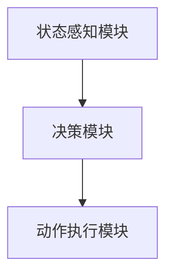
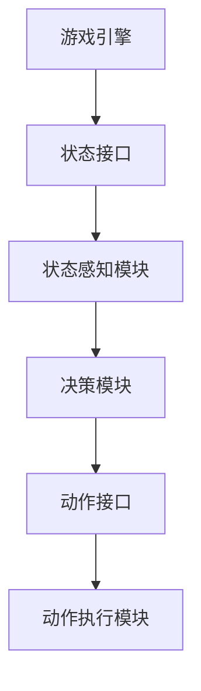
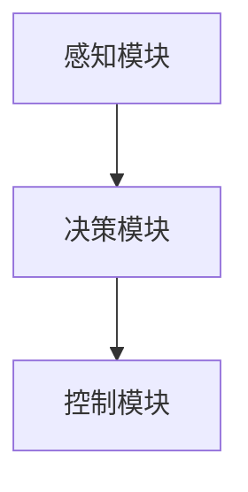
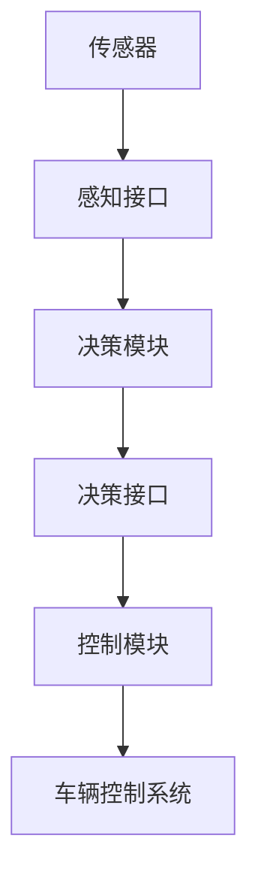
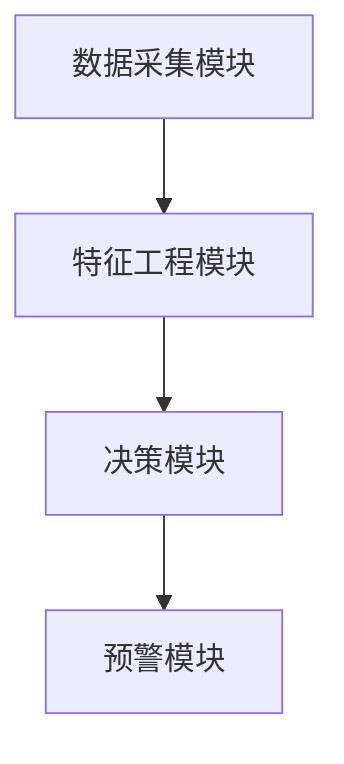
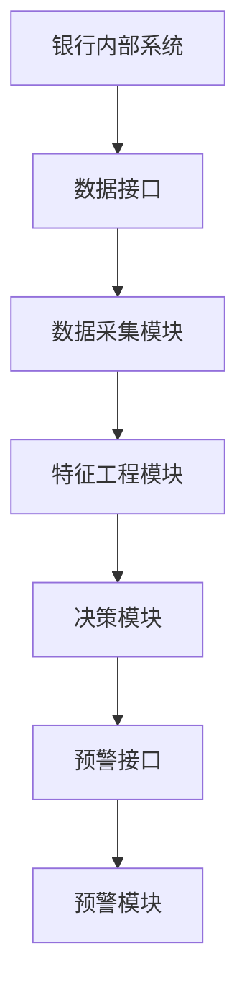

                 

### 从MCTS到DPO：AI决策算法的演进

#### 摘要

本文将深入探讨人工智能（AI）领域中的决策算法演进，从经典的蒙特卡洛树搜索（MCTS）到当前前沿的深度概率操作符（DPO）算法。我们将通过逐步分析这些算法的背景、原理、实现和应用，来揭示决策算法在AI发展中的关键作用及其未来趋势。文章结构如下：

1. **决策算法概述**：介绍决策算法的重要性、背景和发展历程。
2. **蒙特卡洛树搜索（MCTS）**：详述MCTS的原理、组成部分和应用。
3. **深度强化学习与DQN算法**：分析深度强化学习的基础和DQN算法。
4. **策略梯度方法**：探讨策略梯度方法及其优化。
5. **优势估计与DPO算法**：介绍优势估计的重要性以及DPO算法的原理和应用。
6. **DPO算法的优化与拓展**：讨论DPO算法的优化方向和应用场景。
7. **AI决策算法的未来发展趋势**：预测未来AI决策算法的发展方向。
8. **决策算法的实际应用案例**：分析游戏AI决策、自动驾驶决策和金融风控决策。
9. **总结与展望**：总结文章内容并展望未来的研究方向。

通过本文的阅读，读者将对AI决策算法有更全面和深入的理解，为未来的研究和应用提供理论支持和实践指导。

### 第一部分：决策算法概述

#### 第1章：决策算法的背景与重要性

#### 1.1 决策算法的重要性

在人工智能（AI）的发展历程中，决策算法扮演着至关重要的角色。无论是机器学习、深度学习，还是其他AI技术，决策算法都是核心组成部分。简单来说，决策算法是使机器能够自主决策、执行任务的关键技术。从日常生活的智能助手，到复杂的自动化系统，决策算法的应用无处不在。

首先，决策算法在提高效率方面具有显著优势。在工业生产、物流管理、金融交易等领域，AI系统能够通过高效决策，优化资源分配，降低运营成本，提高生产效率。例如，在物流领域，AI算法可以根据实时交通状况和订单需求，优化运输路线，减少运输时间和成本。

其次，决策算法在提升准确性方面也具有不可替代的作用。通过大数据分析和机器学习模型，AI系统能够从海量数据中提取有价值的信息，进行精准预测和决策。这在金融风险评估、医疗诊断、灾害预测等领域尤为重要。例如，在金融领域，AI算法可以分析历史数据和实时市场信息，预测股票价格走势，辅助投资者做出更加准确的决策。

此外，决策算法在智能化水平提升方面也发挥着关键作用。通过不断学习和优化，AI系统能够不断提高决策能力，实现更加智能化、自动化的功能。例如，在自动驾驶领域，AI算法通过感知环境、预测行为，实现车辆的自动导航和控制，提高行驶安全性和效率。

综上所述，决策算法在AI领域中具有不可替代的重要性。它不仅提升了系统的效率和准确性，还推动了智能化水平的提升，为各行业带来了巨大的变革和机遇。

#### 1.2 决策算法的应用领域

决策算法在众多领域都有着广泛的应用，以下将详细探讨几个典型应用场景：

**1. 工业生产与自动化**

在工业生产领域，决策算法被广泛应用于生产优化、设备维护和故障预测等方面。通过实时数据分析和预测模型，AI系统能够优化生产流程，提高生产效率，减少资源浪费。例如，在制造业中，决策算法可以分析生产数据，预测设备故障，提前进行维护，避免生产中断。此外，AI算法还可以优化生产计划，根据市场需求和库存情况，动态调整生产任务，提高生产灵活性。

**2. 物流与运输**

物流与运输是决策算法应用的重要领域。通过路径优化、库存管理和配送调度，AI系统能够提高物流效率，降低运输成本。具体来说，决策算法可以分析实时交通状况和交通流量，为货车和快递车规划最优路径，避免交通拥堵和延误。此外，AI算法还可以根据订单数量和配送需求，动态调整仓储和配送计划，确保货物及时送达。例如，UPS和亚马逊等物流巨头已经广泛应用AI决策算法，优化物流运营，提高客户满意度。

**3. 金融与投资**

在金融领域，决策算法被广泛应用于风险管理、市场预测和投资策略制定。通过大数据分析和机器学习模型，AI系统可以分析历史数据和市场动态，预测股票价格走势，辅助投资者做出更准确的决策。例如，量化基金和投资银行利用决策算法进行市场分析和风险管理，提高投资收益。此外，AI算法还可以监测市场风险，实时调整投资组合，降低投资风险。

**4. 医疗与健康**

医疗与健康领域是决策算法的重要应用场景之一。通过大数据分析和预测模型，AI系统能够提高诊断准确率，优化治疗方案。例如，在医疗影像诊断中，AI算法可以分析大量影像数据，辅助医生进行早期疾病检测，提高诊断准确率。此外，AI算法还可以根据患者病史和基因数据，预测疾病风险，提供个性化的健康建议。例如，IBM的Watson for Oncology系统利用AI算法，为医生提供诊断和治疗建议，优化癌症治疗方案。

**5. 自动驾驶**

自动驾驶是决策算法应用的前沿领域之一。通过感知环境、预测行为和决策控制，AI系统可以实现无人驾驶车辆的自主导航和控制。例如，自动驾驶汽车利用传感器和摄像头收集道路信息，通过决策算法进行路径规划和避障，确保行驶安全。此外，AI算法还可以分析交通状况和路况信息，优化行车路线，提高行驶效率。谷歌和特斯拉等公司在自动驾驶领域已经广泛应用决策算法，推动自动驾驶技术的发展。

**6. 游戏与娱乐**

在游戏与娱乐领域，决策算法被广泛应用于游戏AI设计、玩家行为分析和游戏平衡性调整。通过AI算法，游戏系统能够生成智能AI对手，提高游戏挑战性和趣味性。例如，在策略游戏和角色扮演游戏中，AI算法可以分析玩家行为，生成适应不同玩家的智能AI角色。此外，AI算法还可以分析游戏数据，优化游戏平衡性，确保游戏公平性。

总之，决策算法在各个领域都有着广泛的应用，不仅提升了系统的效率和准确性，还为各行业带来了巨大的变革和机遇。随着AI技术的不断发展，决策算法的应用将更加深入和广泛，为人类社会带来更多的便利和创新。

#### 1.3 决策算法的发展历程

决策算法的发展历程可以追溯到20世纪中叶，随着计算机科学和人工智能技术的不断进步，决策算法经历了从传统到现代的演变。以下是决策算法发展的重要里程碑：

**1. 早期决策算法（20世纪50年代 - 70年代）**

在人工智能的早期阶段，决策算法主要集中在规则推理和逻辑推理上。这些算法通过定义一系列规则和条件，使计算机能够根据输入数据做出决策。代表性的算法包括专家系统（Expert Systems）和基于逻辑的推理机（Logic-based Reasoning Machines）。专家系统通过收集领域专家的知识，将其编码为规则库，使计算机能够模拟专家的决策过程。这种算法在医疗诊断、法律咨询等领域取得了初步成功。

**2. 统计学习算法（20世纪80年代 - 90年代）**

随着大数据时代的到来，统计学习算法逐渐成为决策算法的主流。这类算法通过分析大量的数据，从中提取特征和规律，用于预测和决策。代表性的算法包括线性回归、逻辑回归和支持向量机（SVM）等。这些算法在数据挖掘、图像识别和文本分类等领域取得了显著成果，成为工业界和学术界的重要工具。

**3. 深度学习算法（21世纪初至今）**

深度学习算法的兴起标志着决策算法发展的一个重要转折点。深度学习通过多层神经网络，能够自动提取数据中的复杂特征和模式，实现了前所未有的决策能力。代表性的算法包括卷积神经网络（CNN）、循环神经网络（RNN）和生成对抗网络（GAN）等。这些算法在图像识别、语音识别、自然语言处理等领域取得了突破性进展，为AI技术的广泛应用奠定了基础。

**4. 强化学习算法（21世纪初至今）**

强化学习算法通过模拟智能体在与环境的交互中学习策略，实现了自主决策能力。代表性的算法包括Q-学习、深度Q网络（DQN）和策略梯度方法等。这些算法在游戏AI、自动驾驶和机器人控制等领域展现了强大的决策能力，推动了AI技术的发展。

**5. 概率图模型与决策算法（21世纪初至今）**

概率图模型，如贝叶斯网络和马尔可夫网络，为决策算法提供了更严谨的概率框架。这些模型能够处理不确定性问题，并给出概率性的决策建议。在医疗诊断、金融风控和智能推荐等领域，概率图模型结合决策算法，提高了系统的决策能力和可靠性。

**6. 现代综合决策算法**

现代决策算法逐渐融合了多种算法的优势，形成综合性的决策系统。例如，深度强化学习算法结合深度学习和强化学习，能够处理更复杂的决策问题。同时，多代理系统（Multi-Agent Systems）和分布式决策算法（Distributed Decision Algorithms）的出现，使得多个智能体能够协同工作，实现更高效、更可靠的决策。

总之，决策算法的发展历程是一个不断迭代、不断创新的过程。从早期的规则推理，到现代的深度学习和强化学习，再到综合决策算法，每一个阶段都推动了AI技术的进步。随着技术的不断发展，决策算法将继续演进，为各领域带来更多创新和变革。

### 第二部分：蒙特卡洛树搜索（MCTS）

#### 第2章：蒙特卡洛树搜索（MCTS）

#### 2.1 MCTS算法原理

蒙特卡洛树搜索（MCTS）是一种在决策过程中通过模拟大量随机样本来评估和选择最优策略的算法。它起源于蒙特卡洛方法，即通过大量随机抽样来近似求解复杂问题的一种数值计算方法。MCTS算法通过构建一棵搜索树，并在树上进行一系列的模拟，从而估计各个节点（即动作）的预期价值，并根据这些估计值选择最优动作。

MCTS算法主要包括以下几个核心步骤：

**1. 扩展（Selection）：** 从根节点开始，通过选择路径逐步扩展搜索树，直到找到一个未扩展的叶子节点。选择路径的依据是节点的选择概率，通常使用**UCB1（Upper Confidence Bound 1）**准则，即在考虑节点价值的同时，加入了对未访问次数的惩罚。

**2. 模拟（Simulation）：** 在选定的叶子节点上，进行一次从当前状态到终止状态的模拟，并根据模拟结果更新节点的价值。

**3. 回溯（Backpropagation）：** 将模拟结果反向传播回搜索树的所有节点，更新节点的访问次数和期望价值。

**4. 评估（Evaluation）：** 根据搜索树中的节点价值和访问次数，评估各个节点的优劣，选择具有最高期望价值的节点作为下一步的动作。

MCTS算法的基本原理是通过扩展、模拟和回溯三个过程，不断更新搜索树，逐步收敛到最优策略。其优点是无需显式地枚举所有可能的状态，而通过随机抽样来近似求解，具有很强的灵活性和适应性。

#### 2.2 MCTS算法的组成部分

蒙特卡洛树搜索算法由以下几个核心组成部分构成：

**1. 状态（State）：** 状态是决策过程中的当前环境状态，通常由一组属性和数值表示。在棋类游戏中，状态可以表示棋盘上的布局；在自动驾驶中，状态可以表示车辆的位置、速度和周围环境。

**2. 动作（Action）：** 动作是从当前状态中可以选择的下一个操作。在棋类游戏中，动作可以是移动棋子或吃子；在自动驾驶中，动作可以是转向、加速或制动。

**3. 策略（Policy）：** 策略是选择动作的概率分布。在MCTS算法中，策略通过不断更新搜索树的节点选择概率来逼近最优策略。

**4. 值函数（Value Function）：** 值函数是评估状态或动作的预期效用。在MCTS中，值函数通过扩展、模拟和回溯过程逐步更新，用于评估节点的优劣。

**5. 访问次数（Visit Count）：** 访问次数记录了每个节点被访问的次数，用于计算节点的期望值。

**6. 模拟结果（Simulation Result）：** 模拟结果是模拟过程中从当前状态到终止状态的路径评估结果，通常用于更新节点的值函数。

#### 2.3 MCTS算法的应用实例

蒙特卡洛树搜索算法在多个领域都有广泛的应用，以下列举几个典型的应用实例：

**1. 棋类游戏**

蒙特卡洛树搜索算法在棋类游戏中取得了显著的成果，如国际象棋、围棋和五子棋等。通过MCTS算法，计算机可以模拟大量的棋局路径，评估各个棋子的移动策略，从而选择最优的下一步行动。例如，DeepMind的AlphaGo使用了改进的MCTS算法，结合深度神经网络，在2016年击败了世界围棋冠军李世石，引起了广泛关注。

**2. 自动驾驶**

在自动驾驶领域，MCTS算法被用于路径规划和决策控制。自动驾驶车辆需要实时感知环境，并根据感知到的信息进行路径规划和决策。MCTS算法通过模拟不同的道路场景和决策路径，评估各个决策的预期效果，从而选择最优的行驶路径，提高行驶的安全性和效率。例如，Waymo的自动驾驶系统使用了MCTS算法，在复杂的城市交通环境中实现高精度的路径规划。

**3. 游戏AI**

除了棋类游戏，MCTS算法还在其他类型的游戏中得到应用，如即时战略游戏、角色扮演游戏等。通过MCTS算法，游戏AI可以模拟不同的游戏策略和场景，评估各种策略的优劣，从而选择最优的作战策略。例如，在策略游戏《星际争霸》中，MCTS算法被用于生成智能AI对手，提高了游戏的挑战性和趣味性。

**4. 金融交易**

在金融领域，MCTS算法被用于交易策略的优化和风险评估。通过模拟不同的交易策略和市场环境，MCTS算法可以评估各种策略的预期收益和风险，帮助投资者制定最优的交易计划。例如，量化基金和投资银行使用MCTS算法进行市场分析和风险管理，提高投资收益和降低风险。

总之，蒙特卡洛树搜索算法在棋类游戏、自动驾驶、游戏AI和金融交易等领域都有广泛的应用，通过模拟和评估不同决策路径，实现了高效和准确的决策，推动了相关领域的技术进步。随着MCTS算法的不断优化和发展，其应用前景将更加广阔。

### 第三部分：深度强化学习与DQN算法

#### 第3章：深度强化学习与DQN算法

#### 3.1 深度强化学习基础

深度强化学习（Deep Reinforcement Learning，DRL）是强化学习（Reinforcement Learning，RL）和深度学习（Deep Learning，DL）的有机结合。它通过模拟智能体（agent）与环境的交互，使智能体通过学习获得最优策略。深度强化学习在许多复杂决策任务中表现出强大的能力，例如自动驾驶、游戏AI和机器人控制。

首先，我们来理解几个关键概念：

**1. 强化学习（Reinforcement Learning）：** 强化学习是一种通过奖励信号来指导智能体行为的机器学习方法。智能体在环境中进行行动（action），环境根据行动产生一个状态（state）和一个奖励（reward）。智能体的目标是通过不断调整策略（policy），最大化累积奖励。

**2. 深度学习（Deep Learning）：** 深度学习是一种基于多层神经网络的人工智能技术，能够自动提取数据中的复杂特征和模式。深度学习在图像识别、语音识别和自然语言处理等领域取得了显著成果。

**3. 深度强化学习（Deep Reinforcement Learning）：** 深度强化学习结合了强化学习和深度学习的优势，通过深度神经网络来表示智能体的策略和价值函数，从而解决传统强化学习方法在处理高维状态和动作空间时的困难。

深度强化学习的基本原理可以概括为以下几个步骤：

**1. 初始化：** 初始化智能体的策略和价值函数，通常使用随机权重或预训练的模型。

**2. 交互：** 智能体在环境中采取行动，环境根据行动产生新的状态和奖励。

**3. 更新策略：** 根据当前的奖励和新的状态，更新智能体的策略和价值函数。

**4. 重复：** 重复上述步骤，直到达到训练目标或收敛条件。

#### 3.2 DQN算法原理

深度Q网络（Deep Q-Network，DQN）是深度强化学习的一个重要算法，由DeepMind在2015年提出。DQN通过深度神经网络来估计每个状态下的最佳动作值（Q值），从而实现智能体的策略优化。

**1. Q值函数：** Q值函数是评估每个状态和动作组合的预期奖励值。在DQN中，Q值函数由一个深度卷积神经网络（CNN）表示。输入是当前状态，输出是每个动作的Q值。

**2. 批量经验回放：** DQN采用经验回放机制，将智能体在环境中的交互经验（状态、动作、奖励、新状态）存储在经验池中。每次更新Q值时，随机从经验池中抽取一个批量样本，以避免策略偏差。

**3. 双Q网络：** 为了解决DQN中的目标网络不稳定问题，DQN采用双Q网络结构。一个主网络用于实时更新策略，另一个目标网络用于计算Q值的期望，两网络交替更新。

**4. 持续化训练：** DQN通过持续化训练来优化Q值函数。每次更新时，根据最新的状态和奖励，使用梯度下降法来调整网络权重，从而提高Q值函数的预测准确性。

DQN算法的基本流程如下：

**1. 初始化：** 初始化Q网络和目标网络，将经验池清空。

**2. 交互：** 智能体在环境中采取行动，记录状态、动作、奖励和新状态。

**3. 经验回放：** 从经验池中随机抽取一批样本。

**4. 计算Q值：** 对每个样本，使用主Q网络计算当前状态的Q值。

**5. 更新目标网络：** 定期将主Q网络的权重复制到目标网络，以保持目标网络稳定。

**6. 更新Q网络：** 使用梯度下降法，根据当前状态和奖励，更新主Q网络的权重。

**7. 重复：** 重复上述步骤，直到策略收敛或达到训练目标。

#### 3.3 DQN算法实现与优化

DQN算法的实现涉及多个关键组件，包括环境模拟、状态编码、动作选择和损失函数等。以下将简要介绍这些组件及其优化方法。

**1. 环境模拟：** 环境是智能体进行交互的场所。在DQN中，环境可以是游戏模拟器、机器人控制平台或仿真环境。环境需要提供状态、动作空间和奖励信号。

**2. 状态编码：** 状态是智能体感知到的当前环境信息。在DQN中，状态通常通过像素图像、传感器数据或其他形式表示。状态编码需要将连续或高维状态转换为神经网络可以处理的格式。

**3. 动作选择：** 动作是智能体在环境中采取的行动。在DQN中，动作通常通过策略网络随机选择。常用的动作选择方法包括ε-贪心策略、ε-贪婪策略和随机策略。

**4. 损失函数：** 损失函数用于评估策略网络的性能，并指导网络优化。在DQN中，常用的损失函数是均方误差（MSE）损失函数，即目标Q值和实际Q值之间的误差平方和。

**5. 优化方法：** DQN使用梯度下降法来优化网络权重。为了提高优化效果，可以采用以下几种优化方法：

- **经验回放：** 避免策略偏差，提高训练稳定性。
- **目标网络：** 保持目标网络稳定，减少训练震荡。
- **学习率调整：** 根据训练进度动态调整学习率，避免过拟合和欠拟合。
- **动量项：** 加入动量项，加速收敛。

在实际应用中，DQN算法经过多个版本的优化，已经取得了显著成果。例如，在Atari游戏环境中，DQN算法能够实现接近人类水平的游戏表现。此外，DQN算法也被应用于机器人控制、自动驾驶和自然语言处理等领域，取得了良好的效果。

总之，DQN算法是深度强化学习中的一个重要算法，通过深度神经网络和经验回放机制，实现了智能体在复杂环境中的自主学习和决策。随着技术的不断发展，DQN算法将继续优化和拓展，为AI领域带来更多创新和突破。

### 第三部分：策略梯度方法

#### 第4章：策略梯度方法

#### 4.1 策略梯度方法概述

策略梯度方法（Policy Gradient Methods）是强化学习（Reinforcement Learning，RL）中的一个重要类别，它通过直接优化策略概率分布来最大化累积奖励。策略梯度方法的核心思想是通过估计策略梯度的方向，调整策略参数，从而提高累积奖励。

策略梯度方法的主要优点是：

1. **直接优化策略：** 与值函数方法相比，策略梯度方法直接优化策略的概率分布，避免了值函数方法中的预测误差问题。
2. **适应性：** 策略梯度方法能够快速适应环境变化，因为它不依赖于静态的值函数估计。
3. **灵活性：** 策略梯度方法适用于具有高维状态和动作空间的复杂环境。

策略梯度方法的主要缺点是：

1. **方差问题：** 策略梯度方法的梯度估计方差较大，导致训练不稳定。
2. **稀疏奖励问题：** 当奖励稀疏时，策略梯度方法可能难以找到最优策略。
3. **收敛速度：** 策略梯度方法的收敛速度通常较慢，特别是在高维状态下。

策略梯度方法的核心公式是策略梯度定理，它描述了策略参数的更新方式：

$$
\Delta \theta = \alpha \nabla_{\theta} \log \pi_{\theta}(a|s)
$$

其中，$\theta$是策略参数，$a$是动作，$s$是状态，$\pi_{\theta}(a|s)$是策略的概率分布，$\alpha$是学习率。

#### 4.2 REINFORCE算法

REINFORCE算法是策略梯度方法的一个经典代表，它通过蒙特卡洛策略评估和策略优化来实现智能体的学习。REINFORCE算法的核心思想是使用梯度上升法来优化策略参数，从而最大化累积奖励。

REINFORCE算法的基本步骤如下：

1. **初始化：** 初始化策略参数$\theta$。
2. **模拟：** 智能体在环境中采取行动，记录状态序列$s_1, s_2, \ldots, s_T$和动作序列$a_1, a_2, \ldots, a_T$，以及对应的奖励序列$R_1, R_2, \ldots, R_T$。
3. **策略评估：** 计算策略的预期回报：
   $$
   G_t = R_{t+1} + \gamma R_{t+2} + \ldots + \gamma^T R_{T}
   $$
   其中，$G_t$是时间步$t$的累积奖励，$\gamma$是折扣因子。
4. **策略优化：** 更新策略参数$\theta$，使用梯度上升法：
   $$
   \theta \leftarrow \theta + \alpha \sum_{t=1}^{T} \nabla_{\theta} \log \pi_{\theta}(a_t|s_t) G_t
   $$

REINFORCE算法的优点是简单易实现，适用于连续动作空间。然而，它也存在一些缺点：

- **方差问题：** 由于每次更新都依赖于整个轨迹的累积奖励，梯度方差较大，导致训练不稳定。
- **稀疏奖励问题：** 当奖励稀疏时，智能体可能无法有效学习。

#### 4.3 PG算法的改进与优化

为了解决REINFORCE算法的缺点，研究人员提出了多种改进和优化方法，包括以下几种：

**1. 增量策略梯度（Incremental Policy Gradient，IPG）**

增量策略梯度方法通过逐次更新策略参数，减少梯度方差。每次更新仅依赖于当前轨迹的一部分，而不是整个轨迹。这种方法可以降低方差，提高训练稳定性。

**2. 增量权重修正（Incremental Weight Adjustment，IWA）**

增量权重修正方法在每次更新后，对权重进行调整，以减少梯度方差。这种方法通过减小权重的变化幅度，降低梯度的波动性。

**3. 具有回溯的增量策略梯度（Backtracking Incremental Policy Gradient，BIPG）**

具有回溯的增量策略梯度方法结合了增量策略梯度和增量权重修正的优点，通过回溯机制调整权重，以减少梯度方差。这种方法在更新策略时，考虑了之前的权重变化，从而提高训练稳定性。

**4. 带有GAE的策略梯度方法（Generalized Advantage Estimation，GAE）**

带有GAE的策略梯度方法通过估计广义优势函数，提高策略优化的效果。广义优势函数可以更好地处理稀疏奖励问题，提高累积奖励的估计准确性。

**5. actor-critic方法**

actor-critic方法结合了策略梯度和值函数方法，通过两个神经网络分别估计策略和价值函数。策略网络（actor）优化策略参数，而价值网络（critic）估计状态的价值。这种方法可以同时优化策略和价值函数，提高学习效率。

**6. A3C（Asynchronous Advantage Actor-Critic）**

A3C方法是一种异步的actor-critic方法，通过多个并行智能体异步更新策略和价值函数。这种方法可以显著提高训练速度，并在大规模环境中表现优异。

总之，策略梯度方法在强化学习领域具有重要地位。通过不断的改进和优化，策略梯度方法在处理复杂决策任务时表现出强大的能力。未来，随着更多优化方法的出现，策略梯度方法将继续推动强化学习技术的发展。

### 第四部分：优势估计与DPO算法

#### 第5章：优势估计与DPO算法

#### 5.1 优势估计的重要性

在深度强化学习中，优势估计（Advantage Estimation）是一个关键步骤，它用于评估策略的有效性。优势估计的目的是衡量某个动作相对于其他动作的优越程度，从而帮助智能体选择最优策略。优势估计的重要性主要体现在以下几个方面：

1. **优化策略选择**：优势估计可以指导智能体选择具有最高优势的动作，从而优化策略。通过评估不同动作的优势，智能体能够避免低效行动，提高决策质量。
2. **提高学习效率**：优势估计能够减少策略调整的不确定性，加快学习速度。当智能体知道某个动作具有显著优势时，可以更快地收敛到最优策略，节省训练时间。
3. **处理稀疏奖励**：在稀疏奖励环境中，优势估计可以更好地处理奖励的稀疏性，帮助智能体有效学习。通过优势估计，智能体可以关注动作本身的效果，而不仅仅是奖励的绝对值。
4. **增强泛化能力**：优势估计可以提升智能体的泛化能力。通过比较不同动作的优势，智能体能够更好地适应变化的环境，提高泛化性能。

优势估计的方法主要包括**蒙特卡洛优势估计**和**优点优势估计**。蒙特卡洛优势估计通过模拟大量随机样本，计算每个动作的平均奖励差值。优点优势估计则通过学习一个独立的值函数，估计每个动作的相对效用。

#### 5.2 DPO算法原理

深度概率操作符（Deep Probability Operator，DPO）算法是深度强化学习中的一个重要进展，它通过概率操作符来更新策略，从而实现智能体的自主学习和优化。DPO算法的核心思想是将策略优化问题转化为概率分布的优化问题，通过深度神经网络学习概率分布，实现高效的策略调整。

DPO算法的主要组成部分包括：

1. **策略网络（Policy Network）**：策略网络是一个深度神经网络，用于估计当前状态下每个动作的概率分布。策略网络通过输入当前状态，输出每个动作的概率。
2. **值函数网络（Value Network）**：值函数网络也是一个深度神经网络，用于估计当前状态的价值。值函数网络通过输入当前状态，输出状态的价值估计。
3. **概率操作符（Probability Operator）**：概率操作符是一个概率分布函数，用于根据策略网络和值函数网络更新策略。概率操作符通过比较当前策略和目标策略的差距，指导策略网络调整概率分布。

DPO算法的基本步骤如下：

1. **初始化**：初始化策略网络、值函数网络和概率操作符的权重。
2. **交互**：智能体在环境中采取行动，记录状态序列、动作序列和奖励序列。
3. **更新策略网络**：根据当前状态和值函数网络，策略网络更新每个动作的概率分布。
4. **更新值函数网络**：根据当前状态和奖励序列，值函数网络更新当前状态的价值估计。
5. **更新概率操作符**：概率操作符根据策略网络和值函数网络的输出，更新目标策略和当前策略的差距。
6. **重复**：重复上述步骤，直到策略网络和值函数网络收敛，或者达到训练目标。

DPO算法的优点是：

- **高效性**：通过概率操作符，DPO算法能够快速调整策略，提高学习效率。
- **适应性**：DPO算法能够适应复杂和变化的环境，具有较好的泛化能力。
- **灵活性**：DPO算法适用于具有高维状态和动作空间的复杂任务。

DPO算法的主要缺点是：

- **计算复杂度**：DPO算法涉及多个深度神经网络，计算复杂度较高，对硬件资源要求较高。
- **稳定性**：在稀疏奖励环境中，DPO算法的稳定性较差，可能导致训练不收敛。

#### 5.3 DPO算法的应用场景

DPO算法在多个应用场景中展现了其强大的决策能力，以下列举几个典型应用场景：

1. **游戏AI**：在游戏AI中，DPO算法能够模拟大量游戏策略，评估不同策略的优劣，实现智能化的游戏对手。例如，在《星际争霸2》中，DPO算法被用于生成强大的游戏AI，提高了游戏的可玩性和挑战性。
2. **自动驾驶**：在自动驾驶中，DPO算法可以用于路径规划和决策控制。通过模拟不同驾驶策略，DPO算法能够选择最优的行驶路径，提高行驶的安全性和效率。例如，在自动驾驶车辆中，DPO算法被用于处理复杂的交通状况和突发情况。
3. **机器人控制**：在机器人控制中，DPO算法可以用于导航、任务规划和动作执行。通过模拟不同的动作策略，DPO算法能够优化机器人的行为，提高任务执行效率。例如，在工业机器人中，DPO算法被用于自动化生产线的任务规划和调度。
4. **金融交易**：在金融交易中，DPO算法可以用于交易策略优化和风险评估。通过模拟不同的交易策略，DPO算法能够评估不同策略的预期收益和风险，帮助投资者制定最优的交易计划。

总之，DPO算法在游戏AI、自动驾驶、机器人控制和金融交易等领域都有广泛的应用，通过优势估计和概率操作符，实现了智能体的自主学习和高效决策。随着技术的不断发展，DPO算法将继续优化和拓展，为各领域带来更多创新和突破。

### 第五部分：DPO算法的优化与拓展

#### 第6章：DPO算法的优化与拓展

#### 6.1 DPO算法的优化方向

深度概率操作符（DPO）算法在多个领域展现了其强大的决策能力，但其性能和效率仍有很多可以优化的空间。以下是一些DPO算法的优化方向：

**1. 计算复杂度优化：** DPO算法涉及多个深度神经网络，计算复杂度较高。通过模型压缩、量化技术和分布式计算等方法，可以降低算法的计算复杂度，提高运行效率。

**2. 稳定性优化：** 在稀疏奖励环境中，DPO算法的稳定性较差，可能导致训练不收敛。通过引入经验回放、目标网络和自适应学习率调整等方法，可以提高算法的稳定性。

**3. 训练效率优化：** DPO算法的训练过程较长，可以通过异步训练、多智能体学习和分布式训练等方法，提高训练效率。

**4. 泛化能力优化：** DPO算法的泛化能力有限，通过引入元学习、迁移学习和少样本学习等方法，可以增强算法的泛化能力。

**5. 可解释性优化：** DPO算法的黑盒特性使得其决策过程难以解释。通过引入可解释性方法，如注意力机制、可视化技术和决策树等，可以提高算法的可解释性。

#### 6.2 DPO算法的变体

为了应对不同领域的应用需求，研究人员提出了多种DPO算法的变体，以下是一些典型的变体：

**1. A2C（Asynchronous Advantage Actor-Critic）**：A2C是DPO的一种变体，通过异步训练和优势估计，提高了算法的稳定性和训练效率。

**2. DDPG（Deep Deterministic Policy Gradient）**：DDPG是一种基于确定性策略的DPO变体，通过使用深度神经网络和价值函数网络，实现了高效的策略优化。

**3. DQN（Deep Q-Network）**：DQN是DPO的一种简单变体，通过深度神经网络估计Q值，实现了高效的值函数优化。

**4. PPO（Proximal Policy Optimization）**：PPO是一种改进的DPO算法，通过引入近端策略优化方法，提高了算法的稳定性和效率。

**5. DICE（Deep Intelligent Control through Execution）**：DICE是一种结合了深度学习和控制理论的DPO变体，通过模拟和执行过程，实现了高效的决策和控制。

这些变体在特定应用场景中表现出了优越的性能和效率，为DPO算法的优化和拓展提供了新的思路。

#### 6.3 DPO算法的实践应用

DPO算法在多个实际应用场景中取得了显著成果，以下列举几个典型应用案例：

**1. 游戏AI**：在游戏AI领域，DPO算法被用于生成智能化的游戏对手。例如，在《星际争霸2》中，DPO算法被用于生成强大的游戏AI，提高了游戏的可玩性和挑战性。通过模拟大量游戏策略和评估不同策略的优势，DPO算法能够生成接近人类水平的游戏对手。

**2. 自动驾驶**：在自动驾驶领域，DPO算法被用于路径规划和决策控制。例如，在自动驾驶车辆中，DPO算法可以用于处理复杂的交通状况和突发情况，选择最优的行驶路径。通过模拟不同驾驶策略和评估策略的优势，DPO算法能够实现高效和安全的自动驾驶。

**3. 机器人控制**：在机器人控制领域，DPO算法被用于导航、任务规划和动作执行。例如，在工业机器人中，DPO算法可以用于自动化生产线的任务规划和调度。通过模拟不同动作策略和评估策略的优势，DPO算法能够优化机器人的行为，提高任务执行效率。

**4. 金融交易**：在金融交易领域，DPO算法被用于交易策略优化和风险评估。例如，在量化基金中，DPO算法可以用于评估不同交易策略的预期收益和风险，帮助投资者制定最优的交易计划。通过模拟大量交易策略和评估策略的优势，DPO算法能够实现高效的交易策略优化。

总之，DPO算法在游戏AI、自动驾驶、机器人控制和金融交易等领域都有广泛的应用，通过优势估计和概率操作符，实现了智能体的自主学习和高效决策。随着技术的不断发展，DPO算法将继续优化和拓展，为各领域带来更多创新和突破。

### 第六部分：AI决策算法的未来发展趋势

#### 第7章：AI决策算法的未来发展趋势

随着人工智能技术的飞速发展，决策算法在各个领域中的应用越来越广泛。未来，AI决策算法的发展将呈现以下趋势：

#### 7.1 AI决策算法的挑战与机遇

AI决策算法在当前面临着一系列的挑战和机遇：

**1. 挑战：**

- **数据隐私和安全：** AI决策算法通常依赖于大量数据，数据隐私和安全成为重要问题。如何确保数据安全和隐私，避免数据滥用和泄露，是未来算法发展的一个重要课题。
- **算法透明性和解释性：** 当前许多AI决策算法具有“黑盒”特性，决策过程难以解释。如何提高算法的透明性和解释性，使其更加符合人类理解和信任，是算法发展的重要挑战。
- **鲁棒性和泛化能力：** AI决策算法在面对复杂和变化的环境时，可能表现出鲁棒性和泛化能力的不足。如何提高算法的鲁棒性和泛化能力，使其能够在更多场景下稳定运行，是一个重要问题。

**2. 机遇：**

- **多模态数据融合：** 随着传感器技术和数据采集技术的发展，AI决策算法将能够处理多种类型的数据，如图像、声音、文本等。多模态数据融合将带来更加丰富的决策信息，提高决策的准确性。
- **强化学习和深度学习融合：** 未来，强化学习和深度学习将进一步融合，形成更加高效和智能的决策算法。这种融合将使算法能够更好地适应复杂环境，实现自主学习和优化。
- **跨学科融合：** AI决策算法将与其他学科，如经济学、心理学、社会学等，进行深度融合。这种跨学科融合将为算法带来新的理论支持和应用场景。

#### 7.2 未来AI决策算法的发展方向

未来，AI决策算法的发展将呈现出以下方向：

**1. 强化学习与深度学习的深度融合：** 强化学习和深度学习在各自领域都有显著成就，但都存在一定的局限性。未来，两者将进一步融合，形成新的决策算法。这种融合将使算法能够更好地处理高维状态和动作空间，提高决策的效率和准确性。

**2. 知识增强的决策算法：** 知识增强（Knowledge Augmented）的决策算法将结合结构化知识和非结构化数据，实现更加智能的决策。这种算法将能够利用人类专家的知识，提高决策的准确性和可靠性。

**3. 鲁棒和泛化的决策算法：** 随着应用场景的复杂化和多样化，鲁棒性和泛化能力成为AI决策算法的重要需求。未来，研究者将致力于开发具有强鲁棒性和泛化能力的决策算法，使其能够在各种环境下稳定运行。

**4. 自主和协作的决策算法：** 未来，AI决策算法将更加注重自主和协作。通过多智能体系统和分布式计算，算法将能够实现自主决策和协同工作，提高决策的效率和效果。

**5. 可解释性和透明性的决策算法：** 提高AI决策算法的可解释性和透明性是未来的重要研究方向。通过引入可视化技术、决策树和注意力机制等方法，算法将更加易于理解和解释，增强人类对算法的信任。

#### 7.3 AI决策算法在新兴领域的应用前景

随着技术的发展，AI决策算法在新兴领域展现出广阔的应用前景：

**1. 自动驾驶：** 自动驾驶是AI决策算法的重要应用领域。通过深度学习和强化学习，自动驾驶系统能够实现自主导航、路径规划和决策控制。未来，随着传感器技术和计算能力的提升，自动驾驶技术将更加成熟，实现安全、高效和智能的自动驾驶。

**2. 医疗诊断：** AI决策算法在医疗诊断领域具有巨大潜力。通过深度学习和知识增强，算法能够辅助医生进行疾病检测、治疗方案优化和医疗资源分配。未来，AI决策算法将进一步提高诊断准确率和效率，改善医疗服务质量。

**3. 金融风控：** AI决策算法在金融领域被广泛应用于风险评估、交易策略优化和风险管理。未来，随着算法的进一步优化，金融风控系统能够更加精准地预测市场变化，降低金融风险，提高投资收益。

**4. 智慧城市：** 智慧城市是AI决策算法的另一个重要应用领域。通过大数据分析和决策算法，智慧城市系统能够优化交通管理、能源分配和环境监测。未来，智慧城市将更加智能和高效，提高居民的生活质量。

**5. 机器人控制：** AI决策算法在机器人控制领域发挥着关键作用。通过强化学习和深度学习，机器人能够实现自主导航、任务规划和动作执行。未来，机器人将更加智能化，应用于工业生产、服务机器人等领域。

总之，未来AI决策算法将继续发展，面临一系列挑战和机遇。通过深度融合强化学习、深度学习和跨学科知识，AI决策算法将在更多新兴领域取得突破，为社会带来更多创新和变革。

### 第六部分：决策算法的实际应用案例

#### 第8章：决策算法的实际应用案例

在本章节中，我们将深入探讨决策算法在几个典型应用领域的实际案例，展示其如何在现实场景中发挥作用。

#### 8.1 案例一：游戏AI决策

游戏AI是决策算法的重要应用领域之一。近年来，深度学习和强化学习算法在游戏AI中取得了显著成果。以下是一个具体的游戏AI决策案例：

**项目背景：** 某款热门策略游戏《星际争霸2》引入了基于深度强化学习的AI系统，以生成具有挑战性的游戏对手。

**系统功能设计：** 游戏AI系统主要包括三个核心部分：状态感知模块、决策模块和动作执行模块。

- **状态感知模块**：通过分析实时游戏数据，如棋子位置、资源分布等，生成当前游戏状态。
- **决策模块**：采用深度强化学习算法，如DeepMind的A3C算法，训练智能体在给定状态下选择最优动作。
- **动作执行模块**：根据决策模块的输出，执行具体的游戏动作，如建造单位、攻击敌方目标等。

**系统架构设计：** 游戏AI系统的架构设计如图8-1所示：

**系统接口设计和系统交互：** 游戏AI系统通过以下接口与游戏引擎交互：

- **状态接口**：接收游戏引擎提供的状态数据。
- **动作接口**：输出决策模块生成的动作指令。

系统交互流程如图8-2所示：

**实际案例分析和详细讲解：** 在实际案例中，游戏AI系统通过不断训练和学习，能够生成具有人类水平的游戏对手。以下是一个具体的分析：

- **初始阶段**：游戏AI在训练初期表现出较低的水平，无法与人类玩家抗衡。
- **中期阶段**：随着训练的进行，游戏AI逐渐掌握了一些基本策略和技巧，与人类玩家的差距缩小。
- **高级阶段**：经过长时间的训练，游戏AI达到了人类专业玩家的水平，能够与顶级选手进行激烈对抗。

**项目小结：** 通过深度强化学习和决策算法，游戏AI系统实现了智能化的决策和动作执行，提高了游戏的可玩性和挑战性。这一案例展示了决策算法在游戏AI领域的巨大潜力，为未来游戏开发提供了新的思路。

#### 8.2 案例二：自动驾驶决策

自动驾驶是决策算法的另一个重要应用领域。以下是一个关于自动驾驶决策的具体案例：

**项目背景：** 某自动驾驶公司开发了一套基于深度强化学习的自动驾驶系统，以实现安全、高效和智能的自动驾驶。

**系统功能设计：** 自动驾驶系统主要包括以下功能模块：

- **感知模块**：通过传感器（如激光雷达、摄像头和超声波传感器）收集实时环境数据。
- **决策模块**：采用深度强化学习算法，如DQN和A3C，智能地处理感知数据，生成最优驾驶策略。
- **控制模块**：根据决策模块的输出，控制车辆的加速、转向和制动等动作。

**系统架构设计：** 自动驾驶系统的架构设计如图8-3所示：

**系统接口设计和系统交互：** 自动驾驶系统通过以下接口与车辆控制系统交互：

- **感知接口**：接收传感器数据。
- **决策接口**：输出驾驶策略。
- **控制接口**：控制车辆的动作。

系统交互流程如图8-4所示：

**实际案例分析和详细讲解：** 在实际案例中，自动驾驶系统在多种复杂交通场景下进行了测试，以下是一个具体分析：

- **城市道路**：在繁忙的城市道路中，自动驾驶系统能够准确地识别交通标志、行人和车辆，生成合理的驾驶策略，避免事故发生。
- **高速公路**：在高速公路上，自动驾驶系统能够自动保持车道、调节车速，并与其他车辆保持安全距离。
- **复杂路况**：在复杂路况下，如雨雪天气、狭窄道路和交叉路口，自动驾驶系统通过深度强化学习，能够适应不同的环境，做出最优决策。

**项目小结：** 通过深度强化学习和决策算法，自动驾驶系统能够在复杂交通环境中实现自主驾驶，提高行驶安全性和效率。这一案例展示了决策算法在自动驾驶领域的广泛应用和巨大潜力，为未来自动驾驶技术的发展奠定了基础。

#### 8.3 案例三：金融风控决策

金融风控是决策算法的重要应用领域之一。以下是一个关于金融风控决策的具体案例：

**项目背景：** 某银行开发了一套基于机器学习的金融风控系统，用于识别和防范金融欺诈。

**系统功能设计：** 金融风控系统主要包括以下功能模块：

- **数据采集模块**：收集用户的交易数据、账户信息等，作为风控模型的输入。
- **特征工程模块**：对原始数据进行预处理和特征提取，生成有效的特征向量。
- **决策模块**：采用机器学习算法，如逻辑回归、支持向量机和决策树等，对特征向量进行分类，识别潜在的金融欺诈行为。
- **预警模块**：根据决策模块的输出，生成预警报告，提醒银行工作人员采取相应措施。

**系统架构设计：** 金融风控系统的架构设计如图8-5所示：

**系统接口设计和系统交互：** 金融风控系统通过以下接口与银行内部系统交互：

- **数据接口**：接收银行内部系统的交易数据和账户信息。
- **决策接口**：输出风控决策结果。
- **预警接口**：发送预警报告。

系统交互流程如图8-6所示：

**实际案例分析和详细讲解：** 在实际案例中，金融风控系统在多个业务场景中进行了测试，以下是一个具体分析：

- **账户交易监控**：系统能够实时监控用户的账户交易行为，识别异常交易，如频繁的大额转账、跨行转账等，生成预警报告。
- **信用风险评估**：系统对用户的信用记录、还款历史等进行分析，评估用户的信用风险，为银行决策提供依据。
- **反欺诈监控**：系统通过分析用户的交易行为，识别潜在的金融欺诈行为，如信用卡欺诈、电信诈骗等，提高欺诈识别率。

**项目小结：** 通过机器学习和决策算法，金融风控系统能够有效地识别和防范金融欺诈，提高银行的风险管理水平。这一案例展示了决策算法在金融风控领域的广泛应用和实际价值，为未来金融风险管理提供了新的思路。

### 第七部分：总结与展望

#### 第9章：总结与展望

在本篇文章中，我们系统地探讨了从蒙特卡洛树搜索（MCTS）到深度概率操作符（DPO）的AI决策算法演进。首先，我们介绍了决策算法在AI领域的重要性及其在不同应用领域的广泛用途。接着，我们详细分析了MCTS算法的原理、组成部分和应用实例。随后，我们深入讲解了深度强化学习与DQN算法的基础和实现，以及策略梯度方法及其优化。

在此基础上，我们重点探讨了优势估计与DPO算法的原理及其在优化和拓展中的应用，展示了DPO算法在不同领域的实际应用案例，包括游戏AI、自动驾驶和金融风控等。通过这些分析，我们不仅了解了决策算法的基本原理和实现方法，还看到了它们在实际应用中的巨大潜力。

#### 总结

1. **重要性**：决策算法是AI系统的核心组成部分，它们在提升效率、准确性和智能化水平方面发挥了关键作用。
2. **发展历程**：从早期的规则推理到现代的深度学习和强化学习，决策算法经历了长足的发展，不断推动AI技术的进步。
3. **核心算法**：MCTS、DQN、策略梯度方法和DPO等算法代表了决策算法的不同阶段和方向，每个算法都有其独特的优势和局限性。
4. **应用场景**：决策算法在棋类游戏、自动驾驶、机器人控制和金融交易等领域都有广泛应用，展示了其在解决复杂决策问题中的强大能力。

#### 展望

未来，AI决策算法的发展将呈现以下几个趋势：

1. **多模态数据融合**：随着传感器技术和数据采集技术的发展，决策算法将能够处理多种类型的数据，实现更加智能的决策。
2. **知识增强**：知识增强的决策算法将结合结构化知识和非结构化数据，提高决策的准确性和可靠性。
3. **强化学习和深度学习融合**：强化学习和深度学习的深度融合将形成新的决策算法，提升决策算法在复杂环境中的适应能力。
4. **可解释性和透明性**：提高算法的可解释性和透明性是未来的重要研究方向，以增强人类对算法的信任。
5. **跨学科融合**：AI决策算法将与经济学、心理学、社会学等学科进行深度融合，带来新的理论支持和应用场景。

为了进一步推动决策算法的发展，以下是一些建议：

1. **研究新算法**：继续探索新的决策算法，如基于多智能体系统的决策算法、分布式决策算法等。
2. **优化现有算法**：对现有算法进行优化，提高其计算效率、稳定性和泛化能力。
3. **跨领域应用**：推动决策算法在更多领域的应用，解决实际问题，提高社会效益。
4. **可解释性研究**：深入研究算法的可解释性，提高算法的透明度和可靠性。
5. **开源和共享**：鼓励算法开源和共享，促进学术交流和合作，加速算法发展。

通过不断的研究和优化，AI决策算法将在未来发挥更大的作用，推动人工智能技术的进步，为人类社会带来更多创新和变革。

### 作者信息

作者：AI天才研究院/AI Genius Institute & 禅与计算机程序设计艺术 /Zen And The Art of Computer Programming

