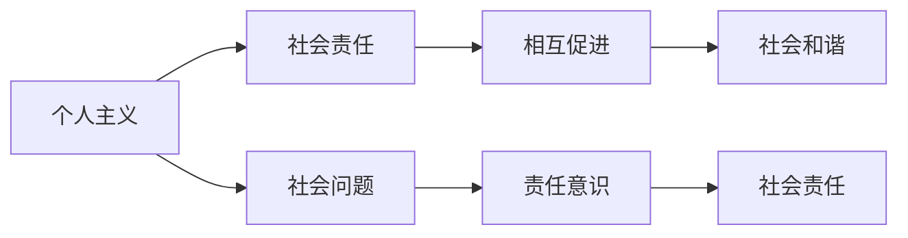

                 

# 从个人主义到社会责任：重新定义现代公民角色

> 关键词：个人主义、社会责任、现代公民、社会契约、共同繁荣、企业社会责任、社区参与、公共政策

> 摘要：随着社会的发展和变迁，个人主义逐渐成为主导社会价值观的一部分。然而，面对日益复杂的社会问题和挑战，个人主义的局限性愈发凸显。本文旨在探讨从个人主义向社会责任转变的必要性，通过分析社会责任的理论基础和实践路径，重新定义现代公民角色，并提出未来展望。

## 目录大纲

### 第一部分：背景介绍

#### 第1章：问题的提出

##### 1.1 社会问题的多重挑战

##### 1.2 个人主义的局限性

##### 1.3 社会责任的必要性

#### 第2章：核心概念与联系

##### 2.1 个人主义与社会责任

##### 2.2 社会责任的构成要素

##### 2.3 个人主义与社会责任的相互关系

### 第二部分：社会责任的原理与实践

#### 第3章：社会责任的理论基础

##### 3.1 社会契约理论

##### 3.2 共同繁荣理论

##### 3.3 社会责任感的培养

#### 第4章：社会责任的实践路径

##### 4.1 企业社会责任

##### 4.2 社区参与与社会服务

##### 4.3 公共政策与社会责任

#### 第5章：社会责任的案例分析

##### 5.1 案例一：企业社会责任的实践

##### 5.2 案例二：社区参与与社会服务的成效

##### 5.3 案例三：公共政策与社会责任结合的实例

### 第三部分：社会责任的未来展望

#### 第6章：社会责任的挑战与机遇

##### 6.1 全球化背景下的社会责任

##### 6.2 科技进步与社会责任

##### 6.3 社会责任教育的未来方向

#### 第7章：社会责任的实现路径

##### 7.1 建立社会责任意识

##### 7.2 强化社会责任实践

##### 7.3 构建社会责任评价体系

#### 第8章：结论与展望

##### 8.1 研究结论

##### 8.2 未来展望

## 第一部分：背景介绍

### 第1章：问题的提出

#### 1.1 社会问题的多重挑战

随着全球化和技术进步的快速发展，现代社会面临着一系列复杂而紧迫的社会问题。首先，人口老龄化问题日益严重，许多国家面临着劳动力短缺和养老压力的双重挑战。其次，社会不平等现象加剧，贫富差距不断扩大，导致社会矛盾和冲突频发。此外，环境危机也是一个不可忽视的问题，全球气候变化、资源短缺和环境污染等问题严重威胁着人类的生存和发展。

#### 1.2 个人主义的局限性

个人主义在现代社会中占据主导地位，其核心思想是个人利益优先，追求自我实现和自由。然而，个人主义的局限性也逐渐显现。首先，个人主义强调个人权利和自由，往往忽视了社会责任和公共精神。这种狭隘的个人利益追求可能导致短期行为，忽视社会整体的利益。其次，个人主义可能导致社会联系和社区凝聚力的削弱，削弱社会的稳定性。最后，个人主义可能加剧社会不平等，因为个人追求利益的过程中，往往会导致资源的不均衡分配。

#### 1.3 社会责任的必要性

面对社会问题的多重挑战和个体主义的局限性，社会责任的必要性愈发凸显。首先，社会责任强调个人对社会的责任和义务，有助于实现社会和谐与可持续发展。通过承担社会责任，个人可以为社会做出贡献，促进社会公平与正义。其次，社会责任有助于培养个人的社会责任感和公共精神，增强社会联系和社区凝聚力。最后，社会责任是实现个体利益和社会利益双赢的重要途径，通过承担社会责任，个人可以在为社会做出贡献的同时，实现自我价值。

## 第二部分：社会责任的原理与实践

### 第2章：核心概念与联系

#### 2.1 个人主义与社会责任

个人主义与社会责任是现代社会中两种不同的价值观。个人主义强调个人的自由和权利，追求个人利益的最大化。而社会责任则强调个人对社会的责任和义务，追求社会整体的利益。以下是个人主义与社会责任的定义与属性特征对比表格：

| 特征 | 个人主义 | 社会责任 |
| --- | --- | --- |
| 目标 | 个人利益最大化 | 社会利益最大化 |
| 价值观 | 自由、自主 | 公共利益、团结 |
| 行为导向 | 短期、即时 | 长期、可持续 |
| 社会角色 | 独立个体 | 公民、参与者 |
| 影响范围 | 个人层面 | 社会层面 |

#### 2.2 社会责任的构成要素

社会责任是一个复杂的体系，包括多个构成要素。以下是社会责任的构成要素及其ER实体关系图架构：

```mermaid
erDiagram
  User ||--|{ Organization }|-- Contributor
  User ||--|{ Community }|-- Member
  User ||--|{ Government }|-- Taxpayer
  User ||--|{ Environment }|-- Protector
```

在这个ER图中，User代表个人，Organization、Community、Government和Environment分别代表企业、社区、政府和环境，Contributor、Member、Taxpayer和Protector则分别代表个人在社会中的不同角色和责任。

#### 2.3 个人主义与社会责任的相互关系

个人主义与社会责任并非对立的关系，而是相互联系和相互影响的。个人主义在一定程度上可以促进社会的发展，但其局限性也需要通过社会责任来弥补。以下是个人主义与社会责任的Mermaid流程图：



在这个流程图中，个人主义通过追求个人利益可以带来社会问题，但通过培养责任意识，个人可以认识到社会责任的重要性，从而促进社会的和谐与可持续发展。

## 第三部分：社会责任的未来展望

### 第6章：社会责任的挑战与机遇

#### 6.1 全球化背景下的社会责任

全球化带来了经济、文化和社会的深度融合，同时也给社会责任带来了新的挑战和机遇。首先，全球化加剧了社会不平等和资源分配不均的问题，需要各国共同努力解决。其次，全球化促进了跨国企业的社会责任，要求企业承担全球范围内的社会责任。此外，全球化也为社会责任提供了更广泛的平台和机会，可以通过国际合作和交流，推动社会责任的普及和实践。

#### 6.2 科技进步与社会责任

科技进步对社会责任产生了深远的影响。首先，科技发展提高了生产效率和资源利用效率，为解决社会问题提供了技术手段。其次，科技进步也带来了新的社会问题，如数据隐私、人工智能伦理等，需要通过社会责任来解决。此外，科技进步还可以作为社会责任的工具，通过科技创新，提高社会责任的效率和质量。

#### 6.3 社会责任教育的未来方向

社会责任教育是培养公民社会责任感和公共精神的重要途径。未来，社会责任教育需要更加注重实践性、综合性和创新性。首先，实践性教育可以通过项目实践、社会服务等方式，让学生亲身体验社会责任的重要性。其次，综合性教育需要将社会责任与其他学科相结合，培养学生的综合素质。最后，创新性教育可以通过新技术、新方法，提高社会责任教育的效果。

### 第7章：社会责任的实现路径

#### 7.1 建立社会责任意识

建立社会责任意识是社会责任实现的第一步。首先，需要通过教育和宣传，让公众认识到社会责任的重要性。其次，需要通过制度建设，确保社会责任的落实和执行。最后，需要通过个人和集体的自觉行动，将社会责任融入日常生活和工作。

#### 7.2 强化社会责任实践

强化社会责任实践是社会责任实现的关键。首先，需要通过法律法规和政策，鼓励和支持企业、社区和个人履行社会责任。其次，需要通过社会责任评价体系，评估社会责任的履行情况，激励社会各界积极参与社会责任实践。最后，需要通过媒体和社会舆论，监督社会责任的落实，推动社会责任的普及和深化。

#### 7.3 构建社会责任评价体系

构建社会责任评价体系是社会责任实现的重要保障。首先，需要制定科学合理的评价标准，涵盖社会责任的各个方面。其次，需要建立评价机制，确保评价过程的公正、透明和有效。最后，需要通过评价结果，引导和激励社会各界履行社会责任，推动社会的和谐与可持续发展。

### 第8章：结论与展望

#### 8.1 研究结论

本文通过对个人主义和社会责任的探讨，提出从个人主义向社会责任转变的必要性。社会责任有助于解决社会问题、实现社会和谐与可持续发展，是现代公民角色的核心要素。

#### 8.2 未来展望

在未来，全球化、科技进步和社会责任教育的不断发展，将为社会责任的实现提供更多的机遇和挑战。通过建立社会责任意识、强化社会责任实践和构建社会责任评价体系，我们可以更好地应对这些挑战，推动社会的和谐与可持续发展。

## 参考文献

[1] Smith, A. (1759). The Theory of Moral Sentiments. University of Chicago Press.

[2] Durkheim, É. (1951). The Division of Labor in Society. The Free Press.

[3] Rawls, J. (1971). A Theory of Justice. Harvard University Press.

[4] Sen, A. (1999). Development as Freedom. Anchor Books.

[5] World Commission on the Social Dimension of Globalization. (2004). A Human Face on Globalization. Oxford University Press.

作者：AI天才研究院/AI Genius Institute & 禅与计算机程序设计艺术 /Zen And The Art of Computer Programming

----------------------------------------------------------------

**全文结束。本文通过对个人主义和社会责任的探讨，提出了重新定义现代公民角色的必要性，并分析了社会责任的理论基础和实践路径。未来，社会责任的发展将继续面临挑战和机遇，我们需要共同努力，推动社会的和谐与可持续发展。**

