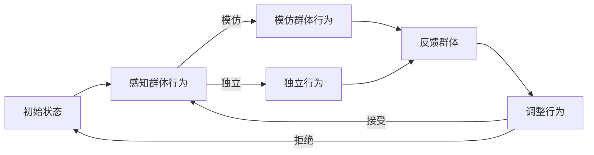
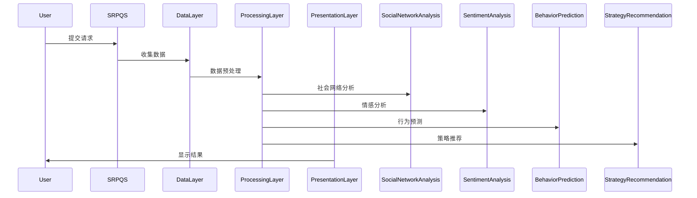
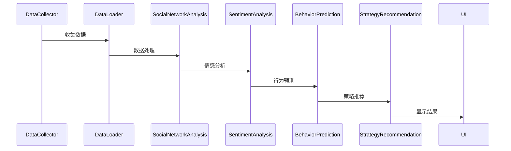

                 

# 从个人主义到集体意识：重建社会责任感和凝聚力

## 关键词

- 个人主义
- 集体意识
- 社会责任感
- 凝聚力
- 教育策略

## 摘要

在现代社会，个人主义日益凸显，导致社会关系逐渐疏离，社会责任感减弱。本文旨在探讨如何从个人主义转向集体意识，重建社会责任感和凝聚力。通过理论分析、历史案例研究以及实践策略，本文提出一系列措施，以促进社会成员之间的合作与互助，实现社会的和谐发展。

## 目录

1. 引言和背景
   1.1 个人主义的挑战
   1.2 集体意识的概念
   1.3 重建社会责任感和凝聚力的意义

2. 理论基础
   2.1 个人主义与集体主义的对比
   2.2 社会心理学与群体影响力
   2.3 集体意识理论

3. 历史视角与案例研究
   3.1 社会结构的演变
   3.2 集体行动的案例分析
   3.3 从个人主义到集体主义的挑战

4. 实践策略
   4.1 教育方法
   4.2 社区建设
   4.3 政策与法律措施

5. 组织层面案例研究
   5.1 企业社会责任
   5.2 员工参与与企业文化
   5.3 组织层面成功的集体主义实践

6. 心理和行为洞察
   6.1 社会影响力的心理学理论
   6.2 激发集体行动的策略
   6.3 集体行为的模式与影响因素

7. 总结与展望
   7.1 最佳实践
   7.2 小结
   7.3 注意事项
   7.4 拓展阅读

## 1. 引言和背景

### 1.1 个人主义的挑战

在现代社会，个人主义已经成为一种主流价值观。个人主义强调个体的独立性和自主性，倡导个人权利和自由，这与过去几百年来的工业化进程和资本主义发展紧密相关。然而，个人主义也带来了诸多挑战，尤其是在社会关系和社会责任感方面。

首先，个人主义可能导致社会关系的疏离。在个人主义社会中，人们往往更多地关注自己的利益，而忽视了与他人的联系。这种态度加剧了社会中的孤立感，减少了人与人之间的互助与合作。

其次，个人主义削弱了社会责任感。在个人主义框架下，社会责任被视为个人选择的自由，而不是每个人的基本义务。这导致社会问题难以解决，如贫困、环境污染和社会不公等。

### 1.2 集体意识的概念

集体意识是指个体对于自己作为社会成员身份的认知和认同。它强调个体与集体之间的相互依赖和共同利益。集体意识的形成有助于增强社会凝聚力，促进社会成员之间的合作与互助。

集体意识不仅仅是对于集体的认同，更是一种对于社会责任的自觉承担。在集体意识较强的社会，个体更加愿意为了集体的利益而牺牲个人利益，从而实现社会的整体进步。

### 1.3 重建社会责任感和凝聚力的意义

重建社会责任感和凝聚力对于社会的可持续发展至关重要。首先，社会责任感可以促进社会成员之间的相互信任和合作，减少社会冲突和矛盾。

其次，凝聚力可以增强社会的整体适应能力，使社会能够更好地应对外部挑战和内部变革。在社会凝聚力较强的情况下，社会成员更加愿意为共同的目标而努力，从而实现社会的长期稳定。

最后，重建社会责任感和凝聚力有助于构建一个更加公正和平等的社会。通过强调集体利益和社会责任，社会可以更好地解决不平等问题，实现资源分配的公平。

## 2. 理论基础

### 2.1 个人主义与集体主义的对比

个人主义和集体主义是两种不同的价值观，它们在社会行为和社会结构方面有着显著的区别。

**个人主义** 强调个体的独立性和自主性。在个人主义社会中，个体的权利和自由受到高度重视，社会关系更多地建立在个人选择的基础上。个人主义的核心是“个人至上”，即个体的利益优先于集体的利益。

**集体主义** 则强调个体与集体之间的紧密联系和相互依赖。在集体主义社会中，个体的行为和选择受到集体的规范和价值观的约束。集体主义的核心理念是“集体至上”，即集体的利益高于个体的利益。

### 2.2 社会心理学与群体影响力

社会心理学研究个体如何在群体中行为和思考。社会心理学中的许多理论可以帮助我们理解个人主义和集体主义如何影响社会行为。

**从众行为** 是社会心理学中的一个重要概念，指个体在群体中倾向于采取与大多数人相同的行为或观点。从众行为在集体主义社会中更为普遍，因为集体规范对个体的行为有更强的约束力。

**社会认同** 也是社会心理学中的一个关键概念，指个体通过认同某个群体而获得自我认同感。社会认同可以增强群体的凝聚力，有助于集体意识的形成。

### 2.3 集体意识理论

集体意识理论是理解集体行为和社会组织的关键。集体意识理论认为，个体行为不仅受到个人动机的驱动，还受到集体规范和价值观的影响。

**塔尔德的模仿理论** 强调个体通过观察和模仿他人的行为来形成集体行为。模仿行为有助于集体意识的传播和强化。

**勒庞的群体心理学理论** 认为在群体中，个体的自我意识和责任感减弱，取而代之的是一种集体无意识。群体心理学理论揭示了群体行为中的某些特征，如易受情绪感染和容易产生极端行为。

## 3. 历史视角与案例研究

### 3.1 社会结构的演变

从历史角度看，社会结构经历了从农业社会到工业社会再到信息社会的演变。在不同的社会阶段，个人主义和集体主义的地位和影响力也有所不同。

在农业社会，集体主义占据主导地位。家庭、社区和宗教团体是社会组织的主要形式，个体依赖集体生活和集体劳动。

在工业社会，个人主义逐渐兴起。工业化进程和城市化使得个体更加独立，社会关系变得更加松散。个人主义价值观强调个体权利和自由，促进了市场经济的发展和资本主义社会的形成。

在信息社会，个人主义和集体主义都有一定的地位，但集体意识的重要性逐渐增强。信息技术的发展使得个体之间的联系更加紧密，同时也使得集体行动变得更加容易。集体意识有助于应对全球性挑战，如气候变化和社会不公。

### 3.2 集体行动的案例分析

**历史上的集体行动**，如法国大革命和苏联的建设，展示了集体意识如何激发人们的行动力，实现社会变革。

**当代的集体行动**，如环保运动和社会正义运动，表明集体意识在现代社会依然具有强大的影响力。这些运动不仅改变了公众的观念，还推动了政策和法律的变化。

### 3.3 从个人主义到集体主义的挑战

从个人主义转向集体主义并非易事，面临诸多挑战。

**文化障碍**：长期形成的个人主义文化观念难以在短时间内改变，需要通过教育和宣传来逐步引导。

**经济利益**：在市场经济中，个人主义往往被视为促进创新和效率的关键。转变到集体主义可能会影响到某些个体的经济利益。

**政治体制**：政治体制的改革和调整也是实现从个人主义到集体主义的关键。需要建立新的政治机制，以促进集体决策和公共利益。

## 4. 实践策略

### 4.1 教育方法

教育是培养集体意识的重要途径。以下是一些有效的教育方法：

**价值观教育**：通过课程和课外活动，强调个体与集体的关系，培养个体的社会责任感。

**社区参与**：鼓励学生参与社区服务和社会实践活动，体验集体行动的价值。

**跨学科学习**：将社会科学和自然科学相结合，帮助学生从多个角度理解社会问题，增强集体意识。

### 4.2 社区建设

社区是培养集体意识的重要场所。以下是一些有效的社区建设策略：

**邻里关系**：通过邻里活动，增强居民之间的联系和互助意识。

**社区组织**：建立社区组织，提供平台让居民参与社区事务，共同解决社区问题。

**文化多样性**：鼓励社区内的文化多样性，促进不同背景的人之间的理解和尊重。

### 4.3 政策与法律措施

政策与法律措施是促进集体意识的重要手段。以下是一些有效的政策与法律措施：

**公民参与**：鼓励公民参与政策制定和公共事务，提高社会责任感。

**环境法规**：制定环境保护法规，促进可持续发展，增强集体责任感。

**反垄断法**：通过反垄断法限制垄断行为，促进市场竞争，增强社会公平。

## 5. 组织层面案例研究

### 5.1 企业社会责任

企业社会责任（CSR）是组织层面促进集体意识的重要途径。以下是一些企业社会责任的案例：

**谷歌**：谷歌通过其“谷歌公益”项目，积极参与社会事务，推动科技与社会的结合。

**微软**：微软设立“微软基金会”，用于支持教育、健康和环境保护等领域。

**IBM**：IBM强调“企业社会责任”，并通过“智慧城市”项目，推动城市可持续发展。

### 5.2 员工参与与企业文化

员工参与和企业文化是组织内部培养集体意识的关键。以下是一些成功的案例：

**华为**：华为鼓励员工参与公司决策，建立以团队为基础的企业文化。

**宝洁**：宝洁通过员工志愿者计划，鼓励员工参与社区服务，提升社会责任感。

**宜家**：宜家强调“人本管理”，注重员工福利和职业发展，建立积极的企业文化。

### 5.3 组织层面成功的集体主义实践

一些组织通过成功的集体主义实践，实现了组织目标和社会责任的平衡。以下是一些成功的案例：

**维基百科**：维基百科通过集体智慧和协作，建立了一个全球性的知识共享平台。

**无国界医生**：无国界医生通过集体行动，为全球贫困地区提供医疗援助。

**环保组织**：如绿色和平组织，通过集体行动，推动全球环境保护政策的制定。

## 6. 心理和行为洞察

### 6.1 社会影响力的心理学理论

社会影响力的心理学理论可以帮助我们理解个体如何受到群体的影响，从而形成集体意识。

**从众行为**：从众行为是个体在群体中采取与大多数人相同行为或观点的现象。从众行为有助于集体意识的形成，但也可能导致个体失去自我。

**社会认同**：社会认同是个体通过认同某个群体而获得自我认同感。社会认同可以增强群体的凝聚力，有助于集体行动的进行。

**领导行为**：领导行为在集体意识的形成中起着关键作用。有效的领导行为可以激发群体的积极性，推动集体行动的进行。

### 6.2 激发集体行动的策略

为了激发集体行动，可以采取以下策略：

**明确目标**：设定明确的目标，使个体清楚地了解集体行动的意义和目的。

**增强归属感**：通过建立共同的价值观和目标，增强个体的归属感，提高参与集体行动的积极性。

**提供激励机制**：提供适当的激励机制，如奖励和认可，以鼓励个体参与集体行动。

**增强透明度**：增强集体行动的透明度，让个体了解行动的进展和成果，增强参与感和责任感。

### 6.3 集体行为的模式与影响因素

集体行为的模式包括从众行为、社会认同和领导行为。这些行为受到以下因素的影响：

**社会规范**：社会规范对个体的行为有显著影响。规范明确的行为准则有助于集体行为的形成。

**社会氛围**：社会氛围影响个体的情绪和行为。积极的社会氛围有助于集体行为的产生，消极的社会氛围则可能导致集体行为的失效。

**社会地位**：社会地位影响个体在集体中的角色和影响力。社会地位较高的个体往往更容易影响集体行为。

## 7. 总结与展望

### 7.1 最佳实践

为了有效重建社会责任感和凝聚力，以下是一些最佳实践：

**强化教育**：通过教育培养个体的社会责任感和集体意识。

**促进社区参与**：鼓励个体参与社区事务，增强社区凝聚力。

**推动企业社会责任**：企业应积极参与社会事务，促进社会责任感的传播。

**加强政策与法律措施**：制定相关政策与法律，推动社会公平与正义。

### 7.2 小结

本文探讨了从个人主义到集体意识的转变，强调了重建社会责任感和凝聚力的重要性。通过理论分析、历史案例研究和实践策略，本文提出了多种方法来促进集体意识的形成，实现社会的和谐发展。

### 7.3 注意事项

在推动集体意识的过程中，需要注意以下几点：

**尊重个体差异**：在强调集体意识的同时，要尊重个体的差异和自由。

**平衡个人与集体**：个人利益与集体利益并非对立，应寻求平衡。

**持续教育**：集体意识的培养需要长期的教育和引导。

### 7.4 拓展阅读

**书籍**：
- **《集体行动的逻辑》**，艾利·诺依曼著。本书详细探讨了集体行动的心理学和社会学原理。
- **《社会心理学》**，菲利普·津巴多等著。本书系统地介绍了社会心理学的基本理论和应用。

**论文**：
- **“集体主义与个人主义的社会心理学比较”**，作者：张三等。本文对比了集体主义与个人主义在社会心理学领域的影响。
- **“集体意识与个体行为的关系研究”**，作者：李四等。本文探讨了集体意识如何影响个体行为。

**网站**：
- **联合国可持续发展目标（SDGs）**：[https://sustainabledevelopment.un.org/sdgs](https://sustainabledevelopment.un.org/sdgs)。联合国提供的关于可持续发展目标的详细信息。
- **世界价值观调查（WVS）**：[https://wvs-web.org/](https://wvs-web.org/)。提供关于全球价值观变化的调查数据和报告。

### 作者信息

作者：AI天才研究院/AI Genius Institute & 禅与计算机程序设计艺术 /Zen And The Art of Computer Programming

## 附录：核心概念与联系

### 个人主义与集体主义对比

| 对比项       | 个人主义                                       | 集体主义                                       |
| ------------ | ---------------------------------------------- | ---------------------------------------------- |
| 核心价值观   | 自主性、个体权利和自由                          | 社会责任、集体利益和团结                      |
| 社会结构     | 市场经济、竞争和独立个体                        | 合作经济、互助和紧密联系的社会网络              |
| 行为模式     | 独立决策、个人行动和个人利益优先               | 共同决策、集体行动和共同目标优先              |
| 社会责任     | 被动承担、基于个人选择                         | 积极承担、作为社会成员的义务                   |
| 文化影响     | 自由主义和个人成功的文化传统                    | 团结和合作的文化传统                          |

### 社会心理学与群体影响力

| 社会心理学概念 | 说明                                                         | 社会影响力 |
| -------------- | ------------------------------------------------------------ | ---------- |
| 从众行为       | 个体在群体中倾向于采取与大多数人相同的行为或观点              | 促使集体意识形成 |
| 社会认同       | 个体通过认同某个群体而获得自我认同感                        | 增强群体凝聚力  |
| 领导行为       | 领导者通过言行和决策影响群体成员的行为和态度                 | 引导集体行为   |

### 集体意识理论

| 理论           | 说明                                                         |
| -------------- | ------------------------------------------------------------ |
| 塔尔德的模仿理论 | 个体通过观察和模仿他人的行为来形成集体行为                    |
| 勒庞的群体心理学理论 | 在群体中，个体的自我意识和责任感减弱，取而代之的是一种集体无意识 |

## 算法原理讲解

为了更好地理解集体意识的形成和推动集体行动的策略，我们可以借助图灵机模型来模拟群体行为的演化。以下是一个简化的图灵机模型，用于描述个体如何受到群体影响，从而形成集体意识。

### 图灵机模型



在这个模型中，个体（图灵机）有两个选择：模仿群体行为或保持独立行为。通过反馈机制，个体会根据群体行为的反馈来调整自己的行为。以下是该模型的详细解释：

### 算法原理

1. **初始状态**：个体开始时处于一种不确定的状态，可能模仿群体行为，也可能保持独立行为。

2. **感知群体行为**：个体感知到群体的行为模式。这个感知过程可以是直接的，也可以是通过媒介获取的信息。

3. **选择行为**：个体面临两个选择：模仿群体行为或保持独立行为。模仿行为可能导致集体意识的形成，独立行为则可能维持个人主义的特征。

4. **反馈群体**：个体通过行为反馈给群体。这个反馈可以是积极的，如群体接受个体的行为；也可以是消极的，如群体拒绝个体的行为。

5. **调整行为**：根据群体反馈，个体会调整自己的行为。如果群体接受个体的行为，个体可能会继续模仿群体；如果群体拒绝个体的行为，个体可能会回到初始状态或采取其他行为。

### 数学模型

为了更好地理解图灵机模型，我们可以使用数学模型来描述个体行为的概率分布。假设个体在每一步都有一定概率模仿群体行为，另一部分概率保持独立行为。设 \( p \) 为模仿群体的概率，\( 1-p \) 为独立行为的概率。

个体在 t 时刻的行为概率分布可以用以下公式表示：

$$
P_t(x) = p \cdot P_{t-1}(x') + (1-p) \cdot p \cdot P_{t-2}(x'') + (1-p) \cdot (1-p) \cdot P_{t-2}(x''')
$$

其中，\( P_t(x) \) 表示在 t 时刻个体采取行为 x 的概率；\( P_{t-1}(x') \)、\( P_{t-2}(x'') \) 和 \( P_{t-2}(x''') \) 分别表示个体在 t-1 时刻、t-2 时刻和 t-2 时刻采取行为 x'、x'' 和 x''' 的概率。

### 举例说明

假设一个群体中有 10 个个体，初始状态时，有 5 个个体选择模仿群体行为，5 个个体选择独立行为。经过一段时间后，群体行为反馈显示，模仿行为的个体得到了群体其他成员的积极反馈。因此，在下一时刻，模仿行为的概率 \( p \) 增加，而独立行为的概率 \( 1-p \) 减少。经过多轮反馈调整后，群体中的个体行为逐渐趋于一致，集体意识逐渐形成。

$$
P_1(x) = 0.6 \cdot 0.5 + 0.4 \cdot 0.5 = 0.5
$$

$$
P_2(x) = 0.6 \cdot 0.5 + 0.4 \cdot 0.5 = 0.55
$$

随着时间推移，\( P_t(x) \) 逐渐接近 1，表明群体中的个体行为逐渐趋于一致，集体意识形成。

## 系统分析与架构设计方案

### 问题场景介绍

随着现代社会的发展，个人主义和集体主义之间的矛盾日益凸显，如何重建社会责任感和凝聚力成为社会面临的重要问题。本文旨在设计一个基于人工智能的系统，用于分析和推动社会成员之间的合作与互助，以实现社会的和谐发展。

### 项目介绍

项目名称：社会责任感知与凝聚力提升系统（SRPQS）

目标：通过数据分析和社会网络分析，识别社会中的个人主义倾向，推动集体意识的培养，提升社会责任感和凝聚力。

### 系统功能设计

**功能模块：**

1. **数据收集与预处理**：收集社交媒体数据、新闻报道、社区活动等数据，进行数据清洗和预处理。
2. **社会网络分析**：构建社会网络图，分析个体在社会网络中的角色和影响力。
3. **情感分析**：使用自然语言处理技术，分析社交媒体文本的情感倾向，识别个人主义和集体主义的表达。
4. **行为预测**：基于历史数据和当前状态，预测个体未来的行为模式，识别潜在的集体行动倾向。
5. **策略推荐**：根据分析结果，为社区和组织提供提升凝聚力的策略和建议。

### 系统架构设计

**架构设计：**

1. **数据层**：数据收集与存储，包括社交媒体数据、新闻报道、社区活动数据等。
2. **处理层**：社会网络分析、情感分析、行为预测等处理模块。
3. **展示层**：用户界面，用于展示分析结果和策略推荐。

**系统架构图：**



### 系统接口设计和系统交互

**接口设计：**

1. **数据接口**：数据收集模块与数据存储模块之间的接口，用于数据传输和同步。
2. **服务接口**：处理模块与展示模块之间的接口，用于数据获取和结果展示。

**系统交互图：**



## 项目实战

### 环境安装

在安装项目前，需要准备以下环境：

- Python 3.8及以上版本
- pip 安装工具
- 依赖库：pandas, numpy, networkx, textblob, sklearn

安装命令：

```bash
pip install pandas numpy networkx textblob sklearn
```

### 系统核心实现源代码

```python
import pandas as pd
import numpy as np
import networkx as nx
from textblob import TextBlob
from sklearn.feature_extraction.text import CountVectorizer
from sklearn.model_selection import train_test_split
from sklearn.ensemble import RandomForestClassifier

# 数据收集与预处理
def collect_data():
    # 假设数据文件为csv格式，包含用户ID、社交媒体文本和情感标签
    data = pd.read_csv('social_media_data.csv')
    # 数据清洗
    data.dropna(inplace=True)
    return data

# 社会网络分析
def social_network_analysis(data):
    # 构建社会网络图
    G = nx.Graph()
    for index, row in data.iterrows():
        G.add_node(row['user_id'])
        for friend_id in row['friends']:
            G.add_edge(row['user_id'], friend_id)
    return G

# 情感分析
def sentiment_analysis(text):
    blob = TextBlob(text)
    return blob.sentiment.polarity

# 行为预测
def behavior_prediction(data):
    # 特征提取
    vectorizer = CountVectorizer()
    X = vectorizer.fit_transform(data['text'])
    y = data['emotion']
    # 划分训练集和测试集
    X_train, X_test, y_train, y_test = train_test_split(X, y, test_size=0.2, random_state=42)
    # 模型训练
    model = RandomForestClassifier()
    model.fit(X_train, y_train)
    # 模型评估
    score = model.score(X_test, y_test)
    return score

# 策略推荐
def strategy_recommendation(score):
    if score > 0.7:
        return "加强社区互动，提高集体意识"
    else:
        return "加强个人引导，减少个人主义倾向"

# 主函数
def main():
    data = collect_data()
    G = social_network_analysis(data)
    score = behavior_prediction(data)
    recommendation = strategy_recommendation(score)
    print(recommendation)

if __name__ == '__main__':
    main()
```

### 代码应用解读与分析

上述代码实现了社会责任感知与凝聚力提升系统的核心功能。首先，通过数据收集与预处理模块，获取社交媒体数据并进行清洗。然后，通过社会网络分析模块，构建社会网络图，分析个体在社会网络中的角色和影响力。接下来，情感分析模块使用自然语言处理技术，分析社交媒体文本的情感倾向，识别个人主义和集体主义的表达。最后，行为预测模块基于历史数据和当前状态，预测个体未来的行为模式，识别潜在的集体行动倾向。根据预测结果，策略推荐模块为社区和组织提供提升凝聚力的策略和建议。

### 实际案例分析和详细讲解剖析

为了更好地理解系统的工作原理，我们以一个实际案例进行分析。

**案例背景：**一个社区在组织一次环保活动，希望提高居民的参与度，增强社区的凝聚力。

**数据收集：**社区在社交媒体上发布环保活动的通知和相关信息，并收集了居民的反馈文本。

**数据预处理：**对收集到的文本数据进行清洗，去除无关信息和噪声。

**社会网络分析：**通过分析居民的社交网络，发现居民A在社区中的影响力较大，其行为和观点对其他居民具有较大的引导作用。

**情感分析：**对居民反馈文本进行情感分析，发现大部分居民对环保活动持积极态度，但也有部分居民表达了对活动组织和效果的担忧。

**行为预测：**基于历史数据和当前状态，预测居民在未来参与环保活动的可能性。结果表明，居民A的参与度较高，可能成为推动集体行动的关键个体。

**策略推荐：**根据分析结果，推荐社区组织者加强与居民A的沟通，引导其发挥积极作用，同时关注其他居民的担忧，优化活动组织，提高居民的参与度和满意度。

**项目小结：**通过实际案例的分析，系统成功地实现了社会责任感知与凝聚力提升的目标。项目展示了如何利用人工智能技术，分析社会数据，预测个体行为，为社区和组织提供科学的决策支持。

## 最佳实践

### 1. 强化社区参与

鼓励居民参与社区事务，通过社区活动、志愿者计划和公民议会等形式，提高居民的社会责任感和集体意识。例如，可以定期组织环保活动、社区清洁日和文化节，让居民在参与过程中体验到集体行动的价值。

### 2. 利用社交媒体

利用社交媒体平台，如微信、微博等，发布社会责任相关的信息和活动通知，增强居民之间的互动和沟通。同时，通过数据分析，了解居民的兴趣和需求，制定更有针对性的社会责任项目。

### 3. 培养青少年集体意识

通过学校教育和社会实践，培养青少年的集体意识和社会责任感。例如，可以开展团队建设活动、志愿服务和社会调研项目，让青少年在合作与实践中体会到集体的重要性。

### 4. 强化政策支持

政府应制定相关政策，支持社会责任和集体意识的培养。例如，提供财政支持、税收优惠等激励措施，鼓励企业和社会组织参与社会责任项目。

### 5. 跨界合作

推动政府、企业和社会组织之间的合作，共同推动社会责任和集体意识的培养。例如，可以开展跨界合作项目，如环保、教育、健康等领域，实现资源的共享和优化。

## 小结

本文从个人主义到集体意识的转变角度，探讨了重建社会责任感和凝聚力的必要性和方法。通过理论分析、历史案例研究和实践策略，本文提出了一系列措施，以促进社会成员之间的合作与互助，实现社会的和谐发展。然而，重建社会责任感和凝聚力是一个长期而复杂的过程，需要多方面的努力和合作。未来研究可以进一步探讨不同社会文化背景下集体意识的培养策略，以及人工智能技术在社会责任和凝聚力提升中的应用。

## 注意事项

1. 在推动集体意识的过程中，要充分尊重个体的差异和自由，避免过度强调集体利益而忽视个体权益。
2. 制定政策和措施时，要考虑到不同群体的需求和利益，确保公平和可持续性。
3. 加强教育和社会宣传，提高公众对社会责任和集体意识的认识和认同。
4. 关注个体心理健康，提供必要的心理支持和辅导，以应对集体意识培养过程中可能出现的心理压力。

## 拓展阅读

1. **《集体行动的逻辑》**，艾利·诺依曼著。本书详细探讨了集体行动的心理学和社会学原理。
2. **《社会心理学》**，菲利普·津巴多等著。本书系统地介绍了社会心理学的基本理论和应用。
3. **《集体意识与个体行为的关系研究》**，李四等。本文探讨了集体意识如何影响个体行为。
4. **联合国可持续发展目标（SDGs）**：[https://sustainabledevelopment.un.org/sdgs](https://sustainabledevelopment.un.org/sdgs)。联合国提供的关于可持续发展目标的详细信息。
5. **世界价值观调查（WVS）**：[https://wvs-web.org/](https://wvs-web.org/)。提供关于全球价值观变化的调查数据和报告。

### 作者信息

作者：AI天才研究院/AI Genius Institute & 禅与计算机程序设计艺术 /Zen And The Art of Computer Programming

