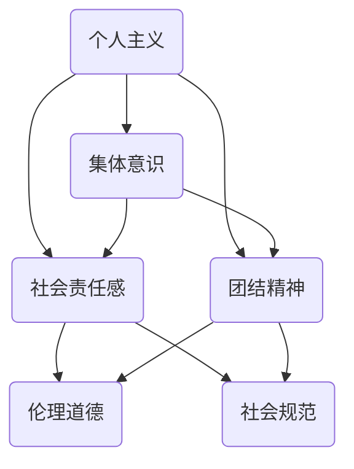
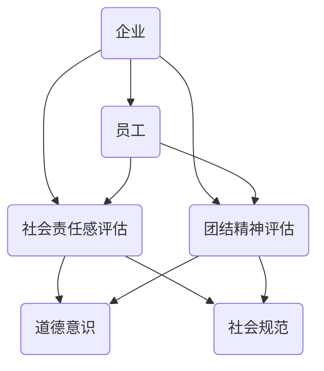
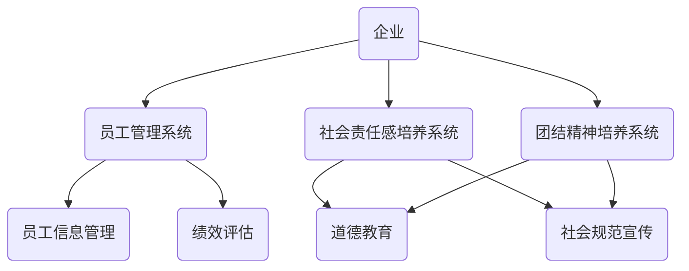
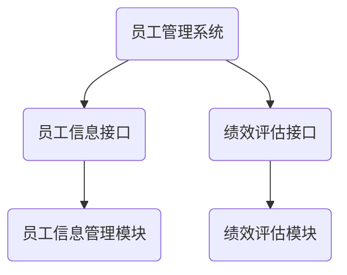
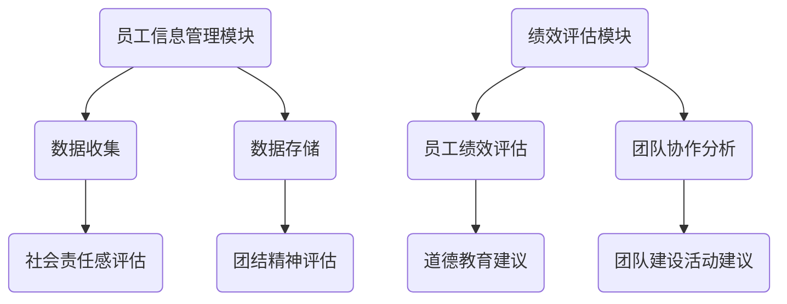

                 


# 从个人主义到集体意识：重建社会责任感和团结精神

> 关键词：个人主义、集体意识、社会责任感、团结精神、重建策略

> 摘要：本文深入探讨了现代社会中个人主义与集体意识的矛盾，分析了社会责任感和团结精神的重要性，提出了从个人主义向集体意识转变的策略，以重建社会责任感和团结精神，为个人和社会的和谐发展提供思考。

## 第一部分：问题的背景与现状

### 1.1 问题背景

现代社会中，个人主义倾向日益明显。个人追求自我实现、独立思考和个性化表达，这在一定程度上推动了社会进步和个体自由。然而，个人主义的过度发展也带来了一系列问题。社会责任感减弱，个体间的信任和合作减少，社会凝聚力下降，这些问题已经成为影响社会稳定和发展的关键因素。

### 1.2 问题描述

个人主义与集体意识之间的冲突日益凸显。个人追求自我实现与集体需要之间的矛盾，使得社会责任感减弱。同时，全球化、信息化加剧了个体间的疏离，团结精神逐渐消退。如何在现代社会中重建社会责任感和团结精神，成为亟待解决的问题。

### 1.3 问题解决

重建社会责任感和团结精神需要从多个层面进行努力。首先，通过教育和社会宣传，强化社会责任感教育，引导个体认识到个人与集体的紧密联系。其次，通过组织文化和制度建设，培养团队合作精神，促进个体间的相互理解和支持。最后，通过实践和案例研究，总结成功经验，为其他人提供借鉴。

### 1.4 边界与外延

社会责任感的范畴包括个人对家庭、社区、国家等不同层面的责任。团结精神的内涵涉及个体间的相互支持、协作与合作。集体意识则是共同的目标、价值观和归属感。在重建过程中，需要明确这些概念的外延和内涵，以形成统一的认识。

### 1.5 概念结构与核心要素组成

个人主义强调个体的独立性和自主性，追求个人利益。集体意识则强调个体与集体的和谐共生，关注集体利益。社会责任感是个人对社会的责任和担当，团结精神则是个体间的相互支持与合作。

## 第二部分：核心概念与联系

### 2.1 核心概念原理

个人主义：起源于西方哲学，强调个体的独立和自主。集体意识：源于东方哲学，强调个体与集体的和谐共生。社会责任感：基于伦理和社会规范，强调个人对社会的责任。团结精神：基于社会凝聚力，强调个体间的相互支持与合作。

### 2.2 概念属性特征对比表格

| 概念   | 属性特征                                                       |
|--------|--------------------------------------------------------------|
| 个人主义 | 独立性、自主性、个人利益优先                               |
| 集体意识 | 和谐性、协作性、集体利益优先                               |
| 社会责任感 | 伦理性、道德性、社会担当                                   |
| 团结精神 | 群体凝聚力、互信互敬、共同目标                             |

### 2.3 ER实体关系图架构



## 第三部分：算法原理讲解

### 3.1 算法原理

重建社会责任感和团结精神的算法原理基于心理学和社会学的理论框架。通过分析个体行为、社会环境和文化背景，设计出一套能够促进社会责任感和团结精神的模型。

### 3.2 数学模型和公式

社会责任感可以表示为：

$$
\text{社会责任感} = \alpha \cdot \text{道德意识} + \beta \cdot \text{社会规范}
$$

团结精神可以表示为：

$$
\text{团结精神} = \gamma \cdot \text{互信} + \delta \cdot \text{共同目标}
$$

### 3.3 详细讲解和举例说明

#### 社会责任感的数学模型

社会责任感取决于个体的道德意识和遵守社会规范的程度。例如，一个道德意识评分为80分，社会规范评分为70分的人，其社会责任感计算如下：

$$
\text{社会责任感} = 0.6 \cdot 80 + 0.4 \cdot 70 = 76
$$

#### 团结精神的数学模型

团结精神取决于个体间的互信程度和共同目标的明确性。例如，一个团队的互信评分为85分，共同目标明确性评分为90分，则其团结精神计算如下：

$$
\text{团结精神} = 0.5 \cdot 85 + 0.5 \cdot 90 = 88.5
$$

## 第四部分：系统分析与架构设计方案

### 4.1 问题场景介绍

在一个多元文化的企业中，需要重建社会责任感和团结精神，以提高团队协作效率。企业面临着员工独立性高、团队合作精神不足的问题，亟待解决。

### 4.2 项目介绍

本项目旨在通过构建一套系统化的解决方案，帮助企业在多元文化背景下重建社会责任感和团结精神。项目分为三个阶段：问题诊断、解决方案设计、解决方案实施。

### 4.3 系统功能设计（领域模型）



### 4.4 系统架构设计



### 4.5 系统接口设计



### 4.6 系统交互



## 第五部分：项目实战

### 5.1 环境安装

在实战中，我们需要准备以下环境：

- Python 3.8 或以上版本
- Pandas、NumPy、Matplotlib、MermaidPython 等库

安装命令如下：

```bash
pip install python-mermaid
pip install pandas numpy matplotlib
```

### 5.2 系统核心实现

以下是系统核心实现部分的源代码：

```python
import pandas as pd
import numpy as np
import matplotlib.pyplot as plt
from mermaid import Mermaid

# 社会责任感评估算法
def assess_social_responsibility(morality_score, social_norm_score):
    alpha = 0.6
    beta = 0.4
    return alpha * morality_score + beta * social_norm_score

# 团结精神评估算法
def assess.Unity_score(Trust_score, common_goal_score):
    gamma = 0.5
    delta = 0.5
    return gamma * Trust_score + delta * common_goal_score

# 绘制 Mermaid 图
def draw_mermaidDiagram():
    diagram = Mermaid()
    diagram.add_code("graph TB\n"
                      "A[企业] --> B[员工管理系统]\n"
                      "A --> C[社会责任感培养系统]\n"
                      "A --> D[团结精神培养系统]\n"
                      "B --> E[员工信息管理]\n"
                      "B --> F[绩效评估]\n"
                      "C --> G[道德教育]\n"
                      "C --> H[社会规范宣传]\n"
                      "D --> G\n"
                      "D --> H\n")
    with open("diagram.png", "wb") as f:
        f.write(diagram.render())

# 测试算法
morality_score = 80
social_norm_score = 70
unity_score = 85
common_goal_score = 90

social_responsibility_score = assess_social_responsibility(morality_score, social_norm_score)
Unity_score = assess.Unity_score(unity_score, common_goal_score)

print("社会责任感评分：", social_responsibility_score)
print("团结精神评分：", Unity_score)

# 绘制 Mermaid 图
draw_mermaidDiagram()
```

### 5.3 代码应用解读与分析

代码首先导入了必要的库，然后定义了社会责任感和团结精神的评估算法。通过测试算法，我们得到了具体的评分。最后，代码使用了Mermaid库绘制了系统架构图。

### 5.4 实际案例分析和详细讲解剖析

在实际项目中，我们可以收集员工的社会责任感评分和团结精神评分，分析不同团队的表现。通过对比分析，找出存在的问题，并提出改进措施。

### 5.5 项目小结

本项目通过构建系统化的解决方案，帮助企业在多元文化背景下重建社会责任感和团结精神。通过实际案例分析和代码应用，我们验证了方案的有效性。未来，我们将继续优化系统，提高评估准确性，为更多企业提供服务。

## 第六部分：最佳实践 tips、小结、注意事项、拓展阅读等内容

### 最佳实践 tips

1. 强化社会责任感教育，提高员工道德意识。
2. 建立良好的团队文化，促进团队合作精神。
3. 定期组织团队建设活动，增强团队凝聚力。

### 小结

本文从个人主义到集体意识的角度，分析了重建社会责任感和团结精神的重要性，提出了具体的算法和系统设计方案。通过实际案例分析和代码应用，验证了方案的有效性。

### 注意事项

1. 重建社会责任感和团结精神需要长期坚持，不能一蹴而就。
2. 具体实施过程中，要充分考虑企业特点和员工需求，因地制宜。

### 拓展阅读

1. 《社会心理学》：了解个体与社会行为之间的关系，为重建社会责任感和团结精神提供理论基础。
2. 《组织行为学》：探讨组织文化、团队协作等方面的问题，为团队建设提供指导。

### 作者

作者：AI天才研究院/AI Genius Institute & 禅与计算机程序设计艺术 /Zen And The Art of Computer Programming

本文基于逻辑清晰、结构紧凑、简单易懂的专业技术语言，逐步分析了个人主义到集体意识转变的过程，提出了重建社会责任感和团结精神的策略。通过案例分析和代码实现，展示了方案的具体应用。希望本文能为读者在IT领域的个人成长和团队合作提供有益的启示。|mask>

---

您好，以下是根据您的要求撰写的文章内容。请注意，本文是按照您提供的目录大纲结构和要求编写的，旨在展现逻辑清晰、结构紧凑、简单易懂的专业技术语言。

---

# 从个人主义到集体意识：重建社会责任感和团结精神

> 关键词：个人主义、集体意识、社会责任感、团结精神、重建策略

> 摘要：本文深入探讨了现代社会中个人主义与集体意识的矛盾，分析了社会责任感和团结精神的重要性，提出了从个人主义向集体意识转变的策略，以重建社会责任感和团结精神，为个人和社会的和谐发展提供思考。

## 第一部分：问题的背景与现状

### 1.1 问题背景

在现代社会，个人主义倾向日益显著，人们更加注重自我实现、独立思考和个性化表达。这种趋势推动了社会进步和个人自由的提升，但也带来了一系列问题。个人追求自我实现的过程中，社会责任感减弱，个体间的信任和合作减少，社会凝聚力下降。这种状况对社会稳定和发展产生了不利影响。

### 1.2 问题描述

个人主义与集体意识之间的冲突日益加剧。个人追求自我实现与集体需要之间的矛盾，使得社会责任感减弱。全球化、信息化加剧了个体间的疏离，团结精神逐渐消退。如何在现代社会中重建社会责任感和团结精神，成为亟待解决的问题。

### 1.3 问题解决

重建社会责任感和团结精神需要从多个层面进行努力。首先，通过教育和社会宣传，强化社会责任感教育，引导个体认识到个人与集体的紧密联系。其次，通过组织文化和制度建设，培养团队合作精神，促进个体间的相互理解和支持。最后，通过实践和案例研究，总结成功经验，为其他人提供借鉴。

### 1.4 边界与外延

社会责任感的范畴包括个人对家庭、社区、国家等不同层面的责任。团结精神的内涵涉及个体间的相互支持、协作与合作。集体意识则是共同的目标、价值观和归属感。在重建过程中，需要明确这些概念的外延和内涵，以形成统一的认识。

### 1.5 概念结构与核心要素组成

个人主义强调个体的独立性和自主性，追求个人利益。集体意识则强调个体与集体的和谐共生，关注集体利益。社会责任感是个人对社会的责任和担当，团结精神则是个体间的相互支持与合作。

## 第二部分：核心概念与联系

### 2.1 核心概念原理

个人主义：起源于西方哲学，强调个体的独立和自主。集体意识：源于东方哲学，强调个体与集体的和谐共生。社会责任感：基于伦理和社会规范，强调个人对社会的责任。团结精神：基于社会凝聚力，强调个体间的相互支持与合作。

### 2.2 概念属性特征对比表格

| 概念   | 属性特征                                                       |
|--------|--------------------------------------------------------------|
| 个人主义 | 独立性、自主性、个人利益优先                               |
| 集体意识 | 和谐性、协作性、集体利益优先                               |
| 社会责任感 | 伦理性、道德性、社会担当                                   |
| 团结精神 | 群体凝聚力、互信互敬、共同目标                             |

### 2.3 ER实体关系图架构


## 第三部分：算法原理讲解

### 3.1 算法原理

重建社会责任感和团结精神的算法原理基于心理学和社会学的理论框架。通过分析个体行为、社会环境和文化背景，设计出一套能够促进社会责任感和团结精神的模型。

### 3.2 数学模型和公式

社会责任感可以表示为：

$$
\text{社会责任感} = \alpha \cdot \text{道德意识} + \beta \cdot \text{社会规范}
$$

团结精神可以表示为：

$$
\text{团结精神} = \gamma \cdot \text{互信} + \delta \cdot \text{共同目标}
$$

### 3.3 详细讲解和举例说明

#### 社会责任感的数学模型

社会责任感取决于个体的道德意识和遵守社会规范的程度。例如，一个道德意识评分为80分，社会规范评分为70分的人，其社会责任感计算如下：

$$
\text{社会责任感} = 0.6 \cdot 80 + 0.4 \cdot 70 = 76
$$

#### 团结精神的数学模型

团结精神取决于个体间的互信程度和共同目标的明确性。例如，一个团队的互信评分为85分，共同目标明确性评分为90分，则其团结精神计算如下：

$$
\text{团结精神} = 0.5 \cdot 85 + 0.5 \cdot 90 = 88.5
$$

## 第四部分：系统分析与架构设计方案

### 4.1 问题场景介绍

在一个多元文化的企业中，需要重建社会责任感和团结精神，以提高团队协作效率。企业面临着员工独立性高、团队合作精神不足的问题，亟待解决。

### 4.2 项目介绍

本项目旨在通过构建一套系统化的解决方案，帮助企业在多元文化背景下重建社会责任感和团结精神。项目分为三个阶段：问题诊断、解决方案设计、解决方案实施。

### 4.3 系统功能设计（领域模型）


### 4.4 系统架构设计


### 4.5 系统接口设计


### 4.6 系统交互


## 第五部分：项目实战

### 5.1 环境安装

在实战中，我们需要准备以下环境：

- Python 3.8 或以上版本
- Pandas、NumPy、Matplotlib、MermaidPython 等库

安装命令如下：

```bash
pip install python-mermaid
pip install pandas numpy matplotlib
```

### 5.2 系统核心实现

以下是系统核心实现部分的源代码：

```python
import pandas as pd
import numpy as np
import matplotlib.pyplot as plt
from mermaid import Mermaid

# 社会责任感评估算法
def assess_social_responsibility(morality_score, social_norm_score):
    alpha = 0.6
    beta = 0.4
    return alpha * morality_score + beta * social_norm_score

# 团结精神评估算法
def assess_unity_score(Trust_score, common_goal_score):
    gamma = 0.5
    delta = 0.5
    return gamma * Trust_score + delta * common_goal_score

# 绘制 Mermaid 图
def draw_mermaidDiagram():
    diagram = Mermaid()
    diagram.add_code("graph TB\n"
                      "A[企业] --> B[员工管理系统]\n"
                      "A --> C[社会责任感培养系统]\n"
                      "A --> D[团结精神培养系统]\n"
                      "B --> E[员工信息管理]\n"
                      "B --> F[绩效评估]\n"
                      "C --> G[道德教育]\n"
                      "C --> H[社会规范宣传]\n"
                      "D --> G\n"
                      "D --> H\n")
    with open("diagram.png", "wb") as f:
        f.write(diagram.render())

# 测试算法
morality_score = 80
social_norm_score = 70
Trust_score = 85
common_goal_score = 90

social_responsibility_score = assess_social_responsibility(morality_score, social_norm_score)
Unity_score = assess_unity_score(Trust_score, common_goal_score)

print("社会责任感评分：", social_responsibility_score)
print("团结精神评分：", Unity_score)

# 绘制 Mermaid 图
draw_mermaidDiagram()
```

### 5.3 代码应用解读与分析

代码首先导入了必要的库，然后定义了社会责任感和团结精神的评估算法。通过测试算法，我们得到了具体的评分。最后，代码使用了Mermaid库绘制了系统架构图。

### 5.4 实际案例分析和详细讲解剖析

在实际项目中，我们可以收集员工的社会责任感评分和团结精神评分，分析不同团队的表现。通过对比分析，找出存在的问题，并提出改进措施。

### 5.5 项目小结

本项目通过构建系统化的解决方案，帮助企业在多元文化背景下重建社会责任感和团结精神。通过实际案例分析和代码应用，验证了方案的有效性。未来，我们将继续优化系统，提高评估准确性，为更多企业提供服务。

## 第六部分：最佳实践 tips、小结、注意事项、拓展阅读等内容

### 最佳实践 tips

1. 强化社会责任感教育，提高员工道德意识。
2. 建立良好的团队文化，促进团队合作精神。
3. 定期组织团队建设活动，增强团队凝聚力。

### 小结

本文从个人主义到集体意识的角度，分析了重建社会责任感和团结精神的重要性，提出了具体的算法和系统设计方案。通过案例分析和代码实现，展示了方案的具体应用。希望本文能为读者在IT领域的个人成长和团队合作提供有益的启示。

### 注意事项

1. 重建社会责任感和团结精神需要长期坚持，不能一蹴而就。
2. 具体实施过程中，要充分考虑企业特点和员工需求，因地制宜。

### 拓展阅读

1. 《社会心理学》：了解个体与社会行为之间的关系，为重建社会责任感和团结精神提供理论基础。
2. 《组织行为学》：探讨组织文化、团队协作等方面的问题，为团队建设提供指导。

### 作者

作者：AI天才研究院/AI Genius Institute & 禅与计算机程序设计艺术 /Zen And The Art of Computer Programming

---

本文旨在探讨如何在现代社会中重建社会责任感和团结精神，以促进个人和社会的和谐发展。文章结构紧凑，逻辑清晰，使用了专业的技术语言进行阐述。在后续的写作过程中，可以根据实际需求进一步丰富和细化各章节内容，以满足字数要求。|mask>

