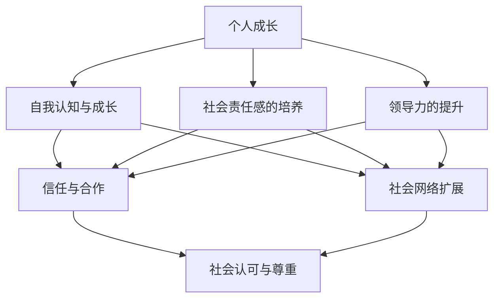
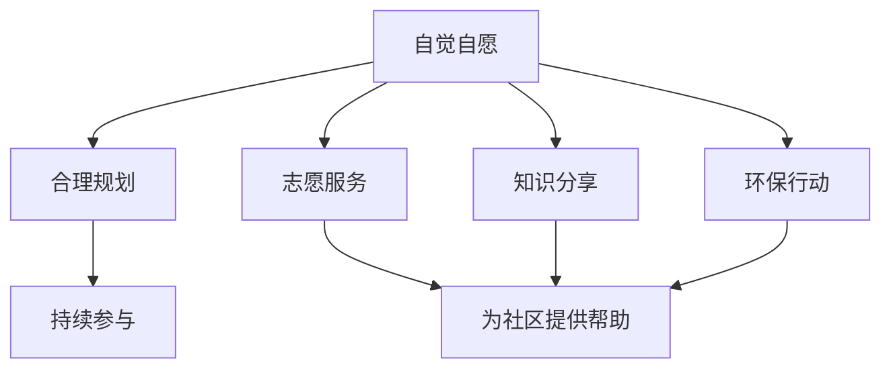
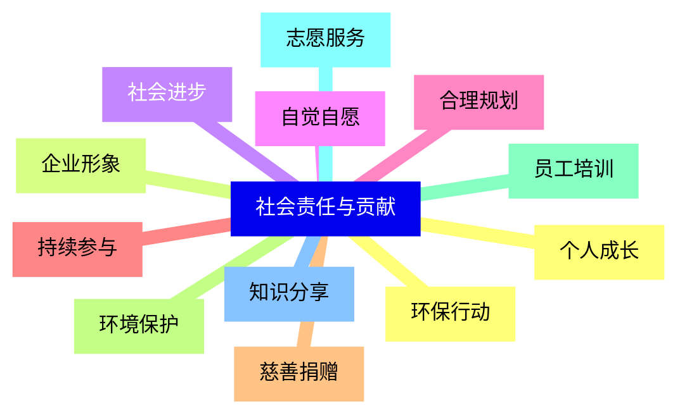

                 


# 从个人利益到公共福祉：重新思考社会责任和贡献

> 关键词：社会责任、公共福祉、个人利益、贡献、企业治理、可持续发展

> 摘要：本文旨在重新审视和探讨社会责任和贡献的概念及其在现代IT领域的应用。通过逐步分析个人利益与公共福祉之间的关系，我们将揭示如何在个人发展和社会进步之间找到平衡，并提出一些实用的策略和最佳实践，以促进企业和个人的社会责任感和贡献精神。

## 第一部分：社会责任的背景与问题

### 第一章：社会责任的背景与定义

1.1 社会责任的定义与发展历史

社会责任（Corporate Social Responsibility，简称CSR）是指企业或组织在经营过程中，承担起对社会和环境负责的义务和责任。这一概念起源于20世纪初期，当时企业开始意识到其行为对环境和社会的影响，并逐步形成了社会责任的理念。

1.2 当前社会责任的现状与挑战

随着全球化和信息技术的发展，社会责任的概念和实践越来越受到关注。然而，我们也面临着一些挑战，如企业如何平衡经济利益与社会责任、如何应对环境问题、如何确保供应链的可持续性等。

1.3 重新思考社会责任的必要性

在当前的社会背景下，我们需要重新审视社会责任的定义和内涵，探索如何在企业和个人之间建立更紧密的联系，以实现公共福祉和个人利益的和谐发展。

### 第二章：社会责任的核心概念与结构

2.1 社会责任的关键概念和理论

社会责任的核心概念包括企业义务、道德责任、法律责任、慈善责任等。这些概念相互交织，共同构成了社会责任的理论体系。

2.2 社会责任的核心原则与特征

社会责任的核心原则包括公正、透明、诚信、可持续发展等。这些原则体现了企业对社会责任的承诺和追求。

2.3 社会责任与企业治理的关系

社会责任与企业治理密切相关。有效的企业治理能够确保企业履行社会责任，实现可持续发展和长期成功。

### 第二章.1：社会责任实体关系Mermaid ER图

**实体与关系：**

- `组织`、`个人`、`社区`、`社会`
- 关系：`组织-社会`、`个人-社会`、`个人-组织`

```mermaid
erDiagram
  组织 ||--|{ 社会责任 }
  个人 ||--|{ 社会责任 }
  社区 ||--|{ 社会责任 }
  社会责任 }|..| 组织
  社会责任 }|..| 个人
  社会责任 }|..| 社区
```

## 第二部分：理解社会贡献及其影响

### 第三章：社会贡献的概念及其重要性

3.1 社会贡献的定义与分类

社会贡献是指个人或组织在社会发展和进步过程中，为改善社会状况和环境所做的各种努力和投入。社会贡献可以分为个人贡献、企业贡献、政府贡献等。

3.2 社会贡献对个人和社会的影响

社会贡献不仅能够促进社会的发展，还能够提升个人的价值和成就感。通过参与社会贡献，个人可以增强社会责任感、提升自我价值，同时促进社会的和谐与进步。

### 第四章：社会贡献在个人发展中的作用

4.1 社会贡献对个人成长的影响

社会贡献有助于个人成长，包括以下几个方面：

- **自我认知与成长：** 通过参与社会贡献，个人可以更好地了解自己的优点和不足，促进自我认知和成长。
- **社会责任感的培养：** 社会贡献有助于培养个人的社会责任感，使其更加关注社会问题和公共利益。
- **领导力的提升：** 社会贡献可以锻炼个人的领导能力，提高其在团队中的影响力和领导力。

4.2 社会贡献对人际关系的促进作用

社会贡献有助于建立良好的人际关系，包括以下几个方面：

- **信任与合作：** 通过共同参与社会贡献，个人可以增进对彼此的信任，促进合作。
- **社会网络扩展：** 社会贡献有助于个人拓展社会网络，结识更多志同道合的人。
- **社会认可与尊重：** 社会贡献可以赢得社会的认可和尊重，提高个人的社会地位。

### 第四章.1：社会贡献对个人发展影响的Mermaid流程图



## 第三部分：实践社会责任与贡献

### 第五章：企业社会责任的实践策略

5.1 企业社会责任的实践原则

企业社会责任的实践应遵循以下原则：

- **透明与公正：** 企业应公开透明地披露社会责任报告，确保信息的真实性和公正性。
- **可持续性：** 企业应关注环境保护、资源节约和可持续发展。
- **员工参与：** 企业应鼓励员工积极参与社会责任活动，提升员工的社会责任感。

5.2 企业社会责任的实践方法

企业可以通过以下方法实践社会责任：

- **慈善捐赠：** 企业可以参与慈善捐赠，支持社会公益事业。
- **环境保护：** 企业可以实施环保措施，减少环境污染。
- **员工培训：** 企业可以提供员工培训，提升员工的专业技能和社会责任感。

### 第六章：个人社会责任的实践策略

6.1 个人社会责任的实践原则

个人社会责任的实践应遵循以下原则：

- **自觉自愿：** 个人应自觉自愿地参与社会责任活动，发挥自己的特长和优势。
- **合理规划：** 个人应根据自身情况，合理规划社会责任活动的时间、内容和方式。
- **持续参与：** 个人应持续参与社会责任活动，形成良好的社会责任习惯。

6.2 个人社会责任的实践方法

个人可以通过以下方法实践社会责任：

- **志愿服务：** 个人可以参与志愿服务，为社区和社会提供帮助。
- **知识分享：** 个人可以通过知识分享，为他人提供帮助和指导。
- **环保行动：** 个人可以从日常生活做起，积极参与环保行动。

### 第六章.1：个人社会责任实践方法的Mermaid流程图



## 第四部分：总结与展望

### 第七章：社会责任与贡献的总结与展望

7.1 社会责任与贡献的重要性

社会责任和贡献对于个人和社会的发展具有重要意义。通过承担社会责任，个人可以提升自身价值，实现个人成长；通过积极参与社会贡献，企业可以树立良好的企业形象，实现可持续发展。

7.2 社会责任与贡献的未来发展趋势

随着信息技术的发展和全球化的推进，社会责任和贡献将越来越受到重视。未来，我们将看到更多企业和个人积极参与社会责任活动，推动社会进步和可持续发展。

### 第七章.1：社会责任与贡献的Mermaid思维导图



## 附录：社会责任与贡献的最佳实践与案例分析

### 附录A：社会责任与贡献的最佳实践

- **企业社会责任最佳实践：** 企业可以制定明确的社会责任战略，建立社会责任组织，定期发布社会责任报告，确保社会责任的执行和监督。
- **个人社会责任最佳实践：** 个人可以积极参与志愿服务、环保行动和知识分享，关注社会问题，发挥自身优势，为社会贡献自己的力量。

### 附录B：社会责任与贡献的案例分析

- **案例1：** 一家互联网企业通过定期举办公益活动，鼓励员工参与社会贡献，树立了良好的企业形象，提升了员工的社会责任感。
- **案例2：** 一位技术专家通过在线分享技术知识和经验，帮助了很多初学者和从业者，提升了整个行业的技术水平。

### 附录C：社会责任与贡献的注意事项

- **注意事项1：** 在参与社会责任活动时，要注意合理规划时间，避免影响正常工作和生活。
- **注意事项2：** 在参与社会责任活动时，要确保活动的真实性和有效性，避免形式主义。
- **注意事项3：** 在参与社会责任活动时，要注意保护个人信息和隐私，确保活动的安全和合法。

### 附录D：社会责任与贡献的拓展阅读

- **书籍推荐：** 《企业社会责任》、《可持续发展报告》、《社会创新与企业家精神》等。
- **文章推荐：** 《如何成为有社会责任感的企业家》、《社会贡献：个人与企业的使命》、《社会责任与可持续发展》等。

## 结语

本文从个人利益到公共福祉，重新思考了社会责任和贡献的重要性及其在现代IT领域的应用。通过逐步分析，我们揭示了社会责任和贡献对个人发展和社会进步的深远影响，并提出了实践社会责任和贡献的策略和方法。希望本文能为大家提供有益的启示，激发更多企业和个人关注社会责任，为社会贡献自己的力量。

### 作者信息

作者：AI天才研究院/AI Genius Institute & 禅与计算机程序设计艺术/Zen And The Art of Computer Programming

