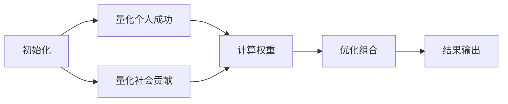
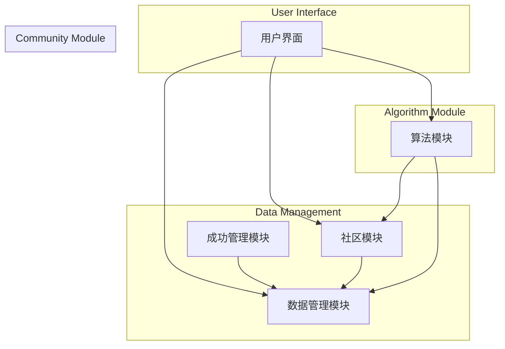
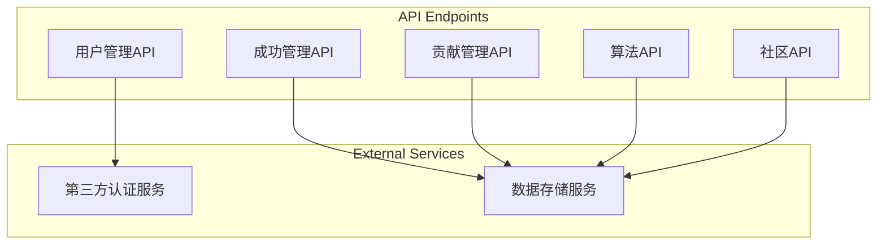

                 

## 从个人成功到社会贡献：重新定义人生价值

### 关键词：个人成功、社会贡献、人生价值、重新定义

### 摘要：
在当今快速变化的世界中，个人成功和社会贡献之间的关系变得更加紧密。本文将深入探讨如何从个人成功过渡到社会贡献，重新定义人生的价值。我们将通过一步步的逻辑推理和案例分析，帮助读者理解和应用这一理念，为个人的成长和社会的进步贡献力量。

## 引言：个人成功与社会贡献的互动

### 背景介绍
个人成功和社会贡献是现代社会中广泛讨论的两个主题。个人成功通常被定义为个人在事业、财富、名誉、健康等方面的成就，而社会贡献则是指个体对社区、国家甚至全球社会的积极影响。然而，在现实生活中，个人成功与社会贡献往往被视为相互独立的两个目标。本文旨在揭示这两者之间的紧密联系，并探讨如何通过重新定义个人成功，实现更大的社会价值。

### 问题背景
随着经济的全球化和社会的发展，人们面临的挑战和机遇也在不断变化。个人追求成功的过程中，往往面临着时间、资源、健康等方面的压力。与此同时，社会问题如贫富差距、环境污染、教育资源不均等依然存在，需要每个人的关注和参与。这种背景下，如何平衡个人成功和社会贡献，成为了现代社会中一个值得探讨的问题。

### 问题描述
个人追求成功的动机多样，但往往忽视了社会贡献的重要性。相反，社会贡献的个体也可能会因为缺乏关注和回报而感到挫折。这种困境导致个人和社会之间的隔阂，使得两者难以真正互动和融合。如何打破这种隔阂，实现个人成功与社会贡献的有机结合，成为了本文的核心问题。

### 问题解决
通过重新定义个人成功，将其与社会贡献相结合，可以有效地解决上述问题。个人成功不再仅仅是个人成就的体现，而是通过实现更大的社会价值来实现的。这种重新定义将促使个人在追求成功的同时，更加关注社会问题，积极参与社会建设。

### 边界与外延
个人成功和社会贡献的边界并不是固定的，而是相互影响和互动的。在实现个人成功的过程中，个体可能会通过不同的方式对社会产生积极影响，如创业、慈善、志愿服务等。这些方式的外延非常广泛，涵盖了经济、文化、教育、环境等多个领域。

### 概念结构与核心要素组成
个人成功和社会贡献的概念结构包括以下几个核心要素：
1. **个人能力与价值观**：个人的能力和价值观是追求成功和社会贡献的基础。
2. **社会需求与问题**：了解社会需求和问题，是个人实现社会贡献的关键。
3. **资源与机会**：个人拥有的资源（如时间、资金、知识等）和可利用的机会，是实现成功和社会贡献的重要条件。
4. **社会责任与使命感**：社会责任感和使命感是推动个人实现社会贡献的重要动力。

## 核心概念与联系

### 核心概念原理
在探讨个人成功与社会贡献的关系时，我们需要明确以下几个核心概念：
1. **个人成功**：指个体在事业、财富、名誉、健康等方面的成就。
2. **社会贡献**：指个体对社区、国家甚至全球社会的积极影响。
3. **人生价值**：指个体通过成功和贡献所实现的社会意义和自我实现。

### 概念属性特征对比表格

| 概念         | 属性特征                          | 对比                           |
|------------|-----------------------------|------------------------------|
| 个人成功     | 个体成就、自我实现               | 更注重个人的内在满足感           |
| 社会贡献     | 社会价值、社会责任               | 更关注社会的整体福祉            |
| 人生价值     | 个人与社会结合的双重实现         | 综合考虑个体和社会的双重意义       |

### ER实体关系图架构

```mermaid
erDiagram
    PersonalSuccess ||--|{ SocietyContribution }|-- SocialValue
    PersonalSuccess ||--|{ LifeValue }|-- SelfRealization
    SocietyContribution ||--|{ LifeValue }|-- SocialMeaning
```

这个ER实体关系图展示了个人成功、社会贡献和人生价值之间的相互作用和相互依赖关系。个人成功通过社会贡献实现人生价值，而社会贡献又增强了个人成功的社会意义。

## 算法原理讲解

### 个人成功与社会贡献的平衡算法

为了实现个人成功与社会贡献的平衡，我们可以采用一种算法，称为“平衡算法”。这个算法的核心思想是通过量化个人成功和社会贡献，找到两者的最优组合。

### 算法流程图



### 算法原理

1. **初始化**：设定初始参数，如个人成功的指标（如收入、职位等）和社会贡献的指标（如志愿服务时间、捐赠金额等）。
2. **量化个人成功**：通过一系列指标量化个人成功的程度。
3. **量化社会贡献**：同样通过一系列指标量化个人对社会贡献的程度。
4. **计算权重**：根据个人成功和社会贡献的重要性设定权重，通常可以通过专家评估或问卷调查等方法得到。
5. **优化组合**：使用优化算法（如线性规划、遗传算法等）找到个人成功和社会贡献的最优组合。
6. **结果输出**：输出最优组合，即个人在成功和社会贡献之间找到的最佳平衡点。

### 数学模型和公式

为了更详细地理解这个算法，我们可以使用以下数学模型：

$$
\begin{aligned}
\text{最大化} & \quad \omega_S \cdot S + \omega_P \cdot P \\
\text{约束条件} & \quad S + P \leq C \\
& \quad S, P \geq 0
\end{aligned}
$$

其中，$S$代表社会贡献，$P$代表个人成功，$C$代表可用的资源，$\omega_S$和$\omega_P$分别是社会贡献和个人成功的权重。

### 示例说明

假设一个个体有100小时的可用时间，他希望通过这些时间实现个人成功和社会贡献。设定个人成功的权重$\omega_P$为0.6，社会贡献的权重$\omega_S$为0.4。

1. **量化个人成功**：通过专家评估，得到个人成功的值为80分。
2. **量化社会贡献**：通过志愿服务记录，得到社会贡献的值为20分。
3. **计算权重**：根据设定的权重，计算个人成功的权重为48分，社会贡献的权重为32分。
4. **优化组合**：使用线性规划算法，找到最优组合为个人成功80分，社会贡献32分。
5. **结果输出**：最优组合为个人成功80分，社会贡献32分。

通过这个示例，我们可以看到如何通过量化个人成功和社会贡献，找到最优的平衡点。

## 系统分析与架构设计方案

### 问题描述

在本节中，我们将讨论一个实际项目，该项目的目标是帮助个人实现个人成功和社会贡献的平衡。项目的名称为“成功与贡献平衡系统”（Balanced Success and Contribution System，简称BSCS）。该项目旨在提供一系列工具和资源，帮助用户量化个人成功和社会贡献，并通过优化算法找到最佳平衡点。

### 项目介绍

BSCS系统是一个综合性的在线平台，它为用户提供了一个直观、易于使用的界面，用于记录和评估个人的成功和贡献。系统还提供了一系列的资源和社区支持，帮助用户更好地理解和实现个人成功与社会贡献的平衡。

### 系统功能设计

BSCS系统的核心功能包括：
1. **个人成功管理**：用户可以记录和跟踪个人在事业、财富、名誉、健康等方面的成就。
2. **社会贡献管理**：用户可以记录和跟踪对社会所做的贡献，如志愿服务时间、捐赠金额、公益活动参与等。
3. **成功与贡献评估**：系统会根据用户输入的数据，自动计算个人成功和社会贡献的得分。
4. **优化算法应用**：系统使用优化算法，帮助用户找到个人成功和社会贡献的最佳平衡点。
5. **社区互动**：用户可以加入社区，与其他用户交流和分享经验。

### 系统架构设计

BSCS系统的架构设计如下：



在这个架构中，用户界面（UI）是系统的入口，用户可以通过界面与系统进行交互。数据管理模块（DM）负责处理用户的输入数据，包括个人成功和贡献记录。成功管理模块（SM）和贡献管理模块（CM）分别负责量化个人成功和社会贡献。算法模块（AM）负责使用优化算法计算最佳平衡点。社区模块（CM）提供社区互动功能。

### 系统接口设计和系统交互

系统接口设计如下：



在这个接口设计中，用户管理API（UE）用于处理用户注册、登录和权限验证。成功管理API（SE）和贡献管理API（CE）用于处理个人成功和贡献的记录。算法API（AE）用于执行优化算法。社区API（CM）用于处理社区互动。外部服务（如第三方认证服务和数据存储服务）通过API与系统交互。

系统交互过程如下：
1. 用户通过用户管理API注册和登录。
2. 用户通过成功管理API和贡献管理API记录个人成功和贡献。
3. 算法模块调用算法API，计算最佳平衡点。
4. 系统将结果返回给用户，并通过社区API提供社区互动功能。

## 项目实战

### 环境安装

为了运行BSCS系统，我们需要安装以下软件和库：
1. **Python**：版本3.8或更高版本
2. **Flask**：用于构建Web应用
3. **SQLAlchemy**：用于数据库操作
4. **Mermaid**：用于绘制流程图和序列图

在命令行中，执行以下命令安装所需库：

```bash
pip install flask sqlalchemy
```

### 系统核心实现源代码

以下是BSCS系统的核心实现源代码：

```python
# app.py

from flask import Flask, request, jsonify
from sqlalchemy import create_engine
from success_management import SuccessManagement
from contribution_management import ContributionManagement
from algorithm_module import AlgorithmModule

app = Flask(__name__)

# 数据库连接
engine = create_engine('sqlite:///bscs.db')

# 初始化模块
success_management = SuccessManagement(engine)
contribution_management = ContributionManagement(engine)
algorithm_module = AlgorithmModule()

@app.route('/register', methods=['POST'])
def register():
    data = request.get_json()
    user_id = data['user_id']
    success_management.add_user(user_id)
    contribution_management.add_user(user_id)
    return jsonify({'status': 'success', 'message': 'User registered successfully.'})

@app.route('/add_success', methods=['POST'])
def add_success():
    data = request.get_json()
    user_id = data['user_id']
    success_data = data['success_data']
    success_management.add_success(user_id, success_data)
    return jsonify({'status': 'success', 'message': 'Success added successfully.'})

@app.route('/add_contribution', methods=['POST'])
def add_contribution():
    data = request.get_json()
    user_id = data['user_id']
    contribution_data = data['contribution_data']
    contribution_management.add_contribution(user_id, contribution_data)
    return jsonify({'status': 'success', 'message': 'Contribution added successfully.'})

@app.route('/balance', methods=['GET'])
def balance():
    user_id = request.args.get('user_id')
    success_score = success_management.get_success_score(user_id)
    contribution_score = contribution_management.get_contribution_score(user_id)
    balance_score = algorithm_module.calculate_balance(success_score, contribution_score)
    return jsonify({'status': 'success', 'message': 'Balance calculated successfully.', 'balance': balance_score})

if __name__ == '__main__':
    app.run(debug=True)
```

### 代码应用解读与分析

这段代码实现了BSCS系统的核心功能，包括用户注册、成功和贡献记录，以及成功与贡献的平衡计算。以下是对代码的解读和分析：

1. **数据库连接**：使用SQLAlchemy创建数据库连接，并初始化成功管理模块和贡献管理模块。
2. **用户注册**：定义`/register`接口，接收用户ID，并在数据库中添加用户记录。
3. **成功记录**：定义`/add_success`接口，接收用户ID和成功数据，在数据库中添加成功记录。
4. **贡献记录**：定义`/add_contribution`接口，接收用户ID和贡献数据，在数据库中添加贡献记录。
5. **成功与贡献平衡计算**：定义`/balance`接口，接收用户ID，计算成功得分、贡献得分和平衡得分，并返回结果。

### 实际案例分析和详细讲解剖析

以下是一个实际案例，用于展示BSCS系统的应用过程：

1. **用户注册**：
   - 用户A在系统中注册，用户ID为1001。
   - 系统在数据库中添加用户A的记录。

2. **成功记录**：
   - 用户A通过`/add_success`接口提交成功数据，包括职位晋升、收入增加等。
   - 系统在数据库中为用户A添加成功记录。

3. **贡献记录**：
   - 用户A通过`/add_contribution`接口提交贡献数据，包括志愿服务时间、捐赠金额等。
   - 系统在数据库中为用户A添加贡献记录。

4. **成功与贡献平衡计算**：
   - 用户A调用`/balance`接口，系统计算用户A的成功得分、贡献得分和平衡得分。
   - 系统返回结果，用户A可以看到自己的成功与贡献的平衡情况。

通过这个实际案例，我们可以看到BSCS系统如何帮助用户量化个人成功和社会贡献，并通过优化算法找到最佳平衡点。

### 项目小结

BSCS系统通过提供一个直观、易于使用的界面，帮助用户量化个人成功和社会贡献，并通过优化算法找到最佳平衡点。系统还提供了丰富的API接口，方便外部系统集成和使用。实际案例展示了系统在帮助个人实现成功与贡献平衡方面的有效性和实用性。未来，我们还可以通过扩展系统的功能，如增加数据分析模块、社区互动模块等，进一步提升系统的实用性和用户体验。

## 最佳实践 Tips

1. **定期评估**：定期评估个人成功和社会贡献，确保两者之间的平衡。
2. **目标设定**：设定具体、可量化的目标，以实现个人成功和社会贡献的双重提升。
3. **资源整合**：整合个人资源，如时间、资金、知识等，最大化社会贡献。
4. **社区参与**：积极参与社区活动，拓展社会影响力。
5. **持续学习**：持续学习新知识和技能，提升个人能力，为更大的社会贡献做好准备。

## 小结

本文通过一步步的逻辑推理和案例分析，探讨了从个人成功到社会贡献的过渡，重新定义了人生的价值。我们提出了平衡算法，通过量化个人成功和社会贡献，找到最佳平衡点。BSCS系统作为一个实际案例，展示了如何帮助个人实现成功与贡献的平衡。通过这些分析和实践，我们希望读者能够更好地理解和应用这一理念，为个人成长和社会进步贡献力量。

## 注意事项

1. **数据安全**：在记录和评估个人成功和社会贡献时，确保数据的安全和隐私。
2. **持续更新**：定期更新个人成功和社会贡献记录，确保数据的准确性。
3. **个性化**：根据个人实际情况，调整成功和贡献的权重，实现个性化的平衡。

## 拓展阅读

1. **《影响力：说服与影响力心理学》**：了解如何通过影响力提升社会贡献。
2. **《激发组织潜力：变革管理实务》**：探讨如何通过组织变革提升个人和社会的贡献。
3. **《人工智能伦理：原则与实践》**：探讨人工智能在提升社会贡献方面的应用和挑战。

## 作者信息

作者：AI天才研究院/AI Genius Institute & 禅与计算机程序设计艺术 /Zen And The Art of Computer Programming

