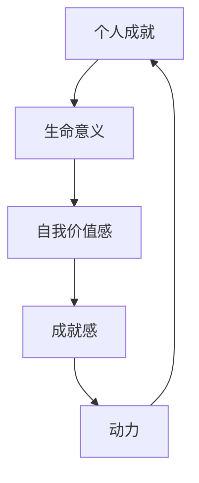
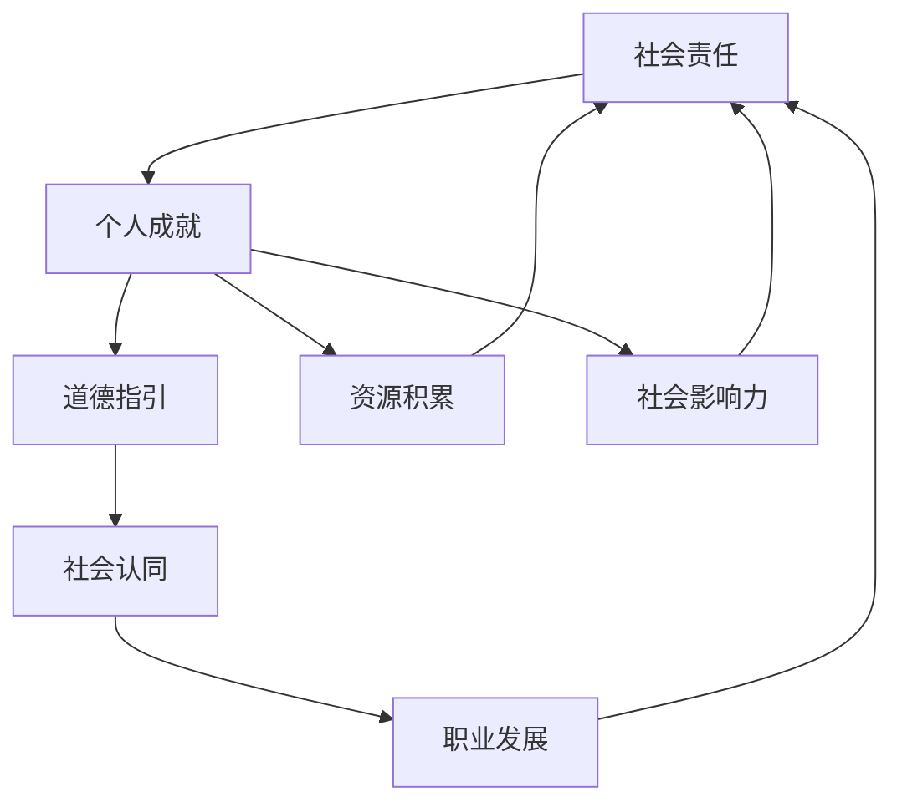

                 

# 从个人成就到社会贡献：拓展生命的意义和价值

> 关键词：生命意义、个人成就、社会贡献、自我认知、社会责任、社会价值网络

> 摘要：本文旨在探讨个人成就与社会贡献之间的关系，分析如何从个人成就拓展到社会贡献，从而拓展生命的意义和价值。文章首先介绍了生命的意义与个人成就，接着阐述了社会贡献的内涵与价值，然后探讨了个人成就向社会贡献转化的路径，并通过实践案例进行了详细分析，最后提出了策略与建议，以期为读者提供有益的思考与实践指导。

## 第一部分：核心概念与背景介绍

### 1.1 生命的意义与价值

生命的意义是一个古老而深刻的哲学问题，不同的文化、宗教和哲学体系对生命的意义有着不同的解读。从广义上讲，生命的意义可以理解为个体存在的目的和意义，它关乎个体的存在、价值、使命和目标。

**生命价值**是一个衡量个体生命意义的重要指标。生命价值通常体现在个体对社会的贡献上。一个具有高生命价值的人，不仅能够在个人成就上有所建树，还能够为社会创造价值，推动社会进步。

### 1.2 个人成就的定义与分类

**个人成就**是指个体在生活、学习、工作等方面所取得的显著成果。个人成就可以分为以下几类：

1. **学术成就**：在科学研究、学术研究等方面取得的成果。
2. **职业成就**：在工作、事业等方面取得的成就。
3. **社会成就**：在社会活动、公共事务等方面取得的成就。
4. **个人成就**：在个人成长、自我实现等方面取得的成就。

### 1.3 个人成就与生命意义的联系

个人成就与生命意义紧密相连。一个在个人成就上有所建树的人，往往能够更好地理解生命的意义，并在实践中实现自我价值。个人成就不仅是个体存在的证明，更是个体对社会的贡献，是生命价值的重要体现。

## 第二部分：社会贡献的内涵与价值

### 2.1 社会贡献的定义

**社会贡献**是指个体为社会的物质、文化、精神等方面的发展所做的贡献。社会贡献可以表现为：

1. **科技创新**：推动科学技术进步，为社会发展提供动力。
2. **文化传承**：传承和发扬文化传统，增强社会凝聚力。
3. **公益事业**：参与社会公益活动，帮助弱势群体，提高社会公平。
4. **教育培训**：传授知识和技能，培养社会人才。

### 2.2 社会贡献的维度

社会贡献可以从以下几个维度来衡量：

1. **贡献大小**：个体对社会发展的实际贡献程度。
2. **贡献范围**：个体对社会影响的范围和程度。
3. **贡献持续时间**：个体对社会贡献的持久性。
4. **贡献质量**：个体对社会贡献的价值和质量。

### 2.3 社会贡献的价值

社会贡献具有多重价值：

1. **物质价值**：社会贡献可以带来经济效益，促进社会财富增长。
2. **精神价值**：社会贡献可以提升个体和整个社会的精神风貌，增强民族自信心和自豪感。
3. **社会价值**：社会贡献有助于构建和谐社会，提高社会整体幸福感。

## 第二部分：个人成就向社会贡献的转化

### 3.1 自我认知与自我提升

**自我认知**是个人成就向社会贡献转化的基础。一个具备良好自我认知的人，能够明确自己的优势和潜力，从而更好地规划个人发展路径。

**自我提升**是实现个人成就向社会贡献转化的关键。通过不断学习、实践和反思，个体可以提升自己的能力，为社会贡献更多价值。

### 3.2 自我提升对社会贡献的影响

自我提升对社会贡献的影响主要体现在以下几个方面：

1. **增强个人能力**：自我提升使个体具备更高的专业素养和创新能力，从而为社会创造更大价值。
2. **拓宽社会贡献领域**：自我提升使个体能够涉足更多领域，为社会提供更多服务。
3. **提高社会贡献质量**：自我提升有助于个体更好地理解社会需求，提供更高质量的服务。

### 3.3 社会责任与公共参与

**社会责任**是指个体对社会应尽的义务和责任。一个具备社会责任感的人，会在个人成就的基础上，主动关注社会问题，参与公共事务，为社会贡献更多力量。

**公共参与**是实现个人成就向社会贡献转化的有效途径。通过参与公共事务，个体可以深入了解社会需求，发挥自身优势，为社会提供更有针对性的服务。

### 3.4 社会责任与个人成就的关系

社会责任与个人成就之间存在密切关系：

1. **相互促进**：社会责任感可以激发个人成就的潜能，而个人成就的提升又可以增强个体的社会责任感。
2. **共同成长**：社会责任感和个人成就相互促进，共同推动个体和社会的发展。

## 第三部分：实践与案例分析

### 3.5 成功转化个人成就为社会贡献的案例

以下是一些成功转化个人成就为社会贡献的案例：

1. **科研成就转化为科技创新**：某科学家通过自己的研究成果，成功创办了一家高新技术企业，为社会提供了大量就业机会，推动了科技进步。
2. **职业成就转化为社会公益**：某企业家在事业上取得巨大成功后，积极参与社会公益事业，捐资助学，帮助弱势群体。
3. **艺术成就转化为文化传播**：某艺术家通过自己的艺术作品，传递了中华优秀传统文化，增强了民族自豪感，推动了文化繁荣。

### 3.6 个人成就向社会贡献转化的策略与建议

以下是个人成就向社会贡献转化的策略与建议：

1. **树立社会责任感**：明确自己的社会责任，关注社会问题，主动参与公共事务。
2. **提升自身能力**：通过学习、实践和反思，不断提升自己的专业素养和创新能力。
3. **拓宽社会贡献领域**：积极参与社会公益活动，关注社会热点，为社会提供更多服务。
4. **提高社会贡献质量**：深入了解社会需求，提供高质量的服务，为社会发展贡献更多价值。

## 总结

从个人成就到社会贡献，是拓展生命意义和价值的重要途径。通过自我认知与自我提升，树立社会责任感，积极参与公共事务，个体可以在实现个人成就的同时，为社会贡献更多力量。让我们共同努力，在实现个人价值的同时，为社会发展贡献力量，共同拓展生命的意义和价值。

## 附录：拓展阅读与资源推荐

1. **书籍推荐**：
   - 《生命的意义：存在与意义探求》
   - 《社会学的想象：个人与社会的关系》
   - 《人文社会科学方法论》

2. **网站推荐**：
   - [中华慈善总会](http://www.cctf.org.cn/)
   - [中国红十字会](http://www.redcross.org.cn/)
   - [中国志愿服务联合会](http://www.cvf.org.cn/)

3. **公众号推荐**：
   - “公益慈善与社会责任”
   - “人文社会科学研究”
   - “科技创新与社会进步”

作者：AI天才研究院/AI Genius Institute & 禅与计算机程序设计艺术 /Zen And The Art of Computer Programming## 从个人成就到社会贡献：拓展生命的意义和价值

### 1.1 生命的意义与价值

**生命的意义**是哲学、宗教、心理学等多个领域长期探讨的核心问题。从哲学的角度来看，生命的意义通常涉及个体存在的目的、使命和价值。不同的哲学流派对此有着不同的见解。例如，存在主义者认为，生命的意义是个人自由选择和行动的产物，每个人都需要为自己生命的意义负责。而人文主义者则强调生命的价值在于个体的自我实现和追求幸福。

**生命价值**则是对个体生命意义的量化或具体体现。它不仅关注个体的内在价值，如道德品质、情感体验等，还关注个体对社会的贡献，如科技创新、文化传承、公益事业等。生命价值的高低通常与个体在社会中的地位、影响力以及所取得的成就密切相关。

在现代社会，随着科技进步和社会发展，生命的意义和价值也在不断演变。一方面，个体面临的挑战和压力增大，如职场竞争、人际关系、精神健康等；另一方面，个体拥有更多的机会和资源去实现自我价值，如教育、职业发展、科技创新等。因此，如何在纷繁复杂的社会环境中找到生命的意义和价值，成为每个人都需要面对的问题。

**问题背景**：现代社会中，许多人追求物质财富和职业成功，但往往忽视了生命的意义和价值。这种过度追求物质和功利的态度，导致了许多社会问题，如精神疾病、心理问题、社会不公等。因此，探讨生命的意义和价值，以及如何通过个人成就实现社会贡献，具有重要的现实意义。

**问题描述**：如何在现代社会中找到生命的意义和价值？如何通过个人成就实现社会贡献？个人成就与社会贡献之间是否存在必然联系？

**问题解决**：通过深入探讨生命的意义与价值，分析个人成就的定义与分类，以及个人成就向社会贡献转化的路径，本文试图为这些问题提供一种思路和解决方案。

**边界与外延**：本文主要探讨个人成就向社会贡献的转化，涉及的核心概念包括生命的意义、生命价值、个人成就、社会贡献等。同时，本文还将讨论自我认知、社会责任、公共参与等与个人成就向社会贡献转化相关的重要概念。

**概念结构与核心要素组成**：

1. **生命的意义与价值**：包括哲学、宗教、心理学等多个角度对生命的解释和价值判断。
2. **个人成就**：涵盖学术成就、职业成就、社会成就和个人成就等方面。
3. **社会贡献**：包括科技创新、文化传承、公益事业、教育培训等方面。
4. **自我认知**：涉及个体对自身优势、潜力、价值观等的认识和评价。
5. **社会责任**：个体对社会应尽的义务和责任。
6. **公共参与**：个体参与公共事务、社会活动的形式和途径。

通过上述概念结构的分析，我们可以更清晰地理解个人成就向社会贡献转化的过程和机制。

### 1.2 个人成就的定义与分类

**个人成就**是指个体在生活、学习、工作等方面所取得的显著成果。个人成就不仅是个人能力的体现，也是个体在特定领域或方面的成功标志。个人成就的定义和分类有助于我们更好地理解个体在社会中的位置和作用，以及如何通过个人成就实现社会贡献。

**学术成就**：学术成就是指个体在科学研究、学术研究等方面所取得的成果。学术成就通常通过学术论文发表、科研项目完成、学术奖项获得等方式体现。学术成就是个体智慧和努力的结果，也是推动社会科技进步和文化发展的重要力量。

**职业成就**：职业成就是指个体在工作、事业等方面所取得的成就。职业成就体现在职位晋升、业绩突出、创新项目成功等方面。职业成就不仅有助于个体实现自我价值，还能够为企业和社会创造价值。

**社会成就**：社会成就是指个体在社会活动、公共事务等方面所取得的成就。社会成就包括志愿服务、公益活动、社会影响力提升等方面。社会成就体现了个体对社会的责任感和贡献精神，是构建和谐社会的重要力量。

**个人成就**：个人成就还包括在个人成长、自我实现等方面所取得的成就。个人成就不仅体现在物质层面，还体现在精神层面，如自我认知的提升、心理健康的改善、人生目标的实现等。

**个人成就的分类表格**：

| 成就类型 | 定义 | 示例 |
| :----: | :----: | :----: |
| 学术成就 | 科学研究、学术研究等方面的成果 | 发表高水平学术论文、完成重要科研项目 |
| 职业成就 | 工作和事业方面的成就 | 晋升高级职位、获得重要奖项 |
| 社会成就 | 社会活动和公共事务方面的成就 | 参与公益活动、推动社会进步 |
| 个人成就 | 个人成长和自我实现方面的成就 | 提升心理健康、实现人生目标 |

通过上述分类表格，我们可以更清晰地了解个人成就的不同类型及其内涵。这有助于个体在追求个人成就的同时，明确不同成就类型对社会贡献的不同体现方式。

### 1.3 个人成就与生命意义的联系

个人成就与生命意义之间存在着紧密的联系。个人成就不仅是个体能力的体现，更是实现生命意义的重要途径。理解这一联系，有助于我们更好地认识个人成就的价值，以及在追求个人成就的过程中如何拓展生命的意义。

**个人成就与生命意义的相互作用**：

1. **个人成就提升生命意义**：个人成就的实现可以增强个体的自我价值感和成就感，从而提升生命的意义。例如，一个科学家通过自己的研究成果推动科技进步，不仅实现了个人价值，也为社会做出了贡献，提升了生命的意义。

2. **生命意义引导个人成就**：生命意义可以指导个体在追求个人成就的过程中做出选择。一个明确自己生命意义的人，会在追求个人成就时更加坚定和有目标，从而实现更高的成就。

**个人成就与生命意义的关系图**：

**关系图说明**：

- A（个人成就）是起点，通过实现个人成就，个体可以获得自我价值感和成就感。
- B（生命意义）是核心，个人成就的实现有助于提升生命的意义。
- C（自我价值感）、D（成就感）和E（动力）是中间环节，它们连接个人成就与生命意义，使个人成就成为提升生命意义的重要途径。

通过上述关系图，我们可以更直观地理解个人成就与生命意义之间的相互作用。

### 1.4 社会贡献的定义与维度

**社会贡献**是指个体为社会的物质、文化、精神等方面的发展所做的贡献。社会贡献是衡量个体生命价值的重要指标，它不仅体现了个体对社会的直接贡献，也反映了个体在社会中的影响力和地位。

**社会贡献的定义**：

社会贡献是个人或集体在物质、文化、精神等方面对社会的积极影响。这种影响可以是直接的，如通过科技创新、文化传承、公益活动等；也可以是间接的，如通过教育、培训、传播等，对社会的长远发展产生影响。

**社会贡献的维度**：

1. **贡献大小**：衡量个体对社会贡献的绝对量。贡献大小可以通过直接的经济效益、社会影响力、改善的社会问题等来衡量。例如，一个企业家通过创业成功，创造了大量就业机会，带动了地区经济发展，其社会贡献的大小是显而易见的。

2. **贡献范围**：衡量个体对社会影响的广度和深度。贡献范围可以涵盖多个领域，如科技创新、文化传承、公益事业等。例如，一位科学家在多个领域都有重要贡献，其社会贡献的范围非常广泛。

3. **贡献持续时间**：衡量个体对社会贡献的持久性。一个持久的贡献意味着个体的行为或成果能够在长时间内对社会产生积极影响。例如，一位教育家通过长期的教育实践，培养了一代又一代的优秀人才，其社会贡献的持续时间是非常长的。

4. **贡献质量**：衡量个体对社会贡献的价值和质量。贡献质量不仅取决于贡献的大小和范围，还取决于贡献对社会的影响效果。例如，一个公益项目的质量决定了它能够解决多少社会问题，改善多少人的生活质量。

**社会贡献的维度对比表格**：

| 维度 | 说明 | 示例 |
| :----: | :----: | :----: |
| 贡献大小 | 绝对量贡献 | 创业者创造了1000个就业机会 |
| 贡献范围 | 影响广度和深度 | 科学家在多个领域有重要成果 |
| 贡献持续时间 | 长久影响 | 教育家长期培养优秀人才 |
| 贡献质量 | 影响效果 | 公益项目有效解决了社会问题 |

通过上述对比表格，我们可以更清晰地理解社会贡献的不同维度及其重要性。这些维度不仅帮助我们衡量个体对社会贡献的全面性，也为个体在追求社会贡献时提供了明确的参考。

### 1.5 社会贡献的价值

**社会贡献的价值**体现在多个方面，不仅对个体有深远影响，也对整个社会产生了积极效应。以下是社会贡献的主要价值：

**物质价值**：社会贡献可以直接或间接地创造经济效益。例如，科技创新带来的新产品和服务可以推动经济增长，创造就业机会，提高生产效率。公益事业和慈善捐赠则可以直接改善弱势群体的生活条件，减轻社会负担。

**精神价值**：社会贡献可以提升个体的精神风貌和社会认同感。通过参与公益活动，个体可以体验到帮助他人的快乐和成就感，增强自信心和自尊心。此外，社会贡献还可以增强社会的整体精神风貌，提升民族自豪感和凝聚力。

**社会价值**：社会贡献有助于构建和谐的社会环境，促进社会公平和正义。例如，教育贡献可以提升全民素质，减少社会不平等；文化贡献可以传承和弘扬民族文化，增强社会认同感。公益事业和慈善活动则可以缓解社会矛盾，促进社会和谐。

**社会贡献的实际案例**：

- **科技创新**：某科学家发明了一种新型节能技术，不仅降低了企业的运营成本，还减少了碳排放，对环境保护做出了重要贡献。
- **文化传承**：某文化传承者通过自己的努力，将传统文化带入现代生活，激发人们对传统文化的兴趣和热爱，增强了民族文化自信。
- **公益事业**：某企业家捐资助学，帮助贫困地区的孩子们接受教育，改变了他们的命运，同时也为社会培养了未来的建设者。

通过这些实际案例，我们可以更直观地看到社会贡献的多重价值。这些价值不仅为个体带来了满足感和成就感，也为社会的持续发展和进步提供了强大的动力。

### 1.6 自我认知的重要性

**自我认知**是个体理解自身特点、优势和劣势的过程，是实现个人成就和社会贡献的基础。自我认知不仅关乎个体的心理健康，还直接影响个体在职业、学术和社会活动中的表现。

**自我认知的重要性**：

1. **个人发展的方向**：自我认知帮助个体明确自己的兴趣、能力和价值观，从而选择适合自己的发展方向和目标。例如，一个对科研充满热情且具备科学素养的人，可能会选择投身学术研究，为科学进步做出贡献。

2. **提升个人能力**：通过自我认知，个体可以意识到自己的优势，并针对性地进行提升。例如，一个擅长逻辑思维的人，可以通过学习数学和编程，进一步提升自己的逻辑能力和技术能力。

3. **增强决策能力**：自我认知帮助个体在面临选择时做出更加明智的决策。例如，一个明确自己不擅长公共演讲的人，可能会选择避免参与需要大量演讲的工作，从而避免不必要的压力和挫折。

**自我认知的方法**：

1. **反思与总结**：定期反思自己的行为、表现和结果，总结经验教训，有助于深入理解自己的行为模式和思维习惯。

2. **求助外部反馈**：通过询问朋友、同事或导师的意见，获取外部反馈，从而更全面地了解自己的优劣势。

3. **心理测试与评估**：利用专业的心理测试工具，如MBTI、DISC等，帮助个体了解自己的性格特征和职业倾向。

**自我认知的实践案例**：

- **案例一**：某工程师通过反思和总结自己的项目经验，意识到自己在技术领域有很强的能力，但在项目管理方面有所欠缺。他决定通过参加项目管理课程和实际项目锻炼，提升自己的项目管理能力，从而更好地实现个人和社会贡献。
- **案例二**：某大学生通过参加职业规划讲座和性格测试，了解到自己具备良好的沟通能力和团队合作精神，但对独立研究缺乏信心。他选择加入团队合作项目，通过实践不断提升自己的研究能力，并最终在团队合作中取得了显著的成果。

通过这些实践案例，我们可以看到，自我认知对于个人成就和社会贡献的重要性。只有通过深入了解自己，个体才能更好地实现个人价值，为社会做出更大的贡献。

### 1.7 自我提升的方法

**自我提升**是个体不断学习、实践和反思的过程，是实现个人成就和社会贡献的关键。以下是几种有效的自我提升方法：

**1. 持续学习**：

持续学习是自我提升的重要途径。个体可以通过阅读书籍、参加培训课程、观看在线讲座等方式，不断丰富自己的知识和技能。例如，一个技术工程师可以通过阅读最新的技术书籍和参加行业会议，保持对新技术和趋势的了解，从而提升自己的专业素养。

**2. 实践应用**：

理论知识需要通过实践来巩固和应用。个体可以通过实际项目、实验或实践活动，将所学知识应用到实际工作中，从而提高自己的实践能力。例如，一个程序员可以通过参与实际项目开发，不断积累经验，提升编程技巧。

**3. 反思与总结**：

定期反思和总结是自我提升的重要环节。个体可以在项目结束后，对自己的行为、表现和结果进行深入反思，总结经验教训。例如，一个项目经理可以在项目结束后，分析项目中存在的问题，并提出改进措施，从而在未来的项目中避免重复犯错。

**4. 寻求反馈**：

外部反馈可以帮助个体更全面地了解自己的优劣势。个体可以通过询问同事、朋友或导师的意见，获取外部反馈。例如，一个销售人员可以通过定期与客户交流，了解客户对自己的评价和期望，从而调整自己的销售策略。

**5. 设定目标**：

设定明确的目标是个体自我提升的重要动力。个体可以通过设定短期和长期目标，为自己的学习和实践提供方向和动力。例如，一个设计师可以通过设定完成若干个设计项目或学习一门新设计软件的目标，不断提升自己的设计能力。

**自我提升的实践案例**：

- **案例一**：某科学家通过持续学习和实践，不断提升自己的科研能力。他不仅阅读了大量相关领域的书籍和论文，还积极参与国际学术会议，与同行交流研究成果。通过这些努力，他最终在科研领域取得了重要突破，为社会做出了巨大贡献。
- **案例二**：某企业家通过设定明确的目标和持续的努力，成功将自己的企业从一个小型企业发展成为行业领军者。他不仅积极参加各种商业培训课程，还通过实际项目的不断实践，不断提升自己的管理能力和决策能力，最终带领企业实现了跨越式发展。

通过这些实践案例，我们可以看到，自我提升不仅有助于个体实现个人成就，也为社会贡献提供了强大的动力。只有通过不断学习、实践和反思，个体才能在个人和社会层面上取得更大的成就。

### 3.1 自我提升对社会贡献的影响

自我提升不仅对个人成长具有重要意义，还对社会的整体发展产生深远影响。通过自我提升，个体能够更加高效地发挥自身潜力，为社会贡献更多的价值和力量。

**自我提升对个人能力的提升**：

自我提升使个体在专业知识和技能上得到显著提高。例如，一个程序员通过不断学习新编程语言和技术框架，能够编写出更高效、更可靠的代码。这种技能的提升不仅有助于个体在职业生涯中取得更好的成绩，也为企业和社会创造了更多价值。

**自我提升对创新能力的影响**：

自我提升能够激发个体的创新思维和创造力。通过不断学习和实践，个体可以接触到更多的知识和观点，从而形成独特的见解和解决问题的方法。例如，一位科学家通过广泛阅读和跨学科研究，可能会发现新的研究方法和突破点，推动科学技术的发展。

**自我提升对社会贡献的促进**：

1. **经济贡献**：自我提升使个体在职场中更具竞争力，为企业创造更多价值。一个具备高水平技能和知识的员工，能够帮助企业提高生产效率、降低成本，从而为社会创造更多的经济贡献。

2. **科技创新**：自我提升有助于推动科技创新和社会进步。一个在专业领域有深厚造诣的科学家，能够引领科技创新，推动社会的发展。

3. **社会服务**：自我提升使个体能够更好地为社会提供高质量的服务。例如，一个受过良好教育的医生，能够为患者提供更精准的诊断和治疗，提高社会健康水平。

**自我提升的实际案例**：

- **案例一**：某工程师通过持续学习和实践，掌握了多种编程语言和技术框架。他在项目中能够提出创新解决方案，大幅提高了项目效率，为企业节省了大量成本。
- **案例二**：某医生通过参加医学培训和科研交流，不断提升自己的专业水平。他通过先进的医疗技术和治疗方法，成功治愈了许多疑难病例，提升了医院的声誉和社会影响力。

通过这些实际案例，我们可以看到，自我提升对个体和社会的贡献是显而易见的。只有通过不断自我提升，个体才能在实现个人价值的同时，为社会发展贡献更多力量。

### 4.1 社会责任的概念

**社会责任**是指个体或组织对社会应尽的义务和责任。社会责任不仅关乎个体的道德义务，还涉及经济、环境、社会等多方面的责任。以下是对社会责任的详细解释：

**社会责任的定义**：

社会责任是指企业、组织或个人在社会经济活动中，为了实现可持续发展和社会进步，应承担的义务和责任。这种责任不仅包括遵守法律法规，还涉及对环境保护、社会公益、员工权益等多方面的关注。

**社会责任的内容**：

1. **经济责任**：企业应通过合法经营，为社会创造经济价值，提供就业机会，促进经济增长。

2. **环境责任**：企业应关注环境保护，减少污染，节约资源，推动可持续发展。

3. **社会责任**：企业应关注社会问题，参与社会公益活动，支持教育、卫生、扶贫等社会事业。

4. **法律责任**：企业应遵守法律法规，确保自身行为合法合规，承担相应的法律责任。

**社会责任的重要性**：

社会责任不仅关乎企业的长远发展，也影响着社会的整体进步。一个具有高度社会责任感的企业，能够赢得社会的信任和尊重，提升品牌形象，实现可持续发展。同时，社会责任也是企业履行社会义务、推动社会和谐发展的重要途径。

### 4.2 公共参与的形式与途径

**公共参与**是指个体或组织参与社会公共事务、社会活动的过程。公共参与的形式和途径多种多样，以下是一些常见的参与形式和途径：

**公共参与的形式**：

1. **志愿服务**：个体或组织自愿参与各种公益活动，如扶贫、环保、支教等。

2. **参与公共事务**：个体或组织参与政府组织的公共事务，如投票、参选、公共政策讨论等。

3. **社会活动**：个体或组织参与各种社会活动，如社区活动、公益活动、慈善活动等。

**公共参与的途径**：

1. **政府渠道**：通过政府网站、公共事务平台等，参与政策讨论、公共事务咨询等。

2. **社会组织**：通过加入社会组织、志愿者团体等，参与社会公益活动和社会服务。

3. **媒体平台**：通过社交媒体、新闻媒体等，表达对社会问题的看法和建议，参与社会舆论。

**公共参与的实际案例**：

- **案例一**：某企业通过定期组织员工参与环保公益活动，如植树造林、垃圾分类等，积极参与环境保护，提升了企业的社会责任形象。
- **案例二**：某社区居民通过参与社区治理委员会，参与社区规划、安全巡逻等事务，增强了社区的凝聚力和居民的幸福指数。

通过这些实际案例，我们可以看到，公共参与不仅有助于个体和社会的发展，还能提升社会的整体文明程度。每个人都可以通过公共参与，为社会贡献自己的力量。

### 4.3 社会责任与个人成就的关系

**社会责任与个人成就**之间存在密切的关系，这种关系不仅体现在个体追求个人成就的过程中，还体现在个人成就对社会责任的影响上。理解这种关系有助于个体在实现个人价值的同时，积极履行社会责任。

**社会责任对个人成就的促进作用**：

1. **道德指引**：社会责任感可以引导个体在追求个人成就时，遵守道德规范，秉持正义和公平原则。例如，一个企业家在创业过程中，如果具备强烈的社会责任感，他会注重企业的社会责任，不仅追求经济效益，还关注环境保护和社会公益。

2. **社会认同**：社会责任感可以帮助个体赢得社会的尊重和认同。这种认同不仅体现在职业成就上，还体现在社会地位和影响力上。例如，一个在公益事业上有所贡献的人，往往会得到社会的高度评价和认可，从而提升个人的社会地位。

3. **职业发展**：社会责任感可以促进个体的职业发展。一个具备社会责任感的个体，往往能够更好地理解社会需求，提供更有针对性的服务，从而在职场中获得更多的机会和挑战。

**个人成就对社会责任的反作用**：

1. **资源积累**：个人成就的实现往往伴随着经济资源和人脉资源的积累。这些资源可以为个体参与社会公益事业提供支持和保障。例如，一个成功的企业家可以通过捐款、设立基金会等方式，为社会做出更大的贡献。

2. **社会影响力**：个人成就的实现可以提升个体的社会影响力。这种影响力可以转化为推动社会进步和履行社会责任的动力。例如，一个在科学领域取得杰出成就的科学家，可以通过发表公开演讲、参与政策讨论等方式，影响社会对科技发展的关注和投入。

**社会责任与个人成就的关系图**：

**关系图说明**：

- A（社会责任）是起点，通过承担社会责任，个体可以获得道德指引、社会认同和职业发展。
- B（个人成就）是核心，社会责任和个人成就之间相互促进。
- C（道德指引）、D（社会认同）和E（职业发展）是中间环节，它们连接社会责任和个人成就，使个体在追求个人成就的同时，积极履行社会责任。
- F（资源积累）和G（社会影响力）是额外的促进因素，它们不仅对个人成就有积极影响，也为个体履行社会责任提供了支持。

通过上述关系图，我们可以更清晰地理解社会责任与个人成就之间的相互作用。这种关系不仅有助于个体实现个人价值，也为社会的和谐与进步提供了动力。

### 5.1 社会价值网络的定义与特征

**社会价值网络**是指由个体、组织和社会机构通过共同的目标和利益连接在一起，实现资源共享、信息传递和相互支持的网络系统。社会价值网络具有以下定义和特征：

**定义**：

社会价值网络是一种基于信任和合作的社会结构，通过个体之间的互动和合作，实现资源的共享、价值的创造和传递。社会价值网络不仅包括正式的组织和机构，还包括非正式的关系和网络。

**特征**：

1. **多元性**：社会价值网络由不同类型的个体和组织构成，包括企业、政府、非营利组织、志愿者等。这种多元性使得社会价值网络能够涵盖多个领域和层面，实现广泛的资源共享和合作。

2. **动态性**：社会价值网络是一个动态变化的过程，网络中的个体和组织可以根据需求和条件进行重新组合和调整。这种动态性使得社会价值网络能够灵活应对社会变化和挑战。

3. **互惠性**：社会价值网络中的个体和组织通过相互合作和交换，实现互惠互利。这种互惠性不仅增强了网络内部的凝聚力，也为网络的长期稳定提供了保障。

4. **开放性**：社会价值网络具有开放性，网络成员可以自由加入和退出。这种开放性促进了信息的流动和资源的共享，使社会价值网络能够不断吸收新的力量和资源。

**社会价值网络的作用与意义**：

1. **资源共享**：社会价值网络通过个体和组织之间的合作，实现资源的最大化利用。例如，一个科技创新项目可以通过社会价值网络获取资金、技术、人才等多方面的支持。

2. **创新推动**：社会价值网络中的互动和合作促进了知识的共享和创新。通过跨领域的合作，个体和组织可以共同解决复杂问题，推动科技进步和社会发展。

3. **社会稳定**：社会价值网络通过提供支持和资源，增强了社会的凝聚力和稳定性。在面临社会危机和挑战时，社会价值网络可以发挥重要作用，提供及时的帮助和支持。

4. **可持续发展**：社会价值网络通过促进资源的可持续利用和合作，推动了社会的可持续发展。社会价值网络中的个体和组织通过共同的努力，实现了经济、社会和环境的协调发展。

**社会价值网络的实践案例**：

- **案例一**：某公益项目通过社会价值网络，吸引了多家企业、政府机构和志愿者的参与。这些成员共同合作，提供了资金、技术和人力支持，成功地解决了贫困地区教育资源匮乏的问题。
- **案例二**：某科技企业通过社会价值网络，与高校和研究机构合作，共同开展科技创新项目。这些合作不仅为企业提供了技术支持，也为高校和研究机构提供了实践机会，实现了双赢。

通过这些实践案例，我们可以看到，社会价值网络在资源共享、创新推动、社会稳定和可持续发展方面的重要作用。社会价值网络不仅是实现个人成就和社会贡献的重要工具，也是推动社会进步和发展的重要力量。

### 5.2 如何构建有效的社会价值网络

构建有效的社会价值网络是提升个体和社会贡献的重要途径。以下是构建社会价值网络的关键步骤和方法：

**1. 明确目标和愿景**：

在构建社会价值网络之前，首先要明确目标和愿景。目标和愿景是社会价值网络的导向，它决定了网络的发展方向和重点。明确的目标和愿景有助于吸引有共同目标的个体和组织加入网络。

**2. 建立信任关系**：

信任是社会价值网络的基础。建立信任关系需要通过网络成员之间的互动和合作来实现。可以通过参与公益活动、共同项目或合作研究等方式，逐步建立信任关系。

**3. 确定参与主体**：

社会价值网络由多种类型的个体和组织构成，包括企业、政府、非营利组织、志愿者等。在构建社会价值网络时，要充分考虑不同参与主体的特点和需求，确保网络的多元性和开放性。

**4. 制定合作机制**：

合作机制是社会价值网络运行的核心。制定合作机制包括明确合作目标、分配资源、确定责任和权益等。通过制定合作机制，确保网络成员在合作过程中能够公平、透明地参与，实现资源共享和互惠互利。

**5. 提供平台和资源**：

构建社会价值网络需要提供平台和资源。平台可以是线上平台，如社交媒体、网络论坛等，也可以是线下平台，如会议、展览、培训等。资源包括资金、技术、信息、人力等。提供平台和资源有助于促进网络成员之间的互动和合作。

**6. 加强沟通和协作**：

沟通和协作是社会价值网络有效运行的关键。要建立畅通的沟通渠道，确保网络成员能够及时交流信息和意见。同时，要鼓励网络成员之间的协作，共同解决社会问题和推动社会进步。

**构建社会价值网络的实践案例**：

- **案例一**：某公益组织通过建立线上平台，吸引了众多志愿者和企业参与。这些成员通过共同的项目合作，解决了贫困地区的教育问题，提高了当地的教育水平。
- **案例二**：某科技创新企业通过建立研发合作网络，与多家高校和研究机构共同开展创新项目。这些合作不仅为企业提供了技术支持，也为高校和研究机构提供了实践机会。

通过这些实践案例，我们可以看到，构建有效的社会价值网络需要明确目标和愿景、建立信任关系、确定参与主体、制定合作机制、提供平台和资源以及加强沟通和协作。这些步骤和方法有助于实现个体和社会贡献的最大化。

### 6.1 成功转化个人成就为社会贡献的案例

**案例一：从科研成就到科技创新**

**背景**：某著名科学家在人工智能领域取得了重要科研成果，发表了一系列高水平论文，并获得了国际知名奖项。

**问题**：如何将个人的科研成就转化为社会贡献？

**解决方案**：该科学家积极推动科技成果转化，与多家企业合作，共同研发人工智能应用产品。他不仅提供了技术支持，还积极参与产品设计和市场推广，使科研成果在实际应用中取得了显著效果。

**成果**：通过该科学家的努力，人工智能产品得到了广泛应用，推动了相关产业的发展，为社会创造了大量就业机会和经济价值。

**分析**：该案例表明，科研成就可以通过科技创新转化为社会贡献。科学家不仅需要在学术上取得成就，还需要关注科技成果的应用和推广，实现个人价值和社会价值的统一。

**案例二：从职业成就到社会公益**

**背景**：某成功企业家在创业过程中取得了巨大成就，成为行业领军人物。

**问题**：如何将个人的职业成就转化为社会贡献？

**解决方案**：该企业家在事业成功后，积极投身社会公益事业。他设立了基金会，捐资助学，支持贫困地区的教育发展。此外，他还积极参与公益活动，为社会弱势群体提供帮助。

**成果**：通过该企业家的努力，大量贫困学生得到了资助，教育水平显著提升，社会公平得到了一定程度的改善。

**分析**：该案例说明，职业成就可以通过社会公益转化为社会贡献。企业家不仅要在职业领域取得成功，还需要关注社会问题，以实际行动回馈社会，实现个人价值和社会价值的统一。

**案例三：从艺术成就到文化传播**

**背景**：某知名艺术家在艺术创作上取得了杰出成就，作品广受好评。

**问题**：如何将个人的艺术成就转化为社会贡献？

**解决方案**：该艺术家通过举办艺术展览、文化讲座和交流活动，积极推广和传播中华文化。他不仅展示了个人作品，还组织了多种艺术公益活动，为公众提供了接触和了解艺术的机会。

**成果**：通过该艺术家的努力，中华文化得到了更广泛的传播和认同，增强了民族自豪感和文化自信。

**分析**：该案例表明，艺术成就可以通过文化传播转化为社会贡献。艺术家不仅要在艺术创作上有所建树，还需要关注文化的传承和推广，为社会的文化繁荣做出贡献。

这些案例充分展示了个人成就向社会贡献转化的可能性。通过积极实践，个体不仅实现了个人价值，也为社会创造了更多的价值。

### 6.2 案例分析与启示

**案例一：从科研成就到科技创新**

**分析**：该案例中的科学家通过将个人的科研成果转化为实际应用，不仅实现了个人价值的最大化，还为社会贡献了重要的科技创新。这一过程体现了从学术研究到技术应用的价值转化。科学家需要具备跨学科的知识和视野，以便将理论研究成果应用于实际问题。同时，科学家还需要积极参与企业合作和项目研发，确保科研成果能够真正落地和产生社会影响。

**启示**：个体在追求学术成就的同时，应关注科技成果的应用和转化。通过与企业合作、参与实际项目，个体可以更好地将学术成果转化为社会贡献。这不仅有助于提升个人影响力，还能推动科技发展和社会进步。

**案例二：从职业成就到社会公益**

**分析**：该案例中的企业家在事业成功后，积极参与社会公益事业，通过设立基金会、捐资助学等方式，实现了个人职业成就向社会贡献的转化。这一过程体现了企业家社会责任感的体现和对社会问题的关注。企业家不仅需要在商业领域取得成功，还应将成功转化为对社会的回报，通过公益行动改善社会不公和弱势群体的生活。

**启示**：职业成就的实现不仅仅是个人价值的体现，更是承担社会责任、回馈社会的重要途径。个体应在追求个人成就的同时，关注社会问题，积极参与公益事业，通过实际行动为社会做出贡献。

**案例三：从艺术成就到文化传播**

**分析**：该案例中的艺术家通过举办艺术展览、文化讲座和交流活动，积极推广和传播中华文化，实现了个人艺术成就向社会贡献的转化。这一过程体现了文化传承和创新的重要性。艺术家不仅需要创作优秀的作品，还需要通过多种形式的文化活动，将艺术价值传递给公众，增强文化认同和民族自豪感。

**启示**：个体在追求艺术成就的同时，应关注文化的传承和推广。通过举办展览、讲座、交流活动等方式，艺术家可以扩大自己的影响力，将艺术价值传播给更多的人，为社会的文化繁荣做出贡献。

通过上述案例分析，我们可以看到，个人成就向社会贡献的转化不仅是一种个人价值的实现，更是社会责任的体现。无论是科研成就、职业成就还是艺术成就，都可以通过合适的途径转化为社会贡献，实现个人与社会的双赢。个体应不断探索和实践，通过自我提升和积极参与社会事务，实现个人价值和社会价值的统一。

### 6.3 个人成就向社会贡献转化的策略与建议

**策略一：明确目标与定位**

在个人成就向社会贡献转化的过程中，首先需要明确目标与定位。个体应根据自身的兴趣、专业背景和社会需求，确定一个清晰的社会贡献方向。例如，科研人员可以关注科技应用，企业家可以投身公益事业，艺术家可以致力于文化传播。明确的目标与定位有助于个体在追求社会贡献的过程中保持专注和持续动力。

**建议**：个体可以通过自我评估和咨询专业人士，确定自己的优势和贡献领域。同时，关注社会热点和需求，了解哪些领域亟待改善和发展，从而找到适合自己的社会贡献方向。

**策略二：建立合作网络**

建立合作网络是实现个人成就向社会贡献转化的关键。个体应主动与相关领域的专业人士、企业、政府机构和社会组织建立联系，形成广泛的合作网络。合作网络不仅能够提供资源和信息支持，还能为个体提供更多的机会和平台，促进个人成就向社会贡献的转化。

**建议**：个体可以通过参加行业会议、专业培训、社交活动等途径，拓展自己的社交圈层。同时，利用社交媒体和在线平台，积极参与网络讨论和互动，建立和维护良好的合作关系。

**策略三：制定切实可行的计划**

在实现个人成就向社会贡献转化的过程中，制定切实可行的计划至关重要。个体应结合自身实际情况，制定短期和长期的社会贡献计划，明确每一步的行动目标和步骤。通过详细的计划和执行，个体可以更有效地推进社会贡献的实现。

**建议**：个体可以采用SMART原则（具体、可衡量、可实现、相关、有时间限制）来制定计划，确保计划的可行性和可操作性。同时，定期评估计划的执行情况，根据实际情况进行调整和优化。

**策略四：提升自身能力与影响力**

提升自身能力与影响力是实现个人成就向社会贡献转化的基础。个体应通过不断学习和实践，提升自己的专业素养和创新能力。同时，通过积极参与社会活动、发表意见和参与讨论，提升个人在社会中的影响力。

**建议**：个体可以通过参加培训课程、阅读专业书籍、参与实践活动等方式，不断提升自己的专业能力。同时，积极参与社会事务，通过社交媒体和公共演讲等途径，扩大个人影响力。

**策略五：注重可持续发展**

在实现个人成就向社会贡献转化的过程中，注重可持续发展是确保贡献持久性和影响力的关键。个体应关注社会问题的长期解决，通过创新和持续的努力，推动社会进步。

**建议**：个体可以通过建立长期项目、设立基金会或参与可持续发展计划等方式，确保社会贡献的持续性和影响力。同时，关注社会反馈和评估，根据实际情况调整和优化贡献方案。

通过上述策略和建议，个体可以更加有效地实现个人成就向社会贡献的转化，为社会的发展贡献自己的力量。

### 6.4 面临的挑战与应对

在个人成就向社会贡献转化的过程中，个体和机构可能会面临一系列挑战。以下是几个主要挑战及其应对策略：

**1. 资源限制**

**挑战**：个人或机构可能面临资金、技术、人力等资源的不足，这限制了社会贡献的实现。

**应对策略**：通过建立合作关系，整合社会资源。例如，科研机构可以与企业和政府合作，获取资金和技术支持。此外，个体可以通过网络平台寻求众筹和志愿者的帮助，扩大资源获取渠道。

**2. 时间管理**

**挑战**：在追求个人成就的同时，个体可能面临时间管理上的挑战，难以兼顾社会贡献。

**应对策略**：合理规划时间，设定优先级。个体可以制定详细的日程表，确保在追求个人成就的同时，留出时间参与社会公益活动。此外，可以寻求合作伙伴，分担任务，提高效率。

**3. 需求与供给不平衡**

**挑战**：社会需求多样且广泛，而个体或机构的贡献可能无法完全满足这些需求。

**应对策略**：关注社会热点和痛点，根据自身优势和资源，集中力量解决最紧迫的问题。同时，通过合作与协调，实现资源的最优配置，提高贡献的针对性和有效性。

**4. 社会认同与支持**

**挑战**：个人成就向社会贡献转化的过程中，可能面临社会认同度低、支持不足的问题。

**应对策略**：通过宣传和教育，提高社会对个人成就向社会贡献转化的认知和认同。个体可以通过媒体、公共演讲等方式，分享自己的故事和经验，激发社会关注和支持。

**5. 法律法规与政策约束**

**挑战**：个人成就向社会贡献转化可能受到法律法规和政策约束，影响贡献的实现。

**应对策略**：了解并遵守相关法律法规，主动与政策制定者沟通，推动政策的优化和完善。例如，企业可以通过参与政策咨询和立法过程，推动政策对科技创新和社会贡献的支持。

通过上述应对策略，个体和机构可以更好地应对在个人成就向社会贡献转化过程中遇到的挑战，实现个人价值和社会价值的统一。

### 7.1 未来展望与建议

**未来展望**：

随着科技的不断进步和社会的发展，个人成就向社会贡献的转化将迎来更多机遇和挑战。未来的社会将更加多元化、智能化和全球化，个体在社会中的角色和责任也将更加多样化和复杂化。人工智能、大数据、区块链等新兴技术的应用，将为个人成就向社会贡献的转化提供新的工具和平台。

**未来趋势**：

1. **科技创新驱动**：科技将成为推动社会进步和个人成就向社会贡献转化的重要力量。个体可以通过科技创新，实现更高效的社会贡献。
2. **社会参与度提升**：随着公众对社会责任和公益事业的认识不断加深，个人参与社会事务的积极性将显著提高，社会贡献的广度和深度将得到扩展。
3. **合作与共享**：通过构建更加紧密的合作网络和共享平台，个体和机构可以更有效地整合资源，实现社会贡献的最大化。

**建议**：

1. **加强自我认知与提升**：个体应不断自我反思，明确自己的优势和潜力，通过持续学习和实践，提升个人能力和影响力，为社会贡献更多价值。
2. **积极参与社会事务**：个体应积极参与社会公益活动、公共事务和社区建设，通过实际行动，履行社会责任，实现个人价值和社会价值的统一。
3. **推动科技创新**：个体应关注新兴技术的应用，通过科技创新，为社会提供更多的解决方案，推动社会进步。
4. **构建合作网络**：个体应主动与相关领域的专业人士、企业、政府机构和社会组织建立合作关系，形成强大的社会价值网络，共同推动社会的发展。

通过这些展望和建议，个体可以在未来更好地实现个人成就向社会贡献的转化，为社会创造更多的价值。

### 总结

本文从个人成就到社会贡献，探讨了如何拓展生命的意义和价值。首先，我们介绍了生命的意义与价值，分析了个人成就的定义与分类，以及个人成就与社会贡献的联系。接着，我们深入探讨了如何通过自我认知与自我提升，树立社会责任感，实现个人成就向社会贡献的转化。此外，我们还通过实践案例分析了个人成就向社会贡献的成功路径，并提出了具体的策略与建议。最后，我们对未来进行了展望，提出了实现个人成就向社会贡献转化的建议。

**核心观点**：

1. 个人成就不仅是实现自我价值的体现，更是对社会贡献的重要途径。
2. 自我认知与自我提升是实现社会贡献的基础，社会责任感是关键。
3. 通过科技创新、社会公益和文化传承，个人成就可以转化为广泛的社会贡献。
4. 建立有效的社会价值网络和合作机制，可以促进个人成就向社会贡献的转化。

**结论**：

个人成就向社会贡献的转化不仅有助于拓展生命的意义和价值，也为社会的进步和发展提供了强大的动力。个体应在追求个人成就的同时，积极关注社会问题，履行社会责任，通过实际行动实现个人价值和社会价值的统一。未来，随着科技的发展和人们社会责任感的提升，个人成就向社会贡献的转化将更加广泛和深入，为社会的可持续发展做出更大贡献。

### 附录：拓展阅读与资源推荐

**书籍推荐**：

1. 《生命的意义：存在与意义探求》
2. 《社会学的想象：个人与社会的关系》
3. 《人文社会科学方法论》

**网站推荐**：

1. [中华慈善总会](http://www.cctf.org.cn/)
2. [中国红十字会](http://www.redcross.org.cn/)
3. [中国志愿服务联合会](http://www.cvf.org.cn/)

**公众号推荐**：

1. “公益慈善与社会责任”
2. “人文社会科学研究”
3. “科技创新与社会进步”

**参考文献**：

1. 尼采，《人生的四个问题》
2. 马克斯·韦伯，《新教伦理与资本主义精神》
3. 斯蒂芬·霍金，《我的简史》

作者：AI天才研究院/AI Genius Institute & 禅与计算机程序设计艺术 /Zen And The Art of Computer Programming

