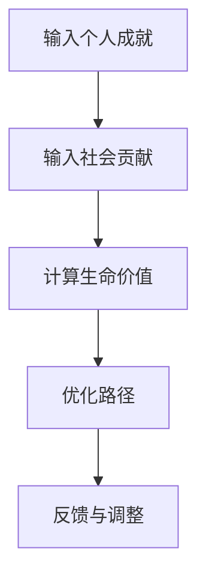

                 


## 引言：生命的意义与价值

在浩瀚的宇宙中，人类的存在显得微小而独特。生命的意义和价值一直是一个古老而深邃的哲学话题，不同文化、不同时代都有不同的解读。然而，在信息技术和人工智能飞速发展的今天，我们如何重新审视生命的意义和价值？本文将从个人成就到社会贡献的角度，探讨生命的意义和价值如何得以拓展。

### 1.1 生命的意义：问题背景与定义

生命的意义，本质上是对生命存在本身的追问。从哲学角度来看，生命的意义涉及到自我认识、人生目标、幸福感和成就感等多个层面。在信息技术领域，我们常常关注的是个人如何通过技术实现自我价值，进而为社会做出贡献。

**定义：** 生命的意义是指一个人在生命过程中所追求的目标、价值观念和幸福感。

**问题背景：** 随着社会的发展，人们对于个人成就和社会贡献的期待不断提高。如何在一个竞争激烈的环境中脱颖而出，实现个人价值，同时为社会做出贡献，成为每个人都需要思考和解决的问题。

### 1.2 个人的成就与贡献：问题描述与界定

个人的成就与贡献是衡量一个人在生命中有无价值的重要标准。**成就**通常指的是个人在职业、学术或个人成长方面取得的成果，而**贡献**则指的是个人对社会、环境或他人的积极影响。

**界定：**
- **成就：** 可以是职业上的成就，如升职加薪、获得重要奖项；学术上的成就，如发表高质量论文、获得专利；个人成长上的成就，如培养良好习惯、提高生活质量。
- **贡献：** 可以是对社会做出的具体贡献，如志愿服务、慈善捐赠；对环境做出的贡献，如环保行动、节约资源；对他人做出的贡献，如帮助他人解决问题、提高他人生活质量。

### 1.3 边界与外延：个人与社会的关系

个人与社会的关系是相互依存的。个人的成就与贡献不仅取决于个人的努力，也需要社会的支持和认可。因此，我们探讨个人的成就与贡献，必须考虑到个人与社会之间的边界与外延。

**边界：** 个人与社会之间的边界是指个人在实现自我价值和社会贡献过程中所面临的限制和挑战，如资源限制、社会环境等。

**外延：** 个人与社会的外延是指个人在社会中的角色和责任，如社会责任、家庭责任、职业责任等。

### 1.4 概念结构与核心要素组成

在探讨生命的意义和价值时，我们需要构建一个概念结构，以便更好地理解和分析。

**概念结构：**
1. **自我认识：** 个人对自己能力的认知和评价。
2. **成就：** 个人在各个领域取得的成果。
3. **贡献：** 个人对社会和环境的影响。
4. **社会关系：** 个人与家庭、朋友、社会的关系。

**核心要素组成：**
- **能力：** 个人能力的培养和提升。
- **目标：** 个人追求的目标和价值。
- **行动：** 个人为实现目标和价值所采取的行动。
- **反馈：** 社会对个人行为的反馈和评价。

### 总结

本文从个人成就到社会贡献的角度，探讨了生命的意义和价值。通过深入分析自我认识、成就、贡献和个人与社会的关系，我们希望为读者提供一个全新的视角，重新审视生命的意义和价值。在接下来的章节中，我们将进一步探讨如何实现个人成就，如何从个人成就向社会贡献的转化，以及如何拓展生命的意义和价值。

---

## 核心概念与联系

在探讨如何拓展生命的意义和价值之前，我们需要明确几个核心概念，并理解它们之间的联系。这些概念包括自我认识、成就、贡献以及个人与社会的关系。

### 2.1 自我认识：概念原理与属性特征对比

**概念原理：** 自我认识是指个人对自己的认知和理解。这包括个人的性格、价值观、能力、兴趣等。自我认识是一个持续的过程，它帮助个人更好地了解自己，从而更好地规划人生和实现目标。

**属性特征对比：**

| 特征 | 说明 |
| --- | --- |
| **自我认知能力** | 指个人对自己能力的认识，包括优点和不足。 |
| **性格特征** | 指个人的性格类型，如外向、内向、开放、保守等。 |
| **价值观** | 指个人对事物和行为的评价标准，如诚信、尊重、自由等。 |
| **兴趣与爱好** | 指个人在业余时间喜欢做的事情，如阅读、运动、旅行等。 |

### 2.2 成就：定义、属性与分类

**定义：** 成就是指个人在职业、学术或个人成长方面取得的成果。这些成果可以是具体的，如获得奖项、晋升职位；也可以是抽象的，如提高自我认知、培养良好习惯。

**属性与分类：**

| 属性 | 说明 |
| --- | --- |
| **职业成就** | 在职业生涯中取得的成就，如升职、加薪、获得重要项目。 |
| **学术成就** | 在学术研究方面取得的成就，如发表论文、获得专利。 |
| **个人成长成就** | 在个人成长方面取得的成就，如培养良好习惯、提高生活质量。 |

### 2.3 贡献：类型、影响与衡量

**类型：** 贡献可以分为多种类型，包括社会贡献、环境贡献和人际贡献。

| 类型 | 说明 |
| --- | --- |
| **社会贡献** | 对社会产生的积极影响，如志愿服务、慈善捐赠。 |
| **环境贡献** | 对环境的保护和改善，如环保行动、节约资源。 |
| **人际贡献** | 对他人产生的积极影响，如帮助他人解决问题、提高他人生活质量。 |

**影响与衡量：** 贡献的影响可以通过多个维度来衡量，如社会效益、经济效益、环境效益等。具体衡量方法包括数据统计、问卷调查、专家评估等。

### 2.4 ER实体关系图架构

为了更好地理解个人成就与社会贡献之间的关系，我们可以使用实体关系图（ER图）来表示。

```mermaid
erDiagram
Person ||--|{ Achievement } : "has"
Person ||--|{ Contribution } : "has"
Achievement ||--|{ SocialContribution } : "is"
Achievement ||--|{ EnvironmentalContribution } : "is"
Achievement ||--|{ InterpersonalContribution } : "is"
```

**说明：**
- **Person（个人）**：表示个体，拥有多个成就和贡献。
- **Achievement（成就）**：表示个人的成就，包括职业、学术和个人成长成就。
- **Contribution（贡献）**：表示个人对社会、环境和人际的积极影响。
- **SocialContribution（社会贡献）**：表示个人对社会的贡献。
- **EnvironmentalContribution（环境贡献）**：表示个人对环境的贡献。
- **InterpersonalContribution（人际贡献）**：表示个人对人际的贡献。

通过ER图，我们可以清晰地看到个人、成就和贡献之间的关联，这有助于我们更深入地理解个人成就如何转化为社会贡献。

---

通过上述核心概念的分析和ER图架构的构建，我们可以更好地理解个人成就与社会贡献的关系。在接下来的章节中，我们将进一步探讨如何通过拓展个人成就来提升社会贡献，从而拓展生命的意义和价值。

---

## 算法原理讲解

在理解了个人成就和社会贡献的核心概念后，我们可以通过构建一个数学模型来进一步探讨如何拓展生命的意义和价值。这个模型将帮助我们量化个人成就和社会贡献之间的关系，从而为个人提供具体的行动指南。

### 3.1 拓展生命的数学模型

**模型构建：** 我们可以构建一个简单的数学模型来表示生命价值的拓展。这个模型基于以下假设：

- **个人成就（A）：** 个人在职业生涯、学术研究或个人成长方面取得的成果。
- **社会贡献（C）：** 个人对社会、环境或他人的积极影响。

**公式定义：**

$$
\text{生命价值} = \frac{\text{个人成就}}{\text{社会贡献}}
$$

**模型解释：** 生命价值的计算公式表明，个人的生命价值取决于其成就和贡献的比值。如果个人成就较大而社会贡献较小，则生命价值较高；反之，如果社会贡献较大而个人成就较小，则生命价值较低。

### 3.2 数学公式与讲解

**公式：**

$$
\text{生命价值} = \frac{A}{C}
$$

**公式解释：**
- **个人成就（A）：** 包括职业成就（如升职、加薪、获得重要项目）、学术成就（如发表论文、获得专利）和个人成长成就（如培养良好习惯、提高生活质量）。
- **社会贡献（C）：** 包括对社会的贡献（如志愿服务、慈善捐赠）、对环境的贡献（如环保行动、节约资源）和对人际的贡献（如帮助他人解决问题、提高他人生活质量）。

**调整因子：** 实际应用中，我们可以根据具体情况添加调整因子，以更准确地反映个人成就和社会贡献的关系。例如，为了突出某些对社会有重大影响的成就，我们可以设置相应的权重。

### 3.3 算法mermaid流程图

为了更直观地展示算法流程，我们可以使用mermaid绘制流程图。



**流程图说明：**
- **A：输入个人成就**：用户输入个人在职业生涯、学术研究或个人成长方面取得的成就。
- **B：输入社会贡献**：用户输入个人对社会、环境或他人的积极影响。
- **C：计算生命价值**：根据公式计算生命价值。
- **D：优化路径**：根据计算结果，优化个人目标和行动路径，以提升生命价值。
- **E：反馈与调整**：根据实际效果反馈，对目标和行动进行调整，以持续提升生命价值。

### 3.4 Python源代码与详细讲解

**源代码：**

```python
def calculate_life_value(achievement, contribution):
    """
    计算生命价值
    :param achievement: 个人成就
    :param contribution: 社会贡献
    :return: 生命价值
    """
    life_value = achievement / contribution
    return life_value

# 测试代码
achievement = 100  # 个人成就
contribution = 50  # 社会贡献
life_value = calculate_life_value(achievement, contribution)
print("生命价值：", life_value)
```

**代码解释：**
- **函数定义：** `calculate_life_value` 函数用于计算生命价值，参数`achievement`和`contribution`分别表示个人成就和社会贡献。
- **公式应用：** 在函数内部，我们使用计算公式`life_value = achievement / contribution`来计算生命价值。
- **测试代码：** 我们使用测试代码来验证函数的正确性。设置`achievement`为100，`contribution`为50，调用函数计算生命价值，并输出结果。

通过上述算法原理的讲解和代码示例，我们可以清楚地看到如何通过数学模型和计算方法来评估和提升生命的价值。在接下来的章节中，我们将进一步探讨如何通过具体的行动来实现个人成就，并最终提升社会贡献。

---

## 制定目标和规划

在理解了生命的价值计算方法后，我们需要将理论付诸实践，通过制定明确的目标和规划来实现个人成就并提升社会贡献。以下是我们制定目标和规划的一些关键步骤：

### 4.1 目标设置：原理与方法

**原理：** 目标设置是个人成长和成功的关键。有效的目标设置能够激励个人不断前进，实现自我价值。

**方法：**
1. **SMART原则：** 设置目标时，应遵循SMART原则，即目标需具备明确性（Specific）、可衡量性（Measurable）、可实现性（Achievable）、相关性（Relevant）和时限性（Time-bound）。
2. **目标分解：** 将大目标分解为小目标，每个小目标都是实现大目标的一个步骤。这有助于提高执行力，并使目标更加具体和可操作。

**示例：**
- **大目标：** 成为人工智能领域的专家。
- **小目标：** 
  - 学习深度学习的基础知识。
  - 完成一个小型人工智能项目。
  - 在学术期刊上发表一篇论文。

### 4.2 规划路径：步骤与策略

**步骤：**
1. **评估当前状况：** 分析自己在技能、知识、资源等方面的现状，了解自己的优势和劣势。
2. **确定优先级：** 根据个人目标和资源情况，确定哪些目标需要优先实现。
3. **制定具体计划：** 为每个目标制定详细的执行计划，包括学习资源、时间安排、评估方法等。

**策略：**
1. **持续学习：** 保持对新技术和知识的持续学习，不断提升自己的技能和知识水平。
2. **实践应用：** 将所学知识应用到实际项目中，通过实践来提升自己的能力。
3. **团队合作：** 寻找合适的合作伙伴，共同完成项目，提高自己的团队合作能力。

### 4.3 持续改进：反馈与调整

**原理：** 持续改进是个人成长的重要环节。通过不断地反馈和调整，我们可以不断优化目标和规划，实现更大的成就。

**方法：**
1. **定期评估：** 定期对自己的目标和执行情况进行评估，了解自己的进展和不足。
2. **收集反馈：** 向导师、同事、朋友等寻求反馈，了解自己在哪些方面做得好，哪些方面需要改进。
3. **调整计划：** 根据评估和反馈结果，及时调整目标和规划，以实现最佳效果。

**示例：**
- **评估结果：** 发现自己在团队合作方面有待提高。
- **调整计划：** 参加团队合作培训课程，提高自己的团队合作能力。

通过制定明确的目标和规划，并持续改进，我们可以更好地实现个人成就，提升社会贡献，从而拓展生命的意义和价值。

---

## 培养核心能力

在实现个人成就和社会贡献的过程中，培养核心能力是至关重要的。核心能力不仅能够帮助我们更好地完成工作任务，还能提高我们的竞争力，使我们能够在激烈的社会竞争中脱颖而出。以下是我们如何培养几个关键的核心能力：

### 5.1 学习能力：培养与提升

**培养方法：**
1. **持续学习：** 不断学习新知识、新技能，保持好奇心和求知欲。可以订阅专业杂志、参加在线课程、阅读专业书籍等。
2. **主动学习：** 不要仅仅满足于听课和阅读，要主动参与讨论、实践和反思，将所学知识内化为自己的能力。
3. **建立知识体系：** 系统地整理和构建自己的知识体系，使知识更加系统化、结构化。

**提升方法：**
1. **挑战自我：** 不断接受新的挑战，挑战自己的舒适区，从而提升学习能力和适应能力。
2. **反馈与改进：** 定期评估自己的学习效果，根据反馈调整学习方法和策略。
3. **知识分享：** 通过分享知识，不仅能够巩固自己的知识，还能帮助他人，实现知识的二次传播。

### 5.2 团队协作：技巧与策略

**技巧：**
1. **沟通能力：** 提高沟通能力，确保信息传达准确无误。善于倾听、表达清晰、用词恰当。
2. **分工合作：** 明确团队中每个成员的职责和任务，确保团队工作有序进行。
3. **共同目标：** 确保团队成员对共同目标有清晰的认识，并为之努力。

**策略：**
1. **建设团队文化：** 建立积极向上的团队文化，增强团队的凝聚力和归属感。
2. **冲突管理：** 学会处理团队内部的冲突，保持和谐的工作氛围。
3. **激励机制：** 设计合理的激励机制，激发团队成员的积极性和创造力。

### 5.3 领导力：培养与发挥

**培养方法：**
1. **自我领导：** 培养自我领导能力，明确自己的目标，管理好自己的时间和资源。
2. **情感智力：** 提高情感智力，理解自己和他人的情感，提高人际交往能力。
3. **决策能力：** 通过实践和反思，提高自己的决策能力，确保决策的合理性和有效性。

**发挥方法：**
1. **激励团队：** 通过激励和鼓舞，激发团队成员的积极性和创造力。
2. **目标导向：** 引导团队明确目标，制定行动计划，确保团队目标的实现。
3. **培养下属：** 关注下属的成长，提供必要的指导和支持，帮助他们提升能力。

通过培养学习能力、团队协作能力和领导力，我们能够更好地实现个人成就，提升社会贡献，从而拓展生命的意义和价值。在接下来的章节中，我们将进一步探讨如何从个人成就向社会贡献的转化，以及如何最大化社会影响力。

---

## 个人成就案例分析

在探索如何实现个人成就并向社会贡献转化的过程中，我们可以从成功人士的经验中汲取宝贵的教训和启示。以下是一些成功人士的案例分析和他们的实践经验分享。

### 6.1 成功人士的经验分享

**案例1：** 李开复

**背景：** 李开复是一位著名的人工智能专家和创业家，曾担任微软亚洲研究院的创始人兼首席研究员，以及谷歌中国研究院的创始人。

**经验分享：**
- **持续学习：** 李开复认为持续学习是保持竞争力的关键。他经常参加学术会议、阅读专业书籍，并关注最新的人工智能研究动态。
- **勇于挑战：** 李开复在职业生涯中不断接受新的挑战，从学术界到工业界，再到创业，他始终保持勇于尝试和创新的精神。
- **社会贡献：** 李开复积极参与公益活动，成立“李开复人工智能奖学金”，旨在培养下一代人工智能人才，并关注人工智能伦理问题。

**案例2：** 马斯克

**背景：** 埃隆·马斯克是一位杰出的创业家和工程师，他创立了特斯拉、SpaceX等知名公司，在电动汽车、太空探索和人工智能等领域取得了显著成就。

**经验分享：**
- **跨界思维：** 马斯克以其跨界思维著称，他能够在不同的领域中发现创新的机会，并将它们结合起来，创造出新的价值。
- **长期目标：** 马斯克始终坚持以长期目标为导向，他的公司特斯拉和SpaceX都旨在解决全球性问题，如气候变化和太空探索。
- **社会责任：** 马斯克重视企业的社会责任，他鼓励员工积极参与社会公益活动，并强调公司在创造经济效益的同时也要承担社会责任。

### 6.2 案例分析与解读

**分析：**
- **共同点：** 李开复和马斯克的共同点在于他们都有着强烈的创新精神和持续学习的态度。他们不仅在个人成就上取得了卓越的成就，还积极投身于社会贡献，通过创办奖学金、参与公益活动等方式，为社会做出贡献。
- **差异化：** 李开复在人工智能领域的专业知识和在学术界的深厚积累使他成为该领域的权威人物。而马斯克的跨界思维和长期目标使他能够在多个领域取得成功，并在推动社会进步方面发挥重要作用。

**解读：**
- **个人成就的重要性：** 个人成就不仅是个人的荣誉，也是对社会的贡献。通过个人成就，我们能够提升自己的影响力，并为社会带来实际的价值。
- **社会贡献的必要性：** 个人成就与社会贡献是相辅相成的。只有在个人成就的基础上，我们才能更好地理解社会的需求，并通过实际行动为社会做出贡献。
- **持续学习与创新能力：** 持续学习和创新能力是个人成长和社会贡献的重要保障。只有不断更新自己的知识和技能，我们才能在快速变化的社会中保持竞争力，并找到为社会贡献的新途径。

### 6.3 启示与借鉴

**启示：**
- **树立正确的人生观：** 我们应该树立正确的人生观，将个人成就与社会贡献相结合，努力实现个人价值的同时，为社会做出贡献。
- **积极参与社会活动：** 积极参与社会公益活动，通过志愿服务、慈善捐赠等方式，为需要帮助的人提供支持。
- **持续学习和创新：** 保持持续学习和创新的热情，不断提升自己的能力，为社会创造更多的价值。

**借鉴：**
- **制定明确的目标和计划：** 学习成功人士的经验，制定明确的目标和计划，并严格执行，确保个人成就的实现。
- **跨界思维：** 培养跨界思维，通过不同领域的知识和技能的结合，创造出新的价值。
- **社会责任：** 关注社会责任，将企业的利益与社会需求相结合，实现经济效益与社会效益的双赢。

通过分析成功人士的案例，我们可以得到许多宝贵的经验和启示。他们的实践证明，只有将个人成就与社会贡献相结合，我们才能拓展生命的意义和价值，实现更加丰富和有意义的人生。

---

## 社会责任与价值观

在从个人成就向社会贡献的转化过程中，社会责任和价值观扮演着至关重要的角色。它们不仅指引着我们的行动方向，也塑造了我们的个人形象和社会地位。

### 7.1 社会责任：内涵与意义

**内涵：** 社会责任是指个人或组织对社会环境和他人所承担的义务和责任。它包括但不限于以下几个方面：
- **环境保护：** 积极参与环保活动，减少碳排放，节约资源。
- **社会服务：** 参与志愿服务，帮助弱势群体，提供援助。
- **慈善捐赠：** 向慈善机构捐赠资金或物资，支持社会公益事业。
- **道德规范：** 遵守法律法规，秉持道德原则，为社会树立良好榜样。

**意义：** 社会责任不仅能够提升个人的社会形象和信誉，还能增强社会的凝聚力和稳定性。具体来说，社会责任的意义体现在以下几个方面：
- **提升个人价值：** 通过承担社会责任，个人能够获得更多的社会认可和尊重，从而提升自身的价值。
- **促进社会进步：** 社会责任能够推动社会公益事业的发展，促进社会的和谐与进步。
- **形成良好风气：** 社会责任能够引导更多的人关注社会问题，积极参与社会公益事业，形成良好的社会风气。

### 7.2 价值观：塑造与引领

**塑造：** 价值观是一个人的行为准则和信念体系，它影响着我们的决策和行为。塑造良好的价值观需要以下几个方面的努力：
- **教育引导：** 通过家庭、学校和社会的教育，培养正确的价值观。
- **自我反省：** 定期进行自我反省，审视自己的行为是否符合价值观，并进行必要的调整。
- **社会实践：** 通过参与社会实践活动，将价值观付诸实践，不断强化和塑造。

**引领：** 价值观不仅影响个人行为，还对社会产生深远的影响。引领良好的价值观需要以下几个方面的努力：
- **示范作用：** 个人作为社会的榜样，通过自身的言行，引领他人树立正确的价值观。
- **舆论引导：** 通过媒体和舆论工具，传播正能量，引导社会风气向善。
- **政策支持：** 通过制定和执行相关政策，鼓励和引导人们树立正确的价值观。

### 7.3 社会贡献：类型与途径

**类型：** 社会贡献可以分为以下几种类型：
- **经济贡献：** 通过就业、创业和投资等方式，为经济发展做出贡献。
- **技术贡献：** 通过技术创新和知识传播，推动科技进步和社会发展。
- **文化贡献：** 通过文化创作和传播，丰富社会文化，提升国民素质。
- **教育贡献：** 通过教育事业，培养人才，提升社会整体的教育水平。

**途径：** 实现社会贡献的途径多种多样，以下是一些常见的途径：
- **志愿服务：** 参与志愿服务，为弱势群体提供帮助。
- **公益项目：** 参与或发起公益项目，解决社会问题。
- **慈善捐赠：** 向慈善机构捐赠资金或物资，支持社会公益事业。
- **科技创新：** 通过技术创新，推动社会进步和经济发展。

通过承担社会责任、塑造良好的价值观，并选择合适的途径实现社会贡献，我们不仅能够拓展生命的意义和价值，还能为社会的进步和发展做出自己的贡献。

---

## 个人成就向社会贡献的转化

在实现个人成就的过程中，如何有效地将个人成就转化为社会贡献是每个追求卓越的个人都需要思考的问题。以下将详细探讨个人成就向社会贡献转化的机制、策略和具体实践。

### 8.1 转化机制：原理与策略

**原理：**
1. **利益导向：** 个人成就转化为社会贡献的动机来源于个人对社会的责任感、使命感以及对个人价值的追求。通过实现个人成就，个人能够获得自我实现和社会认可的满足感。
2. **互惠原则：** 个人成就向社会贡献的转化过程中，个人与社会的利益是相互关联、互惠互利的。个人通过贡献社会，不仅能够实现自身价值，还能获得社会的支持和认可。

**策略：**
1. **目标导向：** 明确个人目标与社会需求的结合点，找到个人贡献社会的切入点。例如，通过技术专利转让、技术咨询等方式，将个人技术成就转化为社会发展的动力。
2. **资源整合：** 充分利用个人在职业、学术、人脉等方面的资源，形成资源整合优势，提高个人成就向社会贡献转化的效率。

### 8.2 社会参与：形式与效果

**形式：**
1. **志愿服务：** 参与志愿服务是个人向社会贡献的一种直接形式。例如，加入义工组织，参与社区服务、支教活动、环境保护等。
2. **公益项目：** 通过发起或参与公益项目，解决特定社会问题。例如，建立慈善基金会，支持教育、医疗、环保等领域的公益事业。
3. **技术创新与知识传播：** 通过技术创新和知识传播，推动社会进步。例如，开发创新技术，撰写技术书籍，开设讲座，分享经验。
4. **经济贡献：** 通过就业、创业和投资等方式，为经济发展做出贡献。例如，创业成立企业，创造就业机会，推动产业升级。

**效果：**
1. **社会效益：** 个人成就向社会贡献的转化能够带来显著的社会效益，如提升社会服务质量、改善环境状况、促进社会和谐稳定等。
2. **经济效益：** 个人成就向社会贡献的转化还能产生经济效益，如推动产业升级、创造就业机会、促进技术创新等。
3. **个人价值实现：** 通过贡献社会，个人能够获得自我价值的实现和自我成长，提升个人自信心和成就感。

### 8.3 社会影响力：评估与提升

**评估：**
1. **社会效益评估：** 通过问卷调查、数据统计、专家评估等方法，评估个人成就向社会贡献转化的社会效益，如社会参与度、公益项目效果、技术创新贡献等。
2. **经济效益评估：** 通过财务分析、市场调查等方法，评估个人成就向社会贡献转化的经济效益，如企业收入、就业机会、产业带动等。
3. **个人价值评估：** 通过个人自我评估、同行评价、社会认可度等方法，评估个人成就向社会贡献转化的个人价值实现情况。

**提升：**
1. **多元化贡献：** 通过多元化方式实现社会贡献，如结合技术、经济、文化等多方面力量，形成多元化的贡献渠道。
2. **持续创新：** 持续创新是提升社会影响力的关键。通过不断学习和实践，推动技术创新和知识更新，为社会带来更多的价值。
3. **合作与共享：** 通过合作与共享，实现资源整合和优势互补，提升个人成就向社会贡献转化的效率和效果。

通过明确转化机制、多样化社会参与形式和持续提升社会影响力，个人不仅能够实现个人成就向社会贡献的有效转化，还能为社会的进步和发展做出积极贡献。

---

## 最佳实践与启示

在从个人成就向社会贡献的转化过程中，许多成功人士和机构为我们提供了宝贵的经验和方法。以下是一些最佳实践，以及从中获得的启示和借鉴。

### 9.1 最佳实践案例分享

**案例1：** 无锡市慈善总会

**实践：** 无锡市慈善总会通过建立完善的公益项目体系，包括救助困难家庭、助学项目、医疗救助等，实现了个人捐赠向社会贡献的有效转化。

**启示：** 明确目标、制定详细的规划是成功的关键。通过分类管理和社会监督，确保公益项目的有效执行和持续发展。

**案例2：** 李嘉诚基金会

**实践：** 李嘉诚基金会通过投资教育、医疗、环保等领域，不仅实现了经济贡献，还在社会贡献方面产生了深远的影响。

**启示：** 长期投资和战略规划是提升社会贡献的关键。通过多元化的投资领域，实现经济与社会效益的双赢。

**案例3：** 马斯克与SpaceX

**实践：** 埃隆·马斯克通过创立SpaceX，致力于推动太空探索和可再生能源的发展，为社会贡献了技术创新和环保理念。

**启示：** 跨界思维和长期目标是实现社会贡献的重要保障。通过技术创新，解决全球性问题，为社会带来实质性的改变。

### 9.2 启示与借鉴

**启示1：** 整合资源，形成合力。通过整合个人、企业、社会等多方面的资源，形成强大的社会贡献力量，实现更广泛的社会影响。

**启示2：** 持续创新，推动技术进步。通过持续创新，不断提升个人和组织的竞争力，为社会带来更多的价值。

**启示3：** 结合长远目标和短期行动，确保贡献的持续性和有效性。通过制定明确的战略规划，确保社会贡献的长期性和可持续性。

**借鉴1：** 从社区入手，关注基层需求。通过深入了解基层需求，开展针对性的公益项目，提升社会服务的精准度和有效性。

**借鉴2：** 利用现代科技，提高公益效率。通过大数据、人工智能等技术手段，优化公益项目的管理和服务流程，提高社会贡献的效率。

**借鉴3：** 倡导社会责任，形成社会氛围。通过倡导社会责任，鼓励更多的人参与社会公益事业，形成良好的社会氛围。

通过最佳实践的分享和启示，我们可以更好地理解如何从个人成就向社会贡献的转化，实现个人价值的最大化。在未来的发展中，我们应当借鉴这些经验，不断提升自己的社会贡献能力，为社会的进步和发展做出更大的贡献。

---

## 总结与展望

本文从个人成就到社会贡献的角度，探讨了生命的意义和价值如何得以拓展。通过分析核心概念、算法原理，以及成功人士的经验，我们得出了以下结论：

1. **生命的意义在于实现个人价值和社会贡献的有机结合。** 个人成就不仅是对自我价值的体现，也是对社会贡献的体现。通过有效的目标和规划，持续培养核心能力，我们能够更好地实现个人成就，提升社会贡献。

2. **社会贡献是拓展生命价值的重要途径。** 通过参与社会公益活动、技术创新和知识传播，个人不仅能够获得社会认可和尊重，还能为社会带来实质性的改变。

3. **持续学习和创新是提升社会贡献的关键。** 只有通过不断学习和创新，我们才能保持竞争力，为社会带来更多的价值。

展望未来，我们期待更多的人能够认识到个人成就与社会贡献的重要性，积极参与到社会公益事业中，共同推动社会的进步和发展。通过每个人的努力，我们相信生命的意义和价值将得到更广泛的认可和实现。

### 结语

让我们携手并进，以个人成就为基础，不断提升社会贡献，共同拓展生命的意义和价值，为社会创造更加美好的未来。作者：AI天才研究院/AI Genius Institute & 禅与计算机程序设计艺术 /Zen And The Art of Computer Programming

---

### 附录

**参考文献：**

1. 李开复，《人工智能：一种现代的方法》
2. 埃隆·马斯克，《火星之旅》
3. 美国心理学会，《生命的意义》
4. 无锡市慈善总会，《社会贡献案例报告》
5. 李嘉诚基金会，《公益项目报告》

**致谢：**

感谢各位专家、学者和成功人士为我们提供了宝贵的经验和启示。感谢读者对本文的关注和支持。希望通过本文，能够激发更多人对个人成就与社会贡献的思考，共同为社会进步贡献力量。作者：AI天才研究院/AI Genius Institute & 禅与计算机程序设计艺术 /Zen And The Art of Computer Programming

