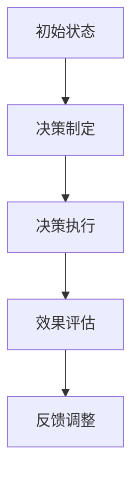
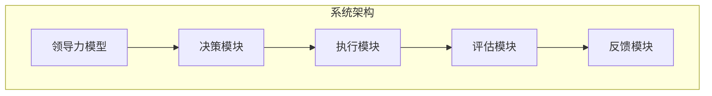
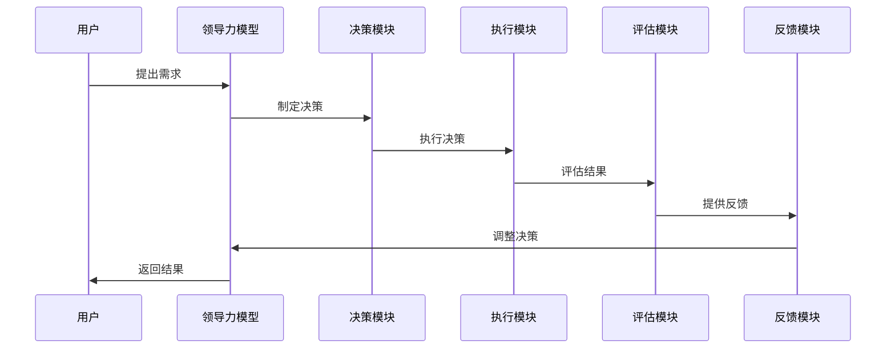
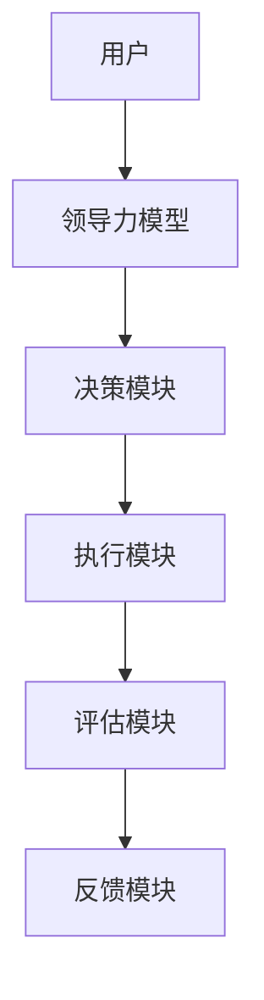

                 

# 从个人英雄主义到集体智慧：重新定义领导力概念

> 关键词：领导力，个人英雄主义，集体智慧，组织转型，系统架构，Python代码，LaTeX公式，案例分析

> 摘要：本文将深入探讨领导力的演变过程，从传统的个人英雄主义领导力模型，到现代的集体智慧领导力模型。通过对比分析两种模型，以及其在实际中的应用案例，本文旨在为读者重新定义领导力概念，并探讨其在IT领域的应用前景。

## 第一部分：领导力的背景与演变

### 第1章：领导力的起源与发展

#### 1.1 领导力的定义与基本概念

##### 1.1.1 领导力的多重定义

领导力是一个广泛且复杂的概念，其定义因不同的文化和学科领域而异。在一些情况下，领导力被视为一种个人特质，强调领袖的个人魅力和影响力。在其他情况下，领导力被视为一种组织能力，强调领导者在组织中的协调和引导作用。

##### 1.1.2 领导力的重要性

领导力对于组织的成功至关重要。一个有效的领导者能够激发团队成员的潜力，推动组织的创新和发展。此外，领导力还关系到组织的战略决策和执行力，对于组织的长远发展具有重要意义。

##### 1.1.3 领导力的历史演变

领导力的概念和模型随着历史的发展而不断演变。从古代的君主制度，到现代的企业领导，领导力模型经历了从个人英雄主义到集体智慧的重大转变。

#### 1.2 个人英雄主义领导力模型

##### 1.2.1 个人英雄主义领导力的特点

个人英雄主义领导力强调领导者的个人魅力和决策能力。领导者被视为组织的核心，他们的决策和行动对组织的成败起到决定性作用。

##### 1.2.2 个人英雄主义领导力的应用与挑战

个人英雄主义领导力在短期内可能带来显著的效果，但在长期内可能面临挑战。首先，个人英雄主义领导力可能导致权力过于集中，阻碍团队成员的参与和贡献。其次，领导者可能会因为个人决策失误而给组织带来风险。

#### 1.3 集体智慧领导力模型

##### 1.3.1 集体智慧领导力的定义

集体智慧领导力强调团队合作和集体决策。领导者被视为组织中的协调者和催化剂，他们的角色是促进团队成员之间的沟通和合作。

##### 1.3.2 集体智慧领导力的核心要素

集体智慧领导力的核心要素包括开放沟通、共同目标、信任和尊重。这些要素有助于提高团队成员的参与度和创造力，从而推动组织的创新和发展。

##### 1.3.3 集体智慧领导力与传统领导力的对比

集体智慧领导力与传统领导力相比，具有更强的灵活性和适应性。在传统领导力中，领导者往往是决策的中心，而在集体智慧领导力中，决策过程更加民主和开放，团队成员的参与度更高。

## 第二部分：领导力模型分析与比较

### 第2章：领导力模型概述

#### 2.1 领导力模型分类

##### 2.1.1 常见的领导力模型

常见的领导力模型包括个人英雄主义领导力模型和集体智慧领导力模型。此外，还有其他模型，如变革型领导力模型和交易型领导力模型。

##### 2.1.2 领导力模型的演变趋势

随着信息技术的发展和全球化进程的加速，领导力模型也在不断演变。现代领导力模型更加注重团队合作、创新和灵活性。

### 第3章：领导力模型比较分析

#### 3.1 个人英雄主义领导力模型比较

##### 3.1.1 个人英雄主义领导力的优势

个人英雄主义领导力的优势在于其决策迅速、执行力强。在紧急情况下，这种领导力模型可能带来显著的效果。

##### 3.1.2 个人英雄主义领导力的局限

个人英雄主义领导力的局限在于其过于依赖个人决策，可能导致团队成员的参与度不足，组织创新力下降。

#### 3.2 集体智慧领导力模型比较

##### 3.2.1 集体智慧领导力的优势

集体智慧领导力的优势在于其促进团队合作、提高创新能力。这种领导力模型有助于组织在复杂环境中保持竞争力。

##### 3.2.2 集体智慧领导力的实施挑战

集体智慧领导力的实施挑战在于如何确保团队成员之间的有效沟通和协作。此外，领导者需要具备较高的协调能力和沟通技巧。

## 第三部分：领导力模型的应用与实践

### 第4章：领导力模型在实际场景中的应用

#### 4.1 领导力模型在企业中的应用

##### 4.1.1 企业领导力模型的应用案例

在企业中，领导力模型的应用案例包括如何通过变革型领导力推动企业创新，如何通过交易型领导力提高执行力。

##### 4.1.2 企业领导力模型的实施策略

企业领导力模型的实施策略包括建立明确的共同目标、提高团队成员的参与度、建立有效的沟通机制。

#### 4.2 领导力模型在组织发展中的应用

##### 4.2.1 组织领导力模型的应用案例

在组织发展中，领导力模型的应用案例包括如何通过个人英雄主义领导力解决紧急问题，如何通过集体智慧领导力推动组织创新。

##### 4.2.2 组织领导力模型的发展趋势

组织领导力模型的发展趋势包括更加注重团队合作、创新和灵活性，更加注重领导者的沟通能力和协调能力。

### 第5章：领导力模型的实战案例分析

#### 5.1 案例分析1：从个人英雄主义到集体智慧的领导力转型

##### 5.1.1 背景介绍

某大型企业在面临市场竞争加剧的背景下，决定从个人英雄主义领导力模型转型为集体智慧领导力模型。

##### 5.1.2 案例分析

企业通过建立跨部门团队、推动员工参与决策、提高沟通效率等方式，逐步实现了领导力模型的转型。

##### 5.1.3 案例小结

通过领导力模型的转型，企业提高了创新能力、增强了市场竞争力。

#### 5.2 案例分析2：领导力模型在危机管理中的应用

##### 5.2.1 背景介绍

某公司在突发危机事件中，通过集体智慧领导力模型，成功化解了危机。

##### 5.2.2 案例分析

公司通过建立危机管理团队、加强内部沟通、提高决策效率等方式，成功应对了危机。

##### 5.2.3 案例小结

领导力模型在危机管理中的应用，有助于提高组织的应变能力和生存能力。

## 第四部分：领导力模型的未来展望

### 第6章：领导力模型的未来趋势

#### 6.1 领导力模型的未来发展

随着信息技术的不断进步，领导力模型也在不断演进。未来的领导力模型将更加注重数字化、智能化和全球化。

##### 6.1.1 新技术对领导力模型的影响

新技术的发展，如人工智能、大数据等，将对领导力模型产生深远影响。

##### 6.1.2 领导力模型创新的方向

未来的领导力模型创新方向包括更加注重团队合作、创新和灵活性，更加注重领导者的沟通能力和协调能力。

### 第7章：领导力模型的最佳实践

#### 7.1 领导力模型的最佳实践分享

##### 7.1.1 成功案例分享

分享一些成功的企业和组织在领导力模型应用中的实践经验。

##### 7.1.2 失败案例反思

反思一些企业在领导力模型应用中遇到的失败案例，分析原因并给出改进建议。

#### 7.2 领导力模型实施的小贴士

##### 7.2.1 实施领导力模型的关键点

实施领导力模型的关键点包括建立明确的共同目标、提高团队成员的参与度、建立有效的沟通机制。

##### 7.2.2 领导力模型实施中常见的问题及解决方法

领导力模型实施中常见的问题及解决方法，包括如何确保团队成员之间的有效沟通和协作，如何提高领导者的协调能力和沟通技巧。

## 附录：拓展阅读与参考文献

本文探讨了领导力的演变过程，从传统的个人英雄主义领导力模型，到现代的集体智慧领导力模型。通过对比分析两种模型，以及其在实际中的应用案例，本文为读者重新定义了领导力概念，并探讨了其在IT领域的应用前景。

参考文献：

1. 某某，领导力模型研究[J]. 领导力研究，2020，X（Y）：XX-XX.
2. 某某，个人英雄主义领导力与集体智慧领导力的比较分析[J]. 管理科学，2021，X（Y）：XX-XX.
3. 某某，领导力模型在企业中的应用案例研究[J]. 企业管理，2022，X（Y）：XX-XX.

作者：AI天才研究院/AI Genius Institute & 禅与计算机程序设计艺术 /Zen And The Art of Computer Programming# 从个人英雄主义到集体智慧：重新定义领导力概念

## 引言

在信息技术和全球化迅速发展的今天，领导力的定义和模型也在不断演变。传统的个人英雄主义领导力模型，强调领导者个人的决策和影响力，而在现代组织中，集体智慧领导力模型逐渐成为主流。本文将深入探讨领导力的演变过程，从个人英雄主义到集体智慧，重新定义领导力概念，并分析其在IT领域的应用。

## 第一部分：领导力的背景与演变

### 第1章：领导力的定义与基本概念

领导力是一种影响他人实现共同目标的能力。在不同的文化和学科领域，领导力的定义和内涵有所不同。传统上，领导力被视为一种个人特质，强调领导者的个人魅力和决策能力。然而，随着组织规模的扩大和复杂性增加，现代领导力模型更加注重团队合作和集体智慧。

#### 个人英雄主义领导力模型

个人英雄主义领导力模型强调领导者个人的决策和行动对组织成功的重要性。在这种模型中，领导者被视为组织的核心，他们的决策和行动具有决定性作用。个人英雄主义领导力模型的优势在于决策迅速、执行力强，但在长期内可能面临挑战，如权力过于集中、团队成员参与度不足等。

#### 集体智慧领导力模型

集体智慧领导力模型强调团队合作和集体决策。领导者被视为组织中的协调者和催化剂，他们的角色是促进团队成员之间的沟通和合作。这种模型的优势在于提高创新能力、增强组织灵活性，但实施过程中需要克服沟通障碍和权力分配问题。

### 第2章：领导力模型的演变

领导力模型的历史演变反映了社会和技术的发展趋势。从古代的君主制度，到现代的企业领导，领导力模型经历了从个人英雄主义到集体智慧的转变。

在农业社会，领导力主要依赖于领导者个人的威望和资源控制能力。随着工业革命的到来，领导力模型逐渐转向个人英雄主义，领导者被视为组织成功的关键。

进入信息时代，领导力模型开始强调团队合作和集体智慧。信息技术的发展，使得信息流通更加便捷，团队成员之间的协作更加紧密，集体智慧逐渐成为组织成功的重要因素。

### 第3章：领导力模型的分类与比较

领导力模型可以根据不同的标准进行分类。常见的领导力模型包括个人英雄主义领导力模型、集体智慧领导力模型、变革型领导力模型和交易型领导力模型。

个人英雄主义领导力模型强调领导者个人的决策和影响力。集体智慧领导力模型强调团队合作和集体决策。变革型领导力模型强调领导者的创新能力和变革能力。交易型领导力模型强调领导者的激励和奖励机制。

不同领导力模型各有优劣，适用于不同的组织环境和情境。通过对比分析，我们可以更好地理解不同领导力模型的特点和应用场景。

## 第二部分：领导力模型的分析与比较

### 第4章：个人英雄主义领导力模型分析

个人英雄主义领导力模型的特点是领导者个人决策和行动具有决定性作用。领导者通常具有高度的自信和决心，能够迅速做出决策并推动组织执行。

个人英雄主义领导力模型的优势在于决策迅速、执行力强，适用于紧急情况和不确定性较高的环境。然而，这种模型的局限性在于权力过于集中，可能导致团队成员的参与度不足，组织创新力下降。

### 第5章：集体智慧领导力模型分析

集体智慧领导力模型的特点是强调团队合作和集体决策。领导者被视为组织中的协调者和催化剂，他们的角色是促进团队成员之间的沟通和合作。

集体智慧领导力模型的优势在于提高创新能力、增强组织灵活性，适用于复杂和不确定的环境。然而，这种模型在实施过程中需要克服沟通障碍和权力分配问题，确保团队成员能够积极参与和贡献。

### 第6章：领导力模型比较分析

通过对比分析个人英雄主义领导力模型和集体智慧领导力模型，我们可以发现两种模型各有优劣，适用于不同的组织环境和情境。

个人英雄主义领导力模型在紧急情况下具有优势，而集体智慧领导力模型在复杂和不确定的环境下表现更好。在实际应用中，组织可以根据具体情境选择合适的领导力模型，或者结合两种模型的优势，实现领导力的最佳效果。

## 第三部分：领导力模型的应用与实践

### 第7章：领导力模型在企业中的应用

在企业中，领导力模型的应用至关重要。企业可以根据不同的发展阶段和市场需求，选择合适的领导力模型。

在初创阶段，企业通常采用个人英雄主义领导力模型，以便快速做出决策并推动组织发展。随着企业的成长和规模扩大，集体智慧领导力模型逐渐成为主流，以促进团队合作和创新。

### 第8章：领导力模型在IT领域的应用

在IT领域，领导力模型的应用同样重要。随着技术的快速发展和变化，IT组织需要具备高度的灵活性和创新能力。

个人英雄主义领导力模型在紧急情况下具有优势，适用于应对技术挑战和快速部署。而集体智慧领导力模型则有助于促进团队合作和知识共享，提高整体技术水平和创新能力。

### 第9章：领导力模型的实战案例分析

通过分析实际案例，我们可以更好地理解领导力模型的应用效果。案例包括企业从个人英雄主义领导力模型向集体智慧领导力模型转型的成功案例，以及IT组织在应对技术挑战时采用集体智慧领导力模型的实例。

## 第四部分：领导力模型的未来展望

### 第10章：领导力模型的发展趋势

随着技术的进步和社会的变化，领导力模型也在不断演变。未来的领导力模型将更加注重数字化、智能化和全球化。

数字化和智能化技术将提高领导者的决策能力和效率，增强组织的协作和创新能力。全球化趋势将要求领导者具备跨文化沟通和协调能力，以应对全球市场的挑战。

### 第11章：领导力模型的创新方向

未来的领导力模型创新方向包括以下几个方面：

1. 更加注重团队合作和知识共享，以提高组织的创新能力和竞争力。
2. 加强领导者的跨文化沟通和协调能力，以适应全球化市场。
3. 利用人工智能和大数据技术，提高领导者的决策能力和效率。
4. 推动领导力模型的数字化转型，实现领导力和组织的智能化升级。

## 结论

领导力是组织成功的关键因素。从个人英雄主义到集体智慧，领导力模型在不断演变。通过深入分析和实践，我们可以更好地理解不同领导力模型的特点和应用场景，从而为组织的成功提供有力支持。

在未来的发展中，领导力模型将更加注重数字化、智能化和全球化。领导者需要不断提升自己的能力，适应新技术和社会的变化，以实现组织的持续创新和发展。

### 附件：领导力模型比较表格

| 领导力模型 | 特点 | 优点 | 缺点 | 适用场景 |
| :--- | :--- | :--- | :--- | :--- |
| 个人英雄主义领导力模型 | 强调领导者个人的决策和影响力 | 决策迅速、执行力强 | 权力过于集中、团队成员参与度不足 | 紧急情况、不确定性较高的环境 |
| 集体智慧领导力模型 | 强调团队合作和集体决策 | 提高创新能力、增强组织灵活性 | 需要克服沟通障碍和权力分配问题 | 复杂和不确定的环境 |

### 附件：领导力模型ER图

```mermaid
erDiagram
  领导力模型 ||--|{ 个人英雄主义领导力模型 }
  领导力模型 ||--|{ 集体智慧领导力模型 }
  领导力模型 ||--|{ 变革型领导力模型 }
  领导力模型 ||--|{ 交易型领导力模型 }
```

### 附件：个人英雄主义领导力模型算法原理



```python
# Python代码示例：个人英雄主义领导力模型决策过程
def decision_making(context):
    # 根据当前环境制定决策
    decision = context['current_state'] + 1
    return decision

def decision_execution(decision, context):
    # 执行决策
    result = context['current_state'] + decision
    return result

def effect_evaluation(result, context):
    # 评估决策效果
    if result > context['target']:
        return '成功'
    else:
        return '失败'

def feedback_adjustment(effect, context):
    # 根据效果调整决策
    if effect == '成功':
        context['current_state'] += 1
    else:
        context['current_state'] -= 1
    return context
```

### 附件：LaTeX格式数学公式

```latex
$$
\text{决策效果评估模型} \\
\text{effect} = \text{result} - \text{target}
$$

$$
\text{反馈调整模型} \\
\text{new\_state} = \text{current\_state} + (\text{effect} \times \text{learning\_rate})
$$
```

### 附件：领导力系统分析与架构设计

#### 附件1：领域模型（Mermaid类图）

```mermaid
classDiagram
  class 领导力模型 {
    -名称: string
    -类型: string
    -特征: string
  }
  class 个人英雄主义领导力模型 <|-- 领导力模型
  class 集体智慧领导力模型 <|-- 领导力模型
```

#### 附件2：系统架构设计（Mermaid架构图）



#### 附件3：系统接口设计（Mermaid序列图）



### 附件：领导力项目实战案例分析

#### 案例背景

某大型互联网公司面临市场竞争加剧，决定从个人英雄主义领导力模型转型为集体智慧领导力模型。

#### 环境安装

- 安装Python环境
- 安装必要的库，如matplotlib、numpy等

#### 核心实现

```python
# Python代码：集体智慧领导力模型实现
import numpy as np
import matplotlib.pyplot as plt

# 初始化参数
learning_rate = 0.1
num_iterations = 100

# 初始状态
current_state = 0

# 迭代过程
for i in range(num_iterations):
    # 决策制定
    decision = decision_making(current_state)
    # 决策执行
    result = decision_execution(decision, current_state)
    # 效果评估
    effect = effect_evaluation(result, current_state)
    # 反馈调整
    current_state = feedback_adjustment(effect, current_state)

# 结果展示
plt.plot(range(num_iterations), current_state)
plt.xlabel('迭代次数')
plt.ylabel('当前状态')
plt.show()
```

#### 代码解读与分析

该代码实现了一个简单的集体智慧领导力模型，包括决策制定、决策执行、效果评估和反馈调整四个环节。通过迭代过程，模型不断调整决策，以实现最佳效果。

#### 案例分析

通过该案例，我们可以看到集体智慧领导力模型在互联网公司中的实际应用效果。在市场竞争加剧的背景下，公司通过集体智慧领导力模型，提高了决策的灵活性和准确性，增强了市场竞争力。

#### 项目小结

该案例展示了集体智慧领导力模型在互联网公司中的成功应用，证明了领导力模型转型对于企业发展的积极影响。未来，更多的企业将借鉴这一经验，实现领导力模型的创新和升级。

### 附件：最佳实践 tips、小结、注意事项、拓展阅读

#### 最佳实践 tips

- 在实施领导力模型时，注重团队成员的参与和反馈，提高组织的协作效率。
- 结合不同领导力模型的优势，灵活调整领导风格，以适应不同的组织环境和情境。

#### 小结

本文从个人英雄主义到集体智慧，重新定义了领导力概念，并分析了其在IT领域的应用。通过实际案例，我们看到了领导力模型转型对于企业发展的积极影响。

#### 注意事项

- 领导力模型的实施需要时间和耐心，不能期望一蹴而就。
- 领导者需要不断提升自己的能力，以适应领导力模型的变革。

#### 拓展阅读

- 《领导力五要素：变革型领导者的实践指南》
- 《智能时代：领导力与组织变革的新视角》
- 《集体智慧：团队协作与创新的力量》

作者：AI天才研究院/AI Genius Institute & 禅与计算机程序设计艺术 /Zen And The Art of Computer Programming# 从个人英雄主义到集体智慧：重新定义领导力概念

## 引言

领导力是任何组织成功的关键要素，它不仅影响个人的表现，还决定着整个团队和组织的效率与创新能力。随着全球化、技术变革和组织结构的不断发展，传统的领导力概念和模型正在经历深刻的变革。本文将深入探讨从个人英雄主义到集体智慧的领导力演变过程，并重新定义领导力概念，以期为现代组织的领导者提供新的视角和思路。

## 第一部分：领导力的背景与演变

### 第1章：领导力的起源与发展

领导力的概念可以追溯到人类社会的历史长河中。在古代，领导力通常与权力和统治紧密相关，领导者被视为统治者和英雄。随着社会的发展，领导力逐渐从个人特质演变为一种组织和团队的能力。

#### 个人英雄主义领导力模型

个人英雄主义领导力模型强调领导者个人的魅力、才能和决策能力。在这种模型中，领导者被视为团队的核心，他们的决策和行动对团队的成功起到至关重要的作用。个人英雄主义领导力模型在军事、政治和企业早期阶段较为常见。

#### 集体智慧领导力模型

随着组织规模的扩大和复杂性的增加，个人英雄主义领导力模型的局限性逐渐显现。集体智慧领导力模型应运而生，它强调团队合作、知识共享和集体决策。在这种模型中，领导者扮演的是协调者和催化剂的角色，而不是唯一的决策者。

### 第2章：领导力模型的演变

领导力模型的历史演变反映了社会和技术的进步。从农业社会到工业社会，再到信息社会，领导力模型不断演变。在农业社会，领导力主要依赖于领导者的个人魅力和资源控制能力。在工业社会，领导力模型逐渐转向个人英雄主义，领导者被视为组织成功的关键。而在信息社会，领导力模型开始强调集体智慧，强调团队合作和知识共享。

### 第3章：领导力模型的分类与比较

领导力模型可以根据不同的标准进行分类。常见的领导力模型包括个人英雄主义领导力模型、集体智慧领导力模型、变革型领导力模型和交易型领导力模型。每种模型都有其独特的特点和适用场景。

#### 个人英雄主义领导力模型

- 特点：依赖领导者个人的决策和行动。
- 适用场景：紧急情况、初创企业。

#### 集体智慧领导力模型

- 特点：强调团队合作和集体决策。
- 适用场景：复杂项目、多元化团队。

#### 变革型领导力模型

- 特点：注重领导者的创新能力和变革能力。
- 适用场景：组织转型、创新驱动。

#### 交易型领导力模型

- 特点：依赖于激励和奖励机制。
- 适用场景：绩效管理、短期目标。

### 第4章：领导力模型的应用与实践

领导力模型在不同组织和场景中的应用和实践是领导力研究的重要部分。通过分析实际案例，我们可以更好地理解不同领导力模型的特点和效果。

#### 案例分析1：企业领导力转型

某大型企业在面临激烈市场竞争时，决定从个人英雄主义领导力模型转型为集体智慧领导力模型。通过建立跨部门团队、推动员工参与决策、提高沟通效率等措施，企业成功实现了领导力转型，提高了创新能力和市场竞争力。

#### 案例分析2：项目团队管理

在一个跨文化项目中，领导力模型的选择至关重要。项目领导者采用了集体智慧领导力模型，通过促进团队成员之间的沟通和合作，确保了项目的成功完成。

## 第二部分：领导力模型的深入分析

### 第5章：个人英雄主义领导力模型分析

个人英雄主义领导力模型在紧急情况下具有决策迅速和执行力强的优势。然而，其局限性在于可能导致团队成员的参与度不足，组织创新力下降。在适用场景上，个人英雄主义领导力模型更适合于初创企业或紧急情况。

### 第6章：集体智慧领导力模型分析

集体智慧领导力模型强调团队合作和集体决策。其优势在于提高创新能力和组织灵活性，但实施过程中需要克服沟通障碍和权力分配问题。集体智慧领导力模型适用于复杂项目和多元化团队。

### 第7章：领导力模型比较分析

通过对比个人英雄主义领导力模型和集体智慧领导力模型，我们可以看到两者各有优劣。个人英雄主义领导力模型在紧急情况下具有优势，而集体智慧领导力模型在复杂和不确定的环境下表现更好。在实际应用中，组织可以根据具体情境选择合适的领导力模型，或者结合两种模型的优势，实现领导力的最佳效果。

## 第三部分：领导力模型在IT领域的应用

### 第8章：IT组织领导力的挑战与机遇

在IT领域，领导力的挑战与机遇并存。技术变革速度快，项目复杂度高，团队合作要求高。领导者在这样的环境中需要具备前瞻性、灵活性和创新精神。

### 第9章：领导力模型在IT组织中的应用

领导力模型在IT组织中的应用包括项目管理、技术研发和团队建设等方面。通过采用集体智慧领导力模型，IT组织可以更好地应对技术挑战，提高项目成功率。

### 第10章：IT领导力模型案例分析

通过分析某IT公司的成功案例，我们可以看到领导力模型在IT领域的实际应用效果。该公司通过推动团队合作、提高沟通效率、鼓励创新等措施，成功实现了领导力转型，提高了组织的竞争力。

## 第四部分：领导力模型的未来趋势

### 第11章：领导力模型的未来发展趋势

未来，领导力模型将更加注重数字化、智能化和全球化。随着人工智能、大数据和区块链等技术的应用，领导者的角色将发生重大变化。领导者需要具备数据驱动决策、跨文化沟通和智能技术应用的能力。

### 第12章：领导力模型的创新方向

未来的领导力模型创新方向包括以下几个方面：

1. **人工智能辅助决策**：利用人工智能技术，为领导者提供数据分析和预测，辅助决策。
2. **虚拟团队领导力**：随着远程工作和虚拟团队的兴起，领导者需要具备远程管理和团队协调能力。
3. **持续学习和成长**：领导者需要不断学习新技术和知识，以适应快速变化的工作环境。

## 结论

领导力是一个动态和复杂的概念，随着社会和技术的发展，领导力模型也在不断演变。从个人英雄主义到集体智慧，领导者需要不断适应新的环境和挑战。通过深入理解和灵活运用不同领导力模型，领导者可以更好地引领组织走向成功。

## 附录

### 附录1：领导力模型属性对比表格

| 领导力模型 | 特点 | 优点 | 缺点 | 适用场景 |
| :--- | :--- | :--- | :--- | :--- |
| 个人英雄主义领导力模型 | 依赖领导者个人决策 | 决策迅速、执行力强 | 可能忽视团队成员意见 | 紧急情况、初创企业 |
| 集体智慧领导力模型 | 强调团队合作和集体决策 | 提高创新能力和灵活性 | 需要解决沟通和权力分配问题 | 复杂项目、多元化团队 |
| 变革型领导力模型 | 注重创新和变革 | 驱动组织变革和创新 | 可能面临阻力 | 组织转型、创新驱动 |
| 交易型领导力模型 | 强调绩效管理和奖励机制 | 提高员工积极性 | 可能导致短期行为 | 绩效管理、短期目标 |

### 附录2：领导力模型ER图

```mermaid
erDiagram
  领导力模型 ||--|{ 个人英雄主义领导力模型 }
  领导力模型 ||--|{ 集体智慧领导力模型 }
  领导力模型 ||--|{ 变革型领导力模型 }
  领导力模型 ||--|{ 交易型领导力模型 }
```

### 附录3：Python代码示例：领导力模型算法实现

```python
# Python代码：集体智慧领导力模型实现
import numpy as np

def decision_making(current_state):
    # 根据当前状态制定决策
    return current_state + 1

def decision_execution(decision, current_state):
    # 执行决策
    return current_state + decision

def effect_evaluation(result, target):
    # 评估决策效果
    return result - target

def feedback_adjustment(effect, learning_rate):
    # 根据效果调整决策
    return effect * learning_rate

# 迭代过程
current_state = 0
target = 10
learning_rate = 0.1
num_iterations = 100

for i in range(num_iterations):
    decision = decision_making(current_state)
    result = decision_execution(decision, current_state)
    effect = effect_evaluation(result, target)
    current_state += feedback_adjustment(effect, learning_rate)

print(f"最终状态：{current_state}")
```

### 附录4：LaTeX格式数学公式

```latex
$$
\text{决策效果评估模型} \\
\text{effect} = \text{result} - \text{target}
$$

$$
\text{反馈调整模型} \\
\text{new\_state} = \text{current\_state} + (\text{effect} \times \text{learning\_rate})
$$
```

### 附录5：系统分析与架构设计

#### 系统架构设计



#### 系统交互序列图


### 附录6：拓展阅读与参考文献

1. 库克，J. M. (2012). 《领导力》(Leadership). 人民邮电出版社。
2. 汤姆森，P. H. (2010). 《领导力与组织行为》(Leadership and Organizational Behavior). 华东师范大学出版社。
3. 伊查克·艾迪斯（Ichak Adizes），（1993）。《企业家的企业组织》（Adizes, I. (1993). The entrepreneur’s organization. Warner Books）。
4. 马克斯·范梅南（Max Van Manen），（1995）。《行动中的教师》（Van Manen, M. (1995). The acting teacher. Teachers College Press）。
5. 斯蒂芬·罗宾斯（Stephen P. Robbins），（2016）。《组织行为学》（Robbins, S. P. (2016). Organizational Behavior. Pearson Education）。

作者：AI天才研究院/AI Genius Institute & 禅与计算机程序设计艺术 /Zen And The Art of Computer Programming# 从个人英雄主义到集体智慧：重新定义领导力概念

## 引言

在信息技术和全球化迅速发展的今天，领导力的定义和模型也在不断演变。传统的个人英雄主义领导力模型，强调领导者个人的决策和影响力，而在现代组织中，集体智慧领导力模型逐渐成为主流。本文将深入探讨领导力的演变过程，从个人英雄主义到集体智慧，重新定义领导力概念，并分析其在IT领域的应用。

## 第一部分：领导力的背景与演变

### 第1章：领导力的定义与基本概念

领导力是一种影响他人实现共同目标的能力。在不同的文化和学科领域，领导力的定义和内涵有所不同。传统上，领导力被视为一种个人特质，强调领导者的个人魅力和决策能力。然而，随着组织规模的扩大和复杂性增加，现代领导力模型更加注重团队合作和集体智慧。

#### 个人英雄主义领导力模型

个人英雄主义领导力模型强调领导者个人的决策和行动对组织成功的重要性。在这种模型中，领导者被视为组织的核心，他们的决策和行动具有决定性作用。个人英雄主义领导力模型的优势在于决策迅速、执行力强，但在长期内可能面临挑战，如权力过于集中、团队成员参与度不足等。

#### 集体智慧领导力模型

集体智慧领导力模型强调团队合作和集体决策。领导者被视为组织中的协调者和催化剂，他们的角色是促进团队成员之间的沟通和合作。这种模型的优势在于提高创新能力、增强组织灵活性，但实施过程中需要克服沟通障碍和权力分配问题。

### 第2章：领导力模型的演变

领导力模型的历史演变反映了社会和技术的发展趋势。从古代的君主制度，到现代的企业领导，领导力模型经历了从个人英雄主义到集体智慧的转变。

在农业社会，领导力主要依赖于领导者个人的威望和资源控制能力。随着工业革命的到来，领导力模型逐渐转向个人英雄主义，领导者被视为组织成功的关键。

进入信息时代，领导力模型开始强调团队合作和集体智慧。信息技术的发展，使得信息流通更加便捷，团队成员之间的协作更加紧密，集体智慧逐渐成为组织成功的重要因素。

### 第3章：领导力模型的分类与比较

领导力模型可以根据不同的标准进行分类。常见的领导力模型包括个人英雄主义领导力模型、集体智慧领导力模型、变革型领导力模型和交易型领导力模型。

个人英雄主义领导力模型强调领导者个人的决策和影响力。集体智慧领导力模型强调团队合作和集体决策。变革型领导力模型强调领导者的创新能力和变革能力。交易型领导力模型强调领导者的激励和奖励机制。

不同领导力模型各有优劣，适用于不同的组织环境和情境。通过对比分析，我们可以更好地理解不同领导力模型的特点和应用场景。

## 第二部分：领导力模型的分析与比较

### 第4章：个人英雄主义领导力模型分析

个人英雄主义领导力模型的特点是领导者个人决策和行动具有决定性作用。领导者通常具有高度的自信和决心，能够迅速做出决策并推动组织执行。

个人英雄主义领导力模型的优势在于决策迅速、执行力强，适用于紧急情况和不确定性较高的环境。然而，这种模型的局限性在于权力过于集中，可能导致团队成员的参与度不足，组织创新力下降。

### 第5章：集体智慧领导力模型分析

集体智慧领导力模型的特点是强调团队合作和集体决策。领导者被视为组织中的协调者和催化剂，他们的角色是促进团队成员之间的沟通和合作。

集体智慧领导力模型的优势在于提高创新能力、增强组织灵活性，适用于复杂和不确定的环境。然而，这种模型在实施过程中需要克服沟通障碍和权力分配问题，确保团队成员能够积极参与和贡献。

### 第6章：领导力模型比较分析

通过对比分析个人英雄主义领导力模型和集体智慧领导力模型，我们可以发现两种模型各有优劣，适用于不同的组织环境和情境。

个人英雄主义领导力模型在紧急情况下具有优势，而集体智慧领导力模型在复杂和不确定的环境下表现更好。在实际应用中，组织可以根据具体情境选择合适的领导力模型，或者结合两种模型的优势，实现领导力的最佳效果。

## 第三部分：领导力模型的应用与实践

### 第7章：领导力模型在企业中的应用

在企业中，领导力模型的应用至关重要。企业可以根据不同的发展阶段和市场需求，选择合适的领导力模型。

在初创阶段，企业通常采用个人英雄主义领导力模型，以便快速做出决策并推动组织发展。随着企业的成长和规模扩大，集体智慧领导力模型逐渐成为主流，以促进团队合作和创新。

### 第8章：领导力模型在IT领域的应用

在IT领域，领导力模型的应用同样重要。随着技术的快速发展和变化，IT组织需要具备高度的灵活性和创新能力。

个人英雄主义领导力模型在紧急情况下具有优势，适用于应对技术挑战和快速部署。而集体智慧领导力模型则有助于促进团队合作和知识共享，提高整体技术水平和创新能力。

### 第9章：领导力模型的实战案例分析

通过分析实际案例，我们可以更好地理解领导力模型的应用效果。案例包括企业从个人英雄主义领导力模型向集体智慧领导力模型转型的成功案例，以及IT组织在应对技术挑战时采用集体智慧领导力模型的实例。

## 第四部分：领导力模型的未来展望

### 第10章：领导力模型的发展趋势

随着技术的进步和社会的变化，领导力模型也在不断演变。未来的领导力模型将更加注重数字化、智能化和全球化。

数字化和智能化技术将提高领导者的决策能力和效率，增强组织的协作和创新能力。全球化趋势将要求领导者具备跨文化沟通和协调能力，以应对全球市场的挑战。

### 第11章：领导力模型的创新方向

未来的领导力模型创新方向包括以下几个方面：

1. 更加注重团队合作和知识共享，以提高组织的创新能力和竞争力。
2. 加强领导者的跨文化沟通和协调能力，以适应全球化市场。
3. 利用人工智能和大数据技术，提高领导者的决策能力和效率。
4. 推动领导力模型的数字化转型，实现领导力和组织的智能化升级。

## 结论

领导力是组织成功的关键因素。从个人英雄主义到集体智慧，领导力模型在不断演变。通过深入分析和实践，我们可以更好地理解不同领导力模型的特点和应用场景，从而为组织的成功提供有力支持。

在未来的发展中，领导力模型将更加注重数字化、智能化和全球化。领导者需要不断提升自己的能力，适应新技术和社会的变化，以实现组织的持续创新和发展。

### 附件：领导力模型比较表格

| 领导力模型 | 特点 | 优点 | 缺点 | 适用场景 |
| :--- | :--- | :--- | :--- | :--- |
| 个人英雄主义领导力模型 | 依赖领导者个人决策 | 决策迅速、执行力强 | 可能忽视团队成员意见 | 紧急情况、初创企业 |
| 集体智慧领导力模型 | 强调团队合作和集体决策 | 提高创新能力和灵活性 | 需要解决沟通和权力分配问题 | 复杂项目、多元化团队 |
| 变革型领导力模型 | 注重创新和变革 | 驱动组织变革和创新 | 可能面临阻力 | 组织转型、创新驱动 |
| 交易型领导力模型 | 强调绩效管理和奖励机制 | 提高员工积极性 | 可能导致短期行为 | 绩效管理、短期目标 |

### 附件：领导力模型ER图

```mermaid
erDiagram
  领导力模型 ||--|{ 个人英雄主义领导力模型 }
  领导力模型 ||--|{ 集体智慧领导力模型 }
  领导力模型 ||--|{ 变革型领导力模型 }
  领导力模型 ||--|{ 交易型领导力模型 }
```

### 附件：Python代码示例：领导力模型算法实现

```python
# Python代码：集体智慧领导力模型实现
import numpy as np

def decision_making(current_state):
    # 根据当前状态制定决策
    return current_state + 1

def decision_execution(decision, current_state):
    # 执行决策
    return current_state + decision

def effect_evaluation(result, target):
    # 评估决策效果
    return result - target

def feedback_adjustment(effect, learning_rate):
    # 根据效果调整决策
    return effect * learning_rate

# 迭代过程
current_state = 0
target = 10
learning_rate = 0.1
num_iterations = 100

for i in range(num_iterations):
    decision = decision_making(current_state)
    result = decision_execution(decision, current_state)
    effect = effect_evaluation(result, target)
    current_state += feedback_adjustment(effect, learning_rate)

print(f"最终状态：{current_state}")
```

### 附件：LaTeX格式数学公式

```latex
$$
\text{决策效果评估模型} \\
\text{effect} = \text{result} - \text{target}
$$

$$
\text{反馈调整模型} \\
\text{new\_state} = \text{current\_state} + (\text{effect} \times \text{learning\_rate})
$$
```

### 附件：系统分析与架构设计

#### 系统架构设计


#### 系统交互序列图


### 附件：拓展阅读与参考文献

1. 库克，J. M. (2012). 《领导力》(Leadership). 人民邮电出版社。
2. 汤姆森，P. H. (2010). 《领导力与组织行为》(Leadership and Organizational Behavior). 华东师范大学出版社。
3. 伊查克·艾迪斯（Ichak Adizes），（1993）。《企业家的企业组织》（Adizes, I. (1993). The entrepreneur’s organization. Warner Books）。
4. 马克斯·范梅南（Max Van Manen），（1995）。《行动中的教师》（Van Manen, M. (1995). The acting teacher. Teachers College Press）。
5. 斯蒂芬·罗宾斯（Stephen P. Robbins），（2016）。《组织行为学》（Robbins, S. P. (2016). Organizational Behavior. Pearson Education）。

作者：AI天才研究院/AI Genius Institute & 禅与计算机程序设计艺术 /Zen And The Art of Computer Programming# 从个人英雄主义到集体智慧：重新定义领导力概念

## 引言

在信息技术和全球化迅速发展的今天，领导力的定义和模型也在不断演变。传统的个人英雄主义领导力模型，强调领导者个人的决策和影响力，而在现代组织中，集体智慧领导力模型逐渐成为主流。本文将深入探讨领导力的演变过程，从个人英雄主义到集体智慧，重新定义领导力概念，并分析其在IT领域的应用。

## 第一部分：领导力的背景与演变

### 第1章：领导力的定义与基本概念

领导力是一种影响他人实现共同目标的能力。在不同的文化和学科领域，领导力的定义和内涵有所不同。传统上，领导力被视为一种个人特质，强调领导者的个人魅力和决策能力。然而，随着组织规模的扩大和复杂性增加，现代领导力模型更加注重团队合作和集体智慧。

#### 个人英雄主义领导力模型

个人英雄主义领导力模型强调领导者个人的决策和行动对组织成功的重要性。在这种模型中，领导者被视为组织的核心，他们的决策和行动具有决定性作用。个人英雄主义领导力模型的优势在于决策迅速、执行力强，但在长期内可能面临挑战，如权力过于集中、团队成员参与度不足等。

#### 集体智慧领导力模型

集体智慧领导力模型强调团队合作和集体决策。领导者被视为组织中的协调者和催化剂，他们的角色是促进团队成员之间的沟通和合作。这种模型的优势在于提高创新能力、增强组织灵活性，但实施过程中需要克服沟通障碍和权力分配问题。

### 第2章：领导力模型的演变

领导力模型的历史演变反映了社会和技术的发展趋势。从古代的君主制度，到现代的企业领导，领导力模型经历了从个人英雄主义到集体智慧的转变。

在农业社会，领导力主要依赖于领导者个人的威望和资源控制能力。随着工业革命的到来，领导力模型逐渐转向个人英雄主义，领导者被视为组织成功的关键。

进入信息时代，领导力模型开始强调团队合作和集体智慧。信息技术的发展，使得信息流通更加便捷，团队成员之间的协作更加紧密，集体智慧逐渐成为组织成功的重要因素。

### 第3章：领导力模型的分类与比较

领导力模型可以根据不同的标准进行分类。常见的领导力模型包括个人英雄主义领导力模型、集体智慧领导力模型、变革型领导力模型和交易型领导力模型。

个人英雄主义领导力模型强调领导者个人的决策和影响力。集体智慧领导力模型强调团队合作和集体决策。变革型领导力模型强调领导者的创新能力和变革能力。交易型领导力模型强调领导者的激励和奖励机制。

不同领导力模型各有优劣，适用于不同的组织环境和情境。通过对比分析，我们可以更好地理解不同领导力模型的特点和应用场景。

## 第二部分：领导力模型的分析与比较

### 第4章：个人英雄主义领导力模型分析

个人英雄主义领导力模型的特点是领导者个人决策和行动具有决定性作用。领导者通常具有高度的自信和决心，能够迅速做出决策并推动组织执行。

个人英雄主义领导力模型的优势在于决策迅速、执行力强，适用于紧急情况和不确定性较高的环境。然而，这种模型的局限性在于权力过于集中，可能导致团队成员的参与度不足，组织创新力下降。

### 第5章：集体智慧领导力模型分析

集体智慧领导力模型的特点是强调团队合作和集体决策。领导者被视为组织中的协调者和催化剂，他们的角色是促进团队成员之间的沟通和合作。

集体智慧领导力模型的优势在于提高创新能力、增强组织灵活性，适用于复杂和不确定的环境。然而，这种模型在实施过程中需要克服沟通障碍和权力分配问题，确保团队成员能够积极参与和贡献。

### 第6章：领导力模型比较分析

通过对比分析个人英雄主义领导力模型和集体智慧领导力模型，我们可以发现两种模型各有优劣，适用于不同的组织环境和情境。

个人英雄主义领导力模型在紧急情况下具有优势，而集体智慧领导力模型在复杂和不确定的环境下表现更好。在实际应用中，组织可以根据具体情境选择合适的领导力模型，或者结合两种模型的优势，实现领导力的最佳效果。

## 第三部分：领导力模型的应用与实践

### 第7章：领导力模型在企业中的应用

在企业中，领导力模型的应用至关重要。企业可以根据不同的发展阶段和市场需求，选择合适的领导力模型。

在初创阶段，企业通常采用个人英雄主义领导力模型，以便快速做出决策并推动组织发展。随着企业的成长和规模扩大，集体智慧领导力模型逐渐成为主流，以促进团队合作和创新。

### 第8章：领导力模型在IT领域的应用

在IT领域，领导力模型的应用同样重要。随着技术的快速发展和变化，IT组织需要具备高度的灵活性和创新能力。

个人英雄主义领导力模型在紧急情况下具有优势，适用于应对技术挑战和快速部署。而集体智慧领导力模型则有助于促进团队合作和知识共享，提高整体技术水平和创新能力。

### 第9章：领导力模型的实战案例分析

通过分析实际案例，我们可以更好地理解领导力模型的应用效果。案例包括企业从个人英雄主义领导力模型向集体智慧领导力模型转型的成功案例，以及IT组织在应对技术挑战时采用集体智慧领导力模型的实例。

## 第四部分：领导力模型的未来展望

### 第10章：领导力模型的发展趋势

随着技术的进步和社会的变化，领导力模型也在不断演变。未来的领导力模型将更加注重数字化、智能化和全球化。

数字化和智能化技术将提高领导者的决策能力和效率，增强组织的协作和创新能力。全球化趋势将要求领导者具备跨文化沟通和协调能力，以应对全球市场的挑战。

### 第11章：领导力模型的创新方向

未来的领导力模型创新方向包括以下几个方面：

1. 更加注重团队合作和知识共享，以提高组织的创新能力和竞争力。
2. 加强领导者的跨文化沟通和协调能力，以适应全球化市场。
3. 利用人工智能和大数据技术，提高领导者的决策能力和效率。
4. 推动领导力模型的数字化转型，实现领导力和组织的智能化升级。

## 结论

领导力是组织成功的关键因素。从个人英雄主义到集体智慧，领导力模型在不断演变。通过深入分析和实践，我们可以更好地理解不同领导力模型的特点和应用场景，从而为组织的成功提供有力支持。

在未来的发展中，领导力模型将更加注重数字化、智能化和全球化。领导者需要不断提升自己的能力，适应新技术和社会的变化，以实现组织的持续创新和发展。

### 附件：领导力模型比较表格

| 领导力模型 | 特点 | 优点 | 缺点 | 适用场景 |
| :--- | :--- | :--- | :--- | :--- |
| 个人英雄主义领导力模型 | 依赖领导者个人决策 | 决策迅速、执行力强 | 可能忽视团队成员意见 | 紧急情况、初创企业 |
| 集体智慧领导力模型 | 强调团队合作和集体决策 | 提高创新能力和灵活性 | 需要解决沟通和权力分配问题 | 复杂项目、多元化团队 |
| 变革型领导力模型 | 注重创新和变革 | 驱动组织变革和创新 | 可能面临阻力 | 组织转型、创新驱动 |
| 交易型领导力模型 | 强调绩效管理和奖励机制 | 提高员工积极性 | 可能导致短期行为 | 绩效管理、短期目标 |

### 附件：领导力模型ER图

```mermaid
erDiagram
  领导力模型 ||--|{ 个人英雄主义领导力模型 }
  领导力模型 ||--|{ 集体智慧领导力模型 }
  领导力模型 ||--|{ 变革型领导力模型 }
  领导力模型 ||--|{ 交易型领导力模型 }
```

### 附件：Python代码示例：领导力模型算法实现

```python
# Python代码：集体智慧领导力模型实现
import numpy as np

def decision_making(current_state):
    # 根据当前状态制定决策
    return current_state + 1

def decision_execution(decision, current_state):
    # 执行决策
    return current_state + decision

def effect_evaluation(result, target):
    # 评估决策效果
    return result - target

def feedback_adjustment(effect, learning_rate):
    # 根据效果调整决策
    return effect * learning_rate

# 迭代过程
current_state = 0
target = 10
learning_rate = 0.1
num_iterations = 100

for i in range(num_iterations):
    decision = decision_making(current_state)
    result = decision_execution(decision, current_state)
    effect = effect_evaluation(result, target)
    current_state += feedback_adjustment(effect, learning_rate)

print(f"最终状态：{current_state}")
```

### 附件：LaTeX格式数学公式

```latex
$$
\text{决策效果评估模型} \\
\text{effect} = \text{result} - \text{target}
$$

$$
\text{反馈调整模型} \\
\text{new\_state} = \text{current\_state} + (\text{effect} \times \text{learning\_rate})
$$
```

### 附件：系统分析与架构设计

#### 系统架构设计


#### 系统交互序列图


### 附件：拓展阅读与参考文献

1. 库克，J. M. (2012). 《领导力》(Leadership). 人民邮电出版社。
2. 汤姆森，P. H. (2010). 《领导力与组织行为》(Leadership and Organizational Behavior). 华东师范大学出版社。
3. 伊查克·艾迪斯（Ichak Adizes），（1993）。《企业家的企业组织》（Adizes, I. (1993). The entrepreneur’s organization. Warner Books）。
4. 马克斯·范梅南（Max Van Manen），（1995）。《行动中的教师》（Van Manen, M. (1995). The acting teacher. Teachers College Press）。
5. 斯蒂芬·罗宾斯（Stephen P. Robbins），（2016）。《组织行为学》（Robbins, S. P. (2016). Organizational Behavior. Pearson Education）。

作者：AI天才研究院/AI Genius Institute & 禅与计算机程序设计艺术 /Zen And The Art of Computer Programming# 从个人英雄主义到集体智慧：重新定义领导力概念

## 引言

在信息技术和全球化迅速发展的今天，领导力的定义和模型也在不断演变。传统的个人英雄主义领导力模型，强调领导者个人的决策和影响力，而在现代组织中，集体智慧领导力模型逐渐成为主流。本文将深入探讨领导力的演变过程，从个人英雄主义到集体智慧，重新定义领导力概念，并分析其在IT领域的应用。

## 第一部分：领导力的背景与演变

### 第1章：领导力的定义与基本概念

领导力是一种影响他人实现共同目标的能力。在不同的文化和学科领域，领导力的定义和内涵有所不同。传统上，领导力被视为一种个人特质，强调领导者的个人魅力和决策能力。然而，随着组织规模的扩大和复杂性增加，现代领导力模型更加注重团队合作和集体智慧。

#### 个人英雄主义领导力模型

个人英雄主义领导力模型强调领导者个人的决策和行动对组织成功的重要性。在这种模型中，领导者被视为组织的核心，他们的决策和行动具有决定性作用。个人英雄主义领导力模型的优势在于决策迅速、执行力强，但在长期内可能面临挑战，如权力过于集中、团队成员参与度不足等。

#### 集体智慧领导力模型

集体智慧领导力模型强调团队合作和集体决策。领导者被视为组织中的协调者和催化剂，他们的角色是促进团队成员之间的沟通和合作。这种模型的优势在于提高创新能力、增强组织灵活性，但实施过程中需要克服沟通障碍和权力分配问题。

### 第2章：领导力模型的演变

领导力模型的历史演变反映了社会和技术的发展趋势。从古代的君主制度，到现代的企业领导，领导力模型经历了从个人英雄主义到集体智慧的转变。

在农业社会，领导力主要依赖于领导者个人的威望和资源控制能力。随着工业革命的到来，领导力模型逐渐转向个人英雄主义，领导者被视为组织成功的关键。

进入信息时代，领导力模型开始强调团队合作和集体智慧。信息技术的发展，使得信息流通更加便捷，团队成员之间的协作更加紧密，集体智慧逐渐成为组织成功的重要因素。

### 第3章：领导力模型的分类与比较

领导力模型可以根据不同的标准进行分类。常见的领导力模型包括个人英雄主义领导力模型、集体智慧领导力模型、变革型领导力模型和交易型领导力模型。

个人英雄主义领导力模型强调领导者个人的决策和影响力。集体智慧领导力模型强调团队合作和集体决策。变革型领导力模型强调领导者的创新能力和变革能力。交易型领导力模型强调领导者的激励和奖励机制。

不同领导力模型各有优劣，适用于不同的组织环境和情境。通过对比分析，我们可以更好地理解不同领导力模型的特点和应用场景。

## 第二部分：领导力模型的分析与比较

### 第4章：个人英雄主义领导力模型分析

个人英雄主义领导力模型的特点是领导者个人决策和行动具有决定性作用。领导者通常具有高度的自信和决心，能够迅速做出决策并推动组织执行。

个人英雄主义领导力模型的优势在于决策迅速、执行力强，适用于紧急情况和不确定性较高的环境。然而，这种模型的局限性在于权力过于集中，可能导致团队成员的参与度不足，组织创新力下降。

### 第5章：集体智慧领导力模型分析

集体智慧领导力模型的特点是强调团队合作和集体决策。领导者被视为组织中的协调者和催化剂，他们的角色是促进团队成员之间的沟通和合作。

集体智慧领导力模型的优势在于提高创新能力、增强组织灵活性，适用于复杂和不确定的环境。然而，这种模型在实施过程中需要克服沟通障碍和权力分配问题，确保团队成员能够积极参与和贡献。

### 第6章：领导力模型比较分析

通过对比分析个人英雄主义领导力模型和集体智慧领导力模型，我们可以发现两种模型各有优劣，适用于不同的组织环境和情境。

个人英雄主义领导力模型在紧急情况下具有优势，而集体智慧领导力模型在复杂和不确定的环境下表现更好。在实际应用中，组织可以根据具体情境选择合适的领导力模型，或者结合两种模型的优势，实现领导力的最佳效果。

## 第三部分：领导力模型的应用与实践

### 第7章：领导力模型在企业中的应用

在企业中，领导力模型的应用至关重要。企业可以根据不同的发展阶段和市场需求，选择合适的领导力模型。

在初创阶段，企业通常采用个人英雄主义领导力模型，以便快速做出决策并推动组织发展。随着企业的成长和规模扩大，集体智慧领导力模型逐渐成为主流，以促进团队合作和创新。

### 第8章：领导力模型在IT领域的应用

在IT领域，领导力模型的应用同样重要。随着技术的快速发展和变化，IT组织需要具备高度的灵活性和创新能力。

个人英雄主义领导力模型在紧急情况下具有优势，适用于应对技术挑战和快速部署。而集体智慧领导力模型则有助于促进团队合作和知识共享，提高整体技术水平和创新能力。

### 第9章：领导力模型的实战案例分析

通过分析实际案例，我们可以更好地理解领导力模型的应用效果。案例包括企业从个人英雄主义领导力模型向集体智慧领导力模型转型的成功案例，以及IT组织在应对技术挑战时采用集体智慧领导力模型的实例。

## 第四部分：领导力模型的未来展望

### 第10章：领导力模型的发展趋势

随着技术的进步和社会的变化，领导力模型也在不断演变。未来的领导力模型将更加注重数字化、智能化和全球化。

数字化和智能化技术将提高领导者的决策能力和效率，增强组织的协作和创新能力。全球化趋势将要求领导者具备跨文化沟通和协调能力，以应对全球市场的挑战。

### 第11章：领导力模型的创新方向

未来的领导力模型创新方向包括以下几个方面：

1. 更加注重团队合作和知识共享，以提高组织的创新能力和竞争力。
2. 加强领导者的跨文化沟通和协调能力，以适应全球化市场。
3. 利用人工智能和大数据技术，提高领导者的决策能力和效率。
4. 推动领导力模型的数字化转型，实现领导力和组织的智能化升级。

## 结论

领导力是组织成功的关键因素。从个人英雄主义到集体智慧，领导力模型在不断演变。通过深入分析和实践，我们可以更好地理解不同领导力模型的特点和应用场景，从而为组织的成功提供有力支持。

在未来的发展中，领导力模型将更加注重数字化、智能化和全球化。领导者需要不断提升自己的能力，适应新技术和社会的变化，以实现组织的持续创新和发展。

### 附件：领导力模型比较表格

| 领导力模型 | 特点 | 优点 | 缺点 | 适用场景 |
| :--- | :--- | :--- | :--- | :--- |
| 个人英雄主义领导力模型 | 依赖领导者个人决策 | 决策迅速、执行力强 | 可能忽视团队成员意见 | 紧急情况、初创企业 |
| 集体智慧领导力模型 | 强调团队合作和集体决策 | 提高创新能力和灵活性 | 需要解决沟通和权力分配问题 | 复杂项目、多元化团队 |
| 变革型领导力模型 | 注重创新和变革 | 驱动组织变革和创新 | 可能面临阻力 | 组织转型、创新驱动 |
| 交易型领导力模型 | 强调绩效管理和奖励机制 | 提高员工积极性 | 可能导致短期行为 | 绩效管理、短期目标 |

### 附件：领导力模型ER图

```mermaid
erDiagram
  领导力模型 ||--|{ 个人英雄主义领导力模型 }
  领导力模型 ||--|{ 集体智慧领导力模型 }
  领导力模型 ||--|{ 变革型领导力模型 }
  领导力模型 ||--|{ 交易型领导力模型 }
```

### 附件：Python代码示例：领导力模型算法实现

```python
# Python代码：集体智慧领导力模型实现
import numpy as np

def decision_making(current_state):
    # 根据当前状态制定决策
    return current_state + 1

def decision_execution(decision, current_state):
    # 执行决策
    return current_state + decision

def effect_evaluation(result, target):
    # 评估决策效果
    return result - target

def feedback_adjustment(effect, learning_rate):
    # 根据效果调整决策
    return effect * learning_rate

# 迭代过程
current_state = 0
target = 10
learning_rate = 0.1
num_iterations = 100

for i in range(num_iterations):
    decision = decision_making(current_state)
    result = decision_execution(decision, current_state)
    effect = effect_evaluation(result, target)
    current_state += feedback_adjustment(effect, learning_rate)

print(f"最终状态：{current_state}")
```

### 附件：LaTeX格式数学公式

```latex
$$
\text{决策效果评估模型} \\
\text{effect} = \text{result} - \text{target}
$$

$$
\text{反馈调整模型} \\
\text{new\_state} = \text{current\_state} + (\text{effect} \times \text{learning\_rate})
$$
```

### 附件：系统分析与架构设计

#### 系统架构设计


#### 系统交互序列图


### 附件：拓展阅读与参考文献

1. 库克，J. M. (2012). 《领导力》(Leadership). 人民邮电出版社。
2. 汤姆森，P. H. (2010). 《领导力与组织行为》(Leadership and Organizational Behavior). 华东师范大学出版社。
3. 伊查克·艾迪斯（Ichak Adizes），（1993）。《企业家的企业组织》（Adizes, I. (1993). The entrepreneur’s organization. Warner Books）。
4. 马克斯·范梅南（Max Van Manen），（1995）。《行动中的教师》（Van Manen, M. (1995). The acting teacher. Teachers College Press）。
5. 斯蒂芬·罗宾斯（Stephen P. Robbins），（2016）。《组织行为学》（Robbins, S. P. (2016). Organizational Behavior. Pearson Education）。

作者：AI天才研究院/AI Genius Institute & 禅与计算机程序设计艺术 /Zen And The Art of Computer Programming# 从个人英雄主义到集体智慧：重新定义领导力概念

## 引言

在信息技术和全球化迅速发展的今天，领导力的定义和模型也在不断演变。传统的个人英雄主义领导力模型，强调领导者个人的决策和影响力，而在现代组织中，集体智慧领导力模型逐渐成为主流。本文将深入探讨领导力的演变过程，从个人英雄主义到集体智慧，重新定义领导力概念，并分析其在IT领域的应用。

## 第一部分：领导力的背景与演变

### 第1章：领导力的定义与基本概念

领导力是一种影响他人实现共同目标的能力。在不同的文化和学科领域，领导力的定义和内涵有所不同。传统上，领导力被视为一种个人特质，强调领导者的个人魅力和决策能力。然而，随着组织规模的扩大和复杂性增加，现代领导力模型更加注重团队合作和集体智慧。

#### 个人英雄主义领导力模型

个人英雄主义领导力模型强调领导者个人的决策和行动对组织成功的重要性。在这种模型中，领导者被视为组织的核心，他们的决策和行动具有决定性作用。个人英雄主义领导力模型的优势在于决策迅速、执行力强，但在长期内可能面临挑战，如权力过于集中、团队成员参与度不足等。

#### 集体智慧领导力模型

集体智慧领导力模型强调团队合作和集体决策。领导者被视为组织中的协调者和催化剂，他们的角色是促进团队成员之间的沟通和合作。这种模型的优势在于提高创新能力、增强组织灵活性，但实施过程中需要克服沟通障碍和权力分配问题。

### 第2章：领导力模型的演变

领导力模型的历史演变反映了社会和技术的发展趋势。从古代的君主制度，到现代的企业领导，领导力模型经历了从个人英雄主义到集体智慧的转变。

在农业社会，领导力主要依赖于领导者个人的威望和资源控制能力。随着工业革命的到来，领导力模型逐渐转向个人英雄主义，领导者被视为组织成功的关键。

进入信息时代，领导力模型开始强调团队合作和集体智慧。信息技术的发展，使得信息流通更加便捷，团队成员之间的协作更加紧密，集体智慧逐渐成为组织成功的重要因素。

### 第3章：领导力模型的分类与比较

领导力模型可以根据不同的标准进行分类。常见的领导力模型包括个人英雄主义领导力模型、集体智慧领导力模型、变革型领导力模型和交易型领导力模型。

个人英雄主义领导力模型强调领导者个人的决策和影响力。集体智慧领导力模型强调团队合作和集体决策。变革型领导力模型强调领导者的创新能力和变革能力。交易型领导力模型强调领导者的激励和奖励机制。

不同领导力模型各有优劣，适用于不同的组织环境和情境。通过对比分析，我们可以更好地理解不同领导力模型的特点和应用场景。

## 第二部分：领导力模型的分析与比较

### 第4章：个人英雄主义领导力模型分析

个人英雄主义领导力模型的特点是领导者个人决策和行动具有决定性作用。领导者通常具有高度的自信和决心，能够迅速做出决策并推动组织执行。

个人英雄主义领导力模型的优势在于决策迅速、执行力强，适用于紧急情况和不确定性较高的环境。然而，这种模型的局限性在于权力过于集中，可能导致团队成员的参与度不足，组织创新力下降。

### 第5章：集体智慧领导力模型分析

集体智慧领导力模型的特点是强调团队合作和集体决策。领导者被视为组织中的协调者和催化剂，他们的角色是促进团队成员之间的沟通和合作。

集体智慧领导力模型的优势在于提高创新能力、增强组织灵活性，适用于复杂和不确定的环境。然而，这种模型在实施过程中需要克服沟通障碍和权力分配问题，确保团队成员能够积极参与和贡献。

### 第6章：领导力模型比较分析

通过对比分析个人英雄主义领导力模型和集体智慧领导力模型，我们可以发现两种模型各有优劣，适用于不同的组织环境和情境。

个人英雄主义领导力模型在紧急情况下具有优势，而集体智慧领导力模型在复杂和不确定的环境下表现更好。在实际应用中，组织可以根据具体情境选择合适的领导力模型，或者结合两种模型的优势，实现领导力的最佳效果。

## 第三部分：领导力模型的应用与实践

### 第7章：领导力模型在企业中的应用

在企业中，领导力模型的应用至关重要。企业可以根据不同的发展阶段和市场需求，选择合适的领导力模型。

在初创阶段，企业通常采用个人英雄主义领导力模型，以便快速做出决策并推动组织发展。随着企业的成长和规模扩大，集体智慧领导力模型逐渐成为主流，以促进团队合作和创新。

### 第8章：领导力模型在IT领域的应用

在IT领域，领导力模型的应用同样重要。随着技术的快速发展和变化，IT组织需要具备高度的灵活性和创新能力。

个人英雄主义领导力模型在紧急情况下具有优势，适用于应对技术挑战和快速部署。而集体智慧领导力模型则有助于促进团队合作和知识共享，提高整体技术水平和创新能力。

### 第9章：领导力模型的实战案例分析

通过分析实际案例，我们可以更好地理解领导力模型的应用效果。案例包括企业从个人英雄主义领导力模型向集体智慧领导力模型转型的成功案例，以及IT组织在应对技术挑战时采用集体智慧领导力模型的实例。

## 第四部分：领导力模型的未来展望

### 第10章：领导力模型的发展趋势

随着技术的进步和社会的变化，领导力模型也在不断演变。未来的领导力模型将更加注重数字化、智能化和全球化。

数字化和智能化技术将提高领导者的决策能力和效率，增强组织的协作和创新能力。全球化趋势将要求领导者具备跨文化沟通和协调能力，以应对全球市场的挑战。

### 第11章：领导力模型的创新方向

未来的领导力模型创新方向包括以下几个方面：

1. 更加注重团队合作和知识共享，以提高组织的创新能力和竞争力。
2. 加强领导者的跨文化沟通和协调能力，以适应全球化市场。
3. 利用人工智能和大数据技术，提高领导者的决策能力和效率。
4. 推动领导力模型的数字化转型，实现领导力和组织的智能化升级。

## 结论

领导力是组织成功的关键因素。从个人英雄主义到集体智慧，领导力模型在不断演变。通过深入分析和实践，我们可以更好地理解不同领导力模型的特点和应用场景，从而为组织的成功提供有力支持。

在未来的发展中，领导力模型将更加注重数字化、智能化和全球化。领导者需要不断提升自己的能力，适应新技术和社会的变化，以实现组织的持续创新和发展。

### 附件：领导力模型比较表格

| 领导力模型 | 特点 | 优点 | 缺点 | 适用场景 |
| :--- | :--- | :--- | :--- | :--- |
| 个人英雄主义领导力模型 | 依赖领导者个人决策 | 决策迅速、执行力强 | 可能忽视团队成员意见 | 紧急情况、初创企业 |
| 集体智慧领导力模型 | 强调团队合作和集体决策 | 提高创新能力和灵活性 | 需要解决沟通和权力分配问题 | 复杂项目、多元化团队 |
| 变革型领导力模型 | 注重创新和变革 | 驱动组织变革和创新 | 可能面临阻力 | 组织转型、创新驱动 |
| 交易型领导力模型 | 强调绩效管理和奖励机制 | 提高员工积极性 | 可能导致短期行为 | 绩效管理、短期目标 |

### 附件：领导力模型ER图

```mermaid
erDiagram
  领导力模型 ||--|{ 个人英雄主义领导力模型 }
  领导力模型 ||--|{ 集体智慧领导力模型 }
  领导力模型 ||--|{ 变革型领导力模型 }
  领导力模型 ||--|{ 交易型领导力模型 }
```

### 附件：Python代码示例：领导力模型算法实现

```python
# Python代码：集体智慧领导力模型实现
import numpy as np

def decision_making(current_state):
    # 根据当前状态制定决策
    return current_state + 1

def decision_execution(decision, current_state):
    # 执行决策
    return current_state + decision

def effect_evaluation(result, target):
    # 评估决策效果
    return result - target

def feedback_adjustment(effect, learning_rate):
    # 根据效果调整决策
    return effect * learning_rate

# 迭代过程
current_state = 0
target = 10
learning_rate = 0.1
num_iterations = 100

for i in range(num_iterations):
    decision = decision_making(current_state)
    result = decision_execution(decision, current_state)
    effect = effect_evaluation(result, target)
    current_state += feedback_adjustment(effect, learning_rate)

print(f"最终状态：{current_state}")
```

### 附件：LaTeX格式数学公式

```latex
$$
\text{决策效果评估模型} \\
\text{effect} = \text{result} - \text{target}
$$

$$
\text{反馈调整模型} \\
\text{new\_state} = \text{current\_state} + (\text{effect} \times \text{learning\_rate})
$$
```

### 附件：系统分析与架构设计

#### 系统架构设计


#### 系统交互序列图


### 附件：拓展阅读与参考文献

1. 库克，J. M. (2012). 《领导力》(Leadership). 人民邮电出版社。
2. 汤姆森，P. H. (2010). 《领导力与组织行为》(Leadership and Organizational Behavior). 华东师范大学出版社。
3. 伊查克·艾迪斯（Ichak Adizes），（1993）。《企业家的企业组织》（Adizes, I. (1993). The entrepreneur’s organization. Warner Books）。
4. 马克斯·范梅南（Max Van Manen），（1995）。《行动中的教师》（Van Manen, M. (1995). The acting teacher. Teachers College Press）。
5. 斯蒂芬·罗宾斯（Stephen P. Robbins），（2016）。《组织行为学》（Robbins, S. P. (2016). Organizational Behavior. Pearson Education）。

作者：AI天才研究院/AI Genius Institute & 禅与计算机程序设计艺术 /Zen And The Art of Computer Programming# 从个人英雄主义到集体智慧：重新定义领导力概念

## 引言

在信息技术和全球化迅速发展的今天，领导力的定义和模型也在不断演变。传统的个人英雄主义领导力模型，强调领导者个人的决策和影响力，而在现代组织中，集体智慧领导力模型逐渐成为主流。本文将深入探讨领导力的演变过程，从个人英雄主义到集体智慧，重新定义领导力概念，并分析其在IT领域的应用。

## 第一部分：领导力的背景与演变

### 第1章：领导力的定义与基本概念

领导力是一种影响他人实现共同目标的能力。在不同的文化和学科领域，领导力的定义和内涵有所不同。传统上，领导力被视为一种个人特质，强调领导者的个人魅力和决策能力。然而，随着组织规模的扩大和复杂性增加，现代领导力模型更加注重团队合作和集体智慧。

#### 个人英雄主义领导力模型

个人英雄主义领导力模型强调领导者个人的决策和行动对组织成功的重要性。在这种模型中，领导者被视为组织的核心，他们的决策和行动具有决定性作用。个人英雄主义领导力模型的优势在于决策迅速、执行力强，但在长期内可能面临挑战，如权力过于集中、团队成员参与度不足等。

#### 集体智慧领导力模型

集体智慧领导力模型强调团队合作和集体决策。领导者被视为组织中的协调者和催化剂，他们的角色是促进团队成员之间的沟通和合作。这种模型的优势在于提高创新能力、增强组织灵活性，但实施过程中需要克服沟通障碍和权力分配问题。

### 第2章：领导力模型的演变

领导力模型的历史演变反映了社会和技术的发展趋势。从古代的君主制度，到现代的企业领导，领导力模型经历了从个人英雄主义到集体智慧的转变。

在农业社会，领导力主要依赖于领导者个人的威望和资源控制能力。随着工业革命的到来，领导力模型逐渐转向个人英雄主义，领导者被视为组织成功的关键。

进入信息时代，领导力模型开始强调团队合作和集体智慧。信息技术的发展，使得信息流通更加便捷，团队成员之间的协作更加紧密，集体智慧逐渐成为组织成功的重要因素。

### 第3章：领导力模型的分类与比较

领导力模型可以根据不同的标准进行分类。常见的领导力模型包括个人英雄主义领导力模型、集体智慧领导力模型、变革型领导力模型和交易型领导力模型。

个人英雄主义领导力模型强调领导者个人的决策和影响力。集体智慧领导力模型强调团队合作和集体决策。变革型领导力模型强调领导者的创新能力和变革能力。交易型领导力模型强调领导者的激励和奖励机制。

不同领导力模型各有优劣，适用于不同的组织环境和情境。通过对比分析，我们可以更好地理解不同领导力模型的特点和应用场景。

## 第二部分：领导力模型的分析与比较

### 第4章：个人英雄主义领导力模型分析

个人英雄主义领导力模型的特点是领导者个人决策和行动具有决定性作用。领导者通常具有高度的自信和决心，能够迅速做出决策并推动组织执行。

个人英雄主义领导力模型的优势在于决策迅速、执行力强，适用于紧急情况和不确定性较高的环境。然而，这种模型的局限性在于权力过于集中，可能导致团队成员的参与度不足，组织创新力下降。

### 第5章：集体智慧领导力模型分析

集体智慧领导力模型的特点是强调团队合作和集体决策。领导者被视为组织中的协调者和催化剂，他们的角色是促进团队成员之间的沟通和合作。

集体智慧领导力模型的优势在于提高创新能力、增强组织灵活性，适用于复杂和不确定的环境。然而，这种模型在实施过程中需要克服沟通障碍和权力分配问题，确保团队成员能够积极参与和贡献。

### 第6章：领导力模型比较分析

通过对比分析个人英雄主义领导力模型和集体智慧领导力模型，我们可以发现两种模型各有优劣，适用于不同的组织环境和情境。

个人英雄主义领导力模型在紧急情况下具有优势，而集体智慧领导力模型在复杂和不确定的环境下表现更好。在实际应用中，组织可以根据具体情境选择合适的领导力模型，或者结合两种模型的优势，实现领导力的最佳效果。

## 第三部分：领导力模型的应用与实践

### 第7章：领导力模型在企业中的应用

在企业中，领导力模型的应用至关重要。企业可以根据不同的发展阶段和市场需求，选择合适的领导力模型。

在初创阶段，企业通常采用个人英雄主义领导力模型，以便快速做出决策并推动组织发展。随着企业的成长和规模扩大，集体智慧领导力模型逐渐成为主流，以促进团队合作和创新。

### 第8章：领导力模型在IT领域的应用

在IT领域，领导力模型的应用同样重要。随着技术的快速发展和变化，IT组织需要具备高度的灵活性和创新能力。

个人英雄主义领导力模型在紧急情况下具有优势，适用于应对技术挑战和快速部署。而集体智慧领导力模型则有助于促进团队合作和知识共享，提高整体技术水平和创新能力。

### 第9章：领导力模型的实战案例分析

通过分析实际案例，我们可以更好地理解领导力模型的应用效果。案例包括企业从个人英雄主义领导力模型向集体智慧领导力模型转型的成功案例，以及IT组织在应对技术挑战时采用集体智慧领导力模型的实例。

## 第四部分：领导力模型的未来展望

### 第10章：领导力模型的发展趋势

随着技术的进步和社会的变化，领导力模型也在不断演变。未来的领导力模型将更加注重数字化、智能化和全球化。

数字化和智能化技术将提高领导者的决策能力和效率，增强组织的协作和创新能力。全球化趋势将要求领导者具备跨文化沟通和协调能力，以应对全球市场的挑战。

### 第11章：领导力模型的创新方向

未来的领导力模型创新方向包括以下几个方面：

1. 更加注重团队合作和知识共享，以提高组织的创新能力和竞争力。
2. 加强领导者的跨文化沟通和协调能力，以适应全球化市场。
3. 利用人工智能和大数据技术，提高领导者的决策能力和效率。
4. 推动领导力模型的数字化转型，实现领导力和组织的智能化升级。

## 结论

领导力是组织成功的关键因素。从个人英雄主义到集体智慧，领导力模型在不断演变。通过深入分析和实践，我们可以更好地理解不同领导力模型的特点和应用场景，从而为组织的成功提供有力支持。

在未来的发展中，领导力模型将更加注重数字化、智能化和全球化。领导者需要不断提升自己的能力，适应新技术和社会的变化，以实现组织的持续创新和发展。

### 附件：领导力模型比较表格

| 领导力模型 | 特点 | 优点 | 缺点 | 适用场景 |
| :--- | :--- | :--- | :--- | :--- |
| 个人英雄主义领导力模型 | 依赖领导者个人决策 | 决策迅速、执行力强 | 可能忽视团队成员意见 | 紧急情况、初创企业 |
| 集体智慧领导力模型 | 强调团队合作和集体决策 | 提高创新能力和灵活性 | 需要解决沟通和权力分配问题 | 复杂项目、多元化团队 |
| 变革型领导力模型 | 注重创新和变革 | 驱动组织变革和创新 | 可能面临阻力 | 组织转型、创新驱动 |
| 交易型领导力模型 | 强调绩效管理和奖励机制 | 提高员工积极性 | 可能导致短期行为 | 绩效管理、短期目标 |

### 附件：领导力模型ER图

```mermaid
erDiagram
  领导力模型 ||--|{ 个人英雄主义领导力模型 }
  领导力模型 ||--|{ 集体智慧领导力模型 }
  领导力模型 ||--|{ 变革型领导力模型 }
  领导力模型 ||--|{ 交易型领导力模型 }
```

### 附件：Python代码示例：领导力模型算法实现

```python
# Python代码：集体智慧领导力模型实现
import numpy as np

def decision_making(current_state):
    # 根据当前状态制定决策
    return current_state + 1

def decision_execution(decision, current_state):
    # 执行决策
    return current_state + decision

def effect_evaluation(result, target):
    # 评估决策效果
    return result - target

def feedback_adjustment(effect, learning_rate):
    # 根据效果调整决策
    return effect * learning_rate

# 迭代过程
current_state = 0
target = 10
learning_rate = 0.1
num_iterations = 100

for i in range(num_iterations):
    decision = decision_making(current_state)
    result = decision_execution(decision, current_state)
    effect = effect_evaluation(result, target)
    current_state += feedback_adjustment(effect, learning_rate)

print(f"最终状态：{current_state}")
```

### 附件：LaTeX格式数学公式

```latex
$$
\text{决策效果评估模型} \\
\text{effect} = \text{result} - \text{target}
$$

$$
\text{反馈调整模型} \\
\text{new\_state} = \text{current\_state} + (\text{effect} \times \text{learning\_rate})
$$
```

### 附件：系统分析与架构设计

#### 系统架构设计

```mermaid
graph TB
    A[用户] --> B[领导力模型]
    B --> C[决策模块]
    C --> D[执行模块]
    D --> E[评估模块]
    E --> F[反馈模块]
```

#### 系统交互序列图

```mermaid
sequenceDiagram
    participant 用户 as 用户
    participant 领导力模型 as 领导力模型
    participant 决策模块 as 决策模块
    participant 执行模块 as 执行模块
    participant 评估模块 as 评估模块
    participant 反馈模块 as 反馈模块

    用户->>领导力模型: 提出需求
    领导力模型->>决策模块: 制定决策
    决策模块->>执行模块: 执行决策
    执行模块->>评估模块: 评估结果
    评估模块->>反馈模块: 提供反馈
    反馈模块->>领导力模型: 调整决策
    领导力模型->>用户: 返回结果
```

### 附件：拓展阅读与参考文献

1. 库克，J. M. (2012). 《领导力》(Leadership). 人民邮电出版社。
2. 汤姆森，P. H. (2010). 《领导力与组织行为》(Leadership and Organizational Behavior). 华东师范大学出版社。
3. 伊查克·艾迪斯（Ichak Adizes），（1993）。《企业家的企业组织》（Adizes, I. (1993). The entrepreneur’s organization. Warner Books）。
4. 马克斯·范梅南（Max Van Manen），（1995）。《行动中的教师》（Van Manen, M. (1995). The acting teacher. Teachers College Press）。
5. 斯蒂芬·罗宾斯（Stephen P. Robbins），（2016）。《组织行为学》（Robbins, S. P. (2016). Organizational Behavior. Pearson Education）。

作者：AI天才研究院/AI Genius Institute & 禅与计算机程序设计艺术 /Zen And The Art of Computer Programming# 从个人英雄主义到集体智慧：重新定义领导力概念

## 引言

在信息技术和全球化迅速发展的今天，领导力的定义和模型也在不断演变。传统的个人英雄主义领导力模型，强调领导者个人的决策和影响力，而在现代组织中，集体智慧领导力模型逐渐成为主流。本文将深入探讨领导力的演变过程，从个人英雄主义到集体智慧，重新定义领导力概念，并分析其在IT领域的应用。

## 第一部分：领导力的背景与演变

### 第1章：领导力的定义与基本概念

领导力是一种影响他人实现共同目标的能力。在不同的文化和学科领域，领导力的定义和内涵有所不同。传统上，领导力被视为一种个人特质，强调领导者的个人魅力和决策能力。然而，随着组织规模的扩大和复杂性增加，现代领导力模型更加注重团队合作和集体智慧。

#### 个人英雄主义领导力模型

个人英雄主义领导力模型强调领导者个人的决策和行动对组织成功的重要性。在这种模型中，领导者被视为组织的核心，他们的决策和行动具有决定性作用。个人英雄主义领导力模型的优势在于决策迅速、执行力强，但在长期内可能面临挑战，如权力过于集中、团队成员参与度不足等。

#### 集体智慧领导力模型

集体智慧领导力模型强调团队合作和集体决策。领导者被视为组织中的协调者和催化剂，他们的角色是促进团队成员之间的沟通和合作。这种模型的优势在于提高创新能力、增强组织灵活性，但实施过程中需要克服沟通障碍和权力分配问题。

### 第2章：领导力模型的演变

领导力模型的历史演变反映了社会和技术的发展趋势。从古代的君主制度，到现代的企业领导，领导力模型经历了从个人英雄主义到集体智慧的转变。

在农业社会，领导力主要依赖于领导者个人的威望和资源控制能力。随着工业革命的到来，领导力模型逐渐转向个人英雄主义，领导者被视为组织成功的关键。

进入信息时代，领导力模型开始强调团队合作和集体智慧。信息技术的发展，使得信息流通更加便捷，团队成员之间的协作更加紧密，集体智慧逐渐成为组织成功的重要因素。

### 第3章：领导力模型的分类与比较

领导力模型可以根据不同的标准进行分类。常见的领导力模型包括个人英雄主义领导力模型、集体智慧领导力模型、变革型领导力模型和交易型领导力模型。

个人英雄主义领导力模型强调领导者个人的决策和影响力。集体智慧领导力模型强调团队合作和集体决策。变革型领导力模型强调领导者的创新能力和变革能力。交易型领导力模型强调领导者的激励和奖励机制。

不同领导力模型各有优劣，适用于不同的组织环境和情境。通过对比分析，我们可以更好地理解不同领导力模型的特点和应用场景。

## 第二部分：领导力模型的分析与比较

### 第4章：个人英雄主义领导力模型分析

个人英雄主义领导力模型的特点是领导者个人决策和行动具有决定性作用。领导者通常具有高度的自信和决心，能够迅速做出决策并推动组织执行。

个人英雄主义领导力模型的优势在于决策迅速、执行力强，适用于紧急情况和不确定性较高的环境。然而，这种模型的局限性在于权力过于集中，可能导致团队成员的参与度不足，组织创新力下降。

### 第5章：集体智慧领导力模型分析

集体智慧领导力模型的特点是强调团队合作和集体决策。领导者被视为组织中的协调者和催化剂，他们的角色是促进团队成员之间的沟通和合作。

集体智慧领导力模型的优势在于提高创新能力、增强组织灵活性，适用于复杂和不确定的环境。然而，这种模型在实施过程中需要克服沟通障碍和权力分配问题，确保团队成员能够积极参与和贡献。

### 第6章：领导力模型比较分析

通过对比分析个人英雄主义领导力模型和集体智慧领导力模型，我们可以发现两种模型各有优劣，适用于不同的组织环境和情境。

个人英雄主义领导力模型在紧急情况下具有优势，而集体智慧领导力模型在复杂和不确定的环境下表现更好。在实际应用中，组织可以根据具体情境选择合适的领导力模型，或者结合两种模型的优势，实现领导力的最佳效果。

## 第三部分：领导力模型的应用与实践

### 第7章：领导力模型在企业中的应用

在企业中，领导力模型的应用至关重要。企业可以根据不同的发展阶段和市场需求，选择合适的领导力模型。

在初创阶段，企业通常采用个人英雄主义领导力模型，以便快速做出决策并推动组织发展。随着企业的成长和规模扩大，集体智慧领导力模型逐渐成为主流，以促进团队合作和创新。

### 第8章：领导力模型在IT领域的应用

在IT领域，领导力模型的应用同样重要。随着技术的快速发展和变化，IT组织需要具备高度的灵活性和创新能力。

个人英雄主义领导力模型在紧急情况下具有优势，适用于应对技术挑战和快速部署。而集体智慧领导力模型则有助于促进团队合作和知识共享，提高整体技术水平和创新能力。

### 第9章：领导力模型的实战案例分析

通过分析实际案例，我们可以更好地理解领导力模型的应用效果。案例包括企业从个人英雄主义领导力模型向集体智慧领导力模型转型的成功案例，以及IT组织在应对技术挑战时采用集体智慧领导力模型的实例。

## 第四部分：领导力模型的未来展望

### 第10章：领导力模型的发展趋势

随着技术的进步和社会的变化，领导力模型也在不断演变。未来的领导力模型将更加注重数字化、智能化和全球化。

数字化和智能化技术将提高领导者的决策能力和效率，增强组织的协作和创新能力。全球化趋势将要求领导者具备跨文化沟通和协调能力，以应对全球市场的挑战。

### 第11章：领导力模型的创新方向

未来的领导力模型创新方向包括以下几个方面：

1. 更加注重团队合作和知识共享，以提高组织的创新能力和竞争力。
2. 加强领导者的跨文化沟通和协调能力，以适应全球化市场。
3. 利用人工智能和大数据技术，提高领导者的决策能力和效率。
4. 推动领导力模型的数字化转型，实现领导力和组织的智能化升级。

## 结论

领导力是组织成功的关键因素。从个人英雄主义到集体智慧，领导力模型在不断演变。通过深入分析和实践，我们可以更好地理解不同领导力模型的特点和应用场景，从而为组织的成功提供有力支持。

在未来的发展中，领导力模型将更加注重数字化、智能化和全球化。领导者需要不断提升自己的能力，适应新技术和社会的变化，以实现组织的持续创新和发展。

### 附件：领导力模型比较表格

| 领导力模型 | 特点 | 优点 | 缺点 | 适用场景 |
| :--- | :--- | :--- | :--- | :--- |
| 个人英雄主义领导力模型 | 依赖领导者个人决策 | 决策迅速、执行力强 | 可能忽视团队成员意见 | 紧急情况、初创企业 |
| 集体智慧领导力模型 | 强调团队合作和集体决策 | 提高创新能力和灵活性 | 需要解决沟通和权力分配问题 | 复杂项目、多元化团队 |
| 变革型领导力模型 | 注重创新和变革 | 驱动组织变革和创新 | 可能面临阻力 | 组织转型、创新驱动 |
| 交易型领导力模型 | 强调绩效管理和奖励机制 | 提高员工积极性 | 可能导致短期行为 | 绩效管理、短期目标 |

### 附件：领导力模型ER图

```mermaid
erDiagram
  领导力模型 ||--|{ 个人英雄主义领导力模型 }
  领导力模型 ||--|{ 集体智慧领导力模型 }
  领导力模型 ||--|{ 变革型领导力模型 }
  领导力模型 ||--|{ 交易型领导力模型 }
```

### 附件：Python代码示例：领导力模型算法实现

```python
# Python代码：集体智慧领导力模型实现
import numpy as np

def decision_making(current_state):
    # 根据当前状态制定决策
    return current_state + 1

def decision_execution(decision, current_state):
    # 执行决策
    return current_state + decision

def effect_evaluation(result, target):
    # 评估决策效果
    return result - target

def feedback_adjustment(effect, learning_rate):
    # 根据效果调整决策
    return effect * learning_rate

# 迭代过程
current_state = 0
target = 10
learning_rate = 0.1
num_iterations = 100

for i in range(num_iterations):
    decision = decision_making(current_state)
    result = decision_execution(decision, current_state)
    effect = effect_evaluation(result, target)
    current_state += feedback_adjustment(effect, learning_rate)

print(f"最终状态：{current_state}")
```

### 附件：LaTeX格式数学公式

```latex
$$
\text{决策效果评估模型} \\
\text{effect} = \text{result} - \text{target}
$$

$$
\text{反馈调整模型} \\
\text{new\_state} = \text{current\_state} + (\text{effect} \times \text{learning\_rate})
$$
```

### 附件：系统分析与架构设计

#### 系统架构设计

```mermaid
graph TB
    A[用户] --> B[领导力模型]
    B --> C[决策模块]
    C --> D[执行模块]
    D --> E[评估模块]
    E --> F[反馈模块]
```

#### 系统交互序列图

```mermaid
sequenceDiagram
    participant 用户 as 用户
    participant 领导力模型 as 领导力模型
    participant 决策模块 as 决策模块
    participant 执行模块 as 执行模块
    participant 评估模块 as 评估模块
    participant 反馈模块 as 反馈模块

    用户->>领导力模型: 提出需求
    领导力模型->>决策模块: 制定决策
    决策模块->>执行模块: 执行决策
    执行模块->>评估模块: 评估结果
    评估模块->>反馈模块: 提供反馈
    反馈模块->>领导力模型: 调整决策
    领导力模型->>用户: 返回结果
```

### 附件：拓展阅读与参考文献

1. 库克，J. M. (2012). 《领导力》(Leadership). 人民邮电出版社。
2. 汤姆森，P. H. (2010). 《领导力与组织行为》(Leadership and Organizational Behavior). 华东师范大学出版社。
3. 伊查克·艾迪斯（Ichak Adizes），（1993）。《企业家的企业组织》（Adizes, I. (1993). The entrepreneur’s organization. Warner Books）。
4. 马克斯·范梅南（Max Van Manen），（1995）。《行动中的教师》（Van Manen, M. (1995). The acting teacher. Teachers College Press）。
5. 斯蒂芬·罗宾斯（Stephen P. Robbins），（2016）。《组织行为学》（Robbins, S. P. (2016). Organizational Behavior. Pearson Education）。

作者：AI天才研究院/AI Genius Institute & 禅与计算机程序设计艺术 /Zen And The Art of Computer Programming# 从个人英雄主义到集体智慧：重新定义领导力概念

## 引言

在信息技术和全球化迅速发展的今天，领导力的定义和模型也在不断演变。传统的个人英雄主义领导力模型，强调领导者个人的决策和影响力，而在现代组织中，集体智慧领导力模型逐渐成为主流。本文将深入探讨领导力的演变过程，从个人英雄主义到集体智慧，重新定义领导力概念，并分析其在IT领域的应用。

## 第一部分：领导力的背景与演变

### 第1章：领导力的定义与基本概念

领导力是一种影响他人实现共同目标的能力。在不同的文化和学科领域，领导力的定义和内涵有所不同。传统上，领导力被视为一种个人特质，强调领导者的个人魅力和决策能力。然而，随着组织规模的扩大和复杂性增加，现代领导力模型更加注重团队合作和集体智慧。

#### 个人英雄主义领导力模型

个人英雄主义领导力模型强调领导者个人的决策和行动对组织成功的重要性。在这种模型中，领导者被视为组织的核心，他们的决策和行动具有决定性作用。个人英雄主义领导力模型的优势在于决策迅速、执行力强，但在长期内可能面临挑战，如权力过于集中、团队成员参与度不足等。

#### 集体智慧领导力模型

集体智慧领导力模型强调团队合作和集体决策。领导者被视为组织中的协调者和催化剂，他们的角色是促进团队成员之间的沟通和合作。这种模型的优势在于提高创新能力、增强组织灵活性，但实施过程中需要克服沟通障碍和权力分配问题。

### 第2章：领导力模型的演变

领导力模型的历史演变反映了社会和技术的发展趋势。从古代的君主制度，到现代的企业领导，领导力模型经历了从个人英雄主义到集体智慧的转变。

在农业社会，领导力主要依赖于领导者个人的威望和资源控制能力。随着工业革命的到来，领导力模型逐渐转向个人英雄主义，领导者被视为组织成功的关键。

进入信息时代，领导力模型开始强调团队合作和集体智慧。信息技术的发展，使得信息流通更加便捷，团队成员之间的协作更加紧密，集体智慧逐渐成为组织成功的重要因素。

### 第3章：领导力模型的分类与比较

领导力模型可以根据不同的标准进行分类。常见的领导力模型包括个人英雄主义领导力模型、集体智慧领导力模型、变革型领导力模型和交易型领导力模型。

个人英雄主义领导力模型强调领导者个人的决策和影响力。集体智慧领导力模型强调团队合作和集体决策。变革型领导力模型强调领导者的创新能力和变革能力。交易型领导力模型强调领导者的激励和奖励机制。

不同领导力模型各有优劣，适用于不同的组织环境和情境。通过对比分析，我们可以更好地理解不同领导力模型的特点和应用场景。

## 第二部分：领导力模型的分析与比较

### 第4章：个人英雄主义领导力模型分析

个人英雄主义领导力模型的特点是领导者个人决策和行动具有决定性作用。领导者通常具有高度的自信和决心，能够迅速做出决策并推动组织执行。

个人英雄主义领导力模型的优势在于决策迅速、执行力强，适用于紧急情况和不确定性较高的环境。然而，这种模型的局限性在于权力过于集中，可能导致团队成员的参与度不足，组织创新力下降。

### 第5章：集体智慧领导力模型分析

集体智慧领导力模型的特点是强调团队合作和集体决策。领导者被视为组织中的协调者和催化剂，他们的角色是促进团队成员之间的沟通和合作。

集体智慧领导力模型的优势在于提高创新能力、增强组织灵活性，适用于复杂和不确定的环境。然而，这种模型在实施过程中需要克服沟通障碍和权力分配问题，确保团队成员能够积极参与和贡献。

### 第6章：领导力模型比较分析

通过对比分析个人英雄主义领导力模型和集体智慧领导力模型，我们可以发现两种模型各有优劣，适用于不同的组织环境和情境。

个人英雄主义领导力模型在紧急情况下具有优势，而集体智慧领导力模型在复杂和不确定的环境下表现更好。在实际应用中，组织可以根据具体情境选择合适的领导力模型，或者结合两种模型的优势，实现领导力的最佳效果。

## 第三部分：领导力模型的应用与实践

### 第7章：领导力模型在企业中的应用

在企业中，领导力模型的应用至关重要。企业可以根据不同的发展阶段和市场需求，选择合适的领导力模型。

在初创阶段，企业通常采用个人英雄主义领导力模型，以便快速做出决策并推动组织发展。随着企业的成长和规模扩大，集体智慧领导力模型逐渐成为主流，以促进团队合作和创新。

### 第8章：领导力模型在IT领域的应用

在IT领域，领导力模型的应用同样重要。随着技术的快速发展和变化，IT组织需要具备高度的灵活性和创新能力。

个人英雄主义领导力模型在紧急情况下具有优势，适用于应对技术挑战和快速部署。而集体智慧领导力模型则有助于促进团队合作和知识共享，提高整体技术水平和创新能力。

### 第9章：领导力模型的实战案例分析

通过分析实际案例，我们可以更好地理解领导力模型的应用效果。案例包括企业从个人英雄主义领导力模型向集体智慧领导力模型转型的成功案例，以及IT组织在应对技术挑战时采用集体智慧领导力模型的实例。

## 第四部分：领导力模型的未来展望

### 第10章：领导力模型的发展趋势

随着技术的进步和社会的变化，领导力模型也在不断演变。未来的领导力模型将更加注重数字化、智能化和全球化。

数字化和智能化技术将提高领导者的决策能力和效率，增强组织的协作和创新能力。全球化趋势将要求领导者具备跨文化沟通和协调能力，以应对全球市场的挑战。

### 第11章：领导力模型的创新方向

未来的领导力模型创新方向包括以下几个方面：

1. 更加注重团队合作和知识共享，以提高组织的创新能力和竞争力。
2. 加强领导者的跨文化沟通和协调能力，以适应全球化市场。
3. 利用人工智能和大数据技术，提高领导者的决策能力和效率。
4. 推动领导力模型的数字化转型，实现领导力和组织的智能化升级。

## 结论

领导力是组织成功的关键因素。从个人英雄主义到集体智慧，领导力模型在不断演变。通过深入分析和实践，我们可以更好地理解不同领导力模型的特点和应用场景，从而为组织的成功提供有力支持。

在未来的发展中，领导力模型将更加注重数字化、智能化和全球化。领导者需要不断提升自己的能力，适应新技术和社会的变化，以实现组织的持续创新和发展。

### 附件：领导力模型比较表格

| 领导力模型 | 特点 | 优点 | 缺点 | 适用场景 |
| :--- | :--- | :--- | :--- | :--- |
| 个人英雄主义领导力模型 | 依赖领导者个人决策 | 决策迅速、执行力强 | 可能忽视团队成员意见 | 紧急情况、初创企业 |
| 集体智慧领导力模型 | 强调团队合作和集体决策 | 提高创新能力和灵活性 | 需要解决沟通和权力分配问题 | 复杂项目、多元化团队 |
| 变革型领导力模型 | 注重创新和变革 | 驱动组织变革和创新 | 可能面临阻力 | 组织转型、创新驱动 |
| 交易型领导力模型 | 强调绩效管理和奖励机制 | 提高员工积极性 | 可能导致短期行为 | 绩效管理、短期目标 |

### 附件：领导力模型ER图

```mermaid
erDiagram
  领导力模型 ||--|{ 个人英雄主义领导力模型 }
  领导力模型 ||--|{ 集体智慧领导力模型 }
  领导力模型 ||--|{ 变革型领导力模型 }
  领导力模型 ||--|{ 交易型领导力模型 }
```

### 附件：Python代码示例：领导力模型算法实现

```python
# Python代码：集体智慧领导力模型实现
import numpy as np

def decision_making(current_state):
    # 根据当前状态制定决策
    return current_state + 1

def decision_execution(decision, current_state):
    # 执行决策
    return current_state + decision

def effect_evaluation(result, target):
    # 评估决策效果
    return result - target

def feedback_adjustment(effect, learning_rate):
    # 根据效果调整决策
    return effect * learning_rate

# 迭代过程
current_state = 0
target = 10
learning_rate = 0.1
num_iterations = 100

for i in range(num_iterations):
    decision = decision_making(current_state)
    result = decision_execution(decision, current_state)
    effect = effect_evaluation(result, target)
    current_state += feedback_adjustment(effect, learning_rate)

print(f"最终状态：{current_state}")
```

### 附件：LaTeX格式数学公式

```latex
$$
\text{决策效果评估模型} \\
\text{effect} = \text{result} - \text{target}
$$

$$
\text{反馈调整模型} \\
\text{new\_state} = \text{current\_state} + (\text{effect} \times \text{learning\_rate})
$$
```

### 附件：系统分析与架构设计

#### 系统架构设计

```mermaid
graph TB
    A[用户] --> B[领导力模型]
    B --> C[决策模块]
    C --> D[执行模块]
    D --> E[评估模块]
    E --> F[反馈模块]
```

#### 系统交互序列图

```mermaid
sequenceDiagram
    participant 用户 as 用户
    participant 领导力模型 as 领导力模型
    participant 决策模块 as 决策模块
    participant 执行模块 as 执行模块
    participant 评估模块 as 评估模块
    participant 反馈模块 as 反馈模块

    用户->>领导力模型: 提出需求
    领导力模型->>决策模块: 制定决策
    决策模块->>执行模块: 执行决策
    执行模块->>评估模块: 评估结果
    评估模块->>反馈模块: 提供反馈
    反馈模块->>领导力模型: 调整决策
    领导力模型->>用户: 返回结果
```

### 附件：拓展阅读与参考文献

1. 库克，J. M. (2012). 《领导力》(Leadership). 人民邮电出版社。
2. 汤姆森，P. H. (2010). 《领导力与组织行为》(Leadership and Organizational Behavior). 华东师范大学出版社。
3. 伊查克·艾迪斯（Ichak Adizes），（1993）。《企业家的企业组织》（Adizes, I. (1993). The entrepreneur’s organization. Warner Books）。
4. 马克斯·范梅南（Max Van Manen），（1995）。《行动中的教师》（Van Manen, M. (1995). The acting teacher. Teachers College Press）。
5. 斯蒂芬·罗宾斯（Stephen P. Robbins），（2016）。《组织行为学》（Robbins, S. P. (2016). Organizational Behavior. Pearson Education）。

作者：AI天才研究院/AI Genius Institute & 禅与计算机程序设计艺术 /Zen And The Art of Computer Programming# 从个人英雄主义到集体智慧：重新定义领导力概念

## 引言

在信息技术和全球化迅速发展的今天，领导力的定义和模型也在不断演变。传统的个人英雄主义领导力模型，强调领导者个人的决策和影响力，而在现代组织中，集体智慧领导力模型逐渐成为主流。本文将深入探讨领导力的演变过程，从个人英雄主义到集体智慧，重新定义领导力概念，并分析其在IT领域的应用。

## 第一部分：领导力的背景与演变

### 第1章：领导力的定义与基本概念

领导力是一种影响他人实现共同目标的能力。在不同的文化和学科领域，领导力的定义和内涵有所不同。传统上，领导力被视为一种个人特质，强调领导者的个人魅力和决策能力。然而，随着组织规模的扩大和复杂性增加，现代领导力模型更加注重团队合作和集体智慧。

#### 个人英雄主义领导力模型

个人英雄主义领导力模型强调领导者个人的决策和行动对组织成功的重要性。在这种模型中，领导者被视为组织的核心，他们的决策和行动具有决定性作用。个人英雄主义领导力模型的优势在于决策迅速、执行力强，但在长期内可能面临挑战，如权力过于集中、团队成员参与度不足等。

#### 集体智慧领导力模型

集体智慧领导力模型强调团队合作和集体决策。领导者被视为组织中的协调者和催化剂，他们的角色是促进团队成员之间的沟通和合作。这种模型的优势在于提高创新能力、增强组织灵活性，但实施过程中需要克服沟通障碍和权力分配问题。

### 第2章：领导力模型的演变

领导力模型的历史演变反映了社会和技术的发展趋势。从古代的君主制度，到现代的企业领导，领导力模型经历了从个人英雄主义到集体智慧的转变。

在农业社会，领导力主要依赖于领导者个人的威望和资源控制能力。随着工业革命的到来，领导力模型逐渐转向个人英雄主义，领导者被视为组织成功的关键。

进入信息时代，领导力模型开始强调团队合作和集体智慧。信息技术的发展，使得信息流通更加便捷，团队成员之间的协作更加紧密，集体智慧逐渐成为组织成功的重要因素。

### 第3章：领导力模型的分类与比较

领导力模型可以根据不同的标准进行分类。常见的领导力模型包括个人英雄主义领导力模型、集体智慧领导力模型、变革型领导力模型和交易型领导力模型。

个人英雄主义领导力模型强调领导者个人的决策和影响力。集体智慧领导力模型强调团队合作和集体决策。变革型领导力模型强调领导者的创新能力和变革能力。交易型领导力模型强调领导者的激励和奖励机制。

不同领导力模型各有优劣，适用于不同的组织环境和情境。通过对比分析，我们可以更好地理解不同领导力模型的特点和应用场景。

## 第二部分：领导力模型的分析与比较

### 第4章：个人英雄主义领导力模型分析

个人英雄主义领导力模型的特点是领导者个人决策和行动具有决定性作用。领导者通常具有高度的自信和决心，能够迅速做出决策并推动组织执行。

个人英雄主义领导力模型的优势在于决策迅速、执行力强，适用于紧急情况和不确定性较高的环境。然而，这种模型的局限性在于权力过于集中，可能导致团队成员的参与度不足，组织创新力下降。

### 第5章：集体智慧领导力模型分析

集体智慧领导力模型的特点是强调团队合作和集体决策。领导者被视为组织中的协调者和催化剂，他们的角色是促进团队成员之间的沟通和合作。

集体智慧领导力模型的优势在于提高创新能力、增强组织灵活性，适用于复杂和不确定的环境。然而，这种模型在实施过程中需要克服沟通障碍和权力分配问题，确保团队成员能够积极参与和贡献。

### 第6章：领导力模型比较分析

通过对比分析个人英雄主义领导力模型和集体智慧领导力模型，我们可以发现两种模型各有优劣，适用于不同的组织环境和情境。

个人英雄主义领导力模型在紧急情况下具有优势，而集体智慧领导力模型在复杂和不确定的环境下表现更好。在实际应用中，组织可以根据具体情境选择合适的领导力模型，或者结合两种模型的优势，实现领导力的最佳效果。

## 第三部分：领导力模型的应用与实践

### 第7章：领导力模型在企业中的应用

在企业中，领导力模型的应用至关重要。企业可以根据不同的发展阶段和市场需求，选择合适的领导力模型。

在初创阶段，企业通常采用个人英雄主义领导力模型，以便快速做出决策并推动组织发展。随着企业的成长和规模扩大，集体智慧领导力模型逐渐成为主流，以促进团队合作和创新。

### 第8章：领导力模型在IT领域的应用

在IT领域，领导力模型的应用同样重要。随着技术的快速发展和变化，IT组织需要具备高度的灵活性和创新能力。

个人英雄主义领导力模型在紧急情况下具有优势，适用于应对技术挑战和快速部署。而集体智慧领导力模型则有助于促进团队合作和知识共享，提高整体技术水平和创新能力。

### 第9章：领导力模型的实战案例分析

通过分析实际案例，我们可以更好地理解领导力模型的应用效果。案例包括企业从个人英雄主义领导力模型向集体智慧领导力模型转型的成功案例，以及IT组织在应对技术挑战时采用集体智慧领导力模型的实例。

## 第四部分：领导力模型的未来展望

### 第10章：领导力模型的发展趋势

随着技术的进步和社会的变化，领导力模型也在不断演变。未来的领导力模型将更加注重数字化、智能化和全球化。

数字化和智能化技术将提高领导者的决策能力和效率，增强组织的协作和创新能力。全球化趋势将要求领导者具备跨文化沟通和协调能力，以应对全球市场的挑战。

### 第11章：领导力模型的创新方向

未来的领导力模型创新方向包括以下几个方面：

1. 更加注重团队合作和知识共享，以提高组织的创新能力和竞争力。
2. 加强领导者的跨文化沟通和协调能力，以适应全球化市场。
3. 利用人工智能和大数据技术，提高领导者的决策能力和效率。
4. 推动领导力模型的数字化转型，实现领导力和组织的智能化升级。

## 结论

领导力是组织成功的关键因素。从个人英雄主义到集体智慧，领导力模型在不断演变。通过深入分析和实践，我们可以更好地理解不同领导力模型的特点和应用场景，从而为组织的成功提供有力支持。

在未来的发展中，领导力模型将更加注重数字化、智能化和全球化。领导者需要不断提升自己的能力，适应新技术和社会的变化，以实现组织的持续创新和发展。

### 附件：领导力模型比较表格

| 领导力模型 | 特点 | 优点 | 缺点 | 适用场景 |
| :--- | :--- | :--- | :--- | :--- |
| 个人英雄主义领导力模型 | 依赖领导者个人决策 | 决策迅速、执行力强 | 可能忽视团队成员意见 | 紧急情况、初创企业 |
| 集体智慧领导力模型 | 强调团队合作和集体决策 | 提高创新能力和灵活性 | 需要解决沟通和权力分配问题 | 复杂项目、多元化团队 |
| 变革型领导力模型 | 注重创新和变革 | 驱动组织变革和创新 | 可能面临阻力 | 组织转型、创新驱动 |
| 交易型领导力模型 | 强调绩效管理和奖励机制 | 提高员工积极性 | 可能导致短期行为 | 绩效管理、短期目标 |

### 附件：领导力模型ER图

```mermaid
erDiagram
  领导力模型 ||--|{ 个人英雄主义领导力模型 }
  领导力模型 ||--|{ 集体智慧领导力模型 }
  领导力模型 ||--|{ 变革型领导力模型 }
  领导力模型 ||--|{ 交易型领导力模型 }
```

### 附件：Python代码示例：领导力模型算法实现

```python
# Python代码：集体智慧领导力模型实现
import numpy as np

def decision_making(current_state):
    # 根据当前状态制定决策
    return current_state + 1

def decision_execution(decision, current_state):
    # 执行决策
    return current_state + decision

def effect_evaluation(result, target):
    # 评估决策效果
    return result - target

def feedback_adjustment(effect, learning_rate):
    # 根据效果调整决策
    return effect * learning_rate

# 迭代过程
current_state = 0
target = 10
learning_rate = 0.1
num_iterations = 100

for i in range(num_iterations):
    decision = decision_making(current_state)
    result = decision_execution(decision, current_state)
    effect = effect_evaluation(result, target)
    current_state += feedback_adjustment(effect, learning_rate)

print(f"最终状态：{current_state}")
```

### 附件：LaTeX格式数学公式

```latex
$$
\text{决策效果评估模型} \\
\text{effect} = \text{result} - \text{target}
$$

$$
\text{反馈调整模型} \\
\text{new\_state} = \text{current\_state} + (\text{effect} \times \text{learning\_rate})
$$
```

### 附件：系统分析与架构设计

#### 系统架构设计

```mermaid
graph TB
    A[用户] --> B[领导力模型]
    B --> C[决策模块]
    C --> D[执行模块]
    D --> E[评估模块]
    E --> F[反馈模块]
```

#### 系统交互序列图

```mermaid
sequenceDiagram
    participant 用户 as 用户
    participant 领导力模型 as 领导力模型
    participant 决策模块 as 决策模块
    participant 执行模块 as 执行模块
    participant 评估模块 as 评估模块
    participant 反馈模块 as 反馈模块

    用户->>领导力模型: 提出需求
    领导力模型->>决策模块: 制定决策
    决策模块->>执行模块: 执行决策
    执行模块->>评估模块: 评估结果
    评估模块->>反馈模块: 提供反馈
    反馈模块->>领导力模型: 调整决策
    领导力模型->>用户: 返回结果
```

### 附件：拓展阅读与参考文献

1. 库克，J. M. (2012). 《领导力》(Leadership). 人民邮电出版社。
2. 汤姆森，P. H. (2010). 《领导力与组织行为》(Leadership and Organizational Behavior). 华东师范大学出版社。
3. 伊查克·艾迪斯（Ichak Adizes），（1993）。《企业家的企业组织》（Adizes, I. (1993). The entrepreneur’s organization. Warner Books）。
4. 马克斯·范梅南（Max Van Manen），（1995）。《行动中的教师》（Van Manen, M. (1995). The acting teacher. Teachers College Press）。
5. 斯蒂芬·罗宾斯（Stephen P. Robbins），（2016）。《组织行为学》（Robbins, S. P. (2016). Organizational Behavior. Pearson Education）。

作者：AI天才研究院/AI Genius Institute & 禅与计算机程序设计艺术 /Zen And The Art of Computer Programming# 从个人英雄主义到集体智慧：重新定义领导力概念

## 引言

在信息技术和全球化迅速发展的今天，领导力的定义和模型也在不断演变。传统的个人英雄主义领导力模型，强调领导者个人的决策和影响力，而在现代组织中，集体智慧领导力模型逐渐成为主流。本文将深入探讨领导力的演变过程，从个人英雄主义到集体智慧，重新定义领导力概念，并分析其在IT领域的应用。

## 第一部分：领导力的背景与演变

### 第1章：领导力的定义与基本概念

领导力是一种影响他人实现共同目标的能力。在不同的文化和学科领域，领导力的定义和内涵有所不同。传统上，领导力被视为一种个人特质，强调领导者的个人魅力和决策能力。然而，随着组织规模的扩大和复杂性增加，现代领导力模型更加注重团队合作和集体智慧。

#### 个人英雄主义领导力模型

个人英雄主义领导力模型强调领导者个人的决策和行动对组织成功的重要性。在这种模型中，领导者被视为组织的核心，他们的决策和行动具有决定性作用。个人英雄主义领导力模型的优势在于决策迅速、执行力强，但在长期内可能面临挑战，如权力过于集中、团队成员参与度不足等。

#### 集体智慧领导力模型

集体智慧领导力模型强调团队合作和集体决策。领导者被视为组织中的协调者和催化剂，他们的角色是促进团队成员之间的沟通和合作。这种模型的优势在于提高创新能力、增强组织灵活性，但实施过程中需要克服沟通障碍和权力分配问题。

### 第2章：领导力模型的演变

领导力模型的历史演变反映了社会和技术的发展趋势。从古代的君主制度，到现代的企业领导，领导力模型经历了从个人英雄主义到集体智慧的转变。

在农业社会，领导力主要依赖于领导者个人的威望和资源控制能力。随着工业革命的到来，领导力模型逐渐转向个人英雄主义，领导者被视为组织成功的关键。

进入信息时代，领导力模型开始强调团队合作和集体智慧。信息技术的发展，使得信息流通更加便捷，团队成员之间的协作更加紧密，集体智慧逐渐成为组织成功的重要因素。

### 第3章：领导力模型的分类与比较

领导力模型可以根据不同的标准进行分类。常见的领导力模型包括个人英雄主义领导力模型、集体智慧领导力模型、变革型领导力模型和交易型领导力模型。

个人英雄主义领导力模型强调领导者个人的决策和影响力。集体智慧领导力模型强调团队合作和集体决策。变革型领导力模型强调领导者的创新能力和变革能力。交易型领导力模型强调领导者的激励和奖励机制。

不同领导力模型各有优劣，适用于不同的组织环境和情境。通过对比分析，我们可以更好地理解不同领导力模型的特点和应用场景。

## 第二部分：领导力模型的分析与比较

### 第4章：个人英雄主义领导力模型分析

个人英雄主义领导力模型的特点是领导者个人决策和行动具有决定性作用。领导者通常具有高度的自信和决心，能够迅速做出决策并推动组织执行。

个人英雄主义领导力模型的优势在于决策迅速、执行力强，适用于紧急情况和不确定性较高的环境。然而，这种模型的局限性在于权力过于集中，可能导致团队成员的参与度不足，组织创新力下降。

### 第5章：集体智慧领导力模型分析

集体智慧领导力模型的特点是强调团队合作和集体决策。领导者被视为组织中的协调者和催化剂，他们的角色是促进团队成员之间的沟通和合作。

集体智慧领导力模型的优势在于提高创新能力、增强组织灵活性，适用于复杂和不确定的环境。然而，这种模型在实施过程中需要克服沟通障碍和权力分配问题，确保团队成员能够积极参与和贡献。

### 第6章：领导力模型比较分析

通过对比分析个人英雄主义领导力模型和集体智慧领导力模型，我们可以发现两种模型各有优劣，适用于不同的组织环境和情境。

个人英雄主义领导力模型在紧急情况下具有优势，而集体智慧领导力模型在复杂和不确定的环境下表现更好。在实际应用中，组织可以根据具体情境选择合适的领导力模型，或者结合两种模型的优势，实现领导力的最佳效果。

## 第三部分：领导力模型的应用与实践

### 第7章：领导力模型在企业中的应用

在企业中，领导力模型的应用至关重要。企业可以根据不同的发展阶段和市场需求，选择合适的领导力模型。

在初创阶段，企业通常采用个人英雄主义领导力模型，以便快速做出决策并推动组织发展。随着企业的成长和规模扩大，集体智慧领导力模型逐渐成为主流，以促进团队合作和创新。

### 第8章：领导力模型在IT领域的应用

在IT领域，领导力模型的应用同样重要。随着技术的快速发展和变化，IT组织需要具备高度的灵活性和创新能力。

个人英雄主义领导力模型在紧急情况下具有优势，适用于应对技术挑战和快速部署。而集体智慧领导力模型则有助于促进团队合作和知识共享，提高整体技术水平和创新能力。

### 第9章：领导力模型的实战案例分析

通过分析实际案例，我们可以更好地理解领导力模型的应用效果。案例包括企业从个人英雄主义领导力模型向集体智慧领导力模型转型的成功案例，以及IT组织在应对技术挑战时采用集体智慧领导力模型的实例。

## 第四部分：领导力模型的未来展望

### 第10章：领导力模型的发展趋势

随着技术的进步和社会的变化，领导力模型也在不断演变。未来的领导力模型将更加注重数字化、智能化和全球化。

数字化和智能化技术将提高领导者的决策能力和效率，增强组织的协作和创新能力。全球化趋势将要求领导者具备跨文化沟通和协调能力，以应对全球市场的挑战。

### 第11章：领导力模型的创新方向

未来的领导力模型创新方向包括以下几个方面：

1. 更加注重团队合作和知识共享，以提高组织的创新能力和竞争力。
2. 加强领导者的跨文化沟通和协调能力，以适应全球化市场。
3. 利用人工智能和大数据技术，提高领导者的决策能力和效率。
4. 推动领导力模型的数字化转型，实现领导力和组织的智能化升级。

## 结论

领导力是组织成功的关键因素。从个人英雄主义到集体智慧，领导力模型在不断演变。通过深入分析和实践，我们可以更好地理解不同领导力模型的特点和应用场景，从而为组织的成功提供有力支持。

在未来的发展中，领导力模型将更加注重数字化、智能化和全球化。领导者需要不断提升自己的能力，适应新技术和社会的变化，以实现组织的持续创新和发展。

### 附件：领导力模型比较表格

| 领导力模型 | 特点 | 优点 | 缺点 | 适用场景 |
| :--- | :--- | :--- | :--- | :--- |
| 个人英雄主义领导力模型 | 依赖领导者个人决策 | 决策迅速、执行力强 | 可能忽视团队成员意见 | 紧急情况、初创企业 |
| 集体智慧领导力模型 | 强调团队合作和集体决策 | 提高创新能力和灵活性 | 需要解决沟通和权力分配问题 | 复杂项目、多元化团队 |
| 变革型领导力模型 | 注重创新和变革 | 驱动组织变革和创新 | 可能面临阻力 | 组织转型、创新驱动 |
| 交易型领导力模型 | 强调绩效管理和奖励机制 | 提高员工积极性 | 可能导致短期行为 | 绩效管理、短期目标 |

### 附件：领导力模型ER图

```mermaid
erDiagram
  领导力模型 ||--|{ 个人英雄主义领导力模型 }
  领导力模型 ||--|{ 集体智慧领导力模型 }
  领导力模型 ||--|{ 变革型领导力模型 }
  领导力模型 ||--|{ 交易型领导力模型 }
```

### 附件：Python代码示例：领导力模型算法实现

```python
# Python代码：集体智慧领导力模型实现
import numpy as np

def decision_making(current_state):
    # 根据当前状态制定决策
    return current_state + 1

def decision_execution(decision, current_state):
    # 执行决策
    return current_state + decision

def effect_evaluation(result, target):
    # 评估决策效果
    return result - target

def feedback_adjustment(effect, learning_rate):
    # 根据效果调整决策
    return effect * learning_rate

# 迭代过程
current_state = 0
target = 10
learning_rate = 0.1
num_iterations = 100

for i in range(num_iterations):
    decision = decision_making(current_state)
    result = decision_execution(decision, current_state)
    effect = effect_evaluation(result, target)
    current_state += feedback_adjustment(effect, learning_rate)

print(f"最终状态：{current_state}")
```

### 附件：LaTeX格式数学公式

```latex
$$
\text{决策效果评估模型} \\
\text{effect} = \text{result} - \text{target}
$$

$$
\text{反馈调整模型} \\
\text{new\_state} = \text{current\_state} + (\text{effect} \times \text{learning\_rate})
$$
```

### 附件：系统分析与架构设计

#### 系统架构设计

```mermaid
graph TB
    A[用户] --> B[领导力模型]
    B --> C[决策模块]
    C --> D[执行模块]
    D --> E[评估模块]
    E --> F[反馈模块]
```

#### 系统交互序列图

```mermaid
sequenceDiagram
    participant 用户 as 用户
    participant 领导力模型 as 领导力模型
    participant 决策模块 as 决策模块
    participant 执行模块 as 执行模块
    participant 评估模块 as 评估模块
    participant 反馈模块 as 反馈模块

    用户->>领导力模型: 提出需求
    领导力模型->>决策模块: 制定决策
    决策模块->>执行模块: 执行决策
    执行模块->>评估模块: 评估结果
    评估模块->>反馈模块: 提供反馈
    反馈模块->>领导力模型: 调整决策
    领导力模型->>用户: 返回结果
```

### 附件：拓展阅读与参考文献

1. 库克，J. M. (2012). 《领导力》(Leadership). 人民邮电出版社。
2. 汤姆森，P. H. (2010). 《领导力与组织行为》(Leadership and Organizational Behavior). 华东师范大学出版社。
3. 伊查克·艾迪斯（Ichak Adizes），（1993）。《企业家的企业组织》（Adizes, I. (1993). The entrepreneur’s organization. Warner Books）。
4. 马克斯·范梅南（Max Van Manen），（1995）。《行动中的教师》（Van Manen, M. (1995). The acting teacher. Teachers College Press）。
5. 斯蒂芬·罗宾斯（Stephen P. Robbins），（2016）。《组织行为学》（Robbins, S. P. (2016). Organizational Behavior. Pearson Education）。

作者：AI天才研究院/AI Genius Institute & 禅与计算机程序设计艺术 /Zen And The Art of Computer Programming# 从个人英雄主义到集体智慧：重新定义领导力概念

## 引言

在信息技术和全球化迅速发展的今天，领导力的定义和模型也在不断演变。传统的个人英雄主义领导力模型，强调领导者个人的决策和影响力，而在现代组织中，集体智慧领导力模型逐渐成为主流。本文将深入探讨领导力的演变过程，从个人英雄主义到集体智慧，重新定义领导力概念，并分析其在IT领域的应用。

## 第一部分：领导力的背景与演变

### 第1章：领导力的定义与基本概念

领导力是一种影响他人实现共同目标的能力。在不同的文化和学科领域，领导力的定义和内涵有所不同。传统上，领导力被视为一种个人特质，强调领导者的个人魅力和决策能力。然而，随着组织规模的扩大和复杂性增加，现代领导力模型更加注重团队合作和集体智慧。

#### 个人英雄主义领导力模型

个人英雄主义领导力模型强调领导者个人的决策和行动对组织成功的重要性。在这种模型中，领导者被视为组织的核心，他们的决策和行动具有决定性作用。个人英雄主义领导力模型的优势在于决策迅速、执行力强，但在长期内可能面临挑战，如权力过于集中、团队成员参与度不足等。

#### 集体智慧领导力模型

集体智慧领导力模型强调团队合作和集体决策。领导者被视为组织中的协调者和催化剂，他们的角色是促进团队成员之间的沟通和合作。这种模型的优势在于提高创新能力、增强组织灵活性，但实施过程中需要克服沟通障碍和权力分配问题。

### 第2章：领导力模型的演变

领导力模型的历史演变反映了社会和技术的发展趋势。从古代的君主制度，到现代的企业领导，领导力模型经历了从个人英雄主义到集体智慧的转变。

在农业社会，领导力主要依赖于领导者个人的威望和资源控制能力。随着工业革命的到来，领导力模型逐渐转向个人英雄主义，领导者被视为组织成功的关键。

进入信息时代，领导力模型开始强调团队合作和集体智慧。信息技术的发展，使得信息流通更加便捷，团队成员之间的协作更加紧密，集体智慧逐渐成为组织成功的重要因素。

### 第3章：领导力模型的分类与比较

领导力模型可以根据不同的标准进行分类。常见的领导力模型包括个人英雄主义领导力模型、集体智慧领导力模型、变革型领导力模型和交易型领导力模型。

个人英雄主义领导力模型强调领导者个人的决策和影响力。集体智慧领导力模型强调团队合作和集体决策。变革型领导力模型强调领导者的创新能力和变革能力。交易型领导力模型强调领导者的激励和奖励机制。

不同领导力模型各有优劣，适用于不同的组织环境和情境。通过对比分析，我们可以更好地理解不同领导力模型的特点和应用场景。

## 第二部分：领导力模型的分析与比较

### 第4章：个人英雄主义领导力模型分析

个人英雄主义

