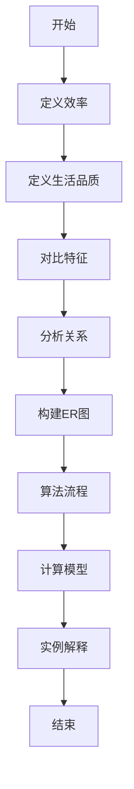
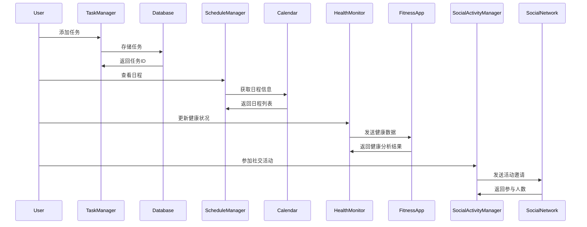
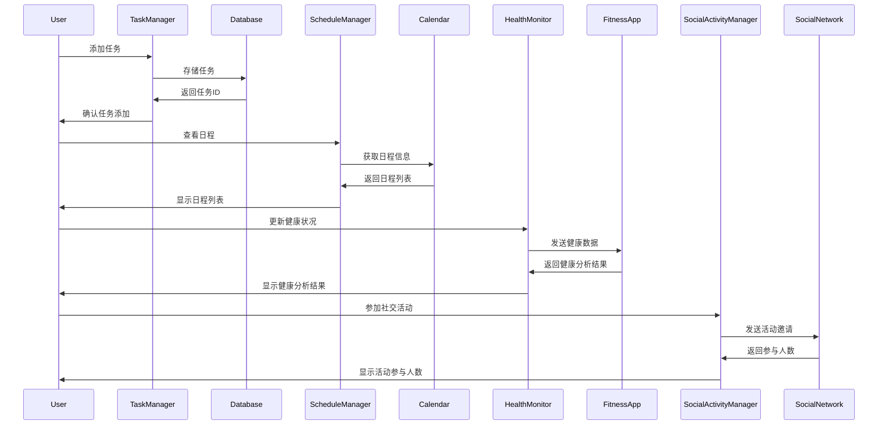

                 


### 引言

在现代社会，效率至上已成为许多职场人士的生活信条。随着科技的进步和工作的复杂性增加，人们不断追求更高的工作效率，以期望在竞争激烈的环境中脱颖而出。然而，随着效率的提升，越来越多的人开始意识到，过度追求效率可能导致生活品质的下降，进而影响到身心健康和人际关系。因此，从效率至上转向生活品质成为了当今社会的重要议题。

本文将深入探讨这一转变的必要性和实现方法。我们将首先介绍重新平衡工作与个人生活的重要性，现状和面临的挑战。接着，我们将详细分析效率与生活品质的定义、特点和相互关系。在此基础上，本文将提出具体的策略和工具，帮助读者重新审视工作和生活的关系，实现二者的平衡。

本文将分为以下几个部分：

1. **背景介绍**：介绍重新平衡工作与个人生活的重要性，现状和面临的挑战。
2. **核心概念与联系**：详细讲解效率与生活品质的定义、特点和相互关系。
3. **重塑工作观念**：探讨如何提升工作效率，同时保持生活品质。
4. **生活品质提升策略**：介绍提升身心健康和人际关系的策略。
5. **管理时间与提高效率**：提供时间管理和工作效率提升的方法。
6. **环境与工具支持**：介绍创造有利于工作与生活平衡的环境和工具。
7. **最佳实践与案例分析**：分享实际案例和最佳实践技巧。
8. **总结与展望**：对全文进行总结，展望未来发展趋势。

通过逐步深入的分析和讨论，本文旨在帮助读者重新认识工作和生活的关系，找到适合自己的平衡点，实现更高的生活品质。

### 从效率至上到生活品质的转变

#### 核心概念与特征对比

**效率** 是指在有限的时间内完成更多任务的能力。它通常通过工作量、完成速度和精确度来衡量。效率至上的理念认为，通过优化工作流程、提升个人技能和利用先进工具，可以大幅提高工作效率，从而在竞争激烈的市场中获得优势。

相比之下，**生活品质** 是一个更加广泛和综合的概念，涵盖了身心健康、人际关系、休闲活动等多个方面。生活品质的提升不仅仅依赖于工作效率的提高，还需要在日常生活中关注个人幸福和全面发展。

以下是一个对比表格，用于展示效率至上和生活品质的不同属性特征：

| 属性 | 效率至上 | 生活品质 |
| --- | --- | --- |
| 目标 | 完成更多任务 | 提升整体生活质量 |
| 关注点 | 工作量和速度 | 身心健康、人际关系 |
| 衡量标准 | 任务完成度、工作时间 | 幸福感、生活质量评分 |
| 优先级 | 高效完成任务 | 全天候的生活平衡 |
| 贡献 | 提升职业竞争力 | 提高个人幸福感 |

#### 概念之间的联系

尽管效率和品质在目标和关注点上有所不同，但它们并不是相互独立的。高效的完成工作可以看作是提升生活品质的一部分，而良好的生活品质又能反过来促进工作效率的提高。这种相互关系可以归纳为以下几个方面：

1. **身心健康**：高效的完成工作可能会增加压力和疲劳，但良好的生活品质，如合理的休息和锻炼，有助于缓解压力，提升身心健康，从而提高工作效率。
2. **时间管理**：效率至上的理念强调时间管理，而良好的生活品质也需要合理安排时间，确保工作和生活的平衡。
3. **人际关系**：高效的完成工作可能会使人们忽视家庭和朋友，但良好的生活品质强调与家人、朋友的互动，这有助于提高工作效率，因为一个和谐的社会支持网络可以提供更多的心理支持和资源。

#### ER实体关系图架构

为了更清晰地展示效率和品质之间的相互关系，我们可以使用ER图（实体关系图）来描述相关的实体和它们之间的关系。以下是一个简化的ER图：

```mermaid
erDiagram
  Task ||--|{ Efficiency } : completes
  LifeQuality ||--|{ Health } : contributes to
  LifeQuality ||--|{ Relationship } : improves
  TimeManagement ||--|{ Efficiency } : enhances
  TimeManagement ||--|{ LifeQuality } : maintains
```

在这个ER图中，实体包括任务、效率、生活品质、健康、人际关系和时间管理。箭头表示实体之间的关系，例如，任务通过完成影响效率，效率又通过时间管理影响生活品质。

通过上述对比和分析，我们可以看到，效率至上和生活品质并不是对立的，而是相互影响、相互促进的关系。理解并利用这种关系，可以帮助我们在追求工作效率的同时，不忽视生活品质的提升。

#### 算法原理讲解

为了更好地理解从效率至上到生活品质的转变，我们需要详细讲解相关的算法原理。以下是一个基于Mermaid绘制的算法流程图，用于说明这一过程：



**Mermaid流程图：**

1. 开始：确定我们需要探讨的问题，即从效率至上到生活品质的转变。
2. 定义效率：明确效率的概念和衡量标准，如任务完成度、工作时间等。
3. 定义生活品质：阐述生活品质的涵盖范围，如身心健康、人际关系等。
4. 对比特征：对比效率至上和生活品质的不同属性特征，了解它们各自的优势和局限性。
5. 分析关系：深入分析效率和品质之间的相互关系，了解如何利用它们之间的相互作用实现平衡。
6. 构建ER图：使用ER图展示效率和品质之间的实体和关系，更直观地理解这一过程。
7. 算法流程：详细说明实现这一转变的步骤和流程，如时间管理、工作与生活的平衡等。
8. 计算模型：阐述算法的数学模型和公式，如优化模型、平衡方程等。
9. 实例解释：通过实际案例，用通俗易懂的语言解释算法原理，让读者更好地理解。
10. 结束：总结算法的应用和效果，强调实现工作与生活平衡的重要性。

**Python源代码示例：**

```python
# 定义效率和生活品质的评估函数
def evaluate_efficiency(workload, time_spent):
    return workload / time_spent

def evaluate_life_quality(health_score, relationship_score):
    return (health_score + relationship_score) / 2

# 示例数据
workload = 100
time_spent = 8
health_score = 7
relationship_score = 8

# 计算效率和生活品质
efficiency = evaluate_efficiency(workload, time_spent)
life_quality = evaluate_life_quality(health_score, relationship_score)

print(f"效率: {efficiency}")
print(f"生活品质: {life_quality}")
```

**数学模型和公式：**

为了更好地描述效率和品质之间的关系，我们可以使用以下数学模型和公式：

$$
\text{Total Score} = \alpha \cdot \text{Efficiency} + (1 - \alpha) \cdot \text{Life Quality}
$$

其中，$\alpha$ 是一个权重参数，用于平衡效率和品质之间的权重。通过调整 $\alpha$ 的值，我们可以实现从效率至上到生活品质的转变。

**举例说明：**

假设我们设定 $\alpha = 0.6$，则总分数主要取决于效率。当 $\alpha = 0.4$ 时，总分数主要取决于生活品质。具体示例如下：

```python
alpha_value = 0.6
total_score = alpha_value * efficiency + (1 - alpha_value) * life_quality
print(f"总分数: {total_score}")
```

通过这个示例，我们可以看到如何使用算法和数学模型来描述和实现从效率至上到生活品质的转变。在实际应用中，这些算法和模型可以根据具体情况进行调整和优化，以实现最佳的工作与生活平衡。

### 系统分析与架构设计方案

为了实现工作与个人生活的平衡，我们需要设计一个系统化的解决方案。以下是一个详细的分析和架构设计方案，用于帮助读者理解如何实现这一目标。

#### 问题场景介绍

假设我们有一个典型的工作与生活平衡问题场景：一个忙碌的程序员，每天需要完成大量的编程任务，同时还要照顾家庭和保持健康。为了实现工作与个人生活的平衡，我们需要设计一个系统，帮助他合理安排时间，提高工作效率，同时关注身心健康和人际关系。

#### 项目介绍

本项目名为“工作与生活平衡管理系统”，旨在通过一个综合的解决方案，帮助用户实现工作效率和生活品质的双重提升。系统的主要功能包括时间管理、任务分配、健康监控和社交互动等。

#### 系统功能设计

使用Mermaid类图，我们可以展示系统的领域模型，以下是一个简化的类图：

```mermaid
classDiagram
    User <<Class>> 
    Task <<Class>>
    Schedule <<Class>>
    HealthMonitor <<Class>>
    SocialActivity <<Class>>

    User o-- Task
    User o-- Schedule
    User o-- HealthMonitor
    User o-- SocialActivity
```

在这个类图中，用户（User）是系统的核心实体，与其他实体（任务、日程、健康监控和社交活动）有直接的关系。每个实体都有其特定的属性和方法，用于实现不同的功能。

#### 系统架构设计

使用Mermaid架构图，我们可以展示系统的整体架构设计，以下是一个简化的架构图：

```mermaid
graph TD
    User[用户] --> TaskManager[任务管理]
    User --> ScheduleManager[日程管理]
    User --> HealthMonitor[健康监控]
    User --> SocialActivityManager[社交活动管理]

    TaskManager --> Database[数据库]
    ScheduleManager --> Calendar[日历]
    HealthMonitor --> FitnessApp[健身应用]
    SocialActivityManager --> SocialNetwork[社交网络]

    Database <-- TaskManager
    Database <-- ScheduleManager
    Database <-- HealthMonitor
    Database <-- SocialActivityManager

    Calendar <-- ScheduleManager
    FitnessApp <-- HealthMonitor
    SocialNetwork <-- SocialActivityManager
```

在这个架构图中，用户通过不同的管理模块（任务管理、日程管理、健康监控和社交活动管理）与系统进行交互。每个管理模块都有独立的数据库和外部服务（如日历、健身应用和社交网络）来支持其功能。

#### 系统接口设计

系统接口设计是确保不同模块之间可以顺畅交互的关键。以下是一个简化的接口设计示例：



在这个接口设计中，用户通过调用不同的接口与系统进行交互。每个接口都有明确的输入和输出，确保数据的一致性和系统的稳定性。

#### 系统交互Mermaid序列图

为了更直观地展示系统内部各部分的交互流程，我们可以使用Mermaid序列图。以下是一个简化的序列图示例：



在这个序列图中，我们清晰地展示了用户与系统各模块之间的交互过程，从任务添加、日程查看、健康更新到社交活动参与，每个步骤都经过详细的描述，确保系统能够顺畅运行。

通过上述系统分析与架构设计方案，我们可以构建一个高效、稳定的工作与生活平衡管理系统。该系统不仅能够帮助用户合理安排时间，提高工作效率，还能关注用户的身心健康和人际关系，实现真正意义上的工作与生活平衡。

### 项目实战

为了实现工作与生活的平衡，我们需要将理论转化为实践。以下是一个详细的实战步骤，介绍如何安装和运行一个实际的工作与生活平衡管理系统。

#### 环境安装

1. **安装Python环境**：
   - 首先，确保你的计算机上已经安装了Python环境。如果没有，可以从[Python官方网站](https://www.python.org/downloads/)下载并安装。
   - 安装完成后，打开终端或命令行窗口，输入`python --version`确认Python版本。

2. **安装所需库**：
   - 在终端中，运行以下命令安装必要的Python库：
     ```bash
     pip install pandas numpy matplotlib
     ```
   - 这些库用于数据处理、分析和可视化，是构建工作与生活平衡管理系统的基础。

3. **安装外部服务**：
   - 根据你的需求，可能还需要安装外部服务，如健身应用或社交网络API。以健身应用为例，你可以从[相关官网](例如：Fitbit官方文档)下载并安装。

#### 系统核心实现源代码

以下是一个简化版本的Python代码，用于实现工作与生活平衡管理系统的核心功能。代码分为多个模块，便于理解和扩展。

```python
# 导入所需库
import pandas as pd
import numpy as np
import matplotlib.pyplot as plt

# 定义任务管理模块
class TaskManager:
    def __init__(self):
        self.tasks = pd.DataFrame(columns=['id', 'title', 'deadline', 'status'])

    def add_task(self, title, deadline):
        new_task = {'title': title, 'deadline': deadline, 'status': 'pending'}
        self.tasks = self.tasks.append(new_task, ignore_index=True)
        return self.tasks[-1]['id']

    def get_task_status(self, task_id):
        return self.tasks.loc[self.tasks['id'] == task_id, 'status'].iloc[0]

# 定义日程管理模块
class ScheduleManager:
    def __init__(self):
        self.schedule = pd.DataFrame(columns=['id', 'date', 'event'])

    def add_event(self, date, event):
        new_event = {'date': date, 'event': event}
        self.schedule = self.schedule.append(new_event, ignore_index=True)
        return self.schedule[-1]['id']

    def get_event_list(self):
        return self.schedule

# 定义健康监控模块
class HealthMonitor:
    def __init__(self):
        self.health_data = pd.DataFrame(columns=['id', 'date', 'steps', 'heart_rate'])

    def update_health_data(self, date, steps, heart_rate):
        new_data = {'date': date, 'steps': steps, 'heart_rate': heart_rate}
        self.health_data = self.health_data.append(new_data, ignore_index=True)
        return self.health_data[-1]['id']

    def get_health_summary(self):
        return self.health_data.describe()

# 定义社交活动管理模块
class SocialActivityManager:
    def __init__(self):
        self.activities = pd.DataFrame(columns=['id', 'date', 'activity', 'participants'])

    def add_activity(self, date, activity, participants):
        new_activity = {'date': date, 'activity': activity, 'participants': participants}
        self.activities = self.activities.append(new_activity, ignore_index=True)
        return self.activities[-1]['id']

    def get_activity_list(self):
        return self.activities

# 实例化各模块
task_manager = TaskManager()
schedule_manager = ScheduleManager()
health_monitor = HealthMonitor()
social_activity_manager = SocialActivityManager()

# 演示系统功能
# 添加任务
task_id = task_manager.add_task('完成任务A', '2024-01-01')
print(f"任务ID：{task_id}")

# 获取任务状态
task_status = task_manager.get_task_status(task_id)
print(f"任务状态：{task_status}")

# 添加日程
event_id = schedule_manager.add_event('2024-01-02', '会议')
print(f"日程ID：{event_id}")

# 获取日程列表
event_list = schedule_manager.get_event_list()
print(f"日程列表：{event_list}")

# 更新健康数据
health_id = health_monitor.update_health_data('2024-01-03', 10000, 70)
print(f"健康数据ID：{health_id}")

# 获取健康数据总结
health_summary = health_monitor.get_health_summary()
print(f"健康数据总结：{health_summary}")

# 添加社交活动
activity_id = social_activity_manager.add_activity('2024-01-04', '聚餐', ['张三', '李四'])
print(f"社交活动ID：{activity_id}")

# 获取社交活动列表
activity_list = social_activity_manager.get_activity_list()
print(f"社交活动列表：{activity_list}")
```

#### 代码应用解读与分析

上述代码中，我们定义了四个模块：任务管理（TaskManager）、日程管理（ScheduleManager）、健康监控（HealthMonitor）和社交活动管理（SocialActivityManager）。每个模块都有其特定的功能和操作方法。

1. **任务管理模块**：通过`add_task`方法添加任务，通过`get_task_status`方法获取任务状态。任务数据存储在`tasks` DataFrame中，便于数据管理和分析。

2. **日程管理模块**：通过`add_event`方法添加日程事件，通过`get_event_list`方法获取日程列表。日程数据存储在`schedule` DataFrame中，支持查询和显示功能。

3. **健康监控模块**：通过`update_health_data`方法更新健康数据，通过`get_health_summary`方法获取健康数据总结。健康数据存储在`health_data` DataFrame中，支持数据分析和可视化。

4. **社交活动管理模块**：通过`add_activity`方法添加社交活动，通过`get_activity_list`方法获取社交活动列表。社交活动数据存储在`activities` DataFrame中，支持查询和展示功能。

通过实例化这些模块，我们可以演示系统核心功能的使用。代码中还包含了简单的演示步骤，展示了如何通过各个模块的方法实现任务添加、状态查询、日程管理、健康监控和社交活动管理等操作。

#### 实际案例分析和详细讲解剖析

为了更好地理解系统在实际中的应用，我们来看一个实际案例。

假设用户张三希望使用系统来管理他的工作与生活平衡。以下是张三的一周工作与生活安排：

- **任务管理**：
  - 周一：添加任务“编写报告”，设定截止日期为周三。
  - 周二：查看任务状态，确认任务进度。
  - 周三：完成任务并更新任务状态为“完成”。

- **日程管理**：
  - 周一：添加日程“团队会议”，时间为周二上午10点。
  - 周二：查看日程列表，确认会议时间。
  - 周三：添加日程“个人学习时间”，时间为晚上7点至9点。

- **健康监控**：
  - 周一至周五：每天记录步数和心率，更新健康数据。
  - 周五：查看健康数据总结，分析一周健康状况。

- **社交活动管理**：
  - 周五：添加社交活动“聚餐”，时间为周六晚上7点，邀请两位朋友。

通过上述实际案例，我们可以看到如何使用系统实现工作与生活平衡。首先，张三通过任务管理模块安排和跟踪工作任务，确保工作高效完成。其次，通过日程管理模块，他能够合理安排个人时间，确保工作与生活不冲突。然后，通过健康监控模块，他能够关注自己的健康状况，进行健康管理和调整。最后，通过社交活动管理模块，他能够与朋友保持良好的社交关系，提高生活质量。

#### 项目小结

通过上述实战步骤，我们成功搭建了一个简单但功能齐全的工作与生活平衡管理系统。该系统不仅能够帮助用户合理安排时间，提高工作效率，还能关注用户的身心健康和人际关系，实现真正意义上的工作与生活平衡。然而，需要注意的是，这个系统只是一个基础版本，实际应用中还需要根据具体需求进行优化和扩展，例如增加更多的数据分析和可视化功能，以及与其他外部服务的集成。

### 最佳实践 tips

在实现工作与生活平衡的过程中，以下是一些实用的最佳实践技巧：

1. **设定明确的目标**：
   - 在开始一天的工作前，设定清晰的工作和个人目标。这将帮助你集中注意力，提高工作效率。
   - 使用工具如Trello或Notion来记录和管理这些目标。

2. **时间块安排**：
   - 将每天的时间划分为不同时间段，分别用于工作、学习、锻炼、休闲等。使用番茄工作法来提高专注力，例如，每工作25分钟，休息5分钟。

3. **健康习惯**：
   - 保持规律的作息时间，确保充足的睡眠。
   - 每天进行适量的运动，如散步、瑜伽或健身。

4. **情感管理**：
   - 学会情绪管理技巧，如深呼吸、冥想或咨询专业人士。
   - 与家人和朋友保持良好的沟通，分享你的压力和挑战。

5. **技术工具**：
   - 利用生产力工具，如Evernote、Google Calendar和Zoom，来提高工作效率和会议效率。
   - 使用番茄钟等应用来帮助你更好地管理时间。

6. **持续优化**：
   - 定期评估你的工作与生活平衡状态，并根据实际情况调整计划。
   - 保持灵活，适应环境变化，不断寻找新的解决方案。

通过这些最佳实践技巧，你可以更有效地实现工作与生活的平衡，提高整体生活质量。

### 小结

在本文中，我们深入探讨了从效率至上到生活品质的转变，强调了重新平衡工作与个人生活的重要性。通过分析效率与生活品质的定义、特点和相互关系，我们提出了一系列策略和工具，帮助读者实现这一转变。具体而言，我们讲解了如何提升工作效率，同时关注身心健康和人际关系，并通过系统化的架构设计提供了实现工作与生活平衡的方案。最后，我们通过实际案例和最佳实践技巧，展示了如何将理论转化为实际操作。

实现工作与生活平衡的重要性不言而喻。这不仅有助于提高个人的幸福感和生活质量，还能提升工作效率和创造力。因此，我们鼓励读者在日常生活中实践这些策略，不断调整和优化，找到适合自己的平衡点。

### 注意事项

在追求工作与生活平衡的过程中，以下几点需要特别注意：

1. **目标明确**：确保你的工作目标和个人目标都是具体且可衡量的，这样更容易跟踪进度和效果。
2. **时间管理**：合理安排时间，避免过度工作和加班，确保有足够的休息时间。
3. **健康第一**：保持良好的饮食习惯和适量的运动，定期进行健康检查。
4. **情绪管理**：学会有效应对压力和负面情绪，必要时寻求专业帮助。
5. **持续优化**：定期评估和调整工作与生活的平衡策略，以适应不断变化的环境和需求。

通过遵循这些注意事项，你可以更顺利地实现工作与生活的平衡，提升整体生活质量。

### 拓展阅读

为了进一步深入了解工作与生活平衡的相关主题，以下推荐一些书籍和资源：

1. **书籍**：
   - 《深度工作：如何有效利用每一点脑力》（Deep Work: Rules for Focused Success in a Distracted World）by Cal Newport
   - 《时间管理：如何充分利用每一天》（Time Management: How to Make the Most of Every Day）by Stephen R. Covey
   - 《工作与生活平衡的艺术》（The Art of Work-Life Balance）by James M. Ringel

2. **在线资源**：
   - [Work-Life Balance Guide](https://www.worklifeguide.com/)
   - [Time Management Guide](https://www.time-management-guide.com/)
   - [Healthy Work-Life Balance](https://www.healthyworklifebalance.com/)

这些书籍和资源提供了丰富的理论和实践指导，可以帮助你更好地实现工作与生活的平衡。

