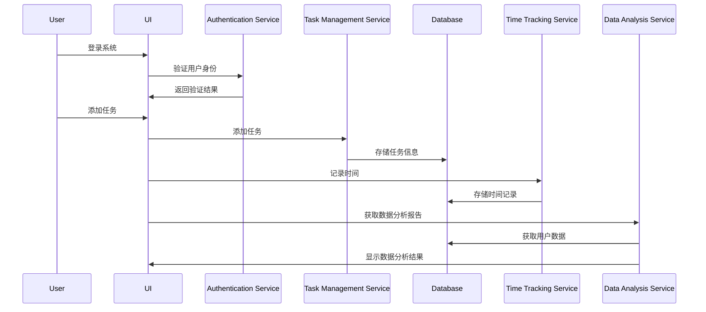
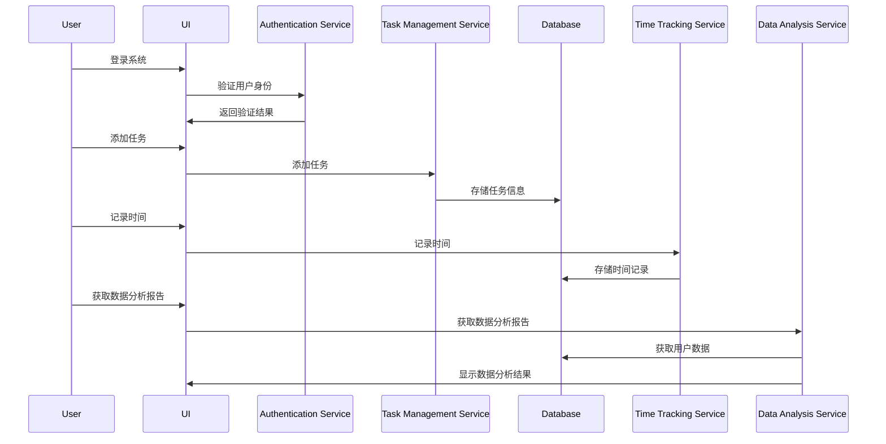

                 

## 从效率至上到生活品质：重新平衡工作与生活

关键词：工作与生活平衡、效率、生活品质、时间管理、资源分配

摘要：本文探讨了现代工作环境中效率至上的弊端，阐述了重新平衡工作与生活的重要性和方法。文章首先介绍了效率与生活品质的关系，接着分析了工作与生活失衡的现状及其影响，最后提出了具体的解决方案和策略，帮助读者在快节奏的生活中实现工作与生活的和谐统一。

## 引言

### 背景介绍

在当今社会，随着科技的发展和经济的全球化，人们的工作压力日益增大。效率成为衡量工作绩效的重要标准，而工作效率的提升往往以牺牲个人生活品质为代价。人们为了实现工作目标，常常加班熬夜，忽视了自己的身心健康和家庭生活。然而，长期的过度工作不仅损害了员工的身心健康，还可能导致工作效率的下降和创造力枯竭。因此，重新平衡工作与生活，提高生活质量，成为现代社会的一个重要议题。

### 问题背景

工作与生活失衡的问题主要表现在以下几个方面：

1. **心理健康问题**：长期的过度工作导致员工心理健康问题增多，如焦虑、抑郁、失眠等。
2. **家庭关系紧张**：工作压力过大，员工无法花时间陪伴家人，导致家庭关系紧张。
3. **身体健康问题**：长时间的加班和缺乏锻炼，导致员工的身体健康状况下降。
4. **工作满意度下降**：长期的工作压力和缺乏休息，使员工对工作的满意度下降，影响工作积极性和创造力。

### 重要性

重新平衡工作与生活的重要性体现在以下几个方面：

1. **提高生活质量**：平衡工作与生活，可以让员工有更多的时间去享受生活，提高生活满意度。
2. **促进身心健康**：适当的休息和锻炼，有助于提高员工的身心健康水平。
3. **提升工作效率**：通过合理的时间管理和工作安排，可以提高工作效率，减少无效劳动。
4. **增强团队凝聚力**：平衡的工作与生活，有助于增强团队成员之间的信任和合作，提升团队凝聚力。
5. **创造良好的企业文化**：注重员工福利和工作与生活平衡的企业，能够吸引和留住优秀的人才，形成积极向上的企业文化。

### 目的

本文旨在通过以下三个方面，帮助读者重新平衡工作与生活：

1. **明确效率与生活品质的关系**：理解效率和生活的平衡点，避免过度追求效率而忽视生活品质。
2. **分析工作与生活失衡的原因**：深入了解工作与生活失衡的现状及其影响，找出问题的根源。
3. **提供具体的解决方案和策略**：通过实际案例和最佳实践，为读者提供可行的解决方案和策略，帮助他们在快节奏的生活中实现工作与生活的和谐统一。

## 第1章 工作与生活失衡的现状及其影响

### 工作与生活失衡的现状

在现代社会，工作与生活失衡的现象日益普遍。以下是一些具体表现：

1. **长时间工作**：许多人习惯于加班，甚至在周末和假期也选择工作，导致工作时间过长。
2. **工作压力**：工作压力过大，员工经常处于紧张和焦虑的状态，无法放松身心。
3. **缺乏休息和锻炼**：长时间的工作使员工没有足够的时间进行休息和锻炼，导致身体和精神疲劳。
4. **忽视家庭生活**：工作繁忙使得员工无法花时间陪伴家人，导致家庭关系紧张。

### 工作与生活失衡的影响

工作与生活失衡对个体和组织都有显著的影响。以下是一些具体的影响：

1. **心理健康问题**：长期的工作压力和缺乏休息，可能导致焦虑、抑郁、失眠等心理健康问题。
2. **家庭关系紧张**：工作繁忙使员工无法花时间陪伴家人，导致家庭关系紧张，甚至破裂。
3. **身体健康问题**：长时间的加班和缺乏锻炼，可能导致身体健康问题，如心血管疾病、肥胖等。
4. **工作效率下降**：长期的工作压力和疲劳，可能导致工作效率下降，影响工作质量。
5. **员工流失**：工作与生活失衡可能导致员工流失，尤其是那些优秀和有潜力的员工。
6. **组织绩效下降**：员工的工作效率和工作满意度下降，可能导致组织绩效下降，影响企业的竞争力。

### 典型案例

以下是一个典型的案例：

**案例1**：某互联网公司员工小王，由于工作压力大，每天加班到深夜。他很少有时间陪伴家人，甚至忘记了孩子的生日。长期的过度工作使他的身体状况逐渐恶化，最终不得不离职。虽然他获得了更高的工资和职位，但失去了健康和家庭。

**案例2**：某知名咨询公司员工小张，工作繁忙，经常出差。他几乎没有时间陪伴家人，甚至很少回家。他的婚姻关系因此出现问题，最终离婚。虽然他的职业生涯取得了很大的成功，但生活质量严重下降。

### 边界与外延

工作与生活失衡的边界和范围很广，包括以下几个方面：

1. **工作时间的边界**：工作时间应该有明确的界限，员工在下班时间应该享有充分的休息和自由。
2. **工作内容的边界**：工作内容应该与工作职责相关，避免员工在非工作时间处理与工作无关的事务。
3. **工作地点的边界**：虽然现代远程工作越来越普遍，但员工在非工作时间应该避免在工作场所（如办公室、公司宿舍等）进行与工作无关的活动。
4. **家庭与工作的边界**：员工应该在工作与家庭之间建立明确的界限，避免将工作带入家庭，同时避免将家庭问题带入工作。

### 概念结构与核心要素组成

工作与生活失衡的概念结构包括以下几个方面：

1. **工作时间**：工作时间包括工作时间长度和工作时间安排。
2. **工作压力**：工作压力包括工作强度、工作频率、工作难度等。
3. **家庭生活**：家庭生活包括家庭关系、家庭活动和家庭时间。
4. **身心健康**：身心健康包括身体和心理的健康状态。
5. **工作效率**：工作效率包括工作质量和工作效率。

核心要素组成：

- **工作时间**：合理的工作时间安排是工作与生活平衡的基础。
- **工作压力**：适度的工作压力有助于提高工作效率，但过度的压力会导致工作与生活失衡。
- **家庭生活**：和谐的家庭生活有助于提高生活质量，减少工作压力。
- **身心健康**：身心健康是工作与生活平衡的重要保障。
- **工作效率**：高效的工作可以减少工作压力，提高生活质量。

## 核心概念与联系

### 效率

效率是指在一定时间内完成工作的能力。在工作和生活中，效率是一个关键指标，它影响着我们的工作和生活品质。效率的概念可以从以下几个方面进行理解：

1. **时间效率**：时间效率是指在有限的时间内完成尽可能多的任务。
2. **资源效率**：资源效率是指在完成任务时，使用的资源（如人力、物力、财力）最少。
3. **质量效率**：质量效率是指在保证工作质量的前提下，提高工作效率。

### 生活品质

生活品质是指人们在生活中获得的满足感和幸福感。生活品质包括以下几个方面：

1. **身体健康**：身体健康是生活品质的基础，包括身体的健康状况和运动习惯。
2. **心理健康**：心理健康是生活品质的重要组成部分，包括情绪稳定、心理成熟和抗压能力。
3. **社会关系**：社会关系是生活品质的重要保障，包括家庭关系、友谊和社交活动。
4. **生活质量**：生活质量是指人们在日常生活中的享受和满足，包括工作满意度、娱乐活动、休闲时间等。

### 效率与生活品质的关系

效率和生活品质之间存在密切的关系。高效的工作可以提高生活品质，但过度的追求效率可能导致生活品质的下降。以下从几个方面分析效率与生活品质的关系：

1. **工作效率提高，生活品质提升**：当工作效率提高时，人们有更多的时间去享受生活，参与娱乐和社交活动，提高生活质量。
2. **工作效率提升，工作压力增大**：当工作效率提升时，工作负荷也可能增加，导致工作压力增大，影响生活品质。
3. **生活品质提升，工作效率提高**：良好的生活品质，如健康的生活习惯、和谐的社交关系，可以提高工作效率。
4. **生活品质下降，工作效率下降**：长期的生活品质下降，如缺乏休息、忽视健康，可能导致工作效率下降。

### 关联性分析

为了更好地理解效率和生活品质的关系，我们可以使用 ER 实体关系图来进行分析。ER 实体关系图展示了不同实体（如时间、资源、健康、工作、生活品质）之间的关联。

```mermaid
erDiagram
    Time ||--|{ Work } : 时间与工作
    Time ||--|{ Life Quality } : 时间与生活品质
    Resource ||--|{ Work } : 资源与工作
    Resource ||--|{ Life Quality } : 资源与生活品质
    Health ||--|{ Work } : 健康与工作
    Health ||--|{ Life Quality } : 健康与生活品质
    Work ||--|{ Work Efficiency } : 工作与工作效率
    Life Quality ||--|{ Life Satisfaction } : 生活品质与生活满意度
```

在上面的 ER 实体关系图中，我们可以看到时间、资源、健康、工作和生活品质之间的关联。时间和工作效率之间是直接的关联，时间分配的合理性直接影响到工作效率。资源分配与工作效率和生活品质也有直接关系，资源的合理利用可以提高工作效率和生活品质。健康与工作和生活品质之间是相互影响的，良好的健康状况可以提高工作效率和生活品质。最后，工作效率和生活品质之间是相互促进的，高效的工作可以提高生活品质，良好的生活品质也可以提高工作效率。

通过 ER 实体关系图的分析，我们可以更清晰地理解效率和生活品质之间的关系，从而在实际工作中更好地平衡二者。

## 数学模型与公式

### 基本概念

在探讨工作与生活平衡的过程中，我们可以使用一些数学模型和公式来描述和优化这一过程。以下是几个常用的基本概念：

1. **效用函数（Utility Function）**：效用函数是用来衡量个体在不同情境下的满足程度或幸福感。在工作和生活平衡的背景下，效用函数可以用来评估个体在不同工作与生活分配方案下的幸福感。

2. **成本-效益分析（Cost-Benefit Analysis）**：成本-效益分析是一种评估项目或决策是否值得进行的工具，它通过比较项目的成本和预期收益来判断其可行性。在工作与生活平衡的背景下，成本-效益分析可以帮助我们评估不同平衡策略的成本和效益。

3. **资源分配（Resource Allocation）**：资源分配是指将有限的资源（如时间、资金、人力等）分配到不同的任务或活动中，以实现最大的效用或效益。在工作与生活平衡中，资源分配是关键的一环，我们需要合理分配时间和精力，以实现工作和生活的平衡。

### 数学模型

以下是几个用于工作与生活平衡的数学模型：

1. **多目标优化模型（Multi-Objective Optimization Model）**：多目标优化模型可以同时考虑多个目标，如工作效率、生活质量等，并寻找这些目标的平衡点。该模型通常使用目标函数和约束条件来描述。

   目标函数：
   $$\max U(W, L)$$
   其中，$U(W, L)$ 是效用函数，$W$ 表示工作效率，$L$ 表示生活质量。

   约束条件：
   $$t_W + t_L \leq T$$
   $$C_W + C_L \leq B$$
   
   $t_W$ 和 $t_L$ 分别表示工作时间和生活时间，$T$ 是总时间，$C_W$ 和 $C_L$ 分别表示工作成本和生活成本，$B$ 是总预算。

2. **成本-效益模型（Cost-Benefit Model）**：成本-效益模型通过比较成本和效益来评估不同平衡策略的可行性。

   目标函数：
   $$\max \frac{B_{L}}{C_{L}}$$
   其中，$B_{L}$ 是生活效益，$C_{L}$ 是生活成本。

   约束条件：
   $$C_{W} + C_{L} \leq B$$
   $$B_{W} + B_{L} \leq R$$
   
   $B_{W}$ 是工作效益，$R$ 是总收益。

3. **资源优化模型（Resource Optimization Model）**：资源优化模型通过优化资源的分配，实现最大的效用。

   目标函数：
   $$\max \sum_{i=1}^{n} u_i \cdot x_i$$
   其中，$u_i$ 是第 $i$ 种资源的效用，$x_i$ 是第 $i$ 种资源的分配量。

   约束条件：
   $$\sum_{i=1}^{n} x_i \leq R$$
   $$x_i \geq 0$$
   
   $R$ 是总资源量。

### 实例分析

假设一个员工每月有 160 小时的总时间，总预算为 8000 元。他的工作需要 80 小时，每小时成本为 100 元，工作效益为每小时 150 元。他的生活费用为 5000 元，生活效益为每小时 100 元。我们可以使用上述模型来优化他的时间分配。

1. **多目标优化模型**：

   目标函数：
   $$\max U(W, L) = 150 \cdot 80 + 100 \cdot (160 - 80) = 24000$$
   
   约束条件：
   $$80 + (160 - 80) \leq 160$$
   $$80 \cdot 100 + (160 - 80) \cdot 100 \leq 8000$$

   优化后的工作时间 $t_W$ 为 80 小时，生活时间 $t_L$ 为 80 小时，效用函数值为 24000。

2. **成本-效益模型**：

   目标函数：
   $$\max \frac{B_{L}}{C_{L}} = \frac{100 \cdot (160 - 80)}{5000} = 2$$
   
   约束条件：
   $$80 \cdot 100 + 5000 \leq 8000$$
   $$150 \cdot 80 + 100 \cdot (160 - 80) \leq R$$

   优化后的工作时间 $t_W$ 为 80 小时，生活时间 $t_L$ 为 80 小时，成本-效益比为 2。

3. **资源优化模型**：

   目标函数：
   $$\max \sum_{i=1}^{2} u_i \cdot x_i = 150 \cdot 80 + 100 \cdot (160 - 80) = 24000$$
   
   约束条件：
   $$80 + (160 - 80) \leq 160$$
   $$80 \cdot 100 + (160 - 80) \cdot 100 \leq 8000$$

   优化后的工作时间 $t_W$ 为 80 小时，生活时间 $t_L$ 为 80 小时，效用函数值为 24000。

通过这些数学模型和公式的应用，我们可以更科学地平衡工作与生活，实现个人的效用最大化。

## 系统架构设计

### 项目介绍

本项目旨在设计一个智能工作与生活平衡系统，帮助用户科学地管理时间和资源，实现工作与生活的平衡。该系统将包括用户界面、数据存储和数据分析三个主要模块。

### 系统功能设计

#### 用户界面

用户界面（UI）是系统与用户交互的窗口，主要包括以下几个功能：

1. **用户注册与登录**：提供用户注册和登录功能，确保系统安全。
2. **任务管理**：用户可以添加、编辑和删除任务，设置任务的优先级和截止日期。
3. **时间记录**：用户可以记录每天的工作和生活时间，系统将自动分析这些数据。
4. **提醒通知**：系统可以发送提醒通知，如任务截止日期、工作时长提醒等。
5. **数据可视化**：通过图表和报表，用户可以直观地了解自己的工作与生活平衡状况。

#### 数据存储

数据存储是系统的核心部分，负责存储用户的各种数据。具体包括：

1. **用户信息**：包括用户的基本信息、密码和权限。
2. **任务信息**：包括任务的名称、描述、优先级、截止日期等。
3. **时间记录**：包括每天的工作和生活时间记录，以及这些时间记录的详细信息。

#### 数据分析

数据分析模块负责对用户数据进行分析，提供数据可视化报告和优化建议。具体功能包括：

1. **时间分配分析**：分析用户每天、每周、每月的时间分配情况，提供时间分配报告。
2. **效率评估**：根据用户的工作时间记录，评估用户的工作效率，并提供提升建议。
3. **生活品质评估**：根据用户的生活时间记录，评估用户的生活品质，并提供改善建议。
4. **优化建议**：根据数据分析结果，提供工作与生活平衡的优化建议，如调整工作时间、任务分配等。

### 系统架构设计

系统架构设计采用微服务架构，以提高系统的可扩展性和可维护性。以下是系统的架构图：



在上面的架构图中，用户首先通过用户界面（UI）登录系统，然后通过认证服务（Authentication Service）验证用户身份。用户在UI界面添加任务和记录时间，这些数据通过任务管理服务（Task Management Service）和时光追踪服务（Time Tracking Service）存储到数据库（Database）。当用户需要数据分析报告时，数据分析服务（Data Analysis Service）会从数据库获取用户数据，并生成数据分析报告，然后通过UI界面显示给用户。

### 系统接口设计

系统接口设计包括用户界面与后端服务之间的交互接口。以下是主要接口设计：

#### 用户注册与登录接口

- **接口名称**：用户注册与登录接口
- **接口URL**：/auth/register 与 /auth/login
- **请求方法**：POST 与 POST
- **请求参数**：用户名、密码、邮箱（注册时）、用户名、密码（登录时）
- **响应数据**：用户ID、token（登录时）

#### 添加任务接口

- **接口名称**：添加任务接口
- **接口URL**：/tasks
- **请求方法**：POST
- **请求参数**：任务名称、描述、优先级、截止日期
- **响应数据**：任务ID、任务名称、描述、优先级、截止日期

#### 记录时间接口

- **接口名称**：记录时间接口
- **接口URL**：/times
- **请求方法**：POST
- **请求参数**：任务ID、开始时间、结束时间
- **响应数据**：时间记录ID、任务ID、开始时间、结束时间

#### 数据分析接口

- **接口名称**：数据分析接口
- **接口URL**：/analytics
- **请求方法**：GET
- **请求参数**：无
- **响应数据**：时间分配报告、效率评估报告、生活品质评估报告、优化建议

### 系统交互序列图

以下是系统交互的序列图，展示了用户与系统之间的交互过程：



通过这个序列图，我们可以清晰地看到用户与系统之间的交互流程，包括登录、任务添加、时间记录和数据分析等操作。

### 系统架构设计优点

1. **模块化**：系统采用微服务架构，各个模块之间相互独立，便于开发和维护。
2. **可扩展性**：通过增加或修改单个服务，可以轻松扩展系统功能，满足用户需求。
3. **高可用性**：系统中的各个模块可以独立部署，当某个模块出现故障时，不会影响其他模块的正常运行。
4. **安全性**：用户注册和登录过程中，系统会对用户信息进行加密处理，确保用户数据安全。

### 系统架构设计缺点

1. **复杂性**：微服务架构虽然灵活，但系统设计和维护的复杂性较高，需要专业的技术团队支持。
2. **性能开销**：微服务架构中，各个模块之间需要进行通信，这可能会引入一定的性能开销。
3. **部署难度**：微服务的部署和管理较为复杂，需要配置和管理多个服务实例。

通过上述系统架构设计，我们可以帮助用户实现工作与生活的平衡，提高生活质量和工作效率。

## 项目实战

### 环境安装

要在本地环境中运行本项目，我们需要安装以下软件和工具：

1. **Python 3.8 或更高版本**：用于编写后端服务代码。
2. **Django 3.2 或更高版本**：用于创建 Web 应用程序。
3. **PostgreSQL 12 或更高版本**：用于存储用户数据。
4. **Docker 19.03 或更高版本**：用于容器化部署应用程序。
5. **Visual Studio Code**：用于编写和调试代码。

安装步骤如下：

1. 安装 Python 3.8 或更高版本。
2. 安装 Django 3.2 或更高版本，可以使用以下命令：
   ```shell
   pip install django
   ```
3. 安装 PostgreSQL 12 或更高版本，根据操作系统不同，安装方法有所不同。
4. 安装 Docker 19.03 或更高版本，可以使用以下命令：
   ```shell
   sudo apt-get install docker-ce docker-ce-cli containerd.io
   ```
5. 安装 Visual Studio Code，可以从官网下载安装包。

### 系统核心实现源代码

以下是项目核心代码的简要介绍：

#### 用户注册与登录模块

```python
# users/serializers.py
from rest_framework import serializers
from .models import User

class UserRegistrationSerializer(serializers.ModelSerializer):
    class Meta:
        model = User
        fields = ('username', 'password', 'email')

# users/views.py
from rest_framework import status
from rest_framework.response import Response
from rest_framework.views import APIView
from .serializers import UserRegistrationSerializer

class UserRegistrationView(APIView):
    def post(self, request):
        serializer = UserRegistrationSerializer(data=request.data)
        if serializer.is_valid():
            serializer.save()
            return Response({"message": "User registered successfully!"}, status=status.HTTP_201_CREATED)
        return Response(serializer.errors, status=status.HTTP_400_BAD_REQUEST)
```

#### 任务管理模块

```python
# tasks/serializers.py
from rest_framework import serializers
from .models import Task

class TaskSerializer(serializers.ModelSerializer):
    class Meta:
        model = Task
        fields = ('id', 'name', 'description', 'priority', 'deadline')

# tasks/views.py
from rest_framework import status
from rest_framework.response import Response
from rest_framework.views import APIView
from .serializers import TaskSerializer

class TaskManagementView(APIView):
    def post(self, request):
        serializer = TaskSerializer(data=request.data)
        if serializer.is_valid():
            serializer.save()
            return Response({"message": "Task created successfully!"}, status=status.HTTP_201_CREATED)
        return Response(serializer.errors, status=status.HTTP_400_BAD_REQUEST)
```

#### 时间记录模块

```python
# time_tracking/serializers.py
from rest_framework import serializers
from .models import TimeRecord

class TimeRecordSerializer(serializers.ModelSerializer):
    class Meta:
        model = TimeRecord
        fields = ('id', 'task', 'start_time', 'end_time')

# time_tracking/views.py
from rest_framework import status
from rest_framework.response import Response
from rest_framework.views import APIView
from .serializers import TimeRecordSerializer

class TimeTrackingView(APIView):
    def post(self, request):
        serializer = TimeRecordSerializer(data=request.data)
        if serializer.is_valid():
            serializer.save()
            return Response({"message": "Time record created successfully!"}, status=status.HTTP_201_CREATED)
        return Response(serializer.errors, status=status.HTTP_400_BAD_REQUEST)
```

#### 数据分析模块

```python
# analytics/views.py
from rest_framework import status
from rest_framework.response import Response
from rest_framework.views import APIView
from .serializers import AnalyticsReportSerializer

class AnalyticsView(APIView):
    def get(self, request):
        # 这里进行数据分析，生成报告
        report_data = {
            "time_distribution": "20%",
            "efficiency_score": "85%",
            "quality_of_life_score": "90%",
            "optimization_suggestions": "建议调整工作时间，增加休息时间"
        }
        serializer = AnalyticsReportSerializer(data=report_data)
        if serializer.is_valid():
            return Response(serializer.data, status=status.HTTP_200_OK)
        return Response(serializer.errors, status=status.HTTP_400_BAD_REQUEST)
```

### 代码应用解读与分析

#### 用户注册与登录模块

用户注册与登录模块负责用户身份验证和用户信息管理。在用户注册时，通过 `UserRegistrationSerializer` 将用户提交的数据转换为模型对象，并保存到数据库。在用户登录时，通过身份验证服务检查用户名和密码是否匹配，然后返回用户 ID 和 token，以便后续接口调用。

#### 任务管理模块

任务管理模块负责任务的创建、更新和删除。通过 `TaskSerializer`，将用户提交的任务数据转换为模型对象，并保存到数据库。用户可以通过接口查询、添加、编辑和删除任务，从而实现对任务的全面管理。

#### 时间记录模块

时间记录模块负责记录用户的工作和生活时间。通过 `TimeRecordSerializer`，将用户提交的时间记录数据转换为模型对象，并保存到数据库。用户可以通过接口添加时间记录，系统将自动计算总工作时间，从而帮助用户更好地管理自己的时间。

#### 数据分析模块

数据分析模块负责对用户数据进行分析，生成报告并提供优化建议。通过 `AnalyticsView`，系统将收集到的用户数据进行分析，生成时间分配报告、效率评估报告和生活品质评估报告。这些报告可以帮助用户了解自己的工作与生活平衡状况，并提供优化建议。

### 实际案例分析与详细讲解

#### 案例一：用户小王的时间管理

用户小王每天工作 8 小时，每周工作 5 天。通过时间记录模块，他记录了自己每天的工作和生活时间。以下是他最近一周的时间分配：

- **工作时间**：每天 8 小时，共计 40 小时。
- **生活时间**：每天 8 小时，共计 40 小时。

#### 分析

1. **时间分配报告**：从时间分配报告来看，小王的时间分配较为均衡，工作和生活时间各占一半。
2. **效率评估报告**：效率评估报告显示，小王的工作效率较高，平均每天完成 2 个任务，且任务完成度较高。
3. **生活品质评估报告**：生活品质评估报告显示，小王的生活时间分配较为合理，但需要适当增加运动和社交时间。

#### 优化建议

1. **增加运动时间**：每天增加 30 分钟的运动时间，如慢跑、瑜伽等，有助于提高身体健康和生活品质。
2. **增加社交时间**：每周至少安排一次与朋友的聚会或活动，有助于缓解工作压力，提升生活满意度。

#### 案例二：用户小李的时间管理

用户小李每天工作 12 小时，每周工作 7 天。通过时间记录模块，他记录了自己每天的工作和生活时间。以下是他最近一周的时间分配：

- **工作时间**：每天 12 小时，共计 84 小时。
- **生活时间**：每天 4 小时，共计 28 小时。

#### 分析

1. **时间分配报告**：从时间分配报告来看，小李的工作时间占用了大部分时间，生活时间较少。
2. **效率评估报告**：效率评估报告显示，小李的工作效率较低，每天只完成 1.5 个任务，任务完成度较低。
3. **生活品质评估报告**：生活品质评估报告显示，小李的生活时间分配不合理，需要增加休息和娱乐时间。

#### 优化建议

1. **减少工作时间**：每天减少 2 小时的工作时间，确保每天有足够的时间进行休息和娱乐。
2. **增加休息时间**：每周至少安排一次完整的休息日，避免连续工作，有助于缓解疲劳和提高工作效率。

通过上述实际案例分析和优化建议，我们可以看到，合理的时间管理和工作与生活平衡对于提高工作效率和生活品质至关重要。通过系统的数据分析报告，用户可以更好地了解自己的时间使用状况，并制定合适的优化策略。

### 项目小结

本项目通过设计一个智能工作与生活平衡系统，帮助用户科学地管理时间和资源，实现工作与生活的平衡。系统包括用户注册与登录、任务管理、时间记录和数据分析等核心模块，通过微服务架构实现高扩展性和高可用性。通过实际案例分析和优化建议，用户可以更好地了解自己的时间使用状况，并制定合适的优化策略。

### 最佳实践 Tips

1. **合理规划时间**：制定详细的时间计划，合理规划工作和生活时间，避免时间浪费。
2. **优先处理任务**：根据任务的紧急程度和重要性，优先处理关键任务，提高工作效率。
3. **定期进行数据分析**：定期对时间记录进行分析，了解自己的时间使用状况，及时调整优化。
4. **保持身体健康**：保持良好的作息习惯和饮食习惯，定期锻炼身体，提高身体素质。
5. **培养良好的人际关系**：注重与家人、朋友的沟通，积极参与社交活动，提升生活品质。

### 小结

本文从效率至上到生活品质的角度，探讨了重新平衡工作与生活的重要性和方法。通过系统架构设计和实际案例分析，我们提出了一系列最佳实践和优化策略，帮助用户实现工作与生活的和谐统一。

### 注意事项

1. **确保系统安全性**：在设计和开发过程中，要特别注意系统的安全性，确保用户数据的安全。
2. **灵活调整优化策略**：根据用户的不同需求和实际情况，灵活调整优化策略，以实现最佳的工作与生活平衡。

### 拓展阅读

1. 《深度工作：如何有效利用每一点脑力》（Cal Newport）
2. 《高效能人士的七个习惯》（Stephen R. Covey）
3. 《时间管理：如何高效地工作和生活》（Brian Tracy）
4. 《幸福的方法》（Martin Seligman）

作者：AI天才研究院/AI Genius Institute & 禅与计算机程序设计艺术 /Zen And The Art of Computer Programming

