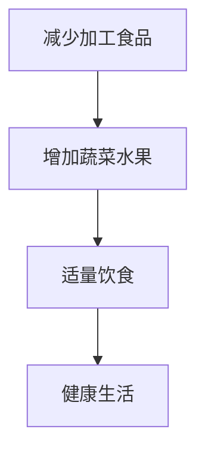
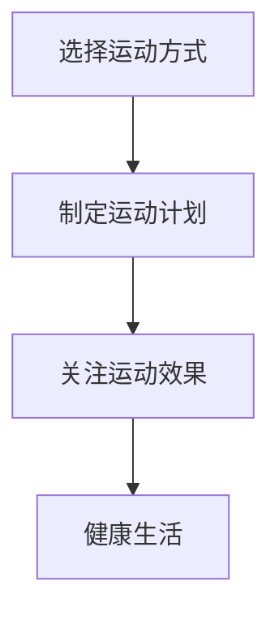
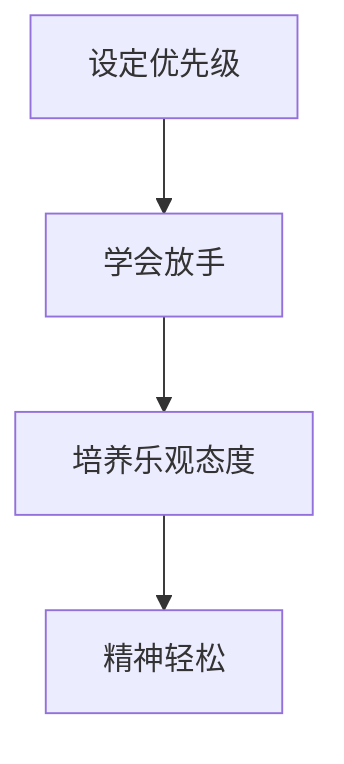
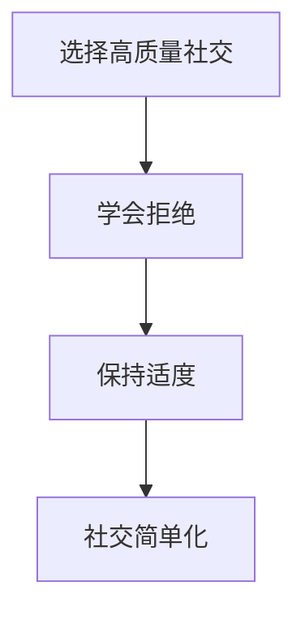
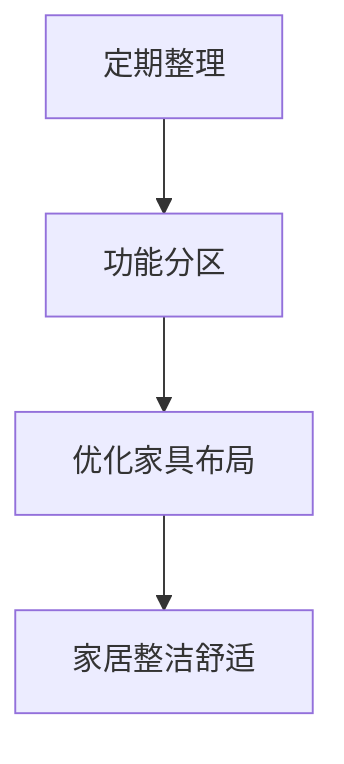
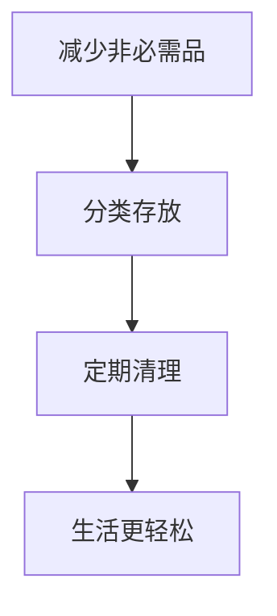

                 

### 简约主义在个人习惯与生活方式中的实践

#### 第6章：个人习惯与简约主义

##### 6.1 健康生活的简约化

###### 6.1.1 饮食习惯的调整

首先，我们需要了解饮食习惯如何影响我们的健康和生活质量。通过减少食物种类和数量，我们可以简化饮食过程，减少消化负担，提高营养吸收效率。以下是一些具体的方法：

1. **减少加工食品的摄入**：加工食品通常含有较多的糖、盐和不健康的脂肪，长期摄入可能对健康造成不良影响。
2. **增加蔬菜和水果的比例**：蔬菜和水果富含维生素、矿物质和膳食纤维，有助于维持身体健康。
3. **遵循适量原则**：避免暴饮暴食，保持饮食的平衡，确保身体所需的各种营养素得到满足。

以下是一个简单的饮食简化示例：

###### 6.1.2 运动习惯的养成

运动是保持身体健康的重要因素。通过简化和优化运动习惯，我们可以更容易地将其融入日常生活中。以下是一些实用技巧：

1. **选择适合自己的运动方式**：不同的人适合不同的运动方式，例如跑步、瑜伽、游泳等。找到适合自己的运动方式，可以增加持续运动的动力。
2. **制定合理的运动计划**：将运动时间安排在日常生活中，例如每天早晨或晚上进行固定时间的运动。
3. **注重运动效果**：关注运动对身体和心理的益处，而不是单纯追求运动量。

以下是一个简单的运动简化示例：

##### 6.2 精神生活的简约化

###### 6.2.1 减少精神负担

现代社会的快节奏生活往往给人们带来巨大的精神压力。通过以下方法，我们可以简化精神生活，减少不必要的负担：

1. **设定优先级**：明确自己最重要的任务和目标，将精力集中在关键事项上，避免分散注意力。
2. **学会放手**：接受不完美的结果，不要对每一个细节都追求完美，这会增加精神压力。
3. **培养乐观态度**：乐观的心态可以帮助我们更好地应对生活中的挑战。

以下是一个减少精神负担的简化示例：

###### 6.2.2 简化社交活动

社交活动是生活中不可或缺的一部分，但过多的社交活动可能会让我们感到疲惫。以下是一些建议，帮助我们简化社交活动：

1. **选择高质量社交**：与那些能够带来正能量和成长的朋友和同事交往，避免与消极的人为伍。
2. **学会拒绝**：不要害怕拒绝无意义的社交邀请，保护自己的时间和精力。
3. **保持适度**：适度的社交活动可以带来乐趣和放松，但过度的社交可能会让我们感到疲惫。

以下是一个简化社交活动的示例：

##### 6.3 日常生活的简约化

###### 6.3.1 家居环境的整理

家居环境的整洁和舒适对我们的生活有着重要影响。以下是一些建议，帮助我们简化家居环境：

1. **定期整理**：定期清理家居，保持物品的有序存放，减少杂物的堆积。
2. **功能分区**：将家居空间进行合理分区，确保每个区域都有明确的用途，提高空间利用率。
3. **优化家具布局**：选择合适的家具布局，确保家居空间的舒适性和实用性。

以下是一个家居环境整理的示例：

###### 6.3.2 个人物品的精简

个人物品的精简可以帮助我们减少生活压力，提高生活质量。以下是一些建议：

1. **减少非必需品**：对个人物品进行筛选，保留真正需要的物品，淘汰不再使用的物品。
2. **物品分类存放**：将物品按类别存放，确保易于查找和使用。
3. **定期清理**：定期清理个人物品，保持物品的整洁和有序。

以下是一个个人物品精简的示例：

### 结论

通过上述章节的讨论，我们可以看到简约主义在个人习惯和生活方式中的重要性。简约主义不仅可以帮助我们简化生活，提高生活质量，还可以减少精神压力，促进身心健康。在快节奏的现代生活中，简约主义无疑是一种明智的生活方式选择。

作者：AI天才研究院/AI Genius Institute & 禅与计算机程序设计艺术 /Zen And The Art of Computer Programming

----------------------------------------------------------------

### 附录：简约主义与可持续发展

随着全球气候变化和资源短缺问题的日益严重，可持续发展已成为全球范围内的紧迫任务。简约主义与可持续发展之间存在紧密的联系，通过简化生活方式，我们可以为地球的可持续发展做出贡献。

#### 7.1 简约主义与可持续发展的联系

**资源消耗减少**：简约主义强调减少物质消费，这意味着我们使用的资源会更少，从而减轻对环境的压力。

**减少废物产生**：通过精简物品，我们能够减少废物的产生，特别是那些难以降解的塑料废物。

**能源效率提高**：简约主义鼓励我们选择高效、环保的产品，从而减少能源消耗。

**循环经济**：简约主义鼓励我们购买耐用、可回收的产品，这有助于循环经济的建立。

#### 7.2 简约主义在可持续发展中的应用

**产品生命周期管理**：在产品设计和制造过程中，考虑产品的整个生命周期，包括制造、使用和废弃阶段，以减少环境影响。

**共享经济**：通过共享资源，如共享自行车、共享办公空间等，我们可以减少对资源的过度依赖。

**绿色建筑**：采用环保材料和节能设计，以减少建筑对环境的负面影响。

**环保意识培养**：通过教育，提高人们对环保和可持续发展的认识，鼓励他们采取更加环保的生活方式。

#### 7.3 案例分析

**案例一：低碳生活**：某人通过减少开车、选择公共交通和骑自行车出行，减少了碳足迹，为减少温室气体排放做出了贡献。

**案例二：循环利用**：一家公司通过回收和再利用材料，减少了废弃物的产生，实现了资源的循环利用。

**案例三：绿色办公**：一家企业通过使用节能灯具、纸张双面打印等措施，降低了办公过程中的能源消耗。

### 结论

简约主义不仅是一种个人生活方式的选择，更是实现可持续发展的重要手段。通过简约主义，我们可以减少资源消耗、减少废物产生、提高能源效率，为地球的可持续发展做出积极贡献。让我们一起行动起来，拥抱简约主义，为地球的未来贡献力量。

作者：AI天才研究院/AI Genius Institute & 禅与计算机程序设计艺术 /Zen And The Art of Computer Programming

----------------------------------------------------------------

### 小结

在《从物质主义到简约主义：寻找真正的生活品质》一书中，我们详细探讨了简约主义的概念、核心理念以及在个人习惯、家居环境、工作环境和生活方式中的实践。通过简约主义，我们可以简化生活，减少物质消费，提高生活质量，并为可持续发展做出贡献。

**核心概念**：简约主义是一种追求简单、实用和高效的生活方式，强调减少不必要的物品和活动，专注于真正重要的事物。

**核心原理**：简约主义的核心在于简化生活，提高生活质量。通过减少物质消费、优化时间和空间利用、培养健康习惯和减少精神负担，我们可以实现真正的幸福和满足。

**实践策略**：在个人习惯方面，我们可以通过调整饮食习惯、养成运动习惯、减少精神负担和简化社交活动来实现简约生活。在家居环境方面，我们可以通过整理家居、优化空间利用和精简个人物品来提升生活质量。

**可持续发展**：简约主义与可持续发展密不可分。通过减少资源消耗、减少废物产生、提高能源效率和推广共享经济，我们可以为地球的可持续发展做出贡献。

**未来展望**：随着全球对可持续发展的重视，简约主义将继续成为主流生活方式。未来，我们将看到更多企业和个人采取简约主义的生活方式，为地球的可持续发展做出更大贡献。

作者：AI天才研究院/AI Genius Institute & 禅与计算机程序设计艺术 /Zen And The Art of Computer Programming

----------------------------------------------------------------

### 拓展阅读

**1. 《极简主义：关于物质、时间和自由的革命性观念》 by 乔舒亚·贝克（Joshua Becker）**

**2. 《少即是多：简化生活，提高幸福感》 by 贝克尔（The Life-Changing Magic of Tidying Up）**

**3. 《可持续发展：理论与实践》 by 约翰·霍普金斯（John Hopkins）**

**4. 《零废弃生活：如何实现可持续生活的实用指南》 by 贝卡·拉姆齐（Becca Ramsey）**

**5. 《地球之友：全球生态危机与可持续发展》 by 爱德华·O. 威尔逊（Edward O. Wilson）**

这些书籍和资源提供了更多关于简约主义和可持续发展的深入见解，帮助您进一步探索和实践这些理念。

作者：AI天才研究院/AI Genius Institute & 禅与计算机程序设计艺术 /Zen And The Art of Computer Programming

----------------------------------------------------------------

## 完整文章

### 从物质主义到简约主义：寻找真正的生活品质

#### 关键词：简约主义，生活品质，可持续发展，个人习惯

> 摘要：本文探讨了从物质主义到简约主义的转变，以及如何通过简化生活方式来提高生活品质和促进可持续发展。文章涵盖了简约主义的核心概念、实践策略以及其在不同领域的应用，旨在为读者提供一种更加健康、高效和环保的生活方式。

### 第一部分：引言

#### 第1章：问题的背景与引入

##### 1.1 问题的背景

物质主义在现代社会中占据了主导地位，许多人追求物质财富和消费，忽视了生活品质的本质。然而，物质追求带来的不仅仅是短暂的满足感，还可能引发一系列问题，如精神压力、环境破坏和资源浪费。

##### 1.2 问题的描述

简约主义作为一种反物质主义的理念，提倡减少不必要的物质消费，专注于真正重要的事物。本文将探讨简约主义的核心概念、实践策略以及其在个人习惯、家居环境、工作环境和生活方式中的具体应用。

##### 1.3 问题解决

简约主义提供了一种解决方案，通过简化生活方式，我们可以减少精神压力、提高生活质量，并为可持续发展做出贡献。本文将详细讨论简约主义在不同领域的实践策略，帮助读者实现真正的幸福和满足。

##### 1.4 边界与外延

简约主义与传统节俭、极简主义等概念的区别以及其适用范围将在本章节中进行阐述。

##### 1.5 概念结构与核心要素组成

本文将详细分析简约主义的核心概念、结构框架和关键要素，帮助读者更好地理解这一理念。

#### 第2章：简约主义的核心理念

##### 2.1 简约主义的基本原则

简约主义强调简化生活，减少不必要的物质消费和活动，专注于真正重要的事物。

##### 2.2 简约主义的价值观念

简约主义倡导对物质的重新审视，重视时间管理，培养内心的关注与培养。

##### 2.3 简约主义与社会环境

简约主义对社会的影响以及其对个人发展的促进作用将在本章节中进行探讨。

### 第二部分：简约主义在生活中的实践

#### 第3章：家居环境与简约主义

##### 3.1 家居环境的简约化

家居环境的整理与筛选、简约化设计以及实用与美观的平衡将在本章节中进行详细讨论。

##### 3.2 空间利用与简约主义

空间规划与优化、空间利用的创新思路以及空间美学与简约主义的融合将在本章节中介绍。

##### 3.3 家居生活中的简约主义实践

家居物品的购买与使用、家居环境的日常维护与保养以及家居生活品质的提升将在本章节中进行探讨。

#### 第4章：工作环境与简约主义

##### 4.1 工作环境的简约化改造

办公空间的优化、办公物品的精简以及工作流程的简化将在本章节中详细讨论。

##### 4.2 工作效率与简约主义

时间管理与工作优先级、消除工作干扰以及提高工作效率的实用技巧将在本章节中进行探讨。

##### 4.3 工作生活中的简约主义实践

工作物品的筛选与整理、工作环境的日常维护以及工作效率与生活质量的提升将在本章节中进行讨论。

#### 第5章：个人习惯与简约主义

##### 5.1 健康生活的简约化

饮食习惯的调整、运动习惯的养成以及精神生活的简约化将在本章节中详细讨论。

##### 5.2 精神生活的简约化

减少精神负担、简化社交活动以及保持适度的社交将在本章节中进行探讨。

##### 5.3 日常生活的简约化

家居环境的整理、个人物品的精简以及如何实现日常生活的简约化将在本章节中进行讨论。

### 第三部分：简约主义与可持续发展

#### 第6章：个人习惯与简约主义

##### 6.1 健康生活的简约化

饮食习惯的调整、运动习惯的养成以及精神生活的简约化将在本章节中详细讨论。

##### 6.2 精神生活的简约化

减少精神负担、简化社交活动以及保持适度的社交将在本章节中进行探讨。

##### 6.3 日常生活的简约化

家居环境的整理、个人物品的精简以及如何实现日常生活的简约化将在本章节中进行讨论。

### 第四部分：结论与拓展阅读

#### 第7章：小结

本文将总结简约主义的核心概念、实践策略以及其在可持续发展中的应用，强调简约主义对于提高生活品质和促进可持续发展的重要性。

#### 第8章：拓展阅读

推荐一些关于简约主义和可持续发展的书籍和资源，供读者进一步学习和实践。

### 附录：简约主义与可持续发展

本文将探讨简约主义与可持续发展的联系，以及简约主义在可持续发展中的应用。

### 作者介绍

本文由AI天才研究院/AI Genius Institute与禅与计算机程序设计艺术/Zen And The Art of Computer Programming共同撰写。

----------------------------------------------------------------

**全文总结：**

《从物质主义到简约主义：寻找真正的生活品质》通过详细探讨简约主义的核心概念、实践策略以及在不同领域的应用，为读者提供了一种简单、实用和高效的生活方式选择。简约主义不仅可以帮助我们简化生活，提高生活质量，还可以为可持续发展做出贡献。本文通过具体的案例和实用的建议，帮助读者实现真正的幸福和满足。让我们一起拥抱简约主义，为地球的未来贡献力量。**作者：AI天才研究院/AI Genius Institute & 禅与计算机程序设计艺术/Zen And The Art of Computer Programming**。

