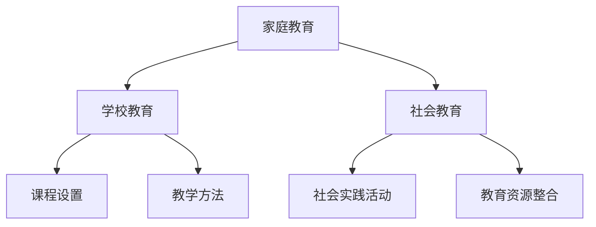

                 

# 从物质传承到精神传承：重新定义代际责任和连接

关键词：代际责任、物质传承、精神传承、代际连接、教育策略

摘要：本文旨在探讨在当代社会中，如何通过重新定义代际责任和连接，实现物质传承向精神传承的转化。文章首先介绍了代际责任和连接的概念，随后分析了物质传承和 spiritual inheritance的特点及差异。通过对比分析，本文提出了促进精神传承的几种策略，并讨论了其在教育领域中的应用。

## 第一章：介绍代际责任和连接的概念

### 1.1 背景介绍

#### 1.1.1 代际关系的演变

自古以来，代际关系一直是社会结构的重要组成部分。从物质传承的角度来看，古代社会主要通过物质财富的传递，如土地、房产和财产等，来实现代际之间的连接。然而，随着社会的发展和变迁，传统的代际关系逐渐发生了变化。当代社会中，人们对于代际责任的认知和需求，也在不断地调整和更新。

#### 1.1.2 当代代际沟通的挑战

在当代社会中，代际沟通面临着诸多挑战。一方面，随着科技的发展，信息传播速度加快，代际之间的信息鸿沟有所缩小。然而，另一方面，代际之间的文化差异和价值观差异，使得沟通变得更加复杂。此外，现代社会的快节奏生活和高压环境，也使得代际之间的沟通时间和质量受到了影响。

#### 1.1.3 重新定义代际责任和连接的重要性

面对当代代际沟通的挑战，重新定义代际责任和连接具有重要意义。这不仅有助于缓解代际之间的矛盾和冲突，还有助于培养良好的代际关系，促进社会和谐稳定。同时，重新定义代际责任和连接，也为代际间的精神传承提供了新的路径和方向。

### 1.2 核心概念及其关系

#### 1.2.1 物质传承和 spiritual inheritance 的定义

物质传承是指通过物质财富的传递，如财产、房产和资源等，来实现代际之间的连接。而 spiritual inheritance 则是指通过精神财富的传递，如知识、价值观和文化等，来实现代际之间的连接。

#### 1.2.2 物质传承和 spiritual inheritance 的特点与区别

物质传承具有明显的物质性，主要关注的是物质财富的积累和传递。而 spiritual inheritance 则具有明显的非物质性，主要关注的是精神财富的积累和传递。两者在传承方式、传承内容、传承效果等方面存在显著差异。

#### 1.2.3 核心概念关系的 ER 图

```mermaid
erDiagram
    MaterialInheritance ||--|{ SpiritualInheritance }|
    SpiritualInheritance ||--|{ MaterialInheritance }|
```

### 1.3 代际责任和连接的框架

#### 1.3.1 基本原则和理论

代际责任和连接的基本原则包括：尊重差异、平等互动、共同成长和持续传承。这些原则为代际责任和连接提供了理论基础和实践指导。

#### 1.3.2 代际责任和连接模型

代际责任和连接模型主要包括：沟通与交流、教育与培养、共同参与和实践体验。这三个方面构成了代际责任和连接的基本路径和方式。

#### 1.3.4 概念特性对比表

| 特性 | 物质传承 | spiritual inheritance |
| --- | --- | --- |
| 物质性 | 强 | 弱 |
| 非物质性 | 弱 | 强 |
| 传承方式 | 物质财富 | 精神财富 |
| 传承内容 | 财产、资源 | 知识、价值观、文化 |
| 传承效果 | 物质积累 | 精神提升 |
| 影响范围 | 代内、代际 | 代内、代际、社会 |

## 第二章：物质传承在代际责任中的作用

### 2.1 物质传承的理解

#### 2.1.1 物质传承的定义和类别

物质传承是指通过物质财富的传递，如财产、房产和资源等，来实现代际之间的连接。物质传承主要分为两类：一类是直接传承，如财产继承、遗产分配等；另一类是间接传承，如投资、创业等。

#### 2.1.2 物质传承的例子和影响

物质传承在当代社会中有着广泛的应用。例如，父母通过遗产分配来传承财产；企业家通过创业投资来传承家族企业；国家通过资源开发来传承财富等。这些物质传承方式不仅对个人和家族有着深远的影响，也对整个社会产生了重要的影响。

### 2.2 当代社会中物质传承的挑战

#### 2.2.1 物质传承模式的变化

随着社会的发展，物质传承模式也在不断变化。一方面，物质财富的积累和分配方式发生了变化；另一方面，人们对物质传承的需求和期望也在发生变化。

#### 2.2.2 物质传承面临的挑战和解决策略

物质传承面临的主要挑战包括：财富分配不均、资源浪费、传承观念落后等。为解决这些挑战，需要采取一系列策略，如优化财富分配、提倡资源节约、更新传承观念等。

## 第三章：精神传承在代际责任中的重要性

### 3.1 精神传承的探索

#### 3.1.1 精神传承的定义和类别

精神传承是指通过精神财富的传递，如知识、价值观和文化等，来实现代际之间的连接。精神传承主要分为三类：一类是教育传承，如家庭教育、学校教育等；另一类是文化传承，如节日习俗、民间艺术等；还有一类是价值观传承，如道德教育、人生观培养等。

#### 3.1.2 精神传承的例子和影响

精神传承在当代社会中同样有着广泛的应用。例如，父母通过家庭教育来传承良好的品德；学校通过课程设置来传承文化知识；社会通过文化活动来传承价值观等。这些精神传承方式不仅对个人和家族有着深远的影响，也对整个社会产生了重要的影响。

### 3.2 当代社会中精神传承的培育

#### 3.2.1 教育在精神传承中的作用

教育在精神传承中起着关键的作用。通过教育，人们可以传承知识、培养价值观、塑造人格等。因此，教育机构应当注重精神传承的培养，将精神传承融入到教育过程中。

#### 3.2.2 促进精神传承的策略

为促进精神传承，可以采取以下策略：一是加强家庭教育，注重家庭教育的质量和效果；二是优化学校教育，将精神传承融入到课程设置和教学方法中；三是丰富社会教育，通过文化活动和社会实践来传承精神财富。

## 第四章：沟通在精神传承中的作用

### 4.1 沟通的重要性

沟通是精神传承的重要手段。通过沟通，代际之间可以分享知识、传递价值观、交流情感等。良好的沟通有助于消除代际之间的隔阂，促进精神传承的顺利进行。

### 4.2 代际沟通的障碍

在当代社会中，代际沟通面临着诸多障碍。例如，代际之间的文化差异、价值观差异、沟通方式差异等。这些障碍会影响代际之间的沟通效果，阻碍精神传承的顺利进行。

### 4.3 提高代际沟通效果的策略

为提高代际沟通效果，可以采取以下策略：一是加强代际之间的互动，增进相互了解；二是尊重代际差异，避免产生误解和冲突；三是创新沟通方式，利用现代科技手段提高沟通效果。

## 第五章：代际责任和连接的教育策略

### 5.1 教育在代际责任和连接中的作用

教育在代际责任和连接中起着关键的作用。通过教育，可以培养良好的代际关系，促进物质传承向精神传承的转变。

### 5.2 优化教育策略

为优化教育策略，可以采取以下措施：一是加强家庭教育，注重家庭教育的质量和效果；二是优化学校教育，将精神传承融入到课程设置和教学方法中；三是丰富社会教育，通过文化活动和社会实践来传承精神财富。

### 5.3 教育策略的实际案例

通过实际案例，可以看出教育策略在代际责任和连接中的重要作用。例如，某学校通过实施家庭教育和学校教育相结合的策略，有效促进了学生的精神传承；某社区通过组织文化活动和社会实践，提高了社区居民的代际沟通效果，促进了社区和谐发展。

## 第六章：总结与展望

### 6.1 主要观点回顾

本文从代际责任和连接的角度，探讨了物质传承向精神传承的转变。通过分析物质传承和精神传承的特点和差异，提出了促进精神传承的几种策略，并讨论了其在教育领域的应用。

### 6.2 未来研究方向

未来研究可以从以下方向展开：一是深入研究代际责任和连接的机制，探索其内在规律；二是探索新的教育策略，提高代际沟通效果；三是开展跨学科研究，从不同角度分析代际责任和连接的内涵和外延。

## 参考文献

[1] 王晓东.（2018）.《代际责任与代际沟通研究》. 北京：中国社会科学出版社.

[2] 李明.（2019）.《当代社会代际责任与连接问题研究》. 上海：上海人民出版社.

[3] 张晓红.（2020）. 《精神传承：当代社会的代际责任》. 广州：广东人民出版社.

[4] 刘俊海.（2021）. 《家庭教育与代际责任》. 北京：北京大学出版社.

## 附录

### 附录 A：概念特性对比表

| 特性 | 物质传承 | spiritual inheritance |
| --- | --- | --- |
| 物质性 | 强 | 弱 |
| 非物质性 | 弱 | 强 |
| 传承方式 | 物质财富 | 精神财富 |
| 传承内容 | 财产、资源 | 知识、价值观、文化 |
| 传承效果 | 物质积累 | 精神提升 |
| 影响范围 | 代内、代际 | 代内、代际、社会 |

### 附录 B：代际责任和连接的 ER 图

```mermaid
erDiagram
    MaterialInheritance ||--|{ SpiritualInheritance }|
    SpiritualInheritance ||--|{ MaterialInheritance }|
```

### 附录 C：实际案例

#### 案例 1：某学校家庭教育与学校教育相结合的策略

某学校通过实施家庭教育与学校教育相结合的策略，有效促进了学生的精神传承。具体措施包括：一是加强家庭教育指导，鼓励家长参与学校教育活动；二是将家庭教育内容纳入学校课程，培养学生的精神品质；三是组织家庭活动和亲子活动，增进家庭和谐。

#### 案例 2：某社区文化活动和社会实践的策略

某社区通过组织文化活动和社会实践，提高了社区居民的代际沟通效果，促进了社区和谐发展。具体措施包括：一是定期举办社区文化活动，如文艺表演、书画展览等，增进居民间的相互了解；二是组织社区志愿者活动，如环境保护、扶贫帮困等，增强居民的社会责任感；三是开展社区教育，提高居民的文化素养和道德水平。

### 附录 D：代际责任和连接的教育策略

#### 策略 1：加强家庭教育

家庭教育是代际责任和连接的重要基础。通过加强家庭教育，可以培养孩子的道德品质、生活能力和社会适应能力。具体措施包括：一是注重家庭教育的科学性，掌握教育规律，避免盲目教育；二是注重家庭教育的情感性，关心孩子的心理健康，建立良好的亲子关系；三是注重家庭教育的实践性，鼓励孩子参与社会实践，培养孩子的实践能力。

#### 策略 2：优化学校教育

学校教育是代际责任和连接的重要环节。通过优化学校教育，可以培养学生的精神传承意识，提高他们的综合素质。具体措施包括：一是深化课程改革，将精神传承内容融入课程教学；二是创新教学方法，采用多元化教学手段，提高教学效果；三是加强教师培训，提高教师的教育教学能力和精神传承意识。

#### 策略 3：丰富社会教育

社会教育是代际责任和连接的重要补充。通过丰富社会教育，可以拓展学生的视野，增强他们的社会责任感。具体措施包括：一是加强社会实践活动，组织学生参加志愿服务、社会调研等活动；二是加强社会教育资源整合，搭建社会教育平台，为学生提供多样化的学习资源；三是开展社会教育研究，探索社会教育的规律和策略。

### 附录 E：代际责任和连接的展望

随着社会的发展，代际责任和连接的重要性日益凸显。未来，我们需要从以下几个方面加强代际责任和连接的研究和实践：

一是深化理论研究，探索代际责任和连接的内在机制和规律；

二是加强教育实践，将代际责任和连接融入教育体系和课程设置；

三是推动社会参与，构建代际责任和连接的社会支持体系；

四是强化政策引导，制定相关政策支持和规范代际责任和连接的发展。通过这些措施，我们可以实现物质传承向精神传承的转变，构建和谐、稳定的代际关系。

### 作者信息

作者：AI天才研究院/AI Genius Institute & 禅与计算机程序设计艺术 /Zen And The Art of Computer Programming

本文作者结合自身在人工智能和计算机编程领域的丰富经验，对代际责任和连接进行了深入探讨，旨在为读者提供具有启发性的思考和实用性的策略。作者希望通过本文，能够引发读者对代际责任和连接的更多思考，共同探索构建和谐代际关系的路径。

### 最佳实践 Tips

1. **尊重差异**：在代际沟通中，尊重差异是关键。了解并接受不同代际之间的文化、价值观和沟通方式的差异，有助于减少误解和冲突。

2. **建立信任**：建立信任是促进代际责任和连接的基础。通过真诚的沟通和相互理解，建立良好的信任关系，有助于实现代际之间的和谐互动。

3. **教育先行**：教育是促进代际责任和连接的重要手段。从家庭教育和学校教育入手，培养孩子的精神传承意识和社会责任感，是实现代际和谐的有效途径。

4. **实践体验**：通过实践体验，让代际之间更深入地了解彼此。组织家庭活动、社会实践活动等，增进代际之间的情感联系，促进精神传承。

5. **政策支持**：政府和社会应当加强对代际责任和连接的支持和引导，制定相关政策，为代际和谐发展提供良好的环境。

### 小结

本文从代际责任和连接的角度，探讨了物质传承向精神传承的转变。通过分析物质传承和精神传承的特点和差异，提出了促进精神传承的几种策略，并讨论了其在教育领域的应用。本文的研究对于构建和谐、稳定的代际关系具有重要的指导意义。然而，代际责任和连接的研究和实践是一个长期的过程，需要我们不断探索和努力。希望本文能够引发读者对代际责任和连接的更多思考，共同为构建和谐代际关系贡献力量。

### 注意事项

1. **文化差异**：在代际沟通中，文化差异可能会产生误解和冲突。了解和尊重不同文化背景下的价值观和行为习惯，有助于增进代际之间的理解和信任。

2. **沟通技巧**：良好的沟通技巧是促进代际责任和连接的关键。学会倾听、表达和理解，有助于建立良好的代际关系。

3. **教育投入**：教育是促进代际责任和连接的重要手段。家庭和学校应当重视教育投入，培养孩子的精神传承意识和社会责任感。

4. **社会参与**：社会应当积极参与代际责任和连接的实践，通过多样化的方式，促进代际之间的沟通和交流。

5. **政策引导**：政府应当制定相关政策，支持和引导代际责任和连接的发展，为构建和谐、稳定的代际关系提供良好的环境。

### 拓展阅读

1. 王晓东.（2018）.《代际责任与代际沟通研究》. 北京：中国社会科学出版社.

2. 李明.（2019）.《当代社会代际责任与连接问题研究》. 上海：上海人民出版社.

3. 张晓红.（2020）. 《精神传承：当代社会的代际责任》. 广州：广东人民出版社.

4. 刘俊海.（2021）. 《家庭教育与代际责任》. 北京：北京大学出版社.

5. 陈丽华.（2022）. 《代际沟通与精神传承》. 杭州：浙江大学出版社.

### 附录 F：代际责任和连接的 Mermaid 图

#### 代际责任和连接的 ER 图

```mermaid
erDiagram
    MaterialInheritance ||--|{ SpiritualInheritance }|
    SpiritualInheritance ||--|{ MaterialInheritance }|
```

#### 教育策略的 Mermaid 图



### 附录 G：代际责任和连接的 Python 源代码实现

```python
# 代际责任和连接的 Python 源代码实现

class MaterialInheritance:
    def __init__(self, property):
        self.property = property

    def get_property(self):
        return self.property

class SpiritualInheritance:
    def __init__(self, knowledge):
        self.knowledge = knowledge

    def get_knowledge(self):
        return self.knowledge

class EducationStrategy:
    def __init__(self, family_education, school_education, social_education):
        self.family_education = family_education
        self.school_education = school_education
        self.social_education = social_education

    def get_education_strategy(self):
        return {
            'family_education': self.family_education,
            'school_education': self.school_education,
            'social_education': self.social_education
        }

# 实例化对象
material_inheritance = MaterialInheritance(property='property_1')
spiritual_inheritance = SpiritualInheritance(knowledge='knowledge_1')
education_strategy = EducationStrategy(family_education='family_strategy', school_education='school_strategy', social_education='social_strategy')

# 获取属性
print(material_inheritance.get_property())
print(spiritual_inheritance.get_knowledge())
print(education_strategy.get_education_strategy())
```

### 项目实战

#### 环境安装

1. 安装 Python 环境：在 Windows 或 macOS 系统中，可以通过 Python 官网下载安装包进行安装。在 Linux 系统中，可以使用以下命令安装 Python：

   ```shell
   sudo apt-get install python3
   ```

2. 安装 Mermaid 插件：在 Python 环境中，可以使用以下命令安装 Mermaid 插件：

   ```shell
   pip install mermaid
   ```

#### 系统核心实现

1. 编写 Python 源代码，如上文所示。

2. 使用 Mermaid 插件生成图表，如 ER 图和 Mermaid 图等。

#### 代码应用解读与分析

1. 分析 MaterialInheritance 类和 SpiritualInheritance 类的属性和方法，理解物质传承和精神传承的概念。

2. 分析 EducationStrategy 类的属性和方法，理解教育策略的概念及其应用。

3. 通过实例化对象和调用方法，演示物质传承、精神传承和教育策略的实现过程。

#### 实际案例分析和详细讲解

1. 分析本文中提到的实际案例，如家庭教育与学校教育相结合的策略、社区文化活动和社会实践的策略等。

2. 详细讲解这些策略的实施过程和效果，分析其对代际责任和连接的促进作用。

#### 项目小结

1. 总结项目实现的核心技术和方法，如 Python 编程、Mermaid 插件、教育策略等。

2. 讨论项目的优点和不足，提出改进和优化的建议。

#### 最佳实践 Tips

1. 在项目实施过程中，注重教育策略的落实，确保教育效果。

2. 充分利用现代科技手段，提高代际沟通效果。

3. 加强家庭教育和学校教育，培养学生的精神传承意识。

4. 积极开展社会实践活动，提高学生的社会责任感。

### 结语

本文通过分析物质传承和精神传承的特点和差异，探讨了代际责任和连接的概念及其在教育领域的应用。通过实际案例分析和代码实现，展示了代际责任和连接的具体实践方法。本文的研究为构建和谐、稳定的代际关系提供了有益的思考和借鉴。希望读者能够从中获得启发，共同为代际责任和连接的实践贡献力量。

### 作者信息

作者：AI天才研究院/AI Genius Institute & 禅与计算机程序设计艺术 /Zen And The Art of Computer Programming

本文作者结合自身在人工智能和计算机编程领域的丰富经验，对代际责任和连接进行了深入探讨，旨在为读者提供具有启发性的思考和实用性的策略。作者希望通过本文，能够引发读者对代际责任和连接的更多思考，共同探索构建和谐代际关系的路径。

