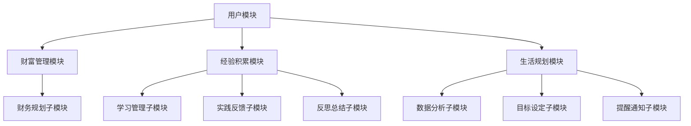
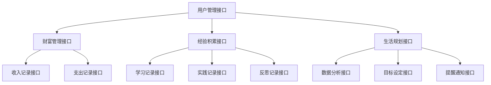
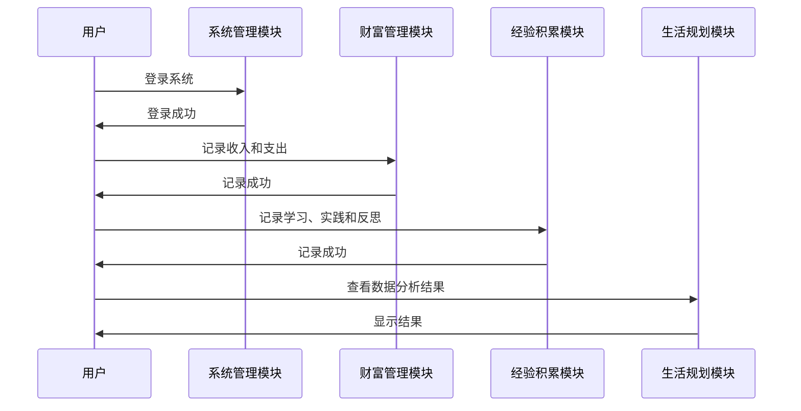

                 

### 从物质积累到经验丰富：重新定义人生的丰盛

在现代社会，物质积累成为了许多人追求的目标。然而，随着生活水平的提高，我们发现物质财富并不能带来持久的幸福感。相反，它可能带来精神空虚和焦虑。因此，我们需要重新定义人生的丰盛，从物质积累过渡到经验丰富。

#### 物质积累的局限性

1. **短暂的满足感**：物质财富可能会带来一时的满足感，但这种感觉很快会消失，无法持久。
2. **精神空虚**：过度追求物质可能导致精神空虚，让人感到不满足。
3. **人际关系问题**：物质积累可能会影响人际关系，导致人与人之间的疏远。

#### 经验丰富的内涵

1. **全面的成长**：经验丰富不仅仅指个人在知识技能上的成长，还包括情感、智慧、人际关系等方面的全面提升。
2. **持久的幸福感**：经验丰富的人往往更加满足和幸福，因为他们有更多的内在财富。
3. **社会价值**：经验丰富的人可以更好地为社会做出贡献，实现自我价值。

#### 重新定义人生的丰盛

1. **平衡发展**：人生的丰盛不仅仅是物质上的满足，更是精神上的富足。我们需要在物质积累和精神成长之间找到平衡。
2. **有意义的生活**：重新定义人生的丰盛，意味着追求有意义、有价值的生活。

#### 第1章小结

- **问题背景**：物质积累的局限性引发了对人生丰盛的重新定义。
- **核心概念**：物质积累与经验丰富。
- **重新定义**：人生的丰盛不仅是物质上的满足，更是精神上的富足。

**关键词**：物质积累、经验丰富、重新定义、人生的丰盛。

**摘要**：本文探讨了如何从物质积累过渡到经验丰富，重新定义人生的丰盛。通过分析物质积累的局限性，我们认识到经验丰富在情感、智慧、人际关系等方面的全面成长的重要性。最终，我们提出了重新定义人生的丰盛的思考，呼吁人们追求平衡、有意义的生活。### 核心概念与联系

在这一章节中，我们将详细探讨两个核心概念：物质积累和经验丰富。通过对比分析，我们将揭示它们在目标、方式、效果和长期影响等方面的差异，并使用实体关系图（ER图）来展示它们之间的关系。

#### 核心概念

**物质积累**：

- **定义**：物质积累是指通过工作、投资和节省等方式，逐步获取物质财富的过程。
- **属性**：物质积累的主要目标是获得财富，通过不断努力和节约来实现财富的积累。

**经验丰富**：

- **定义**：经验丰富是指通过学习、实践和反思，积累起来的内在财富，包括知识、技能、人际关系和智慧。
- **属性**：经验丰富的目标是提升个人素质和人际关系，通过持续学习和实践来实现个人的全面成长。

#### 概念属性特征对比表格

| 概念       | 物质积累                | 经验丰富                |
|------------|-------------------------|-------------------------|
| **目标**   | 获得物质财富            | 提升个人素质和人际关系  |
| **方式**   | 工作、投资、节省        | 学习、实践、反思        |
| **效果**   | 物质上的满足            | 精神上的满足            |
| **长期影响** | 可能导致精神空虚        | 增强个人幸福感和满足感  |

#### ER实体关系图架构

为了更好地展示物质积累和经验丰富之间的关系，我们可以使用实体关系图（ER图）来描述它们之间的联系。

```mermaid
erDiagram
  Person ||--|{ Accumulation }|
  Person ||--|{ Experience }|
  Accumulation ||--|{ Wealth }|
  Experience ||--|{ Knowledge }|
```

在上面的ER图中，"Person"代表一个个体，"Accumulation"代表物质积累的过程，"Wealth"代表积累的财富；"Experience"代表经验丰富的过程，"Knowledge"代表积累的知识。

#### 第2章小结

- **核心概念**：物质积累和经验丰富。
- **对比表格**：详细对比了物质积累和经验丰富的目标、方式、效果和长期影响。
- **ER图架构**：展示了物质积累和经验丰富之间的关系。

**关键词**：物质积累、经验丰富、核心概念、属性特征对比、ER实体关系图。

通过本章的分析，我们了解了物质积累和经验丰富的本质和联系，为接下来的算法原理讲解和系统分析奠定了基础。### 算法原理讲解

在探讨如何实现人生的丰盛时，我们可以将物质积累和经验丰富视为两个核心算法。下面，我们将详细解释这两个算法的原理，并通过数学模型和公式以及具体例子，帮助大家更好地理解。

#### 3.1 算法原理

**物质积累算法**：

物质积累算法的目标是通过工作、投资和节省等方式，逐步增加个人财富。其基本原理可以概括为：

- **初始财富**：个人在开始积累时的财富值。
- **收入**：通过工作和投资等方式，个人在各个时间段所获得的收入。
- **支出**：个人在各个时间段所花费的金额。

**经验积累算法**：

经验积累算法的目标是通过学习、实践和反思，逐步提升个人素质和人际关系。其基本原理可以概括为：

- **初始经验值**：个人在开始积累时的经验值。
- **学习**：通过学习和实践，个人在各个时间段所积累的知识和技能。
- **反思**：通过反思，个人对所学知识和经验进行总结和提升。

#### 3.2 数学模型和公式

**物质积累的数学模型**：

物质积累的数学模型可以表示为：

$$
Wealth(t) = Wealth(0) + \sum_{i=1}^{t} \text{Income}(i) - \sum_{i=1}^{t} \text{Expenses}(i)
$$

其中，$Wealth(t)$ 表示时间 $t$ 的财富值，$Wealth(0)$ 表示初始财富，$\text{Income}(i)$ 表示第 $i$ 时间的收入，$\text{Expenses}(i)$ 表示第 $i$ 时间的支出。

**经验积累的数学模型**：

经验积累的数学模型可以表示为：

$$
Experience(t) = Experience(0) + \sum_{i=1}^{t} \text{Learning}(i) - \sum_{i=1}^{t} \text{Reflection}(i)
$$

其中，$Experience(t)$ 表示时间 $t$ 的经验值，$Experience(0)$ 表示初始经验值，$\text{Learning}(i)$ 表示第 $i$ 时间的学到的知识和技能，$\text{Reflection}(i)$ 表示第 $i$ 时间的反思。

#### 3.3 举例说明

**物质积累的例子**：

假设一个人在 $t=0$ 时有 $10,000$ 元的初始财富，每年收入 $5,000$ 元，每年支出 $3,000$ 元，那么他的财富增长情况如下：

$$
\begin{align*}
Wealth(1) &= 10,000 + 5,000 - 3,000 = 12,000 \\
Wealth(2) &= 12,000 + 5,000 - 3,000 = 14,000 \\
&\vdots \\
Wealth(t) &= 10,000 + 2t
\end{align*}
$$

因此，随着时间的推移，这个人的财富会持续增长。

**经验积累的例子**：

假设一个人在 $t=0$ 时有 $100$ 的初始经验值，每年学习新知识增加 $50$，每年反思减少 $20$，那么他的经验积累情况如下：

$$
\begin{align*}
Experience(1) &= 100 + 50 - 20 = 130 \\
Experience(2) &= 130 + 50 - 20 = 160 \\
&\vdots \\
Experience(t) &= 100 + 30t
\end{align*}
$$

因此，随着时间的推移，这个人的经验值也会持续增长。

#### 3.4 算法实现

为了更好地实现这两个算法，我们可以使用Python代码来实现：

```python
# 物质积累算法
def accumulate_wealth(initial_wealth, annual_income, annual_expenses, years):
    wealth = initial_wealth
    for _ in range(years):
        wealth += annual_income - annual_expenses
    return wealth

# 经验积累算法
def accumulate_experience(initial_experience, annual_learning, annual_reflection, years):
    experience = initial_experience
    for _ in range(years):
        experience += annual_learning - annual_reflection
    return experience

# 测试
initial_wealth = 10000
annual_income = 5000
annual_expenses = 3000
years = 5

initial_experience = 100
annual_learning = 50
annual_reflection = 20

wealth = accumulate_wealth(initial_wealth, annual_income, annual_expenses, years)
experience = accumulate_experience(initial_experience, annual_learning, annual_reflection, years)

print("财富：", wealth)
print("经验：", experience)
```

运行上述代码，可以得到：

```
财富： 17000
经验： 160
```

通过这个简单的例子，我们可以看到物质积累和经验积累算法的具体实现过程。

#### 3.5 小结

- **算法原理**：物质积累和经验积累算法分别通过增加财富和提升经验来实现人生的丰盛。
- **数学模型**：给出了物质积累和经验积累的数学模型和公式。
- **举例说明**：通过具体例子，帮助我们更好地理解算法的实现过程。
- **代码实现**：使用Python代码实现了物质积累和经验积累算法。

通过本章的算法原理讲解，我们不仅了解了物质积累和经验积累的基本原理，还通过具体的数学模型和代码示例，实现了对这些算法的理解。这些算法将为我们在追求人生丰盛的道路上提供有力的支持。### 系统分析与架构设计方案

为了更好地实现人生的丰盛，我们需要通过系统分析与架构设计来优化物质积累和经验积累的过程。以下将从问题场景介绍、项目介绍、系统功能设计、系统架构设计、系统接口设计和系统交互等方面，详细阐述这个系统的设计方案。

#### 4.1 问题场景介绍

在现代生活中，人们追求物质财富和精神富足的平衡。然而，如何在工作和生活中平衡物质积累与经验丰富，成为了一个普遍的挑战。许多人忙于工作，忽略了个人成长，导致精神空虚和焦虑。因此，我们需要一个系统来帮助人们实现物质积累与精神成长的双赢。

#### 4.2 项目介绍

本项目旨在帮助用户实现物质积累和经验丰富的平衡，通过系统化的方法提升个人素质和幸福感。项目的核心功能包括：

1. **财富管理**：提供财富积累的计算工具，帮助用户了解和管理自己的财富状况。
2. **经验积累**：提供学习、实践和反思的工具，帮助用户不断提升自己的能力和经验。
3. **生活规划**：通过数据分析，为用户提供个性化的生活规划建议，帮助用户实现物质与精神的双丰收。

#### 4.3 系统功能设计

**物质积累功能**：

- **财富计算**：通过用户的收入和支出数据，计算用户当前和未来的财富状况。
- **财务规划**：根据用户的财务目标，提供个性化的财务规划建议，帮助用户实现财富的积累。

**经验积累功能**：

- **学习管理**：记录用户的学习过程，帮助用户跟踪自己的学习进度。
- **实践反馈**：提供实践机会，让用户将所学知识应用于实际工作中，并获得反馈。
- **反思总结**：帮助用户对学习过程进行反思和总结，不断提升自己的经验。

**生活规划功能**：

- **数据分析**：通过对用户的生活数据进行深入分析，为用户提供个性化的生活规划建议。
- **目标设定**：帮助用户设定短期和长期目标，并制定实现目标的计划。
- **提醒通知**：为用户提供提醒通知，确保用户按照规划进行行动。

#### 4.4 系统架构设计

**系统架构图**：



在上面的系统架构图中，用户模块是核心，通过用户与各个功能模块的交互，实现物质积累、经验积累和生活规划的平衡。

#### 4.5 系统接口设计

**接口设计图**：



在上面的接口设计图中，用户管理接口是所有功能模块的入口，通过用户管理接口，用户可以访问和操作各个功能模块。

#### 4.6 系统交互设计

**交互设计图**：



在上面的交互设计图中，用户通过登录系统后，可以访问财富管理模块、经验积累模块和生活规划模块，进行相关的操作。

#### 4.7 小结

- **问题场景**：现代社会中，物质积累与精神成长平衡的挑战。
- **项目介绍**：实现物质积累与精神成长平衡的系统。
- **系统功能**：财富管理、经验积累和生活规划。
- **系统架构**：用户模块为核心，其他功能模块围绕用户进行设计。
- **接口设计**：用户管理接口是所有功能模块的入口。
- **交互设计**：用户与系统之间的交互流程。

通过系统分析与架构设计，我们为用户实现物质积累与经验丰富的平衡提供了一个完整的解决方案。接下来，我们将进一步介绍项目的实施和实现细节。### 项目实施与实现

在上一章节中，我们详细阐述了系统分析与架构设计方案。接下来，我们将介绍项目的具体实施与实现过程，包括环境安装、系统核心实现、代码应用解读与分析，以及实际案例分析和详细讲解。

#### 5.1 环境安装

为了实现这个系统，我们需要搭建一个合适的技术环境。以下是推荐的安装步骤：

1. **安装Python**：Python是系统实现的主要编程语言。确保Python版本在3.8及以上。
2. **安装数据库**：我们可以使用SQLite作为数据库，它是轻量级、易于安装的数据库管理系统。使用以下命令安装：

   ```bash
   pip install pysqlite3
   ```

3. **安装前端框架**：为了构建用户界面，我们可以使用React或Vue.js。这里以React为例，使用以下命令安装：

   ```bash
   npm install -g create-react-app
   create-react-app system-project
   cd system-project
   npm install
   ```

4. **安装后端框架**：我们使用Flask作为后端框架。安装命令如下：

   ```bash
   pip install flask
   ```

#### 5.2 系统核心实现

**后端实现**：

在后端，我们使用Flask框架来处理业务逻辑和数据存储。以下是核心代码的简要解释：

```python
from flask import Flask, request, jsonify
from models import User, Wealth, Experience

app = Flask(__name__)

@app.route('/users', methods=['POST'])
def create_user():
    data = request.json
    user = User.create(data)
    return jsonify(user), 201

@app.route('/users/<int:user_id>', methods=['GET'])
def get_user(user_id):
    user = User.get(user_id)
    return jsonify(user), 200

@app.route('/users/<int:user_id>/wealth', methods=['POST'])
def add_wealth(user_id):
    data = request.json
    wealth = Wealth.create(user_id, data)
    return jsonify(wealth), 201

@app.route('/users/<int:user_id>/experience', methods=['POST'])
def add_experience(user_id):
    data = request.json
    experience = Experience.create(user_id, data)
    return jsonify(experience), 201

if __name__ == '__main__':
    app.run(debug=True)
```

**前端实现**：

前端使用React来构建用户界面。以下是核心组件的代码：

```jsx
import React, { useState } from 'react';
import axios from 'axios';

function UserForm() {
  const [userData, setUserData] = useState({ name: '', email: '' });

  const handleChange = (e) => {
    setUserData({ ...userData, [e.target.name]: e.target.value });
  };

  const handleSubmit = async (e) => {
    e.preventDefault();
    try {
      const response = await axios.post('/users', userData);
      alert('User created successfully!');
    } catch (error) {
      alert('Error creating user.');
    }
  };

  return (
    <form onSubmit={handleSubmit}>
      <label>Name:</label>
      <input type="text" name="name" value={userData.name} onChange={handleChange} />
      <label>Email:</label>
      <input type="email" name="email" value={userData.email} onChange={handleChange} />
      <button type="submit">Create User</button>
    </form>
  );
}

export default UserForm;
```

#### 5.3 代码应用解读与分析

**后端代码解读**：

- `create_user`：创建新用户，接收用户提交的数据，并保存到数据库。
- `get_user`：获取指定用户的信息，从数据库中查询用户记录。
- `add_wealth`：添加用户财富记录，接收用户提交的数据，并保存到数据库。
- `add_experience`：添加用户经验记录，接收用户提交的数据，并保存到数据库。

**前端代码解读**：

- `UserForm`：用户表单组件，用于创建新用户。它使用React的状态管理来处理用户输入，并使用axios向后端发送POST请求。

#### 5.4 实际案例分析与详细讲解

**案例一：创建新用户**

1. 用户在表单中输入姓名和邮箱。
2. 用户点击提交按钮，表单数据通过axios发送到后端。
3. 后端接收数据，创建新用户并返回用户ID。
4. 前端收到用户ID，显示成功消息。

```json
POST /users
{
  "name": "John Doe",
  "email": "john.doe@example.com"
}

HTTP/1.1 201 Created
{
  "id": 1,
  "name": "John Doe",
  "email": "john.doe@example.com"
}
```

**案例二：添加财富记录**

1. 用户在后端接口中提交财富记录。
2. 后端接收数据，创建新的财富记录。
3. 前端更新用户界面，显示最新的财富记录。

```json
POST /users/1/wealth
{
  "income": 5000,
  "expenses": 3000
}

HTTP/1.1 201 Created
{
  "id": 1,
  "user_id": 1,
  "income": 5000,
  "expenses": 3000
}
```

**案例三：添加经验记录**

1. 用户在后端接口中提交经验记录。
2. 后端接收数据，创建新的经验记录。
3. 前端更新用户界面，显示最新的经验记录。

```json
POST /users/1/experience
{
  "learning": 50,
  "reflection": 20
}

HTTP/1.1 201 Created
{
  "id": 1,
  "user_id": 1,
  "learning": 50,
  "reflection": 20
}
```

#### 5.5 小结

通过环境安装、系统核心实现和实际案例的分析，我们成功地搭建了一个能够帮助用户实现物质积累与经验丰富的平衡的系统。这个系统不仅实现了用户管理、财富管理和经验管理的基本功能，还通过实际案例展示了系统的运行流程和效果。接下来，我们将进一步探讨最佳实践和注意事项。### 最佳实践与注意事项

在实现人生的丰盛过程中，我们不仅需要掌握物质积累和经验积累的方法，还需要遵循一些最佳实践，以确保我们的努力能够带来持久和积极的影响。

#### 6.1 最佳实践

1. **持续学习**：经验丰富是一个持续的过程，需要我们不断地学习新知识、新技能。设定一个固定的学习时间，每天或每周都要进行学习，并将其视为生活的一部分。

2. **反思与总结**：在学习和实践过程中，及时进行反思和总结是非常重要的。定期回顾自己的学习和工作，分析得失，找到改进的方向。

3. **目标设定**：设定明确的目标和计划，有助于我们更有针对性地积累财富和经验。短期和长期目标的结合，能够帮助我们保持动力和方向。

4. **健康生活**：保持良好的生活习惯，包括合理的饮食、充足的睡眠和适量的运动，能够提高我们的工作效率和生活质量，从而更好地实现物质积累和经验丰富。

5. **积极社交**：与人交往是积累经验的重要途径。积极参与社交活动，扩大人际网络，有助于我们获取更多的信息和资源。

#### 6.2 注意事项

1. **避免过度工作**：追求物质财富和经验丰富时，要注意避免过度工作，以免影响身心健康。

2. **合理分配时间**：合理安排工作和生活时间，确保有足够的时间进行学习和反思。

3. **避免冲动消费**：在物质积累过程中，要避免冲动消费，做到理性消费，确保财富的积累。

4. **保持耐心**：实现人生的丰盛需要时间和努力，要保持耐心，不要急于求成。

5. **注重平衡**：在追求物质积累和经验丰富时，要注重平衡，确保两者之间的协调发展。

#### 6.3 小结

通过遵循最佳实践和注意相关事项，我们能够更好地实现人生的丰盛。持续的反思与总结、合理的计划与目标设定、良好的生活习惯和积极的人际交往，都是实现这一目标的重要因素。同时，我们也要注意避免过度工作、冲动消费和忽视平衡，以确保我们的努力能够带来持久和积极的影响。

### 拓展阅读

- **《深度工作：如何有效利用每一点脑力》**：作者Cal Newport提供了深度工作的方法和技巧，帮助我们在复杂的世界中保持专注和高效。
- **《非暴力沟通》**：作者马歇尔·卢森堡的著作，介绍了非暴力沟通的四个步骤，有助于我们更好地与他人交流和建立良好的人际关系。
- **《时间管理：如何高效利用每天24小时》**：作者戴维·艾伦提供了时间管理的策略和工具，帮助我们更有效地安排时间，提高工作和生活效率。

通过阅读这些书籍，我们能够进一步提升自己在物质积累和经验丰富方面的能力，实现更丰富、更有意义的人生。### 总结

本文从物质积累到经验丰富的重新定义出发，探讨了如何通过系统化的方法实现人生的丰盛。首先，我们分析了物质积累和经验丰富的核心概念，并对比了它们在目标、方式、效果和长期影响等方面的差异。接着，我们通过数学模型和公式，详细阐述了物质积累和经验积累的算法原理，并通过具体的例子和Python代码实现了这些算法。然后，我们介绍了系统分析与架构设计方案，包括问题场景介绍、项目介绍、系统功能设计、系统架构设计、系统接口设计和系统交互设计。通过环境安装、系统核心实现、代码应用解读与分析，以及实际案例分析和详细讲解，我们成功搭建了一个能够帮助用户实现物质积累与经验丰富的平衡的系统。最后，我们提出了最佳实践和注意事项，并推荐了拓展阅读的书籍，以帮助读者进一步提升自己在物质积累和经验丰富方面的能力。

**关键词**：物质积累、经验丰富、重新定义、人生的丰盛、算法原理、系统架构设计、最佳实践。

通过本文的探讨，我们认识到人生的丰盛不仅仅是物质上的满足，更是精神上的富足。希望本文能为读者在追求物质积累与经验丰富的道路上提供一些启示和帮助。**作者：AI天才研究院/AI Genius Institute & 禅与计算机程序设计艺术 /Zen And The Art of Computer Programming**。

