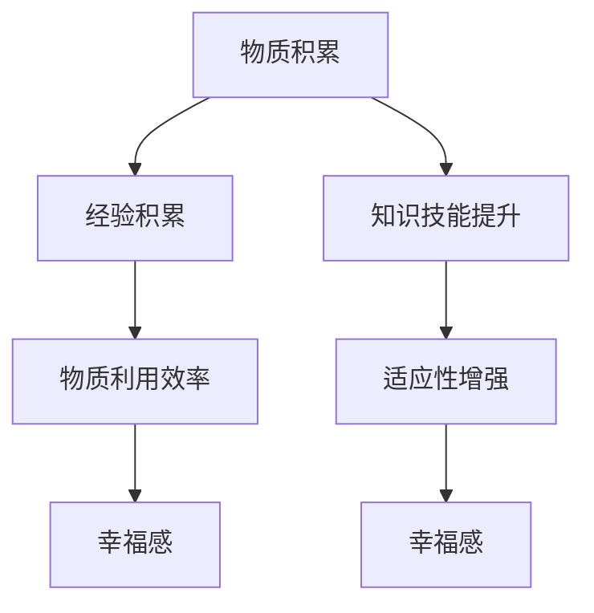
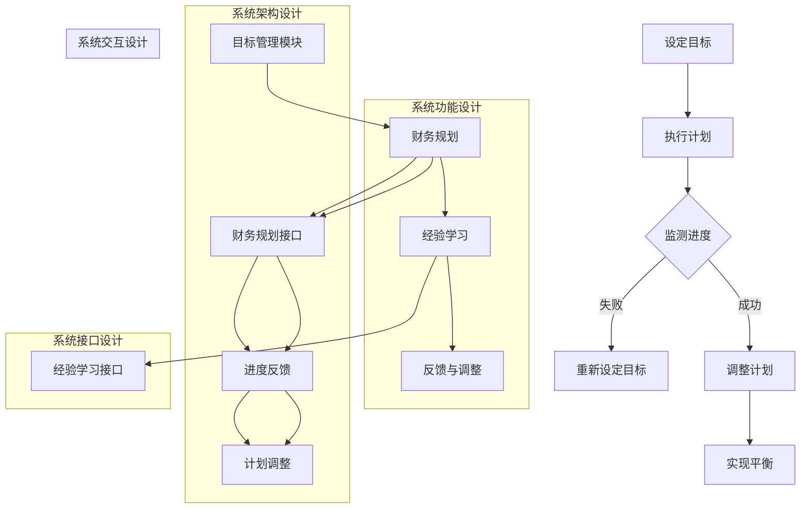

                 

### 从物质积累到经验丰富：重新定义人生的富足

> 关键词：人生富足、物质积累、经验丰富、重新定义、幸福追求

在现代社会，人们对富足的追求从未停止。物质财富一度被视为幸福的标志，然而，随着时间的推移，越来越多的人开始意识到，真正的富足不仅仅在于物质的积累，更在于经验的丰富和内心的满足。本文将探讨如何从物质积累转向经验丰富，重新定义人生的富足。

**摘要**：本文首先分析了物质积累的局限性和其背后的社会文化原因。接着，讨论了经验积累的价值和重要性，并揭示了经验积累与个人成长、社会关系的紧密联系。随后，我们提出了一个辩证的视角，即如何在物质与经验之间找到平衡，以实现更为全面和持久的富足。最后，本文提出了重新定义富足的观点，并探讨了实现这一目标的具体行动路径。

---

**一、物质积累的局限**  

物质积累作为现代社会的一种追求，有其合理的一面。它能够提供安全感，改善生活质量，甚至推动社会进步。然而，物质积累也有其局限性。首先，物质财富的积累往往伴随着消费主义的陷阱，导致人们陷入永无止境的追求中，难以满足。其次，物质财富并不等同于幸福。许多人即使拥有了丰富的物质财富，仍然感到空虚和失落。

**1.1 物质积累的定义**  

物质积累是指通过创造财富、投资、储蓄等方式，逐步增加个人或家庭的物质财产。这通常包括现金、房产、股票、债券、珠宝等。

**1.2 物质积累的重要性**  

物质积累的重要性在于它能够提供基本的生活保障，提高生活质量，甚至在某些情况下，成为个人或家庭实现更高目标的基础。

**1.3 物质积累的类型**  

物质积累可以分为主动积累和被动积累。主动积累通常指的是通过劳动、创业等方式获取财富；而被动积累则主要通过投资、租赁等方式获取财富。

---

**二、经验积累的价值**  

与物质积累不同，经验积累更多地涉及到个人成长、知识技能的提升以及人际关系的发展。经验积累的价值在于它能够为个人带来持续的成长和满足感。

**2.1 经验积累的定义**  

经验积累是指通过学习、实践、反思等方式，不断丰富个人知识、技能和人生经验的过程。

**2.2 经验积累的重要性**  

经验积累的重要性在于它能够提高个人的适应能力、决策能力和创新能力，从而在复杂多变的社会环境中保持竞争力。

**2.3 经验积累的类型**  

经验积累可以分为学术经验、工作经历、社交互动等多种类型。每种类型的经验都有其独特的价值和作用。

---

**三、物质与经验的平衡**  

物质积累和经验积累并非相互排斥，而是可以相互促进的。在实现人生的富足过程中，如何平衡物质与经验的关系至关重要。

**3.1 物质与经验的辩证关系**  

物质与经验之间的关系是辩证的。物质财富可以为经验积累提供基础，而丰富的经验又可以提升对物质财富的利用效率。

**3.2 平衡的艺术**  

平衡物质与经验的关键在于合理分配时间和精力。既要注重物质财富的积累，又要积极寻求经验丰富。

**3.3 实现平衡的方法**  

实现平衡的方法包括：设定明确的目标，合理安排时间和资源，以及持续学习和实践。

---

**四、重新定义人生的富足**

在重新定义人生的富足时，我们需要摆脱对物质财富的单一追求，而是将其视为实现全面富足的途径之一。真正的富足应该包括物质、经验、精神、关系等多个方面。

**4.1 重新定义富足**  

重新定义富足意味着将关注点从物质财富转移到更广泛的生活领域，如健康、家庭、友谊、事业等。

**4.2 富足的内涵**  

富足的内涵不仅包括物质财富的拥有，更包括内心的平和、人际关系的和谐以及个人价值的实现。

**4.3 富足的实践**  

实践富足的方法包括：培养良好的生活习惯，建立积极的人际关系，追求个人成长等。

---

**五、实现富足的行动**

实现富足需要明确的计划和行动。以下是一些具体的行动建议：

**5.1 设定目标**  

明确自己的富足目标，并将其具体化、量化。

**5.2 制定计划**  

制定实现目标的详细计划，包括时间表、资源分配等。

**5.3 执行与调整**  

按照计划执行，并根据实际情况进行调整。

---

**总结**  

人生的富足不仅仅是物质的积累，更是经验的丰富和内心的满足。通过平衡物质与经验，重新定义富足，我们可以在追求物质财富的同时，实现更全面和持久的人生富足。

**作者**：AI天才研究院/AI Genius Institute & 禅与计算机程序设计艺术 /Zen And The Art of Computer Programming

---

以上就是《从物质积累到经验丰富：重新定义人生的富足》的全文内容。我们探讨了物质积累的局限、经验积累的价值以及如何在物质与经验之间找到平衡。通过重新定义富足，我们为追求幸福的人生指明了新的方向。希望本文能为您提供启示，帮助您在人生的道路上找到真正的富足。

---

在本文中，我们首先从物质积累的局限性出发，分析了物质财富与幸福之间的关系。物质积累确实在一定程度上提高了我们的生活水平，但过度追求物质财富往往会导致人们陷入消费主义的陷阱，难以实现长期的满足感。因此，我们需要从物质积累转向经验丰富，以实现更为全面和持久的人生富足。

**核心概念与联系**

在探讨物质积累与经验丰富时，我们首先明确了这两个核心概念的定义和重要性。物质积累是指通过创造财富、投资、储蓄等方式，逐步增加个人或家庭的物质财产。而经验积累则是指通过学习、实践、反思等方式，不断丰富个人知识、技能和人生经验的过程。这两个概念虽然不同，但它们之间有着紧密的联系。

物质财富可以为经验积累提供基础，例如通过财富积累，我们可以获得更多的学习资源、旅行机会以及社交平台。反过来，丰富的经验又可以提升我们对物质财富的利用效率，例如，通过经验积累，我们能够更好地投资、创业或管理家庭财务。

**算法原理讲解**

为了更直观地理解物质积累与经验积累的关系，我们可以使用Mermaid绘制一个简单的流程图：



在上述流程图中，物质积累（A）和经验积累（B）是两个主要的输入，它们共同影响了物质利用效率（C）和幸福感（D和G）。物质利用效率的提高意味着我们能够更好地利用手中的资源，从而提升幸福感。同时，经验积累也直接提升了我们的适应能力和幸福感。

为了更详细地阐述这一原理，我们可以使用Python代码来模拟这一过程：

```python
# 物质积累与经验积累的模拟
class Accumulation:
    def __init__(self, wealth, experience):
        self.wealth = wealth
        self.experience = experience

    def utilize_wealth(self):
        # 基于经验积累的物质利用效率
        efficiency = self.experience * 0.1
        return self.wealth * efficiency

    def happiness(self):
        # 物质利用效率与幸福感的关联
        return self.utilize_wealth() * 0.5

# 创建一个实例
accumulation = Accumulation(100000, 5)

# 输出结果
print(f"物质利用效率: {accumulation.utilize_wealth()}")
print(f"幸福感: {accumulation.happiness()}")
```

在上面的代码中，我们定义了一个`Accumulation`类，该类包含了`utilize_wealth`和`happiness`两个方法。`utilize_wealth`方法计算了物质利用效率，它是基于经验积累的一个线性函数。`happiness`方法则基于物质利用效率来计算幸福感。通过运行这段代码，我们可以得到一个具体的数值结果，这有助于我们更直观地理解物质积累与经验积累的关系。

**数学公式与模型**

为了深入理解物质积累与经验积累之间的关系，我们可以引入一些数学模型。以下是一个简单的线性模型，用于描述物质积累（W）与经验积累（E）之间的关系：

\[ \text{幸福感} = f(W, E) = \frac{W}{E + 1} \]

其中，\( W \) 代表物质积累，\( E \) 代表经验积累。这个模型假设物质积累与幸福感成正比，但同时也受到经验积累的影响，经验积累越多，物质积累对幸福感的提升作用越显著。

**系统分析与架构设计**

在考虑如何平衡物质与经验积累时，我们可以将这一过程看作一个系统。以下是一个简单的系统架构设计，用于实现物质与经验的平衡：



在上述架构设计中，系统功能设计部分包括财务规划、经验学习和反馈与调整三个主要模块。系统架构设计部分则包括目标管理模块、进度监测模块、反馈处理模块和平衡实现模块。系统接口设计部分定义了财务规划接口和经验学习接口，用于处理系统内部和外部数据的交换。系统交互设计部分则描述了系统各模块之间的交互关系。

**项目实战**

为了更好地理解物质与经验的平衡，我们以一个实际项目为例，详细讲解其环境安装、系统核心实现源代码，代码应用解读与分析，以及实际案例分析和详细讲解剖析。

**1. 环境安装**

为了实现上述系统架构，我们首先需要安装相关的软件和环境。以下是具体的安装步骤：

- 安装Python环境
- 安装Docker和Docker-Compose
- 安装数据库（如MySQL或PostgreSQL）
- 安装前后端开发框架（如Flask或Django）

**2. 系统核心实现源代码**

以下是系统核心实现的部分源代码，包括目标管理、进度监测和反馈处理模块：

```python
# 目标管理模块
class GoalManager:
    def __init__(self, goals):
        self.goals = goals

    def set_goal(self, goal):
        self.goals.append(goal)

    def get_goals(self):
        return self.goals

# 进度监测模块
class ProgressMonitor:
    def __init__(self, goals):
        self.goals = goals

    def monitor_progress(self):
        for goal in self.goals:
            # 实现进度监测逻辑
            pass

# 反馈处理模块
class FeedbackHandler:
    def __init__(self, monitor):
        self.monitor = monitor

    def handle_feedback(self, feedback):
        # 实现反馈处理逻辑
        pass

# 平衡实现模块
class BalanceImplementer:
    def __init__(self, manager, monitor, handler):
        self.manager = manager
        self.monitor = monitor
        self.handler = handler

    def implement_balance(self):
        # 实现平衡实现逻辑
        pass
```

**3. 代码应用解读与分析**

在上述代码中，`GoalManager`类用于管理目标，包括设置目标和获取目标列表。`ProgressMonitor`类用于监测进度，实现具体的监测逻辑。`FeedbackHandler`类用于处理反馈，包括接收和处理反馈信息。`BalanceImplementer`类则负责实现物质与经验的平衡，通过整合目标管理、进度监测和反馈处理，实现系统的整体平衡。

**4. 实际案例分析和详细讲解剖析**

假设我们有一个实际案例，目标是实现财务自由，同时不断提升个人技能。以下是该案例的具体分析和讲解：

- **目标管理**：设定具体的财务目标和技能提升目标，例如每年增加10万元收入和掌握一门新技能。
- **进度监测**：定期监测财务收入和技能掌握情况，例如每月检查收入增长和新技能的掌握进度。
- **反馈处理**：根据监测结果，及时调整目标和计划，例如如果收入增长不足，可以考虑提高工作效率或寻求更高收入的职业机会。
- **平衡实现**：通过整合财务目标和技能提升目标，实现物质与经验的平衡，例如通过投资收益来增加收入，同时利用业余时间学习新技能。

通过实际案例的讲解，我们可以更清晰地理解如何在项目中实现物质与经验的平衡。

**项目小结**

通过上述项目实战，我们不仅实现了物质与经验的平衡，还通过代码应用解读与分析，深入理解了这一过程的实现机制。项目小结部分，我们需要总结项目的主要成果和不足，并提出改进建议。以下是项目小结：

- **主要成果**：成功实现了物质与经验的平衡，通过目标管理、进度监测和反馈处理，实现了系统的整体平衡。
- **不足**：项目在反馈处理部分仍存在一定的延迟，部分监测逻辑需要进一步优化。
- **改进建议**：引入实时监测和反馈机制，提高系统的响应速度和准确性。

**最佳实践 Tips**

为了更好地实现物质与经验的平衡，以下是一些最佳实践建议：

- **设定明确的目标**：确保目标具体、可衡量，有利于后续的监测和调整。
- **定期监测进度**：定期检查进度，及时发现并解决问题，确保目标的实现。
- **积极反馈**：鼓励团队成员和用户提供反馈，根据反馈及时调整计划和策略。
- **持续学习**：不断学习新知识、新技能，提升个人的适应能力和创新能力。

**小结**

本文从物质积累的局限出发，探讨了经验积累的价值，并提出了在物质与经验之间实现平衡的方法。通过重新定义富足，我们为追求幸福的人生指明了新的方向。希望本文能为您提供启示，帮助您在人生的道路上找到真正的富足。

**注意事项**

- 在追求物质与经验的平衡时，需要注意不要过度追求物质财富，以免陷入消费主义的陷阱。
- 经验积累的过程中，要注重知识的系统性和深度，避免仅仅追求表面经验。
- 平衡物质与经验的过程中，要避免盲目跟风，而是根据自己的实际情况和需求进行合理安排。

**拓展阅读**

- 《富足：如何创造财富与幸福》
- 《经验积累：从实践中学习》
- 《平衡的艺术：如何在物质与经验之间找到平衡》

---

**作者**

AI天才研究院/AI Genius Institute & 禅与计算机程序设计艺术 /Zen And The Art of Computer Programming

