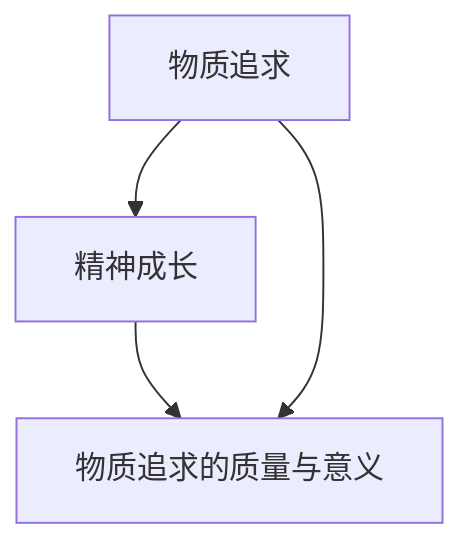

                 

### 文章标题

从物质追求到精神成长：现代人的价值观重构之旅

### 关键词

价值观重构，物质追求，精神成长，自我认知，转变路径，个人实践，组织实践

### 摘要

在快速发展的现代社会，物质追求已成为人们生活的重要驱动力。然而，过度追求物质往往导致精神匮乏，引发一系列社会问题。本文旨在探讨从物质追求到精神成长的转变过程，分析其核心概念和影响要素，并提出具体的重构路径和实践方法。通过深入思考和实践，现代人可以重构价值观，实现精神富足和全面发展。

## 第一部分：引言

### 第1章：问题背景与价值探讨

#### 1.1 问题背景

**1.1.1 物质追求的现代困境**

在当今社会，物质追求已经成为一种普遍现象。人们通过消费、工作和竞争来获得财富、地位和成就感。然而，这种追求并非总是带来幸福感。相反，许多人发现自己陷入了一轮又一轮的物质追求循环中，追求的越多，心中的空虚感却越强烈。

**1.1.2 精神成长的必要性**

随着物质生活水平的提高，人们开始意识到精神成长的重要性。精神成长不仅关乎个人的心理健康，还影响到人际关系和社会和谐。精神成长包括自我认知、价值追求和内心稳定等，是现代人在追求物质满足之外更深层的需求。

**1.1.3 价值观重构的挑战**

价值观重构是一项长期且复杂的任务。现代社会中的物质追求和功利主义观念使得人们的价值观已经根深蒂固。要实现从物质追求到精神成长的转变，需要克服诸多挑战，包括改变生活习惯、重塑价值观体系和社会环境的支持等。

#### 1.2 价值探讨

**1.2.1 物质追求与精神成长的关系**

物质追求和精神成长并非完全对立，而是相互影响、相互作用的关系。适度的物质追求可以为精神成长提供基础，但过度的物质追求则会阻碍精神成长。因此，如何平衡二者之间的关系，实现良性循环，是现代人价值观重构的关键。

**1.2.2 价值观重构的意义**

价值观重构不仅对个人有意义，对社会也有深远的影响。个人层面，价值观重构有助于提升幸福感、增强内心力量和建立健康的人际关系。社会层面，价值观重构有助于促进社会和谐、减少资源浪费和实现可持续发展。

**1.2.3 个人与社会的影响**

个人价值观的重构不仅影响个人的生活质量，还对周围的人和社会产生影响。一个拥有健康价值观的人，不仅能够更好地应对生活中的挑战，还能够通过自己的行为和态度，影响和带动周围的人，共同营造积极向上的社会氛围。

#### 1.3 边界与外延

**1.3.1 本书的研究范围**

本书主要探讨现代人从物质追求到精神成长的价值观重构之旅，分析其核心概念、影响要素和重构路径。研究范围包括个人层面和社会层面的价值观重构，以及在此过程中可能面临的挑战和应对策略。

**1.3.2 研究的局限性与未来展望**

虽然本书旨在为现代人提供价值观重构的指南，但研究仍存在一定局限性。例如，个体的价值观重构是一个复杂的过程，涉及诸多因素，本书难以全面覆盖。未来研究可以进一步探讨不同文化背景下价值观重构的差异性，以及技术进步对价值观重构的影响。

#### 1.4 概念结构与核心要素组成

**1.4.1 价值观重构的核心概念**

价值观重构的核心概念包括物质追求、精神成长、自我认知和价值观体系等。物质追求是指通过消费、工作和竞争来获取物质财富和地位；精神成长是指通过自我认知、价值追求和内心修炼来提升精神境界；自我认知是指对自己的了解和认识；价值观体系是指个人的价值观念和信仰体系。

**1.4.2 物质追求与精神成长的关系模型**

物质追求与精神成长之间的关系可以视为一种动态平衡。适度的物质追求可以为精神成长提供基础，而精神成长则可以提升物质追求的质量和意义。这种关系可以用以下模型表示：

**1.5 本章小结**

本章从问题背景和价值探讨出发，分析了现代人价值观重构的必要性和意义。通过界定核心概念和构建关系模型，本章为后续章节的深入探讨奠定了基础。在接下来的部分中，我们将进一步分析物质追求和精神成长的概念、特征及其相互影响。

## 第二部分：核心概念原理

### 第2章：物质追求的理解与特征分析

#### 2.1 物质追求的定义与属性

**2.1.1 物质追求的概念界定**

物质追求是指个体通过获取物质财富和满足物质需求来提升生活质量和社会地位的过程。它通常表现为消费行为、职业发展、财富积累和社会竞争等。

**2.1.2 物质追求的主要属性**

1. **功利性**：物质追求往往以功利为目的，追求短期利益和即时满足。
2. **多元性**：物质追求的内容丰富多样，包括财富、地位、名誉、健康等。
3. **相对性**：物质追求在不同个体之间具有相对性，一个人所追求的物质目标可能对另一个人来说是微不足道的。

#### 2.2 物质追求的典型特征

**2.2.1 物质追求的多元性**

物质追求的多元性表现在不同个体对不同物质需求的追求。例如，一些人可能更注重财富和地位，而另一些人则更关注健康和生活质量。

**2.2.2 物质追求的相对性**

物质追求的相对性指的是个体的物质追求受到社会和文化背景的影响。在不同的社会环境中，同一物质目标的重要性可能大相径庭。

**2.2.3 物质追求的功利性**

物质追求的功利性表现为追求物质目标的过程中，个体往往将短期利益置于长期利益之上。这种功利性可能导致资源浪费和生态破坏。

#### 2.3 物质追求的影响因素

**2.3.1 经济发展的作用**

经济发展为物质追求提供了物质基础。随着经济的增长，人们的物质需求得到满足，进而追求更高层次的精神需求。

**2.3.2 社会文化的塑造**

社会文化对物质追求有深远影响。例如，在一些社会中，物质财富和地位被视为成功的重要标志，这促使个体追求更高的物质目标。

**2.3.3 个人价值观的驱动力**

个人价值观是物质追求的内在驱动力。个体的价值观体系决定了他们对物质追求的态度和方式。

#### 2.4 物质追求与精神成长的关联

**2.4.1 物质追求的正面影响**

适度的物质追求可以为精神成长提供基础，满足个体的基本需求，提高生活质量。

**2.4.2 物质追求的负面影响**

过度的物质追求可能导致精神空虚、内心焦虑和社会不公，阻碍精神成长。

**2.4.3 二者关系的辩证法**

物质追求和精神成长之间存在辩证关系。物质追求可以促进精神成长，但过度的物质追求则会阻碍精神成长。因此，关键在于找到二者的平衡点。

#### 2.5 本章小结

本章对物质追求进行了详细的分析，包括其定义与属性、典型特征、影响因素及其与精神成长的关系。通过本章的探讨，我们认识到物质追求在现代社会中的重要地位，以及其在促进和阻碍精神成长方面的双重作用。在接下来的章节中，我们将进一步探讨精神成长的概念与特征。

### 第3章：精神成长的理解与特征分析

#### 3.1 精神成长的概念与属性

**3.1.1 精神成长的概念界定**

精神成长是指个体通过自我认知、价值追求和内心修炼，提升精神境界和心灵素质的过程。它不仅仅是知识的积累，更是一种内在的觉醒和成长。

**3.1.2 精神成长的主要属性**

1. **自我意识**：精神成长强调对自我的深入认知和了解，包括自我价值、自我目标和自我认知。
2. **价值追求**：精神成长过程中，个体追求的是更高层次的价值，如道德、智慧、爱等。
3. **稳定性**：精神成长不仅是一次性的过程，而是一个持续稳定的发展，它要求个体在长期的生活中保持内心的平衡和稳定。

#### 3.2 精神成长的典型特征

**3.2.1 精神成长的自我意识**

精神成长的自我意识是指个体对自己的全面了解和深刻认识。这种自我意识使个体能够清晰地认识到自己的优点和不足，从而进行有效的自我调整和提升。

**3.2.2 精神成长的价值追求**

精神成长的价值追求体现在个体对更高层次价值的追求。这种追求不仅是个体内心的满足，更是对社会和人类文明的贡献。

**3.2.3 精神成长的稳定性**

精神成长的稳定性是指个体在经历了各种生活挑战后，依然能够保持内心的平静和坚定。这种稳定性使个体能够在逆境中保持积极向上的态度。

#### 3.3 精神成长的影响因素

**3.3.1 教育的作用**

教育是精神成长的重要影响因素。通过教育，个体可以获得知识和智慧，培养正确的价值观和道德观念，从而推动精神成长。

**3.3.2 社会支持**

社会支持是精神成长的重要外部条件。一个和谐、支持性的社会环境有助于个体在精神成长过程中获得帮助和鼓励。

**3.3.3 个人内心世界的影响**

个人内心世界是精神成长的内在动力。一个内心强大的人，能够在面对困难和挑战时保持积极向上的态度，从而实现精神成长。

#### 3.4 精神成长的意义

**3.4.1 对个人的意义**

精神成长对个人有着深远的意义。它不仅提升了个体的心理健康和生活质量，还增强了个体应对生活挑战的能力。

**3.4.2 对社会的意义**

精神成长对社会也有着积极的影响。一个拥有健康精神的人，能够更好地与他人沟通和协作，推动社会和谐与进步。

#### 3.5 本章小结

本章对精神成长进行了深入的分析，包括其概念与属性、典型特征、影响因素及其意义。通过本章的探讨，我们认识到精神成长在个体和社会中的重要性。在接下来的章节中，我们将探讨现代人如何实现从物质追求到精神成长的转变。

### 第4章：从物质追求到精神成长的转变路径

#### 4.1 转变的必要性

**4.1.1 物质追求的困境**

物质追求在现代社会的普遍现象，但也带来了一系列困境。过度的物质追求可能导致精神空虚、内心焦虑和社会不公。面对这些困境，人们开始意识到从物质追求到精神成长的转变的必要性。

**4.1.2 精神成长的渴望**

随着物质生活水平的提高，人们开始追求更高层次的精神满足。精神成长不仅能够提升个体的心理健康，还能促进社会和谐与进步。因此，精神成长的渴望成为现代人价值观重构的重要动力。

#### 4.2 转变的步骤

**4.2.1 自我认知的提升**

自我认知是精神成长的基础。通过自我反思和认知，个体能够更清晰地认识到自己的优点和不足，从而有针对性地进行自我提升。

**4.2.2 价值观的重塑**

价值观的重塑是精神成长的关键步骤。个体需要重新审视自己的价值观，摒弃功利和短视的观念，树立更高层次的价值追求。

**4.2.3 行为模式的改变**

行为模式是价值观的外在表现。通过改变行为模式，个体能够将新的价值观融入日常生活中，实现从物质追求到精神成长的实际转变。

#### 4.3 转变的策略

**4.3.1 教育与学习的角色**

教育在学习过程中起着至关重要的作用。通过学习，个体可以获得知识和智慧，培养正确的价值观和道德观念，从而推动精神成长。

**4.3.2 社交与交流的渠道**

社交与交流是精神成长的重要途径。通过与他人的互动，个体可以汲取他人的经验和智慧，拓宽自己的视野，提升精神境界。

**4.3.3 自我调节的能力培养**

自我调节能力是指个体在面临挑战和困境时，能够自我调节情绪和行为的能力。培养自我调节能力，有助于个体在精神成长过程中保持内心的平静和坚定。

#### 4.4 转变的实践案例

**4.4.1 个案研究一**

个案研究一是一位职场人士的故事。他原本是一个追求物质财富的“工作狂”，但长期的工作压力导致身心健康问题。在寻求精神成长的过程中，他通过学习、自我反思和调整生活方式，最终实现了从物质追求到精神成长的转变。

**4.4.2 个案研究二**

个案研究二是关于一位艺术家的故事。他通过创作艺术作品，表达内心的情感和思想，实现了精神上的富足和成长。他的经历展示了艺术家如何通过创作实现精神成长。

**4.4.3 案例分析与启示**

通过分析这两个案例，我们可以看到，从物质追求到精神成长的转变并非一蹴而就，需要个体的努力和坚持。同时，教育、社交和学习等因素在精神成长过程中起着重要的推动作用。

#### 4.5 本章小结

本章探讨了从物质追求到精神成长的转变路径，包括自我认知的提升、价值观的重塑和行为模式的改变等步骤。通过教育、学习和社交等策略，个体可以实现这一转变。同时，本章通过实践案例展示了这一过程的实际操作和效果。在接下来的章节中，我们将进一步探讨个人价值观重构的最佳实践。

### 第5章：个人价值观重构的最佳实践

#### 5.1 个人价值观重构的原则

**5.1.1 坚持可持续性**

个人价值观的重构是一个长期的过程，需要坚持可持续性。个体应该避免短期行为，而是着眼于长期的价值追求和成长。

**5.1.2 注重个性化**

每个人的价值观都是独特的，因此个人价值观的重构应该注重个性化。个体应该根据自己的特点和需求，塑造适合自己的价值观体系。

**5.1.3 强化自我反思**

自我反思是价值观重构的重要手段。通过定期反思，个体可以更好地了解自己，发现自己的优点和不足，从而进行有针对性的调整。

#### 5.2 个人价值观重构的方法

**5.2.1 自我探索**

自我探索是价值观重构的第一步。个体可以通过冥想、日记和心理咨询等方式，深入了解自己的内心世界，发现自己的价值观和信念。

**5.2.2 深度阅读**

深度阅读有助于个体扩展视野，提升知识水平。通过阅读哲学、心理学和人文社科类的书籍，个体可以接触到不同的价值观和思考方式，从而丰富自己的价值观体系。

**5.2.3 艺术体验**

艺术体验能够激发个体的情感和创造力，有助于价值观的重构。通过观看电影、听音乐、参观艺术展览等方式，个体可以体验到不同的情感和思想，从而丰富自己的价值观。

#### 5.3 个人价值观重构的技巧

**5.3.1 建立正念**

正念是一种专注当下的修行方式。通过练习正念，个体可以更好地管理自己的情绪和行为，从而推动价值观的重构。

**5.3.2 培养感恩心**

感恩心是一种积极的心态，能够帮助个体看到生活中的美好和幸福。通过培养感恩心，个体可以更加珍惜和享受生活，从而促进价值观的重构。

**5.3.3 学会放下**

学会放下是一种自我调节的能力，能够帮助个体在面临困境和挑战时保持内心的平静和坚定。通过学会放下，个体可以更好地应对生活中的各种挑战。

#### 5.4 个人价值观重构的案例分析

**5.4.1 案例一：从工作狂到生活家**

案例一是一位成功企业家的故事。他原本是一个工作狂，追求物质财富和成功。然而，在经历了一场重病后，他意识到生命的宝贵和精神的追求。通过自我探索和反思，他逐渐实现了从物质追求到精神成长的转变，成为了一个生活家，享受生活的每一个细节。

**5.4.2 案例二：从消费主义到精神富足**

案例二是关于一位年轻白领的故事。她曾经是一个典型的消费主义者，追求名牌和奢侈品。然而，在经历了一次精神危机后，她开始反思自己的价值观，并逐渐转向精神富足的追求。通过阅读、艺术体验和社交，她找到了属于自己的精神世界，实现了价值观的重构。

**5.4.3 案例分析与启示**

通过分析这两个案例，我们可以看到，个人价值观的重构是一个实践和探索的过程。每个人都有自己的路径和节奏，但关键在于坚持和努力。通过自我探索、深度阅读和艺术体验等方法，个体可以实现从物质追求到精神成长的转变。

#### 5.5 本章小结

本章探讨了个人价值观重构的最佳实践，包括原则、方法和技巧。通过自我探索、深度阅读和艺术体验等实践，个体可以逐步重构自己的价值观，实现精神成长。在接下来的章节中，我们将进一步探讨组织价值观重构的最佳实践。

### 第6章：组织价值观重构的最佳实践

#### 6.1 组织价值观重构的原则

**6.1.1 促进全员参与**

组织价值观的重构需要全员参与。只有让每个成员都参与到价值观重构的过程中，才能确保重构的成效和持续性。

**6.1.2 注重文化传承**

组织价值观重构不仅要考虑当前的需求，还要注重文化传承。重构过程中，应保留组织原有的核心价值观，并在此基础上进行创新和发展。

**6.1.3 强化领导引领**

领导者在组织价值观重构中起着关键作用。领导者的引领和示范能够激发成员的积极性，推动价值观重构的进程。

#### 6.2 组织价值观重构的方法

**6.2.1 文化建设**

文化建设是组织价值观重构的重要手段。通过举办文化沙龙、文化活动和文化培训等活动，可以营造积极向上的文化氛围，推动价值观的重构。

**6.2.2 教育培训**

教育培训是价值观重构的有效途径。通过系统的教育培训，可以提升成员的价值观认知和认同，促进价值观重构的深入进行。

**6.2.3 激励机制**

激励机制的建立有助于激发成员的积极性。通过奖励和激励，可以鼓励成员在价值观重构中发挥积极作用，推动组织价值观的重构。

#### 6.3 组织价值观重构的实践案例

**6.3.1 案例一：从效率导向到和谐共生**

案例一是一家互联网公司的故事。该公司原本以效率为导向，追求快速发展和盈利。然而，在市场竞争激烈的环境下，公司意识到和谐共生的重要性，开始进行价值观重构。通过文化建设、教育培训和激励机制，公司成功实现了从效率导向到和谐共生的转变，提升了整体竞争力。

**6.3.2 案例二：从短期利益到可持续发展**

案例二是一家环保企业的故事。该公司原本以短期利益为导向，追求利润最大化。然而，在认识到环保的重要性后，公司开始进行价值观重构。通过文化建设、教育培训和激励机制，公司成功实现了从短期利益到可持续发展的转变，赢得了社会的认可和尊重。

**6.3.3 案例分析与启示**

通过分析这两个案例，我们可以看到，组织价值观重构是一个复杂的过程，需要系统的规划和实施。文化建设、教育培训和激励机制是推动价值观重构的重要手段。只有通过全员参与和持续努力，组织才能实现价值观的重构，提升整体竞争力。

#### 6.4 本章小结

本章探讨了组织价值观重构的最佳实践，包括原则、方法和实践案例。通过文化建设、教育培训和激励机制等手段，组织可以逐步重构价值观，实现可持续发展。在接下来的部分中，我们将进一步探讨价值观重构的影响和未来展望。

## 总结与展望

### 结论

本文从物质追求到精神成长，深入探讨了现代人价值观重构的必要性和实践路径。通过对物质追求和精神成长的核心概念、特征及其关系的分析，我们认识到价值观重构对于个人和社会的重要性。本文提出的转变路径和实践方法，为现代人提供了具体的指导，有助于实现精神富足和全面发展。

### 价值观重构的影响

价值观重构不仅对个人有深远影响，还对组织和社会产生积极效应。个人层面，价值观重构有助于提升幸福感、增强心理韧性和建立健康的人际关系。组织层面，价值观重构有助于提升团队协作、创新能力和企业竞争力。社会层面，价值观重构有助于促进社会和谐、减少资源浪费和实现可持续发展。

### 未来展望

在未来，价值观重构的研究和实践将面临更多挑战和机遇。随着社会的发展和技术进步，人们的价值观将不断演变。未来研究可以进一步探讨不同文化背景下价值观重构的差异性，以及技术进步对价值观重构的影响。此外，跨学科研究有望为价值观重构提供新的视角和方法，促进个体和社会的全面发展。

### 结语

从物质追求到精神成长，是现代人价值观重构的必由之路。通过深入思考和实践，我们可以实现价值观的重构，提升生活质量，促进社会和谐。让我们携手前行，共同探索这条充满希望和挑战的道路。

### 作者信息

**作者：AI天才研究院/AI Genius Institute & 禅与计算机程序设计艺术 /Zen And The Art of Computer Programming**

